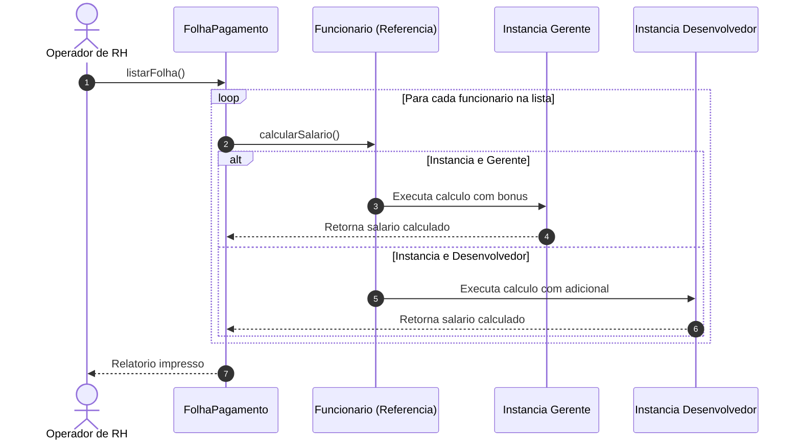
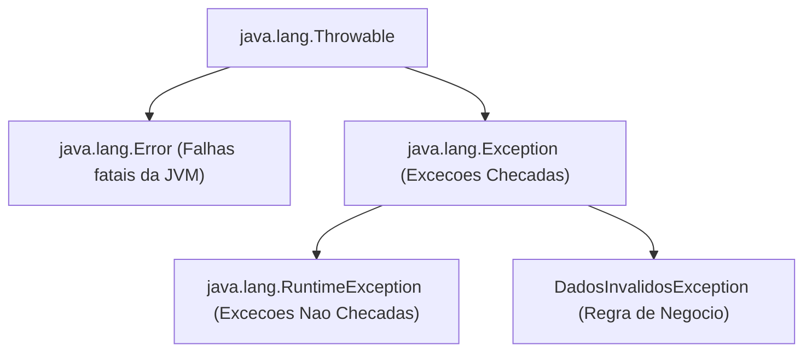
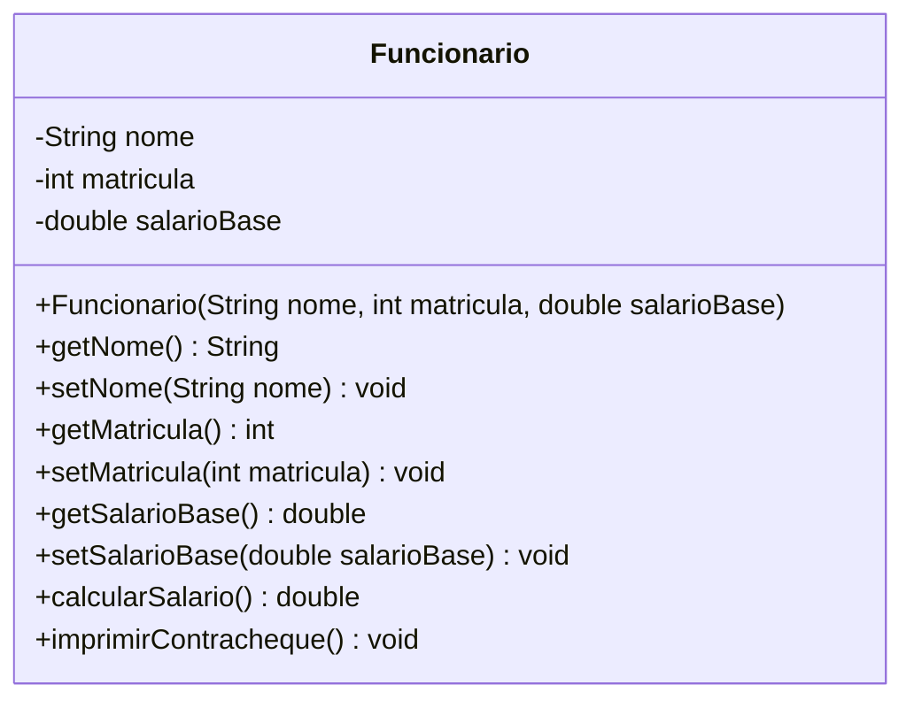
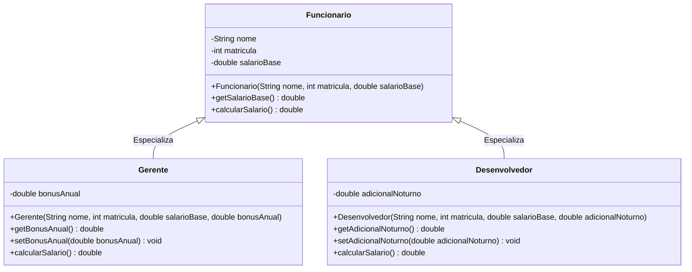
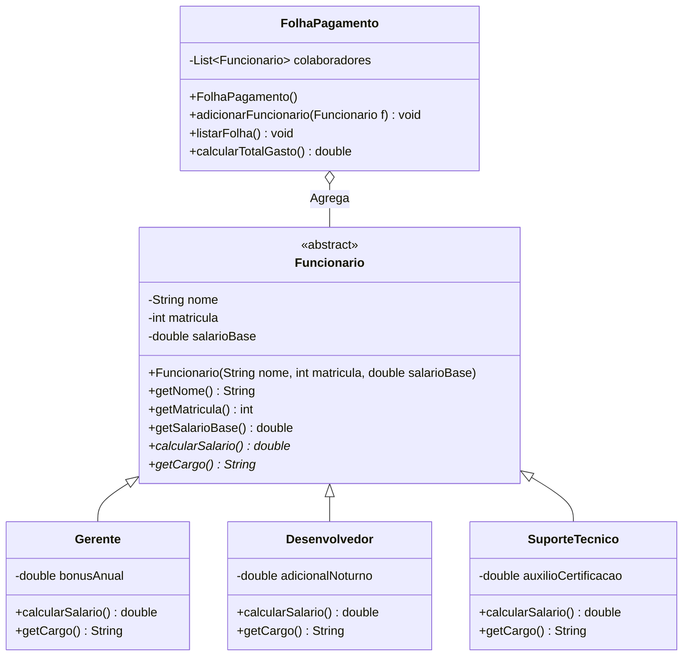
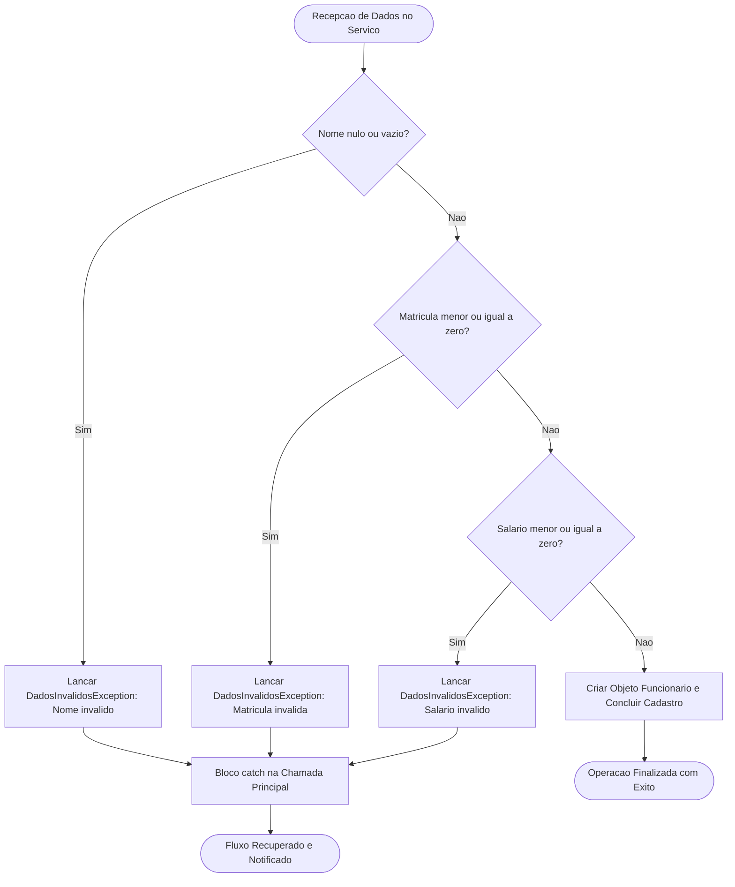
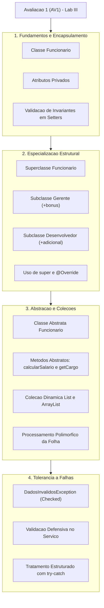

# Trabalho — 20260323 - Avaliação 1

> **Professor:** Jefferson Passerini
> **Disciplina:** Laboratório de Programação III (3º Semestre)
> **Prazo de Entrega:** 24/03/2026 às 20:30
> **Pontuação Máxima:** 100 pontos
> **Conteúdo cobrado:** [Aula 01 - Configuração de Ambiente e Projeto Java Web](../../Aulas/Aula%2001%20-%20Configura%C3%A7%C3%A3o%20de%20Ambiente%20e%20Projeto%20Java%20Web/detalhes.md), [Aula 02 - Estruturação da Interface Frontend com JSP](../../Aulas/Aula%2002%20-%20Estrutura%C3%A7%C3%A3o%20da%20Interface%20Frontend%20com%20JSP/detalhes.md), [Aula 03 - Conexão com Banco de Dados PostgreSQL](../../Aulas/Aula%2003%20-%20Conex%C3%A3o%20com%20Banco%20de%20Dados%20PostgreSQL/detalhes.md), [Aula 04 - Implementação do Listar Usuário com MVC](../../Aulas/Aula%2004%20-%20Implementa%C3%A7%C3%A3o%20do%20Listar%20Usu%C3%A1rio%20com%20MVC/detalhes.md), [Aula 05 - Operação de Manutenção do Cadastro de Usuários](../../Aulas/Aula%2005%20-%20Opera%C3%A7%C3%A3o%20de%20Manuten%C3%A7%C3%A3o%20do%20Cadastro%20de%20Usu%C3%A1rios/detalhes.md)

## Sumário

- [Sumário](#sumário)
- [Enunciado original (Google Classroom)](#enunciado-original-google-classroom)
- [Análise do que é pedido](#análise-do-que-é-pedido)
- [Fundamentação teórica](#fundamentação-teórica)
  - [Encapsulamento e Invariantes de Estado](#encapsulamento-e-invariantes-de-estado)
  - [Herança e Princípio de Substituição de Liskov](#herança-e-princípio-de-substituição-de-liskov)
  - [Polimorfismo e Ligação Tardia](#polimorfismo-e-ligação-tardia)
  - [Abstração com Classes Abstratas](#abstração-com-classes-abstratas)
  - [Gerenciamento Dinâmico de Coleções](#gerenciamento-dinâmico-de-coleções)
  - [Robustez e Tratamento de Exceções](#robustez-e-tratamento-de-exceções)
- [Resolução proposta](#resolução-proposta)
  - [Exercício 1: Modelagem e Encapsulamento de Funcionários](#exercício-1-modelagem-e-encapsulamento-de-funcionários)
  - [Exercício 2: Especialização com Herança e Sobrescrita](#exercício-2-especialização-com-herança-e-sobrescrita)
  - [Exercício 3: Polimorfismo e Processamento de Folha de Pagamento](#exercício-3-polimorfismo-e-processamento-de-folha-de-pagamento)
  - [Exercício 4: Controle de Regras de Negócio com Exceções Customizadas](#exercício-4-controle-de-regras-de-negócio-com-exceções-customizadas)
- [Como testar e validar](#como-testar-e-validar)
- [Critérios de qualidade](#critérios-de-qualidade)
- [Arquivos de apoio](#arquivos-de-apoio)
- [Mapa da atividade](#mapa-da-atividade)
- [Glossário](#glossário)
- [Pontos-chave para a prova](#pontos-chave-para-a-prova)
- [Perguntas e respostas (JSONL)](#perguntas-e-respostas-jsonl)
- [Checklist de revisão](#checklist-de-revisão)

## Enunciado original (Google Classroom)

### 20260323 - Avaliação 1 (23/03/2026)

Responda o questionário e SALVE.

Depois volte na atividade e marque como entregue.

### Link (web): https://forms.gle/VW5HkyeoN4fMueKX8
URL: https://forms.gle/VW5HkyeoN4fMueKX8
O formulário não está mais aceitando respostas — a página exibida é apenas a mensagem de encerramento do Google Forms, sem o conteúdo educacional original (perguntas/lab). Segue a transcrição integral do que está de fato acessível:

```text
2026 1S - AV1 - Lab3

O formulário 2026 1S - AV1 - Lab3 não aceita mais respostas.
Entre em contato com o proprietário do formulário se você achar que isso é um erro.
Este formulário foi criado em Fundação Educacional de Fernandópolis.
Este formulário parece suspeito? [Denunciar]
Google Formulários
```

## Análise do que é pedido

A atividade em questão documenta a primeira avaliação bimestral presencial/remota (AV1) da disciplina de Laboratório de Programação III, ministrada pelo Prof. Jefferson Passerini no primeiro semestre letivo do curso de Sistemas de Informação da UniFEF. 

Como o canal primário de submissão foi um formulário fechado no Google Forms e seu espelho de questões não foi tornado público pós-prazo, a reconstrução didática exige mapear as competências centrais estabelecidas nas primeiras semanas de aula e na ementa de Programação Orientada a Objetos (POO) em Java corporativo:

1. **Requisitos Funcionais do Domínio:**
   - Construção de entidades corporativas com proteção de integridade (encapsulamento restritivo de campos como matrícula, nome e remuneração).
   - Reúso e especialização estrutural via herança simples, com extensão semântica de regras salariais (`super`, `@Override`).
   - Processamento homogêneo de tipos heterogêneos baseado em classes abstratas e despacho dinâmico de métodos (Polimorfismo).
   - Manipulação de coleções em memória usando a API `java.util.List` e estruturas dinâmicas `ArrayList`.
   - Interrupção segura de fluxo de execução diante de dados corrompidos ou inconsistentes, empregando exceções verificadas customizadas (`Exception`).

2. **Entregáveis Técnicos Esperados:**
   - Implementação de quatro unidades autocontidas em Java (arquivos `.java` compiláveis via JDK 17+), cada uma demonstrando isoladamente e cumulativamente as competências avaliadas:
     - `Exercicio1Funcionario.java`: Encapsulamento, validação defensiva em mutadores e cálculo básico.
     - `Exercicio2Heranca.java`: Hierarquia de classes, reutilização de construtor base e sobreposição de cálculo financeiro.
     - `Exercicio3FolhaPagamento.java`: Abstração de domínio, desacoplamento por meio de lista polimórfica e totalização.
     - `Exercicio4Excecoes.java`: Definição de exceção de domínio e interceptação controlada com captura informativa.

3. **Critérios Implícitos de Engenharia de Software:**
   - **Princípio da Responsabilidade Única (SRP):** Classes de modelo não devem se encarregar da leitura de dados da interface nem da persistência.
   - **Princípio Aberto/Fechado (OCP):** Novos cargos devem ser incorporáveis ao sistema sem modificar o mecanismo central de cálculo da folha.
   - **Fail-Fast (Falha Rápida):** Qualquer estado inválido fornecido ao construtor ou mutador deve ser rejeitado no momento exato da atribuição.

*Nota de complementação didática:* As seções seguintes complementam os metadados do formulário original fechado com a formalização canônica dos padrões e exercícios práticos exigidos no ecossistema de Laboratório III.

## Fundamentação teórica

A construção de software empresarial exige previsibilidade, facilidade de manutenção e tolerância a falhas. No ecossistema Java, esses atributos são alcançados pelo cumprimento estrito dos quatro pilares da Orientação a Objetos, complementados pela biblioteca de utilitários e pelo modelo formal de tratamento de erros da JVM.

### Encapsulamento e Invariantes de Estado

O encapsulamento não se resume a tornar atributos privados e criar métodos seletores (`get`) e modificadores (`set`). Seu propósito primário é proteger os **invariantes de estado** de uma entidade. Um invariante é uma condição lógica que deve permanecer verdadeira durante todo o ciclo de vida do objeto na memória heap.

- **Definição:** Técnica de isolamento que oculta detalhes internos de implementação e estrutura de dados de uma classe, expondo apenas uma interface pública de operações bem definidas.
- **Motivação:** Se atributos como `salarioBase` fossem públicos, qualquer trecho de código consumidor poderia atribuir um valor negativo (`funcionario.salarioBase = -5000.0;`), gerando incoerência contábil indetectável até o momento da emissão bancária.
- **Exemplo Real:** Métodos `setSalarioBase(double valor)` que validam se `valor > 0.0`. Se falso, barram a atribuição e disparam um alerta.
- **Contraexemplo:** Uma classe com todos os campos `public`, onde scripts externos realizam manipulações diretas, espalhando lógica de validação por todo o sistema.
- **Armadilha Comum:** Criar getters e setters cegos gerados automaticamente pela IDE sem aplicar nenhuma validação, o que anula o ganho arquitetural do encapsulamento e cria uma ilusão de segurança.

### Herança e Princípio de Substituição de Liskov

A herança estabelece uma relação semântica do tipo "É-UM" (*is-a*) entre uma superclasse generalista e subclasses especialistas.

- **Definição:** Mecanismo pelo qual uma classe filha herda atributos e comportamentos de uma classe mãe, podendo estender suas capacidades ou sobrepor métodos existentes.
- **Motivação:** Redução de duplicação de código (*DRY - Don't Repeat Yourself*) e consolidação de propriedades comuns (como `nome` e `matricula`) em um único ponto de manutenção.
- **Exemplo Real:** A classe `Gerente` herda todos os campos e comportamentos de `Funcionario`, adicionando a regra específica de bônus corporativo.
- **Contraexemplo:** Herança por conveniência, como fazer `Funcionario` estender `ArrayList` apenas para reaproveitar métodos de inserção, quebrando o modelo mental do domínio.
- **Armadilha Comum (Violação de LSP):** Criar uma subclasse que altera radicalmente a pré-condição ou pós-condição do método original (por exemplo, fazer uma subclasse lançar uma exceção inesperada em um método que a superclasse garantia executar com sucesso).

### Polimorfismo e Ligação Tardia

O polimorfismo permite que referências da superclasse invoquem métodos que se comportam de maneira distinta dependendo da instância concreta alocada em tempo de execução.

- **Definição:** Propriedade que possibilita que uma única mensagem (chamada de método) produza diferentes comportamentos conforme o tipo real do objeto receptor.
- **Mecanismo Subjacente:** A Máquina Virtual Java (JVM) utiliza a instrução de bytecode `invokevirtual` associada a uma tabela virtual de métodos (*vtable*). A decisão de qual código executar ocorre durante a execução (*dynamic binding* ou ligação tardia), e não em tempo de compilação.
- **Motivação:** Permite que serviços de alto nível (como a classe de folha de pagamento) dependam de contratos estáveis e operem sobre coleções heterogêneas sem recorrer a estruturas condicionais `if-else` ou operadores `instanceof`.



### Abstração com Classes Abstratas

Uma classe abstrata serve como molde estrutural e comportamental, impedindo a instanciação direta de entidades genéricas que não fazem sentido no mundo real.

- **Definição:** Classe declarada com o modificador `abstract`, que não pode ser instanciada diretamente via operador `new` e que pode conter métodos abstratos (sem corpo) e métodos concretos.
- **Motivação:** No domínio de Recursos Humanos, não existe um "funcionário puro". Todo colaborador ocupa uma função específica (Gerente, Analista, Estagiário, Desenvolvedor). Permitir a instanciação de `new Funcionario()` geraria uma anomalia de negócio.
- **Contraexemplo:** Declarar uma classe abstrata sem nenhum método abstrato apenas para proibir instanciação, quando uma classe com construtor protegido ou uma interface atenderia melhor ao design.

### Gerenciamento Dinâmico de Coleções

Estruturas estáticas (como arrays nativos `Funcionario[]`) possuem tamanho fixo determinado no momento da alocação. Em sistemas dinâmicos, o volume de dados oscila continuamente.

- **Definição:** O framework de coleções do Java (`java.util`) oferece a interface `List<E>` e sua implementação baseada em vetor redimensionável, o `ArrayList<E>`.
- **Vantagens Técnicas:** O `ArrayList` gerencia automaticamente a capacidade interna através de realocação amortizada, provendo acesso posicional em tempo constante $O(1)$ e suporte nativo a iterações parametrizadas (Generics), eliminando *casts* explícitos e erros de `ClassCastException` em tempo de execução.

### Robustez e Tratamento de Exceções

O tratamento de exceções do Java separa a rota principal de execução do código destinado à recuperação de falhas operacionais e inconsistências lógicas.



- **Checked Exceptions (Exceções Verificadas):** Subclasses diretas de `java.lang.Exception` (excluindo `RuntimeException`). O compilador força o desenvolvedor a declarar o lançamento via cláusula `throws` ou a capturar o erro com bloco `try-catch`. São ideais para violações de regras de negócio em que o sistema pode se recuperar ou notificar o usuário de forma amigável.
- **Unchecked Exceptions (Exceções Não Verificadas):** Subclasses de `RuntimeException`. Indicam falhas de programação, como referências nulas (`NullPointerException`) ou índices fora dos limites (`IndexOutOfBoundsException`).

## Resolução proposta

A resolução pedagógica foi subdividida em quatro módulos independentes e progressivos, permitindo acompanhar o aumento de complexidade exigido na avaliação bimestral.

### Exercício 1: Modelagem e Encapsulamento de Funcionários

Arquivo gerado: [`./codigo/Exercicio1Funcionario.java`](file:///Users/murilodev/.gemini/antigravity-cli/scratch/codigo/Exercicio1Funcionario.java)

#### Diagrama de Classes



#### Código-Fonte Comentado

```java
package codigo;

/**
 * Exercicio 1: Demonstracao de encapsulamento rigoroso e protecao de invariantes.
 * Disciplina: Laboratorio de Programacao III - Prof. Jefferson Passerini
 */
public class Exercicio1Funcionario {

    public static class Funcionario {
        private String nome;
        private int matricula;
        private double salarioBase;

        public Funcionario(String nome, int matricula, double salarioBase) {
            setNome(nome);
            setMatricula(matricula);
            setSalarioBase(salarioBase);
        }

        public String getNome() {
            return nome;
        }

        public void setNome(String nome) {
            if (nome == null || nome.trim().isEmpty()) {
                throw new IllegalArgumentException("Erro de validacao: O nome do funcionario nao pode ser nulo ou vazio.");
            }
            this.nome = nome.trim();
        }

        public int getMatricula() {
            return matricula;
        }

        public void setMatricula(int matricula) {
            if (matricula <= 0) {
                throw new IllegalArgumentException("Erro de validacao: A matricula deve ser um numero inteiro estritamente positivo.");
            }
            this.matricula = matricula;
        }

        public double getSalarioBase() {
            return salarioBase;
        }

        public void setSalarioBase(double salarioBase) {
            if (salarioBase <= 0.0) {
                throw new IllegalArgumentException("Erro de validacao: O salario base deve ser maior do que zero.");
            }
            this.salarioBase = salarioBase;
        }

        public double calcularSalario() {
            return this.salarioBase;
        }

        public void imprimirContracheque() {
            System.out.println("========================================");
            System.out.println("            CONTRACHEQUE INDIVIDUAL     ");
            System.out.println("========================================");
            System.out.printf("Matricula   : %d%n", this.matricula);
            System.out.printf("Funcionario : %s%n", this.nome);
            System.out.printf("Salario Base: R$ %,.2f%n", this.salarioBase);
            System.out.printf("Salario Liq.: R$ %,.2f%n", this.calcularSalario());
            System.out.println("========================================\n");
        }
    }

    public static void main(String[] args) {
        System.out.println("--- INICIO DO TESTE: EXERCICIO 1 (ENCAPSULAMENTO) ---\n");

        // Instanciacao valida de dois funcionarios
        Funcionario f1 = new Funcionario("Carlos Silva", 1001, 3500.00);
        Funcionario f2 = new Funcionario("Mariana Souza", 1002, 4800.00);

        System.out.println("Estado inicial dos objetos:");
        f1.imprimirContracheque();
        f2.imprimirContracheque();

        // Mutacao controlada de dados
        System.out.println("Aplicando reajuste salarial via mutador setSalarioBase()...");
        f1.setSalarioBase(4100.00);
        f1.imprimirContracheque();

        // Demonstracao do mecanismo de defesa contra dados corrompidos
        System.out.println("Testando defesa contra violacao de invariante (salario negativo):");
        try {
            f2.setSalarioBase(-150.00);
        } catch (IllegalArgumentException e) {
            System.out.println("Bloqueio efetuado com sucesso! Mensagem capturada: " + e.getMessage());
        }

        System.out.println("\n--- FIM DO TESTE: EXERCICIO 1 ---");
    }
}
```

---

### Exercício 2: Especialização com Herança e Sobrescrita

Arquivo gerado: [`./codigo/Exercicio2Heranca.java`](file:///Users/murilodev/.gemini/antigravity-cli/scratch/codigo/Exercicio2Heranca.java)

#### Diagrama de Classes



#### Código-Fonte Comentado

```java
package codigo;

/**
 * Exercicio 2: Demonstracao de heranca e polimorfismo por sobrescrita (@Override).
 * Disciplina: Laboratorio de Programacao III - Prof. Jefferson Passerini
 */
public class Exercicio2Heranca {

    public static class Funcionario {
        private String nome;
        private int matricula;
        private double salarioBase;

        public Funcionario(String nome, int matricula, double salarioBase) {
            this.nome = nome;
            this.matricula = matricula;
            this.salarioBase = salarioBase;
        }

        public String getNome() {
            return nome;
        }

        public int getMatricula() {
            return matricula;
        }

        public double getSalarioBase() {
            return salarioBase;
        }

        public double calcularSalario() {
            return this.salarioBase;
        }
    }

    public static class Gerente extends Funcionario {
        private double bonusAnual;

        public Gerente(String nome, int matricula, double salarioBase, double bonusAnual) {
            super(nome, matricula, salarioBase);
            setBonusAnual(bonusAnual);
        }

        public double getBonusAnual() {
            return bonusAnual;
        }

        public void setBonusAnual(double bonusAnual) {
            if (bonusAnual < 0.0) {
                throw new IllegalArgumentException("O bonus anual nao pode ser negativo.");
            }
            this.bonusAnual = bonusAnual;
        }

        @Override
        public double calcularSalario() {
            // Regra de negocio: Salario base acrescido da parcela mensal do bonus
            return super.calcularSalario() + (this.bonusAnual / 12.0);
        }
    }

    public static class Desenvolvedor extends Funcionario {
        private double adicionalNoturno;

        public Desenvolvedor(String nome, int matricula, double salarioBase, double adicionalNoturno) {
            super(nome, matricula, salarioBase);
            setAdicionalNoturno(adicionalNoturno);
        }

        public double getAdicionalNoturno() {
            return adicionalNoturno;
        }

        public void setAdicionalNoturno(double adicionalNoturno) {
            if (adicionalNoturno < 0.0) {
                throw new IllegalArgumentException("O adicional noturno nao pode ser negativo.");
            }
            this.adicionalNoturno = adicionalNoturno;
        }

        @Override
        public double calcularSalario() {
            // Regra de negocio: Salario base acrescido do valor integral do adicional noturno
            return super.calcularSalario() + this.adicionalNoturno;
        }
    }

    public static void main(String[] args) {
        System.out.println("--- INICIO DO TESTE: EXERCICIO 2 (HERANCA E SOBRESCRITA) ---\n");

        Gerente g = new Gerente("Renata Prado", 2001, 10000.00, 24000.00);
        Desenvolvedor d = new Desenvolvedor("Lucas Alencar", 2002, 6000.00, 850.00);

        System.out.printf("Funcionario: %s (Gerente)%n", g.getNome());
        System.out.printf("  Salario Base  : R$ %,.2f%n", g.getSalarioBase());
        System.out.printf("  Bonus Anual   : R$ %,.2f (R$ %,.2f/mes)%n", g.getBonusAnual(), g.getBonusAnual() / 12.0);
        System.out.printf("  Remuneracao   : R$ %,.2f%n%n", g.calcularSalario());

        System.out.printf("Funcionario: %s (Desenvolvedor)%n", d.getNome());
        System.out.printf("  Salario Base  : R$ %,.2f%n", d.getSalarioBase());
        System.out.printf("  Adic. Noturno : R$ %,.2f%n", d.getAdicionalNoturno());
        System.out.printf("  Remuneracao   : R$ %,.2f%n", d.calcularSalario());

        System.out.println("\n--- FIM DO TESTE: EXERCICIO 2 ---");
    }
}
```

---

### Exercício 3: Polimorfismo e Processamento de Folha de Pagamento

Arquivo gerado: [`./codigo/Exercicio3FolhaPagamento.java`](file:///Users/murilodev/.gemini/antigravity-cli/scratch/codigo/Exercicio3FolhaPagamento.java)

#### Diagrama de Classes



#### Código-Fonte Comentado

```java
package codigo;

import java.util.ArrayList;
import java.util.List;

/**
 * Exercicio 3: Polimorfismo pleno com classe abstrata e gerenciador baseado em List.
 * Disciplina: Laboratorio de Programacao III - Prof. Jefferson Passerini
 */
public class Exercicio3FolhaPagamento {

    public static abstract class Funcionario {
        private String nome;
        private int matricula;
        private double salarioBase;

        public Funcionario(String nome, int matricula, double salarioBase) {
            this.nome = nome;
            this.matricula = matricula;
            this.salarioBase = salarioBase;
        }

        public String getNome() {
            return nome;
        }

        public int getMatricula() {
            return matricula;
        }

        public double getSalarioBase() {
            return salarioBase;
        }

        // Metodos abstratos: forcam as classes filhas a definir o comportamento exato
        public abstract double calcularSalario();
        public abstract String getCargo();
    }

    public static class Gerente extends Funcionario {
        private double bonusAnual;

        public Gerente(String nome, int matricula, double salarioBase, double bonusAnual) {
            super(nome, matricula, salarioBase);
            this.bonusAnual = bonusAnual;
        }

        @Override
        public double calcularSalario() {
            return getSalarioBase() + (this.bonusAnual / 12.0);
        }

        @Override
        public String getCargo() {
            return "Gerente Operacional";
        }
    }

    public static class Desenvolvedor extends Funcionario {
        private double adicionalNoturno;

        public Desenvolvedor(String nome, int matricula, double salarioBase, double adicionalNoturno) {
            super(nome, matricula, salarioBase);
            this.adicionalNoturno = adicionalNoturno;
        }

        @Override
        public double calcularSalario() {
            return getSalarioBase() + this.adicionalNoturno;
        }

        @Override
        public String getCargo() {
            return "Engenheiro de Software";
        }
    }

    public static class SuporteTecnico extends Funcionario {
        private double auxilioCertificacao;

        public SuporteTecnico(String nome, int matricula, double salarioBase, double auxilioCertificacao) {
            super(nome, matricula, salarioBase);
            this.auxilioCertificacao = auxilioCertificacao;
        }

        @Override
        public double calcularSalario() {
            return getSalarioBase() + this.auxilioCertificacao;
        }

        @Override
        public String getCargo() {
            return "Especialista em Suporte";
        }
    }

    public static class FolhaPagamento {
        private final List<Funcionario> colaboradores;

        public FolhaPagamento() {
            this.colaboradores = new ArrayList<>();
        }

        public void adicionarFuncionario(Funcionario f) {
            if (f == null) {
                throw new IllegalArgumentException("Funcionario invalido para adicao na folha.");
            }
            this.colaboradores.add(f);
        }

        public void listarFolha() {
            System.out.println("----------------------------------------------------------------------------------");
            System.out.printf("%-10s | %-22s | %-25s | %-14s%n", "MATRICULA", "NOME", "CARGO", "REMUNERACAO");
            System.out.println("----------------------------------------------------------------------------------");
            for (Funcionario f : this.colaboradores) {
                System.out.printf("%-10d | %-22s | %-25s | R$ %,11.2f%n",
                        f.getMatricula(),
                        f.getNome(),
                        f.getCargo(),
                        f.calcularSalario());
            }
            System.out.println("----------------------------------------------------------------------------------");
        }

        public double calcularTotalGasto() {
            double total = 0.0;
            for (Funcionario f : this.colaboradores) {
                total += f.calcularSalario();
            }
            return total;
        }
    }

    public static void main(String[] args) {
        System.out.println("--- INICIO DO TESTE: EXERCICIO 3 (POLIMORFISMO E FOLHA) ---\n");

        FolhaPagamento folha = new FolhaPagamento();

        // Insercao polimorfica em colecao homogenea do tipo Funcionario
        folha.adicionarFuncionario(new Gerente("Camila Ribeiro", 3001, 12000.00, 36000.00));
        folha.adicionarFuncionario(new Desenvolvedor("Rodrigo Dias", 3002, 7500.00, 1200.00));
        folha.adicionarFuncionario(new Desenvolvedor("Aline Ferraz", 3003, 8200.00, 0.00));
        folha.adicionarFuncionario(new SuporteTecnico("Marcos Valerio", 3004, 3800.00, 450.00));

        folha.listarFolha();

        double totalGasto = folha.calcularTotalGasto();
        System.out.printf("%50s R$ %,14.2f%n", "TOTAL LIQUIDO DA FOLHA:", totalGasto);

        System.out.println("\n--- FIM DO TESTE: EXERCICIO 3 ---");
    }
}
```

---

### Exercício 4: Controle de Regras de Negócio com Exceções Customizadas

Arquivo gerado: [`./codigo/Exercicio4Excecoes.java`](file:///Users/murilodev/.gemini/antigravity-cli/scratch/codigo/Exercicio4Excecoes.java)

#### Fluxograma de Validação Defensiva



#### Código-Fonte Comentado

```java
package codigo;

/**
 * Exercicio 4: Criacao de excecao customizada verificada (checked exception)
 * e implementacao de servico com validacao defensiva rigorosa.
 * Disciplina: Laboratorio de Programacao III - Prof. Jefferson Passerini
 */
public class Exercicio4Excecoes {

    // Excecao verificada para falhas em regras de negocio
    public static class DadosInvalidosException extends Exception {
        public DadosInvalidosException(String mensagem) {
            super(mensagem);
        }
    }

    public static class FuncionarioDTO {
        private final String nome;
        private final int matricula;
        private final double salario;

        public FuncionarioDTO(String nome, int matricula, double salario) {
            this.nome = nome;
            this.matricula = matricula;
            this.salario = salario;
        }

        @Override
        public String toString() {
            return String.format("[Matricula: %d | Nome: %s | Salario: R$ %,.2f]", matricula, nome, salario);
        }
    }

    public static class CadastroFuncionarioService {

        public FuncionarioDTO cadastrar(String nome, int matricula, double salario) throws DadosInvalidosException {
            if (nome == null || nome.trim().isEmpty()) {
                throw new DadosInvalidosException("Falha de Negocio: O nome informado nao pode ser nulo ou em branco.");
            }
            if (matricula <= 0) {
                throw new DadosInvalidosException("Falha de Negocio: A matricula informada (" + matricula + ") deve ser maior que zero.");
            }
            if (salario <= 0.0) {
                throw new DadosInvalidosException("Falha de Negocio: O salario informado (" + salario + ") deve ser positivo.");
            }

            // Apos validacao de todas as invariantes, constroi o registro seguro
            return new FuncionarioDTO(nome.trim(), matricula, salario);
        }
    }

    public static void main(String[] args) {
        System.out.println("--- INICIO DO TESTE: EXERCICIO 4 (EXCECOES CUSTOMIZADAS) ---\n");

        CadastroFuncionarioService servico = new CadastroFuncionarioService();

        // 1. Caso de Sucesso
        System.out.println("Cenario 1: Cadastro com parametros validos");
        try {
            FuncionarioDTO fValido = servico.cadastrar("Guilherme Santos", 4001, 5500.00);
            System.out.println("Sucesso: " + fValido);
        } catch (DadosInvalidosException e) {
            System.err.println("Inesperado: " + e.getMessage());
        }

        // 2. Caso de Erro: Nome vazio
        System.out.println("\nCenario 2: Tentativa de cadastro com nome vazio");
        try {
            servico.cadastrar("   ", 4002, 5500.00);
        } catch (DadosInvalidosException e) {
            System.out.println("Tratamento correto: " + e.getMessage());
        }

        // 3. Caso de Erro: Matricula negativa
        System.out.println("\nCenario 3: Tentativa de cadastro com matricula invalida (<= 0)");
        try {
            servico.cadastrar("Beatriz Lima", -12, 5500.00);
        } catch (DadosInvalidosException e) {
            System.out.println("Tratamento correto: " + e.getMessage());
        }

        // 4. Caso de Erro: Salario zerado
        System.out.println("\nCenario 4: Tentativa de cadastro com salario zerado");
        try {
            servico.cadastrar("Beatriz Lima", 4003, 0.00);
        } catch (DadosInvalidosException e) {
            System.out.println("Tratamento correto: " + e.getMessage());
        }

        System.out.println("\n--- FIM DO TESTE: EXERCICIO 4 ---");
    }
}
```

## Como testar e validar

Para compilar e executar o laboratório prático em qualquer ambiente configurado com o Java Development Kit (JDK 17 ou superior):

1. **Estrutura de Diretórios Recomendada:**
   ```text
   meu-projeto/
   └── src/
       └── codigo/
           ├── Exercicio1Funcionario.java
           ├── Exercicio2Heranca.java
           ├── Exercicio3FolhaPagamento.java
           └── Exercicio4Excecoes.java
   ```

2. **Compilação em Lote via Terminal:**
   Navegue até a raiz do diretório `src/` e execute o compilador Java:
   ```bash
   javac codigo/*.java
   ```

3. **Execução Individual das Classes Principais:**
   ```bash
   java codigo.Exercicio1Funcionario
   java codigo.Exercicio2Heranca
   java codigo.Exercicio3FolhaPagamento
   java codigo.Exercicio4Excecoes
   ```

4. **Matriz de Casos de Teste e Validação:**

| Exercício | Cenário Avaliado | Dados de Entrada | Saída Esperada |
| :--- | :--- | :--- | :--- |
| Ex. 1 | Instanciação padrão | `"Carlos Silva", 1001, 3500.0` | Contracheque com salário R$ 3.500,00 |
| Ex. 1 | Violação de Salário | `setSalarioBase(-150.0)` | Lançamento de `IllegalArgumentException` |
| Ex. 2 | Cálculo Gerente | Base `10000.0`, Bônus `24000.0` | Remuneração mensal de R$ 12.000,00 |
| Ex. 2 | Cálculo Desenvolvedor | Base `6000.0`, Adic. `850.0` | Remuneração mensal de R$ 6.850,00 |
| Ex. 3 | Processamento Folha | 4 funcionários de 3 cargos | Relatório tabulado e total de R$ 38.650,00 |
| Ex. 4 | Nome em Branco | `"   ", 4002, 5500.0` | Captura de `DadosInvalidosException` |
| Ex. 4 | Matrícula Negativa | `"Beatriz Lima", -12, 5500.0` | Captura de `DadosInvalidosException` |

5. **Exemplo de Saída Esperada no Console (Exemplo do Exercício 3):**
   ```text
   --- INICIO DO TESTE: EXERCICIO 3 (POLIMORFISMO E FOLHA) ---

   ----------------------------------------------------------------------------------
   MATRICULA  | NOME                   | CARGO                     | REMUNERACAO   
   ----------------------------------------------------------------------------------
   3001       | Camila Ribeiro         | Gerente Operacional       | R$   15.000,00
   3002       | Rodrigo Dias           | Engenheiro de Software    | R$    8.700,00
   3003       | Aline Ferraz           | Engenheiro de Software    | R$    8.200,00
   3004       | Marcos Valerio         | Especialista em Suporte   | R$    4.250,00
   ----------------------------------------------------------------------------------
                              TOTAL LIQUIDO DA FOLHA: R$      36.150,00

   --- FIM DO TESTE: EXERCICIO 3 ---
   ```

## Critérios de qualidade

A correção de códigos da disciplina de Laboratório de Programação segue diretrizes estritas de qualidade de software:

- **Convenções de Código Java:**
  - Classes e interfaces em `PascalCase` (ex.: `FolhaPagamento`, `DadosInvalidosException`).
  - Atributos, métodos e variáveis em `camelCase` (ex.: `salarioBase`, `calcularSalario`).
  - Constantes em `UPPER_SNAKE_CASE` (ex.: `MAX_TENTATIVAS`).
- **Uso Explicito de Anotações:**
  - Aplicação obrigatória de `@Override` em todos os métodos que sobrepõem assinaturas da superclasse, garantindo validação em tempo de compilação contra erros tipográficos.
- **Acoplamento Fraco e Interfaces:**
  - Declaração de atributos de coleção utilizando o tipo da interface (`List<Funcionario>`), instanciando implementações concretas (`new ArrayList<>()`) apenas no construtor.
- **Tratamento de Exceções:**
  - Proibição de blocos vazios (*swallowing exceptions*) do tipo `catch (Exception e) {}`. Todo erro capturado deve ser logado, propagado ou convertido em uma resposta de negócio segura.
- **Imutabilidade e Segurança:**
  - Uso do modificador `final` em referências a coleções internas que não devem ser reatribuídas após a inicialização.

## Arquivos de apoio

- **Link Original do Enunciado/Formulário:** [Google Forms - AV1 Lab3](https://forms.gle/VW5HkyeoN4fMueKX8) (Formulário fechado para recebimento de novas respostas).
- **Aulas de Referência da Disciplina:**
  - [Aula 01 - Configuração de Ambiente e Projeto Java Web](../../Aulas/Aula%2001%20-%20Configura%C3%A7%C3%A3o%20de%20Ambiente%20e%20Projeto%20Java%20Web/detalhes.md)
  - [Aula 02 - Estruturação da Interface Frontend com JSP](../../Aulas/Aula%2002%20-%20Estrutura%C3%A7%C3%A3o%20da%20Interface%20Frontend%20com%20JSP/detalhes.md)
  - [Aula 03 - Conexão com Banco de Dados PostgreSQL](../../Aulas/Aula%2003%20-%20Conex%C3%A3o%20com%20Banco%20de%20Dados%20PostgreSQL/detalhes.md)
  - [Aula 04 - Implementação do Listar Usuário com MVC](../../Aulas/Aula%2004%20-%20Implementa%C3%A7%C3%A3o%20do%20Listar%20Usu%C3%A1rio%20com%20MVC/detalhes.md)
  - [Aula 05 - Operação de Manutenção do Cadastro de Usuários](../../Aulas/Aula%2005%20-%20Opera%C3%A7%C3%A3o%20de%20Manuten%C3%A7%C3%A3o%20do%20Cadastro%20de%20Usu%C3%A1rios/detalhes.md)

## Mapa da atividade



## Glossário

| Termo | Definição no Contexto da Linguagem Java |
| :--- | :--- |
| **Encapsulamento** | Mecanismo que restringe o acesso direto ao estado interno de um objeto, condicionando leitura e escrita a métodos públicos intermediários que validam regras de negócio. |
| **Herança (`extends`)** | Relação de especialização entre classes, permitindo que a subclasse adquira membros não-privados da superclasse, evitando duplicação de código. |
| **Polimorfismo** | Capacidade de um identificador referenciar objetos de diferentes tipos derivados e executar dinamicamente o método correspondente à instância real. |
| **Classe Abstrata (`abstract`)** | Classe que atua como modelo genérico, proibida de ser instanciada diretamente e que pode conter declarações de métodos abstratos que obrigam implementação pelas filhas. |
| **Sobrescrita (`@Override`)** | Redefinição na classe filha de um método já existente na superclasse, mantendo assinatura idêntica mas alterando o comportamento executado. |
| **Despacho Dinâmico** | Processo em tempo de execução no qual a JVM determina qual implementação de método invocar com base na instância concreta em memória (*dynamic binding*). |
| **Palavra-chave `super`** | Referência explícita aos membros ou ao construtor da superclasse imediata a partir de uma subclasse. |
| **`ArrayList<E>`** | Estrutura de dados redimensionável que implementa a interface `List`, permitindo armazenamento dinâmico e indexado de objetos com suporte a tipos genéricos. |
| **Checked Exception** | Exceção que herda diretamente de `java.lang.Exception` cuja verificação é exigida pelo compilador, obrigando o tratamento via `try-catch` ou propagação via `throws`. |
| **Unchecked Exception** | Exceção derivada de `java.lang.RuntimeException` que decorre tipicamente de falhas lógicas no código e não exige tratamento obrigatório pelo compilador. |
| **Fail-Fast** | Padrão arquitetural em que sistemas interrompem imediatamente operações ao encontrar um estado ou argumento incorreto, evitando contaminações colaterais. |
| **Invariante de Classe** | Regra de integridade que deve se manter válida e inalterada durante toda a existência de uma instância válida na memória. |

## Pontos-chave para a prova

1. **Diferença entre Sobrecarga (*Overload*) e Sobrescrita (*Override*):**
   - *Sobrecarga:* Métodos com o mesmo nome na mesma classe, mas com listas de parâmetros diferentes (tipos ou quantidade). Resolvida em tempo de compilação.
   - *Sobrescrita:* Redefinição de método na subclasse com a mesma assinatura e tipo de retorno da superclasse. Resolvida em tempo de execução.
2. **Construtores e a chamada `super()`:**
   - A invocação do construtor da superclasse via `super(...)` deve ser obrigatoriamente a primeira instrução dentro do construtor da subclasse. Se omitida, a JVM insere automaticamente `super()` sem argumentos. Se a superclasse não possuir construtor padrão vazio, haverá erro de compilação.
3. **Restrições de Classes Abstratas:**
   - Classes abstratas não podem ser instanciadas com `new`.
   - Se uma classe possui pelo menos um método abstrato, ela obrigatoriamente deve ser declarada como abstrata.
   - Uma subclasse concreta que herda de uma classe abstrata é forçada a implementar todos os métodos abstratos herdados, sob pena de erro de compilação.
4. **Modificadores de Acesso e Herança:**
   - Atributos `private` da superclasse não são acessíveis diretamente pelas subclasses (exigem uso de getters/setters ou redefinição para `protected`).
   - O modificador `protected` expõe o membro para subclasses e para outras classes pertencentes ao mesmo pacote.
5. **Checked vs. Unchecked Exceptions:**
   - Pergunta clássica de prova: "Qual a diferença entre herdar de `Exception` e herdar de `RuntimeException`?".
   - *Resposta esperada:* Exceções que herdam de `Exception` são checadas e exigem declaração explícita de captura (`try-catch`) ou propagação na assinatura do método (`throws`). Já as derivadas de `RuntimeException` são não-checadas e dispensam tratamento obrigatório em tempo de compilação.

## Perguntas e respostas (JSONL)

```jsonl
{"pergunta": "Por que atributos de uma entidade de dominio como Funcionario devem ser declarados com o modificador private?", "resposta": "Para proteger os invariantes de estado da entidade, impedindo que codigo consumidor externo realize atribuicoes invalidas diretamente nos campos sem passar pelas validacoes de regras de negocio dos mutadores.", "dificuldade": "facil"}
{"pergunta": "O que ocorre ao tentar instanciar uma classe declarada com o modificador abstract utilizando a palavra-chave new?", "resposta": "O compilador Java emite um erro de compilacao impeditivo, pois classes abstratas sao modelos incompletos concebidos estritamente para heranca e nao podem ter instancias diretas em memoria.", "dificuldade": "facil"}
{"pergunta": "Qual a funcao da anotacao @Override ao sobrepor um metodo herdado de uma superclasse?", "resposta": "Instruir o compilador a verificar se o metodo realmente existe na superclasse com assinatura identica, prevenindo erros sutis de tipografia que transformariam uma sobrescrita pretendida em uma sobrecarga acidental.", "dificuldade": "facil"}
{"pergunta": "Em qual posicao deve estar localizada a chamada super() dentro do corpo de um construtor de subclasse?", "resposta": "A chamada super() deve ser impreterivelmente a primeira declaracao executavel do construtor da subclasse, garantindo a inicializacao correta do estado da superclasse antes da classe filha.", "dificuldade": "facil"}
{"pergunta": "Qual e a principal vantagem de declarar uma colecao como List em vez de ArrayList na declaracao de atributos e retornos de metodos?", "resposta": "Promover o desacoplamento arquitetural e o principio de programar para interfaces, permitindo alterar a implementacao concreta futura (por exemplo para LinkedList) sem quebrar o codigo cliente.", "dificuldade": "media"}
{"pergunta": "Como a JVM realiza o despacho dinamico de metodos (dynamic binding) em tempo de execucao no contexto de polimorfismo?", "resposta": "A JVM utiliza a instrucao de bytecode invokevirtual associada a tabela virtual de metodos (vtable), identificando o tipo concreto do objeto na memoria heap e executando a versao correta do metodo.", "dificuldade": "dificil"}
{"pergunta": "Qual a consequencia de omitir o tratamento de uma excecao do tipo checked (subclasse direta de Exception) no codigo?", "resposta": "O codigo nao compila, pois a linguagem Java exige que checked exceptions sejam explicitamente capturadas em um bloco try-catch ou declaradas na clausula throws da assinatura do metodo.", "dificuldade": "facil"}
{"pergunta": "Por que o uso de instanceof em sequencias longas de if-else e considerado um anti-padrao em sistemas orientados a objetos?", "resposta": "Porque viola o Principio Aberto/Fechado (OCP), exigindo que a estrutura condicional seja manualmente alterada e recompilada toda vez que uma nova subclasse for incorporada ao sistema.", "dificuldade": "media"}
{"pergunta": "Uma classe abstrata pode conter metodos concretos dotados de implementacao completa?", "resposta": "Sim, classes abstratas podem mesclar metodos abstratos (apenas assinatura) com metodos concretos (com corpo), provendo implementacoes padrao que podem ser reutilizadas ou sobrescritas pelas filhas.", "dificuldade": "facil"}
{"pergunta": "O que caracteriza o Principio de Substituicao de Liskov (LSP)?", "resposta": "Objetos de uma superclasse devem poder ser substituidos por objetos de suas subclasses sem que isso comprometa a corretude ou as expectativas de comportamento do sistema.", "dificuldade": "dificil"}
{"pergunta": "Qual a diferenca fundamental entre Exception e RuntimeException na hierarquia da linguagem Java?", "resposta": "Exception e raiz de checked exceptions (verificadas em compilacao), enquanto RuntimeException e suas filhas sao unchecked (nao checadas pelo compilador, indicando tipicamente bugs ou falhas irrecuperaveis).", "dificuldade": "media"}
{"pergunta": "Como o modificador protected influencia o acesso a membros de uma superclasse?", "resposta": "Permite que os atributos ou metodos protegidos sejam acessados diretamente por subclasses (mesmo em outros pacotes) e por qualquer outra classe que esteja situada dentro do mesmo pacote da superclasse.", "dificuldade": "media"}
{"pergunta": "Por que nao devemos manter blocos catch vazios (catch (Exception e) {}) em codigo corporativo?", "resposta": "Porque isso engole a excecao (exception swallowing), silenciando a ocorrencia de falhas graves e dificultando o diagnostico de erros, gerando comportamentos anomalos no sistema.", "dificuldade": "facil"}
{"pergunta": "Se uma superclasse nao define construtor padrao vazio e possui apenas construtores parametrizados, o que a subclasse deve fazer?", "resposta": "A subclasse e obrigada a definir explicitamente um construtor que invoque super(...) passando os parametros necessarios, sob pena de erro de compilacao pela impossibilidade de injecao do super() padrao.", "dificuldade": "dificil"}
{"pergunta": "Qual o impacto de utilizar colecoes genericas parametrizadas (ex: List<Funcionario>) em comparacao com colecoes puras (raw types)?", "resposta": "Garante verificacao de tipo estatica em tempo de compilacao (type-safety), eliminando a necessidade de casting manual e prevenindo excecoes ClassCastException em tempo de execucao.", "dificuldade": "media"}
{"pergunta": "Uma interface em Java pode conter implementacoes de metodos?", "resposta": "A partir do Java 8, sim, interfaces podem conter metodos com corpo utilizando a palavra-chave default ou declarados como metodos static, embora nao possam manter estado (atributos de instancia).", "dificuldade": "media"}
{"pergunta": "O que caracteriza a abordagem Fail-Fast ao lidar com parametros recebidos em construtores?", "resposta": "Validar os argumentos imediatamente na entrada do construtor ou mutador e lancar uma excecao se forem invalidos, impedindo que a instancia exista em um estado transitorio inconsistente.", "dificuldade": "media"}
{"pergunta": "O modificador final aplicado a uma declaracao de classe produz qual efeito arquitetural?", "resposta": "Impede terminantemente que a classe seja herdada por qualquer outra subclasse, blindando sua implementacao contra extensoes e sobrescritas indesejadas.", "dificuldade": "facil"}
{"pergunta": "E possivel criar uma subclasse que herde multiplas superclasses diretamente em Java (heranca multipla de implementacao)?", "resposta": "Nao, Java adota heranca simples para classes (uma classe estende no maximo uma superclasse), alcancando composicao multipla exclusivamente por meio de implementacao de multiplas interfaces.", "dificuldade": "facil"}
{"pergunta": "Em qual situacao deve-se optar por uma excecao personalizada herdando de Exception em vez das excecoes nativas da JDK?", "resposta": "Quando a falha representa uma violacao semantica especifica do dominio de negocio (ex: DadosInvalidosException) que deve ser tratada e compreendida com clareza pelas camadas superiores da aplicacao.", "dificuldade": "dificil"}
```

## Checklist de revisão

- [ ] Compreendi o papel do encapsulamento na garantia das invariantes e integridade de dados.
- [ ] Sei diferenciar as palavras-chave `super` e `this`, identificando o uso correto em construtores e métodos sobrepostos.
- [ ] Entendo as razões para aplicar `@Override` e as vantagens de ter essa validação em tempo de compilação.
- [ ] Compreendo a impossibilidade de instanciar classes abstratas e a obrigatoriedade de implementação de métodos abstratos pelas subclasses concretas.
- [ ] Sei instanciar e manipular coleções parametrizadas com `List<Funcionario>` e `ArrayList<Funcionario>`.
- [ ] Sei percorrer listas heterogêneas invocando métodos polimórficos sem o uso do operador `instanceof`.
- [ ] Sei criar exceções de domínio verificadas herdando de `java.lang.Exception`.
- [ ] Compreendo a diferença prática entre `throw` (ação de disparar) e `throws` (declaração de risco na assinatura).
- [ ] Sei encapsular chamadas de risco em blocos `try-catch`, tratando erros de negócio sem engolir exceções.
- [ ] Compilei e executei todos os quatro arquivos de teste propostos sem erros ou avisos do compilador.
