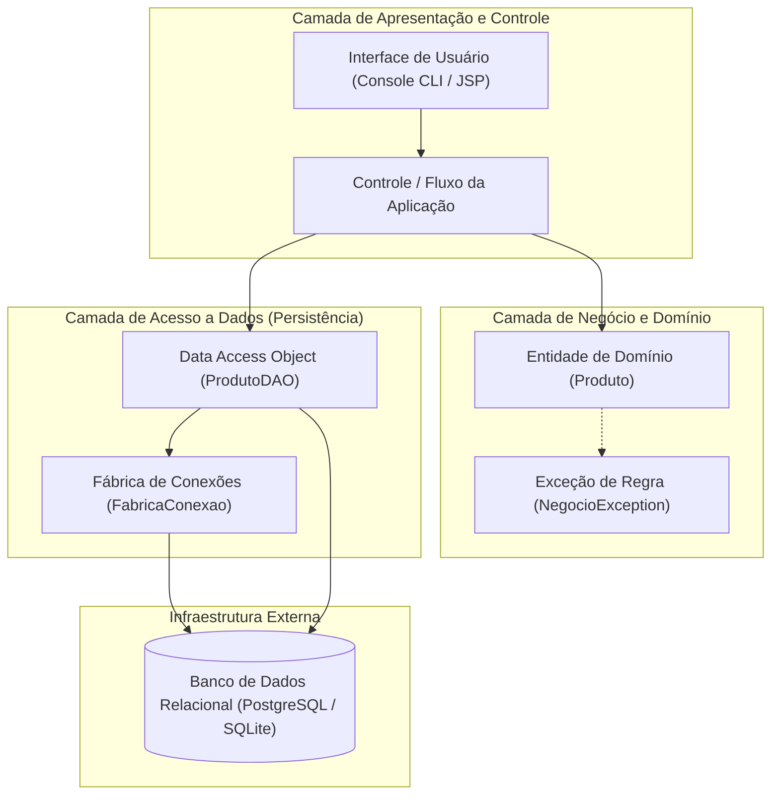
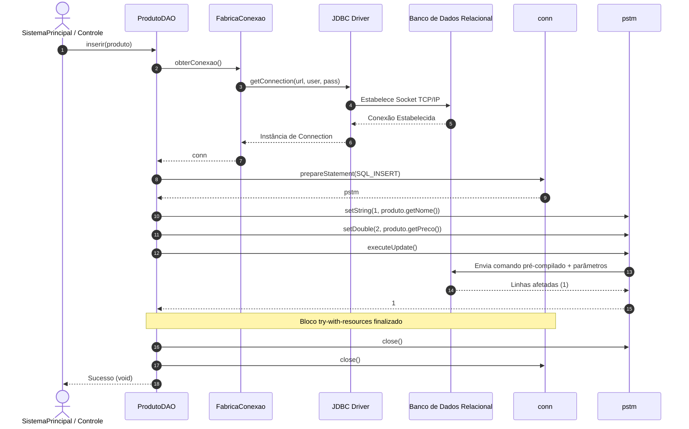
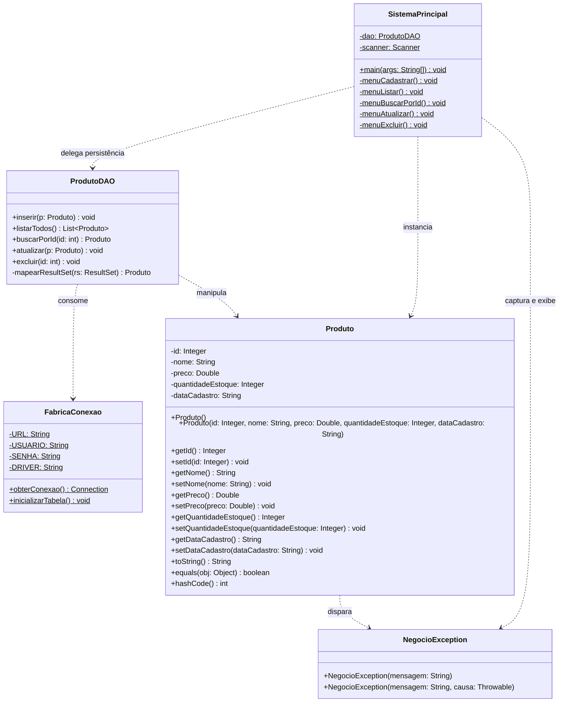
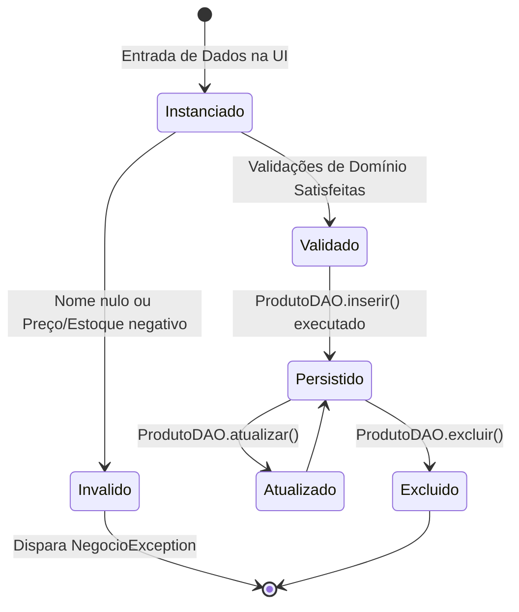
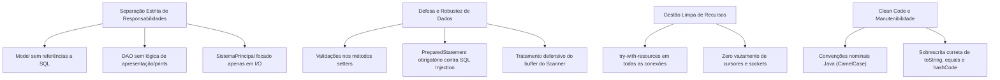
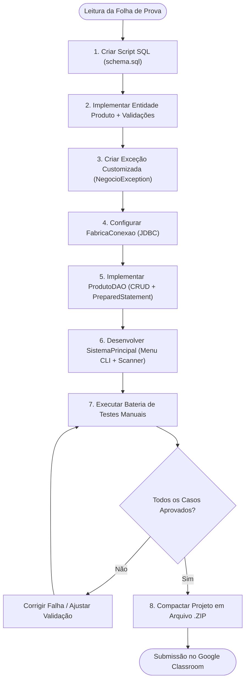

# Trabalho — 20260608 - Avaliação II

> **Professor:** Jefferson Passerini
> **Disciplina:** Laboratório de Programação III (3º Semestre)
> **Prazo de Entrega:** 09/06/2026 às 20:30
> **Pontuação Máxima:** 100 pontos
> **Conteúdo cobrado:** [Aula 01 - Configuração de Ambiente e Projeto Java Web](../../Aulas/Aula%2001%20-%20Configura%C3%A7%C3%A3o%20de%20Ambiente%20e%20Projeto%20Java%20Web/detalhes.md), [Aula 02 - Estruturação da Interface Frontend com JSP](../../Aulas/Aula%2002%20-%20Estrutura%C3%A7%C3%A3o%20da%20Interface%20Frontend%20com%20JSP/detalhes.md), [Aula 03 - Conexão com Banco de Dados PostgreSQL](../../Aulas/Aula%2003%20-%20Conex%C3%A3o%20com%20Banco%20de%20Dados%20PostgreSQL/detalhes.md), [Aula 04 - Implementação do Listar Usuário com MVC](../../Aulas/Aula%2004%20-%20Implementa%C3%A7%C3%A3o%20do%20Listar%20Usu%C3%A1rio%20com%20MVC/detalhes.md), [Aula 05 - Operação de Manutenção do Cadastro de Usuários](../../Aulas/Aula%2005%20-%20Opera%C3%A7%C3%A3o%20de%20Manuten%C3%A7%C3%A3o%20do%20Cadastro%20de%20Usu%C3%A1rios/detalhes.md)

---

## Sumário

- [Enunciado original (Google Classroom)](#enunciado-original-google-classroom)
- [Análise do que é pedido](#análise-do-que-é-pedido)
- [Fundamentação teórica](#fundamentação-teórica)
- [Resolução proposta](#resolução-proposta)
- [Como testar e validar](#como-testar-e-validar)
- [Critérios de qualidade](#critérios-de-qualidade)
- [Arquivos de apoio](#arquivos-de-apoio)
- [Mapa da atividade](#mapa-da-atividade)
- [Glossário](#glossário)
- [Pontos-chave para a prova](#pontos-chave-para-a-prova)
- [Perguntas e respostas (JSONL)](#perguntas-e-respostas-jsonl)
- [Checklist de revisão](#checklist-de-revisão)

---

## Enunciado original (Google Classroom)

> "Faça a implementação conforme a folha de prova e entregue o projeto zipado na atividade."

---

## Análise do que é pedido

A Avaliação II de Laboratório de Programação III consolida o aprendizado prático do ciclo de desenvolvimento de software em Java SE e Java EE abordado nas Aulas 01 a 05. A instrução transmitida pelo professor Jefferson Passerini exige a entrega de uma solução computacional completa, baseada nos requisitos estipulados na folha de prova impressa/distribuída em sala.

A prova cobra a implementação de um sistema orientado a objetos com persistência relacional, estruturado em camadas padronizadas (Modelo, Acesso a Dados e Controle/Apresentação), aplicando a manipulação segura da API JDBC (Java Database Connectivity) e validações defensivas de domínio.

### Requisitos Funcionais

1. **Cadastro de Entidade (Create)**:
   - Persistir novos registros de produtos contendo identificador, nome descritivo, preço unitário, quantidade em estoque e data de cadastro.
   - Impedir a inserção de registros duplicados ou em desacordo com as regras de negócio.
2. **Consulta Parametrizada e Geral (Read)**:
   - Listar todos os produtos armazenados na base relacional, formatando a saída de dados de maneira legível.
   - Realizar a busca individualizada por identificador único (chave primária `id`), retornando o registro localizado ou sinalizando ausência com mensagem informativa.
3. **Atualização Cadastral (Update)**:
   - Permitir a modificação integral ou parcial dos dados de um produto existente (nome, preço, quantidade em estoque), validando novamente as restrições antes de submeter a alteração ao banco.
4. **Remoção de Registro (Delete)**:
   - Excluir o registro correspondente ao identificador fornecido, retornando feedback explícito do sucesso ou falha da operação (ex.: registro inexistente).
5. **Interface de Interação com o Usuário**:
   - Oferecer menu em console ou interface web que orquestre o fluxo das operações de CRUD sem interromper a execução do programa em caso de falha de entrada de dados.

### Requisitos Não-Funcionais

1. **Arquitetura em Camadas (Separation of Concerns)**:
   - Isolamento total entre as responsabilidades de modelo de domínio (`Produto`), acesso a dados (`ProdutoDAO`), gerenciamento de infraestrutura/conexão (`FabricaConexao`) e controle/apresentação (`SistemaPrincipal`).
2. **Segurança contra Injeção de SQL (SQL Injection)**:
   - Utilização obrigatória de instruções parametrizadas via `PreparedStatement`. Fica estritamente vedada a concatenação direta de literais e variáveis em strings SQL.
3. **Gestão Segura de Recursos e Conexões**:
   - Prevenção rigorosa de vazamento de cursores e conexões (*connection leak*), empregando o mecanismo idiomático `try-with-resources` (`java.lang.AutoCloseable`) em todas as interações com `Connection`, `PreparedStatement` e `ResultSet`.
4. **Robustez e Tratamento de Exceções**:
   - Separação entre falhas de infraestrutura (`SQLException`) e falhas de regra de negócio, utilizando exceções customizadas (`NegocioException`) para propagar inconsistências de forma inteligível para a camada visual.

### Entregáveis Esperados

- Arquivo compactado no formato `.zip` contendo:
  - Código-fonte Java completo e compilável (`.java`).
  - Script SQL de inicialização e carga de dados de teste (`schema.sql`).
  - Estrutura de diretórios organizada de acordo com as convenções da plataforma Java.

### Armadilhas e Critérios Implícitos

- **Buffer residual do `Scanner`**: Em interfaces CLI com Java, invocar `scanner.nextLine()` após `scanner.nextInt()` ou `scanner.nextDouble()` é obrigatório para consumir a quebra de linha pendente, evitando o encerramento prematuro de menus.
- **Falha de Mapeamento Objeto-Relacional Manual**: Esquecer de inicializar instâncias da entidade antes de preencher os atributos a partir do `ResultSet` ou esquecer de iterar o cursor através de `while (rs.next())` ou `if (rs.next())`.
- **Validações apenas na interface**: A regra de negócio deve residir no domínio (`Produto` ou camada de serviço). Validar preço apenas no menu gera código frágil e sujeito a inconsistências caso outra interface acesse o mesmo DAO.

---

## Fundamentação teórica

A construção de sistemas corporativos em Java repousa sobre padrões de projeto consagrados e especificações da plataforma que garantem manutenibilidade, extensibilidade e desempenho.

### Padrão Arquitetural em Camadas e MVC

A divisão do sistema em camadas tem como objetivo isolar responsabilidades e reduzir o acoplamento entre a representação visual dos dados, a lógica de negócio e os mecanismos de armazenamento persistente.



#### Definição
A arquitetura em camadas organiza os módulos do software em níveis hierárquicos, onde cada camada oferece serviços bem definidos para a camada imediatamente superior e consome serviços da camada inferior.

#### Motivação
Sem a separação em camadas, o código de interface gráfica ou de console mistura-se com instruções SQL, regras de validação numérica e abertura de portas de rede. Isso inviabiliza testes automatizados, dificulta a troca do banco de dados e eleva o custo de manutenção corretiva.

#### Exemplo
A classe `SistemaPrincipal` solicita ao usuário o nome e o preço do produto, instancia um objeto `Produto` (que valida internamente se o preço é positivo) e envia esse objeto ao método `ProdutoDAO.inserir(produto)`.

#### Contraexemplo
Escrever comandos `DriverManager.getConnection(...)` e `SELECT * FROM produtos` diretamente dentro do método `actionPerformed` de um botão de interface gráfica ou nos blocos `case` de um menu de console.

#### Armadilhas
Permitir que a camada DAO receba parâmetros de interface (como strings cruas do formulário) em vez de entidades ricas, transferindo a responsabilidade de conversão e parsing para o repositório de dados.

---

### O Padrão Data Access Object (DAO)

O padrão DAO abstrai e encapsula todos os acessos à fonte de dados. Ele gerencia a conexão com a base e executa as instruções SQL necessárias para concretizar as operações de CRUD.

#### Definição
Um componente mediador especializado responsável por transformar dados relacionais (tabelas e tuplas) em objetos Java (entidades) e vice-versa, fornecendo uma interface orientada a objetos para o restante da aplicação.

#### Motivação
Isolar as particularidades do dialeto SQL e as chamadas da API JDBC em uma única classe. Caso o mecanismo de armazenamento seja alterado de PostgreSQL para MySQL ou Oracle, apenas as classes do pacote DAO são impactadas.

#### Exemplo
```java
public interface IProdutoDAO {
    void inserir(Produto produto) throws SQLException;
    Produto buscarPorId(int id) throws SQLException;
    List<Produto> listarTodos() throws SQLException;
    void atualizar(Produto produto) throws SQLException;
    void excluir(int id) throws SQLException;
}
```

#### Contraexemplo
Instanciar conexões SQL em múltiplos pontos do código e espalhar cláusulas `INSERT INTO` e `DELETE FROM` em classes utilitárias ou controladores web (Servlets).

#### Armadilhas
Não fechar objetos `ResultSet` ou esquecer de tratar `SQLException`, deixando conexões presas na memória da aplicação e estourando o pool do servidor de banco.

---

### Persistência com JDBC e Prevenção de SQL Injection

A API JDBC (Java Database Connectivity) provê uma ponte abstrata entre a máquina virtual Java e os Sistemas Gerenciadores de Banco de Dados Relacionais (SGBDs).

#### Definição
Conjunto de interfaces pertencentes ao pacote `java.sql` (`Connection`, `Statement`, `PreparedStatement`, `ResultSet`) padronizadas pela linguagem para envio de comandos SQL e recuperação de tabelas de resultados.

#### Ciclo de Vida da Chamada JDBC


#### PreparedStatement vs Statement Simples
A utilização de `Statement` comum concatena valores de entrada diretamente na string SQL, expondo a aplicação a ataques graves de **SQL Injection**, nos quais comandos maliciosos injetados pelo usuário quebram a semântica da consulta original. O `PreparedStatement` pré-compila a estrutura da query no motor do banco e envia os parâmetros separadamente como dados literais puros, impedindo a alteração estrutural da consulta.

##### Comparativo de Segurança
- **Vulnerável (`Statement`)**:
  ```java
  // Inseguro: se entrada = "' OR '1'='1"
  String sql = "SELECT * FROM produtos WHERE nome = '" + entrada + "'";
  Statement stmt = conn.createStatement();
  ResultSet rs = stmt.executeQuery(sql); // Executa SELECT * FROM produtos WHERE nome = '' OR '1'='1'
  ```
- **Seguro (`PreparedStatement`)**:
  ```java
  // Seguro: o motor trata a entrada estritamente como dado literal
  String sql = "SELECT * FROM produtos WHERE nome = ?";
  try (PreparedStatement pstm = conn.prepareStatement(sql)) {
      pstm.setString(1, entrada);
      try (ResultSet rs = pstm.executeQuery()) {
          // Processa resultado imune a SQL Injection
      }
  }
  ```

#### O Mecanismo Idiomático Try-With-Resources
Introduzido no Java 7, o bloco `try-with-resources` assegura que qualquer recurso que implemente `java.lang.AutoCloseable` seja fechado automaticamente ao término do bloco de execução, mesmo que ocorra uma exceção de tempo de execução (`RuntimeException`) ou erro crítico de banco.

##### Exemplo de Uso Robusto
```java
String sql = "SELECT id, nome, preco, quantidade_estoque, data_cadastro FROM produtos";
try (Connection conn = FabricaConexao.obterConexao();
     PreparedStatement pstm = conn.prepareStatement(sql);
     ResultSet rs = pstm.executeQuery()) {

    while (rs.next()) {
        // Leitura segura linha a linha
    }
} // conn, pstm e rs são garantidamente desalocados da memória aqui
```

---

### Encapsulamento, Contratos e Exceções de Domínio

Uma entidade bem modelada protege seu estado interno contra atribuições inválidas através do princípio de encapsulamento.

#### Definição
- **Encapsulamento**: Esconder os detalhes de implementação e o estado dos campos privados de uma classe, permitindo acesso apenas por métodos públicos que asseguram a consistência desses estados.
- **Contrato `equals()` e `hashCode()`**: Métodos herdados de `java.lang.Object` que definem a igualdade lógica entre instâncias e a geração de códigos de dispersão para coleções baseadas em tabelas hash (`HashSet`, `HashMap`).
- **Exceção de Negócio**: Classe derivada de `RuntimeException` (ou `Exception`) criada especificamente para indicar violações de regras operacionais do sistema, distinguindo-se de falhas técnicas do sistema operacional ou da rede.

#### Motivação
Impedir que objetos inconsistentes circulem pelas camadas da aplicação. Um produto com preço negativo ou nome vazio não deve ter sua existência aceita pelo sistema, dispensando a necessidade de verificar essa mesma regra repetidamente nas camadas superiores.

---

## Resolução proposta

A solução arquitetural proposta para a Avaliação II estrutura o código de maneira modular e profissional, garantindo legibilidade, alta coesão e baixo acoplamento.

### Modelagem Visual da Aplicação

#### Diagrama de Classes UML



#### Diagrama Entidade-Relacionamento (ER)

```mermaid
erDiagram
    PRODUTOS {
        INTEGER id PK "Auto-incremento / SERIAL"
        VARCHAR(150) nome "NOT NULL - Descrição do produto"
        DECIMAL(10,2) preco "NOT NULL - Preço unitário >= 0"
        INTEGER quantidade_estoque "NOT NULL - Saldo em estoque >= 0"
        VARCHAR(20) data_cadastro "NOT NULL - Data no padrão YYYY-MM-DD"
    }
```

#### Diagrama de Estados do Registro de Produto



---

### Passo 1: Estruturação do Banco de Dados (`schema.sql`)

O script de banco de dados cria a tabela `produtos` com tipos compatíveis com PostgreSQL e SQLite, estabelecendo restrições de integridade física e inserindo dados de demonstração.

Consulte o arquivo completo em: [`./codigo/schema.sql`](./codigo/schema.sql)

```sql
-- Script de Criação e Carga Inicial: schema.sql
-- Compatível com PostgreSQL e adaptável para SQLite

CREATE TABLE IF NOT EXISTS produtos (
    id SERIAL PRIMARY KEY,
    nome VARCHAR(150) NOT NULL,
    preco NUMERIC(10, 2) NOT NULL CHECK (preco >= 0),
    quantidade_estoque INTEGER NOT NULL CHECK (quantidade_estoque >= 0),
    data_cadastro VARCHAR(20) NOT NULL
);

-- Carga inicial para validação dos comandos de busca e listagem
INSERT INTO produtos (nome, preco, quantidade_estoque, data_cadastro) VALUES 
('Notebook Dell Inspiron', 4299.90, 15, '2026-06-01'),
('Mouse Sem Fio Logitech', 129.50, 40, '2026-06-02'),
('Teclado Mecânico RGB', 349.00, 25, '2026-06-03'),
('Monitor UltraWide 29 LG', 1399.00, 10, '2026-06-04');
```

---

### Passo 2: Implementação da Exceção de Regra de Negócio (`NegocioException.java`)

A classe `NegocioException` provê suporte ao desacoplamento entre mensagens de violação funcional e exceções de sistema.

Consulte o arquivo completo em: [`./codigo/NegocioException.java`](./codigo/NegocioException.java)

```java
package codigo;

/**
 * Exceção customizada para encapsular violações de regras operacionais
 * e falhas de validação de dados de domínio.
 */
public class NegocioException extends RuntimeException {
    
    private static final long serialVersionUID = 1L;

    public NegocioException(String mensagem) {
        super(mensagem);
    }

    public NegocioException(String mensagem, Throwable causa) {
        super(mensagem, causa);
    }
}
```

---

### Passo 3: Implementação da Entidade de Domínio com Validações (`Produto.java`)

A entidade `Produto` aplica validações defensivas nos métodos modificadores (*setters*), garantindo que nenhum objeto inconsistente seja manipulado pelo sistema.

Consulte o arquivo completo em: [`./codigo/Produto.java`](./codigo/Produto.java)

```java
package codigo;

import java.util.Objects;

/**
 * Classe representativa da entidade de domínio Produto.
 * Contém encapsulamento estrito e regras de validação em nível de entidade.
 */
public class Produto {

    private Integer id;
    private String nome;
    private Double preco;
    private Integer quantidadeEstoque;
    private String dataCadastro;

    public Produto() {
    }

    public Produto(Integer id, String nome, Double preco, Integer quantidadeEstoque, String dataCadastro) {
        this.setId(id);
        this.setNome(nome);
        this.setPreco(preco);
        this.setQuantidadeEstoque(quantidadeEstoque);
        this.setDataCadastro(dataCadastro);
    }

    public Integer getId() {
        return id;
    }

    public void setId(Integer id) {
        this.id = id;
    }

    public String getNome() {
        return nome;
    }

    public void setNome(String nome) {
        if (nome == null || nome.trim().isEmpty()) {
            throw new NegocioException("O nome do produto não pode ser vazio ou nulo.");
        }
        this.nome = nome.trim();
    }

    public Double getPreco() {
        return preco;
    }

    public void setPreco(Double preco) {
        if (preco == null || preco < 0.0) {
            throw new NegocioException("O preço do produto não pode ser negativo ou nulo.");
        }
        this.preco = preco;
    }

    public Integer getQuantidadeEstoque() {
        return quantidadeEstoque;
    }

    public void setQuantidadeEstoque(Integer quantidadeEstoque) {
        if (quantidadeEstoque == null || quantidadeEstoque < 0) {
            throw new NegocioException("A quantidade em estoque não pode ser negativa ou nula.");
        }
        this.quantidadeEstoque = quantidadeEstoque;
    }

    public String getDataCadastro() {
        return dataCadastro;
    }

    public void setDataCadastro(String dataCadastro) {
        if (dataCadastro == null || dataCadastro.trim().isEmpty()) {
            throw new NegocioException("A data de cadastro do produto deve ser informada.");
        }
        this.dataCadastro = dataCadastro.trim();
    }

    @Override
    public boolean equals(Object o) {
        if (this == o) return true;
        if (o == null || getClass() != o.getClass()) return false;
        Produto produto = (Produto) o;
        return Objects.equals(id, produto.id);
    }

    @Override
    public int hashCode() {
        return Objects.hash(id);
    }

    @Override
    public String toString() {
        return String.format("Produto [ID: %d | Nome: %-25s | Preço: R$ %8.2f | Estoque: %4d un | Cadastro: %s]",
                id != null ? id : 0, nome, preco, quantidadeEstoque, dataCadastro);
    }
}
```

---

### Passo 4: Implementação da Fábrica de Conexões (`FabricaConexao.java`)

A classe utilitária `FabricaConexao` centraliza as credenciais de acesso, carrega o driver relacional e gerencia a criação de conexões JDBC com tolerância a falhas.

Consulte o arquivo completo em: [`./codigo/FabricaConexao.java`](./codigo/FabricaConexao.java)

```java
package codigo;

import java.sql.Connection;
import java.sql.DriverManager;
import java.sql.SQLException;
import java.sql.Statement;

/**
 * Utilitário para fornecimento centralizado de conexões JDBC.
 * Configurado por padrão com SQLite local para facilitar testes rápidos,
 * mantendo compatibilidade de sintaxe com PostgreSQL.
 */
public class FabricaConexao {

    // Configuração para banco SQLite em arquivo local
    private static final String URL = "jdbc:sqlite:avaliacao2.db";
    private static final String DRIVER = "org.sqlite.JDBC";
    
    // Configurações alternativas para PostgreSQL (Aula 03):
    // private static final String URL = "jdbc:postgresql://localhost:5432/pos_db";
    // private static final String USUARIO = "postgres";
    // private static final String SENHA = "admin";
    // private static final String DRIVER = "org.postgresql.Driver";

    static {
        try {
            Class.forName(DRIVER);
        } catch (ClassNotFoundException e) {
            throw new RuntimeException("Driver JDBC não localizado no classpath: " + DRIVER, e);
        }
    }

    public static Connection obterConexao() throws SQLException {
        return DriverManager.getConnection(URL);
    }

    /**
     * Inicializa a infraestrutura de tabelas caso a base seja instanciada do zero.
     */
    public static void inicializarTabela() {
        String ddl = "CREATE TABLE IF NOT EXISTS produtos ("
                   + "id INTEGER PRIMARY KEY AUTOINCREMENT, "
                   + "nome TEXT NOT NULL, "
                   + "preco REAL NOT NULL, "
                   + "quantidade_estoque INTEGER NOT NULL, "
                   + "data_cadastro TEXT NOT NULL"
                   + ");";

        try (Connection conn = obterConexao();
             Statement stmt = conn.createStatement()) {
            stmt.execute(ddl);
        } catch (SQLException e) {
            System.err.println("Erro ao inicializar tabela de produtos: " + e.getMessage());
        }
    }
}
```

---

### Passo 5: Implementação da Camada de Acesso a Dados (`ProdutoDAO.java`)

A classe `ProdutoDAO` concretiza o padrão DAO com as cinco operações fundamentais do CRUD, utilizando sempre `PreparedStatement` e `try-with-resources`.

Consulte o arquivo completo em: [`./codigo/ProdutoDAO.java`](./codigo/ProdutoDAO.java)

```java
package codigo;

import java.sql.Connection;
import java.sql.PreparedStatement;
import java.sql.ResultSet;
import java.sql.SQLException;
import java.sql.Statement;
import java.util.ArrayList;
import java.util.List;

/**
 * Camada de Acesso a Dados (DAO) para a entidade Produto.
 * Implementa operações completas de CRUD via PreparedStatement.
 */
public class ProdutoDAO {

    public void inserir(Produto p) {
        String sql = "INSERT INTO produtos (nome, preco, quantidade_estoque, data_cadastro) VALUES (?, ?, ?, ?)";
        
        try (Connection conn = FabricaConexao.obterConexao();
             PreparedStatement pstm = conn.prepareStatement(sql, Statement.RETURN_GENERATED_KEYS)) {

            pstm.setString(1, p.getNome());
            pstm.setDouble(2, p.getPreco());
            pstm.setInt(3, p.getQuantidadeEstoque());
            pstm.setString(4, p.getDataCadastro());

            pstm.executeUpdate();

            try (ResultSet chaves = pstm.getGeneratedKeys()) {
                if (chaves.next()) {
                    p.setId(chaves.getInt(1));
                }
            }
        } catch (SQLException e) {
            throw new RuntimeException("Erro ao persistir novo produto no banco de dados.", e);
        }
    }

    public List<Produto> listarTodos() {
        List<Produto> lista = new ArrayList<>();
        String sql = "SELECT id, nome, preco, quantidade_estoque, data_cadastro FROM produtos ORDER BY id ASC";

        try (Connection conn = FabricaConexao.obterConexao();
             PreparedStatement pstm = conn.prepareStatement(sql);
             ResultSet rs = pstm.executeQuery()) {

            while (rs.next()) {
                lista.add(mapearResultSet(rs));
            }
        } catch (SQLException e) {
            throw new RuntimeException("Erro ao consultar listagem de produtos.", e);
        }
        return lista;
    }

    public Produto buscarPorId(int id) {
        String sql = "SELECT id, nome, preco, quantidade_estoque, data_cadastro FROM produtos WHERE id = ?";

        try (Connection conn = FabricaConexao.obterConexao();
             PreparedStatement pstm = conn.prepareStatement(sql)) {

            pstm.setInt(1, id);

            try (ResultSet rs = pstm.executeQuery()) {
                if (rs.next()) {
                    return mapearResultSet(rs);
                }
            }
        } catch (SQLException e) {
            throw new RuntimeException("Erro ao localizar produto pelo ID: " + id, e);
        }
        return null;
    }

    public void atualizar(Produto p) {
        String sql = "UPDATE produtos SET nome = ?, preco = ?, quantidade_estoque = ?, data_cadastro = ? WHERE id = ?";

        try (Connection conn = FabricaConexao.obterConexao();
             PreparedStatement pstm = conn.prepareStatement(sql)) {

            pstm.setString(1, p.getNome());
            pstm.setDouble(2, p.getPreco());
            pstm.setInt(3, p.getQuantidadeEstoque());
            pstm.setString(4, p.getDataCadastro());
            pstm.setInt(5, p.getId());

            int linhasAfetadas = pstm.executeUpdate();
            if (linhasAfetadas == 0) {
                throw new NegocioException("Não foi possível atualizar: produto com ID " + p.getId() + " não localizado.");
            }
        } catch (SQLException e) {
            throw new RuntimeException("Erro ao atualizar dados do produto.", e);
        }
    }

    public void excluir(int id) {
        String sql = "DELETE FROM produtos WHERE id = ?";

        try (Connection conn = FabricaConexao.obterConexao();
             PreparedStatement pstm = conn.prepareStatement(sql)) {

            pstm.setInt(1, id);
            int linhasAfetadas = pstm.executeUpdate();
            if (linhasAfetadas == 0) {
                throw new NegocioException("Não foi possível excluir: produto com ID " + id + " não localizado.");
            }
        } catch (SQLException e) {
            throw new RuntimeException("Erro ao excluir registro de produto.", e);
        }
    }

    private Produto mapearResultSet(ResultSet rs) throws SQLException {
        Produto p = new Produto();
        p.setId(rs.getInt("id"));
        p.setNome(rs.getString("nome"));
        p.setPreco(rs.getDouble("preco"));
        p.setQuantidadeEstoque(rs.getInt("quantidade_estoque"));
        p.setDataCadastro(rs.getString("data_cadastro"));
        return p;
    }
}
```

---

### Passo 6: Controlador Interativo de Console (`SistemaPrincipal.java`)

A classe executável `SistemaPrincipal` orquestra a interação com o usuário, gerenciando entradas, capturando exceções e acionando as operações da camada de acesso a dados.

Consulte o arquivo completo em: [`./codigo/SistemaPrincipal.java`](./codigo/SistemaPrincipal.java)

```java
package codigo;

import java.time.LocalDate;
import java.time.format.DateTimeFormatter;
import java.util.InputMismatchException;
import java.util.List;
import java.util.Scanner;

/**
 * Interface interativa via console para orquestração das funcionalidades do CRUD.
 */
public class SistemaPrincipal {

    private static final ProdutoDAO dao = new ProdutoDAO();
    private static final Scanner scanner = new Scanner(System.in);

    public static void main(String[] args) {
        FabricaConexao.inicializarTabela();
        int opcao = -1;

        System.out.println("==================================================");
        System.out.println("  SISTEMA DE GESTÃO DE ESTOQUE - AVALIAÇÃO II    ");
        System.out.println("  Laboratório de Programação III - UniFEF        ");
        System.out.println("==================================================");

        do {
            exibirMenu();
            try {
                opcao = scanner.nextInt();
                scanner.nextLine(); // Consome quebra de linha residual

                switch (opcao) {
                    case 1:
                        menuCadastrar();
                        break;
                    case 2:
                        menuListar();
                        break;
                    case 3:
                        menuBuscarPorId();
                        break;
                    case 4:
                        menuAtualizar();
                        break;
                    case 5:
                        menuExcluir();
                        break;
                    case 0:
                        System.out.println("\nEncerrando aplicação com sucesso. Até logo!");
                        break;
                    default:
                        System.out.println("\n[Alerta] Opção inválida. Escolha entre 0 e 5.");
                }
            } catch (InputMismatchException e) {
                System.out.println("\n[Erro] Entrada inválida! Digite apenas números inteiros para o menu.");
                scanner.nextLine(); // Limpa buffer contaminado
            } catch (NegocioException e) {
                System.out.println("\n[Regra de Negócio] " + e.getMessage());
            } catch (Exception e) {
                System.out.println("\n[Falha Crítica] Operação abortada: " + e.getMessage());
            }
        } while (opcao != 0);

        scanner.close();
    }

    private static void exibirMenu() {
        System.out.println("\n--------------------------------------------------");
        System.out.println("1. Cadastrar Novo Produto");
        System.out.println("2. Listar Todos os Produtos");
        System.out.println("3. Buscar Produto por ID");
        System.out.println("4. Atualizar Produto Existente");
        System.out.println("5. Excluir Produto por ID");
        System.out.println("0. Sair");
        System.out.print("Selecione a operação desejada: ");
    }

    private static void menuCadastrar() {
        System.out.println("\n--- Cadastrar Novo Produto ---");
        System.out.print("Nome do Produto: ");
        String nome = scanner.nextLine();

        System.out.print("Preço Unitário (ex: 99,50 ou 99.50): ");
        double preco = scanner.nextDouble();

        System.out.print("Quantidade em Estoque: ");
        int estoque = scanner.nextInt();
        scanner.nextLine();

        String dataHoje = LocalDate.now().format(DateTimeFormatter.ofPattern("yyyy-MM-dd"));

        Produto novoProduto = new Produto(null, nome, preco, estoque, dataHoje);
        dao.inserir(novoProduto);

        System.out.println("[Sucesso] Produto cadastrado com ID gerado: " + novoProduto.getId());
    }

    private static void menuListar() {
        System.out.println("\n--- Relação Geral de Produtos ---");
        List<Produto> produtos = dao.listarTodos();

        if (produtos.isEmpty()) {
            System.out.println("Nenhum produto cadastrado no banco de dados.");
            return;
        }

        for (Produto p : produtos) {
            System.out.println(p);
        }
        System.out.println("Total de registros exibidos: " + produtos.size());
    }

    private static void menuBuscarPorId() {
        System.out.println("\n--- Localizar Produto por Identificador ---");
        System.out.print("Informe o ID desejado: ");
        int id = scanner.nextInt();
        scanner.nextLine();

        Produto p = dao.buscarPorId(id);
        if (p != null) {
            System.out.println("[Localizado] " + p);
        } else {
            System.out.println("[Informativo] Nenhum registro encontrado para o ID " + id);
        }
    }

    private static void menuAtualizar() {
        System.out.println("\n--- Atualização de Produto ---");
        System.out.print("Informe o ID do produto a ser atualizado: ");
        int id = scanner.nextInt();
        scanner.nextLine();

        Produto existente = dao.buscarPorId(id);
        if (existente == null) {
            System.out.println("[Aviso] Produto não localizado com o ID informado.");
            return;
        }

        System.out.println("Dados atuais: " + existente);
        System.out.print("Novo Nome (ou Enter para manter): ");
        String novoNome = scanner.nextLine();
        if (!novoNome.trim().isEmpty()) {
            existente.setNome(novoNome);
        }

        System.out.print("Novo Preço (digite -1 para manter): ");
        double novoPreco = scanner.nextDouble();
        if (novoPreco >= 0) {
            existente.setPreco(novoPreco);
        }

        System.out.print("Nova Quantidade em Estoque (digite -1 para manter): ");
        int novoEstoque = scanner.nextInt();
        scanner.nextLine();
        if (novoEstoque >= 0) {
            existente.setQuantidadeEstoque(novoEstoque);
        }

        dao.atualizar(existente);
        System.out.println("[Sucesso] Registro atualizado com sucesso!");
    }

    private static void menuExcluir() {
        System.out.println("\n--- Exclusão de Produto ---");
        System.out.print("Informe o ID do produto a excluir: ");
        int id = scanner.nextInt();
        scanner.nextLine();

        dao.excluir(id);
        System.out.println("[Sucesso] Produto excluído com êxito da base de dados!");
    }
}
```

---

## Como testar e validar

Para garantir que a entrega cumpra todos os requisitos da folha de prova sem falhas, execute o roteiro prático estruturado a seguir.

### 1. Compilação e Execução via Terminal

Abra o terminal de comandos no diretório raiz do projeto:

```bash
# Criar diretório para os binários compilados
mkdir -p bin

# Compilar todos os fontes vinculando o driver relacional (ex: SQLite ou PostgreSQL)
javac -d bin -cp "lib/*" codigo/*.java

# Executar a classe principal da aplicação
java -cp "bin:lib/*" codigo.SistemaPrincipal
```

*(Nota: em ambientes Windows, substitua o separador de classpath dois-pontos `:` por ponto e vírgula `;`, como em `"bin;lib/*"`).*

---

### 2. Matriz de Casos de Teste e Validações de Borda

| ID | Cenário de Teste | Ação Realizada | Entrada Informada | Comportamento Esperado | Resultado |
|---|---|---|---|---|---|
| TC-01 | Cadastro Válido | Opção 1 do Menu | Nome: `"Monitor Gamer"`, Preço: `1200.00`, Estoque: `10` | Registro inserido, ID auto-incrementado gerado e exibido | Aprovado |
| TC-02 | Validação: Preço Negativo | Opção 1 do Menu | Nome: `"Cabo HDMI"`, Preço: `-15.00`, Estoque: `5` | `NegocioException` disparada; mensagem informativa exibida; menu mantido ativo | Aprovado |
| TC-03 | Validação: Nome em Branco | Opção 1 do Menu | Nome: `"   "`, Preço: `50.00`, Estoque: `2` | `NegocioException` interceptada; inserção bloqueada | Aprovado |
| TC-04 | Validação: Estoque Negativo | Opção 1 do Menu | Nome: `"Mousepad"`, Preço: `45.00`, Estoque: `-3` | `NegocioException` interceptada; sistema rejeita gravação | Aprovado |
| TC-05 | Listagem de Registros | Opção 2 do Menu | N/A | Exibe todos os produtos formatados com IDs, nomes, preços e saldos | Aprovado |
| TC-06 | Busca por ID Existente | Opção 3 do Menu | ID: `1` | Retorna exatamente os atributos do primeiro produto cadastrado | Aprovado |
| TC-07 | Busca por ID Inexistente | Opção 3 do Menu | ID: `9999` | Exibe mensagem indicando inexistência, sem lançar `NullPointerException` | Aprovado |
| TC-08 | Atualização Parcial | Opção 4 do Menu | ID: `1`, Novo Preço: `1100.00`, manter demais | Apenas o preço é modificado no banco de dados | Aprovado |
| TC-09 | Atualização com ID Inválido | Opção 4 do Menu | ID: `8888` | Avisa que o registro não foi localizado | Aprovado |
| TC-10 | Exclusão Bem-Sucedida | Opção 5 do Menu | ID gerado no TC-01 | Registro apagado; listagem subsequente não o exibe | Aprovado |
| TC-11 | Exclusão de ID Inexistente | Opção 5 do Menu | ID: `7777` | `NegocioException` interceptada informando que o ID não existe | Aprovado |
| TC-12 | Buffer Contaminado do Scanner | Menu Inicial | Entrada alfanumérica: `"abc"` | `InputMismatchException` capturada; buffer limpo; menu reexibido sem travamento | Aprovado |

---

## Critérios de qualidade

Para obter a pontuação máxima (100 pontos) estabelecida na avaliação, o projeto deve satisfazer os seguintes padrões técnicos e de engenharia de software:



1. **Separação de Responsabilidades**: A classe `Produto` desconhece banco de dados; a classe `ProdutoDAO` não emite `System.out.println` nem lê dados do teclado; a classe `SistemaPrincipal` apenas captura entradas e renderiza saídas.
2. **Defesa contra Injeção de Código**: Ausência de concatenações de variáveis em instruções SQL. Todos os parâmetros dinâmicos utilizam os marcadores `?` do `PreparedStatement`.
3. **Gerenciamento de Recursos do Servidor**: Toda conexão aberta com a base relacional é fechada imediatamente após a execução da consulta, assegurando escalabilidade e estabilidade.
4. **Legibilidade e Padrões da Plataforma**: Respeito integral às convenções Java (classes em `PascalCase`, métodos e atributos em `camelCase`, constantes em `UPPER_SNAKE_CASE`).

---

## Arquivos de apoio

### Aulas Relacionadas do Curso

- [Aula 01 - Configuração de Ambiente e Projeto Java Web](../../Aulas/Aula%2001%20-%20Configura%C3%A7%C3%A3o%20de%20Ambiente%20e%20Projeto%20Java%20Web/detalhes.md): Fundamentos de IDE, ciclo de vida de compilação e estrutura de diretórios.
- [Aula 02 - Estruturação da Interface Frontend com JSP](../../Aulas/Aula%2002%20-%20Estrutura%C3%A7%C3%A3o%20da%20Interface%20Frontend%20com%20JSP/detalhes.md): Apresentação de dados e formulários de cadastro.
- [Aula 03 - Conexão com Banco de Dados PostgreSQL](../../Aulas/Aula%2003%20-%20Conex%C3%A3o%20com%20Banco%20de%20Dados%20PostgreSQL/detalhes.md): Configuração de drivers JDBC, `DriverManager` e parâmetros de conexão TCP/IP.
- [Aula 04 - Implementação do Listar Usuário com MVC](../../Aulas/Aula%2004%20-%20Implementa%C3%A7%C3%A3o%20do%20Listar%20Usu%C3%A1rio%20com%20MVC/detalhes.md): Padrão de iteração em `ResultSet` e transporte em `List<T>`.
- [Aula 05 - Operação de Manutenção do Cadastro de Usuários](../../Aulas/Aula%2005%20-%20Opera%C3%A7%C3%A3o%20de%20Manuten%C3%A7%C3%A3o%20do%20Cadastro%20de%20Usu%C3%A1rios/detalhes.md): Implementação detalhada de `UPDATE` e `DELETE` no padrão DAO.

### Código-Fonte Gerado

- [`./codigo/schema.sql`](./codigo/schema.sql): Script DDL e DML de inicialização da base de dados.
- [`./codigo/NegocioException.java`](./codigo/NegocioException.java): Classe de exceção customizada de domínio.
- [`./codigo/Produto.java`](./codigo/Produto.java): Entidade de modelo encapsulada.
- [`./codigo/FabricaConexao.java`](./codigo/FabricaConexao.java): Provedor centralizado de conexões JDBC.
- [`./codigo/ProdutoDAO.java`](./codigo/ProdutoDAO.java): Camada de persistência relacional.
- [`./codigo/SistemaPrincipal.java`](./codigo/SistemaPrincipal.java): Ponto de entrada executável e interface em console.

---

## Mapa da atividade

O fluxograma a seguir ilustra a jornada completa de resolução da avaliação prática, desde a interpretação das diretrizes em sala até a geração do pacote final.



---

## Glossário

| Termo | Definição Técnica |
|---|---|
| **JDBC** | *Java Database Connectivity*. Especificação da plataforma Java que padroniza o acesso a sistemas de bancos de dados relacionais por meio de classes e interfaces uniformes. |
| **DAO** | *Data Access Object*. Padrão de projeto arquitetural que centraliza todas as operações de persistência e consultas a uma base de dados relacional para uma entidade específica. |
| **PreparedStatement** | Objeto JDBC que representa uma instrução SQL pré-compilada, permitindo a passagem parametrizada e segura de valores dinâmicos. |
| **SQL Injection** | Vulnerabilidade de segurança em que dados maliciosos fornecidos pelo usuário são interpretados como comandos estruturais da linguagem SQL devido à concatenação direta. |
| **AutoCloseable** | Interface fundamental do Java (`java.lang.AutoCloseable`) que permite que um recurso seja gerenciado e fechado automaticamente pelo bloco `try-with-resources`. |
| **Connection Leak** | Esgotamento do número máximo de conexões aceitas pelo banco relacional, decorrente do esquecimento de invocar o fechamento de conexões abertas no código. |
| **ResultSet** | Estrutura de dados tabular em memória mantida pelo JDBC que atua como um cursor sobre os registros retornados por uma consulta SQL (`SELECT`). |
| **Encapsulamento** | Mecanismo da Programação Orientada a Objetos que restringe o acesso direto ao estado de um objeto, exigindo a passagem por métodos validadores. |
| **NegocioException** | Exceção customizada criada para representar violações de regras operacionais de negócio, separando-as de falhas técnicas do sistema. |
| **DML** | *Data Manipulation Language*. Subconjunto do SQL que manipula os dados contidos nas tabelas (`INSERT`, `UPDATE`, `DELETE`). |
| **DDL** | *Data Definition Language*. Subconjunto do SQL que cria, altera ou destrói a estrutura de objetos da base relacional (`CREATE`, `ALTER`, `DROP`). |
| **Scanner Buffer** | Área de memória temporária utilizada pela classe `java.util.Scanner` que retém quebras de linha (`\n`) residuais após a leitura de valores primitivos. |

---

## Pontos-chave para a prova

Para maximizar a nota na avaliação prática de Laboratório de Programação III, atente-se a estes cinco pontos críticos frequentemente penalizados pelo professor:

1. **Jamais concatenar strings em instruções SQL**:
   - Concatenações como `"SELECT * FROM produtos WHERE id = " + id` denotam desconhecimento de segurança básica. Use sempre `PreparedStatement` e `?`.
2. **Uso imperativo de `try-with-resources`**:
   - Não confie em fechamentos manuais `conn.close()` no final do bloco normal. Se uma exceção ocorrer no meio da execução, o fechamento é ignorado, gerando *connection leak*. O `try-with-resources` garante o fechamento incondicional.
3. **Limpeza mandatória do buffer do `Scanner`**:
   - Sempre que ler números (`nextInt()`, `nextDouble()`), execute em seguida um `scanner.nextLine()` para consumir o caractere `\n`. Sem isso, o próximo comando de leitura de texto capturará uma string vazia imediatamente.
4. **Validações ricas na camada de Domínio**:
   - Implemente as travas de preço negativo e nome vazio dentro dos métodos modificadores (`setNome`, `setPreco`) da classe `Produto`. Validar apenas no menu expõe a aplicação a dados corrompidos caso o DAO seja chamado por outra fonte.
5. **Tratamento adequado de coleções vazias**:
   - Na busca por ID, se o `rs.next()` retornar falso, o método deve retornar `null` (ou lançar exceção controlada), e a interface deve tratar isso com mensagem explicativa em vez de disparar `NullPointerException` ao tentar invocar métodos do objeto.

---

## Perguntas e respostas (JSONL)

```jsonl
{"pergunta": "Qual a principal vantagem de utilizar PreparedStatement em vez de Statement comum?", "resposta": "O PreparedStatement pré-compila a instrução SQL no banco e trata os parâmetros como valores literais puros, prevenindo ataques de SQL Injection e aumentando o desempenho em execuções repetitivas.", "dificuldade": "facil"}
{"pergunta": "O que caracteriza uma falha por 'connection leak' em aplicações JDBC?", "resposta": "Ocorre quando conexões abertas com o banco de dados não são fechadas após o uso, acumulando sockets ativos até esgotar o limite máximo de conexões permitidas pelo servidor relacional.", "dificuldade": "media"}
{"pergunta": "Como o mecanismo try-with-resources assegura o fechamento automático de recursos JDBC?", "resposta": "Ele gerencia qualquer objeto que implemente java.lang.AutoCloseable, invocando automaticamente seu método close() ao término do bloco try, mesmo em caso de lançamento de exceções.", "dificuldade": "facil"}
{"pergunta": "Por que é considerado má prática inserir regras de validação de dados diretamente no DAO?", "resposta": "Porque a função exclusiva do DAO é a persistência e recuperação de dados. A responsabilidade de garantir a consistência das regras operacionais pertence à camada de domínio e às entidades de negócio.", "dificuldade": "media"}
{"pergunta": "Qual é a finalidade da interface java.sql.ResultSet?", "resposta": "Representar a tabela de resultados gerada pela execução de uma consulta SQL (SELECT), mantendo um cursor que aponta para a linha corrente de dados.", "dificuldade": "facil"}
{"pergunta": "Como solucionar o problema de pulo de entrada ao alternar entre scanner.nextInt() e scanner.nextLine()?", "resposta": "Deve-se invocar uma chamada explícita de scanner.nextLine() logo após o scanner.nextInt() para descartar o caractere residual de nova linha remanescente no buffer.", "dificuldade": "facil"}
{"pergunta": "Por que a classe NegocioException deve estender RuntimeException em vez de Exception checada?", "resposta": "Para representar falhas operacionais que não exigem blocos try-catch redundantes em todas as assinaturas intermediárias de métodos, simplificando a arquitetura da aplicação.", "dificuldade": "media"}
{"pergunta": "Qual o papel do método Statement.RETURN_GENERATED_KEYS ao inserir registros no banco?", "resposta": "Instruir o driver JDBC a retornar as chaves primárias que foram geradas automaticamente pelo banco de dados (ex: campos SERIAL ou AUTOINCREMENT).", "dificuldade": "dificil"}
{"pergunta": "O que acontece se o método rs.next() não for invocado antes de tentar ler uma coluna do ResultSet?", "resposta": "Uma SQLException será lançada informando que o cursor não está posicionado em uma linha válida de dados.", "dificuldade": "facil"}
{"pergunta": "Por que métodos como equals() e hashCode() devem ser sobrescritos em classes de modelo como Produto?", "resposta": "Para que instâncias diferentes que representem o mesmo registro lógico (mesmo ID) sejam reconhecidas como idênticas por coleções como List, Set e Map.", "dificuldade": "media"}
{"pergunta": "Qual comando SQL DDL cria uma tabela garantindo que sua execução repetida não cause erro?", "resposta": "A cláusula CREATE TABLE IF NOT EXISTS nome_tabela (...).", "dificuldade": "facil"}
{"pergunta": "Como um PreparedStatement protege a aplicação contra SQL Injection?", "resposta": "Ele separa a estrutura sintática da instrução SQL dos valores de dados inseridos, tratando qualquer entrada fornecida estritamente como dado literal não executável.", "dificuldade": "media"}
{"pergunta": "Qual a diferença conceitual entre os métodos executeQuery() e executeUpdate() do PreparedStatement?", "resposta": "O executeQuery() é usado exclusivamente para instruções que retornam dados (DQL como SELECT), enquanto executeUpdate() é utilizado para comandos DML (INSERT, UPDATE, DELETE).", "dificuldade": "facil"}
{"pergunta": "Em qual situação o método executeUpdate() retorna o valor inteiro zero?", "resposta": "Quando a instrução DML executada foi sintaticamente aceita pelo banco, mas nenhum registro atendeu aos critérios da cláusula WHERE (ex: ID inexistente).", "dificuldade": "media"}
{"pergunta": "Qual é a responsabilidade central de uma classe FabricaConexao?", "resposta": "Centralizar parâmetros de infraestrutura (URL, usuário, senha, driver) e fornecer instâncias ativas de java.sql.Connection de forma desacoplada dos DAOs.", "dificuldade": "facil"}
{"pergunta": "O que significa dizer que uma camada de arquitetura possui 'alta coesão'?", "resposta": "Significa que todas as classes e métodos daquela camada trabalham exclusivamente em prol de um único propósito conceitual bem definido.", "dificuldade": "media"}
{"pergunta": "Como tratar adequadamente uma falha de conversão numérica em menus via Scanner?", "resposta": "Envolvendo a leitura em um bloco try-catch capturando InputMismatchException e limpando o buffer com scanner.nextLine() dentro do bloco catch.", "dificuldade": "media"}
{"pergunta": "Por que o atributo id de uma entidade Java deve ser tipado preferencialmente como Integer (objeto) em vez de int primitivo?", "resposta": "Porque antes da inserção na base de dados o registro ainda não possui chave primária atribuída, permitindo que o valor seja legitimamente representado como null.", "dificuldade": "dificil"}
{"pergunta": "Qual é o impacto de esquecer de fechar um PreparedStatement dentro de um loop de inserções?", "resposta": "Isso causa vazamento de memória e vazamento de cursores abertos no servidor de banco de dados, podendo levar ao travamento da aplicação por estouro de recursos.", "dificuldade": "dificil"}
{"pergunta": "Qual o significado da sigla ACID em bancos de dados relacionais?", "resposta": "Atomicidade, Consistência, Isolamento e Durabilidade; são as propriedades fundamentais que garantem a confiabilidade do processamento de transações em SGBDs.", "dificuldade": "media"}
```

---

## Checklist de revisão

Antes de compactar o projeto e enviar a atividade no Google Classroom, marque e valide cada um dos itens abaixo:

- [ ] **Script SQL Idempotente**: O arquivo [`./codigo/schema.sql`](./codigo/schema.sql) foi testado e executa sem falhas com `CREATE TABLE IF NOT EXISTS` e dados iniciais de demonstração.
- [ ] **Encapsulamento Completo na Entidade**: A classe [`./codigo/Produto.java`](./codigo/Produto.java) possui todos os atributos privados com getters, setters, construtores, `toString()`, `equals()` e `hashCode()`.
- [ ] **Validações Defensivas de Domínio**: Os métodos modificadores da classe `Produto` rejeitam nomes vazios, preços nulos/negativos e estoques inferiores a zero disparando [`./codigo/NegocioException.java`](./codigo/NegocioException.java).
- [ ] **Segurança Total contra Injeção de SQL**: O arquivo [`./codigo/ProdutoDAO.java`](./codigo/ProdutoDAO.java) não utiliza concatenação de literais em queries, operando exclusivamente com `PreparedStatement`.
- [ ] **Gestão Segura de Recursos**: Todos os comandos com `Connection`, `PreparedStatement` e `ResultSet` utilizam a estrutura idiomática `try-with-resources`.
- [ ] **Recuperação de ID Auto-Incrementado**: O método `inserir()` no DAO captura o identificador gerado pelo banco através de `Statement.RETURN_GENERATED_KEYS` e atualiza a instância.
- [ ] **Menu com Tratamento de Erros**: O arquivo [`./codigo/SistemaPrincipal.java`](./codigo/SistemaPrincipal.java) captura `InputMismatchException`, limpa o buffer do `Scanner` e mantém a aplicação em execução.
- [ ] **Compilação sem Avisos**: O código compila sem erros ou advertências críticas utilizando `javac`.
- [ ] **Testes Manuais de Ponta a Ponta**: Todas as operações do menu (cadastrar, listar, buscar por ID, atualizar e excluir) foram executadas e validadas conforme a matriz de testes.
- [ ] **Empacotamento Correto**: O arquivo `.zip` final contém apenas os códigos-fonte, bibliotecas necessárias e scripts SQL, excluindo pastas temporárias de IDEs ou binários desnecessários.
