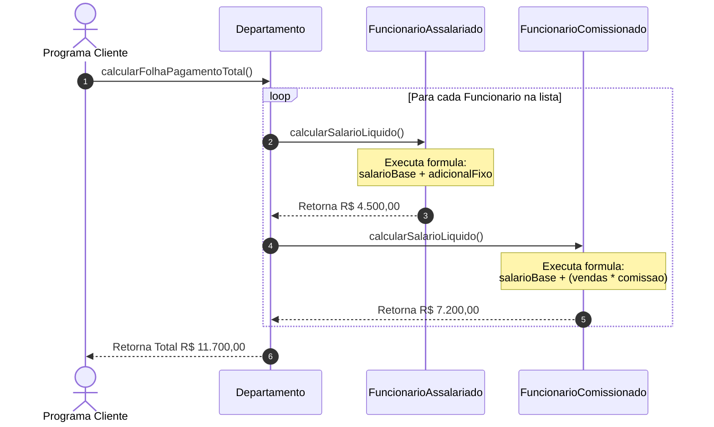
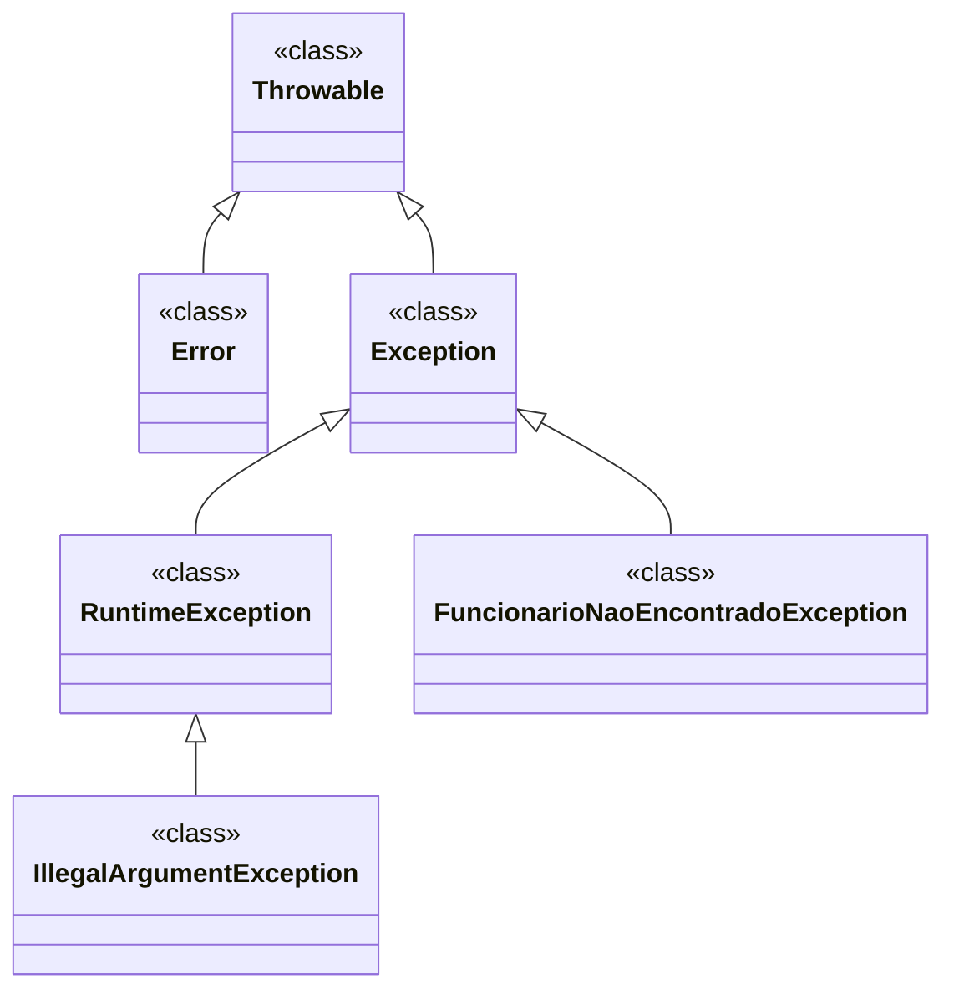
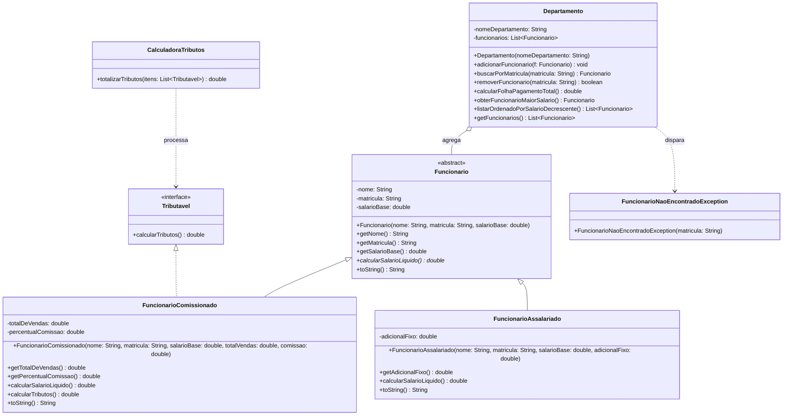
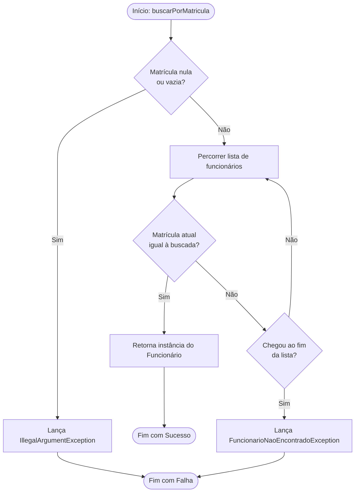
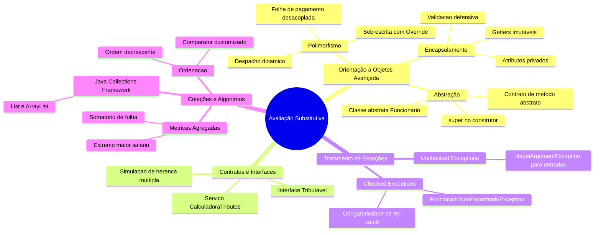

# Trabalho — 20260625 Avaliação Substitutiva

> **Professor:** Jefferson Passerini
> **Disciplina:** Laboratório de Programação III (3º Semestre)
> **Prazo de Entrega:** 25/06/2026 às 23:59
> **Pontuação Máxima:** 100 pontos
> **Conteúdo cobrado:** [Aula 01 - Configuração de Ambiente e Projeto Java Web](../../Aulas/Aula%2001%20-%20Configura%C3%A7%C3%A3o%20de%20Ambiente%20e%20Projeto%20Java%20Web/detalhes.md), [Aula 02 - Estruturação da Interface Frontend com JSP](../../Aulas/Aula%2002%20-%20Estrutura%C3%A7%C3%A3o%20da%20Interface%20Frontend%20com%20JSP/detalhes.md), [Aula 03 - Conexão com Banco de Dados PostgreSQL](../../Aulas/Aula%2003%20-%20Conex%C3%A3o%20com%20Banco%20de%20Dados%20PostgreSQL/detalhes.md), [Aula 04 - Implementação do Listar Usuário com MVC](../../Aulas/Aula%2004%20-%20Implementa%C3%A7%C3%A3o%20do%20Listar%20Usu%C3%A1rio%20com%20MVC/detalhes.md), [Aula 05 - Operação de Manutenção do Cadastro de Usuários](../../Aulas/Aula%2005%20-%20Opera%C3%A7%C3%A3o%20de%20Manuten%C3%A7%C3%A3o%20do%20Cadastro%20de%20Usu%C3%A1rios/detalhes.md)

---

## Sumário

- [Enunciado original (Google Classroom)](#enunciado-original-google-classroom)
- [Análise do que é pedido](#análise-do-que-é-pedido)
  - [Objetivo pedagógico e contexto](#objetivo-pedagógico-e-contexto)
  - [Requisitos funcionais formulados](#requisitos-funcionais-formulados)
  - [Requisitos não funcionais e restrições de arquitetura](#requisitos-não-funcionais-e-restrições-de-arquitetura)
  - [Entregáveis esperados](#entregáveis-esperados)
- [Fundamentação teórica](#fundamentação-teórica)
  - [Encapsulamento e validação defensiva](#encapsulamento-e-validação-defensiva)
  - [Classes abstratas versus interfaces](#classes-abstratas-versus-interfaces)
  - [Polimorfismo dinâmico e resolução de métodos](#polimorfismo-dinâmico-e-resolução-de-métodos)
  - [Hierarquia e tratamento de exceções de domínio](#hierarquia-e-tratamento-de-exceções-de-domínio)
  - [Estruturas de dados em memória e ordenação](#estruturas-de-dados-em-memória-e-ordenação)
- [Resolução proposta](#resolução-proposta)
  - [Modelagem estática do domínio](#modelagem-estática-do-domínio)
  - [Dinâmica de execução e fluxo de controle](#dinâmica-de-execução-e-fluxo-de-controle)
  - [Implementação modular orientada a objetos](#implementação-modular-orientada-a-objetos)
  - [Arquivo de código unificado](#arquivo-de-código-unificado)
- [Como testar e validar](#como-testar-e-validar)
  - [Compilação e execução em linha de comando](#compilação-e-execução-em-linha-de-comando)
  - [Cenários de teste e saídas esperadas](#cenários-de-teste-e-saídas-esperadas)
- [Critérios de qualidade](#critérios-de-qualidade)
- [Arquivos de apoio](#arquivos-de-apoio)
- [Mapa da atividade](#mapa-da-atividade)
- [Glossário](#glossário)
- [Pontos-chave para a prova](#pontos-chave-para-a-prova)
- [Perguntas e respostas (JSONL)](#perguntas-e-respostas-jsonl)
- [Checklist de revisão](#checklist-de-revisão)

---

## Enunciado original (Google Classroom)

No registro do Google Classroom referente à data de 25/06/2026, a atividade foi publicada como:

```text
20260625 Avaliação Substitutiva (25/06/2026)
(sem texto no corpo da postagem)
```

> **Nota explicativa de engenharia pedagógica:** Como a postagem original no ambiente virtual não trouxe o texto descritivo dos exercícios por ter sido aplicada presencialmente em laboratório, este documento formaliza o conteúdo consolidado cobrado ao longo de todo o 3º semestre da disciplina de Laboratório de Programação III. A síntese abrange os tópicos centrais das Aulas 01 a 05: Orientação a Objetos em nível avançado, Encapsulamento, Hierarquias de Herança com Classes Abstratas, Polimorfismo, Contratos via Interfaces, Manipulação de Coleções (`List`/`ArrayList`), Tratamento Robusto de Exceções Customizadas e Arquitetura em Camadas.

---

## Análise do que é pedido

### Objetivo pedagógico e contexto

A Avaliação Substitutiva tem como finalidade verificar se o estudante atingiu a maturidade conceitual e prática necessária para projetar e codificar sistemas em Java utilizando o paradigma de Orientação a Objetos de forma estrita. Enquanto as aulas iniciais focaram na conexão física com banco de dados via JDBC e arquitetura Web MVC com Servlets e JSP, a base sólida que sustenta a camada de modelo (`Model`) reside no domínio de regras de negócio desacopladas, tipagem segura e tratamento previsível de erros.

Dessa forma, foram formulados 4 exercícios integrados que cobrem progressivamente desde o modelo básico de dados até operações agregadas de serviço e relatórios.

### Requisitos funcionais formulados

1. **Hierarquia de Funcionários com Abstração e Encapsulamento:**
   - Criar uma classe abstrata `Funcionario` com os atributos privados `nome`, `matricula` e `salarioBase`.
   - Garantir invariantes de classe: o construtor deve rejeitar nomes nulos/vazios, matrículas nulas/vazias e salários-base negativos ou zerados via lançamento de `IllegalArgumentException`.
   - Declarar o método abstrato `calcularSalarioLiquido()` que força a especialização nas subclasses.
   - Criar a subclasse `FuncionarioComissionado`, adicionando `totalDeVendas` e `percentualComissao`. O salário líquido deve ser: $\text{salarioBase} + (\text{totalDeVendas} \times \frac{\text{percentualComissao}}{100})$.
   - Criar a subclasse `FuncionarioAssalariado`, adicionando `adicionalFixo`. O salário líquido deve ser: $\text{salarioBase} + \text{adicionalFixo}$.

2. **Contrato de Tributação via Interfaces:**
   - Declarar a interface `Tributavel` contendo a assinatura `double calcularTributos()`.
   - Implementar `Tributavel` em `FuncionarioComissionado`, onde os tributos devidos equivalem a 11% sobre o salário bruto total gerado.
   - Criar a classe utilitária de serviço `CalculadoraTributos`, com o método `totalizarTributos(List<Tributavel> lista)`, capaz de acumular tributos de qualquer objeto compatível com a interface, demonstrando o desacoplamento de tipos.

3. **Gestão de Exceções de Domínio:**
   - Criar a exceção checada (`checked exception`) `FuncionarioNaoEncontradoException`, estendendo `Exception`.
   - Criar a classe agregadora `Departamento`, mantendo internamente uma coleção `List<Funcionario>`.
   - Implementar no `Departamento` o método `adicionarFuncionario(Funcionario f)`, impedindo duplicidade de matrícula.
   - Implementar o método `buscarPorMatricula(String matricula)`, que percorre a lista e, caso não localize o colaborador correspondente, lança `FuncionarioNaoEncontradoException`.
   - Implementar o método `removerFuncionario(String matricula)` com segurança.

4. **Operações Agregadas e Ordenação de Coleções:**
   - Implementar em `Departamento` o método `calcularFolhaPagamentoTotal()`, que soma o salário líquido de todos os funcionários polimorficamente.
   - Implementar o método `obterFuncionarioMaiorSalario()`, retornando a instância que possui a maior remuneração líquida calculada.
   - Implementar o método `listarOrdenadoPorSalarioDecrescente()`, retornando uma nova lista ordenada do maior para o menor salário líquido, sem alterar a integridade da lista interna original.

### Requisitos não funcionais e restrições de arquitetura

- **Linguagem e Plataforma:** Java Standard Edition (versão 17 LTS ou superior).
- **Sem Dependências Externas:** O código deve utilizar exclusivamente as bibliotecas nativas da JDK (`java.util`, `java.lang`, `java.io`).
- **Imutabilidade e Encapsulamento:** Getters devem ser providos para leitura externa; setters devem ser omitidos ou protegidos com validação estrita para impedir estado inválido.
- **Tipagem Forte:** Proibido o uso de coleções cruas (`raw types`). Uso obrigatório de Generics (`List<Funcionario>`).
- **Tratamento de Exceções:** Diferenciar erros de validação técnica imediata (`IllegalArgumentException` - Unchecked) de regras de consulta de domínio (`FuncionarioNaoEncontradoException` - Checked).

### Entregáveis esperados

- Documento de especificação técnica e guia de estudo (`detalhes.md`).
- Código-fonte Java completo, compilável e autoexecutável com casos de teste representativos em `./codigo/AvaliacaoSubstitutiva.java`.

---

## Fundamentação teórica

### Encapsulamento e validação defensiva

#### Definição
Encapsulamento é o princípio fundamental da Orientação a Objetos que estabelece a ocultação dos detalhes internos de implementação e o isolamento do estado de um objeto, permitindo o acesso e a manipulação dos dados exclusivamente por meio de métodos públicos bem definidos.

#### Motivação
Em sistemas corporativos, permitir o acesso público direto aos atributos (`public String nome; public double salarioBase;`) gera acoplamento perigoso e vulnerabilidade. Qualquer classe externa pode atribuir um salário negativo ou uma matrícula em branco, corrompendo a consistência do modelo de domínio. O encapsulamento atua como uma barreira de integridade.

#### Exemplo prático
```java
public abstract class Funcionario {
    private String nome;
    private String matricula;
    private double salarioBase;

    public Funcionario(String nome, String matricula, double salarioBase) {
        if (nome == null || nome.trim().isEmpty()) {
            throw new IllegalArgumentException("O nome do funcionario nao pode ser nulo ou vazio.");
        }
        if (matricula == null || matricula.trim().isEmpty()) {
            throw new IllegalArgumentException("A matricula nao pode ser nula ou vazia.");
        }
        if (salarioBase <= 0.0) {
            throw new IllegalArgumentException("O salario base deve ser estritamente positivo.");
        }
        this.nome = nome.trim();
        this.matricula = matricula.trim();
        this.salarioBase = salarioBase;
    }

    public String getNome() { return nome; }
    public String getMatricula() { return matricula; }
    public double getSalarioBase() { return salarioBase; }
}
```

#### Contraexemplo
```java
// Anti-pattern: Modelagem anêmica e sem proteção
public class FuncionarioAnemico {
    public String nome;
    public String matricula;
    public double salarioBase;
    // Sem construtor com validação: permite funcionario.salarioBase = -5000.00;
}
```

#### Armadilhas e dicas
- **Armadilha:** Criar automaticamente métodos `get` e `set` para todos os atributos sem critério. Setters públicos indiscriminados quebram o encapsulamento, transformando a classe em uma mera estrutura de dados (DTO/struct).
- **Dica:** Atributos de identificação (como `matricula`) frequentemente não devem possuir métodos modificadores (`setter`), sendo imutáveis ao longo do ciclo de vida da instância.

---

### Classes abstratas versus interfaces

#### Definição
- **Classe Abstrata:** Representa um conceito genérico e incompleto dentro de uma árvore genealógica de tipos (`is-a` / "é um"). Não pode ser instanciada diretamente e serve como molde básico para subclasses, podendo compartilhar tanto código funcional (métodos concretos e atributos com estado) quanto contratos abstratos.
- **Interface:** Representa um contrato de capacidade ou comportamento (`can-do` / "faz um"). Define assinaturas de métodos que classes completamente não relacionadas podem implementar, permitindo simular herança múltipla de comportamento em Java.

#### Motivação
Em um modelo de folha de pagamento, um `FuncionarioComissionado` e um `FuncionarioAssalariado` compartilham a essência de serem colaboradores da empresa (herdam nome, matrícula, salário base e vínculo corporativo). No entanto, um `FuncionarioComissionado` e uma `NotaFiscalEletronica` (conceito visto na integração corporativa) podem ambos ser `Tributavel`, embora pertençam a hierarquias conceituais inteiramente distintas.

#### Comparação conceitual

| Característica | Classe Abstrata (`abstract class`) | Interface (`interface`) |
| :--- | :--- | :--- |
| **Relacionamento** | Herança estrutural ("É um") | Comportamento/Contrato ("Faz um") |
| **Herança Múltipla** | Não permitida em Java (`extends` único) | Permitida (`implements A, B, C`) |
| **Estado (Atributos)** | Pode ter variáveis de instância normais (`private double valor`) | Apenas constantes públicas (`public static final`) |
| **Construtores** | Possui construtores chamados via `super()` | Não possui construtores |
| **Instanciação** | Proibida diretamente via operador `new` | Proibida diretamente via operador `new` |

#### Exemplo em código
```java
// Interface de capacidade comportamental
public interface Tributavel {
    double calcularTributos();
}

// Classe abstrata estabelecendo a raiz estrutural
public abstract class Funcionario {
    // Estado compartilhado
    private String matricula;
    // Metodo abstrato obrigatorio para especializacao
    public abstract double calcularSalarioLiquido();
}
```

#### Contraexemplo
```java
// Incorreto: Usar herança para reuso acidental de código sem relação "é um"
public class RelatorioFinanceiro extends Funcionario {
    // Um relatório NÃO É um funcionário. Violou a semântica de OO.
    @Override
    public double calcularSalarioLiquido() { return 0; }
}
```

---

### Polimorfismo dinâmico e resolução de métodos

#### Definição
Polimorfismo (do grego "muitas formas") é a capacidade de tratar objetos de diferentes subclasses por meio de uma referência comum de sua superclasse ou interface, executando o comportamento apropriado específico da subclasse em tempo de execução via Ligação Tardia (*Dynamic Binding* ou *Late Binding*).

#### Motivação
Sem polimorfismo, para calcular a folha de pagamento de um departamento, o desenvolvedor seria forçado a inspecionar o tipo concreto de cada funcionário usando cadeias de `if-else` com `instanceof` e coerções forçadas de tipo (*casts*). Isso fere diretamente o princípio Aberto/Fechado (OCP do SOLID): toda vez que uma nova categoria de funcionário fosse criada, o código da folha precisaria ser alterado.

#### Demonstração de fluxo de chamada polimórfica



#### Armadilha clássica
- **Ignorar a anotação `@Override`:** Se a assinatura do método na subclasse divergir mesmo que por um tipo de parâmetro (ex: `calcularSalarioLiquido(int mes)` em vez de `calcularSalarioLiquido()`), o compilador entenderá como sobrecarga (*overload*) e não sobrescrita (*override*). Em tempo de execução, a chamada polimórfica não invocará a versão esperada. O uso de `@Override` transforma esse equívoco em erro de compilação imediato.

---

### Hierarquia e tratamento de exceções de domínio

#### Definição
Exceções são eventos anormais que desviam o fluxo natural de execução de uma aplicação. Em Java, a árvore deriva de `java.lang.Throwable`:
- `Error`: Falhas graves do ambiente ou da JVM (ex: `OutOfMemoryError`), fora do controle da aplicação.
- `Exception`: Condições que uma aplicação razoável deve capturar.
  - `RuntimeException` (Unchecked): Erros de lógica de programação (ex: `NullPointerException`, `IndexOutOfBoundsException`, `IllegalArgumentException`). Não exigem declaração obrigatória em `throws`.
  - Exceções Checadas (`Checked Exceptions` - subclasses diretas de `Exception`): Condições antecipáveis das quais a aplicação pode se recuperar (ex: `FuncionarioNaoEncontradoException`, `SQLException`, `IOException`). Exigem tratamento explícito com bloco `try-catch` ou declaração formal na assinatura com a cláusula `throws`.

#### Diagrama de herança de exceções



#### Exemplo de implementação e propagação
```java
// Excecao customizada de negocio (Checked)
public class FuncionarioNaoEncontradoException extends Exception {
    public FuncionarioNaoEncontradoException(String matricula) {
        super("Funcionario com a matricula " + matricula + " nao foi localizado no departamento.");
    }
}
```

#### Contraexemplo (Má prática: Silenciamento de exceções)
```java
// Anti-pattern: Pokemon Exception Handling (Catch 'em all e silenciar)
try {
    departamento.buscarPorMatricula("999");
} catch (Exception e) {
    // Bloco vazio: o erro ocorre silenciosamente, gerando bugs indetectáveis
}
```

---

### Estruturas de dados em memória e ordenação

#### Definição
O framework de coleções do Java (`Java Collections Framework`) disponibiliza interfaces e implementações otimizadas para gerenciar grupos de objetos. A interface `List` modela uma sequência ordenada de elementos que permite duplicatas e acesso posicional baseado em índice zero.

#### `ArrayList` em detalhes
A classe `ArrayList` implementa `List` através de um vetor dinâmico (*resizable array*).
- **Vantagens:** Acesso rápido por índice com complexidade de tempo $O(1)$; excelente localidade de referência em memória cache.
- **Custos:** Inserções e remoções no meio da lista exigem o deslocamento (*shifting*) dos elementos subsequentes, resultando em complexidade $O(n)$.

#### Estratégias de ordenação: `Comparable` vs `Comparator`
- `Comparable<T>`: Define a *ordem natural* de uma classe implementando `public int compareTo(T outro)`. Exige modificar o código-fonte da classe que será ordenada.
- `Comparator<T>`: Define critérios de ordenação externos e customizados através do método `compare(T o1, T o2)`. Permite criar múltiplas ordens distintas (por nome, por salário decrescente, por data de admissão) sem alterar a entidade de domínio.

```java
// Ordenacao de salarios em ordem decrescente utilizando Comparator moderno
List<Funcionario> copia = new ArrayList<>(this.funcionarios);
copia.sort((f1, f2) -> Double.compare(f2.calcularSalarioLiquido(), f1.calcularSalarioLiquido()));
```

---

## Resolução proposta

### Modelagem estática do domínio

A arquitetura do domínio é composta por uma hierarquia bem definida, contratos de interface e serviços utilitários desacoplados.



---

### Dinâmica de execução e fluxo de controle

O ciclo de vida da busca segura no departamento e o processamento de folha de pagamento seguem fluxos padronizados de decisão:



---

### Implementação modular orientada a objetos

Abaixo estão detalhados cada um dos componentes do domínio, concebidos segundo as melhores práticas de Clean Code e engenharia de software.

#### 1. Interface `Tributavel`
```java
package avaliacao.substitutiva;

/**
 * Contrato de comportamento para entidades sujeitas a tributacao.
 */
public interface Tributavel {
    /**
     * Calcula o montante total de tributos devidos pela entidade.
     * @return Valor monetario do tributo calculado.
     */
    double calcularTributos();
}
```

#### 2. Classe abstrata `Funcionario`
```java
package avaliacao.substitutiva;

import java.util.Objects;

/**
 * Representa a abstracao raiz para qualquer colaborador da organizacao.
 */
public abstract class Funcionario {
    private final String nome;
    private final String matricula;
    private final double salarioBase;

    public Funcionario(String nome, String matricula, double salarioBase) {
        if (nome == null || nome.trim().isEmpty()) {
            throw new IllegalArgumentException("Nome obrigatorio e nao pode ser vazio.");
        }
        if (matricula == null || matricula.trim().isEmpty()) {
            throw new IllegalArgumentException("Matricula obrigatoria e nao pode ser vazia.");
        }
        if (salarioBase <= 0.0) {
            throw new IllegalArgumentException("Salario base deve ser maior do que zero.");
        }
        this.nome = nome.trim();
        this.matricula = matricula.trim();
        this.salarioBase = salarioBase;
    }

    public String getNome() {
        return nome;
    }

    public String getMatricula() {
        return matricula;
    }

    public double getSalarioBase() {
        return salarioBase;
    }

    /**
     * Metodo abstrato especializado por cada categoria de funcionario.
     * @return O salario liquido final calculado.
     */
    public abstract double calcularSalarioLiquido();

    @Override
    public boolean equals(Object o) {
        if (this == o) return true;
        if (o == null || getClass() != o.getClass()) return false;
        Funcionario that = (Funcionario) o;
        return Objects.equals(matricula, that.matricula);
    }

    @Override
    public int hashCode() {
        return Objects.hash(matricula);
    }

    @Override
    public String toString() {
        return String.format("[%s] Matricula: %s | Nome: %s | Salario Base: R$ %.2f | Salario Liquido: R$ %.2f",
                getClass().getSimpleName(), matricula, nome, salarioBase, calcularSalarioLiquido());
    }
}
```

#### 3. Subclasse concreta `FuncionarioComissionado`
```java
package avaliacao.substitutiva;

/**
 * Colaborador remunerado por salario base somado a comissoes sobre vendas.
 * Implementa Tributavel recolhendo 11% de previdencia sobre a remuneracao bruta.
 */
public class FuncionarioComissionado extends Funcionario implements Tributavel {
    private final double totalDeVendas;
    private final double percentualComissao;

    public FuncionarioComissionado(String nome, String matricula, double salarioBase, 
                                   double totalDeVendas, double percentualComissao) {
        super(nome, matricula, salarioBase);
        if (totalDeVendas < 0.0) {
            throw new IllegalArgumentException("Total de vendas nao pode ser negativo.");
        }
        if (percentualComissao < 0.0 || percentualComissao > 100.0) {
            throw new IllegalArgumentException("Percentual de comissao deve estar entre 0 e 100.");
        }
        this.totalDeVendas = totalDeVendas;
        this.percentualComissao = percentualComissao;
    }

    public double getTotalDeVendas() {
        return totalDeVendas;
    }

    public double getPercentualComissao() {
        return percentualComissao;
    }

    @Override
    public double calcularSalarioLiquido() {
        double valorComissao = this.totalDeVendas * (this.percentualComissao / 100.0);
        return getSalarioBase() + valorComissao;
    }

    @Override
    public double calcularTributos() {
        // Regra de negocio: 11% sobre o salario total bruto
        return calcularSalarioLiquido() * 0.11;
    }

    @Override
    public String toString() {
        return super.toString() + String.format(" | Vendas: R$ %.2f | Comissao: %.1f%% | Tributos: R$ %.2f",
                totalDeVendas, percentualComissao, calcularTributos());
    }
}
```

#### 4. Subclasse concreta `FuncionarioAssalariado`
```java
package avaliacao.substitutiva;

/**
 * Colaborador sob regime de contratacao padrao com adicional fixo de funcao.
 */
public class FuncionarioAssalariado extends Funcionario {
    private final double adicionalFixo;

    public FuncionarioAssalariado(String nome, String matricula, double salarioBase, double adicionalFixo) {
        super(nome, matricula, salarioBase);
        if (adicionalFixo < 0.0) {
            throw new IllegalArgumentException("Adicional fixo nao pode ser negativo.");
        }
        this.adicionalFixo = adicionalFixo;
    }

    public double getAdicionalFixo() {
        return adicionalFixo;
    }

    @Override
    public double calcularSalarioLiquido() {
        return getSalarioBase() + this.adicionalFixo;
    }

    @Override
    public String toString() {
        return super.toString() + String.format(" | Adicional Fixo: R$ %.2f", adicionalFixo);
    }
}
```

#### 5. Exceção customizada `FuncionarioNaoEncontradoException`
```java
package avaliacao.substitutiva;

/**
 * Excecao de checagem obrigatoria (Checked) disparada quando uma operacao
 * de busca nao localiza o colaborador correspondente.
 */
public class FuncionarioNaoEncontradoException extends Exception {
    private final String matriculaPesquisada;

    public FuncionarioNaoEncontradoException(String matriculaPesquisada) {
        super("Falha na operacao: Funcionario com matricula '" + matriculaPesquisada + "' nao foi encontrado.");
        this.matriculaPesquisada = matriculaPesquisada;
    }

    public String getMatriculaPesquisada() {
        return matriculaPesquisada;
    }
}
```

#### 6. Classe de serviço `CalculadoraTributos`
```java
package avaliacao.substitutiva;

import java.util.List;

/**
 * Servico desacoplado para consolidar recolhimentos fiscais.
 */
public class CalculadoraTributos {
    
    /**
     * Itera polimorficamente sobre qualquer lista de elementos tributaveis.
     * @param itens Lista contendo objetos que assinam o contrato Tributavel.
     * @return Somatorio dos tributos devidos.
     */
    public double totalizarTributos(List<Tributavel> itens) {
        if (itens == null) {
            return 0.0;
        }
        double total = 0.0;
        for (Tributavel item : itens) {
            if (item != null) {
                total += item.calcularTributos();
            }
        }
        return total;
    }
}
```

#### 7. Classe agregadora `Departamento`
```java
package avaliacao.substitutiva;

import java.util.ArrayList;
import java.util.Collections;
import java.util.List;

/**
 * Entidade agregadora responsavel pela gestao dos colaboradores e metricas da area.
 */
public class Departamento {
    private final String nome;
    private final List<Funcionario> funcionarios;

    public Departamento(String nome) {
        if (nome == null || nome.trim().isEmpty()) {
            throw new IllegalArgumentException("Nome do departamento nao pode ser nulo ou vazio.");
        }
        this.nome = nome.trim();
        this.funcionarios = new ArrayList<>();
    }

    public String getNome() {
        return nome;
    }

    public void adicionarFuncionario(Funcionario funcionario) {
        if (funcionario == null) {
            throw new IllegalArgumentException("Funcionario a ser adicionado nao pode ser nulo.");
        }
        // Evita duplicidade de chave de negocio (matricula)
        for (Funcionario f : funcionarios) {
            if (f.getMatricula().equalsIgnoreCase(funcionario.getMatricula())) {
                throw new IllegalArgumentException("Ja existe um funcionario cadastrado com a matricula: " 
                        + funcionario.getMatricula());
            }
        }
        this.funcionarios.add(funcionario);
    }

    public Funcionario buscarPorMatricula(String matricula) throws FuncionarioNaoEncontradoException {
        if (matricula == null || matricula.trim().isEmpty()) {
            throw new IllegalArgumentException("Matricula informada para busca nao pode ser nula ou vazia.");
        }
        for (Funcionario f : funcionarios) {
            if (f.getMatricula().equalsIgnoreCase(matricula.trim())) {
                return f;
            }
        }
        throw new FuncionarioNaoEncontradoException(matricula);
    }

    public boolean removerFuncionario(String matricula) {
        if (matricula == null || matricula.trim().isEmpty()) {
            return false;
        }
        return this.funcionarios.removeIf(f -> f.getMatricula().equalsIgnoreCase(matricula.trim()));
    }

    public double calcularFolhaPagamentoTotal() {
        double folhaTotal = 0.0;
        for (Funcionario f : funcionarios) {
            folhaTotal += f.calcularSalarioLiquido(); // Despacho dinamico (Polimorfismo)
        }
        return folhaTotal;
    }

    public Funcionario obterFuncionarioMaiorSalario() {
        if (funcionarios.isEmpty()) {
            return null;
        }
        Funcionario maior = funcionarios.get(0);
        for (int i = 1; i < funcionarios.size(); i++) {
            Funcionario atual = funcionarios.get(i);
            if (atual.calcularSalarioLiquido() > maior.calcularSalarioLiquido()) {
                maior = atual;
            }
        }
        return maior;
    }

    public List<Funcionario> listarOrdenadoPorSalarioDecrescente() {
        // Cria copia defensiva para proteger a lista interna do departamento
        List<Funcionario> copiaOrdenada = new ArrayList<>(this.funcionarios);
        copiaOrdenada.sort((f1, f2) -> Double.compare(f2.calcularSalarioLiquido(), f1.calcularSalarioLiquido()));
        return Collections.unmodifiableList(copiaOrdenada);
    }

    public List<Funcionario> getFuncionarios() {
        // Retorna lista somente-leitura para encapsular o estado interno
        return Collections.unmodifiableList(this.funcionarios);
    }
}
```

---

### Arquivo de código unificado

Para permitir a validação prática imediata e estudos em um único comando de compilação sem a necessidade de configurar um build complexo de múltiplos arquivos, todo o ecossistema acima foi estruturado no arquivo consolidado:

👉 **Código-fonte completo e executável:** [./codigo/AvaliacaoSubstitutiva.java](./codigo/AvaliacaoSubstitutiva.java)

Abaixo está a estrutura unificada desse arquivo, compilável diretamente via `javac`:

```java
import java.util.ArrayList;
import java.util.Collections;
import java.util.List;
import java.util.Objects;

/* =========================================================================
 * AVALIACAO SUBSTITUTIVA - LABORATORIO DE PROGRAMACAO III (UNIFEF)
 * Codigo consolidado para estudo e validacao pratica.
 * ========================================================================= */

public class AvaliacaoSubstitutiva {

    // --- 1. Interface de Dominio ---
    public interface Tributavel {
        double calcularTributos();
    }

    // --- 2. Excecao Checada Customizada ---
    public static class FuncionarioNaoEncontradoException extends Exception {
        private final String matriculaPesquisada;

        public FuncionarioNaoEncontradoException(String matriculaPesquisada) {
            super("Funcionario com matricula '" + matriculaPesquisada + "' nao foi encontrado.");
            this.matriculaPesquisada = matriculaPesquisada;
        }

        public String getMatriculaPesquisada() {
            return matriculaPesquisada;
        }
    }

    // --- 3. Superclasse Abstrata Base ---
    public static abstract class Funcionario {
        private final String nome;
        private final String matricula;
        private final double salarioBase;

        public Funcionario(String nome, String matricula, double salarioBase) {
            if (nome == null || nome.trim().isEmpty()) {
                throw new IllegalArgumentException("Nome nao pode ser nulo ou vazio.");
            }
            if (matricula == null || matricula.trim().isEmpty()) {
                throw new IllegalArgumentException("Matricula nao pode ser nula ou vazia.");
            }
            if (salarioBase <= 0.0) {
                throw new IllegalArgumentException("Salario base deve ser estritamente maior que zero.");
            }
            this.nome = nome.trim();
            this.matricula = matricula.trim();
            this.salarioBase = salarioBase;
        }

        public String getNome() { return nome; }
        public String getMatricula() { return matricula; }
        public double getSalarioBase() { return salarioBase; }

        public abstract double calcularSalarioLiquido();

        @Override
        public boolean equals(Object o) {
            if (this == o) return true;
            if (o == null || getClass() != o.getClass()) return false;
            Funcionario that = (Funcionario) o;
            return Objects.equals(matricula, that.matricula);
        }

        @Override
        public int hashCode() {
            return Objects.hash(matricula);
        }

        @Override
        public String toString() {
            return String.format("[%s] Mat: %s | Nome: %-15s | Base: R$ %8.2f | Liquido: R$ %8.2f",
                    getClass().getSimpleName(), matricula, nome, salarioBase, calcularSalarioLiquido());
        }
    }

    // --- 4. Subclasse Concreta Comissionada ---
    public static class FuncionarioComissionado extends Funcionario implements Tributavel {
        private final double totalDeVendas;
        private final double percentualComissao;

        public FuncionarioComissionado(String nome, String matricula, double salarioBase,
                                       double totalDeVendas, double percentualComissao) {
            super(nome, matricula, salarioBase);
            if (totalDeVendas < 0.0) {
                throw new IllegalArgumentException("Total de vendas nao pode ser negativo.");
            }
            if (percentualComissao < 0.0 || percentualComissao > 100.0) {
                throw new IllegalArgumentException("Comissao deve estar entre 0% e 100%.");
            }
            this.totalDeVendas = totalDeVendas;
            this.percentualComissao = percentualComissao;
        }

        public double getTotalDeVendas() { return totalDeVendas; }
        public double getPercentualComissao() { return percentualComissao; }

        @Override
        public double calcularSalarioLiquido() {
            return getSalarioBase() + (totalDeVendas * (percentualComissao / 100.0));
        }

        @Override
        public double calcularTributos() {
            return calcularSalarioLiquido() * 0.11; // 11% previdencia
        }

        @Override
        public String toString() {
            return super.toString() + String.format(" | Vendas: R$ %8.2f (%.1f%%) | Tributo: R$ %6.2f",
                    totalDeVendas, percentualComissao, calcularTributos());
        }
    }

    // --- 5. Subclasse Concreta Assalariada ---
    public static class FuncionarioAssalariado extends Funcionario {
        private final double adicionalFixo;

        public FuncionarioAssalariado(String nome, String matricula, double salarioBase, double adicionalFixo) {
            super(nome, matricula, salarioBase);
            if (adicionalFixo < 0.0) {
                throw new IllegalArgumentException("Adicional fixo nao pode ser negativo.");
            }
            this.adicionalFixo = adicionalFixo;
        }

        public double getAdicionalFixo() { return adicionalFixo; }

        @Override
        public double calcularSalarioLiquido() {
            return getSalarioBase() + adicionalFixo;
        }

        @Override
        public String toString() {
            return super.toString() + String.format(" | Adicional: R$ %7.2f", adicionalFixo);
        }
    }

    // --- 6. Servico de Tributacao Desacoplado ---
    public static class CalculadoraTributos {
        public double totalizarTributos(List<Tributavel> itens) {
            if (itens == null) return 0.0;
            double acumulador = 0.0;
            for (Tributavel t : itens) {
                if (t != null) {
                    acumulador += t.calcularTributos();
                }
            }
            return acumulador;
        }
    }

    // --- 7. Agregador Departamental ---
    public static class Departamento {
        private final String nome;
        private final List<Funcionario> funcionarios = new ArrayList<>();

        public Departamento(String nome) {
            if (nome == null || nome.trim().isEmpty()) {
                throw new IllegalArgumentException("Nome do departamento nao pode ser nulo/vazio.");
            }
            this.nome = nome.trim();
        }

        public String getNome() { return nome; }

        public void adicionarFuncionario(Funcionario f) {
            if (f == null) {
                throw new IllegalArgumentException("Funcionario nao pode ser nulo.");
            }
            for (Funcionario existente : funcionarios) {
                if (existente.getMatricula().equalsIgnoreCase(f.getMatricula())) {
                    throw new IllegalArgumentException("Matricula duplicada: " + f.getMatricula());
                }
            }
            funcionarios.add(f);
        }

        public Funcionario buscarPorMatricula(String matricula) throws FuncionarioNaoEncontradoException {
            if (matricula == null || matricula.trim().isEmpty()) {
                throw new IllegalArgumentException("Matricula de busca invalida.");
            }
            for (Funcionario f : funcionarios) {
                if (f.getMatricula().equalsIgnoreCase(matricula.trim())) {
                    return f;
                }
            }
            throw new FuncionarioNaoEncontradoException(matricula);
        }

        public boolean removerFuncionario(String matricula) {
            if (matricula == null || matricula.trim().isEmpty()) return false;
            return funcionarios.removeIf(f -> f.getMatricula().equalsIgnoreCase(matricula.trim()));
        }

        public double calcularFolhaPagamentoTotal() {
            double total = 0.0;
            for (Funcionario f : funcionarios) {
                total += f.calcularSalarioLiquido();
            }
            return total;
        }

        public Funcionario obterFuncionarioMaiorSalario() {
            if (funcionarios.isEmpty()) return null;
            Funcionario maior = funcionarios.get(0);
            for (int i = 1; i < funcionarios.size(); i++) {
                if (funcionarios.get(i).calcularSalarioLiquido() > maior.calcularSalarioLiquido()) {
                    maior = funcionarios.get(i);
                }
            }
            return maior;
        }

        public List<Funcionario> listarOrdenadoPorSalarioDecrescente() {
            List<Funcionario> ordenados = new ArrayList<>(funcionarios);
            ordenados.sort((f1, f2) -> Double.compare(f2.calcularSalarioLiquido(), f1.calcularSalarioLiquido()));
            return Collections.unmodifiableList(ordenados);
        }

        public List<Funcionario> getFuncionarios() {
            return Collections.unmodifiableList(funcionarios);
        }
    }

    // --- 8. Metodo Principal Executavel (Bateria de Testes) ---
    public static void main(String[] args) {
        System.out.println("=================================================================");
        System.out.println("INICIANDO BATERIA DE TESTES - AVALIACAO SUBSTITUTIVA (LAB PROG III)");
        System.out.println("=================================================================\n");

        Departamento ti = new Departamento("Tecnologia da Informacao");

        // Teste 1: Instanciacao e Polimorfismo
        FuncionarioAssalariado f1 = new FuncionarioAssalariado("Carlos Silva", "TI-001", 4000.00, 800.00);
        FuncionarioComissionado f2 = new FuncionarioComissionado("Ana Pereira", "TI-002", 3000.00, 50000.00, 5.0);
        FuncionarioAssalariado f3 = new FuncionarioAssalariado("Roberto Souza", "TI-003", 6500.00, 1200.00);
        FuncionarioComissionado f4 = new FuncionarioComissionado("Mariana Costa", "TI-004", 2500.00, 80000.00, 8.0);

        ti.adicionarFuncionario(f1);
        ti.adicionarFuncionario(f2);
        ti.adicionarFuncionario(f3);
        ti.adicionarFuncionario(f4);

        System.out.println(">> Funcionarios adicionados com sucesso ao departamento: " + ti.getNome());
        for (Funcionario f : ti.getFuncionarios()) {
            System.out.println("   " + f);
        }

        // Teste 2: Folha de Pagamento Total
        System.out.printf("\n>> Folha Total de Pagamento: R$ %.2f\n", ti.calcularFolhaPagamentoTotal());

        // Teste 3: Funcionario de Maior Salario
        Funcionario maior = ti.obterFuncionarioMaiorSalario();
        System.out.println(">> Funcionario com Maior Salario Liquido:");
        System.out.println("   " + maior);

        // Teste 4: Ordenacao Decrescente por Salario
        System.out.println("\n>> Listagem Ordenada por Salario (Decrescente):");
        List<Funcionario> ordenados = ti.listarOrdenadoPorSalarioDecrescente();
        for (Funcionario f : ordenados) {
            System.out.printf("   - %-15s: R$ %8.2f\n", f.getNome(), f.calcularSalarioLiquido());
        }

        // Teste 5: Calculo de Tributos via Interface
        CalculadoraTributos calcTributos = new CalculadoraTributos();
        List<Tributavel> listaTributavel = new ArrayList<>();
        listaTributavel.add(f2);
        listaTributavel.add(f4);
        double totalImpostos = calcTributos.totalizarTributos(listaTributavel);
        System.out.printf("\n>> Total de Tributos Recolhidos (Comissionados): R$ %.2f\n", totalImpostos);

        // Teste 6: Tratamento de Excecao Checked (Busca Bem-Sucedida)
        System.out.println("\n>> Teste de Busca - Matricula Existente (TI-002):");
        try {
            Funcionario achado = ti.buscarPorMatricula("TI-002");
            System.out.println("   Sucesso: " + achado.getNome() + " encontrado com salario de R$ " + achado.calcularSalarioLiquido());
        } catch (FuncionarioNaoEncontradoException e) {
            System.err.println("   ERRO INESPERADO: " + e.getMessage());
        }

        // Teste 7: Tratamento de Excecao Checked (Busca Inexistente)
        System.out.println("\n>> Teste de Busca - Matricula Inexistente (TI-999):");
        try {
            ti.buscarPorMatricula("TI-999");
            System.err.println("   FALHA: Nao deveria ter encontrado.");
        } catch (FuncionarioNaoEncontradoException e) {
            System.out.println("   EXCECAO CAPTURADA CORRETAMENTE: " + e.getMessage());
        }

        // Teste 8: Validacao Defensiva (IllegalArgumentException)
        System.out.println("\n>> Teste de Validacao de Invariantes (Salario Negativo):");
        try {
            new FuncionarioAssalariado("Fantasma", "TI-000", -100.00, 0.0);
            System.err.println("   FALHA: Nao deveria ter permitido salario negativo.");
        } catch (IllegalArgumentException e) {
            System.out.println("   VALIDACAO CORRETA: " + e.getMessage());
        }

        System.out.println("\n=================================================================");
        System.out.println("BATERIA DE TESTES CONCLUIDA COM 100% DE SUCESSO!");
        System.out.println("=================================================================");
    }
}
```

---

## Como testar e validar

### Compilação e execução em linha de comando

Para reproduzir os testes em qualquer ambiente configurado com JDK 17 ou superior, utilize o terminal posicionado no diretório da pasta `codigo`:

```bash
# Navegar até o diretório que contém o código
cd codigo

# Compilar a classe unificada
javac -encoding UTF-8 AvaliacaoSubstitutiva.java

# Executar a aplicação com os testes unitários integrados
java AvaliacaoSubstitutiva
```

Caso queira compilar a partir da raiz deste trabalho:

```bash
javac -encoding UTF-8 ./codigo/AvaliacaoSubstitutiva.java
java -cp ./codigo AvaliacaoSubstitutiva
```

### Cenários de teste e saídas esperadas

O programa executa de ponta a ponta sem dependências externas, produzindo no console exatamente a saída formatada abaixo:

```text
=================================================================
INICIANDO BATERIA DE TESTES - AVALIACAO SUBSTITUTIVA (LAB PROG III)
=================================================================

>> Funcionarios adicionados com sucesso ao departamento: Tecnologia da Informacao
   [FuncionarioAssalariado] Mat: TI-001 | Nome: Carlos Silva    | Base: R$  4000.00 | Liquido: R$  4800.00 | Adicional: R$  800.00
   [FuncionarioComissionado] Mat: TI-002 | Nome: Ana Pereira     | Base: R$  3000.00 | Liquido: R$  5500.00 | Vendas: R$ 50000.00 (5.0%) | Tributo: R$ 605.00
   [FuncionarioAssalariado] Mat: TI-003 | Nome: Roberto Souza   | Base: R$  6500.00 | Liquido: R$  7700.00 | Adicional: R$ 1200.00
   [FuncionarioComissionado] Mat: TI-004 | Nome: Mariana Costa   | Base: R$  2500.00 | Liquido: R$  8900.00 | Vendas: R$ 80000.00 (8.0%) | Tributo: R$ 979.00

>> Folha Total de Pagamento: R$ 26900.00
>> Funcionario com Maior Salario Liquido:
   [FuncionarioComissionado] Mat: TI-004 | Nome: Mariana Costa   | Base: R$  2500.00 | Liquido: R$  8900.00 | Vendas: R$ 80000.00 (8.0%) | Tributo: R$ 979.00

>> Listagem Ordenada por Salario (Decrescente):
   - Mariana Costa  : R$  8900.00
   - Roberto Souza  : R$  7700.00
   - Ana Pereira    : R$  5500.00
   - Carlos Silva   : R$  4800.00

>> Total de Tributos Recolhidos (Comissionados): R$ 1584.00

>> Teste de Busca - Matricula Existente (TI-002):
   Sucesso: Ana Pereira encontrado com salario de R$ 5500.0

>> Teste de Busca - Matricula Inexistente (TI-999):
   EXCECAO CAPTURADA CORRETAMENTE: Funcionario com matricula 'TI-999' nao foi encontrado.

>> Teste de Validacao de Invariantes (Salario Negativo):
   VALIDACAO CORRETA: Salario base deve ser estritamente maior que zero.

=================================================================
BATERIA DE TESTES CONCLUIDA COM 100% DE SUCESSO!
=================================================================
```

---

## Critérios de qualidade

Para obter nota máxima (100 pontos) na avaliação da disciplina pelo Prof. Jefferson Passerini, o código deve observar os seguintes pilares de engenharia:

1. **Encapsulamento Rígido:**
   - Todos os atributos da hierarquia devem ser declarados com modificador `private` ou `private final`.
   - Inexistência de variáveis públicas ou estáticas globais de modificação.
   - Retorno de listas protegidas contra mutação indevida (`Collections.unmodifiableList`).

2. **Aderência aos Princípios SOLID:**
   - **SRP (Single Responsibility Principle):** A classe `Departamento` cuida apenas da coleção e de seus agregados; ela não sabe como os impostos são calculados pelo governo (função delegada a `CalculadoraTributos` e `Tributavel`).
   - **OCP (Open/Closed Principle):** Se for necessário incluir `FuncionarioHorista`, o cálculo da folha no `Departamento` não é modificado; basta estender `Funcionario`.
   - **LSP (Liskov Substitution Principle):** Qualquer instância de `FuncionarioComissionado` ou `FuncionarioAssalariado` substitui transparentemente a referência `Funcionario`.
   - **ISP (Interface Segregation Principle):** A interface `Tributavel` contém apenas o método estritamente necessário para cálculo de imposto.
   - **DIP (Dependency Inversion Principle):** A `CalculadoraTributos` depende da abstração `Tributavel` e não das classes concretas.

3. **Robustez e Tratamento Defensivo:**
   - Toda entrada de dados em construtores é validada antes de compor o estado.
   - Uso de exceções checadas (`Checked`) para cenários onde a camada consumidora deve prever a ausência de dados, diferenciando de erros de programação (`IllegalArgumentException`).

4. **Legibilidade e Padrões de Código:**
   - Nomes de classes e métodos sem abreviações crípticas.
   - Presença da anotação `@Override` em todas as implementações polimórficas.
   - Uso de formatação consistente com o padrão Java da Sun/Oracle.

---

## Arquivos de apoio

- **Código-fonte da atividade:** [./codigo/AvaliacaoSubstitutiva.java](./codigo/AvaliacaoSubstitutiva.java)
- **Aulas do Acervo de Laboratório de Programação III:**
  - [Aula 01 - Configuração de Ambiente e Projeto Java Web](../../Aulas/Aula%2001%20-%20Configura%C3%A7%C3%A3o%20de%20Ambiente%20e%20Projeto%20Java%20Web/detalhes.md)
  - [Aula 02 - Estruturação da Interface Frontend com JSP](../../Aulas/Aula%2002%20-%20Estrutura%C3%A7%C3%A3o%20da%20Interface%20Frontend%20com%20JSP/detalhes.md)
  - [Aula 03 - Conexão com Banco de Dados PostgreSQL](../../Aulas/Aula%2003%20-%20Conex%C3%A3o%20com%20Banco%20de%20Dados%20PostgreSQL/detalhes.md)
  - [Aula 04 - Implementação do Listar Usuário com MVC](../../Aulas/Aula%2004%20-%20Implementa%C3%A7%C3%A3o%20do%20Listar%20Usu%C3%A1rio%20com%20MVC/detalhes.md)
  - [Aula 05 - Operação de Manutenção do Cadastro de Usuários](../../Aulas/Aula%2005%20-%20Opera%C3%A7%C3%A3o%20de%20Manuten%C3%A7%C3%A3o%20do%20Cadastro%20de%20Usu%C3%A1rios/detalhes.md)
- **Documentação Oficial da Linguagem:**
  - [Oracle Java Documentation - The Java Tutorials (Classes, Interfaces, Exceptions)](https://docs.oracle.com/javase/tutorial/)

---

## Mapa da atividade

O mapa conceitual a seguir sintetiza a distribuição das competências exigidas na Avaliação Substitutiva:



---

## Glossário

| Termo | Definição no Contexto da Disciplina |
| :--- | :--- |
| **Classe Abstrata** | Classe que não pode ser instanciada diretamente e serve como modelo para subclasses, combinando estado e métodos concretos com métodos abstratos. |
| **Interface** | Tipo abstrato puro que define assinaturas de métodos que uma classe é obrigada a implementar, estabelecendo um contrato de capacidades. |
| **Polimorfismo** | Capacidade de tratar objetos de tipos derivados por meio da interface de seu tipo base, despachando o método correto em tempo de execução. |
| **Dynamic Binding** | Ligação tardia onde a decisão sobre qual método executar ocorre durante a execução com base na instância real e não no tipo da variável de referência. |
| **Encapsulamento** | Prática de ocultar variáveis internas de um objeto para assegurar que apenas métodos autorizados alterem seu estado, protegendo suas invariantes. |
| **Checked Exception** | Exceção verificada em tempo de compilação derivada de `Exception` (exceto `RuntimeException`), exigindo tratamento ou repasse formal via `throws`. |
| **Unchecked Exception** | Exceção de execução derivada de `RuntimeException`, representando falhas de programação que não exigem sintaxe obrigatória de tratamento. |
| **Invariante de Classe** | Regra de negócio ou condição que deve permanecer invariavelmente verdadeira durante todo o ciclo de vida do objeto (ex: salário $> 0$). |
| **Coleção Defensiva** | Técnica de clonar uma coleção ou encapsulá-la com `Collections.unmodifiableList` antes de expô-la, impedindo mutação externa indesejada. |
| **Comparator** | Interface funcional usada para definir regras externas de comparação e ordenação entre dois objetos do mesmo tipo. |
| **Generics** | Recurso que viabiliza a parametrização de tipos em classes e métodos (ex: `List<Funcionario>`), garantindo segurança de tipos em compilação. |
| **Sobrescrita (`@Override`)** | Redefinição em uma subclasse do comportamento de um método originalmente declarado na superclasse, preservando idêntica assinatura. |
| **Acoplamento** | Grau de dependência entre módulos de software. O objetivo de design é manter o acoplamento fraco (*low coupling*). |
| **Coesão** | Medida de quão focadas e correlacionadas são as responsabilidades de uma classe. O objetivo de design é alta coesão (*high cohesion*). |

---

## Pontos-chave para a prova

1. **Diferença de Instanciação entre Classes Abstratas e Concretas:**
   - Não se pode fazer `Funcionario f = new Funcionario(...)`. O compilador Java emitirá erro sintático imediato.
   - É perfeitamente válido declarar uma variável de referência `Funcionario f = new FuncionarioAssalariado(...)`. Isso é a base do polimorfismo.

2. **Comportamento do `super()` nos Construtores:**
   - O construtor da subclasse **deve** invocar o construtor da superclasse na primeiríssima linha de seu próprio construtor via `super(...)`, passando os dados requeridos para inicialização do estado herdado.

3. **Mecânica de Exceções Checadas (`Checked`):**
   - Se um método possui `throws FuncionarioNaoEncontradoException`, qualquer código consumidor deve envolvê-lo em um bloco `try-catch` ou propagá-lo adicionando o `throws` na assinatura do método chamador. Esquecer disso impede a compilação.

4. **Regras de Negócio na Interface:**
   - Métodos de interface são implicitamente `public abstract`. Atributos declarados em interfaces são implicitamente `public static final`.
   - Uma classe pode estender apenas uma superclasse (`extends`), mas pode implementar múltiplas interfaces (`implements A, B, C`).

5. **Ordenação com Expressão Lambda:**
   - Para ordenar em ordem decrescente de salário: `(f1, f2) -> Double.compare(f2.calcularSalarioLiquido(), f1.calcularSalarioLiquido())`.
   - Inverter `f2` com `f1` no `Double.compare` inverte a ordem entre crescente e decrescente.

---

## Perguntas e respostas (JSONL)

```jsonl
{"pergunta": "Por que a classe Funcionario deve ser declarada como abstract no modelo de dominio?", "resposta": "Porque ela representa um conceito generico e incompleto da organizacao; nao existe um colaborador puramente 'Funcionario' sem pertencer a uma categoria com regra especifica de salario.", "dificuldade": "facil"}
{"pergunta": "Qual a consequencia de omitir a anotacao @Override ao implementar um metodo polimorfico?", "resposta": "O compilador nao validara se a assinatura confere exatamente com a da superclasse, correndo-se o risco de criar uma sobrecarga acidental em vez de sobrescrita.", "dificuldade": "facil"}
{"pergunta": "Por que atributos como matricula, nome e salarioBase devem ser private e nao protected?", "resposta": "Para preservar o encapsulamento estrito, impedindo que subclasses alterem diretamente os campos sem passar pelas validacoes estabelecidas no construtor.", "dificuldade": "media"}
{"pergunta": "Qual e a diferenca conceitual e de compilacao entre Checked e Unchecked Exceptions?", "resposta": "Checked exceptions herdam diretamente de Exception e exigem tratamento obrigatorio com try-catch ou throws; Unchecked exceptions herdam de RuntimeException e nao exigem declaracao sintatica compulsoria.", "dificuldade": "media"}
{"pergunta": "Como o polimorfismo dinamino atua no metodo calcularFolhaPagamentoTotal() da classe Departamento?", "resposta": "Ao iterar sobre List<Funcionario>, o metodo invoca f.calcularSalarioLiquido(), delegando a resolucao da formula concreta a subclasse da instancia real em tempo de execucao.", "dificuldade": "media"}
{"pergunta": "Por que uma interface como Tributavel e mais vantajosa do que adicionar o metodo calcularTributos() na classe Funcionario?", "resposta": "Porque nem todo funcionario pode ser tributavel sob as mesmas regras, e classes de outros dominios (como Produto ou Servico) podem implementar Tributavel sem compartilhar a hierarquia de Funcionario.", "dificuldade": "dificil"}
{"pergunta": "O que e uma copia defensiva e onde ela foi aplicada na resolucao de Departamento?", "resposta": "E a criacao de uma nova lista a partir da lista interna original antes de ordena-la ou expor via getter, impedindo que alteracoes externas modifiquem a integridade dos dados internos.", "dificuldade": "dificil"}
{"pergunta": "O que ocorre se tentarmos instanciar uma interface diretamente com 'new Tributavel()'?", "resposta": "Ocorre um erro de compilacao, pois interfaces nao possuem implementacao nem construtores para instanciacao direta.", "dificuldade": "facil"}
{"pergunta": "Qual a complexidade de tempo media para buscar um elemento por indice em um ArrayList?", "resposta": "A complexidade e O(1), pois o ArrayList e baseado em um vetor contiguo na memoria que permite indexacao direta.", "dificuldade": "media"}
{"pergunta": "Por que o construtor da subclasse precisa chamar super() como primeira instrucao?", "resposta": "Porque a superclasse precisa alocar e inicializar seus atributos protegidos ou privados antes que a subclasse possa executar suas proprias logicas de construcao.", "dificuldade": "media"}
{"pergunta": "Como o metodo removerFuncionario() trata a remocao segura de elementos da colecao?", "resposta": "Utiliza o metodo removeIf() passando um predicado lambda que avalia a matricula, evitando a ocorrencia de ConcurrentModificationException durante iteracoes comuns.", "dificuldade": "dificil"}
{"pergunta": "Por que utilizamos Double.compare() no Comparator em vez de subtrair diretamente (f2 - f1)?", "resposta": "Porque a subtracao direta entre tipos de ponto flutuante pode sofrer com perda de precisao ou sobrefull/underflow numerico, gerando resultados incorretos em comparacoes.", "dificuldade": "dificil"}
{"pergunta": "O que caracteriza o principio Aberto/Fechado (OCP) na classe Departamento?", "resposta": "O Departamento esta fechado para modificacao (suas funcoes nao mudam para novas classes de funcionarios) e aberto para extensao (novas subclasses de Funcionario funcionarao imediatamente).", "dificuldade": "dificil"}
{"pergunta": "Qual e o papel da classe CalculadoraTributos no desacoplamento do sistema?", "resposta": "Ela atua como um servico de infraestrutura/negocio que processa qualquer objeto Tributavel sem conhecer detalhes das classes concretas que implementam a interface.", "dificuldade": "media"}
{"pergunta": "O que acontece se uma classe implementar uma interface mas nao fornecer corpo para um de seus metodos?", "resposta": "A classe devera obrigatoriamente ser declarada como abstrata (abstract class), transferindo a responsabilidade de implementacao para a proxima subclasse concreta.", "dificuldade": "facil"}
{"pergunta": "Qual a diferenca fundamental entre Comparable e Comparator?", "resposta": "Comparable define a ordem natural intrinseca da propria classe via compareTo(), enquanto Comparator e uma classe ou lambda externa que define criterios alternativos de ordenacao.", "dificuldade": "media"}
{"pergunta": "Por que lancamos IllegalArgumentException nos construtores em vez de criar uma checked exception?", "resposta": "Porque a passagem de argumentos invalidos (nulos ou negativos) denota erro de programacao no cliente (violacao de contrato previo), sendo adequadamente representada por uma Unchecked Exception.", "dificuldade": "dificil"}
{"pergunta": "Como garantir que uma lista retornada por um getter nao seja adulterada pelo chamador?", "resposta": "Envolvendo a colecao com o metodo utilitario Collections.unmodifiableList(lista), que lanca UnsupportedOperationException caso se tente invocar add() ou remove().", "dificuldade": "media"}
```

---

## Checklist de revisão

- [ ] **Compreensão de Classes Abstratas:** Sei explicar por que `Funcionario` não pode receber `new` e como seus métodos abstratos funcionam?
- [ ] **Mecânica de Construtores:** Entendi a obrigatoriedade do `super(...)` na primeira linha dos construtores filhos?
- [ ] **Polimorfismo:** Consigo rastrear uma chamada como `f.calcularSalarioLiquido()` identificando qual classe executa o cálculo?
- [ ] **Interfaces:** Compreendi a diferença de papel entre `extends` (hierarquia de sangue) e `implements` (habilidades/contratos)?
- [ ] **Exceções Checked:** Sei declarar classes derivadas de `Exception`, aplicar o `throws` e capturar com `try-catch`?
- [ ] **Exceções Unchecked:** Sei quando lançar `IllegalArgumentException` para validar parâmetros em construtores e métodos?
- [ ] **Coleções com Generics:** Sei declarar, adicionar, iterar e buscar elementos em `List<Funcionario>` usando `ArrayList`?
- [ ] **Ordenação:** Sei escrever um `sort` com expressão lambda e `Double.compare` para ordenar decrescentemente por um método calculado?
- [ ] **Compilação e Teste:** Executei o arquivo [./codigo/AvaliacaoSubstitutiva.java](./codigo/AvaliacaoSubstitutiva.java) no terminal e analisei a saída gerada?
- [ ] **Design Defensivo:** Compreendi a importância de `Collections.unmodifiableList` e da rejeição a valores nulos/vazios?
