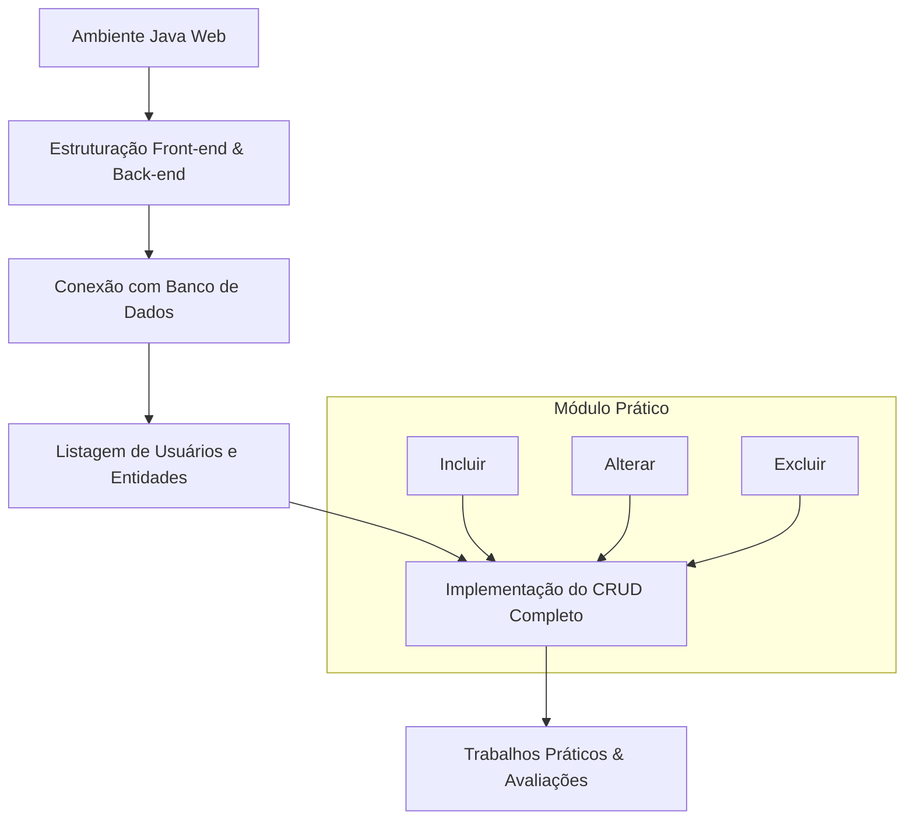

# 🎓 [Prof. Jefferson Passerini] Laboratório de Programação III
> **Semestre:** 3º Semestre  
> **Curso:** Bacharelado em Sistemas de Informação (UniFEF)  

---

## 🎯 Objetivos de Aprendizagem e Ementa

A disciplina de **Laboratório de Programação III** tem como foco capacitar o aluno no desenvolvimento de aplicações web modernas utilizando a plataforma **Java (Java Web / Servlets / JSP)** e persistência em banco de dados relacional. 

Ao longo do 3º semestre, os estudantes aprendem a:
- Configurar o ambiente de desenvolvimento web em Java.
- Criar e estruturar projetos web utilizando arquiteturas limpas (Front-end e Back-end).
- Estabelecer conexão com Bancos de Dados relacionais.
- Implementar operações completas de **CRUD** (Create, Read, Update, Delete) em sistemas web.
- Aplicar validações de dados e regras de negócio reais (como o gerenciamento de cadastros de usuários, livros e estados).
- Utilizar ferramentas de versionamento de código (Git/GitHub) em projetos colaborativos em grupo.

---

## 🏗️ Arquitetura e Modelagem do Conhecimento

---

## 📂 Estrutura das Pastas e Organização
- **Aulas/**: Materiais didáticos, slides e comunicados.
- **Trabalhos/**: Atividades avaliativas com resoluções em código.
- **Provas/**: Avaliações semestrais e critérios.
- **Resumos-IA/**: Resumos executivos, Simulados comentados, Códigos, Flashcards Anki (.tsv), CheatSheets e Apresentações PPTX.

---

## 🚀 Como Estudar com Este Material
1. **Siga a ordem cronológica das Aulas:** Comece entendendo a configuração de ambiente (Aula 01) e avance gradativamente para a criação de projetos web, conexões e CRUDs.
2. **Explore os Links Úteis:** Cada aula possui materiais complementares estruturados no Notion com o passo a passo técnico.
3. **Pratique com os Trabalhos:** Os trabalhos práticos (como o cadastro de livros e validações de e-mail/estado) consolidam a teoria vista em sala de aula.
4. **Utilize o GitHub:** Suba seus projetos versionados para garantir boas práticas de mercado exigidas nas entregas.

---

# 📚 CONTEÚDO ACADÊMICO

---

## 📌 Cronograma de Aulas

### 📌 Aula 01 - Preparando o ambiente de desenvolvimento
> **Data de Postagem:** 23/02/2026  
> **Professor Responsável:** Prof. Jefferson Passerini  
> **Disciplina:** Laboratório de Programação III (3º Semestre)  

- **Conteúdo:** Apresentação da disciplina e configuração inicial do ambiente JavaWeb.
- **🔗 Links Úteis:** [Java JSP - Cap 1 - JavaWeb - Configuração de Ambiente | Notion](https://spiffy-number-b06.notion.site/Java-JSP-Cap-1-JavaWeb-Configura-o-de-Ambiente-197393aeab2a8098900cecfb49b9faac?source=copy_link)

---

### 📌 Aula 02 - Criando um projeto web
> **Data de Postagem:** 23/02/2026  
> **Professor Responsável:** Prof. Jefferson Passerini  
> **Disciplina:** Laboratório de Programação III (3º Semestre)  

- **Conteúdo:** Criação e estruturação inicial de um projeto JavaWeb.
- **🔗 Links Úteis:** [Java JSP - Cap 4 - Criando um projeto JavaWeb | Notion](https://spiffy-number-b06.notion.site/Java-JSP-Cap-4-Criando-um-projeto-JavaWeb-1b2393aeab2a807bb9a1e9a83567bb42?source=copy_link)

---

### 📌 Aula 03 - Estrutura Projeto - Front-end
> **Data de Postagem:** 09/03/2026  
> **Professor Responsável:** Prof. Jefferson Passerini  
> **Disciplina:** Laboratório de Programação III (3º Semestre)  

- **Conteúdo:** Estruturação da interface do projeto web.
- **🔗 Links Úteis:** [Java JSP - Cap 4.4 - Estruturando a Interface do Projeto](https://spiffy-number-b06.notion.site/Java-JSP-Cap-4-4-Estruturando-a-Interface-do-Projeto-1b2393aeab2a80a8a7cdc8e23c79aa90?pvs=74)

---

### 📌 Aula 04 - Conexão com o Banco de Dados
> **Data de Postagem:** 30/03/2026  
> **Professor Responsável:** Prof. Jefferson Passerini  
> **Disciplina:** Laboratório de Programação III (3º Semestre)  

- **Conteúdo:** Configuração e integração do projeto com o banco de dados relacional.
- **🔗 Links Úteis:** [Java JSP - Cap 4.5 - Criando o Banco de Dados](https://spiffy-number-b06.notion.site/Java-JSP-Cap-4-5-Criando-o-Banco-de-Dados-1b4393aeab2a80e98de4dec692b1aba5)

---

### 📌 Aula 05 - Criando o Listar Usuario
> **Data de Postagem:** 06/04/2026  
> **Professor Responsável:** Prof. Jefferson Passerini  
> **Disciplina:** Laboratório de Programação III (3º Semestre)  

- **Conteúdo:** Implementação da listagem de usuários cadastrados vindos do banco de dados.
- **🔗 Links Úteis:** [Java JSP - Cap 5 - Implementando um CRUD Simples - Classe Usuario](https://spiffy-number-b06.notion.site/Java-JSP-Cap-5-Implementando-um-CRUD-Simples-Classe-Usuario-1b9393aeab2a80158d4fe789ab48fdbf)

---

### 📌 Aula 06 - Implementando as funções do CRUD
> **Data de Postagem:** 13/04/2026  
> **Professor Responsável:** Prof. Jefferson Passerini  
> **Disciplina:** Laboratório de Programação III (3º Semestre)  

- **Conteúdo:** Implementação das funções do CRUD (Incluir, Alterar e Excluir).
- **🔗 Links Úteis:** [Java JSP - Cap 5.2 - Operação de Manutenção do Cadastro de Usuários](https://spiffy-number-b06.notion.site/Java-JSP-Cap-5-2-Opera-o-de-Manuten-o-do-Cadastro-de-Usu-rios-1ca393aeab2a80ad851eca2a345f481a)

---

## 📝 Provas e Avaliações

### 📝 20260323 - Avaliação 1
> **Professor:** Prof. Jefferson Passerini  
> **Disciplina:** Laboratório de Programação III (3º Semestre)  
> **Prazo de Entrega:** 24/03/2026 às 23:30  
> **Pontuação Máxima:** 100 pontos  

- **Instruções:** Responda o questionário e SALVE. Depois volte na atividade e marque como entregue.
- **🔗 Link da Avaliação:** [2026 1S - AV1 - Lab3](https://forms.gle/VW5HkyeoN4fMueKX8)

---

### 📝 20260608 - Avaliação II
> **Professor:** Prof. Jefferson Passerini  
> **Disciplina:** Laboratório de Programação III (3º Semestre)  
> **Prazo de Entrega:** 09/06/2026 às 23:30  
> **Pontuação Máxima:** 100 pontos  

- **Instruções:** Faça a implementação conforme a folha de prova e entregue o projeto compactado (`.zip`) na atividade.

---

### 📝 20260625 - Avaliação Substitutiva
> **Professor:** Prof. Jefferson Passerini  
> **Disciplina:** Laboratório de Programação III (3º Semestre)  
> **Prazo de Entrega:** 26/06/2026 às 02:59  
> **Pontuação Máxima:** 100 pontos  

---

## 📋 Trabalhos Práticos

### 📋 20260427 - Trabalho de Programação (2 pontos)
> **Professor:** Prof. Jefferson Passerini  
> **Disciplina:** Laboratório de Programação III (3º Semestre)  
> **Prazo de Entrega:** 08/05/2026 às 02:59  
> **Pontuação Máxima:** 100 pontos  

- **Instruções:** 
  Trabalho de Programação - Java Web. Construir um programa com Java Web utilizando servlets que faça a manutenção de um cadastro de Livros.
  
  **Atributos da Classe `Livro`:**
  - `id`
  - `nomeLivro`
  - `isbn`
  - `autor`
  - `dataPublicacao`
  - `valorLivro`

  **Requisitos:**
  - O software deve exibir uma lista de livros cadastrados.
  - **Extra:** Implementar a manutenção de livros (incluir, alterar e excluir).
  - **Extra:** Publicar o projeto no GitHub.
  - **Formato:** Trabalho em grupo de até 3 alunos.

---

### 📋 20260511 - Trabalho de Programação (1 ponto)
> **Professor:** Prof. Jefferson Passerini  
> **Disciplina:** Laboratório de Programação III (3º Semestre)  
> **Prazo de Entrega:** 26/05/2026 às 02:59  
> **Pontuação Máxima:** 100 pontos  

- **Instruções:** Implemente conforme as instruções complementares dos desafios.
- **🔗 Links Úteis:**
  - [Desafio 01: Implementar as validações para o campo e-mail](https://spiffy-number-b06.notion.site/Java-JSP-Cap-5-3-Desafio-01-Implementar-as-valida-es-para-o-campo-e-mail-1cf393aeab2a80b5b2cee8a21286816f)
  - [Desafio 02: Implementar o cadastro de Estado no projeto](https://spiffy-number-b06.notion.site/Java-JSP-Cap-5-4-Desafio-02-Implementar-o-cadastro-de-Estado-no-projeto-1cf393aeab2a80fa990ed0fc43391a3a?pvs=74)