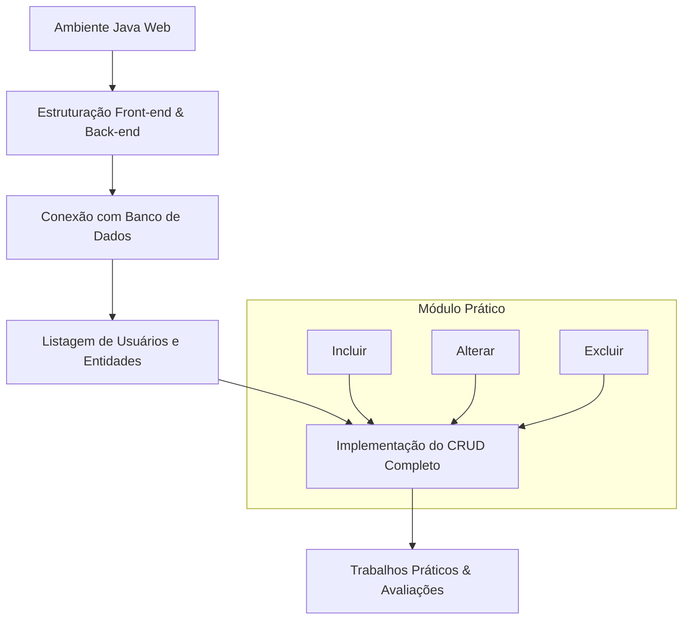
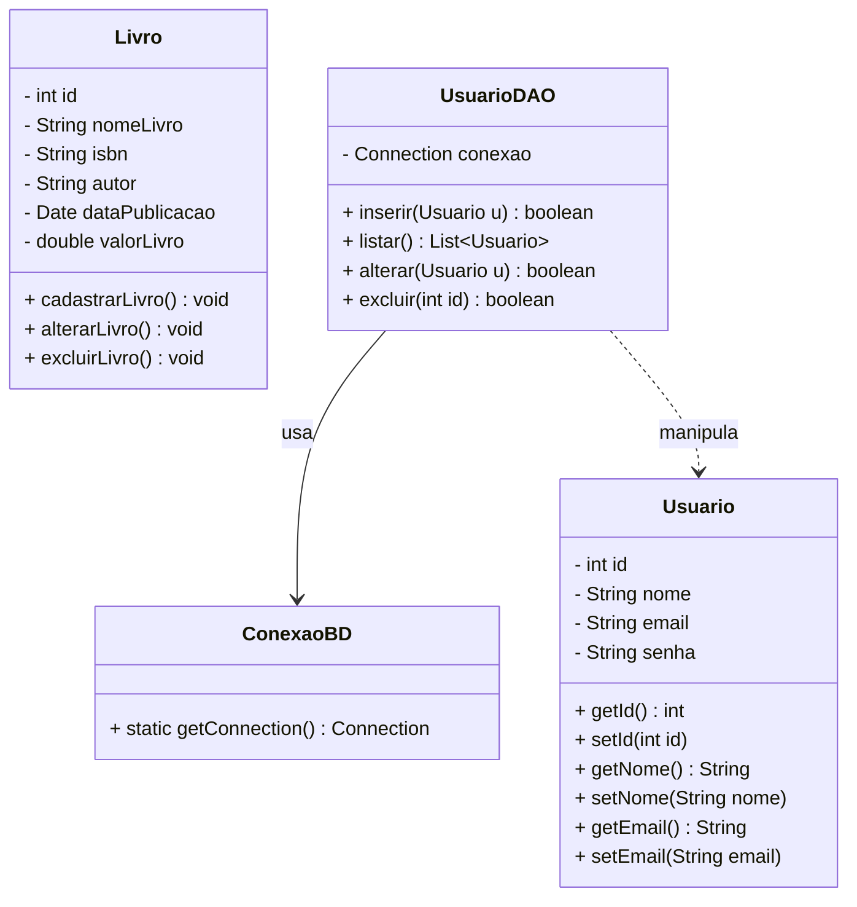
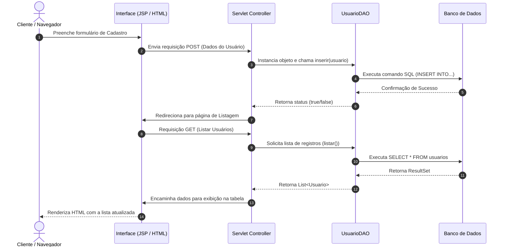
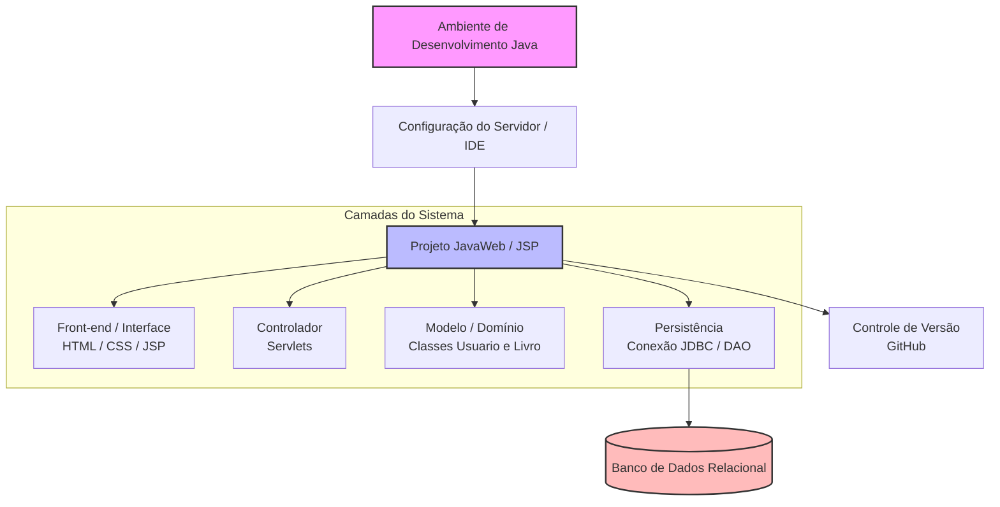

# [Prof. Jefferson Passerini] Laboratório de Programação III

> **Semestre:** 3º Semestre
> **Curso:** Bacharelado em Sistemas de Informação (UniFEF)
> **Professor:** Jefferson Passerini
> **Escopo:** Java Web (Servlets, JSP, JDBC) e implementação de CRUD completo

---

## Sumário

1. [Objetivos de Aprendizagem e Ementa](#objetivos-de-aprendizagem-e-ementa)
2. [Aulas](#aulas)
3. [Avaliações e Trabalhos](#avaliações-e-trabalhos)
4. [Como Estudar com Este Material](#como-estudar-com-este-material)
5. [Estrutura do Repositório](#estrutura-do-repositório)
6. [Arquitetura e Modelagem do Conhecimento](#arquitetura-e-modelagem-do-conhecimento)
7. [Resumo Executivo](#resumo-executivo)
8. [Exercícios Práticos Implementados](#exercícios-práticos-implementados)
9. [Simulado Comentado](#simulado-comentado)
10. [CheatSheet de Revisão Rápida](#cheatsheet-de-revisão-rápida)
11. [Diagramas e Modelagem](#diagramas-e-modelagem)
12. [Material Complementar (Slides, Flashcards, Dataset)](#material-complementar)

---

## Objetivos de Aprendizagem e Ementa

A disciplina de **Laboratório de Programação III** tem como foco capacitar o aluno no desenvolvimento de aplicações web modernas utilizando a plataforma **Java (Java Web / Servlets / JSP)** e persistência em banco de dados relacional.

Ao longo do 3º semestre, os estudantes aprendem a:
- Configurar o ambiente de desenvolvimento web em Java.
- Criar e estruturar projetos web utilizando arquiteturas limpas (Front-end e Back-end).
- Estabelecer conexão com Bancos de Dados relacionais via JDBC.
- Implementar operações completas de **CRUD** (Create, Read, Update, Delete) em sistemas web.
- Aplicar validações de dados e regras de negócio reais (como o gerenciamento de cadastros de usuários, livros e estados).
- Utilizar ferramentas de versionamento de código (Git/GitHub) em projetos colaborativos em grupo.

---

## Aulas

| Aula | Tema | Material |
| :--- | :--- | :--- |
| 1 | Preparando o Ambiente de Desenvolvimento | [Conteúdo completo](Aulas/Aula%2001%20-%20Preparando%20o%20Ambiente%20de%20Desenvolvimento/detalhes.md) · [Diagrama de atividades](Aulas/Aula%2001%20-%20Preparando%20o%20Ambiente%20de%20Desenvolvimento/diagramas/fluxo-configuracao-ambiente-atividades.svg) |
| 2 | Criando um Projeto Web | [Conteúdo completo](Aulas/Aula%2002%20-%20Criando%20um%20Projeto%20Web/detalhes.md) · [Diagrama de atividades](Aulas/Aula%2002%20-%20Criando%20um%20Projeto%20Web/diagramas/fluxo-criacao-projeto-atividades.svg) |
| 3 | Estrutura do Projeto — Front-end | [Conteúdo completo](Aulas/Aula%2003%20-%20Estrutura%20do%20Projeto%20-%20Front-end/detalhes.md) · [Bibliotecas front-end](Aulas/Aula%2003%20-%20Estrutura%20do%20Projeto%20-%20Front-end/js.zip) · [Diagrama de atividades](Aulas/Aula%2003%20-%20Estrutura%20do%20Projeto%20-%20Front-end/diagramas/fluxo-validacao-campo-atividades.svg) |
| 4 | Conexão com o Banco de Dados (JDBC) | [Conteúdo completo](Aulas/Aula%2004%20-%20Conex%C3%A3o%20com%20o%20Banco%20de%20Dados/detalhes.md) · [Diagrama de sequência](Aulas/Aula%2004%20-%20Conex%C3%A3o%20com%20o%20Banco%20de%20Dados/diagramas/fluxo-conexao-jdbc-sequencia.svg) |
| 5 | Criando o Listar Usuário (Read) | [Conteúdo completo](Aulas/Aula%2005%20-%20Listagem%20de%20Usu%C3%A1rios/detalhes.md) · [Diagrama de classes](Aulas/Aula%2005%20-%20Listagem%20de%20Usu%C3%A1rios/diagramas/modelo-classes-listagem-classes.svg) |
| 6 | Implementando as Funções do CRUD (Create/Update/Delete) | [Conteúdo completo](Aulas/Aula%2006%20-%20Implementando%20o%20CRUD/detalhes.md) · [Diagrama de sequência](Aulas/Aula%2006%20-%20Implementando%20o%20CRUD/diagramas/fluxo-crud-completo-sequencia.svg) |

## Avaliações e Trabalhos

| Avaliação | Tema | Material |
| :--- | :--- | :--- |
| Trabalho (2 pontos) | Cadastro de Livros — CRUD com Servlets | [Enunciado e arquitetura](Trabalhos/20260427%20-%20Trabalho%20de%20Programa%C3%A7%C3%A3o%20(2%20pontos)/detalhes.md) · [`schema.sql`](Trabalhos/20260427%20-%20Trabalho%20de%20Programa%C3%A7%C3%A3o%20(2%20pontos)/schema.sql) |
| Trabalho (1 ponto) | Validação de e-mail e cadastro de Estado | [Enunciado e solução](Trabalhos/20260511%20-%20Trabalho%20de%20programa%C3%A7%C3%A3o%20(1%20ponto)/detalhes.md) · [`EmailValidator.java`](Trabalhos/20260511%20-%20Trabalho%20de%20programa%C3%A7%C3%A3o%20(1%20ponto)/EmailValidator.java) |
| Avaliação 1 | Questionário Google Forms (Aulas 01-03) | [Detalhes](Provas/20260323%20-%20Avalia%C3%A7%C3%A3o%201/detalhes.md) |
| Avaliação II | Projeto compactado — folha de prova não anexada | [Detalhes](Provas/20260608%20-%20Avalia%C3%A7%C3%A3o%20II/detalhes.md) |
| Avaliação Substitutiva | Enunciado não disponível localmente | [Detalhes](Provas/20260625%20Avalia%C3%A7%C3%A3o%20Substitutiva/detalhes.md) |

---

## Como Estudar com Este Material

1. **Siga a ordem cronológica das Aulas:** comece pela configuração de ambiente (Aula 01) e avance gradativamente pela criação de projetos web, estruturação de front-end, conexão com o banco e implementação do CRUD completo (Aula 06). Cada `detalhes.md` traz teoria, código real e exercícios de fixação com gabarito.
2. **Explore os Links Úteis:** cada aula referencia o material complementar no Notion com o passo a passo técnico ilustrado (capturas de tela), não replicado localmente.
3. **Consulte o Resumo Executivo, Simulado e CheatSheet** deste README (seções abaixo) para revisão rápida antes das avaliações.
4. **Pratique com os Trabalhos:** os trabalhos práticos (cadastro de livros, validação de e-mail/estado) consolidam a teoria vista em sala de aula, aplicando o mesmo padrão Model/DAO/Servlet ensinado nas Aulas 04-06.
5. **Utilize o GitHub:** suba seus projetos versionados para garantir boas práticas de mercado exigidas nas entregas.
6. **Importe os flashcards:** [`Resumos-IA/flashcards-anki.tsv`](./Resumos-IA/flashcards-anki.tsv) no [Anki](https://apps.ankiweb.net/) para memorização ativa.

---

## Estrutura do Repositório

```text
.
├── Aulas/
│   ├── Aula 01 - Preparando o Ambiente de Desenvolvimento/
│   │   ├── detalhes.md
│   │   ├── diagramas/            # PlantUML (.puml) + SVG renderizado
│   │   └── post-original.md      # post original do Classroom
│   ├── Aula 02 - Criando um Projeto Web/
│   ├── Aula 03 - Estrutura do Projeto - Front-end/    (inclui js.zip — libs front-end originais)
│   ├── Aula 04 - Conexão com o Banco de Dados/
│   ├── Aula 05 - Listagem de Usuários/
│   ├── Aula 06 - Implementando o CRUD/
│   └── links-recursos.md         # links Notion agregados de todas as aulas
├── Trabalhos/                    # Atividades avaliativas (detalhes.md + código anexo)
│   ├── 20260427 - Trabalho de Programação (2 pontos)/
│   └── 20260511 - Trabalho de programação (1 ponto)/
├── Provas/                       # Avaliações semestrais (detalhes.md + código anexo)
│   ├── 20260323 - Avaliação 1/
│   ├── 20260608 - Avaliação II/
│   └── 20260625 Avaliação Substitutiva/
└── Resumos-IA/                   # Material de apoio gerado por IA
    ├── Slides-Revisao-[...].pptx  # Apresentação de revisão (dark mode, widescreen)
    ├── flashcards-anki.tsv        # Baralho para importar no Anki
    └── dataset-estudo-qa.jsonl    # Dataset de perguntas e respostas
```

Cada subpasta de `Aulas/` contém um `detalhes.md` com o conteúdo completo (teoria + exemplos + exercícios) e uma subpasta `diagramas/` com o `.puml` fonte ao lado do `.svg` renderizado. As pastas de `Trabalhos/` e `Provas/` contêm o enunciado real (extraído do post do Classroom) e os arquivos entregues/anexados pelo professor.

---

## Arquitetura e Modelagem do Conhecimento



---

## Resumo Executivo

### 1. Visão Geral e Objetivos da Matéria
A disciplina de **Laboratório de Programação III** (oferecida no 3º semestre do curso
de Sistemas de Informação sob a tutela do Prof. Jefferson Passerini) tem como foco
principal a capacitação prática no desenvolvimento de **Aplicações Web utilizando a
linguagem Java** (Ecossistema Java Web / JSP / Servlets).

O objetivo central é transicionar o conhecimento de lógica e programação orientada a
objetos para o ambiente corporativo web, capacitando o aluno a projetar, estruturar,
codificar e persistir dados em sistemas web completos, aplicando o padrão
arquitetural clássico e operando sobre fluxos de requisição/resposta HTTP,
manipulação de interfaces (Front-end) e comunicação com Bancos de Dados Relacionais.

### 2. Conceitos-Chave e Terminologia Fundamental
* **Ambiente de Desenvolvimento (IDE / Servidor Web):** configuração de ferramentas e containers web (como Apache Tomcat) para hospedar e executar aplicações Java EE/Jakarta EE.
* **Java Web / Servlets:** classes Java que interceptam e respondem a requisições HTTP, atuando como o núcleo controlador (Controller) das aplicações.
* **JSP (JavaServer Pages):** tecnologia que permite embutir código Java em páginas HTML, facilitando a construção dinâmica de interfaces de usuário (Front-end).
* **Arquitetura e Estrutura de Projeto:** organização de pacotes e diretórios seguindo boas práticas de separação de responsabilidades (camadas de visão, controle e persistência).
* **Persistência e Conexão com Banco de Dados:** estabelecimento de pontes de comunicação (JDBC/Drivers) entre a aplicação Java Web e sistemas gerenciadores de banco de dados relacionais.
* **CRUD (Create, Read, Update, Delete):** o acrônimo fundamental para as quatro operações básicas de manutenção de dados (Incluir, Listar/Consultar, Alterar e Excluir).

### 3. Principais Módulos Abordados
1. **Configuração de Ambiente (Aula 01):** instalação e parametrização das ferramentas de desenvolvimento, JDK, IDEs compatíveis e configuração do servidor de aplicação (Tomcat) para suporte a projetos dinâmicos web.
2. **Criação de Projetos Web e Estrutura Front-end (Aulas 02 e 03):** criação da estrutura de diretórios padrão de um projeto web Java (Dynamic Web Project / Maven), definição do arquivo descritor de deployment (`web.xml`), e construção da interface do usuário utilizando HTML/JSP e bibliotecas JavaScript (máscaras, validação de CPF/CNPJ) para captação de dados.
3. **Conexão com o Banco de Dados (Aula 04):** implementação das classes de conexão utilizando JDBC. Envolve o carregamento do driver de banco de dados, abertura de conexões seguras, tratamento de exceções de SQL e encerramento adequado de recursos (`Connection`, `PreparedStatement`).
4. **Listagem de Dados (Aula 05):** execução de comandos SQL do tipo `SELECT` a partir do Servlet, mapeamento do `ResultSet` para objetos de domínio (ex.: classe `Usuario`) e envio desses dados para a página JSP exibi-los dinamicamente em formato de tabela.
5. **Implementação Completa do CRUD (Aula 06):**
   * **Create (Incluir):** captura de parâmetros via requisição HTTP (`request.getParameter`), persistência via `INSERT` no banco.
   * **Read (Listar):** consulta e renderização dos registros.
   * **Update (Alterar):** recuperação do registro por ID, preenchimento de formulário e execução de comando `UPDATE`.
   * **Delete (Excluir):** remoção do registro com base em identificadores únicos (`DELETE FROM`).

### 4. Relações com o Mercado e Prática Profissional
O ecossistema Java corporativo continua sendo um dos pilares mais robustos no mercado
de desenvolvimento de software empresarial, sistemas bancários, e-commerce e APIs de
alta escala. Embora o mercado moderno utilize frameworks avançados (como Spring
Boot), a compreensão profunda de **Servlets, JSP e JDBC** fornece a base técnica
exata (*under the hood*) de como a web funciona em Java — saber como uma requisição
HTTP viaja do navegador até o banco de dados sem "mágicas" de frameworks é um
diferencial crítico para um analista de sistemas. Os trabalhos práticos (sistema de
manutenção de cadastros de Livros, desafios de validação de e-mails e estados) simulam
demandas reais de software corporativo, exigindo trabalho em equipe, versionamento de
código (Git/GitHub) e entrega de soluções funcionais ponta a ponta.

### 5. Dicas de Ouro para Estudo e Provas
* **Domine o Fluxo Requisição-Resposta:** entenda como um formulário HTML envia dados via POST/GET, como o Servlet os intercepta (`request.getParameter`), processa a regra de negócio/banco, e redireciona ou despacha (`RequestDispatcher`) a resposta de volta para o JSP.
* **Pratique a Sintaxe de Conexão JDBC:** erros ao abrir conexões ou esquecer de fechar `Statements` geram falhas críticas — tenha um template mental bem memorizado.
* **Atenção aos Detalhes dos Modelos:** garanta que os atributos da classe casem perfeitamente com as colunas do banco e com os nomes dos campos (`name="..."`) nos formulários HTML/JSP.
* **Utilize os Recursos Complementares:** revise os roteiros do Notion (links oficiais das aulas e desafios práticos), pois trazem o passo a passo exato exigido nas avaliações.

---

## Exercícios Práticos Implementados

O conjunto completo de exemplos comentados — classe utilitária de conexão JDBC, `Usuario`/`UsuarioDAO` completo (CRUD) e o exercício resolvido do Trabalho de Livros (`Livro`, `schema.sql`, `LivroServlet`) — está distribuído entre [`Aulas/Aula 04`](Aulas/Aula%2004%20-%20Conex%C3%A3o%20com%20o%20Banco%20de%20Dados/detalhes.md), [`Aulas/Aula 05`](Aulas/Aula%2005%20-%20Listagem%20de%20Usu%C3%A1rios/detalhes.md), [`Aulas/Aula 06`](Aulas/Aula%2006%20-%20Implementando%20o%20CRUD/detalhes.md) e no [Trabalho de Programação de Livros](Trabalhos/20260427%20-%20Trabalho%20de%20Programa%C3%A7%C3%A3o%20(2%20pontos)/detalhes.md).

### Resumo das Avaliações da Disciplina
- **Avaliação I (AV1):** 23/03/2026 (questionário Google Forms, prático/teórico).
- **Trabalho de Programação (2 pts):** entrega até 08/05/2026 (CRUD de Livros com Servlets e GitHub).
- **Trabalho de Programação (1 pt):** entrega até 26/05/2026 (validações e cadastro de Estados — desafios JSP).
- **Avaliação II (AVII):** 09/06/2026 (projeto completo compactado `.zip`).
- **Avaliação Substitutiva:** 26/06/2026 (enunciado não disponível localmente).

---

## Simulado Comentado

**Conteúdo abrangido:** Ambiente Java Web, Estrutura Front-end/Back-end, Conexão com
Banco de Dados, Listagem e Operações de CRUD (Incluir, Alterar, Excluir).

### Parte 1 — Múltipla Escolha

**Questão 1.** Na Aula 01, o foco inicial da disciplina é a preparação do ambiente de
desenvolvimento. Qual alternativa descreve corretamente os componentes essenciais
para iniciar projetos Java Web?
A) Apenas um editor de texto simples e o interpretador de comandos do sistema operacional.
B) Configuração de JDK, IDE de desenvolvimento (Eclipse/IntelliJ) e um Servidor de Aplicação/Web (Apache Tomcat).
C) Apenas a instalação do framework Angular e Node.js.
D) Um banco de dados NoSQL e um compilador C++.
E) Um navegador web atualizado e um editor de imagens vetoriais.
> **Gabarito: B** — o desenvolvimento Java Web tradicional (JSP/Servlets) exige o JDK para compilação, uma IDE para agilizar o código e um container web/servlet como o Apache Tomcat para hospedar e executar as aplicações.

**Questão 2.** Sobre a criação de um projeto web em Java (Aula 02), qual é a estrutura
de diretórios padrão recomendada (Maven/Dynamic Web Project) no contexto de Servlets e JSP?
A) `src/` contendo apenas arquivos HTML estáticos.
B) `src/main/java` para as classes Java (Servlets, DAOs, Models) e diretórios de webapp/WebContent para JSP e arquivos estáticos.
C) Apenas um arquivo único `.exe` contendo toda a aplicação compilada.
D) Pastas separadas exclusivamente para scripts em Python e Ruby.
E) Uma estrutura baseada em blocos de notas salvos na raiz do sistema operacional.
> **Gabarito: B** — o código-fonte backend fica separado dos recursos web (JSP, CSS/JS, `web.xml`).

**Questão 3.** No contexto de JSP, qual é o papel principal das páginas JSP na arquitetura da aplicação (Aula 03)?
A) Substituir completamente o banco de dados relacional.
B) Atuar exclusivamente como controladoras de requisições de rede de baixo nível.
C) Servir como camada de visualização (View), misturando HTML com elementos dinâmicos em Java.
D) Compilar o código-fonte em linguagem de máquina nativa.
E) Gerenciar transações complexas de concorrência diretamente no hardware.
> **Gabarito: C** — o JSP é voltado para a camada de apresentação (View).

**Questão 4.** Na Aula 04, qual API padrão do Java é usada para conectar e executar SQL em bancos relacionais?
A) Swing API B) **JDBC (Java Database Connectivity)** C) JavaFX Database Engine D) ServletContext Interface E) DOM Parser
> **Gabarito: B**

**Questão 5.** Para listar registros (Aula 05), qual classe do JDBC executa `SELECT` e retorna os dados?
A) `HttpServletRequest` B) `PrintWriter` C) **`ResultSet`** D) `HttpSession` E) `WebAppContext`
> **Gabarito: C** — o resultado da consulta vem encapsulado em um `ResultSet`, percorrido linha a linha.

**Questão 6.** Qual método HTTP formulários usam comumente para enviar dados de cadastro (inclusão/alteração) a um Servlet?
A) `GET` B) **`POST`** C) `TRACE` D) `OPTIONS` E) `HEAD`
> **Gabarito: B** — envia os parâmetros no corpo da requisição, com mais segurança e capacidade que `GET`.

**Questão 7.** Que padrão de projeto separa as regras de acesso ao banco das regras de negócio e da interface web (trabalho de Livros)?
A) Singleton estrito B) **DAO (Data Access Object)** C) Observer bidirecional assíncrono D) Factory Method de arquivos binários E) MVC via Servlets/JSP
> **Gabarito: E (arquitetural) / B (persistência)** — MVC separa camadas globalmente (Servlet=Controller, JSP=View, Model/DAO=dados); DAO isola especificamente o acesso ao banco.

**Questão 8.** Qual a principal vantagem do `PreparedStatement` sobre o `Statement` comum?
A) Acelerar carregamento de imagens B) **Prevenir SQL Injection via parametrização** C) Rodar só em Linux D) Dispensar drivers de banco E) Converter JSP em PDF
> **Gabarito: B**

**Questão 9.** Onde deve ocorrer a validação robusta de regras de negócio (ex.: campo e-mail) antes de persistir dados?
A) Só no navegador via CSS B) No `server.xml` do Tomcat C) **No back-end (Servlet/Model), complementada por validação visual no front-end** D) No HTML estático E) Em triggers de banco em Assembly
> **Gabarito: C** — o front-end pode ser burlado, então a validação no servidor é mandatória.

**Questão 10.** Onde os projetos práticos da disciplina devem ser versionados e disponibilizados?
A) **GitHub** B) Photoshop C) Microsoft Word D) WinRAR E) FileZilla Server
> **Gabarito: A**

### Parte 2 — Discursivas e Estudos de Caso

**Questão 11.** Explique a importância da configuração correta do ambiente (JDK, IDE, Tomcat) nas Aulas 01/02, e o que acontece se o Tomcat não estiver integrado corretamente à IDE.
> **Resposta esperada:** a configuração correta garante que o compilador encontre as bibliotecas da API Servlet (`javax.servlet`/`jakarta.servlet`). Sem o Tomcat integrado, a aplicação não gera o `.war` corretamente nem faz deploy local; ao acessar a URL de um Servlet, o servidor retorna erro de compilação, caminho ou HTTP 404, pois o container não sabe onde/como executar as classes controladoras.

**Questão 12.** Escreva um trecho JDBC (Aula 04) que abra conexão com um banco MySQL via `DriverManager`.
```java
import java.sql.Connection;
import java.sql.DriverManager;
import java.sql.SQLException;

public class ConexaoDB {
    public static Connection conectar() {
        Connection conexao = null;
        String url = "jdbc:mysql://localhost:3306/nome_do_banco";
        String usuario = "root";
        String senha = "sua_senha";

        try {
            Class.forName("com.mysql.cj.jdbc.Driver");
            conexao = DriverManager.getConnection(url, usuario, senha);
        } catch (ClassNotFoundException e) {
            System.out.println("Driver do banco não encontrado: " + e.getMessage());
        } catch (SQLException e) {
            System.out.println("Erro ao conectar ao banco de dados: " + e.getMessage());
        }
        return conexao;
    }
}
```

**Questão 13.** Descreva o fluxo lógico completo, da requisição do navegador até a exibição na JSP, para listar livros cadastrados (Aula 05 + trabalho de Livros).
> **Resposta esperada:**
> 1. **Requisição:** usuário acessa uma URL (ex.: `/listarLivros`).
> 2. **Controller (Servlet):** a requisição é interceptada pelo Servlet mapeado.
> 3. **Model/DAO:** o Servlet aciona `LivroDAO`, que executa `SELECT * FROM livro` via JDBC.
> 4. **Processamento:** o `ResultSet` retornado é convertido em `List<Livro>`.
> 5. **Encaminhamento:** o Servlet guarda a lista em `request.setAttribute("livros", listaLivros)` e usa `RequestDispatcher` para encaminhar a `listar.jsp`.
> 6. **View (JSP):** a página usa `<c:forEach>` (JSTL) para renderizar a tabela HTML com os dados.

**Questão 14.** Como o sistema diferencia se deve inserir ou atualizar um registro ao receber dados de um formulário (trabalho de Livros)?
> **Resposta esperada:** pela verificação do campo `id`. Se estiver vazio, nulo ou zero, é um registro novo → `INSERT`. Se tiver um valor numérico existente, é uma edição → `UPDATE` filtrando por esse `id` — geralmente auxiliado por um campo oculto (`<input type="hidden" name="id" value="...">`) no formulário.

**Questão 15.** Elabore a estrutura da classe Java `Livro` com os atributos especificados pelo professor (`id`, `nomeLivro`, `isbn`, `autor`, `dataPublicacao`, `valorLivro`), incluindo construtores, getters e setters.
> **Resposta esperada:**
> ```java
> package com.exemplo.model;
>
> import java.util.Date;
>
> public class Livro {
>     private int id;
>     private String nomeLivro;
>     private String isbn;
>     private String autor;
>     private Date dataPublicacao;
>     private double valorLivro;
>
>     public Livro() {}
>
>     public Livro(int id, String nomeLivro, String isbn, String autor, Date dataPublicacao, double valorLivro) {
>         this.id = id;
>         this.nomeLivro = nomeLivro;
>         this.isbn = isbn;
>         this.autor = autor;
>         this.dataPublicacao = dataPublicacao;
>         this.valorLivro = valorLivro;
>     }
>
>     public int getId() { return id; }
>     public void setId(int id) { this.id = id; }
>     public String getNomeLivro() { return nomeLivro; }
>     public void setNomeLivro(String nomeLivro) { this.nomeLivro = nomeLivro; }
>     public String getIsbn() { return isbn; }
>     public void setIsbn(String isbn) { this.isbn = isbn; }
>     public String getAutor() { return autor; }
>     public void setAutor(String autor) { this.autor = autor; }
>     public Date getDataPublicacao() { return dataPublicacao; }
>     public void setDataPublicacao(Date dataPublicacao) { this.dataPublicacao = dataPublicacao; }
>     public double getValorLivro() { return valorLivro; }
>     public void setValorLivro(double valorLivro) { this.valorLivro = valorLivro; }
> }
> ```
> Essa classe é o modelo (Model) usado pelo `LivroServlet` e por um futuro `LivroDAO`, espelhando exatamente as colunas da tabela `livros` criada em `schema.sql`.

---

## CheatSheet de Revisão Rápida

**Disciplina:** Lab. Programação III (3º Sem. — Java Web / JSP / Servlets)

**1. Ambiente & Estrutura de Projeto Web**
- Pilares: Java Web, Servlets, JSP, Banco de Dados (JDBC).
- Estrutura: páginas JSP para interface, Servlets para controle de fluxo (MVC simplificado).
- Deploy: servidor de aplicação compatível com Servlet (ex.: Apache Tomcat).

**2. Banco de Dados & Conexão**
- Conexão (JDBC): `DriverManager`, `Connection`, `PreparedStatement`, `ResultSet`.
- Operações básicas: `INSERT INTO` (incluir) · `SELECT * FROM` (listar) · `UPDATE ... SET ... WHERE id = ?` (alterar) · `DELETE FROM ... WHERE id = ?` (excluir).

**3. Fluxo do CRUD**
1. **Create:** formulário JSP → Servlet → `INSERT` no banco.
2. **Read:** Servlet consulta (`SELECT`) → lista → JSP exibe em `<table>`.
3. **Update:** carrega dados pelo `id` → edita no formulário → `UPDATE` no banco.
4. **Delete:** recebe `id` via parâmetro → `DELETE` no banco.

**4. Padrões de Entidade**
```java
// Atributos típicos exigidos em trabalhos
private int id;
private String nome; // ou nomeLivro / email
private String autor; // ou isbn / dataPublicacao / valorLivro
```
Validações comuns: campos obrigatórios (ex.: formato de e-mail) antes de persistir — sempre reforçadas no back-end, mesmo já validadas no front-end (ver Aula 03).

**5. Checklist rápido para provas e trabalhos**
- [ ] Configurar corretamente o projeto Web e o Tomcat na IDE.
- [ ] Garantir a classe de conexão com o Banco de Dados ativa.
- [ ] Mapear as Servlets (`@WebServlet`) corretamente.
- [ ] Validar se os formulários HTML/JSP apontam para os métodos corretos (`GET`/`POST`).
- [ ] Tratar parâmetros nulos ou conversões de tipos (`Integer.parseInt(request.getParameter("id"))`).

---

## Diagramas e Modelagem

### Diagramas por aula (PlantUML)

Os diagramas específicos de cada aula ficam junto do respectivo `detalhes.md`, em `diagramas/` (fonte `.puml` + `.svg` renderizado):

- [Fluxo de configuração do ambiente](Aulas/Aula%2001%20-%20Preparando%20o%20Ambiente%20de%20Desenvolvimento/diagramas/fluxo-configuracao-ambiente-atividades.svg) (diagrama de atividades)
- [Fluxo de criação do projeto Web](Aulas/Aula%2002%20-%20Criando%20um%20Projeto%20Web/diagramas/fluxo-criacao-projeto-atividades.svg) (diagrama de atividades)
- [Fluxo de validação de campo com máscara](Aulas/Aula%2003%20-%20Estrutura%20do%20Projeto%20-%20Front-end/diagramas/fluxo-validacao-campo-atividades.svg) (diagrama de atividades)
- [Fluxo de conexão JDBC](Aulas/Aula%2004%20-%20Conex%C3%A3o%20com%20o%20Banco%20de%20Dados/diagramas/fluxo-conexao-jdbc-sequencia.svg) (diagrama de sequência)
- [Modelo de classes — Listagem de Usuários](Aulas/Aula%2005%20-%20Listagem%20de%20Usu%C3%A1rios/diagramas/modelo-classes-listagem-classes.svg) (diagrama de classes)
- [Fluxo completo do CRUD](Aulas/Aula%2006%20-%20Implementando%20o%20CRUD/diagramas/fluxo-crud-completo-sequencia.svg) (diagrama de sequência)

### Diagrama de classes UML (domínio da matéria)



### Diagrama de sequência (fluxo do CRUD — Listar e Incluir)



### Diagrama arquitetural (ambiente e camadas do projeto)



---

## Material Complementar

### Apresentação de revisão em slides

[`Resumos-IA/Slides-Revisao-[Prof. Jefferson Passerini] Laboratório de Programação III.pptx`](./Resumos-IA/Slides-Revisao-%5BProf.%20Jefferson%20Passerini%5D%20Laborat%C3%B3rio%20de%20Programa%C3%A7%C3%A3o%20III.pptx) —
deck de slides em dark mode (Slate/Navy/Teal/Indigo), 16:9 widescreen, cobrindo
Visão Geral, Conceitos Fundamentais, Exercícios/Prática e Dicas de Prova.

### Flashcards para Anki

[`Resumos-IA/flashcards-anki.tsv`](./Resumos-IA/flashcards-anki.tsv) — baralho pergunta/resposta (formato
TSV de 2 colunas) cobrindo professor, semestre, cronograma de aulas e conceitos
centrais da disciplina. Para importar: no Anki, **Arquivo → Importar**, selecione o
`.tsv` e mapeie as colunas para *Frente* e *Verso*.

### Dataset de Perguntas e Respostas (JSONL)

[`Resumos-IA/dataset-estudo-qa.jsonl`](./Resumos-IA/dataset-estudo-qa.jsonl) — pares de
pergunta/resposta estruturados (`id`, `topico`, `pergunta`, `resposta`,
`dificuldade`), prontos para consumo por scripts/ferramentas de estudo.
