# Guia de Estudos Integrado: Laboratório de Programação III

**Instituição:** Centro Universitário de Fernandópolis (UniFEF)  
**Curso:** Bacharelado em Sistemas de Informação (3º Semestre)  
**Disciplina:** Laboratório de Programação III  
**Docente Responsável:** Prof. Jefferson Passerini  

---

## Sumário

- [Apresentação da Disciplina e Visão Geral da Arquitetura](#apresentação-da-disciplina-e-visão-geral-da-arquitetura)
- [Fundamentos da Linguagem Java e POO Corporativa](#fundamentos-da-linguagem-java-e-poo-corporativa)
  - [Encapsulamento, Invariantes e Boas Práticas de JavaBeans](#encapsulamento-invariantes-e-boas-práticas-de-javabeans)
  - [Herança, Classes Abstratas e o Princípio de Substituição de Liskov](#herança-classes-abstratas-e-o-princípio-de-substituição-de-liskov)
  - [Polimorfismo, Ligação Tardia e Desacoplamento](#polimorfismo-ligação-tardia-e-desacoplamento)
  - [Interfaces como Contratos Formais de Arquitetura](#interfaces-como-contratos-formais-de-arquitetura)
  - [Tratamento Robusto de Exceções e Erros de Domínio](#tratamento-robusto-de-exceções-e-erros-de-domínio)
  - [Manipulação de Coleções e Ordenação](#manipulação-de-coleções-e-ordenação)
- [Configuração do Ecossistema e Ambiente de Desenvolvimento](#configuração-do-ecossistema-e-ambiente-de-desenvolvimento)
  - [Padrões do Java JDK 17 LTS](#padrões-do-java-jdk-17-lts)
  - [Apache Tomcat 9 e a Transição de Namespaces](#apache-tomcat-9-e-a-transição-de-namespaces)
  - [Apache NetBeans 24 e Parâmetros Globais](#apache-netbeans-24-e-parâmetros-globais)
  - [Monólito Modular versus Microsserviços](#monólito-modular-versus-microsserviços)
  - [Organização Estrutural de Pacotes e Diretórios](#organização-estrutural-de-pacotes-e-diretórios)
- [Persistência de Dados Relacional e JDBC com PostgreSQL](#persistência-de-dados-relacional-e-jdbc-com-postgresql)
  - [Modelagem Relacional, Tipos de Dados e Sequências](#modelagem-relacional-tipos-de-dados-e-sequências)
  - [Administração via pgAdmin 4 e Versionamento de Scripts](#administração-via-pgadmin-4-e-versionamento-de-scripts)
  - [Padrão Criacional Singleton e a Classe SingleConnection](#padrão-criacional-singleton-e-a-classe-singleconnection)
  - [Prevenção Sistemática de SQL Injection](#prevenção-sistemática-de-sql-injection)
  - [Controle Transacional Manual e Propriedades ACID](#controle-transacional-manual-e-propriedades-acid)
  - [Prevenção de Vazamento de Recursos com Try-With-Resources](#prevenção-de-vazamento-de-recursos-com-try-with-resources)
- [Arquitetura em Camadas e o Padrão MVC no Ecossistema Java Web](#arquitetura-em-camadas-e-o-padrão-mvc-no-ecossistema-java-web)
  - [O Padrão Arquitetural MVC Modelo 2](#o-padrão-arquitetural-mvc-modelo-2)
  - [O Padrão Data Access Object e a Interface GenericDAO](#o-padrão-data-access-object-e-a-interface-genericdao)
  - [Implementação da Camada de Domínio](#implementação-da-camada-de-domínio)
  - [Implementação Concreta da Camada DAO](#implementação-concreta-da-camada-dao)
  - [Bifurcação de Persistência com Base na Chave Primária](#bifurcação-de-persistência-com-base-na-chave-primária)
- [A Camada Controladora e o Ciclo de Vida dos Servlets](#a-camada-controladora-e-o-ciclo-de-vida-dos-servlets)
  - [Semântica do Protocolo HTTP](#semântica-do-protocolo-http)
  - [Ciclo de Vida do HttpServlet e Concorrência](#ciclo-de-vida-do-httpservlet-e-concorrência)
  - [Mapeamento com WebServlet e Escopos de Dados](#mapeamento-com-webservlet-e-escopos-de-dados)
  - [Despacho de Controle: Forward versus Redirect](#despacho-de-controle-forward-versus-redirect)
  - [Padrão Post-Redirect-Get](#padrão-post-redirect-get)
  - [Implementação dos Controladores da Aplicação](#implementação-dos-controladores-da-aplicação)
- [Interceptação de Requisições com Servlet Filters](#interceptação-de-requisições-com-servlet-filters)
  - [Arquitetura e Ciclo de Vida de um Filter](#arquitetura-e-ciclo-de-vida-de-um-filter)
  - [Encadeamento com FilterChain](#encadeamento-com-filterchain)
  - [Implementação do Filtro de Autenticação e Transação](#implementação-do-filtro-de-autenticação-e-transação)
- [A Camada de Apresentação com JSP, JSTL e Recursos Frontend](#a-camada-de-apresentação-com-jsp-jstl-e-recursos-frontend)
  - [Ciclo de Vida das Páginas JSP](#ciclo-de-vida-das-páginas-jsp)
  - [Substituição de Scriptlets por JSTL e Expression Language](#substituição-de-scriptlets-por-jstl-e-expression-language)
  - [Modularização Estrutural com jsp:include](#modularização-estrutural-com-jspinclude)
  - [Caminhos Dinâmicos com ContextPath](#caminhos-dinâmicos-com-contextpath)
  - [Integração de Bibliotecas e Scripts Frontend](#integração-de-bibliotecas-e-scripts-frontend)
  - [Validação Algorítmica de Documentos: Módulo 11](#validação-algorítmica-de-documentos-módulo-11)
  - [Requisições Assíncronas com AJAX](#requisições-assíncronas-com-ajax)
- [Aplicações Práticas dos Trabalhos e Avaliações](#aplicações-práticas-dos-trabalhos-e-avaliações)
  - [Módulo de Usuários: AplCurso](#módulo-de-usuários-aplcurso)
  - [Módulo de Livros: Trabalho de Manutenção](#módulo-de-livros-trabalho-de-manutenção)
  - [Módulo de Estados: Desafio de Unidades Federativas](#módulo-de-estados-desafio-de-unidades-federativas)
  - [Módulo de Produtos: Avaliação Prática](#módulo-de-produtos-avaliação-prática)
  - [Módulo de Recursos Humanos e Tributos: Avaliações Teóricas](#módulo-de-recursos-humanos-e-tributos-avaliações-teóricas)
- [Erros Comuns, Diagnóstico e Boas Práticas](#erros-comuns-diagnóstico-e-boas-práticas)
  - [Conflitos de Portas e Falhas de Inicialização](#conflitos-de-portas-e-falhas-de-inicialização)
  - [Exceções Clássicas e Procedimentos de Correção](#exceções-clássicas-e-procedimentos-de-correção)
  - [Práticas de Depuração e Acessibilidade](#práticas-de-depuração-e-acessibilidade)
- [Pontos-Chave para Avaliações e Concursos](#pontos-chave-para-avaliações-e-concursos)
- [Glossário Técnico](#glossário-técnico)

---

## Apresentação da Disciplina e Visão Geral da Arquitetura

A disciplina de Laboratório de Programação III estabelece a ponte definitiva entre a programação desktop imperativa/orientada a objetos e a construção de sistemas distribuídos empresariais em plataforma web. 

O paradigma adotado concentra-se no ecossistema Java corporativo clássico (Java EE / Jakarta EE sob a especificação Web Profile), fundamentado no servidor de páginas e servlet container **Apache Tomcat 9**, no compilador **Java JDK 17 LTS (Eclipse Temurin)** e no ambiente integrado **Apache NetBeans 24**. A persistência de dados utiliza o Sistema Gerenciador de Banco de Dados Relacional **PostgreSQL**, operado através da API nativa **JDBC (Java Database Connectivity)**.

A espinha dorsal das aplicações desenvolvidas baseia-se no padrão arquitetural **MVC Modelo 2 (Model-View-Controller)**, suportado pela seguinte cadeia de responsabilidades:

```mermaid
flowchart TD
    subgraph Cliente["Camada Cliente (Navegador Web)"]
        Browser["Navegador Web (HTML5, Bootstrap, jQuery)"]
    end

    subgraph Container["Container Web (Apache Tomcat 9)"]
        Filter["Servlet Filter (FilterAutenticacao)"]
        Controller["Servlet Controller (@WebServlet)"]
        View["View (JSP Modular + JSTL + EL)"]
    end

    subgraph Dominio["Camada de Negócio e Persistência"]
        Model["Model (JavaBeans / Entidades)"]
        DAO["Data Access Object (GenericDAO / DAOs Concretas)"]
        Utils["Infraestrutura (SingleConnection Singleton)"]
    end

    subgraph Banco["Armazenamento de Dados"]
        Postgres[("SGBD PostgreSQL (bdaplcurso)")]
    end

    Browser -->|"1. Requisição HTTP (GET/POST)"| Filter
    Filter -->|"2. Intercepta / Propaga"| Controller
    Controller -->|"3. Instancia e Manipula"| Model
    Controller -->|"4. Invoca Operação CRUD"| DAO
    DAO -->|"5. Solicita Conexão JDBC"| Utils
    Utils <-->|"6. Conexão TCP/IP (Porta 5432)"| Postgres
    DAO -->|"7. Executa SQL / Mapeia ResultSet"| Model
    DAO -->>|"8. Retorna Dados / Confirmação"| Controller
    Controller -->|"9. request.setAttribute() + forward"| View
    View -->>|"10. HTML Compilado"| Browser
```

---

## Fundamentos da Linguagem Java e POO Corporativa

A camada de modelo e a lógica de serviços dependem diretamente do domínio avançado dos quatro pilares da Orientação a Objetos: Encapsulamento, Herança, Polimorfismo e Abstração.

### Encapsulamento, Invariantes e Boas Práticas de JavaBeans

#### Definição
Encapsulamento é a técnica arquitetural de isolamento que esconde o estado interno de um objeto (atributos privados), condicionando qualquer leitura ou mutação a métodos públicos de acesso e modificação (*getters* e *setters*). O objetivo primário do encapsulamento não é a mera existência mecânica de métodos, mas a **garantia dos invariantes de estado** — condições lógicas que devem se manter estritamente verdadeiras ao longo de todo o ciclo de vida do objeto na memória heap.

#### Motivação
Sem o encapsulamento, atributos expostos publicamente podem receber dados inconsistentes vindos diretamente de parâmetros HTTP ou de scripts maliciosos. Uma variável de remuneração pública (`public double salario;`), por exemplo, poderia receber valores negativos (`-5000.00`), gerando falhas operacionais e inconsistências contábeis no banco de dados.

#### Exemplo
```java
package br.com.aplcurso.model;

import java.io.Serializable;
import java.util.Objects;

public class Funcionario implements Serializable {
    private static final long serialVersionUID = 1L;

    private int matricula;
    private String nome;
    private double salarioBase;

    public Funcionario() {
        this.matricula = 0;
        this.nome = "";
        this.salarioBase = 0.0;
    }

    public Funcionario(int matricula, String nome, double salarioBase) {
        setMatricula(matricula);
        setNome(nome);
        setSalarioBase(salarioBase);
    }

    public int getMatricula() {
        return matricula;
    }

    public void setMatricula(int matricula) {
        if (matricula <= 0) {
            throw new IllegalArgumentException("A matricula deve ser um numero estritamente positivo.");
        }
        this.matricula = matricula;
    }

    public String getNome() {
        return nome;
    }

    public void setNome(String nome) {
        if (nome == null || nome.trim().isEmpty()) {
            throw new IllegalArgumentException("O nome do funcionario nao pode ser nulo ou vazio.");
        }
        this.nome = nome.trim();
    }

    public double getSalarioBase() {
        return salarioBase;
    }

    public void setSalarioBase(double salarioBase) {
        if (salarioBase < 0.0) {
            throw new IllegalArgumentException("O salario base nao pode ser negativo.");
        }
        this.salarioBase = salarioBase;
    }

    @Override
    public boolean equals(Object obj) {
        if (this == obj) return true;
        if (obj == null || getClass() != obj.getClass()) return false;
        Funcionario other = (Funcionario) obj;
        return this.matricula == other.matricula;
    }

    @Override
    public int hashCode() {
        return Objects.hash(this.matricula);
    }
}
```

#### Contraexemplo
```java
// Anti-pattern: Modelo Anêmico e Exposição Pública
public class FuncionarioInseguro {
    public int matricula;
    public String nome;
    public double salarioBase; // Permite atribuir valores negativos sem qualquer bloqueio
}
```

#### Armadilhas
- **Geração Cega de Métodos Modificadores:** Utilizar atalhos de IDE para gerar *setters* indiscriminadamente para atributos imutáveis (como chaves primárias ou datas de auditoria).
- **Quebra do Contrato `equals` e `hashCode`:** Sobrescrever `equals` sem implementar `hashCode`, quebrando estruturas de dados baseadas em tabelas de espalhamento como `HashSet` e `HashMap`.

---

### Herança, Classes Abstratas e o Princípio de Substituição de Liskov

#### Definição
- **Herança:** Mecanismo pelo qual uma classe filha (subclasse) adquire os atributos e métodos de uma classe mãe (superclasse), estabelecendo uma relação ontológica "É-UM" (*is-a*).
- **Classe Abstrata:** Classe declarada com a palavra-chave `abstract`. Funciona como um molde conceitual; não pode ser instanciada diretamente via operador `new` e pode conter métodos concretos e métodos puramente abstratos (sem corpo).
- **Princípio de Substituição de Liskov (LSP - SOLID):** Subclasses devem ser capazes de substituir suas superclasses em qualquer ponto da aplicação sem que a consistência ou o comportamento esperado do sistema sejam corrompidos.

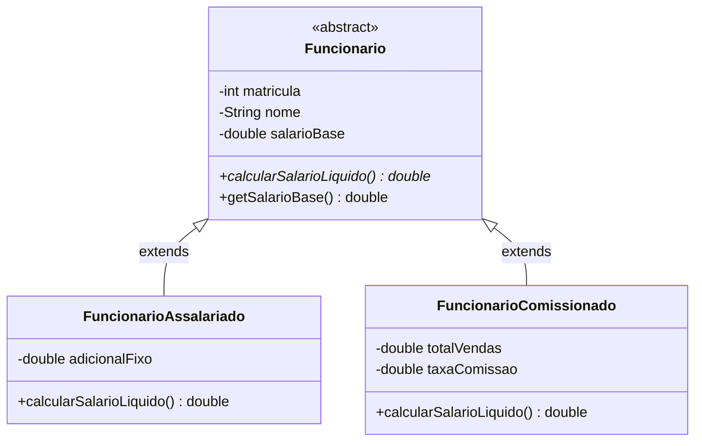

#### Motivação
Em sistemas corporativos, não existe um "Funcionário" genérico físico na folha de pagamento; cada colaborador possui uma modalidade contratual específica (Assalariado, Comissionado, Terceirizado). A classe abstrata centraliza os atributos comuns (`matricula`, `nome`, `salarioBase`), impedindo a criação de instâncias vagas e forçando as classes derivadas a implementarem suas próprias regras de remuneração.

#### Exemplo
```java
package br.com.aplcurso.model;

public abstract class Funcionario {
    private String nome;
    private double salarioBase;

    public Funcionario(String nome, double salarioBase) {
        this.nome = nome;
        this.salarioBase = salarioBase;
    }

    public double getSalarioBase() {
        return salarioBase;
    }

    public abstract double calcularSalarioLiquido();
}

public class FuncionarioComissionado extends Funcionario {
    private double totalVendas;
    private double percentualComissao;

    public FuncionarioComissionado(String nome, double salarioBase, double totalVendas, double percentualComissao) {
        super(nome, salarioBase);
        this.totalVendas = totalVendas;
        this.percentualComissao = percentualComissao;
    }

    @Override
    public double calcularSalarioLiquido() {
        return getSalarioBase() + (this.totalVendas * (this.percentualComissao / 100.0));
    }
}
```

#### Contraexemplo
```java
// Violação de Liskov e Herança por Conveniência
public class ContaPoupanca extends ContaCorrente {
    @Override
    public void cobrarTarifaManutencao() {
        // Lança exceção não esperada por clientes que chamam métodos de ContaCorrente
        throw new UnsupportedOperationException("Contas poupança não possuem tarifa!");
    }
}
```

#### Armadilhas
- **Acoplamento Excessivo:** Hierarquias de herança muito profundas tornam alterações nas classes superiores imprevisíveis para as classes inferiores. A engenharia moderna recomenda favorecer a composição sobre a herança sempre que a relação não for um estrito "É-UM".

---

### Polimorfismo, Ligação Tardia e Desacoplamento

#### Definição
Polimorfismo é a capacidade de tratar objetos de diferentes tipos derivados de uma mesma superclasse através de uma referência uniforme da classe base. A decisão exata sobre qual método executar ocorre em tempo de execução (*runtime*), processo conhecido como **Ligação Tardia (Dynamic Binding / Late Binding)**, operado pela instrução de bytecode `invokevirtual` da JVM por meio de uma tabela virtual de métodos (*vtable*).

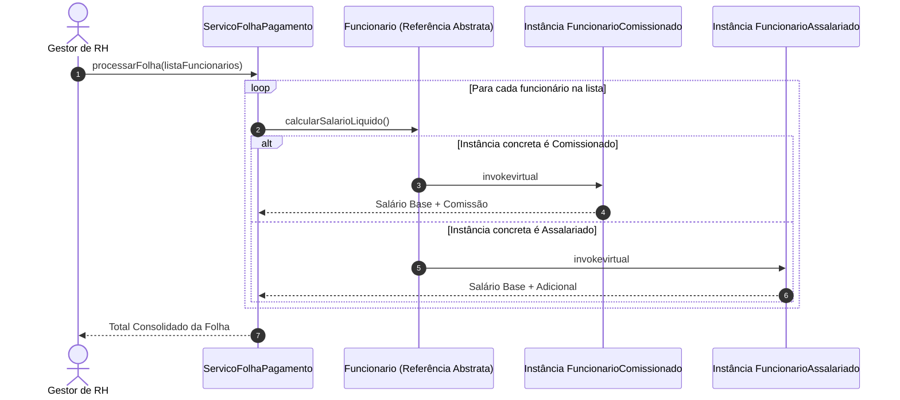

#### Motivação
O polimorfismo elimina a necessidade de cadeias de testes condicionais (`if (tipo == 1) ... else if (tipo == 2)` ou blocos `switch/case`). Se um novo tipo de funcionário for inserido no sistema (por exemplo, `FuncionarioDiarista`), o módulo de cálculo da folha de pagamento não precisará de nenhuma alteração em seu código-fonte, satisfazendo o **Princípio Aberto/Fechado (OCP - Open/Closed Principle)**.

---

### Interfaces como Contratos Formais de Arquitetura

#### Definição
Uma Interface em Java é uma estrutura puramente abstrata que especifica um **contrato formal de comportamento** que uma ou mais classes concretas se comprometem a implementar. Ela define **o que** a classe deve fazer, sem delimitar **como** a operação será realizada. Todos os métodos declarados em uma interface são implicitamente `public abstract` (exceto métodos `default` ou `static`), e todos os campos são implicitamente `public static final`.

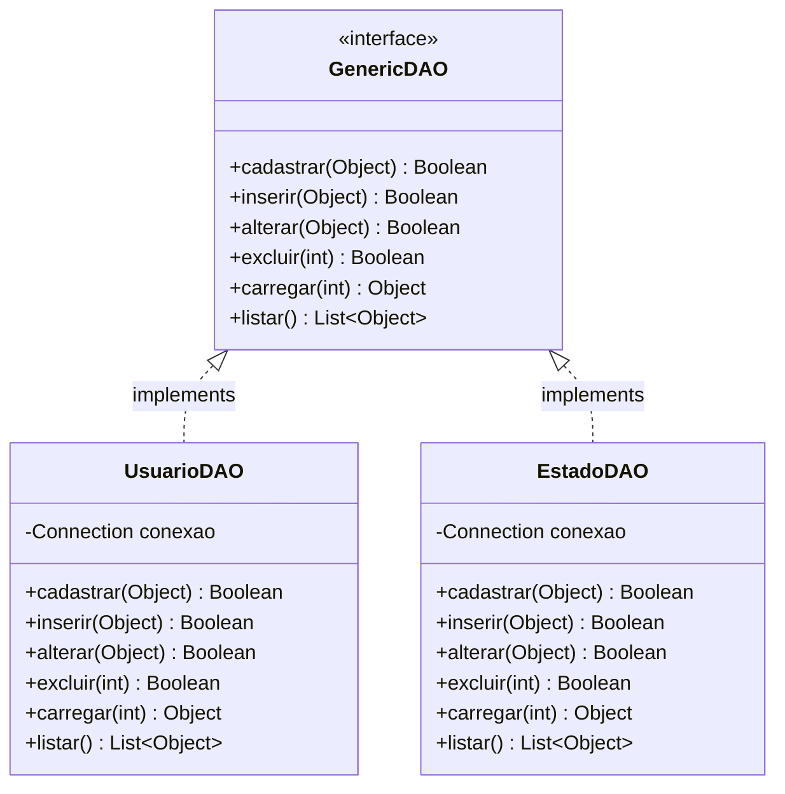

#### Comparativo entre Estruturas de Tipos em Java

| Critério | Interface | Classe Abstrata | Classe Concreta |
| :--- | :--- | :--- | :--- |
| **Instanciação com `new`** | Proibida | Proibida | Permitida |
| **Implementação de Métodos** | Apenas `default` e `static` | Sim (pode mesclar concretos e abstratos) | Obrigatória para todos os métodos |
| **Atributos de Instância** | Proibido (somente constantes estáticas) | Permitido (`private`, `protected`, etc.) | Permitido |
| **Herança Múltipla** | Sim (uma classe implementa `N` interfaces) | Não (apenas herança simples em Java) | Não (apenas herança simples) |
| **Finalidade Arquitetural** | Definir contratos e papéis desacoplados | Fornecer modelo base e reuso de lógica comum | Executar tarefas operacionais finais |

---

### Tratamento Robusto de Exceções e Erros de Domínio

#### Definição
O mecanismo de tratamento de exceções do Java isola o fluxo normal de processamento das rotinas de tratamento de falhas operacionais e regras violadas. As exceções dividem-se em duas categorias principais:
1. **Checked Exceptions (Verificadas pelo Compilador):** Herdam diretamente de `java.lang.Exception` (excluindo a subárvore `RuntimeException`). O compilador força a manipulação explícita via bloco `try-catch` ou declaração de repasse na assinatura do método via `throws`. Devem ser usadas para falhas recuperáveis do ambiente (ex.: `SQLException`, `IOException`).
2. **Unchecked Exceptions (Não Verificadas):** Herdam de `java.lang.RuntimeException`. Indicam erros lógicos de programação ou estados de dados inaceitáveis (ex.: `NullPointerException`, `IllegalArgumentException`). Não exigem captura compulsória pelo compilador.

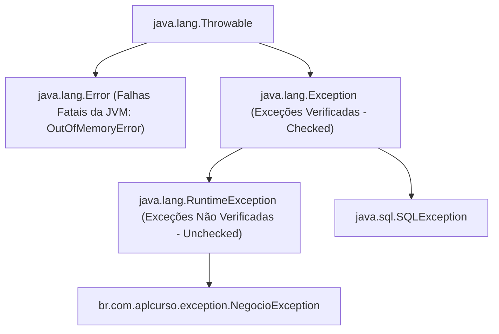

#### Criação de Exceções Customizadas de Domínio
```java
package br.com.aplcurso.exception;

public class NegocioException extends RuntimeException {
    private static final long serialVersionUID = 1L;

    public NegocioException(String mensagem) {
        super(mensagem);
    }

    public NegocioException(String mensagem, Throwable causa) {
        super(mensagem, causa);
    }
}
```

---

### Manipulação de Coleções e Ordenação

Para manipulação de volumes variáveis de entidades em memória, a API padrão `java.util.List` e sua implementação baseada em array redimensionável `java.util.ArrayList` são amplamente adotadas.

```java
// Ordenação de coleções utilizando expressões lambda e Comparator
List<Funcionario> lista = departamento.listarTodos();
lista.sort((f1, f2) -> Double.compare(f2.calcularSalarioLiquido(), f1.calcularSalarioLiquido()));
```

---

## Configuração do Ecossistema e Ambiente de Desenvolvimento

A estruturação correta da infraestrutura de software garante a estabilidade de execução de aplicações web empresariais e previne falhas de vinculação de bibliotecas.

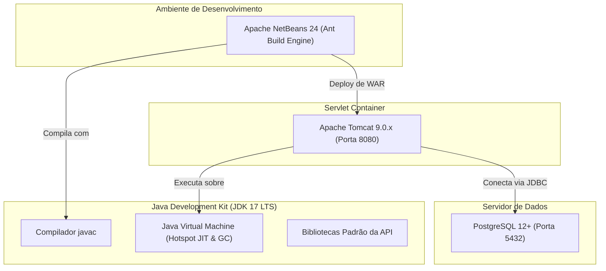

### Padrões do Java JDK 17 LTS

A escolha da distribuição **Eclipse Temurin (Adoptium) do Java JDK 17 LTS** apoia-se em sua designação como versão de Suporte de Longo Prazo (*Long-Term Support*). Ela oferece correções de segurança corporativa contínuas, alto desempenho na execução da máquina virtual (Hotspot) e compatibilidade com bibliotecas corporativas, eliminando os riscos de quebra de retrocompatibilidade comuns em releases semestrais.

---

### Apache Tomcat 9 e a Transição de Namespaces

O Apache Tomcat atua como um **J2EE Web Container** leve e de alta performance, implementando formalmente as especificações:
- **Java Servlet 4.0**
- **JavaServer Pages (JSP) 2.3**
- **Expression Language (EL) 3.0**

> [!CAUTION]
> **Atenção Técnica Rigorosa (Quebra de Namespace Jakarta EE):**
> Nunca utilize o Apache Tomcat versão 10 ou superior nos projetos desta disciplina. O Tomcat 10 adota a especificação **Jakarta EE 9+**, que renomeou todos os pacotes das APIs de `javax.*` para `jakarta.*`. Como as dependências locais utilizadas nos projetos acadêmicos e corporativos da disciplina dependem da biblioteca Java EE 8 Web (`javax.servlet.*` e `javax.servlet.jsp.*`), a implantação no Tomcat 10+ causará exceções fatais imediatas de `ClassNotFoundException` e falhas de inicialização do contexto.

#### Tabela de Compatibilidade das Versões do Apache Tomcat

| Versão Tomcat | Especificação Servlet | Especificação JSP | Namespace Base | Compatibilidade Java EE 8 Web |
| :--- | :--- | :--- | :--- | :--- |
| Tomcat 8.5.x | Servlet 3.1 | JSP 2.3 | `javax.servlet.*` | Compatível (Legado) |
| **Tomcat 9.0.x** | **Servlet 4.0** | **JSP 2.3** | `javax.servlet.*` | **Padrão Oficial da Disciplina** |
| Tomcat 10.0.x | Servlet 5.0 | JSP 3.0 | `jakarta.servlet.*` | Incompatível (Quebra `javax.*`) |
| Tomcat 10.1.x | Servlet 6.0 | JSP 3.1 | `jakarta.servlet.*` | Incompatível (Quebra `javax.*`) |
| Tomcat 11.0.x | Servlet 6.1 | JSP 4.0 | `jakarta.servlet.*` | Incompatível (Quebra `javax.*`) |

---

### Apache NetBeans 24 e Parâmetros Globais

O Apache NetBeans 24 oferece suporte integrado ao gerenciador de compilação **Apache Ant**, permitindo a vinculação direta de instâncias locais do Tomcat e validação da plataforma JDK 17 nas configurações de `Tools -> Options -> Java`.

---

### Monólito Modular versus Microsserviços

A disciplina adota o modelo de **Monólito Modular**: todas as camadas do sistema (Apresentação, Controle, Negócio, Acesso a Dados) residem na mesma base de código e executam dentro do mesmo processo na JVM.

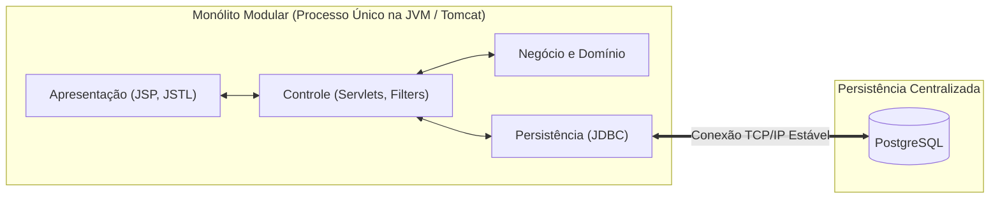

- **Vantagem:** Elimina a latência de rede entre camadas internas (chamadas em memória local), dispensa o uso de transações distribuídas complexas (Two-Phase Commit, padrões Saga) e simplifica o fluxo de compilação e deploy através de um único arquivo `.war`.
- **Desvantagem:** Escalabilidade vertical única; a falha crítica de um módulo em execução pode comprometer todo o container web caso não haja isolamento transacional.

---

### Organização Estrutural de Pacotes e Diretórios

A estrutura do projeto Java Web sob a ferramenta Ant no NetBeans organiza-se da seguinte forma:

```text
ProjetoAplCurso/
├── src/ (Source Packages)
│   └── br/com/aplcurso/
│       ├── controller/
│       │   └── usuario/
│       │       ├── UsuarioListar.java
│       │       ├── UsuarioNovo.java
│       │       ├── UsuarioCadastrar.java
│       │       └── UsuarioVerificarCPF.java
│       ├── dao/
│       │   ├── GenericDAO.java
│       │   └── UsuarioDAO.java
│       ├── filter/
│       │   └── FilterAutenticacao.java
│       ├── model/
│       │   └── Usuario.java
│       └── utils/
│           ├── banco.sql
│           ├── DocumentoValidador.java
│           └── SingleConnection.java
├── web/ (Web Pages)
│   ├── js/
│   │   ├── app.js
│   │   ├── jquery-3.3.1.min.js
│   │   ├── jquery.mask.min.js
│   │   └── jquery.maskMoney.min.js
│   ├── cadastros/
│   │   └── usuario/
│   │       ├── usuarioCadastrar.jsp
│   │       └── usuarioListar.jsp
│   ├── footer.jsp
│   ├── header.jsp
│   ├── home.jsp
│   ├── index.jsp
│   ├── menu.jsp
│   └── WEB-INF/
│       └── web.xml
└── Libraries/
    ├── PostgreSQL JDBC Driver (postgresql-42.x.jar)
    └── JSTL 1.2 (jstl-impl.jar, jstl-api.jar)
```

---

## Persistência de Dados Relacional e JDBC com PostgreSQL

### Modelagem Relacional, Tipos de Dados e Sequências

A modelagem de tabelas relacionais deve garantir integridade e precisão numérica para valores cadastrais e monetários.

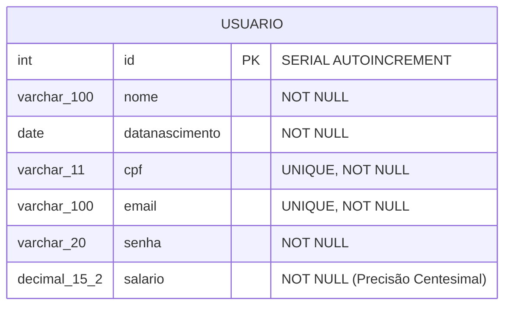

#### O Pseudo-tipo `SERIAL` no PostgreSQL
Declarar `id SERIAL PRIMARY KEY` instrui o SGBD a executar três operações atômicas:
1. Criar um objeto de sequência no catálogo interno (`CREATE SEQUENCE usuario_id_seq;`).
2. Definir o tipo físico da coluna como `INTEGER` (4 bytes com sinal).
3. Associar o valor padrão da coluna à função `nextval('usuario_id_seq')` e transferir a propriedade da sequência para a tabela (`ALTER SEQUENCE usuario_id_seq OWNED BY usuario.id;`).

> [!IMPORTANT]
> **Modelagem de Moeda e Precisão Numérica:**
> Valores financeiros nunca devem ser modelados com tipos de ponto flutuante binário (`FLOAT`, `DOUBLE PRECISION`, `REAL`), pois sofrem imprecisões de arredondamento inerentes à norma IEEE 754. Deve-se empregar tipos de ponto fixo exato: `DECIMAL(15,2)` ou `NUMERIC(15,2)`.

---

### Administração via pgAdmin 4 e Versionamento de Scripts

O script estrutural `banco.sql` é versionado dentro do pacote `br.com.aplcurso.utils`, garantindo que a evolução do esquema de dados acompanhe o histórico de commits da aplicação.

```sql
-- Arquivo: banco.sql
CREATE TABLE usuario (
    id SERIAL PRIMARY KEY,
    nome VARCHAR(100) NOT NULL,
    datanascimento DATE NOT NULL,
    cpf VARCHAR(11) UNIQUE NOT NULL,
    email VARCHAR(100) UNIQUE NOT NULL,
    senha VARCHAR(20) NOT NULL,
    salario DECIMAL(15,2) NOT NULL
);

-- Carga inicial de testes
INSERT INTO usuario (nome, datanascimento, cpf, email, senha, salario)
VALUES (
    'João José Gomes da Silva',
    '1990-08-10',
    '08243060073',
    'joaojosegomes@gmail.com',
    'senha123',
    5200.00
);
```

---

### Padrão Criacional Singleton e a Classe SingleConnection

#### Definição
O padrão Singleton (GoF) assegura que uma classe possua apenas uma única instância ativa em memória durante o ciclo de vida da aplicação, fornecendo um ponto de acesso global e unificado a essa instância.

#### Motivação
A abertura de uma conexão TCP/IP física entre o servidor web e o SGBD é uma operação de alto custo computacional (autenticação de socket, alocação de memória e negociação de sessão no banco). Centralizar a conexão na classe `SingleConnection` reaproveita a mesma referência `java.sql.Connection` entre as diversas invocações das DAOs.

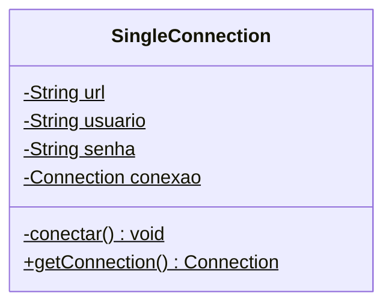

#### Código Comentado: SingleConnection.java
```java
package br.com.aplcurso.utils;

import java.sql.Connection;
import java.sql.DriverManager;
import java.sql.SQLException;

public class SingleConnection {

    private static final String BANCO = "bdaplcurso";
    private static final String URL = "jdbc:postgresql://localhost:5432/" + BANCO;
    private static final String USUARIO = "postgres";
    private static final String SENHA = "root"; // Ajustar conforme credenciais locais
    private static Connection conexao = null;

    // Bloco estático: executado uma única vez no carregamento da classe na JVM
    static {
        conectar();
    }

    private static void conectar() {
        try {
            if (conexao == null || conexao.isClosed()) {
                // Carga dinâmica do driver JDBC do PostgreSQL no ClassLoader
                Class.forName("org.postgresql.Driver");
                conexao = DriverManager.getConnection(URL, USUARIO, SENHA);
                
                // Desativação do commit automático para controle transacional manual estrito
                conexao.setAutoCommit(false);
                System.out.println("SingleConnection: Conectado com sucesso ao PostgreSQL.");
            }
        } catch (ClassNotFoundException e) {
            System.err.println("Erro: Driver JDBC do PostgreSQL nao localizado no Classpath!");
            e.printStackTrace();
        } catch (SQLException e) {
            System.err.println("Erro: Falha de autenticacao ou conexao com o banco de dados!");
            e.printStackTrace();
        }
    }

    public static Connection getConnection() {
        try {
            if (conexao == null || conexao.isClosed()) {
                conectar();
            }
        } catch (SQLException e) {
            e.printStackTrace();
        }
        return conexao;
    }
}
```

---

### Prevenção Sistemática de SQL Injection

#### Definição
SQL Injection é uma falha de segurança na qual dados de entrada fornecidos pelo usuário são concatenados diretamente na consulta SQL, alterando a estrutura semântica da instrução interpretada pelo motor do SGBD.

#### Motivação e Mecanismo de Defesa
A utilização do `PreparedStatement` pré-compila o plano de execução da consulta no banco de dados e envia os parâmetros de entrada por meio de marcadores posicionais (`?`). Os parâmetros são tratados estritamente como literais de dados, inviabilizando a execução de comandos inseridos maliciosamente.

```java
// INSEGURO (Anti-pattern sujeito a SQL Injection):
Statement stmt = conn.createStatement();
ResultSet rs = stmt.executeQuery("SELECT * FROM usuario WHERE email = '" + inputEmail + "'");

// SEGURO (Uso obrigatório de PreparedStatement parametrizado):
String sql = "SELECT * FROM usuario WHERE email = ?";
PreparedStatement stmt = conn.prepareStatement(sql);
stmt.setString(1, inputEmail);
ResultSet rs = stmt.executeQuery();
```

---

### Controle Transacional Manual e Propriedades ACID

O controle manual de transações em JDBC fundamenta-se nas propriedades **ACID**:
- **Atomicidade:** A operação composta executa de forma integral ou é completamente descartada.
- **Consistência:** A transação leva o banco de um estado válido a outro estado válido, respeitando todas as *constraints*.
- **Isolamento:** Operações simultâneas não interferem no estado intermediário de outras transações.
- **Durabilidade:** Uma vez confirmados (`commit`), os dados persistem mesmo diante de falha do sistema.

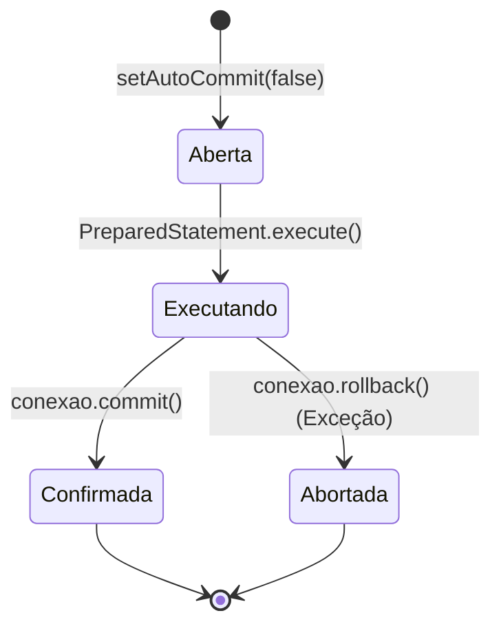

---

### Prevenção de Vazamento de Recursos com Try-With-Resources

Objetos da API JDBC (`Connection`, `PreparedStatement`, `ResultSet`) utilizam recursos nativos do sistema operacional (descritores de arquivos, portas de rede e cursores de banco). A partir do Java 7, a estrutura **try-with-resources** fecha automaticamente qualquer objeto que implemente `java.lang.AutoCloseable`, garantindo a liberação de recursos mesmo diante de exceções.

```java
public boolean cpfExiste(String cpf) {
    String sql = "SELECT COUNT(*) AS total FROM usuario WHERE cpf = ?";
    // Fechamento garantido de PreparedStatement e ResultSet
    try (PreparedStatement stmt = conexao.prepareStatement(sql)) {
        stmt.setString(1, cpf);
        try (ResultSet rs = stmt.executeQuery()) {
            if (rs.next()) {
                return rs.getInt("total") > 0;
            }
        }
    } catch (SQLException e) {
        e.printStackTrace();
    }
    return false;
}
```

---

## Arquitetura em Camadas e o Padrão MVC no Ecossistema Java Web

### O Padrão Arquitetural MVC Modelo 2

No contexto de aplicações Java Web, o **MVC Modelo 2** distribui os papéis do sistema:
- **Model (Modelo):** Representa o domínio da aplicação, encapsulando entidades JavaBean (`Usuario.java`) e regras de acesso persistente (`UsuarioDAO.java`).
- **View (Visão):** Camada de interface responsável pela renderização visual dos dados para o cliente (`.jsp` auxiliado por JSTL e Expression Language).
- **Controller (Controlador):** Implementado por Servlets Java (`HttpServlet`). Atua como intermediário: intercepta requisições HTTP, extrai e converte parâmetros, delega a lógica à DAO e despacha os dados para a visão correspondente.

---

### O Padrão Data Access Object e a Interface GenericDAO

O padrão DAO centraliza todas as chamadas SQL e a manipulação do JDBC, abstraindo a persistência para as camadas superiores.

```java
package br.com.aplcurso.dao;

import java.util.List;

public interface GenericDAO {
    public Boolean cadastrar(Object objeto);
    public Boolean inserir(Object objeto);
    public Boolean alterar(Object objeto);
    public Boolean excluir(int numero);
    public Object carregar(int numero);
    public List<Object> listar();
}
```

---

### Implementação da Camada de Domínio

```java
package br.com.aplcurso.model;

import java.io.Serializable;
import java.util.Date;
import java.util.Objects;

public class Usuario implements Serializable {
    private static final long serialVersionUID = 1L;

    private int id;
    private String nome;
    private Date dataNascimento;
    private String cpf;
    private String email;
    private String senha;
    private double salario;

    public Usuario() {
        this.id = 0;
        this.nome = "";
        this.cpf = "";
        this.email = "";
        this.senha = "";
        this.salario = 0.0;
        this.dataNascimento = null;
    }

    public Usuario(int id, String nome, Date dataNascimento, String cpf, String email, String senha, double salario) {
        this.id = id;
        this.nome = nome;
        this.dataNascimento = dataNascimento;
        this.cpf = cpf;
        this.email = email;
        this.senha = senha;
        this.salario = salario;
    }

    public int getId() { return id; }
    public void setId(int id) { this.id = id; }

    public String getNome() { return nome; }
    public void setNome(String nome) { this.nome = nome; }

    public Date getDataNascimento() { return dataNascimento; }
    public void setDataNascimento(Date dataNascimento) { this.dataNascimento = dataNascimento; }

    public String getCpf() { return cpf; }
    public void setCpf(String cpf) { this.cpf = cpf; }

    public String getEmail() { return email; }
    public void setEmail(String email) { this.email = email; }

    public String getSenha() { return senha; }
    public void setSenha(String senha) { this.senha = senha; }

    public double getSalario() { return salario; }
    public void setSalario(double salario) { this.salario = salario; }

    @Override
    public int hashCode() {
        return Objects.hash(this.id, this.cpf);
    }

    @Override
    public boolean equals(Object obj) {
        if (this == obj) return true;
        if (obj == null || getClass() != obj.getClass()) return false;
        final Usuario other = (Usuario) obj;
        return this.id == other.id && Objects.equals(this.cpf, other.cpf);
    }
}
```

---

### Implementação Concreta da Camada DAO

```java
package br.com.aplcurso.dao;

import br.com.aplcurso.model.Usuario;
import br.com.aplcurso.utils.SingleConnection;
import java.sql.Connection;
import java.sql.PreparedStatement;
import java.sql.ResultSet;
import java.sql.SQLException;
import java.util.ArrayList;
import java.util.List;

public class UsuarioDAO implements GenericDAO {

    private Connection conexao;

    public UsuarioDAO() throws Exception {
        this.conexao = SingleConnection.getConnection();
    }

    @Override
    public Boolean cadastrar(Object objeto) {
        Usuario oUsuario = (Usuario) objeto;
        Boolean retorno = false;
        if (oUsuario.getId() == 0) {
            retorno = this.inserir(oUsuario);
        } else {
            retorno = this.alterar(oUsuario);
        }
        return retorno;
    }

    @Override
    public Boolean inserir(Object objeto) {
        Usuario oUsuario = (Usuario) objeto;
        String sql = "INSERT INTO usuario (nome, datanascimento, cpf, email, senha, salario) VALUES (?, ?, ?, ?, ?, ?)";
        try (PreparedStatement stmt = conexao.prepareStatement(sql)) {
            stmt.setString(1, oUsuario.getNome());
            stmt.setDate(2, new java.sql.Date(oUsuario.getDataNascimento().getTime()));
            stmt.setString(3, oUsuario.getCpf());
            stmt.setString(4, oUsuario.getEmail());
            stmt.setString(5, oUsuario.getSenha());
            stmt.setDouble(6, oUsuario.getSalario());

            stmt.execute();
            conexao.commit();
            return true;
        } catch (Exception ex) {
            try {
                conexao.rollback();
            } catch (SQLException e) {
                e.printStackTrace();
            }
            ex.printStackTrace();
            return false;
        }
    }

    @Override
    public Boolean alterar(Object objeto) {
        Usuario oUsuario = (Usuario) objeto;
        String sql = "UPDATE usuario SET nome=?, datanascimento=?, cpf=?, email=?, senha=?, salario=? WHERE id=?";
        try (PreparedStatement stmt = conexao.prepareStatement(sql)) {
            stmt.setString(1, oUsuario.getNome());
            stmt.setDate(2, new java.sql.Date(oUsuario.getDataNascimento().getTime()));
            stmt.setString(3, oUsuario.getCpf());
            stmt.setString(4, oUsuario.getEmail());
            stmt.setString(5, oUsuario.getSenha());
            stmt.setDouble(6, oUsuario.getSalario());
            stmt.setInt(7, oUsuario.getId());

            stmt.execute();
            conexao.commit();
            return true;
        } catch (Exception ex) {
            try {
                conexao.rollback();
            } catch (SQLException e) {
                e.printStackTrace();
            }
            ex.printStackTrace();
            return false;
        }
    }

    @Override
    public Boolean excluir(int numero) {
        String sql = "DELETE FROM usuario WHERE id = ?";
        try (PreparedStatement stmt = conexao.prepareStatement(sql)) {
            stmt.setInt(1, numero);
            stmt.execute();
            conexao.commit();
            return true;
        } catch (Exception ex) {
            try {
                conexao.rollback();
            } catch (SQLException e) {
                e.printStackTrace();
            }
            ex.printStackTrace();
            return false;
        }
    }

    @Override
    public Object carregar(int numero) {
        String sql = "SELECT * FROM usuario WHERE id = ?";
        Usuario oUsuario = null;
        try (PreparedStatement stmt = conexao.prepareStatement(sql)) {
            stmt.setInt(1, numero);
            try (ResultSet rs = stmt.executeQuery()) {
                if (rs.next()) {
                    oUsuario = new Usuario(
                        rs.getInt("id"),
                        rs.getString("nome"),
                        rs.getDate("datanascimento"),
                        rs.getString("cpf"),
                        rs.getString("email"),
                        rs.getString("senha"),
                        rs.getDouble("salario")
                    );
                }
            }
        } catch (SQLException ex) {
            ex.printStackTrace();
        }
        return oUsuario;
    }

    @Override
    public List<Object> listar() {
        List<Object> resultado = new ArrayList<>();
        String sql = "SELECT * FROM usuario ORDER BY id ASC";
        try (PreparedStatement stmt = conexao.prepareStatement(sql);
             ResultSet rs = stmt.executeQuery()) {
            while (rs.next()) {
                Usuario oUsuario = new Usuario(
                    rs.getInt("id"),
                    rs.getString("nome"),
                    rs.getDate("datanascimento"),
                    rs.getString("cpf"),
                    rs.getString("email"),
                    rs.getString("senha"),
                    rs.getDouble("salario")
                );
                resultado.add(oUsuario);
            }
        } catch (SQLException ex) {
            ex.printStackTrace();
        }
        return resultado;
    }
}
```

---

### Bifurcação de Persistência com Base na Chave Primária

A lógica de decisão no método `cadastrar` avalia o identificador único da entidade:
- **`oUsuario.getId() == 0`**: O registro ainda não foi persistido (o auto-incremento do PostgreSQL gera apenas IDs estritamente positivos). O fluxo executa `inserir()`.
- **`oUsuario.getId() > 0`**: O registro já existe no banco relacional. O fluxo executa `alterar()`.

Essa abstração desonera o Servlet Controller da responsabilidade de saber qual instrução DML executar.

---

## A Camada Controladora e o Ciclo de Vida dos Servlets

### Semântica do Protocolo HTTP

O protocolo HTTP (Hypertext Transfer Protocol) organiza a comunicação cliente-servidor por meio de verbos de requisição:
- **`GET`:** Requisições seguras e idempotentes, utilizadas para consultas e recuperação de recursos. Parâmetros trafegam visíveis na URL (*Query String*).
- **`POST`:** Requisições não-idempotentes destinadas à mutação de estado no servidor (inserção, atualização, exclusão). Parâmetros trafegam encapsulados no corpo (*body*) da mensagem HTTP.

---

### Ciclo de Vida do HttpServlet e Concorrência

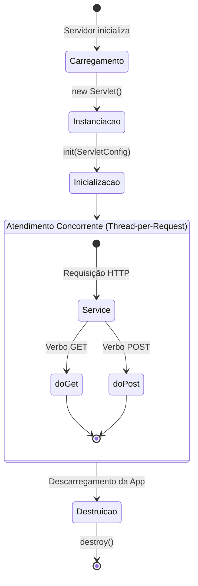

> [!WARNING]
> **Risco Crítico de Concorrência e Variáveis de Instância:**
> O container Apache Tomcat gerencia cada Servlet como um **Singleton** compartilhado por todas as conexões simultâneas. Cada requisição aloca uma nova thread executando o método `service()`. Portanto, **nunca declare variáveis de estado do usuário como atributos de instância da Servlet** (`private Usuario usuarioAtual;`). Elas sofrerão condições de corrida (*race conditions*), permitindo que um usuário visualize ou sobrescreva dados de outro usuário conectado.

---

### Mapeamento com WebServlet e Escopos de Dados

O mapeamento de rotas é realizado declarativamente por anotações da especificação Servlet 3.0+:
```java
@WebServlet(name = "UsuarioListar", urlPatterns = {"/UsuarioListar"})
public class UsuarioListar extends HttpServlet { ... }
```

#### Escopos Compartilhados de Dados
- **Request Scope (`request.setAttribute(k, v)`):** Válido estritamente durante a duração do ciclo de requisição-resposta atual. Ideal para passar dados recuperados para o JSP via `forward`.
- **Session Scope (`session.setAttribute(k, v)`):** Vinculado ao cookie `JSESSIONID` de um usuário específico em múltiplas requisições.
- **Application Scope (`getServletContext().setAttribute(k, v)`):** Compartilhado globalmente entre todos os usuários do sistema.

---

### Despacho de Controle: Forward versus Redirect

| Critério | `RequestDispatcher.forward()` | `HttpServletResponse.sendRedirect()` |
| :--- | :--- | :--- |
| **Execução** | No lado servidor (redirecionamento interno) | No cliente (retorna status HTTP 302/303) |
| **Requisições HTTP** | Mantém a requisição original (1 requisição) | Força o navegador a emitir nova requisição (2 requisições) |
| **URL no Navegador** | Não se altera | Atualiza para o novo endereço |
| **Escopo de Requisição** | Preservado (objetos do `request` acessíveis) | Perdido (nova requisição com escopo zerado) |
| **Uso Típico** | Encaminhar dados processados para a View JSP | Concluir submissões de formulário (Padrão PRG) |

---

### Padrão Post-Redirect-Get

Para evitar a duplicação involuntária de cadastros quando o usuário recarrega a página (`F5`), adota-se o fluxo **Post-Redirect-Get (PRG)**:

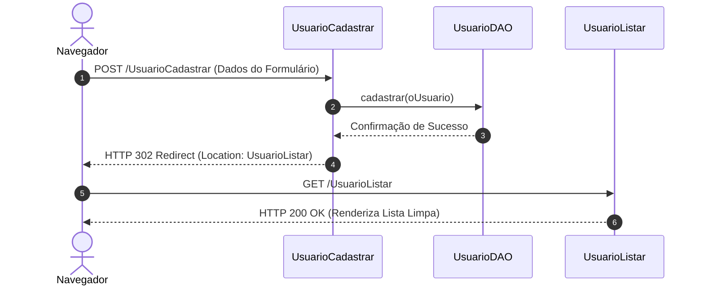

---

### Implementação dos Controladores da Aplicação

#### Controlador de Listagem: UsuarioListar.java
```java
package br.com.aplcurso.controller.usuario;

import br.com.aplcurso.dao.GenericDAO;
import br.com.aplcurso.dao.UsuarioDAO;
import java.io.IOException;
import javax.servlet.ServletException;
import javax.servlet.annotation.WebServlet;
import javax.servlet.http.HttpServlet;
import javax.servlet.http.HttpServletRequest;
import javax.servlet.http.HttpServletResponse;

@WebServlet(name = "UsuarioListar", urlPatterns = {"/UsuarioListar"})
public class UsuarioListar extends HttpServlet {

    protected void processRequest(HttpServletRequest request, HttpServletResponse response)
            throws ServletException, IOException {
        response.setContentType("text/html;charset=iso-8859-1");
        try {
            GenericDAO dao = new UsuarioDAO();
            request.setAttribute("usuarios", dao.listar());
            request.getRequestDispatcher("/cadastros/usuario/usuarioListar.jsp").forward(request, response);
        } catch (Exception ex) {
            System.out.println("Erro ao listar usuarios: " + ex.getMessage());
            ex.printStackTrace();
        }
    }

    @Override
    protected void doGet(HttpServletRequest request, HttpServletResponse response)
            throws ServletException, IOException {
        processRequest(request, response);
    }

    @Override
    protected void doPost(HttpServletRequest request, HttpServletResponse response)
            throws ServletException, IOException {
        processRequest(request, response);
    }
}
```

#### Controlador de Inicialização de Cadastro: UsuarioNovo.java
```java
package br.com.aplcurso.controller.usuario;

import br.com.aplcurso.model.Usuario;
import java.io.IOException;
import javax.servlet.ServletException;
import javax.servlet.annotation.WebServlet;
import javax.servlet.http.HttpServlet;
import javax.servlet.http.HttpServletRequest;
import javax.servlet.http.HttpServletResponse;

@WebServlet(name = "UsuarioNovo", urlPatterns = {"/UsuarioNovo"})
public class UsuarioNovo extends HttpServlet {

    protected void processRequest(HttpServletRequest request, HttpServletResponse response)
            throws ServletException, IOException {
        response.setContentType("text/html;charset=iso-8859-1");
        // Fornece um objeto vazio para preenchimento seguro de tags EL no formulário
        Usuario oUsuario = new Usuario();
        request.setAttribute("usuario", oUsuario);
        request.getRequestDispatcher("/cadastros/usuario/usuarioCadastrar.jsp").forward(request, response);
    }

    @Override
    protected void doGet(HttpServletRequest request, HttpServletResponse response)
            throws ServletException, IOException {
        processRequest(request, response);
    }

    @Override
    protected void doPost(HttpServletRequest request, HttpServletResponse response)
            throws ServletException, IOException {
        processRequest(request, response);
    }
}
```

#### Controlador de Verificação Assíncrona: UsuarioVerificarCPF.java
```java
package br.com.aplcurso.controller.usuario;

import br.com.aplcurso.dao.UsuarioDAO;
import java.io.IOException;
import java.io.PrintWriter;
import javax.servlet.ServletException;
import javax.servlet.annotation.WebServlet;
import javax.servlet.http.HttpServlet;
import javax.servlet.http.HttpServletRequest;
import javax.servlet.http.HttpServletResponse;

@WebServlet(name = "UsuarioVerificarCPF", urlPatterns = {"/UsuarioVerificarCPF"})
public class UsuarioVerificarCPF extends HttpServlet {

    @Override
    protected void doGet(HttpServletRequest request, HttpServletResponse response)
            throws ServletException, IOException {
        response.setContentType("text/plain;charset=UTF-8");
        String cpf = request.getParameter("cpf");
        if (cpf != null) {
            cpf = cpf.replaceAll("[^\\d]", "");
        }
        
        try (PrintWriter out = response.getWriter()) {
            UsuarioDAO dao = new UsuarioDAO();
            if (dao.cpfExiste(cpf)) {
                out.print("existe");
            } else {
                out.print("ok");
            }
        } catch (Exception ex) {
            ex.printStackTrace();
        }
    }
}
```

---

## Interceptação de Requisições com Servlet Filters

### Arquitetura e Ciclo de Vida de um Filter

Um Servlet Filter implementa o padrão arquitetural **Intercepting Filter**, capturando requisições antes que alcancem o Servlet de destino e interceptando respostas antes que retornem ao navegador.

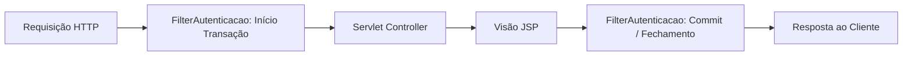

### Encadeamento com FilterChain

O objeto `FilterChain` coordena o fluxo de execução entre os filtros registrados na aplicação. Invocar `chain.doFilter(request, response)` transfere o controle para o próximo filtro da cadeia ou para o recurso de destino.

---

### Implementação do Filtro de Autenticação e Transação

```java
package br.com.aplcurso.filter;

import br.com.aplcurso.utils.SingleConnection;
import java.io.IOException;
import java.sql.Connection;
import java.sql.SQLException;
import javax.servlet.Filter;
import javax.servlet.FilterChain;
import javax.servlet.FilterConfig;
import javax.servlet.ServletException;
import javax.servlet.ServletRequest;
import javax.servlet.ServletResponse;
import javax.servlet.annotation.WebFilter;

@WebFilter(urlPatterns = {"/*"})
public class FilterAutenticacao implements Filter {

    private static Connection conexao;

    @Override
    public void init(FilterConfig filterConfig) throws ServletException {
        conexao = SingleConnection.getConnection();
    }

    @Override
    public void doFilter(ServletRequest request, ServletResponse response, FilterChain chain)
            throws IOException, ServletException {
        try {
            // Continuação da cadeia de filtros e execução do recurso web
            chain.doFilter(request, response);
            
            // Confirmação de operações transacionais bem-sucedidas
            conexao.commit();
        } catch (Exception e) {
            try {
                conexao.rollback();
            } catch (SQLException ex) {
                ex.printStackTrace();
            }
            e.printStackTrace();
        }
    }

    @Override
    public void destroy() {
        try {
            if (conexao != null && !conexao.isClosed()) {
                conexao.close();
            }
        } catch (SQLException ex) {
            ex.printStackTrace();
        }
    }
}
```

---

## A Camada de Apresentação com JSP, JSTL e Recursos Frontend

### Ciclo de Vida das Páginas JSP

Quando um arquivo `.jsp` é requisitado pela primeira vez:
1. O motor **Jasper** do Tomcat traduz a marcação JSP em código-fonte Java puro estendendo `HttpJspBase` (um `HttpServlet`).
2. O compilador Java gera o arquivo de bytecode `.class`.
3. A JVM carrega o servlet gerado e executa o método `_jspService(request, response)`.
4. As requisições subsequentes executam diretamente o bytecode compilado em memória.

---

### Substituição de Scriptlets por JSTL e Expression Language

O uso de código Java embutido em tags scriptlets (`<% ... %>` ou `<%= ... %>`) viola a separação de responsabilidades do MVC. A abordagem moderna padronizada adota:
- **JSTL Core (`prefix="c"`):** Estruturas de controle (`<c:forEach>`, `<c:if>`).
- **JSTL Formatting (`prefix="fmt"`):** Formatação monetária e temporal (`<fmt:formatDate>`, `<fmt:formatNumber>`).
- **Expression Language (EL - `${...}`):** Interpolação concisa de atributos nos escopos da aplicação.

---

### Modularização Estrutural com jsp:include

Em vez de repetir tags `<!DOCTYPE html>`, `<head>`, menus e rodapés em todas as páginas, a camada View é fragmentada em componentes reutilizáveis integrados dinamicamente via `<jsp:include>`.

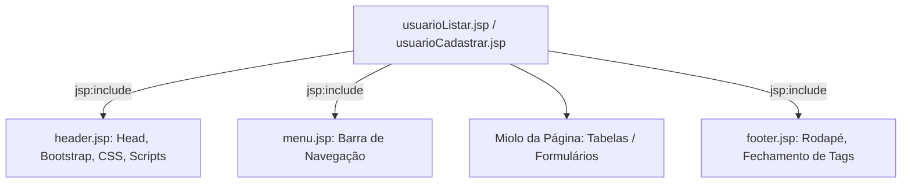

#### Fragmento: header.jsp
```jsp
<%@page contentType="text/html" pageEncoding="iso-8859-1"%>
<!DOCTYPE html>
<html>
    <head>
        <meta http-equiv="Content-Type" content="text/html; charset=iso-8859-1">
        <title>Sistema de Gerenciamento - AplCurso</title>
        
        <!-- Ativos Locais (jQuery e Plugins de Máscara) -->
        <script src="${pageContext.request.contextPath}/js/jquery-3.3.1.min.js"></script>
        <script src="${pageContext.request.contextPath}/js/jquery.mask.min.js"></script>
        <script src="${pageContext.request.contextPath}/js/jquery.maskMoney.min.js"></script>
        <script src="${pageContext.request.contextPath}/js/app.js" type="text/javascript"></script>
        
        <!-- Estilos e Componentes Bootstrap via CDN -->
        <link rel="stylesheet" href="https://stackpath.bootstrapcdn.com/bootstrap/4.3.1/css/bootstrap.min.css">
        <script src="https://cdnjs.cloudflare.com/ajax/libs/popper.js/1.14.7/umd/popper.min.js"></script>
        <script src="https://stackpath.bootstrapcdn.com/bootstrap/4.3.1/js/bootstrap.min.js"></script>
        
        <!-- DataTables -->
        <link rel="stylesheet" type="text/css" href="https://cdn.datatables.net/1.10.22/css/jquery.dataTables.min.css"/>
        <script src="https://cdn.datatables.net/1.10.22/js/jquery.dataTables.min.js" type="text/javascript"></script>
        
        <!-- SweetAlert2 -->
        <script src="https://cdn.jsdelivr.net/npm/sweetalert2@10.3.1/dist/sweetalert2.all.min.js"></script>
    </head>
    <body>
        <div class="container-fluid">
```

#### Fragmento: footer.jsp
```jsp
<%@page contentType="text/html" pageEncoding="iso-8859-1"%>
        </div>
        <footer class="footer mt-auto py-3 bg-light text-center">
            <div class="container">
                <span class="text-muted">Laboratório de Programação III - UniFEF</span>
            </div>
        </footer>
    </body>
</html>
```

---

### Caminhos Dinâmicos com ContextPath

O uso de caminhos relativos (`../../js/app.js`) gera quebras de rota quando servlets despacham requisições a partir de níveis de URI diferentes. A solução padrão é utilizar a Expression Language:
```jsp
<a href="${pageContext.request.contextPath}/UsuarioListar">Listar Usuários</a>
```
O container resolve `${pageContext.request.contextPath}` para o nome raiz da aplicação (ex.: `/AplCurso`), garantindo links absolutos consistentes.

---

### Integração de Bibliotecas e Scripts Frontend

A ordem de importação no `header.jsp` é mandatória para evitar falhas de dependência:
1. `jquery-3.3.1.min.js` (cria o objeto global `window.$`).
2. Plugins dependentes do jQuery (`jquery.mask.min.js`, `jquery.maskMoney.min.js`).
3. Scripts customizados de aplicação (`app.js`).
4. `popper.js` seguido por `bootstrap.min.js`.
5. Plugins independentes (`sweetalert2.all.min.js`).

---

### Validação Algorítmica de Documentos: Módulo 11

A validação de CPF e CNPJ segue o algoritmo oficial de **Módulo 11** da Receita Federal do Brasil, implementado tanto no cliente (`app.js`) quanto no servidor (`DocumentoValidador.java`).

#### Cálculo do CPF (11 Dígitos)
Para um CPF composto por $d_1 d_2 \dots d_9 - d_{10} d_{11}$:
1. **Primeiro Dígito Verificador ($d_{10}$):**
   $$S_1 = \sum_{i=1}^{9} d_i \times (11 - i)$$
   $$R_1 = S_1 \pmod{11}$$
   $$d_{10} = (11 - R_1) \ge 10 \;?\; 0 : (11 - R_1)$$
2. **Segundo Dígito Verificador ($d_{11}$):**
   $$S_2 = \sum_{i=1}^{10} d_i \times (12 - i)$$
   $$R_2 = S_2 \pmod{11}$$
   $$d_{11} = (12 - R_2) \ge 10 \;?\; 0 : (12 - R_2)$$

#### Código Servidor: DocumentoValidador.java
```java
package br.com.aplcurso.utils;

public class DocumentoValidador {

    public static boolean isCPF(String cpf) {
        if (cpf == null) return false;
        cpf = cpf.replaceAll("[^\\d]", "");
        if (cpf.length() != 11 || cpf.matches("(\\d)\\1{10}")) return false;

        try {
            int d1 = 0, d2 = 0;
            for (int i = 0; i < 9; i++) {
                int digito = cpf.charAt(i) - '0';
                d1 += digito * (10 - i);
                d2 += digito * (11 - i);
            }

            d1 = 11 - (d1 % 11);
            d1 = (d1 > 9) ? 0 : d1;
            d2 += d1 * 2;
            d2 = 11 - (d2 % 11);
            d2 = (d2 > 9) ? 0 : d2;

            return d1 == (cpf.charAt(9) - '0') && d2 == (cpf.charAt(10) - '0');
        } catch (Exception e) {
            return false;
        }
    }
}
```

---

### Requisições Assíncronas com AJAX

No arquivo `app.js`, o evento `blur` (perda de foco) do campo de CPF aciona uma verificação assíncrona contra o servlet `UsuarioVerificarCPF`, alertando o usuário antes da submissão do formulário:

```javascript
$(document).ready(function () {
    $("#cpf").blur(function () {
        var cpfInformado = $(this).val().replace(/\D/g, '');
        if (cpfInformado.length === 11) {
            $.ajax({
                url: "UsuarioVerificarCPF",
                type: "GET",
                data: { cpf: cpfInformado },
                success: function (resposta) {
                    if (resposta.trim() === "existe") {
                        Swal.fire({
                            icon: 'error',
                            title: 'Documento Duplicado',
                            text: 'O CPF informado ja se encontra cadastrado no sistema!'
                        });
                        $("#cpf").val('');
                    }
                }
            });
        }
    });
});
```

---

## Aplicações Práticas dos Trabalhos e Avaliações

### Módulo de Usuários: AplCurso

Representa o projeto integrador de laboratório. A interface de listagem `usuarioListar.jsp` utiliza JSTL para iterar sobre a coleção injetada pelo controlador e DataTables para paginação e busca instantânea:

```jsp
<%@taglib prefix="c" uri="http://java.sun.com/jsp/jstl/core"%>
<%@taglib prefix="fmt" uri="http://java.sun.com/jsp/jstl/fmt"%>
<jsp:include page="/header.jsp"/>
<jsp:include page="/menu.jsp"/>

<div class="card mt-4">
    <div class="card-header bg-primary text-white">
        <h3>Listagem de Usuários</h3>
    </div>
    <div class="card-body">
        <table id="tabelaUsuarios" class="table table-striped table-bordered">
            <thead>
                <tr>
                    <th>ID</th>
                    <th>Nome</th>
                    <th>CPF</th>
                    <th>E-mail</th>
                    <th>Nascimento</th>
                    <th>Salário</th>
                    <th>Ações</th>
                </tr>
            </thead>
            <tbody>
                <c:forEach var="usuario" items="${usuarios}">
                    <tr>
                        <td>${usuario.id}</td>
                        <td>${usuario.nome}</td>
                        <td>${usuario.cpf}</td>
                        <td>${usuario.email}</td>
                        <td><fmt:formatDate pattern="dd/MM/yyyy" value="${usuario.dataNascimento}"/></td>
                        <td><fmt:formatNumber type="currency" currencySymbol="R$" value="${usuario.salario}"/></td>
                        <td>
                            <a href="${pageContext.request.contextPath}/UsuarioCarregar?id=${usuario.id}" class="btn btn-warning btn-sm">Editar</a>
                            <a href="${pageContext.request.contextPath}/UsuarioExcluir?id=${usuario.id}" class="btn btn-danger btn-sm" onclick="return confirm('Confirma exclusão?');">Excluir</a>
                        </td>
                    </tr>
                </c:forEach>
            </tbody>
        </table>
    </div>
</div>

<script>
    $(document).ready(function() {
        $('#tabelaUsuarios').DataTable({
            "language": {
                "url": "//cdn.datatables.net/plug-ins/1.10.22/i18n/Portuguese-Brasil.json"
            }
        });
    });
</script>
<jsp:include page="/footer.jsp"/>
```

---

### Módulo de Livros: Trabalho de Manutenção

O trabalho prático exige a criação de uma aplicação web com controle de acervo bibliográfico.

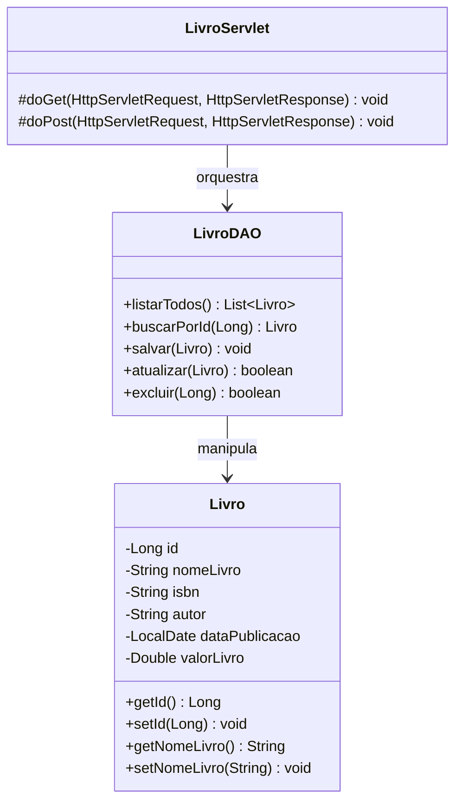

---

### Módulo de Estados: Desafio de Unidades Federativas

O desafio consiste em estender a arquitetura da aplicação para gerenciar a entidade `Estado` com chave única na sigla:

```sql
CREATE TABLE estado (
    id SERIAL PRIMARY KEY,
    nome VARCHAR(100) NOT NULL,
    sigla VARCHAR(2) NOT NULL,
    CONSTRAINT uk_estado_sigla UNIQUE (sigla)
);
```

---

### Módulo de Produtos: Avaliação Prática

Na Avaliação II, os estudantes implementam a manutenção da entidade `Produto` com controle de estoque e validação defensiva contra números negativos:

```sql
CREATE TABLE produtos (
    id SERIAL PRIMARY KEY,
    nome VARCHAR(150) NOT NULL,
    preco NUMERIC(10,2) NOT NULL CHECK (preco >= 0),
    quantidade_estoque INTEGER NOT NULL CHECK (quantidade_estoque >= 0),
    data_cadastro VARCHAR(20) NOT NULL
);
```

---

### Módulo de Recursos Humanos e Tributos: Avaliações Teóricas

Cobrado na Avaliação 1 e Substitutiva, integra classes abstratas, cálculo de folhas de pagamento e a interface `Tributavel`:

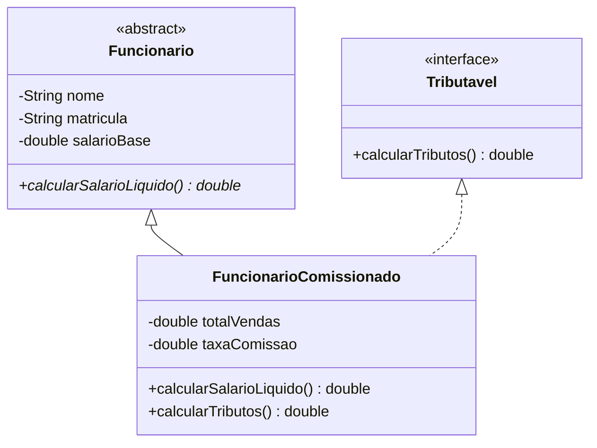

---

## Erros Comuns, Diagnóstico e Boas Práticas

### Conflitos de Portas e Falhas de Inicialização

O Apache Tomcat utiliza por padrão as portas TCP `8080` (conector HTTP) e `8005` (porta de controle e desligamento - *shutdown*). Se outro software (Oracle XE, IIS ou outra instância zumbi do Java) ocupar a porta `8080`, o Tomcat falhará ao iniciar:

```text
Severe: Failed to initialize end point associated with ProtocolHandler ["http-nio-8080"]
java.net.BindException: Address already in use: bind
```

#### Resolução via Terminal (Windows PowerShell / CMD)
```powershell
# Localizar o processo ocupando a porta 8080
netstat -ano | findstr :8080

# Finalizar o processo pelo PID (exemplo: PID 4528)
taskkill /F /PID 4528
```

Alternativamente, a porta HTTP pode ser alterada no arquivo `conf/server.xml` do Tomcat:
```xml
<Connector port="8082" protocol="HTTP/1.1"
           connectionTimeout="20000"
           redirectPort="8443" />
```

---

### Exceções Clássicas e Procedimentos de Correção

#### 1. `java.lang.ClassNotFoundException: org.postgresql.Driver`
- **Causa:** O arquivo JAR do driver JDBC (`postgresql-42.x.jar`) não foi adicionado à pasta `Libraries` do projeto ou ao diretório `lib/` do Tomcat.
- **Solução:** No NetBeans, clique com o botão direito em `Libraries -> Add JAR/Folder...` e aponte para o binário do driver.

#### 2. `org.apache.jasper.JasperException: The absolute uri: [http://java.sun.com/jsp/jstl/core] cannot be resolved`
- **Causa:** Ausência das bibliotecas de implementação da JSTL (`jstl-impl.jar` e `jstl-api.jar`) no classpath da aplicação web.
- **Solução:** Adicionar a biblioteca padrão `JSTL 1.2` em `Libraries`.

#### 3. `java.lang.NullPointerException` na Execução de DAOs
- **Causa:** A invocação `SingleConnection.getConnection()` retornou `null` devido a erro prévio de conexão no bloco estático (como credenciais incorretas do PostgreSQL).
- **Solução:** Inspecionar as credenciais (`url`, `usuario`, `senha`) na classe `SingleConnection` e verificar se o serviço do PostgreSQL está ativo na porta `5432`.

#### 4. `java.lang.IllegalStateException: Cannot forward after response has been committed`
- **Causa:** Tentativa de executar `RequestDispatcher.forward()` após a saída de dados já ter começado a ser escrita no buffer de resposta (por exemplo, após chamadas a `out.println()` ou fechamento do fluxo).
- **Solução:** Garantir que o encaminhamento (`forward`) seja o ponto final de despacho do fluxo de controle no Servlet.

---

### Práticas de Depuração e Acessibilidade

O Apache NetBeans oferece ferramentas de depuração em tempo de execução:
- **Breakpoints (`Ctrl + F8`):** Pausam a execução da thread na linha configurada.
- **Step Over (`F8`):** Avança a execução para a linha seguinte no mesmo método.
- **Step Into (`F7`):** Entra no corpo do método sob o cursor de execução.
- **Painel Watches:** Permite monitorar expressões complexas (ex.: `conexao.isClosed()` ou `oUsuario.getId()`).

#### Diretrizes de Engenharia Acessível (Leitores de Tela - NVDA / JAWS)
Em ambientes de desenvolvimento operados por programadores cegos:
- Configure saídas de depuração explícitas no console do sistema via `System.err.println()` e `ex.printStackTrace()`.
- Garanta identificação semântica correta em formulários HTML através da associação estrita da tag `<label for="idCampo">` ao respectivo `<input id="idCampo">`.

---

## Pontos-Chave para Avaliações e Concursos

1. **Ciclo de Vida do Servlet:** Métodos `init(ServletConfig)` (executado uma única vez na inicialização), `service(req, resp)` (despacha para `doGet` ou `doPost` a cada requisição concorrente) e `destroy()` (liberação no descarregamento).
2. **Incompatibilidade Tomcat 10+:** O namespace mudou de `javax.*` para `jakarta.*`. O Java EE 8 Web depende estritamente do namespace `javax.*`, exigindo o uso do **Apache Tomcat 9**.
3. **Padrão Singleton:** Construtor privado (ou protegido), atributo estático privado da própria instância e método de acesso público estático (`getConnection()`).
4. **Prevenção de Injeção de SQL:** Utilização obrigatória de `PreparedStatement` com parâmetros posicionais (`?`), evitando a concatenação direta de strings.
5. **Diferença entre Forward e Redirect:** `forward` é interno ao servidor (mantém escopo da requisição e URL inalterada); `sendRedirect` é instrução enviada ao cliente com status HTTP 302 (dispara nova requisição GET e altera a URL).
6. **Controle Transacional Manual:** Desativação de `setAutoCommit(false)`, exigindo confirmação explícita via `conexao.commit()` ou reversão via `conexao.rollback()` em blocos `try-catch`.
7. **Padrão PRG (Post-Redirect-Get):** Previne duplicação acidental de dados ao pressionar `F5` após envio de formulários.
8. **Algoritmo Módulo 11:** Técnica ponderada com pesos decrescentes para cálculo e verificação dos dois dígitos verificadores de documentos federais (CPF e CNPJ).
9. **JSTL vs Scriptlets:** Scriptlets (`<% ... %>`) representam prática obsoleta; o padrão corporativo adota bibliotecas de tags (`c:forEach`, `fmt:formatNumber`) integradas à Expression Language (`${...}`).
10. **Concorrência em Servlets:** Servlets são singletons gerenciados pelo container; variáveis de estado do usuário devem ser locais aos métodos, nunca campos de instância da classe.

---

## Glossário Técnico

- **ACID:** Acrônimo para *Atomicidade, Consistência, Isolamento e Durabilidade*. Conjunto de propriedades essenciais que garantem que transações em banco de dados sejam processadas com confiabilidade.
- **Adoptium (Eclipse Temurin):** Distribuição livre, auditada e estável da plataforma OpenJDK mantida pela Eclipse Foundation.
- **Apache Ant:** Ferramenta de automação de compilação (*build tool*) baseada em arquivos XML utilizada para gerenciar o ciclo de compilação de projetos Java clássicos.
- **Apache Tomcat:** Web Container de código aberto que provê ambiente de execução para Servlets e páginas JSP.
- **AutoCommit:** Modo operacional do JDBC no qual cada instrução SQL executada é imediatamente confirmada no banco de dados de forma automática.
- **Bytecode:** Código binário intermediário (`.class`) gerado pelo compilador `javac` que é interpretado ou compilado em código nativo pela JVM.
- **DAO (Data Access Object):** Padrão de projeto estrutural que encapsula a lógica de acesso, consulta e persistência de dados.
- **EL (Expression Language):** Sintaxe de avaliação simplificada (`${expressao}`) criada para expor dados dos escopos Java diretamente nas páginas JSP.
- **Encapsulamento:** Princípio de POO que isola os dados de uma classe, controlando sua leitura e modificação através de métodos com validações de integridade.
- **Filter (Servlet Filter):** Componente que intercepta requisições HTTP e respostas no container web para fins de segurança, log ou gestão transacional.
- **Hotspot:** Motor de execução de máquina virtual da Oracle/OpenJDK que combina interpretação de código e compilação Just-In-Time (JIT) das seções mais executadas.
- **Idempotência:** Propriedade de uma operação pela qual múltiplas execuções sucessivas produzem exatamente o mesmo resultado sem alterar o estado do servidor (ex.: método `GET`).
- **JDBC (Java Database Connectivity):** API padrão da plataforma Java SE que padroniza o acesso a Sistemas Gerenciadores de Bancos de Dados Relacionais.
- **JSP (JavaServer Pages):** Tecnologia de geração de páginas HTML dinâmicas no servidor compiladas internamente como Servlets Java.
- **JSTL (JSP Standard Tag Library):** Coleção padrão de tags customizadas que viabiliza iterações, condicionais e formatações em páginas JSP.
- **MVC (Model-View-Controller):** Padrão de arquitetura de software que desacopla o sistema em três camadas: Modelo (dados e regras), Visão (interface) e Controlador (roteamento).
- **Módulo 11:** Algoritmo matemático baseado em somatórios com pesos decrescentes utilizado oficialmente no Brasil para cálculo de dígitos verificadores.
- **Polimorfismo:** Capacidade de um método assumir múltiplos comportamentos em tempo de execução dependendo do tipo concreto do objeto receptor.
- **PreparedStatement:** Interface do JDBC que armazena comandos SQL pré-compilados, conferindo proteção contra ataques de injeção de SQL.
- **PRG (Post-Redirect-Get):** Padrão de navegação web que encerra uma requisição POST com um redirecionamento HTTP para uma requisição GET, eliminando submissões duplicadas.
- **ResultSet:** Cursor de dados que permite a iteração linha a linha sobre os registros retornados por uma consulta SQL no JDBC.
- **SERIAL:** Atalho sintático do PostgreSQL que associa automaticamente um gerador de sequência (*sequence*) à chave primária inteira de uma tabela.
- **Servlet:** Classe Java gerenciada pelo container web que estende as capacidades de servidores de rede ao processar requisições HTTP e estruturar respostas dinâmicas.
- **Singleton:** Padrão criacional do GoF que assegura a existência de apenas uma instância de uma classe em memória, com ponto de acesso global.
- **SQL Injection:** Vetor de ataque que explora falhas na parametrização de dados para injetar e executar comandos SQL maliciosos na base de dados.
- **Thread-Safety:** Característica de um componente de software que garante a integridade de dados e a ausência de condições de corrida durante a execução concorrente por múltiplas threads.
- **Try-With-Resources:** Estrutura da linguagem Java introduzida na versão 7 que gerencia o fechamento automático de recursos que implementam a interface `AutoCloseable`.

---

## Fontes e Metadados

- Turma no Classroom: 2026 1S Laboratório de Programação III
- Itens processados: 0 materiais, 6 tarefas, 6 avisos
- Gerado em: 24/09/2026, 13:36:24 (BRT) via classroom-sync
