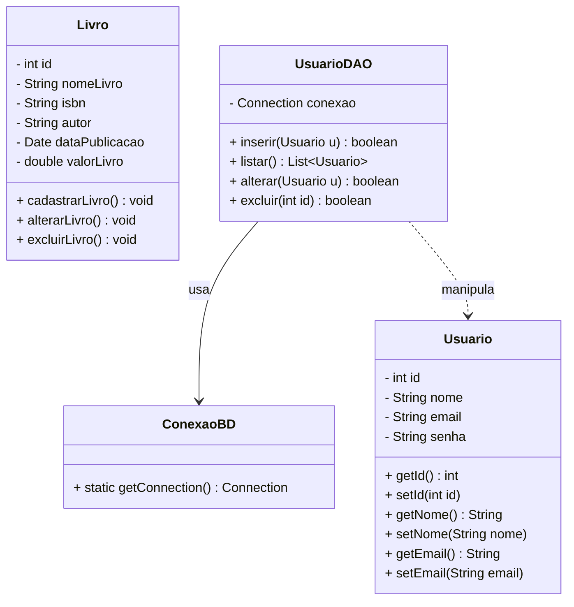
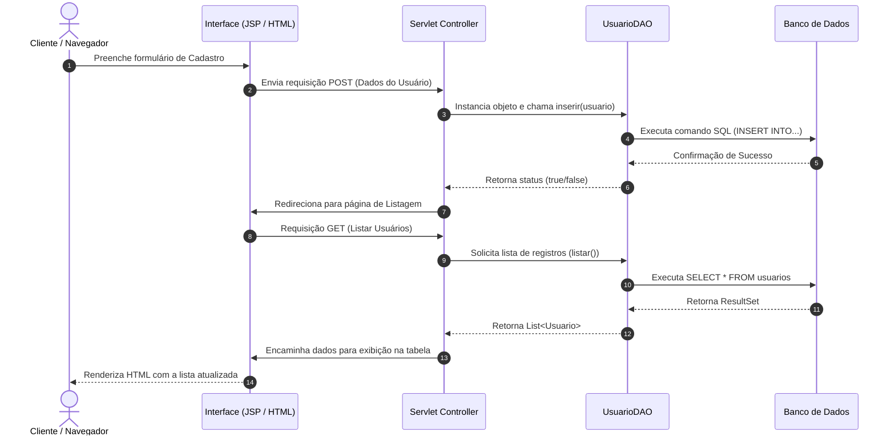
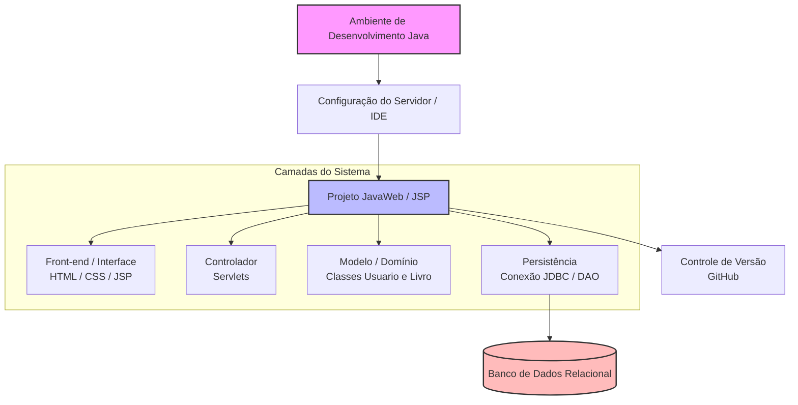

# [Prof. Jefferson Passerini] Laboratório de Programação III

Abaixo estão os diagramas em Mermaid modelados com base no conteúdo da disciplina de **Laboratório de Programação III**, contemplando o desenvolvimento Web com Java (JSP, Servlets, Conexão com Banco de Dados e padrão CRUD).

---

### 1. Diagrama de Classes UML (Domínio do Sistema)
Representação das entidades principais abordadas nas aulas de estruturação de projetos web e implementação do CRUD (com base nas classes `Usuario` e no trabalho prático da classe `Livro`).

* **Explicação do Objeto:** O diagrama ilustra a arquitetura orientada a dados do sistema Java Web. A classe de acesso a dados (`UsuarioDAO`) gerencia a persistência utilizando uma classe de conexão (`ConexaoBD`), operando sobre as entidades de domínio (`Usuario` e `Livro`).

---

### 2. Diagrama de Sequência (Fluxo do CRUD - Listar e Incluir)
Ilustra a interação entre a interface (JSP/Front-end), o Controlador (Servlet) e a camada de persistência (DAO/Banco de Dados) durante uma operação de CRUD.

* **Explicação do Fluxo:** Demonstra o ciclo completo de uma requisição Web em Java (arquitetura MVC simplificada). A requisição do usuário via interface JSP é processada pelo Servlet, repassada ao DAO para persistência no Banco de Dados Relacional, e o resultado é devolvido em formato de listagem renderizada na tela.

---

### 3. Diagrama Arquitetural (Ambiente e Camadas do Projeto Java Web)
Visão geral da estrutura de pastas, configuração de ambiente e camadas lógicas construídas ao longo das aulas (Ambiente -> Servidor/Projeto -> Camadas Web/DAO).

* **Explicação Arquitetural:** Mapeia a evolução da disciplina desde a preparação do ambiente de desenvolvimento (Aulas 01 e 02), passando pela estruturação da interface front-end, implementação de Servlets, conexão com o banco de dados (Aulas 03 e 04), até o versionamento de código e entregas de trabalhos práticos via GitHub.