# Manual de Estudos e Referência Integrada: Laboratório de Programação III

**Instituição:** Centro Universitário de Fernandópolis (UniFEF)  
**Curso:** Bacharelado em Sistemas de Informação (3º Semestre)  
**Disciplina:** Laboratório de Programação III  
**Docente:** Prof. Jefferson Passerini  

---

## Sumário

- [Visão Geral da Disciplina e Planejamento Semestral](#visão-geral-da-disciplina-e-planejamento-semestral)
  - [Ementa e Objetivos Pedagógicos](#ementa-e-objetivos-pedagógicos)
  - [Linha do Tempo das Atividades e Avaliações](#linha-do-tempo-das-atividades-e-avaliações)
  - [Mapa Conceitual da Disciplina](#mapa-conceitual-da-disciplina)
- [Fundamentos de Programação Orientada a Objetos Avançada](#fundamentos-de-programação-orientada-a-objetos-avançada)
  - [Encapsulamento e Invariantes de Estado](#encapsulamento-e-invariantes-de-estado)
  - [Herança e o Princípio de Substituição de Liskov](#herança-e-o-princípio-de-substituição-de-liskov)
  - [Polimorfismo e Ligação Tardia](#polimorfismo-e-ligação-tardia)
  - [Abstração: Classes Abstratas versus Interfaces](#abstração-classes-abstratas-versus-interfaces)
  - [Coleções Dinâmicas e Ordenação](#coleções-dinâmicas-e-ordenação)
  - [Hierarquia e Tratamento Robusto de Exceções](#hierarquia-e-tratamento-robusto-de-exceções)
- [Configuração do Ambiente e Arquitetura Monolítica Java EE](#configuração-do-ambiente-e-arquitetura-monolítica-java-ee)
  - [Arquitetura da Plataforma Java: JDK, JRE e JVM](#arquitetura-da-plataforma-java-jdk-jre-e-jvm)
  - [O Container Web Apache Tomcat 9 e a Cisão Jakarta EE](#o-container-web-apache-tomcat-9-e-a-cisão-jakarta-ee)
  - [Configuração da IDE Apache NetBeans 24 e Apache Ant](#configuração-da-ide-apache-netbeans-24-e-apache-ant)
  - [Monólitos Corporativos versus Microsserviços](#monólitos-corporativos-versus-microsserviços)
  - [O Padrão Arquitetural MVC e Estrutura de Pacotes](#o-padrão-arquitetural-mvc-e-estrutura-de-pacotes)
- [Camada de Apresentação com JSP e Tecnologias Frontend](#camada-de-apresentação-com-jsp-e-tecnologias-frontend)
  - [Ciclo de Vida e Processamento de JavaServer Pages](#ciclo-de-vida-e-processamento-de-javaserver-pages)
  - [Modularização com jsp:include e Resolução de ContextPath](#modularização-com-jspinclude-e-resolução-de-contextpath)
  - [A Biblioteca Padrão JSTL: Core e Formatting](#a-biblioteca-padrão-jstl-core-e-formatting)
  - [Bibliotecas Frontend e Validação no Cliente com Módulo 11](#bibliotecas-frontend-e-validação-no-cliente-com-módulo-11)
- [Camada de Persistência Relacional com PostgreSQL e JDBC](#camada-de-persistência-relacional-com-postgresql-e-jdbc)
  - [SGBD PostgreSQL, Tipagem Segura e Sequências](#sgbd-postgresql-tipagem-segura-e-sequências)
  - [O Padrão Criacional Singleton: SingleConnection](#o-padrão-criacional-singleton-singleconnection)
  - [Controle Transacional Manual e Propriedades ACID](#controle-transacional-manual-e-propriedades-acid)
  - [Interceptação de Requisições com Servlet Filters](#interceptação-de-requisições-com-servlet-filters)
- [Implementação da Consulta e Listagem no Padrão MVC](#implementação-da-consulta-e-listagem-no-padrão-mvc)
  - [O Modelo de Dados JavaBean e o Contrato de Identidade](#o-modelo-de-dados-javabean-e-o-contrato-de-identidade)
  - [Contratos de Acesso a Dados com a Interface GenericDAO](#contratos-de-acesso-a-dados-com-a-interface-genericdao)
  - [Ciclo de Vida de Servlets e o Controlador de Listagem](#ciclo-de-vida-de-servlets-e-o-controlador-de-listagem)
  - [Renderização Dinâmica com JSTL e DataTables](#renderização-dinâmica-com-jstl-e-datatables)
- [Operações de Manutenção Completa do Cadastro](#operações-de-manutenção-completa-do-cadastro)
  - [Bifurcação de Persistência na DAO](#bifurcação-de-persistência-na-dao)
  - [Prevenção de SQL Injection e Mapeamento de Datas](#prevenção-de-sql-injection-e-mapeamento-de-datas)
  - [Verificação Assíncrona de Unicidade e AJAX](#verificação-assíncrona-de-unicidade-e-ajax)
  - [Validação Algorítmica Centralizada no Backend](#validação-algorítmica-centralizada-no-backend)
  - [Fluxo de Alteração e o Método Carregar](#fluxo-de-alteração-e-o-método-carregar)
- [Projetos Práticos e Trabalhos da Disciplina](#projetos-práticos-e-trabalhos-da-disciplina)
  - [Trabalho de Programação: Módulo de Livros](#trabalho-de-programação-módulo-de-livros)
  - [Trabalho de Programação: Módulo de Estados Federativos](#trabalho-de-programação-módulo-de-estados-federativos)
- [Exames e Avaliações do Semestre](#exames-e-avaliações-do-semestre)
  - [Avaliação 1: POO Avançada e Folha de Pagamento](#avaliação-1-poo-avançada-e-folha-de-pagamento)
  - [Avaliação II: CRUD de Produtos com JDBC e Exceções](#avaliação-ii-crud-de-produtos-com-jdbc-e-exceções)
  - [Avaliação Substitutiva: Hierarquias, Interfaces e Tributação](#avaliação-substitutiva-hierarquias-interfaces-e-tributação)
- [Guia de Diagnóstico de Falhas e Boas Práticas](#guia-de-diagnóstico-de-falhas-e-boas-práticas)
  - [Resolução de Erros Clássicos de Compilação e Execução](#resolução-de-erros-clássicos-de-compilação-e-execução)
  - [Boas Práticas de Engenharia e Segurança Web](#boas-práticas-de-engenharia-e-segurança-web)
- [Apêndices Acadêmicos](#apêndices-acadêmicos)
  - [Glossário Técnico](#glossário-técnico)
  - [Banco de Questões e Respostas para Revisão](#banco-de-questões-e-respostas-para-revisão)
  - [Checklist de Homologação de Projetos](#checklist-de-homologação-de-projetos)

---

## Visão Geral da Disciplina e Planejamento Semestral

### Ementa e Objetivos Pedagógicos

A disciplina de **Laboratório de Programação III**, ministrada no 3º semestre do curso de Sistemas de Informação da UniFEF pelo **Prof. Jefferson Passerini**, estabelece a ponte definitiva entre o paradigma de Orientação a Objetos puro (desenvolvido prioritariamente em aplicações desktop e consoles locais) e a engenharia de software voltada a sistemas corporativos distribuídos na plataforma Java Web.

Os objetivos centrais da formação estruturam-se em:
1. **Consolidação dos Pilares de POO**: Capacitar o estudante a projetar modelos de domínio ricos, aplicando encapsulamento defensivo, hierarquias de herança semântica, polimorfismo dinâmico e abstrações via classes abstratas e interfaces.
2. **Dominar o Padrão Arquitetural MVC**: Estruturar monólitos corporativos em camadas físicas e lógicas rigorosamente desacopladas: Visão (JSP, JSTL, EL, Bootstrap, jQuery), Controle (Servlets HTTP, Web Filters) e Modelo/Persistência (JavaBeans, GenericDAO, JDBC, PostgreSQL).
3. **Persistência Relacional Segura**: Compreender o ciclo de vida de conexões JDBC, a parametrização contra vulnerabilidades de injeção de SQL via `PreparedStatement` e o controle transacional atômico (`commit`/`rollback`).
4. **Resolução de Problemas no Frontend Corporativo**: Desenvolver interfaces modulares com fragmentação de telas, validação de regras matemáticas oficiais (Módulo 11 para documentos federais) e comunicação assíncrona baseada em AJAX.

---

### Linha do Tempo das Atividades e Avaliações

A execução do semestre letivo distribuiu-se em aulas expositivas de laboratório, entregas de trabalhos práticos de desenvolvimento em equipe e exames formais individuais, conforme registrado nos cronogramas acadêmicos oficiais:

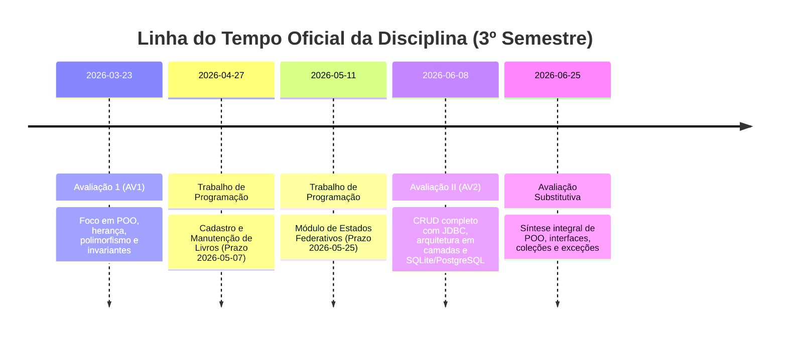

---

### Mapa Conceitual da Disciplina

O ecossistema abordado pelo Prof. Jefferson Passerini interliga componentes de interface, motores de execução na JVM e mecanismos de persistência relacional sob um fluxo contínuo de controle:

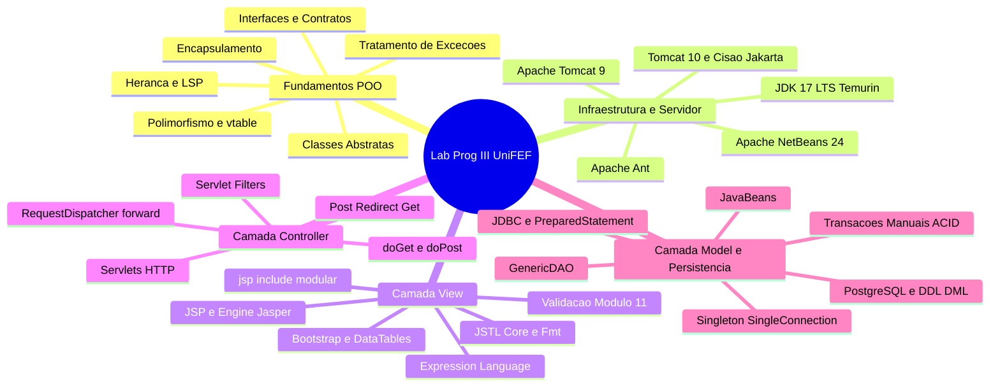

---

## Fundamentos de Programação Orientada a Objetos Avançada

### Encapsulamento e Invariantes de Estado

#### Definição
O encapsulamento é o mecanismo estrutural de isolamento que restringe o acesso direto ao estado interno de um objeto, expondo unicamente métodos públicos que governam as transições de estado permitidas e asseguram suas **invariantes de estado**. Uma invariante de estado é uma condição lógica ou regra de negócio que deve obrigatoriamente manter-se verdadeira durante todo o ciclo de vida do objeto na memória heap.

#### Motivação
Em sistemas empresariais, permitir que atributos de entidades recebam valores diretamente sem passar por validação acarreta corrupção silenciosa de dados. Se o atributo `salarioBase` de um colaborador puder ser manipulado livremente, cálculos tributários, folha de pagamento e emissão bancária falharão em momentos tardios e imprevisíveis.

#### Exemplo Prático de Encapsulamento Rigoroso
```java
package br.com.unifef.dominio;

public class Funcionario {
    private String nome;
    private int matricula;
    private double salarioBase;

    public Funcionario(String nome, int matricula, double salarioBase) {
        setNome(nome);
        setMatricula(matricula);
        setSalarioBase(salarioBase);
    }

    public String getNome() {
        return nome;
    }

    public void setNome(String nome) {
        if (nome == null || nome.trim().isEmpty()) {
            throw new IllegalArgumentException("Violacao de invariante: O nome nao pode ser nulo ou vazio.");
        }
        this.nome = nome.trim();
    }

    public int getMatricula() {
        return matricula;
    }

    public void setMatricula(int matricula) {
        if (matricula <= 0) {
            throw new IllegalArgumentException("Violacao de invariante: A matricula deve ser estritamente positiva.");
        }
        this.matricula = matricula;
    }

    public double getSalarioBase() {
        return salarioBase;
    }

    public void setSalarioBase(double salarioBase) {
        if (salarioBase <= 0.0) {
            throw new IllegalArgumentException("Violacao de invariante: O salario base deve ser maior do que zero.");
        }
        this.salarioBase = salarioBase;
    }

    public double calcularSalario() {
        return this.salarioBase;
    }
}
```

#### Contraexemplo
```java
// Anti-pattern: Modelo anêmico com atributos públicos sem defesa
public class FuncionarioInseguro {
    public String nome;
    public int matricula;
    public double salarioBase;
    // Qualquer trecho do sistema pode executar:
    // funcionario.salarioBase = -50000.00;
}
```

#### Armadilhas Comuns
- **Getters e Setters Automáticos sem Validação**: Gerar automaticamente mutadores públicos através da IDE sem incluir filtros condicionais cria apenas uma ilusão sintática de encapsulamento, funcionando identicamente a campos públicos.
- **Vazamento de Referências Mutáveis**: Retornar coleções ou objetos mutáveis diretamente nos métodos `get` (por exemplo, retornar o ponteiro direto de `java.util.Date` ou `List`) permite que classes externas alterem o conteúdo interno do objeto sem passar pelos métodos de validação. A boa prática exige retornar cópias defensivas (`new Date(data.getTime())` ou `Collections.unmodifiableList(lista)`).

---

### Herança e o Princípio de Substituição de Liskov

#### Definição
A herança é a relação estrutural em que uma classe derivada (subclasse) herda campos e comportamentos de uma classe superior (superclasse), estabelecendo um vínculo semântico do tipo "É-UM" (*is-a*). O **Princípio de Substituição de Liskov (LSP)**, formulado por Barbara Liskov, preconiza que se $S$ é um subtipo de $T$, objetos do tipo $T$ devem poder ser substituídos por objetos do tipo $S$ em qualquer parte do programa sem alterar nenhuma das propriedades desejáveis de correção desse programa.

#### Motivação
A herança viabiliza o reuso sistemático de código estrutural e previne a duplicação desnecessária (*Don't Repeat Yourself*). O respeito estrito ao LSP garante que métodos polimórficos de alto nível possam processar qualquer subclasse sem surpresas comportamentais ou lançamento de exceções inesperadas.

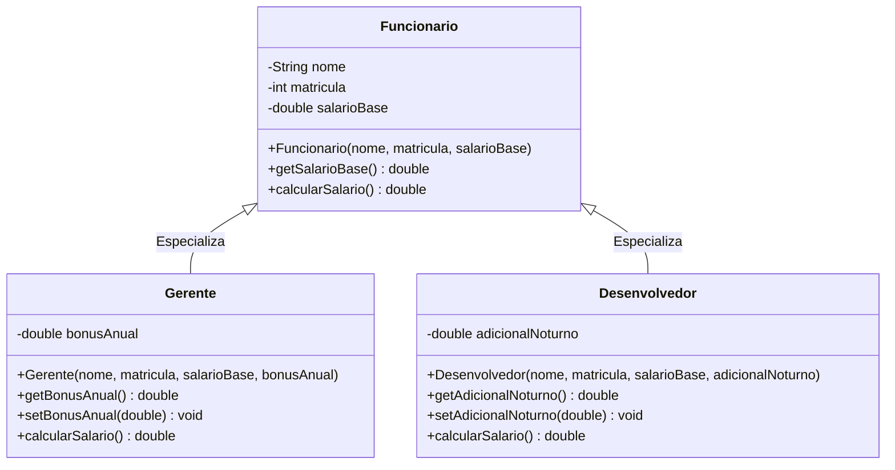

#### Exemplo Prático com Respeito ao LSP
```java
package br.com.unifef.dominio;

public class Gerente extends Funcionario {
    private double bonusAnual;

    public Gerente(String nome, int matricula, double salarioBase, double bonusAnual) {
        super(nome, matricula, salarioBase);
        setBonusAnual(bonusAnual);
    }

    public double getBonusAnual() {
        return bonusAnual;
    }

    public void setBonusAnual(double bonusAnual) {
        if (bonusAnual < 0.0) {
            throw new IllegalArgumentException("O bonus anual nao pode ser negativo.");
        }
        this.bonusAnual = bonusAnual;
    }

    @Override
    public double calcularSalario() {
        // Estende o comportamento mantendo a previsibilidade do contrato
        return super.calcularSalario() + (this.bonusAnual / 12.0);
    }
}
```

#### Contraexemplo (Violação Clássica de Liskov)
```java
public class EstagiarioVoluntario extends Funcionario {
    public EstagiarioVoluntario(String nome, int matricula) {
        super(nome, matricula, 1.0); // Burlar invariante da superclasse
    }

    @Override
    public double calcularSalario() {
        // Quebra grave: lanca excecao onde o cliente esperava receber um double
        throw new UnsupportedOperationException("Estagiarios voluntarios nao possuem salario.");
    }
}
```

#### Armadilhas Comuns
- **Herança por Conveniência**: Estender uma classe apenas para reaproveitar métodos utilitários, quando a semântica "É-UM" não existe (exemplo clássico: fazer uma classe `Pessoa` herdar de `ArrayList` para aproveitar os métodos de inserção). A composição deve ser preferida nesses cenários.
- **Fragilidade da Superclasse**: Alterar atributos protegidos (`protected`) ou comportamentos de uma superclasse pode causar efeitos colaterais catastróficos em subclasses distribuídas em outros pacotes.

---

### Polimorfismo e Ligação Tardia

#### Definição
O polimorfismo é a capacidade de invocar a mesma assinatura de método sobre referências de um tipo genérico, disparando comportamentos distintos conforme o tipo concreto da instância instanciada em tempo de execução. O mecanismo subjacente é a **ligação tardia** (*dynamic binding*), na qual a JVM utiliza tabelas de métodos virtuais (*vtable*) e o bytecode `invokevirtual` para descobrir o método exato em runtime, em vez de determiná-lo durante a compilação.

#### Motivação
Elimina a necessidade de estruturas condicionais encadeadas (`if-else`, `switch-case`) e operadores de checagem de tipo em tempo de execução (`instanceof`). Novas especializações de classes podem ser incorporadas ao sistema sem exigir modificação nas classes consumidoras de alto nível, atendendo plenamente ao Princípio Aberto/Fechado (OCP - *Open/Closed Principle*).

#### Diagrama de Sequência de Despacho Dinâmico
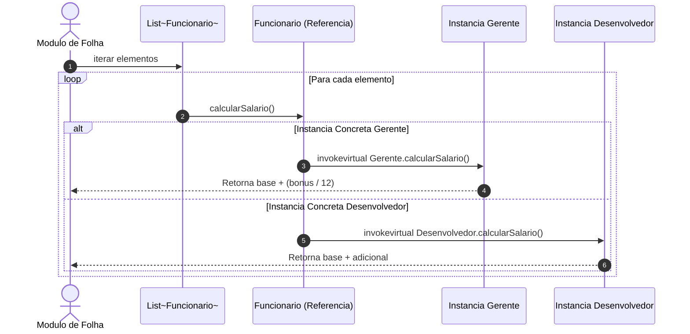

#### Exemplo Prático de Processamento Polimórfico
```java
package br.com.unifef.servico;

import br.com.unifef.dominio.Funcionario;
import java.util.List;

public class ServicoFolhaPagamento {

    public double processarFolhaTotal(List<Funcionario> colaboradores) {
        if (colaboradores == null) {
            throw new IllegalArgumentException("A lista de colaboradores nao pode ser nula.");
        }
        
        double totalizador = 0.0;
        for (Funcionario f : colaboradores) {
            // Chamada polimorfica pura: desacoplada do tipo especifico de funcionario
            totalizador += f.calcularSalario();
        }
        return totalizador;
    }
}
```

---

### Abstração: Classes Abstratas versus Interfaces

#### Comparativo Teórico e Prático
A abstração é o processo de isolar características fundamentais de um domínio sem incluir detalhes prematuros de implementação. Na linguagem Java, essa capacidade divide-se em dois tipos formais de referência:

| Critério de Engenharia | Classe Abstrata (`abstract class`) | Interface (`interface`) |
| :--- | :--- | :--- |
| **Vínculo Semântico** | Relação de Identidade e Linhagem ("É-UM"). | Relação de Contrato e Capacidade ("FAZ-UM" / *Can-Do*). |
| **Instanciação** | Proibida diretamente via operador `new`. | Proibida diretamente via operador `new`. |
| **Herança na Linguagem Java** | Herança simples exclusiva (`extends`). | Múltipla implementação permitida (`implements A, B, C`). |
| **Estado e Atributos** | Pode possuir atributos de instância privados e protegidos. | Apenas constantes públicas (`public static final`). |
| **Implementação de Métodos** | Métodos abstratos e métodos concretos completos. | Métodos abstratos (ou métodos `default`/`static` a partir do Java 8). |
| **Propósito Arquitetural** | Compartilhar estado interno estrutural e código base. | Desacoplar subsistemas através de contratos estritos. |

#### Modelagem de Classes Abstratas e Contratos via Interface
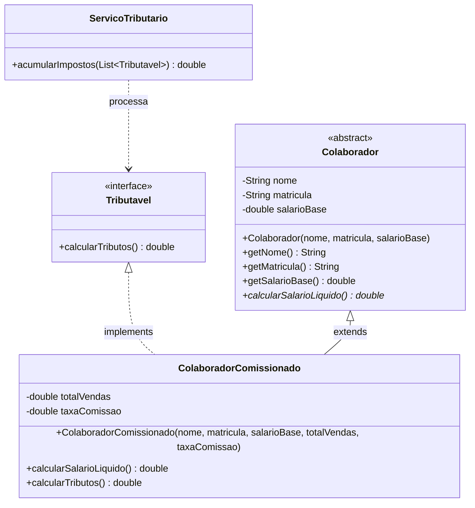

#### Código do Contrato e da Implementação Concreta
```java
package br.com.unifef.tributacao;

public interface Tributavel {
    double calcularTributos();
}
```

```java
package br.com.unifef.tributacao;

import br.com.unifef.dominio.Funcionario;

public class FuncionarioComissionado extends Funcionario implements Tributavel {
    private double totalDeVendas;
    private double percentualComissao;

    public FuncionarioComissionado(String nome, int matricula, double salarioBase, 
                                   double totalDeVendas, double percentualComissao) {
        super(nome, matricula, salarioBase);
        if (totalDeVendas < 0.0 || percentualComissao < 0.0) {
            throw new IllegalArgumentException("Vendas e comissao devem ser valores positivos.");
        }
        this.totalDeVendas = totalDeVendas;
        this.percentualComissao = percentualComissao;
    }

    @Override
    public double calcularSalario() {
        return getSalarioBase() + (this.totalDeVendas * (this.percentualComissao / 100.0));
    }

    @Override
    public double calcularTributos() {
        // Exemplo: 11% retido sobre a remuneracao bruta integral
        return this.calcularSalario() * 0.11;
    }
}
```

---

### Coleções Dinâmicas e Ordenação

#### Definição e Vantagens sobre Arrays Primitivos
O framework de coleções do Java (`java.util`) substitui a rigidez dos arrays estáticos (`Object[]`), cujo tamanho é imutável após a alocação. A interface `List<E>` representa uma sequência ordenada de elementos que admite duplicações e elementos nulos. Sua implementação mais comum, a classe `ArrayList<E>`, apoia-se em um vetor redimensionável com acesso posicional em tempo constante $O(1)$.

O uso obrigatório de **Generics** (`List<Funcionario>` em vez da coleção crua `List`) garante segurança estática de tipos em tempo de compilação (*type-safety*), prevenindo que objetos estranhos entrem na estrutura e eliminando conversões forçadas (*typecasting*).

#### Algoritmos de Ordenação com Comparator
Para ordenar elementos segundo critérios dinâmicos de negócio (como ordenar colaboradores por remuneração decrescente), utiliza-se a interface funcional `java.util.Comparator<T>`:

```java
package br.com.unifef.servico;

import br.com.unifef.dominio.Funcionario;
import java.util.ArrayList;
import java.util.Collections;
import java.util.Comparator;
import java.util.List;

public class OrdenadorFuncionarios {

    public static List<Funcionario> ordenarPorSalarioDecrescente(List<Funcionario> original) {
        if (original == null) {
            return Collections.emptyList();
        }
        
        // Criar copia defensiva para nao corromper a ordem da lista original
        List<Funcionario> copia = new ArrayList<>(original);
        
        copia.sort(new Comparator<Funcionario>() {
            @Override
            public int compare(Funcionario f1, Funcionario f2) {
                // Ordenacao decrescente: compara f2 com f1
                return Double.compare(f2.calcularSalario(), f1.calcularSalario());
            }
        });
        
        return copia;
    }
}
```

---

### Hierarquia e Tratamento Robusto de Exceções

#### Arquitetura de Tratamento de Falhas na JVM
O modelo de exceções em Java deriva da classe raiz `java.lang.Throwable`, dividindo-se em duas ramificações operacionais distintas:

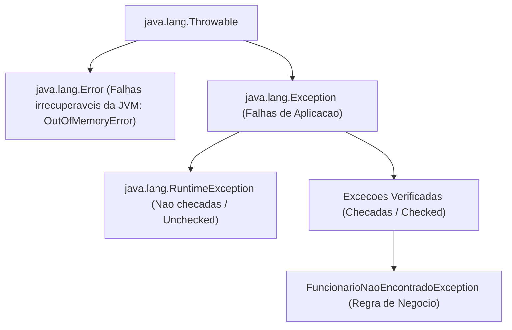

1. **Exceções Verificadas (*Checked Exceptions*)**: Subclasses diretas de `java.lang.Exception` (exceto `RuntimeException`). O compilador força obrigatoriamente a declaração formal da exceção na assinatura do método (`throws`) ou sua interceptação (`try-catch`). Devem ser aplicadas para eventos recuperáveis de negócio ou falhas previsíveis de infraestrutura externa (ex.: `SQLException`, `IOException`).
2. **Exceções Não Verificadas (*Unchecked Exceptions*)**: Subclasses de `java.lang.RuntimeException`. Indicam falhas de codificação ou violações imediatas de pré-condições (ex.: `NullPointerException`, `IllegalArgumentException`, `IndexOutOfBoundsException`). O compilador não exige sintaxe de captura obrigatória.

#### Criação e Uso de Exceção Customizada de Domínio
```java
package br.com.unifef.excecao;

/**
 * Excecao checada de negocio que sinaliza falha na busca cadastral de entidades.
 */
public class FuncionarioNaoEncontradoException extends Exception {
    private static final long serialVersionUID = 1L;

    public FuncionarioNaoEncontradoException(String mensagem) {
        super(mensagem);
    }

    public FuncionarioNaoEncontradoException(String mensagem, Throwable causa) {
        super(mensagem, causa);
    }
}
```

---

## Configuração do Ambiente e Arquitetura Monolítica Java EE

### Arquitetura da Plataforma Java: JDK, JRE e JVM

O desenvolvimento corporativo fundamenta-se na independência de plataforma operacional garantida pelo bytecode Java:

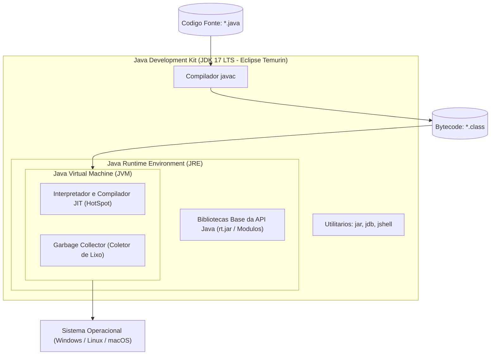

Na disciplina do Prof. Jefferson Passerini, adota-se o **Java JDK 17 LTS** distribuído pela fundação Eclipse sob o projeto **Adoptium (Eclipse Temurin)**. Versões LTS (*Long-Term Support*) asseguram suporte de segurança estendido e estabilidade de bytecode, prevenindo as oscilações de compatibilidade inerentes aos lançamentos semestrais da linguagem.

---

### O Container Web Apache Tomcat 9 e a Cisão Jakarta EE

#### O Papel do Container Web
O Apache Tomcat não é um servidor de aplicações corporativo integral (como WildFly ou Payara), mas um **J2EE Web Container**. Ele é o processo servidor que implementa nativamente as especificações:
- **Jakarta/Java Servlet**: interceptação de conexões de rede HTTP, decodificação de requisições (`HttpServletRequest`) e escrita de respostas (`HttpServletResponse`).
- **JavaServer Pages (JSP)**: compilação sob demanda de páginas de interface em classes Java puras executáveis.
- **Expression Language (EL)**: motor de avaliação de expressões de dados entre escopos.

#### O Dilema da Transição Java EE para Jakarta EE (Tomcat 9 versus Tomcat 10+)
A Oracle transferiu o controle formal do Java EE para a Eclipse Foundation. Devido a questões de registro da marca "Java", a especificação foi renomeada para **Jakarta EE**. A partir da versão Jakarta EE 9, todos os pacotes das APIs sofreram uma alteração drástica de nomenclatura:

$$\text{javax.*} \longrightarrow \text{jakarta.*}$$

- **Apache Tomcat 9.0.x**: Executa sobre a especificação clássica **Java EE 8**, mantendo o namespace tradicional `javax.servlet.*` e `javax.servlet.jsp.*`.
- **Apache Tomcat 10.0.x / 10.1.x / 11.0.x**: Adotam o novo namespace `jakarta.servlet.*`.

Se um projeto desenvolvido em sala de aula (cujas bibliotecas internas, JSTL e código-fonte importam `javax.servlet.*`) for implantado no Apache Tomcat 10+, ocorrerão falhas catastróficas de implantação com erros de `ClassNotFoundException` ou `NoClassDefFoundError`. Portanto, a infraestrutura da disciplina exige estritamente o **Apache Tomcat versão 9**.

---

### Configuração da IDE Apache NetBeans 24 e Apache Ant

A disciplina emprega a IDE **Apache NetBeans 24**. Historicamente mantida pela Sun Microsystems e pela Oracle, a IDE foi doada à Apache Software Foundation e preserva integração nativa de excelência com o motor de compilação **Apache Ant**.

Na criação de um novo projeto no NetBeans:
1. Navega-se em: `File` -> `New Project...`.
2. Seleciona-se a categoria `Java with Ant` -> `Java Web` -> `Web Application`.
3. Informa-se o nome do projeto (exemplo: `AplCurso`) e o diretório de destino.
4. Na tela de escolha do servidor e especificação:
   - **Server**: `Apache Tomcat 9.0.x` (previamente associado à IDE apontando para a pasta raiz onde o Tomcat foi descompactado, ex.: `C:\apache-tomcat-9.0.102`).
   - **Java EE Version**: `Java EE 8 Web`.
   - **Context Path**: `/AplCurso` (definição da rota raiz no navegador).

---

### Monólitos Corporativos versus Microsserviços

A disciplina foca na estruturação arquitetural de aplicações **monolíticas modulares**. Em um monólito corporativo, a interface com o usuário, as rotinas de orquestração de negócio e as camadas de persistência residem no mesmo repositório e executam no mesmo processo de sistema operacional sob a mesma JVM:

```mermaid
flowchart LR
    subgraph Monolito["Processo Unico da JVM (Apache Tomcat 9)"]
        View["Visao: JSP / JSTL"]
        Ctrl["Controle: Servlets / Filters"]
        Negocio["Dominio: Regras e Modelos"]
        Persist["Acesso a Dados: DAOs / JDBC"]
        View <--> Ctrl
        Ctrl <--> Negocio
        Negocio <--> Persist
    end
    Navegador["Navegador Web"] <-->|Protocolo HTTP (Porta 8080)| Monolito
    Persist <-->|Conexao Socket TCP (Porta 5432)| PostgreSQL[(SGBD PostgreSQL)]
```

#### Comparativo de Decisão de Engenharia de Software

| Dimensão de Análise | Monólito Modular (Java EE Web) | Arquitetura de Microsserviços |
| :--- | :--- | :--- |
| **Comunicação entre Módulos** | Chamadas diretas de métodos na memória local ($O(1)$ sem rede). | Chamadas remotas via HTTP/REST ou gRPC (alta latência de rede). |
| **Integridade Transacional** | Transações locais atômicas ACID via JDBC puro na mesma conexão. | Transações distribuídas de alta complexidade (padrão Saga, 2PC). |
| **Empacotamento e Deploy** | Um único artefato compilado (`.war`) implantado no container. | Múltiplos contêineres Docker orquestrados por clusters Kubernetes. |
| **Custo Operacional Inicial** | Baixo; ideal para sistemas empresariais médios e aprendizado sólido. | Alto; requer observabilidade distribuída, service mesh e gateways. |

---

### O Padrão Arquitetural MVC e Estrutura de Pacotes

Para prevenir a formação de código espaguete, o monólito corporativo adota a separação estrita de responsabilidades do padrão **Model-View-Controller (MVC Modelo 2)**:

```mermaid
flowchart TD
    Cliente["Navegador do Cliente"]
    Filtro["Filter (FilterAutenticacao)"]
    Servlet["Controller (Servlet)"]
    DAO["DAO (UsuarioDAO)"]
    BD[(PostgreSQL)]
    JSP["View (JSP Modular)"]

    Cliente -->|"1. Requisicao HTTP"| Filtro
    Filtro -->|"2. Repassa cadeia (chain.doFilter)"| Servlet
    Servlet -->|"3. Aciona operacoes"| DAO
    DAO <-->|"4. Executa SQL via JDBC"| BD
    DAO -->>|"5. Retorna Entidades / Colecoes"| Servlet
    Servlet -->|"6. Injeta dados no escopo (request.setAttribute)"| JSP
    Servlet -->|"7. Despacho interno (forward)"| JSP
    JSP -->>|"8. Resposta HTTP (HTML renderizado)"| Cliente
```

#### Estrutura Canônica de Pacotes em `Source Packages`
- `br.com.aplcurso.model`: Entidades de domínio estruturadas como JavaBeans/POJOs puras (ex.: `Usuario.java`).
- `br.com.aplcurso.dao`: Classes de acesso a dados responsáveis pelas instruções SQL e manuseio de `PreparedStatement` e `ResultSet` (ex.: `UsuarioDAO.java`).
- `br.com.aplcurso.controller.usuario`: Servlets HTTP mapeadas via anotação `@WebServlet` que processam os métodos `doGet` e `doPost` (ex.: `UsuarioListar.java`, `UsuarioCadastrar.java`).
- `br.com.aplcurso.filter`: Filtros de ciclo de vida mapeados via `@WebFilter` para controle transversal de segurança e conexões (ex.: `FilterAutenticacao.java`).
- `br.com.aplcurso.utils`: Classes auxiliares reutilizáveis, conector singleton, rotinas de validação de documentos e scripts SQL estruturais (ex.: `SingleConnection.java`, `DocumentoValidador.java`, `banco.sql`).

---

## Camada de Apresentação com JSP e Tecnologias Frontend

### Ciclo de Vida e Processamento de JavaServer Pages

Páginas JSP não são arquivos estáticos servidos diretamente ao navegador. O container Tomcat possui um motor especializado denominado **Jasper** encarregado de processar os arquivos `.jsp`:

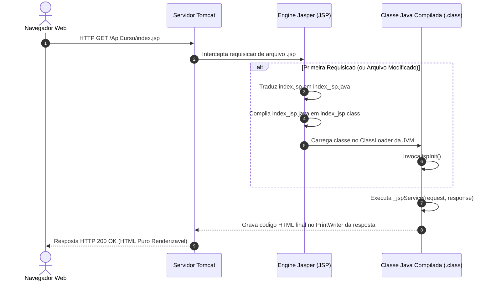

---

### Modularização com jsp:include e Resolução de ContextPath

#### Inclusão Dinâmica (`jsp:include`) versus Inclusão Estática (`<%@include %>`)
A separação de telas em fragmentos reutilizáveis garante manutenibilidade e atende ao princípio DRY:

- **`<jsp:include page="..." />` (Inclusão Dinâmica em Tempo de Execução)**: Executada durante o processamento da requisição HTTP via mecanismo interno equivalente a `RequestDispatcher.include()`. O arquivo incluído é tratado como um recurso independente. Alterações no arquivo incluído refletem imediatamente na próxima requisição sem exigir reinicialização do servidor. **É a abordagem padrão exigida no curso**.
- **`<%@include file="..." %>` (Inclusão Estática em Tempo de Tradução)**: Funde o texto cru do arquivo incluído dentro do arquivo pai antes da compilação do arquivo Java correspondente. Qualquer alteração no fragmento pode exigir recompilação forçada da página mestre.

#### Resolução Absoluta com Expression Language
O uso de caminhos relativos em páginas web (exemplo: `<script src="../../js/app.js">`) é uma fonte constante de erros de carregamento, pois a rota no navegador depende da profundidade da URL disparada pelo Servlet. A forma robusta de resolver URLs na aplicação web é empregar a Expression Language apontando para o contexto raiz da aplicação:

```jsp
${pageContext.request.contextPath}/js/app.js
```

Se a aplicação estiver implantada em `/AplCurso`, a expressão será avaliada em tempo de execução como `/AplCurso/js/app.js`, garantindo carregamento absoluto de folhas de estilo e scripts.

---

### A Biblioteca Padrão JSTL: Core e Formatting

A JSTL (*JavaServer Pages Standard Tag Library*) elimina a necessidade de código scriptlet Java (`<% ... %>`) incrustado no HTML. Para utilizá-la, declara-se a diretiva `<%@taglib %>` no cabeçalho das páginas:

```jsp
<%@taglib prefix="c" uri="http://java.sun.com/jsp/jstl/core" %>
<%@taglib prefix="fmt" uri="http://java.sun.com/jsp/jstl/fmt" %>
```

#### Tags Essenciais da JSTL
- `<c:forEach items="${listaUsuarios}" var="usuario">`: Realiza a iteração sobre coleções (`List`, vetores ou conjuntos), instanciando a variável de iteração no escopo de página.
- `<c:out value="${usuario.nome}" />`: Imprime valores no HTML realizando escape preventivo de caracteres especiais (`<`, `>`, `&`), evitando falhas de Cross-Site Scripting (XSS).
- `<fmt:formatDate value="${usuario.dataNascimento}" pattern="dd/MM/yyyy" />`: Formata objetos do tipo `java.util.Date` para o padrão de data brasileiro.
- `<fmt:formatNumber value="${usuario.salario}" type="currency" currencySymbol="R$" />`: Formata valores numéricos para o padrão monetário nacional com pontuação centesimal correta.

---

### Bibliotecas Frontend e Validação no Cliente com Módulo 11

#### Estrutura de Fragmentação de Layout
Para padronizar a identidade visual e o fechamento do DOM, o projeto subdivide as telas em fragmentos:

1. **`header.jsp`**: Abre as tags estruturais `<!DOCTYPE html>`, `<html>`, `<head>`, inclui os metadados, links CSS do Bootstrap 4.3.1, fontes, bibliotecas jQuery 3.3.1, plugins de máscara, SweetAlert2 e abre a tag `<body>`.
2. **`menu.jsp`**: Renderiza a barra de navegação responsiva com os links roteados via Servlet (`${pageContext.request.contextPath}/UsuarioListar`).
3. **Página de Conteúdo (ex.: `home.jsp`, `usuarioCadastrar.jsp`)**: Contém exclusivamente o miolo da interface (títulos, tabelas e formulários).
4. **`footer.jsp`**: Renderiza notas de rodapé corporativas e fecha formalmente as tags abertas no cabeçalho (`</body>` e `</html>`).

#### Algoritmo do Módulo 11 para Validação de CPF e CNPJ
No Brasil, o Ministério da Fazenda (Receita Federal) estabelece o cálculo dos dígitos verificadores (DV) de documentos por meio de somatórios ponderados com base no Módulo 11.

A validação de um CPF de 11 dígitos ($d_1 d_2 \dots d_9 - d_{10} d_{11}$) obedece a:

1. Cálculo do primeiro dígito verificador ($d_{10}$):
   $$S_1 = \sum_{i=1}^{9} d_i \times (11 - i)$$
   $$R_1 = S_1 \pmod{11}$$
   $$d_{10} = \begin{cases} 0, & \text{se } (11 - R_1) \ge 10 \\ 11 - R_1, & \text{caso contrário} \end{cases}$$

2. Cálculo do segundo dígito verificador ($d_{11}$):
   $$S_2 = \left( \sum_{i=1}^{9} d_i \times (12 - i) \right) + (d_{10} \times 2)$$
   $$R_2 = S_2 \pmod{11}$$
   $$d_{11} = \begin{cases} 0, & \text{se } (11 - R_2) \ge 10 \\ 11 - R_2, & \text{caso contrário} \end{cases}$$

O arquivo `app.js` implementa essa rotina no cliente, combinada com máscaras dinâmicas baseadas na quantidade de caracteres digitados no campo unificado de documento.

---

## Camada de Persistência Relacional com PostgreSQL e JDBC

### SGBD PostgreSQL, Tipagem Segura e Sequências

O PostgreSQL é o Sistema Gerenciador de Banco de Dados Relacional adotado na infraestrutura de persistência. A criação da tabela de usuários com suas devidas restrições de integridade estrutural é executada no banco de dados `bdaplcurso`:

```sql
-- DDL de Criacao da Infraestrutura Física: banco.sql
CREATE TABLE usuario (
    id SERIAL PRIMARY KEY,
    nome VARCHAR(100) NOT NULL,
    datanascimento DATE NOT NULL,
    cpf VARCHAR(11) UNIQUE NOT NULL,
    email VARCHAR(100) UNIQUE NOT NULL,
    senha VARCHAR(20) NOT NULL,
    salario DECIMAL(15,2) NOT NULL
);
```

#### O Mecanismo do Tipo `SERIAL`
No dialeto PostgreSQL, o tipo de coluna `SERIAL` opera como um atalho sintático (*syntactic sugar*). Ao ser executado, o SGBD:
1. Cria automaticamente um gerador de sequência nomeado `usuario_id_seq`.
2. Define a coluna física subjacente como `INTEGER` (inteiro de 4 bytes com sinal).
3. Configura o valor padrão da coluna para invocar a função atômica `nextval('usuario_id_seq')`.
4. Transfere a propriedade da sequência para a coluna através de `OWNED BY usuario.id`.

#### Tipagem Monetária: `DECIMAL` versus Tipos de Ponto Flutuante
Valores financeiros **nunca** devem ser modelados como `FLOAT`, `REAL` ou `DOUBLE PRECISION`. Os tipos de ponto flutuante binário da norma IEEE 754 não conseguem representar com exatidão frações decimais finitas (como $0,10$), provocando erros residuais de arredondamento em somatórios acumulados. O uso de `DECIMAL(15,2)` ou `NUMERIC(15,2)` assegura aritmética exata de ponto fixo.

---

### O Padrão Criacional Singleton: SingleConnection

#### Definição
O padrão de projeto criacional **Singleton** (GoF) garante que uma classe possua apenas uma única instância ativa em memória durante toda a execução do programa e fornece um ponto de acesso global unificado para essa instância.

#### Motivação e Abordagem Didática no Curso
Em aplicações Java Web que operam sobre bancos de dados relacionais, o estabelecimento de uma conexão física via socket TCP/IP consome tempo e recursos computacionais consideráveis (troca de pacotes TCP, autenticação e alocação de buffers no SGBD). 

Na arquitetura da disciplina, para simplificar a didática e evitar a complexidade prematura de pools de conexões JNDI (como Apache DBCP ou HikariCP), utiliza-se a classe `SingleConnection` para reter e fornecer uma referência estática da conexão JDBC com o PostgreSQL:

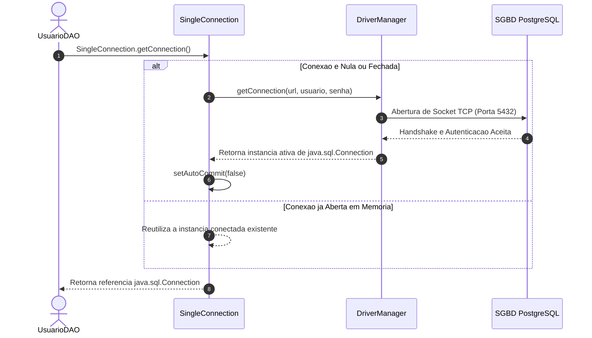

#### Código da Classe `SingleConnection.java`
```java
package br.com.aplcurso.utils;

import java.sql.Connection;
import java.sql.DriverManager;
import java.sql.SQLException;

public class SingleConnection {

    private static final String BANCO = "bdaplcurso";
    private static final String URL = "jdbc:postgresql://localhost:5432/" + BANCO;
    private static final String USUARIO = "postgres";
    private static final String SENHA = "root"; // Ajustar conforme ambiente local
    private static final String DRIVER = "org.postgresql.Driver";

    private static Connection conexao = null;

    static {
        conectar();
    }

    public SingleConnection() {
        conectar();
    }

    private static void conectar() {
        try {
            if (conexao == null || conexao.isClosed()) {
                Class.forName(DRIVER);
                conexao = DriverManager.getConnection(URL, USUARIO, SENHA);
                conexao.setAutoCommit(false); // Controle transacional manual
            }
        } catch (ClassNotFoundException e) {
            System.err.println("Driver JDBC do PostgreSQL nao localizado no classpath! " + e.getMessage());
        } catch (SQLException e) {
            System.err.println("Falha ao abrir conexao com PostgreSQL: " + e.getMessage());
        }
    }

    public static Connection getConnection() {
        try {
            if (conexao == null || conexao.isClosed()) {
                conectar();
            }
        } catch (SQLException e) {
            System.err.println("Erro ao validar estado da conexao: " + e.getMessage());
        }
        return conexao;
    }
}
```

---

### Controle Transacional Manual e Propriedades ACID

#### Fundamentos ACID
Uma transação é uma unidade lógica indivisível de trabalho sobre o banco de dados. Uma transação robusta deve satisfazer as quatro propriedades fundamentais:
- **Atomicidade (Atomicity)**: Todas as operações do bloco transacional são executadas com sucesso ou nenhuma alteração é persistida.
- **Consistência (Consistency)**: A transação conduz o banco de um estado válido a outro estado válido, respeitando todas as regras de integridade e constraints.
- **Isolamento (Isolation)**: Os efeitos de transações concorrentes não são visíveis para outras transações antes da confirmação final.
- **Durabilidade (Durability)**: Uma vez confirmada a transação, seus efeitos persistem permanentemente no armazenamento do disco, resistindo até mesmo a quedas de energia do servidor.

#### Mecanismo de Controle Transacional em JDBC
Por padrão, toda conexão JDBC inicia no modo `autoCommit = true`, onde cada comando SQL individual é comitado imediatamente após a execução. Ao invocar `conexao.setAutoCommit(false)`, a aplicação assume o controle manual:
- **`conexao.commit()`**: Confirma formalmente todas as operações de escrita (`INSERT`, `UPDATE`, `DELETE`) executadas desde o início do bloco.
- **`conexao.rollback()`**: Cancela integralmente todas as modificações pendentes no caso de lançamento de qualquer exceção, restaurando o estado original do banco.

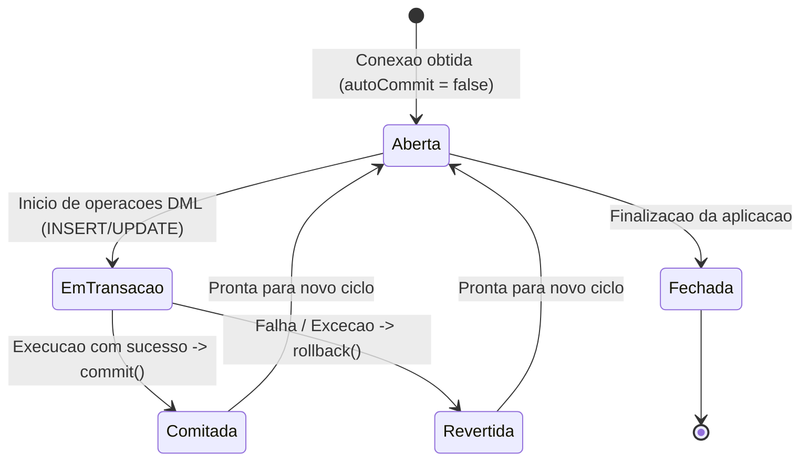

---

### Interceptação de Requisições com Servlet Filters

#### Arquitetura de Interceptação
Um **Servlet Filter** (especificação `javax.servlet.Filter`) atua como uma barreira interceptadora intermediária posicionada entre o navegador cliente e o Servlet de destino. Ele permite auditar, bloquear, redirecionar ou manipular as requisições e respostas de maneira transversal.

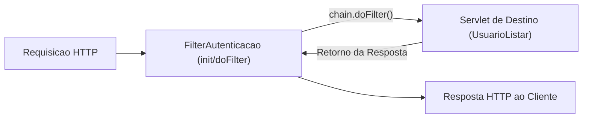

#### Ciclo de Vida do Filter
1. **`init(FilterConfig config)`**: Invocado pelo container uma única vez durante a inicialização da aplicação web. Utilizado para carregar parâmetros de configuração ou inicializar conexões.
2. **`doFilter(ServletRequest request, ServletResponse response, FilterChain chain)`**: Executado a cada requisição que coincida com o mapeamento de URL (`urlPatterns`). Invoca obrigatoriamente `chain.doFilter(request, response)` para permitir que o fluxo avance para o próximo filtro ou servlet da cadeia.
3. **`destroy()`**: Invocado pelo container quando a aplicação é interrompida ou descarregada da memória, ideal para fechar recursos persistentes.

#### Código da Classe `FilterAutenticacao.java`
```java
package br.com.aplcurso.filter;

import br.com.aplcurso.utils.SingleConnection;
import java.io.IOException;
import java.sql.Connection;
import java.sql.SQLException;
import javax.servlet.Filter;
import javax.servlet.FilterChain;
import javax.servlet.FilterConfig;
import javax.servlet.ServletException;
import javax.servlet.ServletRequest;
import javax.servlet.ServletResponse;
import javax.servlet.annotation.WebFilter;

@WebFilter(urlPatterns = {"/*"})
public class FilterAutenticacao implements Filter {

    private static Connection connection;

    @Override
    public void init(FilterConfig filterConfig) throws ServletException {
        // Inicializa a conexao global no carregamento do container
        connection = SingleConnection.getConnection();
    }

    @Override
    public void doFilter(ServletRequest request, ServletResponse response, FilterChain chain)
            throws IOException, ServletException {
        try {
            // Repassa a execucao para a cadeia de filtros e servlets
            chain.doFilter(request, response);
            
            // Comita alteracoes transacionais pendentes da requisicao
            if (connection != null && !connection.getAutoCommit()) {
                connection.commit();
            }
        } catch (Exception e) {
            try {
                if (connection != null && !connection.getAutoCommit()) {
                    connection.rollback();
                }
            } catch (SQLException ex) {
                System.err.println("Falha critica ao executar rollback no Filter: " + ex.getMessage());
            }
            throw new ServletException("Erro interceptado no pipeline de execucao: " + e.getMessage(), e);
        }
    }

    @Override
    public void destroy() {
        try {
            if (connection != null && !connection.isClosed()) {
                connection.close();
            }
        } catch (SQLException e) {
            System.err.println("Erro ao fechar conexao no encerramento do Filter: " + e.getMessage());
        }
    }
}
```

---

## Implementação da Consulta e Listagem no Padrão MVC

### O Modelo de Dados JavaBean e o Contrato de Identidade

A entidade `Usuario` atua como o modelo estrutural do domínio, respeitando a convenção de JavaBeans:
- Campos estritamente privados.
- Construtor padrão sem argumentos e construtor parametrizado completo.
- Métodos acessores (`get`) e modificadores (`set`) públicos.
- Implementação da interface marcadora `java.io.Serializable`.
- Sobrescrita estrita dos métodos `hashCode()` e `equals()` avaliando a chave primária (`id`) e a chave natural de negócio (`cpf`).

```java
package br.com.aplcurso.model;

import java.io.Serializable;
import java.util.Date;
import java.util.Objects;

public class Usuario implements Serializable {
    private static final long serialVersionUID = 1L;

    private int id;
    private String nome;
    private Date dataNascimento;
    private String cpf;
    private String email;
    private String senha;
    private double salario;

    public Usuario() {
        this.id = 0;
        this.nome = "";
        this.dataNascimento = null;
        this.cpf = "";
        this.email = "";
        this.senha = "";
        this.salario = 0.0;
    }

    public Usuario(int id, String nome, Date dataNascimento, String cpf, String email, String senha, double salario) {
        this.id = id;
        this.nome = nome;
        this.dataNascimento = dataNascimento;
        this.cpf = cpf;
        this.email = email;
        this.senha = senha;
        this.salario = salario;
    }

    public int getId() { return id; }
    public void setId(int id) { this.id = id; }

    public String getNome() { return nome; }
    public void setNome(String nome) { this.nome = nome; }

    public Date getDataNascimento() { return dataNascimento; }
    public void setDataNascimento(Date dataNascimento) { this.dataNascimento = dataNascimento; }

    public String getCpf() { return cpf; }
    public void setCpf(String cpf) { this.cpf = cpf; }

    public String getEmail() { return email; }
    public void setEmail(String email) { this.email = email; }

    public String getSenha() { return senha; }
    public void setSenha(String senha) { this.senha = senha; }

    public double getSalario() { return salario; }
    public void setSalario(double salario) { this.salario = salario; }

    @Override
    public int hashCode() {
        int hash = 7;
        hash = 89 * hash + this.id;
        hash = 89 * hash + Objects.hashCode(this.cpf);
        return hash;
    }

    @Override
    public boolean equals(Object obj) {
        if (this == obj) return true;
        if (obj == null || getClass() != obj.getClass()) return false;
        final Usuario other = (Usuario) obj;
        if (this.id != other.id) return false;
        return Objects.equals(this.cpf, other.cpf);
    }
}
```

---

### Contratos de Acesso a Dados com a Interface GenericDAO

O padrão **Data Access Object (DAO)** abstrai e centraliza todas as interações com o SGBD. A interface `GenericDAO` estabelece a padronização das assinaturas do CRUD em todo o sistema:

```java
package br.com.aplcurso.dao;

import java.util.List;

public interface GenericDAO {
    Boolean cadastrar(Object objeto);
    Boolean inserir(Object objeto);
    Boolean alterar(Object objeto);
    Boolean excluir(int numero);
    Object carregar(int numero);
    List<Object> listar();
}
```

---

### Ciclo de Vida de Servlets e o Controlador de Listagem

#### Fundamentos da API Servlet
A classe `HttpServlet` atua como o ponto de entrada das requisições web. O container Tomcat gerencia o ciclo de vida do Servlet através de:
- `init()`: Invocado na primeira carga do servlet.
- `service()`: Intercepta a requisição, analisa o método HTTP e delega para `doGet` ou `doPost`.
- `destroy()`: Executado ao descarregar a aplicação.

#### O Mecanismo do Despacho com `RequestDispatcher.forward`
O método `forward(request, response)` transfere internamente o controle da execução da Servlet para a página JSP sem alterar a URL exibida no navegador do cliente, preservando todos os objetos acoplados ao escopo da requisição (`request.setAttribute`).

```java
package br.com.aplcurso.controller.usuario;

import br.com.aplcurso.dao.UsuarioDAO;
import java.io.IOException;
import javax.servlet.RequestDispatcher;
import javax.servlet.ServletException;
import javax.servlet.annotation.WebServlet;
import javax.servlet.http.HttpServlet;
import javax.servlet.http.HttpServletRequest;
import javax.servlet.http.HttpServletResponse;

@WebServlet(name = "UsuarioListar", urlPatterns = {"/UsuarioListar"})
public class UsuarioListar extends HttpServlet {

    protected void processRequest(HttpServletRequest request, HttpServletResponse response)
            throws ServletException, IOException {
        response.setContentType("text/html;charset=iso-8859-1");
        try {
            UsuarioDAO dao = new UsuarioDAO();
            // Injeta a colecao recuperada no escopo da requisicao
            request.setAttribute("usuarios", dao.listar());
            
            // Encaminha a requisicao para a pagina JSP
            RequestDispatcher rd = request.getRequestDispatcher("/cadastros/usuario/usuario.jsp");
            rd.forward(request, response);
        } catch (Exception ex) {
            System.err.println("Erro ao listar usuarios: " + ex.getMessage());
            request.setAttribute("mensagem", "Falha ao carregar lista de usuarios.");
            request.getRequestDispatcher("/home.jsp").forward(request, response);
        }
    }

    @Override
    protected void doGet(HttpServletRequest request, HttpServletResponse response)
            throws ServletException, IOException {
        processRequest(request, response);
    }

    @Override
    protected void doPost(HttpServletRequest request, HttpServletResponse response)
            throws ServletException, IOException {
        processRequest(request, response);
    }
}
```

---

### Renderização Dinâmica com JSTL e DataTables

No arquivo JSP de listagem (`usuario.jsp`), as tags da JSTL iteram sobre os dados e aplicam formatação, enquanto o script jQuery aciona o plugin **DataTables** para adicionar busca instantânea, ordenação e paginação no cliente:

```jsp
<%@taglib prefix="c" uri="http://java.sun.com/jsp/jstl/core" %>
<%@taglib prefix="fmt" uri="http://java.sun.com/jsp/jstl/fmt" %>
<%@page contentType="text/html" pageEncoding="iso-8859-1"%>

<jsp:include page="/header.jsp" />
<jsp:include page="/menu.jsp" />

<div class="container mt-4">
    <div class="d-flex justify-content-between align-items-center mb-3">
        <h2>Listagem de Usuarios Cadastrados</h2>
        <a href="${pageContext.request.contextPath}/UsuarioNovo" class="btn btn-primary">
            Novo Usuario
        </a>
    </div>

    <table id="tabelaUsuarios" class="table table-striped table-bordered table-hover">
        <thead class="thead-dark">
            <tr>
                <th>ID</th>
                <th>Nome Completo</th>
                <th>CPF</th>
                <th>Data de Nascimento</th>
                <th>E-mail</th>
                <th>Salario</th>
                <th class="text-center">Acoes</th>
            </tr>
        </thead>
        <tbody>
            <c:forEach items="${usuarios}" var="u">
                <tr>
                    <td>${u.id}</td>
                    <td><c:out value="${u.nome}" /></td>
                    <td>${u.cpf}</td>
                    <td><fmt:formatDate value="${u.dataNascimento}" pattern="dd/MM/yyyy" /></td>
                    <td><c:out value="${u.email}" /></td>
                    <td><fmt:formatNumber value="${u.salario}" type="currency" currencySymbol="R$" /></td>
                    <td class="text-center">
                        <a href="${pageContext.request.contextPath}/UsuarioCarregar?id=${u.id}" 
                           class="btn btn-sm btn-info">Editar</a>
                        <a href="${pageContext.request.contextPath}/UsuarioExcluir?id=${u.id}" 
                           class="btn btn-sm btn-danger"
                           onclick="return confirm('Deseja realmente excluir este registro?');">Excluir</a>
                    </td>
                </tr>
            </c:forEach>
        </tbody>
    </table>
</div>

<script>
    $(document).ready(function() {
        $('#tabelaUsuarios').DataTable({
            "language": {
                "url": "//cdn.datatables.net/plug-ins/1.10.22/i18n/Portuguese-Brasil.json"
            }
        });
    });
</script>

<jsp:include page="/footer.jsp" />
```

---

## Operações de Manutenção Completa do Cadastro

### Bifurcação de Persistência na DAO

Na implementação de `GenericDAO`, a camada de controle despacha a entidade para um único método unificado: `cadastrar(Object objeto)`. A classe `UsuarioDAO` decide internamente qual instrução SQL acionar examinando o valor da chave primária (`id`):

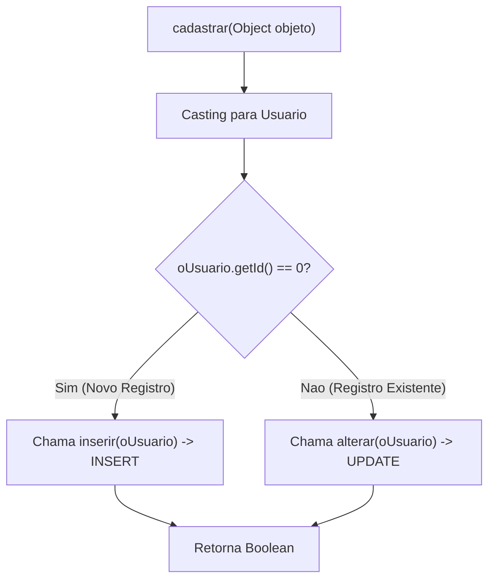

```java
@Override
public Boolean cadastrar(Object objeto) {
    Usuario oUsuario = (Usuario) objeto;
    Boolean retorno = false;
    if (oUsuario.getId() == 0) {
        retorno = this.inserir(oUsuario);
    } else {
        retorno = this.alterar(oUsuario);
    }
    return retorno;
}
```

---

### Prevenção de SQL Injection e Mapeamento de Datas

#### O Risco da Concatenação Crua e a Defesa com `PreparedStatement`
A montagem de comandos SQL por concatenação direta de literais e variáveis de formulário permite a execução de comandos arbitrários no banco de dados. O uso de `PreparedStatement` envia a estrutura do comando pré-compilada, tratando qualquer dado inserido estritamente como valor literal parametrizado (`?`).

#### Tratamento de Datas: `java.util.Date` versus `java.sql.Date`
Um erro frequente de iniciantes consiste em passar diretamente a instância de `java.util.Date` para o driver JDBC. A interface JDBC exige o tipo `java.sql.Date` (que retém apenas dia, mês e ano, sem fração horária). A conversão é feita a partir dos milissegundos:

```java
stmt.setDate(2, new java.sql.Date(oUsuario.getDataNascimento().getTime()));
```

#### Código do Método `inserir` na DAO
```java
@Override
public Boolean inserir(Object objeto) {
    Usuario oUsuario = (Usuario) objeto;
    PreparedStatement stmt = null;
    String sql = "INSERT INTO usuario (nome, datanascimento, cpf, email, senha, salario) "
               + "VALUES (?, ?, ?, ?, ?, ?)";
    try {
        stmt = conexao.prepareStatement(sql);
        stmt.setString(1, oUsuario.getNome());
        stmt.setDate(2, new java.sql.Date(oUsuario.getDataNascimento().getTime()));
        stmt.setString(3, oUsuario.getCpf());
        stmt.setString(4, oUsuario.getEmail());
        stmt.setString(5, oUsuario.getSenha());
        stmt.setDouble(6, oUsuario.getSalario());

        stmt.execute();
        conexao.commit();
        return true;
    } catch (Exception ex) {
        try {
            System.err.println("Falha ao inserir usuario! Executando rollback. Causa: " + ex.getMessage());
            conexao.rollback();
        } catch (SQLException e) {
            System.err.println("Erro ao tentar efetuar rollback: " + e.getMessage());
        }
        return false;
    } finally {
        try {
            if (stmt != null) stmt.close();
        } catch (SQLException e) {
            System.err.println("Erro ao fechar PreparedStatement: " + e.getMessage());
        }
    }
}
```

---

### Verificação Assíncrona de Unicidade e AJAX

Para impedir o disparo de exceções catastróficas de violação de constraint `UNIQUE` no PostgreSQL e prover feedback imediato ao usuário, a aplicação executa checagens prévias de existência via AJAX no evento `blur` (ao retirar o foco do campo):

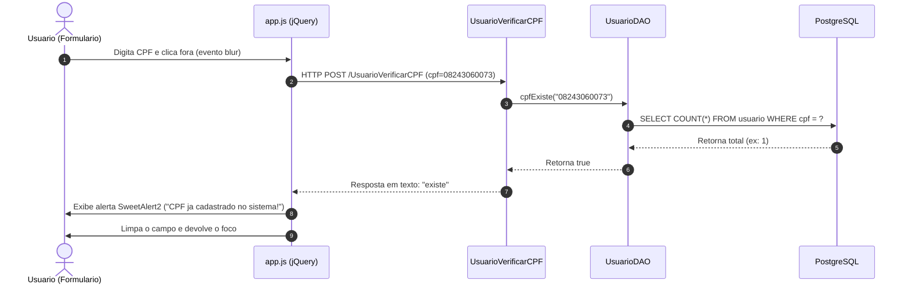

#### Código da Consulta Eficiente com `COUNT(*)` na DAO
```java
public boolean cpfExiste(String cpf) {
    String sql = "SELECT COUNT(*) AS total FROM usuario WHERE cpf = ?";
    try (PreparedStatement stmt = conexao.prepareStatement(sql)) {
        stmt.setString(1, cpf);
        try (ResultSet rs = stmt.executeQuery()) {
            if (rs.next()) {
                return rs.getInt("total") > 0;
            }
        }
    } catch (SQLException e) {
        System.err.println("Erro ao verificar duplicidade de CPF: " + e.getMessage());
    }
    return false;
}
```

#### Código do Servlet Assíncrono `UsuarioVerificarCPF.java`
```java
package br.com.aplcurso.controller.usuario;

import br.com.aplcurso.dao.UsuarioDAO;
import java.io.IOException;
import java.io.PrintWriter;
import javax.servlet.ServletException;
import javax.servlet.annotation.WebServlet;
import javax.servlet.http.HttpServlet;
import javax.servlet.http.HttpServletRequest;
import javax.servlet.http.HttpServletResponse;

@WebServlet(name = "UsuarioVerificarCPF", urlPatterns = {"/UsuarioVerificarCPF"})
public class UsuarioVerificarCPF extends HttpServlet {

    @Override
    protected void doPost(HttpServletRequest request, HttpServletResponse response)
            throws ServletException, IOException {
        response.setContentType("text/plain;charset=iso-8859-1");
        String cpf = request.getParameter("cpf");
        
        if (cpf != null) {
            cpf = cpf.replaceAll("[^\\d]", "");
        }

        try (PrintWriter out = response.getWriter()) {
            UsuarioDAO dao = new UsuarioDAO();
            if (dao.cpfExiste(cpf)) {
                out.print("existe");
            } else {
                out.print("ok");
            }
        } catch (Exception e) {
            response.setStatus(HttpServletResponse.SC_INTERNAL_SERVER_ERROR);
        }
    }
}
```

---

### Validação Algorítmica Centralizada no Backend

A validação de frontend protege contra digitação acidental, mas pode ser facilmente burlada desativando o JavaScript do navegador ou disparando requisições diretas via cURL/Postman. A validação no backend é **obrigatória**. A classe utilitária `DocumentoValidador` fornece métodos estáticos reutilizáveis:

```java
package br.com.aplcurso.utils;

public class DocumentoValidador {

    public static boolean isCPF(String cpf) {
        if (cpf == null) return false;
        cpf = cpf.replaceAll("[^\\d]", "");
        if (cpf.length() != 11 || cpf.matches("(\\d)\\1{10}")) return false;

        try {
            int d1 = 0, d2 = 0;
            for (int i = 0; i < 9; i++) {
                int digito = cpf.charAt(i) - '0';
                d1 += digito * (10 - i);
                d2 += digito * (11 - i);
            }

            d1 = 11 - (d1 % 11);
            d1 = (d1 > 9) ? 0 : d1;

            d2 += d1 * 2;
            d2 = 11 - (d2 % 11);
            d2 = (d2 > 9) ? 0 : d2;

            return (d1 == (cpf.charAt(9) - '0')) && (d2 == (cpf.charAt(10) - '0'));
        } catch (Exception e) {
            return false;
        }
    }

    public static boolean isCNPJ(String cnpj) {
        if (cnpj == null) return false;
        cnpj = cnpj.replaceAll("[^\\d]", "");
        if (cnpj.length() != 14 || cnpj.matches("(\\d)\\1{13}")) return false;

        try {
            int[] pesos1 = {5, 4, 3, 2, 9, 8, 7, 6, 5, 4, 3, 2};
            int[] pesos2 = {6, 5, 4, 3, 2, 9, 8, 7, 6, 5, 4, 3, 2};

            int d1 = 0, d2 = 0;
            for (int i = 0; i < 12; i++) {
                int digito = cnpj.charAt(i) - '0';
                d1 += digito * pesos1[i];
                d2 += digito * pesos2[i];
            }

            d1 = 11 - (d1 % 11);
            d1 = (d1 >= 10) ? 0 : d1;

            d2 += d1 * pesos2[12];
            d2 = 11 - (d2 % 11);
            d2 = (d2 >= 10) ? 0 : d2;

            return (d1 == (cnpj.charAt(12) - '0')) && (d2 == (cnpj.charAt(13) - '0'));
        } catch (Exception e) {
            return false;
        }
    }
}
```

---

### Fluxo de Alteração e o Método Carregar

Para editar um usuário, a aplicação segue um fluxo em duas etapas:
1. Uma requisição `GET /UsuarioCarregar?id=X` localiza a tupla no banco, instancia a entidade `Usuario` com todos os atributos preenchidos, acopla-a ao escopo da requisição (`request.setAttribute("usuario", objeto)`) e despacha para `usuarioCadastrar.jsp`.
2. A página detecta a presença da entidade e preenche os campos do formulário através de Expression Language (`${usuario.nome}`, `${usuario.cpf}`). O campo oculto `<input type="hidden" name="id" value="${usuario.id}" />` retém o identificador numérico.
3. Ao submeter o formulário (`POST /UsuarioCadastrar`), como `id > 0`, a DAO direciona a execução para o método `alterar(oUsuario)`.

```java
@Override
public Object carregar(int numero) {
    PreparedStatement stmt = null;
    ResultSet rs = null;
    Usuario oUsuario = null;
    String sql = "SELECT * FROM usuario WHERE id = ?";
    try {
        stmt = conexao.prepareStatement(sql);
        stmt.setInt(1, numero);
        rs = stmt.executeQuery();
        if (rs.next()) {
            oUsuario = new Usuario();
            oUsuario.setId(rs.getInt("id"));
            oUsuario.setNome(rs.getString("nome"));
            oUsuario.setDataNascimento(rs.getDate("datanascimento"));
            oUsuario.setCpf(rs.getString("cpf"));
            oUsuario.setEmail(rs.getString("email"));
            oUsuario.setSenha(rs.getString("senha"));
            oUsuario.setSalario(rs.getDouble("salario"));
        }
        return oUsuario;
    } catch (Exception ex) {
        System.err.println("Erro ao carregar usuario por ID: " + ex.getMessage());
        return null;
    } finally {
        try {
            if (rs != null) rs.close();
            if (stmt != null) stmt.close();
        } catch (SQLException e) {
            System.err.println("Erro ao fechar cursores em carregar: " + e.getMessage());
        }
    }
}
```

---

## Projetos Práticos e Trabalhos da Disciplina

### Trabalho de Programação: Módulo de Livros

**Data de Divulgação:** 27/04/2026 | **Prazo de Entrega:** 07/05/2026 às 23:59  
**Pontuação Máxima:** 100 pontos (2,0 pontos na média bimestral)  
**Modalidade:** Grupo de 3 alunos | **Repositório:** GitHub Obrigatório  

#### Requisitos do Enunciado
Construir uma aplicação Java Web utilizando Servlets para a manutenção de um cadastro de Livros:
- Entidade `Livro`: `id`, `nomeLivro`, `isbn`, `autor`, `dataPublicacao`, `valorLivro`.
- Requisito Obrigatório: Listagem de livros cadastrados.
- Requisito Extra (Pontuação Integral): Manutenção completa (incluir, alterar e excluir livros).

#### Modelagem de Classes e Persistência
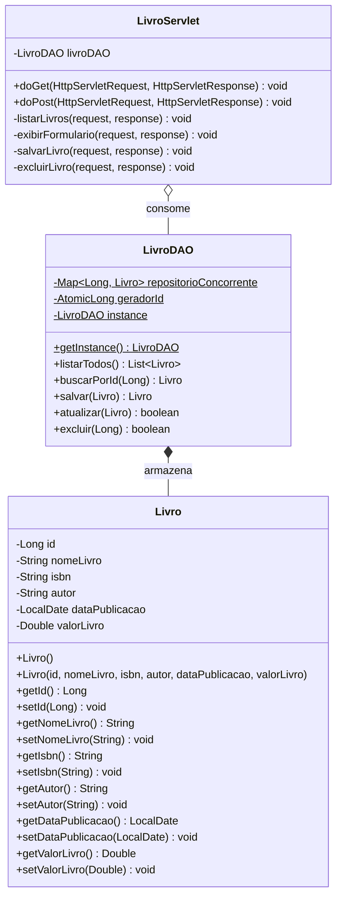

#### Script de Banco de Dados (`banco_livros.sql`)
```sql
CREATE TABLE IF NOT EXISTS livros (
    id SERIAL PRIMARY KEY,
    nome_livro VARCHAR(150) NOT NULL,
    isbn VARCHAR(20) UNIQUE NOT NULL,
    autor VARCHAR(100) NOT NULL,
    data_publicacao DATE NOT NULL,
    valor_livro DECIMAL(10,2) NOT NULL CHECK (valor_livro >= 0)
);

INSERT INTO livros (nome_livro, isbn, autor, data_publicacao, valor_livro) VALUES
('Java: Como Programar', '978-8543004792', 'Paul Deitel, Harvey Deitel', '2016-06-24', 285.50),
('Padroes de Projetos (GoF)', '978-8573076103', 'Erich Gamma et al.', '2000-01-01', 142.00),
('Engenharia de Software', '978-8580550443', 'Ian Sommerville', '2019-03-15', 198.90);
```

#### Padrão Post-Redirect-Get (PRG) no `LivroServlet`
Para impedir que o usuário duplique registros ao pressionar F5 após o envio do formulário, o Servlet nunca renderiza a visão diretamente no método `doPost`. Ele responde com um redirecionamento HTTP `302 Found`:

```java
// Dentro do doPost do LivroServlet apos salvar com sucesso:
livroDAO.salvar(livro);
// Redireciona o navegador para uma nova requisicao limpa via GET
response.sendRedirect(request.getContextPath() + "/livros?acao=listar");
```

---

### Trabalho de Programação: Módulo de Estados Federativos

**Data de Divulgação:** 11/05/2026 | **Prazo de Entrega:** 25/05/2026 às 23:59  
**Pontuação Máxima:** 100 pontos (1,0 ponto na média bimestral)  
**Tema:** Implementação do cadastro de Estado no projeto-base (`AplCurso`)  

#### Requisitos do Enunciado
Estender o projeto corporativo com a entidade de Unidade Federativa:
- Entidade `Estado`: `id`, `nome` (String, obrigatório), `sigla` (String, 2 caracteres, único e obrigatório).
- CRUD Completo com Servlet (`EstadoServlet`), DAO (`EstadoDAO`), JSP (`estados.jsp`) com Bootstrap, JSTL e JDBC parametrizado.

#### Script DDL (`schema_estado.sql`)
```sql
CREATE TABLE estado (
    id SERIAL PRIMARY KEY,
    nome VARCHAR(100) NOT NULL,
    sigla VARCHAR(2) NOT NULL,
    CONSTRAINT uk_estado_sigla UNIQUE (sigla)
);

INSERT INTO estado (nome, sigla) VALUES 
('Sao Paulo', 'SP'),
('Minas Gerais', 'MG'),
('Rio de Janeiro', 'RJ'),
('Parana', 'PR'),
('Santa Catarina', 'SC'),
('Rio Grande do Sul', 'RS');
```

#### A Entidade de Domínio `Estado.java`
```java
package br.com.aplcurso.model;

import java.io.Serializable;
import java.util.Objects;

public class Estado implements Serializable {
    private static final long serialVersionUID = 1L;

    private Integer id;
    private String nome;
    private String sigla;

    public Estado() {
    }

    public Estado(Integer id, String nome, String sigla) {
        this.id = id;
        this.nome = nome;
        this.sigla = (sigla != null) ? sigla.toUpperCase().trim() : null;
    }

    public Integer getId() { return id; }
    public void setId(Integer id) { this.id = id; }

    public String getNome() { return nome; }
    public void setNome(String nome) { this.nome = nome; }

    public String getSigla() { return sigla; }
    public void setSigla(String sigla) { 
        this.sigla = (sigla != null) ? sigla.toUpperCase().trim() : null; 
    }

    @Override
    public boolean equals(Object o) {
        if (this == o) return true;
        if (o == null || getClass() != o.getClass()) return false;
        Estado estado = (Estado) o;
        return Objects.equals(id, estado.id) || Objects.equals(sigla, estado.sigla);
    }

    @Override
    public int hashCode() {
        return Objects.hash(id, sigla);
    }
}
```

---

## Exames e Avaliações do Semestre

### Avaliação 1: POO Avançada e Folha de Pagamento

**Data da Aplicação:** 23/03/2026 | **Prazo de Encerramento:** 24/03/2026 às 20:30  
**Tópicos Cobrados:** Encapsulamento, validação defensiva de invariantes, herança semântica, polimorfismo dinâmico e tratamento de exceções.

#### Arquitetura da Solução da Avaliação 1
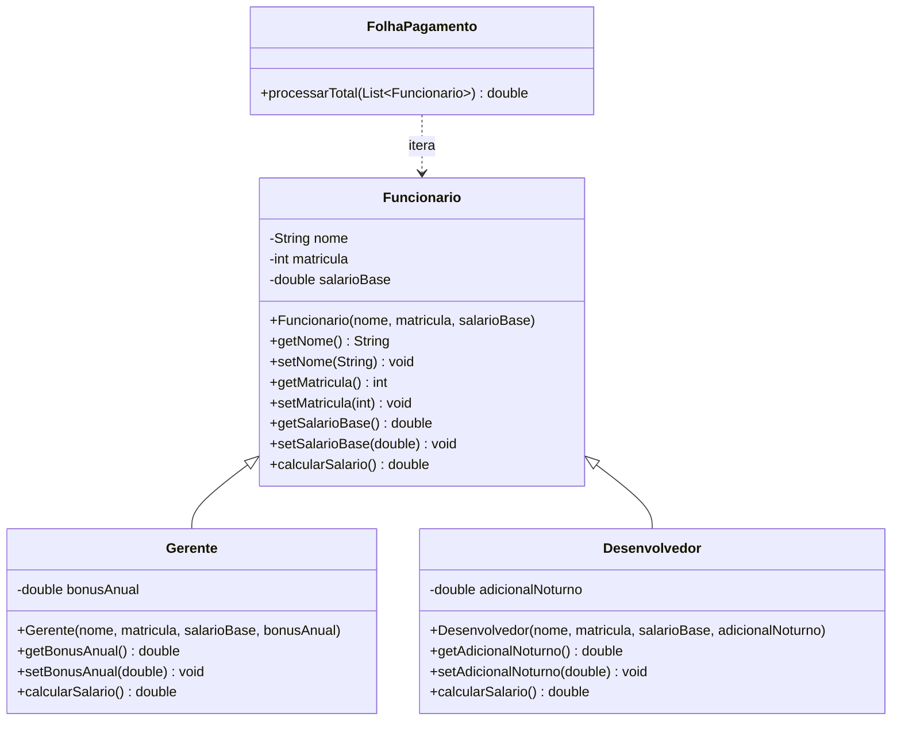

---

### Avaliação II: CRUD de Produtos com JDBC e Exceções

**Data da Aplicação:** 08/06/2026 | **Prazo de Encerramento:** 09/06/2026 às 20:30  
**Tópicos Cobrados:** Arquitetura em camadas completa, modelo com validação defensiva, `PreparedStatement`, `ResultSet`, transações locais, exceções de negócio customizadas e prevenção de vazamento de cursores (*try-with-resources*).

#### Script DDL (`schema_produtos.sql`)
```sql
CREATE TABLE IF NOT EXISTS produtos (
    id SERIAL PRIMARY KEY,
    nome VARCHAR(150) NOT NULL,
    preco NUMERIC(10,2) NOT NULL CHECK (preco >= 0),
    quantidade_estoque INTEGER NOT NULL CHECK (quantidade_estoque >= 0),
    data_cadastro VARCHAR(20) NOT NULL
);

INSERT INTO produtos (nome, preco, quantidade_estoque, data_cadastro) VALUES
('Notebook Gamer Dell', 5800.00, 10, '2026-06-01'),
('Mouse Optico USB', 65.00, 50, '2026-06-02'),
('Teclado Mecanico Switch Blue', 280.00, 25, '2026-06-03');
```

#### Código da Classe de Persistência `ProdutoDAO.java` com `try-with-resources`
```java
package br.com.unifef.dao;

import br.com.unifef.dominio.Produto;
import br.com.unifef.infra.FabricaConexao;
import java.sql.Connection;
import java.sql.PreparedStatement;
import java.sql.ResultSet;
import java.sql.SQLException;
import java.util.ArrayList;
import java.util.List;

public class ProdutoDAO {

    public void inserir(Produto p) throws SQLException {
        String sql = "INSERT INTO produtos (nome, preco, quantidade_estoque, data_cadastro) VALUES (?, ?, ?, ?)";
        try (Connection conn = FabricaConexao.obterConexao();
             PreparedStatement pstm = conn.prepareStatement(sql)) {
            pstm.setString(1, p.getNome());
            pstm.setDouble(2, p.getPreco());
            pstm.setInt(3, p.getQuantidadeEstoque());
            pstm.setString(4, p.getDataCadastro());
            pstm.executeUpdate();
        }
    }

    public List<Produto> listarTodos() throws SQLException {
        List<Produto> lista = new ArrayList<>();
        String sql = "SELECT id, nome, preco, quantidade_estoque, data_cadastro FROM produtos ORDER BY id ASC";
        try (Connection conn = FabricaConexao.obterConexao();
             PreparedStatement pstm = conn.prepareStatement(sql);
             ResultSet rs = pstm.executeQuery()) {
            while (rs.next()) {
                Produto p = new Produto();
                p.setId(rs.getInt("id"));
                p.setNome(rs.getString("nome"));
                p.setPreco(rs.getDouble("preco"));
                p.setQuantidadeEstoque(rs.getInt("quantidade_estoque"));
                p.setDataCadastro(rs.getString("data_cadastro"));
                lista.add(p);
            }
        }
        return lista;
    }
}
```

---

### Avaliação Substitutiva: Hierarquias, Interfaces e Tributação

**Data da Aplicação:** 25/06/2026 às 23:59  
**Tópicos Cobrados:** Orientação a Objetos avançada, classes abstratas, interfaces de contrato, agregação com `Departamento`, manipulação de coleções tipadas e exceções verificadas customizadas.

#### Diagrama de Classes Estrutural da Prova Substitutiva
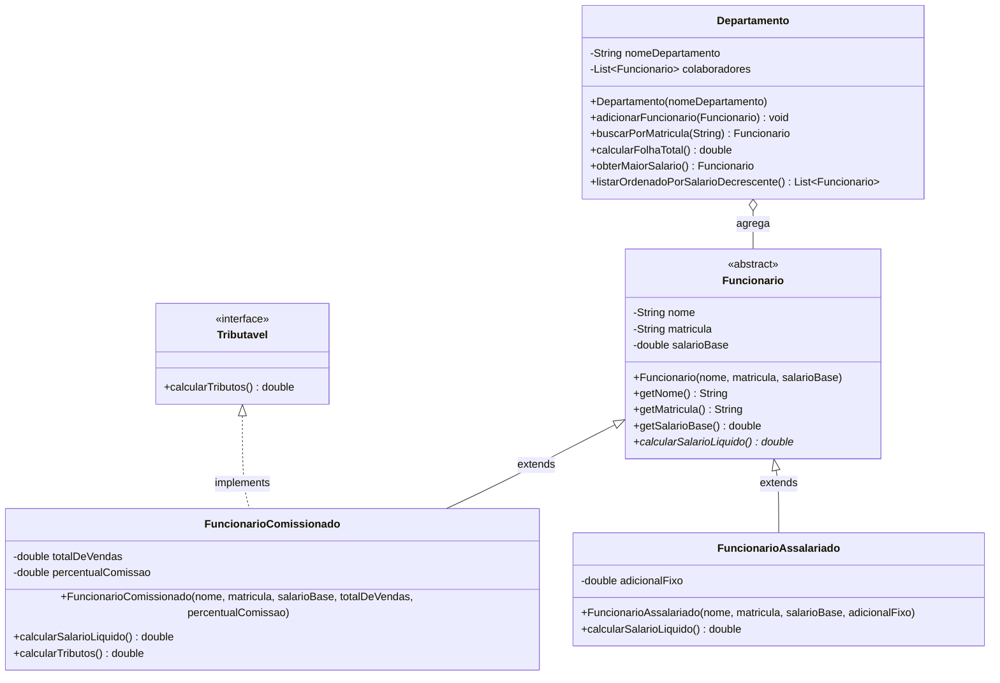

#### Código da Classe Agregadora `Departamento.java`
```java
package br.com.unifef.avaliacao;

import br.com.unifef.excecao.FuncionarioNaoEncontradoException;
import java.util.ArrayList;
import java.util.Collections;
import java.util.Comparator;
import java.util.List;

public class Departamento {
    private String nomeDepartamento;
    private List<Funcionario> colaboradores;

    public Departamento(String nomeDepartamento) {
        if (nomeDepartamento == null || nomeDepartamento.trim().isEmpty()) {
            throw new IllegalArgumentException("O nome do departamento e obrigatorio.");
        }
        this.nomeDepartamento = nomeDepartamento.trim();
        this.colaboradores = new ArrayList<>();
    }

    public void adicionarFuncionario(Funcionario f) {
        if (f == null) {
            throw new IllegalArgumentException("Nao e permitido adicionar colaborador nulo.");
        }
        // Impede duplicidade de matricula
        for (Funcionario existente : colaboradores) {
            if (existente.getMatricula().equals(f.getMatricula())) {
                throw new IllegalArgumentException("Matricula duplicada no departamento: " + f.getMatricula());
            }
        }
        this.colaboradores.add(f);
    }

    public Funcionario buscarPorMatricula(String matricula) throws FuncionarioNaoEncontradoException {
        if (matricula == null || matricula.trim().isEmpty()) {
            throw new IllegalArgumentException("Matricula informada e invalida.");
        }
        for (Funcionario f : colaboradores) {
            if (f.getMatricula().equalsIgnoreCase(matricula.trim())) {
                return f;
            }
        }
        throw new FuncionarioNaoEncontradoException("Colaborador nao localizado para a matricula: " + matricula);
    }

    public double calcularFolhaTotal() {
        double total = 0.0;
        for (Funcionario f : colaboradores) {
            total += f.calcularSalarioLiquido(); // Despacho dinamico
        }
        return total;
    }

    public Funcionario obterMaiorSalario() {
        if (colaboradores.isEmpty()) {
            return null;
        }
        Funcionario maior = colaboradores.get(0);
        for (Funcionario f : colaboradores) {
            if (f.calcularSalarioLiquido() > maior.calcularSalarioLiquido()) {
                maior = f;
            }
        }
        return maior;
    }

    public List<Funcionario> listarOrdenadoPorSalarioDecrescente() {
        List<Funcionario> copia = new ArrayList<>(this.colaboradores);
        copia.sort(new Comparator<Funcionario>() {
            @Override
            public int compare(Funcionario f1, Funcionario f2) {
                return Double.compare(f2.calcularSalarioLiquido(), f1.calcularSalarioLiquido());
            }
        });
        return copia;
    }
}
```

---

## Guia de Diagnóstico de Falhas e Boas Práticas

### Resolução de Erros Clássicos de Compilação e Execução

A rotina de laboratório de programação expõe o desenvolvedor a falhas padronizadas do ecossistema Java EE. A tabela a seguir documenta os diagnósticos e correções precisas:

| Exceção ou Mensagem de Erro | Causa Raiz de Engenharia | Ação Corretiva Imediata |
| :--- | :--- | :--- |
| `ClassNotFoundException: org.postgresql.Driver` | O arquivo JAR do driver PostgreSQL (`postgresql-42.x.x.jar`) não foi inserido na pasta `Libraries` do projeto NetBeans. | Clicar com botão direito em `Libraries` -> `Add JAR/Folder` e selecionar o driver JDBC baixado. |
| `PSQLException: Connection refused: connect` | O serviço do servidor PostgreSQL não está em execução ou a porta TCP `5432` está bloqueada por firewall local. | Abrir o gerenciador de serviços do Windows (`services.msc`), localizar o serviço `postgresql-x64-XX` e acionar `Iniciar`. |
| `java.net.BindException: Address already in use: 8080` | Outro processo (ou uma instância travada do próprio Tomcat) está retendo a porta TCP `8080`. | Executar no PowerShell `netstat -ano \| findstr :8080`, identificar o PID do processo e finalizá-lo com `taskkill /PID <PID> /F`. |
| `ClassNotFoundException: javax.servlet.Filter` | O projeto foi implantado em um servidor Apache Tomcat 10 ou superior, que adota a API `jakarta.*`. | Desinstalar/remover o Tomcat 10 e configurar o Apache Tomcat versão 9 no NetBeans. |
| `NullPointerException` ao executar `dao.listar()` | A referência `conexao` dentro da DAO está nula devido a falha prévia de credenciais no `SingleConnection`. | Conferir a constante de URL, usuário e senha em `SingleConnection.java` contra as credenciais reais do pgAdmin. |
| `NumberFormatException: For input string: ""` | A Servlet tentou converter um parâmetro numérico (`Integer.parseInt(request.getParameter("id"))`) recebido como string vazia. | Implementar checagem defensiva: `if (param != null && !param.trim().isEmpty()) { ... }`. |
| `ConcurrentModificationException` | O sistema tentou remover ou adicionar elementos em uma `List` convencional enquanto iterava sobre ela em um laço `for-each`. | Utilizar `Iterator.remove()` explícito ou coleções concorrentes como `CopyOnWriteArrayList` ou `ConcurrentHashMap`. |

---

### Boas Práticas de Engenharia e Segurança Web

1. **Separação Rigorosa de Camadas**:
   - A camada **View** (JSP) deve conter apenas formatação e apresentação. É terminantemente proibido abrir conexões SQL ou instanciar DAOs dentro de arquivos JSP.
   - A camada **Controller** (Servlet) apenas extrai parâmetros, delega validações e direciona o fluxo. Não deve conter instruções SQL cruas.
   - A camada **DAO** lida exclusivamente com persistência. Não deve capturar parâmetros HTTP diretamente nem renderizar HTML.
2. **Prevenção Incondicional de Injeção de SQL**:
   - Jamais montar strings de consulta utilizando o operador de concatenação `+`. Utilizar invariavelmente `PreparedStatement` com interrogações posicionais (`?`).
3. **Gestão Segura de Recursos e Desalocação de Memória**:
   - Sempre fechar objetos `ResultSet`, `PreparedStatement` e `Connection`. Utilizar a instrução idiomática `try-with-resources` (`AutoCloseable`) para garantir o fechamento mesmo em caso de lançamento de exceções em tempo de execução.
4. **Padrão Post-Redirect-Get (PRG)**:
   - Toda submissão destrutiva ou de escrita enviada via `POST` que altere o estado do banco deve encerrar com `response.sendRedirect()`, redirecionando o navegador para uma rota limpa `GET`.
5. **Normalização de Tabela de Caracteres**:
   - Para evitar desconfiguração de caracteres acentuados da língua portuguesa (ex.: "São Paulo" virar "So Paulo"), alinhar a codificação em todas as camadas:
     - No Servlet: `request.setCharacterEncoding("UTF-8")` e `response.setContentType("text/html;charset=UTF-8")`.
     - No JSP: `<%@page pageEncoding="UTF-8"%>` e `<meta charset="UTF-8">`.

---

## Apêndices Acadêmicos

### Glossário Técnico

- **ACID**: Acrônimo de *Atomicidade, Consistência, Isolamento e Durabilidade*, conjunto de propriedades que garantem a confiabilidade de transações em bancos de dados relacionais.
- **Apache Ant**: Ferramenta de automação de compilação de software baseada em scripts XML (`build.xml`), padrão histórico do Apache NetBeans.
- **Bytecode**: Formato binário intermediário gerado pelo compilador Java (`javac`) contido em arquivos `.class`, projetado para ser executado pela JVM.
- **Catalina**: Nome oficial do motor de Servlet (*Servlet Container*) interno do Apache Tomcat.
- **DAO (Data Access Object)**: Padrão arquitetural que encapsula o acesso a fontes de dados, isolando o restante da aplicação dos detalhes técnicos da API JDBC e dialetos SQL.
- **Expression Language (EL)**: Linguagem simplificada de avaliação de dados da plataforma Java Web que permite acessar atributos de escopo utilizando a sintaxe `${objeto.propriedade}`.
- **Jasper**: Motor interno do Apache Tomcat encarregado de traduzir arquivos `.jsp` em classes Java Servlet e compilá-las em bytecode executável.
- **JavaBean**: Convenção de classe Java que exige atributos privados, construtor público sem argumentos, getters/setters padronizados e serialização.
- **JDBC (Java Database Connectivity)**: API padrão da linguagem Java para comunicação independente com bancos de dados relacionais por meio de drivers específicos.
- **JSTL (JavaServer Pages Standard Tag Library)**: Biblioteca padronizada de tags customizadas que fornece estruturas de iteração, condicionais e formatação para páginas JSP.
- **JVM (Java Virtual Machine)**: Máquina virtual que carrega, verifica e executa bytecode Java, gerenciando memória e realizando coleta de lixo (*Garbage Collection*).
- **Módulo 11**: Algoritmo matemático baseado em somatórios ponderados com restos de divisão por 11, utilizado oficialmente pela Receita Federal para validar dígitos verificadores de CPF e CNPJ.
- **MVC (Model-View-Controller)**: Padrão arquitetural que divide a aplicação em três subsistemas interconectados: Modelo (dados e regras), Visão (interface) e Controlador (fluxo e roteamento).
- **PreparedStatement**: Interface da API JDBC que representa uma instrução SQL pré-compilada, protegendo a aplicação contra ataques de injeção de SQL e otimizando a execução repetida.
- **PRG (Post-Redirect-Get)**: Padrão de projeto web que previne submissões acidentais duplicadas de formulários, redirecionando o navegador via status HTTP 302 após requisições `POST`.
- **RequestDispatcher**: Interface da API Servlet utilizada para repassar internamente uma requisição para outro recurso no servidor através dos métodos `forward()` ou `include()`.
- **Servlet**: Classe Java gerenciada por um container web que atende e processa requisições HTTP dentro do modelo cliente-servidor.
- **Singleton**: Padrão de projeto criacional que restringe a instanciação de uma classe a um único objeto na memória, fornecendo um ponto global de acesso.

---

### Banco de Questões e Respostas para Revisão

```json
{"id": 1, "pergunta": "Qual a diferenca fundamental entre a acao <jsp:include> e a diretiva <%@include %> no ciclo de vida do JSP?", "resposta": "A acao <jsp:include> realiza inclusao dinamica em tempo de requisicao (request-time) via RequestDispatcher.include(), permitindo atualizacoes em tempo real do fragmento e passagem de parametros dinamicos. A diretiva <%@include %> realiza inclusao estatica em tempo de traducao (translation-time), fundindo o codigo-fonte do fragmento antes da compilacao do servlet correspondente."}
{"id": 2, "pergunta": "Por que o Apache Tomcat 10 nao e compativel com projetos desenvolvidos sobre a especificacao Java EE 8 Web?", "resposta": "O Apache Tomcat 10 adota a especificacao Jakarta EE 9+, que alterou o namespace de todas as bibliotecas da plataforma de 'javax.*' para 'jakarta.*'. Como o Java EE 8 utiliza o pacote 'javax.servlet.*', a execucao no Tomcat 10 resulta em falhas imediatas de ClassNotFoundException."}
{"id": 3, "pergunta": "Qual a funcao do metodo setAutoCommit(false) na gestao transacional via JDBC?", "resposta": "Desativa a gravacao automatica imediata de cada instrucao SQL individual, permitindo que a aplicacao agrupe multiplas operacoes DML em uma unica transacao atomica gerenciada manualmente atraves dos comandos conexao.commit() e conexao.rollback()."}
{"id": 4, "pergunta": "Como a utilizacao de PreparedStatement impede ataques de SQL Injection?", "resposta": "O PreparedStatement pre-compila a arvore sintatica da instrucao SQL no motor do banco de dados antes da transmissao dos parametros. Os valores das variaveis sao enviados isoladamente e tratados estritamente como literais de dados, impedindo que caracteres especiais alterem a logica do comando SQL original."}
{"id": 5, "pergunta": "Explique o objetivo arquitetural da interface GenericDAO na aplicacao AplCurso.", "resposta": "Padronizar o contrato e a nomenclatura das operacoes basicas de persistencia (cadastrar, inserir, alterar, excluir, carregar e listar) para todas as classes DAO do sistema, assegurando coesao, uniformidade de desenvolvimento e baixo acoplamento."}
{"id": 6, "pergunta": "Por que o tipo DECIMAL(15,2) e obrigatorio para valores monetarios no banco relacional em vez de FLOAT?", "resposta": "Tipos de ponto flutuante binario como FLOAT e DOUBLE seguem a norma IEEE 754 e sofrem de imprecisao na representacao de fracoes decimais finitas, gerando residuos infinitesimais de arredondamento. O tipo DECIMAL opera com representacao numerica exata de ponto fixo."}
{"id": 7, "pergunta": "Qual a finalidade do padrao Post-Redirect-Get (PRG) em aplicacoes web?", "resposta": "Prevenir o reenvio acidental de dados de formulario quando o usuario clica em Atualizar (F5) no navegador. Ao responder a um POST com um redirecionamento HTTP 302/303 para uma rota GET, a ultima acao no historico do navegador passa a ser uma consulta limpa e segura."}
{"id": 8, "pergunta": "O que caracteriza uma invariante de estado em uma classe do modelo de dominio?", "resposta": "Uma condicao de consistencia logica ou regra de negocio que deve obrigatoriamente manter-se verdadeira durante todo o ciclo de vida do objeto na memoria, protegida por encapsulamento estrito e validacoes defensivas em construtores e mutadores."}
{"id": 9, "pergunta": "Qual a diferenca entre Excecoes Checadas (Checked) e Nao Checadas (Unchecked) em Java?", "resposta": "Checked Exceptions herdam diretamente de java.lang.Exception e exigem tratamento obrigatorio via bloco try-catch ou clausula throws pelo compilador, sendo ideais para falhas recuperaveis de negocio. Unchecked Exceptions herdam de RuntimeException e indicam erros de programacao sem exigencia sintatica de captura."}
{"id": 10, "pergunta": "Como o mecanismo de ligacao tardia (dynamic binding) viabiliza o polimorfismo na JVM?", "resposta": "A JVM utiliza a instrucao de bytecode invokevirtual associada a tabela de metodos virtuais (vtable) para identificar o tipo concreto real do objeto em tempo de execucao, despachando a chamada para a implementacao sobrescrita correta independentemente do tipo da variavel de referencia."}
```

---

### Checklist de Homologação de Projetos

Antes de submeter trabalhos práticos ou provas no ambiente acadêmico do Prof. Jefferson Passerini, execute a auditoria técnica estruturada nos itens abaixo:

- [ ] **Auditoria de Compilador**: O projeto compila sem alertas críticos sob o JDK 17 LTS (Eclipse Temurin) configurado na plataforma do NetBeans.
- [ ] **Alinhamento do Servidor**: O servidor configurado em `Properties` -> `Run` é exclusivamente o Apache Tomcat versão 9 (Java EE 8), rejeitando qualquer instância do Tomcat 10+.
- [ ] **Driver JDBC**: O arquivo compactado `.jar` oficial do driver PostgreSQL (`postgresql-42.x.x.jar`) está presente em `Libraries` e no diretório `WEB-INF/lib`.
- [ ] **Integridade DDL/DML**: O script `banco.sql` executa integralmente na *Query Tool* do pgAdmin sem erros de sintaxe, recriando sequências, tabelas e restrições `UNIQUE`.
- [ ] **Gerenciamento de Transações**: Todas as rotinas de mutação na DAO possuem bloco `try-catch` com invocação explícita de `conexao.commit()` no caminho de sucesso e `conexao.rollback()` no tratamento de exceção.
- [ ] **Prevenção de Vazamento de Recursos**: Todas as instruções JDBC utilizam `try-with-resources` ou blocos `finally` executando `.close()` em `ResultSet` e `PreparedStatement`.
- [ ] **Modularização Visual**: Nenhuma página JSP do sistema contém duplicação de cabeçalhos HTML ou código scriptlet Java (`<% ... %>`). A inclusão dos fragmentos opera estritamente via `<jsp:include>`.
- [ ] **Encapsulamento do Modelo**: Todas as entidades de modelo possuem campos estritamente privados, construtor sem argumentos, construtor parametrizado completo e sobrescrita consistente de `equals()` e `hashCode()`.
- [ ] **Validação de Documentos**: O cadastro de entidades contendo CPF ou CNPJ valida a regra matemática oficial do Módulo 11 tanto no cliente (`app.js`) quanto no servidor (`DocumentoValidador.java`).
- [ ] **Padrão PRG**: Servlets que tratam comandos destrutivos (`POST` de inclusão, alteração ou exclusão) finalizam seu processamento invocando `response.sendRedirect()`, impedindo duplicações de registros via recarregamento de tela (`F5`).

---

## Fontes e Metadados

- Turma no Classroom: 2026 1S Laboratório de Programação III
- Itens processados: 0 materiais, 6 tarefas, 6 avisos
- Gerado em: 24/09/2026, 13:36:24 (BRT) via classroom-sync
