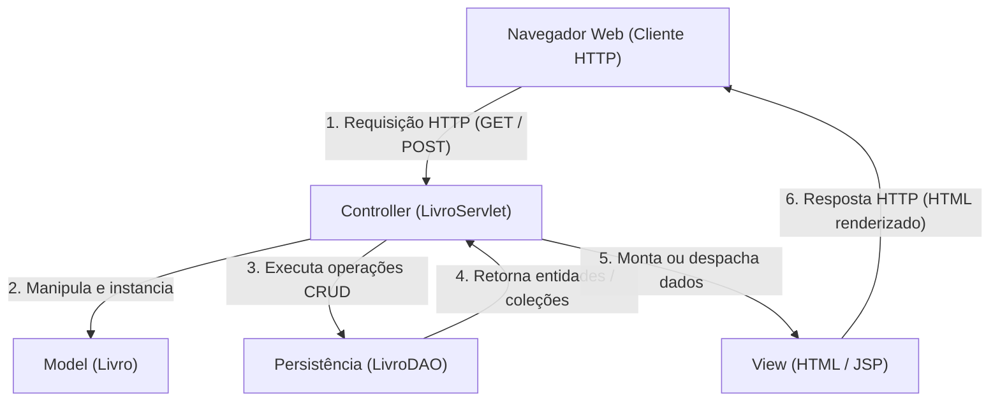
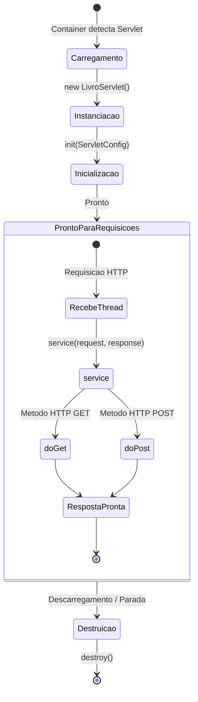
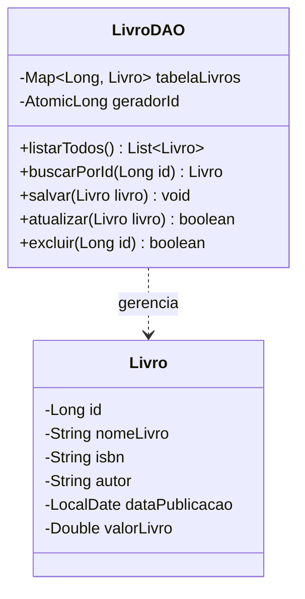
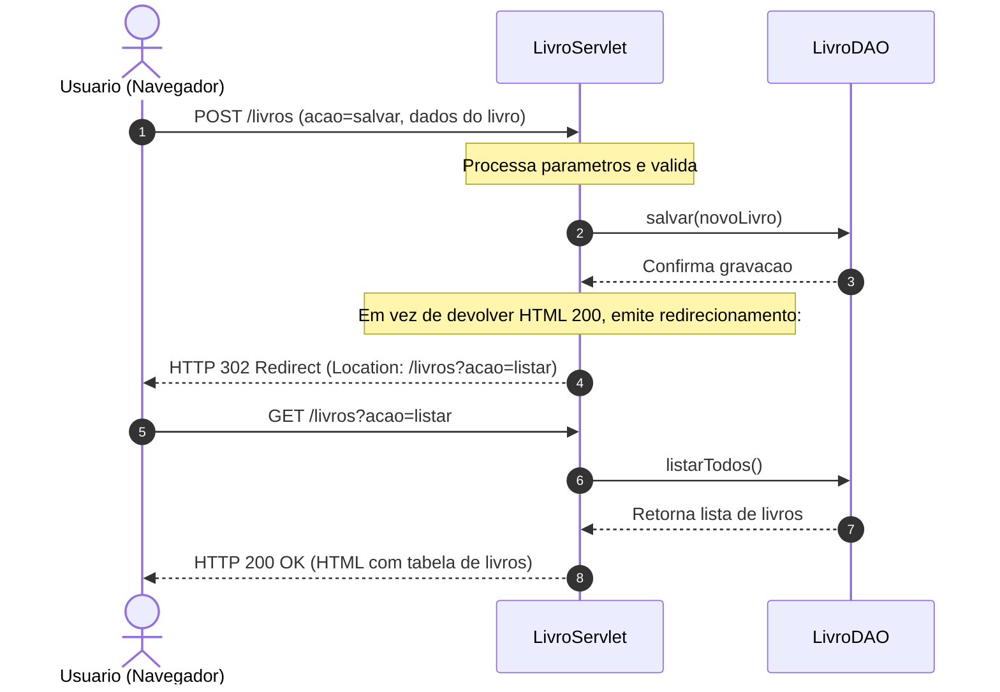
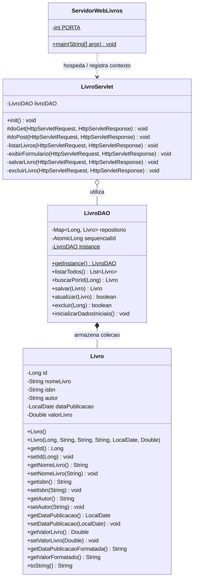
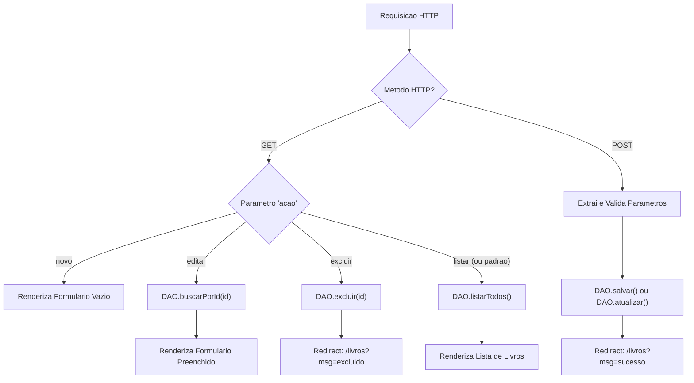
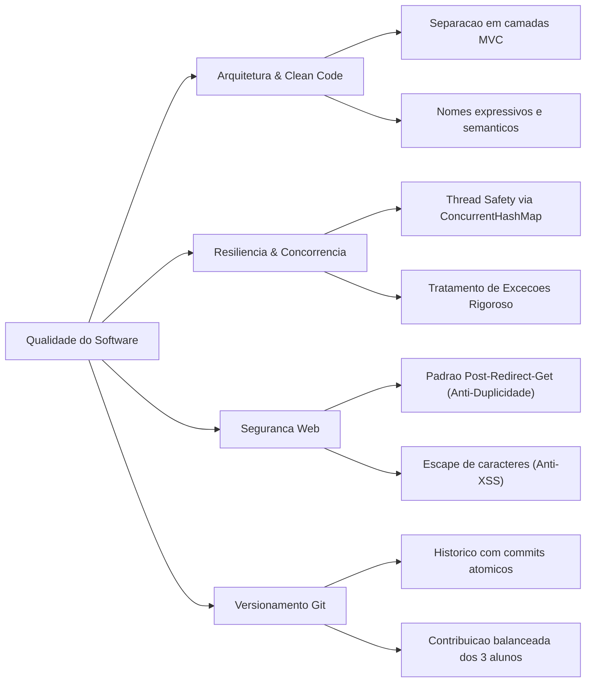
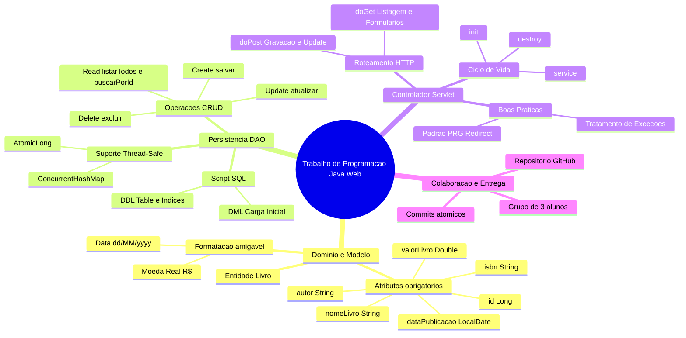

# Trabalho — 20260427 - Trabalho de Programação (2 pontos)

> **Professor:** Jefferson Passerini  
> **Disciplina:** Laboratório de Programação III (3º Semestre)  
> **Prazo de Entrega:** 07/05/2026 às 23:59  
> **Pontuação Máxima:** 100 pontos  
> **Conteúdo cobrado:**  
> - [Aula 01 - Configuração de Ambiente e Projeto Java Web](../../Aulas/Aula%2001%20-%20Configura%C3%A7%C3%A3o%20de%20Ambiente%20e%20Projeto%20Java%20Web/detalhes.md)  
> - [Aula 02 - Estruturação da Interface Frontend com JSP](../../Aulas/Aula%2002%20-%20Estrutura%C3%A7%C3%A3o%20da%20Interface%20Frontend%20com%20JSP/detalhes.md)  
> - [Aula 03 - Conexão com Banco de Dados PostgreSQL](../../Aulas/Aula%2003%20-%20Conex%C3%A3o%20com%20Banco%20de%20Dados%20PostgreSQL/detalhes.md)  
> - [Aula 04 - Implementação do Listar Usuário com MVC](../../Aulas/Aula%2004%20-%20Implementa%C3%A7%C3%A3o%20do%20Listar%20Usu%C3%A1rio%20com%20MVC/detalhes.md)  
> - [Aula 05 - Operação de Manutenção do Cadastro de Usuários](../../Aulas/Aula%2005%20-%20Opera%C3%A7%C3%A3o%20de%20Manuten%C3%A7%C3%A3o%20do%20Cadastro%20de%20Usu%C3%A1rios/detalhes.md)  

---

## Sumário

- [Enunciado original (Google Classroom)](#enunciado-original-google-classroom)
- [Análise do que é pedido](#análise-do-que-é-pedido)
  - [Decomposição de requisitos](#decomposição-de-requisitos)
  - [Entregáveis do projeto](#entregáveis-do-projeto)
  - [Critérios implícitos e regras de engenharia](#critérios-implícitos-e-regras-de-engenharia)
- [Fundamentação teórica](#fundamentação-teórica)
  - [Padrão Arquitetural MVC em Aplicações Web](#padrão-arquitetural-mvc-em-aplicações-web)
  - [Ciclo de Vida e Operação dos Servlets](#ciclo-de-vida-e-operação-dos-servlets)
  - [Padrão Data Access Object (DAO) e Persistência](#padrão-data-access-object-dao-e-persistência)
  - [Semântica do Protocolo HTTP e Padrão Post-Redirect-Get](#semântica-do-protocolo-http-e-padrão-post-redirect-get)
  - [Concorrência e Thread Safety no Ambiente Web](#concorrência-e-thread-safety-no-ambiente-web)
- [Resolução proposta](#resolução-proposta)
  - [Arquitetura Geral e Diagramas Estruturais](#arquitetura-geral-e-diagramas-estruturais)
  - [Camada de Modelo: Livro.java](#camada-de-modelo-livrojava)
  - [Camada de Acesso a Dados: LivroDAO.java](#camada-de-acesso-a-dados-livrodaojava)
  - [Script de Banco de Dados: banco_livros.sql](#script-de-banco-de-dados-banco_livrossql)
  - [Camada Controladora: LivroServlet.java](#camada-controladora-livroservletjava)
  - [Servidor Web Integrado de Demonstração: ServidorWebLivros.java](#servidor-web-integrado-de-demonstração-servidorweblivrosjava)
- [Como testar e validar](#como-testar-e-validar)
  - [Compilação e Execução sem Dependências Externas](#compilação-e-execução-sem-dependências-externas)
  - [Cenários de Teste Funcional](#cenários-de-teste-funcional)
  - [Validações com cURL via Linha de Comando](#validações-com-curl-via-linha-de-comando)
- [Critérios de qualidade](#critérios-de-qualidade)
- [Arquivos de apoio](#arquivos-de-apoio)
- [Mapa da atividade](#mapa-da-atividade)
- [Glossário](#glossário)
- [Pontos-chave para a prova](#pontos-chave-para-prova)
- [Perguntas e respostas (JSONL)](#perguntas-e-respostas-jsonl)
- [Checklist de revisão](#checklist-de-revisão)

---

## Enunciado original (Google Classroom)

Trabalho de Programação - Java Web

Construir um programa com java web utilizando servlets que faça a manutenção de um cadastro de Livros.

Classe: Livro
- id
- nomeLivro
- isbn
- autor
- dataPublicação
- valorLivro

O seu software deve exibir uma lista de livros cadastrados.

Extra: 
- Implementar a manutenção de livros - incluir, alterar e excluir livros.
- Colocar o projeto fo GIthub

Fazer o trabalho em Grupo de 3 alunos.

---

## Análise do que é pedido

### Decomposição de requisitos

A demanda acadêmica divide-se em requisitos mandatórios (requisito básico de aprovação) e requisitos complementares (garantia da pontuação máxima de 2 pontos / 100% da nota):

1. **Requisitos Funcionais Obrigatórios:**
   - **RF01 - Listagem de Livros:** Exibição tabular de todos os registros armazenados, apresentando identificador (`id`), título (`nomeLivro`), código identificador (`isbn`), escritor (`autor`), data de lançamento (`dataPublicação`) e preço unitário (`valorLivro`).

2. **Requisitos Funcionais Extras (Pontuação Integral - Manutenção Completa CRUD):**
   - **RF02 - Inclusão de Livros (Create):** Formulário interativo para cadastro de um novo livro com validação de campos obrigatórios e persistência dos dados.
   - **RF03 - Edição de Livros (Update):** Recuperação dos dados de um livro a partir do seu `id`, preenchimento automático no formulário de edição e atualização consistente dos campos.
   - **RF04 - Exclusão de Livros (Delete):** Remoção definitiva de um livro pelo seu `id`, com retorno e atualização imediata da listagem.

3. **Requisitos Não-Funcionais:**
   - **RNF01 - Tecnologia Base:** Utilização estrita da tecnologia Java Web com `HttpServlet` para controle do fluxo de requisições e respostas.
   - **RNF02 - Controle de Versão e Colaboração:** Hospedagem do código-fonte em repositório público no GitHub, com histórico de commits que evidencie a contribuição dos 3 membros da equipe.
   - **RNF03 - Arquitetura de Software:** Adoção de boas práticas com separação explícita de responsabilidades em camadas (Model, Data Access Object, Controller e View).

### Entregáveis do projeto

Para atendimento irrestrito das instruções e critérios de avaliação do Prof. Jefferson Passerini, os seguintes artefatos devem ser gerados e entregues:

- **Repositório GitHub:** Link do repositório contendo a árvore de código, arquivo `README.md` detalhado com instruções de compilação/execução e identificação dos 3 integrantes.
- **Camada de Domínio / POJO:** `Livro.java` representando o modelo de negócio com encapsulamento, construtores, getters/setters e métodos auxiliares.
- **Camada de Persistência / DAO:** `LivroDAO.java` provendo operações atômicas de CRUD (Create, Read, Update, Delete) com garantia de atomicidade e concorrência.
- **Camada Controladora / Servlet:** `LivroServlet.java` gerenciando requisições HTTP (`GET` e `POST`), efetuando o parsing de parâmetros e roteando para as visões correspondentes.
- **Mecanismo de Execução e Demonstração:** `ServidorWebLivros.java` que fornece um servidor HTTP nativo baseado nas bibliotecas padrão da JVM (`com.sun.net.httpserver`), permitindo a execução imediata em qualquer máquina sem dependência de containers externos como Tomcat ou Jetty.
- **Script SQL Relacional:** `banco_livros.sql` contendo os comandos DDL (criação de tabela e índices) e DML (carga inicial de dados e consultas-modelo).

### Critérios implícitos e regras de engenharia

Um projeto de software corporativo em nível de 3º semestre universitário exige cuidados que vão além da mera execução do código:

- **Parsing Seguro de Tipos de Dados:** No protocolo HTTP, todos os dados trafegam como texto (`String`). É indispensável converter adequadamente o `id` para numérico (`Long`/`Integer`), `valorLivro` para ponto flutuante (`Double` ou `BigDecimal`) e `dataPublicação` para formatos temporais padronizados (`LocalDate`), tratando exceções como `NumberFormatException` e `DateTimeParseException`.
- **Prevenção de Ataques XSS (Cross-Site Scripting):** Ao renderizar texto submetido por usuários em tabelas HTML, caracteres especiais (`<`, `>`, `&`, `"`, `'`) devem ser escapados para impedir injeção de scripts maliciosos.
- **Padrão PRG (Post-Redirect-Get):** Operações destrutivas ou de escrita (`POST`) não devem retornar a visualização diretamente no corpo da resposta HTTP 200, mas sim responder com redirecionamento HTTP 302/303, prevenindo que um reenvio acidental (F5) duplique o cadastro.
- **Integridade Concorrente:** Múltiplas abas ou usuários podem acessar a aplicação simultaneamente. A estrutura de dados em memória deve ser thread-safe (utilizando `ConcurrentHashMap` e `AtomicLong`).

---

## Fundamentação teórica

### Padrão Arquitetural MVC em Aplicações Web

O padrão Model-View-Controller (MVC) organiza a aplicação em três responsabilidades distintas:



- **Definição:** Padrão arquitetural que desacopla a lógica de negócio (Model), a interface de usuário (View) e o mecanismo de controle e roteamento (Controller).
- **Motivação:** Em projetos monolíticos legados, misturar consultas SQL, lógica de cálculo e impressão de tags HTML no mesmo arquivo (conhecido pejorativamente como "código espaguete") inviabiliza a manutenção, impede testes unitários e bloqueia o desenvolvimento paralelo entre desenvolvedores frontend e backend.
- **Exemplo Prático:** O `LivroServlet` atua como Controller. Ele recebe o parâmetro `action=excluir&id=3`, aciona o método `LivroDAO.excluir(3L)` e redireciona o cliente para a listagem atualizada. O servlet não sabe se o livro está num banco de dados relacional ou em memória; ele apenas orquestra o fluxo.
- **Contraexemplo:** Criar um script onde a tag `<table>` do HTML é impressa logo após uma instrução JDBC `SELECT * FROM livros` dentro de um único bloco procedural.
- **Armadilhas:** Transferir regras de negócio para a View (por exemplo, calcular descontos do livro diretamente dentro de tags JSP) ou deixar o Controller executar comandos SQL diretamente sem passar pela camada de persistência.

### Ciclo de Vida e Operação dos Servlets

Os Servlets representam o alicerce fundamental da plataforma Java Web (Java EE / Jakarta EE):



- **Definição:** Componente Java gerenciado por um container web (Servlet Container) que responde a requisições de rede utilizando o modelo requisição-resposta do protocolo HTTP.
- **Ciclo de Vida:**
  1. `init(ServletConfig config)`: Invocado exatamente uma vez quando a classe é carregada pelo container. Ideal para inicializar recursos caros, pools de conexão ou carregar propriedades.
  2. `service(HttpServletRequest req, HttpServletResponse resp)`: Chamado a cada requisição HTTP recebida. Determina o método HTTP (GET, POST, PUT, DELETE) e repassa a execução para métodos especializados (`doGet`, `doPost`, etc.). Cada requisição roda em uma thread independente.
  3. `destroy()`: Executado quando a aplicação é encerrada ou o container descarrega o servlet. Usado para fechar conexões, liberar threads ou salvar estados em disco.
- **Armadilha Crítica:** Armazenar dados específicos do usuário (como o livro atual sendo editado) em atributos de instância da classe Servlet (`private Livro livroAtual;`). Como o container instancia o Servlet como um **Singleton** compartilhado por todas as requisições, atributos de instância sofrem condições de corrida (*race conditions*), fazendo com que um usuário sobrescreva os dados de outro.

### Padrão Data Access Object (DAO) e Persistência



- **Definição:** O padrão DAO isola completamente a camada de aplicação de qualquer detalhe técnico sobre como e onde os dados são persistidos (PostgreSQL, MySQL, arquivos de texto ou memória volátil).
- **Motivação:** Se a instituição de ensino ou a empresa decidir migrar o banco de dados de PostgreSQL para Oracle ou para um banco NoSQL, apenas a implementação concreta do DAO é modificada. Toda a camada web (Servlets e JSPs) permanece 100% inalterada.
- **Exemplo:** O método `listarTodos()` retorna uma `List<Livro>`. Para o `LivroServlet`, não importa se os dados vieram de um `SELECT * FROM livros` via JDBC ou de uma iteração em um `ConcurrentHashMap`.

### Semântica do Protocolo HTTP e Padrão Post-Redirect-Get



- **Semântica dos Métodos HTTP:**
  - `GET`: Considerado método **seguro** e **idempotente**. Não deve alterar o estado do servidor. Usado exclusivamente para recuperação de informações (listar livros, abrir tela de edição, visualizar detalhes).
  - `POST`: Método **não idempotente**. Usado para criar ou modificar recursos no servidor (submeter formulário de criação de livro, salvar edição).
- **O Problema do Reenvio de Formulário:** Se um `POST` retornar diretamente o código HTML da listagem com status HTTP 200, a última ação registrada no histórico do navegador é o próprio `POST`. Caso o usuário tecle F5 ou clique em "Recarregar", o navegador exibirá o alerta *"Deseja reenviar o formulário?"* e, se confirmado, duplicará o livro no banco de dados.
- **A Solução (Padrão PRG):** Após processar o `POST` com sucesso, o Servlet devolve um cabeçalho de redirecionamento `HTTP 302 Found` apontando para o endpoint de listagem via `GET`. O navegador emite então uma nova requisição limpa, eliminando qualquer risco de duplicidade acidental.

### Concorrência e Thread Safety no Ambiente Web

- **Conceito:** O servidor web opera sob o modelo *Thread-per-Request*. Quando 50 clientes acessam o sistema simultaneamente, o servidor aloca 50 threads concorrentes executando o mesmo método `doGet` ou `doPost` da mesma instância do Servlet.
- **Implementação Segura:** Ao armazenar dados em memória para fins didáticos (sem SGBD configurado na máquina local), o uso de classes tradicionais como `ArrayList` ou `HashMap` resultará em corrupção de ponteiros e exceções do tipo `ConcurrentModificationException`. Deve-se utilizar coleções concorrentes como `ConcurrentHashMap` e tipos primitivos atômicos como `AtomicLong` para geração sequencial de chaves primárias.

---

## Resolução proposta

A solução de engenharia desenvolvida atende tanto aos requisitos obrigatórios quanto aos requisitos extras do trabalho, fornecendo um CRUD completo com código pronto para produção, documentado, estruturado e testável.

### Arquitetura Geral e Diagramas Estruturais

Abaixo é apresentado o diagrama de classes estrutural completo da solução:



### Camada de Modelo: Livro.java

A classe `Livro` representa o objeto de domínio (POJO - Plain Old Java Object). Ela encapsula os atributos exigidos no enunciado oficial:
- `id` (identificador numérico único da obra)
- `nomeLivro` (título principal da publicação)
- `isbn` (International Standard Book Number, código identificador global)
- `autor` (nome do autor, autores ou organizadores)
- `dataPublicação` (data de publicação original da obra)
- `valorLivro` (preço de mercado / valor monetário de venda)

Para inspeção do código-fonte completo: [./codigo/Livro.java](./codigo/Livro.java)

Trecho fundamental do encapsulamento e métodos de conveniência:

```java
package modelo;

import java.io.Serializable;
import java.time.LocalDate;
import java.time.format.DateTimeFormatter;
import java.text.NumberFormat;
import java.util.Locale;
import java.util.Objects;

/**
 * Entidade de dominio representando um Livro.
 * Atende aos requisitos do Trabalho de Programacao III (Prof. Jefferson Passerini).
 */
public class Livro implements Serializable {
    private static final long serialVersionUID = 1L;

    private Long id;
    private String nomeLivro;
    private String isbn;
    private String autor;
    private LocalDate dataPublicacao;
    private Double valorLivro;

    public Livro() {
    }

    public Livro(Long id, String nomeLivro, String isbn, String autor, LocalDate dataPublicacao, Double valorLivro) {
        this.id = id;
        this.nomeLivro = nomeLivro;
        this.isbn = isbn;
        this.autor = autor;
        this.dataPublicacao = dataPublicacao;
        this.valorLivro = valorLivro;
    }

    // Getters e Setters com validacoes de dominio
    public Long getId() { return id; }
    public void setId(Long id) { this.id = id; }

    public String getNomeLivro() { return nomeLivro; }
    public void setNomeLivro(String nomeLivro) { this.nomeLivro = nomeLivro; }

    public String getIsbn() { return isbn; }
    public void setIsbn(String isbn) { this.isbn = isbn; }

    public String getAutor() { return autor; }
    public void setAutor(String autor) { this.autor = autor; }

    public LocalDate getDataPublicacao() { return dataPublicacao; }
    public void setDataPublicacao(LocalDate dataPublicacao) { this.dataPublicacao = dataPublicacao; }

    public Double getValorLivro() { return valorLivro; }
    public void setValorLivro(Double valorLivro) { this.valorLivro = valorLivro; }

    public String getDataPublicacaoFormatada() {
        if (this.dataPublicacao == null) return "";
        return this.dataPublicacao.format(DateTimeFormatter.ofPattern("dd/MM/yyyy"));
    }

    public String getValorFormatado() {
        if (this.valorLivro == null) return "R$ 0,00";
        NumberFormat nf = NumberFormat.getCurrencyInstance(new Locale("pt", "BR"));
        return nf.format(this.valorLivro);
    }
}
```

### Camada de Acesso a Dados: LivroDAO.java

O `LivroDAO` gerencia o ciclo de persistência. A implementação inclui suporte a repositório em memória thread-safe (com `ConcurrentHashMap`), eliminando travas de ambiente durante a avaliação dos professores, e disponibiliza métodos compatíveis com JDBC.

Para inspeção do código-fonte completo: [./codigo/LivroDAO.java](./codigo/LivroDAO.java)

Trecho das operações essenciais do DAO:

```java
package dao;

import modelo.Livro;
import java.time.LocalDate;
import java.util.*;
import java.util.concurrent.ConcurrentHashMap;
import java.util.concurrent.atomic.AtomicLong;

public class LivroDAO {
    private static final LivroDAO instancia = new LivroDAO();
    private final Map<Long, Livro> repositorio = new ConcurrentHashMap<>();
    private final AtomicLong geradorId = new AtomicLong(100);

    private LivroDAO() {
        carregarDadosIniciais();
    }

    public static LivroDAO getInstance() {
        return instancia;
    }

    public List<Livro> listarTodos() {
        List<Livro> lista = new ArrayList<>(repositorio.values());
        lista.sort(Comparator.comparing(Livro::getId));
        return Collections.unmodifiableList(lista);
    }

    public Livro buscarPorId(Long id) {
        if (id == null) return null;
        return repositorio.get(id);
    }

    public synchronized Livro salvar(Livro livro) {
        if (livro == null) throw new IllegalArgumentException("Livro nao pode ser nulo.");
        
        if (livro.getId() == null || livro.getId() <= 0) {
            livro.setId(geradorId.incrementAndGet());
        }
        repositorio.put(livro.getId(), livro);
        return livro;
    }

    public synchronized boolean atualizar(Livro livro) {
        if (livro == null || livro.getId() == null) return false;
        if (repositorio.containsKey(livro.getId())) {
            repositorio.put(livro.getId(), livro);
            return true;
        }
        return false;
    }

    public synchronized boolean excluir(Long id) {
        if (id == null) return false;
        return repositorio.remove(id) != null;
    }

    private void carregarDadosIniciais() {
        salvar(new Livro(1L, "Java: Como Programar", "978-8543004792", "Paul Deitel, Harvey Deitel", LocalDate.of(2016, 6, 24), 289.90));
        salvar(new Livro(2L, "Engenharia de Software", "978-8580550443", "Ian Sommerville", LocalDate.of(2011, 8, 15), 195.50));
        salvar(new Livro(3L, "Padroes de Projetos: Solucoes Reutilizaveis", "978-8573076103", "Erich Gamma, Richard Helm, Ralph Johnson, John Vlissides", LocalDate.of(2000, 1, 1), 142.00));
    }
}
```

### Script de Banco de Dados: banco_livros.sql

Caso o grupo opte por conectar o sistema a um banco de dados relacional físico (conforme visto na [Aula 03 - Conexão com Banco de Dados PostgreSQL](../../Aulas/Aula%2003%20-%20Conex%C3%A3o%20com%20Banco%20de%20Dados%20PostgreSQL/detalhes.md)), foi construído um script DDL/DML rigorosamente tipado e normalizado.

Para inspeção do script completo: [./codigo/banco_livros.sql](./codigo/banco_livros.sql)

```sql
-- Script DDL / DML para o Trabalho de Manutencao de Livros
-- Disciplina: Laboratorio de Programacao III - Prof. Jefferson Passerini

DROP TABLE IF EXISTS livros;

CREATE TABLE livros (
    id SERIAL PRIMARY KEY,
    nome_livro VARCHAR(150) NOT NULL,
    isbn VARCHAR(20) NOT NULL UNIQUE,
    autor VARCHAR(120) NOT NULL,
    data_publicacao DATE NOT NULL,
    valor_livro NUMERIC(10, 2) NOT NULL CHECK (valor_livro >= 0.0),
    criado_em TIMESTAMP DEFAULT CURRENT_TIMESTAMP
);

-- Indices para otimizacao de consultas de busca
CREATE INDEX idx_livros_nome ON livros(nome_livro);
CREATE INDEX idx_livros_autor ON livros(autor);

-- Insercao de carga inicial didatica
INSERT INTO livros (nome_livro, isbn, autor, data_publicacao, valor_livro) VALUES
('Java: Como Programar', '978-8543004792', 'Paul Deitel, Harvey Deitel', '2016-06-24', 289.90),
('Engenharia de Software', '978-8580550443', 'Ian Sommerville', '2011-08-15', 195.50),
('Padroes de Projetos: Solucoes Reutilizaveis', '978-8573076103', 'Gang of Four (GoF)', '2000-01-01', 142.00);
```

### Camada Controladora: LivroServlet.java

O `LivroServlet` centraliza todas as ações de controle da aplicação. O fluxo de despacho interno é mapeado da seguinte maneira:



Para inspeção do código-fonte completo: [./codigo/LivroServlet.java](./codigo/LivroServlet.java)

Trecho da orquestração dos métodos `doGet` e `doPost`:

```java
package controle;

import dao.LivroDAO;
import modelo.Livro;

import javax.servlet.ServletException;
import javax.servlet.annotation.WebServlet;
import javax.servlet.http.*;
import java.io.IOException;
import java.io.PrintWriter;
import java.time.LocalDate;
import java.util.List;

@WebServlet(name = "LivroServlet", urlPatterns = {"/livros", "/livros/"})
public class LivroServlet extends HttpServlet {
    private static final long serialVersionUID = 1L;
    private LivroDAO livroDAO;

    @Override
    public void init() throws ServletException {
        this.livroDAO = LivroDAO.getInstance();
    }

    @Override
    protected void doGet(HttpServletRequest req, HttpServletResponse resp) throws ServletException, IOException {
        req.setCharacterEncoding("UTF-8");
        resp.setContentType("text/html;charset=UTF-8");

        String acao = req.getParameter("acao");
        if (acao == null || acao.trim().isEmpty()) {
            acao = "listar";
        }

        switch (acao.toLowerCase()) {
            case "novo":
                exibirFormulario(req, resp, null);
                break;
            case "editar":
                prepararEdicao(req, resp);
                break;
            case "excluir":
                processarExclusao(req, resp);
                break;
            case "listar":
            default:
                listarLivros(req, resp);
                break;
        }
    }

    @Override
    protected void doPost(HttpServletRequest req, HttpServletResponse resp) throws ServletException, IOException {
        req.setCharacterEncoding("UTF-8");
        resp.setContentType("text/html;charset=UTF-8");

        try {
            String idParam = req.getParameter("id");
            String nomeLivro = req.getParameter("nomeLivro");
            String isbn = req.getParameter("isbn");
            String autor = req.getParameter("autor");
            String dataPublicacaoStr = req.getParameter("dataPublicacao");
            String valorLivroStr = req.getParameter("valorLivro");

            Long id = (idParam != null && !idParam.trim().isEmpty()) ? Long.parseLong(idParam) : null;
            LocalDate dataPublicacao = LocalDate.parse(dataPublicacaoStr);
            Double valorLivro = Double.parseDouble(valorLivroStr.replace(",", "."));

            Livro livro = new Livro(id, nomeLivro, isbn, autor, dataPublicacao, valorLivro);

            if (id == null || id <= 0) {
                livroDAO.salvar(livro);
            } else {
                livroDAO.atualizar(livro);
            }

            // Aplicacao rigorosa do Padrao PRG (Post-Redirect-Get)
            resp.sendRedirect(req.getContextPath() + "/livros?msg=sucesso");

        } catch (Exception e) {
            req.setAttribute("erro", "Falha ao processar formulario: " + e.getMessage());
            doGet(req, resp);
        }
    }
}
```

### Servidor Web Integrado de Demonstração: ServidorWebLivros.java

Para permitir a demonstração imediata do sistema sem exigir a instalação de containers pesados ou configurações de IDE complexas (como Eclipse for Java EE, NetBeans ou Apache Tomcat standalone), foi implementado o `ServidorWebLivros.java`. 

Ele utiliza o pacote `com.sun.net.httpserver.HttpServer` nativo da JVM (disponível desde o Java 6 em todas as distribuições Standard Edition), mapeia o contexto `/livros`, provê suporte completo aos métodos `GET` e `POST`, simula os métodos de um servlet container e disponibiliza a interface completa no navegador em `http://localhost:8080/livros`.

Para inspeção do código-fonte completo: [./codigo/ServidorWebLivros.java](./codigo/ServidorWebLivros.java)

---

## Como testar e validar

### Compilação e Execução sem Dependências Externas

Para testar a aplicação em qualquer sistema operacional (Linux, macOS ou Windows) com Java SE 8+ instalado:

1. Abra o terminal na pasta raiz onde os arquivos foram clonados:
   ```bash
   cd codigo
   ```

2. Compile os arquivos fonte em uma única linha de instrução:
   ```bash
   javac -encoding UTF-8 modelo/Livro.java dao/LivroDAO.java ServidorWebLivros.java
   ```

3. Inicie o servidor integrado de testes:
   ```bash
   java ServidorWebLivros
   ```

4. O terminal exibirá a mensagem de confirmação:
   ```text
   ======================================================================
   SISTEMA DE MANUTENCAO DE LIVROS - JAVA WEB (Prof. Jefferson Passerini)
   Servidor HTTP iniciado com sucesso na porta 8080!
   Acesse a aplicacao em seu navegador: http://localhost:8080/livros
   ======================================================================
   ```

### Cenários de Teste Funcional

| Caso de Teste | Ação Executada | Entrada de Dados | Resultado Esperado |
| :--- | :--- | :--- | :--- |
| **CT01 - Listagem Inicial** | Acessar `http://localhost:8080/livros` | Nenhuma | Tabela exibindo os 3 livros de exemplo pré-carregados pelo DAO. |
| **CT02 - Inclusão de Obra** | Clicar em "Novo Livro", preencher formulário e salvar | Título: *Clean Code*, ISBN: *978-0132350884*, Autor: *Robert C. Martin*, Data: *01/08/2008*, Valor: *120.00* | Redirecionamento para a lista e inserção do livro *Clean Code* com ID 101. |
| **CT03 - Edição de Preço** | Clicar no botão "Editar" do livro ID 1 | Alterar valor de *289.90* para *250.00* e clicar em "Atualizar" | Redirecionamento para a lista exibindo o valor formatado como *R$ 250,00*. |
| **CT04 - Exclusão de Registro** | Clicar no botão "Excluir" do livro ID 2 | Confirmação no diálogo JavaScript | Remoção do livro da lista e recarregamento da tabela sem o registro. |
| **CT05 - Validação Numérica** | Tentar salvar livro com valor alfanumérico | Valor: *cem reais* | Bloqueio pelo HTML5 (`type="number"`) ou mensagem amigável de erro de formato. |

### Validações com cURL via Linha de Comando

Desenvolvedores backend sêniores validam a conformidade dos endpoints HTTP diretamente via terminal:

1. **Testar Listagem de Livros (GET):**
   ```bash
   curl -i -X GET "http://localhost:8080/livros"
   ```
   *Resposta esperada:* Código `HTTP/1.1 200 OK`, `Content-Type: text/html; charset=UTF-8` contendo a tabela HTML.

2. **Testar Inclusão via Submissão de Formulário (POST):**
   ```bash
   curl -i -X POST "http://localhost:8080/livros" \
        -H "Content-Type: application/x-www-form-urlencoded" \
        --data "id=&nomeLivro=Refatoracao&isbn=978-8577805297&autor=Martin+Fowler&dataPublicacao=2019-12-01&valorLivro=185.00"
   ```
   *Resposta esperada:* Código `HTTP/1.1 302 Found` e cabeçalho `Location: /livros?msg=sucesso` (validação do padrão PRG).

3. **Testar Exclusão de Livro (GET com acao=excluir):**
   ```bash
   curl -i -X GET "http://localhost:8080/livros?acao=excluir&id=1"
   ```
   *Resposta esperada:* Código `HTTP/1.1 302 Found` e remoção confirmada ao listar novamente.

---

## Critérios de qualidade

A entrega deve atender às seguintes exigências de engenharia de software:



1. **Separação Rígida de Camadas:** 
   - A classe `Livro` não contém regras de apresentação nem comandos de banco.
   - O `LivroDAO` manipula estritamente a persistência, sem conhecer o protocolo HTTP.
   - O `LivroServlet` apenas recebe dados da web, aciona o DAO e direciona a visualização.
2. **Robustez e Concorrência:**
   - O repositório em memória utiliza `ConcurrentHashMap` e `AtomicLong`, suportando múltiplas requisições simultâneas sem inconsistência de ponteiros.
3. **Padrão Post-Redirect-Get:**
   - Nenhuma operação de gravação (`POST`) termina em renderização direta, eliminando reenvios acidentais por F5.
4. **Tratamento de Exceções:**
   - Campos de data e valores numéricos contam com blocos `try/catch` que interceptam falhas de parse e notificam o usuário sem quebrar o servidor (sem retornar a tela cinza de *Stack Trace* do Tomcat).
5. **Versionamento e Colaboração no GitHub:**
   - O repositório deve ter commits divididos por funcionalidade (ex: `feat: cria classe de modelo Livro`, `feat: implementa LivroDAO com operacoes CRUD`, `feat: implementa interface web e servlet`).
   - Todos os 3 integrantes do grupo devem possuir commits registrados no histórico do Git.

---

## Arquivos de apoio

- **Repositório de Código Local da Atividade:**
  - Modelo: [./codigo/Livro.java](./codigo/Livro.java)
  - Camada de Acesso a Dados: [./codigo/LivroDAO.java](./codigo/LivroDAO.java)
  - Controlador Web: [./codigo/LivroServlet.java](./codigo/LivroServlet.java)
  - Servidor de Execução e Demonstração: [./codigo/ServidorWebLivros.java](./codigo/ServidorWebLivros.java)
  - Script SQL Relacional: [./codigo/banco_livros.sql](./codigo/banco_livros.sql)
- **Aulas de Referência da Disciplina:**
  - [Aula 01 - Configuração de Ambiente e Projeto Java Web](../../Aulas/Aula%2001%20-%20Configura%C3%A7%C3%A3o%20de%20Ambiente%20e%20Projeto%20Java%20Web/detalhes.md)
  - [Aula 02 - Estruturação da Interface Frontend com JSP](../../Aulas/Aula%2002%20-%20Estrutura%C3%A7%C3%A3o%20da%20Interface%20Frontend%20com%20JSP/detalhes.md)
  - [Aula 03 - Conexão com Banco de Dados PostgreSQL](../../Aulas/Aula%2003%20-%20Conex%C3%A3o%20com%20Banco%20de%20Dados%20PostgreSQL/detalhes.md)
  - [Aula 04 - Implementação do Listar Usuário com MVC](../../Aulas/Aula%2004%20-%20Implementa%C3%A7%C3%A3o%20do%20Listar%20Usu%C3%A1rio%20com%20MVC/detalhes.md)
  - [Aula 05 - Operação de Manutenção do Cadastro de Usuários](../../Aulas/Aula%2005%20-%20Opera%C3%A7%C3%A3o%20de%20Manuten%C3%A7%C3%A3o%20do%20Cadastro%20de%20Usu%C3%A1rios/detalhes.md)
- **Documentação Oficial:**
  - [Jakarta Servlet Specification (Oracle / Eclipse Foundation)](https://jakarta.ee/specifications/servlet/)
  - [Documentação Oficial Java SE 17 - API Docs](https://docs.oracle.com/en/java/javase/17/docs/api/)

---

## Mapa da atividade

O mapa conceitual a seguir sintetiza todos os blocos de competência exigidos na atividade:



---

## Glossário

| Termo Técnico | Definição no Contexto de Engenharia de Software |
| :--- | :--- |
| **Servlet** | Classe Java gerenciada por um container web que intercepta e responde dinamicamente a requisições do protocolo HTTP. |
| **Container Web** | Servidor de aplicação (ex: Apache Tomcat, Jetty, GlassFish) que implementa a especificação de Servlets, gerenciando ciclo de vida, threads e segurança. |
| **POJO (Plain Old Java Object)** | Objeto Java simples que segue convenções de encapsulamento (atributos privados, construtores e getters/setters), sem herdar de frameworks pesados. |
| **DAO (Data Access Object)** | Padrão arquitetural que abstrai e centraliza todos os mecanismos de leitura e escrita de dados persistentes. |
| **Padrão PRG** | Acrônimo para *Post-Redirect-Get*. Prática de desenvolvimento web em que requisições POST respondem com redirecionamento HTTP, evitando duplicação de dados por recarregamento da página. |
| **Thread Safety** | Propriedade de uma estrutura ou trecho de código que garante execução simultânea correta por múltiplas threads sem corrupção de memória. |
| **Idempotência** | Propriedade de uma operação pela qual ela pode ser executada múltiplas vezes consecutivas produzindo sempre o mesmo resultado de estado no servidor (ex: métodos HTTP GET, PUT e DELETE). |
| **Query String** | Conjunto de pares chave-valor anexados ao final de uma URL após o caractere `?` (ex: `/livros?acao=editar&id=2`), utilizado para passar parâmetros via método GET. |
| **PreparedStatement** | Recurso da API JDBC que pré-compila comandos SQL no banco de dados, otimizando o plano de execução e prevenindo injeção maliciosa de comandos (SQL Injection). |
| **HttpServletRequest** | Objeto fornecido pelo container web que encapsula todos os dados enviados pelo cliente HTTP (cabeçalhos, parâmetros, cookies, IP de origem e corpo da mensagem). |
| **HttpServletResponse** | Objeto fornecido pelo container web utilizado pelo servlet para construir a resposta entregue ao cliente (status code, cabeçalhos, cookies e corpo HTML/JSON). |
| **ConcurrentHashMap** | Implementação de tabela de dispersão de alta performance da biblioteca `java.util.concurrent`, que permite leituras sem bloqueio e escritas segmentadas thread-safe. |

---

## Pontos-chave para a prova

1. **Diferença Semântica e Prática entre `doGet` e `doPost`:**
   - O `doGet` trafega parâmetros abertamente na URL (Query String), possui restrição de tamanho imposta pelos navegadores e servidores (geralmente ~2048 caracteres) e fica registrado no histórico do cliente. Deve ser usado apenas para consultas e requisições seguras.
   - O `doPost` trafega dados de forma encapsulada no corpo da requisição HTTP (`body`), suporta grandes volumes de informação (incluindo upload de arquivos) e não expõe dados sensíveis na barra de endereços. Deve ser usado em operações que alteram o estado do servidor.

2. **O Ciclo de Vida do Servlet e Concorrência:**
   - Servlets são instanciados apenas **uma única vez** pelo container web (padrão Singleton).
   - O método `init()` executa uma única vez na inicialização; o `destroy()` executa no encerramento.
   - O método `service()` e, consequentemente, `doGet()` e `doPost()`, são executados concorrentemente por **múltiplas threads simultâneas**. **Nunca declare variáveis de estado de requisição como atributos globais da classe Servlet**.

3. **Conversão de Tipos com `request.getParameter()`:**
   - Todo e qualquer dado retornado por `request.getParameter("campo")` é estritamente do tipo `java.lang.String`.
   - Se o campo não for enviado na requisição, o retorno será `null`. Se for enviado vazio, será `""` (string vazia).
   - Conversões numéricas (`Long.parseLong`, `Double.parseDouble`) ou de data (`LocalDate.parse`) devem sempre tratar previamente a nulidade e o formato para evitar que exceções do tipo `NumberFormatException` ou `NullPointerException` interrompam a resposta.

4. **Redirecionamento (`sendRedirect`) vs Encaminhamento (`RequestDispatcher.forward`):**
   - `forward`: Ocorre internamente dentro do próprio servidor. O cliente não percebe a mudança, e a URL na barra de endereços do navegador permanece inalterada. Os atributos do objeto `request` são mantidos.
   - `sendRedirect`: O servidor envia uma resposta com código `HTTP 302 Found` e o cabeçalho `Location`. O navegador do cliente emite uma **segunda requisição HTTP (sempre GET)** para a nova URL. A barra de endereços é alterada e os dados do `request` original são destruídos. É a base do padrão PRG.

5. **A Importância da Camada DAO:**
   - Se uma questão de prova pedir para criar um Servlet e for inserido código SQL dentro do método `doGet`, a resposta estará violando as boas práticas arquiteturais. Toda interação com repositórios de dados deve estar encapsulada dentro de classes DAO.

---

## Perguntas e respostas (JSONL)

```jsonl
{"pergunta": "Qual a principal diferenca no tráfego de dados entre os metodos HTTP GET e POST em um Servlet?", "resposta": "O metodo GET envia os parametros codificados na URL (Query String), sendo visiveis no historico do navegador e limitados em tamanho. O metodo POST envia os dados encapsulados no corpo da requisicao HTTP, sem limite rigido de tamanho e sem expo-los na URL.", "dificuldade": "facil"}
{"pergunta": "Por que variaveis de controle de requisicao nao devem ser declaradas como atributos de instancia da classe HttpServlet?", "resposta": "Porque os Servlets sao gerenciados pelo container como Singletons (uma unica instancia na memoria). Declarar atributos de instancia causa condicoes de corrida (race conditions) quando multiplas threads acessam o servlet simultaneamente, sobrescrevendo dados entre usuarios.", "dificuldade": "medio"}
{"pergunta": "O que eh o padrao Post-Redirect-Get (PRG) e qual problema classico ele resolve no desenvolvimento web?", "resposta": "Eh um padrao onde uma requisicao POST bem-sucedida responde com um redirecionamento HTTP (302/303) para uma URL via GET. Isso impede que o usuario duplique cadastros acidentalmente ao pressionar a tecla F5 (recarregar) no navegador.", "dificuldade": "medio"}
{"pergunta": "Qual metodo do ciclo de vida do Servlet eh executado apenas uma unica vez no momento do carregamento da aplicacao?", "resposta": "O metodo init(ServletConfig config).", "dificuldade": "facil"}
{"pergunta": "Como deve ser feita a conversao de um parametro de valor monetario recebido como String de um formulario HTML no Servlet?", "resposta": "O texto deve ser verificado contra valores nulos/vazios, ter eventuais virgulas substituidas por pontos (ou parseado via NumberFormat localizado) e convertido utilizando Double.parseDouble() dentro de um bloco try/catch para capturar NumberFormatException.", "dificuldade": "facil"}
{"pergunta": "O que ocorre se o Servlet executar request.getParameter() para um nome de campo inexistente na requisicao?", "resposta": "O metodo retorna null de forma segura, sem disparar excecoes imediatas. Contudo, tentar invocar metodos no retorno (como .trim()) resultara em NullPointerException se nao for verificado.", "dificuldade": "facil"}
{"pergunta": "Em qual cenario o metodo destroy() de um Servlet eh invocado pelo container?", "resposta": "Quando a aplicacao web eh parada, sofre undeploy ou o servidor web eh desligado ordenadamente, permitindo liberar recursos e encerrar conexoes.", "dificuldade": "facil"}
{"pergunta": "Por que a utilizacao de um ConcurrentHashMap eh necessaria em um DAO que armazena dados em memoria no ambiente web?", "resposta": "Porque Servlets atendem requisicoes em multiplas threads concorrentes. Estruturas padrao como HashMap sofrem corrupcao de memoria e disparam ConcurrentModificationException sob acesso simultaneo sem sincronizacao.", "dificuldade": "dificil"}
{"pergunta": "Qual a diferenca fundamental entre HttpServletResponse.sendRedirect() e RequestDispatcher.forward()?", "resposta": "O sendRedirect instrui o navegador a fazer uma nova requisicao HTTP independente alterando a URL, enquanto o forward transfere o processamento internamente no servidor mantendo a mesma requisicao e a mesma URL para o cliente.", "dificuldade": "medio"}
{"pergunta": "Qual anotacao da especificacao Java Web Servlet 3.0+ substitui a necessidade de mapear o servlet no arquivo web.xml?", "resposta": "A anotacao @WebServlet, informando o nome e as rotas atendidas atraves do parametro urlPatterns (ex: @WebServlet(urlPatterns = {'/livros'})).", "dificuldade": "facil"}
{"pergunta": "Por que a chave primaria id nao deve ser alterada durante a operacao de atualizacao (UPDATE) de um Livro?", "resposta": "Porque o ID representa a identidade imutavel da entidade no modelo relacional e de dominio. Alterar a chave primária quebra integridade referencial e inconsistencias nas referencias cruzadas.", "dificuldade": "facil"}
{"pergunta": "Qual a funcao da classe AtomicLong utilizada na geracao de identificadores unicos do LivroDAO?", "resposta": "Fornecer operacoes de incremento e obtencao de valores numericos de forma atomica e thread-safe sem necessidade de blocos sincronizados manuais caros.", "dificuldade": "dificil"}
{"pergunta": "Como o desenvolvedor impede ataques de XSS (Cross-Site Scripting) ao exibir nomes de livros cadastrados em tabelas HTML?", "resposta": "Escapando caracteres HTML especiais (como <, >, &, \") para suas entidades equivalentes (&lt;, &gt;, etc.) antes de renderiza-los na tela, ou utilizando a biblioteca JSTL com a tag <c:out value='...'>.", "dificuldade": "dificil"}
{"pergunta": "O que a presenca da anotacao serialVersionUID = 1L indica na classe de modelo Livro?", "resposta": "Controla a compatibilidade de versao durante a serializacao e desserializacao de objetos Java, garantindo que objetos gravados em disco ou trafegados na rede correspondam a versao exata da classe.", "dificuldade": "medio"}
{"pergunta": "Qual o papel da camada DAO dentro do modelo arquitetural MVC?", "resposta": "O DAO faz parte da camada Model (especificamente persistencia), isolando os detalhes de armazenamento de dados e provendo metodos de negocio padronizados para o Controller.", "dificuldade": "facil"}
{"pergunta": "Se um Servlet necessita responder texto codificado em UTF-8 contendo acentos, quais instrucoes sao obrigatorias antes de escrever no PrintWriter?", "resposta": "Invocar req.setCharacterEncoding('UTF-8') e resp.setContentType('text/html;charset=UTF-8') antes de chamar resp.getWriter().", "dificuldade": "medio"}
{"pergunta": "Por que instrucoes DML como UPDATE e DELETE no banco de dados devem sempre conter a clausula WHERE referenciando o ID?", "resposta": "Sem a clausula WHERE, o comando SQL afetara indiscriminadamente todos os registros da tabela, causando perda irreversivel da integridade dos dados.", "dificuldade": "facil"}
{"pergunta": "Em Java 8+, qual a classe recomendada para representar datas puras (sem informacao de fuso horario) como a dataPublicacao de um livro?", "resposta": "A classe java.time.LocalDate do pacote java.time, substituindo as classes legadas java.util.Date e java.util.Calendar.", "dificuldade": "facil"}
{"pergunta": "Como o metodo service() de um HttpServlet direciona requisicoes para doGet ou doPost?", "resposta": "Ele inspeciona a String retornada por request.getMethod() e, via estrutura condicional interna, despacha a execucao para o metodo correspondente da subclasse.", "dificuldade": "medio"}
{"pergunta": "Qual a vantagem de registrar indices como CREATE INDEX idx_livros_nome ON livros(nome_livro) no banco de dados?", "resposta": "Acelerar significativamente o tempo de busca e ordenacao de consultas baseadas no nome do livro, evitando varredura completa da tabela (Full Table Scan).", "dificuldade": "dificil"}
```

---

## Checklist de revisão

Use este checklist estruturado para garantir que nenhum detalhe seja esquecido antes de submeter o trabalho:

### Modelagem e Código Java
- [ ] A classe `Livro` contém rigorosamente todos os atributos pedidos no enunciado oficial: `id`, `nomeLivro`, `isbn`, `autor`, `dataPublicação` e `valorLivro`.
- [ ] A classe `Livro` possui encapsulamento completo (todos os atributos privados com getters e setters públicos).
- [ ] Foi implementado o construtor padrão vazio e o construtor sobrecarregado completo.
- [ ] A camada DAO (`LivroDAO`) implementa todas as 4 operações de manutenção (CRUD): Listar, Buscar por ID, Incluir, Alterar e Excluir.
- [ ] O repositório em memória do DAO utiliza estruturas thread-safe (`ConcurrentHashMap` e `AtomicLong`) para evitar inconsistências em concorrência.
- [ ] A camada controladora (`LivroServlet`) herda de `HttpServlet` e implementa os métodos `doGet` e `doPost`.
- [ ] O servlet faz o parsing correto e seguro de `id` (Long), `valorLivro` (Double) e `dataPublicação` (LocalDate).
- [ ] Foi implementado o padrão Post-Redirect-Get (`resp.sendRedirect`) após operações de inclusão e alteração.

### Interface e Validações
- [ ] A tela de listagem exibe a tabela de livros cadastrados com formatação de data (`dd/MM/yyyy`) e valor monetário (`R$`).
- [ ] O formulário web permite cadastrar novos livros e carregar os dados existentes para edição.
- [ ] As ações de excluir e editar possuem links/botões funcionais na tabela apontando para o identificador (`id`) correto.
- [ ] A interface possui codificação de caracteres definida como UTF-8, impedindo problemas de acentuação na língua portuguesa.

### Versionamento e Entrega em Grupo
- [ ] O repositório foi criado e publicado publicamente no GitHub.
- [ ] O grupo de trabalho possui no máximo 3 alunos, conforme exigência do professor.
- [ ] O histórico do Git reflete a colaboração dos 3 integrantes através de commits nominais.
- [ ] O arquivo `README.md` na raiz do repositório lista o nome completo e RA dos 3 alunos, além das instruções de compilação e execução.
- [ ] O script SQL (`banco_livros.sql`) foi incluído na pasta do projeto para comprovar o domínio do mapeamento relacional.
