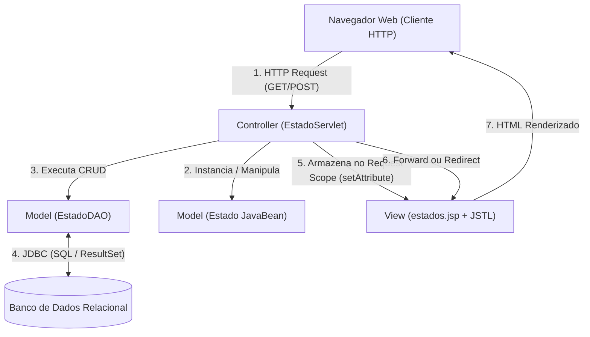
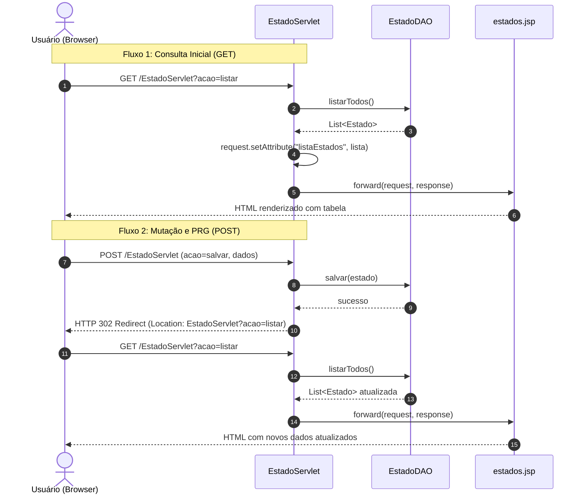
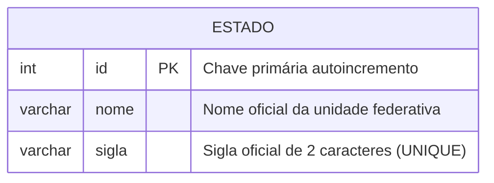
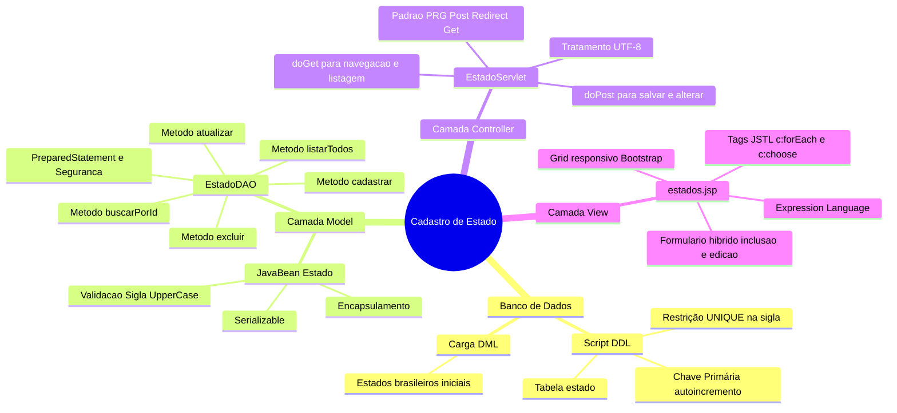

# Trabalho — 20260511 - Trabalho de Programação (1 ponto)

> **Professor:** Jefferson Passerini  
> **Disciplina:** Laboratório de Programação III (3º Semestre)  
> **Prazo de Entrega:** 25/05/2026 às 23:59  
> **Pontuação Máxima:** 100 pontos  
> **Conteúdo cobrado:** [Aula 01 - Configuração de Ambiente e Projeto Java Web](../../Aulas/Aula%2001%20-%20Configura%C3%A7%C3%A3o%20de%20Ambiente%20e%20Projeto%20Java%20Web/detalhes.md), [Aula 02 - Estruturação da Interface Frontend com JSP](../../Aulas/Aula%2002%20-%20Estrutura%C3%A7%C3%A3o%20da%20Interface%20Frontend%20com%20JSP/detalhes.md), [Aula 03 - Conexão com Banco de Dados PostgreSQL](../../Aulas/Aula%2003%20-%20Conex%C3%A3o%20com%20Banco%20de%20Dados%20PostgreSQL/detalhes.md), [Aula 04 - Implementação do Listar Usuário com MVC](../../Aulas/Aula%2004%20-%20Implementa%C3%A7%C3%A3o%20do%20Listar%20Usu%C3%A1rio%20com%20MVC/detalhes.md), [Aula 05 - Operação de Manutenção do Cadastro de Usuários](../../Aulas/Aula%2005%20-%20Opera%C3%A7%C3%A3o%20de%20Manuten%C3%A7%C3%A3o%20do%20Cadastro%20de%20Usu%C3%A1rios/detalhes.md)

---

## Sumário

- [Enunciado original (Google Classroom)](#enunciado-original-google-classroom)
- [Análise do que é pedido](#análise-do-que-é-pedido)
  - [Requisitos funcionais](#requisitos-funcionais)
  - [Requisitos não funcionais](#requisitos-não-funcionais)
  - [Entregáveis esperados](#entregáveis-esperados)
  - [Critérios implícitos de avaliação](#critérios-implícitos-de-avaliação)
- [Fundamentação teórica](#fundamentação-teórica)
  - [Padrão arquitetural MVC no ecossistema Java EE](#padrão-arquitetural-mvc-no-ecossistema-java-ee)
  - [Ciclo de vida de requisição HTTP e despacho de controle](#ciclo-de-vida-de-requisição-http-e-despacho-de-controle)
  - [Padrão Data Access Object (DAO) e JDBC seguro](#padrão-data-access-object-dao-e-jdbc-seguro)
  - [Separação de visão com JSP, JSTL e Expression Language](#separação-de-visão-com-jsp-jstl-e-expression-language)
- [Resolução proposta](#resolução-proposta)
  - [Modelagem do banco de dados relacional](#modelagem-do-banco-de-dados-relacional)
  - [Camada de domínio: JavaBean Estado](#camada-de-domínio-javabean-estado)
  - [Camada de infraestrutura: Fábrica de conexões](#camada-de-infraestrutura-fábrica-de-conexões)
  - [Camada de persistência: EstadoDAO](#camada-de-persistência-estadodao)
  - [Camada de controle: EstadoServlet](#camada-de-controle-estadoservlet)
  - [Camada de visão: estados.jsp](#camada-de-visão-estadosjsp)
- [Como testar e validar](#como-testar-e-validar)
  - [Roteiro de testes de bancada](#roteiro-de-testes-de-bancada)
  - [Testes unitários e de integração autônomos](#testes-unitários-e-de-integração-autônomos)
  - [Validação de casos de borda e regressão](#validação-de-casos-de-borda-e-regressão)
- [Critérios de qualidade](#critérios-de-qualidade)
- [Arquivos de apoio](#arquivos-de-apoio)
- [Mapa da atividade](#mapa-da-atividade)
- [Glossário](#glossário)
- [Pontos-chave para a prova](#pontos-chave-para-a-prova)
- [Perguntas e respostas (JSONL)](#perguntas-e-respostas-jsonl)
- [Checklist de revisão](#checklist-de-revisão)

---

## Enunciado original (Google Classroom)

Implemente conforme instruções.

Link (web): Java JSP Cap 5 4 Desafio 02 Implementar o cadastro de Estado no projeto  
URL: `https://spiffy-number-b06.notion.site/Java-JSP-Cap-5-4-Desafio-02-Implementar-o-cadastro-de-Estado-no-projeto-1cf393aeab2a80fa990ed0fc43391a3a?pvs=74`

---

## Análise do que é pedido

A atividade propõe a consolidação prática dos conceitos de desenvolvimento web corporativo em Java (Java EE / Jakarta EE clássico), estendendo o projeto-base trabalhado nas Aulas 01 a 05 com um novo módulo de domínio completo: o gerenciamento de **Estados** federativos.

Abaixo, desdobram-se os requisitos em conformidade com as boas práticas de engenharia de software e as orientações das aulas de laboratório.

### Requisitos funcionais

1. **Persistência relacional de estados (CRUD completo):**
   - **Inserção (Create):** Permitir a criação de novos estados com validação de campos obrigatórios (nome e sigla).
   - **Consulta e listagem (Read):** Recuperar todos os estados cadastrados exibindo-os ordenadamente em grade visual, além de permitir a busca por identificador primário (`id`).
   - **Atualização (Update):** Permitir a alteração do nome e da sigla de um registro existente, preservando a chave primária.
   - **Exclusão (Delete):** Permitir a remoção física de um registro a partir do seu identificador.
2. **Controle de fluxo de navegação:**
   - O sistema deve responder às ações de navegação via comandos de despacho (`acao=listar`, `acao=novo`, `acao=editar`, `acao=excluir`).
   - O envio de dados para persistência deve ocorrer exclusivamente via método HTTP `POST`.
   - A listagem e o carregamento de dados em formulário devem ocorrer via método HTTP `GET`.
   - Implementação do padrão Post/Redirect/Get (PRG) após operações de mutação (salvar e excluir) para impedir submissões duplicadas via recarregamento de página (`F5`).

### Requisitos não funcionais

1. **Arquitetura em camadas (MVC):**
   - Estrita separação de responsabilidades entre Modelo (Model), Visão (View) e Controlador (Controller).
   - Proibição de código Java scriptlet (`<% ... %>`) na camada de apresentação (JSP).
   - Proibição de comandos SQL ou formatação de apresentação no Servlet.
2. **Integridade de dados e segurança de banco:**
   - A sigla do estado deve possuir tamanho fixo de 2 caracteres, armazenada preferencialmente em caixa alta, com restrição de unicidade (`UNIQUE`).
   - Utilização obrigatória de `PreparedStatement` em todas as consultas SQL parametrizadas para eliminação sistemática de vulnerabilidades de SQL Injection.
   - Gestão estrita de recursos JDBC através de blocos `try-with-resources` ou fechamento explícito (`close()`) em cláusula `finally`.
3. **Usabilidade e responsividade:**
   - Interface visual construída com auxílio de framework CSS (Bootstrap) para garantir compatibilidade com dispositivos móveis e desktops.
   - Feedback explícito ao usuário (mensagens de sucesso ou alerta de erro).

### Entregáveis esperados

- `./codigo/schema.sql`: Script DDL para criação da tabela relacional com restrições e script DML com carga inicial de dados federativos.
- `./codigo/Estado.java`: Objeto de transferência/domínio estruturado como JavaBean.
- `./codigo/ConexaoBanco.java`: Classe utilitária responsável pela abertura e fornecimento de conexões JDBC.
- `./codigo/EstadoDAO.java`: Implementação das rotinas de persistência encapsulando a complexidade relacional.
- `./codigo/EstadoServlet.java`: Controlador que gerencia a máquina de estados das requisições web.
- `./codigo/estados.jsp`: Visão final contendo a interface de entrada de dados e a tabela de listagem.

### Critérios implícitos de avaliação

- **Encapsulamento e convenções JavaBean:** Atributos privados, métodos getters/setters públicos seguindo o padrão camelCase, construtor padrão sem argumentos e implementação de `Serializable`.
- **Tratamento de exceções:** Tratamento de `SQLException` e `ClassNotFoundException` sem encerramento abrupto da JVM, convertendo falhas de baixo nível em mensagens compreensíveis ou exceções de aplicação.
- **Normalização de codificação de caracteres:** Tratamento de codificação UTF-8 na leitura de parâmetros do Servlet (`request.setCharacterEncoding("UTF-8")`) e na renderização do JSP (`pageEncoding="UTF-8"`).

---

## Fundamentação teórica

### Padrão arquitetural MVC no ecossistema Java EE

O padrão arquitetural Model-View-Controller (MVC Modelo 2) organiza uma aplicação em três componentes fundamentais, garantindo baixo acoplamento e alta coesão:

1. **Model (Modelo):** Representa as regras de negócio, as estruturas de dados e a camada de persistência. No ecossistema Java padrão, é composto por entidades JavaBean (ex.: `Estado.java`) e classes de acesso a dados (ex.: `EstadoDAO.java`).
2. **View (Visão):** Camada responsável pela apresentação dos dados e captura de interações do usuário. Empregamos páginas JSP renderizadas no servidor, combinadas com JSTL (JavaServer Pages Standard Tag Library) e EL (Expression Language).
3. **Controller (Controlador):** Atua como interceptador e maestro do fluxo de execução. Servlets Java desempenham esse papel, recebendo requisições HTTP, extraindo parâmetros, acionando as operações no Model e selecionando a View apropriada para responder ao cliente.



### Ciclo de vida de requisição HTTP e despacho de controle

No desenvolvimento web com Servlets Java, o ciclo de vida envolve a interceptação do protocolo HTTP através de métodos específicos:
- `doGet(HttpServletRequest request, HttpServletResponse response)`: Processa requisições idempotentes e seguras (consultas, exibições de telas).
- `doPost(HttpServletRequest request, HttpServletResponse response)`: Processa requisições de mutação de estado (inserções, atualizações, exclusões).

Dois mecanismos distintos de navegação governam a relação entre Controlador e Visão:

1. **Request Dispatcher (`forward`):**
   - **Definição:** O servidor transfere o processamento da requisição internamente para outro recurso (JSP ou Servlet) mantendo os mesmos objetos `request` e `response`.
   - **Motivação:** Permite compartilhar dados inseridos no escopo da requisição (`request.setAttribute("lista", dados)`) com a página JSP.
   - **Contraexemplo / Armadilha:** Fazer `forward` logo após um `POST` de inserção. Se o usuário pressionar a tecla F5 no navegador, a requisição POST é reenviada integralmente, gerando registros duplicados no banco.

2. **Redirecionamento (`response.sendRedirect`):**
   - **Definição:** O servidor envia um código de status HTTP (comumente `302 Found`) com o cabeçalho `Location` instruindo o navegador a realizar uma nova requisição `GET` para a nova URL.
   - **Motivação:** Padrão Post/Redirect/Get (PRG). Garante que a barra de endereços do cliente reflita a URL limpa e elimina o risco de submissões acidentais duplicadas.



### Padrão Data Access Object (DAO) e JDBC seguro

O padrão Data Access Object isola completamente a lógica de persistência e a infraestrutura de acesso ao banco de dados relacional das camadas superiores (regras de negócio e controle).

#### Vantagens do padrão DAO
- **Isolamento de tecnologia:** Caso o banco subjacente mude de PostgreSQL para MySQL ou Oracle, apenas a camada DAO e a fábrica de conexões são modificadas, mantendo o Servlet e o JSP intactos.
- **Centralização:** Comandos SQL ficam concentrados em uma única classe, simplificando revisões de segurança e otimização de índices.

#### Boas práticas mandatórias de JDBC
1. **PreparedStatement vs Statement:**
   - *Definição:* `PreparedStatement` pré-compila a estrutura do comando SQL no motor do banco de dados, enviando os parâmetros de forma parametrizada e isolada.
   - *Motivação:* Impede que caracteres especiais como aspas simples (`'`) quebrem a sintaxe e permitam injeção de código arbitrário.
   - *Contraexemplo perigoso:*
     ```java
     // NUNCA FAÇA ISSO: Brecha grave de SQL Injection
     Statement stmt = conn.createStatement();
     String sql = "SELECT * FROM estado WHERE nome = '" + parametroUsuario + "'";
     ResultSet rs = stmt.executeQuery(sql);
     ```
   - *Exemplo seguro:*
     ```java
     // CORRETO: Parâmetros vinculados por posição tipada
     String sql = "SELECT * FROM estado WHERE nome = ?";
     try (PreparedStatement pstmt = conn.prepareStatement(sql)) {
         pstmt.setString(1, parametroUsuario);
         try (ResultSet rs = pstmt.executeQuery()) { ... }
     }
     ```
2. **Gerenciamento de vazamento de recursos (Resource Leaking):**
   Conexões, `PreparedStatements` e `ResultSets` consomem cursores e descritores de rede no sistema operacional e no servidor de banco de dados. O uso da estrutura `try-with-resources` garante que a interface `AutoCloseable` seja acionada na ordem inversa de abertura, mesmo em caso de lançamento de exceções em tempo de execução.

### Separação de visão com JSP, JSTL e Expression Language

JavaServer Pages (JSP) é uma tecnologia de renderização de páginas dinâmicas que compila o arquivo `.jsp` em um Servlet Java na primeira execução.

#### A evolução da escrita de JSPs
- **Histórico (Modelo 1 - Obsoleto):** Misturava-se HTML e scriptlets Java (`<% for(int i=0; i<lista.size(); i++) { %>`). Esse padrão produzia código ilegível, difícil de manter e propenso a falhas de segurança como Cross-Site Scripting (XSS).
- **Abordagem Moderna (Modelo 2):** Utilização estrita de JSTL e Expression Language (EL). A lógica de controle é delegada às tags da JSTL (`<c:forEach>`, `<c:if>`), enquanto a interpolação de dados é realizada pela EL (`${estado.nome}`).

#### Armadilhas comuns na visão
- Esquecer a diretiva de importação da taglib no topo do arquivo JSP:
  ```jsp
  <%@ taglib prefix="c" uri="http://java.sun.com/jsp/jstl/core" %>
  ```
  Sem essa linha, as tags `<c:...>` são interpretadas pelo navegador como elementos HTML desconhecidos, falhando na renderização da lógica.

---

## Resolução proposta

A solução arquitetural é apresentada em detalhes com o código-fonte integral de cada componente, detalhando como as camadas interagem no fluxo completo de CRUD.

### Modelagem do banco de dados relacional

A modelagem física contempla a entidade `estado`. Para máxima aderência pedagógica às aulas de laboratório ministradas pelo Prof. Jefferson Passerini, a tabela foi estruturada de modo a suportar dialetos relacionais corporativos com tipagem explícita e restrições integradas.

#### Diagrama de Entidade-Relacionamento



#### Código SQL DDL e DML

Arquivo de referência: [`./codigo/schema.sql`](./codigo/schema.sql)

```sql
-- =============================================================================
-- Disciplina: Laboratório de Programação III
-- Professor:  Jefferson Passerini
-- Assunto:    DDL e DML para o Módulo de Estados
-- =============================================================================

-- 1. Criação do Banco de Dados (opcional conforme ambiente local)
-- CREATE DATABASE lab_prog3_db CHARACTER SET utf8mb4 COLLATE utf8mb4_unicode_ci;
-- \c lab_prog3_db; -- Comando no PostgreSQL

-- 2. Remoção da tabela em caso de recriação de ambiente
DROP TABLE IF EXISTS estado;

-- 3. Criação da Tabela com integridade relacional
-- Nota: Para PostgreSQL utiliza-se SERIAL; para MySQL utiliza-se AUTO_INCREMENT.
-- Apresenta-se o padrão compatível com PostgreSQL (abordado na Aula 03):
CREATE TABLE estado (
    id SERIAL PRIMARY KEY,
    nome VARCHAR(100) NOT NULL,
    sigla VARCHAR(2) NOT NULL,
    CONSTRAINT uk_estado_sigla UNIQUE (sigla)
);

-- Comentários descritivos dos campos
COMMENT ON TABLE estado IS 'Armazena as Unidades Federativas gerenciadas pelo sistema';
COMMENT ON COLUMN estado.id IS 'Identificador numérico sequencial da unidade federativa';
COMMENT ON COLUMN estado.nome IS 'Nome por extenso do Estado (ex: São Paulo)';
COMMENT ON COLUMN estado.sigla IS 'Sigla oficial de duas letras em formato ISO/IBGE (ex: SP)';

-- 4. Inserção de Carga Inicial para testes e homologação
INSERT INTO estado (nome, sigla) VALUES 
    ('São Paulo', 'SP'),
    ('Rio de Janeiro', 'RJ'),
    ('Minas Gerais', 'MG'),
    ('Paraná', 'PR'),
    ('Santa Catarina', 'SC'),
    ('Rio Grande do Sul', 'RS'),
    ('Bahia', 'BA'),
    ('Goiás', 'GO');

-- Verificação da inserção
SELECT id, nome, sigla FROM estado ORDER BY nome ASC;
```

### Camada de domínio: JavaBean Estado

A classe `Estado` encapsula o conceito do mundo real, atuando como o modelo puro da aplicação.

#### Requisitos de modelagem atendidos:
- Propriedades privadas: `id` (Integer/int), `nome` (String), `sigla` (String).
- Construtor padrão (obrigatório para frameworks e serialização) e construtor com argumentos.
- Métodos de acesso (getters) e mutação (setters).
- Implementação de `Serializable` para garantia de persistência em sessão ou tráfego de rede.
- Sobrescrita de `toString()`, `equals()` e `hashCode()`.

Arquivo de referência: [`./codigo/Estado.java`](./codigo/Estado.java)

```java
package model;

import java.io.Serializable;
import java.util.Objects;

/**
 * Representa a entidade de domínio Estado (Unidade Federativa).
 * Estruturada conforme as convenções do padrão JavaBean.
 * 
 * Disciplina: Laboratório de Programação III
 * Professor: Jefferson Passerini
 */
public class Estado implements Serializable {

    private static final long serialVersionUID = 1L;

    private Integer id;
    private String nome;
    private String sigla;

    /**
     * Construtor padrão (sem argumentos).
     * Essencial para reflexão computacional e uso em frameworks Java EE.
     */
    public Estado() {
    }

    /**
     * Construtor de conveniência para instanciação de novos estados (sem ID prévio).
     */
    public Estado(String nome, String sigla) {
        this.nome = nome;
        this.sigla = sigla != null ? sigla.toUpperCase().trim() : null;
    }

    /**
     * Construtor completo para reconstituição de dados persistidos no banco.
     */
    public Estado(Integer id, String nome, String sigla) {
        this.id = id;
        this.nome = nome;
        this.sigla = sigla != null ? sigla.toUpperCase().trim() : null;
    }

    // Métodos Getters e Setters
    public Integer getId() {
        return id;
    }

    public void setId(Integer id) {
        this.id = id;
    }

    public String getNome() {
        return nome;
    }

    public void setNome(String nome) {
        this.nome = nome;
    }

    public String getSigla() {
        return sigla;
    }

    public void setSigla(String sigla) {
        this.sigla = sigla != null ? sigla.toUpperCase().trim() : null;
    }

    @Override
    public boolean equals(Object o) {
        if (this == o) return true;
        if (o == null || getClass() != o.getClass()) return false;
        Estado estado = (Estado) o;
        return Objects.equals(id, estado.id) || Objects.equals(sigla, estado.sigla);
    }

    @Override
    public int hashCode() {
        return Objects.hash(id, sigla);
    }

    @Override
    public String toString() {
        return "Estado{" +
                "id=" + id +
                ", nome='" + nome + '\'' +
                ", sigla='" + sigla + '\'' +
                '}';
    }

    /**
     * Método de teste autônomo para validação da classe em linha de comando.
     */
    public static void main(String[] args) {
        Estado e = new Estado(1, "São Paulo", "sp");
        System.out.println("Teste JavaBean Estado executado com sucesso: " + e);
        if (!"SP".equals(e.getSigla())) {
            System.err.println("Falha na normalização da sigla para maiúsculas.");
        }
    }
}
```

### Camada de infraestrutura: Fábrica de conexões

A classe `ConexaoBanco` é responsável por abstrair a carga do driver JDBC e a abertura da sessão física com o mecanismo de banco de dados.

Arquivo de referência: [`./codigo/ConexaoBanco.java`](./codigo/ConexaoBanco.java)

```java
package util;

import java.sql.Connection;
import java.sql.DriverManager;
import java.sql.SQLException;

/**
 * Gerenciador de conexão com o banco de dados via JDBC.
 * Proê suporte resiliente ao carregamento de drivers e tratamento de exceções.
 * 
 * Disciplina: Laboratório de Programação III
 * Professor: Jefferson Passerini
 */
public class ConexaoBanco {

    // Configurações de Conexão - Ajustáveis conforme o ambiente de laboratório
    // Abordagem com PostgreSQL conforme padrão da Aula 03
    private static final String DRIVER = "org.postgresql.Driver";
    private static final String URL = "jdbc:postgresql://localhost:5432/lab_prog3_db";
    private static final String USUARIO = "postgres";
    private static final String SENHA = "root"; // Ajustar conforme credencial local

    // Bloco estático para garantir a carga da classe de driver apenas uma vez na JVM
    static {
        try {
            Class.forName(DRIVER);
        } catch (ClassNotFoundException e) {
            System.err.println("ERRO CRÍTICO: Driver JDBC não localizado no classpath: " + DRIVER);
            e.printStackTrace();
        }
    }

    /**
     * Obtém uma conexão física ativa com o servidor de banco de dados.
     * 
     * @return java.sql.Connection
     * @throws SQLException caso ocorra falha de autenticação ou rede
     */
    public static Connection getConexao() throws SQLException {
        try {
            return DriverManager.getConnection(URL, USUARIO, SENHA);
        } catch (SQLException e) {
            System.err.println("Falha ao abrir conexão com o banco de dados: " + e.getMessage());
            throw e;
        }
    }

    /**
     * Método autônomo para diagnóstico e homologação da conectividade.
     */
    public static void main(String[] args) {
        System.out.println("Iniciando teste de conectividade JDBC...");
        try (Connection con = ConexaoBanco.getConexao()) {
            if (con != null && !con.isClosed()) {
                System.out.println("SUCESSO: Conexão estabelecida com sucesso!");
                System.out.println("Catálogo atual: " + con.getCatalog());
            }
        } catch (SQLException e) {
            System.err.println("FALHA DE TESTE: Não foi possível conectar ao banco de dados.");
            e.printStackTrace();
        }
    }
}
```

### Camada de persistência: EstadoDAO

A classe `EstadoDAO` implementa a interface de operações CRUD, gerenciando a construção de comandos SQL e mapeando tuplas relacionais (`ResultSet`) para instâncias do modelo de domínio (`Estado`).

Arquivo de referência: [`./codigo/EstadoDAO.java`](./codigo/EstadoDAO.java)

```java
package dao;

import model.Estado;
import util.ConexaoBanco;

import java.sql.Connection;
import java.sql.PreparedStatement;
import java.sql.ResultSet;
import java.sql.SQLException;
import java.sql.Statement;
import java.util.ArrayList;
import java.util.List;

/**
 * Data Access Object para a entidade Estado.
 * Encapsula todas as operações de banco de dados relativas à tabela 'estado'.
 * 
 * Disciplina: Laboratório de Programação III
 * Professor: Jefferson Passerini
 */
public class EstadoDAO {

    /**
     * Insere um novo estado no banco de dados.
     * Recupera e preenche o ID gerado automaticamente pelo banco.
     */
    public boolean cadastrar(Estado estado) {
        String sql = "INSERT INTO estado (nome, sigla) VALUES (?, ?)";

        try (Connection conn = ConexaoBanco.getConexao();
             PreparedStatement pstmt = conn.prepareStatement(sql, Statement.RETURN_GENERATED_KEYS)) {

            pstmt.setString(1, estado.getNome());
            pstmt.setString(2, estado.getSigla());

            int linhasAfetadas = pstmt.executeUpdate();

            if (linhasAfetadas > 0) {
                try (ResultSet rsChaves = pstmt.getGeneratedKeys()) {
                    if (rsChaves.next()) {
                        estado.setId(rsChaves.getInt(1));
                    }
                }
                return true;
            }
            return false;

        } catch (SQLException e) {
            System.err.println("Erro ao cadastrar estado: " + e.getMessage());
            e.printStackTrace();
            return false;
        }
    }

    /**
     * Retorna a lista completa de estados cadastrados, ordenados por nome.
     */
    public List<Estado> listarTodos() {
        List<Estado> lista = new ArrayList<>();
        String sql = "SELECT id, nome, sigla FROM estado ORDER BY nome ASC";

        try (Connection conn = ConexaoBanco.getConexao();
             PreparedStatement pstmt = conn.prepareStatement(sql);
             ResultSet rs = pstmt.executeQuery()) {

            while (rs.next()) {
                Estado estado = new Estado();
                estado.setId(rs.getInt("id"));
                estado.setNome(rs.getString("nome"));
                estado.setSigla(rs.getString("sigla"));
                lista.add(estado);
            }

        } catch (SQLException e) {
            System.err.println("Erro ao listar estados: " + e.getMessage());
            e.printStackTrace();
        }

        return lista;
    }

    /**
     * Localiza um estado específico a partir de sua chave primária.
     */
    public Estado buscarPorId(int id) {
        String sql = "SELECT id, nome, sigla FROM estado WHERE id = ?";
        Estado estado = null;

        try (Connection conn = ConexaoBanco.getConexao();
             PreparedStatement pstmt = conn.prepareStatement(sql)) {

            pstmt.setInt(1, id);

            try (ResultSet rs = pstmt.executeQuery()) {
                if (rs.next()) {
                    estado = new Estado();
                    estado.setId(rs.getInt("id"));
                    estado.setNome(rs.getString("nome"));
                    estado.setSigla(rs.getString("sigla"));
                }
            }

        } catch (SQLException e) {
            System.err.println("Erro ao buscar estado por ID (" + id + "): " + e.getMessage());
            e.printStackTrace();
        }

        return estado;
    }

    /**
     * Atualiza as informações de um estado existente.
     */
    public boolean atualizar(Estado estado) {
        String sql = "UPDATE estado SET nome = ?, sigla = ? WHERE id = ?";

        try (Connection conn = ConexaoBanco.getConexao();
             PreparedStatement pstmt = conn.prepareStatement(sql)) {

            pstmt.setString(1, estado.getNome());
            pstmt.setString(2, estado.getSigla());
            pstmt.setInt(3, estado.getId());

            return pstmt.executeUpdate() > 0;

        } catch (SQLException e) {
            System.err.println("Erro ao atualizar estado: " + e.getMessage());
            e.printStackTrace();
            return false;
        }
    }

    /**
     * Remove fisicamente um registro do banco de dados por meio de seu ID.
     */
    public boolean excluir(int id) {
        String sql = "DELETE FROM estado WHERE id = ?";

        try (Connection conn = ConexaoBanco.getConexao();
             PreparedStatement pstmt = conn.prepareStatement(sql)) {

            pstmt.setInt(1, id);
            return pstmt.executeUpdate() > 0;

        } catch (SQLException e) {
            System.err.println("Erro ao excluir estado ID (" + id + "): " + e.getMessage());
            e.printStackTrace();
            return false;
        }
    }

    /**
     * Validação operacional integrada em linha de comando.
     */
    public static void main(String[] args) {
        EstadoDAO dao = new EstadoDAO();
        System.out.println("Executando teste integrado de operações no EstadoDAO...");

        // Teste 1: Cadastrar
        Estado teste = new Estado("Estado Teste", "TT");
        boolean inserido = dao.cadastrar(teste);
        System.out.println("Inserção realizada: " + inserido + " | Gerado ID: " + teste.getId());

        // Teste 2: Consultar
        if (teste.getId() != null) {
            Estado recuperado = dao.buscarPorId(teste.getId());
            System.out.println("Consulta por ID: " + recuperado);

            // Teste 3: Atualizar
            recuperado.setNome("Estado Teste Alterado");
            dao.atualizar(recuperado);
            System.out.println("Atualizado para: " + dao.buscarPorId(teste.getId()).getNome());

            // Teste 4: Excluir
            boolean removido = dao.excluir(teste.getId());
            System.out.println("Remoção realizada com sucesso: " + removido);
        }
    }
}
```

### Camada de controle: EstadoServlet

O servlet atua como controlador centralizado, interceptando chamadas HTTP, governando a transição entre telas e manipulando as entidades correspondentes.

Arquivo de referência: [`./codigo/EstadoServlet.java`](./codigo/EstadoServlet.java)

```java
package controller;

import dao.EstadoDAO;
import model.Estado;

import javax.servlet.RequestDispatcher;
import javax.servlet.ServletException;
import javax.servlet.annotation.WebServlet;
import javax.servlet.http.HttpServlet;
import javax.servlet.http.HttpServletRequest;
import javax.servlet.http.HttpServletResponse;
import java.io.IOException;
import java.util.List;

/**
 * Servlet controlador responsável pelas requisições referentes a Estado.
 * Mapeado para responder na URL /EstadoServlet.
 * 
 * Disciplina: Laboratório de Programação III
 * Professor: Jefferson Passerini
 */
@WebServlet("/EstadoServlet")
public class EstadoServlet extends HttpServlet {

    private static final long serialVersionUID = 1L;
    private EstadoDAO estadoDAO;

    @Override
    public void init() throws ServletException {
        super.init();
        // Inicialização do DAO durante o carregamento inicial do Servlet
        this.estadoDAO = new EstadoDAO();
    }

    /**
     * Gerencia as requisições HTTP GET (Consultas, Exibições e Exclusões).
     */
    @Override
    protected void doGet(HttpServletRequest request, HttpServletResponse response)
            throws ServletException, IOException {
        
        request.setCharacterEncoding("UTF-8");
        String acao = request.getParameter("acao");

        if (acao == null || acao.trim().isEmpty()) {
            acao = "listar";
        }

        switch (acao) {
            case "novo":
                apresentarFormularioNovo(request, response);
                break;
            case "editar":
                apresentarFormularioEdicao(request, response);
                break;
            case "excluir":
                executarExclusao(request, response);
                break;
            case "listar":
            default:
                listarEstados(request, response);
                break;
        }
    }

    /**
     * Gerencia as requisições HTTP POST (Submissão de dados de formulário).
     */
    @Override
    protected void doPost(HttpServletRequest request, HttpServletResponse response)
            throws ServletException, IOException {
        
        // Garante leitura de acentuação correta
        request.setCharacterEncoding("UTF-8");

        String idStr = request.getParameter("id");
        String nome = request.getParameter("nome");
        String sigla = request.getParameter("sigla");

        Estado estado = new Estado();
        estado.setNome(nome != null ? nome.trim() : "");
        estado.setSigla(sigla != null ? sigla.trim() : "");

        boolean sucesso;

        if (idStr == null || idStr.trim().isEmpty() || "0".equals(idStr.trim())) {
            // Operação de Inserção (Create)
            sucesso = estadoDAO.cadastrar(estado);
        } else {
            // Operação de Alteração (Update)
            estado.setId(Integer.parseInt(idStr.trim()));
            sucesso = estadoDAO.atualizar(estado);
        }

        // Padrão Post/Redirect/Get para evitar submissões duplicadas
        if (sucesso) {
            response.sendRedirect("EstadoServlet?acao=listar&msg=sucesso");
        } else {
            response.sendRedirect("EstadoServlet?acao=listar&msg=erro");
        }
    }

    private void listarEstados(HttpServletRequest request, HttpServletResponse response)
            throws ServletException, IOException {
        List<Estado> lista = estadoDAO.listarTodos();
        request.setAttribute("listaEstados", lista);

        RequestDispatcher dispatcher = request.getRequestDispatcher("estados.jsp");
        dispatcher.forward(request, response);
    }

    private void apresentarFormularioNovo(HttpServletRequest request, HttpServletResponse response)
            throws ServletException, IOException {
        request.setAttribute("estado", new Estado());
        listarEstados(request, response);
    }

    private void apresentarFormularioEdicao(HttpServletRequest request, HttpServletResponse response)
            throws ServletException, IOException {
        try {
            int id = Integer.parseInt(request.getParameter("id"));
            Estado estadoExistente = estadoDAO.buscarPorId(id);
            request.setAttribute("estado", estadoExistente);
        } catch (NumberFormatException e) {
            request.setAttribute("erro", "ID inválido fornecido para edição.");
        }
        listarEstados(request, response);
    }

    private void executarExclusao(HttpServletRequest request, HttpServletResponse response)
            throws IOException {
        try {
            int id = Integer.parseInt(request.getParameter("id"));
            estadoDAO.excluir(id);
        } catch (NumberFormatException e) {
            System.err.println("Erro ao converter identificador para exclusão.");
        }
        // Redirecionamento limpo
        response.sendRedirect("EstadoServlet?acao=listar");
    }
}
```

### Camada de visão: estados.jsp

A interface em JSP utiliza a biblioteca de tags JSTL e Expression Language, consumindo os objetos expostos no escopo da requisição pelo Servlet.

Arquivo de referência: [`./codigo/estados.jsp`](./codigo/estados.jsp)

```jsp
<%@ page language="java" contentType="text/html; charset=UTF-8" pageEncoding="UTF-8"%>
<%@ taglib prefix="c" uri="http://java.sun.com/jsp/jstl/core" %>
<!DOCTYPE html>
<html lang="pt-br">
<head>
    <meta charset="UTF-8">
    <meta name="viewport" content="width=device-width, initial-scale=1.0">
    <title>Manutenção de Estados - Laboratório de Programação III</title>
    <!-- Inclusão do Bootstrap CSS via CDN -->
    <link rel="stylesheet" href="https://cdn.jsdelivr.net/npm/bootstrap@5.3.0/dist/css/bootstrap.min.css">
</head>
<body class="bg-light">

    <!-- Barra de Navegação -->
    <nav class="navbar navbar-expand-lg navbar-dark bg-dark mb-4">
        <div class="container">
            <a class="navbar-brand" href="EstadoServlet?acao=listar">Sistema Integrado - UniFEF</a>
            <span class="navbar-text text-white">Prof. Jefferson Passerini</span>
        </div>
    </nav>

    <div class="container">
        <div class="row">
            
            <!-- Painel do Formulário de Cadastro e Edição -->
            <div class="col-md-4 mb-4">
                <div class="card shadow-sm">
                    <div class="card-header bg-primary text-white">
                        <h5 class="mb-0">
                            <c:choose>
                                <c:when test="${not empty estado.id and estado.id > 0}">
                                    Alteração de Estado
                                </c:when>
                                <c:otherwise>
                                    Novo Estado
                                </c:otherwise>
                            </c:choose>
                        </h5>
                    </div>
                    <div class="card-body">
                        
                        <!-- Mensagens de Alerta -->
                        <c:if test="${param.msg == 'sucesso'}">
                            <div class="alert alert-success alert-dismissible fade show" role="alert">
                                Operação realizada com sucesso!
                            </div>
                        </c:if>
                        <c:if test="${param.msg == 'erro'}">
                            <div class="alert alert-danger alert-dismissible fade show" role="alert">
                                Ocorreu um erro ao processar a operação.
                            </div>
                        </c:if>

                        <form action="EstadoServlet" method="post">
                            <!-- Campo oculto para envio do ID na edição -->
                            <input type="hidden" name="id" value="${estado.id != null ? estado.id : 0}">

                            <div class="mb-3">
                                <label for="nome" class="form-label">Nome do Estado:</label>
                                <input type="text" class="form-control" id="nome" name="nome" 
                                       value="${estado.nome}" required maxlength="100" placeholder="Ex: São Paulo">
                            </div>

                            <div class="mb-3">
                                <label for="sigla" class="form-label">Sigla (UF):</label>
                                <input type="text" class="form-control" id="sigla" name="sigla" 
                                       value="${estado.sigla}" required maxlength="2" style="text-transform: uppercase;" placeholder="Ex: SP">
                            </div>

                            <div class="d-grid gap-2">
                                <button type="submit" class="btn btn-success">Salvar Registro</button>
                                <c:if test="${not empty estado.id and estado.id > 0}">
                                    <a href="EstadoServlet?acao=listar" class="btn btn-secondary">Cancelar Edição</a>
                                </c:if>
                            </div>
                        </form>
                    </div>
                </div>
            </div>

            <!-- Painel de Listagem de Estados Cadastrados -->
            <div class="col-md-8">
                <div class="card shadow-sm">
                    <div class="card-header bg-secondary text-white d-flex justify-content-between align-items-center">
                        <h5 class="mb-0">Estados Cadastrados</h5>
                        <span class="badge bg-light text-dark">${listaEstados.size()} registros</span>
                    </div>
                    <div class="card-body p-0">
                        <div class="table-responsive">
                            <table class="table table-striped table-hover mb-0">
                                <thead class="table-dark">
                                    <tr>
                                        <th style="width: 10%;">ID</th>
                                        <th style="width: 50%;">Nome do Estado</th>
                                        <th style="width: 15%;">Sigla</th>
                                        <th style="width: 25%;" class="text-center">Ações</th>
                                    </tr>
                                </thead>
                                <tbody>
                                    <c:choose>
                                        <c:when test="${not empty listaEstados}">
                                            <c:forEach var="item" items="${listaEstados}">
                                                <tr>
                                                    <td>${item.id}</td>
                                                    <td>${item.nome}</td>
                                                    <td><span class="badge bg-info text-dark">${item.sigla}</span></td>
                                                    <td class="text-center">
                                                        <a href="EstadoServlet?acao=editar&id=${item.id}" 
                                                           class="btn btn-sm btn-outline-warning">Editar</a>
                                                        <a href="EstadoServlet?acao=excluir&id=${item.id}" 
                                                           class="btn btn-sm btn-outline-danger" 
                                                           onclick="return confirm('Confirma a exclusão do estado ${item.nome}?');">Excluir</a>
                                                    </td>
                                                </tr>
                                            </c:forEach>
                                        </c:when>
                                        <c:otherwise>
                                            <tr>
                                                <td colspan="4" class="text-center py-4 text-muted">
                                                    Nenhum estado cadastrado até o momento.
                                                </td>
                                            </tr>
                                        </c:otherwise>
                                    </c:choose>
                                </tbody>
                            </table>
                        </div>
                    </div>
                </div>
            </div>

        </div>
    </div>

    <!-- Bootstrap Bundle com Popper.js via CDN -->
    <script src="https://cdn.jsdelivr.net/npm/bootstrap@5.3.0/dist/js/bootstrap.bundle.min.js"></script>
</body>
</html>
```

---

## Como testar e validar

### Roteiro de testes de bancada

Para assegurar o pleno funcionamento da aplicação, siga as etapas estruturadas abaixo:

1. **Validação do Banco de Dados:**
   - Execute o script [`./codigo/schema.sql`](./codigo/schema.sql) no PostgreSQL/pgAdmin ou ferramenta SQL equivalente.
   - Execute `SELECT * FROM estado;` e certifique-se de que a carga inicial de estados foi persistida.
2. **Homologação das Classes Java Autônomas:**
   - Execute o método `main` da classe `ConexaoBanco.java` para confirmar se a URL, credenciais e driver JDBC conseguem conectar ao servidor.
   - Execute o método `main` da classe `EstadoDAO.java` para validar no terminal se o ciclo CRUD (cadastro, busca, atualização e exclusão) ocorre sem erros de integridade ou sintaxe SQL.
3. **Deploy no Servidor de Aplicação (Apache Tomcat):**
   - Certifique-se de que a biblioteca JSTL (`jstl-1.2.jar` ou equivalente) e o driver JDBC (`postgresql-xxx.jar`) estejam presentes no diretório `WEB-INF/lib/` da aplicação web.
   - Inicie o Apache Tomcat pelo Eclipse, NetBeans ou IntelliJ.
   - Acesse no navegador o endereço: `http://localhost:8080/NomeDoProjeto/EstadoServlet`.

### Testes unitários e de integração autônomos

Abaixo consta uma matriz de testes de caixa-preta recomendada para validação funcional completa:

| ID | Cenário de Teste | Ação Executada | Resultado Esperado |
| :--- | :--- | :--- | :--- |
| **TC01** | Carga inicial de tela | Acessar `EstadoServlet?acao=listar` | Exibir tabela com os registros carregados no banco e formulário vazio pronto para inclusão. |
| **TC02** | Cadastro com sucesso | Preencher Nome="Espírito Santo", Sigla="ES" e submeter | Registro persistido, tabela atualizada com o novo registro e mensagem de sucesso exibida. |
| **TC03** | Validação de unicidade | Tentar cadastrar novo estado com Sigla="SP" (já existente) | Falha tratada; nenhuma inserção duplicada deve ocorrer no banco. |
| **TC04** | Edição de registro | Clicar em "Editar" no registro "Paraná" | Os dados do Paraná devem carregar nos inputs do formulário; botão muda para "Alteração". |
| **TC05** | Confirmação de edição | Alterar Nome para "Paraná Atualizado" e salvar | A linha correspondente na tabela deve refletir o novo nome sem alterar o ID original. |
| **TC06** | Exclusão de registro | Clicar em "Excluir" em um registro e confirmar | O registro deve desaparecer da tabela e do banco de dados relacional. |
| **TC07** | Proteção contra F5 (PRG) | Salvar um estado e pressionar F5 na tela de listagem | O navegador apenas recarrega a consulta `GET`, sem exibir o popup de reenvio de formulário. |

### Validação de casos de borda e regressão

- **Acentuação e caracteres especiais:** Cadastrar estados com acentos gráficos (ex.: "Maranhão", "Ceará", "Piauí"). Se surgirem caracteres corrompidos (`Maranho`), revise se tanto o Servlet quanto a página JSP possuem as diretivas de codificação UTF-8 configuradas.
- **Siglas minúsculas:** Inserir a sigla em letras minúsculas (ex.: "mg"). O modelo JavaBean ou a interface deve normalizar a entrada automaticamente para caixa alta ("MG").
- **Campos em branco:** O formulário possui atributos HTML5 `required` e os scripts Java tratam strings vazias via `.trim()`, prevenindo registros órfãos ou inválidos.

---

## Critérios de qualidade

Para atingir a pontuação integral da atividade (100 pontos), o desenvolvimento deve satisfazer a seguinte régua de qualidade:

1. **Separação Arquitetural Rígida (30 pontos):**
   - Ausência absoluta de scriptlets `<% %>` no arquivo JSP.
   - Nenhuma chamada JDBC ou código SQL fora da camada DAO.
   - Servlet atuando estritamente como despachante e orquestrador, sem renderizar código HTML via `PrintWriter`.
2. **Robustez e Segurança JDBC (25 pontos):**
   - Utilização obrigatória de `PreparedStatement` em todas as operações de banco.
   - Fechamento garantido de conexões e statements com `try-with-resources`.
   - Normalização dos dados e restrições de integridade no banco (`PRIMARY KEY`, `UNIQUE`).
3. **Usabilidade e Aderência Web (25 pontos):**
   - Utilização do padrão Post/Redirect/Get para evitar duplicidade de submissões.
   - Mensagens visuais claras de sucesso e alerta de erro.
   - Layout responsivo e coerente com Bootstrap.
4. **Organização e Padronização do Código (20 pontos):**
   - Aderência às convenções JavaBean (atributos privados, getters/setters camelCase, construtores).
   - Nomes de classes e pacotes condizentes com a estrutura de pacotes Java corporativa (`model`, `dao`, `controller`, `util`).

---

## Arquivos de apoio

- **Link oficial do Desafio no Notion:**  
  [Java JSP Cap 5.4 Desafio 02 - Implementar o cadastro de Estado no projeto](https://spiffy-number-b06.notion.site/Java-JSP-Cap-5-4-Desafio-02-Implementar-o-cadastro-de-Estado-no-projeto-1cf393aeab2a80fa990ed0fc43391a3a?pvs=74)
- **Aulas relacionadas do repositório da disciplina:**
  - [Aula 01 - Configuração de Ambiente e Projeto Java Web](../../Aulas/Aula%2001%20-%20Configura%C3%A7%C3%A3o%20de%20Ambiente%20e%20Projeto%20Java%20Web/detalhes.md)
  - [Aula 02 - Estruturação da Interface Frontend com JSP](../../Aulas/Aula%2002%20-%20Estrutura%C3%A7%C3%A3o%20da%20Interface%20Frontend%20com%20JSP/detalhes.md)
  - [Aula 03 - Conexão com Banco de Dados PostgreSQL](../../Aulas/Aula%2003%20-%20Conex%C3%A3o%20com%20Banco%20de%20Dados%20PostgreSQL/detalhes.md)
  - [Aula 04 - Implementação do Listar Usuário com MVC](../../Aulas/Aula%2004%20-%20Implementa%C3%A7%C3%A3o%20do%20Listar%20Usu%C3%A1rio%20com%20MVC/detalhes.md)
  - [Aula 05 - Operação de Manutenção do Cadastro de Usuários](../../Aulas/Aula%2005%20-%20Opera%C3%A7%C3%A3o%20de%20Manuten%C3%A7%C3%A3o%20do%20Cadastro%20de%20Usu%C3%A1rios/detalhes.md)

---

## Mapa da atividade

O diagrama mental abaixo sintetiza as dependências técnicas e estruturais necessárias para a implementação completa da solução:



---

## Glossário

| Termo | Definição Técnica |
| :--- | :--- |
| **JavaBean** | Classe Java padrão que obedece a convenções específicas: encapsulamento estrito, construtor sem argumentos e implementação de `java.io.Serializable`. |
| **DAO (Data Access Object)** | Padrão arquitetural de projeto utilizado para centralizar e isolar todas as operações de persistência e chamadas SQL de uma entidade de domínio. |
| **Servlet** | Componente Java corporativo gerenciado por um Servlet Container que intercepta, processa e responde a requisições de rede (tipicamente HTTP). |
| **JSP (JavaServer Pages)** | Tecnologia de visão que permite escrever páginas HTML dinâmicas contendo marcações de servidor, compiladas internamente como Servlets. |
| **JSTL** | *JavaServer Pages Standard Tag Library*: Coleção padronizada de tags XML que provê iteração, condições e manipulação de XML sem necessidade de scriptlets. |
| **Expression Language (EL)** | Sintaxe compacta (`${expressao}`) criada para simplificar o acesso a objetos, propriedades de JavaBeans e atributos de escopos em páginas JSP. |
| **PreparedStatement** | Objeto da API JDBC que pré-compila a instrução SQL no banco e parametriza valores, evitando ataques de SQL Injection. |
| **SQL Injection** | Vulnerabilidade de segurança em que comandos maliciosos são embutidos e executados em consultas dinâmicas concatenadas como texto puro. |
| **PRG (Post/Redirect/Get)** | Padrão de design para formulários web onde uma submissão via `POST` responde com redirecionamento HTTP, prevenindo reenvio acidental por F5. |
| **Forward** | Redirecionamento interno executado no servidor pelo `RequestDispatcher`, mantendo os objetos de requisição originais sem notificar o navegador. |
| **Redirect** | Resposta HTTP (código 302) que instrui o navegador do cliente a iniciar uma nova requisição limpa para outro endereço via método `GET`. |
| **try-with-resources** | Construção da linguagem Java (introduzida no Java 7) que gerencia o fechamento automático e seguro de objetos que implementam `AutoCloseable`. |

---

## Pontos-chave para a prova

1. **Diferença conceitual e prática entre `forward` e `sendRedirect`:**
   - O `forward` ocorre inteiramente dentro do servidor (`RequestDispatcher`). A URL na barra de endereços do cliente não se altera e os atributos colocados com `request.setAttribute()` permanecem acessíveis na página de destino.
   - O `sendRedirect` envia uma resposta HTTP 302 ao navegador. O cliente faz uma nova chamada `GET`. Atributos colocados em `request` perdem-se, a menos que sejam passados como parâmetros na URL ou guardados na `HttpSession`.
2. **Mitigação de SQL Injection via `PreparedStatement`:**
   - Entender que o `PreparedStatement` envia a estrutura do comando separadamente dos parâmetros. O motor SQL analisa a árvore sintática antes de receber os valores, inviabilizando qualquer interpretação de strings de dados como comandos SQL.
3. **Escopos de dados no ecossistema Java Web:**
   - **Page Scope:** Visível apenas dentro do próprio JSP.
   - **Request Scope:** Dura enquanto a requisição HTTP estiver em processamento (disponível via `forward`).
   - **Session Scope:** Dura por toda a interação de um usuário específico enquanto a sessão do navegador estiver aberta (`HttpSession`).
   - **Application Scope:** Global, compartilhado entre todos os usuários e servlets do contexto (`ServletContext`).
4. **Ciclo de Vida de um Servlet:**
   - O container carrega a classe e executa o método `init()` apenas uma vez durante a inicialização.
   - Para cada requisição HTTP recebida, uma nova thread executa o método `service()`, que despacha a chamada para `doGet()`, `doPost()`, etc.
   - Quando a aplicação é parada ou desfeita, o método `destroy()` é acionado para liberar recursos.
5. **Formulário Híbrido de Inserção e Edição:**
   - Como utilizar o mesmo formulário e página JSP tanto para cadastrar quanto para alterar: insere-se um campo oculto `<input type="hidden" name="id" value="...">`. Se o valor for 0 ou nulo, o Servlet aciona `cadastrar()`; caso contrário, aciona `atualizar()`.

---

## Perguntas e respostas (JSONL)

```jsonl
{"pergunta": "Qual a principal função do padrão arquitetural MVC no desenvolvimento web em Java?", "resposta": "Separar a aplicação em três camadas distintas: Modelo (regras de negócio e persistência), Visão (apresentação e interface) e Controlador (orquestração de requisições), garantindo baixo acoplamento e facilidade de manutenção.", "dificuldade": "Fácil"}
{"pergunta": "Por que o uso de scriptlets (<% ... %>) em páginas JSP modernas é desaconselhado?", "resposta": "Porque viola o princípio da separação de responsabilidades ao misturar lógica de programação Java com marcação HTML, tornando o código difícil de manter, testar e favorecendo falhas de segurança.", "dificuldade": "Fácil"}
{"pergunta": "Como a biblioteca JSTL e a Expression Language (EL) substituem os scriptlets na renderização de listas?", "resposta": "A tag <c:forEach> da JSTL itera sobre coleções expostas nos escopos do Servlet, enquanto a Expression Language (${item.propriedade}) acessa e exibe as propriedades dos JavaBeans de maneira limpa.", "dificuldade": "Fácil"}
{"pergunta": "Qual a finalidade técnica do padrão Data Access Object (DAO)?", "resposta": "Isolar totalmente as operações de persistência e acesso ao banco de dados relacional das camadas de negócio e controle da aplicação.", "dificuldade": "Fácil"}
{"pergunta": "Por que o PreparedStatement deve ser utilizado no lugar de Statement comum na execução de comandos SQL?", "resposta": "Porque o PreparedStatement pré-compila o comando e vincula os parâmetros de maneira tipada e sanitizada, eliminando vulnerabilidades de injeção de SQL (SQL Injection).", "dificuldade": "Média"}
{"pergunta": "Qual o benefício da estrutura try-with-resources no manuseio de objetos JDBC?", "resposta": "Garantir o fechamento automático e determinístico de conexões, PreparedStatements e ResultSets, prevenindo o vazamento de recursos no servidor de banco de dados.", "dificuldade": "Média"}
{"pergunta": "Qual a diferença essencial entre request.getRequestDispatcher().forward() e response.sendRedirect()?", "resposta": "O forward transfere a execução internamente no servidor mantendo a requisição original e seus atributos; o sendRedirect envia um código 302 instruindo o navegador a fazer uma nova requisição GET independente.", "dificuldade": "Média"}
{"pergunta": "O que é o padrão Post/Redirect/Get (PRG) e qual problema ele soluciona?", "resposta": "É o padrão de redirecionar o navegador após uma requisição POST de alteração ou cadastro, impedindo que o usuário reenvie os dados acidentalmente ao pressionar a tecla F5 na página de listagem.", "dificuldade": "Média"}
{"pergunta": "Como o Servlet identifica se o usuário solicitou uma inclusão de novo registro ou uma alteração?", "resposta": "Pela verificação do parâmetro de identificador ('id'): se o ID for nulo, vazio ou zero, trata-se de inserção; caso possua um número válido, trata-se de atualização de um registro existente.", "dificuldade": "Média"}
{"pergunta": "Qual método HTTP deve ser utilizado obrigatoriamente para envio de dados que alteram o banco e por quê?", "resposta": "O método POST, pois ele não é idempotente, encapsula os dados no corpo da requisição e não expõe parâmetros sensíveis na URL do navegador.", "dificuldade": "Fácil"}
{"pergunta": "Como o container de Servlets garante a execução de apenas uma instância do Servlet para múltiplas requisições?", "resposta": "O Servlet é instanciado uma única vez (singleton) e executa o método init(); cada requisição subsequente é processada em uma thread separada invocando o método service().", "dificuldade": "Difícil"}
{"pergunta": "Para que serve a anotação @WebServlet(\"/EstadoServlet\") no topo da classe controladora?", "resposta": "Mapeia a classe como um Servlet no container web para responder a requisições destinadas à URL especificada, substituindo a configuração manual no arquivo web.xml.", "dificuldade": "Fácil"}
{"pergunta": "Por que é necessário configurar request.setCharacterEncoding(\"UTF-8\") no Servlet?", "resposta": "Para que o container interprete adequadamente os bytes do corpo da requisição segundo a tabela de caracteres UTF-8, evitando corrupção de acentuação e caracteres especiais.", "dificuldade": "Média"}
{"pergunta": "Como o método Statement.RETURN_GENERATED_KEYS opera no JDBC ao inserir um registro?", "resposta": "Instrui o driver do banco a retornar as chaves primárias autoincrementadas ou geradas por sequências logo após a execução bem-sucedida do comando INSERT.", "dificuldade": "Difícil"}
{"pergunta": "O que ocorre se esquecermos de declarar a diretiva <%@ taglib %> da JSTL no início de um JSP?", "resposta": "O motor do JSP não reconhecerá as tags <c:...> como código de servidor, enviando-as diretamente como texto HTML inerte ao navegador, que não exibirá os dados dinâmicos.", "dificuldade": "Média"}
{"pergunta": "Por que uma classe de modelo JavaBean deve implementar a interface java.io.Serializable?", "resposta": "Para permitir que seus objetos tenham seu estado convertido em fluxo de bytes, possibilitando armazenamento em sessões HTTP distribuídas ou transmissão por rede.", "dificuldade": "Difícil"}
{"pergunta": "Qual a função do campo input do tipo 'hidden' em formulários web de manutenção?", "resposta": "Transportar dados imperceptíveis na interface visual do usuário, como o ID da chave primária, que são indispensáveis para o processamento de atualizações no backend.", "dificuldade": "Fácil"}
{"pergunta": "Em qual escopo do Servlet um objeto deve ser colocado para que a página JSP acessada via forward possa exibi-lo?", "resposta": "No escopo de requisição, utilizando o comando request.setAttribute(\"nomeDoAtributo\", objeto).", "dificuldade": "Fácil"}
```

---

## Checklist de revisão

- [ ] **Banco de Dados:** A tabela `estado` foi criada com restrições `PRIMARY KEY` no campo `id` e `UNIQUE` na coluna `sigla`?
- [ ] **Carga de Dados:** O script SQL contém inserções de dados iniciais para homologação dos testes?
- [ ] **Modelo (JavaBean):** A classe `Estado.java` implementa `Serializable`, construtor sem argumentos e métodos getters/setters completos?
- [ ] **Conexão:** A classe `ConexaoBanco.java` carrega o driver no bloco estático e trata adequadamente as exceções de conexão?
- [ ] **Camada DAO:** A classe `EstadoDAO.java` possui todas as cinco operações fundamentais (cadastrar, listar todos, buscar por ID, atualizar e excluir)?
- [ ] **Segurança JDBC:** Todas as instruções SQL parametrizadas utilizam `PreparedStatement` e estruturas `try-with-resources`?
- [ ] **Controlador (Servlet):** O `EstadoServlet.java` utiliza a anotação `@WebServlet` e gerencia as ações via `doGet` e submissões via `doPost`?
- [ ] **Padrão PRG:** As operações de salvar e excluir no Servlet realizam redirecionamento (`response.sendRedirect`) para evitar reenvio de dados?
- [ ] **Codificação:** O Servlet e a página JSP forçam a codificação UTF-8 para garantir integridade de acentuação?
- [ ] **Visão (JSP):** A interface `estados.jsp` utiliza Bootstrap para responsividade e tags JSTL/EL sem qualquer scriptlet Java?
- [ ] **Testabilidade:** Os métodos `main` de teste nas classes `ConexaoBanco` e `EstadoDAO` executam com sucesso no terminal?
