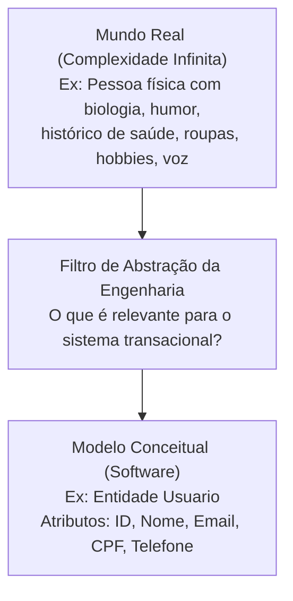
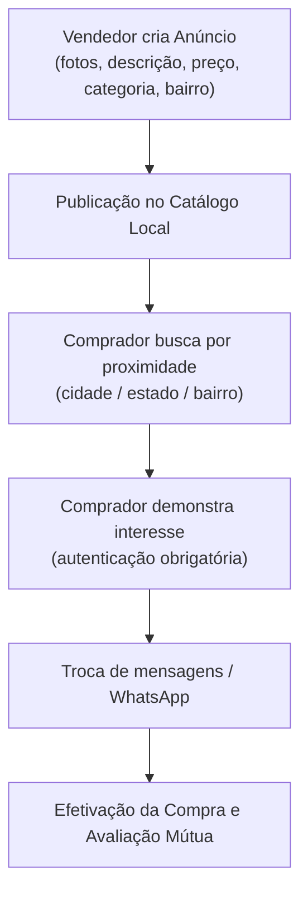
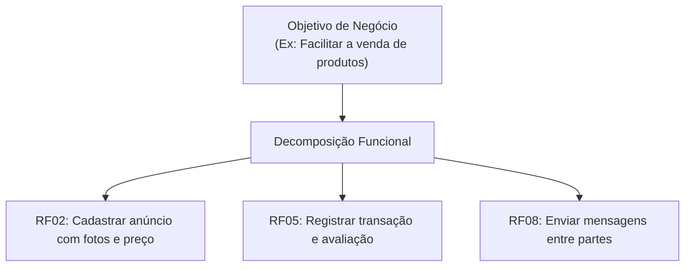
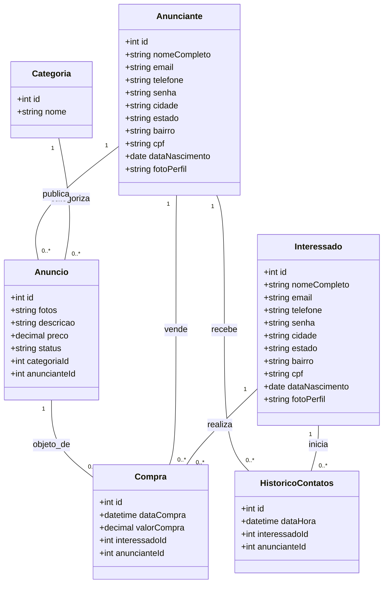
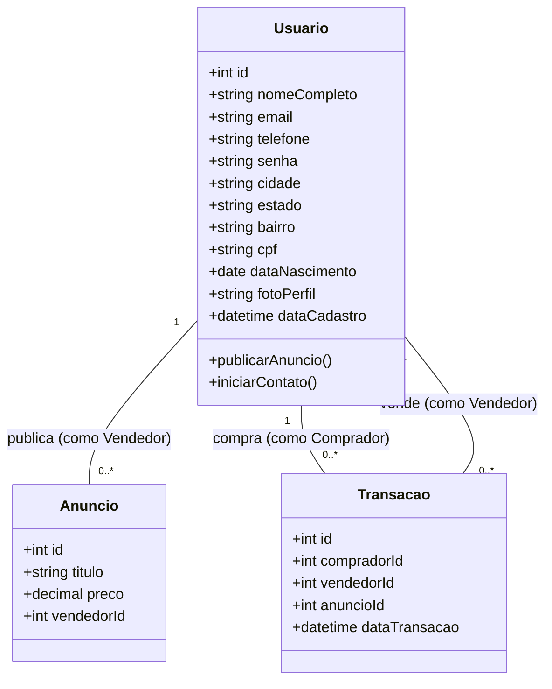
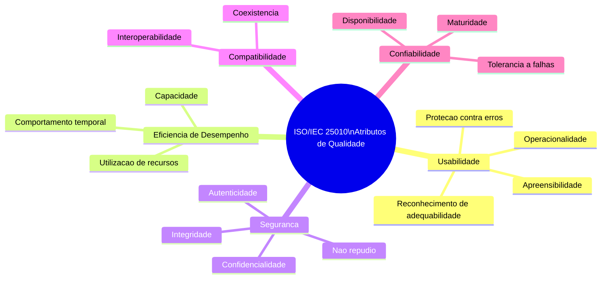
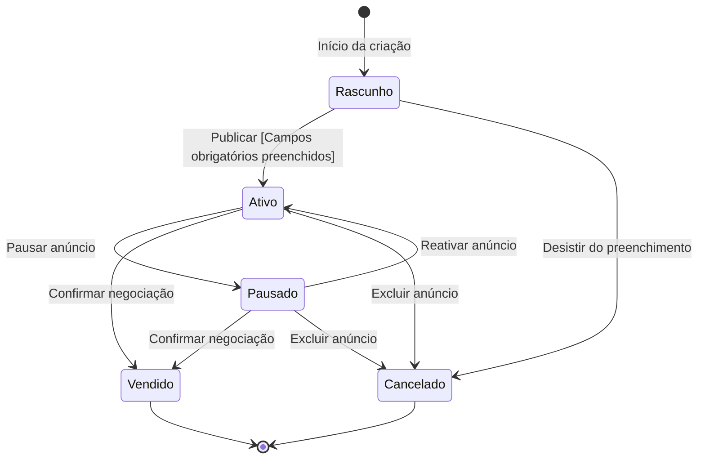
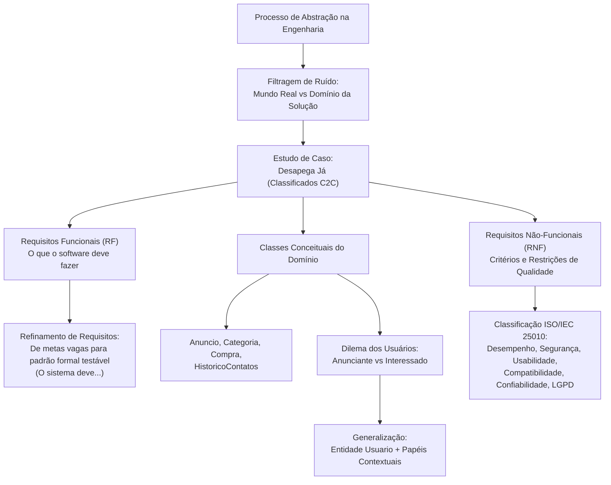

# Aula 01 — Processo de Abstração e Levantamento de Requisitos

> **Professor:** Marcelo Boer
> **Disciplina:** Engenharia de Software I (3º Semestre)
> **Tema:** O processo de abstração na engenharia de software aplicado ao estudo de caso Desapega Já, abrangendo elicitação de requisitos funcionais e não-funcionais, modelagem conceitual de dados e análise de papéis de usuários.

---

## Sumário

- [Objetivo da aula](#objetivo-da-aula)
- [Contexto e pré-requisitos](#contexto-e-pré-requisitos)
- [Conceito e aplicação do processo de abstração na modelagem de software](#conceito-e-aplicação-do-processo-de-abstração-na-modelagem-de-software)
  - [Definição formal e motivação cognitiva](#definição-formal-e-motivação-cognitiva)
  - [Níveis de abstração e filtragem de ruído](#níveis-de-abstração-e-filtragem-de-ruído)
  - [Exemplos, contraexemplos e armadilhas conceituais](#exemplos-contraexemplos-e-armadilhas-conceituais)
- [Contextualização do estudo de caso: Aplicativo móvel Desapega Já](#contextualização-do-estudo-de-caso-aplicativo-móvel-desapega-já)
  - [Cenário do problema e proposta de valor](#cenário-do-problema-e-proposta-de-valor)
  - [Escopo do produto e regras de engajamento](#escopo-do-produto-e-regras-de-engajamento)
- [Levantamento e estruturação de requisitos funcionais](#levantamento-e-estruturação-de-requisitos-funcionais)
  - [Análise crítica do levantamento preliminar](#análise-crítica-do-levantamento-preliminar)
  - [Critérios de qualidade: atomicidade, rastreabilidade e testabilidade](#critérios-de-qualidade-atomicidade-rastreabilidade-e-testabilidade)
  - [Refinamento dos requisitos funcionais brutos](#refinamento-dos-requisitos-funcionais-brutos)
- [Identificação de classes conceituais e mapeamento de atributos](#identificação-de-classes-conceituais-e-mapeamento-de-atributos)
  - [Extração de substantivos e entidades do domínio](#extração-de-substantivos-e-entidades-do-domínio)
  - [Mapeamento e tipagem de atributos preliminares](#mapeamento-e-tipagem-de-atributos-preliminares)
  - [Relacionamentos estruturais e integridade referencial](#relacionamentos-estruturais-e-integridade-referencial)
- [Definição de atores e perfis de usuários (Anunciante e Interessado)](#definição-de-atores-e-perfis-de-usuários-anunciante-e-interessado)
  - [Análise da duplicação cadastral](#análise-da-duplicação-cadastral)
  - [Abordagem por herança versus abordagem baseada em papéis](#abordagem-por-herança-versus-abordagem-baseada-em-papéis)
  - [Implicações arquiteturais e normalização](#implicações-arquiteturais-e-normalização)
- [Levantamento inicial de requisitos não-funcionais e usabilidade](#levantamento-inicial-de-requisitos-não-funcionais-e-usabilidade)
  - [O problema da subjetividade do termo 'Fácil Usabilidade'](#o-problema-da-subjetividade-do-termo-fácil-usabilidade)
  - [Classificação segundo a norma ISO/IEC 25010](#classificação-segundo-a-norma-isoiec-25010)
  - [Expansão das lacunas de requisitos não-funcionais](#expansão-das-lacunas-de-requisitos-não-funcionais)
- [Código da aula](#código-da-aula)
- [Exercícios](#exercícios)
  - [Exercício 1: Levantamento de Requisitos Não-Funcionais](#exercício-1-levantamento-de-requisitos-não-funcionais)
  - [Exercício 2: Generalização e Especialização de Usuários](#exercício-2-generalização-e-especialização-de-usuários)
  - [Exercício 3: Refinamento e Padronização de Requisitos Funcionais](#exercício-3-refinamento-e-padronização-de-requisitos-funcionais)
  - [Exercício 4: Modelagem de Estados e Regras de Negócio do Anúncio](#exercício-4-modelagem-de-estados-e-regras-de-negócio-do-anúncio)
- [Erros comuns e boas práticas](#erros-comuns-e-boas-práticas)
- [Links e materiais complementares](#links-e-materiais-complementares)
- [Mapa da aula](#mapa-da-aula)
- [Glossário](#glossário)
- [Pontos-chave para a prova](#pontos-chave-para-a-prova)
- [Perguntas e respostas (JSONL)](#perguntas-e-respostas-jsonl)
- [Checklist de revisão](#checklist-de-revisão)

---

## Objetivo da aula

- Compreender a abstração como mecanismo cognitivo fundamental da engenharia de software para redução da complexidade de problemas reais.
- Diferenciar o domínio do problema (mundo real do usuário) do domínio da solução (modelos conceituais e sistemas de software).
- Elicitar, analisar e classificar requisitos funcionais preliminares a partir de uma narrativa textual de negócio.
- Refinar requisitos brutos em especificações funcionais comportamentais, inequívocas, atômicas e testáveis segundo os padrões de engenharia.
- Identificar classes conceituais, entidades de dados e atributos essenciais para a composição de um modelo conceitual inicial.
- Analisar perfis de acesso, discutindo os impactos de modelar atores como classes especializadas versus modelá-los como papéis contextuais de uma mesma entidade base.
- Reconhecer e preencher lacunas de requisitos não-funcionais utilizando parâmetros formais de qualidade (desempenho, segurança, compatibilidade, confiabilidade e privacidade).

---

## Contexto e pré-requisitos

Para acompanhar esta aula produtivamente, o estudante deve resgatar os seguintes conceitos trabalhados em etapas anteriores do curso:
1. **Conceito de Sistema de Informação:** Conjunto estruturado de pessoas, dados, processos e tecnologia que interagem para coletar, processar, armazenar e distribuir informações com vistas a apoiar a tomada de decisão e o controle em uma organização.
2. **Ciclo de Vida de Software:** Fases fundamentais de engenharia (Concepção, Requisitos, Análise, Projeto/Design, Implementação, Testes, Implantação e Manutenção). Esta aula concentra-se estritamente na fronteira entre a Concepção e a Engenharia de Requisitos.
3. **Noções Básicas de Orientação a Objetos:** Compreensão preliminar sobre entidades, classes, atributos, métodos e associações.

*(Complemento teórico: Não é necessário domínio avançado de diagramação formal UML nesta fase, pois a ênfase é na identificação dos conceitos e no raciocínio abstrativo que antecede a codificação e a arquitetura formal de sistemas).*

---

## Conceito e aplicação do processo de abstração na modelagem de software

### Definição formal e motivação cognitiva

A abstração é a capacidade intelectual de focar nos aspectos essenciais e relevantes de um fenômeno, objeto ou processo do mundo real, ignorando temporariamente os detalhes acidentais, secundários ou irrelevantes para um contexto específico. Na engenharia de software, a abstração não é uma simplificação preguiçosa, mas uma estratégia deliberada para gerenciar a limitação de capacidade do cérebro humano diante da complexidade sistêmica (frequentemente associada ao limite de retenção cognitiva imediata da memória de trabalho, descrito na psicologia cognitiva como a Lei de Miller).

Ao transpor um problema do mundo real para um ambiente computacional, o engenheiro de software nunca cria uma cópia idêntica da realidade. Ele constrói um **modelo**. Um modelo é, por definição, uma abstração: uma representação simplificada e orientada a uma finalidade prática.



### Níveis de abstração e filtragem de ruído

No contexto do desenvolvimento de software, a abstração opera em múltiplos níveis ao longo do ciclo de desenvolvimento:

1. **Abstração do Domínio de Negócio (Nível Conceitual):** Mapeia quais entidades do mundo real possuem relevância para o negócio. Se uma pessoa vende um armário de madeira, sua cor favorita ou sua altura física são ruídos irrelevantes; entretanto, a cidade onde ela reside e o seu telefone de contato são dados essenciais para viabilizar a transação comercial.
2. **Abstração de Análise e Arquitetura (Nível Lógico):** Organiza as entidades conceituais em estruturas computacionais lógicas (diagramas de classes, diagramas entidade-relacionamento), definindo relacionamentos e cardinalidades sem vincular a tecnologia de persistência final.
3. **Abstração de Implementação (Nível Físico):** Isola detalhes de implementação (se a tabela será armazenada em PostgreSQL ou MongoDB; se a comunicação usará REST JSON ou gRPC).

A perda de foco nesses níveis gera o chamado *vazamento de abstração* (leaky abstraction), onde decisões técnicas de baixo nível acabam contaminando a modelagem do problema de negócio.

### Exemplos, contraexemplos e armadilhas conceituais

- **Exemplo Correto de Abstração:**
  No aplicativo *Desapega Já*, para cadastrar uma pessoa interessada em comprar, precisamos saber seu `nome`, `e-mail`, `telefone`, `cidade`, `estado`, `bairro` e dados de autenticação (`senha`). O sistema ignora intencionalmente o salário da pessoa, seu estado civil ou se ela possui animais de estimação, pois esses detalhes não influenciam o processo de mediação de anúncios locais.
- **Contraexemplo (Superespecificação / Excesso de Detalhes):**
  O analista decide incluir na modelagem: tipo sanguíneo do comprador, modelo do veículo utilizado para buscar o produto, e coordenadas GPS exatas capturadas a cada 10 segundos. O modelo torna-se sobrecarregado, invasivo à privacidade, custoso para implementar e dispersa o esforço da equipe em dados sem utilidade funcional imediata.
- **Contraexemplo (Subespecificação / Falta de Informações Críticas):**
  O analista define que a entidade `Anuncio` possui apenas `titulo` e `preco`. Ele esquece de abstrair o atributo `categoria` e as `fotos`. Como resultado, os compradores não conseguem filtrar itens e não sabem o estado de conservação do produto, inviabilizando a funcionalidade básica do aplicativo.
- **Armadilha Frequente:**
  Achar que abstração é apenas "ocultar código". No contexto de Engenharia de Software I, a abstração é primordialmente a decisão conceitual de **o que entra e o que fica de fora** do modelo de dados e do escopo do software.

A tabela a seguir compara o tratamento de uma entidade do mundo real sob a ótica de diferentes contextos de abstração:

| Entidade Real | Contexto: Desapega Já (Classificados) | Contexto: Sistema Hospitalar | Contexto: Sistema de RH Corporativo |
| :--- | :--- | :--- | :--- |
| **Pessoa** | `nome`, `email`, `whatsapp`, `cidade`, `bairro`, `avaliacao` | `prontuario`, `tipo_sanguineo`, `alergias`, `peso`, `historico_clinico` | `ctps`, `salario`, `cargo`, `data_admissao`, `departamento` |
| **Objeto Físico (Ex: Sofá)** | `categoria`, `fotos`, `preco`, `descricao`, `status_conservacao` | `codigo_patrimonio`, `localizacao_leito`, `data_higienizacao` | `codigo_patrimonio`, `depreciacao_fiscal`, `valor_contabil` |

---

## Contextualização do estudo de caso: Aplicativo móvel Desapega Já

### Cenário do problema e proposta de valor

O estudo de caso apresentado em aula pelo Professor Marcelo Boer tem como base o problema cotidiano do acúmulo e descarte indevido de bens duráveis e semiduráveis:
> *"Muitas pessoas possuem em casa produtos que não utilizam mais, como roupas, eletrônicos, móveis e livros, que acabam ficando guardados ou sendo descartados. Para facilitar a venda desses itens, foi idealizado o aplicativo, uma plataforma móvel prática e acessível que conecta vendedores e compradores da mesma região."*

O problema em questão envolve três grandes vertentes:
1. **Espaço e desperdício financeiro:** Itens em bom estado tornam-se ociosos e perdem valor com o tempo.
2. **Impacto socioambiental:** O descarte precoce de itens reaproveitáveis satura aterros e contraria os princípios de sustentabilidade e consumo consciente.
3. **Fricção geográfica e de confiança:** Comprar itens usados por plataformas de alcance nacional impõe fretes caros e riscos de fraude no recebimento.

A proposta de valor do **Desapega Já** é posicionar-se como uma ferramenta de **economia circular hiperlocal**: aproximar compradores e vendedores geograficamente para que a negociação possa ocorrer de maneira ágil, direta e com custos logísticos mínimos.

### Escopo do produto e regras de engajamento

Conforme narrado no documento do estudo de caso, a dinâmica da plataforma é delimitada pelas seguintes diretrizes de escopo:
- **Publicação:** Qualquer usuário habilitado pode criar anúncios informando fotos, descrição, preço e categoria.
- **Interesse e Contato:** Compradores interessados devem efetuar um cadastro simples antes de acessar os canais de contato com os vendedores.
- **Geolocalização simplificada:** A identificação do local baseia-se na declaração de `cidade`, `estado` e `bairro`, permitindo que os filtros de proximidade aproximem partes que residam no mesmo perímetro urbano.
- **Camada de Confiança e Segurança:** O sistema introduz requisitos adicionais de validação cadastral (`CPF`, `data de nascimento`) e automações de reputação (ID único, data de registro, histórico de compras/contatos e avaliações recebidas).



A tabela abaixo contrasta o modelo informal de classificados comunitários com a solução estruturada pelo Desapega Já:

| Aspecto Operacional | Negociação Informal (Ex: Redes Sociais / Grupos) | Plataforma Dedicada (Desapega Já) |
| :--- | :--- | :--- |
| **Identificação dos Usuários** | Perfis não verificados, facilidade de anonimato e perfis falsos | Cadastro estruturado com validação de CPF e histórico de reputação |
| **Descoberta de Produtos** | Feeds dinâmicos com algoritmos dispersos, difícil indexação | Filtros categorizados e segmentação geográfica por bairro/cidade |
| **Rastreabilidade** | Histórico volátil, conversas perdidas em canais diversos | Histórico estruturado de contatos, compras e avaliações gerado pelo sistema |
| **Foco Geográfico** | Alcance caótico (postagens regionais misturadas com nacionais) | Abstração intencional voltada à negociação por proximidade local |

---

## Levantamento e estruturação de requisitos funcionais

### Análise crítica do levantamento preliminar

Na primeira fase da engenharia de requisitos, é comum que as demandas apareçam na forma de anotações brutas, expressando tanto intenções de negócio quanto ações diretas do usuário. O documento original do professor apresenta a seguinte listagem inicial:

- **RF 01:** Facilitar a venda de produtos
- **RF 02:** Permitir anúncio de produtos
- **RF 03:** Permitir cadastro de pessoas interessadas nas compras
- **RF 04:** Facilitar a busca de produtos por proximidade
- **RF 05:** Gerar histórico de contatos ou compras realizadas e avaliações recebidas
- **RF 06:** Permitir cadastro de pessoas que farão a oferta de produtos
- **RF 07:** Permitir o cadastro de produtos a serem vendidos
- **RF 08:** Possibilitar troca de mensagens entre as partes interessadas

Ao analisar essa lista sob a ótica da Engenharia de Software formal, saltam aos olhos disparidades no nível de granularidade e na própria definição do que é um requisito funcional.

### Critérios de qualidade: atomicidade, rastreabilidade e testabilidade

Para que uma declaração seja considerada um requisito de software legítimo segundo padrões como o **IEEE 830** e o **ISO/IEC/IEEE 29148**, ela precisa atender a diretrizes formais:
1. **Comportamento Verificável:** O requisito deve ditar o que o software deve processar, armazenar ou exibir, e não expressar um desejo subjetivo de mercado.
2. **Atomicidade:** Cada declaração deve tratar de uma única funcionalidade indivisível.
3. **Testabilidade (Verificabilidade):** Um engenheiro de testes ou usuário deve conseguir executar um teste booleano (Passou / Falhou) para comprovar que o sistema cumpre a exigência.
4. **Padronização da Linguagem:** Recomenda-se a estrutura canônica: *"O sistema deve [ação] [objeto] [condições/parâmetros]"*.

### Refinamento dos requisitos funcionais brutos

Os itens **RF 01** (*"Facilitar a venda de produtos"*) e **RF 04** (*"Facilitar a busca de produtos por proximidade"*) são, na verdade, **objetivos de negócio** ou **metas de alto nível**, e não requisitos de software. Como um testador avalia se o sistema "facilitou"? Não há critério binário de aceitação.

Além disso, os itens **RF 02** (*"Permitir anúncio de produtos"*) e **RF 07** (*"Permitir o cadastro de produtos a serem vendidos"*) apresentam forte redundância conceitual, já que no contexto de classificados, anunciar e cadastrar o produto para venda referem-se à mesma operação fundamental. Da mesma forma, **RF 03** e **RF 06** duplicam o mecanismo de cadastro de usuários.



Abaixo, apresenta-se a tabela de engenharia que correlaciona o texto bruto levantado em aula com a sua reestruturação formal:

| ID | Requisito Bruto (Aula) | Status da Análise | Requisito Funcional Refinado (Padrão Formal) | Critério de Teste e Aceite |
| :--- | :--- | :--- | :--- | :--- |
| **RF-01** | Facilitar a venda de produtos | Inadequado (Meta de negócio) | *Reclassificado:* Meta de negócio atendida pela composição dos RF-02, RF-05 e RF-08. | Não aplicável a teste unitário direto. |
| **RF-02** | Permitir anúncio de produtos | Aceitável (Necessita refinamento) | O sistema deve permitir que o usuário autenticado publique anúncios informando: título, descrição, fotos (mínimo 1, máximo 5), preço e categoria. | O anúncio publicado torna-se visível na listagem pública com todos os dados preenchidos. |
| **RF-03** | Permitir cadastro de pessoas interessadas nas compras | Redundante com RF-06 | O sistema deve permitir o autocadastro de usuários coletando nome completo, e-mail, telefone, senha, cidade, estado, bairro, CPF e data de nascimento. | O registro é inserido na base com senha criptografada e o usuário consegue efetuar login. |
| **RF-04** | Facilitar a busca de produtos por proximidade | Inadequado (Subjetivo) | O sistema deve permitir a filtragem de anúncios com base na localização geográfica, utilizando como critério: estado, cidade e bairro do anunciante. | Ao filtrar por um bairro específico, apenas anúncios vinculados àquele bairro e cidade são retornados. |
| **RF-05** | Gerar histórico de contatos ou compras realizadas e avaliações recebidas | Composto (Múltiplas funções) | O sistema deve registrar e exibir para o usuário o histórico cronológico de contatos realizados, compras efetuadas e avaliações recebidas com nota (1 a 5). | O usuário acessa seu painel de perfil e visualiza a listagem tabular contendo data, contraparte e nota da transação. |
| **RF-06** | Permitir cadastro de pessoas que farão a oferta de produtos | Redundante com RF-03 | *Fundido ao RF-03:* O cadastro de usuários unificado atende tanto a compradores quanto a vendedores. | Validado conforme critério do RF-03. |
| **RF-07** | Permitir o cadastro de produtos a serem vendidos | Redundante com RF-02 | *Fundido ao RF-02:* O cadastro do produto ocorre de forma integrada à publicação do anúncio. | Validado conforme critério do RF-02. |
| **RF-08** | Possibilitar troca de mensagens entre as partes interessadas | Vago quanto ao canal | O sistema deve disponibilizar link direto para contato via WhatsApp do anunciante ou sistema de chat interno entre comprador e anunciante. | Ao clicar no botão de contato no anúncio, o aplicativo abre o canal de mensageria pré-configurado com mensagem contextualizada. |

---

## Identificação de classes conceituais e mapeamento de atributos

### Extração de substantivos e entidades do domínio

A técnica clássica de **Abbott** na engenharia orientada a objetos orienta que substantivos presentes na narrativa do problema representam potenciais classes conceituais, enquanto verbos sugerem comportamentos, métodos ou casos de uso.

Na documentação da aula, o Professor Marcelo Boer isolou as seguintes classes e estruturas:
1. `Anuncio`
2. `Categoria`
3. `Interessado`
4. `Anunciante`
5. `Compra`
6. `Historico de contatos`

### Mapeamento e tipagem de atributos preliminares

Analisando a descrição dos dados no documento, mapeamos os atributos indicados para cada classe conceitual:

- **Anuncio:**
  - `fotos` (Coleção de referências de imagens / URIs)
  - `descricao` (Texto descritivo do estado e detalhes do item)
  - `preco` (Valor monetário decimal)
  - `categoria` (Associação com a classe Categoria)
- **Categoria:**
  - `nome da categoria` (Identificador textual da categoria, ex.: "Roupas", "Eletrônicos")
- **Interessado:**
  - `nome completo`, `e-mail`, `número de telefone (com WhatsApp)`, `senha de acesso`, `cidade`, `estado`, `foto de perfil`, `CPF`, `data de nascimento`, `bairro`.
- **Anunciante:**
  - `nome completo`, `e-mail`, `número de telefone (com WhatsApp)`, `senha de acesso`, `cidade`, `estado`, `foto de perfil`, `CPF`, `data de nascimento`, `bairro`.
- **Compra:**
  - `data da compra` (Carimbo de data/hora)
  - `valor da compra` (Valor monetário consolidado)
  - `produtos` (Itens transacionados)
  - `interessado` (Referência ao comprador)
  - `anunciante` (Referência ao vendedor)
- **Histórico de contatos:**
  - `interessado` (Referência ao comprador que iniciou o contato)
  - `anunciante` (Referência ao anunciante que recebeu o contato)

*(Complemento teórico: Em um modelo conceitual rigoroso, atributos compostos como cidade/estado/bairro ou múltiplos valores como fotos devem ser decompostos, e chaves artificiais de identificação como IDs devem ser incorporadas para garantir rastreabilidade).*

### Relacionamentos estruturais e integridade referencial

As classes isoladas não operam em silos; elas estabelecem relações de dependência, associação e multiplicidade:
- Uma `Categoria` pode agrupar zero ou vários `Anuncios` (1 para 0..*).
- Um `Anuncio` pertence obrigatoriamente a uma única `Categoria` (1 para 1).
- Um `Anunciante` pode publicar múltiplos `Anuncios` (1 para 0..*).
- Um `Interessado` pode iniciar múltiplos contatos ou realizar múltiplas `Compras`.
- Uma `Compra` formaliza o vínculo transitório entre um `Interessado`, um `Anunciante` e um ou mais itens contidos no `Anuncio`.



A tabela a seguir consolida o inventário de atributos brutos do material da aula e as melhorias técnicas necessárias para a evolução do modelo:

| Entidade | Atributos Brutos (Aula) | Atributos Técnicos Recomendados | Tipo de Dado Recomendado | Justificativa de Engenharia |
| :--- | :--- | :--- | :--- | :--- |
| **Categoria** | `nome da categoria` | `id`, `nome`, `slug`, `ativo` | `INTEGER`, `VARCHAR(50)`, `BOOLEAN` | Permite renomear categorias sem quebrar integridade das chaves estrangeiras. |
| **Anuncio** | `fotos`, `descricao`, `preco`, `categoria` | `id`, `titulo`, `descricao`, `preco`, `data_publicacao`, `status`, `categoria_id`, `anunciante_id` | `INTEGER`, `VARCHAR(100)`, `TEXT`, `DECIMAL(10,2)`, `TIMESTAMP`, `VARCHAR(20)` | Adiciona título para busca, controle temporal e máquina de estados do ciclo do anúncio. |
| **Compra** | `data da compra`, `valor da compra`, `produtos`, `interessado`, `anunciante` | `id`, `anuncio_id`, `comprador_id`, `vendedor_id`, `data_compra`, `valor_final`, `forma_pagamento` | `INTEGER`, `INTEGER`, `INTEGER`, `TIMESTAMP`, `DECIMAL(10,2)`, `VARCHAR(30)` | Desassocia os dados em chaves estrangeiras atômicas e registra o valor real fechado. |
| **Histórico Contatos** | `interessado`, `anunciante` | `id`, `comprador_id`, `vendedor_id`, `anuncio_id`, `data_hora`, `canal` | `INTEGER`, `INTEGER`, `INTEGER`, `TIMESTAMP`, `VARCHAR(20)` | Fundamental vincular a qual anúncio o contato se referia e em qual instante ocorreu. |

---

## Definição de atores e perfis de usuários (Anunciante e Interessado)

### Análise da duplicação cadastral

Um dos momentos mais ricos de análise crítica provocados pelo material do Professor Marcelo Boer ocorre na comparação das duas classes de usuários:

- **Atributos de Interessado:** `nome completo`, `e-mail`, `número de telefone (com WhatsApp, se houver)`, `senha de acesso`, `cidade e estado`, `foto de perfil`, `CPF`, `data de nascimento e bairro`.
- **Atributos de Anunciante:** `nome completo`, `e-mail`, `número de telefone (com WhatsApp, se houver)`, `senha de acesso`, `cidade e estado`, `foto de perfil`, `CPF`, `data de nascimento e bairro`.

Constata-se uma **identidade cadastral absoluta (100% de coincidência nos atributos)**. Modelar o sistema criando duas tabelas ou entidades separadas (`Anunciante` e `Interessado`) no banco de dados gera graves anomalias de engenharia:
1. **Redundância Estrutural:** Duplicação desnecessária de esquemas de banco e código de manipulação (CRUD duplicado).
2. **Inconsistência de Dados:** Se um cidadão cadastra-se como comprador e depois decide vender um violão, ele seria forçado a realizar um segundo cadastro, gerando dois e-mails ou duplicando o mesmo CPF na base.
3. **Impossibilidade de Unificação de Reputação:** O histórico de avaliações ficaria fragmentado: a pessoa poderia ter ótima pontuação como vendedora, mas sua reputação seria invisível quando atuasse como compradora.

### Abordagem por herança versus abordagem baseada em papéis

Para solucionar essa duplicação, o processo de abstração oferece duas abordagens clássicas de modelagem:

#### Abordagem 1: Generalização / Especialização (Herança)
Cria-se uma superclasse abstrata `Usuario` com todos os atributos comuns. `Anunciante` e `Interessado` herdam de `Usuario`.
- *Vantagem:* Elimina a duplicação no código das classes.
- *Desvantagem:* Na maioria dos paradigmas orientados a objetos clássicos e em bancos de dados relacionais, um objeto não pode mudar de classe em tempo de execução sem ser recriado. Se um `Interessado` quiser anunciar, o polimorfismo por herança engessa a evolução do objeto.

#### Abordagem 2: Modelo Unificado com Papéis Dinâmicos (Role Pattern / Ator Contextual)
Define-se uma única classe concreta `Usuario`. Os termos "Anunciante" e "Interessado" deixam de ser classes e passam a ser **papéis** (roles) que um mesmo usuário desempenha temporariamente no contexto de uma transação.
- Ao publicar um item, o `Usuario` atua no papel de **Vendedor/Anunciante**.
- Ao pesquisar e negociar um item, o `Usuario` atua no papel de **Comprador/Interessado**.



### Implicações arquiteturais e normalização

A unificação de atores em uma única entidade `Usuario` com papéis contextuais adere às regras fundamentais de normalização e traz benefícios diretos à arquitetura de software:
- **Autenticação Centralizada:** Uma única rotina de login, token JWT ou controle de sessão.
- **Rastreabilidade Holística:** O atributo automatizado citado no PDF (*"histórico de contatos ou compras realizadas e avaliações recebidas"*) passa a pertencer naturalmente ao `Usuario`, consolidando seu histórico global na plataforma.
- **Conformidade com a LGPD:** O gerenciamento do consentimento do titular de dados, alteração de senha e exclusão da conta ocorre em um único registro unificado por CPF/E-mail.

A tabela abaixo compara os três caminhos arquiteturais possíveis:

| Abordagem de Modelagem | Complexidade de Banco | Flexibilidade para o Usuário | Custo de Manutenção | Recomendação Técnica |
| :--- | :--- | :--- | :--- | :--- |
| **Classes Separadas (PDF Preliminar)** | Alta (duas tabelas idênticas, sincronização complexa) | Péssima (usuário precisa de dois logins se quiser vender e comprar) | Muito Alto (mudanças cadastrais precisam ser replicadas) | **Rejeitar:** Viola o princípio DRY (Don't Repeat Yourself). |
| **Herança (Superclasse Usuario)** | Média (requer estratégias ORM como Single Table ou Joined) | Fraca (difícil transição de instância de Interessado para Anunciante) | Médio (herança estática gera acoplamento) | **Aceitável:** Apenas se houver comportamentos e atributos estritamente exclusivos no futuro. |
| **Entidade Única + Papéis Contextuais** | Baixa (uma tabela de usuários, chaves estrangeiras contextuais) | Excelente (qualquer usuário compra e vende com a mesma conta) | Mínimo (CRUD unificado, validação única de segurança) | **Recomendada:** Padrão de mercado para sistemas de classificados e e-commerce C2C. |

---

## Levantamento inicial de requisitos não-funcionais e usabilidade

### O problema da subjetividade do termo 'Fácil Usabilidade'

No anexo da aula, o levantamento de requisitos não-funcionais apresenta apenas o primeiro item:
> **01:** Fácil usabilidade  
> *(Itens 02 a 08 deixados em branco)*

Dizer que um software deve ter "fácil usabilidade" é um erro clássico na engenharia de requisitos. Trata-se de uma declaração puramente subjetiva, vaga e **não testável**. O que é fácil para um jovem habituado a smartphones pode ser extremamente complexo para um idoso em seu primeiro contato com aplicativos de compra e venda.

Para que um requisito não-funcional tenha validade técnica, ele deve ser expresso por meio de **métricas objetivas** e verificáveis. No caso da usabilidade, critérios aceitos pela literatura (como Nielsen e a ISO 9241-11) incluem:
- **Tempo de conclusão de tarefa:** "Um usuário novato deve conseguir publicar um anúncio completo em menos de 3 minutos."
- **Taxa de erro:** "A taxa de desistência ou erros no fluxo de cadastro não deve ultrapassar 5% dos acessos."
- **Capacidade de aprendizado:** "Um usuário deve conseguir localizar um produto desejado através do filtro por bairro em no máximo 4 toques na tela."

### Classificação segundo a norma ISO/IEC 25010

*(Complemento teórico: Na engenharia de software contemporânea, os Requisitos Não-Funcionais (RNFs) ou atributos de qualidade são padronizados pelo modelo de qualidade da norma ISO/IEC 25010 (que sucedeu a ISO/IEC 9126). Essa norma divide a qualidade do produto de software em 8 grandes características).*



### Expansão das lacunas de requisitos não-funcionais

Diante da necessidade de completar as posições de 02 a 08 da tabela da aula, o engenheiro de software deve levantar as restrições que tornam o *Desapega Já* viável em um ambiente de produção real. A tabela a seguir preenche essas lacunas, associando cada RNF à sua classificação formal na ISO/IEC 25010, sua especificação mensurável e a forma de validação:

| N° | Categoria (ISO 25010) | Requisito Não-Funcional Proposto | Métrica e Parâmetro Técnico | Método de Verificação / Teste |
| :--- | :--- | :--- | :--- | :--- |
| **01** | **Usabilidade** | Interface intuitiva para publicação de itens e recuperação de compras. | Taxa de conclusão de cadastro de anúncio > 90% por usuários em testes cegos, sem auxílio externo, em menos de 180 segundos. | Teste de usabilidade em laboratório / monitoramento de telemetria analítica de funil. |
| **02** | **Desempenho** | Tempo de resposta para consultas de catálogo e buscas por proximidade. | Tempo de renderização do feed de anúncios locais não deve exceder 2 segundos sob conexão 4G padrão para 95% das requisições (percentil p95). | Teste de carga e estresse com Apache JMeter / k6 simulando 1.000 requisições simultâneas. |
| **03** | **Segurança (Confidencialidade)** | Proteção de credenciais de acesso e dados cadastrais sensíveis. | As senhas devem ser armazenadas com hash criptográfico seguro (bcrypt/Argon2) e todas as transações HTTP devem usar TLS 1.3 obrigatório. | Análise estática de código (SAST), auditoria de segurança e teste de intrusão (pentest). |
| **04** | **Segurança e Privacidade (LGPD)** | Proteção a dados pessoais sensíveis exigidos no cadastro (CPF e Data de Nascimento). | O CPF deve ser armazenado com criptografia em repouso (AES-256) e mascarado na visualização pública (apenas os dígitos finais exibidos). | Auditoria de conformidade com a LGPD e inspeção de esquemas de banco e endpoints de API. |
| **05** | **Compatibilidade e Portabilidade** | Suporte às plataformas móveis predominantes no mercado nacional. | O aplicativo deve ser compatível e manter paridade visual em versões Android 10+ e iOS 15+, em telas de 4,7 a 6,8 polegadas. | Bateria de testes em esteira de integração contínua (CI/CD) utilizando Device Farm / Emuladores. |
| **06** | **Confiabilidade e Disponibilidade** | Continuidade de operação do catálogo e serviços de mensagens. | O sistema deve apresentar disponibilidade mínima de 99,5% (uptime) durante o horário comercial (08:00 às 22:00), equivalente a no máximo 4,3 horas de parada mensal. | Monitoramento sintético com APM (Application Performance Monitoring) e alertas de infraestrutura. |
| **07** | **Eficiência de Recursos Móveis** | Economia no consumo de pacote de dados e bateria do smartphone. | O download inicial do aplicativo não deve exceder 35 MB e as imagens de anúncios devem ser comprimidas automaticamente no servidor para o formato WebP (máx. 150 KB por foto). | Inspeção de build no Android Studio / Xcode e análise de tráfego de rede via Charles Proxy. |
| **08** | **Confiabilidade (Tolerância a Falhas)** | Resiliência em conexões móveis intermitentes ou instáveis. | Em caso de perda repentina de sinal durante a criação do anúncio, os dados de texto digitados devem ser retidos em cache local (persistência offline). | Teste de corte abrupto de rede no dispositivo simulando alternância entre Wi-Fi e modo avião. |

---

## Código da aula

Embora a aula em questão tenha tido foco na elicitação conceitual e no processo de abstração analítica sem entrega de arquivos executáveis pelo professor, a engenharia de software exige a capacidade de traduzir modelos conceituais em estruturas de dados sólidas e manuteníveis.

Abaixo, apresenta-se a concretização do modelo conceitual refinado do *Desapega Já* em código **Python 3** moderno, aplicando tipagem estática (`typing`), estruturas imutáveis (`dataclasses`), controle de estados (`Enum`) e encapsulamento dos dados abstraídos:

```python
"""
Estudo de Caso: Desapega Já
Módulo de Domínio Conceitual Refinado

Demonstração prática da aplicação de abstração:
- Unificação de Anunciante e Interessado na entidade base Usuario
- Tipagem rigorosa dos dados cadastrais
- Ciclo de vida controlado para o Anúncio
- Associação entre classes conceituais
"""

from dataclasses import dataclass, field
from datetime import date, datetime
from decimal import Decimal
from enum import Enum
from typing import List, Optional


class StatusAnuncio(Enum):
    """Representa a máquina de estados do ciclo de vida de um anúncio."""
    RASCUNHO = "rascunho"
    ATIVO = "ativo"
    PAUSADO = "pausado"
    VENDIDO = "vendido"
    CANCELADO = "cancelado"


class Categoria(Enum):
    """Categorias essenciais abstraídas do escopo do problema."""
    ROUPAS = "Roupas"
    ELETRONICOS = "Eletrônicos"
    MOVEIS = "Móveis"
    LIVROS = "Livros"
    OUTROS = "Outros"


@dataclass
class Localizacao:
    """Abstração dos dados de proximidade geográfica."""
    cidade: str
    estado: str
    bairro: str


@dataclass
class Usuario:
    """
    Abstração unificada que consolida tanto o papel de Comprador (Interessado)
    quanto o papel de Vendedor (Anunciante), eliminando duplicidade cadastral.
    """
    id: int
    nome_completo: str
    email: str
    telefone_whatsapp: str
    senha_hash: str
    localizacao: Localizacao
    cpf: str
    data_nascimento: date
    foto_perfil_url: Optional[str] = None
    data_cadastro: datetime = field(default_factory=datetime.now)
    avaliacoes_recebidas: List[int] = field(default_factory=list)

    @property
    def reputacao_media(self) -> float:
        """Calcula a média das notas de avaliação recebidas pelo usuário."""
        if not self.avaliacoes_recebidas:
            return 5.0  # Reputação inicial padrão
        return sum(self.avaliacoes_recebidas) / len(self.avaliacoes_recebidas)


@dataclass
class Anuncio:
    """
    Entidade central do marketplace. Representa o produto publicado
    e suas regras de comercialização.
    """
    id: int
    vendedor_id: int
    titulo: str
    descricao: str
    preco: Decimal
    categoria: Categoria
    fotos_urls: List[str]
    status: StatusAnuncio = StatusAnuncio.ATIVO
    data_criacao: datetime = field(default_factory=datetime.now)

    def pausar(self) -> None:
        """Transita o anúncio para pausado, ocultando-o das buscas."""
        if self.status != StatusAnuncio.ATIVO:
            raise ValueError("Apenas anúncios ativos podem ser pausados.")
        self.status = StatusAnuncio.PAUSADO

    def marcar_como_vendido(self) -> None:
        """Finaliza a oferta do produto após a conclusão da negociação."""
        if self.status not in (StatusAnuncio.ATIVO, StatusAnuncio.PAUSADO):
            raise ValueError("Anúncio cancelado ou já finalizado não pode ser vendido.")
        self.status = StatusAnuncio.VENDIDO


@dataclass
class HistoricoContato:
    """Registra a intenção de negociação iniciada por um comprador."""
    id: int
    anuncio_id: int
    comprador_id: int
    vendedor_id: int
    data_hora: datetime = field(default_factory=datetime.now)
    canal_utilizado: str = "WhatsApp"


@dataclass
class Compra:
    """Registra a efetivação transacional entre as partes."""
    id: int
    anuncio_id: int
    comprador_id: int
    vendedor_id: int
    valor_pago: Decimal
    data_compra: datetime = field(default_factory=datetime.now)
    nota_avaliacao_vendedor: Optional[int] = None
```

---

## Exercícios

### Exercício 1: Levantamento de Requisitos Não-Funcionais

**Enunciado:**  
Com base no estudo de caso do aplicativo móvel *Desapega Já*, complete a tabela de levantamento de requisitos não-funcionais preenchendo os itens de 02 a 08 que foram deixados em aberto pelo professor. Em sua resposta, você deve contemplar critérios técnicos formais (como desempenho, segurança de dados, compatibilidade, confiabilidade e proteção à privacidade) e formular cada requisito de forma mensurável (com parâmetros numéricos de teste), evitando expressões subjetivas.

**Raciocínio de Resolução:**  
1. Identificar as restrições arquiteturais inerentes a um aplicativo móvel de classificados locais (rede móvel intermitente, armazenamento em celular, proteção de dados de pessoas físicas).
2. Recorrer às dimensões de qualidade de software consagradas pela norma ISO/IEC 25010.
3. Estabelecer métricas quantificáveis (tempo em segundos, porcentagem de disponibilidade, tamanho em megabytes, algoritmos criptográficos específicos).

**Resolução Comentada:**  
Os itens de 02 a 08 são formalizados da seguinte forma:
- **RNF-02 (Desempenho - Latência de Resposta):** O motor de busca e filtragem por bairro/cidade deve retornar a listagem de anúncios em tempo inferior a 2,0 segundos para 95% das consultas sob conexão 4G.
  *Comentário:* Garante que a experiência do usuário móvel não seja prejudicada por latência no banco de dados.
- **RNF-03 (Segurança - Criptografia em Trânsito e Repouso):** O aplicativo deve comunicar-se com os servidores exclusivamente via protocolo HTTPS utilizando TLS 1.3, e todas as senhas de usuários devem ser transformadas por algoritmo de hash com salt (Argon2id ou BCrypt com custo >= 12).
  *Comentário:* Elimina riscos de interceptação de tráfego (man-in-the-middle) e vazamento de credenciais.
- **RNF-04 (Segurança e Privacidade - Conformidade com LGPD):** O CPF e a data de nascimento do usuário devem ser armazenados em banco com criptografia simétrica AES-256 e nunca devem ser trafegados em respostas de API destinadas a consultas públicas de perfil.
  *Comentário:* O CPF é exigido para segurança, mas sua exposição viola a Lei Geral de Proteção de Dados (Lei 13.709/2018).
- **RNF-05 (Portabilidade e Compatibilidade):** A interface do aplicativo deve operar com paridade de layout e funções em sistemas operacionais Android (versão 10.0 ou superior) e iOS (versão 15.0 ou superior).
  *Comentário:* Garante cobertura para a esmagadora maioria do parque de dispositivos ativos no Brasil.
- **RNF-06 (Confiabilidade e Disponibilidade):** A infraestrutura de backend da plataforma deve apresentar índice de disponibilidade (uptime) de no mínimo 99,7% ao mês, tolerando no máximo 2,16 horas de indisponibilidade não planejada mensal.
  *Comentário:* Permite que os usuários confiem na plataforma para negociações em tempo real.
- **RNF-07 (Eficiência de Recursos - Consumo de Armazenamento e Rede):** O pacote de instalação do aplicativo não deve ultrapassar 40 MB e todas as imagens anexadas pelos anunciantes devem passar por compressão prévia no aparelho ou no servidor para WebP com resolução máxima de 1080p e tamanho inferior a 200 KB por arquivo.
  *Comentário:* Preserva a memória do smartphone do usuário e não esgota sua franquia de dados móveis.
- **RNF-08 (Confiabilidade e Tolerância a Falhas):** O formulário de anúncio deve implementar persistência local temporária (cache local/SQLite/SharedPreferences), de modo que, se a conexão cair durante a edição, o usuário não perca os dados digitados ao reabrir a tela.
  *Comentário:* Evita frustração e abandono da plataforma em áreas de sinal instável.

---

### Exercício 2: Generalização e Especialização de Usuários

**Enunciado:**  
Ao analisar as classes conceituais *Anunciante* e *Interessado* no material da aula, nota-se que ambas compartilham exatamente os mesmos dados cadastrais (nome completo, e-mail, telefone com WhatsApp, senha, cidade, estado, foto, CPF, nascimento e bairro). Aplique o conceito de abstração para propor uma classe base unificada (generalização) e discuta fundamentadamente se *Anunciante* e *Interessado* devem ser implementadas como subclasses especializadas (herança) ou como papéis contextuais desempenhados por um mesmo usuário.

**Raciocínio de Resolução:**  
1. Avaliar o princípio de não-repetição (DRY).
2. Compreender a natureza do comportamento de compra e venda em plataformas C2C (Consumer-to-Consumer): uma pessoa que vende uma camisa hoje pode querer comprar um livro amanhã.
3. Analisar o impacto da herança rígida versus a flexibilidade de papéis/interfaces.

**Resolução Comentada:**  
A generalização correta é a definição da entidade `Usuario`, que encapsula todos os dados cadastrais, documentais e de localização compartilhados.

Quanto à decisão entre herança (especialização) e papéis contextuais:
- **Inadequação da Herança Estática:** Se modelarmos `class Anunciante extends Usuario` e `class Interessado extends Usuario`, um usuário físico que se cadastra inicialmente para comprar um eletrônico torna-se uma instância de `Interessado`. Caso esse mesmo indivíduo decida posteriormente anunciar uma mesa usada, a arquitetura orientada a objetos convencional forçaria uma de três aberrações:
  1. A criação de um segundo cadastro para a mesma pessoa física (duplicando seu CPF e gerando fricção de login).
  2. A exclusão da instância anterior e recriação como `Anunciante` (perdendo o histórico de compras).
  3. A adoção de herança múltipla (se a linguagem permitir), criando nós complexos no grafo de tipos.
- **Adequação do Modelo Baseado em Papéis (Role-Based Design):** Em sistemas de classificados C2C, **comprar e vender não são identidades permanentes, mas papéis efêmeros**. Portanto, a melhor decisão de engenharia é manter uma única classe e tabela concreta `Usuario`.
- A distinção entre anunciante e interessado é puramente **relacional e contextual**:
  - Quando o `Usuario` possui chave estrangeira apontando como proprietário de um `Anuncio`, ele está desempenhando o papel de Anunciante.
  - Quando o `Usuario` possui chave estrangeira em um `HistoricoContato` ou `Compra`, ele está desempenhando o papel de Interessado/Comprador.

---

### Exercício 3: Refinamento e Padronização de Requisitos Funcionais

**Enunciado:**  
Os requisitos funcionais apresentados como item 01 (*"Facilitar a venda de produtos"*) e item 04 (*"Facilitar a busca de produtos por proximidade"*) no levantamento preliminar da aula estão formulados como objetivos gerais de negócio em vez de requisitos de software verificáveis. Reescreva-os no padrão formal de engenharia (*"O sistema deve..."*), tornando-os comportamentais, atômicos, mensuráveis e testáveis.

**Raciocínio de Resolução:**  
1. Decompor a declaração genérica na ação computacional precisa que o software deve executar.
2. Identificar entradas (inputs), processamento/regras e saídas (outputs).
3. Aplicar o padrão canônico de redação de requisitos (sujeito + verbo imperativo + objeto + critérios de restrição).

**Resolução Comentada:**  

- **Refinamento do RF 01 ("Facilitar a venda de produtos"):**  
  *Diagnóstico:* "Facilitar a venda" é uma aspiração de negócio, não uma função computacional. Uma máquina não sabe como "facilitar"; ela sabe como receber dados, armazenar e disponibilizar para consulta.  
  *Reescrita Formal Decomposta em Requisitos Específicos:*
  - **RF-01.1:** O sistema deve permitir que o usuário autenticado publique anúncios informando título, descrição, categoria predefinida, preço e até 5 fotografias.
  - **RF-01.2:** O sistema deve fornecer um painel de gerenciamento onde o anunciante possa editar os dados do anúncio, pausar sua exibição pública ou marcá-lo como "Vendido".
  - **RF-01.3:** O sistema deve disponibilizar na página do anúncio um atalho de redirecionamento para o WhatsApp do anunciante contendo uma mensagem automática com o título do anúncio e o nome do interessado.

- **Refinamento do RF 04 ("Facilitar a busca de produtos por proximidade"):**  
  *Diagnóstico:* "Facilitar a busca" é impreciso. O engenheiro de software precisa saber quais campos são consultados, qual é o algoritmo de ordenação ou filtragem e o que acontece quando não há resultados locais.  
  *Reescrita Formal:*
  - **RF-04.1:** O sistema deve permitir que o usuário filtre os anúncios ativos selecionando obrigatoriamente um Estado (UF) e uma Cidade, e opcionalmente um ou mais Bairros específicos.
  - **RF-04.2:** O sistema deve ordenar os anúncios retornados na busca por proximidade priorizando os registros cadastrados no mesmo bairro do usuário autenticado, seguidos pelos demais bairros da mesma cidade.
  - **RF-04.3:** O sistema deve exibir mensagem clara de "Nenhum produto encontrado na sua região" caso a busca não retorne resultados para o filtro de bairro selecionado, sugerindo a expansão da busca para toda a cidade.

---

### Exercício 4: Modelagem de Estados e Regras de Negócio do Anúncio

**Enunciado:**  
A classe conceitual `Anuncio` necessita controlar rigorosamente o ciclo de vida do item ofertado na plataforma para evitar que produtos já negociados continuem sendo exibidos no catálogo. Identifique os atributos e métodos adicionais indispensáveis para gerenciar o estado da publicação e elabore um diagrama de transição de estados demonstrando as fases possíveis de um anúncio (ex.: Rascunho, Ativo, Pausado, Vendido e Cancelado), descrevendo as regras de negócio de cada transição.

**Raciocínio de Resolução:**  
1. Definir o ciclo natural de vida de uma publicação comercial em aplicativo móvel.
2. Determinar as condições de guarda (guard conditions) que autorizam uma mudança de estado (ex.: o anúncio só fica ativo se tiver fotos e preço válido).
3. Construir a representação visual em diagrama de estados UML.

**Resolução Comentada:**  
Para suportar essa governança, a classe `Anuncio` deve incorporar:
- Atributos adicionais: `status: EnumStatusAnuncio`, `dataPublicacao: DateTime`, `dataExpiracao: DateTime`, `motivoCancelamento: String`.
- Métodos de controle: `publicar()`, `pausar()`, `reativar()`, `finalizarVenda()`, `cancelar()`.

Regras de negócio das transições:
1. **Criação -> Rascunho:** O usuário inicia a inclusão dos dados, mas ainda não anexou fotos ou não salvou os dados finais. O anúncio não é visível publicamente.
2. **Rascunho -> Ativo:** Disparado pela ação "Publicar". Condição de guarda: exige título, pelo menos 1 foto, preço maior que zero e categoria vinculada. Torna-se visível nas buscas.
3. **Ativo -> Pausado:** O anunciante opta por suspender a exibição temporariamente (ex.: está em negociação avançada com alguém). O anúncio sai do catálogo público.
4. **Pausado -> Ativo:** O anunciante clica em "Reativar". O produto volta a ser listado nas buscas locais.
5. **Ativo/Pausado -> Vendido:** O anunciante confirma a conclusão da transação. O anúncio é congelado para edições e mantido apenas para histórico de compras e avaliações.
6. **Qualquer Estado -> Cancelado:** O anunciante ou o administrador do sistema exclui a publicação por infração ou desistência. É um estado final (não pode ser reativado).



---

## Erros comuns e boas práticas

### Erros conceituais frequentes observados em alunos

1. **Confundir Requisito Funcional com Objetivo Estratégico:**
   - *Erro:* "RF-01: Aumentar o faturamento dos moradores do bairro." (Objetivo de impacto social/negócio, não é função do software).
   - *Correção:* "RF-01: O sistema deve permitir a publicação de ofertas de produtos com exibição pública de preços e contato."
2. **Subespecificação nos Requisitos Não-Funcionais:**
   - *Erro:* "O aplicativo deve ser rápido e seguro."
   - *Correção:* Especificar métricas exatas: latência de busca abaixo de 2s para 95% das requisições; armazenamento seguro de credenciais com BCrypt e TLS 1.3.
3. **Modelagem Baseada em Cópias em Vez de Abstração:**
   - *Erro:* Criar classes distintas para cada tipo de produto no início da modelagem (`AnuncioDeMovel`, `AnuncioDeLivro`, `AnuncioDeRoupa`), inchando o modelo desnecessariamente antes de identificar atributos verdadeiramente divergentes.
   - *Correção:* Criar a classe generalizada `Anuncio` associada a uma entidade `Categoria`.
4. **Acoplamento Precoce de Tecnologia no Modelo Conceitual:**
   - *Erro:* "A classe Anuncio terá um atributo JSONB no Postgres e chamará a biblioteca Retrofit no Android."
   - *Correção:* Manter o modelo no nível conceitual/lógico; detalhes de frameworks e drivers de banco pertencem à fase de projeto físico.

### Boas práticas de engenharia de requisitos e modelagem

- **Princípio DRY (Don't Repeat Yourself):** Sempre que duas ou mais classes apresentarem conjuntos de atributos idênticos, investigue imediatamente a oportunidade de generalização ou de transformação em papéis contextuais.
- **Rastreabilidade Bidirecional:** Cada classe conceitual deve justificar sua existência amparada em pelo menos um requisito funcional elicidado.
- **Critério SMART para Requisitos:** Todo requisito funcional ou não-funcional deve ser *Specific* (Específico), *Measurable* (Mensurável), *Achievable* (Atingível), *Relevant* (Relevante) e *Time-bound / Testable* (Testável).
- **Proteção desde a Concepção (Privacy by Design):** Ao abstrair dados pessoais para o modelo de domínio (como CPF e data de nascimento), considere de antemão a minimização de dados e os princípios da LGPD, armazenando apenas o estritamente indispensável para a segurança do negócio.

---

## Links e materiais complementares

- **Norma ISO/IEC 25010 (Systems and software Quality Requirements and Evaluation - SQuaRE):** Modelo internacional para classificação e especificação de características de qualidade de software (Requisitos Não-Funcionais).
  *Conteúdo:* Descreve formalmente as 8 dimensões de qualidade (Desempenho, Usabilidade, Segurança, Confiabilidade, Manutenibilidade, Portabilidade, Compatibilidade e Adequação Funcional).
- **Guia do Guia de Engenharia de Software SWEBOK (Software Engineering Body of Knowledge - IEEE Computer Society):** Capítulo dedicado à Engenharia de Requisitos.
  *Conteúdo:* Detalha o ciclo de elicitação, análise, especificação, validação e gerenciamento de requisitos de software.
- **Livro "Engenharia de Software: Uma Abordagem Profissional" (Roger S. Pressman & Bruce R. Maxim):** Capítulo sobre Modelagem de Requisitos e Abstração de Classes.
  *Conteúdo:* Explica o método de extração de classes gramaticais e a estruturação de cenários de uso.
- **Livro "Utilizando UML e Padrões" (Craig Larman):** Seção sobre Modelos de Domínio Conceituais e Padrões GRASP.
  *Conteúdo:* Demonstração passo a passo de como sair da narrativa textual de um cliente e construir o primeiro diagrama de classes do domínio sem cometer vícios de codificação precoce.
- **Autoridade Nacional de Proteção de Dados (ANPD) - Guia Orientativo da LGPD:** Orientações sobre tratamento de dados pessoais no desenvolvimento de aplicações digitais brasileiras.
  *Conteúdo:* Regras de conformidade para coleta e armazenamento de CPF, e-mail e dados de geolocalização.

---

## Mapa da aula



---

## Glossário

| Termo | Definição no Contexto de Engenharia de Software |
| :--- | :--- |
| **Abstração** | Processo cognitivo de isolar os aspectos essenciais de uma entidade ou processo do mundo real, ignorando detalhes contingentes e irrelevantes para o contexto do software. |
| **Ator** | Entidade externa (pessoa, hardware ou outro sistema) que interage diretamente com o software desempenhando um papel específico. |
| **Classe Conceitual** | Representação abstrata de um conceito do mundo real ou do domínio de negócio no modelo de análise, congregando dados e comportamentos afins. |
| **Domínio do Problema** | O contexto real do usuário, suas regras de negócio, desafios e processos antes ou independentemente da automação digital. |
| **Domínio da Solução** | A representação técnica computacional (modelos, classes, código, bancos de dados) projetada para resolver o problema. |
| **Generalização** | Mecanismo de modelagem que unifica características e comportamentos comuns de várias entidades em uma entidade de nível mais alto (superclasse). |
| **ISO/IEC 25010** | Padrão normativo internacional que estabelece uma taxonomia para estruturar e avaliar os atributos de qualidade de produtos de software. |
| **LGPD** | Lei Geral de Proteção de Dados Pessoais (Lei Federal nº 13.709/2018), que regulamenta o tratamento de dados de pessoas físicas no Brasil. |
| **Papel (Role)** | Comportamento ou conjunto de permissões temporárias assumidas por uma entidade no contexto de uma transação específica, sem alterar sua estrutura permanente. |
| **Princípio DRY** | *Don't Repeat Yourself* (Não se repita). Princípio de engenharia que determina que cada elemento de conhecimento do sistema deve possuir uma representação única e inequívoca. |
| **Requisito Funcional (RF)** | Declaração técnica que descreve uma ação, comportamento, serviço ou transformação de dados que o software deve obrigatoriamente executar. |
| **Requisito Não-Funcional (RNF)** | Declaração que impõe restrições de qualidade, operacionais, normativas ou ambientais sobre as funções fornecidas pelo sistema. |
| **Testabilidade** | Propriedade de um requisito ou componente de software que possibilita a elaboração de procedimentos objetivos para comprovar sua conformidade. |

---

## Pontos-chave para a prova

1. **Definição de Abstração:** Não responda apenas que é "esconder dados". Abstração é a capacidade de selecionar os elementos estritamente necessários do mundo real para construir um modelo computacional adequado a uma finalidade específica.
2. **Diferença entre Meta de Negócio e Requisito Funcional:** Expressões genéricas como *"O software deve ser prático"* ou *"O sistema deve facilitar a venda"* são metas comerciais de alto nível. Requisitos funcionais exigem a fórmula *"O sistema deve [fazer algo verificável]"*.
3. **Resolução de Redundância Cadastral:** Em sistemas C2C (como o *Desapega Já*), compradores e vendedores compartilham a totalidade dos atributos cadastrais. A resposta correta na modelagem é criar a entidade genérica `Usuario` e tratar comprador e vendedor como **papéis contextuais**, evitando tabelas separadas ou hierarquias engessadas de herança.
4. **Subjetividade em Requisitos Não-Funcionais:** Nunca utilize termos como "fácil", "rápido", "robusto" ou "amigável" de forma isolada ao especificar um RNF. Sempre associe uma **métrica mensurável** (ex: tempo em segundos, percentual de acerto, disponibilidade de 99,5%, conformidade com TLS 1.3).
5. **Classificação ISO/IEC 25010:** Saiba enquadrar requisitos não-funcionais em suas famílias formais: Desempenho, Usabilidade, Segurança, Compatibilidade, Confiabilidade, Manutenibilidade e Portabilidade.

---

## Perguntas e respostas (JSONL)

```jsonl
{"pergunta": "O que e abstracao no contexto da engenharia de software e qual sua principal motivacao?", "resposta": "E a habilidade de isolar os aspectos essenciais de uma entidade do mundo real ignorando detalhes irrelevantes para o sistema, motivada pelo gerenciamento da complexidade cognitiva humana.", "dificuldade": "facil"}
{"pergunta": "Por que a declaracao 'Facilitar a venda de produtos' nao e um requisito funcional valido?", "resposta": "Porque se trata de um objetivo generico de negocio, carecendo de comportamento computacional especifico, atomicidade e criterio binario de verificacao ou teste.", "dificuldade": "facil"}
{"pergunta": "Qual e a formula padrao recomendada para a redacao formal de um requisito funcional?", "resposta": "A sentenca deve seguir o padrao: 'O sistema deve [acao observavel] [objeto/dado manipulado] sob [condicoes ou restricoes especificas]'.", "dificuldade": "facil"}
{"pergunta": "Quais atributos foram identificados para a classe Anuncio no estudo de caso Desapega Ja?", "resposta": "Fotos, descricao, preco e categoria, complementados na engenharia por identificador (ID), data de publicacao e status.", "dificuldade": "facil"}
{"pergunta": "Por que modelar Anunciante e Interessado como duas classes e tabelas separadas e considerado uma ma pratica?", "resposta": "Porque ambas possuem exatamente os mesmos atributos cadastrais, gerando duplicidade desnecessaria, violacao do principio DRY e forçando usuarios a cadastros duplicados.", "dificuldade": "media"}
{"pergunta": "Como o conceito de 'papeis contextuais' (roles) resolve a duplicacao entre comprador e vendedor?", "resposta": "Unifica-se a pessoa fisica na entidade Usuario; os termos Anunciante e Interessado passam a ser apenas papeis desempenhados pelo usuario dependendo da transacao que ele realiza.", "dificuldade": "media"}
{"pergunta": "Por que a especificacao 'Facil usabilidade' e inadequada em um documento de engenharia de software?", "resposta": "Por ser uma declaracao puramente subjetiva e imensuravel; a usabilidade deve ser expressa em metricas quantitativas como tempo de conclusao de tarefa e taxa de erros.", "dificuldade": "media"}
{"pergunta": "Qual norma internacional define o modelo moderno de qualidade do produto de software e seus atributos?", "resposta": "A norma ISO/IEC 25010 (que atualizou e substituiu a ISO/IEC 9126).", "dificuldade": "media"}
{"pergunta": "Cite duas caracteristicas de qualidade da ISO/IEC 25010 pertinentes ao Desapega Ja e exemplifique seus requisitos.", "resposta": "Seguranca (criptografia de senhas com Argon2 e CPF com AES-256) e Desempenho (tempo de resposta do feed inferior a 2 segundos sob conexao 4G).", "dificuldade": "media"}
{"pergunta": "O que e vazamento de abstracao (leaky abstraction) durante a modelagem de requisitos?", "resposta": "Ocorre quando detalhes de baixo nivel da implementacao tecnica ou da infraestrutura contaminam indevidamente a modelagem do dominio de negocio.", "dificuldade": "dificil"}
{"pergunta": "Qual e a diferenca entre dominio do problema e dominio da solucao?", "resposta": "Dominio do problema e o contexto real de negocio e as dores do usuario; dominio da solucao e o espaco dos modelos conceituais, classes, algoritmos e software construidos.", "dificuldade": "facil"}
{"pergunta": "Por que o atributo CPF exige cuidados especiais na modelagem do aplicativo Desapega Ja sob a otica da legislacao?", "resposta": "Por ser um dado pessoal identificavel protegido pela LGPD, exigindo armazenamento seguro, controle de consentimento, protecao contra vazamentos e nao exibicao publica.", "dificuldade": "media"}
{"pergunta": "Qual e a utilidade da tecnica de Abbott na transicao de textos descritivos para classes conceituais?", "resposta": "Mapeia os substantivos da narrativa para potenciais classes e atributos do dominio, enquanto verbos sugerem operacoes, funcoes ou casos de uso.", "dificuldade": "media"}
{"pergunta": "Como a atomicidade melhora a qualidade de um requisito de software?", "resposta": "Ao assegurar que cada declaracao trate de uma unica funcionalidade indivisivel, facilitando a estimativa de desenvolvimento, a rastreabilidade e a escrita de testes unitarios.", "dificuldade": "media"}
{"pergunta": "Quais sao os cinco estados fundamentais propostos para o ciclo de vida da classe Anuncio?", "resposta": "Rascunho, Ativo, Pausado, Vendido e Cancelado.", "dificuldade": "media"}
{"pergunta": "O que impede um objeto de transitar dinamicamente entre Anunciante e Interessado em uma hierarquia pura de heranca orientada a objetos?", "resposta": "A maioria das linguagens OOP tipadas nao permite que uma instancia altere sua classe em tempo de execucao sem que o objeto precise ser descartado e instanciado novamente.", "dificuldade": "dificil"}
{"pergunta": "Como deve ser tratada a busca por proximidade na ausencia de coordenadas GPS exatas no modelo inicial do Desapega Ja?", "resposta": "Atraves da filtragem combinada e hierarquica dos atributos discretos de localizacao declarados no cadastro: Estado (UF), Cidade e Bairro.", "dificuldade": "media"}
{"pergunta": "Qual e o risco de uma subespecificacao de atributos na classe Anuncio?", "resposta": "Omitir dados indispensaveis ao negocio, impedindo que os interessados saibam o preco, a categoria ou o estado de conservacao do produto, inviabilizando a transacao.", "dificuldade": "facil"}
{"pergunta": "Por que a tolerancia a falhas de conexao e um requisito nao-funcional critico para o Desapega Ja?", "resposta": "Porque se trata de um app movel sujeito a instabilidades de redes celulares; sem cache offline de formularios, o usuario perde os dados digitados ao menor sinal de queda de rede.", "dificuldade": "media"}
{"pergunta": "De acordo com o principio da responsabilidade unica (SRP), o que justifica a classe Categoria ser separada da classe Anuncio?", "resposta": "A categoria possui ciclo de vida proprio de gestao e pode categorizar multiplos anuncios; mantê-la como mera string no anuncio geraria inconsistencias ortograficas.", "dificuldade": "dificil"}
```

---

## Checklist de revisão

- [ ] Compreendi a definição formal de abstração e sei explicar como ela gerencia a sobrecarga cognitiva do engenheiro de software.
- [ ] Sei diferenciar de forma clara o domínio do problema do domínio da solução.
- [ ] Consigo identificar substantivos em uma descrição de negócio e convertê-los em classes conceituais com seus respectivos atributos.
- [ ] Compreendi a falha estrutural de criar as classes *Anunciante* e *Interessado* separadamente e sei defender o uso de papéis contextuais sobre a entidade unificada *Usuario*.
- [ ] Sei reescrever requisitos genéricos e subjetivos no formato padronizado e testável (*"O sistema deve..."*).
- [ ] Identifiquei o motivo pelo qual *"Fácil usabilidade"* é uma especificação falha e sei aplicar métricas quantitativas de usabilidade.
- [ ] Conheço as 8 características de qualidade de software preconizadas pela norma ISO/IEC 25010.
- [ ] Sei definir métricas e métodos de verificação para requisitos de desempenho, segurança, conformidade com a LGPD e compatibilidade móvel.
- [ ] Entendi a máquina de estados que governa o ciclo de vida de uma publicação comercial (*Rascunho*, *Ativo*, *Pausado*, *Vendido* e *Cancelado*).
- [ ] Revisei as 20 questões em formato JSONL para consolidação e autoavaliação dos conhecimentos da aula.

## Código prático de apoio

Implementações em Java que tornam executáveis os conceitos desta unidade:

- [`ModeloDominioDesapegaJa.java`](codigo/ModeloDominioDesapegaJa.java)
- [`CicloVidaAnuncioMaquinaEstados.java`](codigo/CicloVidaAnuncioMaquinaEstados.java)
- [`ServicoNegociacaoRequisitos.java`](codigo/ServicoNegociacaoRequisitos.java)
