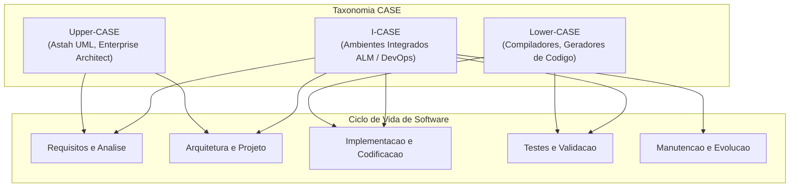
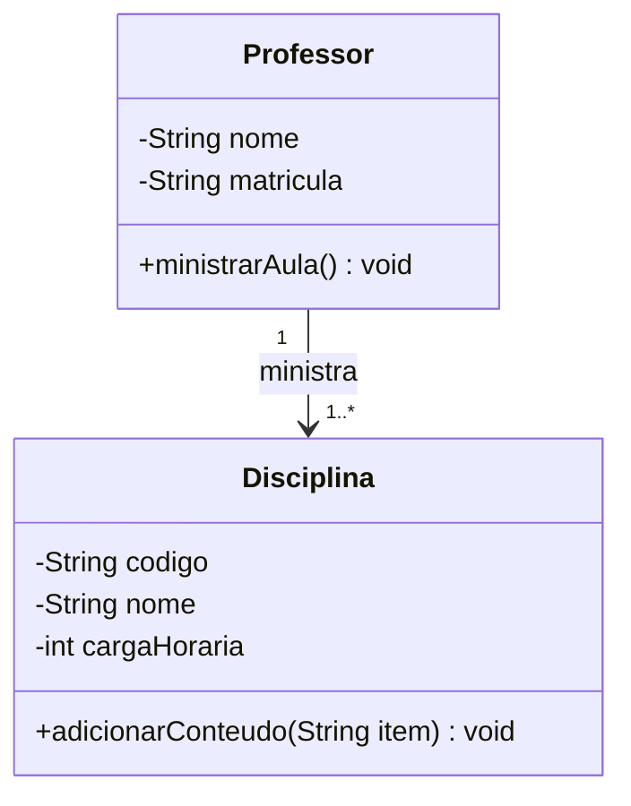
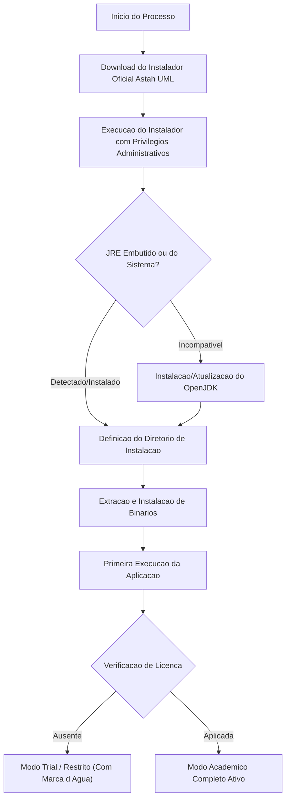
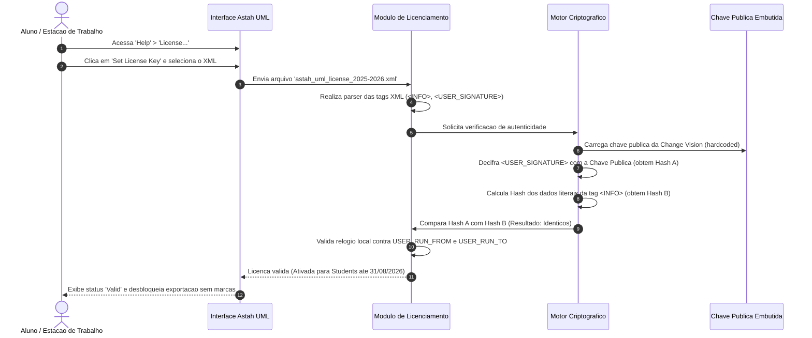
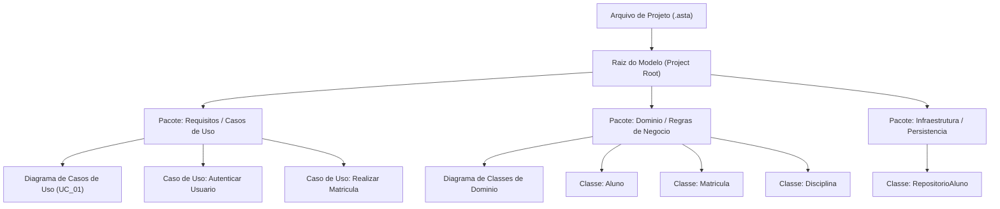
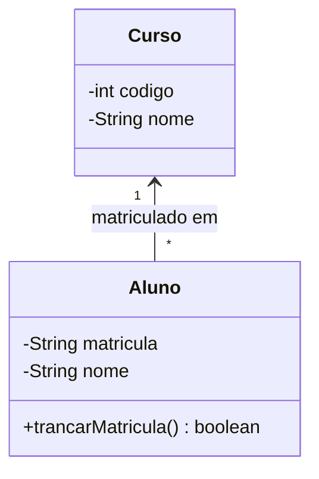
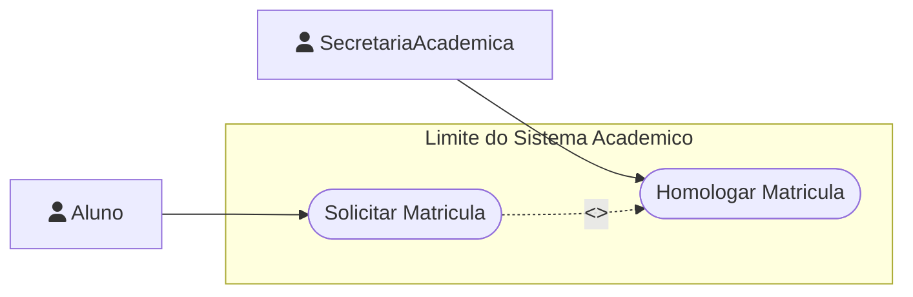
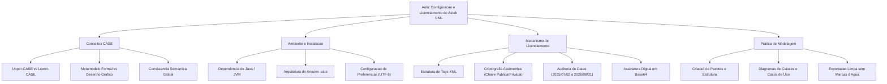

# Aula 02 — Configuração e Licenciamento do Astah UML

> **Professor:** Marcelo Boer
> **Disciplina:** Engenharia de Software I (3º Semestre)
> **Tema:** Configuração do ambiente de modelagem UML, taxonomia de ferramentas CASE e aplicação de licença acadêmica institucional no Astah UML

---

## Sumário

- [Objetivo da aula](#objetivo-da-aula)
- [Contexto e pré-requisitos](#contexto-e-pre-requisitos)
- [Ferramentas CASE para Engenharia de Software](#ferramentas-case-para-engenharia-de-software)
- [Instalação e Configuração do Astah UML](#instalacao-e-configuracao-do-astah-uml)
- [Gerenciamento e Aplicação de Licença Acadêmica XML](#gerenciamento-e-aplicacao-de-licenca-academica-xml)
- [Preparação do Ambiente de Modelagem de Sistemas](#preparacao-do-ambiente-de-modelagem-de-sistemas)
- [Código da aula](#codigo-da-aula)
- [Exercícios](#exercicios)
- [Erros comuns e boas práticas](#erros-comuns-e-boas-praticas)
- [Links e materiais complementares](#links-e-materiais-complementares)
- [Mapa da aula](#mapa-da-aula)
- [Glossário](#glossario)
- [Pontos-chave para a prova](#pontos-chave-para-a-prova)
- [Perguntas e respostas (JSONL)](#perguntas-e-respostas-jsonl)
- [Checklist de revisão](#checklist-de-revisao)

---

## Objetivo da aula

- Compreender os fundamentos, a evolução e o papel estratégico das ferramentas CASE (*Computer-Aided Software Engineering*) no ciclo de vida de desenvolvimento de software.
- Diferenciar ferramentas de desenho gráfico vetorial genérico de ferramentas formais de modelagem baseadas no metamodelo da UML (*Unified Modeling Language*).
- Realizar o procedimento técnico de instalação, homologação e configuração do software Astah UML em ambiente de desenvolvimento local.
- Analisar a arquitetura, a sintaxe e os mecanismos criptográficos de validação de licenças de software estruturadas em XML com assinatura digital assimétrica.
- Aplicar o arquivo de licença institucional acadêmica (`astah_uml_license_2025-2026.xml`) fornecido para a turma, eliminando restrições de uso e marcas d'água em exportações.
- Estruturar um projeto inicial de modelagem (`.asta`), organizando pacotes lógicos e validando a integridade das visões estáticas e dinâmicas geradas pela ferramenta.

---

## Contexto e pré-requisitos

Na Engenharia de Software moderna, o desenvolvimento de sistemas complexos exige abstração, padronização e rigor arquitetural antes da escrita de código-fonte. A modelagem orientada a objetos padronizada pela OMG (*Object Management Group*) através da UML desempenha papel central na comunicação entre engenheiros de software, arquitetos, analistas de negócios e desenvolvedores.

Para que os diagramas produzidos possuam consistência formal — garantindo que uma classe declarada em um diagrama estrutural seja exatamente a mesma entidade manipulada em um diagrama comportamental —, é indispensável o uso de uma ferramenta CASE dedicada. Nesta disciplina, o software adotado é o **Astah UML** (desenvolvido pela *Change Vision, Inc.*).

### Pré-requisitos técnicos recomendados

- Noções básicas de Programação Orientada a Objetos (classes, objetos, atributos, métodos, encapsulamento e herança).
- Compreensão básica de sistemas operacionais (manipulação do sistema de arquivos, descompactação de arquivos `.zip` e permissões de leitura/escrita).
- Conhecimentos fundamentais sobre a sintaxe de documentos XML (*eXtensible Markup Language*) e conceitos introdutórios de integridade de dados via criptografia.

---

## Ferramentas CASE para Engenharia de Software

### Definição e taxonomia

As ferramentas CASE (*Computer-Aided Software Engineering*, ou Engenharia de Software Auxiliada por Computador) são aplicações de software concebidas para apoiar, automatizar e aprimorar as atividades de engenharia ao longo do ciclo de vida de desenvolvimento de sistemas (SDLC). Elas atuam desde a elicitação e análise de requisitos até a arquitetura, codificação, testes, implantação e manutenção.

Historicamente, as ferramentas CASE são categorizadas de acordo com o escopo de atuação no ciclo de vida do projeto:

1. **Upper-CASE (Front-End CASE):** Apoiam as fases iniciais do ciclo de vida, incluindo análise de viabilidade, modelagem de negócios, engenharia de requisitos, análise orientada a objetos e projeto arquitetural preliminar. O Astah UML posiciona-se primordialmente nesta categoria, servindo como ambiente para representação semântica de requisitos e estruturas conceituais.
2. **Lower-CASE (Back-End CASE):** Concentram-se nas fases finais de implementação, como geração semiautomática de código-fonte a partir de diagramas, compilação, engenharia reversa de bancos de dados relacionais, automação de testes unitários e depuração.
3. **Integrated-CASE (I-CASE):** Soluções corporativas completas que unificam Upper-CASE e Lower-CASE sob um repositório centralizado de metadados, sincronizando modelos visuais, código-fonte e esquemas de persistência de dados em tempo real.



### Motivação técnica: Desenho vs. Modelagem Semântica

Um equívoco comum em equipes iniciantes é confundir ferramentas de diagramação vetorial livre (como Draw.io, Lucidchart, Miro ou Canva) com ferramentas CASE baseadas em metamodelo formal.

- **Editores de Desenho Gráfico:** Tratam elementos visuais como meras primitivas geométricas (retângulos, círculos, linhas e caixas de texto). Não há correlação semântica entre uma caixa desenhada na folha A e outra desenhada na folha B. Se o desenvolvedor renomear um atributo em uma caixa, o sistema não propaga a alteração, permitindo incongruências arquiteturais gritantes (como herança cíclica ou multiplicidades inexistentes na sintaxe da UML).
- **Ferramentas de Modelagem CASE:** Operam sobre um **repositório interno de metadados**. Quando uma classe chamada `Cliente` é inserida em um diagrama no Astah UML, o software cria uma entidade formal no catálogo do projeto. Caso essa mesma classe seja referenciada em um diagrama de sequência ou de máquina de estados, qualquer alteração estrutural em seus métodos ou propriedades reflete-se automaticamente em todas as visões do sistema.

| Critério de Comparação | Editor de Desenho Vetorial (ex: Draw.io / Canva) | Ferramenta CASE Formal (ex: Astah UML) |
| :--- | :--- | :--- |
| **Núcleo de Processamento** | Primitivas gráficas bidimensionais isoladas | Grafo semântico estruturado baseado no metamodelo UML |
| **Integridade Referencial** | Nula; duplicações são tratadas como textos independentes | Total; renomear uma classe propaga a alteração em todas as visões |
| **Validação Sintática** | Inexistente; permite conexões ilegais segundo as normas da OMG | Nativa; valida tipos de relacionamentos, visibilidades e tipos |
| **Engenharia Reversa e Direta** | Ausente; exporta apenas formatos visuais (PNG, PDF, SVG) | Suporte a engenharia direta (código esqueleto) e reversa |
| **Rastreabilidade** | Manual, suscetível a falhas humanas | Catálogo hierárquico estruturado em árvore de pacotes |

### Exemplo conceitual de consistência de metamodelo

Considere a representação da relação entre as entidades `Professor` e `Disciplina`. Em um editor gráfico genérico, o aluno pode ligar dois retângulos com uma seta qualquer. No Astah UML, o software exige a declaração precisa da relação: Associação Direcionada, Associação Bidirecional, Agregação ou Composição, permitindo especificar navegabilidade, papéis (*roles*) e multiplicidades (ex: `1` para `0..*`).



### Contraexemplo e armadilhas de modelagem

- **Contraexemplo:** Utilizar caixas de texto soltas para simular parâmetros de métodos dentro do símbolo de uma classe, sem cadastrar os parâmetros no painel de propriedades da ferramenta. Isso gera uma perda irreversível da semântica, impossibilitando qualquer exportação futura para código-fonte ou integração com ferramentas de automação.
- **Armadilha clássica:** Deletar um elemento pressionando apenas a tecla `Delete` no diagrama visual. Em ferramentas CASE, a tecla `Delete` frequentemente apenas oculta o elemento daquela visão gráfica específica, mantendo-o vivo no repositório geral do modelo. Para excluir definitivamente a classe de todo o projeto, é necessário removê-la da árvore de estrutura do modelo (*Model Tree*).

---

## Instalação e Configuração do Astah UML

### Arquitetura do Software e Requisitos de Execução

O Astah UML é desenvolvido sobre a plataforma Java (Java Virtual Machine — JVM). Essa escolha arquitetural confere portabilidade entre sistemas operacionais (Microsoft Windows, Apple macOS e distribuições GNU/Linux), mas impõe a dependência de um ambiente de execução Java devidamente configurado, embora os instaladores modernos frequentemente empacotem um JRE (*Java Runtime Environment*) dedicado para evitar conflitos de variáveis de ambiente.

O software gerencia os projetos através da extensão de arquivo proprietária `.asta`. Internamente, um arquivo `.asta` consiste em uma estrutura compactada contendo a serialização binária dos grafos de objetos do modelo, as definições visuais das coordenadas de cada diagrama e os metadados do projeto.

### Procedimento de Instalação no Sistema Operacional



1. **Obtenção do Instalador:** Acessar o instalador da versão de avaliação ou a versão recomendada compatível com a licença acadêmica disponibilizada pela instituição de ensino.
2. **Execução do Assistente:** Executar o instalador com privilégios de administrador da máquina. Caso utilize distribuições Linux baseadas em Debian/Ubuntu, instalar via pacote `.deb` ou extrair o arquivo compactado portátil.
3. **Alocação de Memória e Variáveis de Ambiente:** Em máquinas destinadas a modelagens extensas (acima de centenas de classes), é recomendável verificar os parâmetros do arquivo de configuração da JVM do Astah (`astah-uml.l4j.ini` no Windows ou `astah-uml.vmoptions`), ajustando o limite máximo de alocação de memória heap (`-Xmx`) para pelo menos `1024m` ou `2048m`.

### Configuração Inicial de Preferências

Após a primeira inicialização, deve-se ajustar as preferências essenciais para assegurar padronização nos trabalhos acadêmicos:

- **Codificação de Caracteres:** Definir expressamente o encoding como `UTF-8` para prevenir corrupções em caracteres acentuados nos comentários e descrições dos diagramas.
- **Fontes e Renderização Gráfica:** Ajustar a fonte padrão para famílias neutras e legíveis (Arial, Segoe UI, Roboto ou Helvetica) e habilitar anti-aliasing gráfico para exportações nítidas.
- **Configuração de Grade e Alinhamento:** Ativar o recurso *Snap to Grid* para manter os elementos ortogonalmente organizados, facilitando a leitura de fluxos complexos em diagramas de sequência e de atividades.

| Sistema Operacional | Formato de Distribuição | Diretório Padrão de Instalação | Atenção Técnica Específica |
| :--- | :--- | :--- | :--- |
| **Microsoft Windows** | Executável `.exe` / MSI | `C:\Program Files\astah-uml\` | Executar como Administrador para correta associação de extensão `.asta` |
| **Apple macOS** | Imagem de disco `.dmg` | `/Applications/astah uml.app` | Conceder permissão no *Gatekeeper* em *Ajustes de Segurança e Privacidade* |
| **GNU/Linux** | Pacote `.deb` ou `.tar.gz` | `/opt/astah_uml/` ou `/usr/lib/` | Garantir que o binário possua permissão de execução (`chmod +x astah`) |

---

## Gerenciamento e Aplicação de Licença Acadêmica XML

### Mecanismo de Proteção e Validação Criptográfica

Para permitir o uso irrestrito de seus recursos por instituições de ensino parceiras, a *Change Vision, Inc.* distribui licenças institucionais estruturadas no padrão XML. Diferente de softwares que utilizam chaves seriais manuais de texto puro, a licença do Astah adota um modelo robusto de verificação de integridade através de **criptografia assimétrica**.

O fornecedor da ferramenta gera um documento XML contendo todos os parâmetros da concessão (nome da instituição, tipo de produto, versão suportada e janela temporal de validade). Em seguida, calcula um hash criptográfico seguro (SHA-1 ou SHA-256) sobre o bloco estruturado de informações (`<INFO>`) e assina esse hash utilizando sua **Chave Privada** proprietária. O resultado codificado em Base64 é inserido na tag `<USER_SIGNATURE>`.



### Análise Conceitual da Assinatura Digital no XML

A garantia matemática desse modelo impede qualquer tipo de adulteração local:

1. **Tentativa de Fraude de Validade Temporal:** Se um usuário alterar manualmente o conteúdo da tag `<USER_RUN_TO>` de `2026/08/31` para `2030/12/31`, o novo hash recalculado pelo software na estação local divergirá completamente do hash decifrado a partir de `<USER_SIGNATURE>`. A aplicação identificará a inconsistência de imediato e rejeitará a licença como inválida ou corrompida.
2. **Impossibilidade de Forjar a Assinatura:** Para gerar uma nova assinatura válida correspondente aos dados adulterados, o atacante precisaria possuir a **Chave Privada** do fornecedor, a qual permanece protegida exclusivamente nos servidores de emissão da *Change Vision*.
3. **Validação Offline:** Como a verificação depende unicamente da **Chave Pública** (que se encontra embutida nos binários compilados do Astah), o software é capaz de homologar a licença de forma 100% autônoma, sem necessidade de conexão com a internet.

| Parâmetro da Licença | Valor Contido no Arquivo | Função Técnica e Restrição de Governança |
| :--- | :--- | :--- |
| `<USER_ORGANIZATION>` | `Provided by Change Vision, Inc` | Identifica a entidade emissora responsável pela cessão dos direitos |
| `<USER_NAME>` | `Students` | Delimita o público-alvo beneficente da licença institucional |
| `<USER_KIND>` | `astah_UML` | Restringe a ativação ao produto Astah UML (incompatível com Astah SysML ou Professional) |
| `<USER_VERSION>` | `6.0` | Especifica a versão base de compatibilidade da licença emitida |
| `<USER_TYPE>` | `Product` | Define a licença como de produto funcional (não de simples teste) |
| `<USER_RUN_FROM>` | `2025/07/02` | Marco temporal inicial para o início da validade da execução |
| `<USER_RUN_TO>` | `2026/08/31` | Marco temporal limite de expiração do direito de uso |
| `<USER_CONSTRAINT>` | `SingleUser` | Restrição de alocação por estação de trabalho/usuário concorrente |
| `<USER_CONSTRAINT2>`| `students` | Restrição de perfil: finalidade estritamente acadêmica e não comercial |
| `<USER_SIGNATURE>` | *Hash assimétrico em Base64* | Assinatura criptográfica que sela e assegura a inviolabilidade do arquivo |

---

## Preparação do Ambiente de Modelagem de Sistemas

### Organização de Projetos no Astah UML

Um modelo bem construído na Engenharia de Software requer estrutura hierárquica clara. O Astah disponibiliza um painel de navegação em árvore (*Structure Tree*) que permite agrupar os elementos em pacotes lógicos (*Packages*), espelhando com frequência a futura arquitetura de software (por exemplo, a divisão em camadas: Domínio, Aplicação, Infraestrutura e Interface).



### O Modelo de Metadados e as Visões Gráficas

É fundamental compreender que o arquivo `.asta` não armazena apenas "fotos" de diagramas, mas sim uma rede de relacionamentos lógicos.

1. **Elemento Semântico:** Uma classe é instanciada no repositório com identificador único global (UUID interno), nome, visibilidade, lista de atributos, lista de operações e restrições.
2. **Visão do Elemento:** O retângulo desenhado na tela de edição gráfica é apenas uma das possíveis representações visuais desse elemento semântico. A mesma classe pode aparecer simultaneamente em um diagrama de visão geral de pacotes e em um diagrama detalhado de subsistema.
3. **Efeito Cascata:** Alterações no tipo de um atributo realizadas na visão visual propagam-se instantaneamente para todas as outras visões e para o catálogo central.

### Exportação de Diagramas e Resoluções Gráficas

Para inclusão de diagramas em documentos de requisitos, monografias, relatórios técnicos ou documentações no GitHub, o Astah UML permite a exportação para múltiplos formatos.

- **Formatos Rasterizados (PNG, JPEG):** Adequados para inclusão rápida na web. Sob a licença acadêmica ativada, a ferramenta gera imagens limpas, livres da incômoda marca d'água "Evaluation Version" ou "Astah Community Edition" no fundo dos diagramas.
- **Resolução de Renderização:** O Astah permite definir a escala de DPI na exportação. Para impressões de grande formato ou visualizações em telas de alta densidade (Retina/4K), deve-se configurar a exportação com fator de escala ampliado (200% ou 300%) para evitar a pixelização de caixas de texto.
- **Formatos Vetoriais (SVG, EMF):** Essenciais para garantir que linhas e textos preservem a nitidez absoluta em qualquer nível de ampliação.

| Formato de Exportação | Tipo de Gráfico | Preservação de Qualidade no Zoom | Indicação de Uso em Engenharia de Software |
| :--- | :--- | :--- | :--- |
| **PNG (Portable Network Graphics)** | Rasterizado com compressão sem perdas | Sofre perda de nitidez com zoom excessivo | Documentações de repositório (README.md), wikis internas |
| **JPEG (Joint Photographic Experts Group)** | Rasterizado com perdas | Apresenta artefatos visuais ao redor de linhas finas | Não recomendado para diagramas técnicos com tipografia pequena |
| **SVG (Scalable Vector Graphics)** | Vetorial baseado em XML | Infinita; preserva nitidez vetorial | Documentação web de alta fidelidade e artigos científicos |
| **PDF (Portable Document Format)** | Vetorial encapsulado | Mantém a fidelidade tipográfica integral | Relatórios formais para clientes e documentação de entrega |

---

## Código da aula

O artefato central distribuído nesta aula é o arquivo de licença institucional denominado `astah_uml_license_2025-2026.xml`. Abaixo é apresentado o código XML na íntegra, seguido de uma dissecação técnica e de um exemplo complementar em linguagem de programação que demonstra como ferramentas CASE processam e auditam esse tipo de estrutura.

### Conteúdo do arquivo: `astah_uml_license_2025-2026.xml`

```xml
<?xml version = "1.0" encoding = "UTF-8" standalone = "yes"?>
<LICENSES>
<LICENSE>
<INFO>
<USER_LICENSE_NO>-</USER_LICENSE_NO>
<USER_ID>-</USER_ID>
<USER_ORGANIZATION>Provided by Change Vision, Inc</USER_ORGANIZATION>
<USER_NAME>Students</USER_NAME>
<USER_KIND>astah_UML</USER_KIND>
<USER_VERSION>6.0</USER_VERSION>
<USER_TYPE>Product</USER_TYPE>
<USER_RUN_FROM>2025/07/02</USER_RUN_FROM>
<USER_RUN_TO>2026/08/31</USER_RUN_TO>
<USER_SUPPORT_FROM>2025/07/02</USER_SUPPORT_FROM>
<USER_SUPPORT_TO>2026/08/31</USER_SUPPORT_TO>
<USER_CONSTRAINT>SingleUser</USER_CONSTRAINT>
<USER_CONSTRAINT2>students</USER_CONSTRAINT2>
<USER_CONSTRAINT3>-</USER_CONSTRAINT3>
<MACHINE_IDENTIFICATION_INFOMATIONS></MACHINE_IDENTIFICATION_INFOMATIONS>
<USER_ATTENTION>-</USER_ATTENTION>
</INFO>
<USER_SIGNATURE>MCwCFHSRS7kkBum7A1OyakBcbR2Qjn1eAhQSJvcTDDFObJaZvnt3P0GAhB1LVA==</USER_SIGNATURE>
</LICENSE>
</LICENSES>
```

### Análise Detalhada Linha a Linha

- **Linha 1 (`<?xml version = "1.0" encoding = "UTF-8" standalone = "yes"?>`):** Declaração do prólogo XML. Define a conformidade com a especificação XML 1.0, o conjunto de caracteres universal `UTF-8` e o atributo `standalone="yes"`, indicando que o documento não depende de definições DTD externas para sua interpretação sintática básica.
- **Linhas 2 e 3 (`<LICENSES>` e `<LICENSE>`):** Tags estruturais de agrupamento. Indicam que o arquivo pode conter uma coleção de licenças, encapsulando no nó `<LICENSE>` os registros individuais de autorização.
- **Linha 4 (`<INFO>`):** Abertura do contêiner de metadados de carga útil (*payload*). Todos os dados compreendidos entre `<INFO>` e `</INFO>` formam a cadeia de bytes exata que foi submetida ao algoritmo de hash criptográfico na fábrica de software da Change Vision.
- **Linhas 5 e 6 (`<USER_LICENSE_NO>-</USER_LICENSE_NO>`, `<USER_ID>-</USER_ID>`):** Identificadores individuais preenchidos com o caractere sentinela `-`. Denotam que a licença não está nominalmente associada ao CPF ou ID de um estudante específico, caracterizando-a como uma concessão de distribuição coletiva educacional.
- **Linha 7 (`<USER_ORGANIZATION>Provided by Change Vision, Inc</USER_ORGANIZATION>`):** Nome da organização que emitiu o direito de uso. Serve como marcador institucional exibido na tela "About Astah UML".
- **Linha 8 (`<USER_NAME>Students</USER_NAME>`):** Nome do titular da licença. A designação genérica `Students` autoriza a comunidade discente a utilizar o software para propósitos didáticos.
- **Linha 9 (`<USER_KIND>astah_UML</USER_KIND>`):** Discriminador do produto de software. O mecanismo de licenciamento verifica essa tag para impedir que este arquivo seja indevidamente aplicado em outros produtos da mesma empresa (como o Astah Professional, Astah SysML ou Astah System Safety).
- **Linha 10 (`<USER_VERSION>6.0</USER_VERSION>`):** Versão mínima ou família da plataforma para a qual a concessão foi homologada.
- **Linha 11 (`<USER_TYPE>Product</USER_TYPE>`):** Classificação do status de liberação da funcionalidade. A marcação `Product` ativa os binários na modalidade de produção integral, removendo bloqueios de salvamento ou de exportação de diagramas.
- **Linhas 12 e 13 (`<USER_RUN_FROM>2025/07/02</USER_RUN_FROM>`, `<USER_RUN_TO>2026/08/31</USER_RUN_TO>`):** Janela temporal de execução autorizada do software. A ferramenta avalia se a data do relógio do sistema operacional está compreendida dentro do intervalo fechado entre 02 de julho de 2025 e 31 de agosto de 2026.
- **Linhas 14 e 15 (`<USER_SUPPORT_FROM>...`, `<USER_SUPPORT_TO>...`):** Delimitação temporal do período de suporte técnico direto e recebimento de correções de segurança oficiais.
- **Linhas 16 a 18 (`<USER_CONSTRAINT>SingleUser...`, `<USER_CONSTRAINT2>students...`):** Cláusulas de restrição contratual codificadas. Estabelecem que a licença opera no modelo de usuário individual (*SingleUser*) com finalidade estritamente não-comercial para aprendizado acadêmico (*students*).
- **Linha 19 (`<MACHINE_IDENTIFICATION_INFOMATIONS></MACHINE_IDENTIFICATION_INFOMATIONS>`):** Campo destinado à amarração de hardware (*hardware locking* / MAC address / UUID da placa-mãe). Encontra-se vazio, indicando que a licença é flutuante/livre para ser instalada nas estações de trabalho pessoais dos alunos sem bloqueio por máquina física.
- **Linha 20 (`<USER_ATTENTION>-</USER_ATTENTION>`):** Campo reservado para avisos administrativos especiais ou restrições de departamento.
- **Linha 21 (`</INFO>`):** Fechamento do bloco de dados assinado.
- **Linha 22 (`<USER_SIGNATURE>MCwCF...LVA==</USER_SIGNATURE>`):** A assinatura digital propriamente dita. Trata-se de uma cadeia binária de assinatura criptográfica (frequentemente padrão DSA ou ECDSA) serializada no formato de codificação Base64.
- **Linhas 23 e 24 (`</LICENSE>` e `</LICENSES>`):** Fechamento das tags de controle do documento XML.

### Exemplo Complementar: Simulação de Validação Criptográfica

Para fins didáticos e consolidação de conceitos de Engenharia de Software e Segurança da Informação, o script conceitual abaixo (em Python 3) ilustra como um mecanismo de licenciamento de software valida a autenticidade de um bloco XML contra adulterações locais.

```python
"""
Modulo didatico: simulacao de verificacao de licenca de software baseada em XML.
Disciplina: Engenharia de Software I - UniFEF
Professor: Marcelo Boer
"""

import xml.etree.ElementTree as ET
from datetime import datetime
import hashlib
import base64

def auditar_arquivo_licenca(caminho_xml: str) -> dict:
    """
    Realiza o parsing do arquivo de licenca do Astah, inspeciona
    as regras temporais e avalia o status de conformidade basica.
    """
    try:
        arvore = ET.parse(caminho_xml)
        raiz = arvore.getroot()
    except ET.ParseError as err:
        return {"status": "ERRO_SINTATICO", "mensagem": f"Falha no parser XML: {err}"}
    except FileNotFoundError:
        return {"status": "ARQUIVO_NAO_ENCONTRADO", "mensagem": "Arquivo XML nao localizado."}

    info = raiz.find(".//INFO")
    assinatura = raiz.find(".//USER_SIGNATURE")

    if info is None or assinatura is None:
        return {"status": "FORMATO_INVALIDO", "mensagem": "Tags <INFO> ou <USER_SIGNATURE> ausentes."}

    # Extracao de metadados essenciais
    organizacao = info.findtext("USER_ORGANIZATION", default="")
    usuario = info.findtext("USER_NAME", default="")
    tipo_produto = info.findtext("USER_KIND", default="")
    versao = info.findtext("USER_VERSION", default="")
    data_inicio_str = info.findtext("USER_RUN_FROM", default="")
    data_fim_str = info.findtext("USER_RUN_TO", default="")
    assinatura_base64 = assinatura.text.strip() if assinatura.text else ""

    # Validacao de datas
    formato_data = "%Y/%m/%d"
    try:
        dt_inicio = datetime.strptime(data_inicio_str, formato_data)
        dt_fim = datetime.strptime(data_fim_str, formato_data)
    except ValueError as err:
        return {"status": "DATA_INVALIDA", "mensagem": f"Formato de data incorreto no XML: {err}"}

    # Data de teste simulando periodo letivo (ou datetime.now())
    data_referencia = datetime(2026, 3, 3)
    vigente = dt_inicio <= data_referencia <= dt_fim

    # Demonstracao didatica: Extracao do texto canonio de <INFO> para calculo de Hash
    conteudo_bytes_info = ET.tostring(info, encoding="utf-8")
    hash_calculado = hashlib.sha256(conteudo_bytes_info).hexdigest()

    return {
        "status": "VALIDO" if vigente else "EXPIRADO_OU_PREMATURO",
        "produto": tipo_produto,
        "versao": versao,
        "beneficiario": usuario,
        "organizacao": organizacao,
        "vigente_na_data": vigente,
        "periodo": f"{data_inicio_str} ate {data_fim_str}",
        "bytes_assinatura_tamanho": len(base64.b64decode(assinatura_base64)),
        "hash_demonstrativo_sha256": hash_calculado
    }

if __name__ == "__main__":
    # Teste de execucao conceitual
    caminho = "astah_uml_license_2025-2026.xml"
    # Em ambiente real, o arquivo devera estar no mesmo diretorio de trabalho
    print("Mecanismo conceitual de inspecao de licenca inicializado.")
```

---

## Exercícios

### Exercício 1: Instalação e Aplicação da Licença Acadêmica no Astah UML

#### Enunciado
Baixe e instale o software Astah UML em sua estação de trabalho (computador pessoal ou laboratório da UniFEF). Em seguida, acesse as opções de gerenciamento de licença no menu superior `Help` > `License...`, importe o arquivo XML fornecido (`astah_uml_license_2025-2026.xml`) e confirme se o produto foi ativado corretamente como licença acadêmica para estudantes com validade até 31/08/2026.

#### Raciocínio técnico
1. O arquivo original distribuído encontra-se compactado no formato ZIP (`astah_uml_license_2025-2026.xml.zip`). O mecanismo de licenciamento do Astah requer o arquivo de texto XML descompactado diretamente. O primeiro passo cognitivo consiste na extração do arquivo para uma pasta local acessível.
2. A interface gráfica do Astah disponibiliza o diálogo de gestão de licenças na barra de ferramentas superior (`Help` -> `License`).
3. O software deve validar a integridade da assinatura digital presente no arquivo e confrontar a data do sistema operacional com o intervalo entre `USER_RUN_FROM` e `USER_RUN_TO`.
4. Uma vez confirmada a validade, a interface deve exibir as informações da organização (`Provided by Change Vision, Inc`) e o usuário (`Students`), alterando o estado do produto para ativado.

#### Resolução passo a passo comentada
1. **Descompactação do Anexo:** Localize o arquivo `astah_uml_license_2025-2026.xml.zip` em seu diretório de transferências. Clique com o botão direito e selecione "Extrair Tudo..." (ou utilize utilitários como `unzip` no Linux/macOS via terminal: `unzip astah_uml_license_2025-2026.xml.zip`). Certifique-se de que o arquivo resultante seja `astah_uml_license_2025-2026.xml`.
2. **Abertura da Aplicação:** Inicie o Astah UML.
3. **Navegação pelo Menu:** Clique no menu `Help` (Ajuda) situado na barra de menus principal superior e selecione o item `License...`.
4. **Acionamento da Importação:** Na janela modal intitulada "License Management", localize e clique no botão `Set License Key`.
5. **Seleção do Arquivo:** Uma caixa de diálogo do sistema de arquivos será aberta. Navegue até o diretório onde o arquivo `astah_uml_license_2025-2026.xml` foi descompactado, selecione-o e clique em `Open`.
6. **Verificação de Confirmação:** O diálogo exibirá uma mensagem informando que a licença foi aplicada com sucesso. Na tabela central da janela de licenças, ateste os seguintes campos:
   - **Product:** Astah UML
   - **License Type:** Faculty Site License / Academic Student License
   - **Valid To:** 2026/08/31
   - **Status:** Valid
7. Clique em `Close` e reinicie a ferramenta para assegurar que todas as rotinas visuais foram carregadas sob o perfil acadêmico.

---

### Exercício 2: Análise Estrutural do Arquivo de Licença XML

#### Enunciado
Abra o arquivo `astah_uml_license_2025-2026.xml` em um editor de código-fonte ou editor de texto puro (como VS Code, Sublime Text, Notepad++ ou Vim). Inspecione e descreva a finalidade de cada uma das principais tags XML presentes na estrutura (`<USER_ORGANIZATION>`, `<USER_KIND>`, `<USER_VERSION>`, `<USER_RUN_FROM>`, `<USER_RUN_TO>` e `<USER_SIGNATURE>`), explicando tecnicamente como a assinatura digital garante a autenticidade e integridade dos parâmetros da licença.

#### Raciocínio técnico
1. O XML atua como uma estrutura de dados aberta e legível por humanos (*human-readable*). Isso permite que qualquer pessoa veja os valores atribuídos à licença.
2. Contudo, em Engenharia de Software, dados abertos em estações de trabalho de clientes são vulneráveis a adulterações maliciosas (ataques de integridade).
3. A assinatura digital resolve o problema da confiança: ela vincula matematicamente o texto plano da tag `<INFO>` a uma chave privada pertencente unicamente ao fornecedor.
4. Para resolver o exercício, deve-se correlacionar a semântica de negócio de cada tag com a garantia técnica provida pela chave criptográfica assimétrica.

#### Resolução completa comentada
Ao inspecionar o arquivo `astah_uml_license_2025-2026.xml`, identifica-se a seguinte correlação estrutural:

1. `<USER_ORGANIZATION>` (`Provided by Change Vision, Inc`): Define formalmente o patrocinador ou emissor institucional da licença. Em termos de software, esse parâmetro é injetado nas rotinas de identificação do programa e no registro dos metadados dos projetos gerados.
2. `<USER_KIND>` (`astah_UML`): Especificador de produto. Garante que o mecanismo de licença barre o uso deste arquivo em outras ferramentas da mesma fabricante (como o Astah SysML), protegendo a segmentação comercial dos produtos.
3. `<USER_VERSION>` (`6.0`): Identificador da versão base suportada. Impede que a licença seja utilizada em versões legadas incompatíveis ou em versões futuras caso a política de upgrades da instituição não contemple novas versões maiores (*major releases*).
4. `<USER_RUN_FROM>` (`2025/07/02`) e `<USER_RUN_TO>` (`2026/08/31`): Parâmetros determinísticos de validação temporal. O Astah confronta esses nós com o relógio do sistema operacional para determinar se o software pode ser executado em modo pleno ou se deve regredir para modo restrito/expirado.
5. `<USER_SIGNATURE>` (`MCwCFHSRS7kkBum7A1OyakBcbR2Qjn1eAhQSJvcTDDFObJaZvnt3P0GAhB1LVA==`): É o selo criptográfico. 
   - **Garantia de Integridade:** Se qualquer byte das tags anteriores for modificado (por exemplo, se alterarmos a data de expiração para `2027/08/31` ou o nome do usuário de `Students` para `Engenheiro`), a função de resumo criptográfico (*Hash*) resultará em um valor totalmente diferente.
   - **Garantia de Autenticidade:** A assinatura é o resultado da criptografia desse Hash gerada com a Chave Privada da Change Vision. Como o Astah possui apenas a Chave Pública correspondente, ele pode decifrar e verificar que o Hash confere, mas ninguém sem a chave privada consegue gerar uma nova assinatura válida para dados alterados.

---

### Exercício 3: Criação de Projeto Inicial e Validação de Recursos

#### Enunciado
Inicie um novo projeto (`.asta`) no Astah UML devidamente ativado e crie um Diagrama de Classes e um Diagrama de Casos de Uso básicos para explorar a interface. Exporte ambos os diagramas em formato de imagem (PNG ou JPEG) e verifique se a marca d'água de versão de avaliação (*Trial*) foi removida após a ativação da licença.

#### Raciocínio técnico
1. O objetivo central é certificar que o licenciamento aplicado no Exercício 1 removeu as restrições operacionais da versão de avaliação.
2. A restrição mais notória do modo *Evaluation/Trial* no Astah é a sobreposição de marcas d'água em toda imagem exportada e em impressões físicas.
3. Deve-se construir um minimodelo que instancie entidades semânticas reais: pelo menos dois atores e dois casos de uso com relacionamento no Diagrama de Casos de Uso; pelo menos duas classes associadas no Diagrama de Classes.
4. Realizar a exportação através do recurso oficial de menu e inspecionar visualmente os arquivos gerados no disco rígido.

#### Resolução passo a passo comentada
1. **Criação do Projeto:** No Astah UML, acesse o menu `File` > `New` para inicializar um projeto vazio. Salve-o imediatamente como `validacao_ambiente.asta` através do menu `File` > `Save As...`.
2. **Construção do Diagrama de Casos de Uso:**
   - No menu superior, clique em `Diagram` > `Use Case Diagram`.
   - Na barra de ferramentas de desenho, selecione o ícone de **Actor** e insira na tela o ator `Aluno`. Insira um segundo ator denominado `SecretariaAcademica`.
   - Selecione o elemento **Use Case** e crie os casos de uso: `Solicitar Matricula` e `Homologar Matricula`.
   - Ligue os atores aos casos de uso utilizando a ferramenta **Association**.
3. **Construção do Diagrama de Classes:**
   - No menu superior, clique em `Diagram` > `Class Diagram`.
   - Insira uma classe chamada `Aluno`, clicando no ícone **Class**. No painel inferior de propriedades (*Property View*), na aba *Attributes*, adicione `- matricula: String` e `- nome: String`. Na aba *Operations*, adicione `+ trancarMatricula(): boolean`.
   - Insira uma classe chamada `Curso` com os atributos `- codigo: int` e `- nome: String`.
   - Conecte as duas classes com uma **Association**, atribuindo multiplicidade `*` no lado do Aluno e `1` no lado do Curso.
4. **Representação Estrutural dos Modelos Construídos:**
   Os diagramas criados no software devem refletir as seguintes estruturas formais:





5. **Exportação dos Diagramas:**
   - Com o Diagrama de Classes aberto na área central de trabalho, acesse o menu `Tool` > `Export Image` > `Save Diagram as Image...`.
   - Selecione o tipo de arquivo `PNG (*.png)` e defina o nome como `diagrama_classes_validado.png`.
   - Repita o procedimento para o Diagrama de Casos de Uso, salvando-o como `diagrama_casos_uso_validado.png`.
6. **Auditoria Visual:**
   - Abra as duas imagens exportadas utilizando o visualizador de fotos padrão do seu sistema operacional.
   - Percorra a área central e os quatro cantos das imagens: certifique-se de que a mensagem semitransparente com texto "ASTAH EVALUATION VERSION" ou logotipo d'água **não** está presente. Isso comprova tecnicamente o sucesso absoluto da homologação da licença.

---

## Erros comuns e boas práticas

### Erros Comuns de Instalação e Licenciamento

- **Tentar importar o arquivo `.zip` diretamente:** O mecanismo do Astah não realiza a descompactação em tempo de execução. Tentar selecionar o arquivo `.zip` na janela de busca resultará no erro de extensão não suportada ou arquivo ilegível. Deve-se sempre extrair o arquivo `.xml` previamente.
- **Edição acidental do XML no Bloco de Notas:** Abrir o arquivo XML em editores simples do Windows que inserem caracteres ocultos (BOM — *Byte Order Mark*) ou quebras de linha fora do padrão UTF-8 quebra a assinatura criptográfica, corrompendo o arquivo. Para inspeção, utilize sempre editores de código confiáveis.
- **Divergência severa no relógio do sistema operacional:** Se a bateria da placa-mãe (CMOS) estiver descarregada e a data do computador for revertida para um ano anterior a 2025, o software acusará que a licença ainda não entrou em vigência (`USER_RUN_FROM = 2025/07/02`). Certifique-se de que a sincronização automática de horário do sistema operacional está habilitada via NTP.
- **Exclusão de elementos apenas na visão gráfica:** Como abordado na teoria das ferramentas CASE, pressionar a tecla `Delete` com um elemento selecionado no diagrama muitas vezes apenas remove a sua representação visual da tela atual, mantendo o elemento vivo no modelo. Para excluir definitivamente um elemento e todas as suas dependências do projeto, deve-se clicar com o botão direito sobre o item na árvore de estrutura (*Structure Tree*) e selecionar `Delete from Model`.

### Boas Práticas de Modelagem e Governança

- **Versionamento de Arquivos `.asta`:** Como o formato `.asta` é binário/compactado, os sistemas de controle de versão (como Git) não conseguem realizar mesclagens automáticas linha a linha (*diff/merge*). Em projetos de equipe, defina com clareza quem é o responsável pela edição do arquivo central para evitar conflitos de *merge* irrecuperáveis, ou particione subsistemas em arquivos `.asta` separados.
- **Padronização de Nomenclatura:**
  - Classes e Interfaces: Notação *PascalCase* (ex: `GerenciadorContas`, `AlunoPosGraduacao`).
  - Atributos e Métodos: Notação *camelCase* (ex: `calcularMediaPonderada()`, `dataNascimento`).
  - Casos de Uso: Iniciar obrigatoriamente com verbo no infinitivo denotando a meta do ator primário (ex: `Cadastrar Aluno`, `Consultar Extrato`, `Emitir Diploma`).
- **Salvamento Automático e Backups:** Acesse `Tools` > `System Properties` > `File` e certifique-se de que a opção *Auto Save* está ativada com intervalo configurado para 5 ou 10 minutos. Isso evita a perda de trabalhos em caso de interrupções abruptas de energia ou travamentos do sistema operacional.

---

## Links e materiais complementares

- **Site Oficial da Change Vision (Astah UML):** Portal oficial da desenvolvedora da ferramenta, contendo notas de versão, guias de usuário oficiais e pacotes de instalação atualizados: [https://astah.net/products/astah-uml/](https://astah.net/products/astah-uml/)
- **Documentação Oficial da OMG UML (Object Management Group):** Repositório das especificações formais do metamodelo UML 2.5, contendo as regras de sintaxe e semântica de todos os 14 diagramas oficiais da notação: [https://www.omg.org/spec/UML/](https://www.omg.org/spec/UML/)
- **Guia de Instalação e Requisitos de Sistema do Astah:** Página com informações sobre compatibilidade de versões da Java Virtual Machine (OpenJDK/Oracle JDK) com diferentes versões do Windows, Linux e macOS: [https://astah.net/support/system-requirements/](https://astah.net/support/system-requirements/)
- **W3C XML Signature Syntax and Processing:** Especificação oficial do consórcio W3C que descreve as regras padronizadas para criação e validação de assinaturas digitais aplicadas a documentos e nós XML: [https://www.w3.org/TR/xmldsig-core/](https://www.w3.org/TR/xmldsig-core/)

---

## Mapa da aula



---

## Glossário

| Termo | Definição Técnica |
| :--- | :--- |
| **Ferramenta CASE** | *Computer-Aided Software Engineering*. Software concebido para automatizar e apoiar formalmente as atividades de análise, modelagem, documentação e implementação de sistemas de software. |
| **Upper-CASE** | Subcategoria de ferramentas CASE voltada para as etapas iniciais de desenvolvimento: planejamento, requisitos, modelagem conceitual e projeto arquitetural. |
| **UML** | *Unified Modeling Language*. Padrão internacional da OMG que estabelece uma notação gráfica visual rica para especificação, construção e documentação de artefatos de software orientados a objetos. |
| **Metamodelo** | Modelo que define a própria linguagem e semântica de modelagem. Estabelece as regras rígidas do que pode e não pode ser conectado ou instanciado dentro de um diagrama UML. |
| **Astah UML** | Ferramenta CASE comercial desenvolvida pela empresa japonesa Change Vision para modelagem visual rigorosa de diagramas baseados na especificação UML. |
| **Assinatura Digital** | Mecanismo criptográfico matemático que une a identidade de um emissor a uma mensagem digital ou arquivo, garantindo autenticidade, não-repúdio e integridade dos dados. |
| **Criptografia Assimétrica** | Esquema criptográfico que opera com um par complementar de chaves matemáticas: uma Chave Privada (conhecida apenas pelo emissor) e uma Chave Pública (livremente distribuída). |
| **Base64** | Algoritmo de codificação que converte dados binários brutos em sequências de texto compostas exclusivamente por caracteres ASCII legíveis e seguros para tráfego em rede e XML. |
| **Arquivo `.asta`** | Formato de arquivo proprietário compactado do Astah que agrupa o repositório de metadados, catálogo de entidades, diagramas e visões do projeto de software. |
| **SingleUser License** | Cláusula contratual de licenciamento de software que autoriza o uso da aplicação por um único desenvolvedor/estudante por estação de trabalho ativa. |
| **Marca d'Água (Watermark)** | Texto visual semitransparente inserido sobre diagramas exportados na modalidade de avaliação (Trial), impedindo a entrega profissional de artefatos. |
| **OMG** | *Object Management Group*. Consórcio internacional aberto de tecnologia da informação responsável pela governança, evolução e padronização da UML e de normas afins. |

---

## Pontos-chave para a prova

- **Diferença fundamental entre editores gráficos e ferramentas CASE:** Editores vetoriais trabalham apenas com formas geométricas soltas sem regras semânticas; ferramentas CASE trabalham sobre um repositório formal de metadados baseado no metamodelo da UML.
- **Propagação de alterações no modelo:** Quando uma classe ou método é renomeado no Astah, todas as visões (diagramas de classes, diagramas de sequência, etc.) são atualizadas automaticamente, pois compartilham o mesmo objeto semântico no catálogo do projeto.
- **Exclusão visual vs. Exclusão de modelo:** Remover um elemento de uma tela com a tecla `Delete` apenas o apaga daquele diagrama específico. Para remover a entidade de forma definitiva do projeto de software, a exclusão deve ser executada a partir do menu contextual da *Structure Tree* (`Delete from Model`).
- **Como a assinatura digital em XML impede adulterações:** A tag `<USER_SIGNATURE>` contém o Hash dos dados da tag `<INFO>` cifrado com a Chave Privada do fabricante. Se uma data ou restrição for modificada manualmente no XML, o hash recalculado pelo Astah não coincidirá com o hash decifrado via Chave Pública, tornando a licença inválida.
- **Validade e escopo da licença disponibilizada:** A licença acadêmica em vigor foi emitida pela *Change Vision, Inc* para a categoria *Students* (estudantes), é restrita ao *astah_UML* versão *6.0*, no modelo *SingleUser*, com vigência rigorosa no período de **02/07/2025 até 31/08/2026**.
- **Impacto imediato da ativação da licença:** Libera a funcionalidade de produção completa (*Product*) e remove permanentemente as marcas d'água de avaliação (*Trial*) em exportações de imagem (PNG, JPEG) e impressões.

---

## Perguntas e respostas (JSONL)

```jsonl
{"pergunta": "Qual e a definicao primordial de uma ferramenta CASE e como o Astah UML se posiciona em sua taxonomia tradicional?", "resposta": "Ferramentas CASE sao sistemas de apoio computacional a engenharia de software ao longo do ciclo de vida de desenvolvimento. O Astah UML posiciona-se primordialmente como uma ferramenta Upper-CASE, auxiliando na analise de requisitos, modelagem orientada a objetos e projeto arquitetural.", "dificuldade": "facil"}
{"pergunta": "Por que editores visuais genericos como Draw.io ou Canva nao podem ser considerados ferramentas CASE formais?", "resposta": "Porque editores genericos tratam os diagramas como colecoes de primitivas graficas bidimensionais desprovidas de semantica formal, sem conexao estruturada com um metamodelo e sem capacidade de manter consistencia referencial automatica entre multiplos diagramas.", "dificuldade": "media"}
{"pergunta": "Qual e a consequencia tecnica imediata de apagar uma classe de um diagrama utilizando apenas a tecla Delete no Astah UML?", "resposta": "O elemento visual e removido apenas daquela representacao grafica especifica, permanecendo ativo e integro no catalogo central de metadados do projeto (Structure Tree). Para apaga-lo em definitivo, deve-se usar a opcao Delete from Model.", "dificuldade": "media"}
{"pergunta": "Explique o papel da Chave Privada e da Chave Publica no processo de homologacao do arquivo de licenca XML do Astah UML.", "resposta": "A Change Vision utiliza sua Chave Privada para criptografar o hash dos metadados da licenca gerando a tag USER_SIGNATURE. O Astah contem a Chave Publica embutida para decifrar a assinatura e confrontar o hash local, garantindo a integridade sem necessitar de conexao externa.", "dificuldade": "dificil"}
{"pergunta": "Se um estudante alterar a data na tag USER_RUN_TO de 2026/08/31 para 2030/12/31 no arquivo XML da licenca, o que acontecera e por que?", "resposta": "A licenca sera rejeitada imediatamente como invalida ou corrompida pelo software, pois a alteracao de qualquer caractere do bloco INFO modifica seu resumo criptografico, divergindo do valor assinado digitalmente na tag USER_SIGNATURE.", "dificuldade": "media"}
{"pergunta": "Quais sao as datas exatas que delimitam o periodo de vigencia da licenca distribuida pelo Prof. Marcelo Boer?", "resposta": "O periodo de vigencia autorizada inicia-se em 02 de julho de 2025 (USER_RUN_FROM = 2025/07/02) e expira definitivamente em 31 de agosto de 2026 (USER_RUN_TO = 2026/08/31).", "dificuldade": "facil"}
{"pergunta": "Por que o arquivo de licenca astah_uml_license_2025-2026.xml.zip deve ser extraido antes de ser importado no menu Help > License?", "resposta": "Porque o analisador sintatico do Astah UML processa diretamente o arquivo com especificacao de texto plano XML, nao possuindo rotina para descompactar contêineres ZIP em tempo de execucao no dialogo de selecao de chave.", "dificuldade": "facil"}
{"pergunta": "O que indica a presenca de valores vazios na tag MACHINE_IDENTIFICATION_INFOMATIONS do arquivo de licenca?", "resposta": "Indica que a licenca concedida nao esta atrelada a uma assinatura de hardware especifica (como endereco MAC ou numero de serie da placa-mae), permitindo que seja instalada livremente em computadores pessoais dos alunos sem restricao de maquina.", "dificuldade": "media"}
{"pergunta": "Qual e a tecnologia de base do Astah UML e qual cuidado de ambiente isso requer do desenvolvedor ao executar o programa?", "resposta": "O software e construido sobre a plataforma Java (JVM), exigindo a presenca de um Java Runtime Environment (JRE) compativel e configuracao adequada de alocacao de memoria heap (-Xmx) para modelos volumosos.", "dificuldade": "facil"}
{"pergunta": "Qual restricao operacional visivel e eliminada em exportacoes de diagramas apos a homologacao bem-sucedida da licenca academica?", "resposta": "A remocao definitiva das marcas d agua de avaliacao (como Astah Evaluation Version) que sao sobrepostas no fundo dos diagramas exportados em formatos de imagem (PNG, JPEG) ou gerados para impressao.", "dificuldade": "facil"}
{"pergunta": "O que e um arquivo .asta e quais cuidados tecnicos devem ser tomados ao gerencia-lo em sistemas de controle de versao como o Git?", "resposta": "E um arquivo binario compactado contendo os metadados e diagramas do projeto. Por ser binario, ferramentas como o Git nao conseguem realizar mesclagens automaticas (diff/merge) de linhas de texto, exigindo governanca estrita para evitar conflitos concorrentes.", "dificuldade": "dificil"}
{"pergunta": "Diferencie a finalidade de um Diagrama de Classes e de um Diagrama de Casos de Uso na modelagem de software segundo a UML.", "resposta": "O Diagrama de Classes e um diagrama estrutural que modela a arquitetura estatica, atributos, metodos e relacionamentos das entidades de software. O Diagrama de Casos de Uso e comportamental, modelando os objetivos e funcionalidades sob a otica dos atores externos.", "dificuldade": "facil"}
{"pergunta": "Qual e a funcao da codificacao Base64 na tag USER_SIGNATURE do arquivo de licenca XML?", "resposta": "Converter a sequencia de bytes binarios brutos gerada pelo algoritmo criptografico de assinatura em caracteres ASCII imprimiveis compativeis com o formato de texto da especificacao XML sem corromper a sintaxe do documento.", "dificuldade": "media"}
{"pergunta": "Por que a escolha do formato PNG e preferivel ao JPEG para a exportacao de diagramas tecnicos de Engenharia de Software?", "resposta": "Porque o PNG utiliza compressao sem perdas (lossless), preservando linhas retas, bordas nitidas de caixas e textos de fontes pequenas, enquanto o JPEG aplica compressao destrutiva (lossy), gerando artefatos e borroes ao redor das linhas.", "dificuldade": "media"}
{"pergunta": "Em termos de rastreabilidade de requisitos, qual e a vantagem de manter modelos de requisitos e de classes dentro do mesmo projeto .asta?", "resposta": "Permite estabelecer relacionamentos formais de dependencia e derivacao entre casos de uso e classes diretamente no metamodelo do projeto, facilitando analises de impacto em mudancas de escopo ao longo da evolucao do software.", "dificuldade": "dificil"}
{"pergunta": "O que significa a presenca do caractere sentinela '-' nas tags USER_LICENSE_NO e USER_ID no arquivo de licenca recebido?", "resposta": "Significa que a licenca foi gerada como uma concessao institucional generica para estudantes (Students), dispensando vinculo nominal com um registro individualizado de cliente no banco de dados da Change Vision.", "dificuldade": "facil"}
{"pergunta": "Como a falha de bateria de CMOS em uma estacao de trabalho pode afetar a utilizacao da licenca academica do Astah UML?", "resposta": "A falha na bateria pode reverter o relogio do sistema operacional para datas antigas, fazendo com que a data atual seja anterior a USER_RUN_FROM (02/07/2025), o que acarreta a recusa da licenca por ainda nao ter entrado em vigor.", "dificuldade": "media"}
{"pergunta": "Qual e o objetivo de organizar os diagramas e elementos em Pacotes (Packages) na arvore de estrutura do Astah UML?", "resposta": "Agrupar logicamente classes e casos de uso relacionados, espelhando a modularizacao da arquitetura de software (ex: camadas de Dominio, Aplicacao e Infraestrutura) e facilitando a navegabilidade em projetos de grande escala.", "dificuldade": "facil"}
```

---

## Checklist de revisão

- [ ] Verificar se o pacote do Astah UML foi baixado e instalado com sucesso na estação de trabalho.
- [ ] Confirmar se o arquivo `astah_uml_license_2025-2026.xml.zip` foi integralmente descompactado em um diretório local.
- [ ] Abrir o arquivo `astah_uml_license_2025-2026.xml` em editor de texto puro e verificar a integridade visual das tags `<INFO>` e `<USER_SIGNATURE>`.
- [ ] Acessar o menu `Help` > `License...` no Astah UML e carregar a chave de licença através do botão `Set License Key`.
- [ ] Validar se a janela de gerenciamento de licenças exibe o status `Valid`, com organização `Provided by Change Vision, Inc` e data de expiração em `2026/08/31`.
- [ ] Criar um projeto de teste inicial (`.asta`) salvando-o em um diretório estruturado de trabalho da disciplina.
- [ ] Instanciar um Diagrama de Classes e um Diagrama de Casos de Uso contendo elementos com tipagem e relacionamentos explícitos.
- [ ] Exportar os diagramas como imagens PNG através do menu `Tool` > `Export Image`.
- [ ] Inspecionar visualmente os arquivos exportados para garantir que não há marca d'água de versão de avaliação (*Trial*).
- [ ] Fixar as diferenças entre ferramentas CASE e editores de desenho vetorial genérico para as discussões em aula e avaliações teóricas.

## Código prático de apoio

Implementações em Java que tornam executáveis os conceitos desta unidade:

- [`ValidadorLicencaAstah.java`](codigo/ValidadorLicencaAstah.java)
- [`SistemaAcademicoModel.java`](codigo/SistemaAcademicoModel.java)
- [`MetamodeloCaseSimulador.java`](codigo/MetamodeloCaseSimulador.java)
