# Aula 03 — Revisão de Requisitos de Software para AV1

> **Professor:** Marcelo Boer  
> **Disciplina:** Engenharia de Software I (3º Semestre)  
> **Tema:** Revisão Sistemática de Engenharia de Requisitos, Elicitação, Modelagem de Casos de Uso na UML, Ciclos de Vida e Manutenção de Software para a Avaliação Bimestral AV1

---

## Sumário

- [Objetivo da aula](#objetivo-da-aula)
- [Contexto e pré-requisitos](#contexto-e-pré-requisitos)
- [Processo de análise e classificação de requisitos funcionais e não funcionais](#processo-de-análise-e-classificação-de-requisitos-funcionais-e-não-funcionais)
- [Fase de análise versus fase de projeto de software](#fase-de-análise-versus-fase-de-projeto-de-software)
- [Gestão de projetos e fases do ciclo de vida de software](#gestão-de-projetos-e-fases-do-ciclo-de-vida-de-software)
- [Elicitação de requisitos e fontes de informação](#elicitação-de-requisitos-e-fontes-de-informação)
- [Métodos de coleta de dados: questionários, entrevistas e grupos focais](#métodos-de-coleta-de-dados-questionários-entrevistas-e-grupos-focais)
- [Técnicas de observação participante e não participante](#técnicas-de-observação-participante-e-não-participante)
- [Métricas de especificação para requisitos não funcionais](#métricas-de-especificação-para-requisitos-não-funcionais)
- [Conceito e classificação de atores na UML (primários e secundários)](#conceito-e-classificação-de-atores-na-uml-primários-e-secundários)
- [Relacionamentos e herança/especialização entre atores](#relacionamentos-e-herançaespecialização-entre-atores)
- [Objetivos e modelagem de diagramas de casos de uso](#objetivos-e-modelagem-de-diagramas-de-casos-de-uso)
- [Tipos de manutenção de software: corretiva, adaptativa, preventiva e evolutiva](#tipos-de-manutenção-de-software-corretiva-adaptativa-preventiva-e-evolutiva)
- [Código da aula](#código-da-aula)
- [Exercícios](#exercícios)
- [Erros comuns e boas práticas](#erros-comuns-e-boas-práticas)
- [Links e materiais complementares](#links-e-materiais-complementares)
- [Mapa da aula](#mapa-da-aula)
- [Glossário](#glossário)
- [Pontos-chave para a prova](#pontos-chave-para-a-prova)
- [Perguntas e respostas (JSONL)](#perguntas-e-respostas-jsonl)
- [Checklist de revisão](#checklist-de-revisão)

---

## Objetivo da aula

Consolidar integralmente o corpo conceitual e prático exigido na primeira avaliação bimestral (AV1) de Engenharia de Software I. Ao final deste estudo, o estudante do curso de Sistemas de Informação deverá ser capaz de:

1. Diferenciar com precisão funcionalidade de restrição arquitetural/qualitativa no contexto de requisitos de software.
2. Identificar e categorizar requisitos funcionais (RF) e não funcionais (RNF), compreendendo suas métricas formais de aferição e suas relações com propriedades emergentes do sistema.
3. Distinguir a fronteira conceitual e metodológica entre a **Fase de Análise** (espaço do problema e necessidades de negócio) e a **Fase de Projeto** (espaço da solução tecnológica e arquitetura).
4. Mapear o ciclo de vida do projeto e de desenvolvimento de software em suas diferentes abordagens de execução (sequencial, iterativa e sobreposta).
5. Selecionar e justificar métodos de coleta de dados e técnicas de elicitação (entrevistas abertas e estruturadas, questionários, observação participante e não participante, análise documental e feedback contínuo em ambientes ágeis).
6. Modelar atores e casos de uso conforme a especificação oficial da UML, aplicando corretamente associações, fronteiras de sistema, atores primários/secundários e mecanismos de herança/especialização.
7. Classificar as modalidades de manutenção de software em produção (corretiva, adaptativa, preventiva e evolutiva) segundo as normas e a literatura clássica de Engenharia de Software.

---

## Contexto e pré-requisitos

Esta aula articula conceitos fundamentais ministrados pelo Prof. Marcelo Boer ao longo do primeiro bimestre do 3º semestre. O domínio deste conteúdo requer familiaridade com:
- Noções de processos de negócio organizacionais.
- Conceitos elementares de Orientação a Objetos (classes, objetos, atributos, métodos e herança).
- Visão panorâmica sobre as etapas de construção de sistemas computacionais.

As complementações teóricas aqui expostas dialogam diretamente com os cânones da disciplina: **Ian Sommerville** (*Engenharia de Software*, 9ª e 10ª edições), **Roger S. Pressman** (*Engenharia de Software: Uma Abordagem Profissional*, 7ª e 8ª edições) e os padrões formais da **OMG (Object Management Group)** para a *Unified Modeling Language* (UML 2.5).

---

## Processo de análise e classificação de requisitos funcionais e não funcionais

### Definição e fundamentos

Um **requisito de software** consiste na declaração formal de um serviço que o sistema deve fornecer ou de uma restrição sob a qual o sistema deve operar. Ele traduz um conjunto de necessidades de negócio e expectativas do mundo real em especificações passíveis de validação, verificação e implementação.

O corpo de requisitos é classicamente dividido em duas categorias primárias:
1. **Requisitos Funcionais (RF):** Expressam **o que** o sistema deve fazer. Especificam funções, cálculos, transformações de dados, comportamentos sob estímulos específicos e os serviços diretos oferecidos aos usuários.
2. **Requisitos Não Funcionais (RNF):** Expressam **como** ou **sob quais restrições** o sistema deve operar. Definem atributos de qualidade, restrições arquiteturais, restrições de plataforma, limites de desempenho e conformidades legais ou organizacionais.

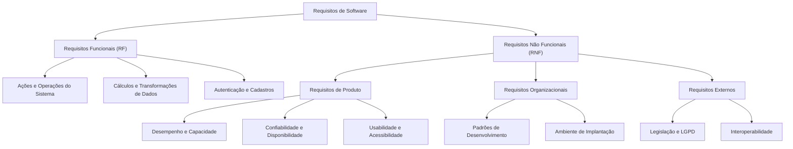

### Estabilidade de requisitos: permanentes versus voláteis

Na taxonomia de engenharia de software (notadamente tratada por Sommerville), os requisitos sofrem divisão quanto à sua volatilidade ao longo do ciclo de vida:
- **Requisitos Permanentes (ou Estáveis):** Correspondem ao núcleo do domínio de negócio da aplicação. Não mudam com facilidade, pois estão atrelados às regras estruturantes da organização (exemplo: a exigência de cálculo tributário em uma nota fiscal ou o balanço de débito e crédito em um sistema bancário).
- **Requisitos Voláteis (ou Mutáveis):** Requisitos sujeitos a frequentes alterações durante a construção ou após a entrada em produção, impulsionados por mudanças nas políticas empresariais, mercado, novas legislações ou dinâmica dos usuários.

> **Atenção para a prova:** Afirmar que "requisitos permanentes são requisitos que irão mudar durante o processo de desenvolvimento" é um erro clássico e proposital de enunciado. Requisitos que mudam são **voláteis**, enquanto os permanentes mantêm-se estáveis.

### Tabela comparativa: Funcional versus Não Funcional

| Critério | Requisito Funcional (RF) | Requisito Não Funcional (RNF) |
| :--- | :--- | :--- |
| **Pergunta-chave** | O que o sistema faz? | Como, com que qualidade ou sob quais restrições? |
| **Foco principal** | Comportamento, operações, entradas e saídas. | Propriedades globais, arquitetura e restrições. |
| **Escopo no sistema** | Frequentemente localizado em módulos ou casos de uso específicos. | Frequentemente pervasivo (afeta todo o sistema ou sua arquitetura global). |
| **Exemplo típico** | "O sistema deve permitir o cadastro de novos clientes com e-mail e senha." | "O tempo de resposta na busca de clientes não deve exceder 2 segundos." |
| **Critério de falha** | O sistema não realiza a operação solicitada. | O sistema realiza a operação, mas viola uma restrição (lentidão, insegurança). |

---

## Fase de análise versus fase de projeto de software

### A transição entre o "Problema" e a "Solução"

A Engenharia de Software estabelece uma distinção rigorosa entre a delimitação das necessidades do negócio e a concepção da infraestrutura tecnológica destinada a supri-las:

1. **Fase de Análise (Espaço do Problema):**
   - **Objetivo:** Compreender, negociar e especificar formalmente o que o cliente e o negócio necessitam.
   - **Atividades:** Elicitação, modelagem conceitual, análise de viabilidade, validação de regras de negócio e escrita da Especificação de Requisitos de Software (SRS).
   - **Saídas:** Modelos de casos de uso conceituais, diagramas de atividades de negócio, glossário de termos e lista priorizada de requisitos.

2. **Fase de Projeto / Design (Espaço da Solução):**
   - **Objetivo:** Estabelecer a arquitetura técnica e o desenho dos componentes de software que implementarão os requisitos mapeados na análise.
   - **Atividades:** Definição de padrões de arquitetura (MVC, Microserviços, Camadas), modelagem lógica e física de banco de dados, definição de tecnologias, protocolos de rede, segurança e diagramas de classes de projeto.
   - **Saídas:** Diagramas de componentes, diagramas de classes de implementação, esquemas de banco de dados relacionais/NoSQL e contratos de API (Swagger/OpenAPI).

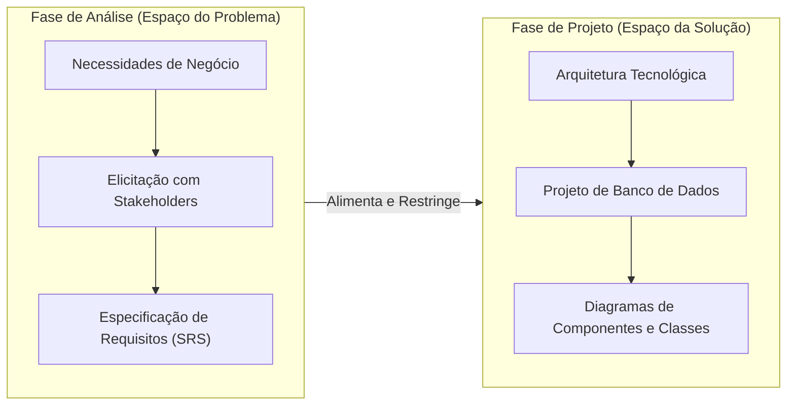

### Tabela comparativa: Análise versus Projeto

| Dimensão | Fase de Análise | Fase de Projeto (Design) |
| :--- | :--- | :--- |
| **Domínio** | Problema (Negócio / Usuário). | Solução (Tecnologia / Engenharia). |
| **Pergunta norteadora** | O que deve ser resolvido? Quais as regras? | Como construir a solução tecnológica? |
| **Responsável típico** | Analista de Requisitos, Product Owner, Analista de Negócios. | Arquiteto de Software, Tech Lead, Engenheiro de Software. |
| **Linguagem utilizada** | Vocabulário do cliente e do domínio da aplicação. | Vocabulário técnico (classes, threads, índices, APIs, frameworks). |
| **Independência tecnológica** | Alta (o requisito existe independentemente da linguagem de programação). | Baixa (decisões vinculadas a frameworks, bancos e hardware). |

---

## Gestão de projetos e fases do ciclo de vida de software

### Ciclos de vida e dinâmicas de fases

Segundo o corpo de conhecimento do PMBOK (*Project Management Body of Knowledge*) e as normas de ciclo de vida de software (ISO/IEC/IEEE 12207), **todo projeto de software é estruturado como uma sequência de fases**, conjunto denominado **Ciclo de Vida do Projeto**.

Um projeto pode apresentar fases organizadas das seguintes maneiras:
1. **Sequencial (Cascata/Linear):** Uma fase só tem início após o término formal e homologação da fase anterior. Apresenta alta previsibilidade documental, mas baixa tolerância a mudanças tardias.
2. **Iterativa e Incremental:** O sistema é decomposto em entregas parciais sucessivas. A cada ciclo (iteração), realizam-se análise, projeto, codificação e testes, gerando versões operacionais funcionais do produto.
3. **Sobreposta (Fases Concorrentes):** Uma fase posterior é iniciada antes da conclusão definitiva da fase anterior (técnica também denominada *fast-tracking*). Exige comunicação estreita para evitar retrabalho estrutural.

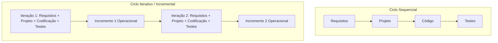

### Adaptação organizacional

Cada organização ou tipologia de projeto requer um arranjo específico de ciclo de vida:
- Sistemas críticos (aeroespaciais, médicos, transacionais bancários pesados) tendem a demandar ciclos mais dirigidos a planos e rigor formal.
- Softwares comerciais de mercado, startups e aplicações web frequentemente operam sob ciclos iterativos e adaptativos (Scrum, Kanban, XP) com entregas contínuas.

---

## Elicitação de requisitos e fontes de informação

### Definição do processo

A **elicitação de requisitos** (ou levantamento) é o estágio técnico da Engenharia de Requisitos no qual engenheiros, analistas e usuários colaboram para descobrir, articular e esclarecer o problema que o software deve solucionar, delimitando serviços e restrições.

O processo não consiste em mero ato de "escutar passivamente" o cliente, mas em uma investigação ativa, na qual são descobertas necessidades não declaradas, contradições e gargalos operacionais.

```mermaid
flowchart LR
    Fontes["Fontes de Informação"] --> Elicitacao["Processo de Elicitação"]
    Elicitacao --> Negociacao["Negociação e Priorização"]
    Negociacao --> Validacao["Validação e Especificação"]
    
    subgraph FontesTipicas["Fontes Relevantes"]
        F1["Stakeholders (Usuários, Clientes, Gestores)"]
        F2["Domínio da Aplicação"]
        F3["Ambiente Operacional e Infraestrutura"]
        F4["Ambiente Organizacional (Leis, Políticas, Cultura)"]
        F5["Sistemas Legados e Similares"]
        F6["Documentações e Regulamentos"]
    end
    
    FontesTipicas -.-> Fontes
```

### Amplitude das fontes de informação

Um erro frequente na prática e em questões de concurso consiste em assumir que apenas o cliente ou contratante é fonte relevante:
1. **Stakeholders:** Todos os indivíduos ou grupos direta ou indiretamente afetados pelo sistema (usuários finais, operadores, gestores, equipe de suporte, auditores e equipe de segurança).
2. **Domínio da aplicação:** O conjunto de conceitos, regras matemáticas, jargões e práticas que regem a área de atuação (exemplo: cálculos de contabilidade, princípios de farmacologia, normas aeronáuticas).
3. **Ambiente operacional:** As plataformas onde o software funcionará (sistemas operacionais, redes, servidores, restrições de memória, browsers e dispositivos móveis).
4. **Ambiente organizacional:** Políticas corporativas internas, disputas departamentais, estrutura hierárquica e metas estratégicas.

---

## Métodos de coleta de dados: questionários, entrevistas e grupos focais

A escolha da técnica de coleta depende do perfil dos interlocutores, da dispersão geográfica, da profundidade necessária e do estágio de maturidade do projeto.

### 1. Questionários estruturados e semiestruturados
- **Conceito:** Instrumentos com formulários contendo perguntas fechadas (múltipla escolha, escalas Likert) ou abertas, aplicados a uma amostra ou à totalidade do público-alvo.
- **Indicação:** Coleta em larga escala, distribuição geográfica ampla, baixo custo orçamentário e quando se busca validação estatística ou quantitativa.
- **Limitações:** Alta taxa de abstenção/baixo retorno, superficialidade das respostas, impossibilidade de esclarecer dúvidas do respondente em tempo real e falta de detalhamento subjetivo.

### 2. Entrevistas (Abertas, Fechadas e Semiestruturadas)
- **Conceito:** Comunicação verbal direta entre o analista e os stakeholders.
  - *Abertas (Não estruturadas):* Sem roteiro rígido; exploratórias; ideais para entender necessidades subjetivas, expectativas profundas e novos domínios.
  - *Estruturadas (Fechadas):* Roteiro padronizado com perguntas pré-fixadas; facilitam comparações diretas entre respostas.
  - *Semiestruturadas:* Combinam perguntas-base com liberdade para aprofundamento durante a conversa.
- **Indicação:** Investigação de fluxos de trabalho complexos, compreensão de sentimentos, atritos organizacionais e subjetividades.
- **Limitações:** Alto consumo de tempo, elevado custo logístico e risco de viés interpessoal.

### 3. Grupos focais (Focus Groups)
- **Conceito:** Sessões mediadas reunindo de 6 a 12 participantes representativos para debater funcionalidades, problemas e ideias de produtos.
- **Indicação:** Geração de novas ideias, análise de aceitação de conceitos inovadores e identificação de consensos e conflitos entre departamentos.
- **Limitações:** Tendência à inibição de participantes mais introvertidos ou domínio da sessão por personalidades dominantes (*efeito manada*).

### Tabela comparativa: Métodos de coleta de dados

| Método | Custo | Alcance / Amostra | Profundidade Subjetiva | Taxa de Retorno | Indicado para |
| :--- | :--- | :--- | :--- | :--- | :--- |
| **Questionário Online** | Baixo | Muito alto (massivo) | Baixa / Superficial | Tipicamente baixa (5% a 20%) | Levantamento quantitativo preliminar e pesquisas demográficas de uso. |
| **Entrevista Aberta** | Alto | Reduzido (individual) | Altíssima | Altíssima (presencial / agendada) | Domínio desconhecido, necessidades subjetivas e regras complexas. |
| **Grupo Focal** | Médio-Alto | Médio (amostral) | Média-Alta | Alta | Avaliação de protótipos, geração de ideias e alinhamento de expectativas. |
| **Análise Documental** | Muito Baixo | Fontes pré-existentes | Neutra (factual/histórica) | Total (documentos disponíveis) | Legislação, manuais de sistemas legados, relatórios de auditoria e formulários físicos. |

---

## Técnicas de observação participante e não participante

Frequentemente, os usuários realizam tarefas mecânicas ou tácitas que não conseguem articular com clareza em entrevistas. Para capturar essa realidade empírica, a Engenharia de Software emprega técnicas de **observação direta (etnografia)**.

### Observação participante
- **Conceito:** O analista integra-se ativamente ao ambiente dos usuários, vivenciando as rotinas diárias e, em alguns cenários, executando partes da atividade operacional em conjunto com os colaboradores.
- **Vantagens:** Revela o trabalho real (*work-as-done*) em contraste com o trabalho oficial prescrito (*work-as-imagined*). Expõe atalhos informais, "gambiarras" operacionais e falhas de comunicação.
- **Desvantagens:** Requer longo período de imersão; risco do observador interferir ou alterar a rotina original pela sua participação ativa.

### Observação não participante
- **Conceito:** O analista atua como observador externo silencioso. Ele acompanha a execução dos processos sem interagir, sem opinar e sem interromper os colaboradores, registrando comportamentos naturais e fluxos reais.
- **Vantagens:** Coleta dados comportamentais autênticos sem introduzir interferência direta imediata na dinâmica do processo.
- **Desvantagens:** O observador não pode sanar dúvidas pontuais durante o ato observado, necessitando de sessões posteriores de esclarecimento (*debriefing*).

### Observação e testes de usabilidade
Quando um sistema em operação apresenta alta taxa de rejeição, cancelamento de fluxo ou abandono de tarefas (por exemplo, carrinhos de compras abandonados ou telas abandonadas no meio do preenchimento), a combinação mais eficaz é a **observação direta com testes de usabilidade**:
- Coloca-se o usuário final diante do sistema sob monitoramento de interações.
- Analisam-se pontos de hesitação, cliques erráticos, tempos excessivos em campos específicos e expressões de frustração.

---

## Métricas de especificação para requisitos não funcionais

### A imperativa quantificação dos requisitos não funcionais

Um dos maiores desafios na Engenharia de Requisitos consiste na tendência de stakeholders escreverem requisitos não funcionais de forma ambígua e qualitativa (exemplo: *"O sistema deve ser rápido"*, *"A interface deve ser amigável"* ou *"O software deve ser seguro"*).

> **Diretriz clássica (Sommerville & Pressman):** Requisitos Não Funcionais devem ser formulados de maneira **quantitativa e mensurável**, viabilizando testes objetivos de homologação e aceitação técnica.

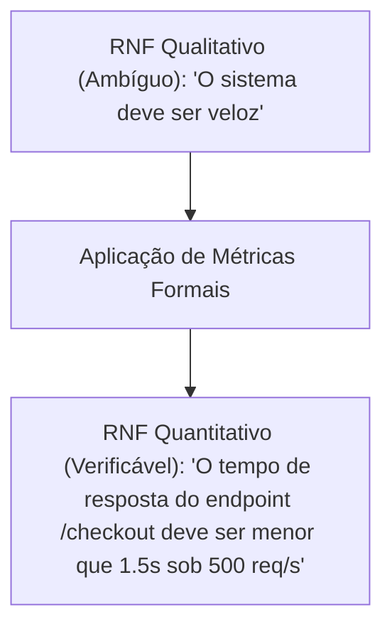

### Principais dimensões e suas métricas formais

1. **Velocidade / Desempenho:**
   - *Métricas:* Número de transações processadas por segundo (TPS); tempo de resposta a consultas em milissegundos ou segundos; taxa de transferência de dados (throughput).
2. **Tamanho:**
   - *Métricas:* Quantidade de memória RAM alocada em megabytes/gigabytes; espaço em disco consumido; tamanho do pacote binário.
3. **Facilidade de Uso (Usabilidade):**
   - *Métricas:* Tempo de treinamento necessário para que um operador atinja proficiência; tempo médio para completar uma tarefa típica; número de cliques/telas para alcançar um objetivo; taxa de erros cometidos por hora de operação.
4. **Confiabilidade:**
   - *Métricas:* Tempo Médio Entre Falhas (**MTBF** - *Mean Time Between Failures*); Tempo Médio Para Falhar (**MTTF** - *Mean Time To Failure*); probabilidade de indisponibilidade em regime contínuo (ex: 99,99%); taxa de falha por período operacional.
5. **Robustez:**
   - *Métricas:* Tempo necessário para recuperação completa pós-falha (**MTTR** - *Mean Time To Repair*); porcentagem de dados mantidos íntegros após crash não planejado; taxa de falhas catastróficas que exigem intervenção humana.
6. **Portabilidade:**
   - *Métricas:* Percentual de código específico da plataforma que precisa ser reescrito; número de sistemas operacionais suportados sem refatoração do núcleo; tempo necessário para migrar o sistema para um novo servidor.

### Tabela de métricas formais para RNF

| Propriedade de Qualidade | Métrica Formal Clássica | Exemplo de Especificação Correta |
| :--- | :--- | :--- |
| **Desempenho** | Transações por segundo (TPS) / Tempo de resposta | "O sistema deve processar 250 transações por segundo com latência máxima no percentil 95 de 800 ms." |
| **Confiabilidade** | MTTF (Mean Time To Failure) / Taxa de falhas | "O sistema deve apresentar um MTTF superior a 720 horas de operação ininterrupta." |
| **Usabilidade** | Tempo de treinamento / Tempo de execução da tarefa | "Um usuário sem treinamento prévio deve ser capaz de emitir uma nota fiscal em até 3 minutos." |
| **Robustez** | MTTR (Mean Time To Repair) | "Em caso de queda do nó primário, o tempo médio para restauração automática do serviço (MTTR) deve ser inferior a 30 segundos." |
| **Portabilidade** | Grau de dependência de plataforma | "O código-fonte deve rodar nas distribuições Linux Ubuntu 22.04 e Red Hat 9 sem alteração em mais de 2% das linhas de código." |

---

## Conceito e classificação de atores na UML (primários e secundários)

### Definição formal de ator

De acordo com o padrão **UML 2.5 da OMG**, um **Ator** representa uma entidade externa ao sistema de software que com ele interage diretamente, trocando estímulos e dados.

Características mandatórias de um ator:
- Encontra-se sempre **fora da fronteira do sistema** (*system boundary*).
- Não representa um indivíduo específico (como "João da Silva"), mas sim um **papel social ou funcional** desempenhado perante o software.
- Pode ser um **usuário humano** (ex: *Operador de Caixa*, *Administrador*, *Médico*), um **dispositivo de hardware especializado** (ex: *Sensor de Temperatura*, *Leitor Biométrico*) ou um **sistema externo de software** (ex: *Gateway de Pagamento*, *Serviço da Receita Federal*, *API dos Correios*).

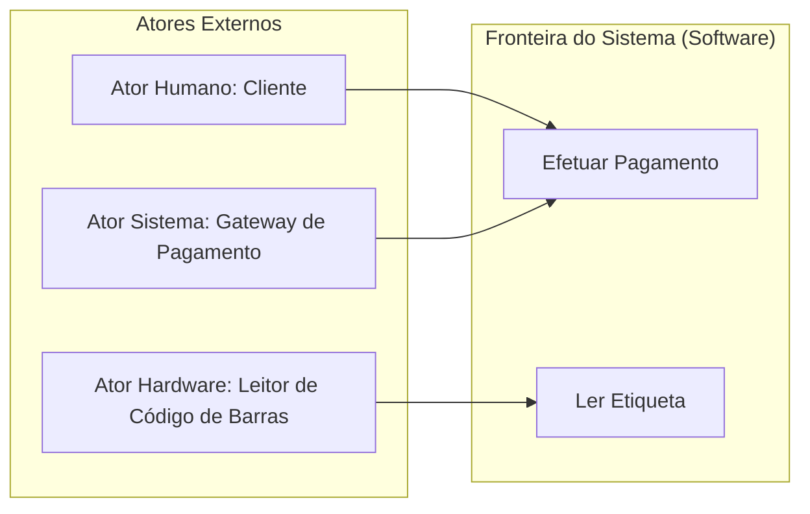

### Classificação: Atores Primários versus Atores Secundários

A distinção entre atores primários e secundários reside fundamentalmente no **papel funcional** que eles exercem na consecução do objetivo do caso de uso (Alistair Cockburn, *Writing Effective Use Cases*):

1. **Ator Primário:**
   - É aquele que **inicia a execução** do caso de uso com o propósito de atingir um objetivo de negócio relevante para si.
   - É o beneficiário direto do valor gerado pela funcionalidade.
   - *Exemplo:* Em "Sacar Dinheiro", o *Cliente* é o ator primário.

2. **Ator Secundário (ou de Apoio / Suporte):**
   - É aquele que **participa do caso de uso**, provendo serviços complementares, autenticações ou persistência de dados solicitados pelo sistema.
   - Geralmente é passivo na inicialização: ele não "acorda" o sistema; o sistema o invoca em resposta à solicitação do ator primário.
   - *Exemplo:* Em "Efetuar Compra Online", a *Operadora de Cartão de Crédito* é um ator secundário invocado para aprovar a transação.

---

## Relacionamentos e herança/especialização entre atores

### O mecanismo de generalização/especialização de atores

Na UML, atores podem estabelecer relacionamentos entre si. O relacionamento mais relevante e poderoso entre atores é a **Generalização / Especialização** (comumente tratada como herança de atores).

- **Semântica:** Um ator especializado herda todos os casos de uso, papéis, regras de acesso e privilégios associados ao ator generalizado (superator), além de poder interagir com casos de uso exclusivos específicos do seu papel especializado.
- **Representação gráfica:** Linha contínua com ponta de seta triangular fechada (e vazada) apontando do ator especializado para o ator generalizado.

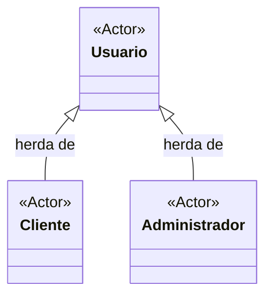

### Exemplo funcional de modelagem de herança

Imagine um sistema bancário universitário:
- O ator geral `Usuario` pode interagir com o caso de uso `Efetuar Login` e `Alterar Senha`.
- O ator `Cliente` especializa `Usuario`: herda login e senha, e pode interagir com `Consultar Saldo` e `Transferir Recursos`.
- O ator `Gerente` especializa `Usuario`: herda login e senha, e pode interagir com `Aprovar Linha de Crédito`.

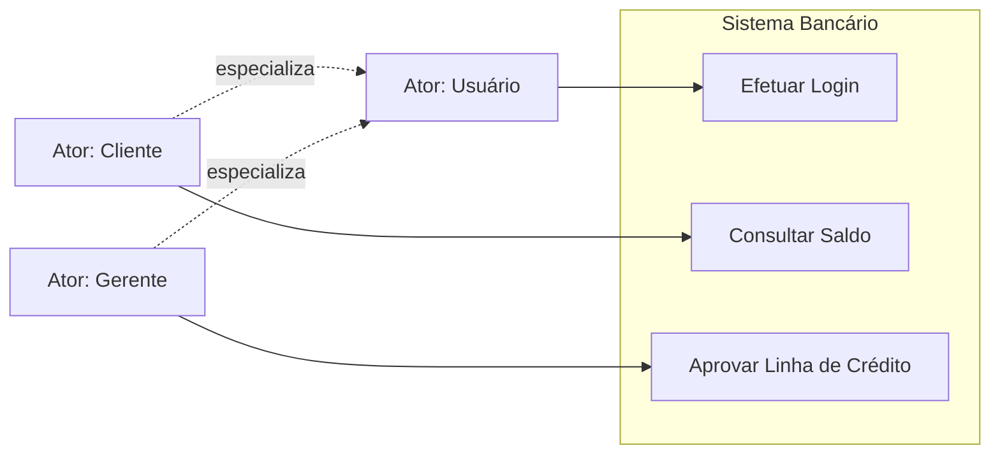

---

## Objetivos e modelagem de diagramas de casos de uso

### Finalidade do Diagrama de Casos de Uso (DCU)

O Diagrama de Casos de Uso é o modelo comportamental da UML destinado a:
1. **Capturar e comunicar os requisitos funcionais** do sistema sob a perspectiva dos usuários externos.
2. **Definir a fronteira do sistema** (*System Boundary*), discriminando o que pertence ao escopo computacional e o que pertence ao ambiente externo.
3. **Servir de base para o planejamento de testes**, elaboração de cenários de teste de aceitação e estimativa de esforço de desenvolvimento.

> **Importante para a prova:** O diagrama de casos de uso **NÃO** descreve a estrutura interna de software (isso é responsabilidade do Diagrama de Classes e Componentes), nem detalha algoritmos internos passo a passo (responsabilidade dos Diagramas de Atividades e Sequência).

### Elementos constitutivos

- **Fronteira do Sistema (Retângulo):** Caixa delimitadora com o nome do sistema no topo, abrigando internamente os casos de uso. Os atores permanecem sempre fora do retângulo.
- **Caso de Uso (Elipse):** Descrição textual de uma sequência atômica de interações que produz um resultado observável de valor para um ator. Utiliza sempre verbo no infinitivo seguido de substantivo (ex: *Emitir Relatório Financeiro*).
- **Associação (Linha sólida):** Conecta um ator a um caso de uso, denotando canal de comunicação.
- **Relacionamentos entre Casos de Uso:**
  - `<<include>>`: Representa inclusão obrigatória de comportamento compartilhado. Sem ele, o caso de uso base não se completa.
  - `<<extend>>`: Representa extensão condicional ou opcional, acionada sob pontos de extensão predeterminados.

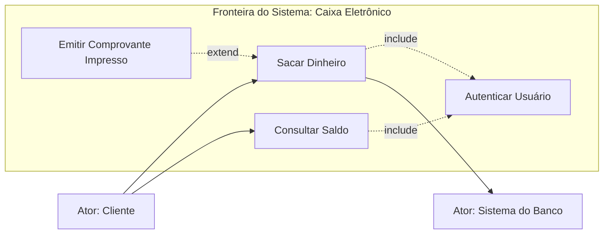

---

## Tipos de manutenção de software: corretiva, adaptativa, preventiva e evolutiva

A manutenção de software representa a fase final e mais duradoura do ciclo de vida, consumindo tipicamente de 60% a 80% do custo total de propriedade (TCO) de um sistema corporativo. De acordo com a norma **ISO/IEC 14764**, as intervenções de manutenção dividem-se em quatro modalidades essenciais:

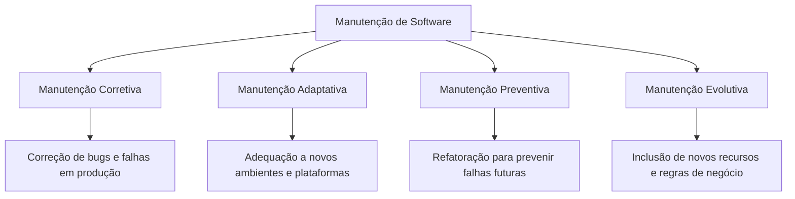

### 1. Manutenção Corretiva
- **Definição:** Intervenção estritamente reativa executada para diagnosticar e **corrigir erros, falhas e bugs** no software que já se encontra em produção.
- **Disparador:** Erros de codificação, falhas de lógica, crashes inesperados de banco de dados ou vulnerabilidades descobertas em ambiente real.
- **Exemplo:** Correção de um cálculo de arredondamento de centavos que resultava em erro no fechamento contábil diário.

### 2. Manutenção Adaptativa
- **Definição:** Modificação realizada no software para mantê-lo operacional e compatível frente a **mudanças no ambiente operacional externo** (plataformas de hardware, sistemas operacionais, novas versões de banco de dados, bibliotecas de terceiros ou novas legislações).
- **Disparador:** Mudança tecnológica ou regulatória externa, sem que o software em si tenha falhado internamente.
- **Exemplo:** Atualizar o backend de Node.js 16 para Node.js 20 após o encerramento do ciclo de suporte (EOL) da versão antiga, ou ajustar o módulo de faturamento para cumprir nova alíquota exigida por lei.

### 3. Manutenção Preventiva (ou Manutenção Perfectiva de Manutenibilidade)
- **Definição:** Ação proativa executada para detectar e **mitigar problemas potenciais antes que eles se transformem em falhas reais**, além de melhorar a manutenibilidade e a legibilidade do código-fonte (engenharia reversa e refatoração).
- **Disparador:** Débito técnico acumulado, códigos acoplados (code smells) e risco de degradação futura de performance.
- **Exemplo:** Reestruturar módulos complexos através de refatoração para aplicação de padrões de projeto (*Design Patterns*), reescrever índices no banco de dados para evitar lentidão futura ou aumentar a cobertura de testes unitários.

### 4. Manutenção Evolutiva (ou Perfectiva Funcional)
- **Definição:** Adição de **novas funcionalidades, melhorias de desempenho solicitadas pelo usuário** ou expansão do escopo original de negócio.
- **Disparador:** Novas demandas do mercado, pedidos expressos de clientes ou evolução da estratégia da empresa.
- **Exemplo:** Implementar autenticação em duas etapas via aplicativo autenticador em um sistema que anteriormente só suportava login por senha simples.

### Tabela comparativa dos tipos de manutenção

| Modalidade | Natureza | Momento / Disparador | Foco Principal | Exemplo Real |
| :--- | :--- | :--- | :--- | :--- |
| **Corretiva** | Reativa | Ocorre **após a falha** em produção. | Eliminar erros, travamentos e comportamentos incorretos. | Ajuste em query SQL que causava erro `NullPointerException` ao emitir fatura. |
| **Adaptativa** | Proativa / Reativa ao ambiente | Ocorre por **mudança externa** (SO, leis, APIs de terceiros). | Manter compatibilidade com nova plataforma ou exigência legal. | Ajustar o aplicativo mobile para suportar as diretrizes de permissão do Android 14. |
| **Preventiva** | Proativa | Ocorre **antes da falha**, buscando longevidade. | Aumentar a manutenibilidade, refatorar código e reduzir débito técnico. | Refatorar uma classe "Deus" de 4.000 linhas em serviços desacoplados e tipados. |
| **Evolutiva** | Expansiva | Ocorre por **novas necessidades** de negócio. | Adicionar novos recursos e agregar valor funcional. | Adicionar opção de pagamento via Pix a um e-commerce que só aceitava cartão. |

---

## Código da aula

Embora a revisão de Engenharia de Software I concentre-se prioritariamente em diagramas e especificações metodológicas, a especificação moderna de requisitos traduz-se em artefatos de engenharia precisos. A seguir são demonstradas representações técnicas equivalentes utilizadas na indústria para materializar Requisitos Funcionais e Não Funcionais:

### Exemplo de Especificação Textual de Caso de Uso

```markdown
CASO DE USO: UC01 - Efetuar Cadastro de Usuário
ATOR PRIMÁRIO: Visitante do Site
ATORES SECUNDÁRIOS: Serviço de Envio de E-mails (SendGrid)
OBJETIVO: Permitir que um visitante registre-se na plataforma fornecendo e-mail válido e senha segura.
PRÉ-CONDIÇÃO: O visitante deve ter acesso à internet e não possuir conta previamente ativada com o mesmo e-mail.
PÓS-CONDIÇÃO: O registro do usuário é persistido com status "Pendente de Confirmação" e um e-mail de ativação é despachado.

FLUXO PRINCIPAL:
1. O visitante seleciona a opção "Criar Conta".
2. O sistema exibe o formulário de cadastro requisitando: Nome Completo, E-mail, Senha e Confirmação de Senha.
3. O visitante preenche as informações e confirma o envio.
4. O sistema valida os campos conforme regras de negócio:
   a) Formato de e-mail válido.
   b) Senha contendo no mínimo 8 caracteres, uma letra maiúscula, um número e um caractere especial.
   c) Correspondência idêntica entre senha e confirmação de senha.
5. O sistema verifica a unicidade do e-mail no banco de dados.
6. O sistema persiste as informações do novo usuário criptografando a senha (hash com salt via BCrypt).
7. O sistema solicita ao Serviço de Envio de E-mails o envio do link de confirmação.
8. O sistema exibe mensagem de sucesso orientando o usuário a verificar sua caixa postal.
9. O caso de uso é encerrado com sucesso.

FLUXOS ALTERNATIVOS E DE EXCEÇÃO:
4.a - Senha em desconformidade: O sistema alerta o usuário sobre as regras de complexidade e solicita nova digitação.
5.a - E-mail já cadastrado: O sistema exibe mensagem informando a duplicidade e sugere a recuperação de senha.
7.a - Falha de comunicação com o serviço de e-mail: O sistema enfileira o envio em mensageria assíncrona para reprocessamento automático e conclui o cadastro com aviso ao usuário.
```

### Exemplo de Especificação em BDD (Gherkin) para Requisito Não Funcional

```gherkin
# language: pt
Funcionalidade: Desempenho e Robustez na Consulta de Catálogo
  Como um usuário da loja virtual
  Desejo pesquisar produtos com alta velocidade
  Para que minha experiência de navegação seja fluida e sem interrupções

  Cenário: Consulta com carga simultânea de usuários (Requisito Não Funcional de Desempenho)
    Dado que o sistema está em operação com até 1000 usuários simultâneos
    Quando um usuário submete uma pesquisa por palavra-chave na barra de busca
    Então a listagem de produtos retornados deve ser renderizada em menos de 1.5 segundos
    E o consumo de CPU do servidor não deve exceder 75% durante o pico
```

---

## Exercícios

Abaixo constam as 28 questões integrantes dos formulários de revisão oficial da disciplina, resolvidas com o rigor exigido na avaliação AV1.

### Bloco 1: Revisão Geral de Conceitos (Questões 1 a 13)

#### Exercício 1
**Enunciado:** O processo de Análise de Requisitos busca definir um conjunto de requisitos que precisam ser validados quando o software estiver pronto. Com relação a este assunto são realizadas as seguintes afirmações:  
I. Um Requisito Funcional é um requisito de sistema de software que especifica uma função que o sistema ou componente deve ser capaz de realizar.  
II. Um Requisito Não Funcional de software é aquele que descreve como o sistema fará e não o que ele fará. São exemplos de Requisitos Não Funcionais os requisitos de desempenho, requisitos da interface externa do sistema, restrições de projeto e atributos da qualidade.  
III. As fontes de informações durante a fase de obtenção de requisitos incluem documentação, stakeholders de sistema e especificações de sistemas similares.  
IV. Requisitos permanentes são requisitos que irão mudar durante o processo de desenvolvimento do sistema ou depois que o sistema estiver em operação.  
Em relação a estas afirmações, assinale a alternativa correta:  
- A-) Somente as afirmações I, II e III estão corretas.  
- B-) Somente as afirmações I, II e IV estão corretas.  
- C-) Somente as afirmações II, III e IV estão corretas.  
- D-) Somente a afirmação I está correta.  
- E-) Somente as afirmações I e IV estão corretas.  

**Gabarito comentado: Alternativa A**  
**Raciocínio detalhado:**
- **Afirmação I (Correta):** Sintetiza perfeitamente a definição formal de RF (o que o sistema deve executar).
- **Afirmação II (Correta):** Captura a visão didática consolidada de que os RNFs expressam restrições operacionais e de qualidade ("como"), exemplificando com desempenho, interfaces externas e atributos de qualidade.
- **Afirmação III (Correta):** Documentos, partes interessadas e sistemas análogos/legados formam o núcleo primordial de fontes de elicitação.
- **Afirmação IV (Incorreta):** A definição apresentada é de **requisitos voláteis** (ou mutáveis). Requisitos permanentes caracterizam-se exatamente por sua estabilidade e resistência a mudanças ao longo do tempo.

---

#### Exercício 2
**Enunciado:** A fase de análise define os requisitos do cliente, conforme as necessidades de negócio, e as considerações técnicas envolvidas, que se agrupam em uma solução tecnológica, compõem a fase de projeto de software.  
- A-) Verdadeiro  
- B-) Falso  

**Gabarito comentado: Alternativa A (Verdadeiro)**  
**Raciocínio detalhado:** A Engenharia de Software estabelece uma fronteira clara: a Análise foca no domínio do negócio e nos requisitos dos stakeholders (o problema), enquanto o Projeto (Design) estrutura a arquitetura técnica, as linguagens, os esquemas de dados e os componentes operacionais (a solução).

---

#### Exercício 3
**Enunciado:** Sobre gestão de projetos, analise as afirmativas abaixo.  
I. Todo projeto pode ser encarado como uma sequência de fases, e a isso denomina-se ciclo de vida do projeto.  
II. Um projeto pode ser composto por uma ou várias fases que, por sua vez, podem ser executadas de maneira sequencial, iterativa ou sobreposta.  
III. Cada projeto (ou tipo de projeto dentro da organização) terá um sequenciamento de fases que permitirá a sua melhor gestão.  
Estão corretas as afirmativas:  
- A-) I apenas  
- B-) II apenas  
- C-) I, II e III  
- D-) I e III apenas  
- E-) III apenas  

**Gabarito comentado: Alternativa C (I, II e III)**  
**Raciocínio detalhado:**
- A afirmativa I traduz a definição canônica de Ciclo de Vida do Projeto.
- A afirmativa II descreve fielmente as formas estruturais de transição de fases (cascata/sequencial, espiral/iterativo e rápido/sobreposto).
- A afirmativa III atesta a flexibilidade metodológica necessária para adequar a governança de engenharia à complexidade do produto.

---

#### Exercício 4
**Enunciado:** Um requisito de software expressa as necessidades e restrições colocadas em um produto de software que contribuem para a solução de algum problema do mundo real. Acerca desse assunto, assinale a opção correta.  
- A-) Os contratantes ou clientes são os principais colaboradores envolvidos no fornecimento de informações para o processo de levantamento ou elicitação de requisitos de software, os demais grupos de pessoas que podem fornecer informações são considerados de importância secundária.  
- B-) As necessidades dos usuários a serem atendidas por um produto de software constituem a classe de requisitos funcionais, e as restrições mencionadas na definição de requisitos constituem a classe de requisitos não funcionais.  
- C-) Entre as fontes de informação para a elicitação de requisitos, destacam-se, além dos colaboradores, o conhecimento do domínio de aplicação em que o software funcionará, o ambiente operacional do software e o ambiente organizacional.  
- D-) A negociação de requisitos, de forma similar à observação do ambiente organizacional, é uma atividade típica da fase de elicitação de requisitos.  
- E-) A técnica de casos de uso, empregada em alguns modelos de desenvolvimento de software atuais, é mais aderente à construção de cenários durante a construção de protótipos que durante a elicitação de requisitos.  

**Gabarito comentado: Alternativa C**  
**Raciocínio detalhado:**
- A alternativa A está incorreta porque desconsidera os usuários finais reais e os operadores, que frequentemente conhecem o trabalho real muito melhor que os contratantes corporativos.
- A alternativa B é imprecisa na literatura acadêmica, pois existem restrições que incidem pontualmente em operações e usuários também podem ter necessidades de qualidade.
- A alternativa C está perfeita: cita o trio conceitual clássico formulado por Ian Sommerville (domínio, ambiente operacional e ambiente organizacional).
- A alternativa D erra ao colocar a negociação dentro da elicitação; negociação é uma etapa subsequente de análise e resolução de conflitos.
- A alternativa E erra ao restringir casos de uso à prototipação, quando são ferramentas consagradas de especificação e elicitação.

---

#### Exercício 5
**Enunciado:** Em um projeto de desenvolvimento de software, qual método de coleta de dados é mais indicado quando se busca compreender profundamente as necessidades subjetivas dos usuários?  
- A) Questionários estruturados  
- B) Entrevistas abertas  
- C) Análise documental  
- D) Observação automatizada  

**Gabarito comentado: Alternativa B**  
**Raciocínio detalhado:** Necessidades subjetivas envolvem impressões, incertezas, frustrações e desejos tácitos. Entrevistas abertas proporcionam a flexibilidade dialógica necessária para sondar motivações profundas, impossíveis de serem capturadas por perguntas pré-formatadas ou logs de máquina.

---

#### Exercício 6
**Enunciado:** Qual é a principal limitação do uso de questionários como método de coleta de dados?  
- A) Alto custo de aplicação  
- B) Dificuldade de análise quantitativa  
- C) Baixa taxa de retorno e superficialidade nas respostas  
- D) Impossibilidade de padronização  

**Gabarito comentado: Alternativa C**  
**Raciocínio detalhado:** Questionários são baratos e simples de mensurar estatisticamente, mas sofrem historicamente com o desinteresse dos respondentes (baixo retorno percentual) e a impossibilidade de o analista solicitar réplicas imediatas diante de respostas vagas (superficialidade).

---

#### Exercício 7
**Enunciado:** A técnica de observação participante é caracterizada por:  
- A) Coleta de dados por meio de formulários online  
- B) Participação ativa do pesquisador no ambiente estudado  
- C) Análise de documentos históricos  
- D) Uso exclusivo de dados numéricos  

**Gabarito comentado: Alternativa B**  
**Raciocínio detalhado:** A observação participante baseia-se na imersão direta e envolvimento ativo do engenheiro/pesquisador na rotina dos colaboradores, trabalhando em conjunto com os operadores para vivenciar as dificuldades do processo.

---

#### Exercício 8
**Enunciado:** Uma empresa deseja melhorar a usabilidade de seu sistema interno. Qual combinação de métodos de coleta de dados seria mais eficaz?  
- A) Apenas análise documental  
- B) Questionários e entrevistas  
- C) Observação e testes de usabilidade  
- D) Apenas entrevistas estruturadas  

**Gabarito comentado: Alternativa C**  
**Raciocínio detalhado:** Usabilidade avalia facilidade de aprendizado, ergonomia e taxa de erros reais na interface. A observação direta do usuário manipulando o sistema combinada com testes formais de usabilidade fornece métricas precisas sobre onde ocorrem hesitações, cliques errados e gargalos práticos.

---

#### Exercício 9
**Enunciado:** Qual método é mais adequado para coletar dados em larga escala com baixo custo?  
- A) Entrevistas presenciais  
- B) Observação direta  
- C) Questionários online  
- D) Grupos focais  

**Gabarito comentado: Alternativa C**  
**Raciocínio detalhado:** Formulários e questionários digitais possuem custo marginal próximo de zero após sua elaboração, permitindo distribuição quase instantânea para milhares de usuários simultaneamente.

---

#### Exercício 10
**Enunciado:** Em um ambiente ágil, qual método de coleta de dados é mais utilizado de forma contínua?  
- A) Entrevistas formais  
- B) Questionários extensos  
- C) Feedback contínuo com usuários  
- D) Análise estatística  

**Gabarito comentado: Alternativa C**  
**Raciocínio detalhado:** Metodologias ágeis (Scrum, Kanban, XP) preconizam iterações curtas com entregas frequentes de software funcional, orientando o refinamento do backlog pelo feedback empírico constante de usuários e clientes ao término de cada sprint.

---

#### Exercício 11
**Enunciado:** Qual método permite analisar comportamentos reais sem interferência direta?  
- A) Entrevista  
- B) Questionário  
- C) Grupo focal  
- D) Observação não participante  

**Gabarito comentado: Alternativa D**  
**Raciocínio detalhado:** Na observação não participante, o analista posiciona-se estritamente como espectador silencioso, sem interagir ou influenciar as ações cotidianas dos indivíduos observados.

---

#### Exercício 12
**Enunciado:** Um sistema apresenta alta taxa de abandono pelos usuários. Qual método de coleta de dados é mais indicado inicialmente?  
- A) Questionário fechado  
- B) Observação do uso do sistema  
- C) Análise documental  
- D) Entrevista estruturada  

**Gabarito comentado: Alternativa B**  
**Raciocínio detalhado:** Quando usuários desistem do uso, frequentemente nem sequer respondem formulários ou entrevistas posteriores. A observação (presencial ou via rastreamento de tela/telemetria analítica) revela o momento exato em que a interface se torna confusa ou inoperante.

---

#### Exercício 13
**Enunciado:** A principal característica da análise documental é:  
- A) Coleta de dados em tempo real  
- B) Uso de fontes já existentes  
- C) Interação com usuários  
- D) Geração de dados qualitativos exclusivamente  

**Gabarito comentado: Alternativa B**  
**Raciocínio detalhado:** A análise documental debruça-se sobre dados secundários e fontes pré-estabelecidas: regulamentos, manuais de operação de sistemas legados, relatórios de auditoria, planilhas existentes e leis que regulam o setor.

---

### Bloco 2: Revisão de Requisitos de Software, Casos de Uso e Manutenção (Questões 14 a 28)

#### Exercício 14 (Formulário 2 - Q1)
**Enunciado:** Requisito Funcional: Qual das seguintes afirmações descreve um requisito funcional?  
- a-) "O sistema deve ser capaz de processar 100 transações por minuto."  
- b-) "O sistema deve permitir que os usuários se cadastrem utilizando e-mail e senha."  
- c-) "O sistema deve ser compatível com navegadores Chrome, Firefox e Safari."  
- d-) "O sistema deve ter uma interface de usuário amigável."  

**Gabarito comentado: Alternativa B**  
**Raciocínio detalhado:**
- A alternativa A define desempenho (RNF).
- A alternativa B define uma ação e serviço que o software oferece diretamente ao usuário final (cadastrar-se com e-mail e senha), configurando um Requisito Funcional clássico.
- A alternativa C trata de portabilidade e compatibilidade de plataforma (RNF).
- A alternativa D expressa usabilidade qualitativa (RNF).

---

#### Exercício 15 (Formulário 2 - Q2)
**Enunciado:** Requisito Não-funcional: Qual das seguintes afirmações descreve um requisito não-funcional?  
- a-) "O sistema deve ser capaz de processar consultas de banco de dados em menos de 5 segundos."  
- b-) "O sistema deve ser acessível para usuários com deficiências visuais."  
- c-) "O sistema deve armazenar backups diários dos dados do usuário."  
- d-) "O sistema deve suportar até 1000 usuários simultâneos."  

**Gabarito comentado: Alternativa A (ou análise aprofundada das opções A, B e D)**  
**Raciocínio detalhado:**  
Esta questão formulada em avaliações acadêmicas clássicas possui como resposta oficial esperada no gabarito a **Alternativa A**, que especifica objetivamente uma restrição de **desempenho e tempo de resposta**.  
*Análise técnica aprofundada:*  
- As alternativas A, B e D tratam, rigorosamente na Engenharia de Software, de atributos não funcionais (A = Desempenho; B = Acessibilidade/Usabilidade; D = Escalabilidade/Capacidade).  
- A alternativa C ("armazenar backups diários"), por envolver a rotina automatizada de persistência e cópia, frequentemente é modelada em contexto operacional como uma função do subsistema de administração de dados.  
- Na prova do Prof. Marcelo Boer, atente-se à Alternativa A como a métrica clássica de tempo de resposta em consultas.

---

#### Exercício 16 (Formulário 2 - Q3)
**Enunciado:** Os requisitos de software são frequentemente classificados como requisitos funcionais e requisitos não funcionais. Em relação aos requisitos não funcionais, assinale a afirmativa correta.  
- a-) Esses requisitos afetam apenas componentes individuais e não à arquitetura geral de um sistema.  
- b-) Os requisitos não funcionais devem ser sempre escritos qualitativamente, para que possam ser objetivamente testados.  
- c-) Os requisitos não funcionais podem estar relacionados às propriedades emergentes do sistema como confiabilidade; tempo de resposta; e, ocupação de área.  
- d-) A característica principal dos requisitos organizacionais, um dos tipos de requisitos não funcionais, é que eles especificam ou restringem o comportamento do software.  

**Gabarito comentado: Alternativa C**  
**Raciocínio detalhado:**
- A alternativa A é falsa: RNFs costumam impactar a **arquitetura global** do sistema (ex: redundância para alta disponibilidade).
- A alternativa B é falsa: devem ser escritos **quantitativamente** para possibilitar testes objetivos.
- A alternativa C está perfeita: propriedades emergentes são aquelas que não residem em um único componente, mas surgem da integração de todo o sistema (confiabilidade, segurança, tempo de resposta e consumo de recursos).
- A alternativa D é falsa: requisitos organizacionais derivam das políticas, metas e padrões da empresa (ex: conformidade com metodologias de desenvolvimento), e não do comportamento pontual das rotinas de software.

---

#### Exercício 17 (Formulário 2 - Q4)
**Enunciado:** O levantamento de requisitos combina elementos de solução de problemas, elaboração, negociação e especificação de um conjunto preliminar de requisitos da solução. Além disso, o levantamento de requisitos pode ser dividido em funcionais e não funcionais. Dessa forma, assinale a principal diferença entre requisitos funcionais e não funcionais:  
- a-) Os requisitos funcionais especificam as interfaces do software com outros sistemas, enquanto os requisitos não funcionais descrevem as funcionalidades do software.  
- b-) Os requisitos funcionais especificam como o software deve se comportar em determinadas condições, enquanto os requisitos não funcionais descrevem as interfaces do software com outros sistemas.  
- c-) Os requisitos funcionais descrevem as interfaces do software com outros sistemas, enquanto os requisitos não funcionais especificam como o software deve se comportar em determinadas condições.  
- d-) Os requisitos funcionais descrevem as funcionalidades do software, enquanto os requisitos não funcionais especificam as características e propriedades do software.  
- e-) Os requisitos funcionais descrevem características de desempenho e segurança, enquanto os requisitos não funcionais especificam como o software deve se comportar em determinadas condições.  

**Gabarito comentado: Alternativa D**  
**Raciocínio detalhado:** Requisitos funcionais dizem respeito às operações e funcionalidades concretas entregues ao usuário, ao passo que os não funcionais determinam as propriedades de qualidade, restrições e atributos gerais de operação da solução.

---

#### Exercício 18 (Formulário 2 - Q5)
**Enunciado:** Na engenharia de software, os requisitos são classificados como funcionais e não funcionais. Considerando os requisitos não funcionais, há algumas métricas capazes de especificá-los. Uma medida para o requisito não funcional é  
- a-) a facilidade de uso, que é o número de transações processadas por segundo.  
- b-) a confiabilidade, que é o tempo médio para falhar.  
- c-) o tamanho, que é o tempo de treinamento requerido.  
- d-) a robustez, que é a capacidade de memória.  
- e-) a portabilidade, que é a taxa de ocorrência de falhas.  

**Gabarito comentado: Alternativa B**  
**Raciocínio detalhado:**
- Facilidade de uso é medida por tempo de treinamento ou taxa de erros (transações por segundo é medida de desempenho).
- **Confiabilidade** é universalmente medida pelo Tempo Médio Para Falhar (**MTTF** - *Mean Time To Failure*) ou MTBF.
- Tamanho é medido em bytes/linhas de código (tempo de treinamento mede usabilidade).
- Robustez é medida pelo tempo para restauração após falha (MTTR) ou probabilidade de corrupção.
- Portabilidade é medida pelo percentual de código reescrito dependente da plataforma.

---

#### Exercício 19 (Formulário 2 - Q6)
**Enunciado:** O que representa um ator em um diagrama de atores?  
- a-) Um objeto físico  
- b-) Uma entidade externa que interage com o sistema  
- c-) Uma classe de objetos  
- d-) Um atributo do sistema  

**Gabarito comentado: Alternativa B**  
**Raciocínio detalhado:** Pela especificação formal da UML, um ator não pertence ao código interno do software, mas sim a uma entidade externa (humano, hardware ou sistema) que troca dados e estímulos com a aplicação.

---

#### Exercício 20 (Formulário 2 - Q7)
**Enunciado:** Qual é o objetivo principal de um diagrama de atores?  
- a-) Representar as relações entre as classes em um sistema  
- b-) Identificar os requisitos funcionais do sistema  
- c-) Visualizar as interações entre os atores e o sistema  
- d-) Descrever a estrutura interna do sistema  

**Gabarito comentado: Alternativa C**  
**Raciocínio detalhado:** O diagrama de atores e casos de uso visa tornar explícitas as fronteiras da aplicação e mapear como entidades externas interagem com as capacidades oferecidas pela solução.

---

#### Exercício 21 (Formulário 2 - Q8)
**Enunciado:** Qual é a principal diferença entre um ator primário e um ator secundário em um diagrama de atores?  
- a-) A quantidade de interações com o sistema  
- b-) O tamanho do ícone usado para representá-los  
- c-) O papel que desempenham no sistema  
- d-) A cor da linha de associação que os conecta ao sistema  

**Gabarito comentado: Alternativa C**  
**Raciocínio detalhado:** O critério de distinção reside no **papel funcional**: o ator primário inicia a interação buscando a satisfação de uma meta própria, enquanto o ator secundário presta um serviço de suporte requerido pelo sistema para concluir o fluxo.

---

#### Exercício 22 (Formulário 2 - Q9)
**Enunciado:** Um ator pode especializar (herdar comportamento de) outro ator, o que confere um significativo poder expressivo adicional ao diagrama de casos de uso.  
- Certo  
- Errado  

**Gabarito comentado: Certo**  
**Raciocínio detalhado:** A UML prevê o relacionamento de Generalização/Especialização entre atores. O ator especializado herda integralmente o acesso aos casos de uso associados ao ator genérico, mantendo casos de uso privativos adicionais.

---

#### Exercício 23 (Formulário 2 - Q10)
**Enunciado:** Qual é o principal objetivo da manutenção de software?  
- a-) Corrigir erros e falhas do software  
- b-) Desenvolver novos recursos para o software  
- c-) Aumentar a velocidade de execução do software  
- d-) Reduzir o tamanho do código-fonte do software  

**Gabarito comentado: Alternativa A**  
**Raciocínio detalhado:** Embora existam tipos adaptativos e evolutivos, a razão primordial, histórica e mais imediata que define a necessidade intrínseca da manutenção de software reside na correção de defeitos e bugs operacionais em ambiente de produção (manutenção corretiva).

---

#### Exercício 24 (Formulário 2 - Q11)
**Enunciado:** Quais são os tipos comuns de manutenção de software?  
- a-) Corretiva, preventiva e adaptativa  
- b-) Iterativa, incremental e ágil  
- c-) Prototipação, evolucionária e espiral  
- d-) Externa, interna e de interface  

**Gabarito comentado: Alternativa A**  
**Raciocínio detalhado:** As opções B e C listam modelos de ciclo de vida e metodologias de processo. Os tipos canônicos de manutenção são Corretiva, Adaptativa, Preventiva e Evolutiva (a alternativa A traz a tríade clássica presente na questão).

---

#### Exercício 25 (Formulário 2 - Q12)
**Enunciado:** O que é a manutenção corretiva de software?  
- a-) Atualização do software para novas plataformas  
- b-) Adição de novos recursos ao software  
- c-) Correção de erros e falhas no software em produção  
- d-) Documentação do código-fonte do software  

**Gabarito comentado: Alternativa C**  
**Raciocínio detalhado:** Manutenção corretiva é, por definição, aquela acionada reativamente para suprimir comportamentos incorretos, inconsistências de dados e interrupções inesperadas (falhas) após o software ter entrado em operação real.

---

#### Exercício 26 (Formulário 2 - Q13)
**Enunciado:** Qual é a diferença entre a manutenção adaptativa e a manutenção preventiva de software?  
- a-) A manutenção adaptativa ocorre após uma falha, enquanto a manutenção preventiva ocorre antes da falha.  
- b-) A manutenção adaptativa envolve a atualização do software para novas plataformas, enquanto a manutenção preventiva envolve a correção de erros.  
- c-) A manutenção adaptativa é planejada, enquanto a manutenção preventiva é reativa.  
- d-) A manutenção adaptativa é realizada para evitar problemas futuros, enquanto a manutenção preventiva é realizada para corrigir problemas existentes.  

**Gabarito comentado: Alternativa B**  
**Raciocínio detalhado:** A manutenção adaptativa foca na adequação a mudanças externas do ecossistema tecnológico (novas plataformas, novos SOs, novas leis), enquanto a manutenção preventiva atua na refatoração e otimização do código para que erros futuros sejam prevenidos e a manutenibilidade seja preservada.

---

#### Exercício 27 (Formulário 2 - Q14)
**Enunciado:** De acordo com a UML, em um diagrama de casos de uso, um ator pode ser uma pessoa como também pode ser um sistema.  
- Certo  
- Errado  

**Gabarito comentado: Certo**  
**Raciocínio detalhado:** A especificação da UML define que atores são quaisquer entidades externas ao sistema. Portanto, sistemas legados, gateways de terceiros e serviços web externos são legitimamente modelados como atores.

---

#### Exercício 28 (Formulário 2 - Q15)
**Enunciado:** Em UML, os diagramas de Caso de Uso têm por objetivo:  
- a-) representar os atributos e operações de uma classe ou objeto.  
- b-) mostrar o fluxo de mensagens de uma atividade do sistema para outra.  
- c-) capturar funcionalidades e requerimentos do sistema.  
- d-) exibir uma interação entre um conjunto de objetos e seus relacionamentos.  
- e-) representar o estado ou situação em que um objeto pode se encontrar no decorrer da execução de processos de um sistema.  

**Gabarito comentado: Alternativa C**  
**Raciocínio detalhado:**
- A alternativa A descreve o Diagrama de Classes.
- A alternativa B descreve o Diagrama de Sequência ou Atividades.
- A alternativa C descreve exatamente o objetivo central dos Casos de Uso: expressar os requisitos funcionais e os serviços oferecidos sob o olhar externo.
- A alternativa D descreve o Diagrama de Comunicação/Colaboração.
- A alternativa E descreve o Diagrama de Máquina de Estados.

---

## Erros comuns e boas práticas

### Principais armadilhas conceituais

1. **Confundir Requisito Não Funcional com "Desejo Vago":**
   - *Erro:* "O software deve rodar de forma suave."
   - *Correção:* "O software deve manter taxa de renderização mínima de 60 quadros por segundo sob resolução de 1080p."
2. **Desenhar Atores dentro da Fronteira do Sistema:**
   - *Erro:* Colocar o boneco-palito (*stickman*) do usuário dentro do retângulo que delimita o sistema no diagrama de casos de uso.
   - *Correção:* Atores representam entidades **externas**; devem obrigatoriamente figurar fora do retângulo da fronteira.
3. **Modelar Casos de Uso como Passos de Algoritmo:**
   - *Erro:* Criar um caso de uso para cada clique do usuário (ex: um caso de uso chamado *Clicar no Botão OK* ou *Digitar Senha*).
   - *Correção:* Casos de uso representam transações completas que entregam valor observável de negócio (ex: *Autenticar Usuário*).
4. **Trocar Manutenção Adaptativa por Preventiva:**
   - *Erro:* Dizer que migrar o software de Windows para Linux é manutenção preventiva.
   - *Correção:* Mudança de ambiente operacional é **manutenção adaptativa**. Manutenção preventiva consiste em refatorar o código para melhorar a estrutura antes de surgirem defeitos.
5. **Achar que Negociação faz parte da Elicitação:**
   - *Erro:* Considerar que negociar prazos e escopo já é elicitar.
   - *Correção:* A elicitação descobre e levanta fatos; a análise e a negociação tratam os conflitos descobertos.

---

## Links e materiais complementares

- **Formulário de Revisão Geral para AV1:** Questões sobre o processo de análise, métodos de coleta de dados (entrevistas, observação, questionários), fases do ciclo de vida do projeto e amplitude das fontes de informação.  
  *URL:* `https://docs.google.com/forms/d/e/1FAIpQLSek7MXFyyZS-L-izhvtx2obbkb2z-UVScKG6CoUayx4wwsUkA/viewform`
- **Formulário de Revisão sobre Requisitos de Software e UML:** Questões aprofundadas sobre classificação de RF/RNF, propriedades emergentes, métricas formais, diagramação de atores, herança entre atores e tipos de manutenção de software.  
  *URL:* `https://docs.google.com/forms/d/e/1FAIpQLSd6zutTuz-i2dDV6McV9dF69tidtgBREhZspVirWI9DDCp8hA/viewform`
- **Bibliografia Canônica:**
  - SOMMERVILLE, Ian. *Engenharia de Software*. 9ª e 10ª Edições. Pearson. (Especialmente os capítulos sobre Engenharia de Requisitos e Evolução de Software).
  - PRESSMAN, Roger S.; MAXIM, Bruce R. *Engenharia de Software: Uma Abordagem Profissional*. 8ª Edição. McGraw-Hill.
  - OMG UML 2.5 Specification: Padrão internacional para modelagem de Casos de Uso e Atores.

---

## Mapa da aula

```mermaid
flowchart TD
    Inicio["Engenharia de Software I: Preparatório AV1"] --> Requisitos["Engenharia de Requisitos"]
    Inicio --> CicloVida["Ciclo de Vida e Processos"]
    Inicio --> Modelagem["Modelagem UML"]
    Inicio --> PosEntrega["Pós-Entrega e Sustentação"]
    
    Requisitos --> Classif["Classificação de Requisitos"]
    Classif --> RF["Requisitos Funcionais: Funções do Sistema"]
    Classif --> RNF["Requisitos Não Funcionais: Restrições e Qualidade"]
    RNF --> Metricas["Métricas Formais: MTTF, TPS, MTTR"]
    
    Requisitos --> Elicitacao["Elicitação e Coleta de Dados"]
    Elicitacao --> MetodosColeta["Métodos de Coleta"]
    MetodosColeta --> Entrevistas["Entrevistas Abertas e Estruturadas"]
    MetodosColeta --> Questionarios["Questionários: Larga Escala e Baixo Custo"]
    MetodosColeta --> Observacao["Observação Participante e Não Participante"]
    MetodosColeta --> Documental["Análise Documental: Fontes Existentes"]
    
    CicloVida --> FasesEng["Análise versus Projeto"]
    FasesEng --> Analise["Análise: Espaço do Problema"]
    FasesEng --> Projeto["Projeto: Espaço da Solução"]
    CicloVida --> GestaoFases["Gestão: Sequencial, Iterativo ou Sobreposto"]
    
    Modelagem --> CasosDeUso["Diagrama de Casos de Uso"]
    CasosDeUso --> Atores["Atores: Entidades Externas"]
    Atores --> ClassifAtores["Primários versus Secundários"]
    Atores --> HerancaAtores["Generalização e Especialização"]
    CasosDeUso --> Relacionamentos["Relacionamentos: Include e Extend"]
    
    PosEntrega --> Manutencao["Tipos de Manutenção"]
    Manutencao --> M_Corretiva["Corretiva: Eliminar Bugs Reativos"]
    Manutencao --> M_Adaptativa["Adaptativa: Ajustar a Novas Plataformas"]
    Manutencao --> M_Preventiva["Preventiva: Refatorar e Prevenir Falhas"]
    Manutencao --> M_Evolutiva["Evolutiva: Agregar Novas Funções"]
```

---

## Glossário

| Termo | Definição Formal no Contexto da Disciplina |
| :--- | :--- |
| **Ator** | Entidade externa ao sistema (usuário humano, dispositivo ou outro sistema) que interage ativamente com o software. |
| **Ator Primário** | Ator que inicia um caso de uso para atingir um objetivo de negócio próprio e direto. |
| **Ator Secundário** | Ator invocado pelo sistema para prover um serviço ou suporte durante a realização de um caso de uso. |
| **Ciclo de Vida do Projeto** | Conjunto sequenciado de fases que orientam a gestão e a execução de um empreendimento desde a concepção até a entrega final. |
| **Elicitação de Requisitos** | Fase da Engenharia de Requisitos voltada a descobrir, compreender e levantar necessidades de stakeholders e do domínio da aplicação. |
| **Espaço do Problema** | Domínio abordado na Fase de Análise, concentrado na compreensão das regras de negócio, requisitos dos clientes e metas organizacionais. |
| **Espaço da Solução** | Domínio abordado na Fase de Projeto (Design), estruturado na concepção da arquitetura técnica, banco de dados e componentes de código. |
| **Fronteira do Sistema** | Linha delimitadora (retângulo no DCU da UML) que separa os elementos pertencentes ao software das entidades externas (atores). |
| **Manutenção Adaptativa** | Modificação executada para manter o software compatível diante de mudanças no ambiente externo (SO, banco de dados, leis). |
| **Manutenção Corretiva** | Intervenção reativa destinada a sanar defeitos, bugs e comportamentos anômalos manifestados em ambiente de produção. |
| **Manutenção Evolutiva** | Inclusão de novas regras de negócio, funcionalidades adicionais e melhorias de performance demandadas pelos usuários. |
| **Manutenção Preventiva** | Refatoração proativa realizada para aprimorar a manutenibilidade e evitar que problemas em potencial se tornem falhas reais. |
| **MTBF / MTTF** | Métricas formais de confiabilidade (*Mean Time Between Failures* e *Mean Time To Failure*), que medem o tempo médio de operação contínua sem falhas. |
| **Propriedades Emergentes** | Atributos sistêmicos globais (como confiabilidade, segurança e latência) que derivam da integração total do sistema, e não de componentes isolados. |
| **Requisito Funcional (RF)** | Declaração que especifica uma função, cálculo ou serviço direto que o software deve ser capaz de realizar. |
| **Requisito Não Funcional (RNF)** | Declaração de restrição, desempenho, usabilidade ou padrão de qualidade sob os quais o sistema deve operar. |
| **Requisitos Permanentes** | Requisitos estáveis que compõem o núcleo do domínio do negócio e quase não sofrem alterações ao longo do ciclo de vida. |
| **Requisitos Voláteis** | Requisitos altamente dinâmicos sujeitos a constantes mudanças durante o desenvolvimento ou na operação em produção. |
| **Stakeholder** | Qualquer indivíduo, grupo ou organização que impacta ou é diretamente impactado pelos resultados e operações do sistema de software. |

---

## Pontos-chave para a prova

- **RF vs. RNF:** Pergunte a si mesmo: "Se o sistema deixar de fazer isso, ele quebrou uma funcionalidade pontual (RF) ou feriu uma propriedade de qualidade/restrição de ambiente (RNF)?".
- **Fase de Análise vs. Fase de Projeto:** A Análise responde "O que o negócio precisa?" (Espaço do Problema); o Projeto responde "Como a engenharia vai construir?" (Espaço da Solução).
- **Fontes de Elicitação:** Não se restrinja a "clientes". Fontes incluem stakeholders em geral, domínio da aplicação, sistemas legados/similares, ambiente operacional e ambiente organizacional.
- **Requisitos Permanentes vs. Voláteis:** Lembre-se de que os que mudam constantemente durante o ciclo de vida são os **voláteis** (ou mutáveis). Os permanentes são estáveis.
- **Métricas para RNF:** Nunca aceite termos adjetivos vagos ("rápido", "fácil", "robusto"). Busque números mensuráveis: MTTF para confiabilidade, TPS ou milissegundos para desempenho, e tempo de treinamento para usabilidade.
- **Atores na UML:** Atores são entidades **externas** ao sistema. Podem ser pessoas, hardware ou outros sistemas computacionais. Atores podem herdar comportamentos de outros atores através de generalização/especialização.
- **Distinção Primário x Secundário:** O primário inicia o fluxo para atender a uma meta pessoal/de negócio; o secundário é consultado pelo sistema para apoiar a transação.
- **Tipos de Manutenção:**
  - Consertar bug que estourou em produção = **Corretiva**.
  - O banco de dados mudou de versão ou a lei mudou = **Adaptativa**.
  - Melhorar o código e limpar dívida técnica antes que quebre = **Preventiva**.
  - O cliente pediu um botão novo ou nova função = **Evolutiva**.

---

## Perguntas e respostas (JSONL)

```jsonl
{"pergunta": "Qual é a principal diferença conceitual entre um Requisito Funcional e um Requisito Não Funcional?", "resposta": "O Requisito Funcional descreve o que o sistema deve fazer (funções e cálculos), enquanto o Requisito Não Funcional descreve como ou sob quais restrições o sistema opera (qualidade, desempenho e segurança).", "dificuldade": "Fácil"}
{"pergunta": "Qual a distinção entre requisitos permanentes e requisitos voláteis?", "resposta": "Requisitos permanentes pertencem ao núcleo estável do negócio e raramente mudam; requisitos voláteis mudam frequentemente durante o desenvolvimento ou operação.", "dificuldade": "Médio"}
{"pergunta": "Por que a fase de análise é associada ao espaço do problema e a fase de projeto ao espaço da solução?", "resposta": "A análise investiga e documenta as necessidades e regras do negócio sem vínculo técnico, enquanto o projeto desenha a arquitetura computacional e estruturação tecnológica para atendê-las.", "dificuldade": "Médio"}
{"pergunta": "Quais são as três formas estruturais em que as fases de um ciclo de vida de projeto podem ser executadas?", "resposta": "Podem ser executadas de maneira sequencial (cascata), iterativa (incremental) ou sobreposta (fases concorrentes).", "dificuldade": "Médio"}
{"pergunta": "Por que afirmar que apenas contratantes e clientes são importantes na elicitação de requisitos é incorreto?", "resposta": "Porque usuários finais operacionais, gestores, ambiente organizacional, regras do domínio e legislações possuem conhecimento crucial não dominado apenas pelos contratantes.", "dificuldade": "Fácil"}
{"pergunta": "Qual método de coleta de dados é mais adequado para investigar necessidades subjetivas e por quê?", "resposta": "Entrevistas abertas, pois permitem diálogo interativo, esclarecimento de ambiguidades em tempo real e aprofundamento de sentimentos e percepções.", "dificuldade": "Fácil"}
{"pergunta": "Quais são as principais limitações metodológicas do uso de questionários?", "resposta": "Baixa taxa percentual de retorno dos respondentes e superficialidade nas respostas devido à impossibilidade de diálogo direto.", "dificuldade": "Fácil"}
{"pergunta": "O que caracteriza a técnica de observação participante na elicitação de requisitos?", "resposta": "A imersão e participação ativa do engenheiro/analista na rotina de trabalho dos usuários dentro do ambiente pesquisado.", "dificuldade": "Médio"}
{"pergunta": "Qual abordagem de coleta de requisitos é mais indicada para entender o abandono crônico de um sistema em produção?", "resposta": "Observação direta combinada com testes de usabilidade, para flagrar o momento e a causa da hesitação e frustração do usuário na interface.", "dificuldade": "Médio"}
{"pergunta": "O que são propriedades emergentes de um sistema computacional?", "resposta": "Propriedades globais que surgem da integração e operação de todo o sistema (como confiabilidade, segurança e tempo de resposta), não residindo em partes isoladas.", "dificuldade": "Difícil"}
{"pergunta": "Qual métrica formal da Engenharia de Software é classicamente utilizada para mensurar a confiabilidade?", "resposta": "O Tempo Médio Para Falhar (MTTF - Mean Time To Failure) ou o Tempo Médio Entre Falhas (MTBF - Mean Time Between Failures).", "dificuldade": "Fácil"}
{"pergunta": "Um ator em um diagrama de casos de uso da UML pode ser uma classe de domínio interno?", "resposta": "Não. Um ator é obrigatoriamente uma entidade externa que interage com o sistema na sua fronteira.", "dificuldade": "Médio"}
{"pergunta": "Um sistema computacional externo ou API de terceiros pode ser representado como ator na UML?", "resposta": "Sim. Atores podem ser usuários humanos, dispositivos de hardware ou sistemas de software externos.", "dificuldade": "Fácil"}
{"pergunta": "Como se define a diferença entre um ator primário e um ator secundário em casos de uso?", "resposta": "O ator primário inicia o caso de uso para obter um benefício direto de negócio; o secundário atua como suporte, sendo demandado pelo sistema.", "dificuldade": "Médio"}
{"pergunta": "É permitida a herança entre atores em diagramas de casos de uso na UML? Explique o efeito prático.", "resposta": "Sim. Um ator especializado herda o acesso a todos os casos de uso do ator generalizado, podendo associar-se a casos de uso exclusivos adicionais.", "dificuldade": "Difícil"}
{"pergunta": "Qual o objetivo central do diagrama de casos de uso na UML?", "resposta": "Capturar os requisitos funcionais sob o prisma dos usuários externos e delimitar formalmente a fronteira de escopo do sistema.", "dificuldade": "Fácil"}
{"pergunta": "O que é manutenção corretiva de software e qual seu disparador principal?", "resposta": "É a intervenção reativa executada para diagnosticar e sanar falhas, erros de lógica e bugs ocorridos no software em produção.", "dificuldade": "Fácil"}
{"pergunta": "Qual a diferença primária entre manutenção adaptativa e manutenção preventiva?", "resposta": "A adaptativa ajusta o software a mudanças externas de ambiente (SO, leis, banco); a preventiva refatora o código internamente antes que falhas aconteçam.", "dificuldade": "Médio"}
{"pergunta": "Em qual tipo de manutenção se enquadra a adição de uma nova forma de autenticação por biometria solicitada pelo cliente?", "resposta": "Manutenção Evolutiva (ou Perfectiva Funcional), pois adiciona uma nova funcionalidade ao sistema existente.", "dificuldade": "Fácil"}
{"pergunta": "Por que a manutenção de software costuma consumir a maior parcela do custo total de propriedade (TCO)?", "resposta": "Porque os softwares permanecem muitos anos em produção, enfrentando constantes mudanças ambientais, adaptações legais e correções operacionais contínuas.", "dificuldade": "Médio"}
```

---

## Checklist de revisão

- [ ] Compreendi a diferença teórica e prática entre Requisito Funcional (RF) e Requisito Não Funcional (RNF).
- [ ] Sei diferenciar requisitos permanentes (estáveis) de requisitos voláteis (mutáveis).
- [ ] Entendi a divisão metodológica entre Fase de Análise (Espaço do Problema) e Fase de Projeto (Espaço da Solução).
- [ ] Compreendi que o ciclo de vida de um projeto pode organizar suas fases de forma sequencial, iterativa ou sobreposta.
- [ ] Memorizei as fontes de informação para elicitação (stakeholders, regras de domínio, ambiente operacional e organizacional).
- [ ] Sei quando aplicar questionários (larga escala/baixo custo) versus entrevistas abertas (profundidade subjetiva).
- [ ] Diferenciei observação participante (pesquisador ativo) de observação não participante (observador silencioso).
- [ ] Sei que usabilidade com abandono de sistema é diagnosticada com observação e testes de usabilidade.
- [ ] Memorizei as métricas formais para RNF: Confiabilidade (MTTF/MTBF), Desempenho (TPS/tempo de resposta) e Usabilidade (tempo de treinamento).
- [ ] Aprendi que atores na UML são entidades externas (humanos, hardware ou outros sistemas de software).
- [ ] Compreendi o papel do ator primário (inicia e obtém valor) versus ator secundário (provê suporte ao sistema).
- [ ] Verifiquei como funciona a herança/especialização entre atores na UML.
- [ ] Assimilei que o Diagrama de Casos de Uso mapeia requisitos funcionais e delimita a fronteira do sistema.
- [ ] Dominei os 4 tipos de manutenção de software: Corretiva (conserta falhas), Adaptativa (muda de plataforma), Preventiva (refatora para evitar falhas) e Evolutiva (cria novas funções).
- [ ] Resolvi todas as 28 questões de revisão e conferi os gabaritos e justificativas analíticas.

## Código prático de apoio

Implementações em Java que tornam executáveis os conceitos desta unidade:

- [`RequisitosValidacaoEMetricas.java`](codigo/RequisitosValidacaoEMetricas.java)
- [`ModelagemAtoresCasosDeUso.java`](codigo/ModelagemAtoresCasosDeUso.java)
- [`SimuladorManutencaoSoftware.java`](codigo/SimuladorManutencaoSoftware.java)
