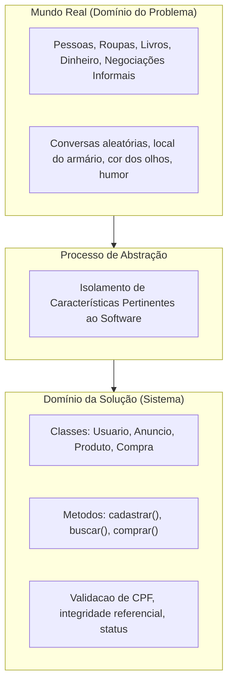
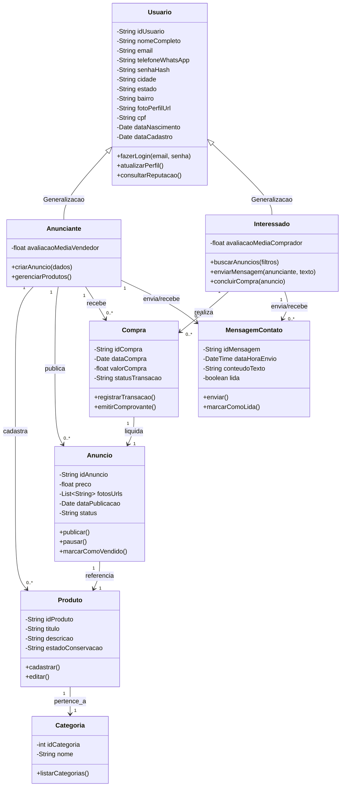
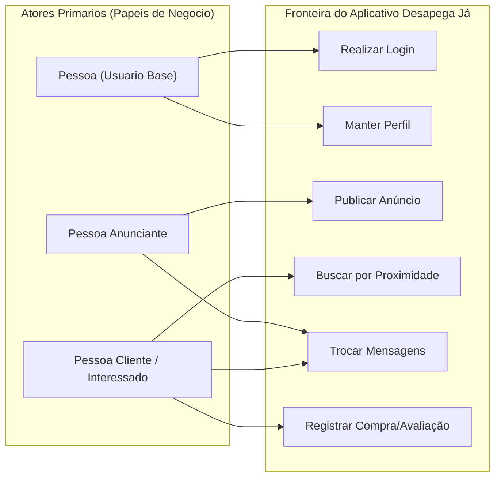
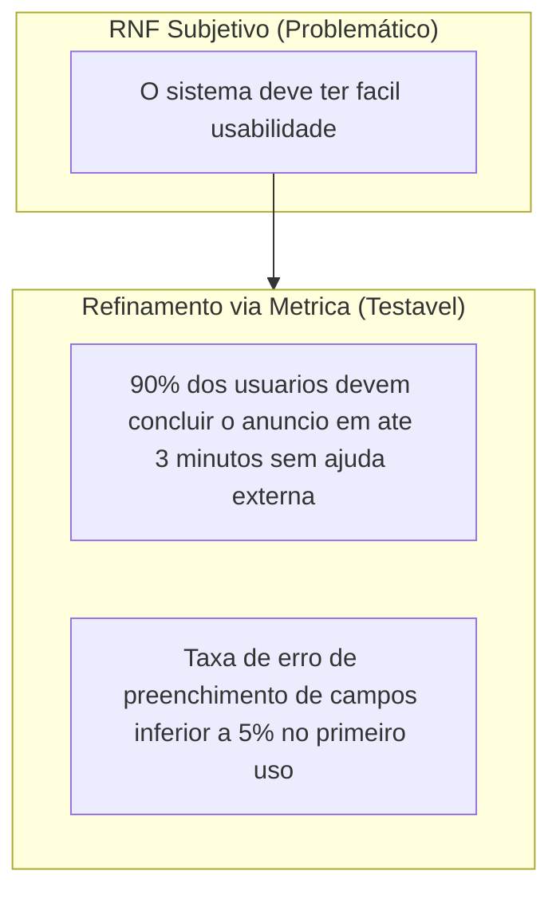
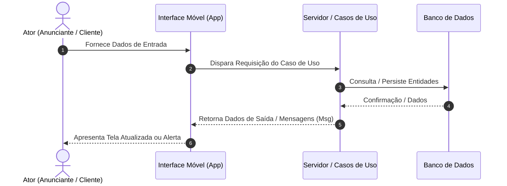
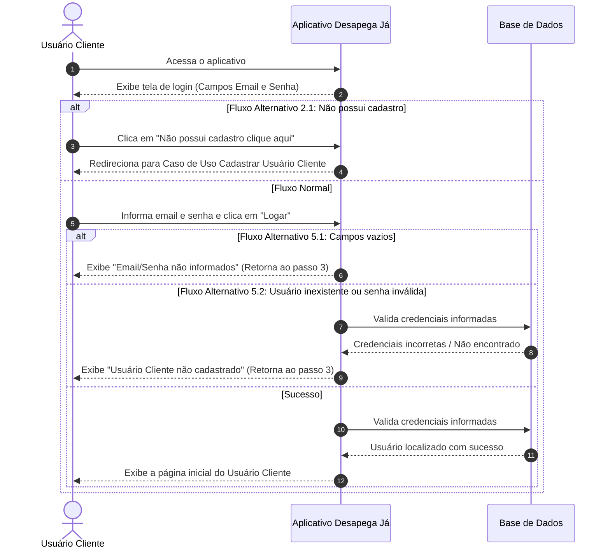
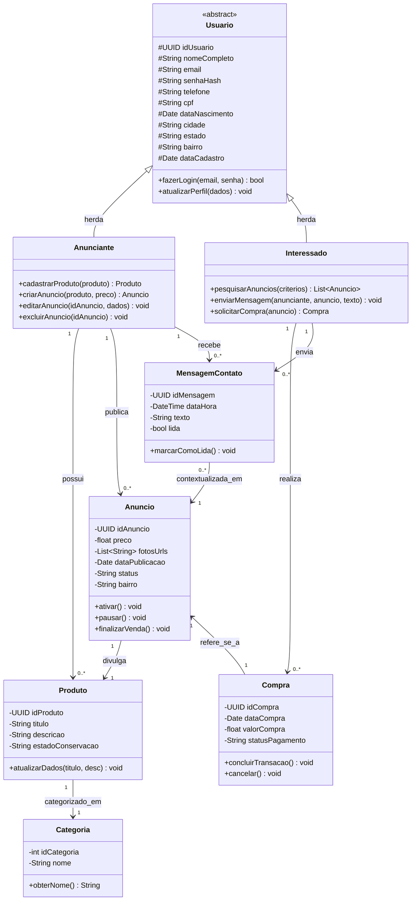
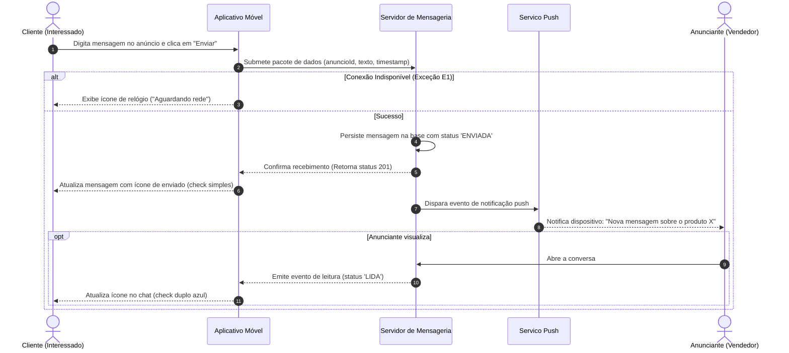
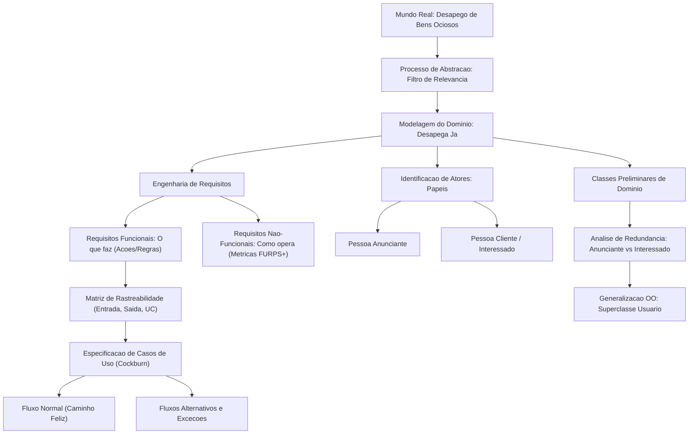

# Aula 04 — Abstração e Modelagem de Requisitos

> **Professor:** Marcelo Boer
> **Disciplina:** Engenharia de Software I (3º Semestre)
> **Tema:** Processo de abstração, elicitação e classificação de requisitos, modelagem preliminar de domínio e especificação de casos de uso aplicada ao projeto Desapega Já

## Sumário

- [Objetivo da aula](#objetivo-da-aula)
- [Contexto e pré-requisitos](#contexto-e-pre-requisitos)
- [Processo de abstração em engenharia de software](#processo-de-abstracao-em-engenharia-de-software)
- [Estudo de caso e contextualização de produto: Aplicativo Móvel Desapega Já](#estudo-de-caso-e-contextualizacao-de-produto-aplicativo-movel-desapega-ja)
- [Levantamento e classificação de requisitos funcionais](#levantamento-e-classificacao-de-requisitos-funcionais)
- [Identificação preliminar de classes do domínio de negócio](#identificacao-preliminar-de-classes-do-dominio-de-negocio)
- [Definição de usuários e identificação de atores primários](#definicao-de-usuarios-e-identificacao-de-atores-primarios)
- [Levantamento de requisitos não-funcionais](#levantamento-de-requisitos-nao-funcionais)
- [Matriz de rastreabilidade de requisitos funcionais com entradas, saídas e casos de uso](#matriz-de-rastreabilidade-de-requisitos-funcionais-com-entradas-saidas-e-casos-de-uso)
- [Especificação textual de casos de uso (atores, pré-requisitos, fluxo normal e fluxos alternativos)](#especificacao-textual-de-casos-de-uso-atores-pre-requisitos-fluxo-normal-e-fluxos-alternativos)
- [Código da aula](#codigo-da-aula)
- [Exercícios](#exercicios)
- [Erros comuns e boas práticas](#erros-comuns-e-boas-praticas)
- [Links e materiais complementares](#links-e-materiais-complementares)
- [Mapa da aula](#mapa-da-aula)
- [Glossário](#glossario)
- [Pontos-chave para a prova](#pontos-chave-para-a-prova)
- [Perguntas e respostas (JSONL)](#perguntas-e-respostas-jsonl)
- [Checklist de revisão](#checklist-de-revisao)

---

## Objetivo da aula

- Compreender o conceito e a relevância do processo de abstração no ciclo de vida da engenharia de software, diferenciando o domínio do problema do domínio da solução.
- Analisar textos descritivos de negócios para extrair necessidades, regras e restrições de sistemas computacionais.
- Identificar, refinar e classificar requisitos funcionais (RF) e requisitos não-funcionais (RNF) segundo normas consagradas da engenharia de software.
- Mapear entidades do mundo real em classes conceituais preliminares, estruturando atributos, responsabilidades e relacionamentos básicos.
- Definir atores primários e secundários, estabelecendo o escopo de atuação de cada perfil de usuário.
- Construir matrizes de rastreabilidade de requisitos funcionais, correlacionando necessidades a casos de uso, dados de entrada e dados de saída.
- Elaborar especificações textuais formais de casos de uso, detalhando pré-requisitos, fluxos normais e fluxos alternativos/exceções.

---

## Contexto e pré-requisitos

Esta aula situa-se na fase inicial do ciclo de vida de desenvolvimento de software, especificamente na disciplina de Engenharia de Requisitos e Análise Orientada a Objetos. 

Para um aproveitamento pleno, o estudante deve mobilizar conhecimentos prévios de:
- Fundamentos de Sistemas de Informação: compreensão de entrada, processamento, saída, armazenamento e feedback.
- Lógica de Programação e Tipagem Básica: diferenciação entre tipos de dados primitivos (texto, inteiro, real, booleano, data).
- Conceitos Introdutórios de Orientação a Objetos: noções de entidade, classe, objeto, atributo e método.

---

## Processo de abstração em engenharia de software

### Definição conceitual e fundamentos

A abstração é a capacidade intelectual de isolar aspectos relevantes de um fenômeno, entidade ou processo do mundo real, ignorando temporariamente detalhes secundários que não interferem no objetivo analítico. Em Engenharia de Software, abstrair não significa deixar o modelo incompleto ou vago, mas sim selecionar cirurgicamente aquilo que gera valor para a resolução do problema computacional.



### Níveis de abstração na modelagem de software

A engenharia de software trabalha com camadas sucessivas de abstração para mitigar a complexidade:

1. **Abstração Conceitual (Alto Nível):** Foco no entendimento do negócio e das necessidades dos usuários, sem preocupações com linguagens, bancos de dados ou protocolos. Exemplo: "O vendedor anuncia um produto e o interessado envia mensagens".
2. **Abstração Lógica (Médio Nível):** Foco na estrutura formal do software, definindo modelos conceituais de dados, contratos de interfaces, classes de domínio e fluxos de casos de uso. Exemplo: "Classe `Anuncio` possui atributo `preco: Decimal` e associa-se a `Usuario`".
3. **Abstração Física/Implementação (Baixo Nível):** Foco no código-fonte, tabelas físicas de banco de dados, alocação de memória e infraestrutura de rede. Exemplo: "Tabela `tb_anuncio` no PostgreSQL com coluna `vl_preco NUMERIC(10,2)`".

### Tabela comparativa dos níveis de abstração

| Nível de Abstração | Pergunta Central | Artefatos Gerados | Público Alvo |
| :--- | :--- | :--- | :--- |
| **Conceitual** | O que o negócio precisa resolver? | Visão do produto, Documento de Visão, Histórias de Usuário | Stakeholders, Clientes, Analistas |
| **Lógico** | Como as entidades e processos se estruturam? | Diagramas de Classes UML, Casos de Uso, DER Lógico | Engenheiros de Software, Arquitetos |
| **Físico** | Como o hardware e o runtime executam isso? | Código-fonte, DDL SQL, Arquivos de Configuração | Desenvolvedores, DBAs, DevOps |

### Exemplo, contraexemplo e armadilhas

- **Exemplo Adequado:** Ao abstrair uma pessoa que vende livros usados no aplicativo Desapega Já, extraímos: `nome`, `email`, `telefone`, `cpf`, `cidade`, `estado`, `bairro`. Esses dados viabilizam contato, geolocalização e segurança jurídica.
- **Contraexemplo:** Incluir na classe `Anunciante` atributos como `altura`, `tipoSanguineo`, `hobbyPreferido` ou `numeroDoCalcado`. Embora sejam características reais da pessoa, não possuem qualquer utilidade para o escopo do Desapega Já.
- **Armadilhas Comuns:**
  - *Subespecificação:* Abstrair em excesso e esquecer dados vitais (ex.: omitir o `bairro` do anúncio, impossibilitando a busca por proximidade).
  - *Over-engineering:* Criar estruturas complexas antes de validar a necessidade real do domínio (ex.: desenhar suporte a múltiplos armazéns logísticos globais para um aplicativo voltado ao desapego de bairro).

---

## Estudo de caso e contextualização de produto: Aplicativo Móvel Desapega Já

### Descrição do produto e proposta de valor

O aplicativo móvel **Desapega Já** foi idealizado para sanar um problema recorrente: a retenção ociosa ou o descarte inadequado de produtos que ainda possuem vida útil (roupas, eletrônicos, móveis, livros). O software se propõe a ser uma plataforma de economia colaborativa, aproximando vendedores e compradores geograficamente próximos.


### Decomposição do texto descritivo

A partir do contexto apresentado em sala de aula, extraímos os pilares fundamentais do sistema:
- **Público-alvo:** Pessoas físicas interessadas em vender itens não utilizados ou comprar itens seminovos a preços acessíveis.
- **Critério de relevância:** Localização geográfica (proximidade por cidade, estado e bairro).
- **Mecanismos de confiança:** Identificação via CPF, data de nascimento, foto de perfil, histórico de transações e avaliações recebidas.
- **Ciclo de vida do item:** Cadastro do produto -> Criação do anúncio -> Descoberta por busca -> Troca de mensagens -> Registro de compra/venda -> Avaliação das partes.

---

## Levantamento e classificação de requisitos funcionais

### Conceituação técnica de requisitos funcionais

Requisitos Funcionais (RF) descrevem os serviços, ações, cálculos, manipulações de dados e transformações que o software deve executar em resposta a estímulos externos ou temporais. Eles expressam explicitamente **o que** o sistema faz.

### Análise crítica dos requisitos brutos levantados em aula

Durante a sessão presencial de 12/05/2026, os seguintes 08 requisitos funcionais foram mapeados preliminarmente:

1. Facilitar a venda de produtos
2. Permitir anúncio de produtos
3. Permitir cadastro de pessoas interessadas nas compras
4. Facilitar a busca de produtos por proximidade
5. Gerar histórico de contatos ou compras realizadas e avaliações recebidas
6. Permitir cadastro de pessoas que farão a oferta de produtos
7. Permitir o cadastro de produtos a serem vendidos
8. Possibilitar troca de mensagens entre as partes interessadas

### Refinamento da lista de requisitos funcionais

Sob a ótica da engenharia de software rigorosa, requisitos como "Facilitar a venda de produtos" (RF01) e "Facilitar a busca..." (RF04) são objetivos de negócio ou declarações de intenção, e não requisitos funcionais atômicos e testáveis. Abaixo, realizamos o saneamento técnico desses requisitos:

| ID Original | Declaração Original | Avaliação Técnica | Requisito Funcional Refinado e Testável |
| :--- | :--- | :--- | :--- |
| **RF01** | Facilitar a venda de produtos | Objetivo de negócio genérico. Não é testável diretamente. | *Transformado na meta do produto que orienta os demais RFs operacionais.* |
| **RF02** | Permitir anúncio de produtos | Funcionalidade central. | O sistema deve permitir que o anunciante crie, edite, visualize e exclua anúncios vinculados a produtos. |
| **RF03** | Permitir cadastro de pessoas interessadas nas compras | Requisito funcional claro. | O sistema deve permitir o cadastro e gerenciamento de perfil de clientes interessados. |
| **RF04** | Facilitar a busca de produtos por proximidade | Requisito funcional com critério de filtro. | O sistema deve disponibilizar busca parametrizada de anúncios por estado, cidade e bairro do usuário. |
| **RF05** | Gerar histórico de contatos ou compras realizadas e avaliações | Requisito composto de auditoria e reputação. | O sistema deve registrar logs de contatos iniciados, consolidar transações de compra e calcular a média de avaliações. |
| **RF06** | Permitir cadastro de pessoas que farão a oferta de produtos | Requisito funcional claro. | O sistema deve permitir o cadastro e gerenciamento de perfil de anunciantes. |
| **RF07** | Permitir o cadastro de produtos a serem vendidos | Requisito funcional de catálogo. | O sistema deve manter o registro de produtos associando título, descrição, fotos e categoria. |
| **RF08** | Possibilitar troca de mensagens entre as partes interessadas | Requisito de comunicação síncrona/assíncrona. | O sistema deve fornecer um canal de mensageria interna entre cliente e anunciante sobre um anúncio específico. |

---

## Identificação preliminar de classes do domínio de negócio

### A técnica de análise léxica (Gramatical de Abbott)

Para extrair classes preliminares do texto do problema, aplicamos o método clássico de Russell Abbott:
- **Substantivos comuns** tornam-se candidatos a **Classes** ou **Atributos**.
- **Verbos** tornam-se candidatos a **Operações/Métodos** ou **Casos de Uso**.
- **Adjetivos** tornam-se candidatos a **Valores de Atributos** ou **Estados**.

### Classes identificadas no material de aula

No documento desenvolvido em sala, seis entidades foram mapeadas com seus respectivos atributos iniciais:

1. **Anuncio:** `fotos`, `descricao`, `preco`, `categoria`.
2. **Categoria:** `nome da categoria`.
3. **Interessado:** `nome completo`, `e-mail`, `número de telefone (com WhatsApp, se houver)`, `senha de acesso`, `cidade`, `estado`, `foto de perfil`, `CPF`, `data de nascimento`, `bairro`.
4. **Anunciante:** `nome completo`, `e-mail`, `número de telefone (com WhatsApp, se houver)`, `senha de acesso`, `cidade`, `estado`, `foto de perfil`, `CPF`, `data de nascimento`, `bairro`.
5. **Compra:** `data da compra`, `valor da compra`, `produtos`, `interessado`, `anunciante`.
6. **Histórico de contatos:** `interessado`, `anunciante`.

### Análise estrutural: eliminação de redundância via herança

Ao comparar as classes `Interessado` e `Anunciante`, nota-se que todos os atributos são estritamente idênticos. No mundo real, a mesma pessoa física pode anunciar uma bicicleta que não usa mais e, no dia seguinte, desejar comprar um livro técnico.

Portanto, modelar `Interessado` e `Anunciante` como tabelas ou classes isoladas e duplicadas é um erro de modelagem que viola o princípio DRY (*Don't Repeat Yourself*). A boa prática orientada a objetos impõe a criação de uma superclasse `Usuario` (ou `Pessoa`), da qual derivam os papéis ou especializações do sistema.



---

## Definição de usuários e identificação de atores primários

### O conceito formal de ator na modelagem UML

Na Unified Modeling Language (UML), um **Ator** não é um ser humano específico, mas sim um **papel** desempenhado por uma entidade externa (pessoa, organização ou outro sistema de software/hardware) ao interagir diretamente com o sistema para obter um benefício de valor observável.

### Atores mapeados no Desapega Já

No material de aula, os atores primários foram especificados como:
- **Pessoa Anunciante:** Papel assumido pelo usuário quando cadastra produtos, gerencia seus anúncios e responde a dúvidas de interessados.
- **Pessoa Cliente (ou Interessado):** Papel assumido pelo usuário quando pesquisa produtos na sua região, envia mensagens e negocia compras.

*(Complemento com conhecimento geral de Engenharia de Software):* Em plataformas modernas, é comum identificar também **Atores Secundários ou de Suporte**, que fornecem serviços auxiliares ao sistema:
- **Serviço de Geolocalização / Mapas (Externo):** API para converter CEP ou nome de bairro em coordenadas e calcular distâncias euclidianas/rotas.
- **Sistema de Notificações Push (Externo):** Infraestrutura para alertar o anunciante sobre novas mensagens recebidas no dispositivo móvel.



---

## Levantamento de requisitos não-funcionais

### Definição e taxonomias de qualidade

Requisitos Não-Funcionais (RNF) especificam restrições operacionais, qualidades sistêmicas e atributos de conformidade que o software deve satisfazer. Se os requisitos funcionais determinam *o que* o sistema faz, os requisitos não-funcionais estabelecem **como**, sob quais **restrições** e com qual **qualidade** ele deve operar.

A engenharia de software adota taxonomias como o modelo **FURPS+** (Functionality, Usability, Reliability, Performance, Supportability) e a norma **ISO/IEC 25010** para categorizar essas restrições.

### Análise dos RNFs levantados em aula

No documento original de aula, os seguintes quatro requisitos não-funcionais foram pontuados de forma embrionária:

1. Fácil usabilidade
2. Segurança
3. Prático e acessível
4. Integridade de dados
*(Itens 05 a 08 deixados em aberto pelo professor para resolução e aprofundamento).*

### A falha da subjetividade e a necessidade de métricas

Requisitos como "Fácil usabilidade" ou "Prático e acessível" são extremamente subjetivos e juridicamente frágeis. Em um contrato de software, o que é "fácil" para um engenheiro pode ser impossível para um usuário leigo. Portanto, todo RNF deve ser acompanhado de uma **métrica objetiva e mensurável** (abordagem Goal-Question-Metric).



### Tabela de requisitos não-funcionais refinados e mensuráveis

| ID | Categoria (ISO 25010) | Declaração Original | Requisito Não-Funcional Refinado | Métrica / Critério de Aceitação |
| :--- | :--- | :--- | :--- | :--- |
| **RNF01** | Usabilidade | Fácil usabilidade | A interface do aplicativo móvel deve seguir os padrões de design Human Interface Guidelines (iOS) e Material Design (Android). | Um usuário novo deve ser capaz de criar um anúncio em menos de 3 minutos, com taxa de sucesso em primeira tentativa superior a 85%. |
| **RNF02** | Segurança | Segurança | Os dados sensíveis de credenciais e comunicação devem ser protegidos contra interceptação e acesso não autorizado. | Senhas devem ser armazenadas com hash criptográfico forte (Argon2 ou bcrypt com salt). Todo tráfego HTTP deve utilizar TLS 1.3 obrigatório. |
| **RNF03** | Portabilidade e Acessibilidade | Prático e acessível | O aplicativo deve operar com eficiência em dispositivos móveis populares e oferecer suporte a recursos de acessibilidade. | O aplicativo deve executar em Android versão 10+ e iOS 15+, mantendo tempo de inicialização a frio inferior a 2,5 segundos e suporte a leitores de tela (TalkBack e VoiceOver). |
| **RNF04** | Integridade de Dados | Integridade de dados | O banco de dados deve assegurar consistência transacional e unicidade de chaves identificadoras. | O sistema deve aplicar propriedades ACID nas transações de compra e mensagens; restrições de unicidade para CPF e e-mail devem ter índice exclusivo garantindo duplicidade zero. |

---

## Matriz de rastreabilidade de requisitos funcionais com entradas, saídas e casos de uso

### O conceito de rastreabilidade

A rastreabilidade é a propriedade que permite correlacionar artefatos de requisitos com outros artefatos do ciclo de vida (casos de uso, classes, componentes, testes). Ela garante que todo requisito funcional tenha pelo menos um caso de uso que o implemente, e que nenhum código seja escrito sem justificativa de requisito.



### Matriz completa desenvolvida em aula (15 Casos de Uso)

A tabela abaixo compila a totalidade dos 15 itens mapeados em sala de aula, vinculando a ação do ator, o identificador do caso de uso, as variáveis de entrada e as respostas (saídas) geradas pelo sistema.

| N° | Descrição da Necessidade | Nome do Caso de Uso | Dados de Entrada | Dados de Saída |
| :--- | :--- | :--- | :--- | :--- |
| **01** | Pessoa (Anunciante ou Cliente) realiza login no aplicativo | Realizar Login Aplicativo | `e-mail`, `senha` | `Msg01` (Sucesso/Erro) / Tela Principal do Perfil |
| **02** | Pessoa Anunciante realiza cadastro | Cadastrar Pessoa Anunciante | `dados_pessoa_anunciante` (Nome, CPF, E-mail, Senha, Telefone, Endereço, Foto) | `Msg02` (Cadastro realizado com sucesso) |
| **03** | Pessoa Anunciante solicita listar seus dados (Perfil) | Listar Pessoa Anunciante | *Nenhum* (identificação por Token/Sessão ativa) | `Dados Pessoa Anunciante` (Dados cadastrais completos) |
| **04** | Pessoa Anunciante solicita editar seus dados (Perfil) | Editar Pessoa Anunciante | `dados_pessoa_anunciante` (Campos alterados) | `Msg03` (Dados atualizados) / `Dados Pessoa Anunciante` |
| **05** | Pessoa Anunciante cadastra produto | Cadastrar Produto | `dados_produto` (Título, Descrição, Categoria, Estado de Conservação) | `Msg02` (Produto cadastrado com sucesso) |
| **06** | appDesapegaJá disponibiliza catálogo de produtos | Listar Produtos | *Nenhum* (ou filtros opcionais de categoria) | `Dados Produto` (Lista de produtos cadastrados) |
| **07** | Pessoa Anunciante solicita editar produto | Editar Produto | `id_produto`, `dados_produto` | `Dados Produto` (Produto com dados atualizados) |
| **08** | Pessoa Anunciante solicita excluir produto | Excluir Produto | `id_produto` | `Msg04` (Produto removido com sucesso) |
| **09** | Pessoa Anunciante solicita buscar produto | Buscar Produto | `dados_produto` (Termo de busca, categoria, id) | `Dados Produto` (Registros localizados) |
| **10** | Pessoa Anunciante cadastra anúncio | Cadastrar Anúncio | `dados_anuncio` (`id_produto`, Preço, Fotos, Bairro) | `Msg02` (Anúncio publicado com sucesso) |
| **11** | appDesapegaJá exibe listagem de anúncios | Listar Anúncio | *Nenhum* (ou ordenação padrão por data) | `Dados Anúncio` (Lista de anúncios ativos) |
| **12** | Pessoa Anunciante solicita editar anúncio | Editar Anúncio | `id_anuncio`, `dados_anuncio` (Novas fotos, novo preço) | `Dados Anúncio` (Anúncio atualizado) |
| **13** | Pessoa Anunciante solicita excluir anúncio | Excluir Anúncio | `id_anuncio` | `Msg04` (Anúncio removido/desativado com sucesso) |
| **14** | Pessoa Anunciante/Cliente solicita buscar anúncio | Buscar Anúncio | `dados_anuncio` (Palavra-chave, Raio de proximidade, Bairro) | `Dados Anúncio` (Lista de anúncios filtrados) |
| **15** | Pessoa Anunciante realiza troca de mensagens com Cliente | Trocar Mensagens Anunciante e Cliente | `dados_mensagens` (`id_anuncio`, `id_destinatario`, Texto da mensagem) | `Dados Mensagens` (Histórico de mensagens atualizado) |

---

## Especificação textual de casos de uso (atores, pré-requisitos, fluxo normal e fluxos alternativos)

### Fundamentos da especificação textual segundo Alistair Cockburn

Um diagrama de casos de uso sozinho indica apenas as interações de alto nível. O verdadeiro valor analítico reside na **especificação textual detalhada**, que descreve o comportamento passo a passo do sistema, dividida em:
1. **Nome e Escopo:** Identificação clara da meta do ator.
2. **Ator Principal:** Quem inicia a interação para obter o resultado.
3. **Pré-requisitos:** Condições que o sistema deve garantir como verdadeiras antes do caso de uso iniciar.
4. **Pós-condições:** O estado do sistema após o sucesso da execução.
5. **Fluxo Normal (Caminho Feliz):** Sequência padrão de passos onde tudo corre perfeitamente.
6. **Fluxos Alternativos e de Exceção:** Ramificações do fluxo causadas por escolhas do usuário, erros de validação ou falhas de regras de negócio.

---

### Caso de Uso 01: Realizar Login Aplicativo

Abaixo, a transcrição e estruturação formal do caso de uso de autenticação desenvolvido em sala de aula.



#### Especificação Textual Detalhada — Realizar Login Aplicativo

- **Caso de Uso:** DCU01 — Realizar Login Aplicativo
- **Ator Principal:** Usuário Cliente (ou Usuário Anunciante)
- **Descrição da Ação:** O Usuário Cliente deseja autenticar-se no aplicativo móvel. Na tela de autenticação, informa seu e-mail e senha cadastrados e aciona a opção "Logar". O sistema verifica a autenticidade das credenciais informadas e, em caso afirmativo, carrega a tela principal com o perfil contextualizado do usuário.
- **Pré-requisito:** O Usuário Cliente deve estar previamente cadastrado no banco de dados do aplicativo.
- **Pós-condição:** Sessão autenticada criada e interface principal do usuário disponibilizada.
- **Dados:** E-mail e senha.

##### Fluxo Normal
1. O Usuário Cliente abre o aplicativo em seu dispositivo móvel.
2. O aplicativo verifica a inexistência de sessão prévia e exibe a tela de login.
3. O Usuário Cliente informa o e-mail e a senha nos respectivos campos de entrada.
4. O Usuário Cliente clica no botão "Logar".
5. O aplicativo valida as informações informadas contra a base de dados de usuários cadastrados.
6. O aplicativo estabelece a sessão ativa e exibe a página inicial referente ao perfil do Usuário Cliente.

##### Fluxos Alternativos
- **2.1. Usuário não possui cadastro prévio:**
  - 2.1.1. Na tela de login, o usuário identifica que não possui conta e clica na opção "Não possui cadastro? Clique aqui".
  - 2.1.2. O aplicativo interrompe o fluxo de login e invoca o Caso de Uso *Cadastrar Usuário Cliente*.
- **5.1. E-mail ou Senha não preenchidos:**
  - 5.1.1. O aplicativo verifica que um ou ambos os campos obrigatórios estão vazios.
  - 5.1.2. O aplicativo exibe a mensagem de validação: *"Email/Senha não informados"*.
  - 5.1.3. O aplicativo retorna o foco de digitação ao passo 3 do Fluxo Normal.
- **5.2. Credenciais inválidas ou usuário não localizado:**
  - 5.2.1. O aplicativo pesquisa a combinação de e-mail e senha na base e não encontra correspondência ativa.
  - 5.2.2. O aplicativo exibe a mensagem de alerta: *"Usuário Cliente não cadastrado"*.
  - 5.2.3. O aplicativo limpa o campo de senha e retorna ao passo 3 do Fluxo Normal.

---

## Código da aula

Embora a aula de 12/05/2026 tenha sido focada nos níveis conceituais e lógicos de modelagem sem desenvolvimento de código executável em sala, o engenheiro de software deve compreender a tradução direta desses diagramas e matrizes para estruturas técnicas reais.

Abaixo, apresentamos a materialização em linguagem de programação orientada a objetos (TypeScript) e em definição de esquema de banco de dados relacional (SQL ANSI) dos conceitos de abstração formalizados em aula.

### Definição das entidades de domínio em TypeScript

```typescript
// modelo_dominio_desapega_ja.ts

/**
 * Superclasse abstrata que consolida os atributos comuns identificados
 * na fusão das classes redundantes Anunciante e Interessado.
 */
export abstract class Usuario {
  constructor(
    public readonly idUsuario: string,
    public nomeCompleto: string,
    public email: string,
    private senhaHash: string,
    public telefoneWhatsapp: string,
    public cpf: string,
    public dataNascimento: Date,
    public cidade: string,
    public estado: string,
    public bairro: string,
    public fotoPerfilUrl?: string,
    public readonly dataCadastro: Date = new Date()
  ) {}

  public autenticar(senhaPlana: string): boolean {
    // Em produção, utiliza comparação de hash seguro (ex: bcrypt)
    return this.senhaHash === `hash_seguro_${senhaPlana}`;
  }

  public getEnderecoCompleto(): string {
    return `${this.bairro}, ${this.cidade} - ${this.estado}`;
  }
}

/**
 * Papel de Anunciante derivado da abstração de Usuário
 */
export class Anunciante extends Usuario {
  public produtosCadastrados: Produto[] = [];
  public anunciosAtivos: Anuncio[] = [];

  public cadastrarProduto(produto: Produto): void {
    this.produtosCadastrados.push(produto);
  }

  public publicarAnuncio(produto: Produto, preco: number, fotos: string[]): Anuncio {
    const novoAnuncio = new Anuncio(
      `anuncio_${Date.now()}`,
      this,
      produto,
      preco,
      fotos,
      this.bairro
    );
    this.anunciosAtivos.push(novoAnuncio);
    return novoAnuncio;
  }
}

/**
 * Papel de Interessado/Cliente derivado da abstração de Usuário
 */
export class Interessado extends Usuario {
  public iniciarContato(anunciante: Anunciante, anuncio: Anuncio, texto: string): MensagemContato {
    return new MensagemContato(
      `msg_${Date.now()}`,
      this,
      anunciante,
      anuncio,
      texto,
      new Date()
    );
  }
}

export class Categoria {
  constructor(
    public readonly idCategoria: number,
    public nome: string
  ) {}
}

export class Produto {
  constructor(
    public readonly idProduto: string,
    public titulo: string,
    public descricao: string,
    public categoria: Categoria,
    public estadoConservacao: 'NOVO' | 'SEMINOVO' | 'USADO'
  ) {}
}

export class Anuncio {
  constructor(
    public readonly idAnuncio: string,
    public anunciante: Anunciante,
    public produto: Produto,
    public preco: number,
    public fotosUrls: string[],
    public bairroLocalizacao: string,
    public status: 'ATIVO' | 'PAUSADO' | 'VENDIDO' = 'ATIVO',
    public readonly dataCriacao: Date = new Date()
  ) {}
}

export class MensagemContato {
  constructor(
    public readonly idMensagem: string,
    public remetente: Usuario,
    public destinatario: Usuario,
    public anuncioRelacionado: Anuncio,
    public conteudo: string,
    public dataHora: Date,
    public lida: boolean = false
  ) {}
}
```

### Esquema relacional estruturado (SQL DDL)

```sql
-- esquema_desapega_ja.sql
-- Mapeamento das classes conceituais para tabelas com integridade referencial

CREATE TABLE tb_usuario (
    id_usuario UUID PRIMARY KEY,
    nome_completo VARCHAR(150) NOT NULL,
    email VARCHAR(100) NOT NULL UNIQUE,
    senha_hash VARCHAR(255) NOT NULL,
    telefone_whatsapp VARCHAR(20) NOT NULL,
    cpf VARCHAR(14) NOT NULL UNIQUE,
    data_nascimento DATE NOT NULL,
    cidade VARCHAR(80) NOT NULL,
    estado CHAR(2) NOT NULL,
    bairro VARCHAR(80) NOT NULL,
    foto_perfil_url VARCHAR(255),
    data_cadastro TIMESTAMP NOT NULL DEFAULT CURRENT_TIMESTAMP
);

CREATE TABLE tb_categoria (
    id_categoria SERIAL PRIMARY KEY,
    nome_categoria VARCHAR(50) NOT NULL UNIQUE
);

CREATE TABLE tb_produto (
    id_produto UUID PRIMARY KEY,
    id_usuario_proprietario UUID NOT NULL,
    id_categoria INT NOT NULL,
    titulo VARCHAR(120) NOT NULL,
    descricao TEXT NOT NULL,
    estado_conservacao VARCHAR(20) NOT NULL,
    CONSTRAINT fk_produto_usuario FOREIGN KEY (id_usuario_proprietario) 
        REFERENCES tb_usuario(id_usuario) ON DELETE CASCADE,
    CONSTRAINT fk_produto_categoria FOREIGN KEY (id_categoria) 
        REFERENCES tb_categoria(id_categoria) ON DELETE RESTRICT
);

CREATE TABLE tb_anuncio (
    id_anuncio UUID PRIMARY KEY,
    id_produto UUID NOT NULL UNIQUE,
    id_anunciante UUID NOT NULL,
    preco NUMERIC(10, 2) NOT NULL CHECK (preco >= 0),
    bairro_localizacao VARCHAR(80) NOT NULL,
    status VARCHAR(20) NOT NULL DEFAULT 'ATIVO',
    data_publicacao TIMESTAMP NOT NULL DEFAULT CURRENT_TIMESTAMP,
    CONSTRAINT fk_anuncio_produto FOREIGN KEY (id_produto) 
        REFERENCES tb_produto(id_produto) ON DELETE RESTRICT,
    CONSTRAINT fk_anuncio_anunciante FOREIGN KEY (id_anunciante) 
        REFERENCES tb_usuario(id_usuario) ON DELETE CASCADE
);

CREATE TABLE tb_mensagem_contato (
    id_mensagem UUID PRIMARY KEY,
    id_anuncio UUID NOT NULL,
    id_remetente UUID NOT NULL,
    id_destinatario UUID NOT NULL,
    conteudo_texto TEXT NOT NULL,
    data_hora_envio TIMESTAMP NOT NULL DEFAULT CURRENT_TIMESTAMP,
    lida BOOLEAN NOT NULL DEFAULT FALSE,
    CONSTRAINT fk_msg_anuncio FOREIGN KEY (id_anuncio) REFERENCES tb_anuncio(id_anuncio),
    CONSTRAINT fk_msg_remetente FOREIGN KEY (id_remetente) REFERENCES tb_usuario(id_usuario),
    CONSTRAINT fk_msg_destinatario FOREIGN KEY (id_destinatario) REFERENCES tb_usuario(id_usuario)
);
```

---

## Exercícios

### Exercício 1: Complementação dos Requisitos Não-Funcionais do Desapega Já

#### Enunciado
Com base no estudo de caso do aplicativo Desapega Já e nas lacunas deixadas no levantamento de requisitos não-funcionais em sala de aula (itens 05 a 08), especifique quatro novos requisitos não-funcionais detalhados e mensuráveis, contemplando categorias fundamentais de engenharia de software: **Desempenho**, **Portabilidade**, **Disponibilidade** e **Segurança/Conformidade com a LGPD** para armazenamento de dados pessoais e documentos.

#### Raciocínio
Para que um requisito não-funcional tenha rigor de engenharia, ele não pode ser redigido como um adjetivo ("o sistema deve ser rápido"). Deve-se indicar:
1. O atributo de qualidade desejado (conforme ISO 25010).
2. O contexto operacional de teste.
3. A métrica exata de medição e tolerância.

#### Resolução Completa e Comentada
- **RNF05 — Desempenho (Tempo de Resposta em Consultas de Proximidade):**
  - *Especificação:* O tempo de resposta na busca e listagem de anúncios por geolocalização e bairro não deve exceder 1,5 segundo para 95% das consultas, considerando uma base populada com até 50.000 anúncios ativos e até 500 requisições simultâneas em conexões de rede 4G padrão.
  - *Justificativa:* O usuário mobile abandona aplicativos de compra se a rolagem do catálogo travar ou demorar para carregar as fotos.
- **RNF06 — Portabilidade (Consumo de Bateria e Armazenamento Local):**
  - *Especificação:* A aplicação cliente (móvel) não deve ultrapassar 60 MB de armazenamento em disco no ato da instalação e o cache de imagens não deve exceder 200 MB, com política de limpeza automática LRU (*Least Recently Used*). O consumo de energia em segundo plano deve ser restrito a menos de 1% da bateria por hora.
  - *Justificativa:* Como o app lida com upload e visualização constante de fotos, o gerenciamento de cache local impede que a memória do smartphone fique esgotada.
- **RNF07 — Disponibilidade (Resiliência do Serviço de Mensageria):**
  - *Especificação:* A infraestrutura de backend da plataforma deve garantir uma disponibilidade mensal de 99,8% (*uptime* correspondente a no máximo 1 hora e 26 minutos de parada não programada por mês), com redundância de servidores de aplicação e backup automático diário da base de dados às 03:00 (BRT).
  - *Justificativa:* Vendas ocorrem a qualquer horário; a perda de disponibilidade durante uma negociação frustra ambas as partes.
- **RNF08 — Segurança e Conformidade com a LGPD (Proteção de Dados Pessoais):**
  - *Especificação:* O sistema deve atender integralmente à Lei Geral de Proteção de Dados (Lei nº 13.709/2018), aplicando criptografia em repouso (AES-256) sobre os dados de CPF, data de nascimento e endereço completo. O número de telefone e CPF não devem ser expostos na interface pública do anúncio, sendo revelados apenas sob consentimento mútuo na abertura do canal de negociação.
  - *Justificativa:* Como o aplicativo solicita CPF e fotos de documentos para validação de identidade, o vazamento dessas informações acarretaria penalidades jurídicas graves e perda imediata de confiança.

---

### Exercício 2: Especificação Textual do Caso de Uso Cadastrar Usuário Cliente

#### Enunciado
No documento desenvolvido em aula, o caso de uso 'Cadastrar Usuário Cliente' teve sua descrição preenchida inadvertidamente com a estrutura duplicada do caso de uso de login. Elabore a especificação textual completa e corrigida para 'Cadastrar Usuário Cliente', contendo: Ator Principal, Descrição da Ação, Pré-requisitos, Fluxo Normal passo a passo, Fluxos Alternativos (tratando cenários como e-mail já existente, CPF inválido e senhas que não atendem aos critérios de complexidade) e Campos de Entrada e Saída.

#### Raciocínio
A duplicação em atas e cadernos de aula é um erro humano comum no levantamento inicial de requisitos. O analista deve limpar essa incongruência, reescrevendo o fluxo de ponta a ponta: desde o preenchimento cadastral até a criação do registro, tratando todas as validações de dados essenciais para o domínio.

#### Resolução Completa e Comentada

- **Caso de Uso:** DCU02 — Cadastrar Usuário Cliente
- **Ator Principal:** Pessoa Cliente (Interessado)
- **Descrição da Ação:** Permite que uma nova pessoa realize seu cadastro pessoal no Desapega Já para pesquisar anúncios, favoritar itens e negociar compras com anunciantes.
- **Pré-requisito:** O dispositivo móvel deve estar conectado à internet e o usuário não deve possuir conta associada ao seu e-mail ou CPF.
- **Pós-condição:** Um novo registro de usuário é criado no banco de dados com status "Ativo" e o usuário é automaticamente autenticado.
- **Campos de Entrada:** `nome_completo`, `email`, `senha`, `confirmacao_senha`, `telefone_whatsapp`, `cpf`, `data_nascimento`, `cidade`, `estado`, `bairro`, `foto_perfil` (opcional).
- **Campos de Saída:** `Msg02` ("Cadastro realizado com sucesso! Bem-vindo ao Desapega Já") e redirecionamento para o catálogo de anúncios.

##### Fluxo Normal
1. O usuário abre a aplicação e, na tela de boas-vindas/login, aciona a opção "Criar Nova Conta".
2. O aplicativo exibe o formulário de cadastro solicitando os dados pessoais, de acesso e localização.
3. O usuário preenche todos os campos obrigatórios e anexa opcionalmente uma foto de perfil.
4. O usuário lê e aceita os Termos de Uso e Política de Privacidade.
5. O usuário clica no botão "Finalizar Cadastro".
6. O aplicativo valida localmente os formatos de e-mail, CPF e força da senha.
7. O aplicativo envia os dados ao servidor de aplicação.
8. O servidor valida a unicidade do e-mail e do CPF na base de dados.
9. O servidor gera um identificador único (`id_usuario`), cria o hash da senha e persiste o novo usuário.
10. O aplicativo exibe a mensagem de confirmação (`Msg02`) e redireciona o usuário autenticado para a tela principal de exploração de produtos.

##### Fluxos Alternativos e Exceções
- **6.1. Dados com formato inválido (Validação de Interface):**
  - 6.1.1. Se o CPF não passar no algoritmo de dígitos verificadores, o app exibe: *"CPF inválido. Verifique os números digitados"*.
  - 6.1.2. Se a senha tiver menos de 8 caracteres ou não possuir números e letras, o app exibe: *"A senha deve possuir no mínimo 8 caracteres, contendo letras e números"*.
  - 6.1.3. Se `senha` e `confirmacao_senha` forem distintas, o app exibe: *"As senhas informadas não coincidem"*.
  - 6.1.4. O fluxo retorna ao passo 3 com os campos problemáticos destacados em vermelho.
- **8.1. E-mail já cadastrado no sistema:**
  - 8.1.1. O servidor identifica que o e-mail informado já existe na tabela de usuários.
  - 8.1.2. O servidor retorna código de conflito e o app exibe: *"Este e-mail já está cadastrado. Deseja realizar login ou recuperar a senha?"*.
  - 8.1.3. O fluxo permite redirecionar para a recuperação de senha ou alterar o e-mail no passo 3.
- **8.2. CPF já registrado na base de dados:**
  - 8.2.1. O servidor detecta que o CPF pertence a uma conta previamente aberta.
  - 8.2.2. O app bloqueia a duplicidade exibindo: *"CPF já cadastrado na plataforma"*.
  - 8.2.3. O fluxo é abortado.
- **8.3. Falha de conectividade ou indisponibilidade do servidor:**
  - 8.3.1. Caso o aplicativo não receba resposta do servidor em até 10 segundos, exibe: *"Não foi possível conectar ao servidor. Verifique sua conexão e tente novamente"*.
  - 8.3.2. Os dados preenchidos são mantidos no formulário para evitar que o usuário precise redigitar tudo.

---

### Exercício 3: Modelagem Conceitual do Diagrama de Classes

#### Enunciado
A partir das entidades preliminares levantadas em aula (`Anuncio`, `Categoria`, `Interessado`, `Anunciante`, `Compra` e `Histórico de Contatos`), modele o diagrama conceitual de classes de domínio. Aplique conceitos de orientação a objetos identificando atributos tipados, operações essenciais, multiplicidades/cardinalidades nas associações e avalie a aplicação de herança/generalização entre uma classe genérica `Usuario` e as especializações `Anunciante` e `Interessado/Cliente`.

#### Raciocínio
A modelagem orientada a objetos de qualidade requer:
1. Eliminar duplicações por meio da herança (`Usuario` como superclasse de `Anunciante` e `Interessado`).
2. Mapear a multiplicidade correta: um anúncio refere-se a exatamente 1 produto; 1 produto pertence a 1 categoria; 1 anunciante pode publicar de 0 a N anúncios.
3. Transformar o "Histórico de Contatos" em uma entidade transacional atômica (`MensagemContato`), pois contatos são compostos por trocas individuais de mensagens ao longo do tempo.

#### Resolução Completa e Comentada



- **Comentários de Arquitetura:**
  - A classe `Usuario` é abstrata (`<<abstract>>`), pois no aplicativo a pessoa física atua com os comportamentos especializados de quem vende ou de quem compra.
  - A separação entre `Produto` (o bem físico) e `Anuncio` (a oferta comercial do bem) permite que o usuário cadastre previamente um item e decida publicá-lo, pausá-lo ou reanunciá-lo com preços diferentes sem perder a ficha técnica do produto.

---

### Exercício 4: Detalhamento e Fluxos do Caso de Uso Trocar Mensagens

#### Enunciado
Desenvolva a especificação formal detalhada para o requisito funcional RF15 ('Pessoa Anunciante realiza troca de mensagens com Cliente'). Descreva os atores participantes, os pré-requisitos necessários para abertura do canal de negociação, as entradas e saídas de dados, o fluxo normal de envio e confirmação de entrega da mensagem e os fluxos de exceção para perda de conectividade da rede móvel e bloqueio de contato entre usuários.

#### Raciocínio
A troca de mensagens é um fluxo de comunicação bilateral. O cliente inicia a conversa a partir de um anúncio específico. O anunciante é notificado e pode responder. O analista deve prever que a comunicação móvel sofre instabilidades constantes de rede e que moderações de segurança (bloqueio de usuários nocivos) são imperativas.

#### Resolução Completa e Comentada

- **Caso de Uso:** DCU15 — Trocar Mensagens Anunciante e Cliente
- **Atores:**
  - *Ator Primário:* Pessoa Cliente (Interessado)
  - *Ator Secundário:* Pessoa Anunciante
  - *Sistema Auxiliar:* Serviço de Notificações Push
- **Descrição da Ação:** Permite que o cliente interessado e o anunciante conversem diretamente através de um chat seguro embutido no aplicativo para tirar dúvidas, negociar valores e combinar a entrega/retirada do produto.
- **Pré-requisitos:**
  1. Ambos os usuários devem estar autenticados no aplicativo.
  2. O anúncio em questão deve estar com status "Ativo".
  3. Não deve existir bloqueio de segurança mútuo ativo entre os dois usuários.
- **Entradas:** `id_anuncio`, `id_destinatario`, `texto_mensagem`.
- **Saídas:** Mensagem registrada no chat, confirmação de envio (check duplo), alerta sonoro/push para o destinatário.



##### Fluxo Normal
1. O Cliente está visualizando a tela detalhada de um anúncio ativo e clica no botão "Conversar com o Vendedor".
2. O aplicativo abre a tela de conversa contextualizada com o título, valor e foto em miniatura do anúncio no topo.
3. O Cliente redige uma mensagem de texto no campo de entrada e pressiona o botão "Enviar".
4. O aplicativo valida que a mensagem possui ao menos 1 caractere não vazio.
5. O aplicativo transmite a mensagem via protocolo seguro para o servidor de backend.
6. O servidor valida se o anúncio continua ativo e se o destinatário não bloqueou o remetente.
7. O servidor grava o registro na tabela de mensagens com data, hora e status `ENVIADA`.
8. O servidor envia uma notificação push para o celular do Anunciante.
9. O aplicativo do Cliente atualiza a tela do chat exibindo a mensagem enviada com a indicação de entrega realizada.

##### Fluxos Alternativos e Exceções
- **6.1. Exceção: Remetente bloqueado pelo destinatário:**
  - 6.1.1. O servidor detecta que o anunciante bloqueou o cliente por conduta inadequada prévia.
  - 6.1.2. O servidor recusa o salvamento e retorna o erro correspondente.
  - 6.1.3. O aplicativo do Cliente exibe a mensagem: *"Não foi possível enviar a mensagem. As mensagens com este usuário foram desativadas"*.
  - 6.1.4. O caso de uso é encerrado sem disparo de notificação.
- **5.1. Exceção: Falha de conexão de dados no dispositivo móvel:**
  - 5.1.1. O aplicativo tenta conectar ao servidor e sofre *timeout* por falta de sinal de rede móvel (3G/4G/Wi-Fi).
  - 5.1.2. A mensagem permanece visível na tela de chat com um ícone de alerta de pendência (relógio).
  - 5.1.3. O aplicativo agenda retentativas automáticas em segundo plano assim que a conectividade do aparelho for restabelecida.
- **6.2. Anúncio finalizado ou excluído durante a digitação:**
  - 6.2.1. O servidor verifica que o anúncio acabou de ser vendido ou cancelado pelo anunciante.
  - 6.2.2. A mensagem é gravada, mas o chat exibe uma tarja informativa: *"Atenção: Este anúncio não está mais ativo. O produto já foi desapegado"*.

---

## Erros comuns e boas práticas

### Erros conceituais frequentes dos estudantes

1. **Confundir Objetivo de Negócio com Requisito Funcional:**
   - *Erro:* Declarar "Vender barato" ou "Facilitar a vida do usuário" como requisito funcional.
   - *Correção:* Objetivos explicam a motivação empresarial. Requisitos funcionais descrevem a operação algorítmica executada pelo software (ex: "Calcular taxa de desconto percentual").

2. **Escrever Requisitos Não-Funcionais sem Critério de Medição:**
   - *Erro:* "O aplicativo deve ser ultra seguro e muito rápido".
   - *Correção:* Estabelecer métrica auditável: "O tempo de processamento das requisições deve ter percentil 99 (p99) abaixo de 800 milissegundos".

3. **Duplicação de Classes no Domínio:**
   - *Erro:* Criar as classes `Vendedor` e `Comprador` com os mesmos 10 atributos de identificação pessoal.
   - *Correção:* Aplicar o conceito de herança ou agregação de papéis, criando uma classe `Usuario` genérica que assume papéis dinâmicos.

4. **Tratar o Caso de Uso como uma Sequência de Cliques de Interface:**
   - *Erro:* Escrever no caso de uso: "1. O usuário clica com o dedo no botão azul com cantos arredondados de 4px...".
   - *Correção:* Manter o caso de uso independente de tecnologias de apresentação visual. Descreva intenções de negócio: "1. O usuário solicita a submissão dos dados de login".

### Guia de boas práticas

- **Clareza Sintática nos Requisitos:** Utilize a fórmula consagrada: `[O sistema deve] + [verbo de ação no infinitivo] + [objeto da ação] + [critérios e condições]`.
- **Rastreabilidade Bidirecional:** Cada caso de uso deve estar vinculado a pelo menos um requisito funcional da matriz, e cada classe do diagrama deve sustentar as operações exigidas nesses casos de uso.
- **Isolamento de Papéis:** Ao definir atores, lembre-se de que atores são **papéis**. O professor Marcelo Boer pode ser "Pessoa Anunciante" pela manhã ao vender seu monitor antigo e "Pessoa Cliente" à noite ao buscar uma mesa de estudos no aplicativo.

---

## Links e materiais complementares

- **Norma ISO/IEC/IEEE 29148:2018 (Systems and software engineering — Life cycle processes — Requirements engineering):**
  - *Conteúdo:* Padrão global sobre engenharia de requisitos, sintaxe e critérios de aceitação para declarações funcionais e não-funcionais.
- **Norma ISO/IEC 25010 (Systems and software quality models):**
  - *Conteúdo:* Guia completo da taxonomia de atributos de qualidade (desempenho, segurança, compatibilidade, usabilidade e manutenibilidade).
- **Livro "Utilizando Casos de Uso com Sucesso" (Alistair Cockburn):**
  - *Conteúdo:* A obra seminal que definiu as melhores práticas de elaboração de especificações textuais, fluxos principais, alternativos e de exceção.
- **Livro "Engenharia de Software: Uma Abordagem Profissional" (Roger S. Pressman e Bruce R. Maxim):**
  - *Conteúdo:* Capítulos dedicados à modelagem de requisitos e análise baseada em cenários e classes conceituais.
- **Documentação Oficial do Mermaid.js:**
  - *Conteúdo:* Guia de sintaxe para elaboração de diagramas UML de classes, sequências e grafos de estados diretamente em código texto.

---

## Mapa da aula



---

## Glossário

| Termo | Definição no Contexto de Engenharia de Software |
| :--- | :--- |
| **Abstração** | Processo intelectual de isolar e representar as propriedades essenciais de um objeto ou processo, desconsiderando particularidades temporárias ou irrelevantes. |
| **Ator Primário** | Entidade externa (geralmente um perfil de usuário) que inicia a interação direta com o sistema para atingir uma meta mensurável de negócio. |
| **Caso de Uso** | Técnica de modelagem comportamental que descreve um conjunto de cenários de interação entre um ou mais atores e o sistema. |
| **Caminho Feliz (Happy Path)** | Sequência de passos no fluxo de um caso de uso executada com sucesso pleno, sem ocorrência de falhas, erros de validação ou exceções. |
| **Generalização / Herança** | Relacionamento da orientação a objetos onde uma classe filha (subclasse) herda atributos e comportamentos de uma classe mãe (superclasse). |
| **Matriz de Rastreabilidade** | Instrumento tabular que documenta e audita as ligações lógicas entre requisitos, especificações de casos de uso e componentes técnicos. |
| **Métrica GQM (Goal-Question-Metric)** | Metodologia que desdobra objetivos abstratos em questões mensuráveis e métricas numéricas concretas para avaliar conformidade de software. |
| **Requisito Funcional (RF)** | Declaração que especifica um comportamento, função, cálculo ou resposta que o software deve ser capaz de realizar operacionalmente. |
| **Requisito Não-Funcional (RNF)** | Declaração que impõe restrições de desempenho, disponibilidade, segurança, acessibilidade e arquitetura sobre as funções do software. |
| **Regra de Negócio** | Declaração que define ou restringe algum aspecto operacional da empresa ou do domínio do problema, independente do software. |

---

## Pontos-chave para a prova

1. **Abstração Não é Vagueza:** Abstrair é focar no que é relevante para o escopo delimitado do software. Incluir atributos desnecessários sobrecarrega o banco de dados e a arquitetura; ignorar atributos críticos inviabiliza as regras de negócio.
2. **Diferença entre RF e RNF:** 
   - RF responde: *"O que o sistema faz?"* (Exemplo: "Cadastrar anúncio de venda").
   - RNF responde: *"Quais os limites e qualidades exigidos?"* (Exemplo: "Criptografar as senhas dos usuários com hash seguro").
3. **Subjetividade em RNF anula a questão:** Dizer que o sistema é "fácil", "rápido" ou "amigável" não é aceito pela engenharia de software. O estudante deve sempre apresentar a **métrica de medição** (tempo, taxa percentual, protocolo, capacidade volumétrica).
4. **Generalização de Classes Semelhantes:** A identificação de classes com atributos idênticos (`Anunciante` e `Interessado`) exige a aplicação imediata de generalização em uma superclasse `Usuario`, evitando duplicação estrutural na modelagem.
5. **Estrutura Completa de Casos de Uso:** O estudante deve saber estruturar textualmente: Nome, Ator Principal, Pré-requisito, Fluxo Normal e Fluxos Alternativos numerados em conformidade com o passo do fluxo normal que lhes deu origem.

---

## Perguntas e respostas (JSONL)

```jsonl
{"pergunta": "Qual e a definicao do processo de abstracao no contexto da Engenharia de Software?", "resposta": "E a habilidade de isolar as caracteristicas essenciais e pertinentes de uma entidade ou processo do mundo real, ignorando detalhes irrelevantes para o dominio do software.", "dificuldade": "facil"}
{"pergunta": "Qual a diferenca fundamental entre um Requisito Funcional e um Requisito Nao-Funcional?", "resposta": "Requisitos Funcionais descrevem o que o software deve executar (acoes, funcoes e servicos), enquanto Requisitos Nao-Funcionais determinam como e sob quais restricoes e niveis de qualidade o sistema opera.", "dificuldade": "facil"}
{"pergunta": "Por que a declaracao 'Facilitar a venda de produtos' nao e um bom requisito funcional?", "resposta": "Porque e uma meta ou objetivo de negocio amplo, abstrato e nao-testavel diretamente de forma algoritmica pelo sistema.", "dificuldade": "medio"}
{"pergunta": "Como se resolve a redundancia conceitual identificada entre as classes Anunciante e Interessado no Desapega Ja?", "resposta": "Aplica-se o mecanismo de heranca/generalizacao da orientacao a objetos, criando uma superclasse Usuario que contem os atributos comuns de ambos.", "dificuldade": "medio"}
{"pergunta": "O que e um Ator na linguagem de modelagem UML?", "resposta": "E a representacao de um papel externo assumido por uma entidade (pessoa, sistema ou hardware) ao interagir diretamente com as funcionalidades do sistema.", "dificuldade": "facil"}
{"pergunta": "Por que a expressao 'Facil usabilidade' em um levantamento de RNF e considerada inadequada pela Engenharia de Software?", "resposta": "Porque e um criterio subjetivo e sem metrica mensuravel; para ter validade de engenharia deve estipular taxas de conclusao de tarefas, tempo de execucao ou normas de design seguidas.", "dificuldade": "medio"}
{"pergunta": "Para que serve a Matriz de Rastreabilidade de Requisitos Funcionais?", "resposta": "Para mapear e auditar as relacoes entre os requisitos levantados, os casos de uso que os atendem e os dados de entrada e saida envolvidos no processamento.", "dificuldade": "medio"}
{"pergunta": "O que constitui o 'Fluxo Normal' de uma especificacao de caso de uso?", "resposta": "E a sequencia linear e ideal de interacoes entre o ator e o sistema onde tudo ocorre com sucesso pleno (o chamado caminho feliz).", "dificuldade": "facil"}
{"pergunta": "Qual a diferenca entre um Fluxo Alternativo e um Fluxo de Excecao em casos de uso?", "resposta": "O fluxo alternativo apresenta outro caminho possivel para alcancar a meta com sucesso; o fluxo de excecao trata erros e situacoes que impedem o cumprimento da meta do caso de uso.", "dificuldade": "medio"}
{"pergunta": "Cite dois exemplos de requisitos nao-funcionais mensuraveis para o aplicativo Desapega Ja.", "resposta": "Tempo de resposta de busca inferior a 1,5 segundo em redes 4G; e armazenamento obrigatorio de senhas utilizando hash bcrypt com salt.", "dificuldade": "medio"}
{"pergunta": "Por que a classe Anuncio deve ser separada da classe Produto na modelagem orientada a objetos?", "resposta": "Porque o Produto representa a entidade fisica (titulo, descricao, categoria), enquanto o Anuncio representa a publicacao de venda comercial (preco, status, fotos da oferta).", "dificuldade": "dificil"}
{"pergunta": "Quais sao os tres niveis classicos de abstracao na criacao de modelos computacionais?", "resposta": "Abstracao Conceitual (dominio do negocio), Abstracao Logica (estruturas de classes e regras) e Abstracao Fisica (tabelas e codigo executavel).", "dificuldade": "facil"}
{"pergunta": "Em qual etapa da especificacao de caso de uso devem constar as condicoes obrigatorias anteriores ao inicio da execucao?", "resposta": "Na secao de Pre-requisitos.", "dificuldade": "facil"}
{"pergunta": "Qual o risco para o projeto de software de ocorrer subespecificacao durante a fase de requisitos?", "resposta": "Omissao de requisitos criticos de negocio que forcam retrabalho arquitetural e refatoracoes onerosas no meio do desenvolvimento.", "dificuldade": "medio"}
{"pergunta": "O que determina a técnica gramatical de Abbott na identificacao de elementos de dominio?", "resposta": "Substantivos indicam classes ou atributos; verbos indicam operacoes, metodos ou casos de uso; e adjetivos indicam estados ou valores de atributos.", "dificuldade": "medio"}
{"pergunta": "Qual categoria da ISO 25010 abrange restricoes sobre integridade de dados e unicidade de CPF?", "resposta": "Segurança / Confiabilidade (especificamente Integridade e Conformidade).", "dificuldade": "medio"}
{"pergunta": "No caso de uso de Login, o que deve ocorrer caso o usuario informe campos de email e senha em branco?", "resposta": "O sistema executa um fluxo alternativo/excecao que exibe mensagem de validacao e retorna o foco para o preenchimento dos campos sem consultar a base.", "dificuldade": "facil"}
{"pergunta": "Por que a geolocalizacao (bairro, cidade, estado) e um atributo critico na modelagem do Desapega Ja?", "resposta": "Porque a proposta central de valor da plataforma e o desapego com busca por proximidade geografica entre vendedores e compradores.", "dificuldade": "facil"}
{"pergunta": "Em um diagrama de casos de uso, uma mesma pessoa fisica pode se relacionar com o sistema como mais de um ator?", "resposta": "Sim, pois atores representam papeis; a mesma pessoa pode agir como Anunciante em um momento e como Cliente Interessado em outro.", "dificuldade": "medio"}
{"pergunta": "Como a LGPD impacta diretamente o levantamento de requisitos de um aplicativo como o Desapega Ja?", "resposta": "Impoe requisitos nao-funcionais de criptografia em repouso de dados sensiveis (CPF, nascimento), restricao de visibilidade publica de telefones e politicas claras de consentimento.", "dificuldade": "dificil"}
```

---

## Checklist de revisão

- [ ] Compreendi o papel da abstração na filtragem de ruídos do mundo real para construção do modelo de software.
- [ ] Sei diferenciar o nível conceitual, lógico e físico de modelagem de requisitos.
- [ ] Consigo identificar a diferença entre um objetivo de negócio e um requisito funcional atômico e testável.
- [ ] Entendi como refinar requisitos não-funcionais subjetivos em métricas objetivas orientadas pela norma ISO 25010 e metodologia GQM.
- [ ] Compreendi a aplicação da herança/generalização entre `Usuario`, `Anunciante` e `Interessado` para evitar duplicações no modelo de classes.
- [ ] Consigo montar uma Matriz de Rastreabilidade relacionando requisitos a entradas, saídas e casos de uso.
- [ ] Sei estruturar uma especificação textual formal de caso de uso com atores, pré-requisitos, fluxo normal e fluxos alternativos devidamente numerados.
- [ ] Identifiquei o erro de duplicação cometido nas notas de aula referente ao cadastro de cliente e sei redigi-lo de forma correta e completa.
- [ ] Revisei as regras de validação e exceção para canais de mensageria móvel e autenticação de usuários.

## Código prático de apoio

Implementações em Java que tornam executáveis os conceitos desta unidade:

- [`ModeloDominioDesapegaJa.java`](codigo/ModeloDominioDesapegaJa.java)
- [`CasoDeUsoAutenticacaoCadastro.java`](codigo/CasoDeUsoAutenticacaoCadastro.java)
- [`CasoDeUsoMensageriaBusca.java`](codigo/CasoDeUsoMensageriaBusca.java)
