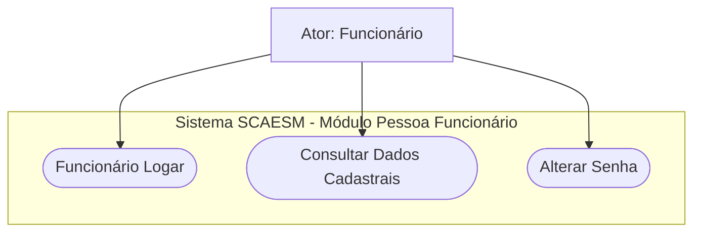
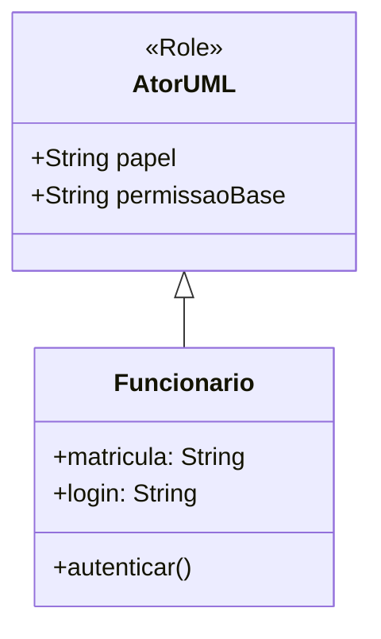
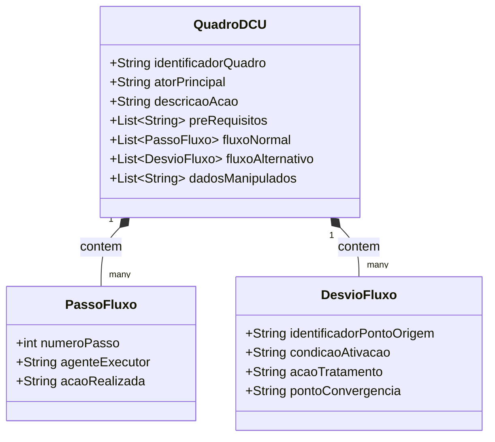
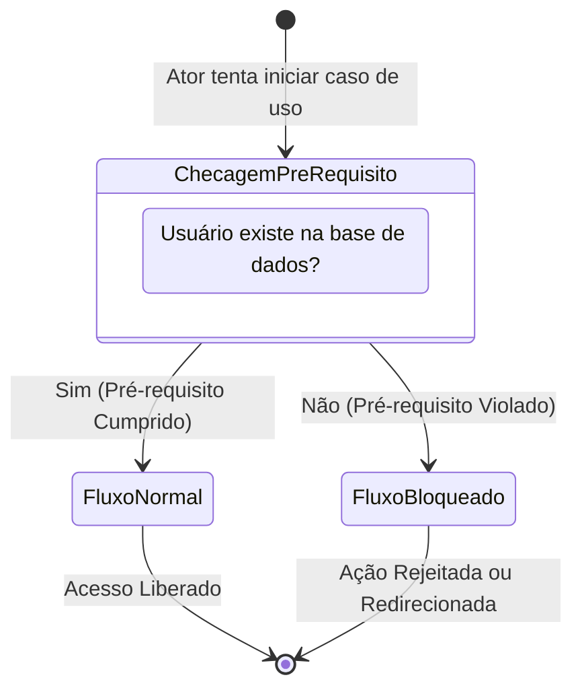
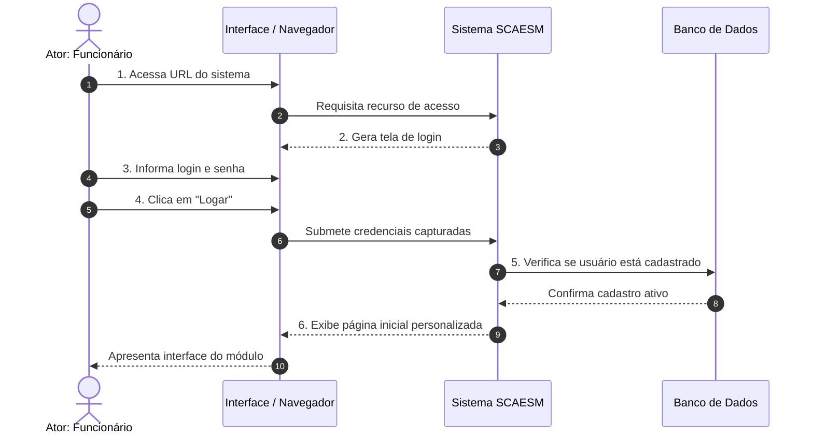
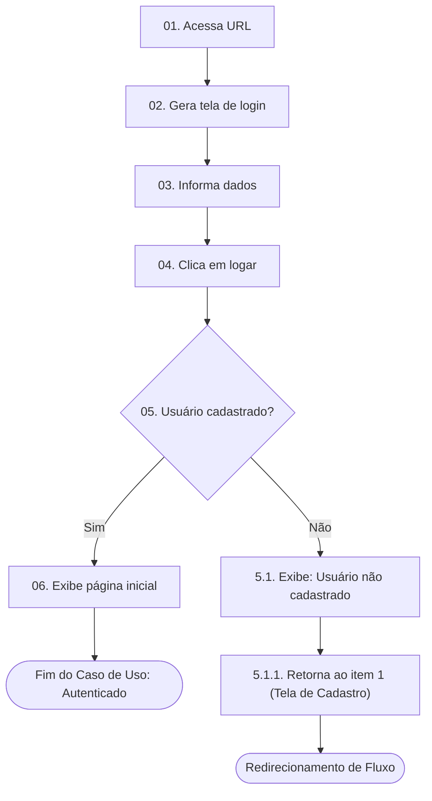
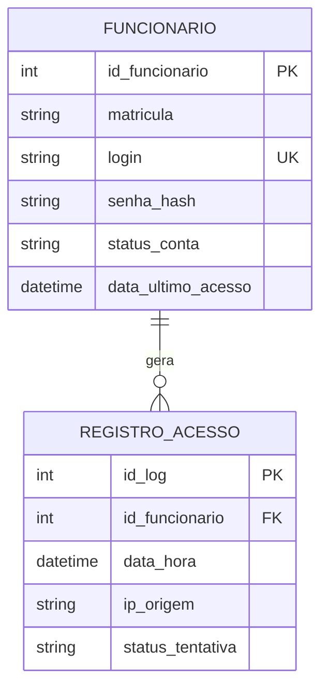
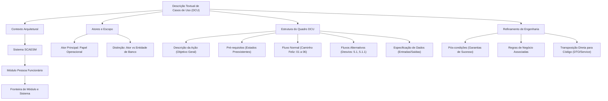

# Aula 05 — Descrição Textual de Casos de Uso

> **Professor:** Marcelo Boer  
> **Disciplina:** Engenharia de Software I (3º Semestre)  
> **Tema:** Especificação textual formal de casos de uso, estruturação de fluxos de eventos (normal e alternativo), pré-requisitos, dados manipulados e modelagem comportamental no sistema SCAESM.

---

## Sumário

- [Objetivo da aula](#objetivo-da-aula)
- [Contexto e pré-requisitos](#contexto-e-pré-requisitos)
- [Diagrama de Casos de Uso e contextualização por módulos de sistema](#diagrama-de-casos-de-uso-e-contextualização-por-módulos-de-sistema)
- [Identificação de atores e escopo da ação do usuário](#identificação-de-atores-e-escopo-da-ação-do-usuário)
- [Estrutura e seções do Quadro de Descrição de Caso de Uso (DCU)](#estrutura-e-seções-do-quadro-de-descrição-de-caso-de-uso-dcu)
- [Definição de pré-requisitos operacionais do sistema](#definição-de-pré-requisitos-operacionais-do-sistema)
- [Elaboração sequencial do Fluxo Normal (caminho principal)](#elaboração-sequencial-do-fluxo-normal-caminho-principal)
- [Mapeamento e numeração de Fluxos Alternativos e exceções](#mapeamento-e-numeração-de-fluxos-alternativos-e-exceções)
- [Especificação de dados de entrada e saída manipulados](#especificação-de-dados-de-entrada-e-saída-manipulados)
- [Código da aula](#código-da-aula)
- [Exercícios](#exercícios)
- [Erros comuns e boas práticas](#erros-comuns-e-boas-práticas)
- [Links e materiais complementares](#links-e-materiais-complementares)
- [Mapa da aula](#mapa-da-aula)
- [Glossário](#glossário)
- [Pontos-chave para a prova](#pontos-chave-para-a-prova)
- [Perguntas e respostas (JSONL)](#perguntas-e-respostas-jsonl)
- [Checklist de revisão](#checklist-de-revisão)

---

## Objetivo da aula

Esta aula tem como foco o aprofundamento na especificação detalhada de requisitos funcionais por meio da técnica de **Descrição de Casos de Uso (DCU)** estruturada em quadros textuais padronizados. 

Ao término do estudo deste material, o estudante de Engenharia de Software deverá ser capaz de:
1. Compreender a relação intrínseca e de dependência entre o diagrama visual da UML (Diagrama de Casos de Uso) e a especificação textual complementar em formato de quadro;
2. Decompor sistemas complexos em módulos funcionais coesos, situando atores e casos de uso dentro de suas devidas fronteiras arquiteturais;
3. Identificar e caracterizar com exatidão os atores do sistema, delimitando o escopo funcional da ação humana ou computacional;
4. Formular pré-requisitos operacionais válidos e rigorosos, distinguindo condições de entrada de passos do próprio fluxo;
5. Estruturar a redação do Fluxo Normal (caminho feliz) por meio de um diálogo sequencial e alternado entre a iniciativa do ator e o processamento de resposta do sistema;
6. Mapear e numerar com precisão matemática os Fluxos Alternativos e de exceção, garantindo pontos explícitos de desvio e de convergência;
7. Catalogar as massas de dados de entrada e saída manipuladas em cada interação, criando o alicerce para a modelagem conceitual de dados e para o desenvolvimento de contratos de interface.

---

## Contexto e pré-requisitos

Na disciplina de Engenharia de Software I, a modelagem de casos de uso representa a transição crítica entre o levantamento abstrato de requisitos e a concepção arquitetural preliminar de um sistema. 

Para acompanhar satisfatoriamente o conteúdo desta aula, o estudante deve resgatar os seguintes conceitos prévios:
- **Conceito de Requisito Funcional (RF):** Declaração do serviço ou função que o sistema deve fornecer aos seus utilizadores.
- **Notação Básica da UML (Unified Modeling Language):** Símbolos de atores (bonecos palito / *stick figures*), elipses de casos de uso, fronteiras de sistema (*system boundary*) e associações.
- **Conhecimento do Domínio do Sistema SCAESM:** O material de apoio utiliza como estudo de caso o sistema SCAESM (Sistema de Controle Acadêmico / Escolar / de Serviços / Municipal), especificamente a divisão de negócios centrada no módulo **Pessoa Funcionário** / **Ator Funcionário**, documentado originalmente em 2019.

A representação puramente visual provida pelo Diagrama de Casos de Uso (UML) é propositalmente de alto nível: ela comunica *o que* o sistema faz e *quem* interage com ele, mas falha solenemente em descrever *como* a interação se desenrola passo a passo. É exatamente essa lacuna de engenharia que o Quadro de Descrição de Caso de Uso (DCU) preenche.

---

## Diagrama de Casos de Uso e contextualização por módulos de sistema

### Definição
O Diagrama de Casos de Uso é um diagrama comportamental da UML que resume os pontos de interação entre os utilizadores externos (atores) e as funcionalidades providas pela aplicação. Contudo, em sistemas corporativos de médio e grande porte, a colocação de dezenas de elipses em um único diagrama gera diagramas poluídos, ilegíveis e de manutenção inviável. A engenharia de software resolve esse desafio mediante a **modularização funcional**.

### Motivação
Dividir o escopo do sistema em módulos (por exemplo: "Módulo Pessoa Funcionário", "Módulo Acadêmico", "Módulo Financeiro") permite aplicar o princípio clássico de divisão e conquista (*divide et impera*). Cada módulo agrupa casos de uso que compartilham entidades de dados, regras de negócio e atores correlatos, facilitando a validação com os clientes de cada departamento da organização.

### Exemplo contextualizado
No sistema **SCAESM**, o material de referência estabelece a Figura 7 ("Diagrama de Caso de Uso Ator Funcionário - SCAESM"), a qual foca as interações executadas especificamente pela entidade de pessoal dentro do módulo "Pessoa Funcionário". O caso de uso fundamental que viabiliza o acesso desse ator a qualquer outro recurso do sistema é o **Funcionário Logar**.



### Contraexemplo
Um erro estrutural grave é produzir diagramas monolíticos em que todos os casos de uso de uma instituição (desde a portaria até a contabilidade) aparecem misturados sem fronteiras de módulo (*system boundary* ou *packages*), conectando múltiplos atores a elipses genéricas como "Acessar Sistema" ou "Processar Informação".

### Armadilhas e armadilhas conceituais
- **Tratar diagrama como especificação completa:** Supor que apenas desenhar o ator conectado à elipse `Funcionário Logar` é suficiente para orientar a equipe de programação e testes.
- **Ausência de fronteira de sistema:** Omitir a delimitação do que pertence ao software e o que é processo manual externo.

| Critério de Comparação | Modelagem Monolítica Sem Módulos | Modelagem Modularizada (SCAESM) |
| :--- | :--- | :--- |
| **Legibilidade** | Baixa; diagramas com centenas de linhas cruzadas. | Alta; cada módulo possui foco contextual restrito. |
| **Escopo de Responsabilidade** | Difuso; difícil atribuir donos funcionais. | Claro; mapeado por área de negócio ou papel. |
| **Rastreabilidade de Requisitos** | Complexa e propensa a redundâncias. | Direta; casos de uso vinculados a pacotes específicos. |
| **Impacto de Mudanças** | Alto risco de efeitos colaterais ocultos. | Localizado; isolado dentro da fronteira do módulo. |

---

## Identificação de atores e escopo da ação do usuário

### Definição
Um **ator** em UML é qualquer entidade externa que interage diretamente com o sistema de software em análise. Um ator não representa uma pessoa física específica (como o "Sr. José da Silva"), mas sim um **papel** (*role*) exercido por indivíduos, outros sistemas de computador ou dispositivos de hardware que consomem ou fornecem dados ao software.

### Motivação
A correta identificação dos atores define a fronteira operacional do sistema. Sem saber exatamente qual papel está executando determinada ação, o sistema de controle de acessos, a matriz de permissões (RBAC) e as auditorias de segurança tornam-se impossíveis de projetar adequadamente.

### Exemplo contextualizado
No material didático em análise, o ator principal é rotulado de forma objetiva como **Funcionário**. Este funcionário assume a responsabilidade de iniciar a autenticação para obter acesso aos privilégios operacionais a ele concedidos no módulo Pessoa Funcionário do SCAESM.



### Contraexemplo
Definir como ator:
1. O próprio software que está sendo construído (exemplo: criar um ator chamado "Banco de Dados" ou "Sistema");
2. Um indivíduo específico em vez da função corporativa (exemplo: "Secretária Maria" em vez de "Secretário Acadêmico" ou "Funcionário").

### Armadilhas
- **Confundir Ator com Entidade de Banco:** O ator é o emissor/receptor de estímulos fora da fronteira. A entidade `Funcionario` dentro do banco de dados relacional é um artefato de persistência interno, não um ator externo.
- **Generalização prematura:** Substituir indiscriminadamente atores específicos por um genérico "Usuário", eliminando distinções cruciais de segurança e regras de negócio.

| Tipo de Ator | Papel no Ciclo de Vida | Exemplo no Domínio SCAESM | Relação com o Caso de Uso |
| :--- | :--- | :--- | :--- |
| **Ator Principal (Primário)** | Inicia a execução do caso de uso para atingir um objetivo de negócio mensurável. | Funcionário | Executa o login para operar o módulo interno. |
| **Ator Secundário (Apoiador)** | Fornece serviços auxiliares ou recebe notificações passivas do sistema. | Sistema de Notificação SMTP / Serviço LDAP | Valida credenciais ou envia alertas de segurança. |
| **Ator Off-stage (Interessado)** | Não interage diretamente com o software, mas tem interesse nas regras e resultados. | Auditoria Interna / Gestor de RH | Demanda registros de log de acessos para conformidade. |

---

## Estrutura e seções do Quadro de Descrição de Caso de Uso (DCU)

### Definição
O **Quadro de Descrição de Caso de Uso (DCU)** é uma estrutura tabular padronizada que formaliza a narrativa textual da execução de um caso de uso. O modelo adotado pelo Prof. Marcelo Boer (Quadro 5 – "DCU Individual Funcionário Logar") organiza os requisitos em campos fundamentais de fácil leitura e rastreamento.

### Motivação
O texto em prosa livre é naturalmente ambíguo, prolixo e sujeito a diferentes interpretações por desenvolvedores e analistas de qualidade. O quadro impõe restrições estruturais: força o analista a separar precondições, passos do caminho ideal, exceções operacionais e os artefatos de dados envolvidos.

### Exemplo contextualizado
O Quadro 5 do material do SCAESM apresenta a seguinte estrutura documental:

```text
================================================================================
Quadro 5 – DCU Individual Funcionário Logar
--------------------------------------------------------------------------------
Ator Principal:
  Funcionário
Descrição da Ação:
  Usuário deseja realizar o login no sistema. Na tela de login o usuário informa
  seus dados de login e senha.
Pré-requisito:
  Usuário deverá estar pré-cadastrado no sistema.
Fluxo Normal:
  01. Usuário acessa o URL do sistema;
  02. Sistema gera tela de login para o usuário;
  03. Usuário informa seus dados nos respectivos campos solicitados;
  04. Usuário clica em logar;
  05. Sistema verifica se o usuário está cadastrado;
  06. Sistema exibe a página inicial referente ao usuário.
Fluxo Alternativo:
  5.1. Se o usuário não estiver cadastrado no sistema será exibido a mensagem:
       “Usuário não cadastrado”;
  5.1.1. Sistema retorna ao item 1, mas com tela de cadastro.
Dados:
  login e senha.
--------------------------------------------------------------------------------
Fonte: Os Autores, 2019.
================================================================================
```

### Anatomia dos blocos do Quadro DCU
Na perspectiva da Engenharia de Software clássica (complementando o modelo didático com os padrões consolidados de Alistair Cockburn e do RUP), as seções desempenham papéis precisos:



### Contraexemplo
Um documento de caso de uso sem delimitação de seções, redigido como parágrafo único:
> *"O funcionário entra na página da web, digita o login e a senha dele e clica no botão. Se o cadastro dele existir ele entra na tela inicial. Mas se ele não estiver cadastrado dá um erro falando que não achou e joga ele para tela de cadastro."*

Esse formato impede a verificação formal de testes unitários ou de aceitação, pois não há passos numerados para os quais se possam criar asserções (*assertions*).

### Armadilhas
- **Ausência de identificador numérico nos passos:** Redigir fluxos com marcadores não ordenados (*bullets*), impossibilitando que os fluxos alternativos apontem com precisão para o ponto de ramificação.
- **Omissão do escopo dos dados:** Esquecer de declarar quais variáveis e atributos trafegam no caso de uso.

| Seção do Quadro DCU | Finalidade Primária | Informação Obrigatória no Padrão SCAESM |
| :--- | :--- | :--- |
| **Ator Principal** | Determina o papel do agente iniciador. | Funcionário. |
| **Descrição da Ação** | Visão geral sumária do objetivo e da intenção do ator. | Intenção de login e preenchimento de login/senha. |
| **Pré-requisito** | Estado exigido do ambiente/base antes do início. | Existência de pré-cadastro do usuário. |
| **Fluxo Normal** | Sequência lógica ordenada do caminho com sucesso. | Passos numerados de 01 a 06. |
| **Fluxo Alternativo** | Ramificações decorrentes de falhas ou decisões. | Subpassos numerados (5.1 e 5.1.1). |
| **Dados** | Relação dos campos manipulados na transação. | `login` e `senha`. |

---

## Definição de pré-requisitos operacionais do sistema

### Definição
Um **pré-requisito** (ou *precondição*, segundo a literatura de requisitos) é uma declaração formal de verdade absoluta sobre o estado do sistema, da infraestrutura ou do contexto operacional que **deve ser satisfeita antes** que o caso de uso seja autorizado a iniciar.

### Motivação
O software não pode processar regras de negócio no vácuo. Se um caso de uso parte da premissa de que uma entidade já foi gravada ou que uma conexão de rede segura está ativa, essa condição deve ser garantida antecipadamente. Se o pré-requisito for violado, o caso de uso sequer pode ser executado.

### Exemplo contextualizado
No Quadro 5 do Prof. Marcelo Boer, o pré-requisito estabelecido é inequívoco:
> **"Usuário deverá estar pré-cadastrado no sistema."**

Essa cláusula de guarda evita que o analista precise descrever dentro do fluxo normal mecanismos de criação preliminar de credenciais; o fluxo assume que a conta já foi devidamente provisionada por um administrador de recursos humanos ou sistema gestor do SCAESM.



### Contraexemplo
Inserir como pré-requisito ações que fazem parte da execução do próprio caso de uso:
> *Pré-requisito Incorreto:* "O usuário deve digitar a senha e clicar no botão Logar."  
Digitar a senha e clicar no botão são **passos operacionais** executados no decorrer do fluxo, e não um estado preexistente do sistema.

### Armadilhas
- **Confundir Pré-requisito com Requisito Não Funcional:** Dizer que o pré-requisito é "o sistema rodar em menos de 2 segundos" confunde critérios de performance com estados prévios de execução.
- **Ignorar dependências de banco:** Omitir tabelas essenciais que precisam conter registros prévios (como departamentos, cargos ou perfis de acesso).

| Categoria | Descrição | Exemplo Válido | Exemplo Inválido (Erro Crítico) |
| :--- | :--- | :--- | :--- |
| **Pré-requisito de Negócio** | Estado de registros e cadastros prévios. | Usuário possuir conta ativa no SCAESM. | "Usuário ter vontade de trabalhar." |
| **Pré-requisito Técnico** | Infraestrutura e ambiente operacional. | Conexão HTTPS ativa com o servidor. | "Usuário possuir monitor widescreen." |
| **Ação do Fluxo (Confusão Comum)** | Atividades interativas durante a sessão. | *Nenhuma (não pertence aqui).* | "Usuário abrir o navegador Google Chrome." |

---

## Elaboração sequencial do Fluxo Normal (caminho principal)

### Definição
O **Fluxo Normal**, comumente denominado *Caminho Feliz* (*Happy Path*), é a sequência linear e ininterrupta de passos atômicos executados quando nenhuma falha, validação negativa, erro técnico ou exceção acontece. Ele representa a jornada ideal que entrega com eficácia o valor pretendido pelo caso de uso.

### Motivação
O fluxo normal serve como espinha dorsal da funcionalidade. Ao definir a cadência perfeita de eventos, a equipe técnica estabelece a linha de base para arquitetar os controladores, as telas de interface com o usuário e os testes automatizados de sucesso.

### Exemplo contextualizado
O fluxo normal do Quadro 5 demonstra com perfeição o estilo de redação recomendado para Engenharia de Software, alternando estímulos do usuário e respostas computacionais do sistema:
1. **Passo 01:** Usuário acessa o URL do sistema; *(Ação do Ator)*
2. **Passo 02:** Sistema gera tela de login para o usuário; *(Resposta do Sistema)*
3. **Passo 03:** Usuário informa seus dados nos respectivos campos solicitados; *(Ação do Ator)*
4. **Passo 04:** Usuário clica em logar; *(Ação do Ator)*
5. **Passo 05:** Sistema verifica se o usuário está cadastrado; *(Processamento do Sistema)*
6. **Passo 06:** Sistema exibe a página inicial referente ao usuário. *(Resposta Final do Sistema)*



### Contraexemplo
Redigir passos focados exclusivamente em tecnologia de baixo nível de interface gráfica:
> *Fluxo Incorreto:*  
> 01. Usuário mexe o mouse até o campo input de ID `#txtLogin`;  
> 02. Usuário digita usando teclado ABNT2;  
> 03. Dispara evento `onchange`;  
> 04. Usuário faz requisição AJAX POST para porta 8080.  

Essa redação engessa a especificação: se o sistema migrar de interface web para um aplicativo mobile ou terminal de autoatendimento, a especificação se torna obsoleta instantaneamente.

### Armadilhas
- **Passos passivos sem sujeito:** Redigir "A tela é gerada" sem especificar se foi o sistema que gerou ou se veio de um serviço externo. A Engenharia de Requisitos exige **Agente Ativo + Ação Verbo no Presente**: *"Sistema gera tela..."*, *"Usuário clica..."*.
- **Agrupamento excessivo de ações:** Unificar múltiplos passos em um só: *"Usuário digita a senha, clica em logar, o sistema valida e abre a tela"*. Isso impede o mapeamento cirúrgico de desvios.

| Passo | Agente Responsável | Verbo de Ação | Propósito Funcional |
| :--- | :--- | :--- | :--- |
| **01** | Ator (Usuário/Funcionário) | Acessar | Estimular o início da sessão e estabelecer comunicação. |
| **02** | Sistema SCAESM | Gerar | Apresentar os campos de captura de credenciais. |
| **03** | Ator (Usuário/Funcionário) | Informar | Fornecer a carga de dados (*payload*) requerida. |
| **04** | Ator (Usuário/Funcionário) | Clicar / Disparar | Confirmar intenção de envio e disparar processamento. |
| **05** | Sistema SCAESM | Verificar | Executar regra de validação contra repositório de dados. |
| **06** | Sistema SCAESM | Exibir | Entregar o objetivo do caso de uso e estabelecer sessão. |

---

## Mapeamento e numeração de Fluxos Alternativos e exceções

### Definição
Os **Fluxos Alternativos** (e fluxos de exceção) especificam ramificações comportamentais que decorrem de situações anômalas, opções secundárias de navegação ou violações de regras de validação ocorridas durante o processamento de um passo do fluxo normal.

### Motivação
Na vida real, a maior parte do código-fonte de sistemas corporativos (geralmente entre 60% e 80%) existe para tratar desvios, erros e exceções, e não apenas o caminho feliz. Um caso de uso que não mapeia seus fluxos alternativos entrega um falso sentimento de simplicidade e expõe a aplicação a vulnerabilidades graves de segurança e travamentos inesperados.

### Exemplo contextualizado
No Quadro 5, o desvio comportamental origina-se da validação executada no **Passo 05** do fluxo normal (*"Sistema verifica se o usuário está cadastrado"*). A numeração decimal reflete de maneira rigorosa a rastreabilidade do desvio:
- **5.1:** Se o usuário não estiver cadastrado no sistema será exibido a mensagem: “Usuário não cadastrado”;
- **5.1.1:** Sistema retorna ao item 1, mas com tela de cadastro.



### Regras de Ouro da Numeração Hierárquica de Desvios (Complemento de Engenharia)
1. **Ponto de Origem Explícito:** A numeração do fluxo alternativo deve carregar o prefixo do passo do fluxo normal de onde ele se origina (exemplo: o passo 5 gera o desvio `5.1`).
2. **Subpassos Ordenados:** Se o tratamento do desvio envolver múltiplos passos subsequentes, adiciona-se novo nível decimal (exemplo: `5.1.1`, `5.1.2`).
3. **Múltiplas Condições no Mesmo Ponto:** Se o passo 5 possuir uma segunda causa de falha (como senha incorreta), este gera um ramo paralelo denominado `5.2`, com seus respectivos subpassos (`5.2.1`, `5.2.2`).
4. **Ponto de Retorno ou Término Obrigatório:** Todo fluxo alternativo deve declarar formalmente se a operação **encerra o caso de uso com falha** ou se ele **retorna a um passo específico do fluxo normal** (ponto de convergência).

### Contraexemplo
Registrar fluxos alternativos desvinculados de numeração:
> *Fluxo Incorreto:*  
> Alternativa: O usuário pode errar a senha ou não existir. Nesses casos o sistema dá mensagem de erro e ele tenta de novo.  
Esse tipo de anotação impede os desenvolvedores de saber exatamente em qual momento a mensagem surge e para onde o usuário deve ser redirecionado.

### Armadilhas
- **Fluxos alternativos "órfãos":** Criar um fluxo alternativo que descreve uma ação do sistema, mas não diz o que acontece a seguir (exemplo: emitir o erro e travar o usuário numa tela em branco).
- **Tratar regras de negócio gigantes como meras notas de rodapé:** Esconder lógicas complexas de antifraude e bloqueios de credenciais dentro de um único passo sem estruturação decimal.

| Elemento do Desvio | Papel Estrutural | Manifestação no Quadro 5 |
| :--- | :--- | :--- |
| **Gatilho de Desvio** | Condição lógica que dispara a bifurcação. | Inexistência do registro na verificação do passo 05. |
| **Ação Corretiva/Informativa** | Resposta oferecida ao ator ou ao sistema. | Exibição de mensagem explícita: "Usuário não cadastrado". |
| **Ponto de Retorno (Convergência)** | Determina como o ciclo operacional se restabelece. | Retorna ao item 1, renderizando a interface de cadastro. |

---

## Especificação de dados de entrada e saída manipulados

### Definição
A seção **Dados** do Quadro DCU cataloga os campos de informação, atributos, variáveis e artefatos de dados que trafegam entre o ator e o sistema ao longo da interação descrita no caso de uso.

### Motivação
A Engenharia de Software requer alinhamento contínuo entre o modelo comportamental (casos de uso) e o modelo estrutural de dados (Diagramas Entidade-Relacionamento e Diagramas de Classes). Especificar os dados no quadro garante que o time de arquitetura e banco de dados saiba exatamente quais atributos precisam compor as tabelas de persistência e as estruturas de transferência (*DTOs - Data Transfer Objects*).

### Exemplo contextualizado
No Quadro 5 do SCAESM, a seção finaliza declarando a massa de dados mínima indispensável para que o caso de uso atinja seu objetivo:
> **Dados:** login e senha.

Esses atributos são transportados do formulário web de login diretamente para a rotina de validação e verificação de integridade no banco de dados.



### Complemento técnico: Matriz de I/O (Entrada e Saída)
Para enriquecer a especificação além do modelo resumido de sala de aula, engenheiros sêniores de software recomendam segregar os dados em:
1. **Dados de Entrada (*Inputs*):** Inseridos ativamente pelo ator (ex: `login`, `senha`).
2. **Dados de Saída (*Outputs*):** Retornados visualmente pelo sistema (ex: `Nome do Funcionário`, `Mensagem de Erro`, `Menu de Acesso Autorizado`).
3. **Dados Internos de Sessão (*State/Context*):** Gerados pelo backend para manutenção de estado (ex: `token de autenticação JWT`, `timestamp da sessão`, `perfil de acesso`).

### Contraexemplo
Colocar na seção de dados informações genéricas e não funcionais como "Dados da tela", "Cliques do mouse" ou omitir atributos críticos para o domínio de segurança, como não citar a existência da senha.

### Armadilhas
- **Detalhar tipos de dados físicos prematuramente:** Escrever `VARCHAR(32)` ou `VARCHAR2` na especificação de requisitos de caso de uso. O caso de uso deve focar no conceito do negócio (`login`, `senha`), deixando especificações de armazenamento físico para a modelagem técnica do SGBD.
- **Incoerência entre o Fluxo e os Dados:** Citar no passo 03 que o usuário informa login e senha, mas na seção de dados declarar apenas `login`.

| Atributo | Direção do Fluxo | Origem | Destino | Sensibilidade de Segurança |
| :--- | :--- | :--- | :--- | :--- |
| **login** | Entrada | Ator Funcionário (Formulário) | Controlador de Autenticação | Baixa (Identificador Público) |
| **senha** | Entrada | Ator Funcionário (Campo Password) | Algoritmo Hash / Validador | Crítica (Dado Confidencial) |
| **Mensagem de Erro** | Saída | Sistema SCAESM | Interface do Navegador | Média (Não deve vazar dados sensíveis) |
| **Página Inicial** | Saída | Módulo Pessoa Funcionário | Tela do Usuário | Média (Visão restrita ao perfil) |

---

## Código da aula

Embora a especificação formal de casos de uso seja um artefato puramente analítico de Engenharia de Requisitos (sem linguagem de programação vinculada nos slides originais do Prof. Marcelo Boer), a boa prática de engenharia exige que o aluno veja a transposição direta do **Quadro 5** em uma estrutura de código executável. 

Abaixo apresentamos a tradução técnica do caso de uso `Funcionário Logar` em um controlador de aplicação (*Service/Controller Layer*) escrito em **TypeScript**, ilustrando como cada linha de código implementa rigorosamente um passo do Quadro DCU.

### Mapeamento conceitual de código: `AutenticacaoService.ts`

```typescript
// Interface representando a seção "Dados" do Quadro DCU
export interface DadosLoginDTO {
    login: string;
    senha: string;
}

// Interface representando o resultado e dados de saída
export interface ResultadoAutenticacao {
    sucesso: boolean;
    mensagem?: string;
    redirecionarPara: string;
    usuarioId?: string;
}

// Repositório simulando o pré-requisito: Usuário estar pré-cadastrado
export interface IUsuarioRepository {
    buscarPorLogin(login: string): Promise<{ id: string; login: string; senhaHash: string } | null>;
}

export class AutenticacaoService {
    constructor(private usuarioRepo: IUsuarioRepository) {}

    /**
     * Implementação direta do Fluxo Normal e Alternativo do Quadro 5
     */
    public async processarLogin(dados: DadosLoginDTO): Promise<ResultadoAutenticacao> {
        // [Passo 03 do Fluxo Normal]: Usuário informa seus dados nos campos
        // Validação sanitária de entrada
        if (!dados.login || !dados.senha) {
            return {
                sucesso: false,
                mensagem: "Dados de login e senha são obrigatórios.",
                redirecionarPara: "/login"
            };
        }

        // [Passo 05 do Fluxo Normal]: Sistema verifica se o usuário está cadastrado
        // (Pré-requisito do sistema em validação)
        const usuarioLocalizado = await this.usuarioRepo.buscarPorLogin(dados.login);

        // [Fluxo Alternativo 5.1]: Se o usuário não estiver cadastrado no sistema
        if (!usuarioLocalizado) {
            return {
                sucesso: false,
                // Mensagem obrigatória definida na especificação do Quadro 5:
                mensagem: "Usuário não cadastrado",
                // [Fluxo Alternativo 5.1.1]: Retorna ao item 1, mas com tela de cadastro
                redirecionarPara: "/cadastro-funcionario"
            };
        }

        // [Passo 06 do Fluxo Normal]: Sistema exibe a página inicial referente ao usuário
        // Credenciais aceitas e usuário pré-cadastrado localizado com sucesso
        return {
            sucesso: true,
            usuarioId: usuarioLocalizado.id,
            mensagem: "Login realizado com sucesso.",
            redirecionarPara: "/home-funcionario"
        };
    }
}
```

### Análise linha a linha do código em relação à especificação
- **Linhas 02 a 05 (`DadosLoginDTO`):** Materializa a seção **Dados: login e senha** do Quadro 5. Tipa rigorosamente os atributos que o ator submete.
- **Linhas 14 a 16 (`IUsuarioRepository`):** Reflete formalmente a dependência estabelecida no **Pré-requisito** (*"Usuário deverá estar pré-cadastrado no sistema"*).
- **Linha 34 (`buscarPorLogin`):** Execução do **Passo 05 do Fluxo Normal** (*"Sistema verifica se o usuário está cadastrado"*).
- **Linhas 37 a 45 (`if (!usuarioLocalizado)`):** Codificação pura do **Fluxo Alternativo 5.1 e 5.1.1**. A regra estipulada pelo analista no quadro é seguida à risca pelo desenvolvedor: exibe exatamente a mensagem `"Usuário não cadastrado"` e define o redirecionamento para o cadastro.
- **Linhas 48 a 54 (`return sucesso: true`):** Consumação do **Passo 06 do Fluxo Normal**, concedendo a navegação à interface inicial do módulo Pessoa Funcionário.

---

## Exercícios

### Exercício 1: Elaboração de Fluxo Alternativo para Credenciais Inválidas
**Enunciado:**  
Com base no Quadro 5 apresentado na aula para o caso de uso "Funcionário Logar", elabore um novo fluxo alternativo numerado como **5.2** para tratar o cenário em que o usuário está cadastrado na base de dados, mas informa uma senha incorreta. O fluxo deve prever a validação pelo sistema, a exibição de mensagem de erro apropriada, a contagem de tentativas permitidas (com bloqueio temporário após 3 tentativas consecutivas) e o retorno à tela de login mantendo o identificador do usuário preenchido.

**Raciocínio:**  
O passo 05 do fluxo normal realiza a verificação de cadastro. Ao expandir este passo, a validação de credencial requer verificar tanto a existência do login quanto a correspondência da senha. Se o login existe mas a senha diverge, um novo ramo deve ser aberto no mesmo passo 05, recebendo a notação decimal `5.2`. Deve-se especificar a verificação do contador de tentativas para determinar se haverá bloqueio ou se o sistema simplesmente solicitará nova digitação da senha.

**Resolução comentada:**
```text
Fluxo Alternativo 5.2 – Senha Incorreta e Controle de Tentativas:
  5.2.1. O sistema verifica que a senha informada não coincide com a senha cadastrada;
  5.2.2. O sistema incrementa em 1 o contador de tentativas de login do usuário;
  5.2.3. Se o contador atingir 3 tentativas inválidas consecutivas:
         5.2.3.1. O sistema bloqueia temporariamente a conta do funcionário por 15 minutos;
         5.2.3.2. O sistema exibe a mensagem: "Conta bloqueada temporariamente por excesso de tentativas inválidas.";
         5.2.3.3. O caso de uso é encerrado com falha.
  5.2.4. Se o contador for inferior a 3:
         5.2.4.1. O sistema exibe a mensagem: "Senha incorreta. Tentativa X de 3.";
         5.2.4.2. O sistema limpa o campo senha, preserva o login informado e retorna ao Passo 03 do Fluxo Normal.
```

---

### Exercício 2: Especificação Completa de DCU para Cadastro de Funcionário
**Enunciado:**  
No item 5.1.1 do fluxo alternativo do exemplo, o sistema retorna à tela de cadastro quando o usuário não é localizado. Elabore a especificação textual completa em formato de quadro para o caso de uso **Cadastrar Funcionário**. Sua descrição deve conter: Ator Principal, Descrição da Ação, Pré-requisitos, Fluxo Normal numerado passo a passo, pelo menos um Fluxo Alternativo (tentativa de cadastro com CPF já existente na base) e a relação completa dos dados solicitados.

**Raciocínio:**  
O cadastro de funcionário é um caso de uso administrativo que alimenta o pré-requisito do login. O ator precisa preencher dados corporativos e pessoais. O sistema deve validar duplicidade de registros usando um identificador único unívoco no Brasil (como o CPF) antes de persistir o novo registro e disponibilizar a credencial para login futuro.

**Resolução comentada:**
```text
================================================================================
Quadro X – DCU Individual Cadastrar Funcionário
--------------------------------------------------------------------------------
Ator Principal:
  Administrador do Sistema (ou Gestor de RH)
Descrição da Ação:
  Permite incluir um novo colaborador no módulo Pessoa Funcionário do SCAESM,
  gerando suas permissões e credenciais de acesso.
Pré-requisito:
  O operador deve estar autenticado com perfil administrativo e o cargo do
  novo funcionário já deve estar previamente parametrizado no sistema.
Fluxo Normal:
  01. O ator acessa o menu "Funcionários" e seleciona a opção "Novo Cadastro";
  02. O sistema apresenta o formulário com campos de dados pessoais e de acesso;
  03. O ator preenche nome, CPF, e-mail institucional, cargo, login inicial e senha provisória;
  04. O ator clica no botão "Salvar Cadastro";
  05. O sistema valida os campos obrigatórios e verifica a unicidade do CPF na base de dados;
  06. O sistema persiste os dados do novo funcionário na base de dados;
  07. O sistema envia um e-mail com as credenciais provisórias para o funcionário;
  08. O sistema exibe a mensagem: "Funcionário cadastrado com sucesso!" e apresenta a lista de funcionários.
Fluxo Alternativo:
  5.1. Se o CPF informado já estiver cadastrado no sistema:
       5.1.1. O sistema exibe a mensagem de erro: "CPF já cadastrado para outro funcionário.";
       5.1.2. O sistema destaca o campo CPF em vermelho, mantendo os demais dados preenchidos;
       5.1.3. O sistema retorna ao Passo 03 do Fluxo Normal.
Dados:
  Nome completo, CPF, e-mail institucional, cargo, login, senha provisória e data de admissão.
================================================================================
```

---

### Exercício 3: Modelagem Textual de Caso de Uso para Recuperação de Senha
**Enunciado:**  
Construa um Quadro de Descrição de Caso de Uso individual para a funcionalidade **Recuperar Senha**. Defina claramente: Ator Principal, Pré-requisitos, Fluxo Normal com 5 a 7 passos sequenciais (incluindo envio de token/link de validação para o e-mail cadastrado), Fluxo Alternativo para e-mail não encontrado na base de dados e a listagem de dados manipulados.

**Raciocínio:**  
A recuperação de senha é acionada pelo próprio funcionário na tela inicial quando ele esquece suas credenciais. Por segurança moderna, o sistema não deve revelar a senha antiga, e sim emitir um token temporal descartável que permite ao funcionário comprovar sua titularidade através de sua caixa de e-mail cadastrada.

**Resolução comentada:**
```text
================================================================================
Quadro Y – DCU Individual Recuperar Senha de Funcionário
--------------------------------------------------------------------------------
Ator Principal:
  Funcionário
Descrição da Ação:
  Permite ao funcionário redefinir sua senha de acesso esquecida por meio da
  validação de identidade via link temporário enviado ao seu e-mail cadastrado.
Pré-requisito:
  O funcionário deve possuir cadastro ativo e endereço de e-mail válido no SCAESM.
Fluxo Normal:
  01. Na tela de login, o usuário clica no link "Esqueci minha senha";
  02. O sistema exibe a tela de solicitação de recuperação de senha;
  03. O usuário informa seu login ou e-mail cadastrado e clica em "Enviar Link";
  04. O sistema consulta a base de dados e confirma a existência da conta associada;
  05. O sistema gera um token criptográfico temporário de validação com validade de 30 minutos;
  06. O sistema dispara uma mensagem de e-mail contendo o link exclusivo de redefinição;
  07. O sistema exibe a mensagem: "Instruções e link de redefinição foram enviados ao seu e-mail." e retorna à tela de login.
Fluxo Alternativo:
  4.1. Se o login ou e-mail informado não for localizado na base de dados:
       4.1.1. O sistema exibe a mensagem de aviso: "Identificador não localizado no cadastro.";
       4.1.2. O sistema limpa o campo digitado e retorna ao Passo 02 do Fluxo Normal.
Dados:
  login ou e-mail informado, token temporário, data/hora de expiração do token.
================================================================================
```

---

### Exercício 4: Refinamento do Quadro DCU com Pós-condições e Regras de Negócio
**Enunciado:**  
Analise a estrutura do Quadro 5 fornecida pelo professor e identifique seções complementares da Engenharia de Requisitos recomendadas para tornar a especificação mais rigorosa. Reescreva a descrição do caso de uso "Funcionário Logar" adicionando formalmente os campos **Pós-condição** (o que deve ser garantido após a execução com sucesso) e **Regras de Negócio** associadas (como padrão de complexidade de senha e expiração de sessão por inatividade).

**Raciocínio:**  
Na especificação formal clássica de software (padrão Cockburn/RUP), apenas ter pré-requisito e fluxos deixa brechas: o que acontece com o estado do sistema se tudo der certo (*pós-condição*)? E onde registrar políticas corporativas que restringem a forma como os dados são validados (*regras de negócio*) sem poluir a narrativa sequencial dos passos? Incorporar essas seções adiciona maturidade e rigor profissional à documentação técnica.

**Resolução comentada:**
```text
================================================================================
Quadro 5-Refinado – DCU Individual Funcionário Logar (Padrão Estendido)
--------------------------------------------------------------------------------
Ator Principal:
  Funcionário
Descrição da Ação:
  Usuário deseja realizar o login no sistema. Na tela de login o usuário informa
  seus dados de login e senha para ter acesso aos recursos do módulo Pessoa Funcionário.
Pré-requisito:
  Usuário deverá estar pré-cadastrado no sistema e com status ativo.
Pós-condição (Garantia de Sucesso):
  Sessão de usuário autenticada é criada no servidor, token de autorização emitido,
  registro de auditoria de login gravado com timestamp e a tela inicial do módulo
  carregada com as permissões restritas ao perfil do funcionário.
Regras de Negócio Associadas:
  [RN01 - Complexidade de Senha]: A senha deve possuir no mínimo 8 caracteres,
  contendo letras maiúsculas, minúsculas, números e caracteres especiais.
  [RN02 - Expiração de Sessão]: A sessão do usuário expira automaticamente após 20
  minutos de inatividade, exigindo novo login.
  [RN03 - Auditoria de Acesso]: Toda tentativa de login (com sucesso ou falha) deve
  gerar registro de log imutável contendo IP, data, hora e identificador do usuário.
Fluxo Normal:
  01. Usuário acessa o URL do sistema;
  02. Sistema gera tela de login para o usuário;
  03. Usuário informa seus dados de login e senha nos respectivos campos;
  04. Usuário clica em logar;
  05. Sistema valida a existência do usuário e a correspondência da senha cadastrada;
  06. Sistema cria a sessão do usuário (atendendo à RN02 e RN03);
  07. Sistema exibe a página inicial referente ao perfil do usuário.
Fluxo Alternativo:
  5.1. Se o usuário não estiver cadastrado no sistema:
       5.1.1. O sistema registra a tentativa inválida em log (RN03);
       5.1.2. O sistema exibe a mensagem: "Usuário não cadastrado";
       5.1.3. O sistema retorna ao item 01, redirecionando para a tela de solicitação de cadastro.
Dados:
  Entrada: login e senha.
  Saída: Mensagens informativas, token de sessão, nome do usuário logado e menu operacional.
================================================================================
```

---

## Erros comuns e boas práticas

### Erros comuns cometidos por estudantes
1. **Redigir fluxo em primeira pessoa ou de forma coloquial:** Escrever *"Eu entro no site e coloco minha senha..."* ou *"Aí a gente clica no botão"*. A documentação de software é impessoal, técnica e rigorosa.
2. **Confundir Caso de Uso com CRUD:** Criar um caso de uso único chamado `Gerenciar Tudo` ou `Fazer Cadastro`, que tenta misturar inclusão, consulta, edição e exclusão no mesmo fluxo normal, gerando uma árvore indecifrável de desvios.
3. **Esquecer o agente em cada passo:** Escrever passos vagos como *"03. É verificado se o cadastro existe"*. Quem verifica? É o sistema? É o banco? É um serviço externo? A regra de ouro é sempre explicitar: **[Agente] + [Verbo de Ação] + [Objeto]**.
4. **Desvios alternativos infinitos sem ponto de retorno:** O fluxo alternativo descreve uma falha, mas esquece de dizer para onde o fluxo vai. O desenvolvedor fica sem saber se o sistema fecha, se volta ao início ou se permanece na mesma tela.
5. **Inclusão prematura de decisões estéticas de UI:** Descrever cores de botões, fontes e posições de pixels (*"O usuário clica no botão azul localizado no canto superior direito de 120x40 pixels"*). Casos de uso descrevem intenções comportamentais, não o CSS da aplicação.

### Boas práticas recomendadas
- **Mantenha a granularidade equilibrada:** Um fluxo normal eficaz possui entre 3 e 9 passos. Menos que 3 passos indica simplificação exagerada; mais que 9 passos indica que o caso de uso deve ser decomposto em submódulos ou casos de uso menores relacionados via `<<include>>`.
- **Alinhe a numeração com precisão:** Se o erro acontece no passo 04, o fluxo alternativo correspondente **deve** começar com `4.1`. Isso cria rastreabilidade instantânea para a equipe de garantia de qualidade (QA) ao escrever casos de teste.
- **Utilize verbos operacionais fortes:** Prefira verbos declarativos como *Acessar, Exibir, Validar, Gravar, Redirecionar, Informar, Selecionar*. Evite termos ambíguos como *Ver, Olhar, Processar, Fazer*.

| Prática Incorreta (Anti-padrão) | Prática Correta (Padrão de Engenharia) | Justificativa Técnica |
| :--- | :--- | :--- |
| `01. O usuário mexe o cursor até o botão.` | `01. O usuário clica em Confirmar.` | Foco na intenção do negócio, e não na cinemática do periférico. |
| `Pré-requisito: Digitar a senha certa.` | `Pré-requisito: Usuário pré-cadastrado no sistema.` | Pré-requisito é o estado preexistente da base, não um passo de ação. |
| `5.1. Se der erro, o sistema avisa.` | `5.1. Se senha incorreta: exibe mensagem X e retorna ao passo 3.` | Garante previsibilidade e facilita o teste unitário/E2E. |
| `Dados: Tudo que o usuário preencher.` | `Dados: login, senha, e-mail e CPF.` | Permite ao DBA projetar o esquema de tabelas e tipos de dados. |

---

## Links e materiais complementares

- **OMG Unified Modeling Language (UML) Specification (Versão 2.5.1):**  
  *Conteúdo:* O documento oficial internacional que padroniza formalmente a sintaxe, semântica e notação visual dos casos de uso, fronteiras de sistema e atores. Leitura essencial para entender a norma que rege a UML em todo o mundo.
- **Livro "Writing Effective Use Cases" (Alistair Cockburn):**  
  *Conteúdo:* Considerada a bíblia mundial sobre estruturação textual de casos de uso. Cockburn detalha os conceitos de caminhos felizes, extensões, precondições, garantias mínimas e níveis de abstração (resumo, objetivo do usuário e subfunção).
- **Livro "Engenharia de Software: Uma Abordagem Profissional" (Roger S. Pressman & Bruce R. Maxim):**  
  *Conteúdo:* Capítulo dedicado à Modelagem de Requisitos baseada em cenários. Explica como os casos de uso atuam como mecanismo principal de validação entre clientes e desenvolvedores.
- **Livro "Engenharia de Software" (Ian Sommerville):**  
  *Conteúdo:* Aborda o processo de engenharia de requisitos, rastreabilidade e técnicas de especificação textual, comparando casos de uso formais com histórias de usuário (*User Stories*) em métodos ágeis.
- **Repositório de Estudos e Modelos de Engenharia de Requisitos da UniFEF:**  
  *Conteúdo:* Modelos de documentos de requisitos de software (SRS/DRS), modelos de quadros DCU padronizados e estudos de caso corporativos para projetos práticos de estudantes.

---

## Mapa da aula

O mapa mental abaixo consolida as inter-relações entre todos os tópicos fundamentais ministrados nesta aula de Descrição Textual de Casos de Uso:



---

## Glossário

| Termo Técnico | Definição no Contexto de Engenharia de Software |
| :--- | :--- |
| **Ator** | Entidade externa (humana, dispositivo ou outro sistema) que interage com o sistema desempenhando um papel bem definido. |
| **Ator Principal** | O ator que inicia o caso de uso com o propósito de atingir um objetivo de negócio mensurável. |
| **Caso de Uso (Use Case)** | Conjunto de sequências de ações realizadas pelo sistema, incluindo seus caminhos normais e variantes, que produzem um resultado observável de valor para um ator. |
| **Quadro DCU** | Artefato documental em formato de tabela padronizada que descreve textualmente o comportamento detalhado de um caso de uso. |
| **Fluxo Normal** | A sequência de passos atômicos do caso de uso executada sem nenhuma falha, erro ou condição alternativa (Caminho Feliz). |
| **Fluxo Alternativo** | Ramo de execução decorrente de condições anômalas, validações negativas ou opções secundárias do fluxo normal. |
| **Pré-requisito (Precondição)** | Condição lógica ou estado obrigatório que o ambiente e o sistema devem apresentar antes do início da execução do caso de uso. |
| **Pós-condição** | Estado garantido do sistema após a conclusão bem-sucedida do caso de uso (garantia de sucesso). |
| **Regra de Negócio (RN)** | Declaração de política, restrição ou fórmula matemática que rege as operações da organização, independente da tecnologia do software. |
| **Fronteira de Sistema (System Boundary)** | Linha divisória conceitual que separa as responsabilidades internas do software das entidades externas (atores). |
| **SCAESM** | Sistema corporativo fictício/acadêmico utilizado como estudo de caso no material da UniFEF para modelagem do módulo Pessoa Funcionário. |
| **DTO (Data Transfer Object)** | Objeto de transferência de dados projetado para carregar atributos (dados do quadro DCU) entre camadas de software sem lógica de negócio associada. |

---

## Pontos-chave para a prova

Fique atento aos itens abaixo, frequentemente cobrados nas avaliações teóricas e práticas do Prof. Marcelo Boer:

1. **Relação Diagrama visual vs Descrição textual:**
   - O Diagrama de Casos de Uso da UML oferece visão macro (atores e elipses funcionais).
   - O Quadro de Descrição de Caso de Uso (DCU) fornece a especificação microscópica (passos, diálogos, desvios e regras). Um não substitui o outro: eles são **estritamente complementares**.
2. **Definição precisa de Pré-requisito:**
   - Pré-requisito **nunca** é o primeiro passo que o usuário faz na tela (ex: clicar, digitar).
   - Pré-requisito é o **estado em que o sistema ou banco já deve estar** antes de o caso de uso começar (ex: estar previamente cadastrado, possuir saldo em conta, estar conectado à rede).
3. **Mecânica do Diálogo no Fluxo Normal:**
   - O fluxo normal deve alternar de forma equilibrada: ação do ator $\rightarrow$ resposta do sistema $\rightarrow$ ação do ator $\rightarrow$ processamento do sistema $\rightarrow$ resposta final.
   - Cada passo deve ter sujeito claro e verbo no presente.
4. **Numeração hierárquica e rastreabilidade nos Fluxos Alternativos:**
   - Se o desvio ocorre no passo `05`, a alternativa **deve** começar com `5.1`.
   - Se a alternativa tiver desdobramentos lógicos sequenciais, usa-se `5.1.1`, `5.1.2`.
   - O desvio precisa declarar explicitamente o que acontece: **mensagem emitida + para onde o fluxo retorna ou se o caso de uso se encerra**.
5. **Seção de Dados:**
   - Serve para orientar o projeto físico de banco de dados e a criação de contratos de API (DTOs). Deve citar os campos essenciais que trafegam na operação.

---

## Perguntas e respostas (JSONL)

```jsonl
{"pergunta": "Qual é a principal limitação do Diagrama de Casos de Uso visual da UML que justifica o uso do Quadro DCU?", "resposta": "O diagrama visual mostra apenas os atores e as elipses funcionais, mas não detalha a sequência passo a passo das ações, as telas, as mensagens de erro, os desvios e os dados manipulados.", "dificuldade": "facil"}
{"pergunta": "O que caracteriza um ator na modelagem de casos de uso da UML?", "resposta": "Um ator representa um papel executado por uma entidade externa (humano, dispositivo ou outro sistema) que interage diretamente com o software.", "dificuldade": "facil"}
{"pergunta": "No Quadro 5 do material do SCAESM, quem é o ator principal do caso de uso de autenticação?", "resposta": "O ator principal é o Funcionário.", "dificuldade": "facil"}
{"pergunta": "Qual é o pré-requisito estabelecido no Quadro 5 para o caso de uso Funcionário Logar?", "resposta": "O pré-requisito explícito é que o usuário deverá estar pré-cadastrado no sistema.", "dificuldade": "facil"}
{"pergunta": "Por que dizer que 'o usuário digita a senha' não pode ser classificado como pré-requisito de um caso de uso?", "resposta": "Porque digitar a senha é uma ação operacional executada durante o fluxo de eventos, enquanto um pré-requisito é um estado que deve existir antes de o fluxo iniciar.", "dificuldade": "media"}
{"pergunta": "O que define o Fluxo Normal em uma descrição textual de caso de uso?", "resposta": "É a sequência ideal e contínua de eventos em que todas as condições operam com sucesso e o objetivo do ator é alcançado sem erros (Caminho Feliz).", "dificuldade": "facil"}
{"pergunta": "Como deve ser estruturada a redação de cada passo individual dentro do fluxo de um caso de uso?", "resposta": "Deve conter um agente explícito (Ator ou Sistema), um verbo de ação no presente e o objeto da ação, demonstrando claramente a interação entre usuário e software.", "dificuldade": "media"}
{"pergunta": "No Quadro 5, qual evento do fluxo normal origina a bifurcação para o fluxo alternativo?", "resposta": "O passo 05 ('Sistema verifica se o usuário está cadastrado').", "dificuldade": "facil"}
{"pergunta": "Qual é a resposta do sistema descrita no fluxo alternativo 5.1 do Quadro 5?", "resposta": "O sistema exibe a mensagem de erro 'Usuário não cadastrado'.", "dificuldade": "facil"}
{"pergunta": "Qual é o ponto de convergência/retorno estabelecido no subpasso 5.1.1 do Quadro 5?", "resposta": "O sistema retorna ao item 1 do fluxo, mas apresentando a tela de cadastro ao invés da tela de login.", "dificuldade": "media"}
{"pergunta": "Por que a numeração decimal (ex: 5.1 e 5.1.1) é considerada indispensável na especificação de fluxos alternativos?", "resposta": "Porque ela provê rastreabilidade direta ao passo do fluxo normal que falhou, permitindo à equipe de desenvolvimento e testes identificar exatamente onde ocorre o desvio e para onde o fluxo retorna.", "dificuldade": "media"}
{"pergunta": "Quais dados são explicitamente listados na seção de Dados do Quadro 5 do caso de uso Funcionário Logar?", "resposta": "login e senha.", "dificuldade": "facil"}
{"pergunta": "Qual é o impacto negativo de descrever detalhes de interface gráfica (como cores e coordenadas de botões) no fluxo de um caso de uso?", "resposta": "Acopla a lógica funcional a detalhes estéticos transitórios, tornando a especificação obsoleta se o design visual ou a plataforma do sistema mudar.", "dificuldade": "media"}
{"pergunta": "O que diferencia um fluxo alternativo que recupera o fluxo de um fluxo de exceção terminal?", "resposta": "O fluxo alternativo de recuperação trata o erro e retorna a um passo anterior para nova tentativa; o fluxo terminal encerra o caso de uso com falha sem atingir o objetivo.", "dificuldade": "dificil"}
{"pergunta": "O que é uma pós-condição (garantia de sucesso) e qual a sua importância na especificação de software?", "resposta": "É o estado garantido que o sistema deve apresentar logo após o término bem-sucedido do caso de uso, como sessão criada, logs gravados e registros persistidos.", "dificuldade": "media"}
{"pergunta": "Como os dados declarados em um Quadro DCU auxiliam o trabalho do Administrador de Banco de Dados (DBA)?", "resposta": "Eles especificam os atributos exatos que a aplicação precisa persistir ou consultar, orientando a criação de entidades, colunas e relacionamentos no modelo ER.", "dificuldade": "media"}
{"pergunta": "Se um caso de uso apresenta mais de 10 passos sequenciais no fluxo normal, qual decisão de engenharia de requisitos deve ser avaliada?", "resposta": "O caso de uso deve ser avaliado para decomposição em casos de uso menores e mais coesos, utilizando mecanismos de relacionamento como include ou modularização.", "dificuldade": "dificil"}
{"pergunta": "O que é o princípio da fronteira de sistema (system boundary) no contexto do sistema SCAESM?", "resposta": "É a delimitação explícita que separa os processos e atores externos ao software das funcionalidades e componentes que residem dentro do sistema computacional.", "dificuldade": "media"}
{"pergunta": "Qual a diferença entre uma Regra de Negócio e um passo de Fluxo Normal?", "resposta": "A Regra de Negócio é uma política ou restrição independente de software (ex: complexidade de senha); o passo é a ação que o sistema executa para aplicar essa regra.", "dificuldade": "dificil"}
{"pergunta": "Por que o banco de dados interno de uma aplicação não deve ser desenhado como um ator no diagrama de casos de uso?", "resposta": "Porque o banco de dados é um componente interno de infraestrutura pertencente à arquitetura do software, e atores representam exclusivamente papéis externos à fronteira.", "dificuldade": "dificil"}
```

---

## Checklist de revisão

Utilize esta lista de verificação antes de entregar suas atividades práticas ou realizar a prova da disciplina:

- [ ] Compreendi a diferença fundamental entre a representação visual do Diagrama de Casos de Uso da UML e a especificação detalhada do Quadro DCU.
- [ ] Sei situar os casos de uso dentro de módulos de sistema específicos (como o módulo Pessoa Funcionário no SCAESM).
- [ ] Consigo identificar corretamente o Ator Principal, garantindo que ele represente um papel externo e não uma pessoa física ou tabela de banco de dados.
- [ ] Sei redigir Pré-requisitos como estados preexistentes do sistema e da base de dados, nunca confundindo-os com passos executados no fluxo.
- [ ] Sei escrever um Fluxo Normal completo utilizando a alternância padronizada entre a iniciativa do ator e o processamento do sistema.
- [ ] Aplico a numeração decimal correta nos Fluxos Alternativos (ex: `5.1`, `5.1.1`), mantendo a rastreabilidade direta com o passo de origem do fluxo normal.
- [ ] Defino com clareza o ponto de retorno ou o encerramento do caso de uso em cada fluxo alternativo mapeado.
- [ ] Listo com precisão todos os campos e atributos envolvidos na seção de Dados do quadro.
- [ ] Sei complementar a especificação com Pós-condições e Regras de Negócio quando exigido maior rigor de engenharia de software.
- [ ] Evito terminantemente a poluição dos fluxos com detalhes prematuros de design visual de interface (CSS, cores, pixels).

## Código prático de apoio

Implementações em Java que tornam executáveis os conceitos desta unidade:

- [`CasoDeUsoLoginScaesm.java`](codigo/CasoDeUsoLoginScaesm.java)
- [`CadastrarFuncionarioCasoDeUso.java`](codigo/CadastrarFuncionarioCasoDeUso.java)
- [`EspecificacaoDcuCompletaScaesm.java`](codigo/EspecificacaoDcuCompletaScaesm.java)
