# Aula 06 — Modelo de Apresentação da Fase Análise

> **Professor:** Marcelo Boer
> **Disciplina:** Engenharia de Software I (3º Semestre)
> **Tema:** Estruturação, modelagem e documentação técnica da fase de análise orientada a objetos para o projeto de avaliação AV2.

---

## Sumário

- [Sumário](#sumário)
- [Objetivo da aula](#objetivo-da-aula)
- [Contexto e pré-requisitos](#contexto-e-pré-requisitos)
- [Análise Orientada a Objetos na Fase de Análise](#análise-orientada-a-objetos-na-fase-de-análise)
- [Descrição do Contexto do Aplicativo](#descrição-do-contexto-do-aplicativo)
- [Lista de Atores e Diagrama de Atores](#lista-de-atores-e-diagrama-de-atores)
- [Quadro Descritivo de Atores do Aplicativo](#quadro-descritivo-de-atores-do-aplicativo)
- [Diagrama de Contexto Geral por Ator](#diagrama-de-contexto-geral-por-ator)
- [Lista de Casos de Uso e Mensagens do Sistema](#lista-de-casos-de-uso-e-mensagens-do-sistema)
- [Especificação e Diagrama do Caso de Uso Realizar Login com Quadro Descritivo](#especificação-e-diagrama-do-caso-de-uso-realizar-login-com-quadro-descritivo)
- [Especificação e Diagrama do Caso de Uso Cadastrar com Quadro Descritivo](#especificação-e-diagrama-do-caso-de-uso-cadastrar-com-quadro-descritivo)
- [Especificação e Diagrama do Caso de Uso Listar com Quadro Descritivo](#especificação-e-diagrama-do-caso-de-uso-listar-com-quadro-descritivo)
- [Especificação e Diagrama do Caso de Uso Carregar com Quadro Descritivo](#especificação-e-diagrama-do-caso-de-uso-carregar-com-quadro-descritivo)
- [Especificação e Diagrama do Caso de Uso Alterar com Quadro Descritivo](#especificação-e-diagrama-do-caso-de-uso-alterar-com-quadro-descritivo)
- [Especificação e Diagrama do Caso de Uso Excluir com Quadro Descritivo](#especificação-e-diagrama-do-caso-de-uso-excluir-com-quadro-descritivo)
- [Diagrama de Classes da Fase de Análise](#diagrama-de-classes-da-fase-de-análise)
- [Código da aula](#código-da-aula)
- [Exercícios](#exercícios)
- [Erros comuns e boas práticas](#erros-comuns-e-boas-práticas)
- [Links e materiais complementares](#links-e-materiais-complementares)
- [Mapa da aula](#mapa-da-aula)
- [Glossário](#glossário)
- [Pontos-chave para a prova](#pontos-chave-para-a-prova)
- [Perguntas e respostas (JSONL)](#perguntas-e-respostas-jsonl)
- [Checklist de revisão](#checklist-de-revisão)

---

## Objetivo da aula

- Compreender a finalidade e o rigor estrutural da entrega formal da avaliação AV2 da disciplina, seguindo o padrão documental estabelecido pela Fundação Educacional de Fernandópolis (UniFEF).
- Dominar a delimitação do escopo de software por meio da Análise Orientada a Objetos (AOO), diferenciando a especificação conceitual do espaço do problema da arquitetura de implementação.
- Mapear e especificar formalmente os papéis externos que interagem com o sistema por meio de listas, diagramas e quadros de atores.
- Construir diagramas de contexto geral agrupados por ator para visualizar as fronteiras e responsabilidades operacionais do sistema.
- Catalogar casos de uso padronizados e estabelecer o dicionário central de mensagens de sistema para assegurar rastreabilidade entre regras de negócio e interfaces.
- Especificar detalhadamente os fluxos principal, alternativo e de exceção dos casos de uso canônicos do sistema: Realizar Login, Cadastrar, Listar, Carregar, Alterar e Excluir.
- Projetar o Diagrama de Classes da Fase de Análise com multiplicidades, atributos conceituais e associações de domínio, isolado de acoplamentos com bancos de dados físicos ou frameworks de interface gráfica.

---

## Contexto e pré-requisitos

Esta aula aborda a transição entre o levantamento inicial de requisitos e o design arquitetural detalhado de um sistema computacional. No ciclo de vida de desenvolvimento de software, a fase de análise tem como missão responder à pergunta: **"O que o sistema deve fazer para satisfazer as necessidades do negócio?"**, sem antecipar prematuramente **"Como o sistema será implementado em termos de banco de dados, bibliotecas ou frameworks específicos"**.

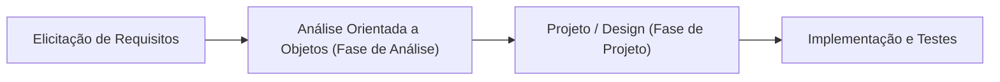

### Pré-requisitos conceituais
- Fundamentos de Orientação a Objetos: abstração, encapsulamento, classes, objetos, atributos, métodos e herança/generalização.
- Conceitos de Engenharia de Requisitos: requisitos funcionais (RF), requisitos não funcionais (RNF) e regras de negócio (RN).
- Noções de Linguagem de Modelagem Unificada (UML 2.5): sintaxe gráfica de casos de uso e diagramas estruturais.

---

## Análise Orientada a Objetos na Fase de Análise

A Análise Orientada a Objetos (AOO) investiga o domínio do problema para identificar os conceitos, responsabilidades e colaborações necessárias para atender aos requisitos levantados. Na fase de análise, a modelagem foca na semântica do negócio.

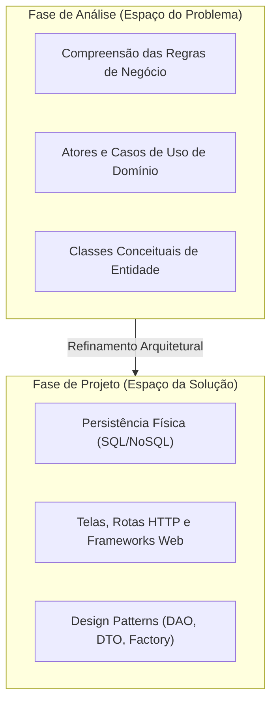

### Definição
A Fase de Análise consiste na especificação rigorosa do comportamento externo do sistema e na estrutura conceitual de seus dados. Ela gera artefatos de modelagem que descrevem os processos e as entidades sem vincular o projeto a restrições tecnológicas de implementação.

### Motivação
Desenvolvedores que pulam a fase de análise frequentemente misturam lógica de negócio com código de interface ou queries de banco de dados. Isso gera código acoplado, casos de uso redundantes e retrabalho quando um requisito funcional muda. A documentação formal estabelecida no modelo de entrega da AV2 cria um contrato claro entre a especificação e a codificação.

### Tabela comparativa: Fase de Análise versus Fase de Projeto

| Dimensão | Fase de Análise (Modelo AV2) | Fase de Projeto / Implementação |
| :--- | :--- | :--- |
| **Foco principal** | O que o software faz (requisitos e domínio). | Como o software é construído tecnicamente. |
| **Classes** | Classes conceituais do negócio (entidades do domínio). | Classes de software, DAOs, Controllers, DTOs, ViewModels. |
| **Tipos de dados** | Tipos abstratos (Texto, Número, Data, Lógico). | Tipos primitivos da linguagem (int, varchar, DateTime, UUID). |
| **Casos de uso** | Foco nas intenções do usuário e respostas do sistema. | Foco em requisições HTTP, payloads JSON, eventos e threads. |
| **Mensagens** | Mensagens de negócio exibidas ao usuário. | Códigos de status HTTP (200, 400, 500) e stack traces. |

---

## Descrição do Contexto do Aplicativo

A seção 1.1 do documento de entrega exige a caracterização formal do aplicativo, delimitando o problema que o software resolve, o ambiente em que operará e as fronteiras da aplicação.

### Definição e estrutura da descrição
A descrição do contexto deve apresentar:
1. **Identificação do sistema**: Nome fantasia e nome por extenso.
2. **Problema e justificativa**: A dor operacional ou de gestão que motivou a criação do software.
3. **Escopo do sistema**: Limites claros do que o sistema faz e do que está explicitamente fora de seu escopo.
4. **Público-alvo e ambiente operacional**: Perfis de usuários e plataformas de destino (web, mobile, desktop).

### Exemplo de contextualização técnica (Complemento didático)
> *Aplicativo: SisVendas — Sistema Integrado de Gestão Comercial e Emissão de Pedidos.*
> *Contexto: O SisVendas é uma solução corporativa voltada para automação de vendas balcão e gestão de estoque de pequenas e médias empresas do setor varejista. O sistema substitui o controle manual em comandas físicas por um fluxo digital centralizado, permitindo o cadastro de clientes, controle de produtos, visualização dinâmica de catálogo e emissão controlada de pedidos com validação de crédito e bloqueio de inadimplentes. O sistema opera em arquitetura cliente-servidor web com autenticação individualizada por perfis de acesso.*

### Contraexemplo e armadilhas
- **Texto publicitário/comercial**: Redigir o contexto como um folheto de marketing ("O melhor e mais revolucionário sistema do mercado...") em vez de uma descrição técnica e objetiva de escopo.
- **Falta de limites de escopo**: Não definir o que o sistema **não** faz, levando à falsa premissa de que a aplicação contemplará emissão fiscal, contabilidade e integração bancária completa quando essas funcionalidades não foram acordadas.

---

## Lista de Atores e Diagrama de Atores

Na seção 1.2 do documento da AV2, os atores devem ser catalogados e diagramados em UML.

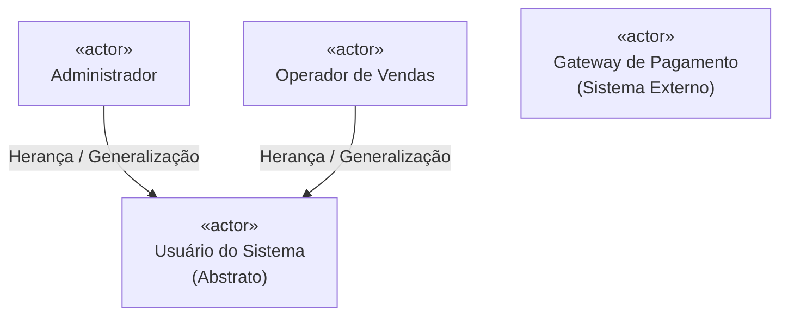

### Definição de ator
Um ator representa um papel idealizado desempenhado por uma entidade externa que interage diretamente com o sistema. Um ator pode ser:
- Uma pessoa física (ex: Administrador, Vendedor, Cliente).
- Um sistema computacional externo (ex: Gateway de Pagamento, Web Service dos Correios).
- Um dispositivo de hardware temporizador ou sensor (ex: Leitor Biométrico, Cronômetro do Sistema).

### Regras estruturais
- Atores **nunca** pertencem ao interior do sistema; eles residem no ambiente externo e se comunicam através da fronteira do software.
- Um ator **não** representa uma pessoa específica (ex: "Carlos da Silva"), mas sim o **papel** (role) desempenhado (ex: "Operador de Caixa").
- A generalização de atores é empregada quando múltiplos perfis compartilham casos de uso básicos (ex: efetuar login, alterar senha pessoal), enquanto perfis derivados herdam esses acessos e possuem privilégios adicionais.

---

## Quadro Descritivo de Atores do Aplicativo

A seção 1.3 do modelo exige a apresentação do "Quadro 1 — Descrição dos Atores do Aplicativo", detalhando responsabilidades e permissões de cada ator.

### Estrutura formal do Quadro 1

| Identificador | Nome do Ator | Categoria | Descrição do Papel e Responsabilidades |
| :--- | :--- | :--- | :--- |
| **ACT01** | **Usuário do Sistema** | Humano (Abstrato) | Papel base para qualquer usuário que possua credenciais no sistema. Permite acesso aos serviços comuns de login, autenticação e recuperação de senha. |
| **ACT02** | **Administrador** | Humano (Especializado) | Responsável pela gestão global do sistema, parametrização técnica, cadastro de usuários, concessão de perfis e auditoria de logs. |
| **ACT03** | **Operador de Vendas** | Humano (Especializado) | Responsável pela operação rotineira de consulta a catálogos, registro de novos clientes, carregamento de informações e manutenção de cadastros básicos. |
| **ACT04** | **Serviço de Cobrança** | Sistema Externo | API de terceiros acionada para verificação de crédito de clientes e validação de transações financeiras de forma assíncrona. |

---

## Diagrama de Contexto Geral por Ator

A seção 1.4 demanda o "Diagrama de Contexto Geral (Por ator)", mapeando como cada perfil externo acessa o ecossistema de casos de uso do aplicativo.

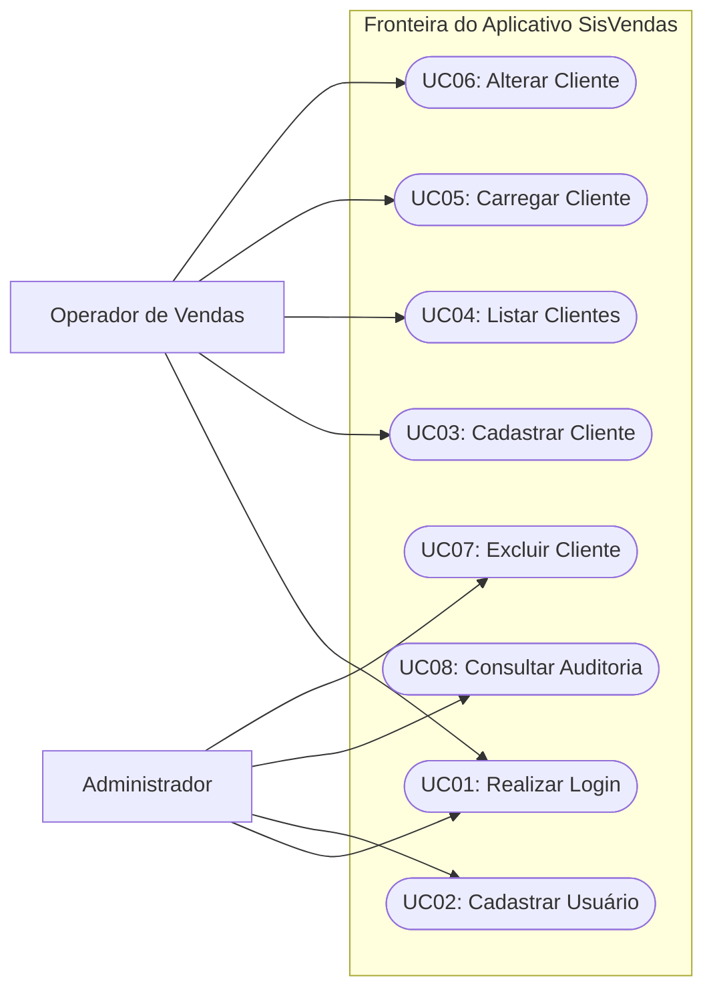

### Regras de elaboração do diagrama de contexto
1. **Fronteira do sistema explícita**: O retângulo de fronteira delimita o software em desenvolvimento. Casos de uso ficam obrigatoriamente dentro da fronteira; atores ficam obrigatoriamente fora.
2. **Associação direta**: Linhas sólidas conectam atores aos casos de uso em que atuam como iniciadores (atores primários) ou participantes (atores secundários).
3. **Escopo por ator**: Permite aos stakeholders e avaliadores verificar visualmente a matriz de autorização e controle de acessos da aplicação.

---

## Lista de Casos de Uso e Mensagens do Sistema

As seções 1.5 e 1.6 estabelecem a base de rastreabilidade do projeto: o inventário de casos de uso e o dicionário de mensagens do sistema.

### Seção 1.5: Lista de Casos de Uso
Os casos de uso devem receber identificadores únicos e títulos iniciados por verbo no infinitivo, representando uma meta perceptível de negócio para o ator.

| ID | Nome do Caso de Uso | Ator Primário | Objetivo / Descrição Sumária |
| :--- | :--- | :--- | :--- |
| **UC01** | Realizar Login | Usuário do Sistema | Autenticar o usuário mediante validação de login e senha no sistema. |
| **UC02** | Cadastrar | Operador de Vendas | Inserir novos registros de clientes na base de dados com validações obrigatórias. |
| **UC03** | Listar | Operador de Vendas | Recuperar e exibir múltiplos registros de clientes com suporte a filtros e ordenação. |
| **UC04** | Carregar | Operador de Vendas | Buscar os dados detalhados de um registro específico selecionado para visualização/edição. |
| **UC05** | Alterar | Operador de Vendas | Modificar informações de um registro previamente carregado no sistema. |
| **UC06** | Excluir | Administrador | Remover logicamente ou fisicamente um registro selecionado após confirmação. |

### Seção 1.6: Lista de Mensagens
Todas as notificações, confirmações, alertas e erros exibidos pelas telas do sistema devem ser catalogados formalmente. Nenhum caso de uso pode referenciar textos livres sem identificador associado.

| Código | Tipo | Texto Padronizado da Mensagem | Gatilho / Finalidade |
| :--- | :--- | :--- | :--- |
| **MSG01** | Erro | "Usuário ou senha inválidos. Por favor, verifique suas credenciais." | Falha na autenticação (credencial inexistente ou senha incorreta). |
| **MSG02** | Alerta | "Usuário inativo no sistema. Contate o administrador." | Tentativa de autenticação com conta desativada. |
| **MSG03** | Sucesso | "Autenticação realizada com sucesso. Redirecionando..." | Validação bem-sucedida de credenciais de login. |
| **MSG04** | Erro | "Existem campos obrigatórios não preenchidos: [Lista_Campos]." | Tentativa de gravação com atributos obrigatórios em branco. |
| **MSG05** | Erro | "Registro já cadastrado com os dados informados: [Chave_Duplicada]." | Violação de chave única de negócio (ex: CPF/CNPJ existente). |
| **MSG06** | Sucesso | "Registro gravado com sucesso!" | Confirmação de persistência bem-sucedida de novo registro. |
| **MSG07** | Alerta | "Nenhum registro encontrado para os critérios de busca informados." | Consulta executada na listagem que retorna conjunto de dados vazio. |
| **MSG08** | Erro | "Registro selecionado não foi encontrado ou foi excluído por outro usuário." | Falha ao tentar carregar registro inexistente na base de dados. |
| **MSG09** | Sucesso | "Alterações salvas com sucesso!" | Confirmação de persistência após atualização de dados. |
| **MSG10** | Confirmação | "Deseja realmente excluir o registro [Nome_Registro]? Esta ação não poderá ser desfeita." | Diálogo de segurança exibido antes de efetivar uma exclusão. |
| **MSG11** | Erro | "Não é possível excluir o registro pois existem transações ativas vinculadas." | Bloqueio de exclusão devido a regras de integridade referencial. |
| **MSG12** | Sucesso | "Registro excluído com sucesso!" | Confirmação de remoção do registro da base de dados. |

---

## Especificação e Diagrama do Caso de Uso Realizar Login com Quadro Descritivo

Seção 1.7.1 do modelo da AV2. O caso de uso de autenticação é a barreira de entrada da aplicação.

### Diagrama de Caso de Uso: Realizar Login

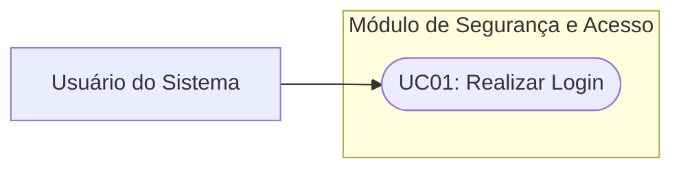

### Quadro Descritivo: UC01 — Realizar Login

| Item | Especificação |
| :--- | :--- |
| **Identificador / Nome** | **UC01 — Realizar Login** |
| **Atores** | Usuário do Sistema (Primário). |
| **Objetivo** | Validar a identidade do operador e liberar os módulos operacionais de acordo com seu perfil de autorização. |
| **Pré-condições** | O aplicativo deve estar inicializado e com conectividade ativa com a base de dados. |
| **Pós-condições** | Uma sessão autenticada é criada e o usuário é redirecionado para a tela principal correspondente ao seu perfil. |

#### Fluxo Principal (Caminho Feliz)

| Passo | Ação do Ator | Resposta do Sistema |
| :---: | :--- | :--- |
| 1 | O usuário acessa a tela de entrada do aplicativo. | O sistema apresenta o formulário solicitando identificador (login/e-mail) e senha de acesso. |
| 2 | O usuário digita suas credenciais de acesso e aciona a opção "Entrar". | O sistema valida se os campos foram preenchidos. |
| 3 | — | O sistema verifica a existência do usuário e a correspondência criptográfica da senha informada. |
| 4 | — | O sistema valida que a conta do usuário encontra-se com status ativo. |
| 5 | — | O sistema inicializa a sessão do usuário, emite a mensagem **MSG03** e redireciona a interface para o painel principal. |

#### Fluxos Alternativos e de Exceção

- **FA01 — Credenciais inválidas (Passo 3):**
  1. O sistema verifica que o usuário não existe ou que a senha fornecida não confere com o hash armazenado.
  2. O sistema incrementa o contador de tentativas incorretas.
  3. O sistema exibe a mensagem **MSG01**.
  4. O sistema limpa o campo de senha, mantém o identificador preenchido e retorna ao Passo 1 do Fluxo Principal.

- **FA02 — Conta inativa ou bloqueada (Passo 4):**
  1. O sistema identifica que a conta do usuário possui o atributo de status com valor "Inativo" ou "Bloqueado".
  2. O sistema exibe a mensagem **MSG02**.
  3. O sistema encerra o processo de autenticação e permanece na tela de login.

- **FE01 — Banco de dados inacessível (Passo 3):**
  1. Ocorre uma falha de conexão com a infraestrutura de dados.
  2. O sistema captura a exceção de rede e apresenta mensagem de indisponibilidade técnica, solicitando nova tentativa posterior sem travar a interface.

---

## Especificação e Diagrama do Caso de Uso Cadastrar com Quadro Descritivo

Seção 1.7.2 do modelo da AV2. Trata da inclusão de novas entidades no sistema.

### Diagrama de Caso de Uso: Cadastrar

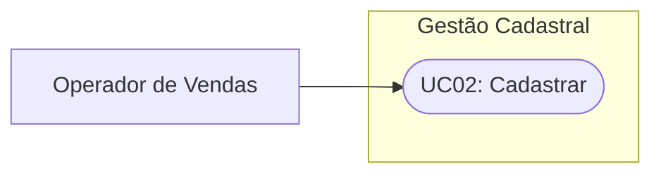

### Quadro Descritivo: UC02 — Cadastrar

| Item | Especificação |
| :--- | :--- |
| **Identificador / Nome** | **UC02 — Cadastrar** |
| **Atores** | Operador de Vendas (Primário), Administrador. |
| **Objetivo** | Incluir um novo registro de cliente na base de dados com garantia de integridade das informações. |
| **Pré-condições** | O usuário deve estar autenticado (UC01) e com permissão ativa de operador de vendas. |
| **Pós-condições** | Novo registro persistido com chave primária gerada e disponível para consultas e operações de venda. |

#### Fluxo Principal

| Passo | Ação do Ator | Resposta do Sistema |
| :---: | :--- | :--- |
| 1 | O operador aciona a funcionalidade "Novo Cadastro". | O sistema exibe o formulário com os campos de dados vazios e cursor posicionado no primeiro campo obrigatório. |
| 2 | O operador preenche os campos requeridos (Nome, CPF/CNPJ, E-mail, Telefone, Endereço) e clica em "Salvar". | O sistema valida o preenchimento de todos os campos de preenchimento compulsório. |
| 3 | — | O sistema valida o formato e a higienização dos dados (formato de e-mail, máscara e dígitos verificadores do documento). |
| 4 | — | O sistema verifica a inexistência prévia de outro registro ativo com o mesmo CPF/CNPJ na base de dados. |
| 5 | — | O sistema persiste o novo registro, registra a data de inclusão e o usuário criador, exibe a mensagem **MSG06** e atualiza o estado para o modo de visualização. |

#### Fluxos Alternativos e de Exceção

- **FA01 — Campos obrigatórios em branco (Passo 2):**
  1. O sistema identifica que um ou mais atributos compulsórios estão sem valor.
  2. O sistema destaca visualmente os campos com pendência e exibe a mensagem **MSG04**, listando os atributos faltantes.
  3. O sistema posiciona o foco no primeiro campo com erro, permitindo ao usuário completar a digitação sem reiniciar o formulário.

- **FA02 — Documento duplicado (Passo 4):**
  1. O sistema identifica que o CPF/CNPJ informado já se encontra registrado para outro cliente ativo.
  2. O sistema exibe a mensagem **MSG05**.
  3. O sistema impede a gravação e mantém os dados intactos no formulário para correção ou cancelamento.

---

## Especificação e Diagrama do Caso de Uso Listar com Quadro Descritivo

Seção 1.7.3 do modelo da AV2. Abrange a recuperação e paginação de dados do domínio.

### Diagrama de Caso de Uso: Listar

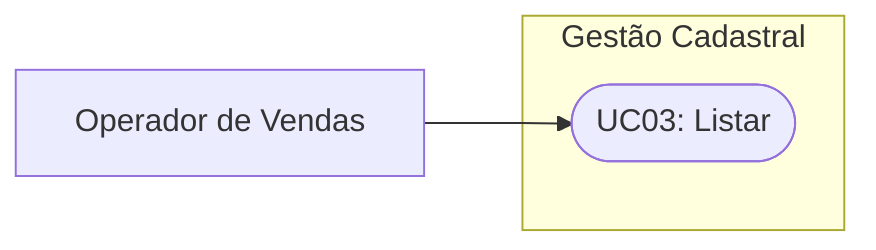

### Quadro Descritivo: UC03 — Listar

| Item | Especificação |
| :--- | :--- |
| **Identificador / Nome** | **UC03 — Listar** |
| **Atores** | Operador de Vendas (Primário), Administrador. |
| **Objetivo** | Exibir listagem consolidada de registros com suporte a parâmetros de filtragem, paginação e ordenação de colunas. |
| **Pré-condições** | O usuário deve estar autenticado no sistema (UC01). |
| **Pós-condições** | Os registros correspondentes aos critérios são renderizados em formato de grade ou tabela estruturada. |

#### Fluxo Principal

| Passo | Ação do Ator | Resposta do Sistema |
| :---: | :--- | :--- |
| 1 | O operador acessa a tela de consulta de registros. | O sistema exibe os filtros de pesquisa e carrega por padrão a primeira página com os registros mais recentes. |
| 2 | O operador informa termos de busca (ex: fragmento do nome, status ou cidade) e aciona o botão "Pesquisar". | O sistema valida os parâmetros de filtro informados. |
| 3 | — | O sistema executa a consulta na base de dados aplicando os filtros, ordenação e limites de paginação. |
| 4 | — | O sistema renderiza a grade de resultados contendo as colunas principais (Código, Nome, Documento, Cidade, Status) e o contador total de itens encontrados. |

#### Fluxos Alternativos e de Exceção

- **FA01 — Busca sem correspondência (Passo 3):**
  1. A consulta na base de dados retorna zero registros correspondentes aos filtros aplicados.
  2. O sistema limpa a tabela de dados e apresenta a mensagem **MSG07**.
  3. O sistema mantém os campos de filtro acessíveis para que o operador refine ou redefina os termos da busca.

---

## Especificação e Diagrama do Caso de Uso Carregar com Quadro Descritivo

Seção 1.7.4 do modelo da AV2. O caso de uso **Carregar** é conceitualmente distinto de *Listar*: enquanto *Listar* recupera projeções resumidas de múltiplos registros, *Carregar* recupera o estado completo e detalhado de uma única entidade selecionada na grade para carregar no formulário de edição ou visualização detalhada.

### Diagrama de Caso de Uso: Carregar

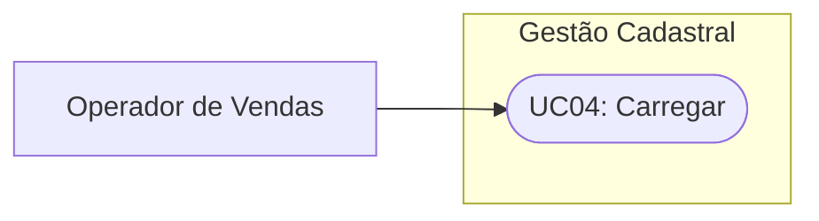

### Quadro Descritivo: UC04 — Carregar

| Item | Especificação |
| :--- | :--- |
| **Identificador / Nome** | **UC04 — Carregar** |
| **Atores** | Operador de Vendas (Primário), Administrador. |
| **Objetivo** | Obter todos os atributos e dependências associadas de um único registro específico a partir de seu identificador para visualização completa ou preparação para alteração. |
| **Pré-condições** | O usuário deve estar autenticado e a listagem (UC03) deve estar visível com pelo menos um registro exibido. |
| **Pós-condições** | Todos os campos do formulário são populados com os valores atuais do registro recuperado. |

#### Fluxo Principal

| Passo | Ação do Ator | Resposta do Sistema |
| :---: | :--- | :--- |
| 1 | O operador seleciona um registro na listagem e aciona a opção "Visualizar" ou clica na linha correspondente. | O sistema obtém o identificador único (ID) do item selecionado. |
| 2 | — | O sistema busca na base de dados a entidade completa correspondente ao ID informado. |
| 3 | — | O sistema verifica que o registro existe e não foi excluído logicamente. |
| 4 | — | O sistema abre o formulário detalhado, popula todos os campos com os dados recuperados e habilita as ações contextuais (Editar, Excluir, Voltar). |

#### Fluxos Alternativos e de Exceção

- **FA01 — Registro inexistente ou removido por concorrência (Passo 3):**
  1. O sistema verifica que o ID selecionado foi excluído da base de dados por outro usuário antes da requisição.
  2. O sistema exibe a mensagem de erro **MSG08**.
  3. O sistema atualiza automaticamente a listagem de registros (UC03) para remover a linha inconsistente.

---

## Especificação e Diagrama do Caso de Uso Alterar com Quadro Descritivo

Seção 1.7.5 do modelo da AV2. Trata da atualização dos dados de uma entidade já existente.

### Diagrama de Caso de Uso: Alterar


### Quadro Descritivo: UC05 — Alterar

| Item | Especificação |
| :--- | :--- |
| **Identificador / Nome** | **UC05 — Alterar** |
| **Atores** | Operador de Vendas (Primário), Administrador. |
| **Objetivo** | Modificar os valores dos atributos de um registro existente mantendo a rastreabilidade e integridade das regras de negócio. |
| **Pré-condições** | O registro deve ter sido carregado com sucesso no formulário por meio do caso de uso Carregar (UC04). |
| **Pós-condições** | O registro é atualizado na base de dados com novos valores, carimbo de data/hora da alteração e usuário responsável. |

#### Fluxo Principal

| Passo | Ação do Ator | Resposta do Sistema |
| :---: | :--- | :--- |
| 1 | O operador modifica os campos desejados no formulário (ex: endereço, telefone, status) e clica em "Salvar Alterações". | O sistema bloqueia os campos contra edições concorrentes. |
| 2 | — | O sistema valida se os campos de preenchimento obrigatório continuam preenchidos. |
| 3 | — | O sistema valida as regras de formatação e integridade dos novos valores digitados. |
| 4 | — | O sistema verifica se o identificador fiscal (CPF/CNPJ) foi alterado; caso positivo, valida se o novo documento não colide com outro cliente cadastrado. |
| 5 | — | O sistema atualiza o registro na base de dados, exibe a mensagem **MSG09** e alterna o formulário para modo somente-leitura. |

#### Fluxos Alternativos e de Exceção

- **FA01 — Violação de campos obrigatórios (Passo 2):**
  1. O operador removeu o conteúdo de um campo compulsório e tentou salvar.
  2. O sistema detecta o campo em branco, bloqueia a gravação e apresenta a mensagem **MSG04**.
  3. O sistema mantém os dados digitados e devolve o controle ao operador.

- **FA02 — Cancelamento da edição (A qualquer momento antes do Passo 5):**
  1. O operador aciona o botão "Cancelar".
  2. O sistema descarta as alterações realizadas na memória e recarrega os dados originais invocando o UC04.

---

## Especificação e Diagrama do Caso de Uso Excluir com Quadro Descritivo

Seção 1.7.6 do modelo da AV2. Cuida da remoção de registros e das travas de integridade referencial.

### Diagrama de Caso de Uso: Excluir

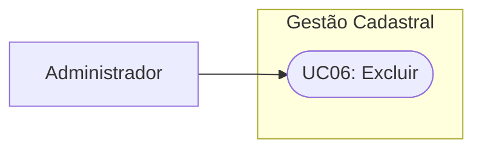

### Quadro Descritivo: UC06 — Excluir

| Item | Especificação |
| :--- | :--- |
| **Identificador / Nome** | **UC06 — Excluir** |
| **Atores** | Administrador (Primário). |
| **Objetivo** | Remover da base de dados um registro cadastral selecionado, respeitando as restrições de integridade referencial do negócio. |
| **Pré-condições** | Usuário autenticado com perfil de Administrador e registro devidamente selecionado na listagem (UC03) ou carregado (UC04). |
| **Pós-condições** | O registro é removido (exclusão física) ou marcado com status inativo/deletado (exclusão lógica), deixando de figurar nas operações cotidianas. |

#### Fluxo Principal

| Passo | Ação do Ator | Resposta do Sistema |
| :---: | :--- | :--- |
| 1 | O administrador seleciona o registro desejado e aciona o comando "Excluir". | O sistema recupera a chave de identificação do registro. |
| 2 | — | O sistema emite a caixa de diálogo modal de confirmação com a mensagem **MSG10**, informando o nome/código do item. |
| 3 | O administrador confirma a operação clicando no botão "Confirmar". | O sistema executa a validação de integridade referencial, verificando se existem entidades dependentes (ex: pedidos vinculados ao cliente). |
| 4 | — | O sistema verifica a ausência de impedimentos e efetiva a exclusão lógica do registro na base de dados. |
| 5 | — | O sistema exibe a mensagem **MSG12** e atualiza a tela de listagem de registros. |

#### Fluxos Alternativos e de Exceção

- **FA01 — Desistência da exclusão (Passo 3):**
  1. O administrador clica em "Cancelar" na caixa de diálogo de confirmação.
  2. O sistema fecha a mensagem modal sem executar qualquer instrução no banco de dados.
  3. O fluxo é abortado mantendo o estado anterior intacto.

- **FA02 — Bloqueio por integridade referencial (Passo 4):**
  1. O sistema verifica que o cliente possui pedidos de vendas registrados no histórico.
  2. O sistema impede a exclusão para não gerar inconsistência de histórico financeiro.
  3. O sistema apresenta a mensagem de erro **MSG11**.
  4. O sistema encerra a operação sem modificar o registro.

---

## Diagrama de Classes da Fase de Análise

A seção 2.1 encerra a primeira etapa técnica formal da entrega da AV2 com o **Diagrama de Classes — Fase de Análise**.

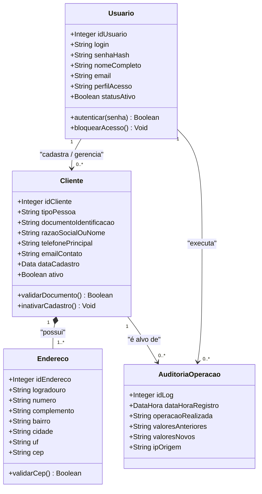

### Características do Diagrama de Classes da Fase de Análise
1. **Representação conceitual de domínio**: Classes representam conceitos do negócio real (Usuário, Cliente, Endereço, Auditoria). Não são introduzidas classes técnicas de infraestrutura (como `ClienteDAO`, `ClienteController`, `DbContext` ou `ConnectionFactory`).
2. **Tipos de dados abstratos**: Usa-se notação genérica de tipos (`Integer`, `String`, `Boolean`, `Data`, `DataHora`), evitando vinculações a dialetos específicos como `VARCHAR(150)`, `BIGINT` ou classes do framework.
3. **Multiplicidades rigorosas**: As extremidades dos relacionamentos expressam a cardinalidade do negócio:
   - `1` para exatamente um.
   - `0..*` para zero ou muitos.
   - `1..*` para um ou muitos.
   - `0..1` para opcional (zero ou um).
4. **Composição vs Associação simples**:
   - `Cliente *-- Endereco`: Composição (diamante preenchido), indicando relação todo-parte forte; se um cliente deixa de existir conceitualmente, seus endereços vinculados perdem o sentido no contexto cadastral.
   - `Usuario --> Cliente`: Associação direcionada simples com multiplicidade `1` para `0..*`.

---

## Código da aula

O anexo oficial disponibilizado pelo professor (`ModeloEntregaAv2Final.docx`) é um documento de especificação e modelagem de software, portanto **nenhum arquivo de código-fonte de implementação executável** é gerado diretamente nesta fase. 

Entretanto, para conectar a teoria da análise à prática do desenvolvimento, apresenta-se a seguir um exemplo conceitual de modelagem de dados e contratos de interfaces (em pseudocódigo estruturado e TypeScript/Domain Types), demonstrando como os artefatos de análise modelados nesta aula são traduzidos em estruturas de código limpas.

```typescript
/**
 * Definicao conceitual dos tipos de dominio - Fase de Analise
 * Espelha as classes conceituais especificadas no Diagrama de Classes
 */

export type PerfilUsuario = 'ADMINISTRADOR' | 'OPERADOR_VENDAS';

export interface UsuarioDominio {
  idUsuario: number;
  login: string;
  senhaHash: string;
  nomeCompleto: string;
  email: string;
  perfilAcesso: PerfilUsuario;
  statusAtivo: boolean;
}

export interface EnderecoDominio {
  idEndereco: number;
  logradouro: string;
  numero: string;
  complemento?: string;
  bairro: string;
  cidade: string;
  uf: string;
  cep: string;
}

export interface ClienteDominio {
  idCliente: number;
  tipoPessoa: 'FISICA' | 'JURIDICA';
  documentoIdentificacao: string; // CPF ou CNPJ higienizado
  razaoSocialOuNome: string;
  telefonePrincipal: string;
  emailContato: string;
  dataCadastro: Date;
  ativo: boolean;
  enderecos: EnderecoDominio[];
}

/**
 * Mapeamento formal das mensagens de sistema especificadas na Secao 1.6
 */
export const MensagensSistema = {
  MSG01: 'Usuário ou senha inválidos. Por favor, verifique suas credenciais.',
  MSG02: 'Usuário inativo no sistema. Contate o administrador.',
  MSG03: 'Autenticação realizada com sucesso. Redirecionando...',
  MSG04: 'Existem campos obrigatórios não preenchidos.',
  MSG05: 'Registro já cadastrado com os dados informados.',
  MSG06: 'Registro gravado com sucesso!',
  MSG07: 'Nenhum registro encontrado para os critérios de busca informados.',
  MSG08: 'Registro selecionado não foi encontrado ou foi excluído por outro usuário.',
  MSG09: 'Alterações salvas com sucesso!',
  MSG10: 'Deseja realmente excluir o registro selecionado?',
  MSG11: 'Não é possível excluir o registro pois existem transações ativas vinculadas.',
  MSG12: 'Registro excluído com sucesso!'
} as const;

export type CodigoMensagem = keyof typeof MensagensSistema;
```

---

## Exercícios

### Exercício 1: Entrega do Projeto de Avaliação AV2 Conforme Modelo de Apresentação
**Enunciado:**
Desenvolver e entregar o documento completo do projeto de software para a Avaliação AV2 da disciplina, seguindo rigorosamente a estrutura definida no anexo `ModeloEntregaAv2Final.docx`. O trabalho deve ser realizado em dupla e conter a identificação completa da instituição, departamento, identificação dos alunos e título/nome por extenso do aplicativo, contemplando as seguintes seções técnicas:
- 1. Análise Orientada à Objetos – Fase de Análise
  - 1.1. Descrição do Contexto
  - 1.2. Lista de Atores – Diagrama de Atores
  - 1.3. Quadro 1 – Descrição dos Atores do Aplicativo
  - 1.4. Diagrama de Contexto Geral (Por ator)
  - 1.5. Lista de Caso de Uso
  - 1.6. Lista de Mensagens
  - 1.7. Principais Diagramas de Caso de Uso do Projeto:
    - 1.7.1. Realizar Login e Quadro (descrição)
    - 1.7.2. Cadastrar e Quadro (descrição)
    - 1.7.3. Listar e Quadro (descrição)
    - 1.7.4. Carregar e Quadro (descrição)
    - 1.7.5. Alterar e Quadro (descrição)
    - 1.7.6. Excluir e Quadro (descrição)
- 2.1. Diagrama de Classes Fase Análise

#### Raciocínio metodológico de resolução
1. **Capa e Folha de Rosto**: Manter a formatação institucional padronizada do Centro Universitário de Fernandópolis, identificando a dupla e o professor Prof. Esp. Marcelo Tadeu Boer.
2. **Contextualização do Domínio**: Definir claramente o escopo funcional e as fronteiras do sistema, garantindo que o tema escolhido possua entidades com complexidade adequada para sustentar o ciclo de vida completo de cadastro (CRUD) e autenticação.
3. **Identificação e Catalogação de Atores**: Listar os atores primários e secundários, evitando atores que representem cargos físicos redundantes ou componentes internos do software.
4. **Harmonização entre Mensagens e Casos de Uso**: Catalogar todas as mensagens previamente na seção 1.6 com códigos (`MSG01`, `MSG02`...) e utilizá-las obrigatoriamente dentro dos passos e fluxos alternativos das especificações da seção 1.7.
5. **Diferenciação precisa dos Casos de Uso**: Tratar `Listar` como recuperação de conjuntos de registros com filtros e `Carregar` como busca atômica de um único registro selecionado para preencher a tela de edição ou detalhes.
6. **Construção do Diagrama de Classes**: Criar um diagrama de domínio sem classes técnicas de persistência (DAOs, Controllers), com tipos de dados conceituais e multiplicidades consistentes com as regras de negócio dos casos de uso.

#### Resolução comentada (Estrutura-modelo pronta para entrega)
*(Para submissão da avaliação, a dupla deve utilizar a estrutura conceitual apresentada ao longo das seções desta aula, parametrizando os dados de identificação da capa conforme abaixo).*

```text
FUNDAÇÃO EDUCACIONAL DE FERNANDÓPOLIS
CENTRO UNIVERSITÁRIO DE FERNANDÓPOLIS
FACULDADES INTEGRADAS DE FERNANDÓPOLIS
DEPARTAMENTO DE SISTEMAS DE INFORMAÇÃO

<ALUNO 1: NOME COMPLETO E RA>
<ALUNO 2: NOME COMPLETO E RA>

SISVENDAS
SISTEMA INTEGRADO DE GESTÃO COMERCIAL E EMISSÃO DE PEDIDOS

Fernandópolis – SP
2026
```

---

## Erros comuns e boas práticas

### Erros comuns
- **Misturar Análise com Implementação**: Incluir no Diagrama de Classes da Análise classes como `ConexaoMySql`, `ClienteDAO`, `RotasExpress` ou anotações de bancos de dados. Isso viola o objetivo da fase de análise.
- **Confundir "Listar" com "Carregar"**: Descrever o caso de uso `Listar` como responsável por preencher o formulário de edição, ou omitir o caso de uso `Carregar`, ignorando o passo intermediário de buscar a entidade individual pelo seu ID.
- **Mensagens soltas e não padronizadas**: Escrever frases livres nos fluxos alternativos (ex: "o sistema avisa que deu erro") em vez de amarrar formalmente ao catálogo da seção 1.6 (ex: "o sistema exibe a mensagem **MSG01**").
- **Atores internos**: Modelar "Banco de Dados" ou "Servidor" como atores do sistema. O banco de dados é um componente interno do sistema, não um ator.
- **Atores representando indivíduos**: Identificar o ator como "Maria do Financeiro" ou "João Vendedor" em vez do papel abstrato "Operador Financeiro" ou "Vendedor".
- **Casos de uso para botões**: Criar casos de uso granulares demais, como "UC: Clicar no Botão Salvar" ou "UC: Digitar Texto no Campo". Casos de uso devem representar uma meta completa e valiosa para o ator.

### Boas práticas
- **Verbo no infinitivo para casos de uso**: Manter a nomenclatura estrita: *Realizar Login*, *Cadastrar Cliente*, *Listar Produtos*, *Carregar Registro*, *Alterar Dados*, *Excluir Registro*.
- **Numeração consistente de passos**: Organizar os fluxos em passos sequenciais (1, 2, 3...) distinguindo claramente as ações do usuário das respostas do sistema.
- **Rastreabilidade total**: Cada regra de negócio que pode falhar em um caso de uso deve ter um Fluxo Alternativo correspondente e uma Mensagem de Alerta/Erro catalogada.
- **Coerência entre Classes e Casos de Uso**: Se o caso de uso manipula "Endereço" e "Telefone", esses atributos ou classes devem constar no Diagrama de Classes da seção 2.1.

---

## Links e materiais complementares

- **OMG Unified Modeling Language (UML) Specification v2.5.1**: Documento normativo internacional da Object Management Group definindo a semântica e representação gráfica de casos de uso e diagramas de classes.
- **SWEBOK Guide (Software Engineering Body of Knowledge) — IEEE Computer Society**: Capítulo 1 (Software Requirements) detalha as fases de elicitação, análise e especificação de software no processo de engenharia.
- **Writing Effective Use Cases (Alistair Cockburn)**: Obra fundamental que consolidou a metodologia de estruturação de casos de uso em fluxos principal, alternativo e de exceção com quadros descritivos.
- **Applying UML and Patterns (Craig Larman)**: Guia clássico de transição entre a Análise Orientada a Objetos e o Projeto de Software utilizando o Processo Unificado.

---

## Mapa da aula

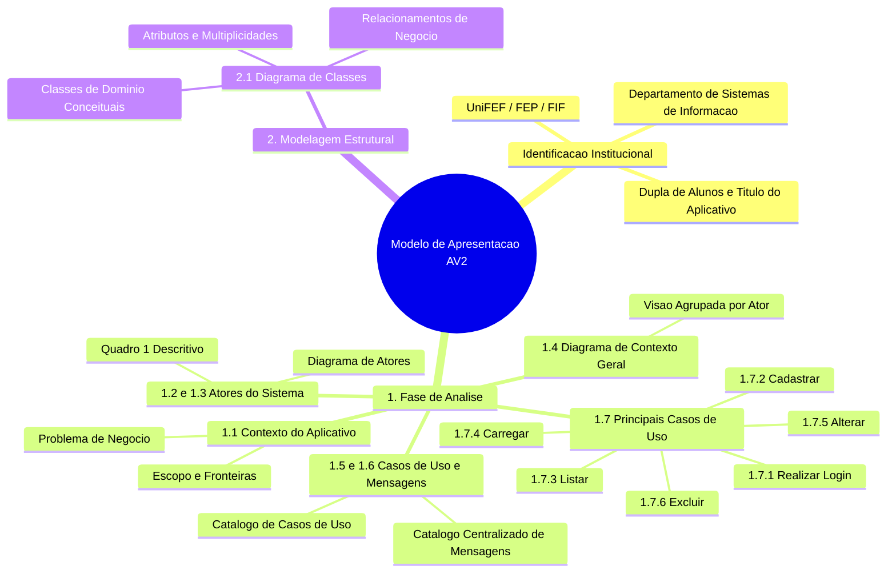

---

## Glossário

| Termo | Definição Técnica |
| :--- | :--- |
| **AOO (Análise Orientada a Objetos)** | Abordagem de engenharia que examina os requisitos do ponto de vista das classes e objetos do domínio do problema. |
| **Ator** | Entidade externa (humano, dispositivo ou sistema externo) que interage com o sistema de software desempenhando um papel. |
| **Fronteira do Sistema** | Delimitação gráfica e lógica que separa o que faz parte da aplicação interna dos elementos externos do ambiente. |
| **Caso de Uso** | Sequência de ações executadas pelo sistema que produz um resultado observável e de valor para um ator específico. |
| **Fluxo Principal** | Também denominado "Caminho Feliz" (*Happy Path*); sequência típica de passos em que tudo ocorre perfeitamente sem erros. |
| **Fluxo Alternativo** | Caminho secundário que desvia do fluxo principal para tratar variações de regras de negócio ou validações recuperáveis. |
| **Fluxo de Exceção** | Comportamento do sistema quando ocorre um erro impeditivo de execução (ex: queda de rede, falha de integridade). |
| **Caso de Uso Carregar** | Operação responsável por buscar os dados detalhados de um registro específico pelo seu ID e preencher a interface de edição. |
| **Exclusão Lógica** | Técnica onde um registro não é removido fisicamente do banco de dados, mas sim marcado como inativo através de uma flag/status. |
| **Integridade Referencial** | Regra de integridade do modelo relacional/domínio que impede que uma entidade referencie outra que não existe ou foi excluída. |
| **Multiplicidade** | Especificação do intervalo de valores permitidos para a cardinalidade em uma associação entre classes (ex: `1..*`). |
| **Composição** | Forma estrita de agregação onde as partes dependem da existência do todo (ciclo de vida compartilhado). |
| **AV2** | Avaliação formal da disciplina que verifica a capacidade de documentar e modelar a fase de análise de um projeto de software. |

---

## Pontos-chave para a prova

1. **A regra de ouro da Fase de Análise**: A análise responde **o que** o software faz; o projeto e a implementação respondem **como** ele faz tecnicamente. Não misture frameworks, tabelas SQL físicas ou DAOs nos diagramas de análise.
2. **Diferença conceitual entre Listar e Carregar**:
   - `Listar`: Retorna múltiplos registros em formato sintético/tabular com base em parâmetros de busca.
   - `Carregar`: Retorna todos os dados detalhados de um registro único selecionado a partir de seu ID para preparar a edição ou visualização detalhada.
3. **Rastreabilidade obrigatória das Mensagens**: Toda mensagem exibida nos fluxos dos casos de uso (seção 1.7) deve estar previamente cadastrada na tabela de mensagens (seção 1.6) com código unívoco (`MSG01`, `MSG02`...).
4. **Generalização de Atores**: Atores podem herdar comportamentos de atores mais genéricos. Exemplo: `Administrador` herda de `Usuário do Sistema`, herdando automaticamente o caso de uso `Realizar Login`.
5. **Composição no Diagrama de Classes**: Utilizada quando a existência de uma classe dependente não faz sentido sem a classe principal (ex: `Cliente` possui `Endereco`).

---

## Perguntas e respostas (JSONL)

```jsonl
{"pergunta": "Qual é a diferença fundamental entre a Fase de Análise e a Fase de Projeto na Engenharia de Software?", "resposta": "A Fase de Análise foca no domínio do problema e no que o sistema deve fazer sem depender de tecnologia específica, enquanto a Fase de Projeto foca na solução técnica e em como implementar usando frameworks, bancos de dados e padrões arquiteturais.", "dificuldade": "facil"}
{"pergunta": "Por que o banco de dados não deve ser modelado como um ator no Diagrama de Atores?", "resposta": "Porque um ator representa um papel externo ao sistema. O banco de dados é um componente de infraestrutura interna do próprio sistema de software.", "dificuldade": "facil"}
{"pergunta": "Qual é a finalidade da seção 1.6 (Lista de Mensagens) no modelo de documentação da AV2?", "resposta": "Catalogar e padronizar todas as notificações, alertas, confirmações e erros do sistema com códigos unívocos para garantir rastreabilidade nos fluxos dos casos de uso.", "dificuldade": "facil"}
{"pergunta": "Em qual situação deve ser utilizada a generalização/herança entre atores em um diagrama?", "resposta": "Quando múltiplos perfis de usuários compartilham casos de uso básicos comuns (como login), mas determinados perfis possuem privilégios e casos de uso adicionais exclusivos.", "dificuldade": "medio"}
{"pergunta": "Qual a distinção conceitual e operacional entre os casos de uso Listar e Carregar?", "resposta": "O caso de uso Listar recupera múltiplos registros resumidos aplicando filtros e paginação, enquanto o Carregar recupera todos os dados detalhados de um único registro específico a partir de seu ID para preenchimento de formulário.", "dificuldade": "medio"}
{"pergunta": "O que caracteriza o Fluxo Principal de um caso de uso?", "resposta": "É o caminho de execução ideal (Happy Path), onde a meta do ator é alcançada com sucesso sem a ocorrência de nenhum erro de validação ou desvio de regra de negócio.", "dificuldade": "facil"}
{"pergunta": "Por que o Diagrama de Classes da Fase de Análise não deve conter atributos com tipos físicos de bancos de dados como VARCHAR ou BIGINT?", "resposta": "Porque a fase de análise é independente de tecnologia de implementação; os tipos de atributos devem ser conceituais e abstratos como Texto, Inteiro, Data ou Booleano.", "dificuldade": "medio"}
{"pergunta": "O que é uma pós-condição em um quadro descritivo de caso de uso?", "resposta": "É o estado garantido e observável em que o sistema e seus dados devem se encontrar imediatamente após o término com sucesso da execução do caso de uso.", "dificuldade": "facil"}
{"pergunta": "Como um fluxo alternativo se comunica com a Lista de Mensagens catalogada na seção 1.6?", "resposta": "O fluxo alternativo referencia explicitamente o código da mensagem catalogada (ex: MSG04) no passo correspondente em que a validação falha e a notificação é exibida.", "dificuldade": "medio"}
{"pergunta": "Qual a consequência de criar casos de uso com granularidade excessiva, como 'Clicar no Botão Salvar'?", "resposta": "Gera poluição documental e perda de sentido do caso de uso, pois uma ação de interface isolada não produz um resultado de negócio completo e observável para o ator.", "dificuldade": "facil"}
{"pergunta": "Em quais circunstâncias a operação do caso de uso Excluir deve ser bloqueada?", "resposta": "Quando a exclusão física ou lógica violar regras de integridade referencial do negócio, como tentar excluir um cliente que possui pedidos de venda ativos vinculados.", "dificuldade": "medio"}
{"pergunta": "O que indica a relação de composição (losango preenchido) no Diagrama de Classes da Análise?", "resposta": "Indica uma relação de vínculo todo-parte forte, onde a classe-parte tem seu ciclo de vida subordinado à classe-todo; se o todo for destruído, a parte também perde seu sentido de existência.", "dificuldade": "medio"}
{"pergunta": "Como deve ser formatada a folha de rosto e identificação do projeto de acordo com o anexo da AV2?", "resposta": "Deve conter o cabeçalho oficial da Fundação Educacional e Centro Universitário de Fernandópolis, Departamento de Sistemas de Informação, identificação da dupla, título e nome por extenso do app, identificação do orientador Prof. Esp. Marcelo Tadeu Boer, local e ano 2026.", "dificuldade": "facil"}
{"pergunta": "Por que a exclusão lógica é preferível à exclusão física em sistemas comerciais?", "resposta": "Porque a exclusão lógica preserva o histórico transacional e a integridade referencial de dados passados para fins de auditoria e relatórios fiscais/financeiros.", "dificuldade": "dificil"}
{"pergunta": "Qual é a relação entre as pré-condições do caso de uso Alterar e a execução prévia do caso de uso Carregar?", "resposta": "O caso de uso Alterar exige como pré-condição que os dados originais da entidade tenham sido previamente recuperados e preenchidos no formulário através do caso de uso Carregar.", "dificuldade": "dificil"}
{"pergunta": "O que caracteriza um ator secundário em um caso de uso?", "resposta": "É um ator que não inicia a execução do caso de uso, mas do qual o sistema necessita obter dados ou enviar notificações durante o fluxo de processamento (ex: gateway de pagamento).", "dificuldade": "dificil"}
{"pergunta": "Por que uma pessoa física nominal (ex: 'Carlos Gerente') não é considerada um ator na modelagem UML?", "resposta": "Porque um ator modela um papel conceitual ou função de acesso ao sistema, e não uma pessoa física individualizada que ocupa temporariamente esse cargo na organização.", "dificuldade": "facil"}
{"pergunta": "Como os diagramas de contexto geral agrupados por ator auxiliam na arquitetura de segurança da aplicação?", "resposta": "Eles evidenciam com clareza as fronteiras de autorização de cada papel, servindo de especificação direta para o controle de acesso baseado em funções (RBAC).", "dificuldade": "dificil"}
```

---

## Checklist de revisão

- [ ] A folha de rosto e a capa contêm a identificação completa: Fundação Educacional de Fernandópolis, Departamento de Sistemas de Informação, identificação da dupla, nome fantasia e nome por extenso do aplicativo, orientador Prof. Esp. Marcelo Tadeu Boer, Fernandópolis – SP e ano 2026.
- [ ] A seção 1.1 delimita com clareza o problema, a justificativa, o escopo do que o software faz e o que está fora de escopo.
- [ ] A seção 1.2 apresenta a lista de atores e o Diagrama de Atores em sintaxe UML válida, sem incluir componentes internos do software como atores.
- [ ] A seção 1.3 contém o "Quadro 1 — Descrição dos Atores do Aplicativo" preenchido com identificador, nome, categoria e responsabilidades.
- [ ] A seção 1.4 ilustra o Diagrama de Contexto Geral com a fronteira do sistema explícita e os casos de uso agrupados pelo ator correspondente.
- [ ] A seção 1.5 cataloga todos os casos de uso com identificadores (`UC01` a `UC06`) e verbos no infinitivo.
- [ ] A seção 1.6 cataloga todas as mensagens do sistema com códigos padronizados (`MSG01`, `MSG02`...) e textos de negócio.
- [ ] Todos os casos de uso obrigatórios (1.7.1 a 1.7.6) possuem seus respectivos diagramas de caso de uso e quadros descritivos completos (atores, objetivo, pré-condições, pós-condições, fluxos principal, alternativos e de exceção).
- [ ] As mensagens catalogadas na seção 1.6 são estritamente referenciadas nos fluxos alternativos dos casos de uso.
- [ ] O caso de uso `Carregar` está claramente diferenciado de `Listar`, tratando da busca da entidade individual pelo ID para edição/detalhes.
- [ ] A seção 2.1 apresenta o Diagrama de Classes da Fase de Análise contendo apenas classes de domínio conceituais, sem artefatos técnicos de implementação (DAOs, Controllers, referências a bancos físicos).
- [ ] As associações do Diagrama de Classes contêm multiplicidades explícitas e representações coerentes de composição e herança.

## Código prático de apoio

Implementações em Java que tornam executáveis os conceitos desta unidade:

- [`ModeloDominioSisVendas.java`](codigo/ModeloDominioSisVendas.java)
- [`CasosDeUsoCadastrais.java`](codigo/CasosDeUsoCadastrais.java)
- [`AutenticacaoEControleAcesso.java`](codigo/AutenticacaoEControleAcesso.java)
