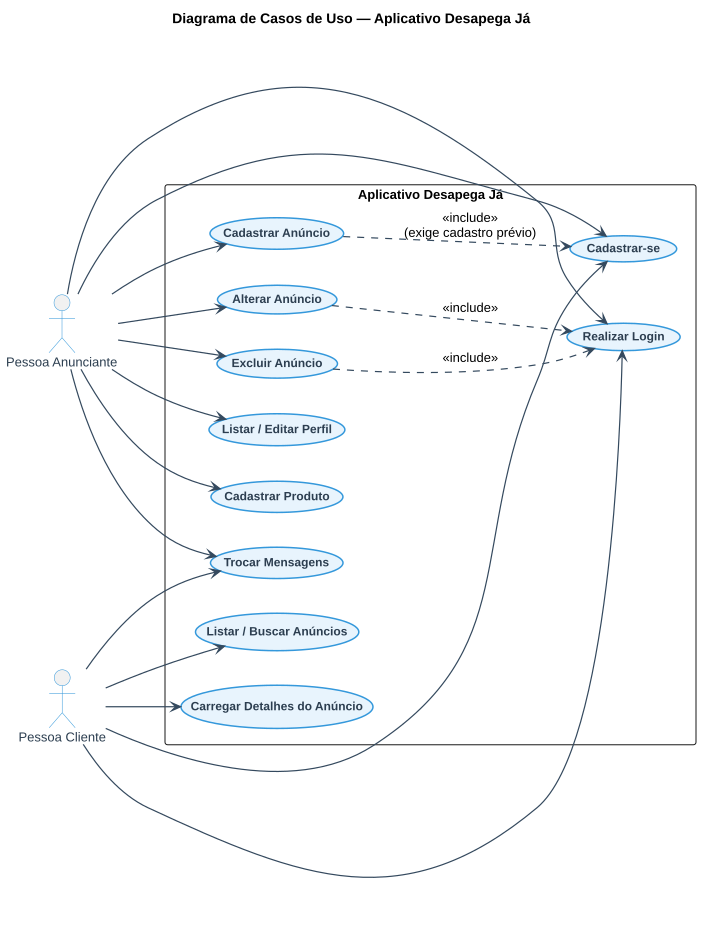
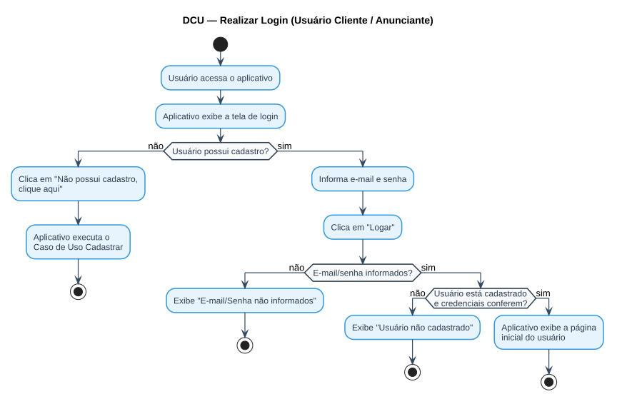

# Aula — Casos de Uso, Atores e Ferramenta Astah UML

> **Professor:** Marcelo Tadeu Boer
> **Disciplina:** Engenharia de Software I (3º Semestre)
> **Tema:** Atores, Diagrama de Casos de Uso, Descrição de Caso de Uso (DCU) e a ferramenta *Astah UML*
> **Datas de postagem:** 03/03/2026 (licença Astah UML) · 12/05/2026 (documento em sala) · 02/06/2026 (exercício e exemplo de DCU) · 09/06/2026 (modelo de entrega AV2)

## Objetivo da aula

Modelar os **atores** e os **Casos de Uso** do aplicativo *Desapega Já* segundo o padrão exigido pelo professor, aprender a estrutura de um **Quadro de Descrição de Caso de Uso (DCU)** com fluxo normal e fluxo alternativo, e utilizar a ferramenta **Astah UML** para desenhar os diagramas correspondentes.

## Ferramenta de modelagem: Astah UML

O professor disponibilizou uma licença acadêmica do **Astah UML** (arquivo [`astah_uml_license_2025-2026.xml.zip`](./astah_uml_license_2025-2026.xml.zip)) para que os alunos desenhem os diagramas de Casos de Uso, Atores e Classes exigidos nas atividades avaliativas e na entrega final da AV2, mantendo um padrão visual único entre os projetos da turma.

> O post original da Classroom sobre a licença não trouxe instruções adicionais de instalação/ativação além do arquivo em si — qualquer procedimento específico de ativação deve ser consultado diretamente com o professor ou na documentação oficial do Astah, pois não está descrito nos materiais anexados a esta aula.

## Atores do sistema

Um **ator** representa um papel desempenhado por um usuário (humano) ou sistema externo que interage diretamente com o software, iniciando ou participando de um Caso de Uso. No *Desapega Já*, os atores primários identificados no documento do professor são:

- **Pessoa Anunciante** — quem oferece produtos.
- **Pessoa Cliente** — quem busca e negocia a compra.

## Diagrama de Casos de Uso

O Diagrama de Casos de Uso representa graficamente os atores, os casos de uso (funcionalidades visíveis externamente) e os relacionamentos entre eles (associação, `<<include>>`, `<<extend>>`), sem detalhar o **como** cada funcionalidade é implementada internamente — isso é papel da Descrição de Caso de Uso e do Diagrama de Classes.

## Lista de Requisitos Funcionais / Casos de Uso do aplicativo

Tabela de mapeamento extraída do documento oficial do professor (`ENGENHARIA E MODELAGEM DE SOFTWARE I.docx`), relacionando cada requisito funcional ao seu Caso de Uso, entrada e saída:

| N° | Descrição | Caso de Uso | Entrada | Saída |
| :-: | :--- | :--- | :--- | :--- |
| 01 | Pessoa (Anunciante ou Cliente) realiza login no aplicativo | Realizar Login Aplicativo | e-mail/senha | Msg01 / Tela da Pessoa (Anunciante ou Cliente) |
| 02 | Pessoa Anunciante realiza cadastro | Cadastrar Pessoa Anunciante | dados_pessoa_anunciante | Msg02 |
| 03 | Pessoa Anunciante solicita listar seus dados (Perfil) | Listar Pessoa Anunciante | – | Dados Pessoa Anunciante |
| 04 | Pessoa Anunciante solicita editar seus dados (Perfil) | Editar Pessoa Anunciante | dados_pessoa_anunciante | Msg03 / Dados Pessoa Anunciante |
| 05 | Pessoa Anunciante cadastra produto | Cadastrar Produto | dados_produto | Msg02 |
| 06 | Aplicativo lista produtos | Listar Produtos | – | Dados Produto |
| 07 | Pessoa Anunciante solicita editar produto | Editar Produto | id_produto | Dados Produto |
| 08 | Pessoa Anunciante solicita excluir produto | Excluir Produto | id_produto | Msg04 |
| 09 | Pessoa Anunciante solicita buscar produto | Buscar Produto | dados_produto | Dados Produto |
| 10 | Pessoa Anunciante cadastra anúncio | Cadastrar Anúncio | dados_anuncio | Msg02 |
| 11 | Aplicativo lista anúncios | Listar Anúncio | – | Dados Anúncio |
| 12 | Pessoa Anunciante solicita editar anúncio | Editar Anúncio | id_anuncio | Dados Anúncio |
| 13 | Pessoa Anunciante solicita excluir anúncio | Excluir Anúncio | id_anuncio | Msg04 |
| 14 | Pessoa Anunciante busca anúncio | Buscar Anúncio | dados_anuncio | Dados Anúncio |
| 15 | Pessoa Anunciante troca mensagens com Cliente | Trocar Mensagens Anunciante e Cliente | dados_mensagens | Dados Mensagens |

## Estrutura de um Quadro de Descrição de Caso de Uso (DCU)

O padrão de DCU cobrado pelo professor segue sempre os mesmos campos, numerando o **Fluxo Normal** sequencialmente e os desvios do **Fluxo Alternativo** com numeração decimal referenciando o passo do fluxo normal em que o desvio ocorre (ex.: `5.1` é um desvio do passo 5):

> **Quadro X – DCU Individual: [Nome do Caso de Uso]**
> - **Ator Principal:** ator que inicia a ação.
> - **Descrição da Ação:** narrativa resumida do que o ator deseja realizar.
> - **Pré-requisito:** condição que deve ser verdadeira antes do caso de uso começar.
> - **Fluxo Normal:** sequência numerada (01, 02, 03…) do caminho de sucesso.
> - **Fluxo Alternativo:** desvios numerados por referência ao passo do fluxo normal (ex.: `2.1`, `5.1`, `5.1.1`).
> - **Dados:** quais dados de entrada/saída estão envolvidos.

### Exemplo do próprio documento do professor — DCU "Realizar Login" (Usuário Cliente)

**Ator Principal:** Usuário Cliente
**Descrição da Ação:** Usuário Cliente deseja realizar o login no aplicativo. Na tela de login o usuário informa e-mail e senha e clica na opção "Logar"; o aplicativo verifica e-mail e senha cadastrados e exibe a tela principal do Usuário Cliente.
**Pré-requisito:** Usuário Cliente deve estar pré-cadastrado no aplicativo.

**Fluxo Normal**
1. Usuário Cliente acessa o aplicativo;
2. O aplicativo exibe a tela de login para o usuário cliente;
3. Usuário Cliente informa e-mail e senha nos respectivos campos solicitados;
4. Usuário Cliente clica em Logar;
5. Aplicativo verifica se o Usuário Cliente está cadastrado;
6. Aplicativo exibe a página inicial referente ao usuário cliente.

**Fluxo Alternativo**
- `2.1.` Se o Usuário Cliente não possui cadastro no aplicativo, clica na opção "Não possui cadastro, clique aqui".
- `2.2.` O aplicativo executa o Caso de Uso Cadastrar Usuário Cliente.
- `5.1.` Se o Usuário Cliente não informou e-mail/senha, o aplicativo exibe a mensagem "E-mail/Senha não informados".
  - `5.1.1.` Aplicativo retorna ao item 3.
- `5.2.` Se o Usuário Cliente não estiver cadastrado no aplicativo, é exibida a mensagem "Usuário Cliente não cadastrado".
  - `5.1.1` Aplicativo retorna ao item 3.

**Dados:** e-mail e senha.

*(Fonte: Os Autores, 2026 — documento `ENGENHARIA E MODELAGEM DE SOFTWARE I.docx`.)*

O diagrama de atividades abaixo formaliza esse mesmo fluxo (normal + alternativo) em notação UML:

### Exemplo de referência (material de apoio do professor) — DCU "Funcionário Logar"

O professor também disponibilizou, como exemplo de padrão de outro projeto (SCAESM, 2019), o arquivo [`ExemploDescriçãoDiagramaDCU.docx`](./ExemploDescri%C3%A7%C3%A3oDiagramaDCU.docx), com a seguinte descrição, usada como modelo de referência da formatação esperada:

> **Quadro 5 – DCU Individual Funcionário Logar** · **Ator Principal:** Funcionário · **Pré-requisito:** usuário deverá estar pré-cadastrado no sistema · **Fluxo Normal:** (01) usuário acessa o URL do sistema; (02) sistema gera tela de login; (03) usuário informa dados; (04) usuário clica em logar; (05) sistema verifica cadastro; (06) sistema exibe página inicial · **Fluxo Alternativo:** `5.1` se o usuário não estiver cadastrado, exibe "Usuário não cadastrado"; `5.1.1` sistema retorna ao item 1, com tela de cadastro · **Dados:** login e senha.

## Atividade proposta pelo professor — Casos de Uso a descrever

O post de 02/06/2026 solicitou a descrição completa (Quadro de DCU) dos seguintes Casos de Uso do *Desapega Já*, seguindo o padrão acima: **Logar, Cadastrar, Listar, Carregar, Alterar e Excluir**. A resolução aplicada desses seis casos de uso, incluindo atores e Diagrama de Classes da fase de análise, está documentada no Trabalho [Atividade Avaliativa Prática 02 — Atores e Diagrama de Classes Fase de Análise](../../Trabalhos/Atividade%20Avaliativa%20Pr%C3%A1tica%2002%20-%20Atores%20e%20Diagrama%20de%20Classes%20Fase%20de%20An%C3%A1lise/detalhes.md).

> O post "Documento desenvolvido em sala de aula" (12/05/2026) não trouxe texto próprio distinto além do título — trata-se de material complementar produzido durante a aula prática de modelagem, sem conteúdo textual adicional capturado na sincronização da Classroom além do já reproduzido nesta seção. Sinalizado aqui para transparência, em vez de conteúdo inventado.

## Modelo de entrega da AV2

O post de 09/06/2026 anexou o arquivo [`ModeloEntregaAv2Final.docx`](./ModeloEntregaAv2Final.docx), um template com a estrutura obrigatória do documento final do projeto (a ser preenchido com o aplicativo escolhido por cada grupo):

1. **Análise Orientada a Objetos – Fase de Análise**
   1. Descrição do Contexto
   2. Lista de Atores — Diagrama de Atores
   3. Quadro 1 – Descrição dos Atores do Aplicativo
   4. Diagrama de Contexto Geral (por ator)
   5. Lista de Casos de Uso
   6. Lista de Mensagens
   7. Principais Diagramas de Caso de Uso do Projeto, com Quadro de descrição para cada um: Realizar Login, Cadastrar, Listar, Carregar, Alterar, Excluir
2. **Diagrama de Classes (Fase de Análise)**

Esse é exatamente o roteiro seguido na entrega do Trabalho [ATIVIDADE AV2](../../Trabalhos/ATIVIDADE%20AV2/detalhes.md).

## Exercícios de fixação

1. Escreva o Quadro de DCU completo do Caso de Uso "Cadastrar Pessoa Anunciante", seguindo a mesma estrutura do exemplo "Realizar Login" (Ator Principal, Descrição da Ação, Pré-requisito, Fluxo Normal, Fluxo Alternativo, Dados).
2. No DCU de Login, por que o passo `5.1` é um desvio do passo 5 e não do passo 3, mesmo tratando da ausência de e-mail/senha?
3. Desenhe (em texto ou no Astah UML) o Diagrama de Casos de Uso apenas com os casos de uso relacionados ao ator Pessoa Cliente.
4. Que relação de `<<include>>` faz sentido entre "Cadastrar Anúncio" e "Cadastrar Pessoa Anunciante"? Justifique com base na regra de negócio do aplicativo.
5. Compare a Descrição de Caso de Uso (DCU) com o Diagrama de Casos de Uso: o que cada um comunica que o outro não comunica?

Gabarito (exercícios 2 e 4)

**Exercício 2:** O passo 5 é "Aplicativo verifica se o Usuário Cliente está cadastrado" — a verificação de credenciais (que inclui checar se e-mail/senha foram informados) só faz sentido semanticamente como parte dessa etapa de verificação, mesmo que o dado tenha sido coletado no passo 3. A numeração decimal do fluxo alternativo referencia o passo do fluxo normal em que a condição de desvio é *avaliada*, não necessariamente aquele em que o dado foi originalmente inserido.

**Exercício 4:** Faz sentido um `<<include>>` de "Cadastrar Anúncio" para "Cadastrar Pessoa Anunciante" apenas se a regra de negócio exigir cadastro prévio para anunciar — mas o contexto original do Desapega Já diz o contrário (RF02: "permitir anúncio de produtos" sem exigência de cadastro). Esse é um bom exemplo de ponto em que a modelagem precisa ser revisada conforme decisões de produto evoluem — no diagrama desta aula, o `<<include>>` foi modelado para "Cadastrar Produto" → "Cadastrar Pessoa Anunciante", que é a etapa que efetivamente exige identidade do vendedor.

## Material relacionado

- [`2026-03-03 - Licena Astah UML.md`](./2026-03-03%20-%20Licena%20Astah%20UML.md)
- [`2026-05-12 - Documento desenvolvido em sala de a.md`](./2026-05-12%20-%20Documento%20desenvolvido%20em%20sala%20de%20a.md)
- [`2026-06-02 - Desenvolver a descrio dos seguintes.md`](./2026-06-02%20-%20Desenvolver%20a%20descrio%20dos%20seguintes.md)
- [`2026-06-02 - Exemplo Descrio de Caso de Uso.md`](./2026-06-02%20-%20Exemplo%20Descrio%20de%20Caso%20de%20Uso.md) / [`ExemploDescriçãoDiagramaDCU.docx`](./ExemploDescri%C3%A7%C3%A3oDiagramaDCU.docx)
- [`2026-06-09 - Modelo de Apresentao a ser seguido.md`](./2026-06-09%20-%20Modelo%20de%20Apresentao%20a%20ser%20seguido.md) / [`ModeloEntregaAv2Final.docx`](./ModeloEntregaAv2Final.docx)
- [Aula: Contexto do Aplicativo e Engenharia de Requisitos](../Contexto%20do%20Aplicativo%20e%20Engenharia%20de%20Requisitos/detalhes.md)
- [Trabalho: Atividade Avaliativa Prática 02 — Atores e Diagrama de Classes Fase de Análise](../../Trabalhos/Atividade%20Avaliativa%20Pr%C3%A1tica%2002%20-%20Atores%20e%20Diagrama%20de%20Classes%20Fase%20de%20An%C3%A1lise/detalhes.md)
- [Trabalho: ATIVIDADE AV2](../../Trabalhos/ATIVIDADE%20AV2/detalhes.md)
- [Resumo executivo, exercícios, simulado e cheatsheet da disciplina](../../README.md#resumo-executivo)
