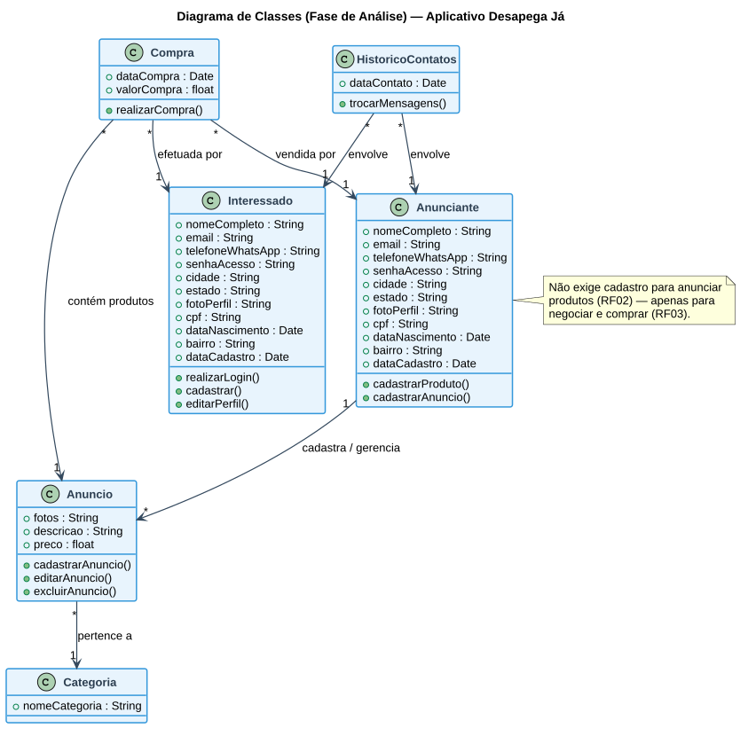

# Aula — Contexto do Aplicativo e Engenharia de Requisitos

> **Professor:** Marcelo Tadeu Boer
> **Disciplina:** Engenharia de Software I (3º Semestre)
> **Tema:** Processo de Abstração — Contexto I: Aplicativo Móvel *Desapega Já* · Levantamento de Requisitos Funcionais e Não-Funcionais · Classes de Domínio
> **Data de postagem:** 24/02/2026

## Objetivo da aula

Apresentar o estudo de caso base que acompanha toda a disciplina — o aplicativo móvel **Desapega Já** — e conduzir a primeira etapa da Engenharia de Software: o **Processo de Abstração**, isto é, a transformação de uma descrição textual de um problema de negócio em um conjunto estruturado de requisitos, classes de domínio e atores, que servirão de base para a modelagem UML feita nas aulas seguintes.

## Contexto do Aplicativo — Desapega Já

Muitas pessoas possuem em casa produtos que não utilizam mais, como roupas, eletrônicos, móveis e livros, que acabam ficando guardados ou sendo descartados. Para facilitar a venda desses itens, foi idealizado o **Desapega Já**, uma plataforma móvel prática e acessível que conecta vendedores e compradores da mesma região.

O aplicativo permite que qualquer pessoa anuncie produtos informando **fotos, descrição, preço e categoria**, sem necessidade de cadastro prévio para anunciar. Já as pessoas interessadas em comprar devem realizar um **cadastro simples** para poder entrar em contato com os vendedores e negociar os produtos. No momento do cadastro, o aplicativo solicita dados básicos — nome completo, e-mail, número de telefone (com WhatsApp, se houver), senha de acesso, cidade e estado —, podendo também incluir foto de perfil. Para aumentar a segurança das negociações, podem ser solicitados dados adicionais como CPF, data de nascimento e bairro, usados para facilitar a busca por proximidade. Além disso, o sistema deve gerar automaticamente informações como ID do usuário, data de cadastro, histórico de contatos ou compras realizadas e avaliações recebidas.

A proposta do aplicativo é tornar o processo de venda mais rápido, organizado e seguro, incentivando a **reutilização de produtos, a economia colaborativa e o consumo consciente**.

Esta é a assimetria de acesso central do estudo de caso: **anunciar é livre; comprar/negociar exige cadastro** — decisão de produto que impacta diretamente a modelagem dos casos de uso das aulas seguintes.

## Levantamento dos Requisitos Funcionais (RF)

Requisito funcional descreve uma ação/função que o software deve executar.

| N° | Requisito Funcional |
| :-: | :--- |
| RF01 | Facilitar a venda de produtos |
| RF02 | Permitir anúncio de produtos |
| RF03 | Permitir cadastro de pessoas interessadas nas compras (Clientes/Interessados) |
| RF04 | Facilitar a busca de produtos por proximidade |
| RF05 | Gerar histórico de contatos ou compras realizadas e avaliações recebidas |
| RF06 | Permitir cadastro de pessoas que farão a oferta de produtos (Anunciantes) |
| RF07 | Permitir o cadastro de produtos a serem vendidos |
| RF08 | Possibilitar troca de mensagens entre as partes interessadas |

## Levantamento dos Requisitos Não-Funcionais (RNF)

Requisito não funcional descreve uma qualidade, restrição ou atributo de desempenho do sistema — não uma ação.

| N° | Requisito Não-Funcional |
| :-: | :--- |
| RNF01 | Fácil usabilidade |
| RNF02 | Segurança |
| RNF03 | Prático e acessível |
| RNF04 | Integridade de dados |

> No material original do professor, os campos RNF05 a RNF08 constam na tabela sem descrição preenchida — foram deixados em branco propositalmente como exercício em sala, e não são reproduzidos aqui como conteúdo inventado.

## Quem são os usuários do aplicativo

- **Pessoa Anunciante** — oferece produtos para venda.
- **Pessoa Cliente (Interessado)** — busca e negocia a compra dos produtos.

## Principais classes do projeto

| Classe | Atributos |
| :--- | :--- |
| `Anuncio` | fotos, descrição, preço, categoria |
| `Categoria` | nome da categoria |
| `Interessado` | nome completo, e-mail, telefone (WhatsApp), senha de acesso, cidade, estado, foto de perfil, CPF, data de nascimento, bairro |
| `Anunciante` | nome completo, e-mail, telefone (WhatsApp), senha de acesso, cidade, estado, foto de perfil, CPF, data de nascimento, bairro |
| `Compra` | data da compra, valor da compra, produtos, interessado, anunciante |
| `Histórico de Contatos` | interessado, anunciante |

`Anunciante` e `Interessado` compartilham o mesmo conjunto de atributos de cadastro — modelagem que antecipa, na fase de análise, uma possível generalização/herança comum de "Usuário" a ser decidida na etapa de Diagrama de Classes (ver aula seguinte).

O diagrama abaixo formaliza essas classes e seus relacionamentos, de acordo com a fase de análise orientada a objetos trabalhada em sala:

## Do texto ao diagrama: como ler o enunciado de um estudo de caso

Uma técnica prática ensinada nesta aula para extrair classes e requisitos de um texto de contexto:

1. **Substantivos concretos do domínio** (produto, anúncio, categoria, compra, contato) são candidatos a **classes**.
2. **Verbos de ação** ("anunciar", "cadastrar", "buscar", "negociar") indicam **requisitos funcionais** e futuros **métodos**/**casos de uso**.
3. **Advérbios e adjetivos de qualidade** ("prática", "acessível", "rápido", "organizado", "seguro") indicam **requisitos não-funcionais**.
4. **Papéis de pessoas mencionados** ("vendedores", "compradores", "quem anuncia", "quem compra") indicam **atores**.

## Exercícios de fixação

1. Releia o texto de contexto do Desapega Já e sublinhe todos os substantivos que podem virar classes. Compare sua lista com a tabela de classes principais acima.
2. Reescreva RF04 ("facilitar a busca de produtos por proximidade") detalhando quais atributos das classes `Interessado`/`Anunciante` são necessários para viabilizar esse requisito.
3. Complete os campos RNF05 a RNF08 propondo requisitos não-funcionais plausíveis para o Desapega Já (ex.: disponibilidade, desempenho, compatibilidade com Android/iOS).
4. Para cada Requisito Funcional (RF01–RF08), identifique se ele é responsabilidade principal do ator `Anunciante`, do ator `Interessado`, ou de ambos.
5. Explique, com suas palavras, por que anunciar não exige cadastro mas comprar exige. Que riscos de negócio essa decisão de produto mitiga e que riscos ela introduz?

Gabarito (exercícios 4 e 5)

**Exercício 4:**
- Anunciante: RF01, RF02, RF06, RF07 (a oferta de produtos é responsabilidade do anunciante).
- Interessado: RF03 (cadastro de interessados).
- Ambos: RF04 (busca por proximidade é usada por quem compra, mas depende de dados cadastrados por quem vende/anuncia), RF05 (histórico envolve as duas partes), RF08 (troca de mensagens é bidirecional).

**Exercício 5:** Anunciar sem cadastro reduz a fricção de entrada e aumenta o volume de produtos disponíveis na plataforma (efeito de rede do lado da oferta). O risco introduzido é a dificuldade de rastrear/responsabilizar anunciantes em casos de fraude ou anúncios falsos, já que não há identidade verificada nessa ponta — por isso o cadastro completo (com CPF opcional) é exigido do lado de quem efetivamente paga/negocia.

## Material relacionado

- [`2026-02-24 - Contexto do Aplicativo.md`](./2026-02-24%20-%20Contexto%20do%20Aplicativo.md) — post original da Classroom com o texto de contexto.
- [`2026-02-24 - Documento ESM1 do dia 24022026.md`](./2026-02-24%20-%20Documento%20ESM1%20do%20dia%2024022026.md) — post que anexa o documento abaixo.
- [`ENGENHARIA E MODELAGEM DE SOFTWARE I.docx`](./ENGENHARIA%20E%20MODELAGEM%20DE%20SOFTWARE%20I.docx) / [`.pdf`](./ENGENHARIA%20E%20MODELAGEM%20DE%20SOFTWARE%20I.pdf) — documento original do professor com o Contexto I completo, tabelas de RF/RNF, classes principais, atores e a primeira especificação de Caso de Uso (Realizar Login) — ver [Aula: Casos de Uso, Atores e Ferramenta Astah UML](../Casos%20de%20Uso%2C%20Atores%20e%20Ferramenta%20Astah%20UML/detalhes.md).
- [Resumo executivo, exercícios, simulado e cheatsheet da disciplina](../../README.md#resumo-executivo)
