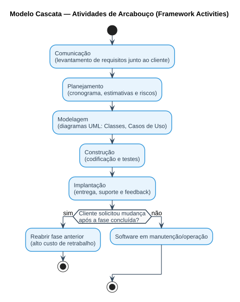
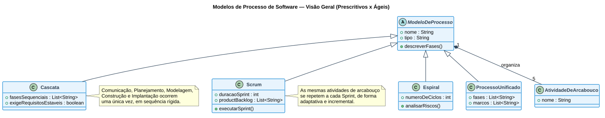

# Aula — Modelos de Processos de Desenvolvimento de Software

> **Professor:** Marcelo Tadeu Boer
> **Disciplina:** Engenharia de Software I (3º Semestre)
> **Tema:** Ciclo de vida de software (SDLC), Atividades de Arcabouço e Modelos de Processo (Cascata, Prototipação, Espiral, Processo Unificado, Ágil/Scrum)
> **Data de postagem:** 31/03/2026

## Objetivo da aula

Compreender o que é um **Processo de Software**, reconhecer as cinco atividades de arcabouço presentes em qualquer ciclo de desenvolvimento e comparar os principais **modelos de processo** estudados na disciplina, de modo a justificar tecnicamente qual modelo é mais adequado para um determinado cenário de projeto.

## O que é um Processo de Software

Um **Processo de Software** é um conjunto estruturado de atividades, ações, tarefas, marcos e produtos de trabalho necessários para construir um software de qualidade. Ele define *quem* está fazendo *o quê*, *quando* e *como*, para alcançar um objetivo de negócio.

### Atividades de Arcabouço (Framework Activities)

Independentemente do modelo escolhido, todo ciclo de vida de desenvolvimento de software se apoia em cinco atividades fundamentais:

1. **Comunicação** — entendimento dos requisitos e objetivos junto aos stakeholders.
2. **Planejamento** — estimativas de esforço, cronograma, riscos e recursos.
3. **Modelagem** — criação de modelos (arquitetura, diagramas UML, esquemas de dados) para entender o panorama geral.
4. **Construção** — geração de código (programação) e testes (unitários, integração).
5. **Implantação** — entrega do software ao cliente, suporte e feedback.

O que muda de um modelo de processo para outro não é a existência dessas atividades, mas **a ordem, a frequência e a formalidade** com que elas ocorrem.

## Modelo Cascata (Waterfall)

Proposto originalmente por **Winston Royce (1970)**, é um modelo sequencial e linear: uma fase só se inicia quando a fase anterior estiver completamente concluída e documentada (Requisitos → Projeto → Codificação → Testes → Manutenção).

- **Quando usar:** projetos com requisitos extremamente estáveis e conhecidos desde o início (ex.: sistemas embarcados simples, normas regulatórias rígidas).
- **Vantagem:** processo disciplinado, com marcos e documentação claros.
- **Desvantagem:** inflexibilidade a mudanças — voltar a uma fase anterior é custoso, especialmente perto do fim do ciclo.

## Modelo Espiral (Spiral — Boehm)

Organizado em ciclos (voltas da espiral), cada um contendo quatro setores: (1) definição de objetivos, alternativas e restrições; (2) avaliação e mitigação de riscos; (3) desenvolvimento e validação; (4) planejamento do próximo ciclo.

- **Elemento que o diferencia:** análise de riscos **iterativa**, feita a cada volta, antes de investir mais recursos.
- **Quando usar:** sistemas complexos ou de alto risco, em que é preciso mitigar riscos técnicos e de negócio antes de escalar o desenvolvimento.

## Processo Unificado (RUP)

Divide o projeto em quatro fases com marcos formais de governança: **Incepção, Elaboração, Construção e Transição**, cada uma composta por iterações.

- **Quando usar:** projetos corporativos de grande porte, com regras de negócio complexas e necessidade de mapear riscos arquiteturais logo no início (ex.: migração de sistemas legados).

## Modelos Ágeis (Scrum)

Abordagem iterativa e incremental, organizada em **Sprints** (ciclos curtos, tipicamente de 1 a 4 semanas), com entregas frequentes de incrementos de software potencialmente utilizáveis.

- **Manifesto Ágil:** valoriza indivíduos e interações mais que processos/ferramentas; software funcionando mais que documentação abrangente; colaboração com o cliente mais que negociação de contratos; resposta a mudanças mais que seguir um plano.
- **Quando usar:** produtos com requisitos dinâmicos, necessidade de validar hipóteses de negócio rapidamente (MVPs) e forte presença do cliente/Product Owner no dia a dia.

## Comparativo geral

| Critério | Cascata | Espiral | RUP | Scrum |
| :--- | :--- | :--- | :--- | :--- |
| Estabilidade dos requisitos | Exige requisitos 100% estáveis | Suporta mudanças, com reavaliação formal | Evoluem por fase (Incepção/Elaboração) | Dinâmicos, priorizados no Backlog |
| Gerenciamento de riscos | Baixo/tardio | Altíssimo, a cada ciclo | Alto, mitigado logo no início | Contínuo, a cada Sprint |
| Envolvimento do cliente | Baixo (início e fim) | Médio-alto | Médio, nos marcos de fase | Máximo (diário/semanal) |
| Frequência de entregas | Única, ao final | Incremental, por ciclo | Incremental, por iteração | Constante, por Sprint |
| Custo de mudança | Extremamente alto no fim | Controlado, avaliado antes de prosseguir | Moderado, via controle de mudança | Muito baixo |

O diagrama a seguir resume a relação de herança conceitual entre os modelos e as atividades de arcabouço que todos compartilham:

## Atividade proposta pelo professor

O post original da Classroom (31/03/2026) definiu o roteiro para a apresentação de um modelo de processo à escolha do grupo, contendo obrigatoriamente:

1. Página inicial com nome da faculdade, curso, semestre, nome do método e nome dos alunos.
2. Sumário ou agenda.
3. Conceito (definição) do modelo de processo.
4. Histórico (quando surgiu, por quê e quem o criou).
5. Fases (processos) que possui, por meio de uma imagem ilustrativa (com a fonte da imagem indicada).
6. Descrição das fases.
7. Exemplos de como é usado na prática.
8. Empresas que utilizam.
9. Se houver, custo de implantação.
10. Referências bibliográficas.

Esse roteiro foi entregue como o Trabalho [Apresentação — Métodos de Processos de Software](../../Trabalhos/APRESENTA%C3%87%C3%83O%20M%C3%89TODOS%20DE%20PROCESSOS%20DE%20SOFTWARES/detalhes.md), e resolvido também como o Trabalho [Atividade Avaliativa — Modelos de Processos de Software](../../Trabalhos/Atividade%20Avaliativa%20Modelos%20de%20Processos%20de%20Software/detalhes.md), que aplica os modelos acima a três estudos de caso reais (sistema médico crítico, MVP de startup e migração bancária).

## Exercícios de fixação

1. Diferencie modelo **prescritivo** de modelo **ágil** quanto à forma como tratam mudança de requisitos.
2. Para um sistema embarcado de controle de infusão hospitalar, qual modelo de processo você recomendaria? Justifique com base em gerenciamento de risco.
3. Para o MVP de uma startup com orçamento limitado, qual modelo é mais adequado? Por quê?
4. Explique como a atividade de **Modelagem** (uma das cinco atividades de arcabouço) se manifesta de forma diferente no Cascata e no Scrum.
5. O que diferencia estruturalmente o Modelo Espiral dos demais modelos prescritivos?

Gabarito (exercícios 2, 3 e 5)

**Exercício 2:** Modelo em V (ou Cascata com V&V rigorosa) integrado a análise de riscos da Espiral — sistemas *safety-critical* exigem rastreabilidade total entre especificação e teste, e a flexibilidade ágil representaria um risco de engenharia inaceitável nesse contexto.

**Exercício 3:** Scrum — o foco de uma startup é o *time-to-market* e o aprendizado validado; entregas em Sprints curtas permitem lançar um MVP, coletar feedback real e minimizar desperdício financeiro caso a hipótese de negócio falhe.

**Exercício 5:** O Modelo Espiral organiza o desenvolvimento em ciclos que sempre passam por um setor dedicado exclusivamente à **análise e mitigação de riscos** antes de avançar — nenhum outro modelo prescritivo formaliza essa etapa como um setor obrigatório e repetido a cada volta.

## Material relacionado

- [`2026-03-31 - APRESENTAO MTODOS DE ENGENHARIADE S.md`](./2026-03-31%20-%20APRESENTAO%20MTODOS%20DE%20ENGENHARIADE%20S.md) — post original da Classroom com o roteiro da atividade.
- [Trabalho: Apresentação — Métodos de Processos de Software](../../Trabalhos/APRESENTA%C3%87%C3%83O%20M%C3%89TODOS%20DE%20PROCESSOS%20DE%20SOFTWARES/detalhes.md)
- [Trabalho: Atividade Avaliativa — Modelos de Processos de Software](../../Trabalhos/Atividade%20Avaliativa%20Modelos%20de%20Processos%20de%20Software/detalhes.md)
- [Resumo executivo, exercícios, simulado e cheatsheet da disciplina](../../README.md#resumo-executivo)
