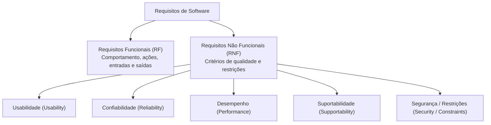
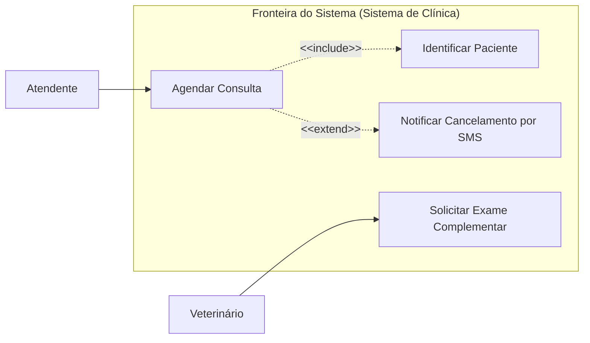
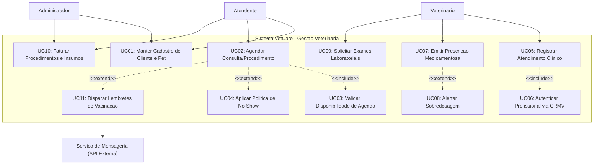
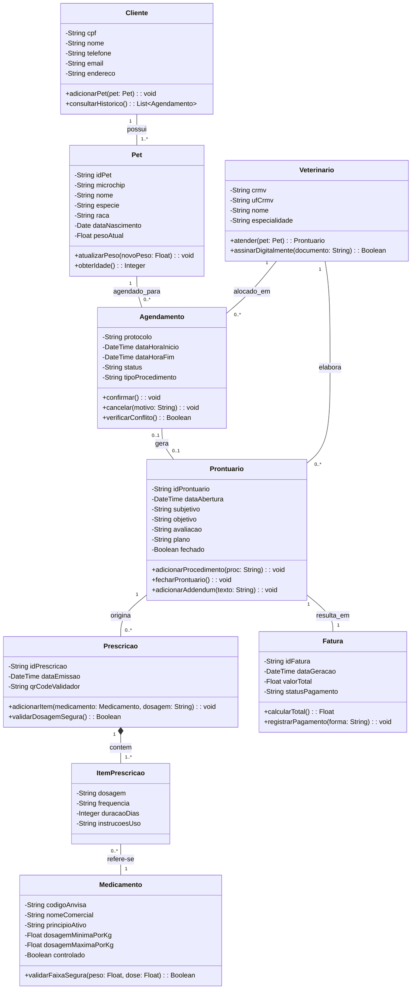
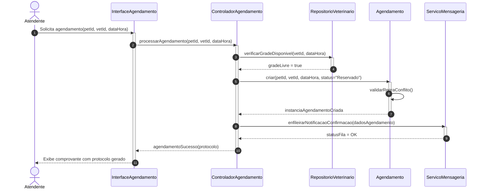
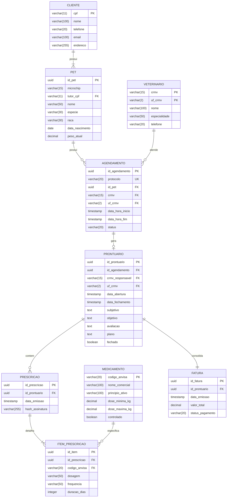
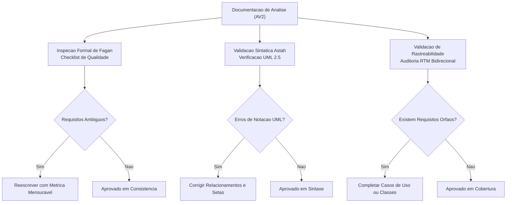
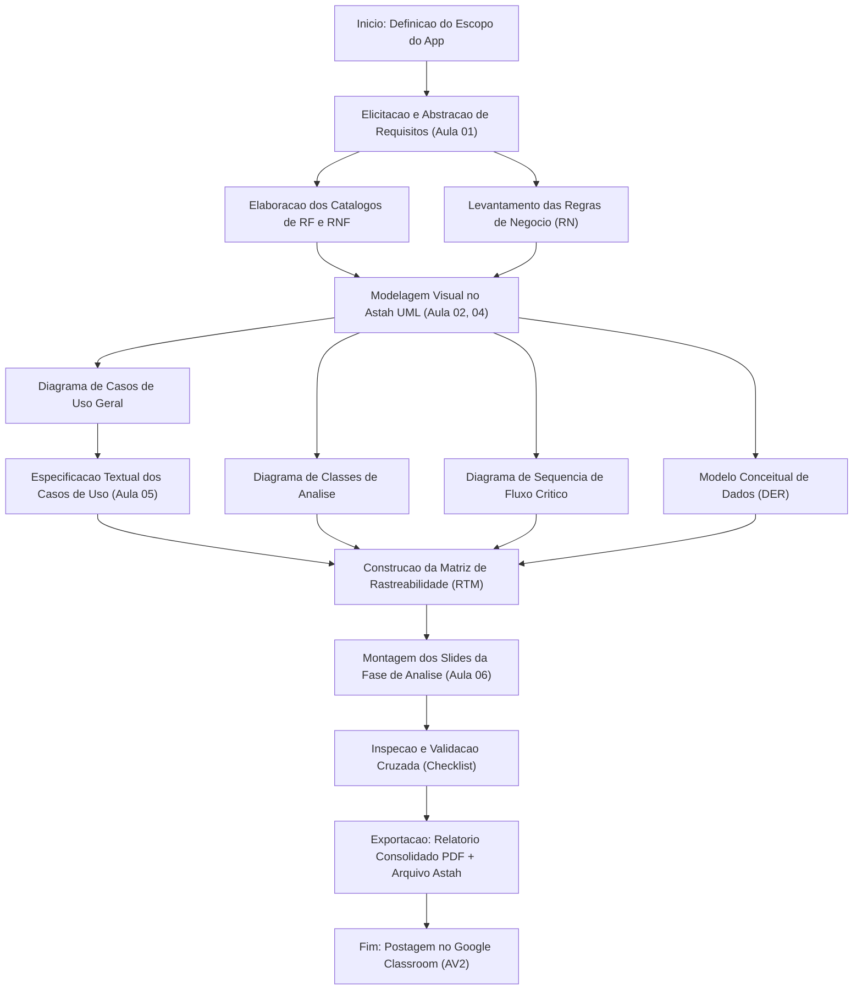

# Trabalho — ATIVIDADE AV2

> **Professor:** Marcelo Boer
> **Disciplina:** Engenharia de Software I (3º Semestre)
> **Prazo de Entrega:** 15/06/2026 às 22:30
> **Pontuação Máxima:** 4 pontos
> **Conteúdo cobrado:** [Aula 01 - Processo de Abstração e Levantamento de Requisitos](../../Aulas/Aula%2001%20-%20Processo%20de%20Abstra%C3%A7%C3%A3o%20e%20Levantamento%20de%20Requisitos/detalhes.md), [Aula 02 - Configuração e Licenciamento do Astah UML](../../Aulas/Aula%2002%20-%20Configura%C3%A7%C3%A3o%20e%20Licenciamento%20do%20Astah%20UML/detalhes.md), [Aula 03 - Revisão de Requisitos de Software para AV1](../../Aulas/Aula%2003%20-%20Revis%C3%A3o%20de%20Requisitos%20de%20Software%20para%20AV1/detalhes.md), [Aula 04 - Abstração e Modelagem de Requisitos](../../Aulas/Aula%2004%20-%20Abstra%C3%A7%C3%A3o%20e%20Modelagem%20de%20Requisitos/detalhes.md), [Aula 05 - Descrição Textual de Casos de Uso](../../Aulas/Aula%2005%20-%20Descri%C3%A7%C3%A3o%20Textual%20de%20Casos%20de%20Uso/detalhes.md), [Aula 06 - Modelo de Apresentação da Fase Análise](../../Aulas/Aula%2006%20-%20Modelo%20de%20Apresenta%C3%A7%C3%A3o%20da%20Fase%20An%C3%A1lise/detalhes.md)

## Sumário

- [Enunciado original (Google Classroom)](#enunciado-original-google-classroom)
- [Análise do que é pedido](#análise-do-que-é-pedido)
- [Fundamentação teórica](#fundamentação-teórica)
  - [Engenharia de Requisitos e Processo de Abstração](#engenharia-de-requisitos-e-processo-de-abstração)
  - [Classificação de Requisitos: Funcionais vs. Não Funcionais](#classificação-de-requisitos-funcionais-vs-não-funcionais)
  - [Regras de Negócio e Restrições de Domínio](#regras-de-negócio-e-restrições-de-domínio)
  - [Modelagem de Casos de Uso (UML)](#modelagem-de-casos-de-uso-uml)
  - [Especificação Textual Estruturada de Casos de Uso](#especificação-textual-estruturada-de-casos-de-uso)
  - [Modelagem Estrutural e de Dados de Análise](#modelagem-estrutural-e-de-dados-de-análise)
  - [Rastreabilidade Bidirecional de Artefatos](#rastreabilidade-bidirecional-de-artefatos)
- [Resolução proposta](#resolução-proposta)
  - [Definição do Sistema de Referência: VetCare](#definição-do-sistema-de-referência-vetcare)
  - [Documento de Visão e Escopo](#documento-de-visão-e-escopo)
  - [Catálogo de Requisitos Funcionais (RF)](#catálogo-de-requisitos-funcionais-rf)
  - [Catálogo de Requisitos Não Funcionais (RNF)](#catálogo-de-requisitos-não-funcionais-rnf)
  - [Catálogo de Regras de Negócio (RN)](#catálogo-de-regras-de-negócio-rn)
  - [Diagrama de Casos de Uso (UML)](#diagrama-de-casos-de-uso-uml)
  - [Especificação Textual dos Casos de Uso Principais](#especificação-textual-dos-casos-de-uso-principais)
  - [Diagrama de Classes de Análise](#diagrama-de-classes-de-análise)
  - [Diagrama de Sequência de Análise](#diagrama-de-sequência-de-análise)
  - [Modelo Entidade-Relacionamento de Análise](#modelo-entidade-relacionamento-de-análise)
  - [Matriz de Rastreabilidade de Requisitos (RTM)](#matriz-de-rastreabilidade-de-requisitos-rtm)
  - [Estrutura dos Slides da Fase de Análise](#estrutura-dos-slides-da-fase-de-análise)
- [Como testar e validar](#como-testar-e-validar)
- [Critérios de qualidade](#critérios-de-qualidade)
- [Arquivos de apoio](#arquivos-de-apoio)
- [Mapa da atividade](#mapa-da-atividade)
- [Glossário](#glossário)
- [Pontos-chave para a prova](#pontos-chave-para-a-prova)
- [Perguntas e respostas (JSONL)](#perguntas-e-respostas-jsonl)
- [Checklist de revisão](#checklist-de-revisão)

## Enunciado original (Google Classroom)

```text
POSTAR O DOCUMENTAÇÃO DOPROJETO DO APLICATIVO CRIADO
```

## Análise do que é pedido

A atividade avaliativa AV2 encerra o ciclo de modelagem conceitual e análise de sistemas da disciplina de Engenharia de Software I, consolidando o projeto prático desenvolvido pelos grupos ao longo do semestre. Embora o enunciado no Google Classroom seja sucinto, a entrega exige a compilação rigorosa de todos os artefatos trabalhados desde a Aula 01 até a Aula 06.

### Requisitos explícitos e implícitos

1. **Documento Integrado de Especificação de Software**:
   - Definição do escopo do aplicativo, justificativa, atores envolvidos e objetivos de negócio.
   - Lista exaustiva de Requisitos Funcionais (RF) com identificadores únicos, descrições inequívocas e prioridades (ex.: técnica MoSCoW).
   - Lista de Requisitos Não Funcionais (RNF) mensuráveis, categorizados segundo normas consolidadas (FURPS+ ou ISO/IEC 25010).
   - Catálogo de Regras de Negócio (RN) que balizam as validações do sistema.

2. **Modelagem Visual (UML e Dados)**:
   - Diagrama de Casos de Uso formal, evidenciando atores (primários e secundários), fronteira do sistema e relacionamentos (`<<include>>`, `<<extend>>` e generalizações).
   - Descrições textuais completas de casos de uso (pelo menos os essenciais/críticos), contemplando fluxo principal, fluxos alternativos, fluxos de exceção, pré-condições e pós-condições.
   - Diagrama de Classes de Análise (classes de domínio, atributos com tipos conceituais, operações e multiplicidades).
   - Diagrama de Sequência de Análise demonstrando a dinâmica temporal das mensagens para um fluxo crítico.
   - Modelo Conceitual de Dados (Diagrama de Entidade-Relacionamento / DER lógico).

3. **Consolidação e Rastreabilidade**:
   - Matriz de Rastreabilidade de Requisitos (RTM), assegurando que cada RF esteja amarrado a uma RN, a um Caso de Uso e a uma classe de domínio.
   - Apresentação executiva da fase de análise estruturada conforme o template trabalhado na Aula 06.

4. **Formato de entrega**:
   - Envio do arquivo consolidado em PDF via Google Classroom e arquivo de modelagem Astah (`.asta`) ou exportação estruturada equivalente.

## Fundamentação teórica

A Engenharia de Software fornece arcabouço metodológico para transformar necessidades difusas de usuários em especificações determinísticas, verificáveis e implementáveis. Abaixo detalham-se os pilares teóricos exigidos na AV2.

### Engenharia de Requisitos e Processo de Abstração

#### Definição
O processo de abstração consiste em isolar aspectos fundamentais de um domínio do mundo real, ignorando detalhes transitórios de implementação e concentrando-se no "o que" o sistema deve realizar, e não no "como" tecnológico. A Engenharia de Requisitos é a disciplina composta por elicitação, análise, especificação, validação e gerenciamento de requisitos (conforme normas IEEE 830 / ISO/IEC/IEEE 29148).

#### Motivação
Erros introduzidos na fase de requisitos custam de 50 a 200 vezes mais para serem corrigidos nas fases de teste ou produção do que durante a concepção conceitual (Curva de Boehm). Documentar com precisão impede a construção do software incorreto.

#### Exemplo
Ao modelar um sistema hospitalar, abstrai-se o conceito de `Paciente` com atributos relevantes à clínica (nome, prontuário, tipo sanguíneo, histórico alérgico), descartando detalhes irrelevantes para o domínio de software (cor do calçado, marca do veículo com o qual chegou).

#### Contraexemplo
Registrar no documento de requisitos que "o sistema deve salvar o cliente disparando um `INSERT INTO tb_cliente` via JDBC na porta 3306 usando driver MySQL". Isso viola a abstração de requisitos, acoplando a necessidade do negócio a detalhes prematuros de infraestrutura.

#### Armadilhas
- **Ambiguidade lexical**: Usar termos como "o sistema deve ser rápido", "a tela deve ser amigável" ou "processamento adequado". Requisitos devem ser empiricamente mensuráveis.
- **Salto para o design**: Decidir frameworks e bibliotecas antes de entender a totalidade dos fluxos operacionais.

### Classificação de Requisitos: Funcionais vs. Não Funcionais



#### Definição
- **Requisito Funcional (RF)**: Declaração de um serviço, função, cálculo ou transformação de dados que o software deve executar em resposta a estímulos externos.
- **Requisito Não Funcional (RNF)**: Propriedade emergente, restrição técnica ou padrão de qualidade que condiciona como as funcionalidades devem operar (modelo FURPS+: Funcionalidade, Usabilidade, Confiabilidade, Desempenho, Suportabilidade).

#### Motivação
Um software pode executar todas as funções prescritas, mas falhar no mercado se a latência for insuportável, se for vulnerável a vazamentos de dados ou se a curva de aprendizado inviabilizar o trabalho do usuário.

#### Exemplo
- *RF*: "O sistema deve calcular o valor total da fatura aplicando o desconto proporcional ao cupom inserido."
- *RNF*: "O cálculo e atualização do valor da fatura devem ocorrer em tempo de resposta inferior a 500 milissegundos para 99% das requisições sob carga de 200 usuários concorrentes."

#### Contraexemplo
Rotular "O usuário deve conseguir autenticar com biometria facial" como RNF. A biometria facial é uma funcionalidade (RF), enquanto o RNF associado seria a taxa máxima de falsa rejeição (FRR < 0.1%) ou o tempo de validação do hash biométrico (< 1s).

#### Armadilhas
- Redigir RNF sem métrica objetiva de teste (critério de aceitação não falseável).
- Ignorar requisitos de conformidade legal (ex.: LGPD no Brasil, exigindo anonimização ou exclusão de dados sob demanda).

### Regras de Negócio e Restrições de Domínio

#### Definição
Regras de Negócio (RN) são diretrizes, políticas corporativas, fórmulas matemáticas ou restrições legais preexistentes à existência do software. O software não cria a regra; ele apenas a implementa e a faz cumprir.

#### Motivação
Manter regras de negócio desacopladas da especificação funcional garante que, caso uma lei tributária ou política de desconto mude, os analistas identifiquem com precisão cirúrgica quais requisitos e módulos de código são impactados.

#### Exemplo
*RN-04*: "Consultas veterinárias canceladas com menos de 24 horas de antecedência incorrem em taxa de retenção equivalente a 30% do valor base." (Regra corporativa da clínica).

#### Contraexemplo
*RN Inválida*: "O sistema deve exibir um botão vermelho para cancelar consulta." (Isso é elemento de interface de usuário, não regra de domínio do negócio).

#### Armadilhas
- Tratar regra de negócio como validação simples de campo de tela (ex.: "campo nome é obrigatório"). Validação de formulário é restrição de integridade sintática, não política de negócio.

### Modelagem de Casos de Uso (UML)



#### Definição
O Diagrama de Casos de Uso da UML (Unified Modeling Language) mapeia visualmente as interações entre atores (entidades externas que desempenham papéis) e os casos de uso (unidades completas de valor entregues pelo sistema).
- **`<<include>>`**: Relação de dependência obrigatória. O caso de uso base não pode ser completado sem a execução estrita do caso de uso incluído.
- **`<<extend>>`**: Relação condicional. O caso de uso extensor apenas é disparado caso uma condição específica (ponto de extensão) seja satisfeita durante o fluxo do caso base.
- **Generalização de Atores**: Herança comportamental onde um ator especializado herda todas as associações de casos de uso do ator genérico.

#### Motivação
Prover uma visão de "caixa preta" do sistema que estabeleça a fronteira de escopo clara entre o que é de responsabilidade do software e o que pertence ao ambiente externo.

#### Exemplo
No agendamento de uma consulta, a verificação da existência de cadastro do cliente é mandatória (`<<include>>`), enquanto a aplicação de desconto especial por cupom de campanha ocorre somente se o cliente fornecer o código promocional (`<<extend>>`).

#### Contraexemplo
Utilizar setas de fluxo de dados ou tentar representar sequência temporal (`UC1 -> UC2 -> UC3`) no diagrama de casos de uso. Casos de uso não representam fluxogramas algorítmicos.

#### Armadilhas
- Criar casos de uso granulares demais (ex.: "Digitar CPF", "Clicar no botão Salvar"). Casos de uso devem produzir um resultado observável de valor para o ator.
- Inverter o sentido da seta no `<<extend>>`. A seta do `<<extend>>` aponta do caso de uso extensor para o caso de uso base.

### Especificação Textual Estruturada de Casos de Uso

A especificação textual é o detalhamento minucioso de cada elipse do diagrama visual. Segue uma estrutura rigorosa composta por:
1. **Identificador e Nome**: Verbo no infinitivo seguido de objeto direto.
2. **Ator Principal e Secundários**: Quem inicia e quem participa.
3. **Pré-condições**: Estados do sistema que devem ser verdadeiros antes do início do caso de uso.
4. **Pós-condições (Garantias de Sucesso)**: Estado do sistema após a conclusão bem-sucedida.
5. **Fluxo Principal (Caminho Feliz)**: Sequência numerada passo a passo da interação ator-sistema sem falhas.
6. **Fluxos Alternativos**: Ramificações normais de negócio que atingem o objetivo por outro caminho.
7. **Fluxos de Exceção**: Condições de erro técnico ou de domínio que impedem o alcance do objetivo principal.

### Modelagem Estrutural e de Dados de Análise

Na fase de análise, a modelagem de classes (Diagrama de Classes de Análise) não visa representar padrões arquiteturais de código final (como DAOs, DTOs ou Controllers), mas sim as classes conceituais do domínio, seus atributos semânticos, seus métodos de negócio e os relacionamentos estruturais (associação, agregação, composição e herança). Em paralelo, o modelo lógico de banco de dados (DER) define as entidades, chaves primárias (PK), chaves estrangeiras (FK) e regras de integridade referencial.

### Rastreabilidade Bidirecional de Artefatos

A rastreabilidade (Requirements Traceability Matrix - RTM) garante que:
- **Forward Traceability**: Cada requisito especificado possui representação em casos de uso, classes de análise e cenários de teste. Evita código órfão ou funcionalidades implementadas sem justificativa de negócio (escopo fantasma).
- **Backward Traceability**: Cada módulo de código ou caso de uso pode ter sua origem rastreada até a necessidade expressa do cliente. Protege contra "gold plating" (adição de recursos desnecessários).

---

## Resolução proposta

Como base para a entrega formal da AV2, apresenta-se a documentação completa de engenharia de software para o sistema **VetCare** (Aplicativo de Gestão de Clínicas Veterinárias e Atendimento Pet), desenvolvido como projeto prático do semestre no Astah UML e ferramentas correlatas.

### Definição do Sistema de Referência: VetCare

O **VetCare** é uma solução para clínicas veterinárias de médio porte que operam com atendimento ambulatorial, internação, vacinação e comercialização de medicamentos. O sistema automatiza a triagem, agenda consultas, gerencia prontuários eletrônicos veterinários (SOAP: Subjetivo, Objetivo, Avaliação, Plano) e controla a emissão de ordens de serviço financeiras.

### Documento de Visão e Escopo

- **Declaração do Problema**: A gestão fragmentada em planilhas físicas e fichas de papel ocasiona erros na administração de dosagens medicamentosas, perda de faturamento por consultas não faturadas e ausência de histórico clínico unificado dos animais.
- **Objetivo do Sistema**: Centralizar o fluxo de atendimento desde a recepção até a prescrição veterinária, garantindo rastreabilidade legal dos prontuários e integridade do agendamento cirúrgico e clínico.
- **Atores do Sistema**:
  - `Atendente`: Responsável por cadastrar clientes, pets e gerenciar a agenda de consultas.
  - `Veterinário`: Responsável pela anamnese, atendimento clínico, emissão de prescrições e solicitação de exames.
  - `Administrador`: Responsável pela parametrização do sistema, gestão de acessos e relatórios gerenciais de faturamento.
  - `Serviço de Mensageria`: Ator secundário externo (API) que dispara lembretes via WhatsApp/SMS.

### Catálogo de Requisitos Funcionais (RF)

| ID | Nome do Requisito | Descrição Detalhada | Prioridade (MoSCoW) | Regra de Negócio |
| :--- | :--- | :--- | :--- | :--- |
| **RF01** | Cadastrar Cliente e Pet | O sistema deve permitir registrar os dados do tutor (nome, CPF, endereço, contato) vinculando um ou mais animais de estimação (nome, espécie, raça, sexo, data de nascimento aproximada, peso e microchip). | Must Have | RN01, RN02 |
| **RF02** | Agendar Atendimento | O sistema deve permitir agendar consultas e procedimentos cirúrgicos, selecionando o pet, o médico veterinário especialista, a sala de atendimento e o horário disponível. | Must Have | RN03 |
| **RF03** | Confirmar e Cancelar Agendamento | O sistema deve permitir registrar a confirmação prévia ou o cancelamento do agendamento, liberando o slot na grade de horários da clínica. | Should Have | RN04 |
| **RF04** | Registrar Prontuário Clínico (SOAP) | O sistema deve permitir ao veterinário registrar a evolução clínica estruturada: anamnese (Subjetivo), sinais vitais e exame físico (Objetivo), hipóteses diagnósticas (Avaliação) e conduta terapêutica (Plano). | Must Have | RN05, RN06 |
| **RF05** | Prescrever Medicamentos | O sistema deve permitir a emissão de receitas médicas digitais com cálculo assistido de dosagem com base no peso atual do animal, gerando documento assinado com validação por QR Code. | Must Have | RN07 |
| **RF06** | Solicitar e Anexar Exames | O sistema deve viabilizar a requisição de exames laboratoriais/imagem e o posterior upload dos laudos e imagens em formato PDF/DICOM. | Should Have | RN08 |
| **RF07** | Faturar Atendimento | O sistema deve consolidar o valor da consulta, dos procedimentos executados e dos insumos utilizados, emitindo o extrato financeiro para pagamento junto à recepção. | Must Have | RN09 |
| **RF08** | Emitir Alerta de Vacinação | O sistema deve identificar automaticamente pets com protocolos vacinais próximos ao vencimento (15 dias de antecedência) e enfileirar disparos de notificação. | Could Have | RN10 |
| **RF09** | Gerar Relatório de Produtividade | O sistema deve permitir ao Administrador gerar relatórios analíticos de atendimentos por profissional, tempo médio de consulta e faturamento consolidado por período. | Won't Have (v1) | RN11 |

### Catálogo de Requisitos Não Funcionais (RNF)

| ID | Categoria (FURPS+) | Descrição e Métrica de Verificação |
| :--- | :--- | :--- |
| **RNF01** | Desempenho (Performance) | A busca por prontuário ou histórico do paciente deve retornar os dados em tempo inferior a 800 ms para bases com até 500.000 registros, operando sob conexão de rede local padrão (100 Mbps). |
| **RNF02** | Segurança (Security) | O sistema deve armazenar as senhas dos colaboradores utilizando hash criptográfico forte (Argon2id ou BCrypt com fator de custo >= 12). A comunicação entre clientes web/mobile e a API deve utilizar TLS 1.3 obrigatório. |
| **RNF03** | Confiabilidade (Reliability) | O sistema deve garantir integridade transacional ACID em operações de faturamento e prescrição. O índice de disponibilidade (uptime) deve ser de no mínimo 99,5% em horário comercial (07:00 às 22:00). |
| **RNF04** | Usabilidade (Usability) | O fluxo de triagem e abertura de prontuário deve ser concluído em no máximo 4 telas consecutivas, permitindo que novos atendentes alcancem produtividade padrão com treinamento formal de até 2 horas. |
| **RNF05** | Suportabilidade (Supportability) | O aplicativo cliente deve ser multiplataforma (Web responsivo com suporte a navegadores baseados em Chromium/WebKit e aplicativo móvel Android 10+ e iOS 15+). |
| **RNF06** | Conformidade Legal | O sistema deve implementar anonimização e mascaramento de dados sensíveis de tutores em conformidade com a Lei Geral de Proteção de Dados (LGPD - Lei nº 13.709/2018). |

### Catálogo de Regras de Negócio (RN)

- **RN01 - Validação Cadastral de CPF**: É obrigatória a validação algorítmica do CPF do tutor através do cálculo dos dois dígitos verificadores no padrão da Receita Federal. CPFs duplicados são expressamente bloqueados.
- **RN02 - Identificação Unívoca do Paciente**: Cada animal é identificado unicamente pelo identificador interno do sistema ou pelo número do microchip (padrão ISO 11784/11785 de 15 dígitos numéricos). Um mesmo tutor pode ter múltiplos animais.
- **RN03 - Conflito de Grade de Atendimento**: Um médico veterinário não pode possuir mais de um agendamento no mesmo intervalo de tempo. O sistema deve barrar sobreposição de horários com tolerância mínima de 5 minutos entre consultas consecutivas.
- **RN04 - Política de Cancelamento Tardio**: Agendamentos cancelados com menos de 2 horas de antecedência pelo cliente geram uma marcação de "no-show" no histórico. Após 3 no-shows consecutivos, novos agendamentos só são aceitos mediante pagamento antecipado do valor de consulta.
- **RN05 - Inalterabilidade Legal do Prontuário**: Após 24 horas do encerramento do atendimento veterinário, o prontuário clínico é bloqueado para edição direta. Quaisquer modificações subsequentes só podem ser feitas por adendos temporizados (*addendums*) assinados digitalmente pelo profissional.
- **RN06 - Exigência de CRMV Válido**: Todo atendimento clínico só pode ser homologado e assinado por profissional cujo registro no Conselho Regional de Medicina Veterinária (CRMV) esteja cadastrado e com situação regular no sistema.
- **RN07 - Cálculo de Dosagem Segura**: Medicamentos controlados de tarja preta ou vermelha exigem obrigatoriamente a conferência da faixa de dosagem terapeuticamente segura em relação ao peso (mg/kg). Se a dosagem prescrita divergir em mais de 20% da faixa recomendada pela bula técnica, o sistema exige justificativa formal gravada em log de auditoria.
- **RN08 - Retenção de Documentos de Exame**: Laudos de exames laboratoriais e exames de imagem devem ser mantidos em armazenamento protegido e imutável pelo período mínimo legal de 5 anos.
- **RN09 - Fechamento de Fatura em Cascata**: Um pet internado ou em atendimento ambulatorial só pode receber alta médica e liberação de saída após o fechamento e liquidação ou parcelamento da respectiva fatura na recepção.
- **RN10 - Ciclo de Revacinação**: A rotina de vacinas polivalentes (V8/V10 para cães, V3/V4/V5 para gatos) e antirrábica deve respeitar a periodicidade anual (365 dias), com disparo de alertas aos tutores iniciado 15 dias antes da data prevista de vencimento.

### Diagrama de Casos de Uso (UML)

O diagrama abaixo consolida os casos de uso do sistema VetCare, demonstrando a interação dos atores humanos e dos sistemas externos com as fronteiras do software.



### Especificação Textual dos Casos de Uso Principais

#### Caso de Uso UC02: Agendar Consulta / Procedimento

- **Identificador**: UC02
- **Nome**: Agendar Consulta / Procedimento
- **Ator Principal**: Atendente
- **Atores Secundários**: Serviço de Mensageria (disparo de confirmação)
- **Sumário**: Permite ao atendente agendar uma consulta ou procedimento cirúrgico para um animal já cadastrado, selecionando a especialidade, o médico veterinário, a data e a sala de atendimento.
- **Pré-condições**:
  1. O atendente deve estar autenticado com credenciais válidas.
  2. O cliente (tutor) e o pet devem estar previamente cadastrados no sistema (UC01).
- **Pós-condições**:
  1. O horário na agenda do veterinário selecionado passa para o estado "Reservado".
  2. Um registro de agendamento é persistido no banco de dados com número de protocolo gerado.
  3. Mensagem de confirmação é enfileirada no Serviço de Mensageria.

##### Fluxo Principal (Caminho Feliz)
1. O atendente acessa o módulo de agendamento e pesquisa pelo cliente através do CPF ou pelo animal através do número de microchip.
2. O sistema exibe os dados do cliente e a lista de animais vinculados.
3. O atendente seleciona o animal que receberá o atendimento.
4. O atendente seleciona a especialidade clínica desejada (ex.: Clínica Geral, Oftalmologia, Ortopedia).
5. O sistema exibe a lista de veterinários habilitados para a especialidade e a grade visual de datas e horários disponíveis.
6. O atendente seleciona o veterinário, a data e o bloco de horário pretendido.
7. O sistema executa o caso de uso `<<include>>` **UC03: Validar Disponibilidade de Agenda** para garantir ausência de concorrência.
8. O sistema confirma a disponibilidade e apresenta o resumo do agendamento (nome do tutor, nome do pet, profissional, data/hora e valor estimado).
9. O atendente confirma a operação.
10. O sistema persiste o agendamento, gera o número de protocolo, emite o comprovante na tela e dispara notificação assíncrona ao tutor.

##### Fluxos Alternativos
- **FA01 - Cliente com Histórico de No-Show (ponto de extensão `<<extend>>` UC04)**:
  - No passo 2, o sistema detecta que o cliente possui 3 ou mais faltas não justificadas nos últimos 6 meses.
  - O sistema bloqueia a reserva provisória e exige a confirmação do pagamento de sinal da consulta (RN04).
  - O atendente registra o pagamento prévio ou obtém autorização de exceção da gerência.
  - O fluxo retorna ao passo 4.

##### Fluxos de Exceção
- **FE01 - Conflito Concorrente de Horário**:
  - No passo 7, a validação de disponibilidade constata que o horário escolhido acabou de ser ocupado por outro terminal.
  - O sistema exibe mensagem de alerta: "Horário indisponível devido a reserva concorrente. Por favor, selecione outro intervalo."
  - O sistema recarrega a grade de horários disponíveis.
  - O fluxo retorna ao passo 6.
- **FE02 - Paciente com Bloqueio Clínico (Quarentena/Óbito)**:
  - No passo 3, o sistema constata que o prontuário do animal está com status "Óbito" ou "Em Quarentena Infecciosa Externa".
  - O sistema aborta o agendamento e exibe o motivo impeditivo ao operador.
  - O caso de uso é encerrado sem gravação de agendamento.

---

#### Caso de Uso UC05: Registrar Atendimento Clínico (SOAP)

- **Identificador**: UC05
- **Nome**: Registrar Atendimento Clínico (SOAP)
- **Ator Principal**: Veterinário
- **Atores Secundários**: Nenhum
- **Sumário**: O profissional veterinário documenta detalhadamente a evolução clínica do animal durante o atendimento, consolidando anamnese, medições físicas, diagnósticos e planos terapêuticos.
- **Pré-condições**:
  1. O veterinário deve estar devidamente autenticado e possuir CRMV ativo validado no sistema (UC06).
  2. O animal deve ter sido admitido pela recepção e estar com status "Aguardando Atendimento".
- **Pós-condições**:
  1. Prontuário clínico atualizado com registro temporal auditável e imutável.
  2. Status do agendamento atualizado para "Atendimento Concluído".
  3. Procedimentos realizados enviados automaticamente para a comanda financeira de faturamento (UC10).

##### Fluxo Principal (Caminho Feliz)
1. O veterinário seleciona o animal na fila de espera da clínica.
2. O sistema exibe o histórico médico consolidado do animal (consultas passadas, vacinas, exames e alergias conhecidas).
3. O veterinário inicia o preenchimento do formulário SOAP:
   - **Subjetivo**: Queixa principal relatada pelo tutor e histórico de evolução dos sintomas.
   - **Objetivo**: Peso aferido, temperatura retal, frequência cardíaca, frequência respiratória, tempo de preenchimento capilar (TPC) e achados da palpação.
   - **Avaliação**: Hipóteses diagnósticas e classificação do estado geral (estável, alerta, crítico).
   - **Plano**: Conduta médica adotada, procedimentos ambulatoriais executados em consultório e orientações.
4. O veterinário associa os códigos de procedimentos executados (ex.: Curativo Simples, Limpeza de Ouvido, Fluidoterapia).
5. O sistema valida que todos os campos mandatórios da estrutura SOAP foram preenchidos.
6. O veterinário clica em "Finalizar e Assinar Atendimento".
7. O sistema aciona o `<<include>>` **UC06: Autenticar Profissional via CRMV**, coletando a assinatura eletrônica do médico.
8. O sistema registra o timestamp de fechamento, trava o registro contra modificações diretas (RN05) e envia a comanda para faturamento (UC10).

##### Fluxos Alternativos
- **FA01 - Necessidade de Prescrição Farmacológica**:
  - No passo 3 (Plano), o veterinário decide receitar medicamentos para tratamento domiciliar.
  - O veterinário aciona a emissão de receita médica, desviando para o caso de uso **UC07: Emitir Prescrição Medicamentosa**.
  - Após a finalização da prescrição, o sistema retorna ao passo 4 de UC05.

##### Fluxos de Exceção
- **FE01 - Falha de Validação do CRMV do Profissional**:
  - No passo 7, a assinatura eletrônica falha por expiração da licença profissional ou inconsistência de credencial.
  - O sistema mantém o prontuário em estado "Rascunho Pendente de Assinatura" e impede o fechamento oficial do prontuário.
  - O sistema alerta: "Não foi possível validar seu registro CRMV. O prontuário permanecerá em rascunho até regularização."

### Diagrama de Classes de Análise

O diagrama a seguir modela o domínio conceitual do sistema, evidenciando entidades de negócio, multiplicidades estruturais e métodos fundamentais.



### Diagrama de Sequência de Análise

Representação temporal da interação entre os objetos para a execução do caso de uso **UC02: Agendar Consulta/Procedimento**.



### Modelo Entidade-Relacionamento de Análise

O diagrama conceitual de dados abaixo detalha a persistência relacional do domínio, com tipagens conceituais e restrições de integridade referencial.



### Matriz de Rastreabilidade de Requisitos (RTM)

A matriz a seguir garante o alinhamento ponta a ponta entre necessidades de negócio, regras do domínio, modelagem de casos de uso e classes de análise.

| Requisito Funcional (RF) | Regra de Negócio (RN) | Caso de Uso Associado | Classes de Domínio Relacionadas | Teste de Aceitação / Critério de Sucesso |
| :--- | :--- | :--- | :--- | :--- |
| **RF01** (Cadastrar Tutor e Pet) | RN01, RN02 | UC01 | `Cliente`, `Pet` | Validar cálculo de dígitos de CPF; bloquear CPFs idênticos; aceitar múltiplos pets por tutor. |
| **RF02** (Agendar Atendimento) | RN03 | UC02, UC03 | `Agendamento`, `Pet`, `Veterinario` | Tentar reservar o mesmo veterinário em horários sobrepostos; o sistema deve barrar a segunda reserva. |
| **RF03** (Confirmar / Cancelar) | RN04 | UC02, UC04 | `Agendamento`, `Cliente` | Simular 3 cancelamentos sem aviso; verificar se o quarto agendamento exige sinal antecipado. |
| **RF04** (Registrar Prontuário) | RN05, RN06 | UC05, UC06 | `Prontuario`, `Veterinario`, `Pet` | Bloquear edição direta do prontuário após 24h de fechamento; permitir apenas anexação de addendum. |
| **RF05** (Prescrever Medicamentos) | RN07 | UC07, UC08 | `Prescricao`, `ItemPrescricao`, `Medicamento` | Informar dose 30% acima da tabela do medicamento; exigir justificativa formal gravada em auditoria. |
| **RF07** (Faturar Atendimento) | RN09 | UC10 | `Fatura`, `Prontuario` | Impedir alteração de status de atendimento para "Alta Concluída" com fatura pendente de quitação. |
| **RF08** (Alertar Vacinação) | RN10 | UC11 | `Pet`, `Cliente` | Identificar animais com vacina vencendo em 15 dias; confirmar envio de payload para mensageria. |

### Estrutura dos Slides da Fase de Análise

Conforme o modelo de apresentação estabelecido pelo Prof. Marcelo Boer na Aula 06, a equipe deve compor a apresentação de slides da fase de análise estruturada estritamente nos seguintes blocos:

```text
ESTRUTURA DE APRESENTAÇÃO - FASE DE ANÁLISE (AULA 06)

Slide 01: Capa
- Nome do Aplicativo (VetCare)
- Identificação da Disciplina (Engenharia de Software I) e Professor (Prof. Marcelo Boer)
- Integrantes da Equipe (Nomes completos e RAs)

Slide 02: Problema e Oportunidade
- Contexto operacional das clínicas veterinárias
- Gargalos identificados (erros de prescrição, perdas financeiras, desorganização de prontuários)
- Proposta de valor do software

Slide 03: Escopo e Limites do Sistema
- O que o sistema FAZ (funcionalidades contempladas na versão 1.0)
- O que o sistema NÃO FAZ (fora de escopo: contabilidade interna, compras automatizadas com fornecedor)

Slide 04: Catálogo de Requisitos (RF e RNF)
- Destaque dos principais Requisitos Funcionais categorizados por MoSCoW
- RNF fundamentais: Performance, Segurança e Conformidade LGPD

Slide 05: Diagrama de Casos de Uso Geral
- Apresentação visual da fronteira do sistema, atores e casos de uso no Astah UML
- Destaque das relações <<include>> e <<extend>>

Slide 06: Detalhamento Textual de Caso de Uso Crítico
- Apresentação do Caso de Uso essencial (ex.: UC05 - Registrar Atendimento Clínico)
- Demonstração do Fluxo Principal e de pelo menos dois fluxos alternativos/exceção

Slide 07: Diagrama de Classes de Análise
- Visão conceitual das entidades de domínio, associações, atributos e operações sem dependência de código

Slide 08: Diagrama de Sequência
- Interação dinâmica temporal entre os objetos para um fluxo de valor do negócio

Slide 09: Modelo de Dados (DER) e Rastreabilidade
- Esquema relacional das tabelas de dados
- Matriz demonstrativa de rastreabilidade (RF -> Caso de Uso -> Classe)

Slide 10: Próximos Passos e Conclusão
- Transição da Fase de Análise para a Fase de Projeto / Arquitetura e Implementação
- Considerações finais da equipe
```

---

## Como testar e validar

A verificação e validação (V&V) da documentação de engenharia de software na fase de análise precede a escrita de qualquer linha de código executável. Ela se dá por meio de técnicas formais de inspeção documental e validação cruzada de modelos.



### Protocolo de Validação Cruzada (Checklist de Inspeção)

1. **Validação de Requisitos (Norma ISO/IEC/IEEE 29148)**:
   - *Verificabilidade*: Todo RNF possui uma métrica numérica explícita? (Ex.: tempo em ms, porcentagem de disponibilidade, número de acessos simultâneos).
   - *Completude*: Todos os fluxos de exceção previstos nas regras de negócio possuem tratamento correspondente na especificação textual dos casos de uso?
   - *Não-ambiguidade*: Os termos utilizados possuem uma única interpretação possível para qualquer engenheiro que ler o documento?

2. **Validação Sintática no Astah UML**:
   - Abrir o arquivo de projeto no Astah Professional / Community.
   - Rodar a verificação de integridade estrutural (Model Check):
     - Não deve haver classes de análise soltas sem nenhuma associação ou generalização no modelo de classes.
     - As relações de `<<include>>` e `<<extend>>` devem estar estritamente vinculadas entre dois casos de uso (nunca entre um ator e um caso de uso).
     - Atores primários devem estar posicionados no lado esquerdo da fronteira do sistema e atores secundários (sistemas externos) no lado direito.

3. **Teste de Simulação de Caminho (Tabletop Walkthrough)**:
   - Executar mentalmente ou em grupo a simulação de uma reserva de consulta: seguir os passos do fluxo principal de UC02 confrontando com as mensagens trocadas no Diagrama de Sequência e com os métodos expostos na classe `Agendamento`.
   - Se o Diagrama de Sequência invocar um método que não consta no Diagrama de Classes, há inconsistência semântica imediata que precisa ser sanada.

---

## Critérios de qualidade

A avaliação da AV2 pelo Prof. Marcelo Boer fundamenta-se no rigor técnico e na consistência interna dos artefatos. Os seguintes critérios definem o padrão de excelência:

1. **Precisão Terminológica e Ortográfica**:
   - Uso exato dos termos consagrados da Engenharia de Software (ator, caso de uso, multiplicidade, herança, generalização, agregação, composição, cardinalidade).
   - Redação formal em língua portuguesa, com identificadores de artefatos padronizados (ex.: RF01, RNF01, RN01, UC01).

2. **Consistência Bidirecional entre Modelos**:
   - Nomes de entidades devem coincidir integralmente em todos os diagramas. Se no Diagrama de Casos de Uso existe o conceito de "Prontuário", ele não pode aparecer como "FichaMedica" no Diagrama de Classes e "HistoricoAtendimento" no DER. A taxonomia do domínio deve ser única e estrita.

3. **Fidelidade à Fronteira do Sistema**:
   - Casos de uso devem refletir ações de software, e não etapas do mundo real fora do alcance do sistema. "Examinar o animal fisicamente com estetoscópio" é ação do veterinário no mundo real (não é caso de uso de software); "Registrar dados de auscultação cardíaca no prontuário" é caso de uso legítimo do sistema.

4. **Tratamento Robusto de Exceções**:
   - Casos de uso que descrevem apenas o caminho feliz (sucesso) são considerados incompletos. Pelo menos 40% da complexidade da modelagem deve estar no tratamento estruturado dos fluxos de erro, concorrência e exceção de negócio.

---

## Arquivos de apoio

Os seguintes recursos didáticos e modelos fornecidos durante as aulas da disciplina servem de base para a formatação do projeto:

- `Modelo_Apresentacao_Fase_Analise_Boer.pptx`: Template oficial em formato de apresentação contendo a disposição de títulos, fontes e distribuição recomendada dos diagramas por slide (Aula 06).
- `Astah_Community_Setup_Guide.pdf`: Instruções para instalação e configuração do ambiente Astah UML (Aula 02).
- `Template_Especificacao_Textual_UC.docx`: Documento padronizado com as tabelas pré-formatadas para escrita dos fluxos principal, alternativo e de exceção (Aula 05).
- `Exemplo_Rastreabilidade_Requisitos.xlsx`: Planilha eletrônica modelo para vinculação matricial entre RF, RNF, RN e Casos de Uso (Aula 03 e Aula 04).

---

## Mapa da atividade

O fluxograma a seguir ilustra todo o processo de engenharia necessário para a concepção, construção e entrega da documentação do projeto da AV2.



---

## Glossário

| Termo | Definição Técnica no Contexto da Disciplina |
| :--- | :--- |
| **Ator (UML)** | Entidade externa (humano, dispositivo de hardware ou outro sistema de software) que interage diretamente com o sistema desempenhando um papel específico. |
| **Caso de Uso (Use Case)** | Especificação de um conjunto de ações executadas por um sistema que produzem um resultado observável de valor para um ator particular. |
| **Relacionamento `<<include>>`** | Dependência em que a execução do caso de uso base requer obrigatoriamente a execução do caso de uso apontado. |
| **Relacionamento `<<extend>>`** | Relacionamento onde um caso de uso extensor insere seu comportamento no caso de uso base condicionalmente em pontos de extensão pré-definidos. |
| **Requisito Funcional (RF)** | Declaração que especifica uma função, cálculo ou serviço que o sistema deve ser capaz de realizar. |
| **Requisito Não Funcional (RNF)** | Declaração de restrição técnica, critério de qualidade ou nível de serviço sob o qual o sistema deve operar. |
| **Regra de Negócio (RN)** | Declaração formal de política, condição ou restrição de domínio da organização que existe independentemente de haver automação por software. |
| **Fronteira do Sistema (System Boundary)** | Linha divisória conceitual e visual no diagrama de casos de uso que delimita o que está dentro do escopo do software e o que é externo. |
| **FURPS+** | Modelo de classificação de requisitos de qualidade: Funcionalidade, Usabilidade, Confiabilidade (Reliability), Desempenho (Performance), Suportabilidade (Supportability) e restrições adicionais (+). |
| **SOAP** | Estrutura clínica padronizada de prontuário médico: Subjetivo (anamnese), Objetivo (exames físicos), Avaliação (diagnóstico) e Plano (conduta médica). |
| **MoSCoW** | Técnica de priorização de requisitos em quatro categorias: Must have (indispensável), Should have (importante), Could have (desejável) e Won't have (fora do escopo atual). |
| **RTM (Requirements Traceability Matrix)** | Matriz estruturada que mapeia a ligação bidirecional entre os requisitos e seus artefatos derivados de análise, design e teste. |
| **Astah UML** | Ferramenta CASE (Computer-Aided Software Engineering) utilizada para modelagem gráfica padronizada de diagramas da linguagem UML. |
| **Pós-condição (Postcondition)** | Condição ou estado no qual o sistema e suas entidades devem se encontrar imediatamente após o encerramento com sucesso do caso de uso. |
| **Pré-condição (Precondition)** | Condição obrigatória que deve ser verdadeira no sistema antes de permitir a inicialização de um caso de uso. |

---

## Pontos-chave para a prova

1. **Diferenciação Absoluta entre RF, RNF e RN**:
   - Questões de prova frequentemente colocam regras de negócio disfarçadas de requisitos funcionais e vice-versa. Lembre-se: *Regra de Negócio* dita a política da organização (ex.: "desconto máximo permitido é de 15%"). *Requisito Funcional* dita a ação do software para implementar a regra (ex.: "O sistema deve calcular o desconto bloqueando valores digitados superiores a 15%").
2. **Sentido das Setas no Diagrama de Casos de Uso**:
   - `<<include>>`: A seta pontilhada aponta do Caso de Uso **Base** para o Caso de Uso **Incluído** (`Base .-> Incluido`). O base chama o incluído.
   - `<<extend>>`: A seta pontilhada aponta do Caso de Uso **Extensor** para o Caso de Uso **Base** (`Extensor .-> Base`). O extensor modifica o base.
3. **Erros Graves de Notação UML**:
   - Ligar atores entre si por setas de associação direta (atores só podem se relacionar por herança/generalização).
   - Inserir relações de `<<include>>` ou `<<extend>>` ligando um Ator a um Caso de Uso. Associações entre ator e caso de uso são sempre linhas sólidas simples sem estereótipo.
   - Transformar casos de uso em passos procedurais (ex.: "Digitar Usuário" -> "Digitar Senha" -> "Clicar OK"). O caso de uso deve ser una unidade completa: "Autenticar Usuário".
4. **Estrutura de Casos de Uso Textuais**:
   - Compreender perfeitamente o papel de pré-condições (o que o sistema exige antes) e pós-condições (o que o sistema garante ao final).
   - Identificar a diferença entre Fluxo Alternativo (o usuário atinge o objetivo de forma diferente) e Fluxo de Exceção (o objetivo é abortado ou finalizado em erro).
5. **Classificação FURPS+**:
   - Lembrar quais atributos pertencem a cada letra: Usabilidade (interface, ergonomia, documentação), Confiabilidade (MTBF, tolerância a falhas, integridade), Desempenho (tempo de resposta, taxa de transferência, consumo de memória), Suportabilidade (portabilidade, manutenibilidade, extensibilidade).

---

## Perguntas e respostas (JSONL)

```jsonl
{"pergunta": "Qual a diferenca fundamental entre um Requisito Funcional e uma Regra de Negocio?", "resposta": "O Requisito Funcional especifica um servico ou comportamento que o software deve executar (o que o sistema faz). A Regra de Negocio e uma diretriz ou politica preexistente da organizacao que define como o negocio opera, sendo independente da existencia do software.", "dificuldade": "facil"}
{"pergunta": "Em qual direcao deve apontar a seta de um relacionamento do tipo <<include>> em um diagrama de Casos de Uso?", "resposta": "A seta pontilhada com a anotacao <<include>> deve apontar do caso de uso base para o caso de uso incluido, indicando que o caso de uso base depende obrigatoriamente da execucao do caso incluido para se completar.", "dificuldade": "facil"}
{"pergunta": "Em qual direcao deve apontar a seta de um relacionamento do tipo <<extend>> em um diagrama de Casos de Uso?", "resposta": "A seta pontilhada com a anotacao <<extend>> deve apontar do caso de uso extensor (adicional) para o caso de uso base, indicando que o extensor agrega comportamento condicional ao caso base caso o ponto de extensao seja satisfeito.", "dificuldade": "medio"}
{"pergunta": "O que caracteriza um Requisito Nao Funcional mensuravel segundo a boa pratica de Engenharia de Requisitos?", "resposta": "E a presenca de uma metrica objetiva e quantificavel (como tempo maximo de resposta em milissegundos, taxa percentual de disponibilidade ou taxa maxima de erro), permitindo que o requisito seja comprovado e testado empiricamente.", "dificuldade": "facil"}
{"pergunta": "Por que a frase 'O sistema deve ser facil de usar' e considerada um contraexemplo de especificacao de requisitos?", "resposta": "Porque e subjetiva, ambigua e nao verificavel. Para ser valida, deve ser redigida com metricas concretas, como 'Um usuario sem treinamento previo deve conseguir completar o cadastro em ate 3 minutos com taxa de erro inferior a 5%'.", "dificuldade": "facil"}
{"pergunta": "O que e a relacao de generalizacao entre atores em um diagrama de Casos de Uso?", "resposta": "E um relacionamento de heranca no qual um ator especializado herda todas as associacoes de casos de uso, permissoes e papeis atribuidos a um ator generalizado, podendo adicionar seus proprios casos de uso exclusivos.", "dificuldade": "medio"}
{"pergunta": "Qual e a finalidade de uma Matriz de Rastreabilidade de Requisitos (RTM)?", "resposta": "Garantir a rastreabilidade bidirecional entre as necessidades dos clientes, regras de negocio, requisitos funcionais, casos de uso, classes do sistema e casos de teste, prevenindo a omissao de requisitos ou a criacao de escopo fantasma.", "dificuldade": "medio"}
{"pergunta": "Qual a diferenca fundamental entre Fluxo Alternativo e Fluxo de Excecao em uma especificacao textual de caso de uso?", "resposta": "O Fluxo Alternativo representa uma ramificacao na qual o ator atinge com sucesso o objetivo do caso de uso por um caminho diferente do caminho feliz. O Fluxo de Excecao representa um erro ou condicao impeditiva que impossibilita a conclusao do objetivo.", "dificuldade": "medio"}
{"pergunta": "No modelo FURPS+, o que compreende a categoria 'Suportabilidade' (Supportability)?", "resposta": "Refere-se a caracteristicas como facilidade de instalacao, configurabilidade, adaptabilidade a novos ambientes operacionais, extensibilidade, capacidade de teste e facilidade de manutencao do codigo.", "dificuldade": "medio"}
{"pergunta": "Por que o modelo conceitual de classes na fase de analise nao deve conter classes com o sufixo 'DAO' ou 'DTO'?", "resposta": "Porque a fase de analise foca exclusivamente no espelhamento do dominio do problema e na semantica do negocio, enquanto DAOs e DTOs sao padroes de projeto de implementacao tecnica pertencentes a fase de arquitetura/design.", "dificuldade": "dificil"}
{"pergunta": "O que sao as Pre-condicoes de um caso de uso e o que acontece se elas nao forem satisfeitas?", "resposta": "Sao estados obrigatorios em que o sistema deve se encontrar para que o caso de uso possa ser iniciado. Se uma pre-condicao for falsa, o caso de uso nao pode ser disparado e a interacao sequer se inicia.", "dificuldade": "facil"}
{"pergunta": "Como se justifica a Curva de Boehm para sustentar a importancia da fase de analise e requisitos?", "resposta": "A Curva de Boehm demonstra empiricamente que o custo de correcao de um defeito cresce exponencialmente a medida que o ciclo de vida do software avanca. Corrigir um erro de requisito na producao pode custar ate 200 vezes mais do que corrigi-lo na fase de analise.", "dificuldade": "dificil"}
{"pergunta": "Um ator em um diagrama de Casos de Uso pode representar um hardware ou outro sistema de software?", "resposta": "Sim. Atores representam qualquer entidade externa ao sistema que interage ativamente com ele, incluindo sensores fisicos, servidores de mensageria externa ou APIs de gateways de pagamento.", "dificuldade": "facil"}
{"pergunta": "O que e um 'Ponto de Extensao' (Extension Point) em um caso de uso?", "resposta": "E uma indicacao explicita dentro do fluxo do caso de uso base que demarca exatamente onde e sob qual condicao logica o comportamento de um caso de uso extensor (<<extend>>) pode ser inserido.", "dificuldade": "dificil"}
{"pergunta": "Por que 'Salvar dados no banco MySQL' nao deve ser modelado como um caso de uso?", "resposta": "Porque 'salvar dados' e uma acao tecnica interna de persistencia que nao produz um resultado de valor autonomo observavel para o ator externo. O caso de uso deve representar a operacao completa de negocio (ex.: Cadastrar Cliente).", "dificuldade": "medio"}
{"pergunta": "O que estabelece a fronteira do sistema (System Boundary) no Astah UML?", "resposta": "E o retangulo que envolve os casos de uso, delimitando claramente o que faz parte do software a ser desenvolvido, mantendo todos os atores externos obrigatoriamente do lado de fora do retangulo.", "dificuldade": "facil"}
{"pergunta": "Qual o significado da cardinalidade/multiplicidade '0..1' em um relacionamento entre classes no diagrama de classes de analise?", "resposta": "Indica uma associacao opcional em que uma instancia da classe de origem pode estar vinculada a no maximo uma instancia da classe de destino, ou a nenhuma (zero).", "dificuldade": "facil"}
{"pergunta": "Em que situacao deve ser utilizada a tecnica MoSCoW na Engenharia de Requisitos?", "resposta": "Deve ser utilizada durante a fase de negociacao e planejamento de releases para priorizar os requisitos entre Must have (obrigatorio), Should have (importante), Could have (desejavel) e Won't have (fora do escopo da versao).", "dificuldade": "medio"}
{"pergunta": "Como o Diagrama de Sequencia complementa o Diagrama de Casos de Uso?", "resposta": "Enquanto o Caso de Uso fornece uma visao estatica de 'caixa preta' do que o sistema faz, o Diagrama de Sequencia abre a caixa e detalha a dinamica temporal e a troca de mensagens entre os objetos para realizar aquele caso de uso.", "dificuldade": "dificil"}
{"pergunta": "O que e a integridade referencial em um Modelo Entidade-Relacionamento e como ela se relaciona com as regras de negocio?", "resposta": "E a regra de banco de dados que garante que uma chave estrangeira sempre aponte para uma chave primaria valida existente, refletindo restricoes de negocio como 'um animal nao pode existir registrado sem um tutor responsavel associado'.", "dificuldade": "medio"}
```

---

## Checklist de revisão

- [ ] O documento inclui todos os dados de cabeçalho obrigatórios (professor, disciplina, prazo e pontuação).
- [ ] O sumário reflete com precisão todas as seções do documento.
- [ ] O enunciado do Google Classroom foi mantido com fidelidade textual estrita.
- [ ] Foram especificados no mínimo 8 Requisitos Funcionais estruturados com ID, descrição e prioridade MoSCoW.
- [ ] Foram especificados Requisitos Não Funcionais mensuráveis, cobrindo as dimensões do modelo FURPS+.
- [ ] Foram listadas as Regras de Negócio de domínio, demonstrando distinção clara em relação aos requisitos funcionais.
- [ ] O Diagrama de Casos de Uso UML foi desenhado em sintaxe Mermaid nativa, contendo fronteira do sistema, atores e relacionamentos `<<include>>` e `<<extend>>`.
- [ ] Nenhum diagrama utiliza cores, temas ou estilizações (`style`, `classDef`, `%%{init}`).
- [ ] Pelo menos dois Casos de Uso críticos foram descritos exaustivamente na forma textual (com pré-condições, pós-condições, fluxo principal, alternativo e de exceção).
- [ ] O Diagrama de Classes de Análise contempla classes de domínio com atributos, operações e multiplicidades conceituais.
- [ ] O Diagrama de Sequência de Análise demonstra a cronologia e troca de mensagens de um fluxo operacional crítico.
- [ ] O Diagrama Entidade-Relacionamento (DER) está completo, com tabelas, atributos, chaves primárias (PK) e estrangeiras (FK).
- [ ] A Matriz de Rastreabilidade de Requisitos (RTM) vincula todos os RFs às suas respectivas RNs, Casos de Uso e Classes.
- [ ] A estrutura da apresentação de slides da Fase de Análise reflete fielmente as diretrizes da Aula 06 do Prof. Marcelo Boer.
- [ ] A seção de Como testar e validar define critérios objetivos de inspeção formal e validação de modelos.
- [ ] O Glossário contém as definições técnicas essenciais de Engenharia de Software I.
- [ ] O bloco de Perguntas e Respostas em JSONL contém 20 perguntas formatadas rigorosamente sem quebras de linha no payload individual.
- [ ] O documento atende ao padrão de extensão exigido para guias aprofundados de estudo.

## Código prático de apoio

Implementações em Java que tornam executáveis os conceitos desta unidade:

- [`VetCareAgendamentoDemo.java`](codigo/VetCareAgendamentoDemo.java)
- [`VetCareAtendimentoSoapDemo.java`](codigo/VetCareAtendimentoSoapDemo.java)
- [`VetCarePrescricaoFaturaDemo.java`](codigo/VetCarePrescricaoFaturaDemo.java)
