# Trabalho — Avaliação Av1

> **Professor:** Marcelo Boer
> **Disciplina:** Engenharia de Software I (3º Semestre)
> **Prazo de Entrega:** 24/03/2026 às 23:59
> **Pontuação Máxima:** 6 pontos
> **Conteúdo cobrado:** [Aula 01 - Processo de Abstração e Levantamento de Requisitos](../../Aulas/Aula%2001%20-%20Processo%20de%20Abstra%C3%A7%C3%A3o%20e%20Levantamento%20de%20Requisitos/detalhes.md), [Aula 02 - Configuração e Licenciamento do Astah UML](../../Aulas/Aula%2002%20-%20Configura%C3%A7%C3%A3o%20e%20Licenciamento%20do%20Astah%20UML/detalhes.md), [Aula 03 - Revisão de Requisitos de Software para AV1](../../Aulas/Aula%2003%20-%20Revis%C3%A3o%20de%20Requisitos%20de%20Software%20para%20AV1/detalhes.md), [Aula 04 - Abstração e Modelagem de Requisitos](../../Aulas/Aula%2004%20-%20Abstra%C3%A7%C3%A3o%20e%20Modelagem%20de%20Requisitos/detalhes.md), [Aula 05 - Descrição Textual de Casos de Uso](../../Aulas/Aula%2005%20-%20Descri%C3%A7%C3%A3o%20Textual%20de%20Casos%20de%20Uso/detalhes.md), [Aula 06 - Modelo de Apresentação da Fase Análise](../../Aulas/Aula%2006%20-%20Modelo%20de%20Apresenta%C3%A7%C3%A3o%20da%20Fase%20An%C3%A1lise/detalhes.md)

## Sumário

- [Enunciado original (Google Classroom)](#enunciado-original-google-classroom)
- [Análise do que é pedido](#análise-do-que-é-pedido)
- [Fundamentação teórica](#fundamentação-teórica)
  - [A Crise do Software e a Necessidade da Engenharia](#a-crise-do-software-e-a-necessidade-da-engenharia)
  - [Modelos de Ciclo de Vida: Preditivos versus Adaptativos](#modelos-de-ciclo-de-vida-preditivos-versus-adaptativos)
  - [Engenharia de Requisitos e Processo de Abstração](#engenharia-de-requisitos-e-processo-de-abstração)
  - [Classificação Canônica: RF, RNF e Regras de Negócio](#classificação-canônica-rf-rnf-e-regras-de-negócio)
  - [Modelagem Estruturada com Casos de Uso UML](#modelagem-estruturada-com-casos-de-uso-uml)
  - [Engenharia de Requisitos Ágil: Histórias de Usuário, INVEST e BDD](#engenharia-de-requisitos-ágil-histórias-de-usuário-invest-e-bdd)
- [Resolução proposta](#resolução-proposta)
  - [Exercício 1: Análise Comparativa entre Modelos Preditivos e Adaptativos](#exercício-1-análise-comparativa-entre-modelos-preditivos-e-adaptativos)
  - [Exercício 2: Classificação Rigorosa de Requisitos e Regras de Negócio](#exercício-2-classificação-rigorosa-de-requisitos-e-regras-de-negócio)
  - [Exercício 3: Histórias de Usuário, Critérios de Aceitação em BDD e Avaliação INVEST](#exercício-3-histórias-de-usuário-critérios-de-aceitação-em-bdd-e-avaliação-invest)
  - [Exercício 4: Especificação Estruturada de Caso de Uso e Relacionamentos UML](#exercício-4-especificação-estruturada-de-caso-de-uso-e-relacionamentos-uml)
- [Como testar e validar](#como-testar-e-validar)
- [Critérios de qualidade](#critérios-de-qualidade)
- [Arquivos de apoio](#arquivos-de-apoio)
- [Mapa da atividade](#mapa-da-atividade)
- [Glossário](#glossário)
- [Pontos-chave para a prova](#pontos-chave-para-prova)
- [Perguntas e respostas (JSONL)](#perguntas-e-respostas-jsonl)
- [Checklist de revisão](#checklist-de-revisão)

## Enunciado original (Google Classroom)

Atividade preparatória e formativa para a Avaliação Av1 da disciplina de Engenharia de Software I, ministrada pelo Prof. Marcelo Boer. Esta atividade consolida as competências de análise de sistemas, levantamento de requisitos, modelagem conceitual e estruturação formal de software trabalhadas nas Aulas 01 a 06 do curso.

Instruções aos estudantes:
1. O estudo e a resolução desta lista devem ser realizados individualmente ou em duplas de projeto, servindo como base formal para os critérios de avaliação prática e teórica da prova presencial agendada para 30/03/2026.
2. A entrega desta consolidação deve ser efetuada via plataforma até as 23:59 do dia 24/03/2026, pontuando até 6,0 pontos da composição intermediária de notas.
3. As respostas devem apresentar rigor técnico, terminologia precisa da Engenharia de Software (normas ISO/IEC/IEEE 29148, notação oficial OMG UML 2.5 e manifesto ágil) e justificativas conceituais completas.

## Análise do que é pedido

A atividade requer a resolução aprofundada de quatro problemas centrais da Engenharia de Software, abrangendo desde decisões de processo até especificações formais de modelo:

1. **Tomada de Decisão Arquitetural e de Processo (Exercício 1)**:
   - Identificar e contrapor a aplicação de processos preditivos (Modelo em Cascata) e adaptativos (Scrum/Ágil).
   - Analisar trade-offs frente a restrições regulatórias, criticidade de segurança (safety-critical), tolerância a falhas, estabilidade de requisitos e velocidade de validação de mercado (Time-to-Market).
   - Comparar sistematicamente como o escopo, custo, cronograma e entrega de valor se comportam em ambas as filosofias.

2. **Desambiguação e Classificação Taxonômica de Requisitos (Exercício 2)**:
   - Categorizar 5 enunciados complexos de sistemas do mundo real entre Requisito Funcional (RF), Requisito Não-Funcional (RNF) e Regra de Negócio (RN).
   - Fornecer justificativa formal de causalidade: distinguir o que o sistema executa (RF), sob quais restrições operacionais/qualitativas o sistema opera (RNF) e quais são as diretrizes de governança e políticas corporativas independentes de automação (RN).

3. **Engenharia de Requisitos Centrada no Usuário e no Comportamento (Exercício 3)**:
   - Formular Histórias de Usuário completas respeitando o template clássico do paradigma ágil.
   - Decompor as histórias em Critérios de Aceitação formais no padrão Behavior-Driven Development (BDD / Gherkin), expressando cenários de sucesso e exceção.
   - Conduzir uma auditoria rigorosa de qualidade com base na taxonomia INVEST (Independent, Negotiable, Valuable, Estimable, Small, Testable), evidenciando a mitigação de desperdícios de engenharia.

4. **Modelagem Comportamental com UML e Descrição Textual de Casos de Uso (Exercício 4)**:
   - Elaborar a especificação textual padronizada de um Caso de Uso universitário complexo, contendo atores, pré/pós-condições e fluxos principal, alternativo e de exceção.
   - Modelar e desmistificar semanticamente as relações `<<include>>` (inclusão mandatória) e `<<extend>>` (extensão condicional/opcional), com seus respectivos pontos de extensão e representação gráfica padronizada.

Critérios implícitos de correção:
- Emprego correto da gramática UML (direcionamento de setas de dependência e estereótipos).
- Isolamento claro entre a regra de domínio e a implementação do software.
- Ausência de termos ambíguos ou subjetivos (ex.: "rápido", "fácil", "amigável") na definição de requisitos não funcionais.

## Fundamentação teórica

### A Crise do Software e a Necessidade da Engenharia

#### Definição
A "Crise do Software" foi o termo cunhado na Conferência da OTAN em Garmisch (1968) para descrever o cenário em que o avanço vertiginoso do hardware superou a capacidade intelectual e metodológica de construir aplicações complexas de software dentro de prazos aceitáveis, custos previstos e padrões confiáveis de qualidade.

#### Motivação
A ausência de disciplina de engenharia resultava em softwares que estouravam orçamentos em centenas de por cento, atrasavam indefinidamente, apresentavam índices catastróficos de defeitos em produção e eram virtualmente impossíveis de manter. Para superar esse cenário, a Engenharia de Software formalizou métodos sistemáticos, quantificáveis e repetíveis ao longo do ciclo de vida dos produtos digitais.

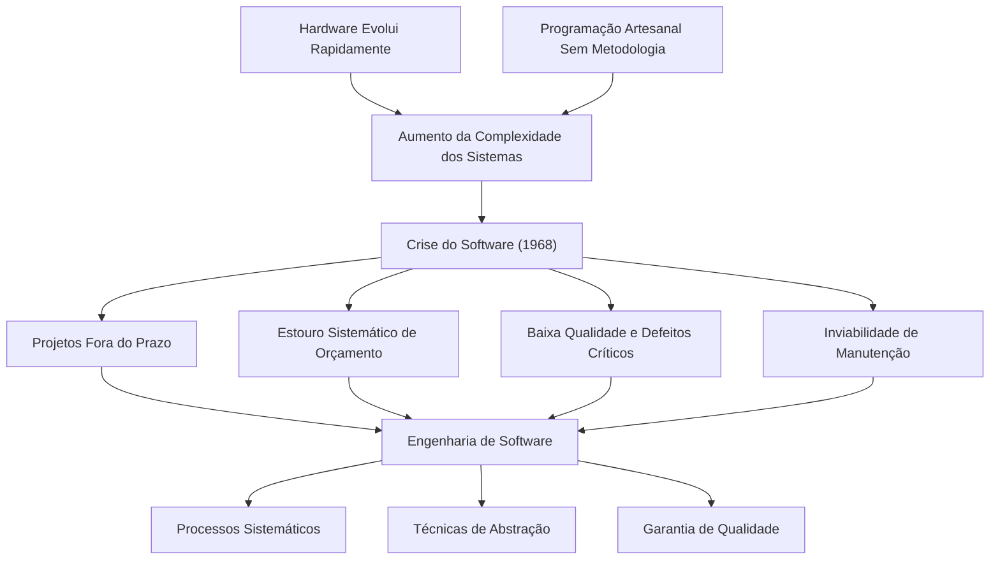

#### Exemplo
A introdução de especificações formais de requisitos e controle de versões nos anos 1970 possibilitou que sistemas de grande porte, como telecomunicações e controle aéreo, pudessem ser desenvolvidos por equipes multidisciplinares distribuídas sem perder a rastreabilidade do projeto.

#### Contraexemplo
Desenvolver um sistema corporativo bancário confiando exclusivamente no conhecimento tácito de programadores individuais, sem documentação de regras de cálculo financeiro, sem testes padronizados e sem processo de gestão de configurações.

#### Armadilhas comuns
Acreditar que a crise do software foi superada apenas pela criação de novas linguagens de programação de alto nível, ignorando que a maior causa de falha em projetos de software reside na comunicação deficiente e na gestão inadequada de requisitos.

---

### Modelos de Ciclo de Vida: Preditivos versus Adaptativos

#### Definição
Um modelo de ciclo de vida de processo de software estabelece a ordem, transições e critérios de entrada e saída das fases de concepção, análise, projeto, implementação, testes e implantação.
- **Modelo Preditivo (Cascata / Waterfall)**: Abordagem sequencial, orientada a planejamento formal exaustivo (plan-driven), onde cada fase deve ser completada e homologada antes do início da fase subsequente.
- **Modelo Adaptativo (Ágil / Scrum)**: Abordagem iterativa e incremental, orientada a valor (value-driven), estruturada em ciclos curtos de desenvolvimento (Sprints), na qual o escopo evolui organicamente a partir de validações contínuas com os usuários.

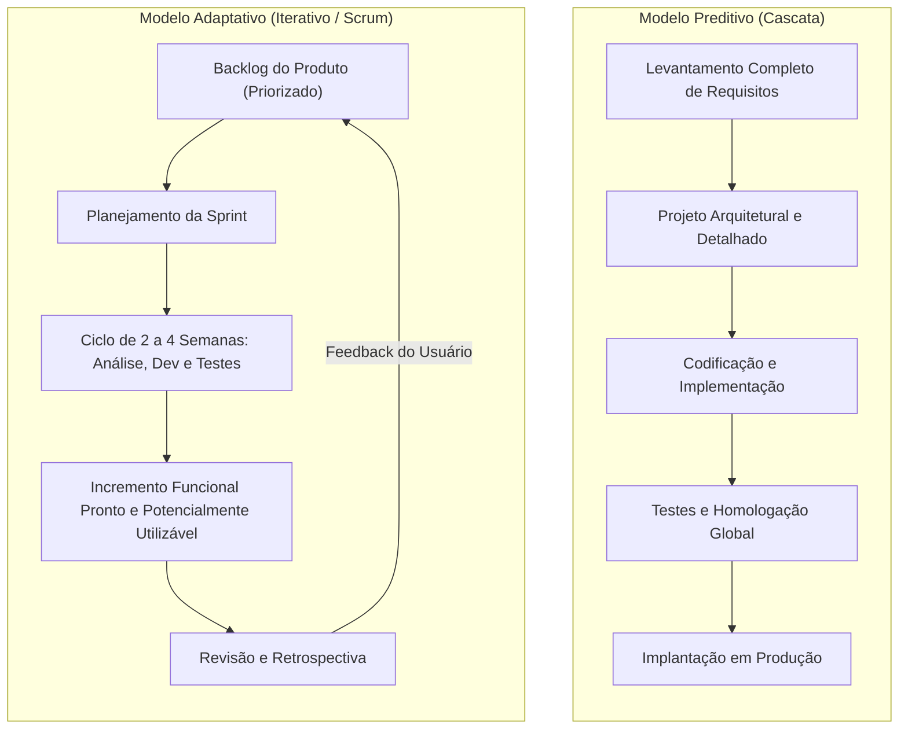

#### Comparação Dimensional entre Abordagens

| Dimensão de Análise | Modelo Preditivo (Cascata) | Modelo Adaptativo (Ágil/Scrum) |
| :--- | :--- | :--- |
| **Premissa Fundamental** | O sistema pode ser completamente previsto e planejado no início. | O software evolui sob incerteza e mudanças contínuas de mercado. |
| **Gestão de Escopo** | Rígido, fixado no início; mudanças exigem formalismo burocrático. | Variável e flexível; repriorizado a cada ciclo com base no retorno do usuário. |
| **Entrega de Valor** | Única e tardia, concentrada ao final do ciclo de vida. | Contínua e incremental; software funcional a cada iteração. |
| **Postura frente a Mudanças** | Mudanças são vistas como desvios ou riscos a serem minimizados. | Mudanças são bem-vindas como vantagem competitiva para o cliente. |
| **Participação do Cliente** | Concentrada no início (especificação) e no final (homologação). | Diária e contínua (ex.: presença ativa do Product Owner). |
| **Risco Principal** | Entregar exatamente o que foi pedido, mas que não atende à necessidade real. | Perda de alinhamento com a arquitetura geral se o refatoramento for negligenciado. |

#### Motivação
A seleção do processo deve ser guiada pela natureza do domínio. Projetos com requisitos estáveis, tecnologias consagradas e necessidade legal de rastreabilidade beneficiam-se de abordagens preditivas. Cenários de alta incerteza, novos modelos de negócio e inovação tecnológica exigem ciclos rápidos de aprendizado adaptativo.

#### Exemplo
Um software embarcado para sistema de injeção eletrônica e freios ABS de veículos comerciais exige engenharia de requisitos preditiva, rigorosa verificação estática e rastreabilidade total para homologação junto a órgãos reguladores de trânsito. Em contrapartida, uma aplicação web de comércio eletrônico para lançamento de um produto de nicho necessita de ciclos adaptativos para descobrir o perfil de consumo e ajustar fluxos de compra semanalmente.

#### Contraexemplo
Aplicar desenvolvimento puramente em cascata para criar uma rede social pioneira, tentando adivinhar com antecedência de 18 meses quais botões, filtros de fotos e algoritmos sociais os jovens vão preferir consumir.

#### Armadilhas comuns
Assumir que abordagens ágeis significam "ausência de planejamento ou documentação", ou assumir que o modelo cascata é "obsoleto para qualquer projeto moderno", ignorando sua eficácia em sistemas críticos certificados (aeroespacial, ferroviário e médico).

---

### Engenharia de Requisitos e Processo de Abstração

#### Definição
A Engenharia de Requisitos (ER) é o ramo sistemático da Engenharia de Software responsável por descobrir, documentar, analisar, validar e manter o conjunto de requisitos que definem o que um sistema deve fazer, como deve se comportar e sob quais restrições operacionais deve operar. A **abstração** é o mecanismo cognitivo fundamental empregado para isolar os detalhes de implementação (como tabelas SQL, frameworks de interface gráfica e portas de comunicação) e focar estritamente nas necessidades essenciais do negócio e dos usuários.

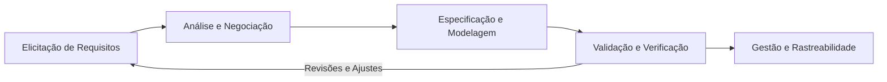

#### Fases do Ciclo de Engenharia de Requisitos
1. **Elicitação**: Coleta ativa de necessidades utilizando entrevistas, questionários, observação de campo (etnografia), workshops e prototipagem rápida.
2. **Análise e Negociação**: Identificação de conflitos entre múltiplos stakeholders, análise de viabilidade técnica/econômica e priorização de escopo.
3. **Especificação**: Registro formal das declarações dos requisitos, utilizando linguagem natural estruturada, modelos visuais (UML) e contratos de dados.
4. **Validação**: Conferência formal para assegurar que os requisitos são consistentes, completos, verificáveis e atendem às intenções reais do cliente.
5. **Gestão**: Rastreamento de mudanças, controle de versões de requisitos e mapeamento de dependências ao longo do projeto.

---

### Classificação Canônica: RF, RNF e Regras de Negócio

#### Definição
- **Requisito Funcional (RF)**: Declaração de um serviço, comportamento, reação a entradas específicas ou cálculo que o software deve executar. Responde diretamente à pergunta: *"O que o sistema faz?"*.
- **Requisito Não-Funcional (RNF)**: Restrição de qualidade, desempenho, segurança, conformidade legal, usabilidade ou arquitetura sob a qual as funcionalidades do sistema devem operar. Responde à pergunta: *"Como o sistema deve se comportar em relação a parâmetros qualitativos?"*.
- **Regra de Negócio (RN)**: Diretriz, política corporativa, norma jurídica, fórmula de tributação ou restrição operacional do domínio que existe **independentemente de qualquer software**. O software apenas automatiza a regra; se o sistema for desligado e o negócio voltar a operar no papel, a regra de negócio continua plenamente válida e mandatória.

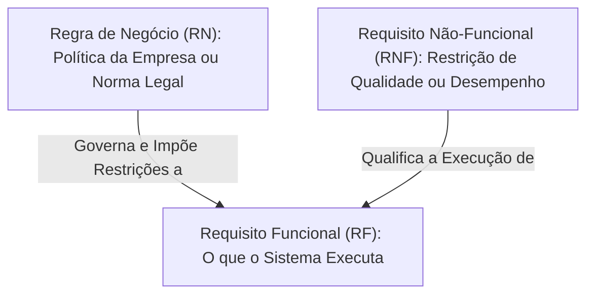

#### Quadro de Diferenciação Estrutural

| Propriedade | Requisito Funcional (RF) | Requisito Não-Funcional (RNF) | Regra de Negócio (RN) |
| :--- | :--- | :--- | :--- |
| **Origem Primária** | Necessidade operacional do usuário no sistema. | Requisitos de arquitetura, infraestrutura e engenharia. | Leis, governança, políticas institucionais e mercado. |
| **Foco** | Ação, transformação de dados, entrada e saída. | Critérios de eficiência, tempo, carga, segurança, portabilidade. | Condições de negócio, restrições conceituais de domínio. |
| **Existência sem TI** | Não faz sentido sem um sistema automatizado ou processo formal de dados. | Não se aplica (são métricas de execução de sistemas e processos). | **Existe plenamente**, mesmo operado com caneta e caderno. |
| **Verificação** | Testes de aceitação, testes funcionais e de integração. | Testes de carga, testes de estresse, auditorias de segurança, benchmarks. | Conferência com a legislação e auditoria fiscal/contábil. |

#### Exemplos e Contraexemplos
- *Exemplo de RF*: "O sistema deve emitir nota fiscal eletrônica após confirmação de pagamento."
- *Exemplo de RNF*: "A emissão da nota fiscal eletrônica não deve demorar mais de 3 segundos em 95% das transações sob pico de tráfego."
- *Exemplo de RN*: "Operações interestaduais de venda para consumidor final recolhem alíquota diferencial de ICMS conforme o estado de destino." (Existe na legislação brasileira, independente de haver sistema).
- *Contraexemplo comum*: Tratar o cálculo do ICMS como um "requisito funcional da aplicação", esquecendo que o software apenas operacionaliza a regra legal.

---

### Modelagem Estruturada com Casos de Uso UML

#### Definição
Criado por Ivar Jacobson e incorporado à especificação da Unified Modeling Language (UML) pela Object Management Group (OMG), o **Diagrama de Casos de Uso** e sua respectiva **Descrição Textual** são artefatos que modelam o comportamento externamente visível do sistema a partir do ponto de vista de seus usuários externos (**Atores**).

#### Elementos do Modelo de Casos de Uso
1. **Ator**: Entidade externa (humano, hardware ou outro sistema externo de software) que interage com o sistema desempenhando um papel específico. Atores nunca estão contidos dentro da fronteira do sistema.
2. **Caso de Uso**: Conjunto coeso de ações e passos executados pelo sistema que produz um resultado observável de valor para um ator específico.
3. **Limite do Sistema (System Boundary)**: Delimita explicitamente o escopo computacional. Os casos de uso ficam dentro; os atores ficam fora.

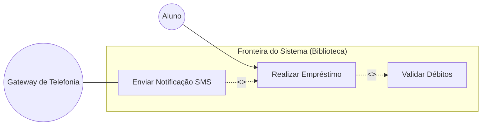

#### Relacionamentos Canônicos: Include versus Extend

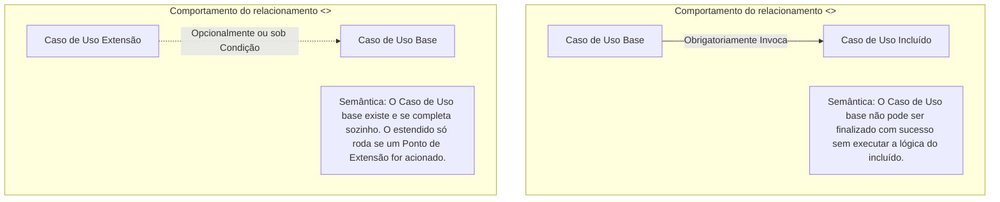

- **Relacionamento `<<include>>`**:
  - Indica que o caso de uso base **sempre e obrigatoriamente** incorpora a lógica do caso de uso incluído durante sua execução.
  - O caso de uso base torna-se incompleto sem o incluído.
  - Objetivo de engenharia: Evitar duplicação de comportamentos comuns a múltiplos casos de uso (reutilização estruturada).
  - Sentido da seta: Aponta **do caso de uso base para o caso de uso incluído** (`Base --> Incluído`).

- **Relacionamento `<<extend>>`**:
  - Indica que o caso de uso extensor **insere condicionalmente ou opcionalmente** seu comportamento no caso de uso base.
  - O caso de uso base é completo e perfeitamente funcional por si só; ele não depende da existência do extensor.
  - A execução ocorre apenas se uma condição associada a um **Ponto de Extensão (Extension Point)** for satisfeita.
  - Sentido da seta: Aponta **do caso de uso extensor para o caso de uso base** (`Extensão --> Base`), indicando que o extensor "conhece" a base, mas a base não depende do extensor.

---

### Engenharia de Requisitos Ágil: Histórias de Usuário, INVEST e BDD

#### Definição
No paradigma ágil, a especificação extensiva é substituída por artefatos leves e colaborativos:
- **História de Usuário (User Story)**: Descrição textual concisa de uma necessidade de negócio contendo: persona (quem), funcionalidade desejada (o quê) e o benefício esperado (por quê).
- **INVEST**: Conjunto de critérios de qualidade criado por Bill Wake para avaliar a maturidade de itens de backlog.
- **BDD (Behavior-Driven Development)**: Técnica que formaliza critérios de aceitação com base em cenários executáveis, utilizando a sintaxe estruturada `Dado / Quando / Então` (Gherkin).

#### A Sintaxe Canônica da História de Usuário
```markdown
Como [tipo de usuário/persona],
Eu quero [ação/capacidade que o software deve fornecer],
Para que [benefício tangível/geração de valor de negócio].
```

#### O Framework de Auditoria INVEST

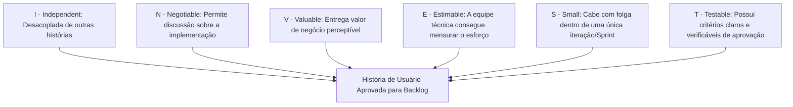

1. **Independent (Independente)**: Reduz o acoplamento. A história pode ser desenvolvida, testada e implantada sem depender da entrega simultânea de outra história da mesma Sprint.
2. **Negotiable (Negociável)**: Não é um contrato estático e imutável. Representa um convite contínuo à conversa entre a equipe de desenvolvimento e o Product Owner.
3. **Valuable (Valiosa)**: Deve proporcionar valor tangível para o cliente ou usuário final. Evita histórias puramente técnicas desprovidas de contexto funcional.
4. **Estimable (Estimável)**: O time de desenvolvimento compreende a complexidade do domínio a ponto de atribuir uma métrica relativa (ex.: Story Points).
5. **Small (Pequena)**: Deve ter dimensionalidade reduzida para ser concluída com folga dentro de um único ciclo de Sprint (evitando "mini-waterfalls").
6. **Testable (Testável)**: Contém critérios objetivos e mensuráveis de aceitação que permitem à equipe de QA e aos testes automatizados atestar formalmente que a história funciona.

---

## Resolução proposta

### Exercício 1: Análise Comparativa entre Modelos Preditivos e Adaptativos

#### Contexto e Identificação dos Cenários

Considere os dois cenários de projetos de software propostos:
- **Cenário 1**: Desenvolvimento de software embarcado para controle de frenagem eletrônica e estabilidade dinâmica (ABS/ESP) de um veículo comercial de carga.
- **Cenário 2**: Desenvolvimento do Produto Mínimo Viável (MVP) de uma startup de entregas rápidas ponto-a-ponto, operando em mercado de alta volatilidade urbana.

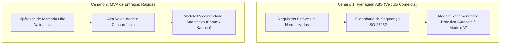

#### Item (a): Identificação e Justificativa Técnica

##### Justificativa para o Cenário 1: Abordagem Preditiva (Cascata / Modelo V)
- **Natureza do Domínio Crítico (Safety-Critical System)**: Falhas operacionais neste software acarretam perda de vidas humanas e danos materiais irreparáveis. Softwares de frenagem exigem conformidade obrigatória com normas regulatórias internacionais rigorosas (tais como ISO 26262 - Functional Safety for Road Vehicles).
- **Estabilidade dos Requisitos**: As leis da física que regem a dinâmica de atrito entre pneu e asfalto, os tempos de resposta de atuadores hidráulicos e os barramentos de comunicação veicular (CAN/LIN) são estáticos e minuciosamente conhecidos antes de qualquer linha de código ser escrita.
- **Custo e Inviabilidade de Refatoração Tardia**: Atualizar o firmware de milhares de veículos comerciais em circulação é uma operação extremamente dispendiosa e de alto risco. A estratégia de engenharia precisa garantir verificação estática, testes exaustivos e validação antes da liberação fabril. O modelo sequencial estruturado garante o rigor documental exigido pelos órgãos homologadores.

##### Justificativa para o Cenário 2: Abordagem Adaptativa (Scrum)
- **Incerteza e Volatilidade de Mercado**: Uma startup em fase de MVP opera em um cenário de incerteza extrema. Ninguém tem clareza prévia sobre qual modelo de precificação atrai mais motoristas, como os lojistas desejam despachar pacotes ou quais integrações de pagamento convertem melhor.
- **Time-to-Market e Retorno do Investimento**: É imperativo lançar uma versão básica funcional no mercado no menor intervalo de tempo possível para testar hipóteses, obter tração e evitar a queima prematura de capital de risco.
- **Custo Praticamente Nulo de Distribuição**: Por se tratar de uma aplicação web e mobile conectada a serviços em nuvem, atualizações de software e correções de bugs podem ser disponibilizadas instantaneamente via pipelines de Integração e Implantação Contínua (CI/CD). O ciclo curto de feedback permite reorientar todo o produto quinzenalmente.

---

#### Item (b): Comparação Sistemática: Gestão de Mudanças e Entrega de Valor

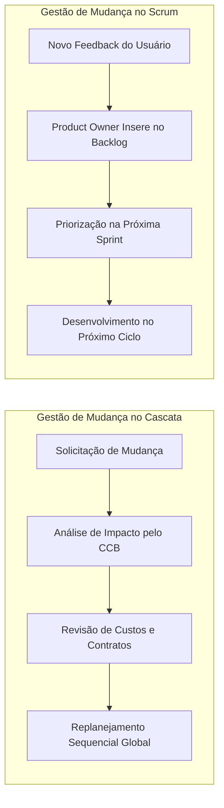

##### 1. Gestão de Mudanças de Escopo

- **No Modelo Preditivo (Cascata)**:
  - O escopo é congelado formalmente ao final da fase de análise de requisitos através de uma linha de base (baseline).
  - Qualquer alteração identificada durante as fases de projeto, codificação ou testes é tratada como um desvio e deve ser submetida a um comitê formal de controle de mudanças (Change Control Board - CCB).
  - A mudança acarreta renegociação de prazos, revisão formal de cronograma, custos contratuais e revalidação de todas as etapas anteriores para evitar quebras de consistência na documentação técnica.

- **No Modelo Adaptativo (Scrum)**:
  - A mudança é vista como um elemento natural do processo e uma oportunidade de adaptação competitiva.
  - O escopo é flexível e decomposto em itens priorizados no Product Backlog.
  - Durante o transcorrer de uma Sprint, o escopo daquela iteração específica é mantido estável para garantir foco à equipe. Contudo, entre uma Sprint e outra, o Product Owner tem a prerrogativa total de inserir, reorganizar ou descartar funcionalidades do backlog de acordo com os aprendizados da iteração anterior.

##### 2. Entrega de Valor ao Cliente

- **No Modelo Preditivo (Cascata)**:
  - O cliente e os usuários só têm contato com o produto funcional nos estágios finais do cronograma, tipicamente durante a homologação e entrada em produção.
  - A entrega de valor é concentrada em um evento único (Big Bang). O risco intrínseco é que, se a necessidade original foi mal interpretada ou se o contexto mudou ao longo do desenvolvimento, descobre-se a inadequação após consumir a totalidade do orçamento.

- **No Modelo Adaptativo (Scrum)**:
  - O valor é gerado de forma contínua e incremental. Ao final de cada ciclo (Sprint de 2 a 4 semanas), a equipe entrega um incremento funcional de produto potencialmente utilizável (Shippable Product Increment).
  - O cliente visualiza e testa o software em operação real desde as primeiras semanas de projeto, permitindo aferição do retorno financeiro e correções imediatas de rota.

---

### Exercício 2: Classificação Rigorosa de Requisitos e Regras de Negócio

Abaixo apresenta-se a classificação técnica dos 5 enunciados apresentados, acompanhada da fundamentação de engenharia de software e da identificação de potenciais armadilhas de análise.

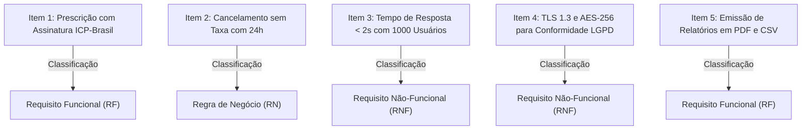

#### Item 1: "O médico deve ser capaz de prescrever medicamentos controlados com assinatura digital padrão ICP-Brasil."
- **Classificação**: **Requisito Funcional (RF)**.
- **Justificativa Técnica**: Trata-se de uma ação direta e operacional que o sistema deve fornecer ao usuário (médico): o ato de formular uma receita médica de medicamentos controlados e assinar digitalmente o documento eletrônico. O sistema precisa receber dados, processar um certificado digital criptográfico (padrão ICP-Brasil) e gerar uma saída estruturada e autenticada.
- **Distinção Importante**: O fato de mencionar a norma "ICP-Brasil" representa um padrão tecnológico e uma restrição de domínio aplicada à funcionalidade, mas o cerne do enunciado descreve um comportamento operacional do software que agrega valor direto à rotina clínica.

#### Item 2: "O cancelamento de agendamento de consulta sem incidência de taxa administrativa só é permitido se efetuado com no mínimo 24 horas de antecedência."
- **Classificação**: **Regra de Negócio (RN)**.
- **Justificativa Técnica**: Esta é uma política institucional e diretriz financeira estabelecida pela clínica ou hospital. Ela determina as condições financeiras sob as quais uma cobrança de taxa ocorre. Essa regra existe independentemente de haver um software no hospital. Se o agendamento fosse anotado em fichas de papel ou controlado por telefone através de uma secretária, a regra das 24 horas continuaria vigorando plenamente.
- **Impacto no Software**: Essa RN gerará um Requisito Funcional derivado (ex.: "O sistema deve calcular o intervalo entre a solicitação de cancelamento e a data da consulta, emitindo cobrança de taxa quando o intervalo for inferior a 24 horas").

#### Item 3: "O tempo de resposta para consultas à base de prontuários não deve ultrapassar 2 segundos sob concorrência de 1.000 usuários ativos."
- **Classificação**: **Requisito Não-Funcional (RNF)** (Subcategoria: Desempenho e Eficiência de Execução).
- **Justificativa Técnica**: O enunciado não está descrevendo o ato de consultar o prontuário (isso seria o RF associado), mas sim estabelecendo uma restrição quantitativa e mensurável de desempenho sobre o tempo e a carga operacional que o sistema deve suportar. Define parâmetros de qualidade de serviço (QoS) essenciais para o dimensionamento da infraestrutura de servidores e do banco de dados.

#### Item 4: "Todas as informações sensíveis de saúde devem ser trafegadas via TLS 1.3 e armazenadas em repouso com algoritmo AES-256 para conformidade com a LGPD."
- **Classificação**: **Requisito Não-Funcional (RNF)** (Subcategoria: Segurança e Conformidade Regulatória).
- **Justificativa Técnica**: Define uma restrição técnica de arquitetura e segurança da informação aplicável a todas as transações e armazenamentos de dados do sistema hospitalar. O software não existe primariamente para "executar TLS 1.3", mas sim precisa atender a esse padrão de criptografia em trânsito e em repouso para garantir a confidencialidade e a integridade exigidas por lei (LGPD).
- **Distinção Importante**: Embora a motivação venha de uma lei externa (LGPD), a exigência de usar TLS 1.3 e AES-256 especifica como a infraestrutura técnica do software deve ser arquitetada, configurando um clássico RNF de segurança.

#### Item 5: "O sistema deve emitir relatórios semanais de ocupação de leitos em formato PDF e CSV."
- **Classificação**: **Requisito Funcional (RF)**.
- **Justificativa Técnica**: Especifica um serviço explícito de processamento e saída de dados que o software deve executar periodicamente. O sistema deve varrer o banco de dados hospitalar, agregar os dados de internação e alta médica dos últimos 7 dias, calcular os índices de ocupação e compilar o arquivo nos formatos solicitados (PDF e CSV) para download ou envio aos administradores.

---

### Exercício 3: Histórias de Usuário, Critérios de Aceitação em BDD e Avaliação INVEST

#### Cenário de Negócio: Plataforma de Comércio Eletrônico (E-commerce)

Abaixo são formuladas duas Histórias de Usuário completas para um ecossistema de e-commerce, seus respectivos critérios de aceitação no formato BDD (Gherkin) e uma avaliação estruturada dos critérios INVEST.

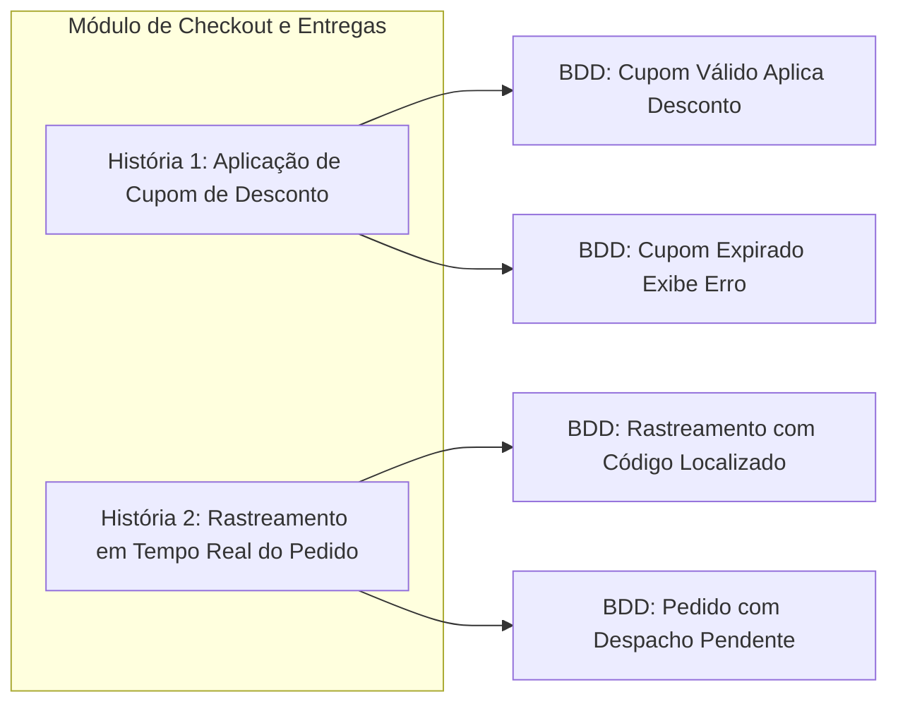

---

#### Item (a) e (b): Formulação das Histórias e Critérios BDD

##### História de Usuário 1: Aplicação de Cupom de Desconto no Checkout

```markdown
Como um comprador cadastrado na loja virtual,
Eu quero aplicar um cupom de desconto promocional no carrinho de compras,
Para que eu possa economizar no valor total final do meu pedido antes do pagamento.
```

###### Critérios de Aceitação (BDD / Gherkin)

```gherkin
Cenário: Aplicação bem-sucedida de cupom promocional válido dentro do prazo
  Dado que o comprador possui um carrinho ativo com subtotal de R$ 250,00
  E o comprador possui o cupom válido "VERAO10" com benefício de 10% de desconto
  Quando o comprador inserir o código "VERAO10" no campo de cupom e acionar o botão "Aplicar"
  Então o sistema deve recalcular o valor total do pedido para R$ 225,00
  E deve exibir a mensagem de confirmação: "Cupom VERAO10 aplicado com sucesso!"
  E deve destacar o desconto concedido de R$ 25,00 no sumário de valores.

Cenário: Tentativa de aplicação de cupom com data de validade expirada
  Dado que o comprador possui um carrinho ativo com subtotal de R$ 100,00
  E o comprador tenta utilizar o cupom "NATAL2025" cuja data de validade era 25/12/2025
  Quando o comprador submeter o código no campo de cupom e acionar "Aplicar"
  Então o sistema não deve aplicar nenhum desconto sobre o subtotal do carrinho
  E deve manter o valor total inalterado em R$ 100,00
  E deve exibir a mensagem de erro: "O cupom informado está expirado e não pode ser utilizado."
```

##### História de Usuário 2: Rastreamento em Tempo Real do Pedido

```markdown
Como um cliente que concluiu uma compra no e-commerce,
Eu quero rastrear os status operacionais e a localização estimada do meu pacote,
Para que eu saiba exatamente quando meu produto chegará ao meu endereço e possa me programar para recebê-lo.
```

###### Critérios de Aceitação (BDD / Gherkin)

```gherkin
Cenário: Visualização de rastreamento de pacote já despachado para a transportadora
  Dado que o cliente efetuou o pedido "PED-98765" com pagamento aprovado
  E a mercadoria já foi despachada pela transportadora parceira com o código "BR123456789X"
  Quando o cliente acessar a seção "Meus Pedidos" e clicar em "Rastrear Pedido PED-98765"
  Então o sistema deve consultar a API da transportadora
  E deve exibir a linha do tempo com o status atual: "Em trânsito para o centro de distribuição da sua cidade"
  E deve exibir a data e hora do último evento logístico e a estimativa de entrega final.

Cenário: Consulta de rastreamento de pedido recém-criado em fase de separação no estoque
  Dado que o cliente possui o pedido "PED-99001" com pagamento aprovado há menos de 2 horas
  E o produto ainda está em fase de separação física no centro de distribuição
  Quando o cliente acessar o painel e clicar em "Rastrear Pedido PED-99001"
  Então o sistema deve indicar visualmente o status "Pedido em Separação no Estoque"
  E deve exibir a informação: "O código de rastreamento será gerado assim que o pacote for coletado pela transportadora."
```

---

#### Item (c): Avaliação Crítica da História 1 sob a Ótica da Sigla INVEST

Abaixo realiza-se a análise sistemática da **História de Usuário 1 (Aplicação de Cupom de Desconto)** em relação a cada um dos critérios do acrônimo INVEST:

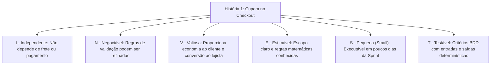

1. **Independent (Independente)**:
   - *Análise*: A história é altamente desacoplada. O cálculo do desconto pode ser implementado e testado isoladamente sobre o subtotal do carrinho, sem depender da conclusão das histórias de cálculo de frete por CEP ou da integração com o gateway de cartões de crédito.
   - *Redução de desperdício*: Elimina bloqueios entre desenvolvedores. Uma equipe pode implementar o motor de cupons sem precisar esperar que o time de logística finalize o cálculo de frete.

2. **Negotiable (Negociável)**:
   - *Análise*: O cartão não define uma interface rígida ou uma implementação técnica engessada. O time de desenvolvimento e o Product Owner podem negociar aspectos operacionais (ex.: se o cupom pode ser cumulativo com promoções automáticas da loja ou se haverá limite máximo em reais para descontos percentuais).
   - *Redução de desperdício*: Evita o desperdício de tempo decorrente de especificações excessivamente prematuras de detalhes que só se tornam relevantes no momento da implementação.

3. **Valuable (Valiosa)**:
   - *Análise*: Proporciona valor direto e quantificável tanto para o comprador (que percebe economia real) quanto para o lojista (que utiliza campanhas de marketing promocional para aumentar a taxa de conversão do checkout e fidelizar compradores).
   - *Redução de desperdício*: Garante que a equipe de engenharia não construa funcionalidades puramente técnicas ou irrelevantes que não gerem impacto positivo no negócio (princípio Lean de combate à superprodução).

4. **Estimable (Estimável)**:
   - *Análise*: A lógica de cálculo percentual e subtração de saldo é matematicamente simples e bem delimitada. A equipe técnica tem condições plenas de dimensionar o esforço de banco de dados, regras de validação e interface gráfica, pontuando a história de forma consistente na Planning.
   - *Redução de desperdício*: Mitiga o risco de estimativas irreais e cronogramas ilusórios, reduzindo o estresse de entregas e o retrabalho em sprints futuras.

5. **Small (Pequena)**:
   - *Análise*: A história tem escopo reduzido e foco específico. Não tenta resolver toda a gestão de campanhas de marketing ou a emissão de cupons por lote, restringindo-se à aplicação e validação do código no carrinho. É perfeitamente executável e testável em 2 a 3 dias de trabalho por um par de desenvolvedores.
   - *Redução de desperdício*: Reduz o Work-In-Progress (WIP). Histórias menores fluem com mais rapidez pelo fluxo do quadro kanban, diminuindo o tempo de ciclo e facilitando a identificação imediata de gargalos.

6. **Testable (Testável)**:
   - *Análise*: O comportamento da história é completamente verificável de maneira automatizada e determinística através dos cenários BDD formulados. Existem entradas claras (código do cupom, data atual e subtotal) e saídas esperadas bem definidas (desconto aplicado ou mensagem de erro).
   - *Redução de desperdício*: Elimina a ambiguidade nos testes de qualidade. Os critérios de aceitação servem diretamente como base para testes unitários, testes de integração e testes ponta-a-ponta (E2E), reduzindo a incidência de bugs em produção.

---

### Exercício 4: Especificação Estruturada de Caso de Uso e Relacionamentos UML

#### Modelagem Visual: Diagrama de Casos de Uso (UML)

O diagrama abaixo modela o subsistema de empréstimos da biblioteca universitária em conformidade com as convenções da Unified Modeling Language (UML):

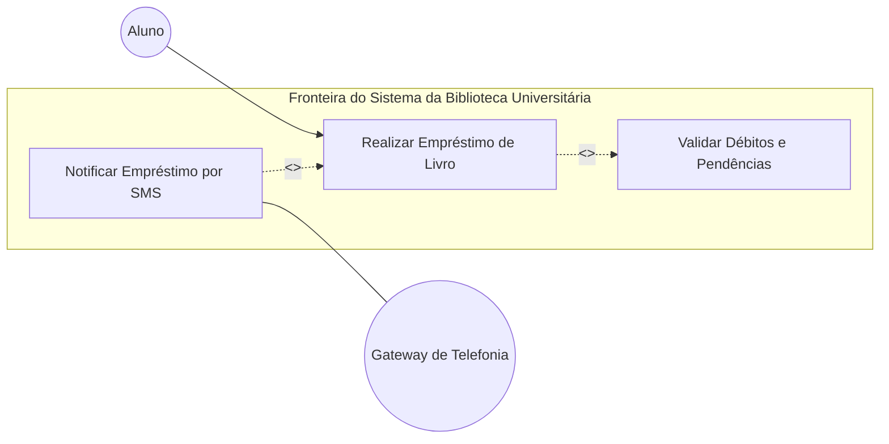

---

#### Item (a): Especificação Textual Estruturada do Caso de Uso

##### Identificação e Contexto
- **Nome do Caso de Uso**: Realizar Empréstimo de Livro
- **Identificador**: UC-01
- **Ator Principal**: Aluno (usuário regularmente matriculado na instituição)
- **Atores Secundários**: Gateway de Telefonia / Notificação Externa (responsável pelo envio do SMS)
- **Breve Descrição**: Permite que um aluno matriculado solicite o empréstimo físico temporário de um ou mais exemplares do acervo da biblioteca universitária, desde que esteja sem pendências financeiras e respeite o limite operacional de obras simultâneas.

##### Condições Iniciais e Finais
- **Pré-condições**:
  1. O Aluno deve estar previamente autenticado no sistema (login ativo com RA e senha).
  2. O exemplar físico da obra desejada deve constar com status "Disponível" no acervo do campus.
- **Pós-condições**:
  1. O empréstimo é registrado com sucesso na base de dados com a data de devolução estipulada para 14 dias subsequentes.
  2. O status dos exemplares emprestados é alterado imediatamente para "Emprestado".
  3. Um comprovante de empréstimo digital é gerado com código de autenticação único.

##### Fluxo Principal de Eventos (Fluxo Básico)
1. O Aluno acessa o módulo de circulação da biblioteca e aciona a opção "Solicitar Novo Empréstimo".
2. O sistema solicita que o Aluno informe o código de barras ou o identificador RFID dos exemplares físicos desejados.
3. O Aluno informa o identificador do exemplar e confirma a inclusão no pedido.
4. O sistema invoca obrigatoriamente a verificação de regularidade institucional através do caso de uso **`<<include>>` UC-02: Validar Débitos e Pendências**.
5. O sistema confirma que o Aluno não possui multas atrasadas pendentes e que o total de exemplares atuais mais os novos não excede o limite máximo institucional de 3 obras.
6. O sistema registra o empréstimo no banco de dados, vinculando os exemplares ao prontuário do Aluno e calculando a data prevista para devolução.
7. O sistema altera a situação física dos exemplares no catálogo para "Emprestado".
8. O sistema exibe na tela o comprovante de empréstimo gerado, contendo a relação de livros, datas de devolução e código de verificação.
9. O caso de uso é finalizado com sucesso.

##### Fluxos Alternativos e de Exceção

###### Fluxo de Exceção 4a: Existência de Débitos Financeiros Pendentes
- **Condição de disparo**: Durante a execução do passo 4 (UC-02), o sistema detecta que o Aluno possui multas pendentes decorrentes de atrasos em devoluções anteriores.
- **Passos**:
  1. O sistema interrompe imediatamente o fluxo de empréstimo.
  2. O sistema exibe a mensagem de notificação de pendência: *"Operação Bloqueada: O aluno possui débito financeiro ativo de R$ 15,00 referente a devolução com atraso. Regularize a situação na tesouraria antes de solicitar novos empréstimos."*.
  3. O sistema registra em log de auditoria a tentativa frustrada de empréstimo com pendência.
  4. O caso de uso é encerrado sem alterar o status dos livros e sem gerar empréstimo.

###### Fluxo de Exceção 5a: Limite Máximo de Livros Excedido
- **Condição de disparo**: No passo 5, a soma dos livros atualmente em posse do Aluno com os novos livros solicitados ultrapassa o limite institucional (ex.: aluno já possui 2 livros e solicita mais 2).
- **Passos**:
  1. O sistema emite mensagem de aviso: *"Não foi possível concluir o empréstimo: Você já possui 2 exemplares em posse e a biblioteca permite o limite máximo de 3 exemplares simultâneos."*.
  2. O sistema oferece ao Aluno a opção de remover um ou mais itens da solicitação atual.
  3. Se o Aluno remover itens mantendo-se dentro do limite de 3 obras, o fluxo retorna ao passo 5 do fluxo principal.
  4. Caso o Aluno opte por cancelar, o caso de uso é encerrado sem registrar o empréstimo.

###### Fluxo Alternativo 8a: Envio de Comprovante por SMS (Ponto de Extensão)
- **Condição de disparo**: No passo 8, o sistema verifica o **Ponto de Extensão: Envio de Notificação Adicional**. Caso o Aluno tenha marcado a opção "Desejo receber o comprovante de devolução por SMS" e possua número de celular válido cadastrado.
- **Passos**:
  1. O sistema aciona o caso de uso estendido **`<<extend>>` UC-03: Notificar Empréstimo por SMS**.
  2. O sistema formata uma mensagem de texto contendo o resumo dos títulos e a data de vencimento.
  3. O sistema transmite a mensagem para o Gateway de Telefonia externo.
  4. O Gateway confirma o recebimento da mensagem para fila de envio.
  5. O sistema exibe a confirmação: *"Comprovante encaminhado via SMS para o número (17) 99876-XXXX."*.
  6. O fluxo retorna ao passo 9 do fluxo principal.

---

#### Item (b): Diferenciação Semântica entre os Relacionamentos `<<include>>` e `<<extend>>`

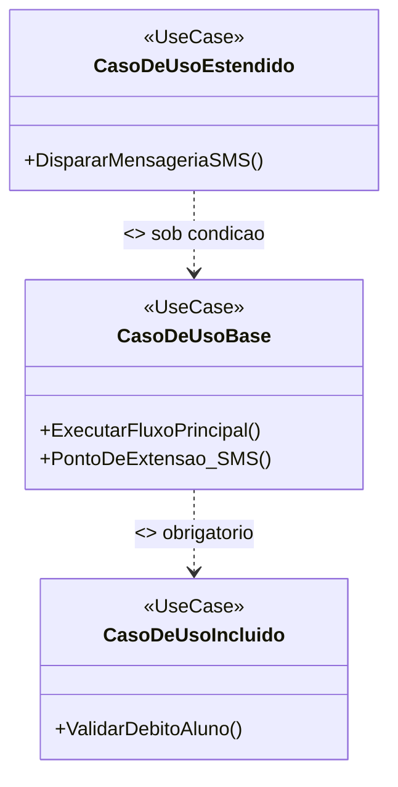

Abaixo apresenta-se o confronto semântico e estrutural entre os dois relacionamentos de dependência da UML:

| Parâmetro de Comparação | Relacionamento `<<include>>` | Relacionamento `<<extend>>` |
| :--- | :--- | :--- |
| **Obrigatoriedade de Execução** | **Obrigatória**. O caso de uso incluído sempre roda quando a base é chamada. | **Opcional ou Condicional**. Só roda se uma condição específica for atendida. |
| **Autonomia do Caso de Uso Base** | **Incompleto**. O caso de uso base necessita do incluído para cumprir sua pós-condição. | **Completo e Autossuficiente**. A base funciona perfeitamente sem o estendido. |
| **Sentido da Dependência (Seta)** | Aponta do caso de uso **Base para o Incluído** (`Base --> Incluído`). | Aponta da **Extensão para o Caso Base** (`Extensão --> Base`). |
| **Gatilho de Disparo** | Chamada explícita e embutida no fluxo principal da base. | Disparado a partir de um **Ponto de Extensão** mediante satisfação de uma guarda. |
| **Propósito de Engenharia** | Evitar duplicação de rotinas comuns a múltiplos fluxos (Reuso). | Modularizar comportamentos opcionais, variações ou exceções sem poluir a base. |

##### Aplicação Concreta no Cenário da Biblioteca:
1. **Aplicação do `<<include>>`**:
   - O caso de uso `Validar Débitos e Pendências` é incluído (`<<include>>`) pelo caso de uso `Realizar Empréstimo de Livro`.
   - **Por que é include?** Porque a biblioteca estabelece como regra inegociável que nenhum empréstimo pode ser concluído sem antes checar as pendências financeiras do estudante. O caso base não tem permissão para concluir sua execução sem passar por essa validação. Além disso, essa mesma rotina de validação pode ser reaproveitada em outros casos de uso do sistema (ex.: `Renovar Empréstimo` ou `Emitir Certidão de Nada Consta Acadêmico`).

2. **Aplicação do `<<extend>>`**:
   - O caso de uso `Notificar Empréstimo por SMS` estende (`<<extend>>`) o caso de uso `Realizar Empréstimo de Livro`.
   - **Por que é extend?** Porque o empréstimo de livros acontece perfeitamente e atinge sua meta principal com a entrega do comprovante em tela ou impresso, independentemente de haver ou não o envio do SMS. O envio da mensagem é uma conveniência opcional, acionada apenas se o aluno solicitar ativamente e houver cobertura de telefonia.

---

#### Rastreabilidade Comportamental: Diagrama de Sequência do Empréstimo

Para demonstrar a interação temporal entre atores, classes de controle e entidades do domínio, apresenta-se o diagrama de sequência em UML do fluxo de empréstimo:

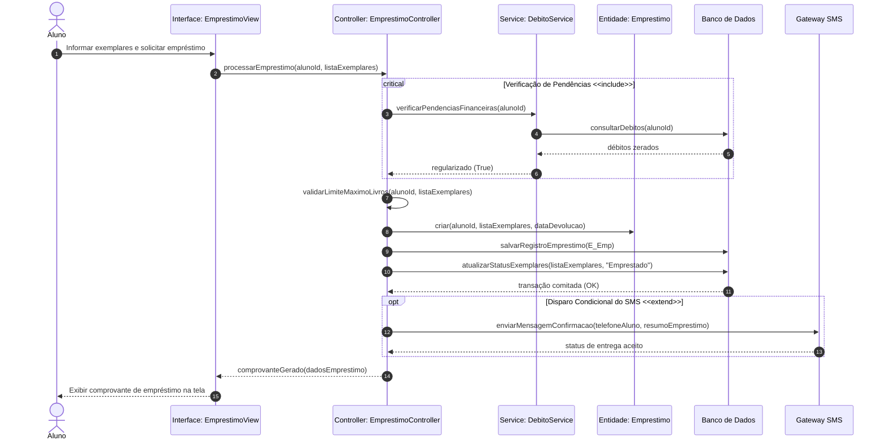

---

## Como testar e validar

Para garantir que a atividade e seus modelos atendem aos critérios de correção do Prof. Marcelo Boer e às normas vigentes de Engenharia de Software, os seguintes mecanismos de validação devem ser aplicados:

1. **Matriz de Rastreabilidade de Requisitos (RTM)**:
   - Toda história de usuário e todo caso de uso deve mapear diretamente para um ou mais Requisitos Funcionais (RF) e estar limitado pelas Regras de Negócio (RN).
   - O estudante deve preencher a tabela cruzando o identificador do requisito com o teste de aceitação correspondente para demonstrar que nenhuma funcionalidade foi desenvolvida sem justificativa de negócio.

| ID Requisito | Tipo | Descrição Sumária | Artefato de Especificação | Cenário de Teste / Validação |
| :--- | :--- | :--- | :--- | :--- |
| **RF-01** | Funcional | Efetuar empréstimo de obras físicas | UC-01: Realizar Empréstimo | Teste funcional do fluxo básico (1 a 9) |
| **RN-01** | Regra Negócio | Bloqueio de empréstimo para alunos com débito | UC-02: Validar Débitos | Teste de exceção: Aluno com multa de R$ 15,00 |
| **RN-02** | Regra Negócio | Limite máximo de 3 exemplares simultâneos | UC-01: Passo 5 | Teste de limite: Tentativa de pegar 4º livro |
| **RNF-01** | Não-Funcional | Notificação em tempo real por SMS | UC-03: Notificar SMS | Teste de integração com mock do Gateway SMS |

2. **Validação de Casos de Uso com Método de Inspeção Fagan (Walkthrough)**:
   - Percorrer passo a passo o fluxo principal do caso de uso aplicando perguntas reflexivas:
     - *"O que acontece se a conexão com o banco cair no passo 6?"*
     - *"O que acontece se o código de barras for inválido no passo 3?"*
   - Verificar se as setas dos relacionamentos `<<include>>` e `<<extend>>` seguem estritamente a direção padronizada da UML (seta pontilhada com triângulo aberto, apontando no sentido correto da dependência).

3. **Validação Automatizada de Critérios BDD (Gherkin)**:
   - Os cenários de teste formulados em `Dado / Quando / Então` devem ser validados utilizando ferramentas reais de automação de testes (como Cucumber, Behave para Python ou Cypress/Playwright para web).
   - Executar os testes contra implementações stub para verificar se os cenários falham na ausência da regra (fase vermelha) e passam quando a regra é implementada (fase verde).

---

## Critérios de qualidade

A avaliação das soluções entregues em Engenharia de Software deve guiar-se pelos atributos de qualidade definidos pela norma **ISO/IEC/IEEE 29148:2018 (Systems and software engineering — Life cycle processes — Requirements engineering)**:

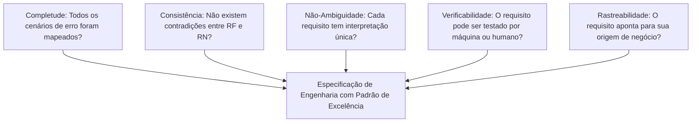

1. **Completude (Completeness)**:
   - A especificação detalha não apenas o "caminho feliz" (cenário ideal), mas descreve exaustivamente os tratamentos de falha, quedas de conexão, desvios operacionais e exceções.
2. **Não-Ambiguidade (Unambiguity)**:
   - O texto não emprega adjetivos vagos ou relativos (ex.: "sistema intuitivo", "resposta rápida", "layout amigável"). Em vez disso, utiliza metas quantitativas verificáveis (ex.: "tempo de resposta inferior a 2 segundos").
3. **Consistência (Consistency)**:
   - Os requisitos não entram em contradição lógica mútua. Um requisito não pode exigir entrega imediata enquanto outra regra estipula retenção de dados para auditoria sem definir a precedência.
4. **Verificabilidade e Testabilidade (Verifiability)**:
   - Para todo requisito funcional ou não funcional declarado, existe um teste prático capaz de comprovar se a implementação foi aprovada ou reprovada de maneira binária (Pass/Fail).
5. **Aderência aos Padrões Notacionais (Syntactic Correctness)**:
   - O diagrama UML respeita rigorosamente a semântica da especificação OMG: atores fora da fronteira do sistema, casos de uso elípticos, estereótipos com aspas angulares duplas (`<< >>`) e ausência de cruzamentos ilegais de comunicação.

---

## Arquivos de apoio

Para aprofundamento nos tópicos cobertos por este trabalho e estudo preparatório para a avaliação Av1, utilize os materiais oficiais disponibilizados:

- [Aula 01 - Processo de Abstração e Levantamento de Requisitos](../../Aulas/Aula%2001%20-%20Processo%20de%20Abstra%C3%A7%C3%A3o%20e%20Levantamento%20de%20Requisitos/detalhes.md): Detalha os mecanismos cognitivos para separar o domínio do problema das escolhas de tecnologia.
- [Aula 02 - Configuração e Licenciamento do Astah UML](../../Aulas/Aula%2002%20-%20Configura%C3%A7%C3%A3o%20e%20Licenciamento%20do%20Astah%20UML/detalhes.md): Guia de instalação, licenciamento acadêmico e configuração da ferramenta oficial de modelagem do curso.
- [Aula 03 - Revisão de Requisitos de Software para AV1](../../Aulas/Aula%2003%20-%20Revis%C3%A3o%20de%20Requisitos%20de%20Software%20para%20AV1/detalhes.md): Roteiro de exercícios preparatórios com foco nos erros mais comuns cometidos em provas anteriores.
- [Aula 04 - Abstração e Modelagem de Requisitos](../../Aulas/Aula%2004%20-%20Abstra%C3%A7%C3%A3o%20e%20Modelagem%20de%20Requisitos/detalhes.md): Técnicas formais de conversão de entrevistas com clientes em especificações estruturadas.
- [Aula 05 - Descrição Textual de Casos de Uso](../../Aulas/Aula%2005%20-%20Descri%C3%A7%C3%A3o%20Textual%20de%20Casos%20de%20Uso/detalhes.md): Templates oficiais para especificação de fluxos principais, alternativos e de exceção.
- [Aula 06 - Modelo de Apresentação da Fase Análise](../../Aulas/Aula%2006%20-%20Modelo%20de%20Apresenta%C3%A7%C3%A3o%20da%20Fase%20An%C3%A1lise/detalhes.md): Estrutura recomendada de slides e documentos técnicos para defesa de projeto de software perante banca.

---

## Mapa da atividade

O mapa mental abaixo sintetiza a árvore de conhecimentos e habilidades demandadas na Avaliação Av1:

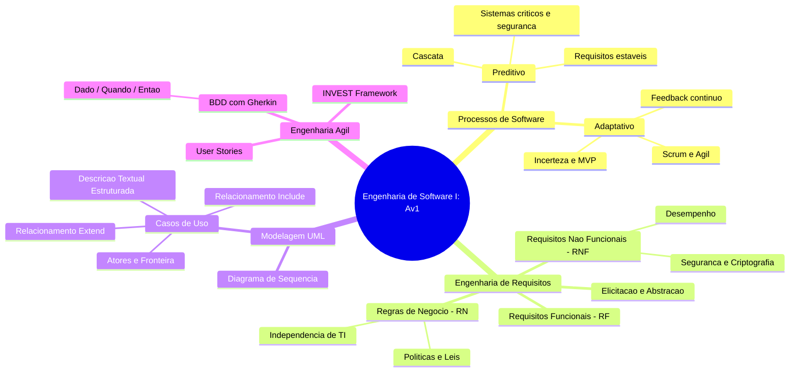

---

## Glossário

| Termo | Definição Formal na Engenharia de Software |
| :--- | :--- |
| **Ator (UML)** | Entidade externa ao sistema (usuário humano, periférico ou outro software) que interage ativamente com os casos de uso. |
| **BDD (Behavior-Driven Development)** | Técnica ágil de design e validação de requisitos guiada por cenários de comportamento expressos em linguagem natural estruturada. |
| **Caso de Uso (Use Case)** | Especificação de uma sequência de ações realizadas pelo sistema que rende um resultado observável de valor para um ator específico. |
| **Critérios INVEST** | Acrônimo mnemônico (Independent, Negotiable, Valuable, Estimable, Small, Testable) que audita a qualidade de Histórias de Usuário. |
| **Crise do Software** | Período histórico (década de 1960) marcado por atrasos recorrentes, custos astronômicos e baixa confiabilidade dos sistemas computacionais. |
| **Fronteira do Sistema (Boundary)** | Linha divisória conceitual que separa o que faz parte do software a ser construído do ambiente externo onde vivem os atores. |
| **Gherkin** | Sintaxe padronizada legível por humanos baseada em palavras-chave (`Dado`, `Quando`, `Então`) para formalizar cenários executáveis de teste. |
| **História de Usuário (User Story)** | Declaração leve e centrada no usuário expressando uma funcionalidade desejada a partir de sua persona, ação e benefício de negócio. |
| **Modelo em Cascata (Waterfall)** | Ciclo de vida preditivo sequencial onde cada fase (requisitos, análise, projeto, código, testes) depende da conclusão da anterior. |
| **MVP (Minimum Viable Product)** | Versão mais enxuta e funcional de um produto digital lançada para validar hipóteses de mercado com usuários reais com o menor esforço. |
| **Ponto de Extensão (Extension Point)** | Local formalmente identificado dentro de um caso de uso base onde um comportamento condicional (`<<extend>>`) pode ser inserido. |
| **Regra de Negócio (RN)** | Política corporativa, lei, restrição ou cálculo de domínio que existe independentemente de o sistema ser automatizado. |
| **Relacionamento `<<extend>>`** | Dependência em UML que indica que um caso de uso condicional pode adicionar comportamento a um caso de uso base autossuficiente. |
| **Relacionamento `<<include>>`** | Dependência em UML que indica que um caso de uso base obrigatoriamente incorpora o comportamento de outro caso de uso para concluir seu fluxo. |
| **Requisito Funcional (RF)** | Declaração técnica de um serviço, cálculo, comportamento ou transformação que o software deve ser capaz de executar. |
| **Requisito Não-Funcional (RNF)** | Restrição qualitativa, métrica de desempenho, padrão de arquitetura ou requisito de segurança imposto sobre a operação do sistema. |
| **Scrum** | Framework ágil iterativo e incremental projetado para gerenciar o desenvolvimento de produtos complexos em ambientes voláteis. |
| **Sprint** | Ciclo fixo de tempo (timebox), geralmente de 1 a 4 semanas, no qual a equipe constrói um incremento pronto e testado de software. |

---

## Pontos-chave para a prova

Para maximizar a pontuação na prova presencial do Prof. Marcelo Boer, atente-se às seguintes distinções conceituais e armadilhas frequentes de prova:

1. **A Inversão de Setas em Diagramas de Casos de Uso**:
   - **Erro mais comum de prova**: Desenhar a seta do `<<extend>>` apontando do caso de uso base para o caso de uso extensor.
   - **Regra correta**: No `<<extend>>`, a seta **sempre aponta da extensão para o caso base** (`Extensor --> Base`). A extensão "enxerga" a base através do ponto de extensão, mas a base desconhece quem a estende.
   - No `<<include>>`, a seta aponta da base para o incluído (`Base --> Incluído`), pois a base depende ativamente daquele comportamento para se completar.

2. **Diferenciação Estrita entre RNF e Regra de Negócio**:
   - Lembre-se sempre do "Teste do Papel e Caneta": Se o hospital fechar toda a infraestrutura computacional e operar com atendentes preenchendo formulários impressos, a regra de cancelamento em 24 horas continua existindo? **Sim**. Logo, é **Regra de Negócio (RN)**.
   - A exigência de tempo de resposta em menos de 2 segundos continua existindo sem o computador? **Não**, pois humanos não têm clock de hardware. Logo, é **Requisito Não-Funcional (RNF)**.

3. **Atores dentro da Fronteira do Sistema**:
   - É expressamente proibido colocar bonecos palito (atores) desenhados dentro da caixa do limite do sistema. Atores são elementos externos ao software. Se uma entidade processa dados dentro do sistema, ela é um módulo, classe ou processo interno, não um Ator.

4. **Confundir História de Usuário com Tarefa Técnica**:
   - *História inválida*: "Como desenvolvedor, eu quero criar a tabela de banco de dados com chave estrangeira para poder salvar cupons." (Isso é uma tarefa técnica de engenharia, não uma história de usuário).
   - *História válida*: "Como comprador, eu quero aplicar um cupom no carrinho para economizar no pedido." (Possui persona de negócio, intenção e valor tangível).

5. **Atores Não-Humanos e Sistemas Externos**:
   - Sistemas externos que trocam informações com o software modelado (ex.: Gateway de SMS, API de Pagamento da Cielo, Webservice da Receita Federal) **são Atores**. Devem ser modelados fora da fronteira do sistema e vinculados aos casos de uso que acionam ou que são acionados por eles.

---

## Perguntas e respostas (JSONL)

```jsonl
{"pergunta": "Qual foi a definicao historica da chamada Crise do Software na Conferencia da OTAN em 1968?", "resposta": "O cenario em que a velocidade de evolucao do hardware superou a capacidade metodologica de construir softwares com custo previsivel, prazos aceitaveis e qualidade confiavel.", "dificuldade": "facil"}
{"pergunta": "Em qual situacao pratica de engenharia o Modelo em Cascata e mais indicado do que uma abordagem agil?", "resposta": "Em sistemas criticos de seguranca (safety-critical) com requisitos altamente estaveis, predefinidos e exigencias rigorosas de conformidade regulatoria formal.", "dificuldade": "media"}
{"pergunta": "O que caracteriza fundamentalmente uma Regra de Negocio em contraste com um Requisito Funcional?", "resposta": "A Regra de Negocio e uma diretriz, politica corporativa ou lei do dominio que existe de forma autonoma, independentemente da existencia de automacao por software.", "dificuldade": "facil"}
{"pergunta": "Qual o significado da letra 'I' na sigla de qualidade INVEST para Historias de Usuario?", "resposta": "Independent (Independente): a historia deve ser desacoplada de outras historias, podendo ser desenvolvida, testada e entregue isoladamente.", "dificuldade": "facil"}
{"pergunta": "Qual o sentido correto da seta tracejada no relacionamento <<extend>> entre Casos de Uso na notacao UML?", "resposta": "A seta aponta do caso de uso extensor (que contem o comportamento condicional) em direcao ao caso de uso base.", "dificuldade": "media"}
{"pergunta": "Por que o relacionamento <<include>> e classificado como mandatario na execucao do caso de uso base?", "resposta": "Porque o caso de uso base e semanticamente incompleto por si so e depende obrigatoriamente da execucao do caso de uso incluido para cumprir sua pos-condicao.", "dificuldade": "media"}
{"pergunta": "Em BDD, quais sao as tres palavras-chave centrais utilizadas na formulacao de cenarios de teste em Gherkin?", "resposta": "Dado que (contexto inicial), Quando (acao ou evento desencadeador) e Entao (resultado esperado e mensuravel).", "dificuldade": "facil"}
{"pergunta": "Por que a declaracao 'O sistema deve ser facil de usar' nao e considerada um Requisito Nao-Funcional valido?", "resposta": "Porque e subjetiva, ambigua e nao verificavel; requisitos nao funcionais exigem metricas quantitativas objetivas para serem testados.", "dificuldade": "media"}
{"pergunta": "Qual o papel do Ponto de Extensao (Extension Point) na semantica do relacionamento <<extend>>?", "resposta": "E o local formalmente declarado no fluxo do caso de uso base onde o comportamento adicional do caso estendido pode ser inserido caso a condicao se cumpra.", "dificuldade": "dificil"}
{"pergunta": "Como se comporta o gerenciamento de mudancas de escopo dentro do framework Scrum?", "resposta": "O escopo da Sprint atual permanece estavel para foco da equipe, mas o Product Backlog pode ser livremente repriorizado pelo Product Owner entre Sprints.", "dificuldade": "media"}
{"pergunta": "Qual e a definicao formal de Requisito Nao-Funcional segundo a engenharia de software?", "resposta": "E uma restricao de qualidade, desempenho, seguranca, usabilidade ou arquitetura imposta sobre como os servicos e funcionalidades do sistema devem operar.", "dificuldade": "facil"}
{"pergunta": "O que e um Ator no contexto do Diagrama de Casos de Uso da UML e onde ele deve ser posicionado?", "resposta": "E qualquer entidade externa (humano, hardware ou sistema terceiro) que interage com o sistema; deve ser posicionado sempre fora da fronteira do sistema.", "dificuldade": "facil"}
{"pergunta": "Por que sistemas embarcados automotivos exigem requisitos formalmente validados antes da codificacao?", "resposta": "Porque falhas colocam vidas humanas em risco e recalls fisicos de firmware em veiculos comerciais tem custos logisticos e financeiros quase proibitivos.", "dificuldade": "dificil"}
{"pergunta": "Como a aplicacao dos criterios INVEST combate o desperdicio Lean de 'Superproducao' em equipes de desenvolvimento?", "resposta": "Ao exigir que toda historia seja Valiosa (Valuable), garante-se que a engenharia so construa itens que tragam retorno direto e comprovado de negocio.", "dificuldade": "dificil"}
{"pergunta": "O que estabelece a pre-condicao de um Caso de Uso estruturado?", "resposta": "E o estado obrigatorio no qual o sistema e o ambiente devem se encontrar antes que o caso de uso possa iniciar sua execucao.", "dificuldade": "facil"}
{"pergunta": "Qual e o principal artefato gerado ao final de cada Sprint em um processo Scrum?", "resposta": "Um incremento de produto potencialmente utilizavel (Potentially Shippable Product Increment) testado e integrado.", "dificuldade": "facil"}
{"pergunta": "Em qual etapa da Engenharia de Requisitos ocorre a conciliacao formal de interesses divergentes entre stakeholders?", "resposta": "Na etapa de Analise e Negociacao de Requisitos.", "dificuldade": "media"}
{"pergunta": "Por que um sistema externo como um Gateway de Pagamentos deve ser modelado como Ator em um diagrama de Casos de Uso?", "resposta": "Porque ele existe fora da fronteira do software em desenvolvimento e atua trocando mensagens e estendendo/complementando servicos com o sistema.", "dificuldade": "media"}
{"pergunta": "Qual a diferenca fundamental entre o fluxo principal e os fluxos alternativos em uma especificacao de Caso de Uso?", "resposta": "O fluxo principal descreve o caminho de sucesso ideal (caminho feliz), enquanto os fluxos alternativos descrevem caminhos opcionais ou recuperacoes de excecoes.", "dificuldade": "facil"}
{"pergunta": "Como a rastreabilidade bidirecional auxilia na manutencao de longo prazo de um sistema corporativo?", "resposta": "Permite rastrear o impacto de uma mudanca de requisito no codigo e nos testes, e identificar qual regra de negocio originou determinada funcao no sistema.", "dificuldade": "dificil"}
```

---

## Checklist de revisão

Utilize esta lista de verificação para guiar seus estudos finais e auditar suas entregas antes do fechamento do prazo da atividade e da realização da prova presencial:

- [ ] **Compreensão Histórica e Metodológica**:
  - [ ] Sei explicar as causas técnicas que levaram à Crise do Software em 1968.
  - [ ] Consigo demonstrar as diferenças conceituais entre o triângulo de ferro tradicional (escopo fixo) e o ágil (valor fixo).
- [ ] **Engenharia e Classificação de Requisitos**:
  - [ ] Sei diferenciar com clareza matemática um Requisito Funcional (RF) de um Requisito Não-Funcional (RNF).
  - [ ] Sei aplicar o teste conceitual do "papel e caneta" para isolar Regras de Negócio (RN) de implementações de software.
  - [ ] Não utilizo adjetivos vagos ou imensuráveis ao redigir requisitos de desempenho e qualidade.
- [ ] **Modelagem Estruturada com UML**:
  - [ ] Conheço a sintaxe correta do Diagrama de Casos de Uso segundo o padrão OMG.
  - [ ] Entendi perfeitamente que o relacionamento `<<include>>` é mandatário e que a seta aponta da base para o incluído.
  - [ ] Entendi que o relacionamento `<<extend>>` é condicional e que a seta aponta da extensão para o caso de uso base.
  - [ ] Posiciono todos os Atores (humanos e sistemas externos integrados) estritamente do lado de fora da fronteira do sistema.
  - [ ] Sei redigir a especificação textual completa de um Caso de Uso contendo atores, pré/pós-condições, fluxo básico e fluxos de exceção.
- [ ] **Práticas de Engenharia Ágil**:
  - [ ] Sei formular Histórias de Usuário completas no padrão *Como [persona], Eu quero [ação], Para que [valor]*.
  - [ ] Domino a escrita de Critérios de Aceitação utilizando o padrão BDD Gherkin (*Dado / Quando / Então*).
  - [ ] Sei auditar e justificar a maturidade de uma história com base em cada letra do acrônimo INVEST.
- [ ] **Preparação Operacional para a Avaliação Av1**:
  - [ ] Revisei as anotações e exercícios práticos das Aulas 01 a 06 do Prof. Marcelo Boer.
  - [ ] Pratiquei a construção de diagramas no software Astah UML configurado com licença acadêmica ativa.
  - [ ] Realizei a autoavaliação respondendo a todas as 20 questões do bloco de Perguntas e Respostas.

## Código prático de apoio

Implementações em Java que tornam executáveis os conceitos desta unidade:

- [`SistemaBibliotecaEmprestimo.java`](codigo/SistemaBibliotecaEmprestimo.java)
- [`CheckoutBddInvestRunner.java`](codigo/CheckoutBddInvestRunner.java)
- [`ClassificacaoRequisitosEngine.java`](codigo/ClassificacaoRequisitosEngine.java)
