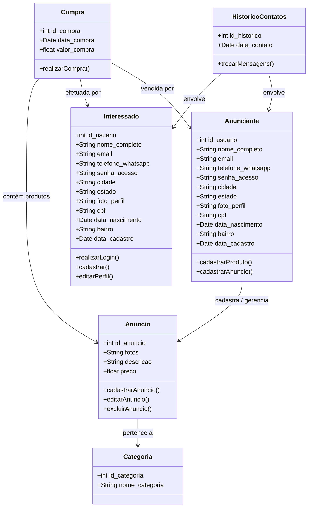

# 🎓 Prof. Marcelo Boer - Engenharia de Software I
> **Semestre:** 3º Semestre | UniFEF  
> **Professor Responsável:** Prof. Esp. Marcelo Tadeu Boer  
> **Projeto Base:** Aplicativo Móvel **Desapega Já**

---

## 🎯 Objetivos de Aprendizagem e Ementa

A disciplina de **Engenharia de Software I** tem como objetivo capacitar o aluno nos fundamentos do ciclo de vida de desenvolvimento de sistemas (SDLC), aplicando técnicas de Engenharia e Modelagem de Software orientadas à prática de mercado. 

### Ementa e Tópicos Abordados:
1. **Introdução aos Processos de Software:** Estudo comparativo e apresentação de Modelos de Processos de Desenvolvimento (Cascata, Ágil, Scrum, RUP, etc.).
2. **Engenharia de Requisitos:** Levantamento, especificação e classificação de Requisitos Funcionais e Não-Funcionais através do contexto de aplicações reais (*Desapega Já*).
3. **Análise Orientada a Objetos (UML):**
   * Diagrama de Classes (Atributos, Associações e Entidades).
   * Diagrama de Casos de Uso (Atores Primários, Fluxos Normais e Alternativos).
   * Descrição Detalhada de Casos de Uso (Quadros de Especificação: Logar, Cadastrar, Listar, Carregar, Alterar, Excluir).
4. **Ferramentas de Modelagem:** Utilização prática do *Astah UML* para desenho de diagramas padronizados.

---

## 🏗️ Modelagem do Conhecimento

Abaixo está representado o Diagrama de Classes conceitual estruturado para o aplicativo **Desapega Já**, contemplando as entidades centrais mapeadas no processo de abstração da disciplina:



---

## 📂 Estrutura de Pastas

O repositório está organizado de forma modular para acompanhar o cronograma de entregas (AV1 e AV2) e os artefatos desenvolvidos em sala de aula com o Prof. Marcelo Boer:

```text
📦 Engenharia-de-Software-I-UniFEF
 ┣ 📂 01-Aulas-e-Contextos
 ┃ ┣ 📜 2026-02-24 - Contexto do Aplicativo.md
 ┃ ┣ 📜 2026-02-24 - Documento ESM1.md
 ┃ ┣ 📜 2026-03-03 - Licenca Astah UML.md
 ┃ ┗ 📜 2026-05-12 - Documento de Aula.md
 ┣ 📂 02-Revisioes-e-Avaliacoes
 ┃ ┣ 📜 2026-03-24 - Forms de Revisao AV1.md
 ┃ ┗ 📜 links-recursos.md
 ┣ 📂 03-Trabalhos-e-Apresentacoes
 ┃ ┣ 📜 2026-03-31 - Apresentacao Metodos de Engenharia de Software.md
 ┃ ┣ 📜 2026-06-09 - Modelo de Apresentacao AV2.md
 ┃ ┗ 📂 apresentacao_processos_software/
 ┣ 📂 04-Documentacao-Sistema (Desapega Já)
 ┃ ┣ 📜 ENGENHARIA E MODELAGEM DE SOFTWARE I.md (docx/pdf)
 ┃ ┣ 📜 Exemplo Descrição de Caso de Uso.md
 ┃ ┗ 📜 ModeloEntregaAv2Final.md
 ┗ 📜 README.md
```

---

## 🚀 Guia de Estudos

Para obter sucesso na disciplina ministrada pelo **Prof. Marcelo Boer**, siga o roteiro de estudos recomendado:

1. **Compreensão do Domínio do Problema:**
   * Leia atentamente o documento do **Contexto I: Aplicativo Móvel Desapega Já**. Entenda o modelo de negócio voltado à economia colaborativa, reutilização e consumo consciente.
2. **Levantamento de Requisitos:**
   * Analise a diferença entre **Requisitos Funcionais** (ex: cadastro de produtos, busca por proximidade, troca de mensagens) e **Requisitos Não-Funcionais** (ex: fácil usabilidade, segurança, integridade de dados).
3. **Modelagem UML Prática:**
   * Utilize a licença do **Astah UML** fornecida nas aulas para desenhar Diagramas de Classes, Diagramas de Atores e Diagramas de Casos de Uso (DCU).
   * Treine a escrita dos quadros de especificação de Casos de Uso cobrindo os métodos fundamentais solicitados em laboratório: **Logar, Cadastrar, Listar, Carregar, Alterar e Excluir**.
4. **Avaliações (AV1 & AV2):**
   * Responda aos questionários de revisão disponibilizados via Google Forms (*ver seção de links e revisões*).
   * Siga rigorosamente o template do documento `ModeloEntregaAv2Final.docx` para a elaboração e formatação da entrega final do projeto prático.