# Manual Integrado de Engenharia de Software I: Fundamentos, Requisitos, Processos e Modelagem Orientada a Objetos

> **Instituição:** Fundação Educacional de Fernandópolis (UniFEF)  
> **Curso:** Bacharelado em Sistemas de Informação (3º Semestre)  
> **Disciplina:** Engenharia de Software I  
> **Docente Responsável:** Prof. Marcelo Boer  
> **Finalidade:** Compêndio de estudos teóricos, modelagem prática e preparação técnica para as avaliações bimestrais (AV1 e AV2) e atividades laboratoriais.

---

## Sumário

- [1. Fundamentos da Engenharia de Software e o Processo de Abstração](#1-fundamentos-da-engenharia-de-software-e-o-processo-de-abstração)
  - [1.1 Definição formal e motivação cognitiva](#11-definição-formal-e-motivação-cognitiva)
  - [1.2 Espaço do Problema versus Espaço da Solução](#12-espaço-do-problema-versus-espaço-da-solução)
  - [1.3 Níveis de abstração e filtragem de ruído](#13-níveis-de-abstração-e-filtragem-de-ruído)
  - [1.4 Vazamento de abstração (Leaky Abstraction)](#14-vazamento-de-abstração-leaky-abstraction)
  - [1.5 Exemplos, contraexemplos e armadilhas conceituais](#15-exemplos-contraexemplos-e-armadilhas-conceituais)
- [2. Engenharia de Requisitos: Elicitação, Classificação e Rastreabilidade](#2-engenharia-de-requisitos-elicitação-classificação-e-rastreabilidade)
  - [2.1 Requisitos Funcionais versus Requisitos Não Funcionais](#21-requisitos-funcionais-versus-requisitos-não-funcionais)
  - [2.2 Estabilidade de requisitos: Permanentes versus Voláteis](#22-estabilidade-de-requisitos-permanentes-versus-voláteis)
  - [2.3 Critérios de qualidade e padronização formal](#23-critérios-de-qualidade-e-padronização-formal)
  - [2.4 Fontes de informação e partes interessadas (Stakeholders)](#24-fontes-de-informação-e-partes-interessadas-stakeholders)
  - [2.5 Técnicas de coleta de dados e elicitação](#25-técnicas-de-coleta-de-dados-e-elicitação)
  - [2.6 Técnicas de observação e testes de usabilidade](#26-técnicas-de-observação-e-testes-de-usabilidade)
  - [2.7 Métricas e quantificação de Requisitos Não Funcionais](#27-métricas-e-quantificação-de-requisitos-não-funcionais)
- [3. Modelos de Ciclo de Vida e Processos de Desenvolvimento de Software](#3-modelos-de-ciclo-de-vida-e-processos-de-desenvolvimento-de-software)
  - [3.1 Conceito de processo e atividades fundamentais](#31-conceito-de-processo-e-atividades-fundamentais)
  - [3.2 Modelos Prescritivos Lineares: Cascata e Modelo V](#32-modelos-prescritivos-lineares-cascata-e-modelo-v)
  - [3.3 Modelos Evolutivos e Iterativos: Prototipação e Incremental](#33-modelos-evolutivos-e-iterativos-prototipação-e-incremental)
  - [3.4 Modelo Espiral de Barry Boehm e Condução por Riscos](#34-modelo-espiral-de-barry-boehm-e-condução-por-riscos)
  - [3.5 O Processo Unificado e o RUP (Rational Unified Process)](#35-o-processo-unificado-e-o-rup-rational-unified-process)
  - [3.6 Paradigma Ágil versus Prescritivo: Scrum, XP e Kanban](#36-paradigma-ágil-versus-prescritivo-scrum-xp-e-kanban)
  - [3.7 Matriz de decisão multicritério para seleção de processos](#37-matriz-de-decisão-multicritério-para-seleção-de-processos)
- [4. Ferramentas CASE e Modelagem Semântica com Astah UML](#4-ferramentas-case-e-modelagem-semântica-com-astah-uml)
  - [4.1 Taxonomia das ferramentas CASE](#41-taxonomia-das-ferramentas-case)
  - [4.2 Desenho gráfico vetorial versus Modelagem semântica formal](#42-desenho-gráfico-vetorial-versus-modelagem-semântica-formal)
  - [4.3 Arquitetura de software do Astah UML e persistência (.asta)](#43-arquitetura-de-software-do-astah-uml-e-persistência-asta)
  - [4.4 Mecanismo de licenciamento acadêmico em XML com criptografia assimétrica](#44-mecanismo-de-licenciamento-acadêmico-em-xml-com-criptografia-assimétrica)
- [5. Modelagem Comportamental: Atores e Casos de Uso](#5-modelagem-comportamental-atores-e-casos-de-uso)
  - [5.1 Conceito formal de Ator na UML](#51-conceito-formal-de-ator-na-uml)
  - [5.2 Taxonomia e relacionamentos entre atores](#52-taxonomia-e-relacionamentos-entre-atores)
  - [5.3 Diagrama de Casos de Uso e fronteiras modulares](#53-diagrama-de-casos-de-uso-e-fronteiras-modulares)
  - [5.4 Estrutura padronizada do Quadro de Descrição de Caso de Uso (DCU)](#54-estrutura-padronizada-do-quadro-de-descrição-de-caso-de-uso-dcu)
  - [5.5 Regras de formulação de pré-requisitos e fluxos](#55-regras-de-formulação-de-pré-requisitos-e-fluxos)
- [6. Modelagem Estrutural: Análise Orientada a Objetos e Diagrama de Classes](#6-modelagem-estrutural-análise-orientada-a-objetos-e-diagrama-de-classes)
  - [6.1 Extração léxica de classes de domínio (Regra de Abbott)](#61-extração-léxica-de-classes-de-domínio-regra-de-abbott)
  - [6.2 Princípios de modelagem na Fase de Análise](#62-princípios-de-modelagem-na-fase-de-análise)
  - [6.3 Relacionamentos estruturais: Associação, Agregação e Composição](#63-relacionamentos-estruturais-associação-agregação-e-composição)
  - [6.4 Multiplicidades e regras de integridade referencial](#64-multiplicidades-e-regras-de-integridade-referencial)
  - [6.5 Generalização versus Papéis contextuais (Eliminação de redundância)](#65-generalização-versus-papéis-contextuais-eliminação-de-redundância)
- [7. Padrão Arquitetural e Documental da Fase de Análise (UniFEF / AV2)](#7-padrão-arquitetural-e-documental-da-fase-de-análise-unifef--av2)
  - [7.1 Estrutura do documento técnico formal de entrega](#71-estrutura-do-documento-técnico-formal-de-entrega)
  - [7.2 Dicionário padronizado de mensagens de sistema (MSG01 a MSG12)](#72-dicionário-padronizado-de-mensagens-de-sistema-msg01-a-msg12)
  - [7.3 Especificações detalhadas dos casos de uso canônicos](#73-especificações-detalhadas-dos-casos-de-uso-canônicos)
- [8. Estudos de Caso Integrados da Disciplina](#8-estudos-de-caso-integrados-da-disciplina)
  - [8.1 Estudo de Caso 1: Aplicativo Desapega Já](#81-estudo-de-caso-1-aplicativo-desapega-já)
  - [8.2 Estudo de Caso 2: Sistema SCAESM (Módulo Pessoa Funcionário)](#82-estudo-de-caso-2-sistema-scaesm-módulo-pessoa-funcionário)
  - [8.3 Estudo de Caso 3: Açaiteria Sabor da Amazônia](#83-estudo-de-caso-3-açaiteria-sabor-da-amazônia)
- [9. Manutenção e Evolução de Software](#9-manutenção-e-evolução-de-software)
  - [9.1 As quatro categorias formais de manutenção](#91-as-quatro-categorias-formais-de-manutenção)
  - [9.2 Distribuição do esforço no ciclo de sustentação](#92-distribuição-do-esforço-no-ciclo-de-sustentação)
- [10. Banco Exaustivo de Questões, Exercícios Resolvidos e Simulado](#10-banco-exaustivo-de-questões-exercícios-resolvidos-e-simulado)
  - [10.1 Questões analítico-discursivas com resolução comentada](#101-questões-analítico-discursivas-com-resolução-comentada)
  - [10.2 Questões de múltipla escolha com justificativa analítica](#102-questões-de-múltipla-escolha-com-justificativa-analítica)
  - [10.3 Perguntas e Respostas em Formato Estruturado (JSONL)](#103-perguntas-e-respostas-em-formato-estruturado-jsonl)
  - [10.4 Checklist de revisão e critérios de aprovação](#104-checklist-de-revisão-e-critérios-de-aprovação)

---

## 1. Fundamentos da Engenharia de Software e o Processo de Abstração

### 1.1 Definição formal e motivação cognitiva

A **abstração** constitui o mecanismo cognitivo fundamental da Engenharia de Software para gerenciar a complexidade intelectual inerente aos problemas do mundo real. Ela consiste no ato deliberado de isolar e reter os aspectos essenciais, invariantes e relevantes de um fenômeno, entidade ou processo de negócio, descartando intencionalmente os detalhes acidentais, periféricos ou secundários que não exercem influência sobre os objetivos do software sob análise.

A motivação científica da abstração apoia-se na psicologia cognitiva, notadamente na **Lei de Miller** (1956), que estabelece os limites da capacidade de processamento imediato da memória de trabalho humana em aproximadamente $7 \pm 2$ blocos de informação (*chunks*). O universo físico apresenta dimensões contínuas e detalhes praticamente infinitos. Sem a aplicação do filtro de abstração, a sobrecarga cognitiva inviabilizaria qualquer tentativa de transpor requisitos de negócio para sistemas computacionais determinísticos.

Construir software não significa reproduzir uma cópia mimética da realidade física, mas conceber um **modelo computacional**. Um modelo é, por definição epistêmica, uma abstração representacional criada com um propósito operativo específico.

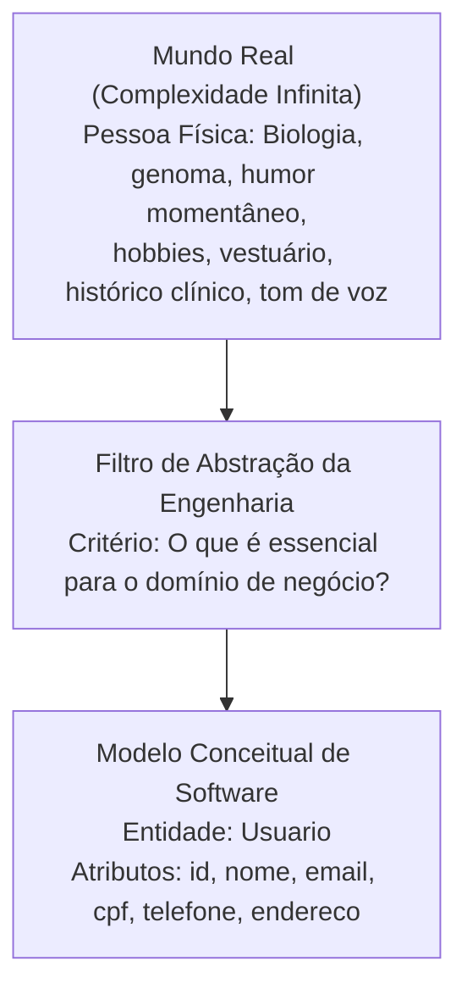

### 1.2 Espaço do Problema versus Espaço da Solução

A engenharia de software delimita duas fronteiras conceituais rigorosamente distintas ao longo do Ciclo de Vida de Desenvolvimento de Sistemas (SDLC):

1. **Espaço do Problema (Fase de Análise):**
   - **Foco:** Compreender a dor operacional, as necessidades dos clientes e as regras que regem o negócio.
   - **Pergunta norteadora:** *O que* o sistema deve realizar para resolver o problema?
   - **Vocabulário:** Linguagem do domínio da aplicação, conceitos do negócio e termos familiares aos usuários (ex.: *Pedido*, *Fidelidade*, *Anúncio*, *Taxa de Entrega*).
   - **Independência tecnológica:** Absoluta. As regras de negócio existem independentemente de o sistema ser codificado em Java, C# ou Python, ou persistido em PostgreSQL ou MongoDB.

2. **Espaço da Solução (Fase de Projeto / Design e Implementação):**
   - **Foco:** Projetar os mecanismos técnicos, a infraestrutura e os algoritmos capazes de viabilizar o comportamento especificado na análise.
   - **Pergunta norteadora:** *Como* o software executará computacionalmente as tarefas exigidas?
   - **Vocabulário:** Jargão técnico e computacional (ex.: *Controllers*, *Data Access Objects - DAO*, *Design Patterns*, *Foreign Keys*, *Sockets*, *Threads*, *HTTP Status Code*).
   - **Dependência tecnológica:** Alta. Decisões vinculadas a frameworks, bibliotecas, limitações de hardware e latência de rede.

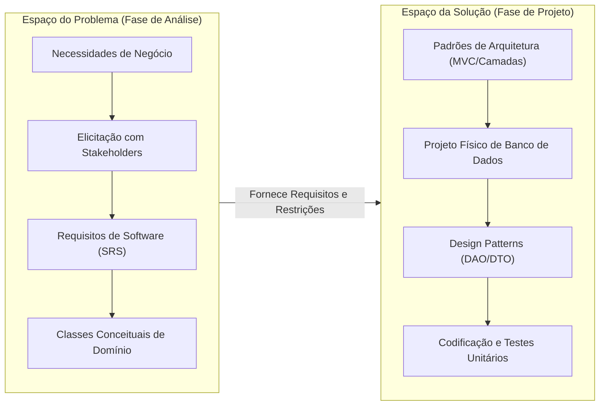

### 1.3 Níveis de abstração e filtragem de ruído

A modelagem de sistemas articula-se em três níveis hierárquicos de abstração:

1. **Nível Conceitual (Alto Nível):** Mapeia as entidades do mundo real e seus comportamentos sob a ótica pura do negócio. Modela o fluxo de valor sem alusão a telas ou estruturas de dados computacionais.
2. **Nível Lógico (Médio Nível):** Estrutura as entidades conceituais em esquemas formais de engenharia de software (como o Diagrama de Classes de Análise da UML e Diagramas de Entidade-Relacionamento lógicos). As classes possuem atributos tipados abstratamente e associações com multiplicidades formais, mas sem código-fonte.
3. **Nível Físico (Baixo Nível):** Detalha a implementação direta no hardware e no ambiente de execução (DDL de tabelas SQL, alocação de memória heap, protocolos de transporte e classes de persistência).

| Critério Comparativo | Nível Conceitual | Nível Lógico | Nível Físico |
| :--- | :--- | :--- | :--- |
| **Pergunta Central** | O que o negócio requer? | Como a lógica se estrutura? | Como o computador executa? |
| **Artefatos Gerados** | Documento de Visão, Casos de Uso | Diagramas UML, DER Lógico | Código-fonte, DDL SQL, Scripts |
| **Público Principal** | Stakeholders, Analistas de Negócio | Arquitetos, Engenheiros de Software | Desenvolvedores, DBAs, DevOps |
| **Amarração Tecnológica** | Inexistente (Agnóstica) | Neutra (Baseada em normas OMG/ISO) | Concreta (PostgreSQL, Java, Linux) |

### 1.4 Vazamento de abstração (Leaky Abstraction)

Formalizado por Joel Spolsky, o fenômeno do **vazamento de abstração** (*Leaky Abstraction*) ocorre quando detalhes de implementação de baixo nível "vazam" através das camadas superiores de abstração, forçando o projetista ou usuário do modelo a lidar com aspectos que deveriam estar ocultos.

Na fase de análise, o vazamento de abstração manifesta-se quando um engenheiro introduz restrições técnicas prematuras na especificação de requisitos ou no diagrama conceitual. Exemplos clássicos:
- Declarar atributos com limitações de tipos nativos de um banco específico (ex.: nomear um atributo conceitual como `varchar2_50` em vez de `Texto`).
- Criar casos de uso acoplados à topologia de rede (ex.: "Caso de Uso: Executar Conexão TCP/IP com Porta 5432" em vez de "Caso de Uso: Realizar Login").

A Lei das Abstrações Vazadas sintetiza: *"Todas as abstrações não triviais, em algum grau, apresentam vazamentos"*. O papel do engenheiro de software é mitigar esse vazamento na modelagem conceitual para evitar o engessamento precoce da arquitetura.

### 1.5 Exemplos, contraexemplos e armadilhas conceituais

- **Exemplo Adequado:** No sistema de classificados *Desapega Já*, para cadastrar uma pessoa que deseja comprar itens usados, a entidade `Usuario` precisa conter: `nomeCompleto`, `email`, `telefone`, `cpf`, `cidade`, `estado` e `bairro`. Esses dados viabilizam autenticação, contato e cálculo de proximidade geográfica.
- **Contraexemplo (Superespecificação / Excesso de Ruído):** O analista adiciona à entidade `Usuario`: tipo sanguíneo, número do calçado, filiação materna, marca do automóvel e frequência cardíaca média. Embora pertençam ao indivíduo real, são dados irrelevantes para o negócio de classificados hiperlocais, violando a Lei Geral de Proteção de Dados (LGPD) e encarecendo a infraestrutura.
- **Contraexemplo (Subespecificação / Omissão Crítica):** O analista define que o produto anunciado possui apenas `id`, `titulo` e `preco`. Ele esquece de abstrair o `bairro` do anúncio e as `fotos`. Sem o bairro, o sistema não calcula proximidade; sem as fotos, a taxa de conversão comercial cai a zero, inviabilizando a aplicação.
- **Armadilha Frequente:** Confundir abstração com ocultação de código (*information hiding*). Na disciplina de Engenharia de Software I, a abstração é a decisão analítica de **o que entra e o que fica de fora** do escopo do software antes do início do desenvolvimento.

A tabela a seguir evidencia a relatividade do processo de abstração: a mesma entidade do mundo real gera modelos substancialmente distintos dependendo da finalidade do sistema:

| Entidade Real | Contexto: Desapega Já (Classificados) | Contexto: Hospital Municipal | Contexto: Folha de Pagamento (RH) |
| :--- | :--- | :--- | :--- |
| **Pessoa Física** | `nome`, `email`, `whatsapp`, `cidade`, `bairro`, `avaliacaoReputacao` | `prontuario`, `tipoSanguineo`, `alergias`, `peso`, `historicoClinico` | `ctps`, `salarioBase`, `cargo`, `dependentesIR`, `dadosBancarios` |
| **Móvel (Sofá)** | `categoria`, `fotos`, `precoVenda`, `estadoConservacao`, `descricao` | `codigoPatrimonio`, `setorAlocado`, `dataUltimaDesinfeccao` | `registroAtivoFixo`, `taxaDepreciacao`, `notaFiscalCompra` |

---

## 2. Engenharia de Requisitos: Elicitação, Classificação e Rastreabilidade

### 2.1 Requisitos Funcionais versus Requisitos Não Funcionais

Um **requisito de software** é a declaração formal de um serviço que o sistema deve fornecer ou de uma restrição técnica/qualitativa sob a qual deve operar. A Engenharia de Requisitos segrega essas declarações em dois universos axiais:

1. **Requisitos Funcionais (RF):**
   - Expressam **o que** o software faz.
   - Especificam comportamentos operacionais diretos, transformações de entradas em saídas, regras de cálculo, emissão de relatórios, persistência de registros e fluxos de navegação.
   - Possuem escopo tipicamente localizado em módulos, tabelas ou casos de uso específicos.
   - *Critério de falha:* O software não realiza a ação requisitada (ex.: o botão de cadastro não grava os dados no banco).

2. **Requisitos Não Funcionais (RNF):**
   - Expressam **como** ou **sob quais restrições** o sistema opera.
   - Definem propriedades emergentes de qualidade arquitetural, limitações de hardware, normas de conformidade legal, padrões de usabilidade, limites de desempenho e segurança da informação.
   - Possuem escopo sistêmico/pervasivo: afetam a totalidade do software ou sua infraestrutura global.
   - *Critério de falha:* O software realiza a ação funcional, mas viola a restrição estipulada (ex.: o sistema cadastra o cliente, mas leva 45 segundos para responder, travando o banco de dados).

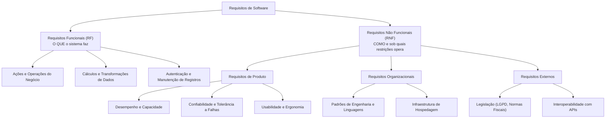

### 2.2 Estabilidade de requisitos: Permanentes versus Voláteis

Na taxonomia formal consolidada por Ian Sommerville, os requisitos são categorizados quanto à sua taxa de mutabilidade ao longo do tempo:

1. **Requisitos Permanentes (Estáveis):** 
   - Estão ancorados no núcleo inviolável do domínio de negócio da organização.
   - Não se alteram com facilidade, pois derivam de regras estruturantes da atividade econômica (ex.: cálculo de juros e partidas dobradas em bancos; apuração de impostos em notas fiscais; cálculo do valor total em uma açaiteria).
2. **Requisitos Voláteis (Mutáveis):**
   - Estão sujeitos a constantes alterações e revisões durante o desenvolvimento e após a entrada em produção.
   - Decorrem de mudanças táticas na gestão, pressão concorrencial de mercado, novas leis ou preferências estéticas e comportamentais dos usuários (ex.: layout de dashboards, suporte a novos formatos de pagamento como PIX por aproximação, campanhas promocionais dinâmicas).

> **Atenção para a prova:** É armadilha clássica de enunciados de concursos e exames afirmar que "requisitos permanentes são aqueles propensos a mudanças frequentes durante o processo de desenvolvimento". Requisitos que mudam com frequência são **voláteis**. Requisitos permanentes mantêm-se estáveis ao longo do ciclo de vida.

### 2.3 Critérios de qualidade e padronização formal

Conforme as normas internacionais **IEEE 830** (Recommended Practice for Software Requirements Specifications) e **ISO/IEC/IEEE 29148** (Systems and software engineering — Life cycle processes — Requirements engineering), declarações vagas de desejos do cliente não constituem requisitos de engenharia. Um requisito válido deve possuir os seguintes atributos de qualidade:

- **Atomicidade:** O requisito deve expressar uma única necessidade funcional indivisível. Se contiver a conjunção aditiva "e" coordenando ações distintas, deve ser decomposto.
- **Não Ambiguidade (Inequívoco):** Deve admitir uma interpretação única por analistas, desenvolvedores e testadores.
- **Testabilidade (Verificabilidade):** Deve existir um método objetivo, empírico e finito (baseado em assertivas booleanas: *Passou / Falhou*) para verificar se o software atendeu ao requisito.
- **Rastreabilidade:** Deve ser identificado por um código alfanumérico único (ex.: `RF01`, `RNF03`) permitindo rastrear sua origem, casos de uso correspondentes, classes de implementação e casos de teste.
- **Sintaxe Canônica Padronizada:** A engenharia de requisitos recomenda a formulação verbal imperativa:
  $$\text{"O [sujeito/sistema] deve [ação/verbo transitivo no infinitivo] [objeto da ação] [condições/parâmetros restritivos]."}$$

A tabela abaixo contrasta requisitos brutos formulados de modo informal com seus refinamentos em padrão formal de engenharia:

| ID | Requisito Bruto (Informal) | Diagnóstico da Engenharia | Requisito Refinado (Padrão Formal) | Critério de Teste e Aceite |
| :--- | :--- | :--- | :--- | :--- |
| **RF-01** | Facilitar a venda de produtos. | Inadequado. Trata-se de meta de negócio subjetiva e não testável. | *Convertido em objetivo macro:* O sistema atende a essa meta através da composição dos requisitos `RF02`, `RF05` e `RF08`. | Não aplicável a teste unitário direto. |
| **RF-02** | Permitir anúncio de produtos. | Incompleto. Falta especificar entradas e parâmetros. | O sistema deve permitir que o anunciante publique anúncios informando: título, descrição, fotos (1 a 5), preço e categoria. | O anúncio publicado é persistido e exibido no catálogo com todos os atributos preenchidos. |
| **RF-03** | Facilitar a busca por proximidade. | Ambíguo. O termo "facilitar" não é quantificável. | O sistema deve permitir a filtragem de anúncios com base no estado, cidade e bairro declarados pelo anunciante. | Ao filtrar por um bairro específico, apenas anúncios vinculados àquele bairro e cidade são retornados. |
| **RF-04** | O sistema deve ser seguro. | Nulo. O termo "seguro" não possui métrica de aceite. | O sistema deve autenticar usuários exigindo senha com hash SHA-256 e bloquear o acesso após 5 tentativas incorretas. | Submeter 5 senhas incorretas consecutivas bloqueia a conta e impede novas tentativas por 15 minutos. |

### 2.4 Fontes de informação e partes interessadas (Stakeholders)

A elicitação não é um ato de escuta passiva, mas uma investigação ativa em múltiplas origens de conhecimento:

1. **Stakeholders (Partes Interessadas):** Todos os indivíduos, grupos ou organizações impactados direta ou indiretamente pela operação do software:
   - *Usuários operacionais:* Operam diariamente o sistema (ex.: operador de caixa, atendente).
   - *Gestores e tomadores de decisão:* Financiam o projeto e demandam relatórios estratégicos.
   - *Equipes de conformidade e segurança:* Auditores fiscais, advogados especialistas em LGPD e administradores de segurança da informação.
2. **Domínio da Aplicação:** O arcabouço conceitual e terminológico que governa a área de negócio (regras contábeis para softwares tributários; farmacologia para sistemas hospitalares).
3. **Ambiente Organizacional:** A cultura interna, a estrutura hierárquica e as disputas políticas interdepartamentais que afetam o fluxo de informações.
4. **Ambiente Operacional e Legado:** Sistemas existentes que serão substituídos ou integrados via APIs, bancos de dados prévios e restrições de infraestrutura física.

### 2.5 Técnicas de coleta de dados e elicitação

A seleção da técnica de levantamento de dados depende do estágio de maturidade do projeto, da dispersão geográfica dos usuários e da profundidade necessária:

| Técnica de Coleta | Mecânica de Execução | Principais Vantagens | Limitações e Desvantagens | Quando Utilizar |
| :--- | :--- | :--- | :--- | :--- |
| **Questionários Online** | Envio de formulários estruturados com perguntas fechadas e escalas Likert. | Baixo custo financeiro; grande alcance geográfico; dados tabuláveis estatisticamente. | Respostas superficiais; ausência de oportunidade para esclarecer dúvidas; alta taxa de abstenção (80% a 95%). | Levantamento preliminar demográfico; validação em larga escala de funcionalidades cosméticas. |
| **Entrevistas Abertas** | Diálogo aberto e sem roteiro rígido entre analista e stakeholders-chave. | Revela fluxos informais, frustrações ocultas e percepções profundas do domínio. | Alto consumo de tempo; difícil comparação direta; risco de dispersão do tema central. | Início de projeto; domínio totalmente desconhecido; descoberta de escopo geral. |
| **Entrevistas Estruturadas** | Roteiro padronizado com perguntas idênticas para todos os entrevistados. | Facilita tabulação cruzada de respostas; evita desvios temáticos; alta precisão. | Rígida; inibe o surgimento de temas imprevistos que não constavam nas perguntas prévias. | Validação de processos regulatórios consolidados; auditoria de conformidade. |
| **Grupos Focais (Focus Groups)** | Sessões mediadas de debate reunindo de 6 a 12 participantes representativos. | Estimula o surgimento de ideias por efeito cruzado (*brainstorming* mediado); alinha consensos. | Risco de inibição de participantes tímidos; monopólio da fala por indivíduos dominantes (*efeito manada*). | Avaliação de conceitos de novos produtos; protótipos de interfaces inovadoras. |
| **Análise Documental** | Estudo detalhado de manuais, formulários de papel, relatórios e códigos legados. | Dados factuais imunes à opinião de terceiros; documenta a legislação do negócio. | Documentos podem estar desatualizados em relação à prática real de trabalho (*work-as-imagined*). | Regras tributárias; sistemas legados monolíticos; procedimentos operacionais padrão (POP). |

### 2.6 Técnicas de observação e testes de usabilidade

Frequentemente, os operadores humanos realizam processos mecânicos e atalhos cognitivos que não conseguem articular verbalmente durante entrevistas. Nesses cenários, a Engenharia de Software aplica técnicas de **observação direta (etnografia de software)**:

- **Observação Não Participante (Observador Passivo):** O analista atua como uma "sombra" silenciosa (*shadowing*). Ele acompanha o usuário durante seu turno de trabalho sem interferir, sem fazer perguntas e sem alterar a cadência das tarefas. É indicada para medir tempos reais de operação e flagrar erros operacionais cotidianos.
- **Observação Participante (Imersão Ativa):** O engenheiro de software vivencia o ambiente e realiza etapas do trabalho operacional ao lado dos colaboradores. Permite compreender o estresse físico e mental dos operadores, identificando as "gambiarras" operacionais criadas para contornar limitações dos sistemas legados.
- **Testes de Usabilidade Laboratoriais:** Conduzidos quando sistemas em produção ou protótipos apresentam altas taxas de abandono de fluxo (ex.: carrinhos de e-commerce abandonados). O usuário é filmado e monitorado (via telemetria ou rastreamento ocular) enquanto tenta executar uma tarefa pré-estabelecida sem auxílio externo, expondo gargalos ergonômicos da interface.

### 2.7 Métricas e quantificação de Requisitos Não Funcionais

A engenharia de software repudia termos subjetivos como "fácil", "rápido", "robusto", "moderno" ou "intuitivo". Todo Requisito Não Funcional deve ser expresso através de **métricas empiricamente verificáveis**, balizadas pela norma internacional **ISO/IEC 25010** (Systems and software Quality Requirements and Evaluation — SQuaRE):

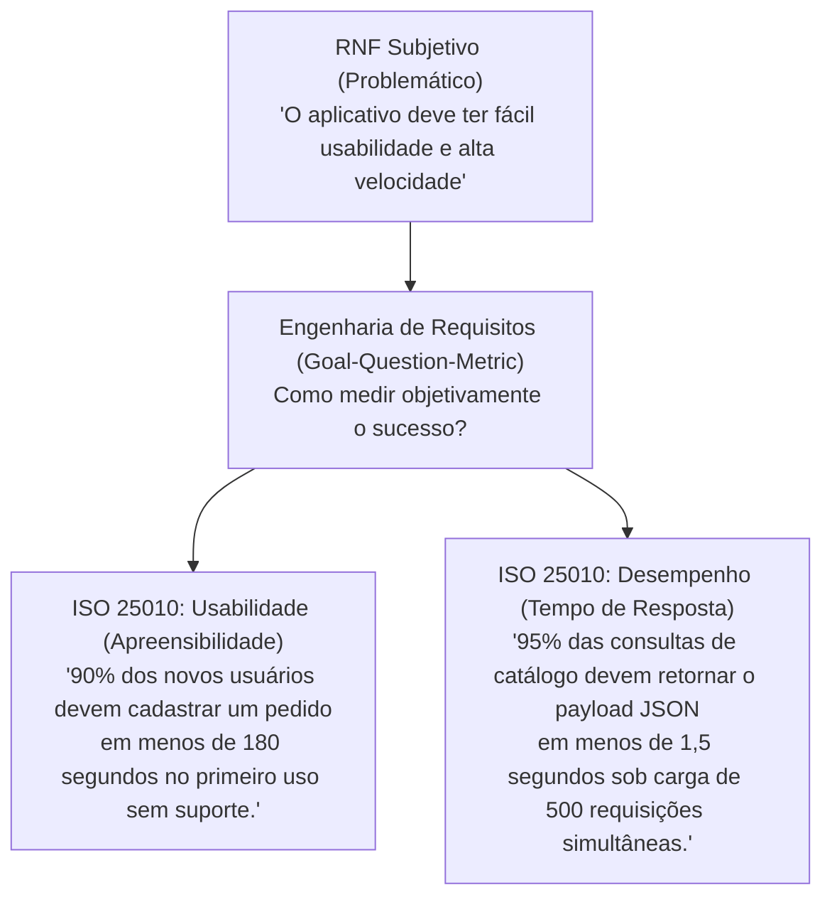

A tabela a seguir sistematiza as métricas recomendadas para as principais dimensões de qualidade de software:

| Característica de Qualidade (ISO 25010) | Parâmetro Analisado | Métrica Formal de Verificação |
| :--- | :--- | :--- |
| **Eficiência de Desempenho** | Tempo de resposta / Latência | Tempo de resposta $\le 2$ segundos para o percentil 95 ($p95$). |
| **Eficiência de Desempenho** | Vazão (*Throughput*) | Capacidade de processar no mínimo 250 requisições/segundo ($RPS$). |
| **Confiabilidade** | Disponibilidade Operacional | Uptime mínimo de 99,9% mensal (tempo de inatividade $\le 43$ min/mês). |
| **Confiabilidade** | Tolerância a Falhas | Tempo Médio Para Reparo ($MTTR$) $\le 30$ minutos; $MTBF \ge 500$ horas. |
| **Usabilidade** | Eficácia e Tempo de Tarefa | Taxa de conclusão de tarefas $\ge 95\%$ no primeiro uso sem consulta ao manual. |
| **Segurança** | Criptografia de Dados | Dados em trânsito protegidos com TLS 1.3; dados em repouso com AES-256. |
| **Portabilidade** | Adaptabilidade de Plataforma | Renderização funcional responsiva em Android $\ge 10.0$ e iOS $\ge 15.0$. |

---

## 3. Modelos de Ciclo de Vida e Processos de Desenvolvimento de Software

### 3.1 Conceito de processo e atividades fundamentais

Um **Processo de Desenvolvimento de Software (PDS)** é um arcabouço estruturado composto por atividades, ações, tarefas, papéis humanos, marcos e artefatos de trabalho necessários para conceber, projetar, codificar, validar, implantar e manter um produto de software com qualidade e custos previsíveis.

A ausência de processo gera o padrão degenerado **Codificar-e-Remendar** (*Code-and-Fix*): o software é escrito sem análise prévia de requisitos e corrigido caoticamente a cada defeito relatado, resultando em débitos técnicos impagáveis e falência do produto.

Conforme consagrado por Ian Sommerville, independentemente da metodologia adotada (prescritiva ou ágil), existem **quatro atividades fundamentais** universais a qualquer projeto:
1. **Especificação de Software:** Clientes e engenheiros definem o que o software deve fazer e suas restrições operacionais.
2. **Desenvolvimento (Projeto e Implementação):** O software é estruturado arquiteturalmente e o código-fonte é programado.
3. **Validação de Software:** O produto é verificado (*construímos o produto corretamente?*) e validado (*construímos o produto certo?*) em relação às expectativas do cliente.
4. **Evolução de Software:** O sistema sofre manutenções e adaptações para responder às mudanças do mercado e do ambiente tecnológico.

Complementarmente, executam-se as chamadas **tarefas de proteção** (*umbrella activities*), que ocorrem paralelamente a todas as fases: Gerência de Configuração de Software (SCM), Garantia da Qualidade de Software (SQA), Gerência de Riscos, Rastreabilidade e Revisões Técnicas Formais.

### 3.2 Modelos Prescritivos Lineares: Cascata e Modelo V

#### Modelo Cascata (Waterfall)
Proposto originalmente por Winston Royce (1970), o Modelo Cascata prescreve uma sequência linear de fases encadeadas:

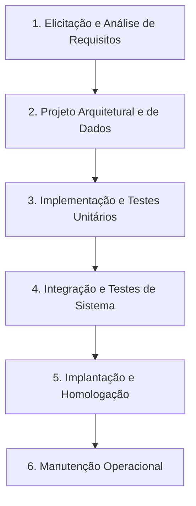

- **Dinâmica Operacional:** Uma fase subsequente só inicia após a conclusão, documentação formal e homologação (*baseline*) da fase anterior.
- **Vantagens:** Alta previsibilidade orçamentária e contratual; documentação técnica exaustiva em cada marco; facilidade de fiscalização gerencial.
- **Limitações e Desvantagens:**
  - *Bloqueio de Fases (Blocking States):* Desenvolvedores aguardam semanas o término da especificação para poderem codificar.
  - *Entrega Tardia de Valor:* O cliente só visualiza o software em operação nos momentos finais do cronograma.
  - *Curva Exponencial de Custo de Mudança (Barry Boehm):* Descobrir um erro de requisito durante a homologação ou operação pode custar de 50 a 200 vezes mais do que saná-lo na fase de análise inicial.

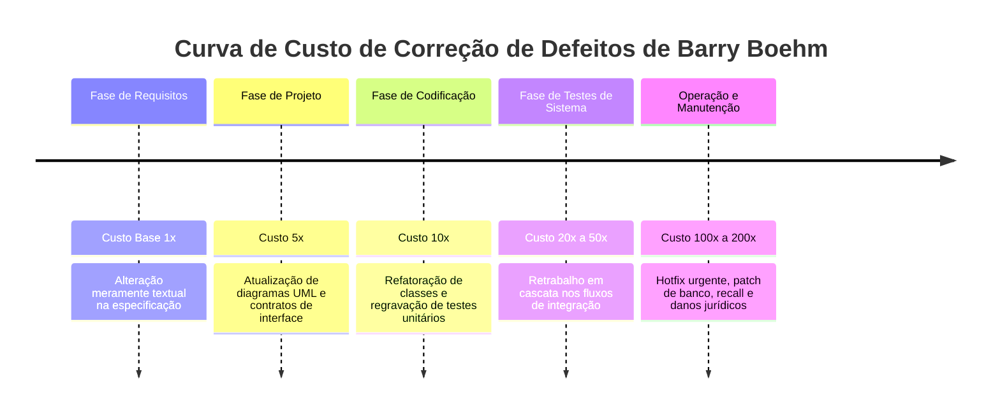

#### Modelo V
O **Modelo V** é uma evolução direta do Cascata que evidencia o princípio de que **para cada atividade de concepção/projeto, existe uma correspondente atividade de teste e garantia de qualidade**:

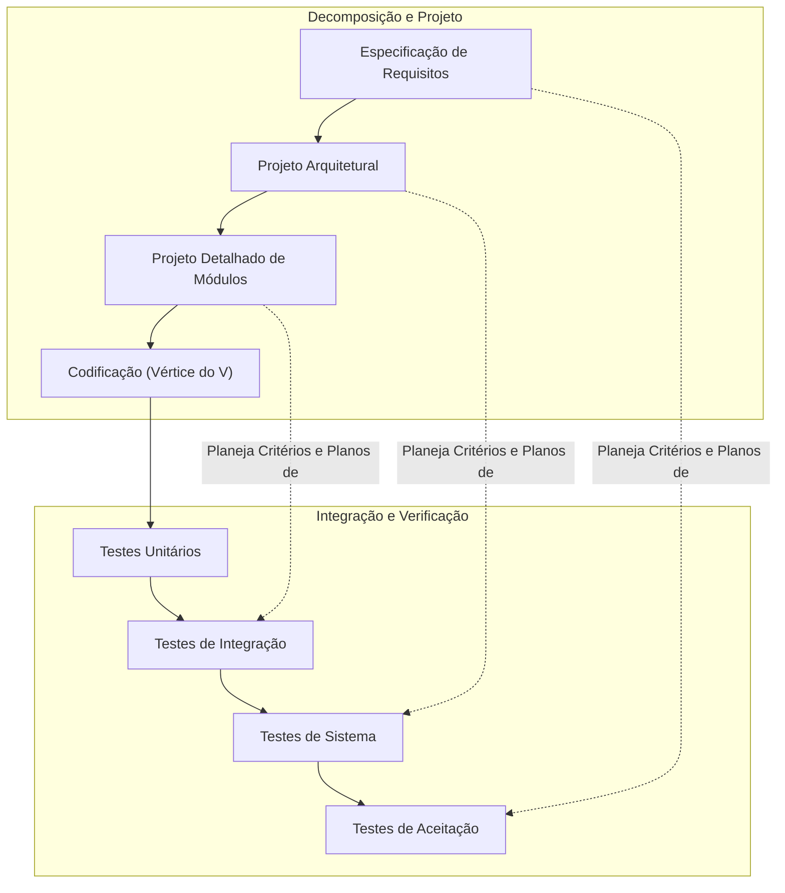

- **Inovação Técnica:** O plano de testes de aceitação é elaborado *durante* a fase de requisitos; o plano de testes de sistema é projetado *durante* a arquitetura. Isso antecipa a detecção de contradições lógicas muito antes de o código ser gerado.

### 3.3 Modelos Evolutivos e Iterativos: Prototipação e Incremental

#### Modelo de Prototipação
Projetado para cenários com extrema volatilidade ou indefinição inicial de requisitos por parte do cliente:

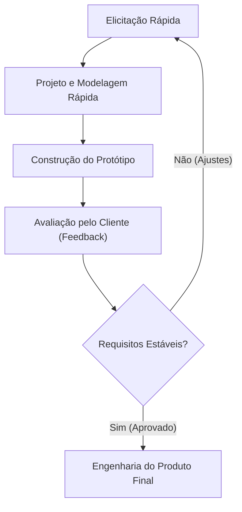

- **Prototipação Descartável (*Throwaway*):** O protótipo é desenvolvido sem preocupação com arquitetura ou escalabilidade (usando ferramentas visuais, mocks e dados estáticos) para permitir a validação humana. Uma vez elucidados os requisitos, ele é descartado e o sistema é construído do zero sob padrões de engenharia.
- **Prototipação Evolutiva:** O protótipo é estruturado com qualidade e avança iteração a iteração, tornando-se gradualmente o sistema final de produção.
- **Armadilha Crítica ("Prototipite"):** O cliente, ao ver uma interface gráfica funcionando e responsiva, assume equivocadamente que o sistema está pronto e exige colocá-lo imediatamente em produção. Se a equipe ceder, colocará no ar um código frágil, sem tratamento de concorrência, sem segurança e sem integridade referencial.

#### Modelo Incremental
O **Modelo Incremental** divide o escopo do projeto em blocos funcionais operacionais autônomos denominados incrementos:

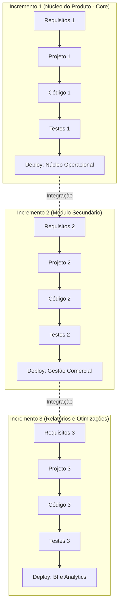

- **Mecânica:** O primeiro incremento entrega o núcleo do produto (*core*), viabilizando retorno financeiro antecipado (*Time-to-Market* reduzido). Os incrementos seguintes agregam funcionalidades progressivas, sempre integrando e validando sobre o núcleo já estável.

### 3.4 Modelo Espiral de Barry Boehm e Condução por Riscos

Concebido por Barry Boehm (1988), o **Modelo Espiral** adota uma abordagem evolucionária onde o motor central de avanço é a **análise e mitigação sistemática de riscos**. O ciclo de vida é representado como uma espiral contínua dividida em quatro quadrantes universais:

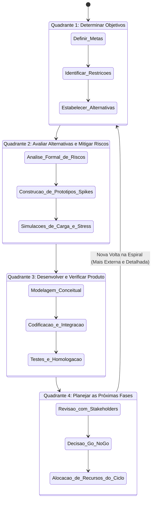

#### Os Quatro Quadrantes de Boehm:
1. **Determinar Objetivos, Alternativas e Restrições:** Identificam-se as metas operacionais daquela iteração específica, os custos associados e as restrições arquiteturais.
2. **Avaliar Alternativas, Identificar e Resolver Riscos:** Núcleo singular do modelo. Se há risco de que uma tecnologia de banco de dados não suporte concorrência massiva, a equipe não avança para o projeto completo: constrói-se um protótipo focado (*spike* técnico), simulam-se cargas e avalia-se o resultado empírico.
3. **Desenvolver e Verificar o Produto da Fase:** O software é modelado, implementado e testado. Conforme os riscos diminuem, adota-se o modelo mais linear (inclusive o Cascata ou Modelo V nas voltas externas de produção).
4. **Planejar as Próximas Fases:** Reunião de marco contratual com o comitê diretivo para decidir se o projeto prossegue para um nível de maior investimento ou se é abortado de forma limpa (*Go / No-Go Decision*).

### 3.5 O Processo Unificado e o RUP (Rational Unified Process)

O **RUP**, desenvolvido pela Rational Software (posteriormente IBM) por Grady Booch, Ivar Jacobson e James Rumbaugh, é um processo de engenharia prescritivo, iterativo e incremental, caracterizado por ser **centrado em arquitetura** e **guiado por casos de uso**.

O RUP possui uma matriz conceitual bidimensional:
- **Eixo Horizontal (Tempo):** Quatro fases sequenciais que definem o ciclo de vida do projeto.
- **Eixo Vertical (Disciplinas):** As atividades técnicas (Requisitos, Análise, Projeto, Implementação, Teste) que ocorrem simultaneamente em todas as fases, variando apenas sua intensidade.

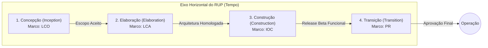

#### As Quatro Fases e seus Marcos Arquiteturais:
1. **Concepção (*Inception*):**
   - *Foco:* Definir o modelo de negócio (*Business Case*), delimitar a fronteira do sistema e identificar os casos de uso macro.
   - *Marco:* **LCO (*Lifecycle Objectives*)** — Acordo de viabilidade orçamentária e técnica entre stakeholders.
2. **Elaboração (*Elaboration*):**
   - *Foco:* Mitigar os riscos técnicos estruturais de maior gravidade. Constrói-se a "linha de base da arquitetura" (*executable architectural baseline*) e detalham-se cerca de 80% dos casos de uso.
   - *Marco:* **LCA (*Lifecycle Architecture*)** — **O marco mais crítico do RUP**. A estabilidade da arquitetura é formalmente validada; mudanças de grande impacto após o LCA tornam-se inaceitáveis.
3. **Construção (*Construction*):**
   - *Foco:* Desenvolver em larga escala todas as funcionalidades remanescentes, componentes complementares e persistência.
   - *Marco:* **IOC (*Initial Operational Capability*)** — Versão beta estável pronta para testes pelo cliente.
4. **Transição (*Transition*):**
   - *Foco:* Homologação do sistema, migração de dados legados, treinamento de pessoal e correção de bugs finais.
   - *Marco:* **PR (*Product Release*)** — Entrega definitiva do software para operação em produção.

### 3.6 Paradigma Ágil versus Prescritivo: Scrum, XP e Kanban

O Manifesto Ágil (2001) consolidou a reação contra o peso documental dos modelos prescritivos rígidos, postulando a supremacia do software funcional sobre a documentação abrangente e a colaboração contínua sobre a negociação de contratos estáticos.

- **Fatiamento de Escopo:** Enquanto modelos prescritivos tradicionais frequentemente operam com fatiamento horizontal (projetar toda a camada de banco de dados, depois toda a camada de controle, depois toda a interface gráfica), métodos ágeis operam obrigatoriamente sob **fatiamento vertical**: cada História de Usuário atravessa todas as camadas do sistema (UI, Regra de Negócio e Persistência) entregando valor ponta a ponta (*End-to-End*).
- **Gestão de Mudança e Congelamento:** Em métodos ágeis (como o Scrum), o *Product Backlog* é um artefato vivo e mutável. Contudo, ao iniciar uma iteração (*Sprint*), o *Sprint Backlog* sofre congelamento relativo para proteger a equipe da interrupção de contexto, colhendo o feedback formal do cliente na *Sprint Review*.

### 3.7 Matriz de decisão multicritério para seleção de processos

A seleção do ciclo de vida deve ser pautada em critérios técnicos rigorosos. A tabela a seguir sintetiza as propriedades operacionais dos modelos de processo estudados:

| Modelo de Processo | Maturidade Inicial dos Requisitos | Tolerância a Mudanças | Envolvimento do Cliente | Criticidade do Sistema | Documentação Formal |
| :--- | :--- | :--- | :--- | :--- | :--- |
| **Cascata (Waterfall)** | Exigida alta estabilidade desde o início. | Baixíssima (Custo de mudança exponencial). | Concentrado no início (requisitos) e no fim (aceite). | Alta (Sistemas regulados, aeroespaciais, bancários). | Exaustiva (Condição para avanço de fases). |
| **Prototipação** | Baixa ou desconhecida pelo usuário. | Alta nos ciclos iniciais; média após descarte. | Contínuo e direto (avaliação de telas semanais). | Baixa a Média (Risco de interfaces inadequadas). | Mínima (Focada em telas e fluxos). |
| **Incremental** | Média a Alta (Requisitos do núcleo claros). | Média (Aceita mudanças entre incrementos). | Periódico (A cada entrega de incremento). | Média a Alta (Permite isolar módulos críticos). | Estruturada por incremento operacional. |
| **Espiral (Boehm)** | Média a Baixa (Guiada pela incerteza técnica). | Altíssima (Quadrante de riscos adapta o rumo). | Crítico nas reuniões de marco de cada volta. | Altíssima (Pioneirismo tecnológico, inovação). | Focada em matrizes de riscos e decisões. |
| **RUP** | Requisitos do núcleo fechados na Elaboração. | Alta na Concepção/Elaboração; Baixa na Construção. | Ativo nas revisões de marcos LCO, LCA, IOC. | Alta (Sistemas corporativos de grande porte). | Alta (Casos de uso padronizados e arquitetura). |
| **Scrum / XP (Ágil)** | Baixa ou dinamicamente mutável. | Máxima (Replanejamento a cada ciclo/Sprint). | Diário/Semanal (Papel do Product Owner). | Média (Requer adaptação para sistemas críticos). | Enxuta (Código limpo, testes automatizados). |

---

## 4. Ferramentas CASE e Modelagem Semântica com Astah UML

### 4.1 Taxonomia das ferramentas CASE

As ferramentas **CASE** (*Computer-Aided Software Engineering*, ou Engenharia de Software Auxiliada por Computador) são aplicações concebidas para apoiar, padronizar e automatizar atividades técnicas ao longo do ciclo de vida do software. Elas são divididas formalmente segundo o escopo de atuação:

1. **Upper-CASE (Front-End CASE):** Auxiliam as etapas iniciais do desenvolvimento: análise de viabilidade, engenharia de requisitos, modelagem conceitual e desenho de arquiteturas orientadas a objetos. O **Astah UML** posiciona-se tipicamente nesta categoria.
2. **Lower-CASE (Back-End CASE):** Concentram-se na automação das etapas finais: geração de esqueletos de código a partir de classes, compilação, engenharia reversa de esquemas de banco de dados, execução de suites de testes e depuração.
3. **Integrated-CASE (I-CASE):** Ambientes corporativos unificados que sincronizam diagramas conceituais, repositórios de código e testes em tempo real sobre um repositório único de metadados.

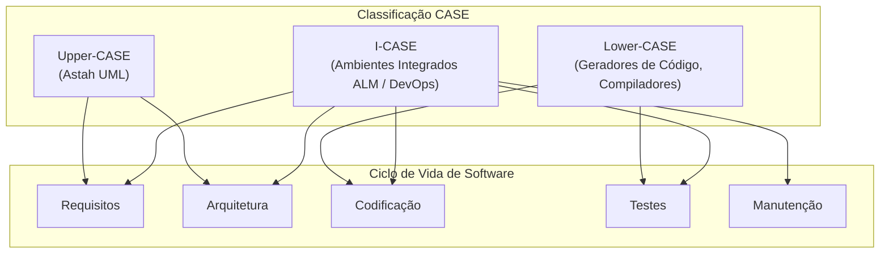

### 4.2 Desenho gráfico vetorial versus Modelagem semântica formal

Um dos maiores erros cometidos por estudantes em formação técnica é igualar ferramentas de desenho gráfico vetorial livre (como Draw.io, Lucidchart, Miro ou Canva) a ferramentas CASE formais de modelagem:

- **Editores de Desenho Gráfico:** Manipulam apenas geometrias vetoriais bidimensionais (retângulos, elipses, setas e strings soltas). Não possuem compreensão semântica do metamodelo da UML. Um retângulo desenhado na folha 1 não possui qualquer relação computacional com um retângulo desenhado na folha 2.
- **Ferramentas CASE Semânticas (Astah UML):** Operam sobre um **grafo de metadados subjacente**. Quando a classe `Cliente` é criada no Astah UML, ela passa a existir como um objeto semântico no repositório do projeto. Se ela for inserida em um diagrama de classes e posteriormente instanciada como linha de vida em um diagrama de sequência, a alteração de um método ou atributo no catálogo propaga-se **automaticamente para todos os diagramas do projeto**.

| Critério de Avaliação | Editores de Desenho (Draw.io / Miro) | Ferramentas CASE Formais (Astah UML) |
| :--- | :--- | :--- |
| **Núcleo de Processamento** | Primitivas gráficas vetoriais sem semântica | Repositório estruturado em grafo conforme o metamodelo UML |
| **Integridade Referencial** | Nula. Duplicações de nomes são tratadas como textos independentes | Total. Renomear uma classe atualiza todas as visões do sistema |
| **Validação Sintática** | Inexistente. Permite associações inválidas na UML (ex.: herança mútua cíclica) | Nativa. Bloqueia conexões ilegais segundo as normas da OMG |
| **Rastreabilidade** | Manual, puramente visual e propensa a erros | Catálogo hierárquico estruturado em árvore de pacotes (*Model Tree*) |
| **Engenharia Direta e Reversa** | Impossível (exporta apenas PNG, SVG, PDF) | Suportada (exportação de esqueletos de código Java/C# e geração reversa) |

### 4.3 Arquitetura de software do Astah UML e persistência (.asta)

O Astah UML foi projetado sobre a plataforma **Java Virtual Machine (JVM)**, o que lhe confere portabilidade multiplataforma nativa (Windows, macOS e Linux).

- **O Arquivo `.asta`:** O formato proprietário `.asta` consiste em um contêiner serializado e compactado que preserva tanto o repositório de metadados semânticos do projeto (classes, métodos, tipos abstratos, visibilidades) quanto as configurações topológicas de renderização visual (coordenadas cartesianas $X, Y$, cores, larguras de linha e fontes de cada diagrama).
- **A Distinção Crucial entre Visão e Modelo (Armadilha de Avaliação):**
  - Ao selecionar um elemento visual em um diagrama e pressionar a tecla `Delete` simples, o Astah UML **apenas oculta o elemento daquela visão gráfica específica**, mantendo a classe perfeitamente íntegra no catálogo do modelo (*Model Tree*).
  - Para expurgar definitivamente uma classe de todo o projeto, o analista deve removê-la diretamente da árvore de estrutura de pacotes (*Model Tree*) ou utilizar o comando de exclusão definitiva (*Delete from Model*).

### 4.4 Mecanismo de licenciamento acadêmico em XML com criptografia assimétrica

Para viabilizar o uso acadêmico de suas soluções por instituições parceiras (como a Fundação Educacional de Fernandópolis - UniFEF), a empresa desenvolvedora (*Change Vision, Inc.*) utiliza um mecanismo de licenciamento de alta segurança apoiado em **Criptografia Assimétrica de Chave Pública / Chave Privada** estruturado em arquivo XML.

#### Estrutura do Arquivo de Licença (`astah_uml_license_2025-2026.xml`):
O arquivo de licença compõe-se de dois blocos sintáticos fundamentais:
1. `<INFO>`: Bloco em texto plano contendo os metadados da concessão (Organização, Nome do Beneficiário, Produto, Versão, Janela de Validade Temporal e Restrições de Uso).
2. `<USER_SIGNATURE>`: Assinatura digital codificada em Base64, gerada pela aplicação da Chave Privada proprietária da Change Vision sobre o hash dos dados do bloco `<INFO>`.

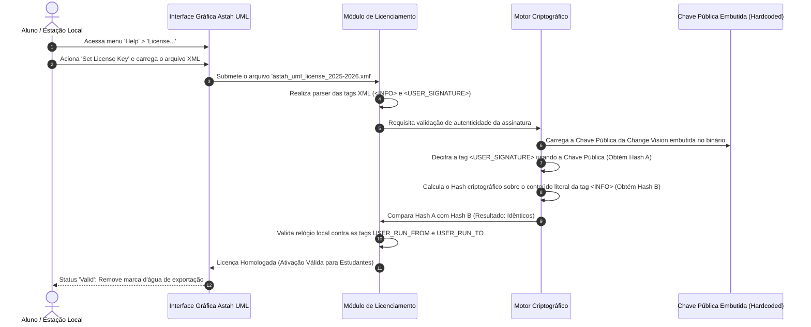

#### Impossibilidade Matemática de Adulteração Local:
1. **Tentativa de Fraude de Validade Temporal:** Caso um estudante adultere a tag `<USER_RUN_TO>` de `2026/08/31` para `2030/12/31`, o software, ao inicializar localmente, recalculará o hash sobre os dados textuais alterados (Hash B). Esse novo hash divergirá completamente do hash decifrado a partir da assinatura original (Hash A). A ferramenta rejeitará a licença imediatamente como corrompida ou fraudada.
2. **Inviabilidade de Gerar Nova Assinatura:** Para gerar um novo `<USER_SIGNATURE>` compatível com os dados adulterados, seria necessário possuir a **Chave Privada** do emissor, que se encontra isolada sob custódia dos servidores de segurança da Change Vision.
3. **Validação 100% Offline:** O software não requer acesso à internet para checar a licença. A verificação depende unicamente da **Chave Pública**, que reside compilada de forma estática no interior dos binários Java do Astah UML.

---

## 5. Modelagem Comportamental: Atores e Casos de Uso

### 5.1 Conceito formal de Ator na UML

Na Unified Modeling Language (UML), um **Ator** representa um **papel coeso** desempenhado por uma entidade externa que interage diretamente com o sistema de software sob análise. O ator não reside no interior do software; ele situa-se sempre do lado de fora da fronteira do sistema (*system boundary*).

- **O que é um Ator:** Um papel exercido por seres humanos (ex.: *Cliente*, *Gerente*, *Atendente*), outro sistema computacional externo (ex.: *Gateway de Pagamento*, *Web Service dos Correios*) ou um gatilho de hardware temporal (ex.: *Temporizador do SO*).
- **O que NÃO é um Ator:** Indivíduos específicos de carne e osso (ex.: "Carlos da Silva"), nomes de tabelas de banco de dados (ex.: "Tabela Clientes") ou o próprio software que está sendo modelado (ex.: "O Sistema").

### 5.2 Taxonomia e relacionamentos entre atores

Os atores classificam-se operacionalmente segundo sua dinâmica de estímulo:
1. **Atores Primários:** Iniciam diretamente a execução de um caso de uso com o propósito de atingir um objetivo de negócio mensurável (ex.: o *Cliente* inicia a busca de produtos).
2. **Atores Secundários (Apoiadores):** Fornecem serviços auxiliares ou respondem passivamente a requisições originadas pelo sistema durante o processamento do caso de uso (ex.: o *Gateway PIX* valida a transação solicitada pelo sistema).
3. **Atores Temporais (Sistema/Relógio):** Disparam ações automáticas com base em eventos cronológicos pré-configurados (ex.: rotina diária de fechamento fiscal às 23:59).

Os atores podem relacionar-se formalmente através do mecanismo de **Generalização / Especialização** (Herança). Nesse caso, um ator especializado herda todos os acessos e permissões de casos de uso vinculados ao ator ancestral genérico, agregando privilégios exclusivos:

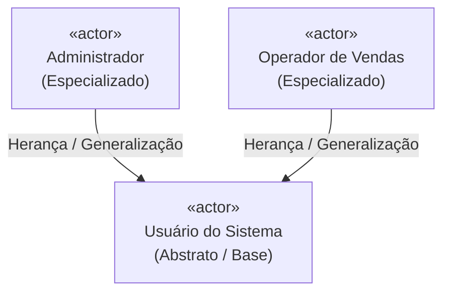

### 5.3 Diagrama de Casos de Uso e fronteiras modulares

O Diagrama de Casos de Uso oferece uma visão comportamental de alto nível das funcionalidades do software. Em sistemas reais, a modelagem monolítica (dezenas de casos de uso aglomerados em um único arquivo sem separação) destrói a legibilidade da engenharia.

A boa prática consolidada na disciplina pelo Prof. Marcelo Boer impõe a **modularização por ator ou pacote de negócio**, delimitada explicitamente pela **Fronteira do Sistema** (*System Boundary*):

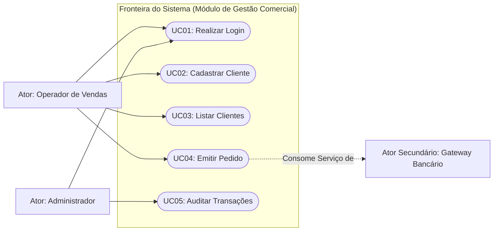

### 5.4 Estrutura padronizada do Quadro de Descrição de Caso de Uso (DCU)

O diagrama visual da UML resume *quem* interage com *o quê*, mas falha solenemente em registrar a dinâmica cronológica passo a passo. É a **Descrição de Caso de Uso (DCU)** estruturada em quadro formal que confere rigor à especificação comportamental:

| Campo do Quadro DCU | Finalidade Técnica | Regra de Preenchimento |
| :--- | :--- | :--- |
| **Identificador e Nome** | Identifica unicamente o caso de uso. | Código unívoco seguido de verbo no infinitivo (ex.: `UC01 — Realizar Login`). |
| **Ator Principal** | Especifica o papel externo que inicia a ação. | Deve coincidir exatamente com um ator catalogado no modelo. |
| **Descrição da Ação** | Síntese textual da meta pretendida pelo ator. | Texto objetivo em 1 ou 2 períodos delimitando o escopo da tarefa. |
| **Pré-requisito** | Estado exigido do sistema para autorizar o início. | Declaração de verdade prévia obrigatória (condição de guarda inicial). |
| **Fluxo Normal** | Sequência linear do caminho perfeito ("Caminho Feliz"). | Passos estritamente numerados alternando iniciativa do ator e processamento do sistema. |
| **Fluxo Alternativo** | Ramificações decorrentes de falhas ou exceções. | Notação decimal rastreável (ex.: `5.1`, `5.1.1`) apontando retorno explícito. |
| **Dados Manipulados** | Relação dos campos que transitam na transação. | Lista exata de variáveis manipuladas nas entradas e saídas. |

### 5.5 Regras de formulação de pré-requisitos e fluxos

- **Regra de Ouro do Pré-requisito:** Um pré-requisito é uma **condição preexistente de estado**, e NUNCA um passo da execução.
  - *Incorreto (Erro Crítico):* "Pré-requisito: O usuário deve digitar o login e clicar em entrar." (Digitar e clicar são passos do fluxo normal).
  - *Correto:* "Pré-requisito: O usuário deve estar previamente cadastrado e ativo na base de dados."
- **Regra de Alternância nos Passos:** O fluxo normal deve narrar um diálogo coerente entre o estímulo externo do ator e a resposta computacional de processamento do sistema:
  - Passo ímpar: Ator fornece entrada ou clica em uma ação.
  - Passo par: Sistema valida, processa e emite uma resposta na interface.
- **Rastreabilidade Numérica de Desvios:** Um fluxo alternativo não pode ficar solto no texto; ele deve declarar com precisão matemática em qual passo do fluxo normal a exceção ocorre e para qual passo o controle é devolvido após o tratamento da falha.

---

## 6. Modelagem Estrutural: Análise Orientada a Objetos e Diagrama de Classes

### 6.1 Extração léxica de classes de domínio (Regra de Abbott)

Para extrair entidades conceituais a partir de narrativas textuais brutas de negócio, a Engenharia de Software adota o método linguístico estruturado proposto por Russell Abbott (1983):

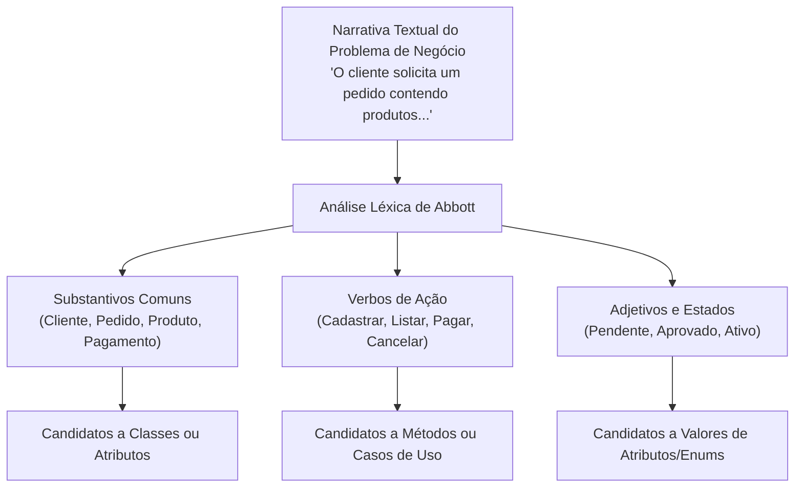

### 6.2 Princípios de modelagem na Fase de Análise

O Diagrama de Classes da Fase de Análise possui restrições conceituais severas que o diferenciam dos diagramas finais de projeto/implementação:
1. **Proibição de Acoplamento com Banco de Dados:** Não modelar artefatos de infraestrutura de persistência física (proibido classes como `ConexaoBD`, `PoolDeConexoes`, `ClienteDAO`, `TabelaCliente`).
2. **Proibição de Controladores de Frameworks:** Não modelar elementos de interface ou bibliotecas web (proibido classes como `ServletAutenticacao`, `ClienteController`, `TelaCadastro`).
3. **Tipagem Conceitual Abstrata:** Empregar tipos de dados conceituais e agnósticos (`Texto`, `Numero`, `Data`, `Logico`, `Dinheiro`) em vez de tipos atrelados a linguagens específicas (`varchar`, `int4`, `DateTimeOffset`).

### 6.3 Relacionamentos estruturais: Associação, Agregação e Composição

As classes estruturais interagem por meio de relacionamentos com pesos semânticos distintos:

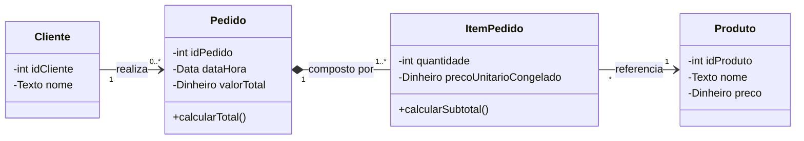

1. **Associação Simples:** Conexão semântica indicando que instâncias de uma classe conhecem ou colaboram com instâncias de outra (ex.: `Cliente` realiza `Pedido`).
2. **Agregação (Todo-Parte Fraco):** Representa vínculo onde o objeto componente pode existir independentemente do objeto agregador. Notação: Losango oco na extremidade do "todo".
3. **Composição (Todo-Parte Forte):** Vínculo estrutural de posse e ciclo de vida acoplado. A "parte" não possui sentido conceitual sem o "todo"; caso o "todo" seja destruído, a "parte" extingue-se simultaneamente. Notação: Losango preenchido na extremidade do "todo" (ex.: `Pedido` e `ItemPedido`).
4. **Classe Associativa (Entidade Associativa):** Surge obrigatoriamente para quebrar e modelar relacionamentos de multiplicidade muitos-para-muitos ($N:N$), servindo para armazenar atributos inerentes à transação (como quantidade vendida e preço congelado em `ItemPedido`).

### 6.4 Multiplicidades e regras de integridade referencial

A multiplicidade define os limites inferior e superior de quantas instâncias de uma classe podem associar-se a uma única instância da classe oposta:

- `1`: Exatamente uma instância obrigatória.
- `0..1`: Opcional; zero ou no máximo uma instância.
- `*` ou `0..*`: De zero a infinitas instâncias.
- `1..*`: No mínimo uma instância obrigatória; limite superior infinito.

A integridade referencial garante que nenhuma associação aponte para um objeto fantasma ou órfão na base de dados.

### 6.5 Generalização versus Papéis contextuais (Eliminação de redundância)

Um dos erros mais comuns de modelagem inicial é duplicar cadastros de entidades que possuem os mesmos atributos do mundo real.

- **O Problema da Duplicação Cadastral:** Se o sistema cria a classe `Anunciante` e a classe `Comprador` contendo rigorosamente as mesmas variáveis (`nome`, `cpf`, `email`, `telefone`), qualquer indivíduo que desejar vender e comprar terá que preencher duas contas distintas, violando o princípio DRY (*Don't Repeat Yourself*).
- **A Solução por Generalização (Herança):** Modela-se a superclasse ancestral `Usuario`, e derivam-se as classes filhas `Anunciante` e `Comprador`.
- **A Solução Superior por Papéis (Roles / State Pattern):** Em sistemas contemporâneos, uma única classe `Usuario` é criada, e os papéis de *Vendedor* ou *Comprador* tornam-se permissões temporais ativadas por contexto, evitando heranças estáticas que engessam a evolução da arquitetura.

---

## 7. Padrão Arquitetural e Documental da Fase de Análise (UniFEF / AV2)

### 7.1 Estrutura do documento técnico formal de entrega

Conforme as diretrizes pedagógicas da Fundação Educacional de Fernandópolis (UniFEF) instituídas pelo Prof. Marcelo Boer para a avaliação bimestral AV2, a documentação formal de análise orientada a objetos é dividida em seções obrigatórias:

- **1.1 Descrição do Contexto do Aplicativo:** Caracterização técnica formal do problema, proposta de valor, público-alvo e limites estritos de escopo do software.
- **1.2 Lista e Diagrama de Atores:** Catalogação em tópicos de todos os papéis e diagramação formal na UML evidenciando heranças.
- **1.3 Quadro 1 — Descrição dos Atores do Aplicativo:** Tabela especificando identificador do ator, categoria e responsabilidades no sistema.
- **1.4 Diagrama de Contexto Geral por Ator:** Diagramas UML com fronteira de sistema agrupando os casos de uso disparados por cada perfil.
- **1.5 Lista Padronizada de Casos de Uso:** Inventário codificado de todos os casos de uso iniciados por verbo no infinitivo.
- **1.6 Lista Padronizada de Mensagens:** Dicionário central de mensagens com identificador unívoco para garantir rastreabilidade com os fluxos alternativos.
- **1.7 Especificação Detalhada dos Casos de Uso Canônicos:** Quadros DCU completos contendo pré-condições, fluxo normal e fluxos alternativos.
- **1.8 Diagrama de Classes da Fase de Análise:** Modelo estrutural puro sem componentes tecnológicos.

### 7.2 Dicionário padronizado de mensagens de sistema (MSG01 a MSG12)

Todo texto de alerta, confirmação, sucesso ou erro manipulado nos fluxos de casos de uso deve ser extraído do catálogo centralizado:

| Código | Categoria | Texto Oficial Padronizado da Mensagem | Gatilho Operacional / Finalidade Técnica |
| :--- | :--- | :--- | :--- |
| **MSG01** | Erro | "Usuário ou senha inválidos. Por favor, verifique suas credenciais." | Falha na autenticação (credencial inexistente ou senha divergente). |
| **MSG02** | Alerta | "Usuário inativo no sistema. Contate o administrador." | Tentativa de login efetuada por uma conta com status bloqueado/inativo. |
| **MSG03** | Sucesso | "Autenticação realizada com sucesso. Redirecionando..." | Validação bem-sucedida de credenciais de login. |
| **MSG04** | Erro | "Existem campos obrigatórios não preenchidos: [Lista_Campos]." | Tentativa de persistência com atributos compulsórios em branco. |
| **MSG05** | Erro | "Registro já cadastrado com os dados informados: [Chave_Duplicada]." | Violação de unicidade de chave de negócio (ex.: CPF já existente). |
| **MSG06** | Sucesso | "Registro gravado com sucesso!" | Confirmação de persistência bem-sucedida de novo registro no banco. |
| **MSG07** | Alerta | "Nenhum registro encontrado para os critérios de busca informados." | Retorno de busca ou filtragem de dados que resulta em conjunto vazio. |
| **MSG08** | Erro | "Registro selecionado não foi encontrado ou foi excluído por outro usuário." | Falha ao tentar carregar um identificador inexistente na base de dados. |
| **MSG09** | Sucesso | "Alterações salvas com sucesso!" | Confirmação de persistência após atualização bem-sucedida de registro. |
| **MSG10** | Confirmação | "Deseja realmente excluir o registro [Nome_Registro]? Esta ação não poderá ser desfeita." | Diálogo de confirmação de segurança exibido previamente a exclusões. |
| **MSG11** | Erro | "Não é possível excluir o registro pois existem transações ativas vinculadas." | Bloqueio de exclusão em decorrência de integridade referencial. |
| **MSG12** | Sucesso | "Registro excluído com sucesso!" | Confirmação de deleção lógica ou física do registro selecionado. |

### 7.3 Especificações detalhadas dos casos de uso canônicos

A seguir, apresentam-se as especificações completas dos casos de uso canônicos que compõem o núcleo operacional de sistemas de informação comerciais, estruturadas sob o rigor do padrão UniFEF:

#### UC01 — Realizar Login
- **Ator Principal:** Usuário do Sistema (Base/Abstrato).
- **Objetivo:** Autenticar o usuário e liberar acesso aos módulos conforme sua matriz de permissões.
- **Pré-requisitos:** O aplicativo deve estar inicializado e com conectividade ativa com a base de dados.
- **Pós-condições:** Sessão do usuário estabelecida em memória e redirecionamento para o dashboard inicial.

| Passo | Ação do Ator | Resposta do Sistema |
| :---: | :--- | :--- |
| 1 | O usuário acessa a tela de autenticação do sistema. | O sistema gera formulário solicitando identificador e senha. |
| 2 | O usuário preenche credenciais e aciona o comando "Entrar". | O sistema valida preenchimento dos campos obrigatórios. |
| 3 | — | O sistema verifica a existência do usuário e a correspondência do hash de senha. |
| 4 | — | O sistema valida se a conta de usuário está com status "Ativo". |
| 5 | — | O sistema emite a mensagem **MSG03** e redireciona para a interface principal. |

- **Fluxos Alternativos e Exceções:**
  - *5.1 Credenciais Inválidas (Passo 3):* Se o usuário não existir ou a senha for incorreta:
    - 5.1.1 Sistema exibe a mensagem **MSG01**;
    - 5.1.2 Sistema limpa o campo de senha e retorna ao Passo 1.
  - *5.2 Conta Bloqueada (Passo 4):* Se o usuário estiver com status inativo:
    - 5.2.1 Sistema exibe a mensagem **MSG02**;
    - 5.2.2 Sistema cancela a operação e mantém a tela de login.

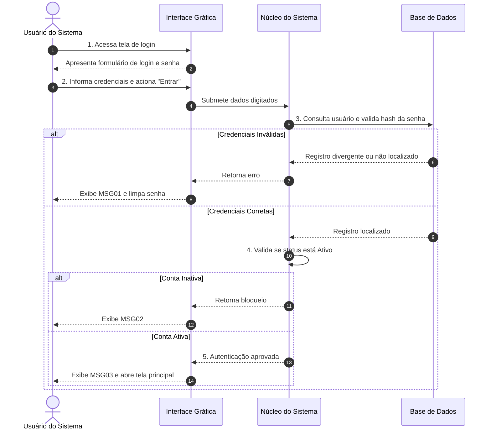

#### UC02 — Cadastrar
- **Ator Principal:** Operador de Vendas / Administrador.
- **Objetivo:** Persistir um novo registro com validação de unicidade e campos obrigatórios.
- **Pré-requisitos:** O operador deve estar autenticado (`UC01`) com permissão ativa de escrita.
- **Pós-condições:** Novo registro gravado com identificador único gerado.

| Passo | Ação do Ator | Resposta do Sistema |
| :---: | :--- | :--- |
| 1 | O operador aciona a funcionalidade "Novo Registro". | O sistema apresenta o formulário com campos limpos. |
| 2 | O operador preenche os atributos e aciona "Salvar". | O sistema valida preenchimento dos campos obrigatórios. |
| 3 | — | O sistema verifica se os campos de unicidade (ex.: CPF/CNPJ) já existem na base. |
| 4 | — | O sistema persiste as informações e gera novo código de identificação. |
| 5 | — | O sistema emite a mensagem **MSG06** e atualiza a visualização. |

- **Fluxos Alternativos e Exceções:**
  - *5.1 Campos Obrigatórios Vazios (Passo 2):* Se houver campo obrigatório não preenchido:
    - 5.1.1 Sistema destaca os campos em desacordo e emite a mensagem **MSG04**;
    - 5.1.2 Sistema mantém o foco no primeiro campo inválido para correção.
  - *5.2 Registro Duplicado (Passo 3):* Se a chave única já existir na base de dados:
    - 5.2.1 Sistema cancela a persistência e emite a mensagem **MSG05**;
    - 5.2.2 Sistema preserva os dados digitados na tela para edição pelo operador.

#### UC03 — Listar
- **Ator Principal:** Operador de Vendas / Administrador.
- **Objetivo:** Recuperar e exibir conjunto tabular de registros atendendo a filtros.
- **Pré-requisitos:** Operador autenticado (`UC01`).
- **Pós-condições:** Grid de registros renderizado na tela.

| Passo | Ação do Ator | Resposta do Sistema |
| :---: | :--- | :--- |
| 1 | O operador acessa a tela de consulta do módulo. | O sistema carrega os parâmetros de filtragem e busca padrão. |
| 2 | O operador define critérios de filtro e aciona "Pesquisar". | O sistema submete consulta à base de dados. |
| 3 | — | O sistema localiza os registros compatíveis com os parâmetros. |
| 4 | — | O sistema exibe os resultados em grid paginado com botões de ação. |

- **Fluxos Alternativos e Exceções:**
  - *4.1 Nenhum Registro Encontrado (Passo 3):* Se a busca não retornar dados:
    - 4.1.1 Sistema emite a mensagem **MSG07**;
    - 4.1.2 Sistema limpa o grid de resultados e mantém os filtros digitados.

#### UC04 — Carregar
- **Ator Principal:** Operador de Vendas / Administrador.
- **Objetivo:** Carregar os dados detalhados de um registro específico selecionado no grid.
- **Pré-requisitos:** O operador deve estar com a listagem ativa (`UC03`).
- **Pós-condições:** Formulário preenchido com todos os atributos originais do registro.

| Passo | Ação do Ator | Resposta do Sistema |
| :---: | :--- | :--- |
| 1 | O operador seleciona um registro no grid e aciona "Abrir/Editar". | O sistema captura o ID do registro selecionado. |
| 2 | — | O sistema busca os dados completos correspondentes ao ID na base. |
| 3 | — | O sistema preenche o formulário detalhado e libera os comandos de alteração. |

- **Fluxos Alternativos e Exceções:**
  - *3.1 Registro Inexistente/Concorrência (Passo 2):* Se o registro foi deletado por outro usuário:
    - 3.1.1 Sistema cancela a operação e emite a mensagem **MSG08**;
    - 3.1.2 Sistema atualiza o grid do `UC03` para remover o registro inexistente.

#### UC05 — Alterar
- **Ator Principal:** Operador de Vendas / Administrador.
- **Objetivo:** Atualizar os dados de um registro previamente carregado no sistema.
- **Pré-requisitos:** O registro deve ter sido carregado com sucesso via `UC04`.
- **Pós-condições:** Atributos alterados persistidos na base de dados com data de modificação.

| Passo | Ação do Ator | Resposta do Sistema |
| :---: | :--- | :--- |
| 1 | O operador modifica os campos permitidos no formulário. | O sistema armazena as alterações temporárias na interface. |
| 2 | O operador aciona o comando "Gravar Alterações". | O sistema valida preenchimento e integridade dos novos dados. |
| 3 | — | O sistema atualiza o registro na base de dados. |
| 4 | — | O sistema emite a mensagem **MSG09** e retorna o formulário ao modo de leitura. |

- **Fluxos Alternativos e Exceções:**
  - *4.1 Violação de Validação (Passo 2):* Se os novos dados violarem regras de negócio:
    - 4.1.1 Sistema cancela a gravação e emite **MSG04** ou **MSG05** conforme o caso;
    - 4.1.2 Sistema mantém o operador na tela de edição.

#### UC06 — Excluir
- **Ator Principal:** Administrador.
- **Objetivo:** Excluir fisicamente ou logicamente um registro após diálogo de confirmação.
- **Pré-requisitos:** O registro deve estar selecionado ou carregado via `UC04`.
- **Pós-condições:** Registro removido da base ou sinalizado com status inativo.

| Passo | Ação do Ator | Resposta do Sistema |
| :---: | :--- | :--- |
| 1 | O administrador seleciona o registro e aciona o comando "Excluir". | O sistema monta diálogo de confirmação com a mensagem **MSG10**. |
| 2 | O administrador confirma a exclusão no diálogo. | O sistema verifica se existem transações dependentes vinculadas ao registro. |
| 3 | — | O sistema executa a exclusão na base de dados. |
| 4 | — | O sistema emite a mensagem **MSG12** e atualiza o grid de listagem. |

- **Fluxos Alternativos e Exceções:**
  - *2.1 Cancelamento pelo Usuário (Passo 2):* Se o administrador acionar "Cancelar":
    - 2.1.1 Sistema fecha o modal de diálogo sem realizar qualquer alteração;
    - 2.1.2 Sistema permanece na visualização atual.
  - *3.1 Bloqueio de Integridade Referencial (Passo 2):* Se o registro possuir vínculos operacionais:
    - 3.1.1 Sistema bloqueia a remoção e emite a mensagem **MSG11**;
    - 3.1.2 Sistema cancela a exclusão e preserva os registros intactos.

---

## 8. Estudos de Caso Integrados da Disciplina

### 8.1 Estudo de Caso 1: Aplicativo Desapega Já

- **Problema de Negócio:** O acúmulo de bens duráveis e semiduráveis inutilizados (roupas, móveis, eletrônicos e livros) gera desperdício financeiro e saturação ambiental. Negociações em redes sociais são caóticas, sem filtros e propensas a golpes. Plataformas de alcance nacional cobram fretes caros que inviabilizam produtos de baixo valor.
- **Proposta de Valor:** Plataforma móvel hiperlocal de economia circular: conectar vendedores e compradores residentes no mesmo perímetro geográfico (bairro e cidade).
- **Entidades de Domínio Mapeadas:**
  - `Usuario`: Base com `id`, `nomeCompleto`, `email`, `telefoneWhatsApp`, `cpf`, `cidade`, `estado`, `bairro`.
  - `Anuncio`: `idAnuncio`, `titulo`, `descricao`, `preco`, `categoria`, `fotosUrls`, `status`.
  - `MensagemContato`: Registro de conversas e negociações internas.
  - `Avaliacao`: Registro da reputação das partes (nota de 1 a 5 e comentário).

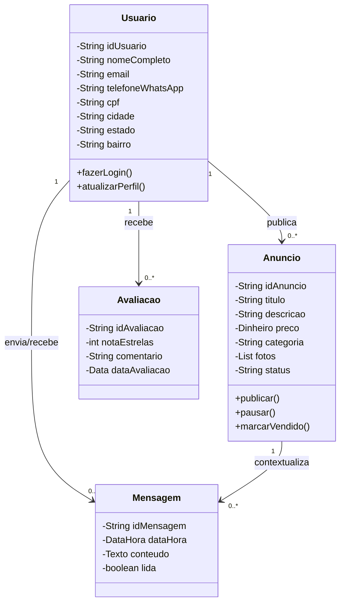

### 8.2 Estudo de Caso 2: Sistema SCAESM (Módulo Pessoa Funcionário)

- **Contexto:** Sistema corporativo municipal/acadêmico. A modelagem detalha o caso de uso canônico `Funcionário Logar` (Quadro 5 do Prof. Marcelo Boer).
- **Especificação Canônica do Quadro 5:**
  - *Ator Principal:* Funcionário.
  - *Descrição da Ação:* Usuário deseja realizar o login no sistema. Na tela de login, informa seus dados de login e senha.
  - *Pré-requisito:* Usuário deverá estar pré-cadastrado no sistema.
  - *Fluxo Normal:*
    - 01. Usuário acessa o URL do sistema;
    - 02. Sistema gera tela de login para o usuário;
    - 03. Usuário informa seus dados nos respectivos campos solicitados;
    - 04. Usuário clica em logar;
    - 05. Sistema verifica se o usuário está cadastrado;
    - 06. Sistema exibe a página inicial referente ao usuário.
  - *Fluxo Alternativo:*
    - 5.1. Se o usuário não estiver cadastrado no sistema, será exibida a mensagem: "Usuário não cadastrado";
    - 5.1.1. Sistema retorna ao item 1, mas com tela de cadastro.
  - *Dados Manipulados:* `login` e `senha`.

### 8.3 Estudo de Caso 3: Açaiteria Sabor da Amazônia

- **Problema de Negócio:** Comércio de açaí com pedidos presenciais e via WhatsApp enfrentando demora no atendimento, erros de montagem, falta de controle de estoque, ausência de relatórios gerenciais e descontrole no programa de fidelidade.
- **Usuários do Sistema:**
  1. *Cliente:* Opera o aplicativo móvel pessoal para consulta, pedidos e fidelidade.
  2. *Gerente:* Opera o painel administrativo para controle financeiro e relatórios.
  3. *Atendente/Cozinha:* Usuário operacional do chão de loja que acompanha a fila de preparo.
- **Atores da Modelagem UML:**
  1. `Cliente` (Ator Primário).
  2. `Gerente` (Ator Primário).
  3. `OperadorDeCozinha` (Ator Primário).
  4. `GatewayDePagamento` (Ator Secundário externo que aprova ou recusa transações).

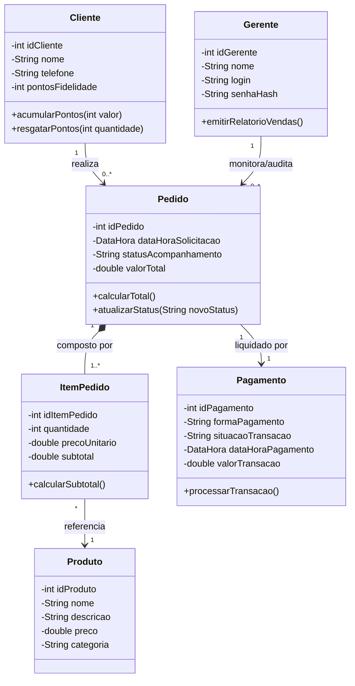

---

## 9. Manutenção e Evolução de Software

### 9.1 As quatro categorias formais de manutenção

Segundo as normas internacionais **ISO/IEC 14764** e a literatura clássica de Roger Pressman e Ian Sommerville, a fase de sustentação de software em produção divide-se em quatro modalidades exclusivas:

```mermaid
flowchart TD
    Manutencao["Manutenção de Software"]
    Manutencao --> Corretiva["1. Corretiva<br>Correção de bugs e falhas latentes"]
    Manutencao --> Adaptativa["2. Adaptativa<br>Adaptação a mudanças ambientais e legais"]
    Manutencao --> Evolutiva["3. Evolutiva (Perfectiva)<br>Novas regras e requisitos de negócio"]
    Manutencao --> Preventiva["4. Preventiva<br>Refatoração e redução de débito técnico"]
```

1. **Manutenção Corretiva:**
   - *Finalidade:* Reparar defeitos, bugs, vulnerabilidades de segurança ou erros computacionais descobertos durante a operação real.
   - *Gatilho:* Software apresenta falha funcional (ex.: divisão por zero ao fechar pedido sem itens; falha de cálculo em parcelas com centavos).
2. **Manutenção Adaptativa:**
   - *Finalidade:* Modificar o software para mantê-lo compatível com mudanças no seu ambiente operacional externo.
   - *Gatilho:* O software não possui defeito intrínseco, mas o ambiente mudou (ex.: atualização do sistema operacional Android 13 para 14; nova exigência legal da Receita Federal para notas fiscais eletrônicas; mudança nos protocolos de API do PIX).
3. **Manutenção Evolutiva (Perfectiva):**
   - *Finalidade:* Incorporar novos requisitos de negócio, funcionalidades inéditas ou aprimoramentos para aumentar a competitividade da organização.
   - *Gatilho:* O cliente demanda novos recursos (ex.: implementar módulo de cupom de desconto na açaiteria; adicionar recurso de troca de mensagens em tempo real no *Desapega Já*).
4. **Manutenção Preventiva (Reengenharia):**
   - *Finalidade:* Refatorar o código-fonte e reestruturar a arquitetura interna para prevenir falhas futuras, mitigar débitos técnicos e aumentar a manutenibilidade.
   - *Gatilho:* A equipe técnica detecta complexidade ciclomática excessiva ou arquitetura espaguete, refatorando classes antes que ocorram falhas em produção.

### 9.2 Distribuição do esforço no ciclo de sustentação

Estudos empíricos da Engenharia de Software (Lientz & Swanson) demonstram a distribuição real dos custos de sustentação:
- **Manutenção Evolutiva / Perfectiva:** Representa aproximadamente **50% a 55%** de todo o custo de sustentação. A maior parte do dinheiro gasto em manutenção destina-se a fazer o software evoluir para atender a novos negócios.
- **Manutenção Corretiva:** Responde por cerca de **20% a 25%** dos recursos.
- **Manutenção Adaptativa:** Consome cerca de **18% a 20%** do esforço.
- **Manutenção Preventiva:** Geralmente aloca de **5% a 7%** do tempo das equipes.

---

## 10. Banco Exaustivo de Questões, Exercícios Resolvidos e Simulado

### 10.1 Questões analítico-discursivas com resolução comentada

#### Questão Discursiva 01: Contraste de Ciclos de Vida em Cenários Extremos
> **Enunciado:** Analise dois projetos hipotéticos sob a ótica da Engenharia de Software:
> - *Projeto Alpha:* Software embarcado para o módulo de controle de dosagem de insulina em uma bomba médica hospitalar.
> - *Projeto Beta:* Aplicativo móvel para engajamento e rede social comunitária de tutores de animais de estimação.
> 
> Com base na estabilidade de requisitos, custo de mudança de Barry Boehm e risco humano, indique e justifique o modelo de processo adequado para cada projeto, contrapondo o Modelo Cascata/Modelo V às abordagens ágeis/evolutivas.

**Resolução Comentada:**
1. **Projeto Alpha (Bomba de Insulina):** O modelo indicado é o **Modelo V** (ou Cascata com rigorosas tarefas de proteção). O sistema é de **segurança crítica** (*Safety-Critical System*). Requisitos devem ser elicidados e formalmente validados antes de qualquer codificação, pois um erro na dosagem de insulina acarreta risco imediato de óbito do paciente. Conforme a curva de custo de mudança de Boehm, o custo de um recall ou de um bug em produção médica é infinito (catastrófico). O Modelo V assegura que para cada nível de especificação existirá um nível formal de teste e verificação planejado antecipadamente.
2. **Projeto Beta (Rede Social Pet):** O modelo indicado é uma abordagem **Evolutiva / Ágil (Scrum com Prototipação)**. O domínio apresenta requisitos altamente voláteis e imprevisíveis. O sucesso da aplicação depende da aceitação visual e de tração rápida de mercado (*Time-to-Market*). Utilizar o modelo Cascata aqui geraria o "fenômeno do bloqueio" e entrega tardia de valor, correndo o risco de lançar um produto que os usuários não desejam mais. Ciclos iterativos com prototipação rápida descartável permitem experimentar interfaces e adaptar o *Product Backlog* conforme o feedback contínuo.

---

#### Questão Discursiva 02: A Mecânica de Riscos na Espiral de Boehm
> **Enunciado:** Uma instituição financeira planeja modernizar seu sistema central de autorização de transações de crédito (legado monolítico há 20 anos em produção). A diretoria deseja migrar para uma arquitetura distribuída de microsserviços baseada em banco de dados NoSQL. Contudo, há incerteza técnica crítica se a consistência eventual do NoSQL causará transações duplicadas em horários de pico. Explique detalhadamente como o **Modelo Espiral de Barry Boehm**, através de seus quatro quadrantes, gerencia esse dilema arquitetural sem colocar o banco em colapso.

**Resolução Comentada:**
A Espiral de Boehm conduz o desenvolvimento mitigando o risco antes do comprometimento financeiro maciço:
- **Quadrante 1 (Determinar Objetivos):** A equipe define o objetivo da iteração (avaliar a viabilidade de autorização de 10.000 TPS em NoSQL sem duplicidade), identifica as restrições (latência abaixo de 200ms e conformidade ACID estrita) e delimita as alternativas (NoSQL Distribuído versus NewSQL Híbrido versus Manter Relacional particionado).
- **Quadrante 2 (Avaliar Alternativas e Mitigar Riscos):** Este é o ponto determinante. Em vez de contratar 40 desenvolvedores para migrar todo o software, a equipe isola o maior risco de engenharia. Desenvolve-se um *spike* técnico (um protótipo focado de estresse) e executa-se um benchmark matemático simulando 15.000 requisições simultâneas concorrentes para verificar se ocorrem condições de corrida e leitura suja no banco NoSQL.
- **Quadrante 3 (Desenvolver e Verificar):** Avaliam-se as métricas obtidas no teste empírico. Se o NoSQL falhar na consistência financeira, a alternativa é formalmente descartada com baixo custo gasto. Se for aprovada ou adaptada com NewSQL, desenvolve-se o esqueleto arquitetural do módulo de concorrência.
- **Quadrante 4 (Planejar as Próximas Fases):** Na reunião de marco, apresenta-se o relatório de riscos para a diretoria executiva. Decide-se (*Go / No-Go*) se a espiral avança para o próximo ciclo mais abrangente (migração dos módulos adjacentes) ou se a estratégia arquitetural deve ser revisada, prevenindo o colapso financeiro da instituição.

---

#### Questão Discursiva 03: Quebra Estrutural de Associação N:N e Composição
> **Enunciado:** No estudo de caso da *Açaiteria Sabor da Amazônia*, o analista júnior desenhou uma associação direta muitos-para-muitos entre `Pedido` e `Produto`, alocando o atributo `quantidade` e `precoVenda` diretamente dentro da classe `Produto`. Demonstre analiticamente a falha semântica cometida por esse projeto e elabore a solução estrutural formal utilizando o conceito de Composição e Entidade Associativa da UML.

**Resolução Comentada:**
- **Falha Semântica do Analista:** Colocar `quantidade` e `precoVenda` dentro da classe `Produto` destrói o modelo conceitual. Um produto (ex.: "Açaí Tradicional 500ml") possui um preço de catálogo de referência. A "quantidade" não pertence ao produto em si, mas sim à solicitação específica contida em um pedido. Se o atributo `quantidade: 3` ficasse em `Produto`, todos os pedidos da açaiteria seriam forçados a comprar 3 açaís. Além disso, se o produto sofrer um reajuste de preço inflacionário no catálogo no mês seguinte, os pedidos passados teriam seus históricos financeiros corrompidos, violando auditorias fiscais.
- **Solução Estrutural:** O relacionamento $N:N$ entre `Pedido` e `Produto` deve ser decomposto pela introdução da classe associativa `ItemPedido`. O relacionamento entre `Pedido` e `ItemPedido` é classificado formalmente como uma **Composição (Todo-Parte Forte)**: uma linha de item de pedido não pode existir sem o pedido que a gerou; destruído o pedido, destroem-se seus itens. A classe `ItemPedido` recebe os atributos `quantidade`, `precoUnitario` (preço histórico congelado no instante da venda) e `subtotal`. O `ItemPedido` estabelece uma associação direcionada simples de multiplicidade `*` para `1` com o `Produto`.

---

### 10.2 Questões de múltipla escolha com justificativa analítica

#### Questão 01 (Estabilidade de Requisitos e Ciclo de Vida)
Sobre a taxonomia de requisitos e a dinâmica dos modelos de desenvolvimento de software, assinale a alternativa tecnicamente correta:
- A) Requisitos voláteis correspondem àqueles ligados diretamente à atividade central da organização e que permanecem inalterados ao longo de todo o ciclo de desenvolvimento.
- B) O modelo Cascata caracteriza-se pela flexibilidade arquitetural, permitindo que a fase de testes unitários seja executada paralelamente à fase de concepção de requisitos, com realimentação instantânea.
- C) Requisitos permanentes são aqueles fundamentados no núcleo estável do domínio de negócio, ao passo que os requisitos voláteis sofrem mutações constantes em decorrência de pressões de mercado, legislação ou mudanças táticas.
- D) A prototipação rápida descartável (*throwaway*) tem como objetivo fundamental estruturar a arquitetura técnica de persistência que permanecerá em produção durante todo o ciclo de manutenção do software.

> **Gabarito: C**  
> **Justificativa Analítica:** A alternativa C expressa a exata taxonomia da engenharia de requisitos. A assertiva A inverte os conceitos (os que não mudam são permanentes). A assertiva B erra ao afirmar que o Cascata permite execução paralela e flexível (o Cascata é estritamente linear e sequencial). A assertiva D erra gravemente ao definir prototipação descartável, cuja finalidade é elucidar requisitos de interface e negócio, devendo ser jogada fora antes da codificação formal da arquitetura.

---

#### Questão 02 (Ferramentas CASE e Integridade de Metamodelos)
Em relação ao uso de ferramentas CASE no processo de engenharia de software e ao funcionamento do software Astah UML, é correto afirmar:
- A) Editores de desenho vetorial genéricos (como Draw.io) garantem integridade referencial semântica, pois propagam automaticamente alterações de nomes de classes para diagramas de sequência.
- B) O Astah UML posiciona-se primordialmente como uma ferramenta Lower-CASE voltada exclusivamente para a compilação final e depuração de código binário de baixo nível.
- C) Ao selecionar um elemento visual em um diagrama do Astah UML e pressionar a tecla `Delete` do teclado, o analista extingue irreversivelmente a classe do catálogo central de metadados do projeto (`.asta`).
- D) Ferramentas CASE de modelagem operam sobre um repositório centralizado de metadados; portanto, a representação visual em uma folha de desenho é apenas uma projeção do elemento lógico registrado no modelo.

> **Gabarito: D**  
> **Justificativa Analítica:** A alternativa D sintetiza a diferença conceitual entre desenho e modelagem semântica formal. A assertiva A é falsa (editores gráficos não possuem grafo semântico). A assertiva B é falsa (o Astah é Upper-CASE). A assertiva C é uma das armadilhas mais clássicas da disciplina: o `Delete` no diagrama apenas apaga a visualização gráfica, mantendo o objeto íntegro no *Model Tree*.

---

#### Questão 03 (Especificação Textual de Casos de Uso)
Na elaboração do Quadro de Descrição de Caso de Uso (DCU) conforme os padrões de Engenharia de Software I aplicados ao sistema SCAESM, assinale a opção que representa uma formulação metodologicamente correta para o campo **Pré-requisito**:
- A) "O usuário clica no botão Entrar da tela de login."
- B) "O sistema deve processar a requisição em no máximo 1,5 segundos sob carga de trabalho."
- C) "O funcionário deve possuir cadastro ativo e credenciais liberadas na base de dados institucional."
- D) "O sistema verifica se o login e a senha digitados constam na tabela `tb_usuarios`."

> **Gabarito: C**  
> **Justificativa Analítica:** A alternativa C declara uma legítima condição de guarda de estado preexistente obrigatória. A assertiva A é incorreta porque descreve uma ação do fluxo normal. A assertiva B confunde pré-requisito com Requisito Não Funcional de desempenho. A assertiva D descreve um passo de processamento interno do sistema no fluxo normal, e não uma condição de entrada.

---

#### Questão 04 (Marcos Arquiteturais no RUP)
No Rational Unified Process (RUP), a validação formal da linha de base da arquitetura executável e a mitigação dos principais riscos técnicos marcam o encerramento de qual fase do ciclo de vida?
- A) Concepção (*Inception*), através do marco LCO (*Lifecycle Objectives*).
- B) Elaboração (*Elaboration*), através do marco LCA (*Lifecycle Architecture*).
- C) Construção (*Construction*), através do marco IOC (*Initial Operational Capability*).
- D) Transição (*Transition*), através do marco PR (*Product Release*).

> **Gabarito: B**  
> **Justificativa Analítica:** A alternativa B descreve o marco mais crítico de todo o processo RUP: o marco LCA (*Lifecycle Architecture*), que finaliza a fase de Elaboração. Assegura-se que a arquitetura foi testada computacionalmente contra os maiores riscos e que os casos de uso vitais foram especificados.

---

### 10.3 Perguntas e Respostas em Formato Estruturado (JSONL)

O bloco a seguir apresenta pares formais de perguntas e respostas técnicas no formato padronizado JSONL (uma linha por objeto JSON), configurando uma base de revisão para estudo ativo e ferramentas de avaliação:

```json
{"pergunta": "Qual e a definicao formal do processo de abstracao na Engenharia de Software e qual sua motivacao cognitiva baseada na Lei de Miller?", "resposta": "A abstracao e o processo cognitivo e analitico de selecionar os aspectos essenciais e relevantes de um dominio do mundo real descartando detalhes acessorios ou irrelevantes. Sua motivacao reside na Lei de Miller, que comprova a limitacao humana de processar apenas 7 mais ou menos 2 chunks de informacao simultaneos na memoria de trabalho, exigindo modelos simplificados para viabilizar a construcao de software."}
{"pergunta": "O que caracteriza a fronteira entre o Espaco do Problema e o Espaco da Solucao no ciclo de vida de software?", "resposta": "O Espaco do Problema foca no que o sistema deve fazer para sanar a dor do negocio (Fase de Analise), usando terminologia do dominio sem amarras tecnicas. O Espaco da Solucao projeta como o software executara tais servicos computacionalmente (Fase de Projeto e Implementacao), definindo linguagens, bancos de dados, padroes de arquitetura e infraestrutura de hardware."}
{"pergunta": "Por que a declaracao 'O sistema deve ser rapido e facil de usar' nao e considerada um requisito valido pela Engenharia de Software?", "resposta": "Porque viola os criterios formais de qualidade das normas IEEE 830 e ISO 29148. Trata-se de uma meta subjetiva, ambigua e desprovida de testabilidade. Um requisito nao funcional valido exige metricas mensuraveis e verificaveis (ex.: tempo de resposta inferior a 2 segundos no percentil 95 sob 500 conexoes simultaneas)."}
{"pergunta": "Qual e a diferenca conceitual e semantica entre requisitos funcionais permanentes e requisitos funcionais volatileis?", "resposta": "Requisitos permanentes ou estaveis estao ancorados no nucleo estruturante e invariante do negocio (como o calculo de tributos em notas fiscais ou a matematica de partidas dobradas em bancos) e quase nao mudam. Requisitos volatileis sao mutaveis e sofrem alteracoes constantes motivadas por pressoes concorrenciais, marketing ou mudancas nas politicas internas da empresa."}
{"pergunta": "Qual a diferenca basica entre editores de desenho grafico vetorial e ferramentas CASE formais de modelagem semantica?", "resposta": "Editores graficos (como Draw.io) manipulam apenas formas geometricas bidimensionais sem conexao logica entre diagramas. Ferramentas CASE (como Astah UML) operam sobre um repositorio central de metadados estruturado no metamodelo da UML; ao alterar ou renomear uma classe no catalogo, todas as visoes de classes e sequencia sao atualizadas automaticamente."}
{"pergunta": "Como opera a validacao criptografica do arquivo de licenca academica em XML do Astah UML sem necessidade de internet?", "resposta": "O software utiliza criptografia assimetrica. Ele decifra o conteudo da tag USER_SIGNATURE usando a Chave Publica da Change Vision embutida estaticamente no codigo do Astah, obtendo um hash A. Simultaneamente, calcula o hash B sobre o texto plano da tag INFO. Se hash A for igual a hash B e o relogio estiver entre USER_RUN_FROM e USER_RUN_TO, a licenca e validada de forma 100% offline."}
{"pergunta": "No modelo de classes da Fase de Analise, por que e expressamente proibido incluir classes como 'ConexaoBanco' ou 'DAOUsuario'?", "resposta": "Porque a Fase de Analise restringe-se estritamente ao Espaco do Problema e a modelagem do dominio de negocio. Classes de infraestrutura, conexoes de rede e padroes de persistencia (como DAO) pertencem a Fase de Projeto e Implementacao (Espaco da Solucao). Sua inclusao prematura gera vazamento de abstracao e engessa a arquitetura."}
{"pergunta": "O que diferencia formalmente o relacionamento de Agregacao do relacionamento de Composicao na modelagem UML?", "resposta": "Ambos sao relacoes todo-parte. Na Agregacao (losango oco), a ligacao e fraca e a parte pode existir de forma independente sem o todo. Na Composicao (losango preenchido), a ligacao e forte e o ciclo de vida e dependente: se o objeto-todo for destruido, todas as suas partes vinculadas deixam de existir compulsoriamente (ex.: Pedido e ItemPedido)."}
{"pergunta": "Qual e a funcao central do marco LCA (Lifecycle Architecture) no encerramento da fase de Elaboracao do processo RUP?", "resposta": "O marco LCA tem como objetivo comprovar que os maiores riscos tecnicos e arquiteturais foram totalmente mitigados atraves da construcao de uma linha de base executavel da arquitetura e da especificacao detalhada dos principais casos de uso, tornando o projeto estavel para o desenvolvimento em massa na fase de Construcao."}
{"pergunta": "Quais sao as quatro categorias formais de manutencao de software definidas pela ISO/IEC 14764 e qual delas consome a maior parcela de esforco?", "resposta": "As categorias sao Corretiva (conserto de bugs), Adaptativa (adequacao a mudancas de ambiente ou leis), Evolutiva/Perfectiva (novas funcionalidades de negocio) e Preventiva (refatoracao de codigo). A manutencao Evolutiva consome a maior parcela do esforco e custo das organizacoes (aproximadamente 50% a 55% do total)."}
```

---

### 10.4 Checklist de revisão e critérios de aprovação

Para assegurar nota máxima nas avaliações teóricas (AV1), nas entregas práticas (AV2) e nos seminários de Engenharia de Software I com o Prof. Marcelo Boer, o estudante deve conferir sistematicamente o cumprimento de cada item da tabela a seguir:

| Tópico de Verificação | Critério de Qualidade e Conformidade | Status de Revisão |
| :--- | :--- | :---: |
| **Abstração Conceitual** | Compreendo a diferença entre o Espaço do Problema (Análise) e o Espaço da Solução (Projeto), evitando detalhes de banco de dados nos modelos conceituais. | [ ] |
| **Requisitos Formais** | Sei converter desejos informais do cliente em requisitos funcionais atômicos, testáveis e estruturados com verbos imperativos no infinitivo. | [ ] |
| **Quantificação de RNF** | Não utilizo termos vagos ("fácil", "rápido") e sei associar métricas objetivas (latência em ms, uptime percentual, taxa de erro) aos atributos da ISO 25010. | [ ] |
| **Ciclos de Vida** | Domínio do Modelo Cascata, Modelo V, Prototipação, Incremental, os 4 Quadrantes da Espiral de Boehm e as 4 Fases/Marcos do RUP (LCO, LCA, IOC, PR). | [ ] |
| **Manipulação do Astah UML** | Sei instalar a ferramenta, compreendo a assinatura criptográfica XML e sei que pressionar `Delete` na tela não apaga a classe do repositório `.asta`. | [ ] |
| **Atores da UML** | Identifico que atores são papéis e não pessoas específicas; modelo atores secundários (gateways) e sei aplicar herança/generalização entre papéis. | [ ] |
| **Estrutura do Quadro DCU** | Redijo fluxos alternativos decimais (5.1, 5.1.1) e não confundo pré-requisito (estado preexistente) com os passos executados no fluxo normal. | [ ] |
| **Modelagem de Classes** | Sei aplicar Abbott para extrair substantivos, elimino redundância cadastral unificando atores e utilizo classes associativas para relações $N:N$. | [ ] |
| **Padrão Documental UniFEF** | Domínio completo da estrutura de entrega da AV2: Seções 1.1 a 1.8, catálogo de mensagens **MSG01 a MSG12** e os 6 casos de uso canônicos. | [ ] |
| **Modalidades de Manutenção** | Diferencio Corretiva, Adaptativa, Evolutiva e Preventiva, identificando que a Evolutiva consome mais da metade dos custos de ciclo de vida. | [ ] |

---

## Fontes e Metadados

- Turma no Classroom: Engenharia e Modelagem de Software I
- Itens processados: 0 materiais, 6 tarefas, 9 avisos
- Gerado em: 24/09/2026, 13:47:13 (BRT) via classroom-sync
