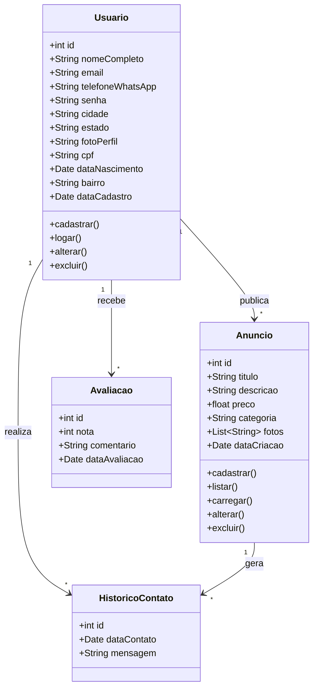
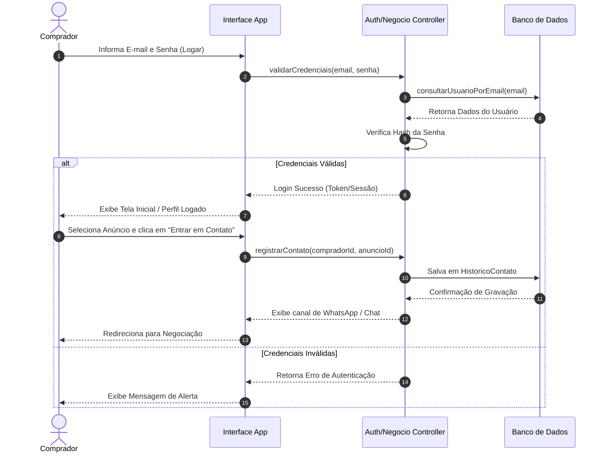

# [Prof. Marcelo Boer] Engenharia de Software I - Modelagem do Sistema

Abaixo estão apresentados os diagramas modelados em **Mermaid** com base no contexto do aplicativo de comércio regional de produtos usados, desenvolvidos para a disciplina de Engenharia de Software I.

---

### 1. Diagrama de Classes UML (Domínio do Aplicativo)

O diagrama de classes representa a estrutura estática do domínio, contemplando os dados do usuário, os anúncios de produtos e os recursos de interação e avaliação conforme especificado no escopo.



**Explicação Objetivo:** 
O diagrama mapeia as entidades principais do sistema (`Usuario`, `Anuncio`, `Avaliacao` e `HistoricoContato`), detalhando os atributos exigidos no cadastro (como proximidade por bairro/cidade e dados de segurança como CPF) e os métodos centrais solicitados nas diretrizes de engenharia de software (como logar, cadastrar, listar, carregar, alterar e excluir).

---

### 2. Diagrama de Sequência (Fluxo de Autenticação e Contato)

Este diagrama ilustra a interação técnica entre o Cliente (Comprador), a Interface do Aplicativo, o Controlador e o Banco de Dados no fluxo de login e posterior intenção de contato com um vendedor.



**Explicação Objetivo:** 
Demonstra passo a passo a execução do caso de uso "Logar" e o encadeamento para a funcionalidade de contato, evidenciando as validações de segurança e o registro do histórico de contatos exigido pelas regras de negócio da plataforma.

---

### 3. Diagrama Arquitetural / Visão Geral do Sistema (`graph TD`)

Este diagrama apresenta a arquitetura em camadas e os módulos funcionais do aplicativo móvel de economia colaborativa.

```mermaid
graph TD
    subgraph Camada de Apresentação (Mobile View)
        A1[Tela Inicial / Listagem de Produtos]
        A2[Tela de Cadastro de Anúncios<br><i>Sem obrigatoriedade de login</i>]
        A3[Tela de Cadastro / Login de Comprador]
        A4[Tela de Detalhes e Contato via WhatsApp]
    end

    subgraph Camada de Negócio (Controllers)
        B1[Gerenciamento de Anúncios<br>Listar, Carregar, Alterar, Excluir]
        B2[Autenticação e Usuários<br>Logar, Cadastrar, Alterar, Excluir]
        B3[Módulo de Proximidade e Histórico]
    end

    subgraph Camada de Dados (Database)
        C1[(Repositório de Usuários)]
        C2[(Repositório de Anúncios)]
        C3[(Logs de Histórico e Avaliações)]
    end

    A1 --> B1
    A2 --> B1
    A3 --> B2
    A4 --> B3

    B1 --> C2
    B2 --> C1
    B3 --> C3
    B3 --> C1
```

**Explicação Objetivo:** 
Facilita a visualização macro da arquitetura do software, separando claramente a interface móvel voltada ao usuário final, as regras de negócio associadas aos casos de uso requisitados (como listagem, cadastro e exclusão) e a persistência dos dados no banco.