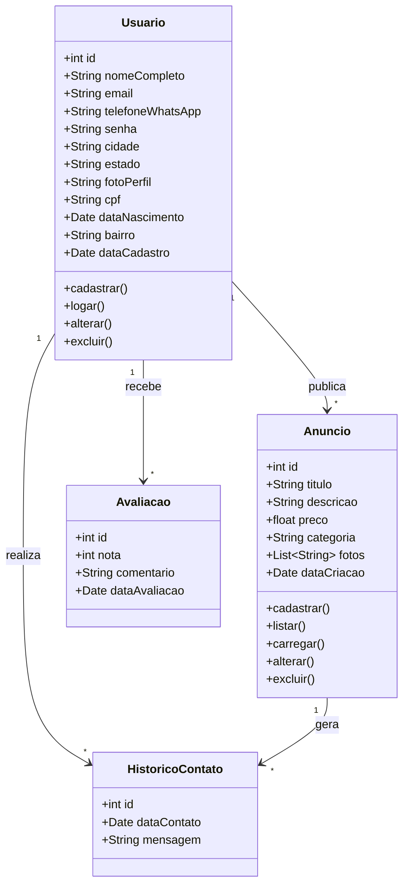
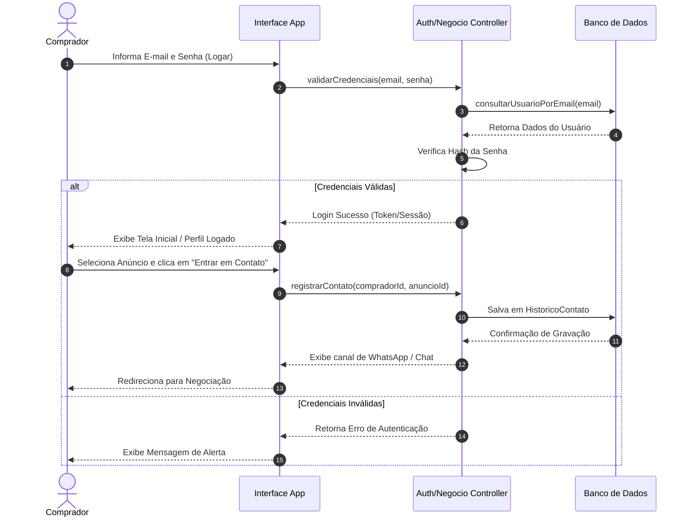

# Resumos-IA — Engenharia de Software I

> **Professor:** Marcelo Boer (Marcelo Tadeu Boer) · **Semestre:** 3º Semestre · **Curso:** Sistemas de Informação (UniFEF)
> **Estudo de caso base:** Aplicativo móvel **Desapega Já** (economia colaborativa entre vendedores e compradores da mesma região)

Material de apoio gerado por IA para revisão da disciplina — resumo executivo, exercícios resolvidos, simulado comentado, cheat sheet e diagramas, tudo consolidado neste único documento.

---

## Índice

1. [Resumo Executivo](#resumo-executivo)
2. [Exercícios Práticos Implementados](#exercícios-práticos-implementados)
3. [Simulado Comentado](#simulado-comentado)
4. [CheatSheet de Revisão Rápida](#cheatsheet-de-revisão-rápida)
5. [Diagramas e Modelagem](#diagramas-e-modelagem)
6. [Apresentação de Revisão em Slides](#apresentação-de-revisão-em-slides)
7. [Flashcards para Anki](#flashcards-para-anki)
8. [Dataset de Perguntas e Respostas (JSONL)](#dataset-de-perguntas-e-respostas-jsonl)

---

## Resumo Executivo

**Foco:** Processos de Software, Ciclo de Vida, Requisitos, Modelagem UML (Astah UML) e Casos de Uso aplicados ao estudo de caso **"Desapega Já"**.

### Contexto do Aplicativo: "Desapega Já"

O aplicativo **Desapega Já** é uma plataforma móvel de economia colaborativa voltada para conectar compradores e vendedores de uma mesma região. Seu objetivo principal é incentivar a reutilização de produtos inativados (roupas, eletrônicos, móveis, livros) e promover o consumo consciente.

* **Vendedores (Anunciantes):** podem anunciar produtos livremente informando *fotos, descrição, preço e categoria*, sem obrigatoriedade de cadastro prévio.
* **Compradores (Interessados):** devem realizar um cadastro simples para negociar e contatar os vendedores.

### Engenharia de Requisitos

**Requisitos Funcionais (RF)** — ações e comportamentos que o sistema deve executar:

| RF | Descrição |
|:---:|:---|
| RF01 | Facilitar a venda de produtos |
| RF02 | Permitir anúncio de produtos |
| RF03 | Permitir o cadastro de pessoas interessadas nas compras (Clientes) |
| RF04 | Facilitar a busca de produtos por proximidade (geolocalização/bairro) |
| RF05 | Gerar histórico de contatos, compras realizadas e avaliações recebidas |
| RF06 | Permitir o cadastro de pessoas que farão a oferta de produtos (Anunciantes) |
| RF07 | Permitir o cadastro de produtos a serem vendidos |
| RF08 | Possibilitar a troca de mensagens entre as partes interessadas |
| RF09–RF15 | Operações completas de CRUD (Cadastrar, Listar, Editar, Excluir, Buscar) para perfis, produtos e anúncios, além de controle de login |

**Requisitos Não-Funcionais (RNF)** — atributos de qualidade, restrições e desempenho:

| RNF | Descrição |
|:---:|:---|
| RNF01 | Fácil usabilidade (interface intuitiva e amigável) |
| RNF02 | Segurança (proteção de dados e credenciais) |
| RNF03 | Prático e acessível |
| RNF04 | Integridade de dados |

### Modelo de Domínio e Classes Principais

* **Anunciante / Interessado:** nome completo, e-mail, telefone (WhatsApp), senha de acesso, cidade, estado, foto de perfil, CPF, data de nascimento e bairro.
* **Anúncio:** fotos, descrição, preço e categoria.
* **Categoria:** nome da categoria.
* **Compra:** data da compra, valor, produtos, interessado e anunciante.
* **Histórico de Contatos:** relacionamento entre interessado e anunciante.

### Modelagem de Casos de Uso (Padrão Astah UML)

Operações fundamentais a descrever: **Logar, Cadastrar, Listar, Carregar, Alterar (Editar), Excluir.**

Estrutura padrão de um DCU (exemplo — *Realizar Login*):
* **Ator Principal:** Usuário Cliente / Anunciante.
* **Pré-requisito:** o usuário deve estar pré-cadastrado no aplicativo.
* **Fluxo Normal:** acessa o app → tela de login → informa e-mail/senha → sistema valida e exibe a tela principal.
* **Fluxo Alternativo:** credenciais inválidas ou usuário não cadastrado → mensagem de erro e redirecionamento.

### Processos de Software e Ciclo de Vida (SDLC)

* **Estrutura do Modelo de Processo:** apresentação conceitual, histórico (origem, criadores, motivação), fases metodológicas, exemplos práticos e análise de custos de implantação.
* **Atividades de Framework:** Comunicação, Planejamento, Modelagem, Construção e Implantação.

### Recursos e Links Úteis

* **Questionários de Revisão (AV1):** disponibilizados via Google Forms pelo Prof. Marcelo Boer.
* **Ferramenta de Modelagem:** *Astah UML* (licenciamento acadêmico para diagramação de Casos de Uso, Classes e Atores).

---

## Exercícios Práticos Implementados

Apostila prática com templates de requisitos, especificações completas de Casos de Uso (CRUD: Logar, Cadastrar, Listar, Carregar, Alterar, Excluir) baseadas nas diretrizes oficiais da disciplina.

### Tabela de Mapeamento de Casos de Uso

| Nº | Caso de Uso | Entrada | Saída |
|:---:|:---|:---|:---|
| 01 | Realizar Login | e-mail / senha | Msg01 / Tela Principal |
| 02 | Cadastrar Anunciante | dados_anunciante | Msg02 (Sucesso) |
| 03 | Listar Perfil | – | Dados do Anunciante |
| 04 | Editar Perfil | dados_anunciante | Msg03 / Dados Atualizados |
| 05 | Cadastrar Produto | dados_produto | Msg02 |
| 06 | Listar Produtos | – | Lista de Dados do Produto |
| 07 | Editar Produto | id_produto | Dados do Produto |
| 08 | Excluir Produto | id_produto | Msg04 (Produto Excluído) |
| 09 | Buscar Produto | termo_busca | Dados Filtrados |
| 10 | Cadastrar Anúncio | dados_anuncio | Msg02 |

### Especificações Resolvidas (CRUD)

**Logar (Realizar Login)** — Ator: Anunciante/Cliente. Pré-requisito: usuário pré-cadastrado.
Fluxo normal: acessa app → tela de login → informa e-mail/senha → clica "Logar" → sistema valida → exibe página inicial.
Fluxo alternativo: sem cadastro → direciona para *Cadastrar*; credenciais inválidas → mensagem de erro e retorno ao passo 03.

**Cadastrar** — Ator: Anunciante/Cliente. Pré-requisito: e-mail/CPF ainda não cadastrados.
Fluxo normal: seleciona nova conta → preenche formulário (nome, e-mail, telefone/WhatsApp, senha, cidade, estado, CPF, data de nascimento, bairro) → salva → sistema valida unicidade e grava, gerando ID único → exibe Msg02.
Fluxo alternativo: campos obrigatórios vazios → mensagem de erro e retorno ao passo 03.

**Listar** — Ator: Anunciante/Cliente. Pré-requisito: usuário autenticado.
Fluxo normal: acessa listagem → app solicita registros ao servidor → consulta com filtro de proximidade → exibe cards com fotos, título e preço.
Fluxo alternativo: nenhum registro na região → mensagem "Nenhum produto encontrado por perto".

**Carregar (Detalhar)** — Pré-requisito: existir ao menos um item listado.
Fluxo normal: clica no item → envia `id_produto`/`id_anuncio` → sistema recupera dados → exibe tela de detalhes completa.
Fluxo alternativo: produto removido → mensagem "Este anúncio não está mais disponível" e retorno à listagem.

**Alterar (Editar)** — Ator: Anunciante (dono do registro). Pré-requisito: estar logado e ser o proprietário.
Fluxo normal: acessa detalhes → "Editar" → formulário pré-preenchido → altera campos → "Atualizar Alterações" → sistema valida e grava → Msg03.
Fluxo alternativo: falha de conexão/dados inválidos → erro, mantém formulário para correção.

**Excluir** — Ator: Anunciante (dono do registro). Pré-requisito: permissão de propriedade.
Fluxo normal: "Excluir Anúncio" → confirmação → "Sim, excluir" → envia `id_anuncio` → sistema remove e exibe Msg04.
Fluxo alternativo: "Cancelar" → processo abortado, tela de gestão restaurada.

Os diagramas de classes, sequência e arquitetura que ilustram esses fluxos estão na seção [Diagramas e Modelagem](#diagramas-e-modelagem) abaixo.

---

## Simulado Comentado

**Assuntos:** Modelos de Processos (Cascata, Ágil, Espiral) e Modelagem UML (Casos de Uso, Classes, Requisitos) baseados no aplicativo *Desapega Já*.

### Parte 1 — Múltipla Escolha (1 a 10)

**Q01.** Com base no contexto do *Desapega Já*, qual opção representa um **Requisito Não-Funcional (RNF)**?
A) Anunciar produtos com fotos, descrição, preço e categoria B) Gerar ID e data de cadastro automaticamente C) Garantir fácil usabilidade, navegação intuitiva D) Trocar mensagens entre as partes E) Cadastro de interessados com e-mail e senha
→ **Resposta: C** — "Fácil usabilidade" é qualidade/experiência de uso (RNF); as demais são ações diretas do sistema (RF).

**Q02.** Modelo tradicional com sequência linear e rígida (Requisitos → Projeto → Codificação → Testes)?
A) Ágil (Scrum) B) Espiral C) Cascata (Waterfall) D) Prototipação Rápida E) Baseado em Componentes
→ **Resposta: C** — Cascata é o clássico modelo linear sequencial.

**Q03.** Atores primários do *Desapega Já*?
A) DBA e Suporte Técnico B) Pessoa Anunciante e Pessoa Cliente C) Servidor e Gateway de Pagamento D) Dev Sênior e Analista de Requisitos E) Entregador e Parceiro Logístico
→ **Resposta: B**.

**Q04.** Objetivo principal de um Caso de Uso (DCU) num sistema como o *Desapega Já*?
A) Estrutura de tabelas/FKs B) Arquitetura física de hardware C) Modelar o comportamento do sistema do ponto de vista do ator D) Cronogramas e custos E) Linhas de código-fonte
→ **Resposta: C**.

**Q05.** Elemento que diferencia o Modelo Espiral (Boehm) dos modelos tradicionais?
A) Eliminação de testes B) Análise de riscos iterativa em cada volta C) Proibição de mudanças de requisitos D) Uso exclusivo de ágil sem documentação E) Contratos de preço fixo sem protótipos
→ **Resposta: B**.

**Q06.** Atributos corretos de **Anuncio** e **Interessado**, respectivamente?
A) (ID, CNPJ, Saldo) / (Placa, Chassi, Ano) B) (fotos, descrição, preço, categoria) / (nome, e-mail, telefone, senha, cidade, estado, CPF, nascimento, bairro) C) (IP, Porta, Protocolo) / (RAM, Processador) D) (Nota Fiscal, Impostos) / (Cargo, Salário, PIS) E) (Versão do App) / (Logs do Sistema)
→ **Resposta: B**.

**Q07.** Item classificado estritamente como **Requisito Funcional**?
A) Alta segurança B) Rodar fluidamente em Android/iOS C) Permitir que o Anunciante cadastre produto (fotos, descrição, preço, categoria) D) Tempo de resposta < 2s E) Padrões de acessibilidade
→ **Resposta: C**.

**Q08.** Característica principal de um processo ágil?
A) Documentação exaustiva imutável B) Ciclos de 2 anos C) Desenvolvimento iterativo/incremental com entrega rápida de valor D) Ausência total de planejamento E) Sem comunicação com o cliente
→ **Resposta: C**.

**Q09.** Componentes típicos de um DCU textual (ex: *Logar*, *Cadastrar*)?
A) Depreciação de equipamentos/balancete B) Ator Principal, Pré-requisitos, Fluxo Normal, Fluxos Alternativos e Dados C) Código binário e dependências D) Organograma e folha de pagamento E) Matriz de risco de mercado
→ **Resposta: B**.

**Q10.** Finalidade principal da fase de **Comunicação e Levantamento de Requisitos**?
A) Criar instalador final B) Compreender o problema de negócio e o que o software deve realizar C) Manutenção corretiva após 5 anos D) Desativar servidores legados E) Auditoria fiscal
→ **Resposta: B**.

### Parte 2 — Discursivas (11 a 15) — diretrizes de resposta

**Q11. Modelo em Cascata:** abordagem sequencial e linear (Requisitos → Projeto → Codificação → Testes → Manutenção), encadeada e rígida. Adequado a projetos com requisitos extremamente estáveis e conhecidos desde o início (ex: sistemas embarcados simples, normas rígidas). Desvantagem: inflexibilidade a mudanças — voltar a uma fase anterior é custoso.

**Q12. RF vs. RNF:** RF descreve *o que* o sistema faz (ex: "permitir cadastro de produto com fotos, descrição, preço e categoria"). RNF estabelece restrições de qualidade/desempenho/segurança (ex: "possuir fácil usabilidade e garantir integridade dos dados").

**Q13. Modelo Espiral:** quatro setores cíclicos — 1) definição de objetivos/alternativas/restrições; 2) avaliação de riscos; 3) desenvolvimento e validação; 4) planejamento da próxima fase. Ideal para sistemas complexos/alto risco por permitir mitigar riscos técnicos e de negócio antes de investir em grande volume de codificação.

**Q14. Fluxos Normal/Alternativo:** o Fluxo Normal descreve o caminho de sucesso sem exceções; o Alternativo trata desvios/erros (ex: senha incorreta). No caso de uso *Logar*: normal = e-mail/senha corretos → tela principal; alternativo = erro de credenciais → mensagem e retorno ao formulário.

**Q15. Manifesto Ágil:** valoriza indivíduos e interações mais que processos/ferramentas, software funcionando mais que documentação abrangente, colaboração com o cliente mais que negociação de contratos, resposta a mudanças mais que seguir um plano. Para um app como o *Desapega Já*: ciclos iterativos permitem lançar MVPs, coletar feedback real de anunciantes/clientes e adaptar rapidamente novas funcionalidades.

---

## CheatSheet de Revisão Rápida

**RF vs. RNF:** Funcionais = **funções/ações** do sistema · Não-Funcionais = **qualidades/restrições** de operação.

**Atores Primários:** `Pessoa Anunciante` (Vendedor) e `Pessoa Cliente` (Interessado/Comprador).

| N° | Caso de Uso | Ator Principal | Entrada | Saída |
| :--- | :--- | :--- | :--- | :--- |
| 01 | Realizar Login Aplicativo | Anunciante / Cliente | e-mail, senha | Msg01 / Tela Principal |
| 02 | Cadastrar Pessoa Anunciante | Pessoa Anunciante | dados_pessoa_anunciante | Msg02 |
| 03 | Listar Pessoa Anunciante | Pessoa Anunciante | – | Dados do Perfil |
| 04 | Editar Pessoa Anunciante | Pessoa Anunciante | dados_pessoa_anunciante | Msg03 |
| 05 | Cadastrar Produto | Pessoa Anunciante | dados_produto | Msg02 |
| 06 | Listar Produtos | Sistema | – | Dados do Produto na Tela |
| 07 | Editar Produto | Pessoa Anunciante | id_produto | Dados do Produto |
| 08 | Excluir Produto | Pessoa Anunciante | id_produto | Msg04 |
| 10 | Cadastrar Anúncio | Pessoa Anunciante | dados_anuncio | Msg02 |
| 15 | Trocar Mensagens | Anunciante e Cliente | dados_mensagens | Histórico na Tela |

**Template de DCU (Padrão Boer)** — item obrigatório de prova, seguir numeração decimal para fluxos alternativos:
> **Quadro X – DCU Individual: [Nome do Caso de Uso]**
> * Ator Principal: [ator que inicia a ação]
> * Descrição da Ação: ...
> * Pré-requisito / Fluxo Normal / Fluxo Alternativo / Dados Envolvidos

---

## Diagramas e Modelagem

### 1. Diagrama de Classes UML (Domínio do Aplicativo)



Mapeia as entidades principais (`Usuario`, `Anuncio`, `Avaliacao`, `HistoricoContato`), com atributos de cadastro (proximidade por bairro/cidade, segurança via CPF) e os métodos centrais das diretrizes da disciplina (logar, cadastrar, listar, carregar, alterar, excluir).

### 2. Diagrama de Sequência (Fluxo de Autenticação e Contato)



Demonstra passo a passo a execução do caso de uso "Logar" e o encadeamento com a funcionalidade de contato, evidenciando validações de segurança e o registro do histórico exigido pelas regras de negócio.

### 3. Diagrama Arquitetural / Visão Geral do Sistema

```mermaid
graph TD
    subgraph Camada de Apresentação (Mobile View)
        A1[Tela Inicial / Listagem de Produtos]
        A2[Tela de Cadastro de Anúncios<br><i>Sem obrigatoriedade de login</i>]
        A3[Tela de Cadastro / Login de Comprador]
        A4[Tela de Detalhes e Contato via WhatsApp]
    end

    subgraph Camada de Negócio (Controllers)
        B1[Gerenciamento de Anúncios<br>Listar, Carregar, Alterar, Excluir]
        B2[Autenticação e Usuários<br>Logar, Cadastrar, Alterar, Excluir]
        B3[Módulo de Proximidade e Histórico]
    end

    subgraph Camada de Dados (Database)
        C1[(Repositório de Usuários)]
        C2[(Repositório de Anúncios)]
        C3[(Logs de Histórico e Avaliações)]
    end

    A1 --> B1
    A2 --> B1
    A3 --> B2
    A4 --> B3

    B1 --> C2
    B2 --> C1
    B3 --> C3
    B3 --> C1
```

Separa claramente a interface móvel voltada ao usuário final, as regras de negócio dos casos de uso (listagem, cadastro, exclusão) e a persistência dos dados no banco.

---

## Apresentação de Revisão em Slides

[`Slides-Revisao-[Prof. Marcelo Boer] Engenharia de Software I.pptx`](./Slides-Revisao-%5BProf.%20Marcelo%20Boer%5D%20Engenharia%20de%20Software%20I.pptx) — deck de 5 slides com redesign dark mode (Slate/Navy/Teal/Indigo), 16:9 widescreen: Capa, Visão Geral, Conceitos Fundamentais, Exercícios & Prática e Dicas de Prova, cobrindo requisitos, UML e o estudo de caso *Desapega Já*.

---

## Flashcards para Anki

[`flashcards-anki.tsv`](./flashcards-anki.tsv) — 24 cartões (pergunta ↹ resposta, separados por tab) cobrindo o contexto do *Desapega Já*, atores, requisitos, atributos de classes e casos de uso. Importe no [Anki](https://apps.ankiweb.net/) via **Arquivo → Importar**, selecionando separador "Tab" e tipo de nota "Básico".

---

## Dataset de Perguntas e Respostas (JSONL)

[`dataset-estudo-qa.jsonl`](./dataset-estudo-qa.jsonl) — 12 pares de pergunta/resposta estruturados (`id`, `topico`, `pergunta`, `resposta`, `dificuldade`), pensados para fine-tuning/RAG ou geração de novos simulados. Amostra:

```json
{"id": 1, "topico": "Engenharia de Requisitos", "pergunta": "No contexto do aplicativo proposto na disciplina, qual a distinção de acesso e necessidade de cadastro entre vendedores e compradores?", "resposta": "O aplicativo estabelece uma assimetria operacional: vendedores podem anunciar produtos (fotos, descrição, preço e categoria) sem a necessidade de cadastro prévio, visando reduzir a fricção de entrada. Em contrapartida, compradores são obrigados a realizar um cadastro simples para poderem entrar em contato com os vendedores e negociar os itens.", "dificuldade": "facil"}
{"id": 2, "topico": "Modelagem de Dados e Requisitos", "pergunta": "Quais dados devem ser coletados no momento do cadastro de compradores, tanto obrigatórios quanto complementares para segurança e localização?", "resposta": "..."}
```
