# Manual Integrado de Engenharia de Software I

**Instituição:** Fundação Educacional de Fernandópolis — UniFEF  
**Curso:** Bacharelado em Sistemas de Informação  
**Disciplina:** Engenharia de Software I (3º Semestre)  
**Docente Responsável:** Prof. Marcelo Boer  

---

## Sumário

- [Fundamentos da Engenharia de Software e Processo de Abstração](#fundamentos-da-engenharia-de-software-e-processo-de-abstração)
  - [Definição formal e motivação cognitiva da abstração](#definição-formal-e-motivação-cognitiva-da-abstração)
  - [Níveis de abstração na modelagem](#níveis-de-abstração-na-modelagem)
  - [A técnica léxica de Abbott](#a-técnica-léxica-de-abbott)
  - [Exemplos, contraexemplos e armadilhas conceituais](#exemplos-contraexemplos-e-armadilhas-conceituais)
- [Modelos de Ciclo de Vida e Processos de Desenvolvimento de Software](#modelos-de-ciclo-de-vida-e-processos-de-desenvolvimento-de-software)
  - [Conceito de processo e atividades fundamentais](#conceito-de-processo-e-atividades-fundamentais)
  - [Atividades genéricas de arcabouço e tarefas de proteção](#atividades-genéricas-de-arcabouço-e-tarefas-de-proteção)
  - [Modelos prescritivos lineares: Cascata e Modelo V](#modelos-prescritivos-lineares-cascata-e-modelo-v)
  - [Modelos evolutivos e iterativos: Prototipação e Incremental](#modelos-evolutivos-e-iterativos-prototipação-e-incremental)
  - [Modelo Espiral de Barry Boehm e gestão orientada a riscos](#modelo-espiral-de-barry-boehm-e-gestão-orientada-a-riscos)
  - [Processo Unificado e o RUP](#processo-unificado-e-o-rup)
  - [Paradigmas ágeis e a curva de custo de mudança de Boehm](#paradigmas-ágeis-e-a-curva-de-custo-de-mudança-de-boehm)
  - [Matriz multicritério de decisão de processos](#matriz-multicritério-de-decisão-de-processos)
- [Engenharia de Requisitos: Elicitação, Análise e Métricas](#engenharia-de-requisitos-elicitação-análise-e-métricas)
  - [Requisitos Funcionais versus Requisitos Não Funcionais](#requisitos-funcionais-versus-requisitos-não-funcionais)
  - [Estabilidade de requisitos: permanentes versus voláteis](#estabilidade-de-requisitos-permanentes-versus-voláteis)
  - [Fase de Análise versus Fase de Projeto](#fase-de-análise-versus-fase-de-projeto)
  - [Fontes de informação e técnicas de elicitação](#fontes-de-informação-e-técnicas-de-elicitação)
  - [Observação participante, não participante e testes de usabilidade](#observação-participante-não-participante-e-testes-de-usabilidade)
  - [Quantificação formal de RNFs: FURPS+ e ISO/IEC 25010](#quantificação-formal-de-rnfs-furps-e-isoiec-25010)
  - [Critérios de qualidade: atomicidade, rastreabilidade e testabilidade](#critérios-de-qualidade-atomicidade-rastreabilidade-e-testabilidade)
- [Ferramentas CASE e Ambiente de Modelagem](#ferramentas-case-e-ambiente-de-modelagem)
  - [Taxonomia de ferramentas CASE](#taxonomia-de-ferramentas-case)
  - [Desenho vetorial versus modelagem semântica baseada em metamodelo](#desenho-vetorial-versus-modelagem-semântica-baseada-em-metamodelo)
  - [Instalação, JVM e configuração do Astah UML](#instalação-jvm-e-configuração-do-astah-uml)
  - [Arquitetura criptográfica de licenciamento institucional XML](#arquitetura-criptográfica-de-licenciamento-institucional-xml)
  - [Estrutura de repositório e árvore de modelos](#estrutura-de-repositório-e-árvore-de-modelos)
- [Modelagem Comportamental: Atores e Casos de Uso](#modelagem-comportamental-atores-e-casos-de-uso)
  - [Conceituação de atores na UML e fronteira do sistema](#conceituação-de-atores-na-uml-e-fronteira-do-sistema)
  - [Categorização de atores: primários, secundários e temporais](#categorização-de-atores-primários-secundários-e-temporais)
  - [Relacionamentos entre atores: herança e especialização](#relacionamentos-entre-atores-herança-e-especialização)
  - [Modularização funcional em sistemas corporativos](#modularização-funcional-em-sistemas-corporativos)
  - [Estrutura do Quadro de Descrição de Caso de Uso](#estrutura-do-quadro-de-descrição-de-caso-de-uso)
  - [Redação de pré-requisitos, fluxo normal e fluxos alternativos](#redação-de-pré-requisitos-fluxo-normal-e-fluxos-alternativos)
- [Modelagem Estrutural: Diagrama de Classes na Fase de Análise](#modelagem-estrutural-diagrama-de-classes-na-fase-de-análise)
  - [Classes conceituais versus classes de projeto/implementação](#classes-conceituais-versus-classes-de-projetoimplementação)
  - [Tipagem abstrata de atributos e responsabilidades](#tipagem-abstrata-de-atributos-e-responsabilidades)
  - [Relacionamentos: associação, agregação e composição](#relacionamentos-associação-agregação-e-composição)
  - [Classes associativas e resolução de relacionamentos muitos-para-muitos](#classes-associativas-e-resolução-de-relacionamentos-muitos-para-muitos)
  - [Generalização, especialização e o princípio DRY](#generalização-especialização-e-o-princípio-dry)
- [Padrão Documental UniFEF para a Fase de Análise](#padrão-documental-unifef-para-a-fase-de-análise)
  - [Estrutura formal da entrega AV2](#estrutura-formal-da-entrega-av2)
  - [Contexto do aplicativo e limites de escopo](#contexto-do-aplicativo-e-limites-de-escopo)
  - [Listagem e Quadro Descritivo de Atores](#listagem-e-quadro-descritivo-de-atores)
  - [Diagrama de Contexto Geral por Ator](#diagrama-de-contexto-geral-por-ator)
  - [Lista de Casos de Uso e Dicionário Central de Mensagens](#lista-de-casos-de-uso-e-dicionário-central-de-mensagens)
  - [Especificações canônicas: Login, Cadastrar, Listar, Carregar, Alterar e Excluir](#especificações-canônicas-login-cadastrar-listar-carregar-alterar-e-excluir)
- [Estudos de Caso Consolidados](#estudos-de-caso-consolidados)
  - [Estudo de Caso 1: Aplicativo Desapega Já](#estudo-de-caso-1-aplicativo-desapega-já)
  - [Estudo de Caso 2: Açaiteria Sabor da Amazônia](#estudo-de-caso-2-açaiteria-sabor-da-amazônia)
  - [Estudo de Caso 3: Sistema Acadêmico e Municipal SCAESM](#estudo-de-caso-3-sistema-acadêmico-e-municipal-scaesm)
  - [Estudo de Caso 4: SisVendas Corporativo](#estudo-de-caso-4-sisvendas-corporativo)
- [Manutenção e Sustentação de Software](#manutenção-e-sustentação-de-software)
  - [Taxonomia de manutenção de software](#taxonomia-de-manutenção-de-software)
  - [Fatores geradores de custo e mitigação arquitetural](#fatores-geradores-de-custo-e-mitigação-arquitetural)
- [Banco de Questões e Simulado Exaustivo para AV1 e AV2](#banco-de-questões-e-simulado-exaustivo-para-av1-e-av2)
  - [Questões discursivas com resolução comentada](#questões-discursivas-com-resolução-comentada)
  - [Dataset estruturado de revisão rápida em JSONL](#dataset-estruturado-de-revisão-rápida-em-jsonl)
- [Glossário e Checklist de Auditoria Documental](#glossário-e-checklist-de-auditoria-documental)

---

## Fundamentos da Engenharia de Software e Processo de Abstração

### Definição formal e motivação cognitiva da abstração

A abstração é a operação intelectual fundamental da engenharia por meio da qual se isolam as propriedades essenciais e invariantes de uma entidade, processo ou fenômeno do mundo real, suprimindo deliberadamente detalhes acidentais, contextuais ou irrelevantes para os objetivos do sistema computacional em análise.

No escopo da Engenharia de Software, construir software não significa reproduzir o mundo físico com exatidão fotográfica, mas sim criar um **modelo**. Um modelo é, por definição, uma representação seletiva da realidade, projetada com o objetivo de viabilizar a automação, o controle, a previsibilidade e a tomada de decisão.

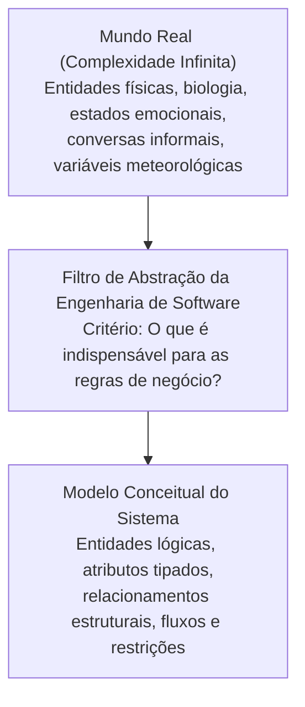

A motivação cognitiva para o uso contínuo da abstração decorre das limitações estruturais da mente humana. Conforme estabelecido na psicologia cognitiva contemporânea (associada ao limite de retenção imediata da memória operacional, conhecido como a Lei de Miller), o ser humano processa simultaneamente entre $7 \pm 2$ blocos de informação (*chunks*). Diante de um sistema corporativo ou industrial composto por centenas de regras operacionais, a única estratégia viável para gerenciar a complexidade sistêmica é a **decomposição hierárquica por meio de níveis de abstração**.

### Níveis de abstração na modelagem

O desenvolvimento de software transita progressivamente por três níveis de abstração distintos, que devem ser rigorosamente segregados para evitar o chamado **vazamento de abstração** (*leaky abstraction*):

1. **Nível Conceitual (Domínio do Negócio / Espaço do Problema):**
   - **Foco:** Mapear *o que* a organização necessita, identificando conceitos do mundo real e regras operacionais.
   - **Independência:** Totalmente desacoplado de linguagens de programação, esquemas de bancos de dados ou padrões visuais de telas.
   - **Artefatos:** Declarações de escopo, Requisitos Funcionais e Não Funcionais, Diagramas de Casos de Uso preliminares e Diagramas de Classes Conceituais de Negócio.

2. **Nível Lógico (Estrutura Arquitetural / Espaço da Análise):**
   - **Foco:** Traduzir os conceitos de negócio em estruturas computacionais formais, estabelecendo tipos abstratos, associações, navegabilidades, multiplicidades e contratos de interface.
   - **Artefatos:** Diagramas de Classes de Análise, Modelos Entidade-Relacionamento lógicos e Especificações Formais de Casos de Uso.

3. **Nível Físico (Espaço da Solução / Implementação):**
   - **Foco:** Implementar as estruturas lógicas em hardware, sistemas operacionais, linguagens de codificação específicas e mecanismos de armazenamento.
   - **Artefatos:** Scripts DDL SQL, código-fonte (`Java`, `TypeScript`, `C#`), arquivos de migração de banco e configurações de contêineres e redes.

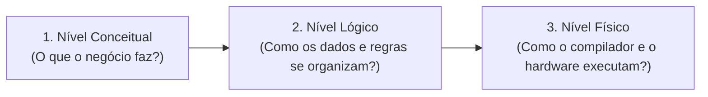

| Nível de Abstração | Pergunta Fundamental | Foco de Atenção | Linguagem Empregada | Exemplo Prático |
| :--- | :--- | :--- | :--- | :--- |
| **Conceitual** | O que o negócio requer? | Necessidades dos stakeholders e regras organizacionais. | Vocabulário corporativo do cliente. | "Um cliente realiza um pedido contendo itens de açaí." |
| **Lógico** | Como a lógica se articula? | Entidades, multiplicidades, contratos e fluxos alternativos. | UML formal e tipos abstratos de dados. | `Pedido "1" *-- "1..*" ItemPedido` com atributo `valorTotal: Decimal`. |
| **Físico** | Como o computador processa? | Tabelas físicas, ponteiros, consumo de memória e threads. | Sintaxe de linguagens e dialetos SQL. | `CREATE TABLE tb_item_pedido (vl_unitario NUMERIC(10,2)...)`. |

### A técnica léxica de Abbott

Para realizar a extração metódica de elementos conceituais a partir de descrições textuais fornecidas por clientes, a Engenharia de Software adota a técnica gramatical de Russell Abbott (1983). Essa abordagem estabelece correspondências diretas entre as categorias morfológicas da língua portuguesa e os blocos de modelagem orientada a objetos:

- **Substantivos próprios:** Representam instâncias ou objetos específicos do mundo real (exemplo: *"UniFEF"*, *"Sabor da Amazônia"*, *"José da Silva"*). Não viram classes; tornam-se registros ou valores de instâncias.
- **Substantivos comuns:** Representam conceitos gerais, conjuntos de elementos ou candidatos primários a **Classes de Domínio** ou a **Atributos** (exemplo: *"Cliente"*, *"Produto"*, *"Preço"*, *"Pedido"*).
- **Verbos transitivos e intransitivos:** Representam ações, estímulos, mudanças de estado e candidatos diretos a **Operações/Métodos** ou **Casos de Uso** (exemplo: *"cadastrar"*, *"autenticar"*, *"calcular total"*, *"excluir"*).
- **Adjetivos:** Indicam características qualificadoras, servindo como base para **Valores de Atributos**, **Restrições de Integridade** ou **Estados de Objetos** (exemplo: *"pedido finalizado"*, *"cliente ativo"*, *"anúncio pendente"*).

### Exemplos, contraexemplos e armadilhas conceituais

- **Exemplo de Abstração Adequada:**
  Ao modelar a entidade `Cliente` para o sistema de classificados *Desapega Já*, o engenheiro seleciona: `nomeCompleto`, `email`, `telefone`, `cpf`, `cidade`, `estado` e `bairro`. Esses dados são suficientes para autenticação, contato humano, geolocalização por proximidade e segurança jurídica básica.
- **Contraexemplo por Superespecificação (*Over-specification*):**
  O analista inclui na modelagem do `Cliente`: `tipo_sanguíneo`, `modelo_do_veiculo`, `grau_de_escolaridade` e `cor_favorita`. Tais atributos geram poluição estrutural, aumentam custos de armazenamento, sobrecarregam o formulário de cadastro e violam os princípios de minimização de dados da Lei Geral de Proteção de Dados (LGPD).
- **Contraexemplo por Subespecificação (*Under-specification*):**
  O analista modela a classe `Anuncio` contendo apenas `titulo` e `preco`. Ele desconsidera a `categoria`, as `fotos` e a `localizacao`. Como resultado, os compradores não conseguem filtrar os itens nem avaliar o estado de conservação das mercadorias, inviabilizando a operação do negócio.
- **Armadilha Conceitual:**
  Confundir abstração com "ocultamento estético de código". Na fase de engenharia preliminar, a abstração é primordialmente a decisão arquitetural sobre **o que pertence e o que não pertence ao escopo formal do software**.

---

## Modelos de Ciclo de Vida e Processos de Desenvolvimento de Software

### Conceito de processo e atividades fundamentais

Um **Processo de Desenvolvimento de Software (PDS)** é um conjunto estruturado de atividades, métodos, práticas, padrões e artefatos associados, utilizado pela equipe de engenharia para conceber, construir, entregar e evoluir sistemas com previsibilidade de custos, conformidade de prazos e qualidade mensurável.

Sem a disciplina imposta por um processo formal, o desenvolvimento degenera no modelo caótico de **Codificar-e-Remendar** (*Code-and-Fix*). Nesse modelo, a programação se inicia imediatamente após conversas informais, gerando código espaguete, ausência de testes, acoplamento destrutivo e impossibilidade de manutenção futura.

Conforme a literatura clássica de Engenharia de Software consolidada por Ian Sommerville, independentemente da metodologia adotada, todo processo de software abriga **quatro atividades fundamentais**:

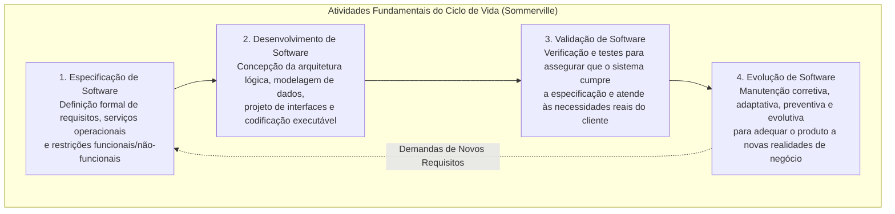

### Atividades genéricas de arcabouço e tarefas de proteção

Sob a taxonomia proposta por Roger S. Pressman, o processo de software divide-se didaticamente em **cinco atividades genéricas de arcabouço** (*framework activities*), acompanhadas por um conjunto pervasivo de **tarefas de proteção** (*umbrella activities*):

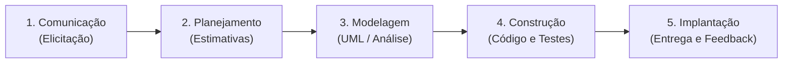

#### Atividades Genéricas de Arcabouço
1. **Comunicação:** Cooperação direta entre engenheiros e partes interessadas (*stakeholders*) para identificação dos objetivos do software e das necessidades de negócio.
2. **Planejamento:** Estimativas métricas de esforço, dimensionamento de prazos, mapeamento preliminar de riscos técnicos e estabelecimento de cronogramas com marcos contratuais (*milestones*).
3. **Modelagem:** Elaboração de representações conceituais e lógicas do sistema. Engloba o levantamento de requisitos, a especificação textual de casos de uso e os diagramas estáticos e dinâmicos em UML.
4. **Construção:** Atividade combinada que reúne a geração de código-fonte e os procedimentos técnicos de testes em níveis unitário e de integração.
5. **Implantação:** Disponibilização da aplicação em ambiente de homologação ou produção, treinamento de usuários, homologação operacional e coleta de feedback.

#### Tarefas de Proteção (*Umbrella Activities*)
As tarefas de proteção executam-se de forma paralela e contínua durante todo o ciclo de vida:
- **Garantia da Qualidade de Software (SQA - Software Quality Assurance):** Auditorias técnicas formais para validar a aderência dos processos e artefatos aos padrões organizacionais.
- **Gerência de Configuração de Software (SCM - Software Configuration Management):** Controle rigoroso de versões, branches, baselines e rastreamento de mudanças no código e na documentação.
- **Gerência de Riscos de Software:** Identificação contínua, quantificação e elaboração de planos de contingência para riscos arquiteturais, humanos e de negócio.
- **Medição e Métricas de Software:** Coleta de dados quantitativos de processo (produtividade, densidade de defeitos, complexidade ciclomática e cobertura de código).
- **Revisões Técnicas Formais (FTE - Formal Technical Reviews):** Inspeções detalhadas de requisitos, projetos de classes e códigos antes de sua liberação formal para etapas subsequentes.

### Modelos prescritivos lineares: Cascata e Modelo V

#### Modelo Cascata (*Waterfall*)
Formulado em 1970 por Winston Royce, o Modelo Cascata propõe uma abordagem estritamente sequencial e linear para o desenvolvimento. O trabalho flui de cima para baixo através de fases rígidas, onde uma etapa só pode ser formalmente iniciada após a conclusão, documentação, revisão técnica e congelamento (*baseline*) de todos os artefatos da fase antecedente.

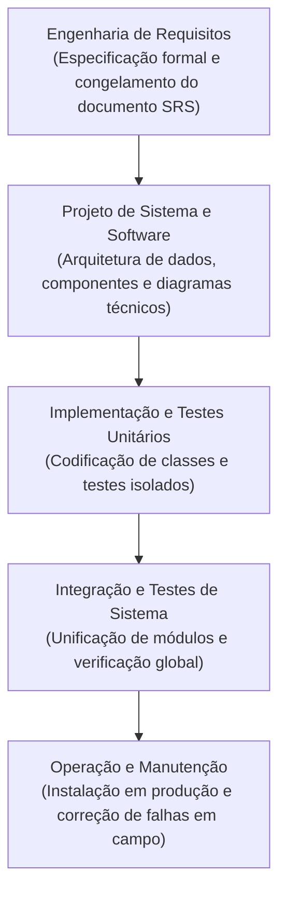

- **Motivação:** Proporcionar o mais alto grau de previsibilidade gerencial, controle de custos contratuais e geração exaustiva de evidências documentais auditáveis.
- **Indicação:** Sistemas cujos requisitos sejam estáveis, amplamente conhecidos e matematicamente especificados desde o início, e cuja tecnologia de implementação seja madura e dominada pela equipe (exemplo: sistemas de controle de voo, equipamentos de suporte vital em medicina, módulos criptográficos para o setor bancário).
- **Contraindicação:** Projetos de inovação, plataformas web, startups ou mercados dinâmicos onde o usuário precise experimentar o produto para refinar suas necessidades.
- **Armadilhas e Patologias Técnicas:**
  - *Bloqueio Operacional:* A equipe de desenvolvimento fica paralisada aguardando a aprovação burocrática da fase de análise.
  - *Visibilidade Nula do Produto:* O software executável só se torna disponível nas semanas finais do projeto.
  - *Efeito Avalanche de Erros:* Um equívoco de interpretação cometido na fase de requisitos que só seja descoberto nos testes de sistema demandará a reescrita de projetos, esquemas de dados e dezenas de milhares de linhas de código.

#### Modelo V
O Modelo V é uma variação do modelo linear que explicita visualmente e operacionalmente que **as atividades de garantia de qualidade (testes) devem ser planejadas de maneira paralela às fases de concepção e especificação**.

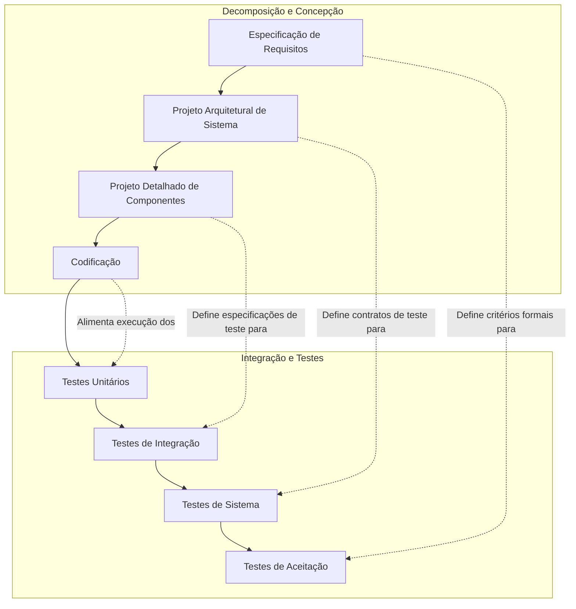

- **Princípio Central:** Os critérios e roteiros de teste de aceitação são redigidos no momento em que os requisitos são elicitados; os testes de sistema são projetados simultaneamente com a arquitetura geral; e os testes de integração são delineados durante a modelagem de classes e componentes.

### Modelos evolutivos e iterativos: Prototipação e Incremental

#### Modelo de Prototipação
Projetado especificamente para lidar com a incerteza e a incompletude crônica de requisitos. Quando o cliente não consegue articular com precisão quais dados devem ser manipulados ou quais regras governam uma tela, constrói-se um protótipo operacional rápido.

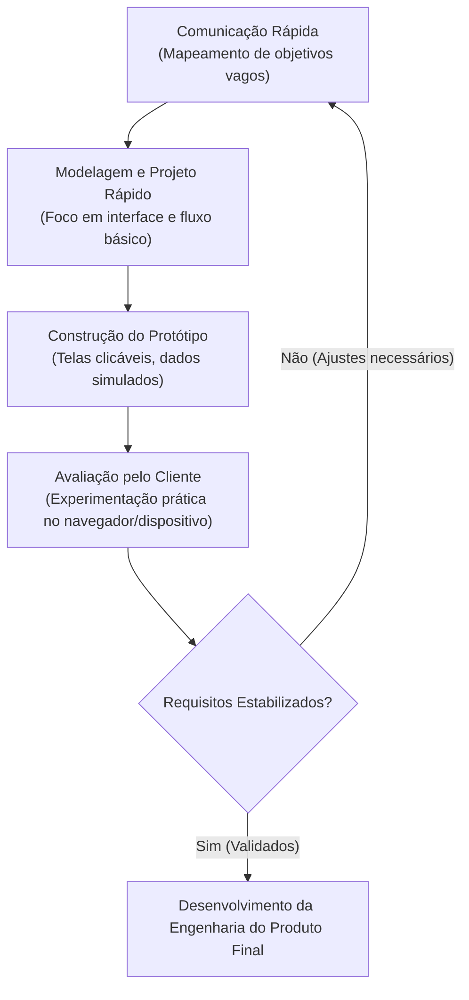

A prototipação subdivide-se em duas abordagens metodológicas rigorosamente distintas:
1. **Prototipação Descartável (*Throwaway Prototyping*):** O protótipo tem a função exclusiva de viabilizar a elicitação assertiva de requisitos e testes de usabilidade. Uma vez acordados os requisitos, o código do protótipo é sumariamente descartado. O sistema final é então projetado a partir do zero com arquitetura limpa, segurança, persistência e tratamento de exceções.
2. **Prototipação Evolutiva (*Evolutionary Prototyping*):** O protótipo é concebido desde a primeira linha com rigor arquitetural e qualidade técnica. A cada rodada de avaliação com o cliente, novos requisitos são incorporados diretamente sobre a base de código preexistente, até que o protótipo evolua organicamente para o sistema de produção.
- **Armadilha Crítica (A "Prototipite"):** A armadilha mais perigosa ocorre quando o cliente, ao visualizar telas de um protótipo descartável funcionando com dados mockados, assume que o software está pronto e exige sua entrada imediata em produção. Se os engenheiros cederem, o produto entrará no mercado sem segurança, sem integridade transacional e com alta taxa de acoplamento.

#### Modelo Incremental
O Modelo Incremental divide o escopo global do projeto em múltiplos blocos funcionais operacionais autônomos, denominados **incrementos**. 

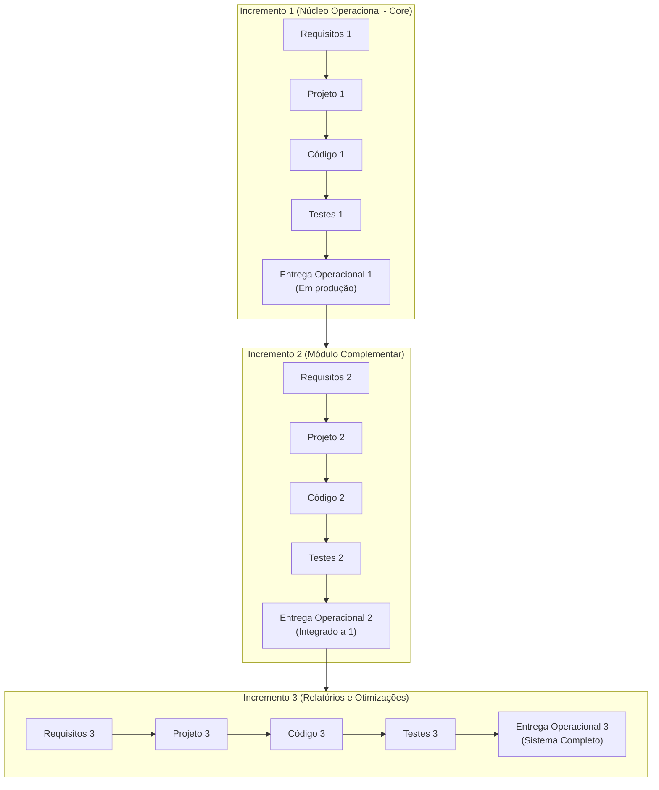

- **Mecânica Operacional:** O Incremento 1 implementa o núcleo estruturante do negócio (exemplo: cadastro de pacientes e prontuário básico em um hospital). Os incrementos seguintes agregam recursos progressivamente (Incremento 2: agendamento de consultas; Incremento 3: faturamento de convênios).
- **Vantagem de Negócio:** Redução drástica do tempo até a primeira entrega funcional (*Time-to-Market*) e geração antecipada de Retorno sobre o Investimento (*ROI*).

### Modelo Espiral de Barry Boehm e gestão orientada a riscos

Criado em 1988 por Barry Boehm, o Modelo Espiral é um modelo evolucionário de processo de software impulsionado primariamente pela **análise sistemática e mitigação formal de riscos**.

O ciclo de vida do projeto é visualizado geometricamente como uma espiral contínua. Cada volta (*loop*) representa uma fase completa de engenharia, avançando progressivamente para níveis mais profundos e custosos de especificação e construção. O plano cartesiano da espiral divide-se em **quatro quadrantes funcionais**:

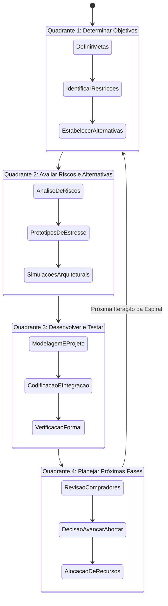

#### A Dinâmica dos Quatro Quadrantes
1. **Quadrante 1 (Superior Esquerdo) — Determinar Objetivos, Alternativas e Restrições:**
   - Define-se o objetivo específico daquela iteração (exemplo: estabelecer a persistência segura de dados biométricos).
   - Identificam-se as restrições arquiteturais, financeiras e de tempo, mapeando caminhos tecnológicos viáveis.
2. **Quadrante 2 (Superior Direito) — Avaliar Alternativas, Identificar e Resolver Riscos:**
   - É o coração metodológico da Espiral. Especialistas avaliam as incertezas críticas levantadas.
   - Aplica-se a construção de *spikes* técnicos, protótipos de teste de estresse ou simulações matemáticas para mitigar incertezas tecnológicas. Se um risco não puder ser mitigado dentro dos parâmetros de custo e segurança, o projeto pode ser encerrado imediatamente (*Go / No-Go Decision*).
3. **Quadrante 3 (Inferior Direito) — Desenvolver e Verificar o Produto da Fase:**
   - Seleciona-se o modelo mais apropriado para o nível de risco residual. Se o risco for mitigado e os requisitos estiverem perfeitamente claros, pode-se adotar o modelo linear (Cascata) ou o incremental para construir a versão intermediária do software.
4. **Quadrante 4 (Inferior Esquerdo) — Planejar a Próxima Fase:**
   - O projeto é submetido a uma comissão de auditoria técnica e financeira. Avalia-se o progresso em relação aos marcos acordados, aprova-se o orçamento e planeja-se a volta seguinte da espiral.

### Processo Unificado e o RUP

O **Rational Unified Process (RUP)**, estruturado por Ivar Jacobson, Grady Booch e James Rumbaugh (os criadores da UML), é um processo prescritivo iterativo e incremental com três pilares conceituais fundamentais:
- **Dirigido por Casos de Uso:** As necessidades dos usuários guiam o processo desde a análise até os testes finais.
- **Centrado na Arquitetura:** A robustez estrutural é projetada e validada antes que grandes equipes passem a produzir código.
- **Iterativo e Incremental:** O sistema é refinado por meio de ciclos estruturados com lançamentos de versões operacionais parciais.

O RUP introduz uma estrutura bidimensional que cruza o tempo com as atividades de engenharia:
- **Eixo Horizontal (Tempo):** Quatro fases sequenciais, cada qual concluída em um **Marco Arquitetural** (*Milestone*) decisivo.
- **Eixo Vertical (Disciplinas):** Atividades técnicas e de gestão executadas com intensidades variáveis em cada fase.

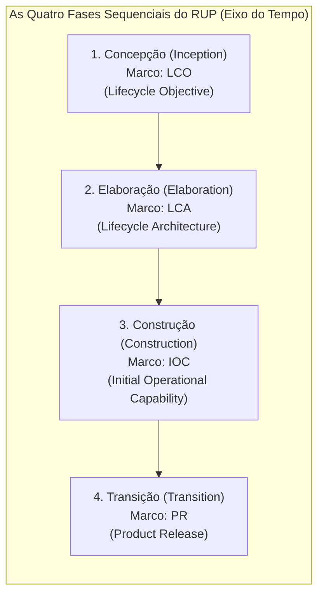

#### As Quatro Fases e Seus Respectivos Marcos Formais
1. **Concepção (*Inception*):**
   - **Objetivo:** Estabelecer a viabilidade do negócio (*business case*), delimitar a fronteira de escopo e identificar os atores e casos de uso de maior relevância econômica.
   - **Marco:** *Lifecycle Objective (LCO)* — Aprovação formal de que o escopo é factível e o projeto possui justificativa financeira para prosseguir.
2. **Elaboração (*Elaboration*):**
   - **Objetivo:** Mitigar os maiores riscos arquiteturais. Aqui se constrói o "esqueleto executável" (*architectural baseline*). Pelo menos 80% dos casos de uso críticos do sistema são descritos detalhadamente.
   - **Marco:** *Lifecycle Architecture (LCA)* — A linha de base da arquitetura é formalmente homologada e a estabilidade técnica é confirmada. **Este é o marco mais importante do RUP.**
3. **Construção (*Construction*):**
   - **Objetivo:** Desenvolvimento fabril e em larga escala dos componentes e casos de uso restantes, associado a testes exaustivos e elaboração de manuais.
   - **Marco:** *Initial Operational Capability (IOC)* — O sistema atinge capacidade operacional com estabilidade suficiente para ser submetido a testes beta em ambiente real de homologação.
4. **Transição (*Transition*):**
   - **Objetivo:** Transferir com sucesso o produto de software homologado para a base de usuários finais. Compreende testes beta, treinamento, migração de bases legadas e ajuste fino de desempenho.
   - **Marco:** *Product Release (PR)* — O sistema é formalmente aceito pela organização para operação assistida e manutenção rotineira.

### Paradigmas ágeis e a curva de custo de mudança de Boehm

Na virada dos anos 2000, a constatação de que os modelos prescritivos pesados geravam documentação excessiva que se desatualizava rapidamente culminou na criação do **Manifesto para o Desenvolvimento Ágil de Software (2001)**. As abordagens ágeis (como Scrum, Extreme Programming — XP e Kanban) operam sob o paradigma empírico, valorizando:
1. Indivíduos e interações mais que processos e ferramentas;
2. Software em funcionamento mais que documentação abrangente;
3. Colaboração com o cliente mais que negociação de contratos;
4. Responder a mudanças mais que seguir um plano.

A principal divergência de engenharia entre os modelos lineares clássicos e os modelos ágeis reside no tratamento da **Curva de Custo de Mudança de Barry Boehm**:

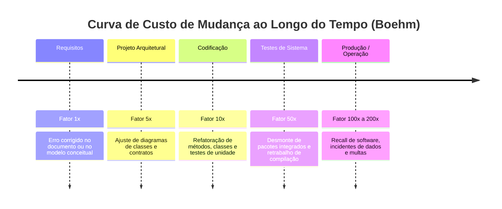

- **Nos Modelos Prescritivos:** Assume-se que a curva de custo de mudança cresce de forma exponencial. Portanto, deve-se investir esforço maciço na análise preliminar para congelar os requisitos e evitar alterações nas fases avançadas.
- **Nas Abordagens Ágeis:** Adotam-se práticas técnicas contínuas (como automação de testes, Integração Contínua/CI, design incremental e refatoração arquitetural) que mantêm o custo de absorver mudanças relativamente plano ao longo do tempo, permitindo que o sistema se adapte sem colapsar a estrutura de código.

### Matriz multicritério de decisão de processos

Não existe um processo de software universalmente superior. A seleção da abordagem deve resultar da análise do perfil do projeto, cruzando variáveis técnicas e organizacionais:

| Critério de Engenharia | Modelo Cascata | Modelo de Prototipação | Modelo Incremental | Modelo Espiral | Abordagens Ágeis (Scrum/XP) |
| :--- | :--- | :--- | :--- | :--- | :--- |
| **Clareza inicial dos requisitos** | Requisitos estáveis e totalmente claros | Requisitos vagos e desconhecidos | Requisitos razoavelmente claros no início | Requisitos associados a incertezas | Requisitos altamente mutáveis e voláteis |
| **Criticidade do sistema (Segurança)** | Excelente para sistemas de missão crítica | Inadequado como produto final | Bom para sistemas estruturados | Excelente (foco absoluto em riscos) | Requer adaptação de conformidade |
| **Envolvimento do cliente** | Apenas no início e na homologação final | Contínuo durante as sessões de tela | Moderado (homologa cada incremento) | Alto (participa em todo quadrante 4) | Intensivo e diário (papel de Product Owner) |
| **Complexidade tecnológica e arquitetural** | Baixa a moderada (tecnologias conhecidas) | Utilizado para testar viabilidade visual | Média (módulos bem segmentados) | Altíssima (novas plataformas e integrações) | Média a alta (evolução por refatoração) |
| **Geração de documentação técnica** | Exaustiva e auditável (base contratual) | Mínima ou restrita a testes de interface | Formal por módulo entregue | Alta (relatórios formais de risco) | Mínima suficiente orientada ao código |

---

## Engenharia de Requisitos: Elicitação, Análise e Métricas

### Requisitos Funcionais versus Requisitos Não Funcionais

A Engenharia de Requisitos é a disciplina responsável por identificar, negociar, modelar, validar e gerenciar o conjunto de serviços que o sistema computacional deve prover e as restrições sob as quais ele operará. Os requisitos dividem-se em duas naturezas primárias:

1. **Requisitos Funcionais (RF):**
   - **Definição:** Expressam explicitamente **o que** o sistema deve fazer. Definem as funções, as transformações de dados, os cálculos de negócio, os fluxos comportamentais e as respostas a estímulos externos.
   - **Exemplo Real:** *"O sistema deve calcular o valor total do pedido somando os subtotais de cada item selecionado e aplicar o percentual de desconto caso o cupom de fidelidade seja válido."*
   - **Critério de Falha:** O sistema deixa de processar uma operação que lhe foi explicitamente solicitada.

2. **Requisitos Não Funcionais (RNF):**
   - **Definição:** Expressam **como** ou **sob quais restrições de qualidade** o sistema deve executar suas funções. Abrangem restrições arquiteturais, desempenho, tempo de resposta, padrões de segurança, escalabilidade, disponibilidade, interoperabilidade e conformidade com marcos legais.
   - **Exemplo Real:** *"A operação de autenticação de credenciais deve responder em no máximo 1,5 segundos sob carga de até 500 requisições simultâneas em conexões 4G."*
   - **Critério de Falha:** O sistema realiza a operação solicitada, mas viola uma restrição qualitativa (o sistema calcula o valor correto, mas demora 45 segundos para exibir o resultado).

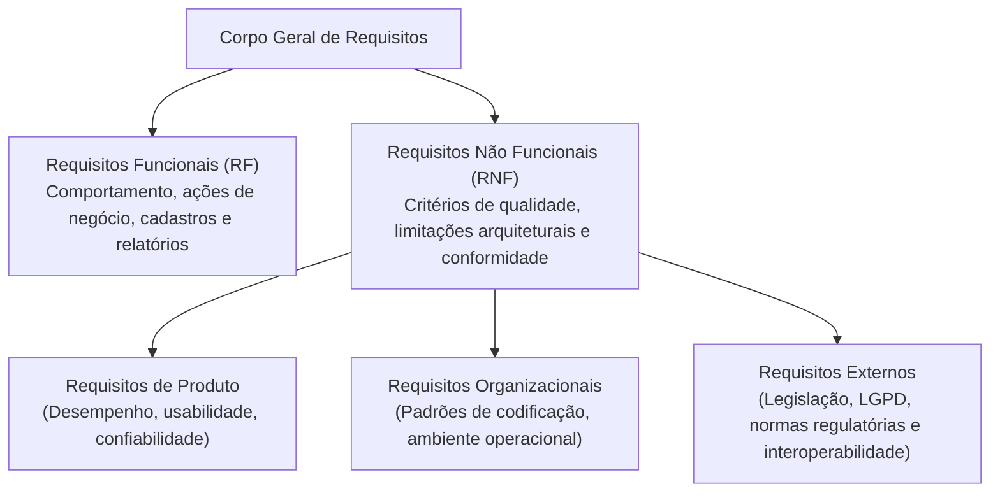

### Estabilidade de requisitos: permanentes versus voláteis

Na taxonomia formal da Engenharia de Requisitos, a estabilidade das demandas do usuário divide-se quanto à sua volatilidade ao longo do ciclo de vida:

- **Requisitos Permanentes (ou Estáveis):** Correspondem ao núcleo de regras estruturais e fundamentais do domínio de negócio. Mantêm-se consistentes ao longo de todo o projeto e nas rotinas diárias da empresa (exemplo: a exigência de calcular débitos e créditos de forma equilibrada em sistemas contábeis; o registro de CPF de contribuintes para emissão de documentos fiscais).
- **Requisitos Voláteis (ou Mutáveis):** Requisitos sujeitos a frequentes alterações durante a construção do software ou após sua implantação em produção. Mudanças nos requisitos voláteis decorrem da dinâmica concorrencial do mercado, de novas políticas fiscais governamentais ou de transformações no comportamento do consumidor.

> **Atenção para a prova:** Afirmar que "requisitos permanentes são requisitos que mudam constantemente durante o ciclo de desenvolvimento" é um erro clássico de interpretação. Requisitos que se alteram são categorizados formalmente como **voláteis**.

### Fase de Análise versus Fase de Projeto

A Engenharia de Software estabelece uma linha divisória rigorosa entre a compreensão dos requisitos e a arquitetura técnica que os sustentará:

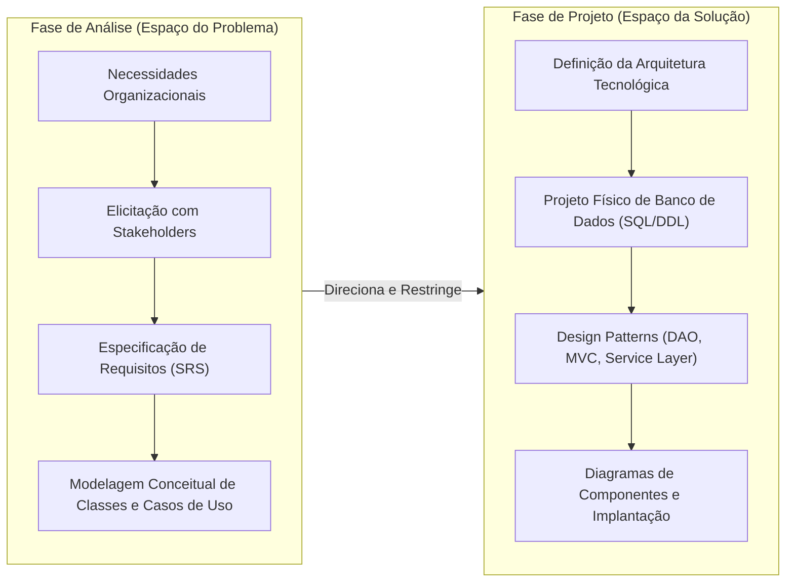

| Critério de Comparação | Fase de Análise (Espaço do Problema) | Fase de Projeto / Design (Espaço da Solução) |
| :--- | :--- | :--- |
| **Pergunta Principal** | **O que** o sistema deve fazer para o negócio? | **Como** a tecnologia construirá a solução? |
| **Vocabulário** | Termos do cliente, jargões da empresa e regras corporativas. | Termos computacionais: tabelas, chaves estrangeiras, threads, APIs, índices. |
| **Independência Tecnológica** | Altíssima: o requisito existe mesmo sem computador. | Nula: vinculada a frameworks, drivers e sistemas operacionais. |
| **Artefatos Gerados** | Casos de Uso de Análise, DCUs, Classes Conceituais, RNFs. | Diagramas de Sequência de Projeto, Diagramas de Componentes, Schemas DDL. |
| **Responsável Típico** | Analista de Requisitos, Engenheiro de Software, Product Owner. | Arquiteto de Software, Tech Lead, Engenheiro de Dados. |

### Fontes de informação e técnicas de elicitação

A elicitação não é um processo passivo de escuta, mas uma investigação metódica. As fontes de requisitos compreendem:
1. **Stakeholders:** Usuários operacionais, gerentes, equipes de suporte, auditores e executivos.
2. **Domínio da Aplicação:** Princípios matemáticos, normas contábeis ou regras de logística.
3. **Ambiente Operacional:** Plataformas de hardware, sistemas operacionais e restrições de largura de banda de rede.
4. **Ambiente Organizacional:** Cultura interna, disputa de processos departamentais e diretrizes de conformidade jurídica.

Para extrair os requisitos a partir dessas fontes, o engenheiro de software dispõe de um leque de métodos formais de coleta de dados:

| Técnica de Coleta | Amplitude / Alcance | Profundidade Qualitativa | Custo Relativo | Indicador de Uso Recomendado |
| :--- | :--- | :--- | :--- | :--- |
| **Questionário Online** | Massivo (Centenas de respondentes) | Superficial / Quantitativa | Baixo | Levantamentos demográficos preliminares e validação quantitativa. |
| **Entrevista Aberta** | Individual / Amostral | Altíssima / Subjetiva | Alto | Domínios complexos, elucidação de processos informais e atritos de fluxo. |
| **Entrevista Estruturada** | Individual / Segmentada | Moderada / Comparativa | Médio-Alto | Confirmação padronizada de regras com diferentes operadores do mesmo cargo. |
| **Grupo Focal (*Focus Group*)**| Grupos de 6 a 12 participantes | Alta / Dinâmica | Médio-Alto | Brainstorming de novos produtos, avaliação de protótipos e resolução de conflitos. |
| **Análise Documental** | Factual (Documentos existentes) | Neutra / Histórica | Baixo | Manuais operacionais, formulários de papel, relatórios e legislações vigentes. |

### Observação participante, não participante e testes de usabilidade

Frequentemente, os operadores do sistema executam rotinas mecânicas que não conseguem articular em entrevistas. Nesses cenários, aplicam-se técnicas de **investigação etnográfica**:

- **Observação Não Participante:** O engenheiro de software atua como um observador passivo no local de trabalho. Ele monitora a rotina dos funcionários sem interromper os processos, registrando fluxos reais, atalhos não documentados e o uso de sistemas paralelos (como anotações em papel e planilhas isoladas).
- **Observação Participante:** O analista integra-se ativamente à equipe do cliente, vivenciando o ambiente operacional e executando tarefas da rotina do trabalho. Essa imersão revela as dores operacionais e as limitações de interface sentidas pelo usuário.
- **Testes de Usabilidade Associados à Observação:** Quando um sistema em produção apresenta altas taxas de abandono de operações (como carrinhos eletrônicos abandonados ou cancelamentos em telas de formulário), convoca-se o usuário para operar a aplicação em um ambiente controlado. Sob monitoramento, analisam-se pontos de hesitação, cliques errôneos, expressões de confusão e tempos excessivos em cada campo.

### Quantificação formal de RNFs: FURPS+ e ISO/IEC 25010

Um dos equívocos mais graves na Engenharia de Software é a redação de requisitos não funcionais por meio de adjetivos genéricos, como *"o sistema deve ser rápido"*, *"o software deve ser seguro"* ou *"a interface deve ser intuitiva"*. Essas declarações são subjetivas, impossibilitam a elaboração de casos de teste automatizados e abrem margem para contestações jurídicas e contratuais.

Todo RNF deve ser vinculado a **métricas objetivas e verificáveis**, estruturadas segundo modelos consolidados como o **FURPS+** da Hewlett-Packard (Functionality, Usability, Reliability, Performance, Supportability) e a norma internacional **ISO/IEC 25010** (Engenharia de Qualidade de Produto de Software).

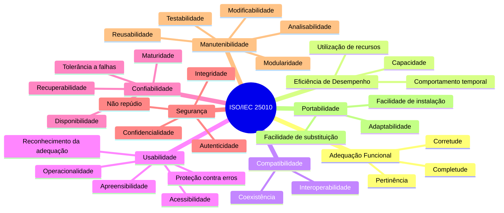

A tabela a seguir demonstra a conversão de declarações subjetivas em especificações métricas formais de engenharia:

| Categoria da Qualidade | Requisito Subjetivo (Problemático) | Requisito Não Funcional Formal e Mensurável | Métrica e Critério de Aceitação |
| :--- | :--- | :--- | :--- |
| **Usabilidade** | "O aplicativo deve ser de fácil usabilidade." | O sistema deve permitir que novos usuários concluam a publicação de um anúncio sem treinamento formal prévio. | 85% dos usuários de teste devem concluir o fluxo de anúncio em até 3 minutos no primeiro uso, com taxa de erro em campos inferior a 5%. |
| **Desempenho** | "O sistema deve carregar os produtos rapidamente." | O tempo de carregamento da listagem de produtos geolocalizados deve atender a limites estritos sob tráfego normal. | Tempo de resposta HTTP menor que 2,0 segundos para o percentil 95 ($P_{95}$) em conexões 4G com carga de 100 requisições/segundo. |
| **Confiabilidade** | "O sistema não pode falhar no horário de pico." | O serviço de autorização de pedidos deve manter alta taxa de operação contínua sem quedas de serviço. | Disponibilidade mensal mínima de 99,8% e Tempo Médio Entre Falhas ($MTBF$) superior a 720 horas operacionais ininterruptas. |
| **Segurança** | "O sistema deve proteger as senhas dos usuários." | As credenciais de acesso devem ser armazenadas com proteção contra vazamentos de dados na base. | Armazenamento de senhas utilizando função de derivação de chave criptográfica lenta (ex.: Argon2id ou BCrypt com fator de custo $\ge 12$). |

### Critérios de qualidade: atomicidade, rastreabilidade e testabilidade

Conforme estabelecido pela norma **ISO/IEC/IEEE 29148** (Processos do Ciclo de Vida de Software — Engenharia de Requisitos), para que uma declaração de requisito seja homologada tecnicamente, ela deve atender aos seguintes critérios de qualidade:

1. **Atomicidade:** O requisito deve descrever uma única função de negócio indivisível. Declarações que utilizam conectivos como *"e também"*, *"bem como"* ou *"além disso"* devem ser decompostas em múltiplos requisitos atômicos.
2. **Comportamento Verificável (Testabilidade):** Um engenheiro de testes deve ser capaz de criar um procedimento booleano (Passou / Falhou) para verificar se o sistema atende ou viola a declaração.
3. **Não Ambiguidade:** O texto deve admitir uma única interpretação semântica tanto para os analistas de negócios quanto para os programadores e clientes.
4. **Rastreabilidade (Horizontal e Vertical):** Deve ser possível mapear o requisito desde sua origem (necessidade de negócio) até o artefato de projeto (casos de uso, classes do modelo), código-fonte e suíte de testes de aceitação correspondente.
5. **Estrutura Sintática Canônica:** Recomenda-se a adoção da forma padrão:  
   $$\text{"O sistema deve [ação verbal] [objeto/dado de negócio] sob [condições ou restrições]."}$$

---

## Ferramentas CASE e Ambiente de Modelagem

### Taxonomia de ferramentas CASE

As ferramentas CASE (*Computer-Aided Software Engineering* — Engenharia de Software Auxiliada por Computador) são aplicações computacionais projetadas para apoiar, automatizar, gerenciar e auditar as atividades ao longo do ciclo de vida de desenvolvimento de software (SDLC).

Elas categorizam-se de acordo com o estágio de atuação no ciclo de vida:

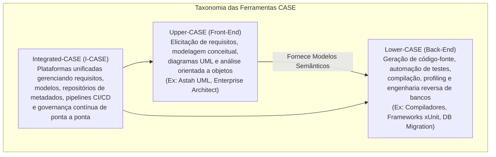

- **Upper-CASE (Front-End CASE):** Concentram-se nas fases iniciais de concepção e análise. Seu principal propósito é fornecer um ambiente formal para a criação de modelos sintáticos e semânticos do sistema. O software **Astah UML** enquadra-se tipicamente nessa categoria.
- **Lower-CASE (Back-End CASE):** Focam nas fases finais de construção, teste e manutenção. Automatizam tarefas de engenharia reversa, análise estática de código e conversão de diagramas em esqueletos de código-fonte nas linguagens finais.
- **Integrated-CASE (I-CASE):** Unificam ferramentas Upper e Lower em torno de um **Repositório Central de Metadados**, sincronizando diagramas, regras de negócio e código-fonte em tempo real.

### Desenho vetorial versus modelagem semântica baseada em metamodelo

Um dos equívocos recorrentes em equipes de desenvolvimento iniciantes é assumir que diagramas produzidos em editores vetoriais livres (como Draw.io, Lucidchart, Miro ou Canva) equivalem a artefatos de Engenharia de Software produzidos em uma ferramenta CASE formal. A diferença não reside na estética visual, mas na **arquitetura do núcleo de dados**:

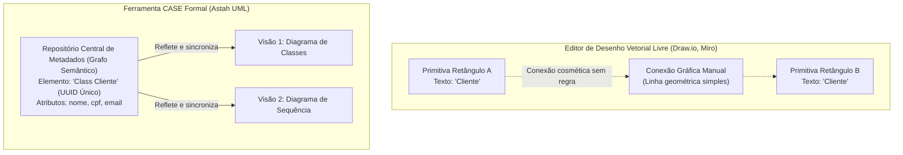

| Dimensão de Análise | Editores de Desenho Vetorial (Draw.io, Miro) | Ferramentas CASE Formais (Astah UML) |
| :--- | :--- | :--- |
| **Núcleo de Armazenamento** | Primitivas visuais 2D avulsas (coordenadas $X, Y$, cor e texto solto). | Repositório estruturado baseado no **Metamodelo UML da OMG**. |
| **Integridade Referencial** | Inexistente. Caixas com o mesmo nome são tratadas como textos independentes. | Absoluta. Modificar o nome ou tipo de um método atualiza todas as visões do projeto. |
| **Validação Sintática** | Nula. Permite relacionamentos ilegais perante a OMG (como herança cíclica). | Ativa. Bloqueia conexões sintaticamente inválidas e audita multiplicidades. |
| **Rastreabilidade** | Manual, sujeita a inconsistências e esquecimentos humanos. | Nativa, organizada em árvores hierárquicas de pacotes de projeto. |
| **Capacidade Operacional** | Apenas exportações gráficas (PNG, PDF, SVG). | Exportação de metadados (XMI), engenharia direta (código esqueleto) e reversa. |

### Instalação, JVM e configuração do Astah UML

O software Astah UML (desenvolvido pela corporação japonesa *Change Vision, Inc.*) é construído sobre a plataforma **Java Virtual Machine (JVM)**. Essa decisão de arquitetura garante portabilidade nativa entre ambientes operacionais (Windows, macOS e distribuições GNU/Linux), mas impõe a dependência de um ambiente de execução Java (JRE ou JDK) compatível.

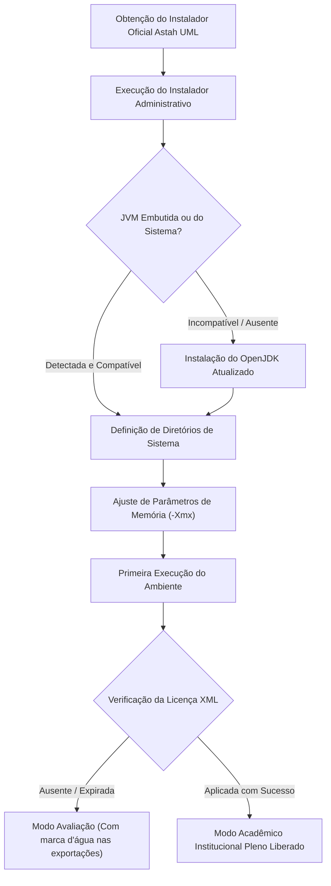

#### Parâmetros de Otimização e Diretrizes Técnicas
- **Alocação de Memória Heap da JVM:** Em sistemas complexos (com centenas de diagramas e classes), é indispensável verificar o arquivo de configuração do inicializador da JVM (`astah-uml.l4j.ini` no Windows ou `astah-uml.vmoptions` no macOS/Linux), ajustando o parâmetro `-Xmx` para pelo menos `1024m` ou `2048m`, evitando o erro de esgotamento de memória `java.lang.OutOfMemoryError`.
- **Codificação de Caracteres (*Encoding*):** O Astah deve ser mantido estritamente sob a codificação **UTF-8** para evitar corrupções em comentários e descrições com caracteres acentuados.
- **Formato Proprietário `.asta`:** O arquivo de projeto compactado contém a serialização binária do grafo de metadados, as coordenadas espaciais das representações visuais e as configurações do repositório.

### Arquitetura criptográfica de licenciamento institucional XML

A distribuição de autorizações institucionais para instituições de ensino parceiras (como a UniFEF) é operacionalizada por meio de arquivos estruturados em formato XML (`astah_uml_license_2025-2026.xml`). Diferente de chaves seriais comuns, o Astah adota um modelo de verificação de autenticidade e integridade baseado em **criptografia assimétrica e função hash**:

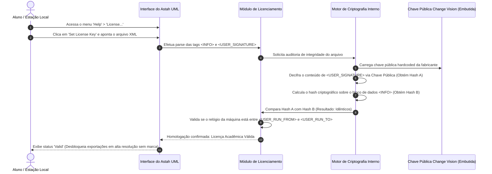

A integridade do documento é garantida pelas seguintes propriedades criptográficas:
1. **Inviolabilidade dos Dados:** Se um usuário alterar manualmente o conteúdo de `<USER_RUN_TO>` de `2026/08/31` para `2030/12/31`, o novo hash calculado na estação local divergirá do hash assinado pela Change Vision. O software identificará a adulteração e revogará a licença imediatamente.
2. **Validação Offline Autônoma:** Como a validação depende exclusivamente da **Chave Pública** embutida no binário da aplicação, o software valida o direito de uso sem necessidade de conexão com servidores de autenticação remotos.

| Tag Estrutural XML | Conteúdo Típico da Licença | Finalidade Técnica e Restrição |
| :--- | :--- | :--- |
| `<USER_ORGANIZATION>` | `Provided by Change Vision, Inc` | Identifica a entidade emissora da licença acadêmica. |
| `<USER_NAME>` | `Students` | Delimita o público beneficiário (estudantes e docentes). |
| `<USER_KIND>` | `astah_UML` | Restringe a ativação ao produto de modelagem UML. |
| `<USER_VERSION>` | `6.0` | Define a versão mínima/máxima do software suportada pelo licenciamento. |
| `<USER_RUN_FROM>` | `2025/07/02` | Marco temporal inicial para a execução do direito de uso. |
| `<USER_RUN_TO>` | `2026/08/31` | Marco temporal final de expiração dos privilégios acadêmicos. |
| `<USER_CONSTRAINT>` | `SingleUser` | Restrição de alocação por estação de trabalho individual. |
| `<USER_SIGNATURE>` | *(Sequência em Base64)* | Assinatura digital da fabricante gerada por chave privada sobre o bloco `<INFO>`. |

### Estrutura de repositório e árvore de modelos

Uma modelagem consistente no Astah UML exige a organização hierárquica do projeto em **Pacotes Lógicos** (*Packages*). O painel de navegação estrutural (*Structure Tree*) reflete a modularização arquitetural do sistema, segregando modelos conceituais, fluxos de requisitos e modelos estruturais:

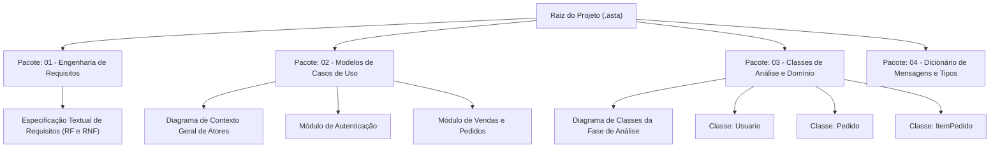

---

## Modelagem Comportamental: Atores e Casos de Uso

### Conceituação de atores na UML e fronteira do sistema

Na linguagem UML, um **Ator** representa um **papel coeso idealizado** desempenhado por uma entidade externa ao interagir diretamente com o sistema para consumir seus serviços ou fornecer estímulos operacionais.

- **Fronteira do Sistema (*System Boundary*):** É a linha divisória que separa o software daquilo que pertence ao ambiente externo. Atores residem **obrigatoriamente fora** da fronteira do sistema. Os casos de uso residem **obrigatoriamente dentro** da fronteira.
- **Distinção Fundamental entre Usuário e Ator:** Um usuário é um indivíduo específico do mundo real (exemplo: *"o colaborador João da Silva"*). Um ator é o papel funcional assumido perante o software (exemplo: `OperadorDeVendas`). Um mesmo indivíduo humano pode atuar como múltiplos atores no mesmo dia (como `Cliente` pela manhã e `Anunciante` à tarde).
- **Contraexemplo Clássico:** Desenhar atores dentro do retângulo da fronteira do sistema, ou criar um ator chamado *"Banco de Dados MySQL"*. O banco de dados faz parte da infraestrutura interna do software, não se constituindo em ator externo na fase de análise.

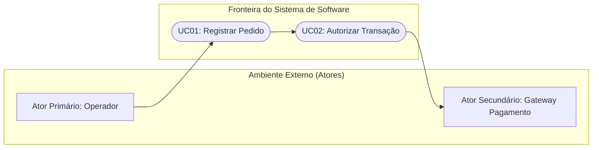

### Categorização de atores: primários, secundários e temporais

A Engenharia de Software classifica os atores em três categorias essenciais:

1. **Ator Primário:** É aquele que dá início direto à execução do caso de uso com o propósito de atingir um objetivo de negócio mensurável. Ele consome ativamente as funcionalidades do sistema (exemplo: `Cliente` iniciando a compra de mercadorias).
2. **Ator Secundário (ou de Suporte):** É o ator do qual o sistema necessita para completar um serviço secundário ou obter validações adicionais. Ele é acionado pelo próprio software de forma passiva (exemplo: um `Serviço de Cobrança Pix` externo acionado para liquidar um pagamento).
3. **Ator Temporal:** O papel exercido pelo próprio tempo (relógio do sistema ou agendador de tarefas/cron jobs) ao emitir sinais temporais predeterminados para iniciar fluxos automáticos sem intervenção humana (exemplo: fechamento diário de lotes de pedidos ou disparos noturnos de relatórios analíticos).

### Relacionamentos entre atores: herança e especialização

Quando múltiplos atores compartilham comportamentos e direitos operacionais comuns sobre o sistema, aplica-se o mecanismo de **Generalização/Especialização de Atores**:

```mermaid
flowchart TD
    UsuarioSistema["«actor»\nUsuário do Sistema\n(Ator Abstrato com acessos comuns)"]
    Admin["«actor»\nAdministrador\n(Especializado)"]
    Operador["«actor»\nOperador de Vendas\n(Especializado)"]

    Admin -->|Generalização / Herança| UsuarioSistema
    Operador -->|Generalização / Herança| UsuarioSistema

    UC_Login(["Realizar Login"])
    UC_Senha(["Alterar Senha Pessoal"])
    UC_Config(["Configurar Parâmetros de Rede"])
    UC_Venda(["Registrar Pedido de Venda"])

    UsuarioSistema --> UC_Login
    UsuarioSistema --> UC_Senha
    Admin --> UC_Config
    Operador --> UC_Venda
```

- **Semântica:** O ator `Administrador` e o ator `Operador de Vendas` herdam automaticamente as associações de `Usuário do Sistema`. Portanto, ambos têm acesso aos casos de uso de autenticação e recuperação de credenciais, sem a necessidade de traçar linhas redundantes no diagrama.

### Modularização funcional em sistemas corporativos

Em sistemas de grande porte, alocar dezenas de elipses de casos de uso em uma única folha de diagrama gera diagramas poluídos, que dificultam a leitura e a manutenção. A boa prática de engenharia adota a **decomposição por módulos funcionais coesos**:

- Agrupam-se os casos de uso de acordo com o departamento de negócio ou domínio de dados (exemplo: *Módulo Financeiro*, *Módulo de Recursos Humanos*, *Módulo Acadêmico*).
- Como demonstrado no estudo de caso do sistema **SCAESM** ministrado pelo Prof. Marcelo Boer, o módulo **Pessoa Funcionário** isola rigorosamente as ações executadas pelo ator `Funcionário` (tais como autenticação, consulta de prontuário e solicitação de licenças), criando fronteiras operacionais bem definidas.

### Estrutura do Quadro de Descrição de Caso de Uso

Os diagramas de casos de uso da UML resumem visualmente *o que* o sistema faz e *quem* interage com ele. Contudo, eles não descrevem *como* a interação se desenrola passo a passo. 

Para documentar os requisitos funcionais com precisão, adota-se o **Quadro de Descrição de Caso de Uso (DCU)**:

```text
================================================================================
Quadro Padronizado – DCU: [Identificador] [Nome do Caso de Uso]
--------------------------------------------------------------------------------
Ator Principal:
  Nome do papel que inicia o caso de uso.
Descrição da Ação:
  Resumo conciso do objetivo de negócio que o caso de uso cumpre.
Pré-requisito (Pré-condições):
  Estado obrigatório que o ambiente e os dados devem possuir antes da execução.
Fluxo Normal (Caminho Feliz):
  Passos numerados sequenciais alternando estímulo do ator e resposta do sistema.
Fluxo Alternativo (Ramificações e Falhas):
  Subpassos numerados hierarquicamente apontando desvios e regras de retorno.
Dados Manipulados:
  Listagem de atributos e parâmetros que trafegam nas entradas e saídas do fluxo.
================================================================================
```

### Redação de pré-requisitos, fluxo normal e fluxos alternativos

- **Pré-requisitos Operacionais:** Não confundir pré-requisito com o primeiro passo da tela. O pré-requisito estabelece uma condição de estado preexistente (exemplo: *"O usuário deve estar autenticado no sistema com perfil de operador ativo"*). Dizer que o pré-requisito é *"o usuário digitar a senha e clicar no botão"* constitui erro conceitual grave, pois essa é uma ação do próprio fluxo.
- **Fluxo Normal (Caminho Principal / Feliz):** Deve ser redigido sob a ótica da intenção do negócio, de forma neutra em termos de tecnologia de interface gráfica (evitar amarras como *"o usuário clica com o botão esquerdo no input `#txtNome`"*).
- **Mapeamento Rigoroso de Desvios nos Fluxos Alternativos:** Todo fluxo alternativo deve indicar precisamente o passo de origem do qual derivou e o ponto de retorno para o fluxo normal:

```text
Passo Normal 03: Sistema verifica a integridade do CPF digitado.
Fluxo Alternativo 3.1: Se o CPF digitado for inválido:
  3.1.1. Sistema exibe a mensagem MSG04 ("CPF informado é inválido");
  3.1.2. Sistema limpa o campo correspondente e retorna ao Passo 02 do Fluxo Normal.
```

---

## Modelagem Estrutural: Diagrama de Classes na Fase de Análise

### Classes conceituais versus classes de projeto/implementação

O **Diagrama de Classes da Fase de Análise** modela os conceitos estruturais do domínio de negócio. Ele não representa tabelas de banco de dados, nem classes de frameworks de interface gráfica ou de mapeamento objeto-relacional (ORM):

```mermaid
classDiagram
    direction LR
    class PedidoAnálise {
        <<Conceitual - Domínio>>
        -idPedido: Identificador
        -dataHora: DataHora
        -status: Texto
        -valorTotal: Decimal
        +calcularTotal() Decimal
        +atualizarStatus(novoStatus)
    }

    class PedidoProjeto {
        <<Implementação - Projeto>>
        -id: Long
        -uuid: UUID
        -created_at: java.sql.Timestamp
        -connectionPool: ConnectionPool
        +saveToDatabase(conn: Connection) boolean
        +toJsonString() String
        +renderHtmlComponent() View
    }
```

- **Na Fase de Análise:** Registram-se apenas atributos de domínio e métodos de regras de negócio essenciais. É estritamente vedado inserir atributos de infraestrutura tecnológica (como conexões de banco de dados, chaves estrangeiras declaradas manualmente como atributos ou referências a frameworks).
- **Na Fase de Projeto:** Introduzem-se as classes de controle, Data Access Objects (DAO), Data Transfer Objects (DTO) e as bibliotecas específicas da linguagem de programação.

### Tipagem abstrata de atributos e responsabilidades

Na fase conceitual, os tipos de dados devem refletir conceitos matemáticos ou lógicos universais, e não dialetos de banco de dados:
- Utiliza-se `Texto` ou `String` (nunca `VARCHAR(100)` ou `CHAR(2)`).
- Utiliza-se `Número`, `Inteiro` ou `Decimal` (nunca `FLOAT4`, `BIGINT` ou `NUMBER(10,2)`).
- Utiliza-se `Data` ou `DataHora` (nunca `DATETIME2` ou `TIMESTAMP WITH TIME ZONE`).
- Utiliza-se `Booleano` ou `Lógico` (nunca `TINYINT(1)` ou `BIT`).

### Relacionamentos: associação, agregação e composição

A UML padroniza as formas de acoplamento estrutural entre classes:

```mermaid
classDiagram
    direction LR
    class Cliente {
        -nome: Texto
    }
    class Pedido {
        -dataHora: DataHora
    }
    class ItemPedido {
        -quantidade: Inteiro
        -precoUnitario: Decimal
    }
    class Produto {
        -descricao: Texto
    }

    Cliente "1" --> "0..*" Pedido : realiza (Associação Direcional)
    Pedido "1" *-- "1..*" ItemPedido : composto por (Composição)
    ItemPedido "*" o-- "1" Produto : referencia (Agregação)
```

1. **Associação Simples:** Demonstra uma conexão semântica entre duas classes independentes. Possui nome de relação, navegabilidade e multiplicidades explícitas em ambas as pontas.
2. **Agregação (Todo-Parte Fraco — Losango Oco):** Indica que uma classe faz parte de outra, mas pode existir de forma independente no domínio. Se a classe "Todo" for excluída, a classe "Parte" continua existindo (exemplo: um `Produto` existe no catálogo da empresa independentemente de constar em um `ItemPedido`).
3. **Composição (Todo-Parte Forte — Losango Preenchido):** Indica um vínculo de dependência de existência absoluta. A classe "Parte" só faz sentido existencial se pertencer à classe "Todo". Se o `Pedido` for destruído, todas as suas instâncias subordinadas de `ItemPedido` perdem a razão de existir e são destruídas em cascata.

### Classes associativas e resolução de relacionamentos muitos-para-muitos

Em modelagem orientada a objetos de domínio, um relacionamento de multiplicidade muitos-para-muitos ($N:N$) frequentemente esconde dados que não pertencem exclusivamente a nenhuma das duas pontas.

- **Cenário:** Um `Pedido` pode conter muitos `Produtos`, e um `Produto` pode constar em múltiplos `Pedidos`.
- **Problema:** Onde armazenar a `quantidade` comprada daquele item específico? Se colocarmos `quantidade` em `Produto`, violamos a consistência conceitual (pois a quantidade varia a cada pedido). Se colocarmos em `Pedido`, precisaremos de arrays dinâmicos desnormalizados. Além disso, o preço de venda praticado no dia da compra deve ser congelado para proteger a transação de reajustes futuros de catálogo.
- **Solução Formal:** Cria-se uma **Classe Associativa** ou entidade intermediária resolvida denominada `ItemPedido`:

```mermaid
classDiagram
    direction LR
    class Pedido {
        -idPedido: Inteiro
        -dataHoraSolicitacao: DataHora
        -valorTotal: Decimal
    }
    class ItemPedido {
        -quantidade: Inteiro
        -precoUnitarioHistorico: Decimal
        -subtotal: Decimal
        +calcularSubtotal() Decimal
    }
    class Produto {
        -idProduto: Inteiro
        -nome: Texto
        -precoAtual: Decimal
    }

    Pedido "1" *-- "1..*" ItemPedido : contém
    ItemPedido "*" --> "1" Produto : referencia
```

### Generalização, especialização e o princípio DRY

O princípio **DRY (*Don't Repeat Yourself*)** postula que todo conhecimento em um sistema computacional deve possuir uma representação única, não ambígua e autoritativa.

Quando identificamos que entidades distintas compartilham um conjunto idêntico de atributos e métodos (como demonstrado na análise das entidades `Anunciante` e `Interessado` na Aula 01 e Aula 04 do Prof. Marcelo Boer), modelá-las como tabelas ou classes isoladas e duplicadas gera redundância cadastral:

```mermaid
classDiagram
    class Usuario {
        <<Superclasse - Generalização>>
        -idUsuario: Inteiro
        -nomeCompleto: Texto
        -email: Texto
        -telefoneWhatsApp: Texto
        -senhaHash: Texto
        -cpf: Texto
        -cidade: Texto
        -estado: Texto
        -bairro: Texto
        +fazerLogin(credenciais)
        +atualizarPerfil()
    }

    class Anunciante {
        <<Subclasse - Especializada>>
        -avaliacaoMediaVendedor: Decimal
        +publicarAnuncio(dados)
    }

    class Interessado {
        <<Subclasse - Especializada>>
        -avaliacaoMediaComprador: Decimal
        +enviarMensagemContato()
        +confirmarCompra()
    }

    Usuario <|-- Anunciante : Herança
    Usuario <|-- Interessado : Herança
```

- **Vantagem de Engenharia:** Centraliza os mecanismos de autenticação, criptografia de senhas, validações de documentos legais (CPF) e auditoria cadastral na superclasse base `Usuario`. As subclasses especializadas herdam a estrutura comum e acrescentam exclusivamente seus atributos e comportamentos específicos de perfil.

---

## Padrão Documental UniFEF para a Fase de Análise

### Estrutura formal da entrega AV2

Para a realização da Avaliação Oficial AV2 da disciplina de Engenharia de Software I, a UniFEF adota uma especificação documental rigorosa. Esta estrutura formal sintetiza a análise orientada a objetos preliminar de uma aplicação e deve conter as seguintes seções estruturantes:

1. **Contexto do Aplicativo:** Identificação, escopo explícito, limitações e público-alvo da aplicação;
2. **Lista de Atores e Diagrama de Atores:** Classificação dos papéis com diagramação de herança;
3. **Quadro 1 — Descrição dos Atores:** Tabela com identificador, categoria, responsabilidades e permissões;
4. **Diagrama de Contexto Geral (Por Ator):** Visualização completa do escopo operacional do sistema com fronteiras bem definidas;
5. **Lista de Casos de Uso:** Relação dos identificadores, títulos e metas de negócio;
6. **Lista Central de Mensagens do Sistema:** Dicionário com códigos formais, tipos e textos literais;
7. **Especificação de Casos de Uso Canônicos:** Diagramas isolados e Quadros de Descrição de Caso de Uso (DCU) completos para os fluxos essenciais;
8. **Diagrama de Classes da Fase de Análise:** Modelo estrutural conceitual com tipagem abstrata, associações e multiplicidades.

### Contexto do aplicativo e limites de escopo

A descrição do contexto estabelece formalmente os limites contratuais do software. Ela deve sanar ambiguidades, declarando o que o sistema fará e explicitando aquilo que **não** será contemplado:

```text
================================================================================
MODELO DE DECLARAÇÃO FORMAL DE ESCOPO
Sistema: SisVendas — Sistema de Automação Comercial Varejista
Escopo Incluído:
  - Autenticação e gestão individualizada de perfis de operadores;
  - Manutenção cadastral centralizada de produtos e clientes;
  - Emissão de pedidos com cálculo automatizado de subtotais e controle de status;
  - Validação transacional de pagamentos em dinheiro, Pix e cartões.
Limites Estritos de Escopo (Não Contemplado):
  - Emissão e autorização de notas fiscais eletrônicas junto à SEFAZ (módulo fiscal);
  - Conciliação bancária automática com arquivos de retorno CNAB;
  - Controle de rotas logísticas e fretes de terceiros.
================================================================================
```

### Listagem e Quadro Descritivo de Atores

Todos os atores mapeados devem ser registrados formalmente no documento através do **Quadro 1**:

| Identificador | Nome do Ator | Categoria | Descrição do Papel e Responsabilidades |
| :--- | :--- | :--- | :--- |
| **ACT01** | **Usuário do Sistema** | Humano (Abstrato) | Papel que reúne as credenciais e permissões básicas compartilhadas por todos os operadores humanos (Login, logout e alteração de senha). |
| **ACT02** | **Administrador** | Humano (Especializado) | Responsável pela gestão técnica global, concessão de acessos a novos operadores, auditoria de logs de segurança e manutenção do catálogo base. |
| **ACT03** | **Operador de Vendas** | Humano (Especializado) | Responsável pelo atendimento rotineiro aos clientes, registro de pedidos de venda no balcão e acompanhamento do status de montagem. |
| **ACT04** | **Serviço de Cobrança Pix**| Sistema Externo | API de terceiros (Instituição Financeira) consumida pelo sistema para emissão de chaves dinâmicas, validação e notificação de liquidação financeira. |

### Diagrama de Contexto Geral por Ator

O Diagrama de Contexto Geral agrupa o ecossistema de funcionalidades providas pela aplicação, estabelecendo as fronteiras entre o ambiente interno e as entidades externas:

```mermaid
flowchart LR
    subgraph FronteiraDoSistema["Fronteira do Sistema SisVendas"]
        UC01(["UC01: Realizar Login"])
        UC02(["UC02: Cadastrar Usuário"])
        UC03(["UC03: Cadastrar Cliente"])
        UC04(["UC04: Listar Clientes"])
        UC05(["UC05: Carregar Cliente"])
        UC06(["UC06: Alterar Cliente"])
        UC07(["UC07: Excluir Cliente"])
        UC08(["UC08: Consultar Auditoria"])
    end

    AtorAdmin["Administrador"]
    AtorOperador["Operador de Vendas"]

    AtorAdmin --> UC01
    AtorAdmin --> UC02
    AtorAdmin --> UC07
    AtorAdmin --> UC08

    AtorOperador --> UC01
    AtorOperador --> UC03
    AtorOperador --> UC04
    AtorOperador --> UC05
    AtorOperador --> UC06
```

### Lista de Casos de Uso e Dicionário Central de Mensagens

#### Lista Consolidada de Casos de Uso

| Identificador | Nome do Caso de Uso | Ator Primário | Objetivo / Meta de Negócio |
| :--- | :--- | :--- | :--- |
| **UC01** | Realizar Login | Usuário do Sistema | Validar as credenciais corporativas do operador e liberar os módulos permitidos. |
| **UC02** | Cadastrar | Operador de Vendas | Inserir novos registros de entidades de domínio garantindo integridade cadastral. |
| **UC03** | Listar | Operador de Vendas | Recuperar e exibir listagens tabulares de entidades com suporte a filtros de consulta. |
| **UC04** | Carregar | Operador de Vendas | Localizar e trazer os detalhes de uma entidade específica para a tela de visualização/edição. |
| **UC05** | Alterar | Operador de Vendas | Salvar modificações em atributos de uma entidade preexistente no banco de dados. |
| **UC06** | Excluir | Administrador | Remover fisicamente ou inativar logicamente uma entidade selecionada mediante confirmação. |

#### Dicionário Central de Mensagens do Sistema (MSG)
É vedado utilizar mensagens em texto livre espalhadas pela especificação. Todas as mensagens exibidas aos usuários devem ser centralizadas e identificadas:

| Código | Tipo da Mensagem | Texto Padronizado da Mensagem | Finalidade Operacional |
| :--- | :--- | :--- | :--- |
| **MSG01** | Erro | "Usuário ou senha inválidos. Por favor, confira suas credenciais." | Falha na autenticação (credencial inexistente ou senha divergente). |
| **MSG02** | Alerta | "Conta de usuário inativa ou suspensa. Contate o administrador." | Tentativa de login realizada por conta com bloqueio administrativo. |
| **MSG03** | Sucesso | "Autenticação efetuada com sucesso. Redirecionando..." | Validação bem-sucedida de credenciais de login. |
| **MSG04** | Erro | "Existem campos obrigatórios que não foram preenchidos: [Campos]." | Tentativa de submissão de formulário com dados obrigatórios em branco. |
| **MSG05** | Erro | "Registro já cadastrado com os dados informados: [Chave]." | Violação de chave única de negócio (ex.: CPF já existente na base). |
| **MSG06** | Sucesso | "Registro cadastrado com sucesso!" | Confirmação de persistência bem-sucedida de novo registro no banco. |
| **MSG07** | Alerta | "Nenhum registro encontrado para os critérios de busca informados." | Retorno de conjunto de dados vazio em operações de listagem e busca. |
| **MSG08** | Erro | "O registro solicitado não foi localizado ou foi removido recentemente." | Falha na operação de carga (ID não existente no banco de dados). |
| **MSG09** | Sucesso | "Alterações salvas com sucesso!" | Confirmação de persistência após atualização cadastral de dados. |
| **MSG10** | Confirmação | "Deseja realmente excluir o registro [Nome]? Esta operação é definitiva." | Diálogo de segurança exibido antes da efetivação de uma exclusão. |
| **MSG11** | Erro | "Não é possível excluir o registro: existem transações vinculadas." | Bloqueio de exclusão em virtude de regras de integridade referencial. |
| **MSG12** | Sucesso | "Registro excluído com sucesso!" | Confirmação formal da remoção do registro da base de dados. |

### Especificações canônicas: Login, Cadastrar, Listar, Carregar, Alterar e Excluir

Abaixo detalham-se as especificações completas dos casos de uso canônicos do sistema, no formato padrão exigido na avaliação AV2:

#### Caso de Uso UC01: Realizar Login

```mermaid
flowchart LR
    subgraph ModuloAcesso["Módulo de Controle de Acesso"]
        UC01(["UC01: Realizar Login"])
    end
    Ator["Usuário do Sistema"] --> UC01
```

```text
================================================================================
Quadro DCU — UC01: Realizar Login
--------------------------------------------------------------------------------
Ator Principal:
  Usuário do Sistema (Ator Primário).
Descrição da Ação:
  Autenticar o operador perante o sistema validando credenciais (login e senha).
Pré-requisito:
  O aplicativo deve estar operacional e com conectividade ativa com a base de dados.
Fluxo Normal:
  01. O usuário acessa a tela inicial do aplicativo;
  02. O sistema exibe o formulário solicitando identificador de login e senha;
  03. O usuário digita suas credenciais nos campos correspondentes;
  04. O usuário clica na ação "Entrar";
  05. O sistema verifica se os campos foram informados;
  06. O sistema consulta a base e valida a existência do login e o hash da senha;
  07. O sistema valida se o status da conta do usuário é "Ativo";
  08. O sistema inicializa a sessão autenticada, exibe MSG03 e abre o menu principal.
Fluxo Alternativo:
  5.1. Se o usuário deixar login ou senha em branco:
    5.1.1. O sistema exibe a mensagem MSG04 apontando os campos em branco;
    5.1.2. O sistema devolve o foco ao campo não preenchido no Passo 02.
  6.1. Se o login não existir ou a senha for inválida:
    6.1.1. O sistema exibe a mensagem MSG01;
    6.1.2. O sistema limpa o campo de senha e retorna ao Passo 02 do Fluxo Normal.
  7.1. Se a conta do usuário estiver com o status "Inativo" ou "Bloqueado":
    7.1.1. O sistema exibe a mensagem de alerta MSG02;
    7.1.2. O sistema cancela a inicialização da sessão e permanece no Passo 02.
Dados Manipulados:
  login, senha.
================================================================================
```

#### Caso de Uso UC02: Cadastrar

```mermaid
flowchart LR
    subgraph ModuloCadastros["Módulo de Gestão Cadastral"]
        UC02(["UC02: Cadastrar"])
    end
    Ator["Operador de Vendas"] --> UC02
```

```text
================================================================================
Quadro DCU — UC02: Cadastrar
--------------------------------------------------------------------------------
Ator Principal:
  Operador de Vendas (Ator Primário).
Descrição da Ação:
  Registrar uma nova entidade de negócio no sistema garantindo dados válidos.
Pré-requisito:
  O operador deve estar previamente autenticado no sistema (UC01).
Fluxo Normal:
  01. O operador aciona a opção "Novo Registro" no menu correspondente;
  02. O sistema renderiza o formulário com os campos vazios;
  03. O operador preenche os campos requeridos (nome, CPF, telefone, endereço);
  04. O operador clica no botão "Gravar";
  05. O sistema valida o preenchimento de todos os campos obrigatórios;
  06. O sistema valida o formato matemático do CPF informado;
  07. O sistema verifica se já existe outro registro com a mesma chave (CPF);
  08. O sistema persiste as informações no banco de dados;
  09. O sistema exibe a mensagem MSG06 e retorna para a tela de listagem (UC03).
Fluxo Alternativo:
  5.1. Se houver algum campo obrigatório em branco:
    5.1.1. O sistema interrompe o processamento e exibe a mensagem MSG04;
    5.1.2. O sistema destaca visualmente os campos faltantes no Passo 02.
  6.1. Se o CPF for matematicamente inválido:
    6.1.1. O sistema exibe mensagem de alerta informando erro de digitação do CPF;
    6.1.2. O sistema posiciona o cursor no campo de CPF e aguarda correção.
  7.1. Se o CPF já constar na base de dados para outro cliente:
    7.1.1. O sistema exibe a mensagem de erro MSG05;
    7.1.2. O sistema encerra o cadastro sem gravar e mantém os dados na tela.
Dados Manipulados:
  nome, cpf, telefone, email, endereco.
================================================================================
```

#### Caso de Uso UC03: Listar

```mermaid
flowchart LR
    subgraph ModuloConsultas["Módulo de Consultas e Relatórios"]
        UC03(["UC03: Listar"])
    end
    Ator["Operador de Vendas"] --> UC03
```

```text
================================================================================
Quadro DCU — UC03: Listar
--------------------------------------------------------------------------------
Ator Principal:
  Operador de Vendas (Ator Primário).
Descrição da Ação:
  Consultar e visualizar listagem tabular das entidades cadastradas na aplicação.
Pré-requisito:
  O operador deve estar previamente autenticado no sistema (UC01).
Fluxo Normal:
  01. O operador aciona o menu "Consultar Registros";
  02. O sistema recupera os registros mais recentes e apresenta em tabela com colunas:
      Código, Nome, Telefone, Cidade e Ações;
  03. O operador digita um parâmetro no campo de filtro rápido (Nome ou CPF);
  04. O operador clica na opção "Filtrar";
  05. O sistema executa a consulta na base aplicando os critérios;
  06. O sistema localiza os registros correspondentes;
  07. O sistema atualiza a tabela em tela exibindo as linhas retornadas.
Fluxo Alternativo:
  6.1. Se a consulta não retornar nenhum registro correspondente:
    6.1.1. O sistema limpa as linhas da tabela e apresenta a mensagem MSG07;
    6.1.2. O sistema mantém o campo de filtro disponível para nova consulta.
Dados Manipulados:
  parametroFiltro, listaRegistrosRetornados.
================================================================================
```

#### Caso de Uso UC04: Carregar

```mermaid
flowchart LR
    subgraph ModuloNavegacao["Módulo de Recuperação de Registros"]
        UC04(["UC04: Carregar"])
    end
    Ator["Operador de Vendas"] --> UC04
```

```text
================================================================================
Quadro DCU — UC04: Carregar
--------------------------------------------------------------------------------
Ator Principal:
  Operador de Vendas (Ator Primário).
Descrição da Ação:
  Recuperar todas as informações detalhadas de uma entidade para visualização ou edição.
Pré-requisito:
  O operador deve estar visualizando a tela de listagem de registros (UC03).
Fluxo Normal:
  01. Na tabela da listagem, o operador clica no botão "Visualizar/Editar" da linha;
  02. O sistema identifica o identificador único (ID) do registro selecionado;
  03. O sistema busca no banco de dados o registro correspondente àquele ID;
  04. O sistema encontra o registro;
  05. O sistema preenche todos os campos do formulário na tela com os dados recuperados;
  06. O formulário é liberado para o operador (para consulta ou alteração via UC05).
Fluxo Alternativo:
  4.1. Se o registro selecionado tiver sido excluído por outro operador simultaneamente:
    4.1.1. O sistema identifica que o ID não existe mais na base;
    4.1.2. O sistema apresenta a mensagem de erro MSG08;
    4.1.3. O sistema atualiza a lista de registros e retorna ao Passo 02 do UC03.
Dados Manipulados:
  idRegistroSelecionado, dadosCompletosDoRegistro.
================================================================================
```

#### Caso de Uso UC05: Alterar

```mermaid
flowchart LR
    subgraph ModuloManutencao["Módulo de Manutenção Cadastral"]
        UC05(["UC05: Alterar"])
    end
    Ator["Operador de Vendas"] --> UC05
```

```text
================================================================================
Quadro DCU — UC05: Alterar
--------------------------------------------------------------------------------
Ator Principal:
  Operador de Vendas (Ator Primário).
Descrição da Ação:
  Atualizar os dados de um registro preexistente que foi carregado previamente na tela.
Pré-requisito:
  O registro alvo deve ter sido carregado com sucesso em tela (UC04).
Fluxo Normal:
  01. O operador edita os campos desejados (exemplo: telefone ou endereço);
  02. O operador clica no botão "Salvar Alterações";
  03. O sistema valida se todos os campos de preenchimento obrigatório permanecem preenchidos;
  04. O sistema atualiza o registro na base de dados com as novas informações;
  05. O sistema emite a mensagem de confirmação MSG09;
  06. O sistema atualiza a visualização e bloqueia os campos contra edição acidental.
Fluxo Alternativo:
  3.1. Se o operador apagar o conteúdo de algum campo de preenchimento obrigatório:
    3.1.1. O sistema suspende a gravação e apresenta a mensagem de erro MSG04;
    3.1.2. O sistema mantém o formulário aberto permitindo a reinserção do dado.
Dados Manipulados:
  idRegistro, novosDadosModificados.
================================================================================
```

#### Caso de Uso UC06: Excluir

```mermaid
flowchart LR
    subgraph ModuloExclusao["Módulo de Exclusão de Registros"]
        UC06(["UC06: Excluir"])
    end
    Ator["Administrador"] --> UC06
```

```text
================================================================================
Quadro DCU — UC06: Excluir
--------------------------------------------------------------------------------
Ator Principal:
  Administrador (Ator Primário com privilégios de gestão).
Descrição da Ação:
  Excluir definitivamente ou inativar logicamente um registro do sistema.
Pré-requisito:
  O operador deve possuir perfil de Administrador e selecionar um item na lista (UC03).
Fluxo Normal:
  01. Na tabela de listagem, o administrador clica no botão "Excluir" do registro;
  02. O sistema exibe uma caixa modal de confirmação contendo a mensagem MSG10;
  03. O administrador confirma a operação clicando no botão "Confirmar Exclusão";
  04. O sistema verifica as regras de integridade referencial do banco de dados;
  05. O sistema confirma que não há dependências ativas vinculadas àquele registro;
  06. O sistema remove o registro da base de dados;
  07. O sistema exibe a mensagem de sucesso MSG12 e atualiza a listagem de registros.
Fluxo Alternativo:
  03.1. Se o administrador desistir da operação clicando em "Cancelar":
    03.1.1. O sistema fecha a janela modal sem realizar nenhuma exclusão;
    03.1.2. O sistema retorna à listagem inalterada no Passo 02 do UC03.
  05.1. Se existirem movimentações operacionais atreladas ao registro (ex.: pedidos emitidos):
    05.1.1. O sistema bloqueia a exclusão física e emite a mensagem de erro MSG11;
    05.1.2. O sistema sugere ao administrador realizar apenas a inativação cadastral.
Dados Manipulados:
  idRegistroExclusao, confirmacaoUsuario.
================================================================================
```

---

## Estudos de Caso Consolidados

### Estudo de Caso 1: Aplicativo Desapega Já

#### Cenário do Problema e Proposta de Valor
Muitas pessoas acumulam bens duráveis e semiduráveis em perfeito estado funcional (móveis, roupas, livros, aparelhos eletrônicos) por falta de canais práticos de intermediação local. O envio tradicional via frete nacional encarece a transação e adiciona atritos logísticos e riscos de fraude.

A proposta de valor do **Desapega Já** é estabelecer uma plataforma móvel orientada à **economia circular hiperlocal**: conectar vendedores e compradores que residam na mesma cidade e bairro, viabilizando negociações diretas, retiradas presenciais e custo logístico zero.

#### Elicitação e Refinamento de Requisitos

```mermaid
flowchart TD
    subgraph ElicitacaoBruta["Requisitos Brutos Levantados"]
        RF01_B["RF01: Facilitar a venda de produtos"]
        RF02_B["RF02: Permitir anúncio de produtos"]
        RF03_B["RF03: Cadastro de interessados em comprar"]
        RF04_B["RF04: Facilitar busca por proximidade"]
        RF05_B["RF05: Histórico de contatos e avaliações"]
        RF06_B["RF06: Cadastro de quem faz oferta"]
        RF07_B["RF07: Cadastro de produtos a serem vendidos"]
        RF08_B["RF08: Possibilitar troca de mensagens"]
    end

    subgraph RefinamentoEngenharia["Refinamento Formal da Engenharia"]
        MetaNeg["Meta de Negócio do Produto (Deriva RF02, RF05, RF08)"]
        RF02_R["RF02/07: Publicar anúncio com fotos, categoria e preço"]
        RF03_R["RF03/06: Autocadastro de Usuário (Anunciante e Comprador)"]
        RF04_R["RF04: Filtragem de anúncios por estado, cidade e bairro"]
        RF05_R["RF05: Gerar log de contatos e avaliações de reputação"]
        RF08_R["RF08: Mensageria interna direta sobre anúncio"]
    end

    RF01_B --> MetaNeg
    RF02_B & RF07_B --> RF02_R
    RF03_B & RF06_B --> RF03_R
    RF04_B --> RF04_R
    RF05_B --> RF05_R
    RF08_B --> RF08_R
```

#### Diagrama de Classes de Análise — Desapega Já

```mermaid
classDiagram
    class Usuario {
        -idUsuario: Inteiro
        -nomeCompleto: Texto
        -email: Texto
        -telefoneWhatsApp: Texto
        -senhaHash: Texto
        -cidade: Texto
        -estado: Texto
        -bairro: Texto
        -cpf: Texto
        -dataNascimento: Data
        +fazerLogin(credenciais)
        +atualizarPerfil()
    }

    class Anunciante {
        -reputacaoVendedor: Decimal
        +criarAnuncio(dados)
    }

    class Interessado {
        -reputacaoComprador: Decimal
        +buscarPorProximidade(cidade, bairro)
        +enviarMensagem(texto)
    }

    class Categoria {
        -idCategoria: Inteiro
        -nome: Texto
    }

    class Anuncio {
        -idAnuncio: Inteiro
        -titulo: Texto
        -descricao: Texto
        -preco: Decimal
        -status: Texto
        -fotos: ListaDeTexto
        -dataPublicacao: DataHora
        +publicar()
        +marcarComoVendido()
    }

    class MensagemContato {
        -idMensagem: Inteiro
        -dataHoraEnvio: DataHora
        -conteudoTexto: Texto
        -lida: Booleano
        +enviar()
        +marcarComoLida()
    }

    Usuario <|-- Anunciante : Generalização
    Usuario <|-- Interessado : Generalização
    Anunciante "1" --> "0..*" Anuncio : publica
    Anuncio "*" --> "1" Categoria : categorizado_em
    Interessado "1" --> "0..*" MensagemContato : remete
    Anuncio "1" --> "0..*" MensagemContato : contextualiza
```

---

### Estudo de Caso 2: Açaiteria Sabor da Amazônia

#### Enunciado e Problemas do Domínio
A empresa enfrenta filas excessivas nos horários de pico, frequentes erros manuais na montagem das tigelas, falta de controle automatizado de estoque, desorganização dos registros financeiros e total ineficácia no acompanhamento de seu programa de fidelidade por meio de carimbos físicos em cartões de papel.

Para sanar os gargalos operacionais, a direção deliberou pela concepção de uma aplicação móvel com gestão centralizada.

#### Mapeamento de Classes e Estrutura de Domínio

```mermaid
classDiagram
    direction TB
    class Cliente {
        -idCliente: Inteiro
        -nome: Texto
        -telefone: Texto
        -pontosFidelidade: Inteiro
        +consultarPontos() Inteiro
        +resgatarPontos(qtd: Inteiro) Booleano
    }

    class Gerente {
        -idGerente: Inteiro
        -nome: Texto
        -login: Texto
        -senhaHash: Texto
        +emitirRelatorioVendas(dataInicio, dataFim)
        +ajustarEstoque()
    }

    class Produto {
        -idProduto: Inteiro
        -nome: Texto
        -descricao: Texto
        -preco: Decimal
        -categoria: Texto
    }

    class Pedido {
        -idPedido: Inteiro
        -dataHoraSolicitacao: DataHora
        -statusAcompanhamento: Texto
        -valorTotal: Decimal
        +calcularTotal() Decimal
        +atualizarStatus(novoStatus: Texto)
    }

    class ItemPedido {
        -idItemPedido: Inteiro
        -quantidade: Inteiro
        -precoUnitarioHistorico: Decimal
        -subtotal: Decimal
        +calcularSubtotal() Decimal
    }

    class Pagamento {
        -idPagamento: Inteiro
        -formaPagamento: Texto
        -situacaoTransacao: Texto
        -dataHoraPagamento: DataHora
        -valorTransacao: Decimal
        +autorizar()
    }

    Cliente "1" --> "0..*" Pedido : solicita
    Gerente "1" --> "0..*" Pedido : supervisiona
    Pedido "1" *-- "1..*" ItemPedido : composto por
    ItemPedido "*" --> "1" Produto : referencia
    Pedido "1" --> "1" Pagamento : liquidado por
```

#### Requisitos Funcionais e Não Funcionais da Açaiteria

```text
================================================================================
ESPECIFICAÇÃO DE REQUISITOS — AÇAITERIA SABOR DA AMAZÔNIA
Requisitos Funcionais (RF):
  - RF01: O sistema deve permitir o autocadastro do cliente via nome e telefone celular.
  - RF02: O sistema deve manter o catálogo de produtos (açaís, smoothies e complementos).
  - RF03: O sistema deve permitir que o cliente monte pedidos com múltiplos itens.
  - RF04: O sistema deve calcular automaticamente o subtotal de itens e o valor total do pedido.
  - RF05: O sistema deve controlar o fluxo de status: "Aguardando", "Em Preparo" e "Finalizado".
  - RF06: O sistema deve processar pagamentos integrados nas modalidades Pix e Cartões.
  - RF07: O sistema deve creditar 1 ponto de fidelidade a cada R$ 10,00 gastos no aplicativo.
  - RF08: O sistema deve gerar relatórios gerenciais consolidados de vendas por período.

Requisitos Não Funcionais (RNF):
  - RNF01 (Desempenho): A atualização de status do pedido para o cliente não deve 
    ultrapassar 2 segundos de latência através de WebSockets em redes móveis 4G.
  - RNF02 (Segurança): As transações financeiras devem obedecer a certificados digitais TLS 1.3.
  - RNF03 (Disponibilidade): O sistema deve garantir disponibilidade mensal de 99,5% nos 
    horários de atendimento comercial (11:00 às 23:00).
  - RNF04 (Usabilidade): A interface móvel do cardápio deve ser compatível com as diretrizes
    Material Design (Android) e Human Interface Guidelines (iOS).
================================================================================
```

---

### Estudo de Caso 3: Sistema Acadêmico e Municipal SCAESM

#### Contexto e Módulo Pessoa Funcionário
O SCAESM (Sistema de Controle Acadêmico / Escolar / de Serviços / Municipal) é uma plataforma corporativa pública documentada pelo Prof. Marcelo Boer. Em razão de sua magnitude institucional, o software foi decomposto em módulos de negócio.

No módulo **Pessoa Funcionário**, modela-se o comportamento do ator `Funcionário` perante as rotinas administrativas da repartição.

```mermaid
flowchart TD
    subgraph SCAESM_ModuloPessoaFuncionario["SCAESM — Módulo Pessoa Funcionário"]
        UC_Login(["Funcionário Logar"])
        UC_Cadastrais(["Consultar Dados Cadastrais"])
        UC_Senha(["Alterar Senha Pessoal"])
    end

    AtorFuncionario["«actor»\nFuncionário"] --> UC_Login
    AtorFuncionario --> UC_Cadastrais
    AtorFuncionario --> UC_Senha
```

#### Diagrama de Sequência de Execução — Autenticação no SCAESM

```mermaid
sequenceDiagram
    autonumber
    actor Funcionario as Ator: Funcionário
    participant Navegador as Interface Web
    participant Controller as Módulo SCAESM
    participant Banco as Base de Pessoal

    Funcionario->>Navegador: 1. Informa URL institucional no navegador
    Navegador->>Controller: Requisita recurso protegido
    Controller-->>Navegador: 2. Gera e renderiza tela de login
    Funcionario->>Navegador: 3. Digita matrícula e senha
    Funcionario->>Navegador: 4. Clica na ação "Logar"
    Navegador->>Controller: Submete credenciais via HTTPS POST
    Controller->>Banco: 5. Executa consulta para checar cadastro e hash
    Banco-->>Controller: Retorna registro ativo e confirma autenticidade
    Controller-->>Navegador: 6. Emite sessão e renderiza painel inicial do funcionário
    Navegador-->>Funcionario: Apresenta interface do Módulo Pessoa Funcionário
```

---

### Estudo de Caso 4: SisVendas Corporativo

#### Domínio de Varejo Comercial
O SisVendas representa a implementação de referência adotada para guiar os alunos no padrão da avaliação oficial AV2 da disciplina. O sistema centraliza a automação comercial balcão de lojas de departamentos e franquias comerciais, resolvendo a duplicidade de cadastros e mantendo a rastreabilidade total das movimentações de estoque e caixa.

#### Diagrama Geral de Classes da Fase de Análise — SisVendas

```mermaid
classDiagram
    direction TB
    class Usuario {
        -idUsuario: Inteiro
        -nome: Texto
        -login: Texto
        -senhaHash: Texto
        -status: Texto
        +autenticar()
    }

    class Administrador {
        -nivelAcesso: Inteiro
        +auditarOperacoes()
    }

    class OperadorVendas {
        -matriculaVendedor: Texto
        +abrirCaixa()
    }

    class Cliente {
        -idCliente: Inteiro
        -nomeCompleto: Texto
        -cpfCnpj: Texto
        -telefone: Texto
        -email: Texto
        -limiteCredito: Decimal
        +consultarInadimplencia() Booleano
    }

    class Produto {
        -idProduto: Inteiro
        -codigoBarras: Texto
        -descricao: Texto
        -precoVenda: Decimal
        -saldoEstoque: Decimal
        +baixarEstoque(quantidade: Decimal)
    }

    class PedidoVenda {
        -idPedidoVenda: Inteiro
        -dataHoraEmissao: DataHora
        -statusVenda: Texto
        -valorTotal: Decimal
        +calcularTotal() Decimal
    }

    class ItemVenda {
        -idItemVenda: Inteiro
        -quantidade: Decimal
        -precoUnitarioPraticado: Decimal
        -subtotal: Decimal
        +calcularSubtotal() Decimal
    }

    class TransacaoFinanceira {
        -idTransacao: Inteiro
        -meioPagamento: Texto
        -valor: Decimal
        -statusTransacao: Texto
        +processar()
    }

    Usuario <|-- Administrador : Generalização
    Usuario <|-- OperadorVendas : Generalização
    OperadorVendas "1" --> "0..*" PedidoVenda : registra
    Cliente "1" --> "0..*" PedidoVenda : adquire
    PedidoVenda "1" *-- "1..*" ItemVenda : contém
    ItemVenda "*" --> "1" Produto : referencia
    PedidoVenda "1" --> "1..*" TransacaoFinanceira : amortizado_por
```

---

## Manutenção e Sustentação de Software

### Taxonomia de manutenção de software

O ciclo de vida de uma aplicação não termina com a sua implantação em produção. Conforme normas consolidadas de Engenharia de Software (como a **ISO/IEC/IEEE 14764**), as atividades de sustentação e evolução de sistemas dividem-se em **quatro modalidades canônicas**:

```mermaid
pie title Distribuição Típica de Esforço na Manutenção de Software em Produção
    "Evolutiva / Perfectiva" : 50
    "Corretiva" : 20
    "Adaptativa" : 25
    "Preventiva" : 5
```

1. **Manutenção Corretiva:**
   - **Definição:** Ação reativa executada para diagnosticar, isolar e corrigir falhas ativas, bugs, comportamentos incorretos ou travamentos que impeçam o sistema de operar conforme sua especificação original.
   - **Exemplo Real:** Corrigir uma exceção de ponteiro nulo (`NullPointerException`) que ocorre quando o cliente tenta salvar um pedido de açaí sem selecionar nenhum complemento.
   - **Contraexemplo:** Modificar a interface gráfica para incluir o cálculo de cashback (isto é manutenção evolutiva, não corretiva).

2. **Manutenção Adaptativa:**
   - **Definição:** Modificação do software motivada por alterações externas no ambiente operacional, tecnológico, organizacional ou legal, sem alterar as funcionalidades essenciais do negócio.
   - **Exemplo Real:** Atualizar o conector de banco de dados para suportar a nova versão do PostgreSQL, ou reconfigurar os cálculos de retenção tributária para atender a uma nova alíquota do ICMS promulgada pela Receita Estadual.
   - **Contraexemplo:** Refatorar o código para melhorar a legibilidade interna (isto é manutenção preventiva).

3. **Manutenção Preventiva (Engenharia Reversa / Refatoração):**
   - **Definição:** Alterações proativas realizadas no software para detectar e corrigir falhas latentes antes que elas se manifestem como defeitos operacionais em produção, ou para aprimorar a manutenibilidade e a clareza da arquitetura sem alterar seu comportamento externo observável.
   - **Exemplo Real:** Refatorar uma classe "Deus" (*God Class*) de 3.000 linhas em quatro classes coesas de domínio; adicionar índices em colunas de busca do banco de dados para prevenir a degradação da performance antes do aumento previsto de tráfego.

4. **Manutenção Evolutiva (ou Perfectiva):**
   - **Definição:** Adição de novos requisitos funcionais, relatórios analíticos, otimizações de performance e melhorias de usabilidade demandadas pelo crescimento do negócio ou pela expansão das necessidades dos usuários.
   - **Exemplo Real:** Adicionar suporte a pagamentos automáticos via Carteira Digital (Apple Pay e Google Pay) no aplicativo da Açaiteria Sabor da Amazônia.

### Fatores geradores de custo e mitigação arquitetural

Estudos clássicos da Engenharia de Software (Lientz & Swanson, 1980; Sommerville, 2011) apontam que **entre 60% e 80% do custo financeiro total gasto em um produto de software ao longo de toda a sua existência ocorre na fase de manutenção**, e não durante o desenvolvimento inicial.

```mermaid
flowchart TD
    subgraph CausasDoAltoCusto["Fatores Geradores de Custo Excessivo na Manutenção"]
        C1["Falta de Abstração e Documentação Inicial"]
        C2["Acoplamento Extremo entre Camadas de Negócio e Dados"]
        C3["Ausência de Testes Automatizados de Regressão"]
        C4["Rotatividade da Equipe Técnica (Perda do Conhecimento Tácito)"]
    end

    subgraph PraticasMitigadoras["Diretrizes Arquiteturais Mitigadoras"]
        M1["Modelagem Semântica Rigorosa na Fase de Análise (Astah)"]
        M2["Respeito ao Princípio DRY e Separação de Responsabilidades"]
        M3["Especificações Formais de Casos de Uso com DCUs Padronizados"]
        M4["Adoção de Modelos de Processo Orientados a Riscos e Feedback"]
    end

    C1 --> M1
    C2 --> M2
    C3 --> M3
    C4 --> M4
```

---

## Banco de Questões e Simulado Exaustivo para AV1 e AV2

### Questões discursivas com resolução comentada

#### Questão 01 (Abstração e Engenharia de Requisitos)
**Enunciado:** Em uma reunião de levantamento para o aplicativo *Desapega Já*, o cliente afirmou: *"O sistema deve ser intuitivo, fácil de usar e permitir que o anunciante venda seu produto rapidamente."* Analise a declaração sob a ótica dos critérios formais de qualidade de requisitos (ISO/IEC/IEEE 29148) e proponha a sua reestruturação de engenharia.
- **Resolução Comentada:**
  - **Crítica Técnica:** A declaração falha em dois critérios essenciais: não é atômica e não é testável (verificável). Os termos "intuitivo" e "fácil de usar" são subjetivos, impedindo a verificação booleana (Passou/Falhou) por um engenheiro de testes. Além disso, "permitir que venda rapidamente" é um objetivo corporativo ou de mercado, e não um comportamento do sistema computacional.
  - **Reestruturação Proposta:**
    - *Objetivo de Negócio:* Ampliar a liquidez de vendas locais de produtos seminovos.
    - *RF01 (Funcional):* "O sistema deve permitir que o usuário autenticado publique anúncios informando título, descrição, categoria, fotos (de 1 a 5 imagens) e preço de venda."
    - *RNF01 (Usabilidade / Métrico):* "A interface de publicação de anúncios deve ser estruturada em formulário passo a passo, permitindo que 90% dos usuários novatos concluam o cadastro de um anúncio em até 3 minutos, com taxa de erro de preenchimento inferior a 5% no primeiro teste."

#### Questão 02 (Modelos de Processo e Matriz de Decisão)
**Enunciado:** Compare o Modelo Cascata e o Modelo Espiral de Barry Boehm com base em seus mecanismos de alocação e mitigação de riscos técnicos ao projetar um sistema de monitoramento de usinas nucleares.
- **Resolução Comentada:**
  - O Modelo Cascata aloca o planejamento no início e assume que os riscos foram integralmente compreendidos antes da escrita do código. Se houver um risco arquitetural latente (ex.: latência nos sensores de pressão sob superaquecimento), o erro só será descoberto na fase de testes integrados, quando o custo de modificação alcança seu patamar mais elevado (fator $50\times$ a $100\times$).
  - O Modelo Espiral coloca a gestão de riscos no coração de seu método (Quadrante 2). Se houver risco arquitetural na comunicação dos sensores, a equipe de engenharia desenvolve um *spike* técnico (protótipo de estresse) e executa simulações matemáticas na primeira volta da espiral. A decisão de avançar para a construção é tomada após a mitigação do risco.

#### Questão 03 (Metamodelo CASE e Astah UML)
**Enunciado:** Diferencie a exclusão de uma classe por meio da tecla `Delete` no diagrama visual da exclusão definitiva através do catálogo estrutural (*Structure Tree*) no Astah UML.
- **Resolução Comentada:**
  - Ao pressionar `Delete` na visualização gráfica de um diagrama, o Astah UML apenas remove o elemento visual daquela visão específica, mantendo a classe, seus atributos e seus métodos vivos e íntegros no Repositório de Metadados (*Model Tree*). Caso ela seja referenciada em outros diagramas (como sequência ou estado), continuará existindo.
  - Para remover a entidade de forma definitiva de todo o sistema e de todas as visões correlacionadas, o analista deve executar a exclusão a partir da árvore de estrutura de modelos (*Structure Tree*), rompendo os metadados do grafo semântico do arquivo `.asta`.

#### Questão 04 (Modelagem Estrutural e o Princípio DRY)
**Enunciado:** No estudo de caso da Açaiteria Sabor da Amazônia, justifique a necessidade da criação da classe associativa `ItemPedido` entre as classes `Pedido` e `Produto`.
- **Resolução Comentada:**
  - A relação conceitual entre `Pedido` e `Produto` é de multiplicidade muitos-para-muitos ($N:N$). Um pedido reúne múltiplos produtos e um produto pode constar em múltiplos pedidos ao longo do tempo.
  - Atributos cruciais como `quantidade` comprada pertencem exclusivamente ao evento da associação. Além disso, o atributo `precoUnitarioHistorico` deve ser congelado no momento da emissão da compra; caso contrário, se a açaiteria reajustasse o valor de catálogo do açaí no mês seguinte, os totais dos pedidos antigos gravados no histórico financeiro seriam recalculados e violariam a contabilidade da empresa. A classe associativa `ItemPedido` resolve o relacionamento muitos-para-muitos e garante a integridade dos dados históricos.

---

### Dataset estruturado de revisão rápida em JSONL

```jsonl
{"id": 1, "topico": "Abstracao", "pergunta": "Qual a diferenca fundamental entre o dominio do problema e o dominio da solucao?", "resposta": "O dominio do problema foca nas necessidades, regras de negocio e processos do mundo real dos stakeholders; o dominio da solucao foca na arquitetura, modelos tecnicos, banco de dados e codigo-fonte necessarios para implementar o software."}
{"id": 2, "topico": "Requisitos", "pergunta": "Por que a afirmacao 'o software deve ser confiavel' nao e um bom requisito nao funcional?", "resposta": "Porque e uma declaracao puramente subjetiva e desprovida de metrica verificavel; para ser valida, deve ser acompanhada de parametros quantificaveis, tais como disponibilidade minima de 99,9% ou MTBF superior a 1000 horas."}
{"id": 3, "topico": "Requisitos", "pergunta": "Qual a diferenca entre requisitos permanentes e requisitos volateis segundo Sommerville?", "resposta": "Requisitos permanentes estao atrelados ao nucleo estruturante e imutavel do negocio da organizacao; requisitos volateis sao aqueles sujeitos a frequentes alteracoes motivadas pelo mercado, novas politicas ou dinamica de usuarios."}
{"id": 4, "topico": "Processos", "pergunta": "Quais sao as quatro atividades fundamentais presentes em qualquer processo de desenvolvimento de software?", "resposta": "Especificacao de software, Desenvolvimento de software, Validacao de software e Evolucao de software."}
{"id": 5, "topico": "Processos", "pergunta": "Qual e a forca motriz essencial que orienta a tomada de decisao nas iteracoes do Modelo Espiral de Barry Boehm?", "resposta": "A analise e mitigacao sistematica de riscos tecnicos, arquiteturais e de gestao em cada volta da espiral."}
{"id": 6, "topico": "Processos", "pergunta": "Qual e o marco arquitetural mais critico do Rational Unified Process (RUP) e em qual fase ele ocorre?", "resposta": "O marco e o Lifecycle Architecture (LCA), que ocorre ao final da fase de Elaboracao, atestando que a linha de base arquitetural foi validada e os riscos mitigados."}
{"id": 7, "topico": "Ferramentas CASE", "pergunta": "Por que editores vetoriais como Draw.io nao sao classificados como ferramentas CASE formais?", "resposta": "Porque editores vetoriais operam sobre primitivas graficas isoladas sem validacao de integridade referencial ou conformidade com o metamodelo formal da OMG."}
{"id": 8, "topico": "Ferramentas CASE", "pergunta": "Como o Astah UML valida sua licenca institucional XML de forma 100% offline?", "resposta": "Ele decifra a assinatura digital da tag USER_SIGNATURE utilizando a Chave Publica da fabricante embutida no software e a compara com o hash recalculado do bloco INFO."}
{"id": 9, "topico": "UML Casos de Uso", "pergunta": "Um ator na UML pode representar um sistema de computador externo?", "resposta": "Sim, um ator e qualquer entidade externa ao sistema que consome ou providencia dados, englobando pessoas, sistemas parceiros (como gateways de pagamento) ou dispositivos de hardware."}
{"id": 10, "topico": "UML Casos de Uso", "pergunta": "O que constitui um pre-requisito valido em um Quadro de Descricao de Caso de Uso (DCU)?", "resposta": "Um estado obrigatorio do ambiente ou dos dados que deve ser verdadeiro antes da execucao do caso de uso (ex.: usuario pre-cadastrado no sistema); nunca uma acao do proprio fluxo."}
{"id": 11, "topico": "UML Classes", "pergunta": "Qual a diferenca de ciclo de vida entre Agregacao e Composicao no Diagrama de Classes?", "resposta": "Na agregacao (todo-parte fraco), o objeto parte pode existir independentemente do todo; na composicao (todo-parte forte), a parte possui dependencia existencial estrita e e destruida se o todo for excluido."}
{"id": 12, "topico": "Manutencao", "pergunta": "Adaptar um software bancario para atender a uma nova instrucao normativa do Banco Central e classificado em qual modalidade de manutencao?", "resposta": "Manutencao Adaptativa, pois decorre da alteracao de regras externas do ambiente legal sem modificacao da essencia operacional previa do negocio."}
```

---

## Glossário e Checklist de Auditoria Documental

### Glossário Consolidado de Engenharia de Software

- **Abstração:** Operação de isolar características essenciais de um objeto ou processo real, descartando detalhes contingentes ou desprovidos de relevância para o sistema em modelagem.
- **Ator Primário:** Entidade externa que dá o estímulo inicial e consome os serviços de um caso de uso para alcançar uma meta de negócio.
- **Ator Secundário:** Entidade externa (humana ou sistêmica) acionada passivamente pelo software para fornecer suporte ou validação à execução de um caso de uso.
- **Caminho Feliz (*Happy Path*):** Sequência ininterrupta de passos atômicos executada no fluxo de um caso de uso quando nenhuma exceção, falha de validação ou erro ocorre.
- **Caso de Uso (*Use Case*):** Descrição das sequências de interações entre um ou mais atores e o sistema de software, proporcionando um resultado de valor observável para o ator.
- **Classe Associativa:** Elemento de modelagem que reúne características estruturais de classe e semânticas de associação, utilizado para intermediar associações muitos-para-muitos.
- **Composição:** Variação estrita do relacionamento todo-parte com dependência de ciclo de vida existencial direta entre as instâncias envolvidas.
- **Curva de Barry Boehm:** Postulado que demonstra o crescimento exponencial do custo de reparo de defeitos de requisitos à medida que o projeto avança no ciclo de vida.
- **DRY (*Don't Repeat Yourself*):** Princípio de engenharia que determina a eliminação de duplicações estruturais, centralizando o conhecimento de forma unificada no sistema.
- **Elicitação:** Conjunto sistemático de práticas e investigações ativas orientadas a descobrir, mapear e negociar as necessidades reais dos clientes de um sistema.
- **Ferramenta CASE:** Aplicações de software especializadas em automatizar e apoiar a condução do ciclo de vida de desenvolvimento de software.
- **Fase de Análise:** Estágio de engenharia orientado a mapear o espaço do problema e os requisitos do cliente sem acoplamento a soluções tecnológicas finais.
- **Fase de Projeto (*Design*):** Estágio de engenharia orientado a projetar a arquitetura técnica, interfaces e esquemas de dados que solucionarão as necessidades de análise.
- **Metamodelo:** Especificação conceitual formal que define as regras sintáticas, conexões válidas e propriedades semânticas dos elementos de uma linguagem de modelagem (ex.: Metamodelo UML da OMG).
- **Modelo Cascata:** Abordagem prescritiva linear e sequencial onde uma fase depende formalmente da conclusão e congelamento de todos os artefatos da etapa anterior.
- **Modelo Espiral:** Abordagem evolucionária de desenvolvimento dirigida pela análise contínua e mitigação progressiva de riscos em quatro quadrantes.
- **Métrica de Software:** Medida quantitativa do grau em que um sistema, componente ou processo possui um atributo específico de qualidade.
- **Princípio da Atomicidade:** Diretriz segundo a qual uma especificação de requisito funcional deve descrever uma única função operacional indivisível.
- **RUP (*Rational Unified Process*):** Processo prescritivo iterativo e incremental, dirigido por casos de uso e centrado na arquitetura, estruturado em quatro fases temporais.
- **Vazamento de Abstração (*Leaky Abstraction*):** Ocorrência patológica em que detalhes técnicos de baixo nível contaminam a modelagem conceitual de alto nível de um sistema.

---

### Checklist de Auditoria Documental da Fase de Análise

Este checklist consolida as diretrizes metodológicas ministradas pelo Prof. Marcelo Boer e deve ser consultado antes da submissão final dos artefatos da disciplina:

```text
================================================================================
CHECKLIST DE AUDITORIA FORMAL — ENGENHARIA DE SOFTWARE I (UniFEF)
================================================================================
[ ] 01. O documento identifica expressamente a instituição (UniFEF), o curso
        (Sistemas de Informação), o professor (Marcelo Boer) e o aluno?
[ ] 02. A descrição do contexto delimita claramente os limites de escopo
        (explicitando tanto o que o sistema fará quanto o que não contemplará)?
[ ] 03. Os atores estão categorizados em primários e secundários, sendo desenhados
        rigorosamente fora da fronteira do sistema no Diagrama de Contexto?
[ ] 04. O Quadro 1 (Descrição dos Atores) detalha formalmente o identificador,
        o papel exercido e as responsabilidades de acesso de cada ator?
[ ] 05. A lista consolidada de casos de uso adota identificadores canônicos
        (UC01, UC02...) com títulos verbais iniciados por verbo no infinitivo?
[ ] 06. Todas as mensagens de erro, confirmação e alerta exibidas pelo sistema
        foram catalogadas com códigos formais (MSG01 a MSG12) em dicionário central?
[ ] 07. Os Quadros de Descrição de Casos de Uso (DCUs) separam rigorosamente
        as pré-condições dos passos interativos do Fluxo Normal?
[ ] 08. O Fluxo Normal dos DCUs alterna de forma equilibrada as ações do ator
        e as respostas computacionais do sistema em passos sequenciais numerados?
[ ] 09. Os Fluxos Alternativos e de Exceção apontam com precisão o subpasso de
        desvio e especificam explicitamente o ponto de retorno ao Fluxo Normal?
[ ] 10. O Diagrama de Classes da Fase de Análise contém apenas classes conceituais
        de domínio, sem classes de infraestrutura (como conexões de banco e DAOs)?
[ ] 11. Os atributos no Diagrama de Classes utilizam tipagem abstrata e independente
        (Texto, Número, Data, Booleano), sem tipos de dialetos específicos de SGBD?
[ ] 12. Todas as associações do Diagrama de Classes possuem multiplicidades explícitas
        em ambas as extremidades (1, 0..1, 1..*, *), sem multiplicidades omissas?
[ ] 13. O princípio DRY foi respeitado na modelagem de usuários, consolidando atributos
        comuns em superclasses especializadas por papéis de herança?
[ ] 14. Relacionamentos N:N foram adequadamente decompostos por classes associativas
        (como ItemPedido), garantindo a preservação de dados e preços históricos?
[ ] 15. O arquivo de modelagem foi estruturado em pacotes lógicos no Astah UML e
        a licença institucional acadêmica XML encontra-se devidamente homologada?
================================================================================

---

## Fontes e Metadados

- Turma no Classroom: Engenharia e Modelagem de Software I
- Itens processados: 0 materiais, 6 tarefas, 9 avisos
- Gerado em: 24/09/2026, 13:47:13 (BRT) via classroom-sync
