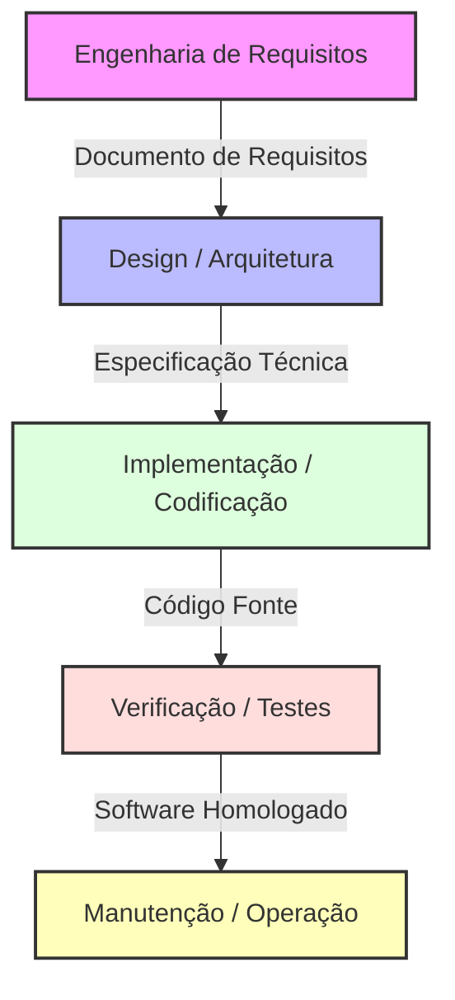
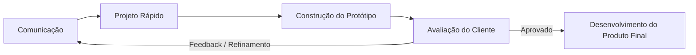
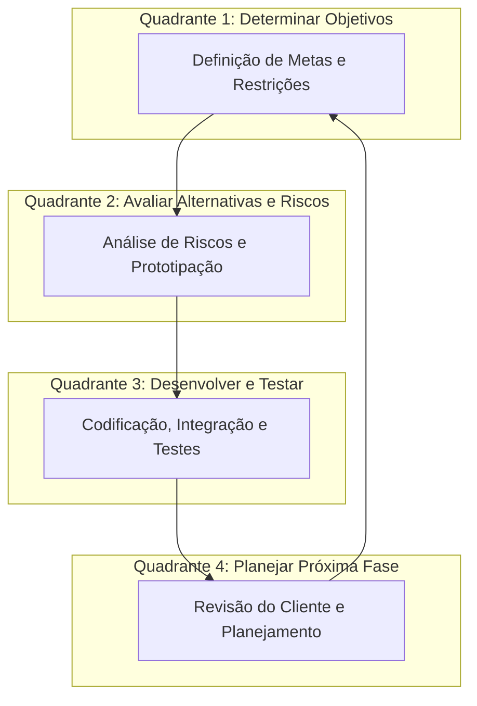
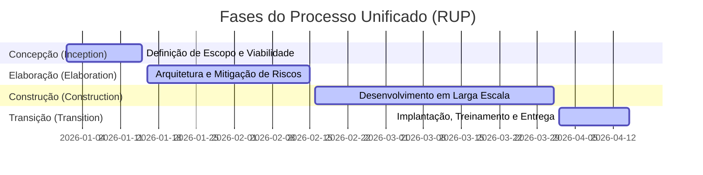
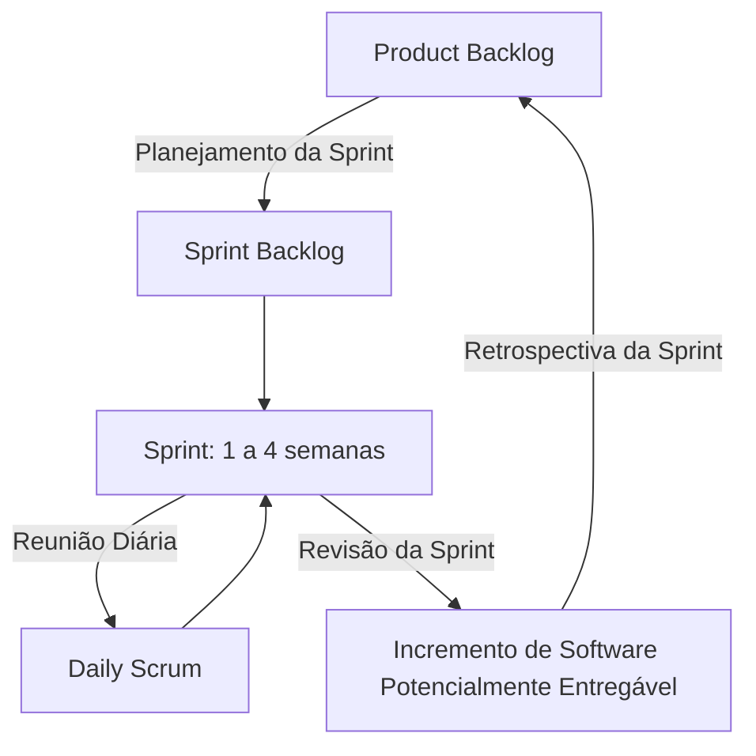
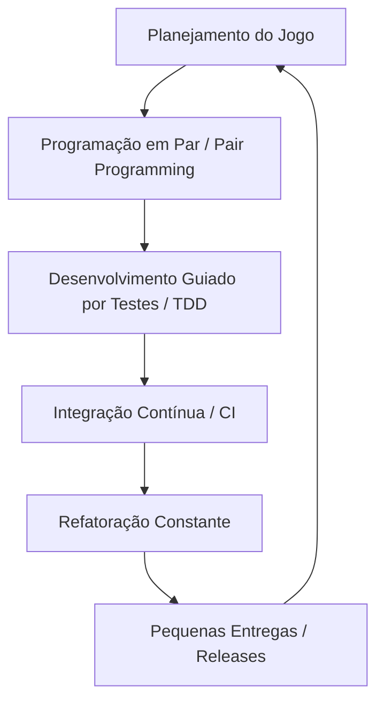

# Métodos de Processos de Desenvolvimento de Software
> **Disciplina:** Engenharia de Software I (3º Semestre)  
> **Professor:** Prof. Marcelo Boer  
> **Autor:** Aluno / Desenvolvedor Sênior  
> **Data de Entrega:** 15/04/2026  

---

## 1. Introdução aos Processos de Software

Um **Processo de Software** é um conjunto estruturado de atividades, ações, tarefas, marcos e produtos de trabalho necessários para construir um software de alta qualidade. Ele define *quem* está fazendo *o quê*, *quando* e *como* para alcançar o objetivo de negócio.

### Atividades Metodológicas Estruturais (Framework Activities)
Independentemente do modelo de processo escolhido, todo ciclo de vida de desenvolvimento de software (SDLC) apoia-se em cinco atividades fundamentais:
1. **Comunicação:** Entendimento dos requisitos e objetivos junto aos stakeholders.
2. **Planejamento:** Estimativas de esforço, cronograma, riscos e recursos.
3. **Modelagem:** Criação de modelos (arquitetura, diagramas UML, esquemas de dados) para entender o panorama geral.
4. **Construção:** Geração de código (programação) e testes (unitários, integração).
5. **Implantação:** Entrega do software ao cliente, suporte e feedback.

---

## 2. Modelos de Processo Prescritivos (Clássicos)

Os modelos prescritivos defendem uma abordagem ordenada e estruturada para o desenvolvimento de software. Eles prescrevem um conjunto de elementos de processo (atividades, tarefas, garantias de qualidade).

### 2.1 Modelo Cascata (Waterfall / Clássico)
Proposto originalmente por Winston Royce (1970), é um modelo sequencial e linear. Uma fase só se inicia quando a fase anterior estiver completamente concluída e documentada.



*   **Vantagens:**
    *   Fácil de gerenciar devido à rigidez do modelo (marcos claros).
    *   Funciona bem para projetos com requisitos estáveis, claros e imutáveis.
    *   Forte ênfase em documentação técnica.
*   **Desvantagens:**
    *   Altamente inflexível a mudanças de escopo.
    *   O cliente só vê o software funcional no final do ciclo de vida (alto risco de desalinhamento).
    *   Bloqueios de equipe (programadores esperando designers, testadores esperando programadores).

---

### 2.2 Modelo de Prototipação
Utilizado quando o cliente define os objetivos gerais do software, mas não consegue detalhar os requisitos de entrada, processamento ou saída. Consiste em construir uma versão rápida ("rascunho") para validação.



*   **Vantagens:**
    *   Excelente para elicitação de requisitos complexos ou interfaces de usuário (UI/UX).
    *   Reduz o risco de construir o sistema errado.
    *   Aumenta o engajamento e satisfação do cliente desde o início.
*   **Desvantagens:**
    *   O cliente pode confundir o protótipo com o sistema final ("já está pronto, por que demora para entregar?").
    *   Pode levar a decisões arquiteturais ruins e código "remendado" se o protótipo for reaproveitado incorretamente.

---

### 2.3 Modelo Espiral (Spiral Model)
Desenvolvido por Barry Boehm (1988), é um modelo evolutivo que acopla a natureza iterativa da prototipação com os aspectos controlados e sistemáticos do modelo cascata, adicionando uma dimensão crucial: **Análise de Riscos**.



*   **Vantagens:**
    *   Gerenciamento de riscos extremamente robusto e realista.
    *   Adequado para sistemas de grande porte, críticos ou de alta complexidade.
    *   Permite a evolução contínua do software ao longo do tempo.
*   **Desvantagens:**
    *   Pode ser muito caro e exigir especialistas altamente qualificados em análise de riscos.
    *   Se a análise de riscos falhar, todo o projeto é comprometido.
    *   Dificuldade em definir o fim do projeto devido ao caráter contínuo.

---

### 2.4 Processo Unificado (RUP - Rational Unified Process)
O RUP é um framework de processo de engenharia de software iterativo e incremental, centrado na arquitetura e guiado por casos de uso. Ele divide o projeto em quatro fases temporais distintas.



*   **Vantagens:**
    *   Forte foco na qualidade arquitetural (evita o colapso do sistema no longo prazo).
    *   Iterativo, permitindo correções de rumo a cada ciclo.
    *   Altamente documentado e padronizado.
*   **Desvantagens:**
    *   Considerado "pesado" ou burocrático para equipes pequenas ou startups.
    *   Exige alto esforço de configuração do processo (tailoring) para se adequar à realidade da empresa.

---

## 3. Modelos de Processo Ágeis

Surgidos formalmente com o **Manifesto Ágil (2001)**, estes modelos priorizam indivíduos e interações, software em funcionamento, colaboração com o cliente e resposta rápida a mudanças.

### 3.1 Scrum
O framework ágil mais utilizado no mundo. Focado no gerenciamento de projetos através de ciclos iterativos curtos chamados **Sprints** (geralmente de 1 a 4 semanas).



*   **Papéis Principais:**
    *   **Product Owner (PO):** Representa o negócio, define e prioriza o Product Backlog.
    *   **Scrum Master (SM):** Facilitador do processo, remove impedimentos e garante a adesão ao Scrum.
    *   **Developers (Time de Desenvolvimento):** Profissionais multidisciplinares que constroem o incremento.
*   **Artefatos:** Product Backlog, Sprint Backlog e Incremento.
*   **Eventos:** Sprint Planning, Daily Scrum, Sprint Review e Sprint Retrospective.

---

### 3.2 XP (Extreme Programming)
Focado fortemente nas práticas de engenharia de software para garantir código de altíssima qualidade técnica e adaptabilidade a requisitos voláteis.



*   **Práticas Chave:**
    *   **TDD (Test-Driven Development):** Escrever o teste automatizado antes de escrever o código funcional.
    *   **Programação em Par (Pair Programming):** Dois desenvolvedores trabalhando na mesma máquina (um piloto e um copiloto).
    *   **Propriedade Coletiva do Código:** Qualquer desenvolvedor pode alterar qualquer parte do código a qualquer momento.
    *   **Ritmo Sustentável:** Evitar horas extras excessivas para manter a mente afiada e evitar bugs.

---

## 4. Abordagens Modernas: DevOps e CI/CD

O **DevOps** não é apenas um processo, mas uma cultura que une o Desenvolvimento de Software (Dev) com a Operação de TI (Ops). Ele estende os princípios ágeis para além da entrega do código, cobrindo a implantação, monitoramento e sustentação em produção de forma automatizada.

```mermaid
graph LR
    subgraph Desenvolvimento (Dev)
        A[Planejar] --> B[Codificar]
        B --> C[Construir / Build]
        C --> D[Testar]
    end
    subgraph Operações (Ops)
        D --> E[Liberar / Release]
        E --> F[Implantar / Deploy]
        F --> G[Operar]
        G --> H[Monitorar]
        H --> A
    end
    style A fill:#aaf,stroke:#333
    style B fill:#aaf,stroke:#333
    style C fill:#aaf,stroke:#333
    style D fill:#aaf,stroke:#333
    style E fill:#faa,stroke:#333
    style F fill:#faa,stroke:#333
    style G fill:#faa,stroke:#333
    style H fill:#faa,stroke:#333
```

### Pilares do DevOps e Ciclo CI/CD:
1. **Integração Contínua (CI):** Desenvolvedores mesclam suas alterações de código no repositório principal constantemente. Cada mesclagem dispara builds e testes automatizados.
2. **Entrega Contínua (CD):** Garantia de que o software pode ser liberado para produção a qualquer momento de maneira segura e automatizada.
3. **Monitoramento Contínuo:** Coleta de métricas e logs em tempo real para detecção precoce de falhas de infraestrutura e aplicação.

---

## 5. Conclusão e Considerações do Professor

> "Não existe bala de prata em Engenharia de Software." — *Fred Brooks*

A escolha do processo de desenvolvimento de software deve ser guiada pelas características do projeto, maturidade da equipe, cultura organizacional e estabilidade dos requisitos. Compreender os modelos clássicos, ágeis e as práticas de DevOps capacita o Arquiteto e Desenvolvedor Sênior a tomar decisões assertivas, otimizando custos, prazos e entregando valor real aos usuários finais.