# Trabalho — APRESENTAÇÃO MÉTODOS DE PROCESSOS DE SOFTWARES

> **Professor:** Marcelo Boer
> **Disciplina:** Engenharia de Software I (3º Semestre)
> **Prazo de Entrega:** 15/04/2026 às 20:59
> **Pontuação Máxima:** 4 pontos
> **Conteúdo cobrado:**
> - [Aula 01 - Processo de Abstração e Levantamento de Requisitos](../../Aulas/Aula%2001%20-%20Processo%20de%20Abstra%C3%A7%C3%A3o%20e%20Levantamento%20de%20Requisitos/detalhes.md)
> - [Aula 02 - Configuração e Licenciamento do Astah UML](../../Aulas/Aula%2002%20-%20Configura%C3%A7%C3%A3o%20e%20Licenciamento%20do%20Astah%20UML/detalhes.md)
> - [Aula 03 - Revisão de Requisitos de Software para AV1](../../Aulas/Aula%2003%20-%20Revis%C3%A3o%20de%20Requisitos%20de%20Software%20para%20AV1/detalhes.md)
> - [Aula 04 - Abstração e Modelagem de Requisitos](../../Aulas/Aula%2004%20-%20Abstra%C3%A7%C3%A3o%20e%20Modelagem%20de%20Requisitos/detalhes.md)
> - [Aula 05 - Descrição Textual de Casos de Uso](../../Aulas/Aula%2005%20-%20Descri%C3%A7%C3%A3o%20Textual%20de%20Casos%20de%20Uso/detalhes.md)
> - [Aula 06 - Modelo de Apresentação da Fase Análise](../../Aulas/Aula%2006%20-%20Modelo%20de%20Apresenta%C3%A7%C3%A3o%20da%20Fase%20An%C3%A1lise/detalhes.md)

---

## Sumário

- [Enunciado original (Google Classroom)](#enunciado-original-google-classroom)
- [Análise do que é pedido](#análise-do-que-é-pedido)
- [Fundamentação teórica](#fundamentação-teórica)
  - [Conceituação de Processo de Desenvolvimento de Software](#conceituação-de-processo-de-desenvolvimento-de-software)
  - [Atividades Fundamentais do Ciclo de Vida](#atividades-fundamentais-do-ciclo-de-vida)
  - [Modelos Prescritivos Lineares: Cascata e Modelo V](#modelos-prescritivos-lineares-cascata-e-modelo-v)
  - [Modelos Evolutivos e Iterativos: Prototipação e Incremental](#modelos-evolutivos-e-iterativos-prototipação-e-incremental)
  - [Modelo Espiral de Barry Boehm e Condução por Riscos](#modelo-espiral-de-barry-boehm-e-condução-por-riscos)
  - [O Processo Unificado e o RUP (Rational Unified Process)](#o-processo-unificado-e-o-rup-rational-unified-process)
  - [Abordagens Ágeis: Scrum, Extreme Programming (XP) e Kanban](#abordagens-ágeis-scrum-extreme-programming-xp-e-kanban)
- [Resolução proposta](#resolução-proposta)
  - [Estrutura e Roteiro da Apresentação Técnica](#estrutura-e-roteiro-da-apresentação-técnica)
  - [Resolução dos Exercícios Analíticos](#resolução-dos-exercícios-analíticos)
    - [Exercício 1: Comparativo Estrutural Cascata versus Incremental](#exercício-1-comparativo-estrutural-cascata-versus-incremental)
    - [Exercício 2: Análise Formal dos Quadrantes do Modelo Espiral de Boehm](#exercício-2-análise-formal-dos-quadrantes-do-modelo-espiral-de-boehm)
    - [Exercício 3: Fases, Disciplinas e Marcos Arquiteturais do RUP](#exercício-3-fases-disciplinas-e-marcos-arquiteturais-do-rup)
    - [Exercício 4: Estudo de Caso e Matriz de Decisão de Processos](#exercício-4-estudo-de-caso-e-matriz-de-decisão-de-processos)
  - [Código de Apoio: Simulador de Impacto Financeiro e Exposição de Riscos](#código-de-apoio-simulador-de-impacto-financeiro-e-exposição-de-riscos)
- [Como testar e validar](#como-testar-e-validar)
- [Critérios de qualidade](#critérios-de-qualidade)
- [Arquivos de apoio](#arquivos-de-apoio)
- [Mapa da atividade](#mapa-da-atividade)
- [Glossário](#glossário)
- [Pontos-chave para a prova](#pontos-chave-para-a-prova)
- [Perguntas e respostas (JSONL)](#perguntas-e-respostas-jsonl)
- [Checklist de revisão](#checklist-de-revisão)

---

## Enunciado original (Google Classroom)

```text
POSTAGEM DAS APRESENTAÇÕES REFERENTES A MÉTODOS DE PROCESSOS DE DESENVOLVIMENTO DE SOFTWARE
```

---

## Análise do que é pedido

A atividade proposta pelo Professor Marcelo Boer exige a consolidação e a entrega formal das apresentações de seminários técnicos voltados ao estudo de **Métodos e Modelos de Processo de Desenvolvimento de Software**. 

A disciplina de Engenharia de Software I foca primariamente na estruturação do ciclo de vida, na elicitação, abstração e modelagem de requisitos e na especificação formal de artefatos (como visto na transição entre as Aulas 01 a 06). Compreender os processos que coordenam tais atividades é o alicerce metodológico indispensável para qualquer engenheiro de software.

### Requisitos Explícitos
1. **Envio da Apresentação:** Upload do arquivo de slides (PDF ou PPTX) contendo a síntese técnica dos modelos de processos atribuídos aos grupos de estudo.
2. **Postagem no Prazo:** Submissão formal via Google Classroom até o limite estipulado de 15/04/2026 às 20:59.
3. **Composição em Equipe:** Material desenvolvido de acordo com as diretrizes de apresentação oral e formalização conceitual em sala.

### Requisitos Implícitos e Critérios de Rigor Acadêmico
1. **Profundidade Conceitual dos Modelos:** Não basta elencar o nome das fases de um modelo; é mandatório demonstrar as forças motrizes de cada paradigma (planejamento antecipado versus adaptação empírica, tratamento de incertezas, alocação de riscos).
2. **Articulação com as Aulas Anteriores:** Demonstrar como as etapas de abstração de requisitos (Aula 01 e 04), modelagem visual em ferramentas CASE (Aula 02) e especificação textual de casos de uso (Aula 05) se encaixam organicamente dentro de cada modelo de processo.
3. **Estrutura Comparativa Formal:** Capacidade analítica de confrontar modelos clássicos (Cascata, Prototipação, Espiral, RUP) e métodos ágeis contemporâneos (Scrum, XP), utilizando métricas como custo de mudança ao longo do tempo, tempo até o primeiro deploy funcional (Time-to-Market) e tolerância a requisitos voláteis.
4. **Alinhamento com Padrões de Mercado:** Exposição técnica baseada em literaturas consagradas (Roger Pressman e Ian Sommerville), referenciando normas como a ISO/IEC/IEEE 12207 (Ciclo de Vida de Software).

---

## Fundamentação teórica

### Conceituação de Processo de Desenvolvimento de Software

Um **Processo de Desenvolvimento de Software** (PDS) é definido formalmente como um conjunto estruturado de atividades, ações, tarefas, marcos e artefatos necessários para construir, implantar e manter um produto de software com qualidade mensurável, previsibilidade de custos e cumprimento de prazos.

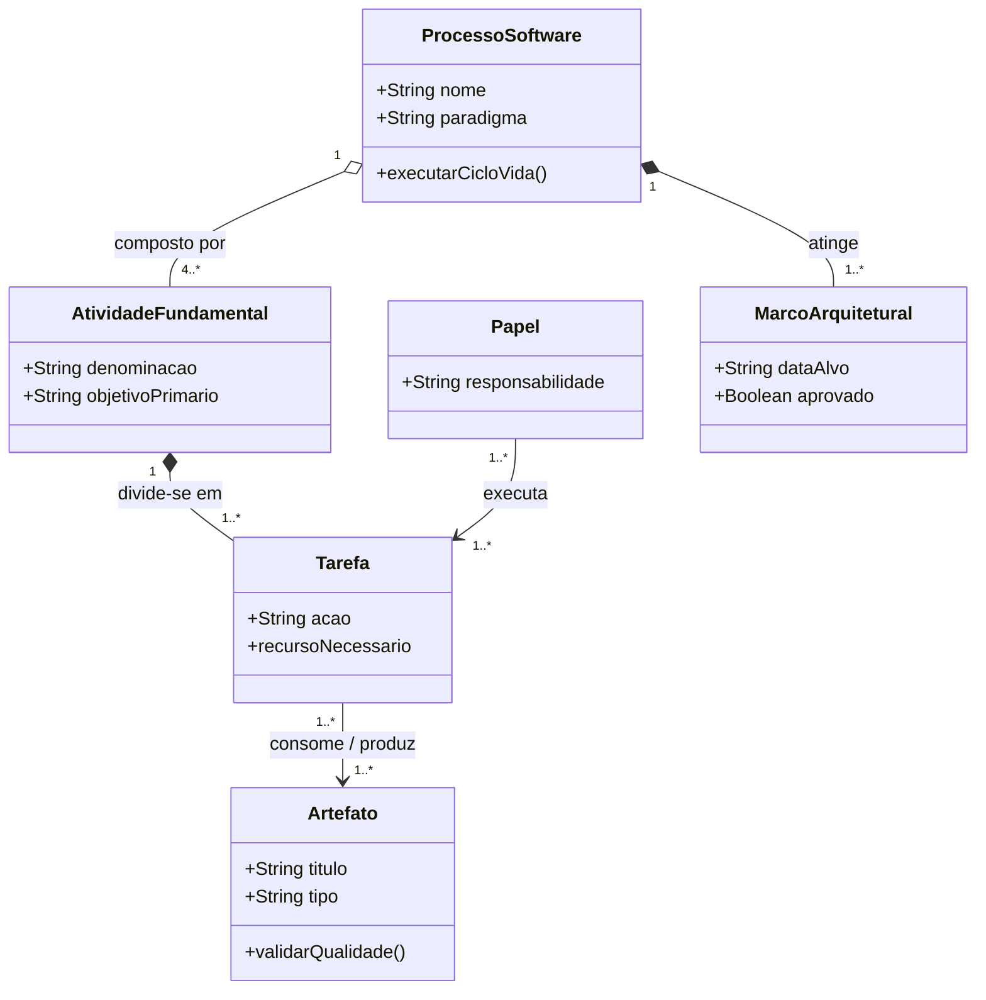

- **Motivação:** O desenvolvimento de software é uma atividade cognitiva complexa sujeita a falhas de comunicação, alterações organizacionais e imprevisibilidade técnica. O processo impõe estabilidade e disciplina sem estrangular a criatividade do time.
- **Definição:** Um arcabouço (*framework*) que estabelece *quem* faz *o quê*, *quando* e *como* para atingir uma meta de engenharia.
- **Exemplo Real:** A adoção de um fluxo onde a especificação de casos de uso e os diagramas de classes devem passar por uma revisão técnica formal antes que a equipe de codificação inicie o desenvolvimento.
- **Contraexemplo (Code-and-Fix / Programação Ad-hoc):** Programar imediatamente a partir de uma conversa casual de corredor, sem modelar classes, sem elicitar regras de negócio e sem planejar casos de teste. O resultado é débito técnico imediato, retrabalho massivo e manutenibilidade nula.
- **Armadilhas Comuns:** Burocratização excessiva (*Process Heavyweight*), gerando pilhas de documentos que ninguém lê, ou relaxamento absoluto de processo sob a falsa alegação de "ser ágil", gerando anarquia técnica.

### Atividades Fundamentais do Ciclo de Vida

Independente de o processo adotar uma postura prescritiva linear ou ágil adaptativa, Ian Sommerville destaca quatro atividades fundamentais presentes em qualquer projeto de software:

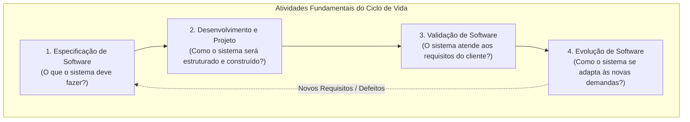

1. **Especificação (Elicitação e Análise de Requisitos):** Engenheiros e clientes definem as funcionalidades do software e as restrições operacionais (requisitos funcionais e não-funcionais). Envolve abstração de domínio (Aula 01), diagramação em Astah (Aula 02) e redação textual de casos de uso (Aula 05).
2. **Desenvolvimento (Projeto Arquitetural e Implementação):** Conversão da especificação em uma solução executável. Engloba o projeto de dados, arquitetura de componentes, modelagem de interfaces e codificação em linguagem de programação.
3. **Validação (Garantia de Qualidade e Testes):** Verificação (construímos o produto corretamente?) e Validação (construímos o produto certo?). Abrange testes unitários, testes de integração, testes de sistema e testes de aceitação pelo usuário final.
4. **Evolução (Manutenção e Sustentação):** Modificação do software em produção para corrigir defeitos latentes (corretiva), acomodar novas regras legais ou de negócio (adaptativa) e otimizar desempenho ou manutenibilidade (evolutiva/preventiva).

### Modelos Prescritivos Lineares: Cascata e Modelo V

#### Modelo Cascata (Waterfall)
Proposto originalmente por Winston Royce em 1970 (embora Royce tenha apresentado o modelo com laços de retorno que a indústria ignorou por décadas), o Modelo Cascata define uma sequência linear e estrita de fases.

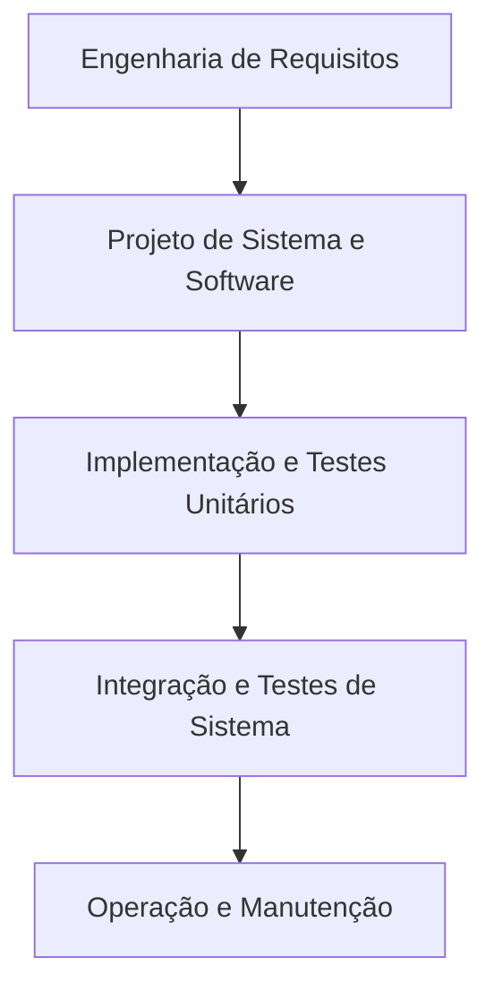

- **Motivação:** Máxima previsibilidade formal, controle rígido de marcos contratuais e geração massiva de documentação de auditoria antes da escrita de qualquer linha de código.
- **Exemplo:** Projetos governamentais e de defesa onde o contrato exige a entrega e congelamento formal do Documento de Especificação de Requisitos de Software (SRS) antes da abertura da licitação para a fase de codificação.
- **Contraexemplo:** Criar uma startup web no modelo Cascata: passar 12 meses documentando e codificando para descobrir no lançamento que o comportamento do consumidor mudou.
- **Armadilhas:** "Efeito Avalanche" do Cascata. Um erro cometido na fase de requisitos que só é descoberto na integração custa até 100 vezes mais para ser consertado (curva clássica de custo de mudança de Barry Boehm). Além disso, o software executável só fica visível para o cliente no final do cronograma ("Bloqueio Operacional").

#### Modelo V
O Modelo V é uma variação rigorosa do Cascata que explicita a correlação direta entre cada fase de concepção/projeto e a sua correspondente fase de teste.

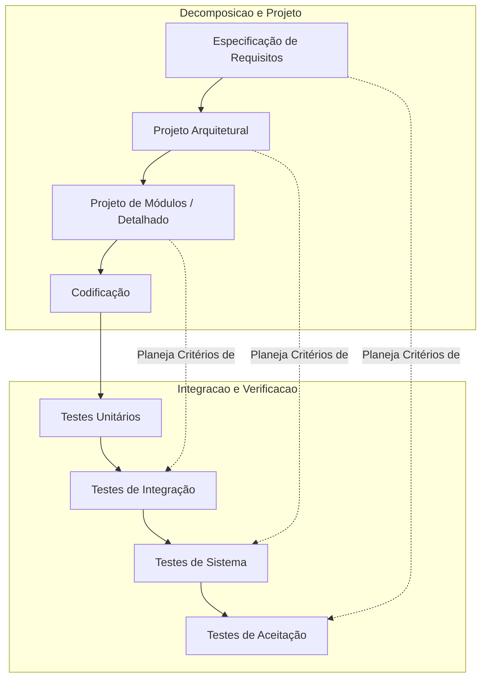

- **Vantagem Técnica:** Os planos de teste são elaborados *durante* a fase de especificação correspondente, antecipando falhas conceituais antes da codificação.

### Modelos Evolutivos e Iterativos: Prototipação e Incremental

#### Modelo de Prototipação Rápida
Utilizado primariamente quando o cliente conhece os objetivos gerais do sistema, mas não é capaz de articular requisitos detalhados de entrada, processamento ou interface.

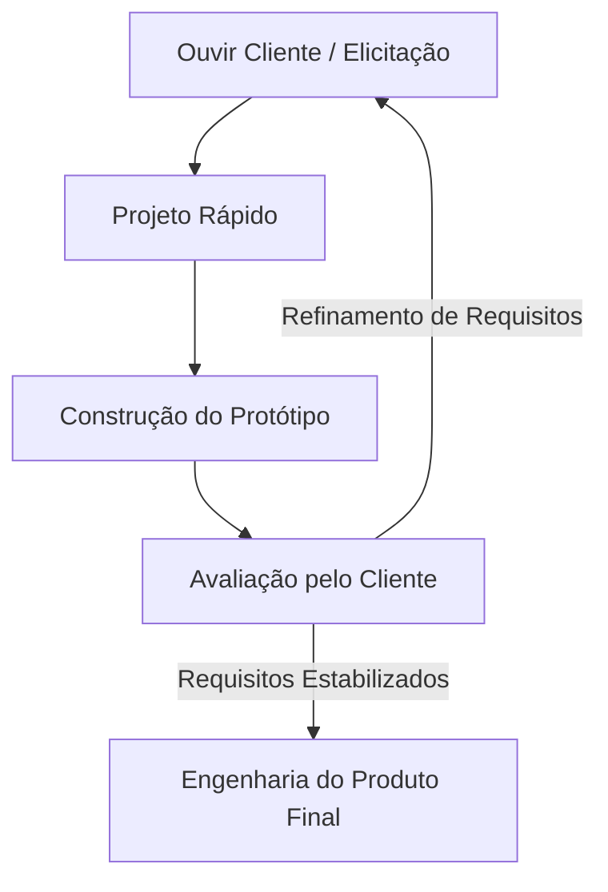

- **Protótipo Descartável (*Throwaway*):** O protótipo serve estritamente para fechar o escopo de requisitos e validar a interface humana com o usuário; o código é descartado e o produto final é implementado com rigor arquitetural.
- **Protótipo Evolutivo:** O protótipo inicial de alta qualidade técnica é expandido iteração a iteração até se transformar no software de produção.
- **Armadilhas:** O cliente confunde um protótipo visualmente atraente com software pronto ("já está quase pronto, é só colocar no servidor"), pressionando a entrega prematura de código sem tratamento de exceções, segurança ou persistência robusta.

#### Modelo Incremental
Combina elementos do fluxo linear com a filosofia iterativa. Em vez de entregar o software completo de uma única vez, divide-se o produto em múltiplos "incrementos" funcionais.

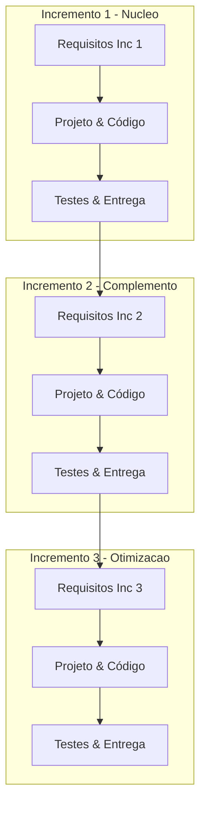

- **Incremento 1 (Núcleo Operacional):** Atende aos requisitos basilares e críticos do negócio (ex.: processar pagamentos básicos).
- **Incrementos Posteriores:** Adicionam recursos de conveniência, relatórios analíticos e canais alternativos.
- **Diferença Chave:** Cada incremento entrega um produto de software real e funcional colocado em operação.

### Modelo Espiral de Barry Boehm e Condução por Riscos

Criado em 1988 por Barry Boehm, o Modelo Espiral é um modelo de processo evolucionário impulsionado formalmente pela **análise e mitigação sistemática de riscos**. O projeto é visualizado como uma espiral contínua onde cada volta (*loop*) representa uma fase do processo.

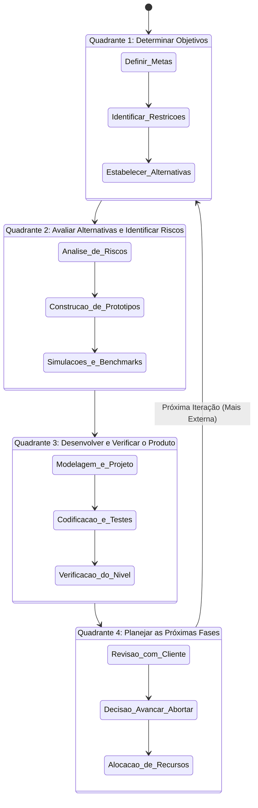

#### Os Quatro Quadrantes de Boehm
1. **Determinar Objetivos, Alternativas e Restrições:** Identificam-se as metas da iteração específica, os caminhos arquiteturais viáveis e os limites de prazo, custo e desempenho.
2. **Avaliar Alternativas, Identificar e Resolver Riscos:** Este é o coração do modelo. Se existir incerteza quanto à escalabilidade do banco de dados ou da tecnologia de rede, desenvolve-se um protótipo focado (*spike* técnico), testes de carga ou simulações matemáticas.
3. **Desenvolver e Verificar o Produto da Fase:** Conforme o nível de risco diminui, seleciona-se o modelo mais apropriado para a construção do nível (por exemplo, prototipação rápida nas voltas iniciais e modelo V/cascata nas voltas finais de implantação de missão crítica).
4. **Planejar as Próximas Fases:** O projeto é avaliado por patrocinadores e comitês técnicos. Decide-se se a espiral prossegue para uma nova volta com maior nível de detalhamento ou se o projeto deve ser abortado (*Go / No-Go Decision*).

### O Processo Unificado e o RUP (Rational Unified Process)

O **Rational Unified Process (RUP)**, concebido pela Rational Software (posteriormente IBM) e estruturado por Ivar Jacobson, Grady Booch e James Rumbaugh, é um processo prescritivo iterativo e incremental centrado em arquitetura e dirigido por casos de uso.

O RUP introduz uma estrutura bidimensional fundamental:
- **Eixo Horizontal (Tempo):** Representa o ciclo de vida do projeto dividido em quatro fases sequenciais pontuadas por marcos importantes.
- **Eixo Vertical (Disciplinas):** Representa as atividades lógicas de engenharia (Modelagem de Negócios, Requisitos, Análise e Projeto, Implementação, Testes, Implantação, etc.) que ocorrem com intensidades distintas ao longo de todas as fases.

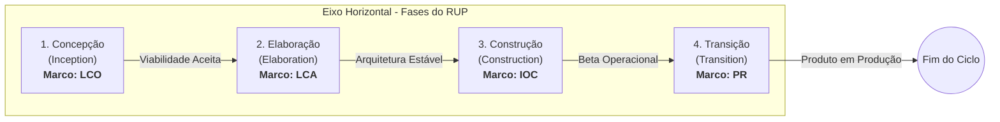

#### As Quatro Fases Sequenciais e seus Marcos
1. **Concepção (*Inception*):**
   - **Objetivo:** Estabelecer a justificativa de negócio (*business case*), escopo delimitador do projeto, identificar os principais atores e casos de uso de maior relevância macro.
   - **Marco:** *Lifecycle Objective (LCO)* — Alinhamento de que o escopo e o orçamento são viáveis.
2. **Elaboração (*Elaboration*):**
   - **Objetivo:** Mitigar os maiores riscos arquiteturais e técnicos. Aqui é implementado o "esqueleto executável" da arquitetura (*architectural baseline*). A maioria dos casos de uso (pelo menos 80%) é descrita detalhadamente.
   - **Marco:** *Lifecycle Architecture (LCA)* — A linha de base da arquitetura é formalmente validada e os riscos de alto impacto foram mitigados. **É o marco mais crítico do RUP.**
3. **Construção (*Construction*):**
   - **Objetivo:** Desenvolvimento em larga escala de todos os componentes funcionais restantes, testes detalhados e documentação de suporte.
   - **Marco:** *Initial Operational Capability (IOC)* — O sistema atinge capacidade funcional suficiente para ser testado em ambiente operacional (versões Alpha/Beta).
4. **Transição (*Transition*):**
   - **Objetivo:** Transferir o software para a comunidade de usuários finais. Inclui testes beta, treinamento, conversão de dados legados e ajustes finos.
   - **Marco:** *Product Release (PR)* — O sistema é aceito formalmente em produção.

### Abordagens Ágeis: Scrum, Extreme Programming (XP) e Kanban

O Manifesto para o Desenvolvimento Ágil de Software (2001) surgiu como resposta contra o peso burocrático e a rigidez documental dos modelos prescritivos clássicos.

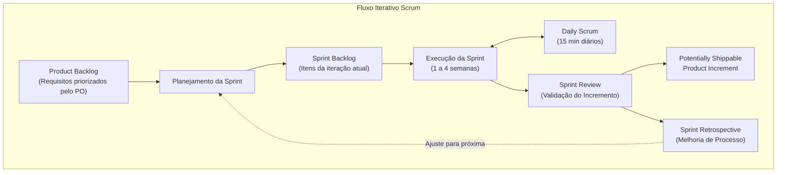

#### Pilares Teóricos Comparados
- **Scrum:** Foco no gerenciamento de projetos através de papéis bem definidos (Product Owner, Scrum Master, Developers), cerimônias de inspeção/adaptação periódicas e timeboxing estrito.
- **Extreme Programming (XP):** Foco radical em práticas de engenharia de software: Desenvolvimento Orientado a Testes (TDD), Programação em Par (*Pair Programming*), Integração Contínua (CI), Refatoração Implacável e Propriedade Coletiva do Código.
- **Kanban:** Gestão do fluxo de valor em tempo real através da limitação explícita do trabalho em andamento (WIP - *Work In Progress*), visando eliminar gargalos e reduzir o *Lead Time*.

---

## Resolução proposta

Como esta tarefa é a **entrega formal da apresentação em slides** solicitada pelo Professor Marcelo Boer, a resolução compõe-se de:
1. Roteiro estruturado e diagramado de slides para a apresentação do grupo;
2. Resolução aprofundada dos quatro exercícios analíticos de engenharia de software;
3. Ferramenta algorítmica de apoio técnico (código executável em Python) para demonstrar em plenária o custo do retrabalho e a matriz de riscos.

### Estrutura e Roteiro da Apresentação Técnica

Abaixo está o guia slide a slide exigido para a exposição oral e submissão formal no Google Classroom:

```markdown
[Slide 1: Capa e Identificação]
- Título: Métodos e Processos de Desenvolvimento de Software
- Subtítulo: Uma Abordagem Comparativa entre Modelos Prescritivos e Adaptativos
- Curso: Sistemas de Informação - UniFEF | Disciplina: Engenharia de Software I
- Professor: Prof. Marcelo Boer
- Integrantes do Grupo: [Nomes e RAs]

[Slide 2: A Crise do Software e a Necessidade de Processos]
- Contexto histórico: Por que o desenvolvimento caótico (Code-and-Fix) falha?
- Definição formal de Processo de Software (Pressman & Sommerville).
- Custos de falha: Por que 70% dos fracassos em software decorrem de problemas de requisitos e processo?

[Slide 3: Atividades Fundamentais do Ciclo de Vida]
- Os 4 pilares: Especificação, Desenvolvimento, Validação e Evolução.
- O papel da abstração (Aula 01) e da especificação de Casos de Uso (Aula 05).

[Slide 4: Modelos Lineares - Cascata e Modelo V]
- Mecânica do Cascata: Pré-requisitos fechados, fases sequenciais, congelamento de documentação.
- O Modelo V: A equivalência direta entre concepção e níveis de testes.
- Pontos Fortes: Previsibilidade, rastreabilidade estrita.
- Fraquezas Críticas: Inflexibilidade perante mudanças, valor entregue tardiamente.

[Slide 5: Modelos Evolutivos - Prototipação e Desenvolvimento Incremental]
- Prototipação: Quando a incerteza de requisitos dita a experimentação de interface.
- Desenvolvimento Incremental: Entrega contínua de blocos funcionais com valor de negócio.
- Gráfico comparativo: Curva de entrega de valor no tempo.

[Slide 6: Modelo Espiral de Boehm - O Processo Orientado a Riscos]
- Os 4 quadrantes clássicos (Objetivos, Riscos, Engenharia, Planejamento).
- A prototipação como ferramenta de mitigação de incertezas arquiteturais.
- Domínios de aplicação: Sistemas de missão crítica, aeroespacial e telecomunicações.

[Slide 7: RUP (Rational Unified Process) e Processo Unificado]
- A matriz bidimensional: Fases horizontais (Concepção, Elaboração, Construção, Transição) vs. Disciplinas verticais.
- O marco divisor de águas: Lifecycle Architecture (LCA) na fase de Elaboração.
- Alinhamento com a UML e a Engenharia Dirigida por Casos de Uso.

[Slide 8: Paradigma Ágil - Scrum, XP e Kanban]
- Valores fundamentais do Manifesto Ágil (2001).
- Ciclos curtos (Sprints), feedback empírico e MVP (Minimum Viable Product).
- O papel da disciplina técnica da XP para sustentar a velocidade do Scrum.

[Slide 9: Matriz de Decisão Multicritério]
- Tabela comparativa cruzando: Clareza de Requisitos, Complexidade Arquitetural, Criticidade de Vida/Patrimônio e Janela de Mercado.

[Slide 10: Conclusão e Encerramento]
- Não existe "bala de prata" (Fred Brooks): O melhor processo depende do contexto do problema.
- Espaço aberto para perguntas e arguição da banca.
```

---

### Resolução dos Exercícios Analíticos

#### Exercício 1: Comparativo Estrutural Cascata versus Incremental

**Enunciado do Exercício:** Explique as diferenças estruturais fundamentais entre o Modelo Cascata tradicional e o Desenvolvimento Incremental. Em sua resposta, responda especificamente: (a) como cada modelo lida com mudanças de requisitos solicitadas no meio do projeto; (b) quando o cliente obtém a primeira versão operacional funcional em cada abordagem; e (c) quais os principais riscos operacionais de adotar o Modelo Cascata em um domínio de negócio altamente dinâmico.

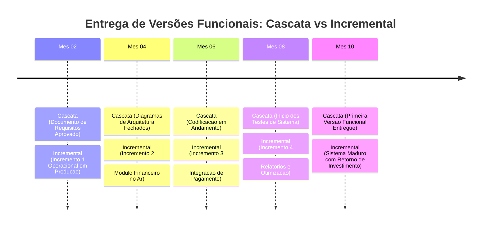

**Resposta Técnica Estruturada:**

1. **(a) Gestão de Mudanças de Requisitos a Meio-Caminho:**
   - **No Modelo Cascata:** O modelo baseia-se na premissa do *congelamento de requisitos*. Qualquer alteração solicitada durante a fase de implementação ou testes desencadeia um processo burocrático e oneroso de Gestão Formal de Mudanças (*Change Request*). Como o projeto arquitetural e os contratos já foram consolidados sobre as premissas iniciais, uma modificação requer refazer documentação, reestruturar diagramas e descartar código já escrito. O impacto financeiro segue a Curva Exponencial de Boehm.
   - **No Desenvolvimento Incremental:** O processo foi concebido intrinsecamente para acomodar volatilidade. Se uma nova regra de negócio surge ou um requisito perde relevância durante o desenvolvimento, essa alteração é postergada para o próximo incremento ou priorizada na fila do backlog sem comprometer os incrementos que já foram entregues e estão operando com estabilidade.

2. **(b) Momento de Disponibilização da Primeira Versão Funcional:**
   - **No Modelo Cascata:** O cliente obtém a primeira versão executável funcional **exclusivamente na fase final do projeto**, frequentemente após meses ou anos do início dos trabalhos. Antes disso, o cliente apenas visualiza artefatos abstratos (especificações textuais de casos de uso, atas de reunião e diagramas de classe).
   - **No Desenvolvimento Incremental:** O cliente obtém a primeira versão operacional funcional **logo ao término do primeiro incremento** (geralmente em questão de 4 a 8 semanas). Embora contenha apenas o "núcleo duro" do sistema (as funções mais prioritárias e elementares), essa versão pode ser imediatamente utilizada para operar o negócio e gerar retorno sobre o investimento (*ROI*).

3. **(c) Riscos Operacionais do Cascata em Domínios Dinâmicos:**
   - **Risco de Obsolescência Funcional (*Market Mismatch*):** O software resultante atende perfeitamente ao contrato assinado há 18 meses, mas tornou-se inútil porque o mercado, a legislação ou a concorrência mudaram de direção.
   - **Efeito Bloqueio e Falha Tardia de Integração:** Erros conceituais graves cometidos na arquitetura inicial permanecem ocultos até a fase de testes integrados. Quando o time descobre incompatibilidades fundamentais próximo à data de entrega, o prazo estoura e o orçamento esgota.
   - **Frustração Extrema do Usuário Final:** A distância prolongada entre o cliente e a equipe gera expectativas desalinhadas. Quando a interface é finalmente apresentada, descobre-se que o usuário mentalizava uma operação completamente diferente da interpretada pelos analistas.

---

#### Exercício 2: Análise Formal dos Quadrantes do Modelo Espiral de Boehm

**Enunciado do Exercício:** O Modelo Espiral proposto por Barry Boehm destaca-se por incorporar formalmente a análise de riscos em todas as iterações do ciclo de vida. Descreva os quatro quadrantes que constituem cada ciclo da espiral e explique por que a ênfase na prototipação e na avaliação prévia de viabilidade torna este modelo indicado para sistemas críticos de grande complexidade.

**Resposta Técnica Estruturada:**

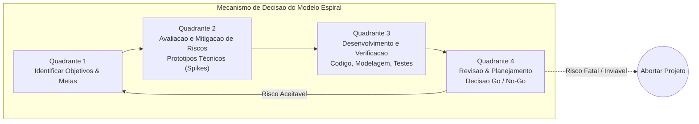

1. **Descrição Formal dos Quatro Quadrantes:**
   - **Quadrante 1: Determinação de Objetivos, Alternativas e Restrições:**
     Neste quadrante inicial de cada volta, a equipe de engenharia define os requisitos específicos do ciclo, identifica os objetivos de desempenho, segurança e confiabilidade, elenca abordagens técnicas alternativas (ex.: arquitetura monolítica versus microsserviços) e mapeia as restrições de custo, prazo e hardware.
   - **Quadrante 2: Avaliação de Alternativas, Identificação e Resolução de Riscos:**
     É a assinatura metodológica de Boehm. A equipe mapeia tudo o que pode levar o projeto ao fracasso: incertezas sobre throughput de rede, algoritmos não comprovados matematicamente, falhas de usabilidade em cockpits ou volatilidade de fornecedores de bibliotecas. Para cada risco identificado, medidas mitigadoras são executadas compulsoriamente: construção de protótipos de desempenho, simulações analíticas de falha e estudos de usabilidade.
   - **Quadrante 3: Desenvolvimento e Verificação do Produto da Iteração:**
     Após mitigar as incertezas, o produto daquela fase é construído e testado. A característica elegante do Espiral é que ele permite a **incorporação de outros modelos dentro deste quadrante**: se os riscos de requisitos foram eliminados, pode-se usar uma abordagem linear rigorosa para codificar e verificar os módulos correspondentes.
   - **Quadrante 4: Planejamento das Próximas Fases e Revisão com Stakeholders:**
     Avalia-se tudo o que foi construído em relação ao orçamento gasto. O cliente e os patrocinadores analisam o progresso e tomam a decisão executiva: autorizar o avanço para a próxima espiral (alocando novo orçamento e pessoal) ou abortar o projeto imediatamente caso a análise de viabilidade do Quadrante 2 tenha provado a inviabilidade tecnológica ou econômica.

2. **Por que é o modelo ideal para Sistemas Críticos de Grande Complexidade:**
   Sistemas críticos (aeroespaciais, controle de reatores nucleares, dispositivos médicos de sustentação da vida, sistemas de sinalização ferroviária) possuem uma característica implacável: **o custo de uma falha em produção envolve perda de vidas humanas ou catástrofes patrimoniais irreversíveis**. 
   
   O modelo de Boehm não avança para a fase de construção maciça baseando-se em presunções teóricas; ele força a equipe a construir protótipos de teste (*benchmarks* e *failover tests*) no Quadrante 2 para provar empiricamente que os mecanismos de tolerância a falhas funcionam. A governança baseada em marcos de viabilidade contínua impede que milhões de dólares sejam investidos em código até que as incertezas tecnológicas basilares estejam formalmente provadas e pacificadas.

---

#### Exercício 3: Fases, Disciplinas e Marcos Arquiteturais do RUP

**Enunciado do Exercício:** O Processo Unificado organiza o ciclo de vida do software em quatro fases sequenciais: Concepção (Inception), Elaboração (Elaboration), Construção (Construction) e Transição (Transition). Descreva o objetivo central de cada uma dessas quatro fases e explique qual é o marco essencial que delimita a conclusão da fase de Elaboração antes que se inicie a Construção em larga escala.

**Resposta Técnica Estruturada:**

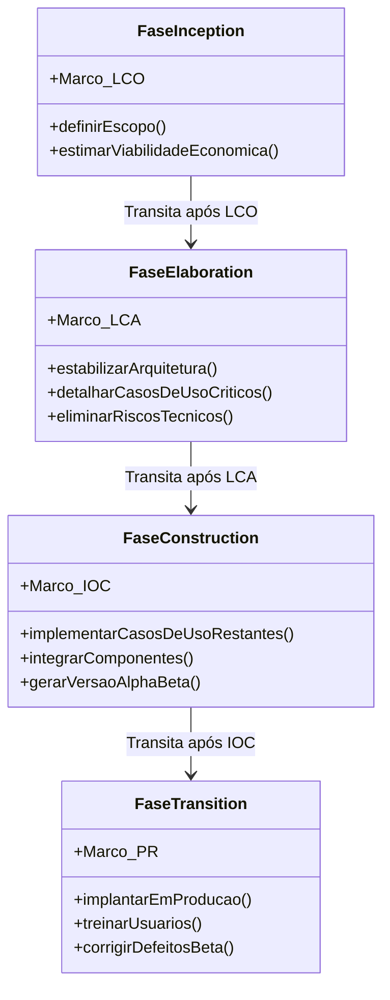

1. **Objetivo Central das Quatro Fases do RUP:**
   - **Concepção (*Inception*):** Delimitar o escopo do sistema do ponto de vista do negócio. Identifica-se a viabilidade econômica e técnica do projeto, quem são os atores primários que interagem com o sistema e quais são os casos de uso vitais (visão em alto nível, conforme abordado na Aula 01 e 04). Define se o projeto deve ou não receber financiamento.
   - **Elaboração (*Elaboration*):** Estabelecer a fundação arquitetural e mitigar os maiores riscos técnicos do sistema. Não se constrói todo o código aqui, mas projeta-se e implementa-se uma fatia vertical executável (*architectural baseline*) que interliga interface, lógica de negócio e persistência de dados. A grande maioria dos casos de uso é refinada e descrita formalmente com fluxo principal, fluxos alternativos e exceções (Aula 05).
   - **Construção (*Construction*):** Fase de maior volume de trabalho e alocação de desenvolvedores. Com a arquitetura blindada e estável, os casos de uso restantes e componentes de menor risco são implementados e testados de forma incremental e paralela. Busca-se a completude funcional e a otimização de recursos.
   - **Transição (*Transition*):** Foco na validação e implantação no ambiente real do cliente. Engloba testes de homologação, testes de carga, migração de dados de bancos legados, treinamento operacional das equipes do cliente e correções de defeitos residuais encontrados nos testes de campo.

2. **O Marco Decisório Essencial da Elaboração: O Marco LCA (*Lifecycle Architecture Milestone*):**
   O marco que delimita o encerramento da fase de Elaboração é a avaliação da **Linha de Base da Arquitetura do Ciclo de Vida (LCA - *Lifecycle Architecture*)**. 

   Para que o projeto receba autorização formal de avançar para a Construção, a equipe deve comprovar empiricamente que:
   - A arquitetura foi implementada em um esqueleto executável e suporta os requisitos funcionais e não-funcionais (como tempo de resposta, concorrência e segurança);
   - Os riscos técnicos mais severos foram desarmados (por exemplo, a integração com sistemas externos legados ou a persistência sob alta concorrência);
   - A especificação dos casos de uso atinge maturidade suficiente para que a equipe de desenvolvimento construa as telas e regras sem ambiguidades bloqueantes;
   - Os planos de estimativa de custo e cronograma para a fase de Construção possuem alta confiabilidade estatística.

   > **Armadilha Fatal no RUP:** Iniciar a fase de Construção sem aprovação no marco LCA. Se a arquitetura ainda estiver instável, a equipe de programadores trabalhará sobre areia movediça. Qualquer mudança estrutural posterior exigirá refatorar e reescrever dezenas de classes em paralelo, levando à explosão do orçamento.

---

#### Exercício 4: Estudo de Caso e Matriz de Decisão de Processos

**Enunciado do Exercício:** Avalie dois cenários hipotéticos de contratação de software:
- **Cenário A:** Desenvolvimento do sistema embarcado de controle de frenagem eletrônica e telemetria para transporte ferroviário de passageiros, com normas regulatórias rigorosas e requisitos contratuais estáveis.
- **Cenário B:** Desenvolvimento de uma plataforma de recomendação de serviços baseada em inteligência artificial para uma startup fintech que busca validar tração inicial no mercado (MVP).

Para cada um dos cenários, selecione e justifique tecnicamente o modelo de processo mais adequado, contrastando previsibilidade, tolerância a falhas e velocidade de entrega.

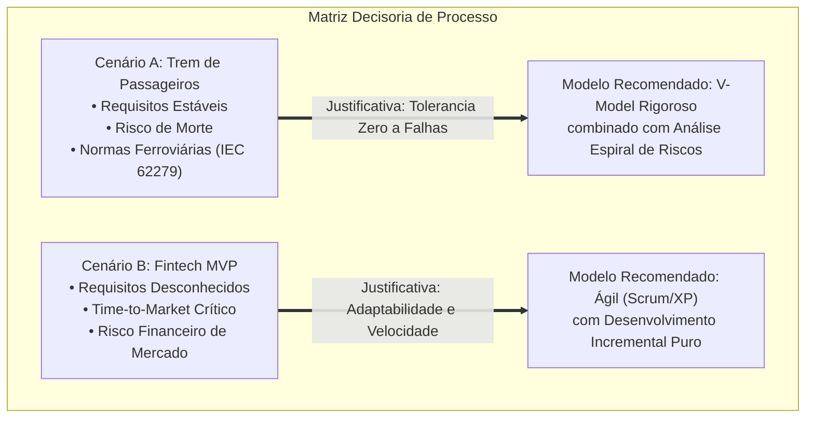

**Análise Técnica Comparativa dos Cenários:**

| Critério de Engenharia | Cenário A: Frenagem Ferroviária | Cenário B: Fintech IA MVP |
| :--- | :--- | :--- |
| **Classificação de Criticidade** | **Missão Crítica / Segurança da Vida** (*Life-Critical*) | **Competitiva / Risco de Mercado** (*Business-Critical*) |
| **Natureza dos Requisitos** | Claros, estáveis, definidos por leis e física mecânica | Altamente voláteis, descobertos via comportamento de usuários |
| **Tolerância a Falhas em Produção** | **Zero.** Defeitos causam acidentes fatais e processos judiciais | **Moderada a Alta.** Bugs de interface são corrigidos via deploy contínuo |
| **Documentação Exigida** | Exaustiva para certificação regulatória (auditoria independente) | Leve, focada em código limpo, testes automatizados e métricas de uso |
| **Time-to-Market (Velocidade)** | Secundário perante a confiabilidade e verificação formal | Primordial para sobrevivência financeira da empresa |
| **Modelo Recomendado** | **Modelo V com Engenharia Formal Dirigida a Riscos** | **Metodologia Ágil (Scrum com Engenharia XP)** |

**Justificativa Técnica Aprofundada:**

1. **Justificativa para o Cenário A (Sistema Ferroviário):**
   - **Por que o Modelo V/Espiral é superior aqui:** Sistemas ferroviários são regidos por normas internacionais estritas (como as normas CENELEC EN 50126/EN 50128 e IEC 62279). Estas regulamentações exigem rastreabilidade bidirecional absoluta: cada linha de código deve estar associada a um requisito de segurança documentado e a um plano de teste de regressão correspondente.
   - O Modelo V garante que a validação de hardware-in-the-loop e os testes de tolerância a falhas sejam planejados no momento em que os requisitos físicos de frenagem são escritos.
   - O uso de métodos ágeis sem documentação contratual seria negligência profissional, pois falhas de frenagem não podem ser "corrigidas no próximo sprint após feedback dos passageiros".

2. **Justificativa para o Cenário B (Fintech MVP):**
   - **Por que a abordagem Ágil/Incremental é a única viável:** A startup desconhece se os usuários realmente engajarão com o modelo de recomendação proposto. A premissa central é a redução do ciclo de feedback (*Build-Measure-Learn* de Eric Ries).
   - Utilizar o Modelo Cascata significaria gastar seis meses gerando documentos de especificação de casos de uso (Aula 05) e diagramas formais de classes no Astah (Aula 02) para um produto que pode não ter aderência no mercado.
   - O Scrum entrega fatias funcionais a cada duas semanas, permitindo ao time de IA testar a acurácia dos modelos diretamente com dados reais de telemetria dos primeiros clientes, alterando o rumo (*pivotar*) sem prejuízo do capital investido.

---

### Código de Apoio: Simulador de Impacto Financeiro e Exposição de Riscos

O script a seguir foi desenvolvido em Python para permitir aos acadêmicos simular numericamente e demonstrar durante o seminário as duas forças matemáticas mais importantes na escolha de um modelo de processo:
1. **A Exposição de Risco de Barry Boehm:** $Risco = Probabilidade \times Impacto$;
2. **A Curva Exponencial de Custo de Mudança:** A discrepância de custo para corrigir um bug de requisito quando descoberto na fase de Especificação versus na fase de Operação.

```python
"""
Simulador de Métricas de Processos de Software: Custo de Mudança e Exposição a Risco
Disciplina: Engenharia de Software I - Prof. Marcelo Boer
UniFEF - Centro Universitário de Santa Fé do Sul
"""

from dataclasses import dataclass
from typing import List


@dataclass
class RiscoProjeto:
    identificador: str
    descricao: str
    probabilidade: float  # Intervalo de 0.0 (nulo) a 1.0 (certeza)
    impacto_financeiro: float  # Impacto em Reais (BRL)

    @property
    def exposicao_risco(self) -> float:
        """
        Fórmula clássica de Barry Boehm:
        Risk Exposure (RE) = P(Ocorrência) * Impacto(Perda)
        """
        return self.probabilidade * self.impacto_financeiro


class AnalisadorCicloVida:
    # Multiplicadores médios empíricos de custo de retrabalho (Boehm & Pressman)
    MULTIPLICADORES_CUSTO = {
        "Requisitos": 1.0,
        "Projeto_Arquitetura": 3.0,
        "Codificacao": 10.0,
        "Testes_Sistema": 40.0,
        "Operacao_Producao": 100.0,
    }

    @classmethod
    def calcular_custo_retrabalho(
        cls, custo_base_especificacao: float, fase_descoberta: str
    ) -> float:
        if fase_descoberta not in cls.MULTIPLICADORES_CUSTO:
            raise ValueError(f"Fase desconhecida: {fase_descoberta}")
        return (
            custo_base_especificacao * cls.MULTIPLICADORES_CUSTO[fase_descoberta]
        )


def executar_demonstracao_seminario():
    print("=" * 70)
    print("ENGENHARIA DE SOFTWARE I - SIMULAÇÃO TÉCNICA DE PROCESSOS")
    print("=" * 70)

    # 1. Simulação da Curva de Mudança de Boehm (Cascata vs Incremental)
    custo_base_correcao = 500.00  # Custo em BRL para sanar uma falha de requisito na Aula 01
    print("\n1. Impacto do Momento da Descoberta do Defeito de Requisito:")
    for fase, mult in AnalisadorCicloVida.MULTIPLICADORES_CUSTO.items():
        custo_calculado = AnalisadorCicloVida.calcular_custo_retrabalho(
            custo_base_correcao, fase
        )
        print(
            f" - Descoberta na fase [{fase:<20}]: R$ {custo_calculado:>9.2f} (Fator: {mult:>4.1f}x)"
        )

    # 2. Matriz de Análise Quantitativa de Riscos do Modelo Espiral
    print("\n2. Auditoria de Riscos da Iteração (Abordagem Espiral de Boehm):")
    riscos = [
        RiscoProjeto(
            "R01",
            "Latência excessiva no barramento de frenagem eletrônica",
            0.35,
            500000.00,
        ),
        RiscoProjeto(
            "R02",
            "Volatilidade na regulamentação ferroviária federal",
            0.15,
            120000.00,
        ),
        RiscoProjeto(
            "R03",
            "Inexperiência da equipe no framework de telemetria",
            0.60,
            45000.00,
        ),
        RiscoProjeto(
            "R04",
            "Incompatibilidade entre microcontroladores legado",
            0.40,
            200000.00,
        ),
    ]

    total_exposicao = 0.0
    for r in riscos:
        exposicao = r.exposicao_risco
        total_exposicao += exposicao
        print(
            f" [ID: {r.identificador}] Prob: {r.probabilidade:.2f} | "
            f"Impacto: R$ {r.impacto_financeiro:>9.2f} | "
            f"Exposição: R$ {exposicao:>9.2f} -> {r.descricao}"
        )

    print("-" * 70)
    print(f"Exposição Total ao Risco no Ciclo: R$ {total_exposicao:,.2f}")
    print(
        "DIRETRIZ TÉCNICA: O Quadrante 2 deve criar protótipos de código "
        "para zerar a incerteza do Risco R01 antes de qualquer contrato de construção!"
    )
    print("=" * 70)


if __name__ == "__main__":
    executar_demonstracao_seminario()
```

---

## Como testar e validar

Para garantir que a apresentação e os materiais produzidos estejam aptos para avaliação pelo Professor Marcelo Boer com a nota máxima (4,0 pontos), siga o plano formal de homologação acadêmica:

### 1. Checklist de Ensaio Oral e Gestão de Tempo
- **Tempo Limite de Apresentação:** Ensaiar a exposição oral do grupo cravando a duração estipulada em sala (geralmente entre 15 e 20 minutos). A divisão de falas deve ser homogênea entre os integrantes.
- **Transição Fluida de Slides:** Nenhum membro da equipe deve ler textos de slides palavra por palavra; os slides devem funcionar como âncoras visuais baseadas em diagramas e dados sintetizados.

### 2. Validação Conceitual dos Artefatos dos Slides
- **Precisão dos Diagramas:** Certifique-se de que os diagramas exibidos em sala não utilizem caixas genéricas, mas sim os termos canônicos (ex.: Fases do RUP são estritamente *Inception*, *Elaboration*, *Construction* e *Transition*).
- **Semelhança entre Iterativo e Incremental:** O apresentador deve estar preparado para responder a pegadinhas clássicas da banca:
  - *Iterativo:* Refinamento sucessivo de uma mesma base (desenhar o esboço, depois o rascunho, depois a pintura a óleo).
  - *Incremental:* Entrega progressiva de partes completas distintas (entregar primeiro o motor da moto, depois a roda dianteira funcional, depois a carroceria).

### 3. Simulação de Arguição da Banca (Professor Marcelo Boer)
Durante o encerramento da apresentação, o professor frequentemente testa a solidez dos alunos com perguntas desafiadoras. Exemplos de validação interna:

- **Pergunta da Banca:** *"Vocês afirmaram que o modelo Cascata é ultrapassado e não deve mais ser usado. Isso é uma verdade absoluta?"*
  - **Resposta Esperada dos Alunos:** *"Não, professor. Isso é um mito comum. O Cascata é perfeitamente viável e amplamente utilizado em projetos onde os requisitos são totalmente previsíveis, estáveis e ditados por leis físicas ou especificações militares/aeroespaciais que não sofrem alteração, e onde a contratação pública exige orçamentação rígida prévia e auditoria formal."*
- **Pergunta da Banca:** *"O que diferencia a fase de Concepção no RUP de uma fase tradicional de Análise de Requisitos no Cascata?"*
  - **Resposta Esperada dos Alunos:** *"Na Concepção do RUP não tentamos detalhar todos os requisitos. Nosso objetivo é apenas delimitar o escopo básico e a viabilidade econômica do negócio (business case). O detalhamento massivo de casos de uso só ocorre na fase seguinte, a Elaboração, focando primeiro nos casos de uso que impõem maior risco arquitetural."*

---

## Critérios de qualidade

A avaliação da apresentação pelo corpo docente é governada por quatro eixos formais de qualidade:

1. **Rigor Conceitual e Fidelidade Teórica (Peso: 35%)**
   - Emprego rigoroso da terminologia técnica de Engenharia de Software.
   - Demonstração da correlação causal entre o modelo de ciclo de vida e a taxa de sucesso/falha do projeto.
   - Referenciamento explícito de autores canônicos (Pressman, Sommerville, Boehm, Jacobson).

2. **Qualidade Visual e Síntese dos Slides (Peso: 25%)**
   - Ausência de "paredes de texto" nos slides.
   - Utilização de diagramas arquiteturais padronizados em conformidade com as boas práticas (UML nativo, fluxogramas de processos legíveis).
   - Tipografia legível, contraste adequado e consistência estética profissional.

3. **Articulação Prática e Análise Crítica (Peso: 25%)**
   - Capacidade do grupo de defender por que determinados modelos são inadequados para startups ou, inversamente, por que métodos puramente empíricos falham em sistemas de segurança crítica.
   - Domínio da matriz de tomada de decisão apresentada.

4. **Domínio Oral e Postura Profissional (Peso: 15%)**
   - Dicção clara, vocabulário corporativo/acadêmico adequado, divisão equilibrada de tempo entre todos os membros do grupo e segurança durante a sessão de perguntas e respostas.

---

## Arquivos de apoio

- **Material Didático da Disciplina:**
  - [Aula 01 - Processo de Abstração e Levantamento de Requisitos](../../Aulas/Aula%2001%20-%20Processo%20de%20Abstra%C3%A7%C3%A3o%20e%20Levantamento%20de%20Requisitos/detalhes.md)
  - [Aula 02 - Configuração e Licenciamento do Astah UML](../../Aulas/Aula%2002%20-%20Configura%C3%A7%C3%A3o%20e%20Licenciamento%20do%20Astah%20UML/detalhes.md)
  - [Aula 03 - Revisão de Requisitos de Software para AV1](../../Aulas/Aula%2003%20-%20Revis%C3%A3o%20de%20Requisitos%20de%20Software%20para%20AV1/detalhes.md)
  - [Aula 04 - Abstração e Modelagem de Requisitos](../../Aulas/Aula%2004%20-%20Abstra%C3%A7%C3%A3o%20e%20Modelagem%20de%20Requisitos/detalhes.md)
  - [Aula 05 - Descrição Textual de Casos de Uso](../../Aulas/Aula%2005%20-%20Descri%C3%A7%C3%A3o%20Textual%20de%20Casos%20de%20Uso/detalhes.md)
  - [Aula 06 - Modelo de Apresentação da Fase Análise](../../Aulas/Aula%2006%20-%20Modelo%20de%20Apresenta%C3%A7%C3%A3o%20da%20Fase%20An%C3%A1lise/detalhes.md)
- **Normas Técnicas Internacionais:**
  - *ISO/IEC/IEEE 12207:2017 Systems and software engineering — Software life cycle processes*.
  - *IEEE 1012:2016 IEEE Standard for System, Software, and Hardware Verification and Validation*.
- **Bibliografia Complementar Recomendada:**
  - SOMMERVILLE, Ian. *Engenharia de Software*. 10. ed. São Paulo: Pearson, 2018. (Capítulos 2 e 3: Processos de Software e Desenvolvimento Ágil).
  - PRESSMAN, Roger S.; MAXIM, Bruce R. *Engenharia de Software: Uma Abordagem Profissional*. 9. ed. Porto Alegre: AMGH, 2021. (Capítulo 2: Modelos de Processo).
  - BOEHM, Barry W. *A Spiral Model of Software Development and Enhancement*. IEEE Computer, v. 21, n. 5, p. 61-72, 1988.

---

## Mapa da atividade

O mapa conceitual a seguir sintetiza de forma estruturada todo o ecossistema abordado pelo trabalho e pelas apresentações:

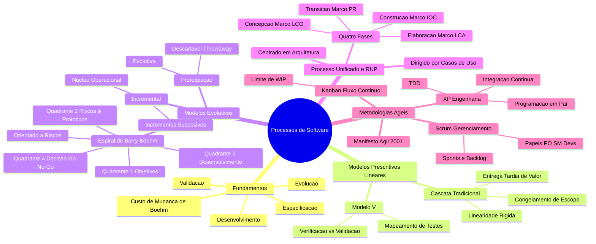

---

## Glossário

| Termo Técnico | Definição no Contexto de Engenharia de Software |
| :--- | :--- |
| **SDLC (*Software Development Life Cycle*)** | Estrutura formal que contém processos, atividades e tarefas envolvidas no desenvolvimento, operação e manutenção de um produto de software da concepção ao descarte. |
| **Modelo Prescritivo (*Plan-Driven*)** | Abordagem de processo que foca no planejamento prévio detalhado, medição sistemática e controle estrito de desvios através de documentação extensiva. |
| **Modelo Adaptativo (*Agile / Change-Driven*)** | Abordagem empírica voltada para a resposta rápida a mudanças, priorizando incrementos operacionais de software e colaboração com o cliente sobre planos rígidos. |
| **Custo de Mudança de Boehm** | Princípio empírico formulado por Barry Boehm demonstrando que o custo financeiro para alterar um requisito ou corrigir uma falha cresce exponencialmente à medida que o projeto avança no ciclo de vida. |
| **Verificação** | O processo de avaliar se o sistema ou componente de uma determinada fase satisfaz as condições impostas no início daquela fase (*"Estamos construindo o produto corretamente?"*). |
| **Validação** | O processo de avaliar se o sistema atende às necessidades, expectativas e regras de negócio do usuário final em seu ambiente real (*"Estamos construindo o produto certo?"*). |
| **Marco LCA (*Lifecycle Architecture*)** | Ponto de decisão formal no RUP ao final da fase de Elaboração, onde a arquitetura executável é aprovada e os riscos mais graves devem estar comprovadamente mitigados. |
| **Marco LCO (*Lifecycle Objective*)** | Ponto de decisão formal no RUP ao final da Concepção, confirmando o alinhamento de escopo, viabilidade econômica e orçamento inicial. |
| **Protótipo Descartável (*Throwaway*)** | Modelo construído com a finalidade exclusiva de esclarecer e validar requisitos de interface e regras de negócio junto ao usuário, sendo seu código descartado antes do início da implementação real. |
| **Espiral de Boehm** | Metodologia cíclica evolucionária impulsionada pela identificação, avaliação e mitigação contínua de riscos técnicos e de negócio em quatro quadrantes. |
| **Time-to-Market** | Intervalo de tempo medido entre a concepção inicial de uma ideia de produto e a sua disponibilização efetiva para os usuários finais no mercado. |
| **Spike Técnico** | Prática oriunda do XP onde a equipe implementa uma prova de conceito temporária ou protótipo rápido com a finalidade de sanar uma dúvida arquitetural ou explorar uma tecnologia desconhecida. |
| **WIP (*Work in Progress*)** | Quantidade de trabalho ou tarefas iniciadas que ainda não foram totalmente concluídas. Limitar o WIP é o pilar central do Kanban para evitar sobrecarga e descobrir gargalos. |
| **Linha de Base (*Baseline*)** | Uma especificação de software ou produto de trabalho que foi formalmente revisado e aprovado, servindo como base estável para desenvolvimento futuro e só podendo ser alterado por processos formais de controle. |
| **Rastreabilidade de Requisitos** | Capacidade de acompanhar a história de um requisito desde sua origem de negócio, passando pela especificação de casos de uso e classes, até as linhas de código e os testes que o validam. |

---

## Pontos-chave para a prova

Para gabaritar qualquer questão referente a Modelos e Métodos de Processos de Software elaborada pelo Professor Marcelo Boer:

1. **A Regra de Ouro da Curva de Mudança:**
   O aluno deve memorizar que a grande justificativa técnica para modelos iterativos/ágeis não é "escrever menos documentos", mas sim **encurtar o laço de feedback** para evitar pagar o custo astronômico de descobrir erros de requisitos na fase de operação.

2. **Diferença Inegociável entre Cascata e RUP:**
   No Cascata, as fases são estritamente temáticas e lineares (Requisitos terminam para Projeto começar). No RUP, as **disciplinas ocorrem em todas as fases**: durante a fase de Construção ainda existem pequenos ajustes de requisitos e de testes, variando apenas o volume de esforço relativo em cada fase.

3. **O Quadrante Insubstituível da Espiral:**
   Se uma questão de prova perguntar *"Qual a atividade que torna o modelo Espiral de Boehm único em relação aos demais?"*, a resposta correta é: **A análise formal e resolução de riscos (Quadrante 2) com emprego compulsório de prototipação antes da construção.**

4. **Os Marcos Decisórios do RUP:**
   Decorar a ordem e significado dos quatro marcos:
   - Concepção $\rightarrow$ **LCO** (*Lifecycle Objective*)
   - Elaboração $\rightarrow$ **LCA** (*Lifecycle Architecture*)
   - Construção $\rightarrow$ **IOC** (*Initial Operational Capability*)
   - Transição $\rightarrow$ **PR** (*Product Release*)

5. **A Relação entre o Modelo V e a Verificação/Validação:**
   O Modelo V não é apenas "um cascata dobrado". Ele explicita que os Testes de Aceitação validam a Especificação de Requisitos; os Testes de Sistema validam a Arquitetura; e os Testes Unitários verificam a Codificação dos Módulos.

---

## Perguntas e respostas (JSONL)

```jsonl
{"pergunta": "Qual a definição formal de um Processo de Desenvolvimento de Software segundo Sommerville e Pressman?", "resposta": "É um conjunto estruturado de atividades, ações, tarefas, papéis, artefatos e marcos coordenados necessários para especificar, projetar, implementar, validar e manter um produto de software com qualidade e previsibilidade.", "dificuldade": "facil"}
{"pergunta": "Quais são as quatro atividades fundamentais presentes em qualquer processo de software, independentemente do paradigma?", "resposta": "Especificação de software (o que fazer), Desenvolvimento/Projeto de software (como construir), Validação de software (garantir que atende ao cliente) e Evolução de software (adaptação a novas demandas).", "dificuldade": "facil"}
{"pergunta": "Qual é a principal limitação operacional do Modelo Cascata em projetos modernos de mercado?", "resposta": "Sua incapacidade de acomodar mudanças tardias de requisitos devido ao congelamento precoce de escopo e o fato de entregar uma versão executável apenas na fase final do projeto.", "dificuldade": "facil"}
{"pergunta": "O que estabelece a Curva de Custo de Mudança proposta por Barry Boehm?", "resposta": "Estabelece que o custo financeiro e o esforço necessários para corrigir um erro de requisito aumentam exponencialmente à medida que o ciclo de vida avança da especificação até a operação em produção.", "dificuldade": "medio"}
{"pergunta": "Qual a diferença conceitual primária entre desenvolvimento Iterativo e desenvolvimento Incremental?", "resposta": "O desenvolvimento iterativo refina sucessivamente uma mesma base ou funcionalidade ao longo do tempo; o desenvolvimento incremental entrega fatias operacionais distintas e utilizáveis do produto a cada ciclo.", "dificuldade": "medio"}
{"pergunta": "Como o Modelo V aprimora a estrutura básica do Modelo Cascata tradicional?", "resposta": "Explicitando a correlação bidirecional entre cada fase de concepção e sua fase correspondente de testes, antecipando o planejamento de testes de aceitação e sistema durante as fases iniciais de requisitos e arquitetura.", "dificuldade": "medio"}
{"pergunta": "Qual é o principal risco associado à adoção de Prototipação Descartável (Throwaway Prototyping)?", "resposta": "O cliente pode confundir um protótipo visualmente funcional com o sistema final pronto, pressionando a equipe a colocá-lo em produção sem arquitetura robusta, segurança ou persistência adequada.", "dificuldade": "medio"}
{"pergunta": "Descreva a função central do Quadrante 2 no Modelo Espiral de Barry Boehm.", "resposta": "Identificar, analisar e mitigar formalmente os riscos técnicos e de negócio do projeto através da construção de protótipos, simulações analíticas e avaliações de viabilidade técnica.", "dificuldade": "medio"}
{"pergunta": "Qual marco do RUP encerra a fase de Elaboração e por que ele é considerado o mais crítico do projeto?", "resposta": "É o marco LCA (Lifecycle Architecture). Ele é crítico porque certifica que uma arquitetura executável foi validada e que os principais riscos técnicos foram eliminados antes de iniciar a construção em larga escala.", "dificuldade": "dificil"}
{"pergunta": "Quais são as quatro fases temporais sequenciais do Rational Unified Process (RUP)?", "resposta": "Concepção (Inception), Elaboração (Elaboration), Construção (Construction) e Transição (Transition).", "dificuldade": "facil"}
{"pergunta": "O que significa dizer que o RUP é um processo 'dirigido por casos de uso'?", "resposta": "Significa que os casos de uso identificados na concepção e refinados na elaboração funcionam como o fio condutor unificado para a modelagem arquitetural, implementação das classes e planos de teste em todas as fases.", "dificuldade": "dificil"}
{"pergunta": "Em qual cenário de contratação o Modelo Cascata ainda é tecnicamente justificável e recomendado?", "resposta": "Em sistemas cujos requisitos são perfeitamente estáveis, previsíveis e regulados por normas rígidas ou leis físicas invariáveis (ex.: subsistemas aeroespaciais ou contratos governamentais fechados).", "dificuldade": "medio"}
{"pergunta": "Qual a principal diferença entre os papéis de Product Owner e Scrum Master no Scrum?", "resposta": "O Product Owner gerencia o valor de negócio e prioriza o Product Backlog; o Scrum Master atua como líder servidor garantindo a aderência aos ritos do Scrum e removendo impedimentos da equipe de desenvolvedores.", "dificuldade": "facil"}
{"pergunta": "O que prescreve o princípio de Limite de Trabalho em Andamento (WIP - Work in Progress) no Kanban?", "resposta": "Determina que cada etapa do fluxo de valor possua um número máximo estrito de tarefas simultâneas, impedindo a sobrecarga da equipe e evidenciando gargalos operacionais.", "dificuldade": "medio"}
{"pergunta": "Por que a Engenharia de Software da Extreme Programming (XP) é frequentemente recomendada em conjunto com o Scrum?", "resposta": "Porque enquanto o Scrum foca primariamente na gestão ágil de projetos e reuniões, o XP prescreve práticas essenciais de código (TDD, refatoração, integração contínua e pareamento) que garantem a sustentabilidade técnica.", "dificuldade": "dificil"}
{"pergunta": "No modelo Espiral, o que acontece no Quadrante 4 se a mitigação de um risco de segurança no Quadrante 2 for malsucedida?", "resposta": "Os patrocinadores e o comitê técnico avaliam o fracasso na revisão e tomam a decisão executiva de abortar formalmente o projeto (Go/No-Go Decision), evitando perdas financeiras maiores.", "dificuldade": "dificil"}
{"pergunta": "O que é o marco IOC (Initial Operational Capability) na fase de Construção do RUP?", "resposta": "É o marco que certifica que o sistema atingiu capacidade operacional inicial (geralmente uma versão beta completa) pronta para ser submetida a testes no ambiente dos usuários na fase de Transição.", "dificuldade": "dificil"}
{"pergunta": "Como a Aula 05 (Descrição Textual de Casos de Uso) conecta-se metodologicamente com a fase de Elaboração do RUP?", "resposta": "É exatamente na fase de Elaboração que os casos de uso de alto nível são expandidos detalhadamente com fluxos principais, alternativos e de exceção para orientar a arquitetura e testes.", "dificuldade": "medio"}
{"pergunta": "Por que o modelo Ad-hoc (Code-and-Fix) não é classificado como um processo de engenharia de software?", "resposta": "Porque carece de planejamento, documentação mínima, controle sistemático de qualidade e repetibilidade, tratando a programação como artesanato desestruturado que inviabiliza manutenção futura.", "dificuldade": "facil"}
{"pergunta": "Qual a relação entre o modelo Espiral de Boehm e a ISO/IEC/IEEE 12207?", "resposta": "O Espiral fornece a lógica cíclica e a política de tomada de decisão baseada em riscos, enquanto a ISO/IEC/IEEE 12207 fornece o catálogo normativo de processos, atividades e terminologias de engenharia.", "dificuldade": "dificil"}
```

---

## Checklist de revisão

Tarefas essenciais para garantir o sucesso pleno na atividade e na apresentação:

- [ ] **Alinhamento do Grupo:** Todos os integrantes estudaram as definições formais de Cascata, Modelo V, Prototipação, Espiral, RUP e Ágil.
- [ ] **Slides Preparados:** Os slides estão montados em PDF/PPTX de acordo com o roteiro de 10 telas fornecido na Resolução Proposta.
- [ ] **Diagramas em Padrão Aberto:** Os diagramas inseridos nos slides estão legíveis, sem erros de sintaxe e demonstrando os fluxos canônicos.
- [ ] **Exercícios Analíticos Concluídos:** O grupo domina os argumentos técnicos dos 4 exercícios resolvidos (Cascata vs Incremental, Quadrantes da Espiral, Fases/Marcos do RUP e Estudo de Caso Ferrovia vs Fintech).
- [ ] **Simulador de Boehm Compreendido:** Os membros do grupo compreendem o código em Python demonstrativo da Exposição de Riscos ($P \times I$) e a curva exponencial de retrabalho.
- [ ] **Ensaio Cronometrado:** O grupo realizou ao menos dois ensaios formais de fala, respeitando o teto de 15 a 20 minutos estipulado pelo Prof. Marcelo Boer.
- [ ] **Postagem Formal no Google Classroom:** O arquivo consolidado da apresentação foi postado até o prazo de 15/04/2026 às 20:59.

## Código prático de apoio

Implementações em Java que tornam executáveis os conceitos desta unidade:

- [`SimuladorCustoMudancaBoehm.java`](codigo/SimuladorCustoMudancaBoehm.java)
- [`SimuladorProcessoUnificadoRup.java`](codigo/SimuladorProcessoUnificadoRup.java)
- [`SimuladorModeloEspiralBoehm.java`](codigo/SimuladorModeloEspiralBoehm.java)
