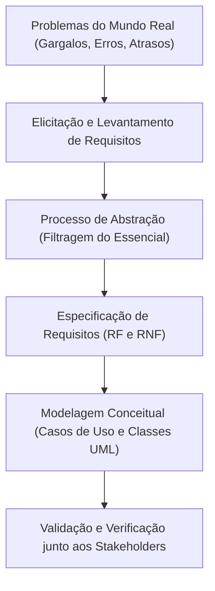
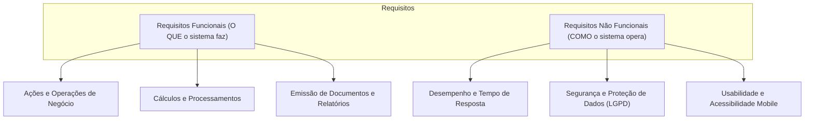
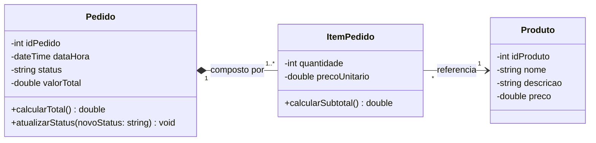
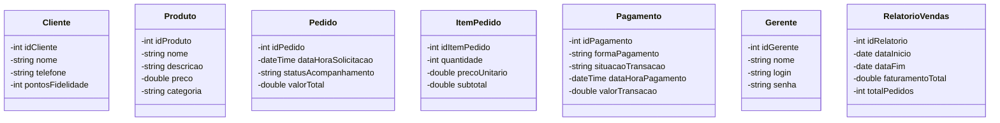
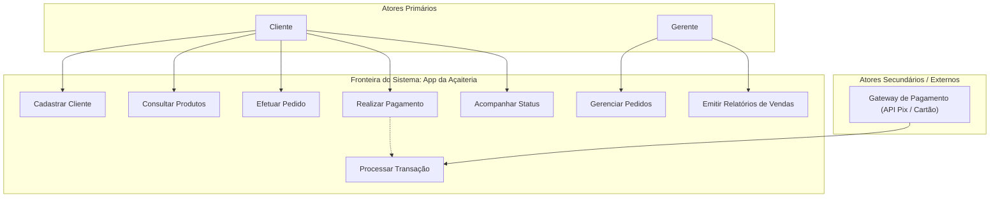
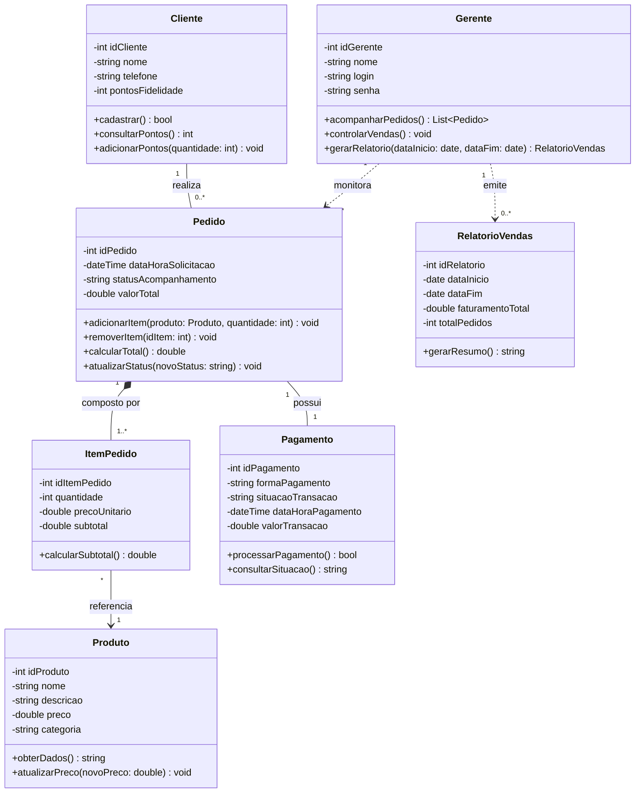
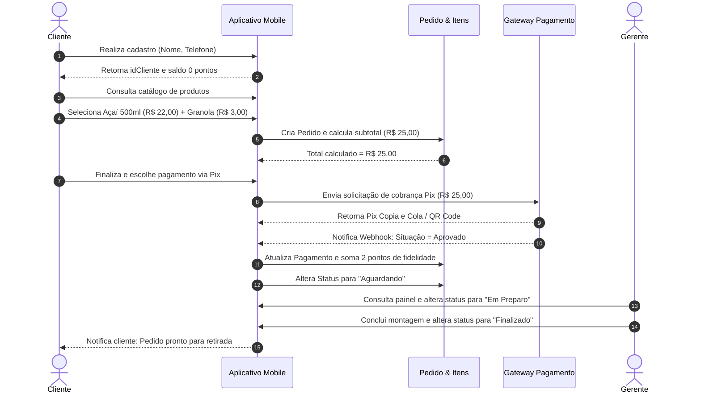
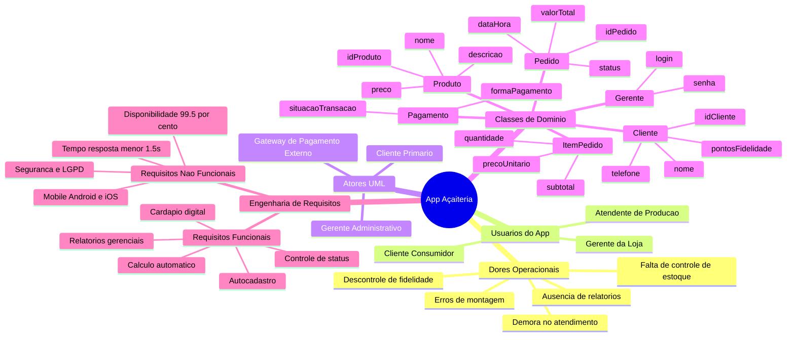
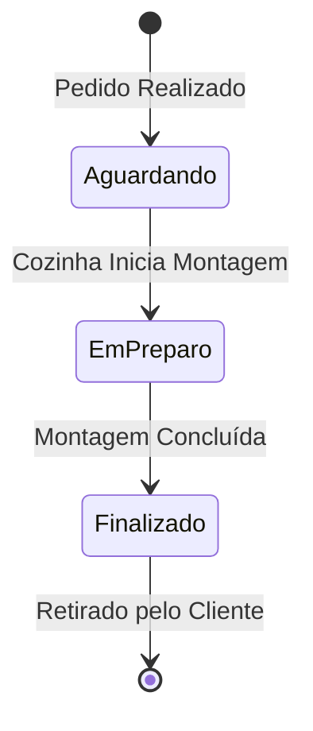

# Trabalho — ATIVIDADE AVALIATIVA 01 - ESTUDO DE CASO

> **Professor:** Marcelo Boer
> **Disciplina:** Engenharia de Software I (3º Semestre)
> **Prazo de Entrega:** 03/03/2026 às 23:59
> **Pontuação Máxima:** 2 pontos
> **Conteúdo cobrado:**
> - [Aula 01 - Processo de Abstração e Levantamento de Requisitos](../../Aulas/Aula%2001%20-%20Processo%20de%20Abstra%C3%A7%C3%A3o%20e%20Levantamento%20de%20Requisitos/detalhes.md)
> - [Aula 02 - Configuração e Licenciamento do Astah UML](../../Aulas/Aula%2002%20-%20Configura%C3%A7%C3%A3o%20e%20Licenciamento%20do%20Astah%20UML/detalhes.md)
> - [Aula 03 - Revisão de Requisitos de Software para AV1](../../Aulas/Aula%2003%20-%20Revis%C3%A3o%20de%20Requisitos%20de%20Software%20para%20AV1/detalhes.md)
> - [Aula 04 - Abstração e Modelagem de Requisitos](../../Aulas/Aula%2004%20-%20Abstra%C3%A7%C3%A3o%20e%20Modelagem%20de%20Requisitos/detalhes.md)
> - [Aula 05 - Descrição Textual de Casos de Uso](../../Aulas/Aula%2005%20-%20Descri%C3%A7%C3%A3o%20Textual%20de%20Casos%20de%20Uso/detalhes.md)
> - [Aula 06 - Modelo de Apresentação da Fase Análise](../../Aulas/Aula%2006%20-%20Modelo%20de%20Apresenta%C3%A7%C3%A3o%20da%20Fase%20An%C3%A1lise/detalhes.md)

---

## Sumário

- [Enunciado original (Google Classroom)](#enunciado-original-google-classroom)
- [Análise do que é pedido](#análise-do-que-é-pedido)
- [Fundamentação teórica](#fundamentação-teórica)
  - [Engenharia de Requisitos e Processo de Abstração](#engenharia-de-requisitos-e-processo-de-abstração)
  - [Requisitos Funcionais versus Requisitos Não Funcionais](#requisitos-funcionais-versus-requisitos-não-funcionais)
  - [Usuários versus Atores na UML](#usuários-versus-atores-na-uml)
  - [Modelagem Estrutural: Classes, Atributos e Relacionamentos](#modelagem-estrutural-classes-atributos-e-relacionamentos)
- [Resolução proposta](#resolução-proposta)
  - [Item 1: Usuários do Aplicativo](#item-1-usuários-do-aplicativo)
  - [Item 2: Classes do Projeto com seus Atributos](#item-2-classes-do-projeto-com-seus-atributos)
  - [Item 3: Lista de Requisitos Funcionais e Não Funcionais](#item-3-lista-de-requisitos-funcionais-e-não-funcionais)
  - [Item 4: Atores do Aplicativo](#item-4-atores-do-aplicativo)
  - [Item 5: Diagrama de Classes](#item-5-diagrama-de-classes)
  - [Implementação Conceitual do Domínio](#implementação-conceitual-do-domínio)
- [Como testar e validar](#como-testar-e-validar)
- [Critérios de qualidade](#critérios-de-qualidade)
- [Arquivos de apoio](#arquivos-de-apoio)
- [Mapa da atividade](#mapa-da-atividade)
- [Glossário](#glossário)
- [Pontos-chave para a prova](#pontos-chave-para-a-prova)
- [Perguntas e respostas (JSONL)](#perguntas-e-respostas-jsonl)
- [Checklist de revisão](#checklist-de-revisão)

---

## Enunciado original (Google Classroom)

### ATIVIDADE AVALIATIVA 01 - ESTUDO DE CASO (02/03/2026)
Responder no próprio arquivo .docx da atividade com o nome do aluno 

### Anexo: Estudo de Caso – Aplicativo da Açaiteria.docx
Estudo de Caso – Aplicativo da Açaiteria
A Açaíteria Sabor da Amazônia é um pequeno comércio especializado na venda de açaí na tigela, smoothies e vitaminas, oferecendo também complementos como frutas, granola e leite condensado. Atualmente, os pedidos são feitos apenas de forma presencial ou por WhatsApp. Em horários de maior movimento, o estabelecimento enfrenta problemas como demora no atendimento, erros na montagem dos pedidos e dificuldade no controle de estoque. Além disso, a gestão não possui relatórios organizados de vendas e não consegue controlar adequadamente o programa de fidelidade dos clientes.
Para melhorar o atendimento e organizar seus processos internos, a empresa decidiu desenvolver um aplicativo móvel próprio. No aplicativo, cada cliente deverá realizar um cadastro informando seus dados básicos, como nome e telefone, passando a possuir um identificador no sistema e um controle de pontos acumulados no programa de fidelidade.
O aplicativo permitirá que os usuários visualizem os produtos disponíveis, cada um contendo informações como nome, descrição e preço. Ao selecionar um item, o cliente poderá adicioná-lo ao pedido, que será registrado com um número identificador, data e horário da solicitação, status de acompanhamento (como aguardando, em preparo ou finalizado) e o valor total calculado automaticamente.
Após a finalização do pedido, o sistema deverá registrar o pagamento, armazenando a forma escolhida pelo cliente (como Pix ou cartão) e a situação da transação, indicando se foi aprovado ou não.
Além das funcionalidades voltadas ao cliente, o sistema também deverá permitir que o gerente acompanhe os pedidos realizados, controle as vendas e organize melhor a administração do negócio.
Identifique com base nesse contexto:
1-) O(s) usuário(s) do aplicativo
2-) Identifique as possíveis classes do projeto com seus atributos
3-) Elabore a lista de requisitos funcionais e não funcionais
4-) Atores do Aplicativo
5-) Diagrama de Classes

---

## Análise do que é pedido

### Requisitos e Entregáveis Formais
1. **Entrega documental**: Resolução estruturada respondendo diretamente aos 5 itens propostos, entregue em formato `.docx` com identificação do aluno.
2. **Item 1 (Usuários do aplicativo)**: Identificação dos perfis de pessoas físicas e operacionais que interagem diretamente com as interfaces da solução móvel e administrativa.
3. **Item 2 (Classes e Atributos)**: Mapeamento das entidades lógicas do domínio da açaiteria, decompondo os substantivos e dados de negócio citados no texto em classes orientadas a objetos com atributos tipados.
4. **Item 3 (Requisitos Funcionais e Não Funcionais)**:
   - Requisitos Funcionais (RF): Especificação do comportamento dinâmico do sistema (o que o sistema deve fazer).
   - Requisitos Não Funcionais (RNF): Critérios de qualidade, segurança, desempenho, usabilidade e restrições operacionais/arquiteturais (como o sistema deve operar).
5. **Item 4 (Atores do aplicativo)**: Distinção conceitual estrita entre papéis humanos e sistemas externos que desempenham funções de interação ativa ou passiva com a fronteira do software.
6. **Item 5 (Diagrama de Classes)**: Representação estrutural estática em UML contendo classes, atributos com visibilidade e tipos, métodos essenciais do negócio, relacionamentos (associação, agregação, composição) e multiplicidades (cardinalidades).

### Critérios Implícitos de Avaliação
- **Distinção entre Usuário e Ator**: O aluno não deve confundir usuário (indivíduo concreto) com ator (papel abstrato que interage com o sistema sob a ótica da UML). O sistema de pagamento (gateway bancário), por exemplo, é um ator de suporte/secundário, embora não seja um usuário humano do aplicativo.
- **Granularidade do Modelo de Dados**: Identificação correta de entidades intermediárias como `ItemPedido` (resolvendo a relação N:N entre `Pedido` e `Produto`), evitando armazenar arrays planos ou dependências circulares.
- **Rastreabilidade**: Os requisitos funcionais levantados devem cobrir integralmente as dores relatadas no estudo de caso (erros de montagem, controle de estoque, pontos de fidelidade, relatórios gerenciais e registro de pagamentos).
- **Consistência Semântica na UML**: Respeito às convenções da OMG (Object Management Group) aplicadas no software Astah UML, demonstrando multiplicidades corretas (`1`, `0..1`, `1..*`, `*`) e navegabilidade coerente.

---

## Fundamentação teórica

### Engenharia de Requisitos e Processo de Abstração

O processo de Engenharia de Requisitos é a etapa inicial e mais crítica do ciclo de vida do software, responsável por transformar dores e necessidades operacionais difusas em especificações técnicas precisas, verificáveis e executáveis.



#### Abstração
- **Definição**: Capacidade intelectual de isolar os aspectos relevantes de um domínio da realidade, descartando detalhes acidentais ou irrelevantes para o objetivo do software.
- **Motivação**: Um sistema computacional não pode nem deve replicar a totalidade do mundo físico. É preciso capturar apenas as propriedades determinantes para o funcionamento do negócio.
- **Exemplo**: Para o cadastro do cliente, importa nome, telefone e pontos acumulados. A altura, cor dos olhos ou estado civil do cliente são dados irrelevantes para o negócio da açaiteria e devem ser descartados.
- **Contraexemplo**: Modelar a classe `Cliente` com 35 atributos burocráticos que não têm relação com pedidos de açaí, inflando a base de dados e tornando a experiência do app intrusiva.
- **Armadilhas**: Tentar resolver problemas de layout de tela durante a fase de abstração de dados, confundindo modelo de domínio com componentes visuais de interface gráfica.

### Requisitos Funcionais versus Requisitos Não Funcionais

A engenharia de software adota modelos clássicos de classificação como o FURPS+ (Functionality, Usability, Reliability, Performance, Supportability) e a norma ISO/IEC 25010 para segregar as obrigações do sistema.



#### Requisitos Funcionais (RF)
- **Definição**: Declarações explícitas de serviços, comportamentos, entradas, transformações e saídas que o sistema deve fornecer aos seus utilizadores.
- **Motivação**: Estabelecer o escopo contratual e funcional da aplicação para orientar o desenvolvimento e a construção de casos de teste.
- **Exemplo**: "O sistema deve calcular automaticamente o valor total do pedido multiplicando a quantidade de cada item pelo seu preço unitário e somando o subtotal."
- **Contraexemplo**: "O sistema deve ser intuitivo e rápido." (Isto não descreve uma função operacional, mas uma meta de qualidade subjetiva).
- **Armadilhas**: Formular o requisito com soluções de implementação fechadas (ex.: "O sistema deve ter uma tabela em MySQL chamada tbl_pedido") em vez de focar na regra de negócio.

#### Requisitos Não Funcionais (RNF)
- **Definição**: Restrições sobre os serviços e funções oferecidos pelo software, englobando padrões de confiabilidade, tempo de execução, conformidade legal, manutenibilidade e arquitetura.
- **Motivação**: Garantir que a solução entregue atenda a parâmetros aceitáveis de desempenho, segurança da informação e ergonomia, sem os quais o sistema falharia em produção, mesmo calculando os valores corretamente.
- **Exemplo**: "O aplicativo móvel deve responder às consultas de catálogo em no máximo 2 segundos sob conexão 4G padrão."
- **Contraexemplo**: "O sistema deve permitir cadastro de cliente com Pix." (Esta é uma função operacional de negócio, logo, é funcional).
- **Armadilhas**: Escrever RNF de forma vaga e não testável, como "o sistema deve ser seguro". É necessário quantificar métricas (ex.: "Criptografia TLS 1.3 em repouso e em trânsito para dados sensíveis").

### Usuários versus Atores na UML

Na Engenharia de Software I, segundo a notação UML adotada pelo Prof. Marcelo Boer no Astah UML, é fundamental compreender a separação entre a pessoa física e o papel abstrato modelado.


#### Usuário
- **Definição**: Indivíduo concreto, de carne e osso, que opera fisicamente um terminal, smartphone ou teclado para interagir com o software.
- **Motivação**: Análise de personas, ergonomia de uso, design de interface e suporte operacional.
- **Exemplo**: O funcionário Matheus, caixa da loja, operando o tablet do balcão.

#### Ator (UML Actor)
- **Definição**: Papel coerente desempenhado por uma entidade externa (humano, dispositivo de hardware ou outro sistema de software) ao interagir diretamente com as fronteiras do sistema modelado.
- **Motivação**: Reuso de casos de uso e desacoplamento da identidade das pessoas em relação aos privilégios e funções sistêmicas.
- **Exemplo**: O ator `Cliente` executa o caso de uso `Efetuar Pedido`. O ator `Gateway de Pagamento` executa a validação remota da transação bancária.
- **Contraexemplo**: Criar um ator chamado "Matheus" ou "Dona Maria". Atores representam categorias abstratas de comportamento (`Cliente`, `Gerente`), nunca pessoas específicas.
- **Armadilhas**: Desconsiderar sistemas externos como atores. Se o sistema consome uma API de Pix externa para saber se o pagamento foi liquidado, essa API é um ator secundário na fronteira da aplicação.

### Modelagem Estrutural: Classes, Atributos e Relacionamentos

O Diagrama de Classes é a espinha dorsal da modelagem estrutural orientada a objetos na UML. Ele descreve a arquitetura estática do sistema através de classes, seus dados internos (atributos), suas operações (métodos) e como elas se comunicam.



#### Conceitos de Associação Estrutural
1. **Associação Simples**: Conexão semântica entre duas classes que indica compartilhamento de dados ou envio de mensagens (ex.: `Cliente` realiza `Pedido`).
2. **Multiplicidade / Cardinalidade**: Especifica quantas instâncias de uma classe podem se associar a uma única instância da classe relacionada (`1`, `0..1`, `*`, `1..*`).
3. **Agregação (Todo-Parte Fraco)**: Relacionamento onde a parte pode existir independentemente do todo. Notação: losango oco.
4. **Composição (Todo-Parte Forte)**: Relacionamento de vida estritamente acoplada; se o "todo" for destruído, a "parte" perde sua existência conceitual. Notação: losango preenchido (ex.: `Pedido` e `ItemPedido`).
5. **Entidade Associativa (`ItemPedido`)**: Criada para decompor o relacionamento N:N entre `Pedido` e `Produto`, armazenando a quantidade e o preço congelado no momento da compra.

---

## Resolução proposta

A resolução a seguir aborda rigorosamente as 5 questões solicitadas na atividade avaliativa, alinhando a análise semântica do texto às melhores práticas de Engenharia de Software.

### Item 1: Usuários do Aplicativo

Os usuários são as pessoas reais que interagem com as interfaces disponibilizadas pelo sistema:

1. **Cliente (Consumidor Final)**:
   - **Descrição**: Usuário externo que instala o aplicativo no smartphone. Realiza o autocadastro, consulta o cardápio digital de açaís, vitaminas e complementos, monta seu pedido, efetua o pagamento digital e acompanha o saldo de pontos no programa de fidelidade.
   - **Contexto no Estudo de Caso**: *"cada cliente deverá realizar um cadastro informando seus dados básicos (...) visualizar os produtos disponíveis (...) adicioná-lo ao pedido (...) registrar o pagamento"*.

2. **Gerente (Administrador do Negócio)**:
   - **Descrição**: Usuário interno responsável pela gestão administrativa, comercial e financeira do estabelecimento. Opera o aplicativo ou painel gerencial móvel para monitorar pedidos em tempo real, acompanhar indicadores de vendas, emitir relatórios de faturamento e auditar o controle de estoque.
   - **Contexto no Estudo de Caso**: *"o sistema também deverá permitir que o gerente acompanhe os pedidos realizados, controle as vendas e organize melhor a administração do negócio"*.

3. **Atendente / Operador da Cozinha** *(Identificação Técnica Complementar)*:
   - **Descrição**: Usuário operacional responsável pela preparação física do açaí e organização das entregas. Embora a gerência monitore o fluxo, a operação cotidiana de mudar o status do pedido de "aguardando" para "em preparo" e "finalizado" no chão de loja demanda acesso ao fluxo de produção do aplicativo.

---

### Item 2: Classes do Projeto com seus Atributos

Com base no levantamento dos substantivos de domínio e regras de negócio descritas, identificam-se as seguintes classes:



#### Detalhamento Técnico das Classes e Atributos

1. **Classe: `Cliente`**
   - `- idCliente: int` (Identificador único e incremental do cliente no sistema).
   - `- nome: string` (Nome completo fornecido no cadastro).
   - `- telefone: string` (Número de contato, utilizado também como chave de comunicação e identificação rápida).
   - `- pontosFidelidade: int` (Saldo de pontos acumulados nas compras para resgates futuros).

2. **Classe: `Produto`**
   - `- idProduto: int` (Código identificador do produto).
   - `- nome: string` (Denominação comercial: "Açaí Tradicional 500ml", "Smoothie de Morango", "Granola").
   - `- descricao: string` (Texto descritivo com ingredientes e especificações).
   - `- preco: double` (Preço unitário padrão de venda).
   - `- categoria: string` *(Complemento de domínio: Base, Vitamina, Smoothie, Complemento)*.

3. **Classe: `ItemPedido`**
   - `- idItemPedido: int` (Identificador sequencial do item dentro da estrutura de pedidos).
   - `- quantidade: int` (Volume de unidades do produto selecionadas).
   - `- precoUnitario: double` (Preço histórico do produto no instante da inclusão, blindando contra reajustes futuros).
   - `- subtotal: double` (Resultado matemático de `quantidade * precoUnitario`).

4. **Classe: `Pedido`**
   - `- idPedido: int` (Número identificador exclusivo do pedido).
   - `- dataHoraSolicitacao: dateTime` (Registro de timestamp de abertura da ordem).
   - `- statusAcompanhamento: string` (Estado atual: `Aguardando`, `Em Preparo`, `Finalizado`, `Entregue`, `Cancelado`).
   - `- valorTotal: double` (Somatório consolidado dos subtotais dos itens adicionados).

5. **Classe: `Pagamento`**
   - `- idPagamento: int` (Identificador da transação financeira).
   - `- formaPagamento: string` (Modalidade escolhida: `Pix`, `Cartão de Crédito`, `Cartão de Débito`).
   - `- situacaoTransacao: string` (Status do gateway: `Aprovado`, `Recusado`, `Pendente`).
   - `- dataHoraPagamento: dateTime` (Timestamp da liquidação bancária).
   - `- valorTransacao: double` (Montante financeiro repassado à processadora).

6. **Classe: `Gerente`**
   - `- idGerente: int` (Identificador funcional do gestor).
   - `- nome: string` (Nome do responsável administrativo).
   - `- login: string` (Credencial de acesso ao módulo restrito).
   - `- senha: string` (Hash de autenticação do perfil gerencial).

7. **Classe: `RelatorioVendas`** *(Classe de Análise e Gestão)*
   - `- idRelatorio: int` (Código de emissão do fechamento).
   - `- dataInicio: date` (Data inicial do período apurado).
   - `- dataFim: date` (Data final do período apurado).
   - `- faturamentoTotal: double` (Volume financeiro acumulado no período).
   - `- totalPedidos: int` (Contagem consolidada de pedidos finalizados).

---

### Item 3: Lista de Requisitos Funcionais e Não Funcionais

A especificação de requisitos é estruturada com identificadores padronizados, nomenclatura declarativa e nível de prioridade (Essencial, Importante, Desejável).

#### Requisitos Funcionais (RF)

| Identificador | Nome do Requisito | Descrição Operacional | Prioridade |
| :--- | :--- | :--- | :--- |
| **RF01** | Autocadastro de Cliente | O sistema deve permitir que o cliente realize cadastro informando nome, telefone e crie seu identificador de acesso. | Essencial |
| **RF02** | Gestão de Pontos de Fidelidade | O sistema deve atualizar e registrar automaticamente a pontuação de fidelidade do cliente a cada pedido aprovado. | Importante |
| **RF03** | Visualização do Catálogo de Produtos | O sistema deve exibir os produtos disponíveis com nome, descrição detalhada, categoria e preço de venda. | Essencial |
| **RF04** | Montagem e Composição do Pedido | O sistema deve permitir a seleção de múltiplos produtos e complementos (frutas, granola, leite condensado), compondo um pedido com quantidades individuais. | Essencial |
| **RF05** | Cálculo Automático do Pedido | O sistema deve calcular automaticamente o valor total do pedido com base nos itens selecionados e suas quantidades. | Essencial |
| **RF06** | Registro e Abertura do Pedido | O sistema deve gerar um identificador numérico único, registrando data, hora e atribuindo o status inicial `Aguardando`. | Essencial |
| **RF07** | Acompanhamento de Status do Pedido | O sistema deve disponibilizar ao cliente a visualização em tempo real da evolução do status do pedido (`Aguardando`, `Em Preparo`, `Finalizado`). | Essencial |
| **RF08** | Registro e Seleção de Pagamento | O sistema deve disponibilizar opções de pagamento digital (Pix ou Cartão) e registrar a forma selecionada. | Essencial |
| **RF09** | Processamento de Transação Financeira | O sistema deve registrar o retorno do pagamento emitido pela instituição financeira, atualizando a transação para `Aprovado` ou `Recusado`. | Essencial |
| **RF10** | Acompanhamento Gerencial de Pedidos | O sistema deve permitir ao gerente visualizar todos os pedidos realizados no dia com filtros de status e horário. | Essencial |
| **RF11** | Controle Gerencial de Vendas | O sistema deve disponibilizar ao gerente a visualização consolidada das vendas diárias, semanais e mensais. | Importante |
| **RF12** | Emissão de Relatórios Administrativos | O sistema deve gerar relatórios estruturados de faturamento, vendas e fluxo de produtos consumidos para apoio ao controle de estoque. | Importante |

#### Requisitos Não Funcionais (RNF)

| Identificador | Categoria | Descrição Técnica | Métrica / Critério |
| :--- | :--- | :--- | :--- |
| **RNF01** | Plataforma / Portabilidade | O aplicativo do cliente deve ser desenvolvido para dispositivos móveis compatíveis com as plataformas Android (versão 10+) e iOS (versão 15+). | Compatibilidade multiplataforma nativa/híbrida |
| **RNF02** | Desempenho | O sistema deve processar o cálculo do total do carrinho e a atualização do status do pedido em menos de 1,5 segundo. | Tempo de resposta $\le$ 1500 ms |
| **RNF03** | Disponibilidade | O backend do aplicativo deve manter uma disponibilidade operacional de no mínimo 99,5% durante o horário de funcionamento comercial da loja. | SLA $\ge$ 99,5% |
| **RNF04** | Segurança da Informação | Os dados cadastrais de clientes (nome e telefone) devem ser armazenados com criptografia em conformidade com a LGPD (Lei Geral de Proteção de Dados). | Criptografia AES-256 em repouso e HTTPS/TLS 1.3 |
| **RNF05** | Usabilidade | A interface do aplicativo móvel deve seguir diretrizes modernas de design de interação, permitindo concluir um pedido em no máximo 5 toques na tela. | Eficiência de fluxo do usuário |
| **RNF06** | Confiabilidade e Integridade | Em caso de falha de conexão no envio do pedido, o sistema deve manter os itens no carrinho localmente sem duplicação de ordens financeiras. | Idempotência de transações |
| **RNF07** | Escalabilidade | A arquitetura deve suportar picos de até 100 conexões concorrentes durante os horários de maior movimento sem degradação de performance. | 100 usuários simultâneos estáveis |

---

### Item 4: Atores do Aplicativo

Sob a ótica formal da Unified Modeling Language (UML), os atores que interagem com o sistema são definidos com base em suas fronteiras de ação e papéis:



1. **Cliente (Ator Primário)**:
   - **Papel**: Utilizador final consumidor. Inicia ativamente a comunicação com o sistema para usufruir dos serviços comerciais (consulta cardápio, seleciona itens, realiza pedidos, escolhe pagamento e consulta pontos acumulados).

2. **Gerente (Ator Primário / Administrativo)**:
   - **Papel**: Administrador do negócio. Interage com a retaguarda do sistema para exercer governança operacional: visualiza pedidos abertos, audita vendas, consulta relatórios analíticos de faturamento e monitora o estoque.

3. **Gateway de Pagamento / Sistema Bancário (Ator Secundário / Sistema Externo)**:
   - **Papel**: Sistema computacional externo (provedor de pagamentos Pix e adquirente de cartões). Atua como ator secundário provendo serviços de autorização e liquidação financeira. O aplicativo solicita a validação da cobrança e o Gateway devolve o status da aprovação.

4. **Operador de Produção / Cozinha (Ator Operacional - Complemento)**:
   - **Papel**: Usuário interno responsável por receber as comandas digitais na esteira de produção e despachar os pedidos físicos, atualizando os estados de preparo para que o cliente receba a notificação.

---

### Item 5: Diagrama de Classes

Abaixo está o Diagrama de Classes estrutural completo, contemplando as classes de domínio, atributos tipados, operações de negócio, relações estruturais e multiplicidades rigorosas.



#### Justificativa das Multiplicidades e Relacionamentos
- **`Cliente (1) -- realiza -- (0..*) Pedido`**: Um cliente pode se cadastrar e ainda não ter realizado nenhum pedido (`0`), ou pode realizar múltiplos pedidos ao longo do tempo (`*`). Cada pedido pertence a exatamente um cliente autenticado (`1`).
- **`Pedido (1) *-- composto por -- (1..*) ItemPedido`**: Composição estrita. Um pedido deve conter no mínimo 1 item (`1..*`). Se um pedido for cancelado ou apagado, seus itens componentes perdem a razão de existir e são destruídos.
- **`ItemPedido (*) --> referencia -- (1) Produto`**: Associação direcionada. Vários itens de pedidos diferentes podem fazer referência ao mesmo produto comercial do catálogo (ex.: Granola ou Açaí 500ml), mas cada item de linha referencia estritamente um produto cadastrado.
- **`Pedido (1) -- possui -- (1) Pagamento`**: Cada pedido concluído possui exatamente um registro de pagamento atrelado para consolidação financeira.
- **`Gerente (1) ..> monitora ..> (0..*) Pedido`**: Dependência de uso. O gerente consulta coleções de pedidos para supervisão operacional.
- **`Gerente (1) ..> emite ..> (0..*) RelatorioVendas`**: Dependência funcional de emissão de relatórios com parâmetros temporais.

---

### Implementação Conceitual do Domínio

A seguir, apresenta-se uma implementação de referência orientada a objetos (em TypeScript) demonstrando a tradução exata do modelo conceitual para código de produção com tipagem estática e regras de cálculo:

```typescript
// Enums para controle rígido de status e modalidades
export enum StatusPedido {
  AGUARDANDO = 'Aguardando',
  EM_PREPARO = 'Em Preparo',
  FINALIZADO = 'Finalizado',
  CANCELADO = 'Cancelado'
}

export enum FormaPagamento {
  PIX = 'Pix',
  CARTAO_CREDITO = 'Cartão de Crédito',
  CARTAO_DEBITO = 'Cartão de Débito'
}

export enum SituacaoPagamento {
  PENDENTE = 'Pendente',
  APROVADO = 'Aprovado',
  RECUSADO = 'Recusado'
}

// Entidade Produto
export class Produto {
  constructor(
    private readonly _idProduto: number,
    private _nome: string,
    private _descricao: string,
    private _preco: number,
    private _categoria: string
  ) {}

  get idProduto(): number { return this._idProduto; }
  get nome(): string { return this._nome; }
  get preco(): number { return this._preco; }
}

// Entidade ItemPedido (Composição com Pedido)
export class ItemPedido {
  private _subtotal: number;

  constructor(
    private readonly _idItemPedido: number,
    private readonly _produto: Produto,
    private _quantidade: number,
    private _precoUnitario: number
  ) {
    this._subtotal = this.calcularSubtotal();
  }

  public calcularSubtotal(): number {
    this._subtotal = this._quantidade * this._precoUnitario;
    return this._subtotal;
  }

  get subtotal(): number { return this._subtotal; }
  get produto(): Produto { return this._produto; }
  get quantidade(): number { return this._quantidade; }
}

// Entidade Cliente
export class Cliente {
  constructor(
    private readonly _idCliente: number,
    private _nome: string,
    private _telefone: string,
    private _pontosFidelidade: number = 0
  ) {}

  get idCliente(): number { return this._idCliente; }
  get nome(): string { return this._nome; }
  get pontosFidelidade(): number { return this._pontosFidelidade; }

  public adicionarPontos(pontos: number): void {
    if (pontos > 0) {
      this._pontosFidelidade += pontos;
    }
  }
}

// Entidade Pagamento
export class Pagamento {
  constructor(
    private readonly _idPagamento: number,
    private _formaPagamento: FormaPagamento,
    private _situacaoTransacao: SituacaoPagamento,
    private _dataHoraPagamento: Date,
    private _valorTransacao: number
  ) {}

  get situacaoTransacao(): SituacaoPagamento { return this._situacaoTransacao; }

  public aprovar(): void {
    this._situacaoTransacao = SituacaoPagamento.APROVADO;
  }
}

// Entidade Agregadora: Pedido
export class Pedido {
  private _itens: ItemPedido[] = [];
  private _status: StatusPedido;
  private _valorTotal: number = 0;
  private _pagamento?: Pagamento;

  constructor(
    private readonly _idPedido: number,
    private readonly _cliente: Cliente,
    private readonly _dataHoraSolicitacao: Date = new Date()
  ) {
    this._status = StatusPedido.AGUARDANDO;
  }

  public adicionarItem(produto: Produto, quantidade: number): void {
    if (quantidade <= 0) {
      throw new Error('Quantidade do produto deve ser maior que zero.');
    }
    const novoItem = new ItemPedido(
      this._itens.length + 1,
      produto,
      quantidade,
      produto.preco
    );
    this._itens.push(novoItem);
    this.calcularTotal();
  }

  public calcularTotal(): number {
    this._valorTotal = this._itens.reduce((acc, item) => acc + item.calcularSubtotal(), 0);
    return this._valorTotal;
  }

  public registrarPagamento(pagamento: Pagamento): void {
    this._pagamento = pagamento;
    if (pagamento.situacaoTransacao === SituacaoPagamento.APROVADO) {
      // Regra de fidelidade: 1 ponto a cada R$ 10,00 gastos
      const pontosGanhos = Math.floor(this._valorTotal / 10);
      this._cliente.adicionarPontos(pontosGanhos);
    }
  }

  public atualizarStatus(novoStatus: StatusPedido): void {
    this._status = novoStatus;
  }

  get idPedido(): number { return this._idPedido; }
  get valorTotal(): number { return this._valorTotal; }
  get status(): StatusPedido { return this._status; }
}
```

---

## Como testar e validar

Para garantir que o modelo estrutural e os requisitos mapeados atendem plenamente ao estudo de caso da Açaiteria Sabor da Amazônia, recomenda-se a aplicação das seguintes etapas de validação formal:

### 1. Teste de Mesa Conceitual (Cenário Ponta a Ponta)
Simular a jornada do usuário através de um fluxo cronológico de mensagens e mutações de estado:



### 2. Matriz de Rastreabilidade de Requisitos
Verificar se cada dor de negócio expressa no texto do estudo de caso foi mitigada por um requisito funcional e por uma classe de suporte:

| Dor / Gargalo Original | Requisito que Soluciona | Classe(s) Envolvida(s) | Evidência de Sucesso |
| :--- | :--- | :--- | :--- |
| Demora no atendimento presencial / WhatsApp | RF01, RF03, RF04 | `Cliente`, `Produto`, `Pedido` | Autonomia do cliente para selecionar itens sem fila. |
| Erros na montagem dos pedidos | RF04, RF06 | `ItemPedido`, `Produto` | Especificação detalhada dos complementos na ordem digital. |
| Dificuldade no controle de estoque | RF04, RF12 | `Produto`, `ItemPedido`, `RelatorioVendas` | Baixa automatizada das porções a cada pedido faturado. |
| Falta de relatórios organizados de vendas | RF10, RF11, RF12 | `RelatorioVendas`, `Gerente` | Consolidação analítica por data, faturamento e itens. |
| Descontrole no programa de fidelidade | RF02 | `Cliente` (pontosFidelidade) | Crédito automático de pontos vinculado à aprovação do pagamento. |

---

## Critérios de qualidade

Ao submeter a atividade no formato `.docx`, a resolução deve atender aos seguintes indicadores de qualidade acadêmica e de engenharia:

1. **Precisão Terminológica da UML**:
   - Uso correto dos símbolos de multiplicidade (evitar notações informais como "1-N", utilizando o padrão estrito `1..*`).
   - Diferenciação clara entre Composição (`Pedido` e `ItemPedido`) e Associação Simples (`Cliente` e `Pedido`).
   - Declaração de visibilidade adequada em todos os membros de classe (`-` para atributos privados, `+` para métodos públicos).

2. **Completude Semântica**:
   - Resposta a todos os 5 itens do enunciado sem supressão de partes ou respostas monossilábicas.
   - Presença de atributos essenciais em todas as entidades (identificadores `id`, tipos de dados explícitos e valores monetários fracionários como `double`/`decimal`).

3. **Clareza na Segregação de Papéis**:
   - Apresentação inequívoca da distinção entre usuário físico e ator computacional/externo (explicando por que o `Gateway de Pagamento` é um ator da modelagem, mas não um usuário de tela).

4. **Formatacão e Ortografia**:
   - Redação formal em língua portuguesa, tabelas alinhadas e diagramas legíveis e bem diagramados.

---

## Arquivos de apoio

- **Documento Base**: `Estudo de Caso – Aplicativo da Açaiteria.docx` (Fornecido no Google Classroom pelo Prof. Marcelo Boer).
- **Ferramenta de Modelagem Oficial do Curso**: Astah UML Community / Professional (Configurado na [Aula 02](../../Aulas/Aula%2002%20-%20Configura%C3%A7%C3%A3o%20e%20Licenciamento%20do%20Astah%20UML/detalhes.md)).
- **Normas de Referência**: OMG Unified Modeling Language (OMG UML) Superstructure Specification, Version 2.5.1.

---

## Mapa da atividade

O mapa mental a seguir sintetiza as interconexões lógicas entre os dados do estudo de caso, a modelagem conceitual e as respostas estruturadas:



---

## Glossário

| Termo | Definição no Contexto de Engenharia de Software |
| :--- | :--- |
| **Ator (Actor)** | Entidade externa (humana ou sistêmica) que interage diretamente com a fronteira do software desempenhando um papel específico. |
| **Usuário** | Pessoa física real que opera a interface humana do sistema computacional. |
| **Requisito Funcional (RF)** | Descrição formal de uma função, cálculo, serviço ou comportamento que o sistema deve executar. |
| **Requisito Não Funcional (RNF)** | Critério ou restrição de qualidade arquitetural, tecnológica, legal ou operacional sob a qual o sistema deve funcionar. |
| **Diagrama de Classes** | Diagrama estrutural da UML que ilustra as classes, atributos, operações e relacionamentos estáticos de um sistema. |
| **ItemPedido (Entidade Associativa)** | Classe que resolve a relação muitos-para-muitos entre Pedido e Produto, guardando o histórico de preço e quantidade adquirida. |
| **Composição** | Forma estrita de agregação onde o tempo de vida do objeto-parte depende inteiramente da existência do objeto-todo. |
| **Multiplicidade** | Intervalo numérico que define quantas instâncias de uma classe podem estar correlacionadas a uma instância de outra classe. |
| **LGPD** | Lei Geral de Proteção de Dados (Lei nº 13.709/2018), que regulamenta o tratamento de dados pessoais no Brasil. |
| **Astah UML** | Ferramenta visual de modelagem orientada a objetos utilizada nas disciplinas de Engenharia de Software para criação de diagramas UML. |

---

## Pontos-chave para a prova

1. **Pegadinha Clássica: Usuário versus Ator**:
   - Se a questão perguntar sobre *usuários*, mencione as pessoas que tocam nas telas (`Cliente`, `Gerente`).
   - Se perguntar sobre *atores*, inclua obrigatoriamente os sistemas externos que participam dos fluxos de dados (`Gateway de Pagamento / Banco`).

2. **A Classe Intermediária `ItemPedido`**:
   - Um erro recorrente em provas de Engenharia de Software é ligar `Pedido` diretamente a `Produto` com cardinalidade N:N sem modelar a classe `ItemPedido`. Sem ela, é impossível registrar a quantidade daquele produto específico no pedido ou congelar o preço da época da compra.

3. **Status do Pedido como Máquina de Estados**:
   - Atributos de status (`Aguardando`, `Em Preparo`, `Finalizado`) indicam ciclos de vida. Questões de prova frequentemente cobram um *Diagrama de Transição de Estados* derivado desses atributos.



4. **Regras de Negócio e Requisitos**:
   - Não confunda regra de negócio com requisito funcional. A regra de negócio é: "A cada R$ 10,00 gastos, o cliente ganha 1 ponto de fidelidade". O requisito funcional é: "O sistema deve calcular e creditar automaticamente a pontuação de fidelidade no perfil do cliente após a confirmação do pagamento".

5. **Notação de Composição versus Agregação**:
   - Lembre-se: `Pedido` e `ItemPedido` utilizam **composição** (losango preenchido no lado do `Pedido`), pois não faz sentido a existência de um `ItemPedido` no banco de dados sem um `Pedido` agregador correspondente.

---

## Perguntas e respostas (JSONL)

```jsonl
{"pergunta": "Qual a diferença conceitual primária entre um usuário do aplicativo e um ator na UML?", "resposta": "Usuário refere-se à pessoa física concreta que interage com a interface do aplicativo, enquanto Ator é uma representação abstrata na UML de qualquer papel externo (humano ou sistema computacional) que interage com o sistema.", "dificuldade": "médio"}
{"pergunta": "Por que o Gateway de Pagamento deve ser considerado um ator do sistema, mesmo não sendo uma pessoa física?", "resposta": "Porque a UML define ator como qualquer entidade externa que troca dados e interage com a fronteira do software; o gateway requisita e valida a situação das transações de cartão e Pix.", "dificuldade": "médio"}
{"pergunta": "Qual é a principal função da classe associativa ItemPedido na modelagem de um sistema de vendas?", "resposta": "Resolver o relacionamento muitos-para-muitos (N:N) entre Pedido e Produto, armazenando a quantidade adquirida e o preço unitário congelado no momento da venda.", "dificuldade": "fácil"}
{"pergunta": "Cite dois problemas operacionais relatados no estudo de caso que motivaram a criação do aplicativo.", "resposta": "Demora no atendimento presencial/WhatsApp, erros frequentes na montagem de pedidos, falta de controle de estoque e ausência de relatórios gerenciais de vendas.", "dificuldade": "fácil"}
{"pergunta": "Como deve ser classificado o requisito: 'O aplicativo deve responder às solicitações de cálculo em menos de 1,5 segundo'?", "resposta": "Como um Requisito Não Funcional (RNF) da subcategoria de Desempenho / Eficiência de Execução.", "dificuldade": "fácil"}
{"pergunta": "Qual relacionamento UML deve existir entre a classe Pedido e a classe ItemPedido e por quê?", "resposta": "Composição, pois os itens do pedido possuem forte dependência existencial com o pedido; se o pedido for destruído, os itens perdem sua razão de existir.", "dificuldade": "médio"}
{"pergunta": "Quais atributos mínimos compõem a classe Cliente com base no texto do estudo de caso?", "resposta": "idCliente (identificador), nome, telefone e pontosFidelidade (saldo acumulado).", "dificuldade": "fácil"}
{"pergunta": "Como o sistema deve tratar o cálculo do valor total do pedido segundo o estudo de caso?", "resposta": "O valor total deve ser calculado automaticamente pelo sistema, somando os subtotais de todos os itens e complementos adicionados.", "dificuldade": "fácil"}
{"pergunta": "Quais são os status de acompanhamento do pedido explicitamente citados no enunciado?", "resposta": "Aguardando, em preparo e finalizado.", "dificuldade": "fácil"}
{"pergunta": "Qual a relevância da Lei Geral de Proteção de Dados (LGPD) para os requisitos não funcionais deste aplicativo?", "resposta": "A LGPD impõe como requisito de segurança a criptografia e o armazenamento controlado de dados pessoais cadastrados, como nome e telefone dos clientes.", "dificuldade": "médio"}
{"pergunta": "Por que o atributo preco da classe Produto não deve ser a única fonte para o cálculo financeiro em pedidos antigos?", "resposta": "Porque se o preço do produto sofrer reajuste futuro no catálogo, pedidos antigos teriam seus totais corrompidos caso o valor unitário não estivesse fixado em ItemPedido.", "dificuldade": "difícil"}
{"pergunta": "A quem se destina a funcionalidade de emissão de relatórios de vendas e controle do negócio no aplicativo?", "resposta": "Ao Gerente do estabelecimento.", "dificuldade": "fácil"}
{"pergunta": "Qual a multiplicidade entre a classe Cliente e a classe Pedido na modelagem estrutural?", "resposta": "1 Cliente para 0..* Pedidos (um cliente realiza zero ou muitos pedidos, e cada pedido pertence a exatamente um cliente).", "dificuldade": "médio"}
{"pergunta": "Em qual categoria do modelo FURPS+ se enquadra o requisito de visualização de catálogo de produtos?", "resposta": "Na categoria 'F' (Functionality / Funcionalidade), sendo um requisito funcional.", "dificuldade": "médio"}
{"pergunta": "Quais informações financeiras devem ser registradas na classe Pagamento após a conclusão do pedido?", "resposta": "A forma de pagamento escolhida (Pix ou cartão), a data/hora, o valor transacionado e a situação da transação (se foi aprovado ou não).", "dificuldade": "fácil"}
{"pergunta": "O que ocorreria se a classe Pedido armazenasse apenas um array de strings com os nomes dos produtos?", "resposta": "Haveria quebra dos princípios de orientação a objetos, impedindo controle transacional de estoque, agregação de preços e rastreabilidade dos dados.", "dificuldade": "difícil"}
{"pergunta": "Diferencie um requisito funcional de uma regra de negócio usando o programa de fidelidade da açaiteria.", "resposta": "A regra de negócio define a fórmula matemática de conversão de reais em pontos; o requisito funcional define que o sistema deve calcular e persistir essa pontuação no banco após a venda.", "dificuldade": "difícil"}
{"pergunta": "O que indica a visibilidade representada pelo símbolo '-' antes do nome de um atributo no Diagrama de Classes?", "resposta": "Indica visibilidade privada (private), significando que o atributo só pode ser acessado ou modificado internamente pelos métodos da própria classe.", "dificuldade": "fácil"}
{"pergunta": "Qual técnica de teste valida se todos os requisitos foram cobertos pelas classes do projeto?", "resposta": "Matriz de Rastreabilidade de Requisitos.", "dificuldade": "médio"}
{"pergunta": "Quais são as três formas básicas de complementos citadas no estudo de caso da Açaiteria Sabor da Amazônia?", "resposta": "Frutas, granola e leite condensado.", "dificuldade": "fácil"}
```

---

## Checklist de revisão

- [ ] O documento atende rigorosamente a todos os 5 itens exigidos no arquivo da atividade avaliativa?
- [ ] Foram distinguidos com precisão os usuários do aplicativo (humanos) e os atores da UML (incluindo o Gateway financeiro)?
- [ ] Todas as classes listadas possuem atributos tipados e alinhados às regras do estudo de caso?
- [ ] A classe intermediária `ItemPedido` foi incluída para evitar a modelagem direta N:N entre `Pedido` e `Produto`?
- [ ] A lista de Requisitos Funcionais contém códigos de identificação (`RF01`, `RF02`, etc.) e prioridades?
- [ ] Os Requisitos Não Funcionais abordam métricas concretas (tempo em segundos, disponibilidade em %, conformidade LGPD)?
- [ ] O Diagrama de Classes em Mermaid está sem marcações de temas/estilos customizados e respeita a sintaxe padrão do GitHub?
- [ ] Todas as multiplicidades no diagrama (`1`, `1..*`, `0..*`) e os tipos de relacionamentos (composição e associação) estão matematicamente corretos?
- [ ] O arquivo final de resposta foi salvo mantendo o formato `.docx` com o nome do aluno conforme solicitado pelo Prof. Marcelo Boer?
- [ ] A entrega foi conferida antes do prazo final (03/03/2026 às 23:59)?

## Código prático de apoio

Implementações em Java que tornam executáveis os conceitos desta unidade:

- [`AcaiteriaDominioDemo.java`](codigo/AcaiteriaDominioDemo.java)
- [`AcaiteriaFluxoPedidoDemo.java`](codigo/AcaiteriaFluxoPedidoDemo.java)
- [`AcaiteriaGestaoRelatoriosDemo.java`](codigo/AcaiteriaGestaoRelatoriosDemo.java)
