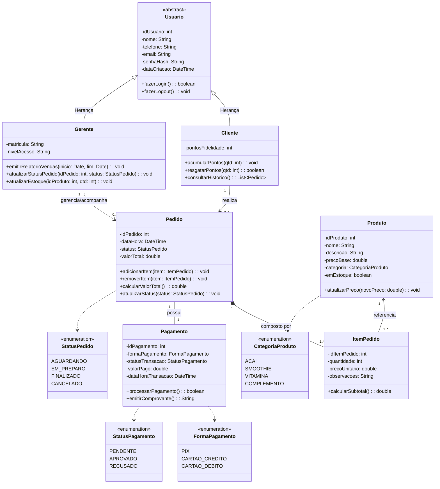

# ATIVIDADE AVALIATIVA 01 - ESTUDO DE CASO: APLICATIVO DA AÇAITERIA
**Disciplina:** Engenharia de Software I  
**Docente:** Prof. Marcelo Boer  
**Curso:** Bacharelado em Sistemas de Informação  

---

## 1. O(s) Usuário(s) do Aplicativo

Com base no levantamento de necessidades da *Açaíteria Sabor da Amazônia*, os usuários diretos que interagem com a solução de software dividem-se em dois perfis principais:

1. **Cliente:**
   - Usuário final consumidor. Utiliza o aplicativo móvel para realizar autocadastro, consultar catálogo de produtos e complementos, montar pedidos, efetuar pagamentos virtuais, acompanhar o status de produção e consultar seu saldo de pontos no programa de fidelidade.
2. **Gerente (Administrador do Estabelecimento):**
   - Usuário responsável pela gestão operacional e estratégica. Acessa o módulo gerencial/administrativo da aplicação para acompanhar a fila de pedidos em tempo real, alterar status de produção, gerenciar o catálogo de produtos e estoque, auditar transações financeiras e emitir relatórios de vendas e desempenho do programa de fidelidade.
3. **Atendente / Operador de Cozinha (Perfil Operacional Derivado):**
   - Usuário responsável pela visualização das comandas na esteira de produção para preparo dos açaís, smoothies e vitaminas, atualizando o status do pedido (ex.: *Aguardando* -> *Em Preparo* -> *Finalizado/Pronto para Retirada*).

---

## 2. Identificação das Classes do Projeto e Seus Atributos

Abaixo estão modeladas as entidades centrais do domínio do problema com seus atributos tipados e visibilidade:

### 2.1. `Usuario` (Classe Base Abstrata)
* **Atributos:**
  * `- idUsuario: int`
  * `- nome: String`
  * `- telefone: String`
  * `- email: String`
  * `- senhaHash: String`
  * `- dataCriacao: DateTime`

### 2.2. `Cliente` (Especialização de `Usuario`)
* **Atributos:**
  * `- pontosFidelidade: int`
* **Métodos:**
  * `+ acumularPontos(quantidade: int): void`
  * `+ resgatarPontos(quantidade: int): boolean`
  * `+ consultarHistoricoPedidos(): List<Pedido>`

### 2.3. `Gerente` (Especialização de `Usuario`)
* **Atributos:**
  * `- nivelAcesso: String`
  * `- matricula: String`
* **Métodos:**
  * `+ emitirRelatorioVendas(inicio: Date, fim: Date): Relatorio`
  * `+ gerenciarProduto(produto: Produto): void`
  * `+ atualizarStatusPedido(idPedido: int, status: StatusPedido): void`

### 2.4. `Produto`
* **Atributos:**
  * `- idProduto: int`
  * `- nome: String`
  * `- descricao: String`
  * `- precoBase: double`
  * `- categoria: CategoriaProduto` *(Açaí, Smoothie, Vitamina, Complemento)*
  * `- emEstoque: boolean`

### 2.5. `ItemPedido`
* **Atributos:**
  * `- idItemPedido: int`
  * `- quantidade: int`
  * `- precoUnitario: double`
  * `- observacoes: String`
* **Métodos:**
  * `+ calcularSubtotal(): double`

### 2.6. `Pedido`
* **Atributos:**
  * `- idPedido: int`
  * `- dataHora: DateTime`
  * `- status: StatusPedido` *(Aguardando, Em Preparo, Finalizado, Cancelado)*
  * `- valorTotal: double`
* **Métodos:**
  * `+ adicionarItem(item: ItemPedido): void`
  * `+ removerItem(item: ItemPedido): void`
  * `+ calcularValorTotal(): double`
  * `+ registrarPagamento(pagamento: Pagamento): void`

### 2.7. `Pagamento`
* **Atributos:**
  * `- idPagamento: int`
  * `- formaPagamento: FormaPagamento` *(PIX, CartaoCredito, CartaoDebito)*
  * `- statusTransacao: StatusPagamento` *(Pendente, Aprovado, Recusado)*
  * `- valorPago: double`
  * `- dataHoraTransacao: DateTime`
* **Métodos:**
  * `+ processarPagamento(): boolean`
  * `+ emitirComprovante(): String`

---

## 3. Lista de Requisitos Funcionais (RF) e Não Funcionais (RNF)

### 3.1. Requisitos Funcionais (RF)

| Identificador | Nome do Requisito | Descrição Detalhada |
| :--- | :--- | :--- |
| **RF01** | Cadastrar e Autenticar Cliente | O sistema deve permitir que o cliente realize cadastro informando nome, telefone, e-mail e senha, além de efetuar login no aplicativo. |
| **RF02** | Consultar Catálogo de Produtos | O sistema deve listar todos os produtos disponíveis, exibindo identificador, nome, descrição, categoria e preço base. |
| **RF03** | Montagem e Customização do Pedido | O sistema deve permitir ao cliente compor seu pedido selecionando itens bases (açaí, smoothie, vitaminas) e adicionais (frutas, granola, leite condensado), definindo quantidades e observações. |
| **RF04** | Cálculo Automático do Total | O sistema deve calcular automaticamente o valor total do pedido a cada item/complemento adicionado ou removido. |
| **RF05** | Processamento de Pagamento | O sistema deve possibilitar a escolha da forma de pagamento (ex.: Pix, Cartão de Crédito ou Débito) e registrar a situação da transação (Aprovado ou Recusado). |
| **RF06** | Acompanhamento do Status do Pedido | O sistema deve disponibilizar ao cliente o rastreamento em tempo real do estado de seu pedido (*Aguardando*, *Em preparo*, *Finalizado*). |
| **RF07** | Gestão do Programa de Fidelidade | O sistema deve computar e registrar pontos para o cliente a cada pedido aprovado e permitir a visualização do saldo acumulado. |
| **RF08** | Painel de Gestão de Pedidos (Gerência) | O sistema deve fornecer ao gerente uma interface para visualização dos pedidos recebidos em ordem cronológica e atualização de status. |
| **RF09** | Emissão de Relatórios Gerenciais | O sistema deve permitir ao gerente emitir relatórios de vendas consolidados por período, faturamento e controle de estoque de insumos/produtos. |

### 3.2. Requisitos Não Funcionais (RNF)

| Identificador | Categoria | Descrição Detalhada |
| :--- | :--- | :--- |
| **RNF01** | **Usabilidade** | A interface móvel deve ser intuitiva, responsiva e seguir os padrões de design System (Material Design / iOS Human Interface Guidelines), garantindo que a conclusão de um pedido leve menos de 3 minutos. |
| **RNF02** | **Desempenho** | O tempo de resposta para listagem de catálogo e atualização de status de pedidos não deve ultrapassar 2 segundos sob conexões 4G/Wi-Fi padrão. |
| **RNF03** | **Segurança** | As credenciais de acesso e dados sensíveis dos clientes devem ser protegidos por criptografia (ex.: hashing bcrypt para senhas e TLS 1.3 em trânsito), em conformidade com a LGPD. |
| **RNF04** | **Disponibilidade** | O serviço backend da aplicação deve possuir disponibilidade mínima de 99,5% nos horários de funcionamento do estabelecimento. |
| **RNF05** | **Integridade e Consistência** | Transações de pedidos e pagamentos devem seguir o padrão ACID, evitando divergências entre estoque, pagamento e faturamento. |
| **RNF06** | **Portabilidade** | O aplicativo móvel para o cliente deve ser compatível com as plataformas Android (versão 9.0+) e iOS (versão 14+). |

---

## 4. Atores do Aplicativo

Na perspectiva da Análise Orientada a Objetos e Casos de Uso da UML:

1. **Cliente (Ator Primário):**
   - Interage diretamente com as interfaces de ponta para busca, customização, compra e consulta do programa de fidelidade.
2. **Gerente (Ator Primário / Administrativo):**
   - Ator responsável pelo monitoramento das operações, auditoria de pedidos, relatórios financeiros e gestão de catálogo.
3. **Gateway de Pagamento (Ator Secundário / Sistema Externo):**
   - Entidade externa responsável por autorizar ou recusar transações bancárias (API de Pix, adquirente de cartão de crédito/débito).
4. **Serviço de Notificação / Push Notification (Ator Secundário / Sistema Externo):**
   - Sistema de mensageria responsável por disparar alertas ao smartphone do cliente a cada alteração do status do pedido.

---

## 5. Diagrama de Classes

O diagrama a seguir descreve a estrutura estática do domínio, seus relacionamentos (herança, associação, composição e dependência), multiplicidades e visibilidade de atributos e métodos segundo o padrão UML.

---
*Documento acadêmico concluído com base nos princípios de modelagem orientada a objetos e engenharia de requisitos.*