# Trabalho — Atividade Avaliativa Modelos de Processos de Software

> **Professor:** Marcelo Boer
> **Disciplina:** Engenharia de Software I (3º Semestre)
> **Prazo de Entrega:** sem prazo
> **Pontuação Máxima:** 2 pontos
> **Conteúdo cobrado:** [Aula 01 - Processo de Abstração e Levantamento de Requisitos](../../Aulas/Aula%2001%20-%20Processo%20de%20Abstra%C3%A7%C3%A3o%20e%20Levantamento%20de%20Requisitos/detalhes.md), [Aula 02 - Configuração e Licenciamento do Astah UML](../../Aulas/Aula%2002%20-%20Configura%C3%A7%C3%A3o%20e%20Licenciamento%20do%20Astah%20UML/detalhes.md), [Aula 03 - Revisão de Requisitos de Software para AV1](../../Aulas/Aula%2003%20-%20Revis%C3%A3o%20de%20Requisitos%20de%20Software%20para%20AV1/detalhes.md), [Aula 04 - Abstração e Modelagem de Requisitos](../../Aulas/Aula%2004%20-%20Abstra%C3%A7%C3%A3o%20e%20Modelagem%20de%20Requisitos/detalhes.md), [Aula 05 - Descrição Textual de Casos de Uso](../../Aulas/Aula%2005%20-%20Descri%C3%A7%C3%A3o%20Textual%20de%20Casos%20de%20Uso/detalhes.md), [Aula 06 - Modelo de Apresentação da Fase Análise](../../Aulas/Aula%2006%20-%20Modelo%20de%20Apresenta%C3%A7%C3%A3o%20da%20Fase%20An%C3%A1lise/detalhes.md)

---

## Sumário

- [Trabalho — Atividade Avaliativa Modelos de Processos de Software](#trabalho--atividade-avaliativa-modelos-de-processos-de-software)
  - [Sumário](#sumário)
  - [Enunciado original (Google Classroom)](#enunciado-original-google-classroom)
  - [Análise do que é pedido](#análise-do-que-é-pedido)
    - [Objetivo pedagógico da atividade](#objetivo-pedagógico-da-atividade)
    - [Entregáveis e escopo esperado](#entregáveis-e-escopo-esperado)
    - [Critérios implícitos de avaliação](#critérios-implícitos-de-avaliação)
  - [Fundamentação teórica](#fundamentação-teórica)
    - [Conceito de processo e ciclo de vida de software (SDLC)](#conceito-de-processo-e-ciclo-de-vida-de-software-sdlc)
    - [Atividades genéricas de processo](#atividades-genéricas-de-processo)
    - [Modelo Cascata (Linear Sequencial)](#modelo-cascata-linear-sequencial)
    - [Modelo de Prototipação](#modelo-de-prototipação)
    - [Modelo Incremental](#modelo-incremental)
    - [Modelo Espiral de Barry Boehm](#modelo-espiral-de-barry-boehm)
    - [Paradigma Prescritivo versus Paradigma Ágil](#paradigma-prescritivo-versus-paradigma-ágil)
  - [Resolução proposta](#resolução-proposta)
    - [Exercício 1: Estudo Comparativo entre Modelo Cascata e Prototipação](#exercício-1-estudo-comparativo-entre-modelo-cascata-e-prototipação)
    - [Exercício 2: Análise de Riscos no Modelo Espiral de Boehm](#exercício-2-análise-de-riscos-no-modelo-espiral-de-boehm)
    - [Exercício 3: Modelo Incremental versus Abordagem Iterativa Ágil](#exercício-3-modelo-incremental-versus-abordagem-iterativa-ágil)
    - [Exercício 4: Matriz de Decisão e Seleção de Modelos de Processo](#exercício-4-matriz-de-decisão-e-seleção-de-modelos-de-processo)
  - [Como testar e validar](#como-testar-e-validar)
    - [Rubrica de validação de decisões arquiteturais de ciclo de vida](#rubrica-de-validação-de-decisões-arquiteturais-de-ciclo-de-vida)
    - [Checklist de consistência conceitual](#checklist-de-consistência-conceitual)
  - [Critérios de qualidade](#critérios-de-qualidade)
  - [Arquivos de apoio](#arquivos-de-apoio)
  - [Mapa da atividade](#mapa-da-atividade)
  - [Glossário](#glossário)
  - [Pontos-chave para a prova](#pontos-chave-para-a-prova)
  - [Perguntas e respostas (JSONL)](#perguntas-e-respostas-jsonl)
  - [Checklist de revisão](#checklist-de-revisão)

---

## Enunciado original (Google Classroom)

*(Sem texto registrado no corpo da publicação original do Classroom; atividade aplicada e orientada em sala de aula pelo Prof. Marcelo Boer como fechamento do bloco de modelos de processos e transição para modelagem analítica formal).*

**Contextualização acadêmica fornecida em aula:**
A atividade consiste na resolução e discussão aprofundada de quatro problemas de engenharia de software envolvendo a seleção, justificativa, contraste e análise crítica dos principais modelos de ciclo de vida de desenvolvimento:
1. **Exercício 1:** Estudo comparativo entre o Modelo Cascata e a Prototipação aplicados a dois cenários reais (software de segurança crítica em saúde versus aplicativo móvel de consumo com requisitos voláteis).
2. **Exercício 2:** Decomposição dos quatro quadrantes do Modelo Espiral de Barry Boehm e formulação de um cenário prático em que a gestão de riscos evita o colapso de um projeto que adotaria uma arquitetura de banco de dados distribuído inovadora.
3. **Exercício 3:** Diferenciação arquitetural e operacional entre o Modelo Incremental clássico e os ciclos iterativos ágeis (Scrum), destacando congelamento de escopo, cadência de entrega e loops de feedback.
4. **Exercício 4:** Construção de uma matriz de decisão multicritério parametrizada para guiar a tomada de decisão do engenheiro de software diante de restrições de negócio e maturidade de requisitos.

---

## Análise do que é pedido

### Objetivo pedagógico da atividade

O objetivo central desta atividade é capacitar o futuro engenheiro de software a discernir que **não existe um modelo de processo universal ou bala de prata**. A escolha de um ciclo de vida de desenvolvimento (SDLC — *Software Development Life Cycle*) depende diretamente de variáveis operacionais, tais como:
- Estabilidade e clareza dos requisitos de software (revisados nas Aulas 01, 03 e 04);
- Criticidade do sistema (risco de morte, perdas financeiras irreparáveis ou conformidade regulatória);
- Nível de envolvimento e maturidade dos stakeholders e usuários finais;
- Grau de incerteza tecnológica (plataformas novas, bibliotecas não testadas, integrações de terceiros);
- Prazos de mercado (*time-to-market*) versus tolerância a defeitos em produção.

### Entregáveis e escopo esperado

Para atender com excelência à avaliação de 2,0 pontos, os seguintes entregáveis técnicos devem ser elaborados de forma estruturada:
1. **Estudo de caso comparativo estruturado (Exercício 1):**
   - Análise do Cenário A: Marcapasso cardíaco (sistema de segurança crítica, regulamentado por normas como IEC 62304 / ISO 14971, baixa volatilidade, custo de mudança pós-implantação infinito/catastrófico).
   - Análise do Cenário B: Aplicativo móvel para gamificação de hábitos saudáveis (alta incerteza de interface do usuário/UI, experimentação rápida, custo de mudança inicial baixo, dependência de tração de mercado).
   - Justificativa explícita correlacionada à Curva de Custo de Mudança de Boehm.
2. **Análise de riscos detalhada na Espiral (Exercício 2):**
   - Detalhamento formal dos quatro quadrantes: 1. Definição de Objetivos; 2. Avaliação e Mitigação de Riscos; 3. Desenvolvimento e Validação; 4. Planejamento da Próxima Fase.
   - Cenário prático e realista demonstrando o uso de *spikes* técnicos / protótipos de estresse para validar a adoção de um banco de dados NoSQL/distribuído antes de comprometer a arquitetura final.
3. **Contraste de Engenharia: Incremental vs. Iterativo Ágil (Exercício 3):**
   - Análise de fatiamento de escopo: fatiamento horizontal (por subsistemas/camadas) versus fatiamento vertical (funcionalidade fim a fim / histórias de usuário).
   - Dinâmica de congelamento de escopo (*baseline* estático versus congelamento pontual de *Sprint Backlog* com *Product Backlog* vivo).
   - Frequência e profundidade dos mecanismos de feedback do cliente.
4. **Matriz de decisão quantitativo-qualitativa (Exercício 4):**
   - Tabela comparativa cruzando Cascata, Prototipação, Incremental e Espiral com base nos 5 critérios essenciais de engenharia.
   - Atribuição de graus (Baixo, Médio, Alto) acompanhados de justificativa técnica sólida e fundamentada.

### Critérios implícitos de avaliação

- **Domínio do jargão da Engenharia de Software:** Uso correto dos termos clássicos (fases, marcos de controle, *baseline*, prototipação descartável vs. evolutiva, incremento, quadrante, mitigação, risco).
- **Relação com o conteúdo das aulas de requisitos:** Conexão direta entre os requisitos levantados nas Aulas 01, 03 e 04 com o impacto que a falta de detalhamento causa em modelos prescritivos rígidos.
- **Raciocínio sistêmico:** Capacidade de antecipar problemas gerenciais, como clientes exigindo colocar protótipos visuais diretamente em produção ou equipes ágeis incorrendo em ausência completa de documentação arquitetural.

---

## Fundamentação teórica

### Conceito de processo e ciclo de vida de software (SDLC)

Um **processo de software** é definido por Roger Pressman e Ian Sommerville como um conjunto estruturado de atividades, ações, tarefas, marcos e produtos de trabalho (artefatos) necessários para conceber, desenvolver, testar, implantar e manter um sistema de software.

O processo estabelece:
- **Quem** faz o quê (papéis: analistas, arquitetos, desenvolvedores, testadores, gerentes);
- **Quando** cada artefato deve ser produzido e validado;
- **Como** a qualidade e a conformidade dos requisitos serão avaliadas ao longo do tempo.

Sem um processo disciplinado, o desenvolvimento degenera para o paradigma caótico de **Codificar-e-Remendar** (*Code-and-Fix*), onde o código é escrito sem planejamento e modificado ad-hoc a cada falha relatada, resultando em arquitetura espaguete, custos astronômicos de manutenção e inviabilidade técnica a médio prazo.

### Atividades genéricas de processo

Independentemente do modelo adotado, a engenharia de software universalmente reconhece cinco atividades fundamentais de arcabouço (*framework activities*):

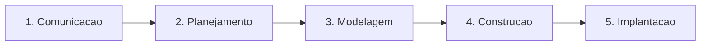

1. **Comunicação (Levantamento de Requisitos):** Interação direta com os clientes e partes interessadas para entender os objetivos de negócio, restrições operacionais e funcionalidades requeridas (trabalhado nas Aulas 01, 03 e 04).
2. **Planejamento:** Estimativa de prazos, alocação de equipe, orçamento, análise preliminar de riscos e definição do cronograma de marcos (*milestones*).
3. **Modelagem (Análise e Projeto):** Criação de modelos abstratos que representam a arquitetura, as interfaces, as regras de negócio e os fluxos de dados do sistema (tais como Diagramas de Casos de Uso e Classes no Astah UML, abordados nas Aulas 02, 05 e 06).
4. **Construção:** Atividade composta pela codificação (geração de código-fonte nas linguagens escolhidas) e verificação técnica (testes unitários, de integração e de regressão).
5. **Implantação:** Entrega do produto de software ao usuário final, homologação, treinamento e coleta de feedback para ciclos subsequentes de sustentação.

Além das atividades fundamentais, existem as **tarefas de proteção** (*umbrella activities*), que ocorrem paralelamente durante todo o ciclo: garantia de qualidade de software (SQA), gerência de configuração de software (SCM), gerência de riscos, medição de métricas e revisões técnicas formais (FTE).

---

### Modelo Cascata (Linear Sequencial)

Proposto originalmente por Winston Royce em 1970 (embora o autor já alertasse sobre suas limitações e propusesse ciclos com realimentação), o **Modelo Cascata** prescreve uma abordagem linear e sequencial para o desenvolvimento de software. Uma fase só pode ser iniciada formalmente após a conclusão, validação e congelamento (*baseline*) de todos os artefatos da fase precedente.

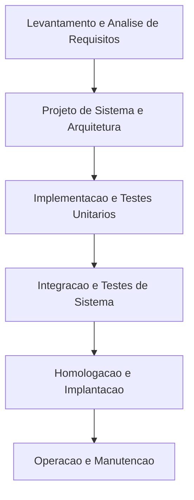

#### Definição e mecânica de operação
- **Entradas e Saídas Estritas:** A fase de requisitos gera o Documento de Especificação de Requisitos de Software (SRS). Uma vez assinado pelo cliente, a equipe avança para o Projeto Arquitetural e Detalhado.
- **Marcos Rígidos (*Gated Reviews*):** Mudanças de fase dependem de reuniões formais de aprovação. O avanço de fase bloqueia o retorno sem que haja a abertura de uma solicitação formal de controle de mudanças.

#### Motivação técnica
O modelo busca previsibilidade total. É motivado pela necessidade de planejar detalhadamente o orçamento, cronograma e alocação física de recursos antes de iniciar a construção dispendiosa, espelhando os processos clássicos da engenharia civil e mecânica.

#### Exemplo prático de aplicação
Desenvolvimento do sistema embarcado do computador de bordo de um foguete ou satélite. Os sensores, atuadores, interfaces de barramento e protocolos físicos são conhecidos anos antes do lançamento. A especificação matemática e física é rigorosamente validada em modelos formais antes que uma única linha de código em Ada/C seja gravada na memória ROM do equipamento.

#### Contraexemplo e cenário inadequado
Desenvolvimento de uma rede social ou aplicativo de comércio eletrônico no qual o comportamento de compra dos usuários e a concorrência mudam semanalmente. Tentar congelar requisitos por 12 meses antes de codificar resultará em um sistema obsoleto no próprio dia de lançamento.

#### Armadilhas e limitações críticas
- **O Fenômeno do Bloqueio de Fases (*Blocking States*):** Desenvolvedores ficam ociosos ou especulando soluções enquanto a equipe de análise não homologa os documentos formais.
- **Atraso na Descoberta de Erros Conceituais:** O cliente só vê o software funcionando no final do ciclo (fase de homologação). Se um requisito foi mal compreendido na fase inicial, todo o projeto e código derivados foram construídos em cima de premissas falsas.
- **A Curva Exponencial de Custo de Mudança (Barry Boehm):** O custo para corrigir um defeito de requisito descoberto durante a fase de manutenção pode ser de 50 a 200 vezes maior do que se tivesse sido corrigido na fase de análise inicial.

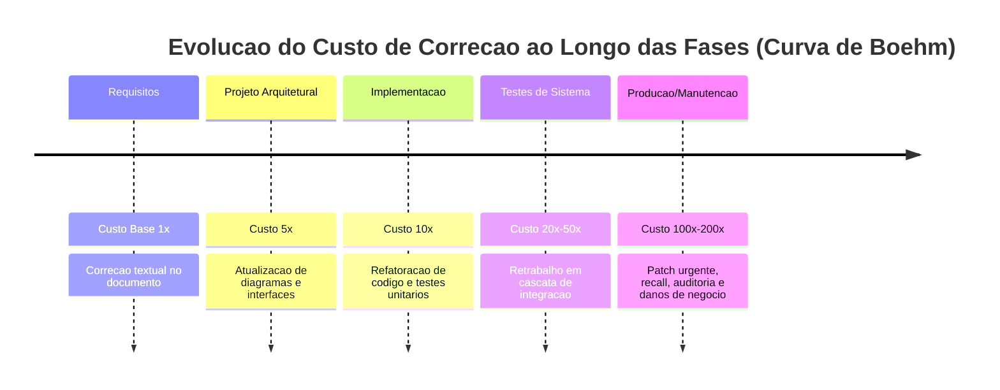

---

### Modelo de Prototipação

O **Modelo de Prototipação** foi concebido especificamente para responder à incerteza dos requisitos. Quando os usuários sabem os objetivos gerais do sistema, mas não conseguem articular detalhadamente as regras de negócio, os fluxos de trabalho ou os elementos de interface, a engenharia de software constrói versões operacionais preliminares (protótipos) para viabilizar a elicitação assertiva.

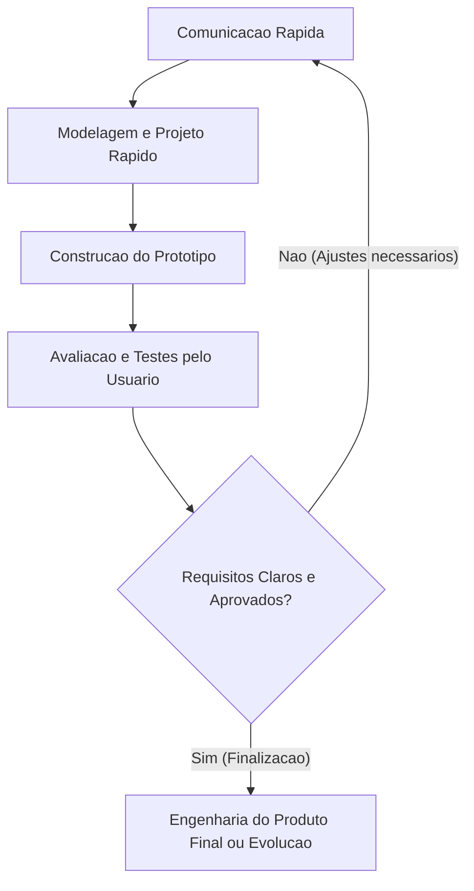

#### Classificação formal dos protótipos
1. **Prototipação Descartável (*Throwaway Prototyping*):** O protótipo é construído com ferramentas rápidas (ex.: Figma, scripts em Python ou telas simuladas sem persistência real) com a finalidade exclusiva de extrair os requisitos verdadeiros. Uma vez compreendidos os requisitos, o protótipo é descartado e o produto real é reconstruído do zero com arquitetura e qualidade robustas.
2. **Prototipação Evolutiva (*Evolutionary Prototyping*):** O protótipo inicial é projetado com qualidade estrutural básica e, a cada ciclo de avaliação com o cliente, novas funcionalidades são refinadas e integradas. O protótipo não é jogado fora; ele gradualmente se torna o sistema final de produção.

#### Motivação técnica
Reduzir dramaticamente o risco de rejeição da interface e desalinhamento de expectativas. O ser humano tem grande dificuldade em validar ideias abstratas descritas em centenas de páginas de texto, mas consegue expressar imediatamente o que funciona ou não ao manipular uma tela interativa (*efeito IKIWISI: "I'll know it when I see it"*).

#### Exemplo prático de aplicação
Criação do painel de controle (Dashboard) de uma mesa de operações financeiras (*trading*). Os operadores precisam visualizar gráficos em tempo real, livros de ofertas e botões de execução rápida. Prototipar diversas disposições de tela permite encontrar em dias a melhor ergonomia cognitiva antes de programar as integrações com os sistemas da Bolsa de Valores.

#### Contraexemplo e cenário inadequado
Desenvolvimento de uma biblioteca criptográfica de baixo nível para comunicação de satélites ou cálculos matemáticos do núcleo de um reator nuclear. Não há interface visual para o usuário avaliar; o foco é matemática computacional, conformidade algorítmica e ausência de vulnerabilidades de memória, tornando protótipos visuais inúteis.

#### Armadilhas e limitações críticas
- **A "Prototipite" e a Ilusão do Cliente:** Ao ver uma tela funcional com botões clicáveis e dados simulados, o cliente frequentemente assume que o sistema está 90% pronto e pressiona a equipe para colocar aquela versão diretamente em produção no dia seguinte.
- **Débito Técnico Estrutural:** Se a equipe ceder à pressão e transformar um protótipo descartável em produto final, o sistema herdará código não documentado, ausência de tratamento de exceções, falhas de segurança gritantes e banco de dados improvisado.

---

### Modelo Incremental

O **Modelo Incremental** combina a filosofia da linearidade do modelo cascata com a iteração da prototipação. Em vez de entregar o sistema como um bloco maciço único (*Big Bang*) ao final de um longo período, o escopo total é decomposto em entregáveis modulares denominados **incrementos**.

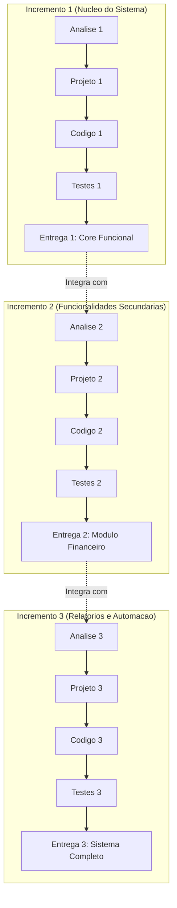

#### Definição e mecânica de operação
- O **Incremento 1** tipicamente implementa o "núcleo" operacional do produto (*core product*), cobrindo os requisitos mais críticos e de maior valor para o negócio.
- Os incrementos subsequentes adicionam novas funcionalidades periféricas ou especializadas, integrando-se aos incrementos previamente entregues e homologados.
- Cada incremento passa por suas próprias fases completas de comunicação, planejamento, modelagem, construção e testes antes de ser colocado em ambiente operacional.

#### Motivação técnica
Possibilitar que a organização contratante comece a utilizar o software e auferir retorno financeiro (*ROI — Return on Investment*) de forma antecipada. Caso haja restrição orçamentária ou escassez temporária de pessoal, o projeto pode ser pausado após a entrega de um incremento funcional sem que todo o investimento anterior seja perdido.

#### Exemplo prático de aplicação
Um sistema ERP para gestão de um hospital universitário. O Incremento 1 entrega o módulo de Cadastro de Pacientes e Prontuário Básico. O hospital já pode aposentar as fichas de papel. O Incremento 2 introduz o módulo de Agendamento de Consultas. O Incremento 3 implanta a Gestão de Estoque Farmacêutico e Faturamento de Convênios.

#### Contraexemplo e cenário inadequado
Sistemas com interdependência monolítica extrema, onde nenhuma parte do software pode operar sem a totalidade dos outros componentes físicos e lógicos prontos (ex.: firmware unificado de injeção eletrônica veicular que gerencia ignição, freios ABS e controle de tração de forma acoplada em hardware fixo).

#### Armadilhas e limitações críticas
- **Corrupção Arquitetural:** Se a arquitetura geral do sistema não for planejada com forte abstração e interfaces abertas no Incremento 1, a introdução de novos incrementos exigirá refatorações profundas e retrabalho de integração.
- **Definição Vaga do Núcleo:** Falha em priorizar o que realmente constitui o núcleo essencial do sistema, gerando um Incremento 1 excessivamente inchado que atrasa todas as entregas subsequentes.

---

### Modelo Espiral de Barry Boehm

Introduzido por Barry Boehm em seu clássico artigo de 1988 (*"A Spiral Model of Software Development and Enhancement"*), o **Modelo Espiral** é um processo evolutivo **guiado primordialmente pela gestão contínua de riscos** (*risk-driven process model*).

A representação do modelo adota um gráfico de coordenadas polares, onde:
- O **raio da espiral** representa os **custos cumulativos** incorridos no projeto até o momento;
- A **dimensão angular** representa o **progresso** obtido na conclusão de cada ciclo da espiral.

A cada revolução (volta) ao redor do centro da espiral, o projeto atravessa obrigatoriamente quatro quadrantes operacionais:

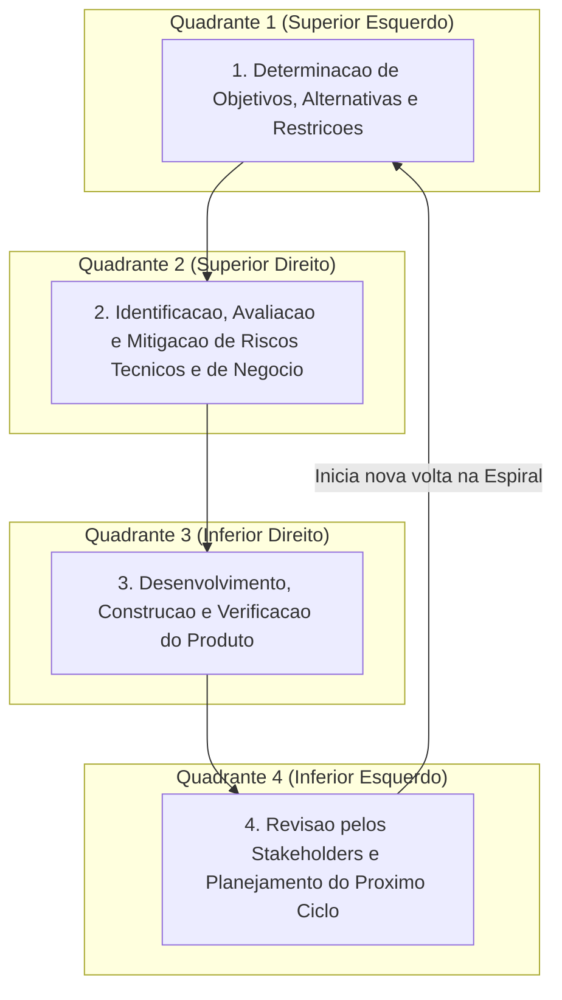

#### Detalhamento exaustivo dos quatro quadrantes de Boehm

##### 1. Determinação de Objetivos, Alternativas e Restrições (Superior Esquerdo)
- **Atividades centrais:** Definir com precisão os objetivos daquela fase específica (ex.: desempenho do sistema, integridade dos dados, cobertura de casos de uso).
- **Mapeamento de alternativas:** Como atingir esses objetivos? Desenvolver internamente (*build*), comprar uma solução de prateleira pronta (*buy*), terceirizar o módulo ou reutilizar componentes legados?
- **Identificação de restrições:** Quais os limites de custo, prazos, tecnologias obrigatórias, requisitos regulatórios e conformidade com leis de privacidade (ex.: LGPD).

##### 2. Identificação, Avaliação e Mitigação de Riscos (Superior Direito)
- **O coração da Espiral:** É neste quadrante que o modelo de Boehm se destaca de todos os outros. A equipe avalia minuciosamente o que pode dar errado em relação às alternativas escolhidas.
- **Técnicas de mitigação:** Para cada risco identificado, uma ação concreta de mitigação é executada imediatamente. Se o risco for volatilidade de requisitos de UI, constrói-se um protótipo descartável. Se o risco for gargalo de desempenho em uma biblioteca de banco de dados, executa-se um teste de estresse (*benchmark/spike*). Se o risco for perda de pessoal-chave, cruzam-se treinamentos e documenta-se a base de código.
- **Ponto de parada (*Go/No-Go Decision*):** Se o risco técnico ou financeiro for considerado inaceitável e impossível de ser mitigado, **o projeto é cancelado imediatamente**, economizando milhões antes da fase cara de construção.

##### 3. Desenvolvimento, Construção e Verificação do Produto (Inferior Direito)
- **Abordagem customizada por ciclo:** O modelo de desenvolvimento utilizado neste quadrante depende do nível de risco resolvido no quadrante anterior.
  - Se os riscos de requisitos forem dominantes, o desenvolvimento neste ciclo pode ser a codificação de um protótipo.
  - Se os riscos já foram eliminados e o design está maduro, este quadrante pode adotar uma abordagem estritamente Cascata ou Incremental para codificar a versão de produção.
- **Validação:** Realização de testes de unidade, cobertura de código, testes de carga e revisões técnicas formais para garantir que os entregáveis do ciclo satisfazem os objetivos traçados.

##### 4. Revisão pelos Stakeholders e Planejamento da Próxima Fase (Inferior Esquerdo)
- **Homologação:** O cliente e a liderança do projeto revisam todos os resultados produzidos na volta atual da espiral.
- **Compromisso formal:** É avaliada a viabilidade de prosseguir para a próxima volta.
- **Planejamento:** Alocam-se os recursos, orçamentos e prazos para o próximo ciclo, realimentando o Quadrante 1 da volta seguinte.

---

### Paradigma Prescritivo versus Paradigma Ágil

A engenharia de software contemporânea divide os modelos de processo em duas grandes famílias filosóficas:

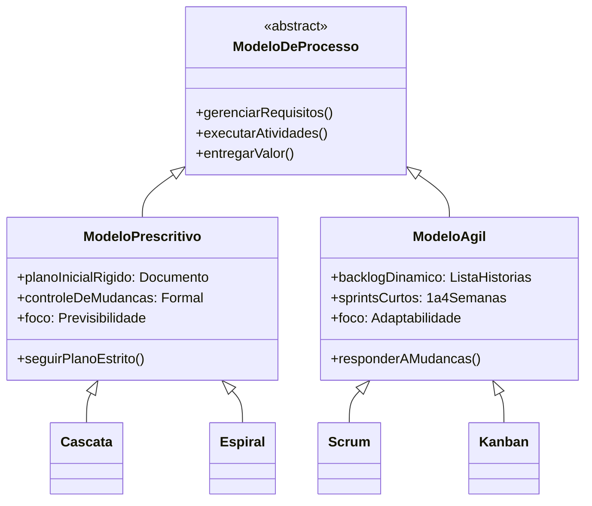

1. **Modelos Prescritivos (Dirigidos por Plano — *Plan-Driven*):**
   - Enfatizam a ordem sequencial, a documentação exaustiva, o cumprimento estrito de planos orçamentários e o controle formal de mudanças.
   - Excelentes para sistemas com baixa incerteza de requisitos, equipes geograficamente distribuídas de grande porte e sistemas de segurança crítica.
   - Exemplos: Modelo Cascata, Modelo V, RUP (em sua vertente formal).
2. **Modelos Adaptativos / Ágeis (Dirigidos por Feedback):**
   - Enfatizam a capacidade de responder rapidamente a mudanças de mercado, a colaboração contínua com o cliente sobre contratos rígidos, e a entrega contínua de software funcionando.
   - Excelentes para produtos digitais inovadores, startups, ambientes com alta volatilidade e equipes pequenas/médias altamente qualificadas.
   - Exemplos: Scrum, Extreme Programming (XP), Kanban.

---

## Resolução proposta

A seguir, apresenta-se a resolução técnica e detalhada para os quatro exercícios propostos na atividade avaliativa.

### Exercício 1: Estudo Comparativo entre Modelo Cascata e Prototipação

#### Descrição dos cenários de engenharia
Uma organização de tecnologia precisa desenvolver dois sistemas com perfis operacionais radicalmente opostos:
- **Cenário A:** Software embarcado para um marcapasso cardíaco implantável.
- **Cenário B:** Aplicativo móvel para gamificação de hábitos saudáveis voltado ao público jovem.

#### Análise do Cenário A: Marcapasso Cardíaco Implantável

##### Modelo recomendado: Modelo Cascata (com derivação formal para o Modelo V)

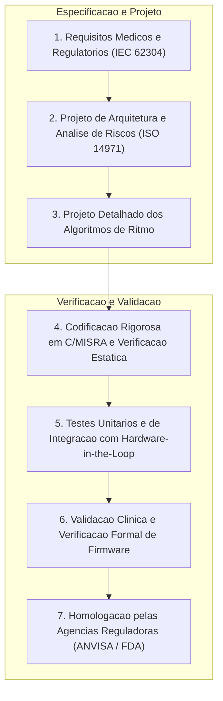

##### Justificativa técnica
1. **Natureza Crítica de Segurança (*Safety-Critical System*):** O software de um marcapasso cardíaco atua diretamente na manutenção da vida humana. Uma falha de software (*bug*) decorrente de estouro de ponteiro (*buffer overflow*), condição de corrida (*race condition*) ou cálculo incorreto de frequência de pulso elétrico resulta em morte imediata do paciente.
2. **Estabilidade e Rigidez dos Requisitos:** As regras de negócio e os parâmetros médicos de estimulação cardíaca (ex.: bradicardia, taquicardia ventricular, despolarização celular) são amplamente conhecidos, documentados pela ciência médica e não variam ao bel-prazer do mercado.
3. **Conformidade Regulatória Internacional Obrigatória:** Normas globais de dispositivos médicos como a **IEC 62304** (Processos de ciclo de vida de software de dispositivos médicos) e a **ISO 14971** (Aplicação de gerenciamento de risco a dispositivos médicos) exigem rastreabilidade bidirecional estrita: cada requisito funcional e de segurança deve estar explicitamente mapeado para um componente de projeto, um teste unitário e um teste de validação clínica.
4. **Custo Catastrófico de Mudança Pós-Implantação:** Uma vez cirurgicamente implantado no tórax do paciente e lacrado hermeticamente em titânio, o custo de atualizar ou corrigir um defeito no firmware não é o simples envio de uma notificação de atualização: envolve intervenção cirúrgica de alto risco (recall médico), custos jurídicos milionários e destruição da reputação do fabricante. O custo de mudança pós-implantação é virtualmente infinito.
5. **Inadequação da Prototipação:** O usuário final (o coração do paciente) não "avalia telas de teste" nem fornece feedback subjetivo de usabilidade. A prototipação visual aqui não tem objeto de estudo. A engenharia precisa de especificações matemáticas completas, verificações formais e garantias de terminação em tempo real (*real-time determinism*).

---

#### Análise do Cenário B: Aplicativo Móvel de Gamificação de Hábitos Saudáveis

##### Modelo recomendado: Modelo baseado em Prototipação (com evolução para framework Ágil)

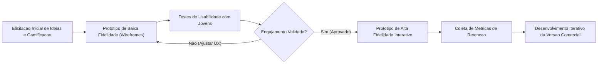

##### Justificativa técnica
1. **Extrema Volatilidade e Incerteza de Requisitos:** Aplicativos móveis para o público jovem operam sob regras de atratividade psicológica e tendências culturais e comportamentais efêmeras. Não se sabe de antemão qual mecânica de gamificação (pontos, distintivos, rankings, árvores de hábitos compartilhados ou desafios comunitários) gerará retenção e engajamento real.
2. **Prioridade Absoluta de Usabilidade e Ergonomia (UI/UX):** O sucesso do aplicativo depende de um fluxo de navegação intuitivo, tempos de resposta imperceptíveis e apelo visual estético. Esses aspectos são impossíveis de especificar estaticamente em documentos de texto: precisam ser experimentados, tocados e validados na tela do dispositivo móvel.
3. **Custo de Mudança Mínimo no Início do Ciclo:** Modificar o fluxo de navegação, a paleta de cores ou a dinâmica de recompensas em um protótipo construído em ferramentas visuais ou código leve leva minutos ou horas, custando frações mínimas do orçamento.
4. **Inadequação do Modelo Cascata:** Caso o Modelo Cascata fosse adotado, a equipe gastaria meses escrevendo um documento de requisitos exaustivo sobre regras de pontuação teóricas. Após todo o ciclo de codificação e testes, ao publicar o app nas lojas (Google Play e Apple Store), o público jovem poderia simplesmente desinstalar o aplicativo nos primeiros 30 segundos por considerá-lo entediante. O projeto teria fracassado após queimar todo o orçamento sem oportunidade de adaptação.

---

### Exercício 2: Análise de Riscos no Modelo Espiral de Boehm

#### Descrição dos quatro quadrantes de cada ciclo da Espiral

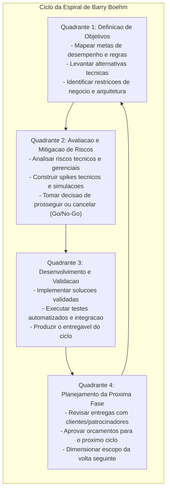

1. **Definição de Objetivos:** Estabelece o escopo específico do ciclo corrente, identificando requisitos funcionais e não-funcionais que devem ser solucionados, as alternativas de engenharia disponíveis (ex.: arquiteturas, frameworks, fornecedores de nuvem) e as restrições contratuais, financeiras e tecnológicas.
2. **Avaliação e Mitigação de Riscos:** Identifica sistematicamente os gargalos e vulnerabilidades das alternativas levantadas. Constrói estratégias empíricas para neutralizar essas ameaças (estudos de viabilidade, prototipação técnica descartável, benchmarking de estresse).
3. **Desenvolvimento e Validação:** Constrói os artefatos planejados utilizando a abordagem metodológica mais apropriada para aquele nível de maturidade (pode ser um protótipo, um modelo conceitual ou código de produção completo com testes rigorosos).
4. **Planejamento da Próxima Fase:** Avalia com os patrocinadores os resultados concretos do ciclo, decide pela continuidade, redirecionamento ou cancelamento do projeto, e planeja detalhadamente os recursos da próxima revolução da espiral.

---

#### Cenário prático: Adoção arriscada de um Banco de Dados Distribuído Inovador

##### Contexto da organização e do projeto
Uma grande instituição financeira brasileira está desenvolvendo um novo Sistema de Liquidação e Pagamentos Instantâneos de Altíssimo Volume para processar transações financeiras 24/7, com expectativa de carga de pico de **60.000 transações por segundo (TPS)**, exigindo estrita consistência de dados (garantia ACID e ausência de leituras fantasmas ou saldo duplicado).

A equipe de arquitetura propõe adotar um banco de dados distribuído NoSQL recém-lançado no mercado internacional (*Database X*), que promete escalabilidade linear infinita e latência submilisegunda em blogs de tecnologia.

##### Como o Modelo Cascata trataria a decisão (e o desastre consequente)
No Modelo Cascata, a equipe de arquitetura aceitaria as especificações do fabricante do *Database X* durante a fase de Projeto. O sistema inteiro seria codificado ao longo de 18 meses com base nessa tecnologia. Durante a fase final de Testes Integrados de Carga, ou pior, na primeira semana de operação em produção sob alta concorrência:
- O banco apresenta problemas de consistência eventual (*split-brain*) sob partições de rede;
- Contas correntes ficam com saldos corrompidos;
- A latência dispara sob carga real de escrita pesada;
- **Resultado:** O projeto entra em colapso, o prejuízo atinge a casa das dezenas de milhões de reais e a infraestrutura precisa ser refeita do zero em caráter de crise institucional.

##### Como o Modelo Espiral evita o fracasso (Passo a Passo)

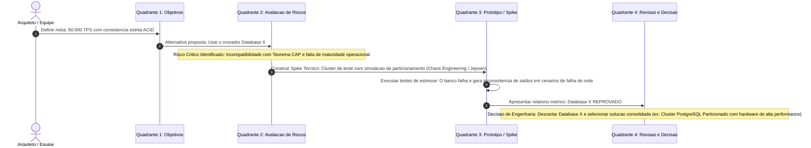

1. **Ciclo 1 — Quadrante 1 (Objetivos):** O objetivo é definir o motor de persistência. Restrições: latência inferior a 15ms no percentil p99, conformidade estrita com normas do Banco Central do Brasil para liquidação imediata e zero perda de transações.
2. **Ciclo 1 — Quadrante 2 (Avaliação de Riscos):** A equipe de engenharia lista o principal risco técnico: *"O Database X é uma tecnologia imatura, não testada no setor bancário nacional sob estresse de partição de rede (Teorema CAP). Se a consistência falhar, os dados contábeis serão corrompidos"*. Classificação do Risco: **Probabilidade Média, Impacto Catastrófico (Severidade Crítica)**.
3. **Ciclo 1 — Quadrante 2 (Mitigação Ativa):** Antes de escrever qualquer linha do sistema bancário real, a equipe projeta um plano de mitigação de 10 dias úteis. Aloca-se um orçamento reduzido para montar um ambiente de laboratório isolado (*spike arquitetural*).
4. **Ciclo 1 — Quadrante 3 (Construção do Teste/Spike):** A equipe programa scripts geradores de carga concorrente utilizando ferramentas de injeção de falhas (como Jepsen Testing e Chaos Mesh), simulando a interrupção momentânea de conexões entre os nós do cluster do *Database X*.
5. **Resultado Empírico:** O teste revela que, sob partição de rede, o *Database X* prioriza disponibilidade em detrimento da consistência, permitindo o fenômeno de "gasto duplo" (*double-spending*).
6. **Ciclo 1 — Quadrante 4 (Revisão e Planejamento da Próxima Fase):** A equipe de engenharia apresenta os dados do teste à diretoria no final do ciclo. Com base em evidências numéricas, o *Database X* é formalmente descartado. O planejamento do próximo ciclo define a adoção de um cluster relacional distribuído consolidado com suporte a consenso Paxos/Raft e garantias ACID comprovadas.
7. **Conclusão:** O Modelo Espiral evitou o fracasso do projeto no primeiro mês, gastando menos de 1% do orçamento total previsto para neutralizar um risco que teria sido fatal se descoberto no final do ciclo de vida.

---

### Exercício 3: Modelo Incremental versus Abordagem Iterativa Ágil

#### Diferenciação conceitual e prática

Embora tanto o Modelo Incremental clássico quanto os métodos ágeis (como Scrum) dividam o trabalho em entregas parciais e sucessivas, as fundações conceituais e os fluxos de trabalho divergem de forma profunda:

| Dimensão de Engenharia | Modelo Incremental Tradicional | Abordagem Iterativa Ágil (ex.: Scrum) |
| :--- | :--- | :--- |
| **Origem e Filosofia** | Extensão dos modelos prescritivos clássicos; busca decompor o plano mestre em fases de lançamento sucessivas. | Manifestação direta do Manifesto Ágil (2001); abraça a incerteza e a mudança contínua como vantagem competitiva. |
| **Arquitetura e Escopo Inicial** | **BDUF Parcial (*Big Design Up Front*):** Arquitetura geral, requisitos e interfaces globais são detalhados no início do projeto. | **Arquitetura Emergente e Mínima Viável:** O design evolui e refatora-se a cada iteração conforme novas histórias de usuário são priorizadas. |
| **Fatiamento do Trabalho** | Fatiamento por grandes subsistemas funcionais completos (frequentemente fatiamento horizontal ou blocos departamentais). | **Fatiamento Vertical (*Vertical Slicing*):** Cada história de usuário corta todas as camadas (UI, lógica e banco) gerando valor palpável. |
| **Duração dos Ciclos** | Longa cadência: cada incremento costuma levar de **2 a 6 meses** para ser projetado, codificado e homologado. | Cadência curta e fixa (*Timebox*): iterações (*Sprints*) com duração rígida de **1 a 4 semanas**. |
| **Papel da Documentação** | Formal e exaustiva: cada incremento exige especificações de requisitos, diagramas UML detalhados e manuais formais. | Enxuta e focada no valor: documentação essencial e código limpo (*working software over comprehensive documentation*). |

---

#### Mecanismos operacionais de comparação

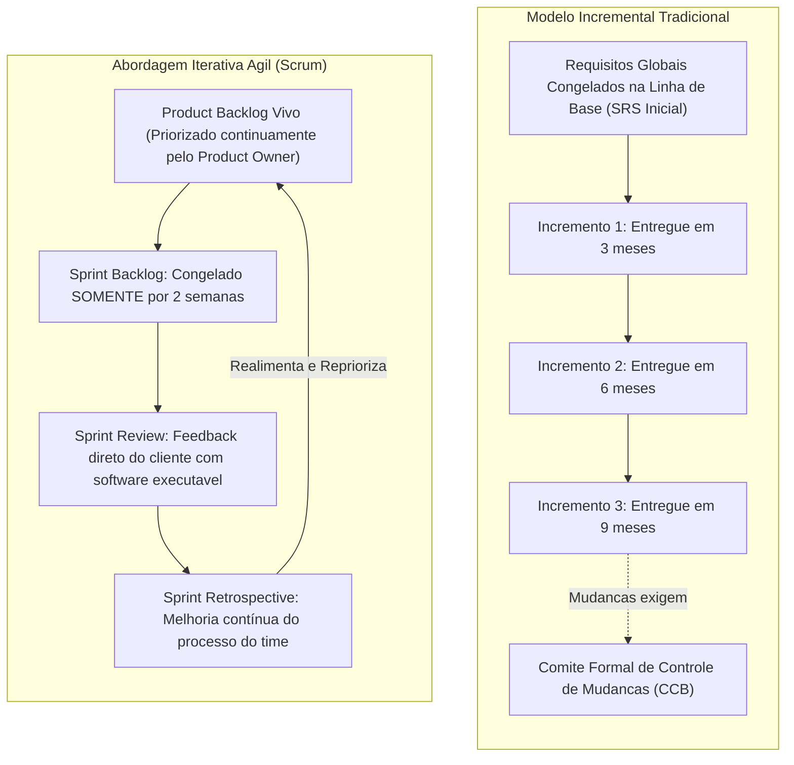

#### 1. Congelamento de escopo (Baseline vs. Sprint Backlog)
- **No Modelo Incremental Clássico:**
  - Ocorre um **congelamento macro de escopo** na fase inicial de concepção. A lista completa de todos os incrementos e o que cada um conterá até o fim do projeto é fixada em contrato (*baseline* de requisitos).
  - Qualquer alteração solicitada pelo cliente no meio do caminho exige um processo burocrático de **Solicitação de Mudança de Engenharia (ECR — *Engineering Change Request*)**, com reavaliação de custos e aprovação por um Comitê de Controle de Mudanças (*Change Control Board - CCB*).
- **Na Abordagem Iterativa Ágil (Scrum):**
  - O escopo global do projeto **nunca é congelado**. O *Product Backlog* é um artefato vivo, dinâmico e flexível, continuamente repriorizado pelo *Product Owner* (PO) com base no valor de negócio e no aprendizado adquirido.
  - O único congelamento que existe é **microscópico e temporário**: durante a execução de uma *Sprint* (ex.: 2 semanas), a equipe concorda em congelar o *Sprint Backlog*. Nenhuma funcionalidade nova entra na *Sprint* em andamento para preservar o foco técnico da equipe. Ao término daquelas duas semanas, todo o restante do projeto está aberto a mudanças.

#### 2. Periodicidade de entregas funcionais ao cliente
- **No Modelo Incremental Clássico:** As entregas ocorrem com intervalos espaçados (trimestrais ou semestrais). O cliente precisa aguardar meses para receber a primeira versão funcional e, entre um incremento e outro, há pouca visibilidade do progresso intermediário.
- **Na Abordagem Iterativa Ágil (Scrum):** A entrega de um incremento funcional, testado, integrado e potencialmente implantável (*Potentially Releasable Increment*) é obrigatória **ao final de cada Sprint**. Em ciclos de 10 dias úteis, o cliente vê o produto crescer semanalmente em ambiente de homologação.

#### 3. Mecanismos de realimentação (Feedback Loops)
- **No Modelo Incremental Clássico:** O feedback ocorre primariamente na fase de implantação de cada grande incremento. Se o cliente notar que o Incremento 1 não atende às suas necessidades operacionais reais, o impacto financeiro e o retrabalho para ajustar os Incrementos 2 e 3 (cujas bases já haviam sido projetadas) são severos.
- **Na Abordagem Iterativa Ágil (Scrum):** Os ciclos de realimentação são contínuos e estruturados em cerimônias de governança formal:
  - **Reunião Diária (*Daily Scrum*):** Alinhamento diário de 15 minutos para identificar impedimentos imediatos;
  - **Revisão da Sprint (*Sprint Review*):** Sessão colaborativa onde o cliente e stakeholders experimentam o software real construído no ciclo e orientam diretamente a priorização da próxima *Sprint*;
  - **Retrospectiva da Sprint (*Sprint Retrospective*):** Reunião reflexiva da equipe para calibrar o próprio processo de trabalho, eliminar desperdícios e ajustar as ferramentas técnicas.

---

### Exercício 4: Matriz de Decisão e Seleção de Modelos de Processo

A matriz comparativa a seguir avalia os quatro modelos fundamentais de processo com base em cinco critérios essenciais de engenharia de software, atribuindo classificações qualitativas e justificativas técnicas precisas.

| Critério de Engenharia | Modelo Cascata | Modelo de Prototipação | Modelo Incremental | Modelo Espiral |
| :--- | :--- | :--- | :--- | :--- |
| **1. Clareza e Estabilidade Inicial dos Requisitos** | **Alta**<br>Exige que os requisitos sejam totalmente conhecidos, não ambíguos e congelados desde o primeiro dia. | **Baixa**<br>Feito especificamente para cenários onde o cliente tem dificuldade de descrever o que deseja. | **Média a Alta**<br>O núcleo do sistema (*core*) deve ser estável; os incrementos futuros admitem pequeno refinamento. | **Baixa a Média**<br>Os requisitos podem evoluir e ser refinados a cada volta ao redor da espiral. |
| **2. Frequência do Envolvimento do Cliente/Usuário** | **Baixa**<br>O cliente participa fortemente apenas no início (especificação) e no final (homologação/aceite). | **Muito Alta**<br>Envolvimento intensivo; o usuário experimenta, critica e valida as telas a cada ciclo de protótipo. | **Média**<br>O usuário é chamado para homologar e aceitar cada incremento funcional concluído a cada ciclo. | **Alta**<br>O cliente participa ativamente das revisões de quadrante e aprovações do plano da próxima fase. |
| **3. Capacidade de Gerenciar e Mitigar Riscos Técnicos** | **Baixa**<br>Praticamente ignora riscos no início; assume que o plano mestre será cumprido linearmente sem desvios. | **Média**<br>Mitiga primariamente riscos de interface humana e requisitos de usabilidade; fraca em riscos arquiteturais. | **Média**<br>Reduz riscos de negócio com entregas parciais, mas pode herdar fragilidades de integração global. | **Muito Alta**<br>É a essência do modelo: possui um quadrante formal dedicado à identificação e mitigação prévia de riscos. |
| **4. Tempo Decorrido até a Entrega da Primeira Versão Funcional** | **Muito Longo**<br>O software só é compilado e disponibilizado para execução no final do cronograma total do projeto. | **Curto**<br>Produz versões de interface e maquetes funcionais nas primeiras semanas de desenvolvimento. | **Médio**<br>O Incremento 1 (núcleo) é entregue em uma fração do tempo total do projeto geral. | **Médio a Longo**<br>Dedica esforço expressivo inicial à análise e mitigação antes de gerar o código de produção final. |
| **5. Custo de Retrabalho para Absorver Alterações Tardias** | **Catastrófico (Muito Alto)**<br>Seguindo a Curva de Boehm, uma mudança em produção exige retrabalho em cascata de todos os artefatos. | **Médio**<br>Se for descartável, o custo é absorvido antes do código final; se evolutiva sem arquitetura, gera débito. | **Médio**<br>Mudanças em incrementos já entregues custam caro, mas incrementos não iniciados absorvem ajustes. | **Baixo a Médio**<br>O planejamento cíclico acomoda ajustes na próxima volta com custo controlado de mitigação. |

---

#### Justificativas técnicas consolidadas para a tomada de decisão

1. **Quando selecionar o Modelo Cascata:**
   - O projeto possui escopo perfeitamente delineado, estável e livre de ambiguidades.
   - O domínio técnico é amplamente dominado pela equipe de engenharia (tecnologias maduras e consolidadas).
   - O sistema é regulamentado por normas estritas de segurança da vida humana ou missão crítica (aeroespacial, ferroviário, dispositivos médicos implantáveis).
   - O contrato exige preço fechado (*fixed-price*), escopo fechado e data improrrogável de entrega com documentação formalizada.

2. **Quando selecionar o Modelo de Prototipação:**
   - O sistema possui interface rica de usuário (*UI-heavy*), fluxos complexos de navegação e forte dependência de fatores ergonômicos e cognitivos.
   - Os usuários e clientes são incapazes de verbalizar suas necessidades por meio de texto ou diagramas conceituais abstratos.
   - Trata-se de um produto pioneiro no mercado consumidor, cujo comportamento de compra ou uso precisa ser validado por amostragem empírica.

3. **Quando selecionar o Modelo Incremental:**
   - A organização contratante precisa de um produto funcional operando rapidamente para faturar ou economizar, mas o orçamento total ou equipe completa ainda não estão disponíveis.
   - O escopo geral do sistema pode ser particionado de maneira limpa em subsistemas com acoplamento fraco e alta coesão.
   - A equipe técnica precisa de tempo para assimilar tecnologias complementares enquanto o núcleo operacional já está sendo construído.

4. **Quando selecionar o Modelo Espiral:**
   - Sistemas corporativos de grande porte e alta complexidade técnica, envolvendo altos investimentos financeiros onde o fracasso técnico é inaceitável.
   - Projetos que introduzem componentes de pesquisa e desenvolvimento (P&D), inteligência artificial inédita ou migração para arquiteturas de nuvem distribuída não testadas.
   - Ambientes em que a viabilidade econômica, regulatória e de desempenho precisa ser recalculada periodicamente à medida que o projeto avança.

---

## Como testar e validar

Para verificar se a seleção de um modelo de processo ou a resolução de um estudo de caso em engenharia de software é tecnicamente correta, o engenheiro deve aplicar uma bateria de testes conceituais e de governança.

### Rubrica de validação de decisões arquiteturais de ciclo de vida

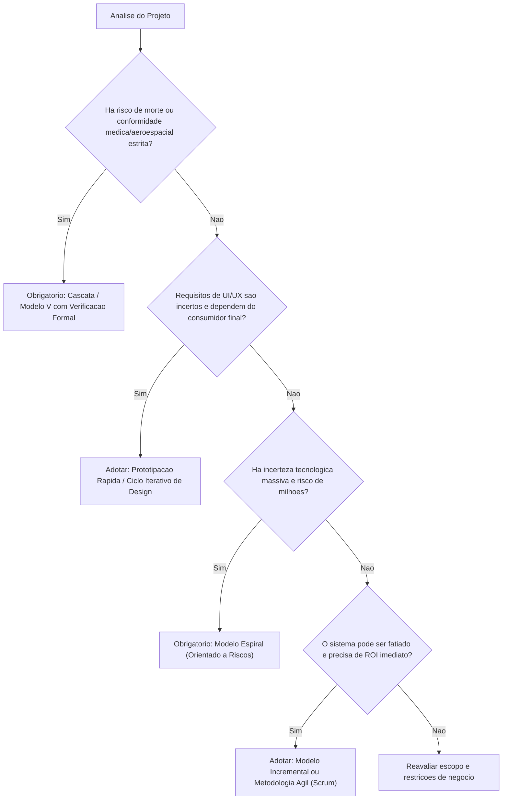

### Checklist de consistência conceitual

Ao avaliar a resposta técnica de um projeto ou atividade de processo, verifique:
- [ ] **Teste de Alinhamento de Risco:** Se o sistema é de missão crítica, foi evitada a recomendação de abordagens que descartam documentação ou que não preveem verificações formais de requisitos?
- [ ] **Teste de Volatilidade:** Se os requisitos são dinâmicos e voláteis, o modelo proposto permite incorporar mudanças sem necessidade de renegociação contratual e burocracia de comitês para cada tela alterada?
- [ ] **Teste de Custo de Retrabalho:** A solução proposta mitiga o risco de descobrir falhas conceituais apenas na entrega final do produto (respeitando a Curva de Boehm)?
- [ ] **Teste de Rastreabilidade:** Os modelos analíticos construídos no Astah UML (Casos de Uso e Classes) possuem um momento claro e definido de concepção e validação dentro do ciclo de vida selecionado?

---

## Critérios de qualidade

Para obter nota máxima (2,0 pontos) na avaliação da disciplina de Engenharia de Software I, a análise desenvolvida deve satisfazer os seguintes padrões de excelência:

1. **Rigor Terminológico e Precisão Conceitual:**
   - Emprego exato das definições estabelecidas na literatura clássica (Pressman, Sommerville, Boehm).
   - Distinção nítida entre atividades de arcabouço (*framework activities*) e tarefas de proteção (*umbrella activities*).
   - Uso correto dos termos "descartável" versus "evolutivo" para prototipação e "fatiamento horizontal" versus "fatiamento vertical" para abordagens incrementais e ágeis.

2. **Profundidade Argumentativa nos Estudos de Caso:**
   - No caso do marcapasso, citar as implicações regulatórias, a natureza de segurança crítica e a inviabilidade de *recalls* físicos em componentes implantados no corpo humano.
   - No caso do aplicativo jovem, articular o conceito de *Product-Market Fit*, ergonomia cognitiva e a inutilidade de especificações estáticas para interfaces lúdicas.

3. **Domínio da Engenharia de Riscos (Modelo Espiral):**
   - Demonstração prática e não apenas teórica do funcionamento dos quatro quadrantes de Boehm.
   - Criação de um cenário de teste empírico (*spike* técnico / simulação de carga) que evidencie de forma irrefutável como a tomada de decisão orientada a riscos economiza recursos financeiros e previne o colapso de infraestruturas críticas.

4. **Clareza Gráfica e Sintaxe Estrita de Modelagem:**
   - Diagramas de fluxo e sequência estruturados em sintaxe Mermaid válida, limpa, legível e aderente aos padrões do GitHub (sem poluição visual ou diretivas de estilo proprietárias).

---

## Arquivos de apoio

Os conteúdos teóricos, práticos e ferramentas que fundamentam esta atividade estão distribuídos nas aulas do acervo da disciplina:

- **[Aula 01 - Processo de Abstração e Levantamento de Requisitos](../../Aulas/Aula%2001%20-%20Processo%20de%20Abstra%C3%A7%C3%A3o%20e%20Levantamento%20de%20Requisitos/detalhes.md):** Fundamentação sobre o que são requisitos funcionais e não-funcionais, regras de negócio e como a incompletude na fase de comunicação afeta o projeto.
- **[Aula 02 - Configuração e Licenciamento do Astah UML](../../Aulas/Aula%2002%20-%20Configura%C3%A7%C3%A3o%20e%20Licenciamento%20do%20Astah%20UML/detalhes.md):** Ferramenta oficial para modelagem analítica utilizada ao longo de todo o ciclo de vida dos projetos práticos.
- **[Aula 03 - Revisão de Requisitos de Software para AV1](../../Aulas/Aula%2003%20-%20Revis%C3%A3o%20de%20Requisitos%20de%20Software%20para%20AV1/detalhes.md):** Critérios de aceitação, consistência e rastreabilidade entre requisitos e entregas de software.
- **[Aula 04 - Abstração e Modelagem de Requisitos](../../Aulas/Aula%2004%20-%20Abstra%C3%A7%C3%A3o%20e%20Modelagem%20de%20Requisitos/detalhes.md):** Transição da visão de negócio abstrata para diagramas preliminares de casos de uso.
- **[Aula 05 - Descrição Textual de Casos de Uso](../../Aulas/Aula%2005%20-%20Descri%C3%A7%C3%A3o%20Textual%20de%20Casos%20de%20Uso/detalhes.md):** Especificação formal dos fluxos principal, alternativo e de exceção que servem de entrada para os modelos de processos de software.
- **[Aula 06 - Modelo de Apresentação da Fase Análise](../../Aulas/Aula%2006%20-%20Modelo%20de%20Apresenta%C3%A7%C3%A3o%20da%20Fase%20An%C3%A1lise/detalhes.md):** Consolidação dos artefatos da fase de modelagem analítica antes da transição para o projeto arquitetural e codificação.

---

## Mapa da atividade

O fluxograma mental a seguir ilustra a visão holística dos modelos de processos de software, suas características axiais e o direcionamento para tomada de decisão em engenharia:

```mermaid
flowchart TD
    SDLC["Modelos de Processos de Software (SDLC)"]

    SDLC --> Cascata["Modelo Cascata (Linear)"]
    Cascata --> C1["Fases sequenciais com baseline"]
    Cascata --> C2["Requisitos estaveis e congelados"]
    Cascata --> C3["Seguranca critica e conformidade formal"]

    SDLC --> Prototipacao["Modelo de Prototipacao"]
    Prototipacao --> P1["Descartavel vs Evolutiva"]
    Prototipacao --> P2["Elicitacao empirica de UI/UX"]
    Prototipacao --> P3["Combate a incerteza de requisitos"]

    SDLC --> Incremental["Modelo Incremental"]
    Incremental --> I1["Entrega parcelada em modulos"]
    Incremental --> I2["Nucleo operacional precoce (Core)"]
    Incremental --> I3["Retorno financeiro antecipado (ROI)"]

    SDLC --> Espiral["Modelo Espiral de Boehm"]
    Espiral --> E1["Orientado a Riscos (Risk-Driven)"]
    Espiral --> E2["4 Quadrantes por revolucao"]
    Espiral --> E3["Alta complexidade e projetos de P e D"]

    SDLC --> Agil["Abordagem Agil (Scrum)"]
    Agil --> A1["Ciclos curtos (Sprints)"]
    Agil --> A2["Fatiamento vertical de historias"]
    Agil --> A3["Feedback e adaptacao continua"]
```

---

## Glossário

| Termo Técnico | Definição no Contexto de Engenharia de Software |
| :--- | :--- |
| **Linha de Base (*Baseline*)** | Especificação ou produto de trabalho que foi formalmente revisado e acordado, servindo de base para o desenvolvimento subsequente e que só pode ser alterado por meio de procedimentos formais de controle de mudanças. |
| **Curva de Boehm** | Princípio empírico formulado por Barry Boehm demonstrando que o custo relativo para encontrar e corrigir um erro de software aumenta de forma não linear (frequentemente exponencial) à medida que se avança no ciclo de vida. |
| **Prototipação Descartável (*Throwaway*)** | Técnica em que um protótipo operacional simples é construído para esclarecer requisitos ambíguos de interface ou fluxo e, uma vez compreendida a necessidade, o código é descartado em favor de uma implementação de produção limpa. |
| **Prototipação Evolutiva** | Abordagem em que o protótipo inicial serve como esqueleto da arquitetura de produção, sendo progressivamente refinado, expandido e endurecido com código de qualidade até se tornar o sistema comercial final. |
| **Incremento de Software** | Um subsistema ou bloco funcional autocontido, testado e utilizável, que adiciona recursos operacionais ao núcleo previamente implantado do software. |
| **Modelo Espiral** | Modelo de processo de software evolutivo e iterativo, projetado por Barry Boehm, cuja progressão através de fases cíclicas é estritamente governada pela identificação contínua e mitigação de riscos técnicos e de negócio. |
| **Ponto de Verificação (*Milestone*)** | Marco de progresso no cronograma de desenvolvimento associado à conclusão de um artefato verificável (ex.: SRS aprovado, arquitetura homologada, suíte de testes de aceitação executada). |
| **Spike Técnico** | Experimento ou protótipo mínimo focado na resolução de uma incerteza técnica específica (ex.: desempenho de um driver, comportamento de um banco de dados sob partição de rede), utilizado para mitigar riscos antes de assumir compromissos arquiteturais. |
| **Comitê de Controle de Mudanças (*CCB*)** | Grupo formal de partes interessadas (gerentes, clientes, arquitetos) responsável por avaliar o impacto no prazo e orçamento de qualquer solicitação de alteração após o congelamento da linha de base de requisitos. |
| **Sistema de Segurança Crítica (*Safety-Critical*)** | Sistema cuja falha, mau funcionamento ou colapso computacional pode resultar em morte ou lesões físicas graves a pessoas, perdas financeiras astronômicas ou danos irreparáveis ao meio ambiente. |

---

## Pontos-chave para a prova

Para as avaliações teóricas da disciplina do Prof. Marcelo Boer, o estudante deve fixar os seguintes tópicos conceituais recorrentes:

1. **A pegadinha clássica do Modelo Cascata:** O Modelo Cascata não falha porque as fases de análise, projeto e testes estão erradas — essas atividades são essenciais em qualquer engenharia. Ele falha quando aplicado a **contextos de requisitos instáveis e desconhecidos**, pois presume que o cliente sabe exatamente tudo o que quer no primeiro dia e que não haverá mudanças ao longo de meses ou anos de desenvolvimento.
2. **A ilusão da Prototipação:** O maior perigo gerencial da prototipação é a equipe permitir que um cliente impressionado com a parte visual coloque um protótipo descartável em produção. O código feito para demonstração rápida não possui tratamento de concorrência, segurança, índices de banco ou arquitetura sustentável.
3. **O diferencial do Modelo Espiral:** Se cair em prova a pergunta: *"Qual elemento diferencia o Modelo Espiral de todos os outros modelos de ciclo de vida?"*, a resposta exata é: **A gestão e avaliação explícita e contínua de riscos técnicos e de negócio em todos os ciclos**.
4. **Fatiamento Horizontal versus Fatiamento Vertical:**
   - Modelos tradicionais tendem a fatiar o trabalho de forma horizontal (primeiro faz-se todo o banco de dados, depois todas as regras de negócio, depois todas as telas).
   - Metodologias ágeis e incrementais modernas exigem fatiamento vertical (cada história de usuário ou incremento implementa uma fatia fina e funcional de todas as camadas, entregando valor real ao usuário).
5. **A Curva de Custo da Mudança:** A justificativa matemática para gastar tempo levantando requisitos detalhadamente nas Aulas 01 a 06 é econômica: corrigir uma falha conceituada na fase de requisitos custa $1; corrigir o mesmo erro após o sistema estar em produção com banco de dados populado pode custar de $100 a $200.

---

## Perguntas e respostas (JSONL)

```jsonl
{"pergunta": "Qual e a definicao formal de um processo de software segundo Roger Pressman?", "resposta": "Um processo de software e um arcabouco estruturado de atividades, acoes e tarefas necessarias para construir software de alta qualidade, definindo quem faz o que, quando e como ao longo do ciclo de vida.", "dificuldade": "facil"}
{"pergunta": "Quais sao as cinco atividades fundamentais de arcabouco presentes em praticamente todos os processos de software?", "resposta": "Comunicacao, Planejamento, Modelagem (Analise e Projeto), Construcao (Codificacao e Testes) e Implantacao.", "dificuldade": "facil"}
{"pergunta": "Por que o modelo caotico de Codificar-e-Remendar (Code-and-Fix) e inviavel para projetos corporativos?", "resposta": "Porque a ausencia de planejamento e modelagem prévia gera codigo espaguete de alto acoplamento, impossibilidade de manutencao a medio prazo, retrabalho cronico e custos astronomicos.", "dificuldade": "facil"}
{"pergunta": "O que estabelece a Curva de Custo de Mudanca de Barry Boehm?", "resposta": "Estabelece que o custo para corrigir um defeito ou alterar um requisito aumenta de forma exponencial a medida que o projeto avanca pelas fases de analise, projeto, codificacao, testes e producao.", "dificuldade": "media"}
{"pergunta": "Qual e a caracteristica operacional determinante do Modelo Cascata clássico?", "resposta": "Sua abordagem linear e sequencial, em que uma fase so pode ser formalmente iniciada apos a conclusao, homologacao e congelamento (baseline) de todos os artefatos da fase anterior.", "dificuldade": "facil"}
{"pergunta": "Cite duas desvantagens criticas do Modelo Cascata quando aplicado a projetos com requisitos volateis.", "resposta": "O cliente so ve o software em execucao no final do ciclo de vida (atrasando a descoberta de erros conceituais) e a rigidez do congelamento de fases bloqueia adaptacoes rapidas a mudancas de mercado.", "dificuldade": "media"}
{"pergunta": "Qual a diferenca fundamental entre prototipacao descartavel (throwaway) e evolutiva?", "resposta": "Na prototipacao descartavel o prototipo serve apenas para elicitar requisitos e depois e jogado fora; na evolutiva, o prototipo possui arquitetura basica e e gradualmente refinado ate virar o produto final.", "dificuldade": "media"}
{"pergunta": "Qual e o maior risco gerencial associado a prototipacao descartavel perante o cliente?", "resposta": "O cliente ver a interface funcionando com dados simulados, achar que o software esta 90% pronto e pressionar a equipe para coloca-lo diretamente em producao sem arquitetura real.", "dificuldade": "media"}
{"pergunta": "Em que consiste a abordagem de desenvolvimento do Modelo Incremental?", "resposta": "O escopo total e decomposto em entregaveis funcionais menores (incrementos), onde o primeiro entrega o nucleo operacional (core product) e os subsequentes adicionam novas funcionalidades.", "dificuldade": "facil"}
{"pergunta": "Qual e o principal beneficio financeiro do Modelo Incremental para a organizacao contratante?", "resposta": "A geracao antecipada de retorno sobre o investimento (ROI), permitindo que o cliente comece a operar e obter valor comercial a partir da entrega do primeiro incremento.", "dificuldade": "media"}
{"pergunta": "O que representa a dimensao radial (raio) no diagrama polar do Modelo Espiral de Boehm?", "resposta": "Representa os custos financeiros e operacionais cumulativos incorridos no projeto ate aquele momento.", "dificuldade": "media"}
{"pergunta": "O que representa a dimensao angular (voltas ao redor do centro) no Modelo Espiral de Boehm?", "resposta": "Representa o progresso obtido pela equipe na conclusao de cada ciclo ou fase de desenvolvimento do software.", "dificuldade": "media"}
{"pergunta": "Quais sao os quatro quadrantes que compoem cada ciclo da Espiral de Boehm?", "resposta": "1. Determinacao de Objetivos, Alternativas e Restricoes; 2. Identificacao e Mitigacao de Riscos; 3. Desenvolvimento e Validacao; 4. Planejamento da Proxima Fase.", "dificuldade": "dificil"}
{"pergunta": "O que e um 'spike tecnico' no contexto da mitigacao de riscos arquiteturais?", "resposta": "E a construcao de um prototipo minimo focado em testar e mensurar uma incerteza tecnica especifica (como testes de estresse em um banco de dados) antes de comprometer o projeto.", "dificuldade": "dificil"}
{"pergunta": "Por que o desenvolvimento de um software para marcapasso cardiaco deve usar uma abordagem formal prescritiva como o Cascata/Modelo V?", "resposta": "Porque requisitos de seguranca da vida humana (safety-critical) sao estaveis e exigem rastreabilidade bidirecional estrita, verificacao formal e conformidade com normas regulatorias (IEC 62304).", "dificuldade": "dificil"}
{"pergunta": "Por que um aplicativo movel de gamificacao jovem deve evitar o Modelo Cascata?", "resposta": "Porque a atratividade e o engajamento de UI/UX dependem do comportamento do usuario, sendo altamente incertos; congelar requisitos por meses sem testes empiricos gera obsolescencia no lancamento.", "dificuldade": "media"}
{"pergunta": "Como o congelamento de escopo e tratado no Scrum em comparacao com o Modelo Incremental tradicional?", "resposta": "No Incremental o plano macro de requisitos e congelado no inicio (baseline geral); no Scrum, apenas o Sprint Backlog congela por 2 semanas, enquanto o Product Backlog permanece dinâmico.", "dificuldade": "dificil"}
{"pergunta": "O que diferencia o fatiamento horizontal de escopo do fatiamento vertical?", "resposta": "O fatiamento horizontal divide o trabalho por camadas tecnicas (so banco, so regras, so telas); o vertical divide por historias de usuario que atravessam todas as camadas gerando valor funcional imediato.", "dificuldade": "dificil"}
{"pergunta": "Qual e a funcao de um Comite de Controle de Mudancas (CCB) em modelos tradicionais?", "resposta": "Analisar formalmente o impacto financeiro, tecnico e de cronograma de qualquer solicitacao de alteracao em artefatos previamente congelados na linha de base.", "dificuldade": "media"}
{"pergunta": "Em qual situacao classica o Modelo Espiral e a escolha mais sensata para um engenheiro de software?", "resposta": "Em sistemas corporativos de grande porte e altissimo custo financeiro que envolvam tecnologias ineditas, pesquisa e desenvolvimento (P&D) ou riscos tecnicos desconhecidos.", "dificuldade": "dificil"}
```

---

## Checklist de revisão

- [ ] Compreendi a definição formal de Processo de Software e suas cinco atividades fundamentais (Comunicação, Planejamento, Modelagem, Construção e Implantação).
- [ ] Entendi a mecânica do Modelo Cascata, suas vantagens de previsibilidade e suas desvantagens diante do fenômeno do bloqueio de fases e da Curva de Boehm.
- [ ] Sei diferenciar formalmente a Prototipação Descartável da Prototipação Evolutiva, reconhecendo a armadilha de colocar maquetes visuais em produção sem arquitetura.
- [ ] Compreendi como o Modelo Incremental entrega o produto em subsistemas modulares com foco na geração rápida de ROI a partir do produto núcleo (*core*).
- [ ] Dominei os quatro quadrantes do Modelo Espiral de Barry Boehm e sei explicar por que ele é classificado como um processo dirigido por riscos (*risk-driven*).
- [ ] Sei justificar a escolha entre Modelo Cascata e Prototipação aplicando critérios como tolerância a falhas, criticidade à vida, conformidade regulatória e volatilidade de mercado.
- [ ] Sei explicar como um *spike* técnico de mitigação de riscos evita decisões arquiteturais desastrosas em sistemas distribuídos.
- [ ] Sei contrastar o congelamento de escopo e a cadência de feedback entre o Modelo Incremental tradicional e o framework Scrum.
- [ ] Memorizei as classificações da Matriz de Decisão Multicritério para os quatro modelos analisados.
- [ ] Revisei todas as 20 perguntas do bloco JSONL para consolidar o vocabulário e os conceitos cobrados nas provas teóricas da UniFEF.

## Código prático de apoio

Implementações em Java que tornam executáveis os conceitos desta unidade:

- [`SimuladorCustoMudancaBoehm.java`](codigo/SimuladorCustoMudancaBoehm.java)
- [`SimuladorModeloEspiralBoehm.java`](codigo/SimuladorModeloEspiralBoehm.java)
- [`SimuladorIncrementalVsAgil.java`](codigo/SimuladorIncrementalVsAgil.java)
- [`MatrizDecisaoProcessoSoftware.java`](codigo/MatrizDecisaoProcessoSoftware.java)
