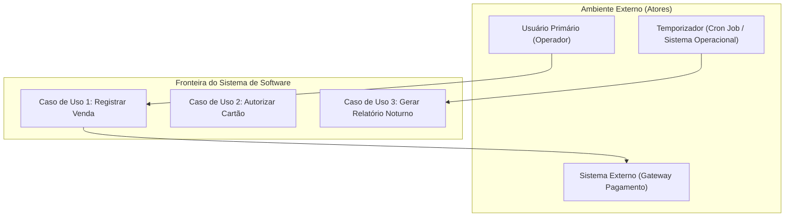
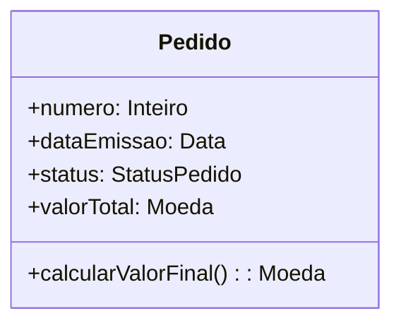
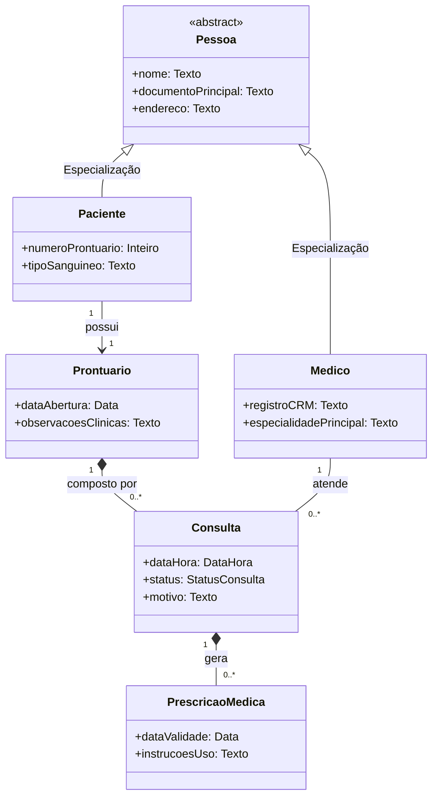
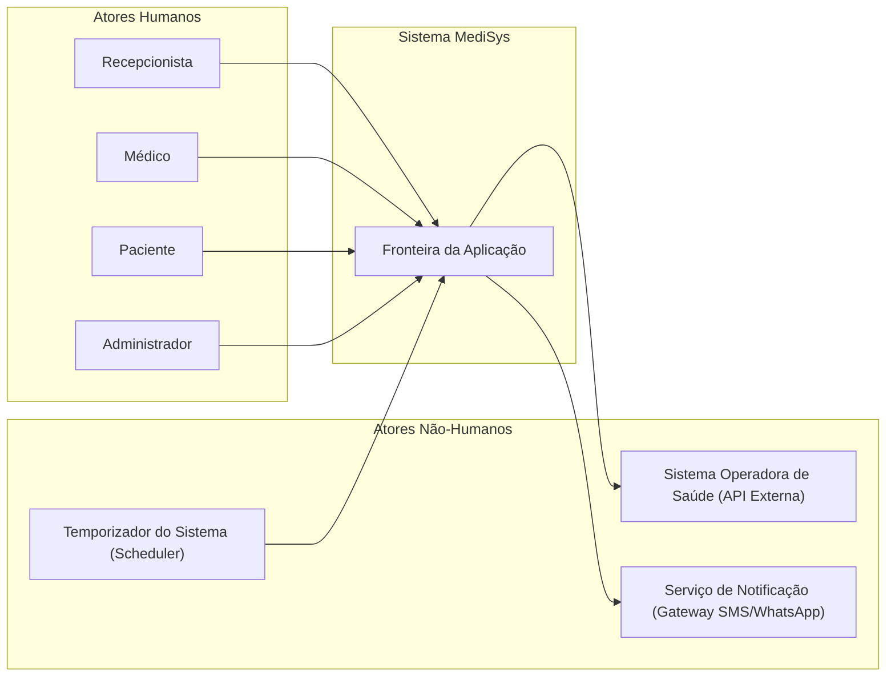
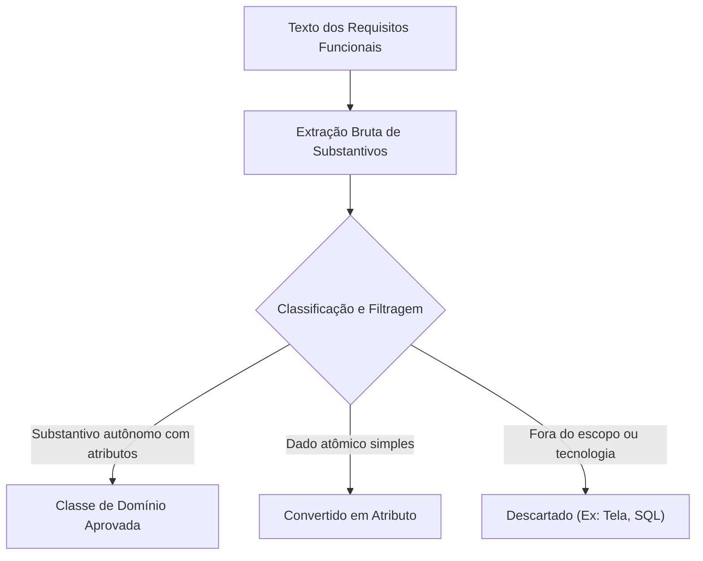
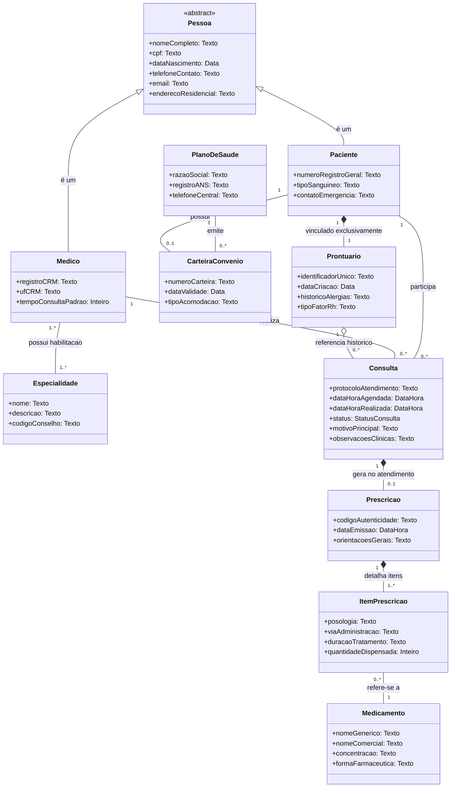
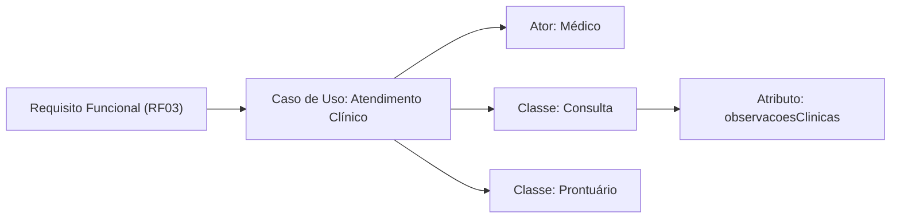
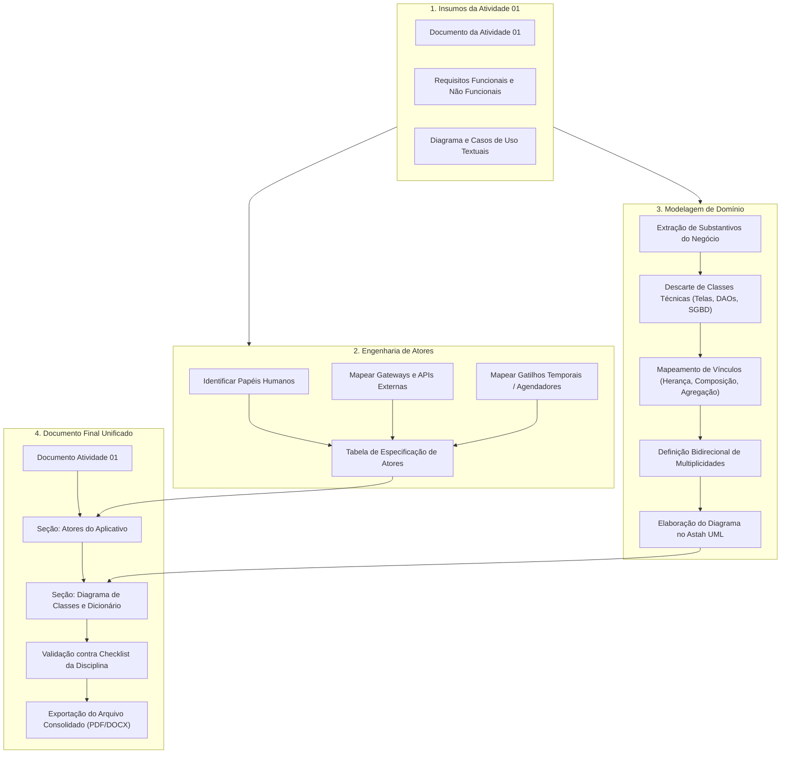

# Trabalho — Atividade Avaliativa Prática 02 - Atores e Diagrama de Classes Fase de Análise

> **Professor:** Marcelo Boer
> **Disciplina:** Engenharia de Software I (3º Semestre)
> **Prazo de Entrega:** 11/03/2026 às 20:59
> **Pontuação Máxima:** 2 pontos
> **Conteúdo cobrado:** [Aula 01 - Processo de Abstração e Levantamento de Requisitos](../../Aulas/Aula%2001%20-%20Processo%20de%20Abstra%C3%A7%C3%A3o%20e%20Levantamento%20de%20Requisitos/detalhes.md), [Aula 02 - Configuração e Licenciamento do Astah UML](../../Aulas/Aula%2002%20-%20Configura%C3%A7%C3%A3o%20e%20Licenciamento%20do%20Astah%20UML/detalhes.md), [Aula 03 - Revisão de Requisitos de Software para AV1](../../Aulas/Aula%2003%20-%20Revis%C3%A3o%20de%20Requisitos%20de%20Software%20para%20AV1/detalhes.md), [Aula 04 - Abstração e Modelagem de Requisitos](../../Aulas/Aula%2004%20-%20Abstra%C3%A7%C3%A3o%20e%20Modelagem%20de%20Requisitos/detalhes.md), [Aula 05 - Descrição Textual de Casos de Uso](../../Aulas/Aula%2005%20-%20Descri%C3%A7%C3%A3o%20Textual%20de%20Casos%20de%20Uso/detalhes.md), [Aula 06 - Modelo de Apresentação da Fase Análise](../../Aulas/Aula%2006%20-%20Modelo%20de%20Apresenta%C3%A7%C3%A3o%20da%20Fase%20An%C3%A1lise/detalhes.md)

---

## Sumário

- [Enunciado original (Google Classroom)](#enunciado-original-google-classroom)
- [Análise do que é pedido](#análise-do-que-é-pedido)
  - [Objetivo central da atividade](#objetivo-central-da-atividade)
  - [Entregáveis formais](#entregáveis-formais)
  - [Requisitos implícitos e critérios de aceitação](#requisitos-implícitos-e-critérios-de-aceitação)
- [Fundamentação teórica](#fundamentação-teórica)
  - [Atores na UML e Engenharia de Requisitos](#atores-na-uml-e-engenharia-de-requisitos)
  - [Fase de Análise versus Fase de Projeto](#fase-de-análise-versus-fase-de-projeto)
  - [Diagrama de Classes na Fase de Análise](#diagrama-de-classes-na-fase-de-análise)
  - [Relacionamentos entre Classes de Domínio](#relacionamentos-entre-classes-de-domínio)
  - [Multiplicidade e Regras Estruturais](#multiplicidade-e-regras-estruturais)
- [Resolução proposta](#resolução-proposta)
  - [Passo 1: Contexto e alinhamento com a Atividade 01](#passo-1-contexto-e-alinhamento-com-a-atividade-01)
  - [Passo 2: Especificação textual dos Atores do Aplicativo](#passo-2-especificação-textual-dos-atores-do-aplicativo)
  - [Passo 3: Identificação de classes de domínio pela técnica dos substantivos](#passo-3-identificação-de-classes-de-domínio-pela-técnica-dos-substantivos)
  - [Passo 4: Elaboração do Diagrama de Classes da Fase de Análise](#passo-4-elaboração-do-diagrama-de-classes-da-fase-de-análise)
  - [Passo 5: Dicionário de dados conceitual](#passo-5-dicionário-de-dados-conceitual)
  - [Passo 6: Estrutura integrada do documento final](#passo-6-estrutura-integrada-do-documento-final)
- [Como testar e validar](#como-testar-e-validar)
  - [Rastreabilidade vertical e horizontal](#rastreabilidade-vertical-e-horizontal)
  - [Checklist de validação sintática e semântica](#checklist-de-validação-sintática-e-semântica)
- [Critérios de qualidade](#critérios-de-qualidade)
- [Arquivos de apoio](#arquivos-de-apoio)
- [Mapa da atividade](#mapa-da-atividade)
- [Glossário](#glossário)
- [Pontos-chave para a prova](#pontos-chave-para-a-prova)
- [Perguntas e respostas (JSONL)](#perguntas-e-respostas-jsonl)
- [Checklist de revisão](#checklist-de-revisão)

---

## Enunciado original (Google Classroom)

O texto do enunciado divulgado no ambiente acadêmico estabelece:

> "O aluno deve no final do arquivo entregue na Atividade 01 adicionar os itens referentes ao Atores do Aplicativo e Diagrama de Classes"

---

## Análise do que é pedido

### Objetivo central da atividade

A Atividade Avaliativa Prática 02 dá continuidade direta à linha de modelagem de software iniciada na Atividade 01. O escopo não consiste em criar um documento isolado ou um projeto inédito, mas em expandir o artefato documental anterior, consolidando a transição entre o levantamento de requisitos/casos de uso e a modelagem estrutural preliminar (Fase de Análise).

Os dois eixos centrais de entrega são:
1. **Atores do Aplicativo:** Identificação, caracterização textual e categorização de todas as entidades externas (usuários humanos, subsistemas externos ou rotinas temporais) que interagem com o sistema proposto.
2. **Diagrama de Classes da Fase de Análise:** Mapeamento das classes conceituais de domínio, seus atributos essenciais (sem acoplamento tecnológico) e os relacionamentos estruturais com suas respectivas multiplicidades e papéis.

### Entregáveis formais

- **Arquivo único consolidado:** O estudante deve submeter o documento da Atividade 01 com o apêndice/seções complementares adicionadas ao final, mantendo histórico e rastreabilidade.
- **Formato do arquivo:** Arquivo em formato PDF ou DOCX, estruturado segundo as normas acadêmicas e o modelo de apresentação da disciplina (conforme visto na Aula 06).
- **Modelo de engenharia (Astah UML):** Embora a entrega textual seja o artefato de avaliação principal, a geração do diagrama deve ter origem na ferramenta Astah UML (Aula 02), com o modelo devidamente alinhado aos padrões da OMG (Object Management Group).

### Requisitos implícitos e critérios de aceitação

1. **Rastreabilidade semântica:** Cada classe de domínio deve encontrar respaldo em substantivos ou conceitos identificados nos Requisitos Funcionais (RF) e Casos de Uso (UC) elaborados na Atividade 01.
2. **Abstração pura da Fase de Análise:** É expressamente vedada a inclusão de artefatos de implementação, como classes de banco de dados (`ConexaoBD`, `DAOUsuario`), controladores de interface (`LoginController`, `ServletAutenticacao`) ou elementos de infraestrutura física.
3. **Multiplicidade explícita:** Toda associação no diagrama de classes deve apresentar multiplicidades em ambos os extremos (`1`, `0..1`, `1..*`, `*`), eliminando ambiguidades nas regras de negócio.
4. **Padronização de nomenclatura:**
   - Classes em `PascalCase` (substantivos no singular).
   - Atributos em `camelCase` (sem notação húngara e sem tipos específicos de SGBD, como `VARCHAR` ou `INT(11)`).
   - Atores com nomes que denotem papéis funcionais, e não nomes de indivíduos reais.

---

## Fundamentação teórica

### Atores na UML e Engenharia de Requisitos

#### Definição
Na Unified Modeling Language (UML), um **Ator** representa um papel idealizado desempenhado por uma entidade externa que interage diretamente com o sistema de software sob análise. O ator não faz parte do sistema; ele reside na fronteira externa do domínio da aplicação, consumindo serviços ou fornecendo estímulos e dados.

#### Motivação
A correta identificação dos atores delimita a fronteira do sistema (*system boundary*). Sem clareza sobre quem dispara cada caso de uso, corre-se o risco de construir funcionalidades orfãs (sem usuário atribuído) ou de implementar no sistema responsabilidades que deveriam pertencer ao ambiente externo.



#### Exemplo
- **Ator Primário:** `OperadorDeCaixa` — inicia o caso de uso `Registrar Venda` para registrar produtos comprados por um consumidor.
- **Ator Secundário:** `ServicoDeAutorizacaoBancaria` — responde a solicitações de validação de transação de crédito enviadas pelo sistema.
- **Ator Temporal:** `RelogioDoSistema` — emite sinais em horários pré-determinados para disparar o backup automático ou fechamento contábil.

#### Contraexemplo
- Declarar `João Silva` como ator. Pessoas físicas concretas não são atores; o ator é o **papel** desempenhado (`Vendedor`, `Gerente`).
- Declarar `TabelaDePrecos` ou `BancoDeDadosSQL` como ator. O banco de dados é componente interno de persistência, não um elemento autônomo externo interagindo com a fronteira conceitual.

#### Armadilhas comuns
- **Confundir cargo funcional com papel no sistema:** O "Diretor Presidente" pode usar o software simplesmente no papel de `ConsultorDeRelatorios`. Criar um ator para cada hierarquia corporativa inflaciona a modelagem sem agregar valor de engenharia.
- **Omissão de sistemas legados:** Esquecer de modelar sistemas externos dos quais o software depende para validar CPF, calcular frete ou emitir Nota Fiscal Eletrônica.

---

### Fase de Análise versus Fase de Projeto

A Engenharia de Software preconiza a separação conceitual entre **o que** o sistema deve fazer (Fase de Análise) e **como** ele será construído em uma tecnologia específica (Fase de Projeto ou Design).

| Critério | Fase de Análise (Domínio do Problema) | Fase de Projeto (Domínio da Solução) |
| :--- | :--- | :--- |
| **Foco primordial** | Compreender o negócio e as regras do domínio | Estruturar a arquitetura técnica, desempenho e persistência |
| **Público-alvo** | Engenheiros, clientes, especialistas de negócio | Desenvolvedores, arquitetos de software, administradores de banco |
| **Vocabulário** | Termos do domínio (`Cliente`, `Consulta`, `Contrato`) | Termos tecnológicos (`ClienteDAO`, `ConsultaController`, `JSON`) |
| **Tipagem de dados** | Conceitual (`Texto`, `Data`, `Moeda`, `Número`) | Tecnológica (`java.lang.String`, `decimal(10,2)`, `UUID`) |
| **Visibilidade** | Opcional ou focada no negócio | Rígida (`private`, `protected`, `public`, `package`) |
| **Métodos** | Apenas operações fundamentais de negócio | Getters, setters, construtores, métodos utilitários, wrappers |

#### Armadilhas conceituais
A contaminação da Fase de Análise com detalhes da Fase de Projeto é o erro mais frequente em cursos de graduação. Estudantes tendem a modelar classes como `FormLogin`, `ConexaoMySql` ou incluir chaves estrangeiras explícitas (`id_cliente_fk`) como atributos nas classes de domínio, violando os princípios de abstração orientada a objetos.

---

### Diagrama de Classes na Fase de Análise

#### Definição
O **Diagrama de Classes de Análise** (também denominado Modelo de Domínio ou Modelo Conceitual) é um diagrama estrutural da UML que captura os tipos de objetos presentes no vocabulário do problema, seus atributos invariantes e as associações lógicas que unem essas entidades.

#### Estrutura de uma Classe Conceitual
Na fase de análise, a classe é representada tipicamente por um retângulo com dois ou três compartimentos:
1. **Nome da Classe:** Substantivo singular no topo, centralizado, em negrito.
2. **Atributos:** Informações essenciais que caracterizam os objetos daquela classe.
3. **Operações (Opcional na Análise):** Apenas comportamentos de alto nível pertinentes ao negócio (por exemplo, `calcularTotal()` ou `validarLimite()`).



---

### Relacionamentos entre Classes de Domínio

Os relacionamentos expressam como os conceitos se conectam estruturalmente no mundo real.

#### 1. Associação Simples
- **Definição:** Relação semântica genérica que indica que instâncias de uma classe conhecem ou estão vinculadas a instâncias de outra classe.
- **Representação:** Linha contínua simples ligando as duas classes, com multiplicidades em ambas as pontas e, opcionalmente, um verbo indicador de leitura.

#### 2. Agregação Compartilhada (Fraca)
- **Definição:** Relacionamento "todo-parte" onde a parte pode existir de maneira autônoma, sobrevivendo à destruição do elemento agregador ("todo").
- **Representação:** Linha contínua com um losango vazado (não preenchido) na extremidade do objeto "todo".
- **Exemplo:** `Universidade` e `Professor`. Se a universidade encerrar as atividades, o professor continua existindo profissionalmente como entidade autônoma.

#### 3. Composição (Agregação Forte)
- **Definição:** Relacionamento "todo-parte" de dependência existencial estrita. A parte não tem sentido de existir fora do contexto do todo. Se o objeto pai for destruído, todas as suas partes vinculadas também deixam de existir.
- **Representação:** Linha contínua com um losango sólido (preenchido) na extremidade do objeto "todo".
- **Exemplo:** `NotaFiscal` e `ItemNotaFiscal`. Não existe um item de nota fiscal sem que haja a nota fiscal correspondente.

#### 4. Generalização / Especialização (Herança)
- **Definição:** Relação taxonômica em que uma classe filha herda atributos, comportamentos e associações de uma classe ancestral comum, podendo introduzir especificidades.
- **Representação:** Linha contínua com uma seta triangular fechada (vazada) apontando da subclasse para a superclasse.
- **Exemplo:** `Pessoa` (superclasse abstrata) especializada em `PessoaFisica` e `PessoaJuridica`.

#### 5. Dependência
- **Definição:** Relação de uso temporário ou referencial onde a alteração na definição de uma classe pode afetar outra que a consome como parâmetro ou retorno passageiro.
- **Representação:** Linha tracejada com uma seta aberta apontando para o elemento dependido.



---

### Multiplicidade e Regras Estruturais

A multiplicidade define os limites inferior e superior do número de instâncias de uma classe que podem se relacionar com uma única instância da classe oposta.

| Notação | Significado | Exemplo Prático |
| :--- | :--- | :--- |
| `1` ou `1..1` | Exatamente um | Um `Automóvel` possui exatamente 1 `Motor`. |
| `0..1` | Zero ou um (Opcional) | Um `Cidadão` pode ter 0 ou 1 `TituloEleitor`. |
| `0..*` ou `*` | Zero ou muitos (Ilimitado) | Um `Autor` pode ter escrito 0 ou muitos `Livros`. |
| `1..*` | Um ou muitos (Obrigatório ao menos um) | Um `Pedido` deve conter pelo menos 1..* `ItemPedido`. |
| `n..m` | Faixa delimitada | Uma `EquipeDeVolei` em quadra possui exatamente 6..6 `Jogadores`. |

#### Armadilhas na Multiplicidade
- **Omissão da multiplicidade mínima:** Indicar apenas `*` quando o negócio exige que ao menos um item exista (`1..*`). No caso de um pedido de compras, permitir `0..*` possibilitaria no banco de dados um pedido com valor total sem nenhum item associado.
- **Inversão de pontas:** Colocar a cardinalidade na classe errada por ler a frase no sentido inverso. Sempre leia: *"Uma instância de A relaciona-se com quantas instâncias de B?"* e posicione a resposta junto à classe B.

---

## Resolução proposta

Para exemplificar com total profundidade técnica o que o Prof. Marcelo Boer solicita nesta Atividade 02, aplicaremos a resolução completa sobre um estudo de caso representativo e canônico dos cursos de Sistemas de Informação: o **Sistema Integrado de Gestão de Clínica Médica (MediSys)**, cujo escopo foi iniciado na Atividade 01 com requisitos de agendamento, atendimento clínico e emissão de prescrições.

---

### Passo 1: Contexto e alinhamento com a Atividade 01

Na Atividade 01, o projeto delimitou o seguinte escopo básico de requisitos:
- **RF01 - Cadastrar Pacientes:** O sistema deve registrar os dados civis e de contato de cada paciente.
- **RF02 - Agendar Consultas:** Recepcionistas e pacientes devem poder solicitar e confirmar horários de atendimento médico.
- **RF03 - Realizar Atendimento Clínico:** Médicos realizam o atendimento, registram evolução clínica no prontuário e prescrevem medicamentos.
- **RF04 - Validar Elegibilidade com Operadora:** O sistema deve comunicar-se com a operadora de plano de saúde para autorizar guias de consulta.
- **RF05 - Notificar Agendamentos:** O sistema deve disparar avisos automáticos de lembrete 24 horas antes da consulta.

A Atividade 02 exige que, ao final desse documento, sejam introduzidas as seções:
1. **Atores do Aplicativo**
2. **Diagrama de Classes da Fase de Análise**

---

### Passo 2: Especificação textual dos Atores do Aplicativo

A identificação precisa dos atores requer o mapeamento de seus papéis e responsabilidades na fronteira do sistema.

#### Tabela formal de especificação de atores

| Identificador | Nome do Ator | Categoria | Descrição Funcional | Casos de Uso Vinculados |
| :--- | :--- | :--- | :--- | :--- |
| **ACT01** | `Recepcionista` | Usuário Humano (Primário) | Responsável pela triagem inicial, cadastro presencial de pacientes, gerenciamento da grade de horários dos médicos e confirmação de chegada na clínica. | `Cadastrar Paciente`, `Agendar Consulta`, `Confirmar Presença`, `Cancelar Agendamento` |
| **ACT02** | `Medico` | Usuário Humano (Primário) | Profissional de saúde que executa o ato médico, consulta o histórico do prontuário, registra diagnósticos e emite prescrições e laudos. | `Visualizar Agenda Diária`, `Registrar Evolução Clínica`, `Emitir Prescrição Médica`, `Solicitar Exames` |
| **ACT03** | `Paciente` | Usuário Humano (Primário) | Usuário final do aplicativo móvel/portal web que consulta seus agendamentos, solicita novas consultas e acessa suas receitas digitais. | `Autocadastrar-se`, `Solicitar Agendamento`, `Consultar Histórico de Receitas` |
| **ACT04** | `Administrador` | Usuário Humano (Secundário) | Responsável pela parametrização do sistema, cadastro de médicos, definição de especialidades clínicas, salas de atendimento e relatórios gerenciais. | `Gerenciar Usuários`, `Parametrizar Convênios`, `Emitir Relatórios de Desempenho` |
| **ACT05** | `SistemaOperadoraSaude` | Sistema Externo (Secundário) | Serviço web/API de convênios médicos responsável por validar o número da carteirinha, autorizar o procedimento e emitir o código de autorização de guia (TISS). | `Autorizar Guia de Atendimento`, `Validar Elegibilidade do Plano` |
| **ACT06** | `ServicoNotificacaoExterna` | Sistema Externo (Secundário) | Gateway de mensageria (SMS/WhatsApp/E-mail) utilizado para envio transacional de confirmações e lembretes de consultas. | `Disparar Lembrete de Consulta`, `Enviar Notificação de Cancelamento` |
| **ACT07** | `TemporizadorDoSistema` | Ator Temporal (Sistema) | Rotina baseada em tempo (daemon/scheduler) que varre a base periodicamente para identificar consultas do dia seguinte e disparar os gatilhos de aviso. | `Executar Rotina Diária de Lembretes`, `Expirar Agendamentos Pendentes` |



---

### Passo 3: Identificação de classes de domínio pela técnica dos substantivos

A identificação das classes de análise inicia-se pela leitura cirúrgica das declarações de requisitos e cenários de casos de uso da Atividade 01, isolando substantivos candidatos e descartando sinônimos, termos fora do escopo ou atributos simples.



#### Tabela de triagem dos substantivos do domínio

| Termo Extraído | Decisão de Modelagem | Justificativa Técnica |
| :--- | :--- | :--- |
| `Paciente` | **Classe de Domínio** | Possui identidade própria, múltiplos atributos (`nome`, `cpf`, `dataNascimento`) e ciclo de vida longo. |
| `Médico` | **Classe de Domínio** | Entidade central com regras específicas (`crm`, `especialidade`) que atua em múltiplos relacionamentos. |
| `Consulta` | **Classe de Domínio** | Evento transacional de negócio que conecta médico, paciente e sala em determinado instante de tempo. |
| `Prontuário` | **Classe de Domínio** | Histórico persistente e imutável que agrega a evolução clínica e consultas de um paciente. |
| `Especialidade` | **Classe de Domínio** | Classificação médica que padroniza a atuação dos profissionais (ex: Cardiologia, Pediatria). |
| `Prescrição` | **Classe de Domínio** | Documento legal emitido em uma consulta contendo lista de medicamentos e posologias. |
| `Medicamento` | **Classe de Domínio** | Entidade do catálogo farmacêutico com nome comercial, princípio ativo e concentração. |
| `ItemPrescrição` | **Classe de Domínio (Associativa/Composição)** | Elemento que une o medicamento à prescrição, definindo a dosagem e tempo de uso. |
| `PlanoDeSaúde` | **Classe de Domínio** | Representa o convênio e suas regras de cobertura. |
| `Nome do Paciente` | **Atributo** | Dado atômico pertencente à classe `Paciente`. |
| `Data da Consulta` | **Atributo** | Propriedade temporal que qualifica o evento `Consulta`. |
| `Banco de Dados` | **Descarte** | Elemento de infraestrutura e persistência, inexistente na fase de análise de domínio. |
| `Tela de Agendamento` | **Descarte** | Artefato de interface gráfica com o usuário (Boundary da fase de projeto). |

---

### Passo 4: Elaboração do Diagrama de Classes da Fase de Análise

A seguir apresenta-se o Diagrama de Classes de Análise completo para o sistema, contemplando herança, associações, agregações e composições estritas, com suas respectivas multiplicidades.



---

### Passo 5: Dicionário de dados conceitual

Para cada classe modelada no diagrama, a documentação de análise exige uma descrição formal textual das responsabilidades e atributos.

#### 1. Classe: `Pessoa` (Abstrata)
- **Definição de Domínio:** Generalização conceitual que encapsula dados civis, cadastrais e de comunicação comuns a qualquer indivíduo gerenciado pela instituição.
- **Atributos:**
  - `nomeCompleto` (Texto): Nome civil completo do indivíduo.
  - `cpf` (Texto): Cadastro de Pessoas Físicas, documento único de identificação tributária e civil no Brasil.
  - `dataNascimento` (Data): Data natalícia para cálculo de faixa etária e elegibilidade clínica.
  - `telefoneContato` (Texto): Telefone com DDD para contato de emergência e confirmações.
  - `email` (Texto): Endereço eletrônico utilizado para login e envio de notificações formais.
  - `enderecoResidencial` (Texto): Logradouro, número, bairro e município do domicílio.

#### 2. Classe: `Paciente` (Especialização de `Pessoa`)
- **Definição de Domínio:** Indivíduo que recebe cuidados médicos e acompanhamento clínico ambulatorial.
- **Atributos:**
  - `numeroRegistroGeral` (Texto): Documento de identidade civil (RG).
  - `tipoSanguineo` (Texto): Classificação ABO/Rh do paciente para controle clínico imediato.
  - `contatoEmergencia` (Texto): Nome e telefone de um parente ou responsável em caso de intercorrência.

#### 3. Classe: `Medico` (Especialização de `Pessoa`)
- **Definição de Domínio:** Profissional habilitado pelo conselho de classe para realizar consultas, emitir laudos e prescrever condutas terapêuticas.
- **Atributos:**
  - `registroCRM` (Texto): Número de inscrição no Conselho Regional de Medicina.
  - `ufCRM` (Texto): Unidade federativa de emissão do registro médico.
  - `tempoConsultaPadrao` (Inteiro): Duração estimada em minutos para dimensionamento da grade de agendamento.

#### 4. Classe: `Consulta`
- **Definição de Domínio:** Entidade transacional central que materializa o compromisso ou a realização do encontro clínico entre um médico e um paciente.
- **Atributos:**
  - `protocoloAtendimento` (Texto): Identificador de rastreamento do agendamento para a recepção e paciente.
  - `dataHoraAgendada` (DataHora): Momento pactuado para o início do atendimento.
  - `dataHoraRealizada` (DataHora): Momento real em que o atendimento foi iniciado no consultório.
  - `status` (StatusConsulta): Estado do agendamento (`Agendada`, `Confirmada`, `EmAtendimento`, `Concluida`, `Cancelada`).
  - `motivoPrincipal` (Texto): Queixa preliminar declarada pelo paciente durante o agendamento.
  - `observacoesClinicas` (Texto): Anotações contextuais e parecer do médico durante o atendimento.

#### 5. Classe: `Prontuario`
- **Definição de Domínio:** Conjunto unificado e perene de documentos e registros contendo a anamnese, hipóteses diagnósticas e histórico das consultas do paciente.
- **Atributos:**
  - `identificadorUnico` (Texto): Código unívoco de indexação hospitalar do prontuário.
  - `dataCriacao` (Data): Data em que o paciente foi registrado pela primeira vez no sistema.
  - `historicoAlergias` (Texto): Lista de substâncias farmacológicas ou alimentares de risco para o paciente.
  - `tipoFatorRh` (Texto): Marcador biológico confirmatório para segurança de procedimentos.

#### 6. Classe: `Prescricao`
- **Definição de Domínio:** Documento emitido privativamente pelo médico durante uma consulta, contendo instruções formais de tratamento medicamentoso.
- **Atributos:**
  - `codigoAutenticidade` (Texto): Hash ou identificador numérico para validação de assinatura e autenticidade da receita.
  - `dataEmissao` (DataHora): Carimbo temporal do encerramento e emissão da receita.
  - `orientacoesGerais` (Texto): Cuidados adicionais de repouso, hidratação ou retorno ambulatorial.

#### 7. Classe: `ItemPrescricao`
- **Definição de Domínio:** Elemento atômico que compõe a prescrição, especificando detalhadamente a forma de uso de determinado fármaco.
- **Atributos:**
  - `posologia` (Texto): Instrução detalhada de dosagem e horários (ex: "1 comprimido a cada 8 horas").
  - `viaAdministracao` (Texto): Via biológica de aplicação (ex: "Oral", "Intravenosa", "Tópica").
  - `duracaoTratamento` (Texto): Período previsto de uso (ex: "Durante 7 dias contínuos").
  - `quantidadeDispensada` (Inteiro): Número de caixas, frascos ou ampolas a serem fornecidas na farmácia.

---

### Passo 6: Estrutura integrada do documento final

O estudante deve anexar a resolução no arquivo mestre da **Atividade 01**, mantendo a seguinte organização documental:

```text
================================================================================
ESTRUTURA INTEGRADA DO DOCUMENTO DE ENTREGA
================================================================================
1. CAPA / CABEÇALHO PADRÃO
   - Identificação da Instituição: UniFEF - Centro Universitário de Santa Fé do Sul
   - Curso: Bacharelado em Sistemas de Informação
   - Disciplina: Engenharia de Software I (3º Semestre)
   - Docente: Prof. Marcelo Boer
   - Identificação do(s) Aluno(s) e Título do Projeto

2. CONTEÚDO ORIGINAL DA ATIVIDADE 01
   - 2.1 Visão Geral e Justificativa do Sistema
   - 2.2 Requisitos Funcionais (RF01 a RFxx)
   - 2.3 Requisitos Não Funcionais (RNF01 a RNFxx)
   - 2.4 Diagrama de Casos de Uso (UML Use Case)
   - 2.5 Descrições Textuais dos Casos de Uso

3. CONTEÚDO ACRESCENTADO DA ATIVIDADE 02
   - 3.1 Atores do Aplicativo
     * 3.1.1 Identificação e Tipologia dos Atores (Humanos, Sistemas Externos, Temporais)
     * 3.1.2 Tabela Detalhada de Responsabilidades dos Atores
   - 3.2 Diagrama de Classes - Fase de Análise (Modelo de Domínio)
     * 3.2.1 Metodologia de Identificação das Entidades Conceituais
     * 3.2.2 Representação Gráfica UML do Diagrama de Classes
     * 3.2.3 Dicionário de Dados e Semântica dos Atributos
     * 3.2.4 Justificativa e Regras de Multiplicidade das Associações
================================================================================
```

---

## Como testar e validar

### Rastreabilidade vertical e horizontal

A validação de um modelo de análise em Engenharia de Software consiste em provar que todos os requisitos encontram representação estrutural, e que nenhuma classe existe sem motivação declarada nos requisitos.



#### Teste dos 5 Pilares de Consistência do Modelo
1. **Teste da Identificação dos Atores:** Para cada caso de uso declarado na Atividade 01, existe ao menos um ator associado? Não podem existir casos de uso flutuantes sem atores iniciadores.
2. **Teste dos Substantivos Sem Classe:** Algum substantivo relevante citado nos requisitos funcionais de negócio ficou de fora do diagrama de classes? Se o sistema prevê "cancelamento de agendamento", as classes `Consulta` e o status correspondente devem estar presentes.
3. **Teste da Abstração Limpa:** Existe alguma classe com sulfixo `DAO`, `DTO`, `View`, `Controller`, `Database` ou `Form`? Se existir, o modelo violou a pureza da fase de análise e deve ser corrigido.
4. **Teste da Inversão de Multiplicidade:** Ao inspecionar o relacionamento entre `Paciente` e `Prontuario`, valide: *"Um paciente pode possuir quantos prontuários?"* (Exatamente 1). *"Um prontuário pode pertencer a quantos pacientes?"* (Exatamente 1). Se a modelagem apresentar `1` para `0..*`, há uma falha lógica de modelo.
5. **Teste da Destruição Existencial (Composição vs. Agregação):** Se um objeto `Consulta` for logicamente ou fisicamente excluído do sistema, a `Prescricao` correspondente faria sentido existindo de forma órfã no banco de dados? Não, a prescrição é consequência direta do ato da consulta. Logo, a relação deve ser estritamente de **Composição**.

### Checklist de validação sintática e semântica

- [ ] Todas as classes possuem nome em singular e padrão `PascalCase` (`Pessoa`, `PlanoDeSaude`).
- [ ] Todos os atributos possuem padrão `camelCase` (`dataNascimento`, `numeroCarteira`).
- [ ] Não há tipos de dados específicos de bancos de dados relacionais (`VARCHAR`, `INT`, `BLOB`), utilizando-se apenas tipos conceituais (`Texto`, `Data`, `Inteiro`, `Booleano`).
- [ ] As multiplicidades estão explícitas em todas as terminações de linhas de associação.
- [ ] Generalizações utilizam a seta com triângulo vazado apontando para a superclasse.
- [ ] Composições utilizam o losango preenchido na classe detentora ("todo").
- [ ] Os atores estão classificados explicitamente entre primários, secundários e temporais.

---

## Critérios de qualidade

Para obter a nota máxima (2,0 pontos) sob a avaliação do Prof. Marcelo Boer, o trabalho deve atender aos seguintes parâmetros qualitativos:

| Dimensão de Qualidade | Critério Insuficiente (0,0 - 0,9) | Critério Regular (1,0 - 1,5) | Critério Excelente (1,6 - 2,0) |
| :--- | :--- | :--- | :--- |
| **Rigor Conceitual da Análise** | Mistura classes de interface e persistência com entidades de negócio. | Apresenta entidades de negócio, mas inclui tipos técnicos como `VARCHAR` ou chaves estrangeiras (`id_fk`). | Foco estrito no domínio do problema; classes conceituais limpas e tipagem lógica universal. |
| **Modelagem de Atores** | Apenas cita nomes aleatórios de pessoas sem especificação de papéis ou tipos. | Identifica usuários humanos, mas ignora sistemas externos e agendadores temporais. | Caracterização exaustiva de atores primários, secundários e temporais, com tabela de responsabilidades. |
| **Sintaxe e Notação UML** | Erros de notação gráfica; símbolos trocados (losangos invertidos, setas sem padrão). | Símbolos corretos, porém multiplicidades ausentes em várias associações. | Diagrama conforme padrão OMG, multiplicidades bidirecionais explícitas e relacionamentos semanticamente precisos. |
| **Rastreabilidade e Integração** | Documento fragmentado; entidades de classes sem qualquer relação com a Atividade 01. | Entidades alinhadas aos requisitos, mas sem texto de dicionário de dados ou justificativas. | Integração total ao final da Atividade 01, demonstrando correspondência clara entre requisitos, casos de uso e classes. |

---

## Arquivos de apoio

Para aprofundamento e conformidade com o plano de ensino do Prof. Marcelo Boer, consulte as seguintes aulas do acervo da disciplina:

- [Aula 01 - Processo de Abstração e Levantamento de Requisitos](../../Aulas/Aula%2001%20-%20Processo%20de%20Abstra%C3%A7%C3%A3o%20e%20Levantamento%20de%20Requisitos/detalhes.md) — Fundamentos de abstração, requisitos funcionais e não funcionais.
- [Aula 02 - Configuração e Licenciamento do Astah UML](../../Aulas/Aula%2002%20-%20Configura%C3%A7%C3%A3o%20e%20Licenciamento%20do%20Astah%20UML/detalhes.md) — Instalação do software oficial de modelagem e licença acadêmica.
- [Aula 03 - Revisão de Requisitos de Software para AV1](../../Aulas/Aula%2003%20-%20Revis%C3%A3o%20de%20Requisitos%20de%20Software%20para%20AV1/detalhes.md) — Alinhamento de escopo e consistência para as avaliações teóricas e práticas.
- [Aula 04 - Abstração e Modelagem de Requisitos](../../Aulas/Aula%2004%20-%20Abstra%C3%A7%C3%A3o%20e%20Modelagem%20de%20Requisitos/detalhes.md) — Transição entre elicitação textual e modelos gráficos UML.
- [Aula 05 - Descrição Textual de Casos de Uso](../../Aulas/Aula%2005%20-%20Descri%C3%A7%C3%A3o%20Textual%20de%20Casos%20de%20Uso/detalhes.md) — Detalhamento de fluxo principal, fluxos alternativos e identificação de atores.
- [Aula 06 - Modelo de Apresentação da Fase Análise](../../Aulas/Aula%2006%20-%20Modelo%20de%20Apresenta%C3%A7%C3%A3o%20da%20Fase%20An%C3%A1lise/detalhes.md) — Padrão formal de cabeçalho, diagramação e organização textual da fase de análise.

---

## Mapa da atividade

O fluxo abaixo sintetiza a jornada necessária para a concepção, elaboração e validação da Atividade Avaliativa Prática 02:



---

## Glossário

| Termo | Definição no Contexto de Engenharia de Software I |
| :--- | :--- |
| **Ator Primário** | Entidade externa humana ou sistêmica que inicia diretamente a execução de um caso de uso para obter um valor mensurável. |
| **Ator Secundário** | Sistema ou serviço externo que fornece suporte, dados de validação ou serviços auxiliares quando solicitado pelo sistema durante a execução de um caso de uso. |
| **Ator Temporal** | Evento temporizado ou serviço do sistema operacional (`cron`, *scheduler*) que dispara casos de uso automaticamente em determinados intervalos de tempo. |
| **Fase de Análise** | Etapa do ciclo de vida de desenvolvimento voltada a compreender e formalizar **o que** o software deve realizar, sem assumir restrições de tecnologia ou arquitetura física. |
| **Fase de Projeto** | Etapa voltada a definir **como** o software será implementado tecnicamente, selecionando linguagem de programação, bibliotecas, SGBD e padrões de projeto (GoF). |
| **Modelo de Domínio** | Representação estrutural visual que captura conceitos, atributos e relacionamentos significativos para o negócio da aplicação. |
| **Associação** | Relacionamento semântico entre duas ou mais classes que estabelece um canal de comunicação estrutural duradouro entre suas instâncias. |
| **Multiplicidade** | Especificação que define a quantidade mínima e máxima de instâncias permitidas em um dos lados de uma associação conceitual. |
| **Agregação Compartilhada** | Relacionamento do tipo "todo-parte" fraco, no qual a parte tem existência e ciclo de vida independentes do objeto todo. |
| **Composição Estrita** | Relacionamento do tipo "todo-parte" forte, no qual a parte possui dependência existencial absoluta em relação ao todo. |
| **Generalização** | Relacionamento taxonômico onde uma classe mais genérica transfere suas características a uma ou mais classes especializadas (herança). |
| **Dicionário de Classes** | Documento descritivo formal que detalha o propósito de cada entidade modelada, explicitando a semântica e regras de cada atributo. |
| **Astah UML** | Ferramenta CASE (*Computer-Aided Software Engineering*) utilizada para modelagem de diagramas segundo a especificação oficial da UML. |
| **Rastreabilidade** | Capacidade de acompanhar a correspondência biunívoca entre os requisitos, casos de uso, atores e classes através das fases do ciclo de desenvolvimento. |

---

## Pontos-chave para a prova

Esta atividade condensa tópicos clássicos avaliados pelo Prof. Marcelo Boer nas provas regimentais (AV1 e AV2). Preste atenção redobrada aos seguintes conceitos:

1. **Diferenciação precisa entre Classe de Análise e Classe de Projeto:**
   - Em questões de prova, qualquer diagrama de análise que apresente nomes de tabelas relacionais (`TB_CLIENTES`), classes de controle (`ControleDeAcesso`), interfaces de usuário (`FrmCadastro`) ou comandos de banco (`Insert()`, `Select()`) será considerado incorreto.
2. **Distinção entre Agregação e Composição:**
   - Lembre-se do teste de ciclo de vida: *"Se o objeto pai for destruído, a parte associada tem razão de continuar existindo?"*
   - Sim = **Agregação** (losango vazado `o--`). Exemplo: `Turma` e `Aluno` (se a turma for desfeita, os alunos continuam matriculados na escola).
   - Não = **Composição** (losango sólido `*--`). Exemplo: `Avaliacao` e `QuestaoAvaliacao` (se a avaliação for apagada, as questões daquela prova específica perdem a razão de existir no contexto).
3. **Leitura rigorosa da Multiplicidade:**
   - A leitura da multiplicidade deve ser feita a partir da perspectiva de uma única instância: *"1 Médico atende quantas Consultas?"* -> `0..*`. Posicione a resposta junto à classe `Consulta`. *"1 Consulta é realizada por quantos Médicos?"* -> `1` (ou `1..*` em caso de cirurgias conjuntas).
4. **Erros clássicos de Modelagem de Atores:**
   - Considerar o "banco de dados" como ator secundário. O banco de dados faz parte da infraestrutura de implementação da aplicação, operando internamente e não como uma entidade autônoma fora da fronteira do software.
5. **Atributos Derivados:**
   - Atributos cujo valor pode ser calculado em tempo de execução a partir de outros dados (como `idade`, calculada a partir de `dataNascimento`, ou `valorTotal`, calculado pela soma dos itens) não devem ser armazenados como atributos primitivos estáticos sem a notação conceitual apropriada (barra inclinada `/idade`).

---

## Perguntas e respostas (JSONL)

```jsonl
{"pergunta": "Qual o objetivo central da Atividade Avaliativa Prática 02 solicitada pelo Prof. Marcelo Boer?", "resposta": "Complementar o documento da Atividade 01 adicionando a especificação dos Atores do Aplicativo e o Diagrama de Classes da Fase de Análise.", "dificuldade": "facil"}
{"pergunta": "O que caracteriza um Ator no contexto da modelagem UML?", "resposta": "Um papel desempenhado por uma entidade externa (humano, sistema externo ou dispositivo) que interage diretamente com o sistema.", "dificuldade": "facil"}
{"pergunta": "Qual é a principal diferença entre a Fase de Análise e a Fase de Projeto em Engenharia de Software?", "resposta": "A Análise foca no domínio do problema ('o que' o sistema deve fazer), enquanto o Projeto foca no domínio da solução técnica ('como' será construído).", "dificuldade": "facil"}
{"pergunta": "Por que classes com sufixos como DAO ou Controller não devem aparecer no Diagrama de Classes da Fase de Análise?", "resposta": "Porque representam detalhes técnicos e arquiteturais da solução (Fase de Projeto), violando o nível de abstração do domínio do problema.", "dificuldade": "media"}
{"pergunta": "Como deve ser feita a identificação preliminar de classes de domínio a partir da documentação de requisitos?", "resposta": "Utilizando a técnica de extração de substantivos dos requisitos funcionais e cenários de casos de uso, filtrando entidades relevantes do negócio.", "dificuldade": "media"}
{"pergunta": "O que diferencia semanticamente uma Agregação Compartilhada de uma Composição?", "resposta": "Na Composição há dependência existencial estrita (a parte é destruída com o todo); na Agregação, a parte possui ciclo de vida independente.", "dificuldade": "media"}
{"pergunta": "Como a multiplicidade deve ser posicionada em uma associação entre a classe Paciente e a classe Consulta?", "resposta": "Ao lado de Paciente coloca-se '1' (uma consulta pertence a um paciente) e ao lado de Consulta coloca-se '0..*' (um paciente tem zero ou várias consultas).", "dificuldade": "media"}
{"pergunta": "Por que o SGBD (ex: MySQL ou Oracle) não pode ser classificado como um ator do sistema?", "resposta": "Porque o banco de dados é um componente interno de infraestrutura e persistência pertencente ao próprio sistema, não uma entidade externa autônoma.", "dificuldade": "media"}
{"pergunta": "O que é um Ator Temporal e em que situação prática ele é identificado?", "resposta": "É um temporizador ou agendador de tarefas do sistema operacional que dispara casos de uso automaticamente com base em horários pré-definidos.", "dificuldade": "dificil"}
{"pergunta": "Por que chaves estrangeiras (ex: id_cliente_fk) não devem constar como atributos em um Diagrama de Classes de Análise?", "resposta": "Porque chaves estrangeiras são artifícios de bancos relacionais; em orientação a objetos conceitual, o vínculo é expresso pelas associações.", "dificuldade": "dificil"}
{"pergunta": "Qual a representação gráfica padrão da UML para uma relação de Generalização (Herança)?", "resposta": "Uma linha contínua com uma seta triangular fechada e vazada na ponta, apontando da subclasse para a superclasse.", "dificuldade": "facil"}
{"pergunta": "Como atributos calculados (derivados) devem ser tratados na modelagem conceitual de classes?", "resposta": "Devem ser evitados ou identificados com uma barra inclinada antes do nome (ex: /idade), pois são computados a partir de outros atributos primários.", "dificuldade": "dificil"}
{"pergunta": "Qual o papel do Dicionário de Classes e Atributos em um projeto de software?", "resposta": "Descrever textualmente e de forma inequívoca o significado de cada entidade e atributo, evitando interpretações dúbias pela equipe de desenvolvimento.", "dificuldade": "media"}
{"pergunta": "O que representa a multiplicidade 1..* em uma extremidade de associação?", "resposta": "Indica que deve existir obrigatoriamente no mínimo uma e no máximo infinitas instâncias daquela classe associadas a uma instância da classe oposta.", "dificuldade": "facil"}
{"pergunta": "Em qual formato o trabalho final deve ser submetido de acordo com as instruções da disciplina?", "resposta": "Como um documento único consolidado (incorporado ao final da Atividade 01), exportado preferencialmente em PDF ou DOCX.", "dificuldade": "facil"}
{"pergunta": "Qual ferramenta CASE oficial é adotada na disciplina de Engenharia de Software I pelo Prof. Marcelo Boer?", "resposta": "O Astah UML (anteriormente conhecido como JUDE).", "dificuldade": "facil"}
{"pergunta": "O que expressa uma relação de dependência entre duas classes na UML?", "resposta": "Indica que uma classe utiliza temporariamente outra (por exemplo, como parâmetro em uma operação), sendo representada por linha tracejada com seta aberta.", "dificuldade": "dificil"}
{"pergunta": "Qual é a consequência de omitir a multiplicidade mínima (usando apenas * em vez de 1..*) em um item de pedido de compras?", "resposta": "Permite que a regra de negócio admita pedidos inválidos sem nenhum item registrado, gerando inconsistências no banco de dados.", "dificuldade": "dificil"}
{"pergunta": "Como deve ser a nomenclatura formal de classes segundo a convenção da UML?", "resposta": "Substantivos no singular, sem abreviações arbitrárias, utilizando a convenção PascalCase (primeira letra de cada palavra em maiúsculo).", "dificuldade": "facil"}
{"pergunta": "O que é rastreabilidade vertical na modelagem da Fase de Análise?", "resposta": "A capacidade de conectar cada requisito funcional a seus respectivos casos de uso, atores e às classes conceituais que sustentam suas operações.", "dificuldade": "dificil"}
```

---

## Checklist de revisão

Antes de submeter o arquivo final da Atividade 02 no Google Classroom, certifique-se de validar cada um dos itens abaixo:

- [ ] **Integração Documental:** O conteúdo da Atividade 02 foi inserido estritamente ao final do documento original da Atividade 01, gerando um artefato único.
- [ ] **Atores do Aplicativo:**
  - [ ] Todos os atores humanos foram identificados com seus respectivos papéis de negócio (não por nomes de pessoas físicas).
  - [ ] Sistemas externos integrados (APIs, gateways, operadoras) foram mapeados como atores secundários.
  - [ ] Atores temporais (*schedulers*, rotinas diárias) foram identificados, caso o sistema possua gatilhos automáticos.
  - [ ] Uma tabela explicativa descreve a responsabilidade de cada ator e os casos de uso com os quais interage.
- [ ] **Diagrama de Classes da Fase de Análise:**
  - [ ] O diagrama foi desenhado no Astah UML ou ferramenta equivalente e exportado com alta legibilidade.
  - [ ] Foram modeladas apenas entidades conceituais do domínio do problema (sem classes técnicas, controladores ou DAOs).
  - [ ] Nomes das classes estão no singular e em `PascalCase`.
  - [ ] Nomes dos atributos estão em `camelCase` e com tipagem conceitual (`Texto`, `Data`, `Inteiro`, `Moeda`).
  - [ ] Nenhuma chave estrangeira técnica (`id_fk`) foi declarada como atributo de classe.
  - [ ] Todas as associações possuem multiplicidades declaradas em ambos os extremos.
  - [ ] As relações de agregação e composição foram diferenciadas corretamente pelo teste de ciclo de vida.
  - [ ] Relações de herança possuem superclasses coerentes e usam o símbolo correto (seta com triângulo vazado).
- [ ] **Dicionário de Classes e Atributos:**
  - [ ] Cada classe do diagrama possui uma breve descrição de sua responsabilidade no sistema.
  - [ ] Os principais atributos estão documentados com seu significado de negócio.
- [ ] **Formatação e Prazos:**
  - [ ] O documento atende aos padrões formais de cabeçalho da UniFEF e modelo de apresentação (Aula 06).
  - [ ] O arquivo final foi gerado em PDF/DOCX e verificado visualmente quanto a quebras de páginas ou cortes em diagramas.
  - [ ] A submissão está programada para ocorrer antes do prazo limite de **11/03/2026 às 20:59**.

## Código prático de apoio

Implementações em Java que tornam executáveis os conceitos desta unidade:

- [`ModeloDominioClinica.java`](codigo/ModeloDominioClinica.java)
- [`SimulacaoAtoresECasosDeUso.java`](codigo/SimulacaoAtoresECasosDeUso.java)
- [`ValidacaoRegrasEstruturais.java`](codigo/ValidacaoRegrasEstruturais.java)
