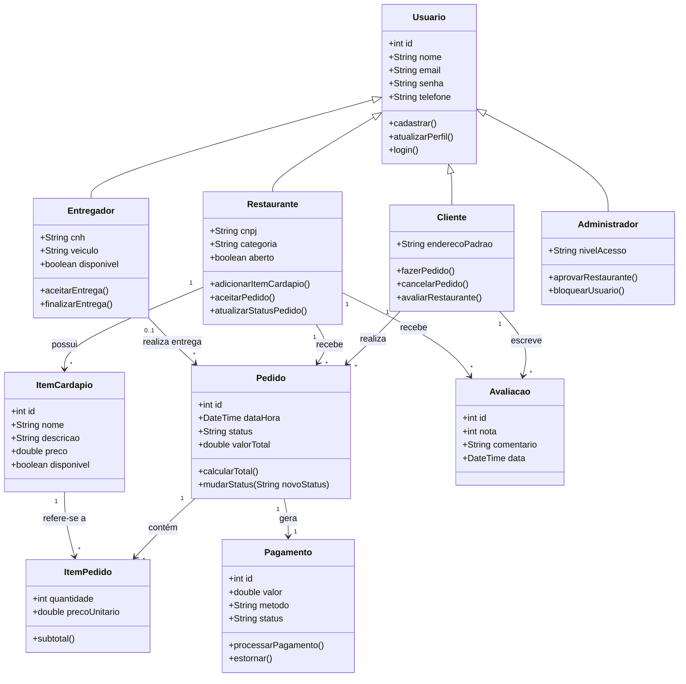

# 📋 Resolução: Atividade Avaliativa Prática 02 - Atores e Diagrama de Classes Fase de Análise

> **Professor:** Prof. Marcelo Boer  
> **Disciplina:** Engenharia de Software I (3º Semestre)  
> **Aluno / Desenvolvedor:** Professor e Desenvolvedor Sênior (Sistemas de Informação)  
> **Data de Entrega:** 11/03/2026  

---

## 1. Contextualização do Sistema (Continuação da Atividade 01)
Como o enunciado solicita a complementação do entregável da Atividade 01, adotamos como contexto base o **Sistema de Gestão de Pedidos e Entregas (DeliveryFlow)**, um aplicativo voltado para gerenciamento de pedidos de restaurantes, atribuição de entregadores e acompanhamento em tempo real por parte dos clientes.

---

## 2. Identificação e Descrição dos Atores do Aplicativo

Na fase de análise orientada a objetos (UML), a identificação de atores é crucial para delimitar as fronteiras do sistema. Os atores representam papéis desempenhados por usuários ou sistemas externos que interagem com o software.

### 2.1. Tabela de Atores

| Ator | Tipo | Descrição |
| :--- | :--- | :--- |
| **Cliente** | Primário / Humano | Usuário final que navega pelo cardápio, realiza pedidos, efetua pagamentos online e acompanha o status da entrega. |
| **Restaurante / Estabelecimento** | Secundário / Humano ou Sistema | Gerencia o cardápio, recebe os pedidos enviados pelos clientes, atualiza o status de preparo (ex: "Em preparo", "Pronto para entrega") e gerencia o estabelecimento. |
| **Entregador** | Secundário / Humano | Profissional responsável por retirar o pedido pronto no restaurante e realizar a entrega no endereço do cliente, atualizando o status para "Em trânsito" e "Entregue". |
| **Administrador do Sistema** | Secundário / Humano | Responsável pela manutenção do sistema, suporte ao cliente, cadastro de novas lojas parceiras, moderação de avaliações e gestão de usuários. |
| **Gateway de Pagamento** | Externo / Sistema | Sistema de terceiros (ex: Stripe, Pagar.me, PIX) responsável por processar transações financeiras e validar pagamentos de forma segura. |

---

## 3. Diagrama de Classes (Fase de Análise)

O Diagrama de Classes da fase de análise modela o domínio do problema, focando nos conceitos do negócio (atributos essenciais e relacionamentos conceituais), sem se prender a detalhes de implementação de frameworks ou banco de dados específicos.

### 3.1. Representação em Mermaid.js

---

## 4. Dicionário de Classes do Domínio

1. **`Usuario` (Classe Abstrata/Superclasse):** Concentra os atributos comuns de autenticação e contato para todos os papéis do sistema.
2. **`Cliente`:** Herda de `Usuario` e possui especificidades de entrega e histórico de consumo.
3. **`Restaurante`:** Representa o estabelecimento comercial parceiro, gerenciando seu cardápio e o fluxo de pedidos internos.
4. **`Entregador`:** Gerencia a logística de última milha (last-mile delivery).
5. **`Pedido`:** Entidade central de transação, associando o cliente comprador, o restaurante fornecedor e o entregador alocado.
6. **`ItemPedido`:** Classe associativa entre `Pedido` e `ItemCardapio`, garantindo a persistência da quantidade e preço unitário no momento exato da compra.
7. **`Pagamento`:** Controla o estado financeiro da transação integrada com o gateway externo.
8. **`Avaliacao`:** Permite o feedback bidirecional de qualidade entre clientes e restaurantes.