# Aula 00 — GitHub e Início do Projeto Spring Boot

> **Professor:** Jefferson Passerini  
> **Disciplina:** Laboratório de Programação IV (4º Semestre)  
> **Tema:** Fundamentos de controle de versão distribuído com Git, colaboração no GitHub, inicialização do repositório oficial e configuração dos arquivos base do projeto Suporte OS 2026.

---

## Sumário

- [Objetivo da aula](#objetivo-da-aula)
- [Contexto e pré-requisitos](#contexto-e-pré-requisitos)
- [Diferença entre Git e GitHub](#diferença-entre-git-e-github)
- [Modelagem de commits, branches, tags e grafo dirigido acíclico no Git](#modelagem-de-commits-branches-tags-e-grafo-dirigido-acíclico-no-git)
- [Repositórios locais versus repositórios remotos e o modelo distribuído](#repositórios-locais-versus-repositórios-remotos-e-o-modelo-distribuído)
- [Protocolos de comunicação: HTTPS e SSH](#protocolos-de-comunicação-https-e-ssh)
- [Inicialização e clonagem de repositórios](#inicialização-e-clonagem-de-repositórios)
- [Configuração de identidade e metadados de commit](#configuração-de-identidade-e-metadados-de-commit)
- [Criação e finalidade dos arquivos base: README.md, .editorconfig e .gitignore](#criação-e-finalidade-dos-arquivos-base-readmemd-editorconfig-e-gitignore)
- [Estados de um arquivo (não rastreado, modificado, preparado e registrado)](#estados-de-um-arquivo-não-rastreado-modificado-preparado-e-registrado)
- [Comandos do ciclo básico: status, add, commit, push e pull](#comandos-do-ciclo-básico-status-add-commit-push-e-pull)
- [Estratégia de branches locais e uso de tags anotadas](#estratégia-de-branches-locais-e-uso-de-tags-anotadas)
- [Segurança e gestão de credenciais e segredos no repositório](#segurança-e-gestão-de-credenciais-e-segredos-no-repositório)
- [Código da aula](#código-da-aula)
- [Exercícios](#exercícios)
- [Erros comuns e boas práticas](#erros-comuns-e-boas-práticas)
- [Links e materiais complementares](#links-e-materiais-complementares)
- [Mapa da aula](#mapa-da-aula)
- [Glossário](#glossário)
- [Pontos-chave para a prova](#pontos-chave-para-a-prova)
- [Perguntas e respostas (JSONL)](#perguntas-e-respostas-jsonl)
- [Checklist de revisão](#checklist-de-revisão)

---

## Objetivo da aula

Apresentar e consolidar os fundamentos práticos e teóricos do controle de versão moderno utilizando Git e a plataforma GitHub no contexto da engenharia de software para sistemas corporativos em Java.

Ao final desta aula, o estudante de Sistemas de Informação deverá ser capaz de:

1. Diferenciar conceitualmente e operacionalmente a ferramenta Git da plataforma colaborativa GitHub.
2. Explicar o modelo distribuído de controle de versão, distinguindo o repositório local do repositório remoto (`origin`).
3. Inicializar e clonar repositórios utilizando conexões seguras autenticadas via HTTPS e SSH.
4. Inspecionar e interpretar com precisão os estados do diretório de trabalho, da área de preparação e do histórico por meio do comando `git status`.
5. Estruturar commits atômicos de alta rastreabilidade, preparando alterações com `git add`, inspecionando diferenças com `git diff` e registrando snapshots com `git commit`.
6. Publicar e sincronizar alterações com o repositório remoto utilizando `git push` e `git pull`.
7. Utilizar branches locais para isolamento de tarefas e criar tags anotadas como marcos de recuperação didática ("pontos de quebra").
8. Identificar, configurar e auditar os arquivos essenciais de governança do projeto: `README.md`, `.editorconfig` e `.gitignore`.
9. Aplicar regras estritas de higiene e segurança, impedindo a submissão acidental de credenciais, segredos e artefatos de compilação ao controle de versão.

---

## Contexto e pré-requisitos

Esta aula marca o início da disciplina de Laboratório de Programação IV do curso de Sistemas de Informação da UniFEF. Durante o semestre, desenvolveremos uma aplicação corporativa robusta: o sistema **Suporte OS 2026**, utilizando a plataforma Java 21 e o framework Spring Boot.

Antes de escrever qualquer classe Java, controlador REST, serviço ou mapeamento de banco de dados (o que ocorrerá a partir da Aula 02), é imperativo estabelecer a infraestrutura de controle de versão e governança do código-fonte. O controle de versão não é apenas uma ferramenta utilitária de entrega de trabalhos acadêmicos; trata-se de um instrumento formal de engenharia de software para auditoria, reprodutibilidade de compilação, colaboração em equipe e rastreabilidade de requisitos.

### Pré-requisitos técnicos

- Conta ativa e verificada no [GitHub](https://github.com/).
- Git instalado localmente na versão 2.30 ou superior.
- Terminal de linha de comando funcional:
  - Windows: Git Bash ou PowerShell.
  - Linux/macOS: Terminal padrão (`bash` ou `zsh`).
- IntelliJ IDEA Ultimate instalado ou em processo de obtenção da licença educacional.
- Conexão estável com a internet.

Para verificar a prontidão do Git no ambiente de desenvolvimento:

```bash
git --version
```

A resposta esperada deve reportar a versão instalada:

```text
git version 2.43.0
```

---

## Diferença entre Git e GitHub

### Definição e distinção conceitual

Um dos equívocos mais recorrentes entre profissionais em formação é tratar Git e GitHub como termos sinônimos ou intercambiáveis. Eles ocupam camadas completamente distintas na pilha de engenharia de software:

- **Git**: É um software utilitário de controle de versão distribuído (*VCS - Version Control System*), de código aberto, concebido por Linus Torvalds em 2005. O Git executa diretamente no sistema operacional local, gerenciando o histórico de arquivos em um diretório oculto denominado `.git`. Ele não depende de conexão de rede para criar branches, registrar commits, inspecionar logs ou reverter versões.
- **GitHub**: É uma plataforma baseada em nuvem, pertencente à Microsoft, que provê hospedagem remota de repositórios Git adicionando uma camada robusta de serviços web de colaboração, gerenciamento de projetos e automação de operações de desenvolvimento (*DevOps*). O GitHub não controla versões por si só; ele utiliza o próprio Git no lado do servidor para processar os envios dos usuários.

### Recursos agregados pelo GitHub

Além de armazenar réplicas do histórico de commits, o GitHub provê:

- **Controle de acesso granular**: Gestão de equipes, organizações, permissões de leitura, escrita e administração.
- **Mecanismos de revisão de código**: *Pull Requests* (PRs) com ferramentas de comentários em linha, exigência de aprovações pré-merge e verificações de conformidade.
- **Rastreamento de demandas e defeitos**: *Issues*, painéis Kanban (*Projects*) e marcos (*Milestones*).
- **Integração e entrega contínuas (CI/CD)**: *GitHub Actions* para compilação, testes automatizados e deploy.
- **Governança e auditoria**: Regras de proteção de branch (*Branch Protection Rules*), auditoria de eventos organizacionais e escaneamento automático de credenciais vazadas (*Secret Scanning*).

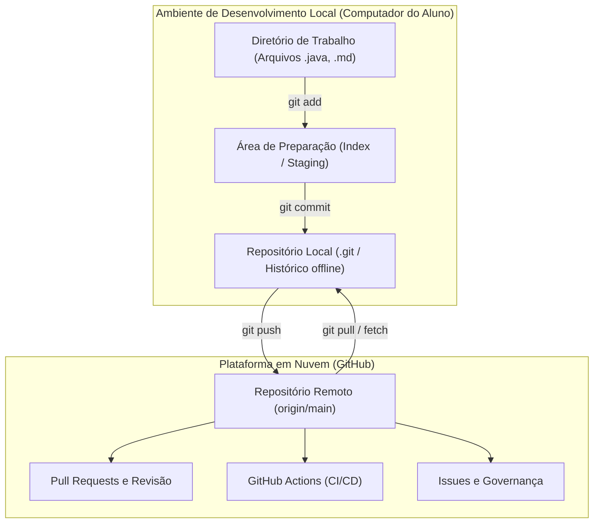

### Comparativo analítico: Git vs. GitHub

| Critério de Comparação | Git | GitHub |
|---|---|---|
| **Natureza** | Software CLI / Motor de controle de versão | Serviço em nuvem / Plataforma colaborativa |
| **Instalação** | Instalado no sistema operacional local | Hospedado em servidores remotos na nuvem |
| **Dependência de internet** | Nenhuma para operações locais (commit, branch, log) | Obrigatória para navegação e sincronização |
| **Interface primária** | Linha de comando (CLI) ou clientes gráficos locais | Interface gráfica web (UI) e API REST/GraphQL |
| **Estrutura de dados** | Grafo Acíclico Dirigido (DAG) gravado em `.git` | Armazenamento de repositórios Git com metadados SQL |
| **Responsabilidade no curso** | Versionamento atômico do código e rastreio de alterações | Repositório oficial do professor e entrega de projetos |

---

## Modelagem de commits, branches, tags e grafo dirigido acíclico no Git

### O Git como Grafo Acíclico Dirigido (DAG)

Diferente de sistemas de controle de versão legados (como CVS ou Subversion/SVN), que gravavam diferenças linha a linha baseadas em arquivos (*deltas*), o Git modela o histórico como uma série temporal de **snapshots** (fotografias completas do estado de todo o projeto).

Internamente, cada snapshot é representado por um objeto do tipo **commit**, identificado por um hash criptográfico (originalmente SHA-1 com 160 bits, representado por 40 caracteres hexadecimais, evoluindo em versões recentes para SHA-256).

Todo commit é imutável e contém:
1. Um ponteiro para uma árvore de diretórios (*tree object*) que descreve a hierarquia de arquivos e seus conteúdos (*blob objects*).
2. Metadados contextuais: nome e e-mail do autor, data e hora de autoria, nome e e-mail do committer, data de registro e mensagem explicativa.
3. Zero, um ou múltiplos ponteiros para **commits pais** (*parent commits*).

Como cada commit aponta para trás (para o seu commit precedente) e nenhum commit posterior pode apontar para um futuro inexistente ou formar um ciclo fechado de referências temporais, o Git constrói matematicamente um **Grafo Acíclico Dirigido** (*Directed Acyclic Graph* - DAG).

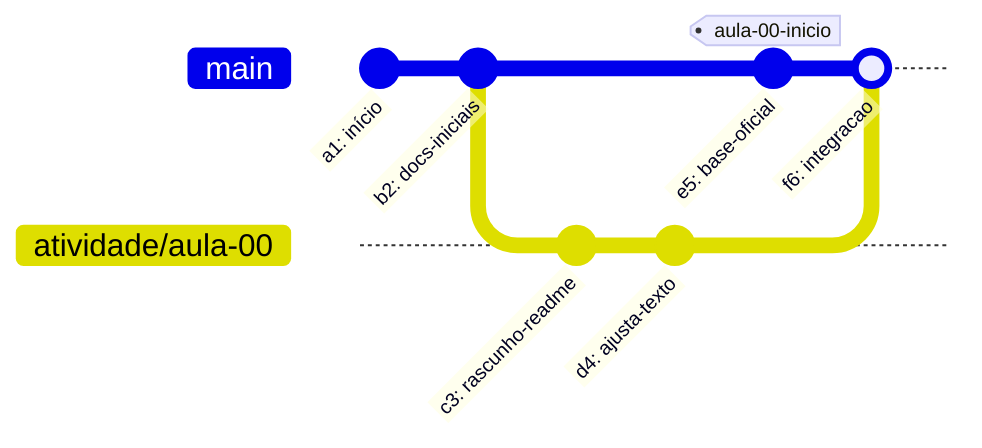

### Desmistificando branches e tags

No modelo do Git, branches e tags não representam diretórios físicos duplicados no disco:

- **Branch**: É estritamente um ponteiro móvel (*reference*) de 41 bytes gravado em `.git/refs/heads/<nome-da-branch>`, que contém o hash do commit mais recente daquela linha de desenvolvimento. Quando um novo commit é registrado sob uma branch ativa, o ponteiro da branch avança automaticamente para o novo hash.
- **Tag**: É uma referência nomeada para um commit específico. Diferente da branch, uma tag é estática e não se move quando novos commits são inseridos. No curso, as tags identificam os "pontos de quebra" pedagógicos.
- **HEAD**: É um ponteiro especial (armazenado em `.git/HEAD`) que indica qual referência ou commit está atualmente selecionado no diretório de trabalho.

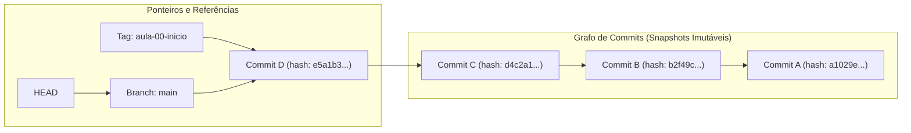

| Elemento do Grafo | Comportamento Dinâmico | Mutabilidade | Finalidade Primária |
|---|---|---|---|
| **Commit** | Vértice fixo do grafo | 100% Imutável (alterar conteúdo muda o hash) | Registrar estado lógico estável e auditável |
| **Branch** | Ponteiro que avança a cada commit | Dinâmico e transitório | Desenvolver novas funcionalidades isoladamente |
| **Tag** | Ponteiro estático ancorado a um commit | Fixo (por convenção e integridade) | Marcar releases, entregas e pontos de quebra |
| **HEAD** | Segue o checkout atual do usuário | Extremamente móvel | Definir qual commit alimenta a pasta de trabalho |

---

## Repositórios locais versus repositórios remotos e o modelo distribuído

### Topologias de controle de versão

No modelo centralizado tradicional (ex.: Apache Subversion), existe apenas um repositório centralizado no servidor. Os desenvolvedores mantêm localmente apenas uma cópia de trabalho dos arquivos. Para consultar o histórico, criar ramificações ou efetuar commits, a conectividade de rede com o servidor central é mandatória. Se o servidor cair, todo o ciclo de desenvolvimento é paralisado.

No **modelo distribuído** do Git, a operação de clonagem (`git clone`) baixa uma cópia integral do repositório, incluindo cada versão de cada arquivo, cada branch e a totalidade do histórico de commits registrado desde o início do projeto.

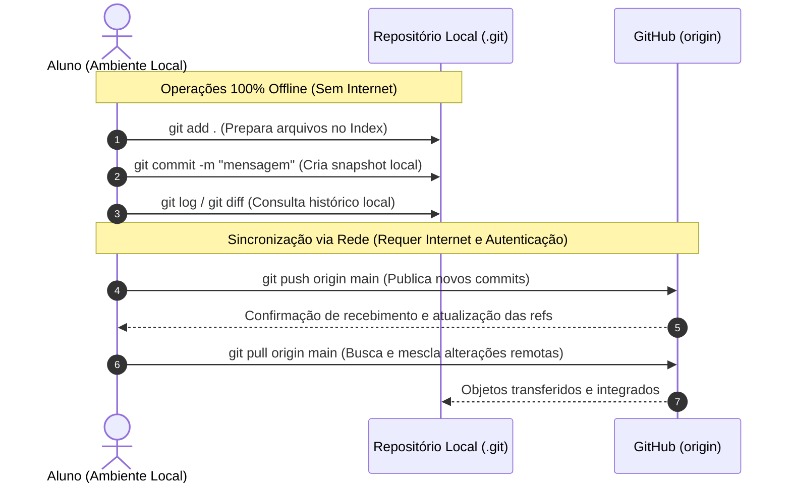

### O papel do remoto `origin`

Quando clonamos um repositório, o Git cria automaticamente um apelido padrão denominado **`origin`**. Esse apelido mapeia a URL do servidor de onde o código foi baixado. 

Para consultar os endereços remotos configurados:

```bash
git remote -v
```

Saída típica:

```text
origin  git@github.com:jeffersonarpasserini/suporteos2026.git (fetch)
origin  git@github.com:jeffersonarpasserini/suporteos2026.git (push)
```

No contexto da disciplina:
- O repositório `jeffersonarpasserini/suporteos2026` é a fonte canônica do professor.
- Cada estudante trabalha em seu clone local e, na Aula 02, criará seu próprio repositório remoto para seu respectivo projeto temático.

---

## Protocolos de comunicação: HTTPS e SSH

A comunicação segura entre o cliente local do Git e os servidores do GitHub ocorre prioritariamente por meio de dois protocolos de rede da camada de aplicação: **HTTPS** e **SSH**.

### 1. Protocolo HTTPS (*Hypertext Transfer Protocol Secure*)

- **Formato da URL**: `https://github.com/jeffersonarpasserini/suporteos2026.git`
- **Mecanismo de Autenticação**: O GitHub não aceita mais a senha da conta de usuário para operações de linha de comando desde agosto de 2021. É obrigatório gerar um **Personal Access Token (PAT)** com escopo de permissão de escrita em repositórios (`repo`).
- **Vantagens**: Raramente é bloqueado por firewalls corporativos ou redes de instituições de ensino, pois opera sobre a porta padrão 443.
- **Desvantagens**: Exige a gestão de expiração de tokens e o uso de gerenciadores de credenciais do sistema operacional (*Git Credential Manager*).

### 2. Protocolo SSH (*Secure Shell*)

- **Formato da URL**: `git@github.com:jeffersonarpasserini/suporteos2026.git`
- **Mecanismo de Autenticação**: Baseia-se em criptografia assimétrica de chave pública (algoritmos modernos recomendados como Ed25519 ou RSA de 4096 bits).
- **Vantagens**: Comunicação extremamente segura, sem necessidade de digitar tokens repetidamente; autenticação gerenciada por um agente em memória (`ssh-agent`).
- **Desvantagens**: Utiliza a porta de rede 22, que pode ser bloqueada em redes corporativas com políticas rígidas de proxy.

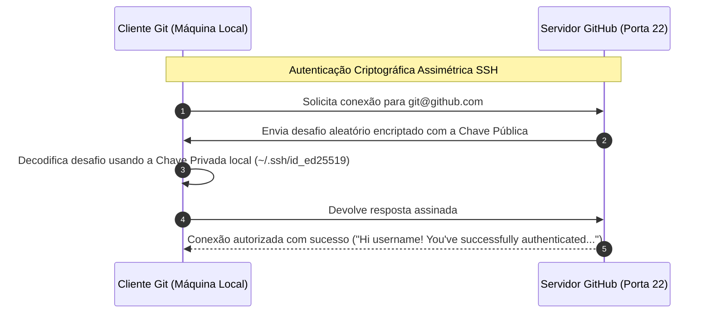

### Validação da conexão SSH

Para certificar se a chave SSH local foi corretamente cadastrada no painel do GitHub:

```bash
ssh -T git@github.com
```

Resposta de sucesso emitida pelo GitHub:

```text
Hi seu-usuario! You've successfully authenticated, but GitHub does not provide shell access.
```

> **Aviso Crítico de Segurança:** A sua chave privada (`id_ed25519` ou `id_rsa`) jamais deve sair do seu computador. Não a envie para o repositório, não compartilhe com colegas e não transfira por e-mail ou mensagens. Cadastra-se no GitHub estritamente a **chave pública** (`id_ed25519.pub`).

---

## Inicialização e clonagem de repositórios

Existem duas abordagens padronizadas para obter um repositório Git local funcional: criar a partir de um diretório existente (`git init`) ou clonar um repositório existente na nuvem (`git clone`).

### Decisão de fluxo: iniciar localmente vs. clonar

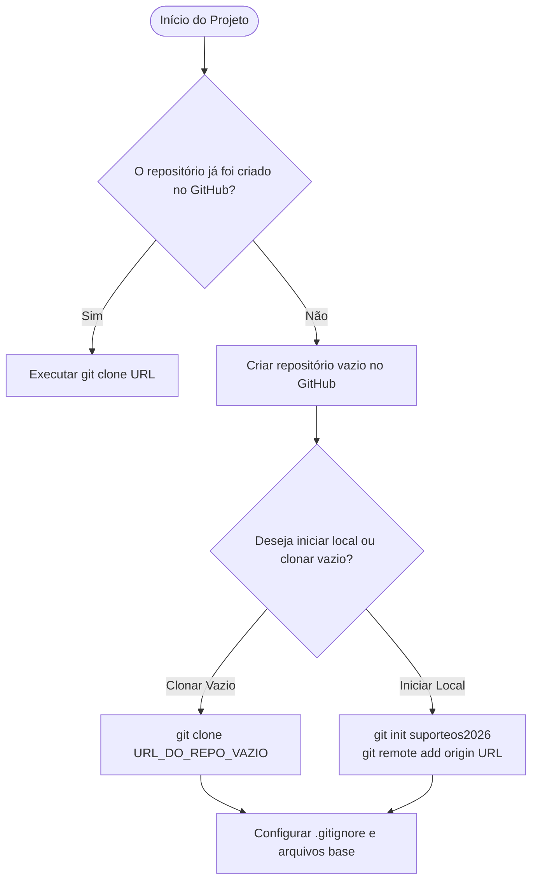

### Procedimento adotado na Aula 00: clone de repositório vazio

Para evitar divergências de histórico inicial entre o remoto e o local, o fluxo demonstrado pelo professor cria um repositório 100% vazio no GitHub (sem README, sem licença e sem `.gitignore`) e o clona imediatamente:

```bash
# 1. Navegar até a pasta raiz de projetos
cd ~/Projetos

# 2. Clonar o repositório oficial recém-criado
git clone git@github.com:jeffersonarpasserini/suporteos2026.git

# 3. Entrar no diretório do projeto
cd suporteos2026
```

Durante o clone de um repositório desprovido de commits, o Git emitirá um aviso preventivo:

```text
warning: You appear to have cloned an empty repository.
```

Este aviso é plenamente esperado. Ele apenas esclarece que o repositório local foi configurado com a referência para o servidor remoto, mas nenhuma árvore de arquivos foi extraída para o disco porque ainda não há nenhum commit registrado.

Para padronizar o nome da branch principal como `main` caso o cliente local venha configurado com um padrão legado (como `master`):

```bash
git branch -M main
```

---

## Configuração de identidade e metadados de commit

O Git exige que cada commit esteja indelevelmente vinculado a uma identidade de autoria. Essa identidade é composta por duas variáveis: `user.name` e `user.email`.

### Níveis de escopo de configuração do Git

O Git armazena suas configurações em três níveis hierárquicos:

1. **System (`--system`)**: Aplica-se a todos os usuários da máquina e a todos os repositórios (arquivo `/etc/gitconfig`).
2. **Global (`--global`)**: Aplica-se a todos os repositórios do usuário corrente logado no sistema operacional (arquivo `~/.gitconfig`).
3. **Local (`--local`)**: Aplica-se com exclusividade ao repositório específico em que o comando é executado (arquivo `.git/config`). O nível local sobrepõe o nível global.

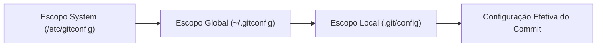

### Configuração prática

Para configurar a identidade em nível global (recomendado para a máquina do aluno):

```bash
git config --global user.name "Jefferson Passerini"
git config --global user.email "jefferson.passerini@unifef.edu.br"
```

Para inspecionar as configurações vigentes:

```bash
git config --global --list
```

> **Nota de Rastreabilidade:** O campo `user.name` não representa o seu login do GitHub, mas sim o seu nome formal que assinará a autoria do trabalho acadêmico ou corporativo. O `user.email` deve ser obrigatoriamente um e-mail cadastrado e verificado na sua conta do GitHub para que a plataforma associe visualmente o commit ao seu perfil.

---

## Criação e finalidade dos arquivos base: README.md, .editorconfig e .gitignore

Antes da introdução de qualquer código de compilação da aplicação Spring Boot, a raiz do repositório deve ser munida de três arquivos de governança:

```text
suporteos2026/
├── .editorconfig
├── .gitignore
└── README.md
```

### 1. `README.md` (Documentação e Ponto de Entrada)

- **Definição**: Arquivo de texto estruturado em formato Markdown que é renderizado automaticamente na página inicial do repositório no GitHub.
- **Motivação**: Serve como o "cartão de visitas" técnico e operacional do projeto. Define a arquitetura do domínio, pré-requisitos de software, orientações de execução e convenções adotadas pela equipe.
- **Armadilha**: Deixar o repositório sem README ou com descrições genéricas geradas por ferramentas de scaffolding sem explicar como compilar ou testar o projeto.

### 2. `.editorconfig` (Padronização de Codificação entre IDEs)

- **Definição**: Arquivo padronizado lido nativamente ou via plugins pelas principais IDEs do mercado (IntelliJ IDEA, Eclipse, VS Code, Vim).
- **Motivação**: Elimina a clássica "guerra de formatação" em equipes de desenvolvimento. Garante que desenvolvedores usando sistemas operacionais diferentes (Windows, macOS, Linux) adotem o mesmo padrão de quebras de linha (`LF`), codificação de caracteres (`UTF-8`), remoção de espaços em branco inúteis ao final das linhas e indentação coerente.
- **Armadilha**: Não definir `end_of_line = lf`, permitindo que desenvolvedores no Windows façam commits com `CRLF`, o que polui o histórico do Git com falsas alterações de linha em todo o arquivo.

### 3. `.gitignore` (Barreira Sanitária do Repositório)

- **Definição**: Arquivo de regras textuais declarativas que instrui o Git sobre quais diretórios, extensões e padrões de arquivos não rastreados devem ser ignorados.
- **Motivação**: Impede a contaminação do repositório com binários gerados pela compilação (pastas `target/` do Maven), metadados locais proprietários da IDE (pasta `.idea/`), logs transitórios e, criticamente, arquivos contendo segredos e credenciais de infraestrutura (como arquivos `.env`).
- **Armadilha**: Supor que adicionar uma entrada ao `.gitignore` removerá um arquivo que já foi commitado anteriormente. O `.gitignore` afeta única e exclusivamente arquivos no estado **não rastreado** (*untracked*).

---

## Estados de um arquivo (não rastreado, modificado, preparado e registrado)

O núcleo do funcionamento do Git assenta-se sobre o trânsito controlado de arquivos entre quatro estados operacionais e três áreas de armazenamento.

### As três áreas do Git

1. **Diretório de Trabalho (*Working Directory*)**: Os arquivos físicos descompactados e visíveis no sistema de arquivos da sua máquina, onde você programa e edita.
2. **Área de Preparação (*Staging Area* ou *Index*)**: Um arquivo binário localizado em `.git/index` que armazena a lista precisa e os hashes dos conteúdos que farão parte do próximo snapshot a ser gerado.
3. **Repositório / Banco de Objetos (*Repository / .git folder*)**: Onde o histórico permanente reside, armazenando a árvore de commits imutáveis.

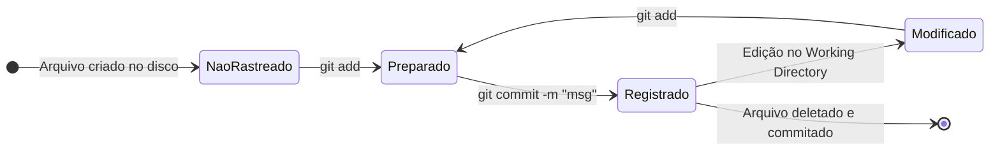

### Ciclo de vida e interpretação do `git status`

| Estado | Significado no Git | Como é exibido no `git status` |
|---|---|---|
| **Untracked (Não rastreado)** | O arquivo existe fisicamente no disco, mas nunca foi incluído em nenhum commit e não está no index. | Seção `Untracked files:` (em vermelho no terminal colorido) |
| **Modified (Modificado)** | Um arquivo que já foi commitado no passado sofreu alterações no disco e essas alterações ainda não foram preparadas. | Seção `Changes not staged for commit:` (em vermelho) |
| **Staged (Preparado / Indexado)** | A versão atual do arquivo foi enviada para o Index via `git add` e está congelada aguardando o commit. | Seção `Changes to be committed:` (em verde) |
| **Committed (Registrado / Limpo)** | Os dados foram salvos com segurança no banco de objetos local do Git. O diretório de trabalho está limpo. | `nothing to commit, working tree clean` |

---

## Comandos do ciclo básico: status, add, commit, push e pull

A rotina diária de um engenheiro de software com o Git envolve o encadeamento rigoroso de cinco comandos fundamentais.

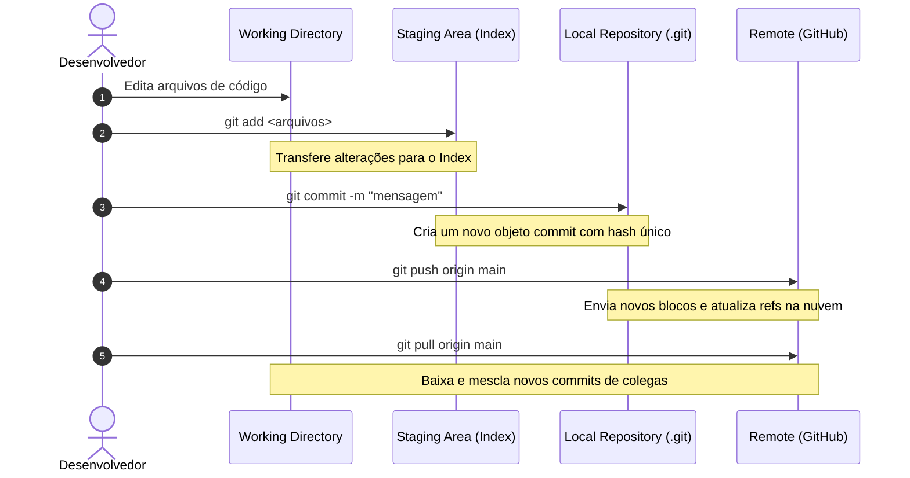

### Detalhamento operacional dos comandos

#### 1. `git status`
Inspeciona os estados das três áreas, exibindo a branch corrente, divergências em relação ao repositório remoto e arquivos não rastreados, modificados ou preparados. Deve ser o primeiro e o último comando executado em qualquer interação com o terminal.

#### 2. `git add <caminho>`
Move arquivos do *Working Directory* para o *Staging Area*. Prepara o conteúdo exato do arquivo naquele instante. Se você alterar o arquivo novamente após o `git add`, a nova alteração não irá para o commit a menos que você execute `git add` novamente.

> **Regra Didática da Aula 00:** Evite o uso indiscriminado de `git add .` no início do aprendizado. O comando adiciona tudo sem critério. Adicione arquivos explicitamente (`git add README.md .gitignore .editorconfig`) para desenvolver o hábito de auditoria visual pré-commit.

#### 3. `git diff` e `git diff --staged`
- `git diff`: Compara o *Working Directory* com a *Staging Area* (mostra o que foi alterado mas ainda não foi preparado).
- `git diff --staged` (ou `--cached`): Compara a *Staging Area* com o último commit registrado (mostra exatamente o que entrará no próximo commit).

#### 4. `git commit -m "mensagem"`
Captura o estado exato dos arquivos no *Staging Area*, empacota-os em um novo objeto de commit no banco local e atualiza o ponteiro da branch corrente. A mensagem de commit deve seguir padrões estritos: concisa, no imperativo ou indicando claramente a intenção da mudança.

#### 5. `git push -u origin main`
Transfere os commits do repositório local para o repositório remoto.
- O parâmetro `-u` (ou `--set-upstream`) estabelece um vínculo permanente de rastreamento entre a branch local `main` e a remota `origin/main`. Com isso, nos próximos envios, basta digitar `git push`.

#### 6. `git pull`
Combina duas ações em um só passo: busca os novos commits do servidor remoto (`git fetch`) e os integra imediatamente à branch local ativa (`git merge`).

---

## Estratégia de branches locais e uso de tags anotadas

### Branches como isolamento de contexto

Trabalhar diretamente na branch principal (`main`) em um ambiente de produção é uma grave violação de governança. As ramificações (*branches*) permitem que desenvolvedores construam funcionalidades, corrijam bugs ou realizem tarefas acadêmicas de forma isolada, sem comprometer a estabilidade da linha principal.

No Git moderno (versões ≥ 2.23), utiliza-se o comando `git switch` para alternar entre branches, substituindo o antigo e sobrecarregado `git checkout`:

```bash
# Cria e muda imediatamente para uma nova branch
git switch -c atividade/aula-00

# Confere a branch ativa
git branch --show-current
```

### Tags anotadas vs. Tags leves

Tags servem para nomear momentos notáveis do histórico (pontos de restauração, lançamentos de versões, entregas de sprint). Existem duas modalidades de tags no Git:

1. **Tag leve (*lightweight*)**: É apenas um ponteiro simples contendo um hash de commit (semelhante a uma branch que não se move).
2. **Tag anotada (*annotated*)**: É armazenada como um objeto completo no banco de dados do Git. Possui seu próprio hash, contém metadados de autoria (nome, e-mail, data), permite assinatura criptográfica GPG e possui uma mensagem explicativa própria.

No curso **Suporte OS 2026**, **todas as tags de encerramento de aula devem ser anotadas** utilizando a flag `-a`:

```bash
# Criando a tag anotada do marco da Aula 00
git tag -a aula-00-inicio -m "Conclusão da Aula 00: Repositório base configurado"

# Inspecionando a tag criada e seus metadados completos
git show aula-00-inicio

# Enviando a tag para o repositório remoto no GitHub
git push origin aula-00-inicio
```

---

## Segurança e gestão de credenciais e segredos no repositório

### A natureza pública e indelével dos repositórios

Um repositório Git é uma estrutura cumulativa projetada para jamais perder dados. Qualquer arquivo incluído em um commit fará parte do grafo histórico para sempre, a menos que o repositório passe por uma cirurgia complexa de reescrita de histórico (como o uso de ferramentas avançadas como `git-filter-repo` ou BFG Repo-Cleaner) acompanhada de um `git push --force`.

Se um estudante commitar um arquivo contendo:
- Senhas de banco de dados (`root`, `postgres`);
- Chaves de API externas (OpenAI, AWS, GCP, Stripe);
- Chaves privadas SSH (`id_rsa`);
- Tokens pessoais do GitHub;

e publicar o repositório com `git push`, robôs automatizados de varredura (*scrapers*) indexam a credencial em questão de segundos, gerando riscos de sequestro de infraestrutura e custos imprevistos na nuvem.

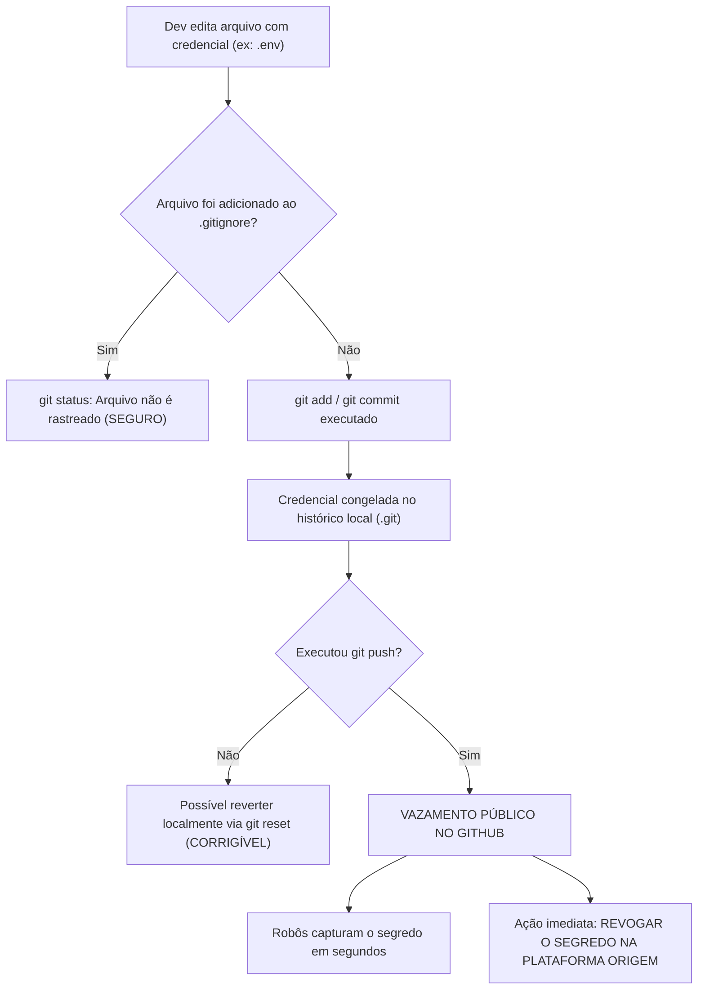

### O mito do `.gitignore` corretivo

> **Aviso Fundamental de Segurança:** Adicionar um arquivo ao `.gitignore` após ele ter sido commitado **não apaga o arquivo do histórico**. Ele continuará perfeitamente visível nos commits antigos para qualquer pessoa que clonar o repositório.

### Protocolo de resposta a incidentes de vazamento

Se uma credencial for acidentalmente enviada ao GitHub:
1. **Revogação Imediata**: Considere a credencial 100% comprometida. Acesse a plataforma provedora do serviço (ex.: AWS, banco de dados, provedor de e-mail) e invalide/destrua a credencial imediatamente. A rotação de chave precede qualquer correção de código.
2. **Notificação**: Comunique imediatamente o professor ou a equipe técnica de segurança responsável.
3. **Saneamento**: Substitua o valor real por uma variável de ambiente ou modelo fictício (`.env.example`).
4. **Purga do Histórico**: Apenas após revogar a chave, realize o expurgo da árvore do Git conforme orientações institucionais.

---

## Código da aula

O estado inicial do repositório da disciplina é composto exclusivamente por três arquivos de governança na raiz do projeto. Abaixo, cada arquivo é apresentado com sua motivação, boas práticas e análise linha a linha.

### Arquivo 1: `README.md`

Arquivo de especificação e apresentação geral do projeto. Deve estar localizado na raiz (`/README.md`).

```markdown
# Suporte OS 2026

API didática desenvolvida na disciplina de Programação da graduação em Sistemas de Informação.

## Domínio inicial

- Grupo de produto: classificação de produtos.
- Produto: item identificado por código de barras, com saldo e valor unitário.

## Requisitos

- Java 21
- Git
- IntelliJ IDEA Ultimate
- Docker Desktop, utilizado nas aulas de PostgreSQL e containerização

## Organização do curso

O sistema será construído incrementalmente. Cada aula termina em um estado executável, registrado por um commit e, após validação, por uma tag Git no formato `aula-NN-*`.
```

#### Análise detalhada das seções do `README.md`
- **Linha 1 (`# Suporte OS 2026`)**: Título de nível 1 correspondente ao nome canônico do sistema.
- **Linhas 5-8 (`## Domínio inicial`)**: Apresenta de forma sucinta o escopo funcional que começará a ser modelado nas próximas aulas (gestão de produtos e grupos).
- **Linhas 10-15 (`## Requisitos`)**: Lista as dependências estruturais de software exigidas para compilação e execução (Java 21 LTS, Git, IDE e Docker).
- **Linhas 17-19 (`## Organização do curso`)**: Esclarece o modelo pedagógico incremental e a convenção de nomenclatura das tags de marco (`aula-NN-*`).

---

### Arquivo 2: `.editorconfig`

Arquivo de configuração de formatação para ambientes integrados de desenvolvimento. Deve estar localizado na raiz (`/.editorconfig`).

```ini
root = true

[*]
charset = utf-8
end_of_line = lf
insert_final_newline = true
trim_trailing_whitespace = true

[*.java]
indent_style = space
indent_size = 4

[*.{xml,yml,yaml,properties,md}]
indent_style = space
indent_size = 2

[*.md]
trim_trailing_whitespace = false
```

#### Análise detalhada das diretivas do `.editorconfig`
- **Linha 1 (`root = true`)**: Declara que este arquivo é a raiz de configuração do projeto, impedindo que editores procurem arquivos `.editorconfig` em diretórios pais do sistema operacional.
- **Linha 3 (`[*]`)**: Aplica as regras subsequentes a todos os arquivos do repositório indistintamente.
- **Linha 4 (`charset = utf-8`)**: Obriga a codificação universal UTF-8, evitando erros com caracteres acentuados da língua portuguesa.
- **Linha 5 (`end_of_line = lf`)**: Padroniza o caractere de quebra de linha como *Line Feed* (`\n`), o padrão Unix/Linux. Essa configuração é essencial para impedir que desenvolvedores no Windows criem commits poluídos com quebras `CRLF` (`\r\n`).
- **Linha 6 (`insert_final_newline = true`)**: Garante que os arquivos salvem uma quebra de linha em branco ao final, em conformidade com o padrão POSIX para arquivos de texto.
- **Linha 7 (`trim_trailing_whitespace = true`)**: Instrui a IDE a deletar automaticamente espaços em branco invisíveis deixados ao final das linhas de código.
- **Linhas 9-11 (`[*.java]`)**: Especifica para os códigos-fonte da linguagem Java uma indentação de 4 espaços (`indent_style = space`, `indent_size = 4`), que é a convenção padrão oficial da linguagem Java e da Oracle.
- **Linhas 13-15 (`[*.{xml,yml,yaml,properties,md}]`)**: Define indentação compacta de 2 espaços para arquivos de configuração e marcação (`pom.xml`, arquivos de propriedades do Spring e documentação Markdown).
- **Linhas 17-18 (`[*.md]`)**: Desativa a remoção de espaços finais para arquivos Markdown (`trim_trailing_whitespace = false`), pois a especificação do Markdown utiliza dois espaços em branco no final de uma linha para denotar uma quebra de linha visual (`<br>`).

---

### Arquivo 3: `.gitignore`

Filtro sanitário do repositório. Deve estar localizado na raiz (`/.gitignore`).

```gitignore
# IntelliJ IDEA
.idea/
*.iml
*.iws
*.ipr

# Maven e Java
target/
*.class
*.jar
*.war
*.ear

# Logs
*.log
logs/

# Variáveis de ambiente e segredos locais
.env
.env.*
!.env.example

# Sistema operacional
.DS_Store
**/.DS_Store
Thumbs.db

# Arquivos temporários
*.tmp
*.swp
*~
```

#### Análise detalhada dos padrões do `.gitignore`
- **Linhas 1-5 (`# IntelliJ IDEA`)**: Ignora o diretório de configurações internas da IDE IntelliJ IDEA (`.idea/`) e arquivos legados de projeto (`*.iml`, `*.ipr`). Essas pastas contêm caminhos absolutos locais da máquina do usuário e caches que quebram o ambiente de outros desenvolvedores caso sejam versionados.
- **Linhas 7-13 (`# Maven e Java`)**: Ignora o diretório `target/` (onde o compilador Java e o Maven depositam os binários compilados) e extensões empacotadas (`*.class`, `*.jar`, `*.war`). Versionar binários é uma péssima prática: infla o repositório, causa conflitos constantes de merge e viola o princípio de que o repositório deve armazenar código-fonte, não artefatos compilados.
- **Linhas 15-17 (`# Logs`)**: Impede que arquivos de log de execução da aplicação sejam persistidos no Git.
- **Linhas 19-23 (`# Variáveis de ambiente e segredos locais`)**: Bloqueia categoricamente arquivos `.env` e `.env.*` que armazenam senhas de conexão ao banco PostgreSQL, credenciais e chaves criptográficas. A regra `!.env.example` abre uma exceção explícita com o operador de negação (`!`), permitindo que um arquivo de exemplo com valores fictícios seja versionado para servir de guia aos outros alunos.
- **Linhas 25-28 (`# Sistema operacional`)**: Descarta arquivos de metadados invisíveis criados pelos gerenciadores de janelas dos sistemas operacionais (o `.DS_Store` do Apple macOS e o `Thumbs.db` do Microsoft Windows).
- **Linhas 30-33 (`# Arquivos temporários`)**: Ignora arquivos temporários e de swap gerados por editores de texto como Vim (`*.swp`, `*~`).

---

## Exercícios

Abaixo constam as resoluções integrais, detalhadas e fundamentadas dos exercícios previstos para a Aula 00.

### Exercício 1: Leitura do Repositório (Atividade Orientada - Parte A)

#### Enunciado
Execute no terminal os quatro comandos de inspeção do Git (`git status`, `git remote -v`, `git branch --show-current` e `git log --oneline`) e forneça uma explicação técnica e aprofundada de cada um dos retornos apresentados.

#### Raciocínio
A inspeção precisa do estado de um repositório é o alicerce para evitar erros de merge, push acidental ou commits mal direcionados. Cada um dos comandos consulta uma camada diferente da pasta interna `.git`:
1. `git status` consulta a relação trilateral entre o *Working Directory*, o *Index* e o *HEAD*.
2. `git remote -v` lê a tabela de remotos configurados no arquivo `.git/config`.
3. `git branch --show-current` lê o arquivo `.git/HEAD` para resolver qual branch está ativa.
4. `git log --oneline` percorre o Grafo Acíclico Dirigido (DAG) a partir do commit apontado pela branch ativa até o commit raiz inicial.

#### Resolução e interpretação detalhada

```bash
# Execução 1
git status
```
*Saída esperada:*
```text
On branch main
Your branch is up to date with 'origin/main'.

nothing to commit, working tree clean
```
*Explicação:* Indica que o ponteiro `HEAD` está ancorado na branch `main`. A branch local possui o mesmo hash do ponteiro rastreador remoto `origin/main`. Não há arquivos modificados, adicionados ou não rastreados no disco.

```bash
# Execução 2
git remote -v
```
*Saída esperada:*
```text
origin  git@github.com:jeffersonarpasserini/suporteos2026.git (fetch)
origin  git@github.com:jeffersonarpasserini/suporteos2026.git (push)
```
*Explicação:* Lista os apelidos dos repositórios remotos. A referência `origin` aponta para o endereço SSH oficial no servidor do GitHub, tanto para a operação de leitura/recuperação (`fetch`) quanto para a de publicação/escrita (`push`).

```bash
# Execução 3
git branch --show-current
```
*Saída esperada:*
```text
main
```
*Explicação:* Retorna o nome limpo da linha de desenvolvimento ativa no momento, confirmando que o usuário não está em estado de *detached HEAD* (cabeça desanexada).

```bash
# Execução 4
git log --oneline
```
*Saída esperada:*
```text
a34355d (HEAD -> main, tag: aula-00-inicio, origin/main) Aula 00: inicia o repositório do curso
```
*Explicação:* Exibe a lista linearizada de commits do grafo. O hash curto `a34355d` identifica o commit inicial. Os metadados em parênteses revelam que:
- O `HEAD` local aponta para a branch `main`.
- A tag anotada `aula-00-inicio` está posicionada exatamente sobre este commit.
- O repositório remoto (`origin/main`) está sincronizado no mesmo nível.
- O texto final é a mensagem semântica atribuída ao snapshot.

---

### Exercício 2: Branch Local e Alteração do README (Atividade Orientada - Parte B)

#### Enunciado
1. Crie e alterne para a branch de trabalho local denominada `atividade/aula-00`.
2. Adicione ao final do arquivo `README.md` uma nova seção de nível 2 denominada `## Aprendizados da Aula 00`.
3. Escreva duas frases técnicas explicando:
   - A diferença entre Git e GitHub;
   - A diferença entre commit e push.
4. Inspecione a diferença usando `git diff`.
5. Prepare o arquivo e registre o commit local com uma mensagem no padrão da disciplina.

#### Raciocínio
O fluxo reproduz o ciclo padrão da engenharia de software: ramificação da linha principal para manter o código estável, modificação atômica do arquivo, inspeção visual da alteração (*diff*) para garantir que nenhum resíduo entrou no arquivo, preparação controlada para a área de staging e criação do snapshot local.

#### Resolução passo a passo

```bash
# Passo 1: Criação e mudança de branch
git switch -c atividade/aula-00
```
*Saída:* `Switched to a new branch 'atividade/aula-00'`

```bash
# Passo 2: Edição do arquivo README.md (via terminal ou editor)
# Adiciona o conteúdo ao final do arquivo
cat << 'EOF' >> README.md

## Aprendizados da Aula 00

O Git e o software local responsavel pelo controle de versao distribuido e armazenamento do historico de arquivos em snapshots, enquanto o GitHub e uma plataforma em nuvem que hospeda repositorios remotos e viabiliza a colaboracao em equipe.
O commit registra um novo estado do projeto exclusivamente no banco de dados local do computador, ao passo que o push transmite esses commits locais para sincronizar o repositorio remoto hospedado no GitHub.
EOF
```

```bash
# Passo 3: Auditoria da modificação
git diff
```
*Saída esperada do diff unificado:*
```diff
diff --git a/README.md b/README.md
index 4b825dc..c183a92 100644
--- a/README.md
+++ b/README.md
@@ -17,3 +17,9 @@
 O sistema será construído incrementalmente. Cada aula termina em um estado executável, registrado por um commit e, após validação, por uma tag Git no formato `aula-NN-*`.
+
+## Aprendizados da Aula 00
+
+O Git é o software local responsável pelo controle de versão distribuído e armazenamento do histórico de arquivos em snapshots, enquanto o GitHub é uma plataforma em nuvem que hospeda repositórios remotos e viabiliza a colaboração em equipe.
+O commit registra um novo estado do projeto exclusivamente no banco de dados local do computador, ao passo que o push transmite esses commits locais para sincronizar o repositório remoto hospedado no GitHub.
```

```bash
# Passo 4: Preparação no Index e verificação
git add README.md
git status
```
*O `git status` exibirá o `README.md` sob a seção `Changes to be committed:` em verde.*

```bash
# Passo 5: Criação do commit com mensagem semântica
git commit -m "Atividade Aula 00: documenta diferencas entre Git, GitHub, commit e push"
```
*Saída esperada:*
```text
[atividade/aula-00 9c41f2a] Atividade Aula 00: documenta diferencas entre Git, GitHub, commit e push
 1 file changed, 6 insertions(+)
```

---

### Exercício 3: Conferência de Histórico (Atividade Orientada - Parte C)

#### Enunciado
Execute `git status` e `git log --oneline --decorate -5` para verificar se o diretório de trabalho terminou limpo e se o commit da atividade foi posicionado corretamente em relação às branches locais e tags.

#### Raciocínio
A conferência atesta se a área de trabalho não ficou com arquivos soltos (*dirty working tree*) e demonstra graficamente que a nova branch `atividade/aula-00` avançou um commit à frente da branch `main`.

#### Resolução

```bash
# Passo 1: Checar se o ambiente de trabalho está limpo
git status
```
*Saída esperada:*
```text
On branch atividade/aula-00
nothing to commit, working tree clean
```

```bash
# Passo 2: Inspecionar o grafo recente com decoradores de referências
git log --oneline --decorate -5
```
*Saída esperada:*
```text
9c41f2a (HEAD -> atividade/aula-00) Atividade Aula 00: documenta diferencas entre Git, GitHub, commit e push
a34355d (tag: aula-00-inicio, origin/main, main) Aula 00: inicia o repositório do curso
```
*Interpretação do resultado:*
- O commit `9c41f2a` é agora a ponta ativa do desenvolvimento local, indicada pelo `HEAD -> atividade/aula-00`.
- O commit `a34355d` permanece intocado, preservando os ponteiros da branch `main`, da tag oficial `aula-00-inicio` e do remoto `origin/main`.
- A separação de preocupações funcionou perfeitamente: o trabalho do estudante não alterou a branch principal.

---

### Exercício 4: Resoluções das Perguntas de Revisão da Aula 00

#### Pergunta 1: Qual é a diferença entre Git e GitHub?
**Resposta:** O Git é uma ferramenta utilitária de linha de comando que executa localmente no sistema operacional para gerenciar o controle de versão de arquivos por meio de um grafo de snapshots imutáveis. O GitHub é um serviço de hospedagem web em nuvem que armazena repositórios Git remotos, adicionando recursos colaborativos como Pull Requests, Issues, gerenciamento de acessos e automação de pipelines de CI/CD via GitHub Actions.

#### Pergunta 2: Um arquivo salvo já está versionado? Explique.
**Resposta:** Não. Salvar um arquivo no editor de texto ou IDE apenas atualiza o arquivo físico correspondente no sistema de arquivos do disco rígido (*Working Directory*). Para que um arquivo seja efetivamente versionado pelo Git, ele precisa obrigatoriamente ser selecionado para a área de preparação através do comando `git add` e, subsequentemente, ser registrado em um snapshot permanente do repositório por meio do comando `git commit`.

#### Pergunta 3: Qual é a função de `git add`?
**Resposta:** A função do `git add` é mover modificações ou novos arquivos do *Working Directory* para o *Staging Area* (também chamado de *Index*). Esse comando prepara e congela o conteúdo exato das alterações que farão parte do próximo commit, permitindo ao desenvolvedor agrupar apenas as mudanças pertinentes a uma determinada unidade lógica.

#### Pergunta 4: O que `git commit` registra?
**Resposta:** O `git commit` registra um snapshot completo, imutável e atômico do estado dos arquivos que estavam previamente na *Staging Area*. Ele armazena no banco de dados do Git (`.git/objects`) a árvore de diretórios, metadados de autoria (nome, e-mail e data/hora), a mensagem descritiva da mudança e referências criptográficas aos commits pais, gerando um identificador de hash único para esse novo estado.

#### Pergunta 5: Por que o commit ainda pode não aparecer no GitHub?
**Resposta:** Porque o Git é um sistema de controle de versão distribuído. As operações `git add` e `git commit` ocorrem de maneira 100% local, manipulando apenas o repositório interno da máquina do desenvolvedor. Para que o commit seja refletido no GitHub, é indispensável executar o comando `git push`, que é a operação de rede responsável por transferir os objetos locais para o servidor remoto.

#### Pergunta 6: O que representa `origin`?
**Resposta:** `origin` é o apelido convencional padrão atribuído pelo Git para a URL do repositório remoto principal a partir do qual o projeto foi clonado (ou para o qual foi vinculado inicialmente). Ele funciona como um atalho no arquivo `.git/config` para evitar que o desenvolvedor tenha que digitar a URL completa (HTTPS ou SSH) em todas as operações de sincronização como `push`, `pull` e `fetch`.

#### Pergunta 7: Por que devemos executar `git status` antes de um commit?
**Resposta:** Para auditar minuciosamente o estado das áreas de trabalho antes de congelar um novo registro. O `git status` previne a inclusão acidental de arquivos não relacionados, artefatos temporários da IDE, logs ou credenciais confidenciais que possam ter sido adicionados indevidamente à *Staging Area*, além de certificar se todas as alterações esperadas estão de fato indexadas.

#### Pergunta 8: Qual é a diferença entre branch e tag?
**Resposta:** Uma **branch** é uma referência móvel e dinâmica que aponta para o commit mais recente de uma linha de trabalho, avançando automaticamente a cada novo commit registrado. Uma **tag** é uma referência estática e fixa destinada a marcar permanentemente um ponto de relevância no histórico (como a conclusão de uma versão estável ou um marco didático de aula), permanecendo ancorada àquele commit específico mesmo que novos commits sejam adicionados ao projeto.

#### Pergunta 9: Por que `.env` deve ser ignorado?
**Resposta:** Arquivos `.env` contêm parâmetros de ambiente e segredos sensíveis da infraestrutura de desenvolvimento (senhas de banco de dados, chaves criptográficas, tokens de APIs e portas privadas). Se versionados, esses dados ficam gravados para sempre no histórico do repositório e expostos publicamente na web, permitindo invasões, vazamento de dados corporativos e exploração maliciosa dos recursos do sistema.

#### Pergunta 10: O que deve ser feito se uma credencial for publicada?
**Resposta:** A primeira e mais urgente providência é revogar/invalidar imediatamente a credencial no serviço provedor (trocando senhas, invalidando tokens e gerando novas chaves). A seguir, deve-se avisar formalmente o professor ou a equipe de segurança da empresa. Jamais tente apenas subir um novo commit com a linha apagada ou adicionar o arquivo ao `.gitignore`, pois o segredo continuará acessível nos commits anteriores do histórico; é indispensável tratar e reescrever o histórico conforme os protocolos formais de segurança da organização.

---

## Erros comuns e boas práticas

### Catálogo de armadilhas comuns

#### 1. "git não é reconhecido como um comando interno ou externo"
- **Causa**: O executável do Git não foi adicionado à variável de ambiente `PATH` do sistema operacional durante o processo de instalação, ou o terminal foi aberto antes da conclusão da instalação.
- **Solução**: Reinicie o terminal de comandos. Se persistir, reinstale o Git certificando-se de marcar a opção *"Git from the command line and also from 3rd-party software"*.

#### 2. `fatal: remote origin already exists`
- **Causa**: Tentativa de executar `git remote add origin <URL>` em um repositório que já possui o remoto `origin` vinculado.
- **Solução**: Verifique os remotos com `git remote -v`. Se precisar redefinir a URL, execute `git remote set-url origin <NOVA_URL>`.

#### 3. `error: src refspec main does not match any`
- **Causa**: Ocorre quando o usuário executa `git push -u origin main` em um repositório local recém-inicializado onde nenhum commit foi gerado ainda. O Git não pode empurrar uma branch para o servidor se ela ainda não possui pelo menos um commit raiz que a defina.
- **Solução**: Crie os arquivos base, prepare-os com `git add .` e gere o primeiro commit com `git commit -m "commit inicial"` antes de executar o push.

#### 4. `Permission denied (publickey)`
- **Causa**: O servidor SSH do GitHub rejeitou a tentativa de autenticação porque a chave pública local não foi adicionada às configurações da conta no GitHub, ou o agente de chaves SSH local não está em execução.
- **Solução**: Verifique o arquivo `~/.ssh/id_ed25519.pub`, copie rigorosamente todo o seu conteúdo e adicione no menu *Settings -> SSH and GPG keys* do GitHub. Teste a conexão com `ssh -T git@github.com`.

#### 5. Commit contendo arquivos da pasta `.idea` ou `target`
- **Causa**: O desenvolvedor executou `git add .` antes de criar o arquivo `.gitignore`.
- **Solução**: Se o commit ainda for estritamente local (não foi feito push), execute `git rm -r --cached .idea target`, atualize o `.gitignore`, prepare as exclusões e refaça o commit com `git commit --amend`.

### Boas práticas de engenharia de software

- **Commits Atômicos**: Cada commit deve representar uma única unidade lógica de trabalho (ex.: "corrige cálculo de desconto" ou "adiciona documentação de requisitos"). Evite commits massivos intitulados "alterações", "tudo pronto" ou "fim do dia".
- **Mensagens no Modo Imperativo**: Escreva mensagens que completem a frase: *"Se aplicado, este commit irá..."* (Ex.: `Adiciona .gitignore do projeto`, `Corrige porta do banco`).
- **Verificação Contínua**: Desenvolva o reflexo neuromuscular de executar `git status` e `git diff --staged` antes de qualquer commit.
- **Nunca Force Pushes em Branches Compartilhadas**: O comando `git push --force` sobrescreve o histórico do servidor remoto e corrompe a árvore de trabalho de todos os colegas de equipe.

---

## Links e materiais complementares

- [Documentação Oficial do Git (Livro Pro Git)](https://git-scm.com/book/pt-br/v2): Obra canônica mantida pela comunidade open-source. Fornece desde os fundamentos do encadeamento de objetos até detalhes internos sobre encanamento (*plumbing*) e comandos de alto nível (*porcelain*).
- [Criando e Gerenciando Repositórios no GitHub](https://docs.github.com/pt/repositories/creating-and-managing-repositories/creating-a-new-repository): Guia da documentação oficial do GitHub detalhando permissões, visibilidade, inicialização e importação de projetos.
- [Autenticação e Conexão via SSH no GitHub](https://docs.github.com/pt/authentication/connecting-to-github-with-ssh): Tutorial passo a passo para geração de pares de chaves criptográficas Ed25519 e verificação de conexões com o agente SSH.
- [Repositório Oficial do Curso: jeffersonarpasserini/suporteos2026](https://github.com/jeffersonarpasserini/suporteos2026): Repositório canônico gerido pelo Prof. Jefferson Passerini, contendo o histórico oficial, as apostilas em Markdown e todas as tags de pontos de quebra do semestre.
- [Especificação do EditorConfig](https://editorconfig.org/): Referência da especificação para padronização de arquivos entre diferentes IDEs e editores de código.

---

## Mapa da aula

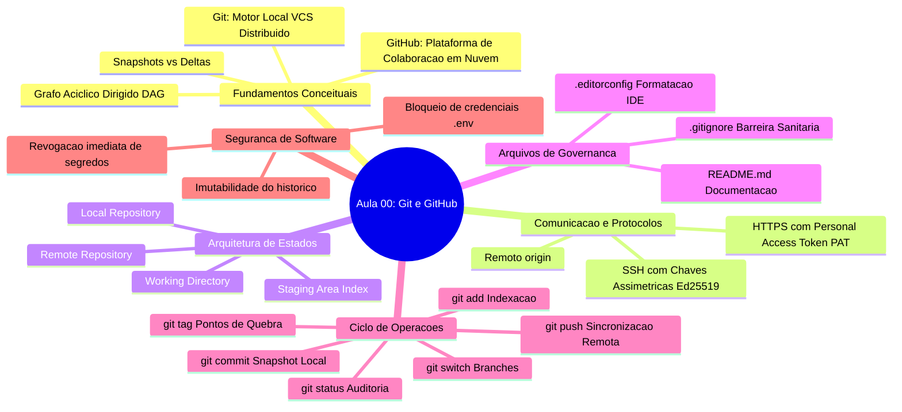

---

## Glossário

| Termo | Definição Técnica |
|---|---|
| **VCS** | *Version Control System*. Software encarregado de registrar o histórico de modificações de arquivos ao longo do tempo. |
| **Snapshot** | Fotografia de todo o sistema de arquivos em um dado instante no tempo, diferente da gravação de deltas parciais. |
| **Commit** | Objeto criptograficamente assinado contendo um snapshot de arquivos, referências a pais e metadados de autoria. |
| **Hash (SHA-1 / SHA-256)** | Função matemática que mapeia dados de tamanho arbitrário em um código hexadecimal único que garante integridade. |
| **DAG** | *Directed Acyclic Graph* (Grafo Acíclico Dirigido). Estrutura topológica onde os vértices são commits apontando para seus pais. |
| **Working Directory** | Diretório físico no disco da máquina do desenvolvedor onde os arquivos são modificados. |
| **Staging Area (Index)** | Camada intermediária que armazena as alterações preparadas para fazerem parte do próximo commit. |
| **Origin** | Nome convencional padrão atribuído ao repositório remoto principal configurado no cliente local do Git. |
| **Branch** | Ponteiro nomeado e móvel que referencia a ponta mais recente de uma linha contínua de desenvolvimento. |
| **Tag Anotada** | Objeto permanente no repositório que serve como marcador de versão contendo metadados próprios e mensagem. |
| **HEAD** | Ponteiro reservado que define qual branch ou commit específico está atualmente alimentando o diretório de trabalho. |
| **LF vs. CRLF** | Padrões de final de linha: *Line Feed* (`\n`, padrão Unix/Linux) versus *Carriage Return Line Feed* (`\r\n`, padrão Windows). |
| **Untracked** | Arquivo presente no diretório de trabalho que nunca foi adicionado ao índice ou commitado no repositório. |

---

## Pontos-chave para a prova

1. **Diferenciação Estrita entre Git e GitHub**: Compreender que o Git funciona perfeitamente offline para criar commits, branches e consultar históricos, enquanto o GitHub atua como o servidor remoto de coordenação e colaboração.
2. **O Ciclo dos Quatro Estados de Arquivos**: Saber identificar e descrever o trânsito entre *Untracked*, *Modified*, *Staged* e *Committed*, relacionando-os com os comandos `git status`, `git add` e `git commit`.
3. **Diferença Estrutural entre Branch e Tag**: Saber que a branch é um ponteiro móvel que avança automaticamente a cada novo commit, enquanto uma tag é um ponteiro estático e fixo voltado a identificar versões e pontos de quebra.
4. **Mecanismo dos Arquivos de Governança**:
   - `README.md`: Porta de entrada e documentação do projeto.
   - `.editorconfig`: Padronização de quebra de linha (`LF`), codificação (`UTF-8`) e indentação entre editores heterogêneos.
   - `.gitignore`: Prevenção contra versionamento de pastas de compilação (`target/`), configurações proprietárias (`.idea/`) e credenciais (`.env`).
5. **Comportamento Criptográfico e Imutabilidade**: Saber que qualquer modificação em um commit passado altera o seu hash, exigindo reescrita de histórico e quebrando o encadeamento do grafo.
6. **Segurança de Credenciais**: Lembrar que adicionar um arquivo com senhas ao `.gitignore` após ele ter sido commitado não resolve o vazamento, pois o arquivo permanece perfeitamente recuperável nos commits ancestrais do repositório.

---

## Perguntas e respostas (JSONL)

```jsonl
{"pergunta": "O Git exige conexao ativa com a internet para criar branches e registrar commits?", "resposta": "Nao. O Git e um sistema distribuido e executa todas as operacoes de historico, ramificacao e commits de forma estritamente local.", "dificuldade": "facil"}
{"pergunta": "Qual e a diferenca conceitual basica entre Git e GitHub?", "resposta": "O Git e o software de controle de versao distribuido que roda localmente, enquanto o GitHub e um servico em nuvem que hospeda repositorios Git e adiciona ferramentas colaborativas.", "dificuldade": "facil"}
{"pergunta": "O que acontece ao salvar um arquivo com Ctrl+S na IDE?", "resposta": "Apenas o arquivo fisico no disco rigido (Working Directory) e modificado; ele nao e indexado e nem se torna parte do historico do Git.", "dificuldade": "facil"}
{"pergunta": "Qual a funcao da area conhecida como Staging Area ou Index?", "resposta": "Armazenar temporariamente e congelar o conjunto exato de modificacoes preparadas via git add que formarao o proximo commit.", "dificuldade": "facil"}
{"pergunta": "Para que serve a flag -u no comando git push -u origin main?", "resposta": "Serve para estabelecer a relacao de rastreamento (upstream tracking) entre a branch local main e a branch remota origin/main.", "dificuldade": "medio"}
{"pergunta": "O que representa o arquivo .editorconfig em um projeto corporativo?", "resposta": "Padroniza regras de codificacao, tipo de quebra de linha (LF) e tamanho de indentacao entre diferentes editores de codigo e IDEs.", "dificuldade": "medio"}
{"pergunta": "Qual o perigo de utilizar git add . sem inspecionar previamente o status?", "resposta": "O risco de adicionar inadvertidamente arquivos temporarios, logs, binarios compilados da pasta target ou arquivos contendo credenciais sensiveis.", "dificuldade": "facil"}
{"pergunta": "Por que o diretorio target/ do Maven nao deve ser comitado no Git?", "resposta": "Porque armazena artefatos binarios compilados passiveis de serem gerados a qualquer momento pelo codigo-fonte, inflando o repositorio e causando conflitos.", "dificuldade": "medio"}
{"pergunta": "O que e origin no ecossistema do Git?", "resposta": "E o apelido padrao que referencia a URL do repositorio remoto a partir do qual o projeto foi clonado ou configurado.", "dificuldade": "facil"}
{"pergunta": "Como o Git armazena internamente os arquivos em cada commit?", "resposta": "O Git armazena snapshots completos do projeto em uma arvore de objetos no formato de Grafo Aciclico Dirigido (DAG), e nao diferencas baseadas em deltas.", "dificuldade": "dificil"}
{"pergunta": "Qual a diferenca fundamental entre uma branch e uma tag?", "resposta": "Uma branch e um ponteiro movel que se desloca a cada novo commit, enquanto uma tag e uma referencia estatica e permanente para um marco do historico.", "dificuldade": "medio"}
{"pergunta": "O que caracteriza uma tag anotada (criada com a flag -a)?", "resposta": "Ela e armazenada como um objeto completo no banco do Git, possuindo mensagem propria, data, e-mail e nome do autor, diferente da tag leve.", "dificuldade": "medio"}
{"pergunta": "Se uma senha foi commitada, adiciona-la ao .gitignore no commit seguinte resolve o vazamento?", "resposta": "Nao. O arquivo permanecera acessivel nos commits anteriores do historico. A credencial deve ser imediatamente revogada no provedor.", "dificuldade": "medio"}
{"pergunta": "Para que serve o comando git branch -M main?", "resposta": "Renomeia a branch atual para main, padronizando a nomenclatura da branch padrao e substituindo nomenclaturas legadas.", "dificuldade": "facil"}
{"pergunta": "Qual o comando para verificar quais regras do .gitignore estao descartando determinado arquivo?", "resposta": "git check-ignore -v caminho/do/arquivo", "dificuldade": "dificil"}
{"pergunta": "O que a mensagem 'warning: You appear to have cloned an empty repository' significa?", "resposta": "Indica que o clone ocorreu com sucesso, mas o repositorio remoto do GitHub ainda nao continha nenhum commit cadastrado.", "dificuldade": "facil"}
{"pergunta": "Qual comando permite inspecionar exclusivamente as diferencas que ja estao preparadas para o commit?", "resposta": "git diff --staged (ou git diff --cached)", "dificuldade": "medio"}
{"pergunta": "Por que padronizamos end_of_line = lf no .editorconfig em vez de crlf?", "resposta": "Para impedir que quebras de linha no padrao Windows (CRLF) poluam o diff de colaboradores que programam em sistemas Linux ou macOS.", "dificuldade": "dificil"}
{"pergunta": "Qual a diferenca de autenticacao entre HTTPS e SSH no GitHub?", "resposta": "HTTPS exige tokens pessoais de acesso (PAT), enquanto SSH autentica via criptografia assimetrica de chave publica sem transmissao de credenciais.", "dificuldade": "medio"}
{"pergunta": "O que acontece ao rodar git commit sem a flag -m no terminal?", "resposta": "O Git abre o editor de texto padrao configurado no sistema operacional (como Vim ou Nano) para que o desenvolvedor redija a mensagem.", "dificuldade": "facil"}
```

---

## Checklist de revisão

- [ ] Consigo diferenciar a ferramenta de linha de comando Git da plataforma de nuvem GitHub.
- [ ] Sei explicar por que o Git é considerado um sistema distribuído e o que é o Grafo Acíclico Dirigido (DAG).
- [ ] Sei inspecionar e configurar a identidade do autor usando `git config --global user.name` e `git config --global user.email`.
- [ ] Sei criar um repositório vazio no GitHub e cloná-lo localmente via SSH ou HTTPS.
- [ ] Entendo o propósito e sei interpretar detalhadamente a saída de `git status`.
- [ ] Compreendo os quatro estados de um arquivo: não rastreado (*untracked*), modificado (*modified*), preparado (*staged*) e registrado (*committed*).
- [ ] Sei a diferença operacional exata entre os comandos `git add`, `git commit`, `git push` e `git pull`.
- [ ] Sei inspecionar alterações ainda não preparadas com `git diff` e alterações preparadas com `git diff --staged`.
- [ ] Entendo por que o arquivo `README.md` é a porta de entrada da documentação do software.
- [ ] Sei explicar a importância do `.editorconfig` para garantir quebras de linha `LF` e indentação coerente entre IDEs.
- [ ] Sei explicar por que arquivos `.env`, `target/` e pastas da IDE `.idea/` devem obrigatoriamente constar no `.gitignore`.
- [ ] Compreendo que o `.gitignore` não expurga arquivos que já entraram no histórico de commits passados.
- [ ] Sei criar e alternar para uma nova branch de atividade utilizando `git switch -c`.
- [ ] Sei criar uma tag anotada com `git tag -a -m` para estabelecer os pontos de quebra didáticos e publicá-la com `git push origin <tag>`.
- [ ] Conheço o protocolo de emergência a ser seguido em caso de vazamento acidental de chaves ou senhas em repositórios públicos.
