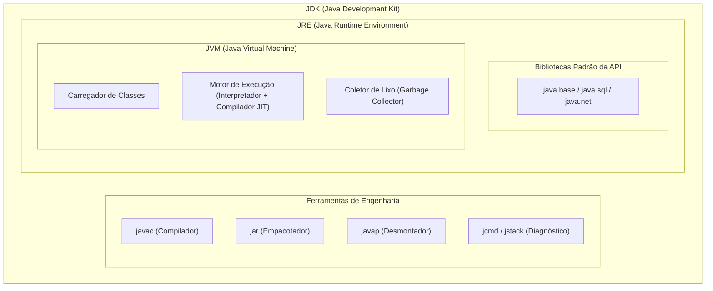
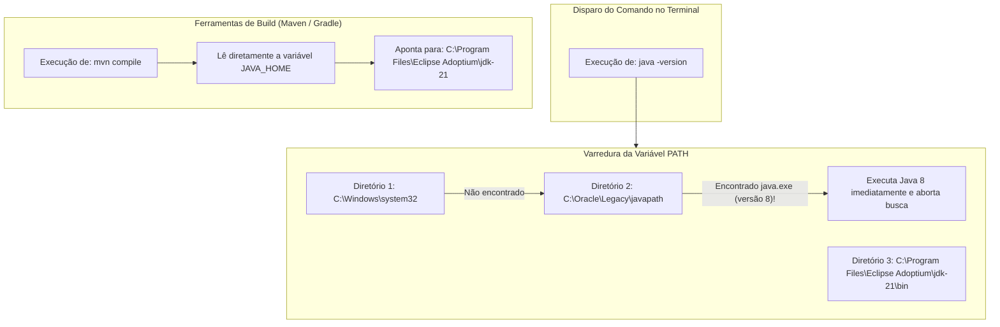
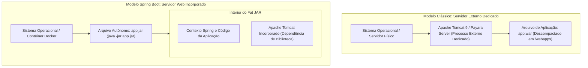
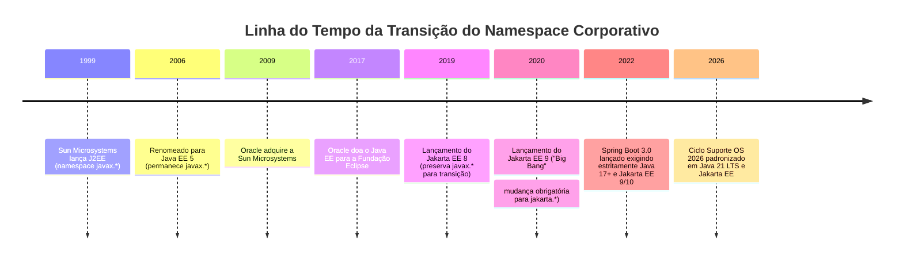
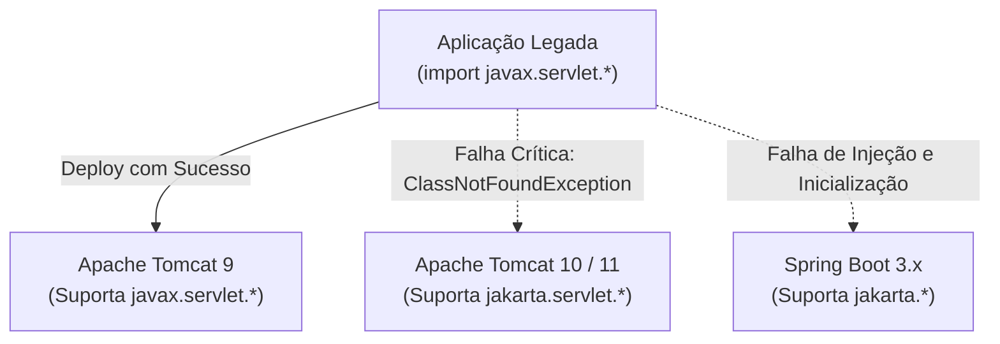
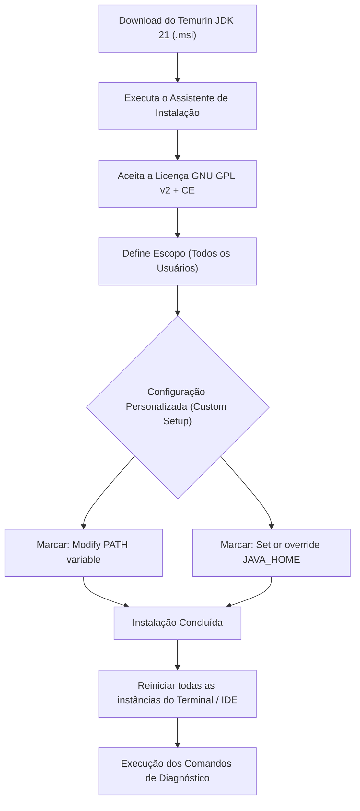
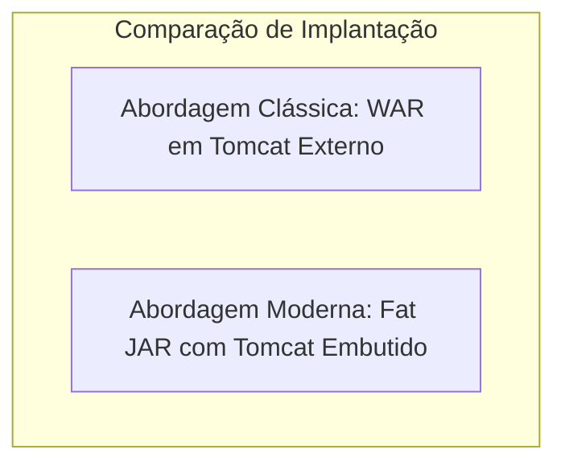
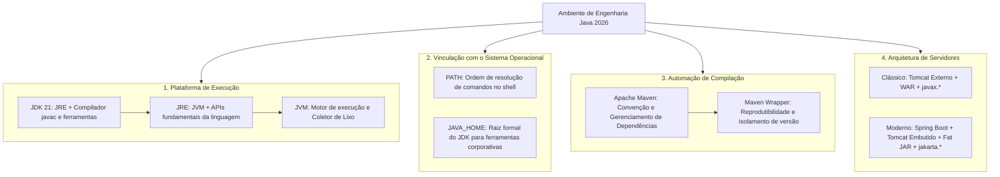

# Aula 01 — Configuração de Ambiente Java Spring Boot

> **Professor:** Jefferson Passerini  
> **Disciplina:** Laboratório de Programação IV (4º Semestre)  
> **Tema:** Fundamentos da plataforma Java, ferramentas de compilação, variáveis de ambiente e preparação do ecossistema Spring Boot 2026

---

## Sumário

- [Objetivo da aula](#objetivo-da-aula)
- [Contexto e pré-requisitos](#contexto-e-pré-requisitos)
- [Diferenciação entre JDK, JRE e JVM](#diferenciação-entre-jdk-jre-e-jvm)
- [Variáveis de ambiente PATH e JAVA_HOME](#variáveis-de-ambiente-path-e-java_home)
- [Automação de build com Maven e Maven Wrapper (mvnw)](#automação-de-build-com-maven-e-maven-wrapper-mvnw)
- [Contêineres de Servlets, Servidores de Aplicações e Servidores Incorporados](#contêineres-de-servlets-servidores-de-aplicações-e-servidores-incorporados)
- [Migração de pacotes de javax.* para jakarta.*](#migração-de-pacotes-de-javax-para-jakarta)
- [Instalação e verificação do Eclipse Temurin JDK 21](#instalação-e-verificação-do-eclipse-temurin-jdk-21)
- [Instalação e configuração opcional de Tomcat, NetBeans e Maven global](#instalação-e-configuração-opcional-de-tomcat-netbeans-e-maven-global)
- [Código da aula](#código-da-aula)
- [Exercícios](#exercícios)
- [Erros comuns e boas práticas](#erros-comuns-e-boas-práticas)
- [Links e materiais complementares](#links-e-materiais-complementares)
- [Mapa da aula](#mapa-da-aula)
- [Glossário](#glossário)
- [Pontos-chave para a prova](#pontos-chave-para-a-prova)
- [Perguntas e respostas (JSONL)](#perguntas-e-respostas-jsonl)
- [Checklist de revisão](#checklist-de-revisão)

---

## Objetivo da aula

A preparação do ambiente de desenvolvimento Java profissional exige uma compreensão rigorosa dos mecanismos que operam entre a edição do código-fonte e sua execução em produção. Configurar um ambiente não se resume a executar instaladores gráficos em sequência; envolve o entendimento da responsabilidade de cada componente de software, da resolução de chamadas pelo sistema operacional e da integridade da cadeia de compilação.

Ao concluir o estudo desta aula, o estudante deverá ser capaz de:

1. Distinguir com precisão técnica a Máquina Virtual Java (JVM), o Ambiente de Execução Java (JRE) e o Kit de Desenvolvimento Java (JDK), mapeando-os às fases de compilação, carga e execução.
2. Articular as funções complementares e limites operacionais da IDE (Ambiente Integrado de Desenvolvimento), das ferramentas de automação de build e dos servidores web.
3. Inspecionar e validar as versões do Java selecionadas pelo terminal do sistema operacional, pelas ferramentas de compilação (Maven) e pelos metadados de configuração do projeto.
4. Diagnosticar inconsistências e conflitos causados pela divergência entre as variáveis de ambiente `JAVA_HOME` e `PATH`.
5. Comparar criticamente as arquiteturas de servidores web externos (contêineres de servlets clássicos), servidores corporativos de aplicações (Jakarta EE) e contêineres web incorporados (*embedded servers*).
6. Analisar o impacto arquitetural e as quebras de contrato binário decorrentes da transição do namespace legado `javax.*` para o namespace contemporâneo `jakarta.*`.
7. Justificar o emprego do Maven Wrapper (`mvnw`) como garantia de reprodutibilidade e neutralidade de ambiente em projetos corporativos colaborativos e esteiras de Integração Contínua (CI).
8. Instalar, configurar e auditar o ambiente de desenvolvimento obrigatório para o ciclo letivo de 2026, centrado no Eclipse Temurin JDK 21 e no ecossistema Spring Boot.
9. Aplicar métodos científicos de diagnóstico baseados em evidências (mensagens de erro, inspeção de variáveis, tabelas de processos e portas de rede), eliminando ações baseadas em tentativas aleatórias.

---

## Contexto e pré-requisitos

O curso de Laboratório de Programação IV do ciclo 2026 adota como espinha dorsal o desenvolvimento de microsserviços e sistemas web corporativos com **Java 21 LTS** e o framework **Spring Boot**. O projeto prático desenvolvido ao longo do semestre denomina-se **Suporte OS 2026**.

O material didático preserva, para fins de contextualização histórica e comparação de modelos arquiteturais, o roteiro de configuração voltado ao modelo clássico de páginas JSP (*JavaServer Pages*), contêiner de servlets Apache Tomcat externo, servidor corporativo Payara e IDE Apache NetBeans. Esse modelo ainda é amplamente encontrado na manutenção de sistemas legados e na base da especificação Jakarta EE. Contudo, a trilha principal e obrigatória do curso foca na autonomia de microsserviços modernos com servidores incorporados.

### Pré-requisitos técnicos

- Acesso com privilégios de administrador no sistema operacional local (ou autorização institucional nos laboratórios de informática).
- Sistema operacional Windows (com terminal PowerShell 5.1 ou PowerShell Core 7.x) ou sistemas baseados em Unix (macOS ou distribuições Linux com Bash/Zsh).
- Conexão estável com a internet para download de pacotes binários e sincronização de dependências a partir do repositório Maven Central.
- Espaço em disco disponível de, no mínimo, 5 GB para alocação do JDK, dependências locais em cache (`.m2/repository`), binários de IDE e arquivos temporários.

### Matriz de decisão tecnológica (Suporte OS 2026)

| Componente | Trilha Suporte OS 2026 | Trilha Clássica / Legada | Justificativa Técnica |
|---|---|---|---|
| **Eclipse Temurin JDK 21** | Obrigatório | Opcional | Distribuição OpenJDK com suporte de longo prazo (LTS), alta estabilidade e conformidade com os testes TCK. |
| **IntelliJ IDEA** | Obrigatório (roteiro principal) | Opcional | Suporte avançado à inspeção de código Spring, injeção de dependências e perfilamento de aplicações. |
| **Maven Wrapper (`mvnw`)** | Obrigatório | Opcional | Garante que o projeto baixe e execute uma versão estrita do Maven sem depender da máquina do desenvolvedor. |
| **Tomcat Incorporado** | Obrigatório (via Spring Boot) | Não aplicável | Servidor HTTP empacotado no interior do arquivo `.jar` executável; simplifica a esteira de implantação. |
| **Tomcat 9 Externo** | Não utilizado | Trilha JSP / Servlets | Contêiner independente baseado na especificação legada Java EE (`javax.servlet`). |
| **Payara Server 6** | Não utilizado | Trilha Jakarta EE | Servidor de aplicação completo (EJB, JMS, JTA) compatível com a plataforma corporativa completa. |
| **Apache NetBeans 24** | Opcional | Trilha JSP / Servlets | IDE tradicional para desenvolvimento Java SE e Java EE com suporte direto a servidores externos. |
| **Maven Global** | Opcional | Opcional | Útil para tarefas ad-hoc no terminal em projetos desprovidos de wrapper. |

---

## Diferenciação entre JDK, JRE e JVM

### Definições estruturais

A arquitetura da linguagem Java assenta-se sobre o paradigma de compilação híbrida: o código-fonte humano é compilado para um formato intermediário independente de máquina e, posteriormente, interpretado ou compilado para código de máquina nativo em tempo de execução. Para viabilizar esse fluxo, a plataforma divide-se em três camadas concêntricas:

1. **JVM (Java Virtual Machine):** A máquina abstrata que gerencia a execução dos programas. Suas atribuições incluem a interpretação do bytecode, compilação *Just-In-Time* (JIT) de trechos críticos de código para linguagem de máquina nativa do processador, alocação e liberação de memória dinâmica através do Coletor de Lixo (*Garbage Collector*) e verificação de segurança das instruções. A JVM não existe como arquivo solto; trata-se de um conjunto de bibliotecas e processos nativos específicos para cada sistema operacional e arquitetura de hardware (ex.: `jvm.dll` no Windows, `libjvm.so` no Linux).
2. **JRE (Java Runtime Environment):** O ambiente de execução consolidado. É formado pela JVM somada ao conjunto completo de bibliotecas padrão da API Java (como pacotes de coleções `java.util`, rede `java.net`, entrada/saída `java.io`, processamento paralelo e concorrência). Um ambiente que contenha apenas a JRE é capaz de executar qualquer aplicação empacotada em arquivos `.class` ou `.jar`, mas é incapaz de compilar novos códigos-fonte.
3. **JDK (Java Development Kit):** O superconjunto voltado aos engenheiros de software. Além de conter integralmente uma JRE para testes e execução local, o JDK disponibiliza ferramentas de diagnóstico, inspeção e compilação de código-fonte:
   - `javac`: compilador de código Java para bytecode;
   - `jar`: ferramenta de empacotamento e arquivamento;
   - `javap`: desmontador (*disassembler*) de bytecode para inspeção e engenharia reversa;
   - `jcmd`, `jstack`, `jmap`: utilitários de monitoramento de memória, fios de execução (*threads*) e despejos de pilha (*stack traces*);
   - `javadoc`: gerador de documentação formal a partir de comentários estruturados.



### Ciclo de compilação e execução

O fluxo de transformação de um código-fonte obedece a duas etapas primárias perfeitamente delimitadas:


### Inspeção prática de bytecode

Para compreender a separação entre o código legível e as instruções da JVM, considere a classe abaixo:

```java
public class Multiplicador {
    public int dobrar(int valor) {
        return valor * 2;
    }
}
```

Ao compilar com `javac Multiplicador.java`, é gerado o arquivo binário `Multiplicador.class`. Ao executar o desmontador do JDK via terminal:

```bash
javap -c Multiplicador
```

A saída decompilada revela as instruções operacionais de pilha executadas pela JVM:

```text
public class Multiplicador {
  public Multiplicador();
    Code:
       0: aload_0
       1: invokespecial #1                  // Method java/lang/Object."<init>":()V
       4: return

  public int dobrar(int);
    Code:
       0: iload_1
       1: iconst_2
       2: imul
       3: ireturn
}
```

*Complemento técnico do instrutor:* Observe que a JVM opera como uma máquina baseada em pilha (*stack-based architecture*). As instruções `iload_1` (empilha o primeiro argumento inteiro), `iconst_2` (empilha a constante 2), `imul` (consome os dois valores do topo da pilha, realiza a multiplicação e empilha o produto) e `ireturn` (retorna o valor inteiro no topo da pilha) operam de forma idêntica independentemente do processador subjacente ser Intel, AMD ou Apple Silicon.

### Tabela comparativa de responsabilidades

| Característica | JVM | JRE | JDK |
|---|---|---|---|
| **Público-alvo** | Sistema de execução | Usuário final / Sistemas em produção | Desenvolvedores de software |
| **Comando principal** | Integrado internamente ao runtime | `java` | `javac`, `java`, `jar`, `javap` |
| **Contém compilador?** | Não | Não | Sim (`javac`) |
| **Capacidade de execução** | Sim (interpreta/compila bytecode) | Sim (completa com APIs básicas) | Sim (contém a JRE internamente) |
| **Obrigatoriedade no curso** | Requisito implícito | Requisito implícito | **Obrigatório (Versão 21)** |

### Contraexemplo e armadilhas comuns

- **Contraexemplo clássico:** Um desenvolvedor baixa um instalador antigo denominado "Java Runtime Environment" (disponível historicamente no site da Oracle para navegadores). Ao abrir o terminal e digitar `java -version`, o comando responde com sucesso. Contudo, ao digitar `javac -version`, o terminal emite o erro `O termo 'javac' não é reconhecido`. O profissional assume erroneamente que o ambiente de desenvolvimento está pronto, mas possui apenas o ambiente de execução.
- **Armadilha de incompatibilidade de versão de bytecode:** Compilar um projeto utilizando um JDK 21 (`major version 65`) e tentar executá-lo em uma JVM legada versão 17 (`major version 61`). O carregador de classes da JVM abortará imediatamente a execução emitindo a falha:
  `java.lang.UnsupportedClassVersionError: Multiplicador has been compiled by a more recent version of the Java Runtime (class file version 65.0), this version of the Java Runtime only recognizes class file versions up to 61.0`.

---

## Variáveis de ambiente PATH e JAVA_HOME

### Resolução de comandos pelo sistema operacional

Quando um desenvolvedor digita um comando qualquer em um terminal de linha de comando (como `java`, `mvn` ou `git`), o interpretador de comandos (PowerShell, Bash ou Zsh) não varre recursivamente todo o disco rígido em busca do executável. O sistema operacional consulta exclusivamente uma lista pré-definida e ordenada de diretórios armazenada na variável de ambiente denominada `PATH`.

- Se o executável desejado estiver presente no primeiro diretório listado no `PATH`, ele é carregado e disparado imediatamente.
- Se o mesmo comando existir em múltiplos diretórios listados no `PATH`, **o primeiro diretório da lista tem precedência absoluta**, tornando os caminhos posteriores completamente ignorados.

Por outro lado, diversas ferramentas e frameworks complexos do ecossistema corporativo (como Maven, Gradle, Apache Tomcat, servidores de integração contínua Jenkins e extensões de IDEs) necessitam acessar bibliotecas internas, arquivos de cabeçalho e módulos que residem no diretório raiz do compilador Java, e não apenas no executável de disparo. Para padronizar essa localização sem depender de adivinhações, convencionou-se o uso da variável de ambiente **`JAVA_HOME`**.



### A disjunção crítica entre PATH e JAVA_HOME

Uma das fontes mais frequentes de falhas ocultas em estações de trabalho de desenvolvedores é o desalinhamento entre o runtime resolvido pelo `PATH` e a raiz apontada por `JAVA_HOME`. Considere o seguinte cenário:

- Um instalador antigo da Oracle inseriu um atalho no diretório `C:\Program Files (x86)\Common Files\Oracle\Java\javapath` e o posicionou no início do `PATH`.
- O desenvolvedor configurou a variável `JAVA_HOME` apontando para o Eclipse Temurin 21: `C:\Program Files\Eclipse Adoptium\jdk-21.0.x-hotspot\`.

**Consequência prática:**
Ao rodar `java -version` no terminal, o usuário visualiza uma JVM 1.8 legada. Ao executar uma ferramenta de automação de build ou um script Maven que leia `JAVA_HOME`, a compilação utiliza o compilador Java 21. Se houver dependência de bibliotecas de tempo de execução ou validação de opções de linha de comando da JVM, a aplicação quebra em tempo de teste ou emissão de pacotes.

### Comandos de verificação e auditoria

Para diagnosticar o estado real do ambiente, o engenheiro deve inspecionar as variáveis e as rotas dos binários.

#### No ambiente Windows (PowerShell)

```powershell
# 1. Verifica a versão do runtime em uso no terminal
java -version

# 2. Verifica a versão do compilador em uso no terminal
javac -version

# 3. Revela todos os caminhos no PATH que contêm o binário java.exe
where.exe java

# 4. Revela todos os caminhos no PATH que contêm o compilador javac.exe
where.exe javac

# 5. Exibe o valor exato registrado na variável JAVA_HOME
$env:JAVA_HOME
```

#### No ambiente Unix (macOS e Linux)

```bash
# 1. Verifica a versão do runtime
java -version

# 2. Verifica a versão do compilador
javac -version

# 3. Inspeciona a localização física do binário resolvido
which java
which javac

# 4. Exibe o valor registrado na variável JAVA_HOME
echo "$JAVA_HOME"
```

### Configuração programática em scripts de inicialização

*Complemento técnico do instrutor:* Em sistemas operacionais baseados em Unix, é uma prática recomendada fixar as variáveis de ambiente nos arquivos de perfil do usuário (`~/.bashrc` ou `~/.zshrc`). No macOS, o utilitário nativo `/usr/libexec/java_home` permite selecionar dinamicamente a versão instalada desejada:

```bash
# Adicionar ao ~/.zshrc ou ~/.bashrc
export JAVA_HOME=$(/usr/libexec/java_home -v 21)
export PATH=$JAVA_HOME/bin:$PATH
```

No Windows, para persistir a variável via PowerShell administrativo:

```powershell
[Environment]::SetEnvironmentVariable("JAVA_HOME", "C:\Program Files\Eclipse Adoptium\jdk-21.0.x-hotspot", [EnvironmentVariableTarget]::Machine)
```

---

## Automação de build com Maven e Maven Wrapper (mvnw)

### O papel de uma ferramenta de automação de build

Em projetos acadêmicos introdutórios, a compilação de poucos arquivos pode ser conduzida manualmente invocando o compilador diretamente (`javac *.java`). Em sistemas corporativos modernos, esse processo é inviável devido a:

- Dezenas ou centenas de bibliotecas externas interdependentes (*dependências transitivas*).
- Necessidade de isolamento entre código de produção e código de teste unitário/integração.
- Processamento automatizado de recursos (arquivos `.properties`, esquemas de validação, migrações de banco de dados).
- Empacotamento estruturado em formatos compactados executáveis (`.jar` ou `.war`).

O **Apache Maven** atua como uma ferramenta padronizada de automação de construção (*build tool*) orientada pelo princípio de **Convenção sobre Configuração** (*Convention over Configuration*). Em vez de exigir que o engenheiro escreva scripts procedurais imperativos dizendo *como* copiar arquivos e *como* invocar o compilador, o Maven estabelece uma estrutura rígida de diretórios e um arquivo descritor declarativo em XML denominado **`pom.xml`** (*Project Object Model*).

### Estrutura padronizada de um projeto Maven

Qualquer projeto gerenciado pelo Maven adota a seguinte topologia padrão de diretórios:

```text
meu-projeto/
├── pom.xml                   # Metadados, dependências e plugins
├── mvnw                      # Script de execução do Maven Wrapper para Unix/macOS
├── mvnw.cmd                  # Script de execução do Maven Wrapper para Windows
├── .mvn/
│   └── wrapper/
│       ├── maven-wrapper.jar
│       └── maven-wrapper.properties # Definição da versão do Maven a ser baixada
└── src/
    ├── main/
    │   ├── java/             # Código-fonte principal de produção da aplicação
    │   └── resources/        # Configurações de runtime (application.properties, etc.)
    └── test/
        ├── java/             # Códigos-fonte de testes automatizados (JUnit, Mockito)
        └── resources/        # Configurações específicas para execução dos testes
```

### O ciclo de vida de build do Maven

O ciclo de vida padrão do Maven é estruturado em fases ordenadas. A execução de uma fase subsequente implica obrigatoriamente a execução com sucesso de todas as fases precedentes:


| Fase do Ciclo | Descrição e Ação Operacional |
|---|---|
| `validate` | Verifica a integridade estrutural do `pom.xml` e a disponibilidade dos diretórios essenciais. |
| `compile` | Invoca o `javac` sobre os arquivos localizados em `src/main/java` e grava os `.class` em `target/classes`. |
| `test` | Compila o código de teste em `src/test/java` e executa os testes unitários via Surefire Plugin. |
| `package` | Agrupa os `.class` compilados e os recursos processados no artefato final (ex.: `.jar`). |
| `verify` | Executa testes de integração e verificações de qualidade pós-empacotamento. |
| `install` | Copia o artefato compilado para o repositório local do usuário (`~/.m2/repository`). |
| `deploy` | Publica o artefato em um repositório remoto corporativo compartilhado (Nexus, Artifactory). |

### O Maven Wrapper (`mvnw`): garantia de reprodutibilidade

Um dos riscos mais graves na engenharia de software em equipe é a disparidade de versões de ferramentas entre os integrantes do time ou entre o ambiente do desenvolvedor e o servidor de CI/CD (*Continuous Integration*). 

Se o desenvolvedor A compila o projeto utilizando o Apache Maven 3.9.9 instalado globalmente no sistema operacional e o desenvolvedor B possui o Maven 3.6.3, comportamentos divergentes na resolução de dependências ou bugs já corrigidos de plugins podem fazer com que um build tenha sucesso em uma máquina e falhe na outra.

O **Maven Wrapper** resolve esse problema ao versionar a própria ferramenta de automação junto com o código-fonte:

1. O repositório armazena scripts executáveis leves (`mvnw` para sistemas POSIX e `mvnw.cmd` para Windows), acompanhados por um descritor de configuração (`.mvn/wrapper/maven-wrapper.properties`).
2. O desenvolvedor **não necessita instalar o Maven globalmente** no sistema operacional.
3. Ao executar `./mvnw compile` (ou `mvnw.cmd compile`), o wrapper inspeciona o cache local do usuário (`~/.m2/wrapper/dists`).
4. Se a versão exata do Maven especificada nas propriedades do projeto não estiver presente, o script faz o download seguro da distribuição oficial, valida o checksum, armazena-a em cache e delega a compilação para ela.

```properties
# Exemplo de conteúdo do .mvn/wrapper/maven-wrapper.properties
distributionUrl=https://repo.maven.apache.org/maven2/org/apache/maven/apache-maven/3.9.9/apache-maven-3.9.9-bin.zip
wrapperUrl=https://repo.maven.apache.org/maven2/org/apache/maven/wrapper/maven-wrapper/3.2.0/maven-wrapper-3.2.0.jar
```

---

## Contêineres de Servlets, Servidores de Aplicações e Servidores Incorporados

### A evolução da hospedagem de aplicações web Java

Para compreender a arquitetura do Spring Boot, é mandatório estudar a evolução do modelo de execução web da plataforma Java, contrastando a abordagem clássica de contêineres externos com o padrão contemporâneo de serviços autossuficientes.



### Taxonomia dos ambientes de execução

#### 1. Contêiner de Servlets (*Servlet Container*)

Um servidor web especializado em processar requisições HTTP e despachá-las para componentes Java que implementam a especificação de Servlets (como `HttpServlet`). O contêiner gerencia o ciclo de vida do Servlet (inicialização via `init()`, atendimento a requisições concorrentes via `service()`, `doGet()`, `doPost()`, e destruição via `destroy()`), gerenciamento de sessões de usuário (`HttpSession`) e decodificação do protocolo HTTP.
- **Exemplo proeminente:** Apache Tomcat, Eclipse Jetty.
- **Formato clássico de distribuição:** Arquivo `.war` (*Web Application Archive*) implantado manualmente na pasta `webapps` de uma instalação externa pré-existente do Tomcat.

#### 2. Servidor de Aplicações (*Application Server*)

Uma infraestrutura de software mais abrangente que implementa o conjunto integral das especificações corporativas Java (anteriormente J2EE, depois Java EE e atualmente Jakarta EE). Além de um contêiner de servlets, um servidor de aplicações fornece suporte nativo a transações distribuídas (JTA), chamadas assíncronas via filas de mensageria (JMS), injeção de dependência avançada (CDI), componentes transacionais de negócio (EJB) e serviços de governança/administração via console web integrada.
- **Exemplos proeminentes:** Payara Server, WildFly (anteriormente JBoss AS), IBM Open Liberty, Oracle WebLogic.
- **Portas e domínios:** Tradicionalmente organizam-se em domínios administrativos (ex.: porta `4848` no Payara para o *Domain Administration Server* - DAS, e porta `8080` para as aplicações de usuário).

#### 3. Servidor Web Incorporado (*Embedded Server*)

No ecossistema moderno, especialmente consagrado pelo Spring Boot, inverteu-se a relação entre a aplicação e o servidor. Em vez de exigir que o administrador do sistema instale e configure um servidor Tomcat no sistema operacional e copie o código para dentro dele, **o próprio servidor Tomcat é empacotado como uma dependência de biblioteca (`.jar`) no interior da aplicação**.
- **Mecanismo de execução:** A aplicação possui um método clássico `public static void main(String[] args)`. Ao ser executada via comando `java -jar aplicacao.jar`, a aplicação inicializa o contexto Spring, instancia programaticamente o servidor Tomcat na memória, abre a porta TCP correspondente (por padrão `8080`) e mapeia o servlet despachante (`DispatcherServlet`) para receber o tráfego HTTP.

### Tabela comparativa de modelos de execução

| Critério | Contêiner Externo (Tomcat 9) | Servidor de Aplicação (Payara 6) | Servidor Incorporado (Spring Boot 3) |
|---|---|---|---|
| **Formato de pacote** | `.war` | `.ear` ou `.war` | `.jar` executável (*Fat JAR*) |
| **Instalação do servidor** | Requer instalação prévia no SO | Requer instalação e domínio no SO | Zero instalação; embutido na biblioteca |
| **Comando de inicialização** | Scripts do servidor (`startup.bat`/`.sh`) | Scripts de domínio (`asadmin start-domain`) | `java -jar aplicacao.jar` |
| **Configuração de portas** | Arquivo `server.xml` do servidor | Console administrativo (`:4848`) | Arquivo `application.properties` |
| **Isolamento de ambiente** | Múltiplas aplicações no mesmo Tomcat | Múltiplas aplicações no mesmo domínio | Uma aplicação por processo isolado |
| **Aderência a contêineres Docker**| Baixa (exige imagem base com Tomcat) | Baixa a moderada | **Ótima (ideal para nuvem e microsserviços)** |

---

## Migração de pacotes de javax.* para jakarta.*

### Contexto histórico e conflito jurídico

A transição dos pacotes corporativos do Java representa uma das maiores migrações de infraestrutura na história da linguagem.

Originalmente desenvolvida pela Sun Microsystems, a plataforma corporativa denominava-se **J2EE** (*Java 2 Platform, Enterprise Edition*). Quando a Oracle Corporation adquiriu a Sun em 2009, a nomenclatura foi alterada para **Java EE** (*Java Platform, Enterprise Edition*), mantendo todos os contratos de APIs sob o namespace de pacotes `javax.*` (como `javax.servlet.*`, `javax.persistence.*`, `javax.ws.rs.*`).

Em 2017, a Oracle decidiu transferir a liderança e a evolução da plataforma Java corporativa para uma entidade de código aberto neutra: a **Fundação Eclipse** (*Eclipse Foundation*). No entanto, um entrave legal impôs uma barreira crítica: **a Oracle manteve a titularidade da marca registrada "Java" e dos direitos sobre o prefixo de pacotes `javax`**. 

Como a Fundação Eclipse não obteve autorização legal para continuar criando ou modificando classes sob o pacote `javax.*`, a comunidade rebatizou a plataforma para **Jakarta EE**. A partir da especificação **Jakarta EE 9** (e consolidada no Jakarta EE 10), realizou-se a denominada *"Big Bang Migration"*: **todos os pacotes da especificação oficial foram renomeados de `javax.*` para `jakarta.*`**.



### O impacto de compatibilidade e contratos de API

Essa alteração de namespace **não representa uma simples mudança cosmética de importação**: ela constitui uma **quebra estrita de compatibilidade binária**. 

Uma classe compilada no Java EE clássico referencia em sua tabela de símbolos e no cabeçalho do bytecode a classe `javax.servlet.http.HttpServlet`. Se essa classe for implantada em um contêiner web atual (como Apache Tomcat 10 ou 11) ou se for executada no Spring Boot 3.x, o ambiente de execução não possui mais a classe `javax.servlet.http.HttpServlet` em seu classpath, mas sim a classe `jakarta.servlet.http.HttpServlet`.



### Comparação de código-fonte entre namespaces

Considere a declaração de um filtro de requisições web.

#### Abordagem Legada (Java EE / Tomcat 9 / Spring Boot 2.x)

```java
package br.unifef.legado;

// Pacote herdado da Oracle / Sun Microsystems
import javax.servlet.Filter;
import javax.servlet.FilterChain;
import javax.servlet.ServletException;
import javax.servlet.ServletRequest;
import javax.servlet.ServletResponse;
import java.io.IOException;

public class LogFiltroLegado implements Filter {
    @Override
    public void doFilter(ServletRequest request, ServletResponse response, FilterChain chain)
            throws IOException, ServletException {
        // Lógica de interceptação legada
        chain.doFilter(request, response);
    }
}
```

#### Abordagem Contemporânea (Jakarta EE / Tomcat 10+ / Spring Boot 3.x)

```java
package br.unifef.moderno;

// Pacote da Fundação Eclipse exigido no curso 2026
import jakarta.servlet.Filter;
import jakarta.servlet.FilterChain;
import jakarta.servlet.ServletException;
import jakarta.servlet.ServletRequest;
import jakarta.servlet.ServletResponse;
import java.io.IOException;

public class LogFiltroModerno implements Filter {
    @Override
    public void doFilter(ServletRequest request, ServletResponse response, FilterChain chain)
            throws IOException, ServletException {
        // Lógica de interceptação compatível com Java 21 e Spring Boot 3
        chain.doFilter(request, response);
    }
}
```

### Tabela de mapeamento de versões e tecnologias

| Especificação | Namespace | Servidor Tomcat Compatível | Versão Spring Boot | Versão Java Mínima |
|---|---|---|---|---|
| **Java EE 8** | `javax.*` | Apache Tomcat 9.0.x | Spring Boot 2.7.x (e anteriores) | Java 8 ou 11 |
| **Jakarta EE 9** | `jakarta.*` | Apache Tomcat 10.0.x (transição) | Versões intermediárias | Java 8 ou 11 |
| **Jakarta EE 10** | `jakarta.*` | Apache Tomcat 10.1.x | Spring Boot 3.0.x até 3.3.x | Java 17 ou **Java 21 (Nosso padrão)** |
| **Jakarta EE 11** | `jakarta.*` | Apache Tomcat 11.0.x | Spring Boot 3.4+ / 4.x futuro | **Java 21 LTS** |

---

## Instalação e verificação do Eclipse Temurin JDK 21

### Procedimento de instalação no Windows

O projeto Suporte OS 2026 requer estritamente o **Eclipse Temurin JDK 21**. O Eclipse Temurin é a distribuição de binários do OpenJDK mantida pelo grupo de trabalho Adoptium da Fundação Eclipse, auditada e certificada pelos testes oficiais da suíte TCK (*Technology Compatibility Kit*).

1. **Acesso ao Portal Oficial:** Navegue até o endereço oficial da Adoptium: [https://adoptium.net/](https://adoptium.net/).
2. **Seleção de Parâmetros:** Clique na opção de seleção de plataformas (*Other platforms and versions*) e estabeleça a seguinte matriz de filtros:
   - **Operating System:** Windows
   - **Architecture:** x64 (ou aarch64 caso utilize processadores ARM)
   - **Package Type:** JDK
   - **Version:** 21 – LTS
3. **Download do Instalador:** Opte pelo instalador no formato `.msi` (aproximadamente 160 a 170 MB), que inclui a automação de registro no sistema operacional.
4. **Execução do Assistente:**
   - **Tela 1 (Welcome):** Clique em *Next*.
   - **Tela 2 (License Agreement):** Aceite os termos da licença pública GNU General Public License v2 com *Classpath Exception*.
   - **Tela 3 (Installation Scope):** Selecione *Install for all users of this machine* caso possua privilégios administrativos no computador pessoal.
   - **Tela 4 (Custom Setup):** Esta etapa é crítica. O instalador apresenta uma árvore de componentes configuráveis:
     - *JDK with Hotspot*: O núcleo do JDK (deixar ativado).
     - *Modify PATH variable*: Altera a variável `PATH` do sistema para incluir o diretório `bin` do Temurin (certifique-se de que esteja marcado com *Will be installed on local hard drive*).
     - *Associate .jar*: Associa a extensão de arquivos `.jar` ao comando `javaw.exe`.
     - *Set or override JAVA_HOME variable*: **Obrigatório.** Por padrão, alguns instaladores deixam essa opção desmarcada. Altere explicitamente para *Will be installed on local hard drive* para que o instalador crie e aponte a variável `JAVA_HOME` automaticamente.
   - **Tela 5 (Ready to install):** Clique em *Install*, aprove a elevação de privilégios do Controle de Conta de Usuário (UAC) e aguarde o término da cópia dos arquivos.



### Validação rigorosa pós-instalação

Após a conclusão da instalação, **todas as janelas abertas do terminal (PowerShell, CMD, Bash) e IDEs devem ser fechadas e reabertas**. Variáveis de ambiente são carregadas pelo processo do shell no momento de sua criação; processos já em execução mantêm cópias congeladas das variáveis anteriores.

Abra uma nova janela do PowerShell e execute o roteiro de verificação:

```powershell
# Validação da JVM ativa
java -version

# Validação do compilador ativo
javac -version

# Auditoria da variável JAVA_HOME
$env:JAVA_HOME
```

**Resultado esperado para o ano letivo de 2026:**
- O comando `java -version` deve conter `openjdk version "21.0.x"` e a identificação `OpenJDK Runtime Environment Temurin-21.0.x`.
- O comando `javac -version` deve retornar exatamente `javac 21.0.x`.
- A variável `$env:JAVA_HOME` deve imprimir o caminho absoluto válido para a pasta de instalação (ex.: `C:\Program Files\Eclipse Adoptium\jdk-21.0.x-hotspot\`).

---

## Instalação e configuração opcional de Tomcat, NetBeans e Maven global

> As ferramentas descritas nesta seção constituem a **trilha opcional e legada** documentada para permitir comparações pedagógicas com a arquitetura Jakarta EE / JSP clássica. O projeto principal Suporte OS 2026 **dispensa** a instalação do Apache Tomcat externo, do Payara Server, do Apache NetBeans e do Maven global.

### Instalação do Apache Tomcat 9.0.x

Para aplicações legadas que utilizam o namespace `javax.servlet.*`, o Apache Tomcat versão 9 é o contêiner de servlets de referência.

1. **Obtenção do Pacote:** Download do arquivo comprimido do Tomcat 9 (ex.: versão estável `9.0.102` ou similar da família 9) na modalidade *32-bit/64-bit Windows Service Installer* ou *zip*.
2. **Alocação de Diretório:** No caso de arquivo compactado em `.zip`, extrair a pasta `apache-tomcat-9.0.x` diretamente na raiz do disco primário, formando o caminho padrão: `C:\apache-tomcat-9.0.x`.
3. **Propósito da Estrutura:**
   - Pasta `bin/`: Contém os scripts operacionais de inicialização (`startup.bat` para Windows, `startup.sh` para Unix) e desligamento (`shutdown.bat`/`.sh`).
   - Pasta `conf/`: Contém arquivos de configuração arquitetural, como `server.xml` (portas de escuta HTTP e conectores) e `tomcat-users.xml` (credenciais de acesso aos consoles administrativos).
   - Pasta `webapps/`: O diretório de implantação onde os pacotes compactados no formato `.war` são depositados para expansão e execução.

### Instalação do Apache NetBeans 24

O Apache NetBeans é uma IDE histórica do ecossistema Java, originalmente criada na República Tcheca, adquirida pela Sun Microsystems, transferida à Oracle e posteriormente doada à Fundação Apache em 2016.

1. **Instalação Básica:** Execução do instalador do NetBeans 24 (`Apache-NetBeans-24-bin-windows-x64.exe`).
2. **Seleção de Pacotes:** Por padrão, o instalador seleciona os módulos *Base IDE*, *Java SE*, *Java EE*, *HTML5/JavaScript* e *PHP*, ocupando aproximadamente 1 GB de armazenamento em disco.
3. **Definição de JDK:** Durante o assistente, o instalador requisita a indicação explícita da raiz do JDK. Deve-se apontar para o JDK 21 configurado previamente.
4. **Ativação e Configuração dos Módulos Internos:** No primeiro acesso, através do menu `Tools -> Options`, é necessário navegar pelas abas para ativar os analisadores de código e subsistemas:
   - Aba `Java -> Ant`, `Maven`, `Gradle`: Gerenciamento das ferramentas de compilação integradas.
   - Aba `Java -> JavaFX`: Instalação do módulo de interface gráfica caso solicitado pelo assistente de plugins.
   - Aba `Java -> Java Shell`: Configuração do ambiente interativo JShell atrelado ao JDK padrão.
5. **Registro de Servidores no NetBeans (`Tools -> Servers`):**
   - **Payara Server:** O assistente permite baixar automaticamente os binários corporativos do Payara (ex.: versão 6.x), criando um domínio administrativo (`domain1`) com portas padronizadas em `4848` (administração DAS) e `8080` (tráfego HTTP).
   - **Apache Tomcat:** O NetBeans requisita o caminho *Catalina Home* (onde o Tomcat foi extraído em `C:\apache-tomcat-9.0.x`) e a criação de credenciais para um usuário dotado da permissão `manager-script` para automação de deploy.

### Instalação opcional do Apache Maven Global

Caso o desenvolvedor necessite utilizar o Maven fora de projetos que forneçam o Maven Wrapper:

1. **Download:** Obtenção do arquivo binário compactado `apache-maven-3.9.x-bin.zip` a partir do repositório oficial da Fundação Apache (`https://maven.apache.org/download.cgi`).
2. **Extração:** Descompactação na raiz do disco do sistema, resultando na pasta `C:\apache-maven-3.9.x`.
3. **Configuração de Variáveis de Ambiente:**
   - Adicionar uma nova variável de sistema `MAVEN_HOME` (ou `M2_HOME`) com o valor: `C:\apache-maven-3.9.x`.
   - Localizar a variável `PATH` do sistema e adicionar uma nova linha com o caminho da pasta de binários: `C:\apache-maven-3.9.x\bin`.
4. **Auditoria:** Abrir um novo terminal e digitar `mvn -version`. A resposta deve listar a versão do Maven, o caminho da instalação e a versão do JDK que ele identificou a partir do `JAVA_HOME`.

---

## Código da aula

Para garantir que a verificação do ambiente seja conduzida de forma programática e independente de interpretações visuais de comandos do sistema operacional, foram desenvolvidos dois programas Java disponíveis no diretório do projeto:

- [`./codigo/DiagnosticoAmbiente.java`](file:///Users/murilodev/.gemini/antigravity-cli/scratch/codigo/DiagnosticoAmbiente.java)
- [`./codigo/ResolucaoExercicios.java`](file:///Users/murilodev/.gemini/antigravity-cli/scratch/codigo/ResolucaoExercicios.java)

### 1. Classe de diagnóstico de ambiente: `DiagnosticoAmbiente.java`

Esta classe utiliza a API interna de propriedades de sistema (`System.getProperty`) e leitura de variáveis de ambiente (`System.getenv`) para emitir um relatório completo e tabular sobre as capacidades do ambiente Java em tempo de execução.

#### Trecho essencial comentado linha a linha

```java
package br.unifef.aula01;

import java.io.File;

public class DiagnosticoAmbiente {
    public static void main(String[] args) {
        System.out.println("==========================================================");
        System.out.println("   RELATÓRIO DE AUDITORIA DO AMBIENTE JAVA - CICLO 2026   ");
        System.out.println("==========================================================");

        // 1. Obtém a versão da especificação e do runtime da JVM em execução
        String javaVersion = System.getProperty("java.version");
        String javaVendor = System.getProperty("java.vendor");
        String javaHomeProp = System.getProperty("java.home");

        System.out.println("[RUNTIME] Versão da JVM ativa: " + javaVersion);
        System.out.println("[RUNTIME] Fabricante/Distribuição: " + javaVendor);
        System.out.println("[RUNTIME] Diretório do Runtime em execução: " + javaHomeProp);

        // 2. Lê a variável de ambiente do sistema operacional JAVA_HOME
        String javaHomeEnv = System.getenv("JAVA_HOME");
        System.out.println("[SISTEMA] Variável JAVA_HOME: " + 
            (javaHomeEnv != null ? javaHomeEnv : "ALERTA: JAVA_HOME NÃO DEFINIDA!"));

        // 3. Validação de conformidade com o padrão do curso (Java 21)
        if (javaVersion.startsWith("21")) {
            System.out.println("[CONFORMIDADE] OK: O ambiente atende aos requisitos do Java 21 LTS.");
        } else {
            System.err.println("[CONFORMIDADE] ERRO: Versão divergente do Java 21. Detectado: " + javaVersion);
        }

        // 4. Verificação de integridade entre JAVA_HOME e runtime ativo
        if (javaHomeEnv != null) {
            File envPath = new File(javaHomeEnv);
            File propPath = new File(javaHomeProp);
            
            // Em JDKs modernos, java.home coincide com o diretório raiz do JDK
            if (envPath.getAbsolutePath().equalsIgnoreCase(propPath.getAbsolutePath())) {
                System.out.println("[INTEGRIDADE] OK: JAVA_HOME coincide com o runtime da execução atual.");
            } else {
                System.out.println("[INTEGRIDADE] AVISO: Disjunção detectada entre JAVA_HOME e runtime.");
                System.out.println("             JAVA_HOME: " + envPath.getAbsolutePath());
                System.out.println("             Executando de: " + propPath.getAbsolutePath());
            }
        }
        System.out.println("==========================================================");
    }
}
```

### 2. Classe de resolução programática: `ResolucaoExercicios.java`

Esta classe reúne algoritmos de teste de namespace e lógica conceitual para demonstrar via código a resolução dos desafios teóricos da aula.

#### Trecho essencial comentado linha a linha

```java
package br.unifef.aula01;

public class ResolucaoExercicios {

    /**
     * Demonstra a verificação em tempo de execução da presença da API
     * Servlet moderna (Jakarta EE) contra a presença da API legada (Java EE).
     */
    public static void testarCompatibilidadeNamespace() {
        System.out.println("--- Teste de Presença de Contratos de API ---");

        boolean possuiJakarta = verificarClasseNoClasspath("jakarta.servlet.http.HttpServlet");
        boolean possuiJavax = verificarClasseNoClasspath("javax.servlet.http.HttpServlet");

        System.out.println("Suporte ao namespace moderno (jakarta.*): " + possuiJakarta);
        System.out.println("Suporte ao namespace legado (javax.*): " + possuiJavax);

        if (possuiJakarta && !possuiJavax) {
            System.out.println("Ambiente compatível com Spring Boot 3.x e Tomcat 10/11.");
        } else if (possuiJavax && !possuiJakarta) {
            System.out.println("Ambiente legado compatível com Tomcat 9 e Spring Boot 2.x.");
        } else {
            System.out.println("Ambiente neutro ou classpath desprovido de especificações web.");
        }
    }

    /**
     * Utiliza reflexão computacional (Reflection) para inspecionar o ClassLoader
     * sem disparar falhas de compilação caso a biblioteca não exista no projeto.
     */
    private static boolean verificarClasseNoClasspath(String nomeClasseFQN) {
        try {
            Class.forName(nomeClasseFQN);
            return true;
        } catch (ClassNotFoundException e) {
            return false;
        }
    }

    public static void main(String[] args) {
        testarCompatibilidadeNamespace();
    }
}
```

---

## Exercícios

### Exercício 1: Verificação e Diagnóstico de Variáveis de Ambiente

#### Enunciado
Explique formalmente a diferença de responsabilidade entre as variáveis de ambiente `JAVA_HOME` e `PATH` no sistema operacional. Em seguida, descreva uma sequência lógica e ordenada de comandos que um engenheiro de software deve disparar no terminal (PowerShell no Windows ou Bash no Unix) para comprovar que o compilador `javac` e a máquina virtual `java` pertencem estritamente à mesma versão e instalação do JDK 21.

#### Raciocínio Técnico
A variável `PATH` é uma lista de diretórios consultada universalmente pelo interpretador de comandos do sistema operacional para resolver a localização de executáveis genéricos. Sua ordem é sequencial; o primeiro arquivo binário correspondente encontrado encerra a busca. 

A variável `JAVA_HOME`, por outro lado, é um contrato semântico do ecossistema de ferramentas Java (Maven, Gradle, IDEs, contêineres). Ela aponta explicitamente para a pasta raiz de uma instalação completa do JDK, contendo subdiretórios essenciais como `/bin`, `/lib`, `/include` e `/conf`. 

Se o `PATH` apontar para um Java 17 no início da lista, mas o `JAVA_HOME` apontar para o Java 21, o terminal usará o Java 17 para invocações diretas de comandos, enquanto ferramentas corporativas tentarão usar bibliotecas do Java 21, gerando incoerência operacional.

#### Resolução Estruturada
Para validar a paridade de versões e a origem física dos executáveis, o seguinte roteiro em PowerShell deve ser executado:

```powershell
# 1. Conferir a versão reportada pela JVM
java -version

# 2. Conferir a versão reportada pelo compilador
javac -version

# 3. Identificar o binário exato resolvido em primeiro lugar pelo PATH
(where.exe java)[0]
(where.exe javac)[0]

# 4. Inspecionar o valor exato registrado na variável JAVA_HOME
$env:JAVA_HOME

# 5. Validação cruzada: o diretório do binário javac deve coincidir com o subdiretório \bin de JAVA_HOME
$javacDir = Split-Path (where.exe javac)[0]
$expectedDir = Join-Path $env:JAVA_HOME "bin"

if ($javacDir -eq $expectedDir) {
    Write-Host "SUCESSO: javac está perfeitamente alinhado com JAVA_HOME." -ForegroundColor Green
} else {
    Write-Host "FALHA CRÍTICA: Desalinhamento entre PATH e JAVA_HOME!" -ForegroundColor Red
}
```

Código correspondente implementado em: [`./codigo/ResolucaoExercicios.java`](file:///Users/murilodev/.gemini/antigravity-cli/scratch/codigo/ResolucaoExercicios.java).

---

### Exercício 2: Comparação entre Servidores Externos e Servidores Incorporados

#### Enunciado
Compare a arquitetura clássica de implantação de aplicações web Java (baseada em contêiner de servlets externo, como o Apache Tomcat independente, recebendo arquivos `.war`) com a arquitetura moderna adotada pelo Spring Boot (servidor web incorporado em arquivo `.jar`). Apresente duas vantagens e duas desvantagens de cada abordagem no contexto de operações corporativas modernas e orquestração de microsserviços.

#### Raciocínio Técnico
A abordagem clássica assume que a infraestrutura (servidor de aplicação) e a aplicação são entidades desacopladas. O servidor Tomcat é instalado no sistema operacional como um serviço persistente gerenciado pela equipe de infraestrutura, e múltiplos arquivos `.war` de diferentes sistemas são depositados em sua pasta de implantação. 

A abordagem moderna considera que a aplicação é uma unidade autossuficiente e imutável (*12-Factor App*). O servidor web não passa de uma dependência de biblioteca incluída no artefato final. A aplicação gerencia seu próprio ciclo de vida e processo do sistema operacional.

#### Resolução Estruturada



**Abordagem 1: Servidor Externo Dedicado (Apache Tomcat independente com `.war`)**
- *Vantagem 1:* Compartilhamento de recursos de hardware e memória entre múltiplas aplicações pequenas dentro da mesma JVM, reduzindo o consumo de memória ociosa quando se opera servidores físicos dedicados.
- *Vantagem 2:* Atualizações de patches de segurança de rede do servidor Tomcat podem, teoricamente, ser aplicadas no contêiner hospedeiro sem necessidade de recompilar cada aplicação individualmente.
- *Desvantagem 1 (Crítica):* Efeito "vizinho barulhento" (*noisy neighbor*) e acoplamento de ciclo de vida: se uma das aplicações sofrer um vazamento de memória (*Memory Leak*) e estourar a memória com `OutOfMemoryError: Java heap space`, toda a JVM é derrubada, paralisando todas as demais aplicações hospedadas no mesmo Tomcat.
- *Desvantagem 2:* Risco de conflito de classpath e versões de bibliotecas compartilhadas entre sistemas distintos hospedados na mesma instância.

**Abordagem 2: Servidor Incorporado (Spring Boot com `.jar` executável)**
- *Vantagem 1 (Crítica para DevOps e Nuvem):* Isolamento absoluto e perfeita adequação ao paradigma de contêineres Docker e Kubernetes. Cada microsserviço roda em seu próprio processo isolado do sistema operacional; se um processo falhar, apenas aquele pod/contêiner é reiniciado pelo orquestrador.
- *Vantagem 2:* Paridade de ambiente de desenvolvimento e produção (*Dev/Prod Parity*). O desenvolvedor executa localmente exatamente a mesma versão de Tomcat e de configuração que rodará nos servidores de homologação e produção, eliminando o erro clássico "funcionava na minha máquina".
- *Desvantagem 1:* Cada microsserviço carrega sua própria pilha completa de servidor na memória, o que impõe um custo base (*footprint*) ligeiramente maior de consumo de RAM quando se compara a rodar vários sistemas dentro de uma única JVM compartilhada.
- *Desvantagem 2:* Impossibilidade de reconfigurar aspectos de conectores de rede em tempo de execução sem reiniciar o processo da aplicação.

Código correspondente implementado em: [`./codigo/ResolucaoExercicios.java`](file:///Users/murilodev/.gemini/antigravity-cli/scratch/codigo/ResolucaoExercicios.java).

---

### Exercício 3: Impacto da Migração do Namespace javax.* para jakarta.*

#### Enunciado
A partir da versão 10 do Apache Tomcat e da especificação Jakarta EE 9, ocorreu a renomeação oficial dos pacotes de infraestrutura web de `javax.servlet.*` para `jakarta.servlet.*`. Explique detalhadamente:
1. Qual foi a razão jurídica e técnica que forçou essa alteração na indústria.
2. Quais são as consequências operacionais imediatas (em nível de compilação e de execução) de tentar implantar uma biblioteca ou aplicação antiga baseada em `javax.*` em um ambiente Spring Boot 3.x moderno.

#### Raciocínio Técnico
A transferência do Java EE da Oracle para a Fundação Eclipse envolveu a cessão do código-fonte e dos padrões, mas a Oracle reteve os direitos de propriedade intelectual da marca "Java". Isso incluiu a proibição explícita do uso do prefixo `javax` para novas versões de especificações gerenciadas fora do consórcio JCP/Oracle. 

Em nível técnico, como o Java vincula chamadas polimórficas e herança pelo nome totalmente qualificado da classe (*Fully Qualified Name* - FQN), a classe `javax.servlet.Filter` e a classe `jakarta.servlet.Filter` são tipos completamente desconexos e incompatíveis para o carregador de classes da JVM.

#### Resolução Estruturada
1. **Razão Jurídica e Técnica:** A Fundação Eclipse não possuía permissão legal para publicar alterações sob a marca registrada "Java" ou utilizar o prefixo de pacote protegido `javax.*`. A comunidade optou por uma quebra única e coordenada (*Big Bang*) a partir do Jakarta EE 9, migrando todas as APIs oficiais para o pacote raiz `jakarta.*` (ex.: `jakarta.persistence`, `jakarta.annotation`, `jakarta.transaction`, `jakarta.servlet`).
2. **Consequências Práticas:**
   - **Em tempo de compilação:** Se o código-fonte utilizar `import javax.servlet.*` e o projeto Maven declarar dependências modernas (como `spring-boot-starter-web` 3.x, que fornece exclusivamente os artefatos `jakarta.servlet-api`), o compilador `javac` abortará o processo emitindo o erro:
     `error: package javax.servlet does not exist`.
   - **Em tempo de execução:** Se uma biblioteca binária antiga empacotada em `.jar` (compilada com referências a `javax.*`) for adicionada como dependência transitiva em um projeto Spring Boot 3.x, a compilação pode até ser forçada caso dependências antigas estejam presentes, mas a inicialização falhará catastróficamente com:
     `java.lang.NoClassDefFoundError: javax/servlet/http/HttpServletRequest` ou o Spring não reconhecerá os interceptores, causando falha na inicialização do contexto da aplicação.

Código correspondente implementado em: [`./codigo/ResolucaoExercicios.java`](file:///Users/murilodev/.gemini/antigravity-cli/scratch/codigo/ResolucaoExercicios.java).

---

### Exercício 4: Importância da Reprodutibilidade com Maven Wrapper

#### Enunciado
Por que é considerado uma grave falha de governança e engenharia de software exigir que novos desenvolvedores instalem o Apache Maven globalmente no sistema operacional para compilar o projeto da empresa, em vez de exigir o uso do Maven Wrapper (`mvnw` / `mvnw.cmd`) versionado no repositório Git?

#### Raciocínio Técnico
A instalação global de ferramentas de compilação acopla o resultado do processo de geração de software ao estado mutável de cada máquina individual. Diferentes versões do Maven possuem diferentes regras de ordenação de plugins, diferentes parsers de XML, mecanismos divergentes de resolução de conflitos de dependências transitivas e níveis distintos de compatibilidade com versões novas do JDK (por exemplo, Maven versões anteriores à 3.8.6 apresentam advertências ou falhas ao rodar sob o JDK 21).

#### Resolução Estruturada
O uso obrigatório do Maven Wrapper resolve quatro dimensões fundamentais da engenharia de software corporativa:

1. **Reprodutibilidade Estrita de Build (*Deterministic Builds*):** Garante que o desenvolvedor na máquina local, o testador em homologação e a esteira de automação (GitHub Actions, GitLab CI) executem **exatamente o mesmo binário do Maven** (definido no arquivo `.mvn/wrapper/maven-wrapper.properties`), com os mesmos parâmetros de execução e políticas de plugin.
2. **Redução Drástica do Custo de Integração (*Zero-Friction Onboarding*):** Um novo membro que entra na equipe precisa apenas clonar o repositório Git e possuir um JDK compatível instalado. Não é necessário ler manuais complexos de instalação de Maven, configurar caminhos em `PATH` ou disputar permissões de administrador no sistema operacional para instalar binários globais.
3. **Isolamento entre Projetos Distintos:** Um mesmo desenvolvedor pode trabalhar pela manhã em um sistema legado que exige Maven 3.6 e à tarde no projeto Suporte OS 2026 que exige Maven 3.9.9. Com o wrapper, a troca de contexto é imediata e transparente: cada projeto dispara seu próprio script `mvnw`.
4. **Governança e Rastreabilidade de Atualizações:** A atualização da versão do Maven da equipe torna-se uma mudança rastreável no controle de versão (Git). Atualiza-se a propriedade `distributionUrl` em um commit específico, submete-se um *Pull Request*, e todos os desenvolvedores e servidores passam a usar a versão atualizada instantaneamente no próximo `git pull`.

Código correspondente implementado em: [`./codigo/ResolucaoExercicios.java`](file:///Users/murilodev/.gemini/antigravity-cli/scratch/codigo/ResolucaoExercicios.java).

---

## Erros comuns e boas práticas

### 1. Incoerência entre versões do terminal, Maven e IDE

- **Sintoma:** O código compila perfeitamente quando disparado de dentro do IntelliJ IDEA, mas falha com erro de sintaxe ao ser executado no terminal via `./mvnw clean compile`.
- **Causa Raiz:** O IntelliJ IDEA possui uma configuração própria de SDK do projeto (`Project Structure -> Project SDK`) apontada para o JDK 21, mas o terminal do sistema operacional ou a variável `JAVA_HOME` está apontando para um JDK 17 ou 11 instalado anteriormente.
- **Boa Prática:** Sempre padronize o ambiente. Verifique `JAVA_HOME` no sistema e configure o IntelliJ IDEA para usar `Project SDK` como padrão do terminal integrado.

### 2. Disparar `mvn` em vez de `mvnw`

- **Sintoma:** O comando `mvn compile` emite erro de `CommandNotFoundException` no Windows ou executa uma versão desatualizada do Maven instalada globalmente há anos.
- **Causa Raiz:** Falta de adesão ao Maven Wrapper.
- **Boa Prática:** Crie memória muscular operacional: em ambientes de desenvolvimento contemporâneos, utilize exclusivamente `.\mvnw` (PowerShell) ou `./mvnw` (Bash). Nunca dependa do executável `mvn` global.

### 3. Falha ao não reiniciar a sessão do terminal após alterar variáveis

- **Sintoma:** Você executou o instalador do Temurin JDK, marcou a opção para alterar o `PATH` e o `JAVA_HOME`, mas ao rodar `java -version` no terminal aberto, a versão antiga continua sendo exibida.
- **Causa Raiz:** O ambiente de processos do sistema operacional (incluindo shells de terminais e IDEs) herda a tabela de variáveis de ambiente no instante de sua instanciação. Alterações no registro do Windows ou nos arquivos de perfil do Linux não afetam janelas de terminal que já estavam abertas.
- **Boa Prática:** Sempre feche completamente o terminal ou reinicie a IDE após alterar variáveis de sistema.

### 4. Conflito de ocupação de porta de rede (Port 8080 already in use)

- **Sintoma:** Ao iniciar uma aplicação Spring Boot, a execução aborta com a mensagem:
  `Web server failed to start. Port 8080 was already in use.`
- **Causa Raiz:** Outro serviço (como uma instância do Tomcat externo, Oracle XE, ou uma execução anterior do Spring Boot que travou em segundo plano) está com a porta TCP 8080 aberta e alocada.
- **Boa Prática:** Não altere a porta da aplicação como primeira reação. Diagnostique qual processo está ocupando a porta:
  - No Windows: `netstat -ano | findstr :8080` (identifique o PID e finalize-o via Gerenciador de Tarefas ou `taskkill /PID <PID> /F`).
  - No Linux/macOS: `lsof -i :8080` seguido de `kill -9 <PID>`.

### 5. Edição destrutiva de múltiplos JDKs no sistema

- **Sintoma:** O estudante desinstala todas as pastas de Java que encontra no disco rígido para "limpar o computador", corrompendo utilitários institucionais, ferramentas do sistema operacional ou outros projetos.
- **Causa Raiz:** Suposição errônea de que o sistema operacional só pode ter um JDK instalado.
- **Boa Prática:** Múltiplas versões de JDK podem coexistir harmonicamente no mesmo computador. O segredo de engenharia reside em controlar conscientemente qual versão está selecionada por meio das variáveis `JAVA_HOME` e `PATH`, ou através de ferramentas de versionamento de SDKs locais (como o SDKMAN!).

---

## Links e materiais complementares

- **Eclipse Adoptium (Download do Temurin JDK 21 LTS):**  
  [https://adoptium.net/](https://adoptium.net/)  
  *Conteúdo:* Portal oficial de distribuição dos binários certificados e auditados do OpenJDK com suporte de longo prazo mantido pela Fundação Eclipse.
- **Página Oficial do Apache Maven:**  
  [https://maven.apache.org/](https://maven.apache.org/)  
  *Conteúdo:* Documentação arquitetural, guias de convenção de diretórios, referência completa do modelo POM e manuais de plugins.
- **Spring Initializr:**  
  [https://start.spring.io/](https://start.spring.io/)  
  *Conteúdo:* Ferramenta web oficial para geração e inicialização de projetos Spring Boot, gerando a estrutura pronta com Maven Wrapper e dependências declaradas.
- **Documentação da Especificação Jakarta EE:**  
  [https://jakarta.ee/specifications/](https://jakarta.ee/specifications/)  
  *Conteúdo:* Repositório oficial dos padrões abertos corporativos mantidos pela Fundação Eclipse, detalhando a migração do namespace `jakarta.*`.
- **Apache Tomcat (Documentação Oficial):**  
  [https://tomcat.apache.org/](https://tomcat.apache.org/)  
  *Conteúdo:* Manuais técnicos sobre arquitetura de contêineres de servlets, comparativo de versões entre Tomcat 9 (`javax`) e Tomcat 10+ (`jakarta`).

---

## Mapa da aula



---

## Glossário

| Termo | Definição Técnica |
|---|---|
| **Bytecode** | Conjunto de instruções binárias intermediárias e portáveis geradas pelo compilador `javac` para execução no modelo de pilha da JVM. |
| **Coletor de Lixo (Garbage Collector - GC)** | Módulo em segundo plano da JVM responsável por identificar e desalocar automaticamente blocos de memória Heap não mais referenciados. |
| **Compilador JIT (Just-In-Time)** | Mecanismo da JVM que traduz dinamicamente trechos de bytecode altamente requisitados para código de máquina nativo da CPU em tempo de execução. |
| **Convenção sobre Configuração** | Filosofia de projeto em que uma ferramenta assume decisões padrão razoáveis, dispensando o engenheiro de configurar aspectos óbvios da estrutura. |
| **Dependência Transitiva** | Biblioteca exigida não diretamente pelo código do projeto, mas por uma das bibliotecas que o projeto declarou em seu descritor de dependências. |
| **Fat JAR (Uber JAR)** | Arquivo de arquivamento Java executável que agrupa, além das classes do projeto, todas as dependências externas e o servidor web incorporado. |
| **Maven Wrapper (`mvnw`)** | Script leve versionado no repositório que baixa sob demanda e executa uma versão declarada e idêntica do Apache Maven. |
| **Namespace** | Espaço de nomes hierárquico utilizado para agrupar classes e pacotes de software, garantindo identificadores únicos e contratos de compatibilidade. |
| **POM (`pom.xml`)** | *Project Object Model*: Arquivo declarativo em formato XML que descreve a identidade, dependências, plugins e metas de construção de um projeto Maven. |
| **Servlet** | Componente Java gerenciado que intercepta requisições de rede e emite respostas dinâmicas no modelo de protocolo HTTP. |
| **TCK (Technology Compatibility Kit)** | Suíte exaustiva de testes de conformidade mantida para certificar se uma distribuição OpenJDK respeita fielmente os padrões da linguagem. |
| **WAR (Web Application Archive)** | Formato de arquivo compactado estruturado para implantação de aplicações web em servidores e contêineres de servlets externos dedicados. |

---

## Pontos-chave para a prova

- O comando `javac` é a ferramenta de compilação fornecida **exclusivamente pelo JDK**. Ambientes que possuem apenas a JRE possuem o comando `java` (runtime), mas não são capazes de compilar arquivos `.java`.
- O bytecode presente em arquivos `.class` é independente do hardware físico, mas a JVM é dependente da plataforma: cada sistema operacional (Windows, Linux, macOS) requer sua própria implementação de JVM nativa.
- A variável de ambiente `PATH` define a lista ordenada de diretórios onde o sistema operacional busca executáveis. A primeira ocorrência tem precedência absoluta.
- A variável de ambiente `JAVA_HOME` aponta formalmente para o diretório raiz do JDK e é consultada por ferramentas corporativas de automação (Maven, Gradle, servidores).
- Ter o `PATH` apontando para um Java antigo e o `JAVA_HOME` apontando para o Java 21 cria uma **disjunção de ambiente**, onde ferramentas do terminal usam um compilador diferente do esperado pela automação de build.
- O **Maven Wrapper (`mvnw`)** garante a **reprodutibilidade de build**, fazendo com que todo o time e os servidores de integração contínua executem exatamente a mesma versão do Maven sem exigir instalação global prévia.
- O ciclo de vida do Maven é cumulativo e ordenado: invocar a fase `package` executa compulsoriamente as fases `validate`, `compile` e `test`.
- O modelo contemporâneo do Spring Boot adota **servidores web incorporados** (como o Apache Tomcat embutido), empacotando a aplicação como um **Fat JAR executável** via comando `java -jar`, eliminando a necessidade de instalar servidores externos dedicados.
- A migração do namespace **`javax.*` para `jakarta.*`** decorreu da retenção da marca "Java" pela Oracle Corporation ao doar o Java EE para a Fundação Eclipse.
- Aplicações modernas em Spring Boot 3.x e Apache Tomcat 10+ operam estritamente sobre o namespace **`jakarta.*`**, gerando quebra de compatibilidade binária imediata com bibliotecas legadas construídas sob `javax.*`.

---

## Perguntas e respostas (JSONL)

```jsonl
{"pergunta": "Qual a diferença primária entre a JVM, a JRE e o JDK?", "resposta": "A JVM executa bytecode; a JRE reúne a JVM e as bibliotecas padrão de execução; o JDK é o kit completo de desenvolvimento que inclui compilador (javac), empacotador e ferramentas de diagnóstico.", "dificuldade": "baixa"}
{"pergunta": "O que acontece ao tentar compilar um código Java em um computador que possui apenas a JRE instalada?", "resposta": "O comando de compilação javac falha com erro de comando não encontrado, pois o compilador reside exclusivamente no JDK.", "dificuldade": "baixa"}
{"pergunta": "Por que o bytecode gerado pelo comando javac é considerado portável entre diferentes sistemas operacionais?", "resposta": "Porque o bytecode segue um formato binário padrão executado por uma máquina abstrata de pilha (a JVM), que traduz as instruções para o processador real da máquina hospedeira.", "dificuldade": "média"}
{"pergunta": "Qual é a responsabilidade do compilador Just-In-Time (JIT) dentro da JVM?", "resposta": "Compilar dinamicamente trechos críticos de bytecode frequentemente executados diretamente em código de máquina nativo da CPU, acelerando a execução.", "dificuldade": "alta"}
{"pergunta": "Qual a diferença fundamental entre as variáveis de ambiente PATH e JAVA_HOME?", "resposta": "PATH é a lista ordenada de diretórios onde o sistema operacional busca executáveis de comandos; JAVA_HOME é uma convenção que aponta para a raiz da instalação de um JDK específico.", "dificuldade": "média"}
{"pergunta": "O que ocorre se o primeiro diretório listado no PATH apontar para um Java 17 e o JAVA_HOME apontar para o Java 21?", "resposta": "Ocorre uma disjunção de ambiente: o terminal executará comandos Java na versão 17, enquanto ferramentas que leem JAVA_HOME tentarão compilar com o Java 21.", "dificuldade": "média"}
{"pergunta": "Qual comando no PowerShell permite inspecionar todos os caminhos do sistema onde o executável java.exe é encontrado?", "resposta": "where.exe java", "dificuldade": "baixa"}
{"pergunta": "Por que é necessário fechar e reabrir o terminal após a instalação de um novo JDK?", "resposta": "Porque os processos de terminal em execução não atualizam dinamicamente suas tabelas de variáveis de ambiente com alterações feitas no registro do sistema.", "dificuldade": "baixa"}
{"pergunta": "Qual é a estrutura básica padronizada de diretórios de código de um projeto gerenciado pelo Apache Maven?", "resposta": "src/main/java para código de produção, src/main/resources para arquivos de configuração e src/test/java para classes de testes automatizados.", "dificuldade": "baixa"}
{"pergunta": "O que significa dizer que o Maven opera sob o paradigma de Convenção sobre Configuração?", "resposta": "Significa que a ferramenta já estabelece estruturas e etapas padrões de build, dispensando o desenvolvedor de escrever scripts procedurais para tarefas previsíveis.", "dificuldade": "média"}
{"pergunta": "Ao executar o comando ./mvnw package, a fase compile também é executada? Justifique.", "resposta": "Sim, pois as fases do ciclo de vida padrão do Maven são estritamente ordenadas e cumulativas; package depende obrigatoriamente do sucesso de compile e test.", "dificuldade": "média"}
{"pergunta": "Qual a principal vantagem técnica de utilizar o Maven Wrapper (mvnw) em projetos corporativos em equipe?", "resposta": "Garante reprodutibilidade total do build ao fazer com que todos os membros e esteiras de CI utilizem a mesma versão estrita do Maven sem depender de instalação global.", "dificuldade": "média"}
{"pergunta": "Onde fica configurada a versão exata do Maven a ser baixada automaticamente pelo Maven Wrapper?", "resposta": "No arquivo de propriedades .mvn/wrapper/maven-wrapper.properties através do parâmetro distributionUrl.", "dificuldade": "alta"}
{"pergunta": "Como o modelo de servidor web incorporado do Spring Boot difere do modelo clássico de contêiner de servlets externo?", "resposta": "No Spring Boot, o Tomcat é empacotado como uma dependência de biblioteca dentro de um arquivo JAR executável autônomo, em vez de exigir que a aplicação seja empacotada como WAR e copiada para um servidor externo.", "dificuldade": "média"}
{"pergunta": "Qual a porta HTTP padrão aberta pelo servidor web incorporado ao inicializar uma aplicação Spring Boot?", "resposta": "Porta 8080.", "dificuldade": "baixa"}
{"pergunta": "Por que o namespace das especificações corporativas do Java migrou de javax.* para jakarta.*?", "resposta": "Porque a Oracle manteve a titularidade da marca registrada Java ao doar a plataforma para a Fundação Eclipse, proibindo o uso contínuo do prefixo javax.", "dificuldade": "alta"}
{"pergunta": "Qual versão do Apache Tomcat marca a transição obrigatória para o suporte à especificação Jakarta EE e ao pacote jakarta.servlet.*?", "resposta": "Apache Tomcat versão 10.", "dificuldade": "média"}
{"pergunta": "O que acontece ao tentar rodar uma aplicação compilada contra javax.servlet.* em um servidor Apache Tomcat 10 sem camada de migração?", "resposta": "A aplicação falha em tempo de inicialização com erros de classe não encontrada (ClassNotFoundException ou NoClassDefFoundError).", "dificuldade": "alta"}
{"pergunta": "Qual é a versão LTS do Java adotada como obrigatória no projeto Suporte OS 2026 deste curso?", "resposta": "Java 21 LTS (Eclipse Temurin).", "dificuldade": "baixa"}
{"pergunta": "Por que uma IDE como o IntelliJ IDEA não deve ser a única responsável por compilar e testar o projeto de software?", "resposta": "Porque a aplicação deve ser agnóstica de ferramentas gráficas e perfeitamente compilável via linha de comando para garantir sua execução em esteiras de integração contínua (CI/CD).", "dificuldade": "alta"}
```

---

## Checklist de revisão

- [ ] Consigo conceituar e diferenciar verbalmente as atribuições da JVM, da JRE e do JDK.
- [ ] Sei localizar e inspecionar a resolução de binários no meu sistema operacional utilizando `where.exe` (Windows) ou `which` (Unix).
- [ ] Compreendo a função da variável `JAVA_HOME` e sei como verificar se ela está apontando para o diretório correto do JDK 21.
- [ ] Sei explicar por que o comando `java` pode reportar uma versão diferente do comando `javac` em uma máquina mal configurada.
- [ ] Compreendo a estrutura de diretórios padrão do Maven (`src/main/java`, `src/main/resources`, `src/test/java`).
- [ ] Entendo as etapas ordenadas do ciclo de vida do Maven (`compile`, `test`, `package`, `install`).
- [ ] Sei justificar tecnicamente o uso do Maven Wrapper (`mvnw`) em substituição à instalação global do Apache Maven.
- [ ] Sei diferenciar a arquitetura de um contêiner web tradicional baseado em `.war` de um microsserviço Spring Boot empacotado em `.jar` com servidor incorporado.
- [ ] Compreendo os motivos históricos e jurídicos que provocaram a transição do namespace `javax.*` para `jakarta.*`.
- [ ] Reconheço os impactos de compatibilidade binária entre Tomcat 9 (`javax`) e Tomcat 10/11 (`jakarta`).
- [ ] Possuo o Eclipse Temurin JDK 21 instalado localmente e devidamente validado no terminal.
- [ ] Sei diagnosticar e liberar portas ocupadas (como a porta `8080`) a partir de comandos de rede do sistema operacional.
