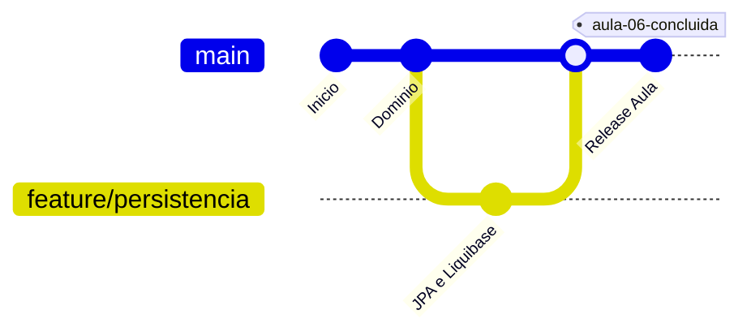
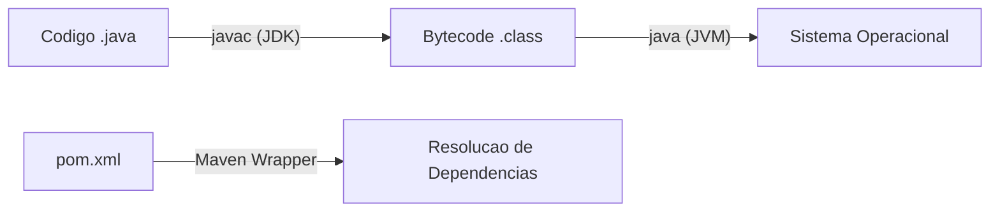
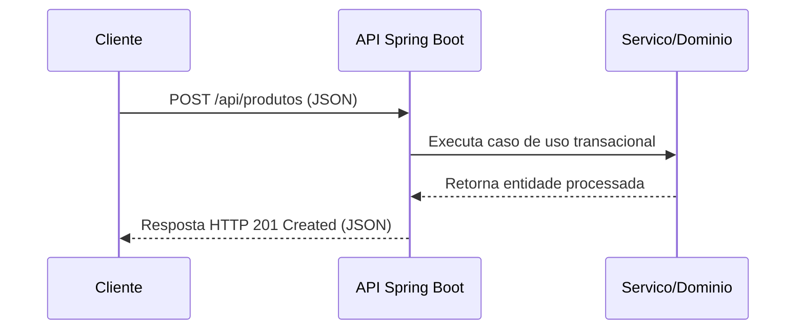
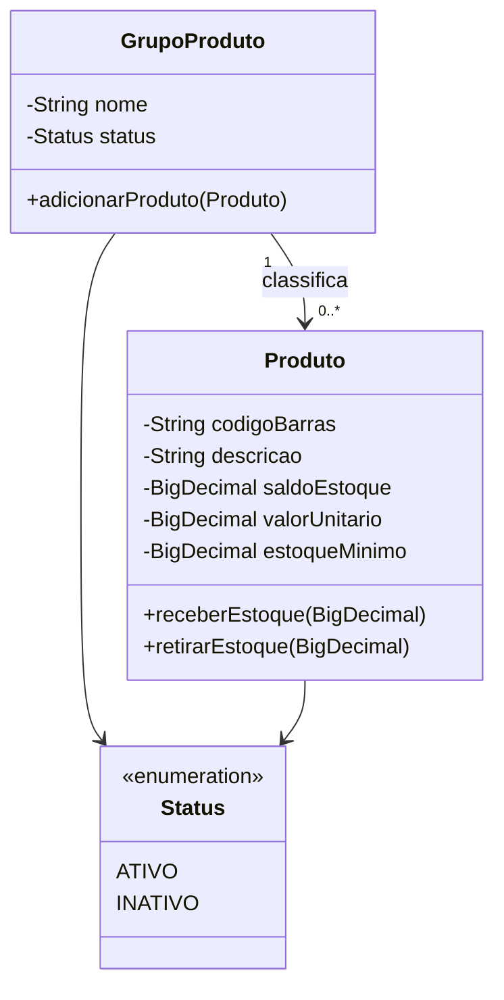
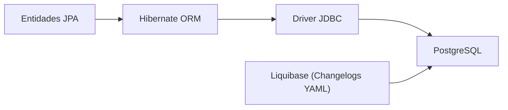
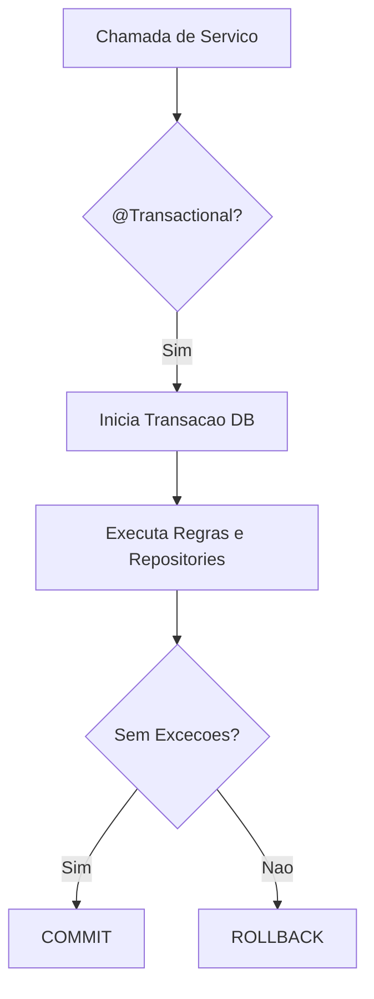
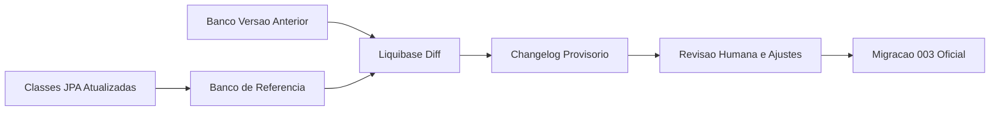
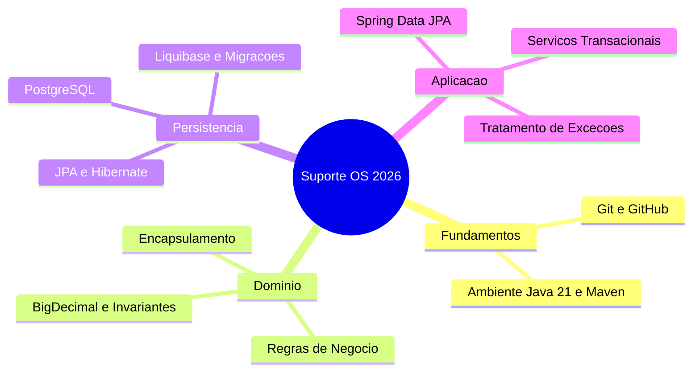

# Aula 01 — Persistencia e Transacoes com Spring Data e Liquibase

> **Professor:** Jefferson Passerini
> **Disciplina:** Laboratório de Programação IV (4º Semestre)
> **Tema:** Construcao incremental de aplicacoes robustas em Java 21 com Spring Boot, persistencia relacional via JPA/Hibernate, controle de esquema versionado com Liquibase e gerenciamento transacional.

## Sumário

- [Objetivo da aula](#objetivo-da-aula)
- [Contexto e pré-requisitos](#contexto-e-pré-requisitos)
- [GitHub, controle de versão e organização de projetos](#github-controle-de-versão-e-organização-de-projetos)
- [Configuração do ambiente com Java 21, Maven Wrapper e IntelliJ IDEA](#configuração-do-ambiente-com-java-21-maven-wrapper-e-intellij-idea)
- [Criação de projetos Spring Boot e conceitos de API REST e protocolo HTTP](#criação-de-projetos-spring-boot-e conceitos-de-api-rest-e-protocolo-http)
- [Modelagem de domínio com Java puro, encapsulamento, BigDecimal e invariantes](#modelagem-de-domínio-com-java-puro-encapsulamento-bigdecimal-e-invariantes)
- [Persistência relacional com JPA, Hibernate, perfis Spring e Liquibase](#persistência-relacional-com-jpa-hibernate-perfis-spring-e-liquibase)
- [Spring Data JPA, repositories, serviços transacionais e tratamento de exceções](#spring-data-jpa-repositories-serviços-transacionais-e-tratamento-de-exceções)
- [Evolução do modelo de dados e geração assistida de changelogs com Liquibase](#evolução-do-modelo-de-dados-e-geração-assistida-de-changelogs-com-liquibase)
- [Código da aula](#código-da-aula)
- [Exercícios](#exercícios)
- [Erros comuns e boas práticas](#erros-comuns-e-boas-práticas)
- [Links e materiais complementares](#links-e-materiais-complementares)
- [Mapa da aula](#mapa-da-aula)
- [Glossário](#glossário)
- [Pontos-chave para a prova](#pontos-chave-para-prova)
- [Perguntas e respostas (JSONL)](#perguntas-e-respostas-jsonl)
- [Checklist de revisão](#checklist-de-revisão)

---

## Objetivo da aula

Consolidar o ciclo completo de desenvolvimento de uma API backend em Java 21 com Spring Boot, unindo a modelagem orientada a objetos protegida por invariantes, a persistência relacional auditável via Liquibase, o acesso a dados facilitado pelo Spring Data JPA e a segurança transacional em serviços de aplicação. O estudante será capaz de aplicar esses conceitos de forma incremental e reprodutível em seu projeto temático.

---

## Contexto e pré-requisitos

Esta aula integra os conceitos desenvolvidos desde o início da disciplina no repositório de referência `suporteos2026`. Para acompanhar adequadamente o conteúdo e executar os laboratórios, são exigidos:
- Java Development Kit (JDK) 21 instalado e configurado.
- Docker Desktop em execução para o provisionamento do SGBD PostgreSQL.
- Ferramenta de linha de comando ou terminal configurado (PowerShell no Windows, Bash/Zsh no Linux/macOS).
- IntelliJ IDEA Ultimate ou Community (com suporte a projetos Maven).
- Compreensão prévia de orientação a objetos, mapeamento relacional e protocolo HTTP.

---

## GitHub, controle de versão e organização de projetos

### Fundadefinicão e Motivação
O controle de versão com Git e GitHub não se resume a um repositório de backup: ele representa a memória verificável do projeto. Commits formam um grafo dirigido acíclico de *snapshots*, onde branches e tags definem linhas de evolução e marcos estáveis. O modelo distribuído garante autonomia local, permitindo commits offline sem comprometer a integridade e a rastreabilidade do código.



### Exemplo e Contraexemplo
- **Exemplo correto:** Commits atômicos e bem descritos, como `feat(dominio): adiciona regras de saldo e invariantes em Produto`.
- **Contraexemplo:** Um único commit gigante ao final da semana com a mensagem `arrumando tudo`, misturando alterações de banco de dados, refatoração de domínio e correção de bugs na API.

### Armadilhas comuns
Versionar arquivos locais de configuração sensíveis (como credenciais de banco no arquivo `.env`) ou diretórios gerados pela IDE (`.idea/`, `target/`), poluindo o histórico e expondo dados de acesso.

---

## Configuração do ambiente com Java 21, Maven Wrapper e IntelliJ IDEA

### Fundadefinicão e Motivação
A execução de aplicações Java exige a distinção clara entre JVM (máquina virtual de execução), JRE (ambiente de execução com bibliotecas) e JDK (kit de ferramentas de compilação). O Maven Wrapper (`mvnw`) assegura que o build utilize exatamente a mesma versão do Maven especificada pelo projeto, garantindo reprodutibilidade entre a máquina do desenvolvedor e o servidor de integração contínua.



### Exemplo e Contraexemplo
- **Exemplo correto:** Utilizar `./mvnw clean test` para rodar os testes utilizando o wrapper local.
- **Contraexemplo:** Executar comandos globais (`mvn`) sem verificar se a versão instalada no sistema operacional é compatível com o projeto.

### Armadilhas comuns
Assumir que a variável de ambiente `JAVA_HOME` do terminal é a mesma utilizada pela IDE ou pelo Maven embutido, gerando conflitos de versão na compilação do bytecode.

---

## Criação de projetos Spring Boot e conceitos di API REST e protocolo HTTP

### Fundadefinicão e Motivação
Uma API Web expõe recursos através de URIs e métodos HTTP padronizados (`GET`, `POST`, `PUT`, `DELETE`), utilizando o formato JSON para a troca de mensagens. O Spring Boot simplifica a criação desse servidor incorporando o Tomcat e gerenciando o ciclo de vida da aplicação de forma declarativa.



### Exemplo e Contraexemplo
- **Exemplo correto:** Empregar o verbo `POST` e o código de status `201 Created` ao persistir um novo recurso.
- **Contraexemplo:** Utilizar sempre o método `GET` na URL para enviar dados sensíveis ou realizar operações de escrita no servidor.

### Armadilhas comuns
Ignorar a semântica dos códigos de status HTTP, retornando sempre `200 OK` mesmo quando ocorrem falhas de validação ou recursos não encontrados.

---

## Modelagem de domínio com Java puro, encapsulamento, BigDecimal e invariantes

### Fundadefinicão e Motivação
O domínio encapsula as regras de negócio essenciais da aplicação, independentemente de frameworks ou bancos de dados. A utilização de tipos exatos como `BigDecimal` evita imprecisões de ponto flutuante em cálculos monetários e quantitativos, enquanto invariantes garantem que o objeto nunca assuma um estado inválido.



### Exemplo e Contraexemplo
- **Exemplo correto:** Validar no construtor da classe e nos métodos de modificação se o saldo é negativo, lançando exceção se violar a regra.
- **Contraexemplo:** Expor setters públicos para todos os atributos, permitindo que qualquer camada altere diretamente o saldo para valores negativos.

### Armadilhas comuns
Instanciar `BigDecimal` a partir de tipos primitivos `double` (`new BigDecimal(0.1)`) em vez de utilizar strings (`new BigDecimal("0.1")`), o que pode propagar imprecisões binárias.

---

## Persistência relacional com JPA, Hibernate, perfis Spring e Liquibase

### Fundadefinicão e Motivação
O mapeamento objeto-relacional (ORM) conecta o modelo orientado a objetos às tabelas relacionais do PostgreSQL. O Liquibase atua como a única fonte de verdade para a criação e evolução versionada do esquema de banco de dados, substituindo o uso automatizado de `ddl-auto=create` em ambientes produtivos.



### Exemplo e Contraexemplo
- **Exemplo correto:** Versionar as alterações de banco através de arquivos `changeSet` em YAML executados ordenadamente pelo Liquibase.
- **Contraexemplo:** Alterar diretamente o esquema do banco de dados em produção executando scripts SQL manuais sem rastreabilidade.

### Armadilhas comuns
Modificar um `changeSet` do Liquibase que já foi aplicado em outro ambiente, quebrando o mecanismo de verificação de integridade (*checksum*).

---

## Spring Data JPA, repositories, serviços transacionais e tratamento de exceções

### Fundadefinicão e Motivação
O Spring Data JPA gera implementações em tempo de execução para interfaces de repositório, simplificando consultas comuns por meio de convenções de nomes. A camada de serviço define a fronteira transacional (`@Transactional`), garantindo que um conjunto de operações ocorra de forma atômica, aplicando *rollback* automático em caso de falhas.



### Exemplo e Contraexemplo
- **Exemplo correto:** Anotar o método do serviço de aplicação com `@Transactional` para englobar a consulta, a regra de negócio e a persistência.
- **Contraexemplo:** Colocar a anotação de transação em métodos de consulta isolados sem necessidade, ou omiti-la em operações de escrita compostas.

### Armadilhas comuns
Capturar exceções de negócio dentro do serviço sem relançá-las ou marcá-las para rollback, fazendo com que o Spring cometa a transação mesmo após um erro crítico.

---

## Evolução do modelo de dados e geração assistida de changelogs com Liquibase

### Fundadefinicão e Motivação
Sistemas em produção evoluem. Adicionar novos relacionamentos ou colunas obrigatórias em tabelas preenchidas exige estratégias seguras, como a técnica de expansão, migração e contratação (*expand-migrate-contract*). O uso de ferramentas de diff auxilia na geração de rascunhos de changelogs, que devem ser rigorosamente revisados antes da aplicação definitiva.



### Exemplo e Contraexemplo
- **Exemplo correto:** Adicionar uma coluna `NOT NULL` em três passos: adicioná-la como nula, preencher os registros antigos com um valor padrão (`backfill`), e então adicionar a restrição de não nulidade.
- **Contraexemplo:** Inserir diretamente uma coluna `NOT NULL` sem valor padrão em uma tabela que já possui milhares de registros em produção, causando falha imediata no deploy.

### Armadilhas comuns
Aceitar cegamente o arquivo de diff gerado automaticamente pelo Liquibase sem remover ruídos de restrições ou ajustes de dialeto do SGBD.

---

## Código da aula

Nesta seção, analisamos três artefatos centrais implementados no pacote do projeto de referência `suporteos2026`:

### 1. Entidade de Domínio (`Produto.java`)
Localizada em `src/main/java/com/curso/suporteos/domain/Produto.java`. Mapeia a tabela `produto`, aplicando validações de domínio e encapsulamento.

```java
package com.curso.suporteos.domain;

import jakarta.persistence.*;
import java.math.BigDecimal;
import java.time.LocalDate;

@Entity
@Table(name = "produto", uniqueConstraints = {
    @UniqueConstraint(name = "uk_produto_codigo_barras", columnNames = "codigo_barras")
})
public class Produto {

    @Id
    @GeneratedValue(strategy = GenerationType.IDENTITY)
    private Long id;

    @Column(name = "codigo_barras", nullable = false, length = 50)
    private String codigoBarras;

    @Column(nullable = false, length = 150)
    private String descricao;

    @Column(name = "saldo_estoque", nullable = false, precision = 18, scale = 3)
    private BigDecimal saldoEstoque;

    @Column(name = "valor_unitario", nullable = false, precision = 18, scale = 2)
    private BigDecimal valorUnitario;

    @Column(name = "estoque_minimo", nullable = false, precision = 18, scale = 3)
    private BigDecimal estoqueMinimo;

    @Column(name = "data_cadastro", nullable = false)
    private LocalDate dataCadastro;

    @Enumerated(EnumType.STRING)
    @Column(nullable = false, length = 20)
    private Status status;

    @ManyToOne(fetch = FetchType.LAZY)
    @JoinColumn(name = "grupo_produto_id", nullable = false, foreignKey = @ForeignKey(name = "fk_produto_grupo"))
    private GrupoProduto grupo;

    protected Produto() {
        // Construtor protegido exigido pelo JPA
    }

    public Produto(String codigoBarras, String descricao, BigDecimal saldoEstoque, BigDecimal valorUnitario, BigDecimal estoqueMinimo, LocalDate dataCadastro, GrupoProduto grupo) {
        this.codigoBarras = validarObrigatorio(codigoBarras, "Código de barras obrigatório");
        this.descricao = validarObrigatorio(descricao, "Descrição obrigatória");
        this.saldoEstoque = validarNaoNegativo(saldoEstoque, "Saldo não pode ser negativo");
        this.valorUnitario = validarNaoNegativo(valorUnitario, "Valor unitário não pode ser negativo");
        this.estoqueMinimo = validarNaoNegativo(estoqueMinimo, "Estoque mínimo não pode ser negativo");
        this.dataCadastro = dataCadastro != null ? dataCadastro : LocalDate.now();
        this.grupo = grupo;
        this.status = Status.ATIVO;
    }

    private String validarObrigatorio(String valor, mensagem) {
        if (valor == null || valor.trim().isEmpty()) {
            throw new IllegalArgumentException(mensagem);
        }
        return valor;
    }

    private BigDecimal validarNaoNegativo(BigDecimal valor, String mensagem) {
        if (valor == null || valor.compareTo(BigDecimal.ZERO) < 0) {
            throw new IllegalArgumentException(mensagem);
        }
        return valor;
    }

    // Getters e comportamentos de negocio omitidos porbrevidade
}
```

### 2. Repositório Spring Data JPA (`ProdutoRepository.java`)
Localizado em `src/main/java/com/curso/suporteos/repository/ProdutoRepository.java`.

```java
package com.curso.suporteos.repository;

import com.curso.suporteos.domain.Produto;
import com.curso.suporteos.domain.Status;
import org.springframework.data.jpa.repository.JpaRepository;
import java.util.List;
import java.util.Optional;

public interface ProdutoRepository extends JpaRepository<Produto, Long> {
    Optional<Produto> findByCodigoBarras(String codigoBarras);
    boolean existsByCodigoBarras(String codigoBarras);
    List<Produto> findByGrupoId(Long grupoId);
    List<Produto> findByStatus(Status status);
}
```

### 3. Serviço de Aplicação (`ProdutoService.java`)
Localizado em `src/main/java/com/curso/suporteos/application/ProdutoService.java`. Gerencia a transacionalidade e as regras de persistência.

```java
package com.curso.suporteos.application;

import com.curso.suporteos.domain.GrupoProduto;
import com.curso.suporteos.domain.Produto;
import com.curso.suporteos.repository.GrupoProdutoRepository;
import com.curso.suporteos.repository.ProdutoRepository;
import org.springframework.stereotype.Service;
import org.springframework.transaction.annotation.Transactional;

@Service
public class ProdutoService {

    private final ProdutoRepository produtoRepository;
    private final GrupoProdutoRepository grupoRepository;

    public ProdutoService(ProdutoRepository produtoRepository, GrupoProdutoRepository grupoRepository) {
        this.produtoRepository = produtoRepository;
        this.grupoRepository = grupoRepository;
    }

    @Transactional
    public Produto cadastrar(Produto produto, Long grupoId) {
        if (produtoRepository.existsByCodigoBarras(produto.getCodigoBarras())) {
            throw new RecursoDuplicadoException("Código de barras já cadastrado");
        }

        GrupoProduto grupo = grupoRepository.findById(grupoId)
                .orElseThrow(() -> new RecursoNaoEncontradoException("Grupo não encontrado"));

        // Associa o produto ao grupo garantindo consistencia bidirecional
        grupo.adicionarProduto(produto);
        return produtoRepository.save(produto);
    }
}
```

---

## Exercícios

### Exercício 1: Modelagem de Domínio Individual
- **Enunciado:** Escolha um domínio próprio (ex: Biblioteca, Oficina, Clínica) compatível com o curso. Documente as entidades e implemente uma classe de domínio principal aplicando encapsulamento, invariantes e validação com `BigDecimal`.
- **Raciocínio:** O domínio deve proteger seus dados internos contra estados inválidos logo no construtor e nos métodos de modificação.
- **Resolução Comentada:** Crie a classe validando campos obrigatórios e valores numéricos não negativos, assegurando que o código chamador não consiga corromper o objeto.

### Exercício 2: Configuração de Banco e Liquibase
- **Enunciado:** Configure os perfis `dev` e `test` no projeto conectando-se a instâncias do PostgreSQL. Crie os changelogs iniciais em YAML via Liquibase para criar a tabela da sua nova entidade.
- **Raciocínio:** Isolar os bancos de desenvolvimento e teste evita perda acidental de dados durante a execução dos testes automatizados.
- **Resolução Comentada:** Defina as propriedades no `application-dev.properties` e `application-test.properties`, criando o arquivo mestre do Liquibase correspondente.

### Exercício 3: Repositórios e Serviços Transacionais
- **Enunciado:** Crie a interface de repositório estendendo `JpaRepository` e implemente o serviço transacional correspondente para o seu domínio, testando o comportamento de rollback em caso de falha.
- **Raciocínio:** O Spring Data JPA fornece os métodos básicos de persistência, enquanto a anotação `@Transactional` no serviço assegura a integridade atômica da operação.
- **Resolução Comentada:** Implemente o método de cadastro validando duplicidade e lançando exceções personalizadas quando o recurso já existir.

### Exercício 4: Evolução do Schema de Dados
- **Enunciado:** Adicione um novo atributo opcional à sua entidade e utilize o fluxo assistido por diff do Liquibase para gerar, revisar e aplicar a nova migração de banco de dados.
- **Raciocínio:** Alterações em tabelas preenchidas exigem cautela para não violar restrições de nulidade ou integridade relacional.
- **Resolução Comentada:** Gere o changelog provisório, ajuste-o manualmente para incluir valores padrão quando necessário, e adicione-o ao `db.changelog-master.yaml`.

---

## Erros comuns e boas práticas

| Erro Comum | Consequência | Boa Prática |
|---|---|---|
| Usar `double` em vez de `BigDecimal` | Erros de arredondamento em cálculos financeiros | Sempre utilizar `BigDecimal` para valores e saldos |
| Modificar changelogs antigos do Liquibase | Falha de checksum e quebra do build | Criar sempre um novo `changeSet` incremental |
| Omitir `@Transactional` em serviços de escrita | Transações parciais e inconsistência no banco | Anotar métodos de caso de uso com `@Transactional` |
| Expor setters públicos sem validação | Violação de invariantes de negócio | Controlar alterações através de métodos expressivos do domínio |

---

## Links e materiais complementares

- Repositório oficial da disciplina: [jeffersonarpasserini/suporteos2026](https://github.com/jeffersonarpasserini/suporteos2026)
- Documentação oficial do Spring Boot: [spring.io/projects/spring-boot](https://spring.io/projects/spring-boot)
- Documentação do Liquibase: [docs.liquibase.com](https://docs.liquibase.com)

---

## Mapa da aula



---

## Glossário

| Termo | Definição |
|---|---|
| **API REST** | Estilo arquitetural para construção de serviços web baseados em recursos e protocolo HTTP. |
| **ChangeSet** | Unidade atômica de alteração de banco de dados gerenciada pelo Liquibase. |
| **Dirty Checking** | Mecanismo do Hibernate que detecta alterações em entidades gerenciadas e gera comandos SQL de update automaticamente. |
| **Invariante** | Condição lógica que deve permanecer verdadeira em todas as instâncias válidas de um objeto. |
| **Maven Wrapper** | Script que distribui e executa uma versão fixa do Maven diretamente pelo projeto. |
| **ORM** | Mapeamento Objeto-Relacional que traduz tabelas relacionais em classes de domínio orientadas a objetos. |

---

## Pontos-chave para a prova

- A diferença entre os papéis de entidades, repositórios e serviços de aplicação.
- O motivo pelo qual o Liquibase é a fonte de verdade do esquema, enquanto o Hibernate apenas valida a estrutura.
- A importância do uso de `BigDecimal` para representação exata de valores monetários e quantidades fracionárias.
- O funcionamento do mecanismo de transações (`@Transactional`) e o comportamento de *rollback* diante de exceções não tratadas.
- A estratégia correta para evolução de esquemas de banco de dados sem perda de dados históricos.

---

## Perguntas e respostas (JSONL)

```jsonl
{"pergunta": "Qual e a versao do Java utilizada no projeto de referencia suporteos2026?", "resposta": "Java 21.", "dificuldade": "facil"}
{"pergunta": "Qual ferramenta e responsavel por gerenciar e versionar o esquema do banco de dados no curso?", "resposta": "Liquibase.", "dificuldade": "media"}
{"pergunta": "Por que devemos evitar o uso de tipos double para representar valores monetarios?", "resposta": "Devido a imprecisoes de representacao de ponto flutuante binario.", "dificuldade": "facil"}
{"pergunta": "O que significa a sigla ORM?", "resposta": "Object-Relational Mapping (Mapeamento Objeto-Relacional).", "dificuldade": "facil"}
{"pergunta": "Qual e a finalidade da anotacao @Transactional em um servico Spring?", "resposta": "Definir a fronteira transacional, garantindo atomicidade e rollback em caso de falhas.", "dificuldade": "media"}
{"pergunta": "O que e um changeSet no contexto do Liquibase?", "resposta": "Uma unidade atomica de alteracao aplicada ao esquema do banco de dados.", "dificuldade": "media"}
{"pergunta": "Qual e a vantagem de utilizar o Maven Wrapper (mvnw)?", "resposta": "Garantir que o build utilize a versao exata do Maven definida pelo projeto, sem depender da instalacao global.", "dificuldade": "media"}
{"pergunta": "O que e uma invariante de dominio?", "resposta": "Uma condicao que deve ser sempre verdadeira para garantir a validade do estado de um objeto.", "dificuldade": "dificil"}
{"pergunta": "Por que nao devemos editar um changeSet que já foi executado em outro ambiente?", "resposta": "Porque altera o checksum e quebra a integridade do historico de migracoes do Liquibase.", "dificuldade": "media"}
{"pergunta": "Qual e a diferenca principal entre entidade e objeto de valor?", "resposta": "A entidade possui identidade propria que a acompanha ao longo do tempo, enquanto o objeto de valor e definido apenas pelos seus atributos.", "dificuldade": "dificil"}
{"pergunta": "O que o Hibernate faz quando a propriedade ddl-auto esta configurada como validate?", "resposta": "Ele apenas compara o mapeamento das entidades JPA com o esquema real do banco, sem realizar modificacoes.", "dificuldade": "media"}
{"pergunta": "Qual e o objetivo do padrao Repository na arquitetura da aplicacao?", "resposta": "Isolar a camada de acesso a dados, fornecendo abstracoes para consulta e persistencia de agregados.", "dificuldade": "facil"}
{"pergunta": "O que significa o termo dirty checking no Hibernate?", "resposta": "A capacidade do contexto de persistencia de detectar automaticamente modificacoes em entidades gerenciadas para persistir no banco.", "dificuldade": "dificil"}
{"pergunta": "Qual camada da aplicacao deve conter as regras de negocio e validacoes de invariantes?", "resposta": "A camada de dominio (entidades e objetos de negocio).", "dificuldade": "facil"}
{"pergunta": "Como o Spring Data JPA implementa operacoes basicas de consulta sem que o desenvolvedor escreva SQL?", "resposta": "Por meio de analise de nomes de metodos em interfaces (consultas derivadas) e metodos herdados de JpaRepository.", "dificuldade": "media"}
```

---

## Checklist de revisão

- [ ] Repositório oficial clonado e configurado corretamente.
- [ ] Ambiente com Java 21, Maven Wrapper e Docker/PostgreSQL validado.
- [ ] Tema individual do projeto escolhido e documentado.
- [ ] Entidades de domínio modeladas com encapsulamento, `BigDecimal` e invariantes.
- [ ] Perfis Spring configurados com conexões PostgreSQL isoladas para `dev` e `test`.
- [ ] Migrações do Liquibase estruturadas e executadas com sucesso.
- [ ] Repositórios Spring Data JPA criados e testados.
- [ ] Serviços transacionais implementados com controle de rollback verificado.
- [ ] Evolução do modelo testada através de changelogs incrementais revisados.
