# Aula 02 — Spring Boot Criacao do Projeto e Fundamentos REST

> **Professor:** Jefferson Passerini  
> **Disciplina:** Laboratório de Programação IV (4º Semestre)  
> **Tema:** Inicialização de projetos com Spring Boot, Maven Wrapper, anatomia do protocolo HTTP e fundamentos de arquitetura REST.

---

## Sumário

- [Objetivo da aula](#objetivo-da-aula)
- [Contexto e pré-requisitos](#contexto-e-pré-requisitos)
- [Diferenciacao entre Projeto de Referencia e Tematico](#diferenciacao-entre-projeto-de-referencia-e-tematico)
  - [O projeto de referência suporteos2026](#o-projeto-de-referencia-suporteos2026)
  - [O projeto temático do estudante](#o-projeto-tematico-do-estudante)
  - [Contrato de compatibilidade de domínio](#contrato-de-compatibilidade-de-dominio)
- [Fundamentos de APIs Web e Arquitetura Cliente-Servidor](#fundamentos-de-apis-web-e-arquitetura-cliente-servidor)
  - [Conceito de aplicação e sistemas distribuídos](#conceito-de-aplicacao-e-sistemas-distribuidos)
  - [Definição de API e fronteira de abstração](#definicao-de-api-e-fronteira-de-abstracao)
  - [Diferenças entre aplicações com renderização em servidor e APIs Web](#diferencas-entre-aplicacoes-com-renderizacao-em-servidor-e-apis-web)
  - [O modelo arquitetural cliente-servidor](#o-modelo-arquitetural-cliente-servidor)
- [Anatomia de Requisicoes e Respostas HTTP](#anatomia-de-requisicoes-e-respostas-http)
  - [Estrutura formal de uma requisição HTTP](#estrutura-formal-de-uma-requisicao-http)
  - [Estrutura formal de uma resposta HTTP](#estrutura-formal-de-uma-resposta-http)
  - [Cabeçalhos fundamentais na comunicação HTTP](#cabecalhos-fundamentais-na-comunicacao-http)
- [Conceitos de Recursos, URIs e Endpoints](#conceitos-de-recursos-uris-e-endpoints)
  - [Identificação de recursos e modelagem de URIs](#identificacao-de-recursos-e-modelagem-de-uris)
  - [Diferenciação precisa entre URI e Endpoint](#diferenciacao-precisa-entre-uri-e-endpoint)
  - [Padronização de rotas orientadas a recursos](#padronizacao-de-rotas-orientadas-a-recursos)
- [Metodos HTTP, Idempotencia e Codigos de Status](#metodos-http-idempotencia-e-codigos-de-status)
  - [Semântica dos métodos principais no padrão REST](#semantica-dos-metodos-principais-no-padrao-rest)
  - [Segurança e idempotência na especificação RFC 9110](#seguranca-e-idempotencia-na-especificacao-rfc-9110)
  - [Famílias e significados dos códigos de status HTTP](#familias-e-significados-dos-codigos-de-status-http)
- [Introducao ao Formato JSON e Principios REST](#introducao-ao-formato-json-e-principios-rest)
  - [O formato JSON como representação intermediária](#o-formato-json-como-representacao-intermediaria)
  - [Diferença entre modelo de domínio, persistência e representação](#diferenca-entre-modelo-de-dominio-persistencia-e-representacao)
  - [Restrições arquiteturais do estilo REST](#restricoes-arquiteturais-do-estilo-rest)
- [Camadas da Aplicacao e Fluxo de Requisicao no Spring Boot](#camadas-da-aplicacao-e-fluxo-de-requisicao-no-spring-boot)
  - [Divisão em camadas de responsabilidade](#divisao-em-camadas-de-responsabilidade)
  - [Ciclo de vida de uma requisição HTTP no Spring MVC](#ciclo-de-vida-de-uma-requisicao-http-no-spring-mvc)
  - [Servidor Web embutido](#servidor-web-embutido)
- [Inversao de Controle, Injecao de Dependencia e Beans](#inversao-de-controle-injecao-de-dependencia-e-beans)
  - [O princípio de Inversão de Controle](#o-principio-de-inversao-de-controle)
  - [Injeção de Dependência e ciclo de vida de Beans](#injecao-de-dependencia-e-ciclo-de-vida-de-beans)
  - [Injeção por construtor vs Injeção por campo](#injecao-por-construtor-vs-injecao-por-campo)
- [Configuracao do Projeto com Spring Initializr e pom.xml](#configuracao-do-projeto-com-spring-initializr-e-pomxml)
  - [O papel do Spring Initializr](#o-papel-do-spring-initializr)
  - [Coordenadas Maven e dependências no pom.xml](#coordenadas-maven-e-dependencias-no-pomxml)
  - [O ecossistema de Starters do Spring Boot](#o-ecossistema-de-starters-do-spring-boot)
- [Uso do Maven Wrapper e Criacao do Endpoint /api/health](#uso-do-maven-wrapper-e-criacao-do-endpoint-apihealth)
  - [Padronização de ambiente com Maven Wrapper](#padronizacao-de-ambiente-com-maven-wrapper)
  - [Implementação técnica do HealthController](#implementacao-tecnica-do-healthcontroller)
  - [Significado e limites do endpoint de verificação inicial](#significado-e-limites-do-endpoint-de-verificacao-inicial)
- [Código da aula](#codigo-da-aula)
- [Exercícios](#exercicios)
- [Erros comuns e boas práticas](#erros-comuns-e-boas-praticas)
- [Links e materiais complementares](#links-e-materiais-complementares)
- [Mapa da aula](#mapa-da-aula)
- [Glossário](#glossario)
- [Pontos-chave para a prova](#pontos-chave-para-a-prova)
- [Perguntas e respostas (JSONL)](#perguntas-e-respostas-jsonl)
- [Checklist de revisão](#checklist-de-revisao)

---

## Objetivo da aula

Esta aula estabelece a fundação teórica e técnica da disciplina de Laboratório de Programação IV. O foco central é capacitar o estudante a:

1. Compreender a arquitetura cliente-servidor no contexto de APIs Web modernas e o papel do protocolo HTTP como base de comunicação.
2. Reconhecer a diferença conceitual e prática entre o projeto de referência do professor (`suporteos2026`) e o projeto temático individual de cada discente.
3. Definir e validar um domínio de aplicação que atenda rigorosamente ao contrato de compatibilidade da disciplina (entidade classificatória e entidade principal correlacionadas).
4. Gerar e estruturar uma aplicação Java 21 com Spring Boot 4.0.7 utilizando o ecossistema Maven, seja pelo serviço web Spring Initializr ou pela integração nativa no IntelliJ IDEA Ultimate.
5. Inspecionar e compreender a estrutura de dependências do arquivo `pom.xml`, compreendendo o conceito de starters e herança de configurações (`parent`).
6. Utilizar a ferramenta Maven Wrapper (`mvnw` e `mvnw.cmd`) para garantir reprodutibilidade de compilação, testes e execução sem dependência de instalação local prévia do Maven.
7. Implementar e testar um endpoint mínimo de verificação de disponibilidade (`GET /api/health`) utilizando as anotações `@RestController` e `@GetMapping`.
8. Configurar propriedades básicas do sistema em `application.properties` e estruturar o versionamento no Git com `.gitignore` adequado, prevenindo o vazamento de configurações da IDE e binários compilados.

---

## Contexto e pré-requisitos

A disciplina de Laboratório de Programação IV assume que o estudante já compreende os conceitos centrais de Programação Orientada a Objetos em Java (classes, métodos, interfaces, polimorfismo, tipos genéricos e encapsulamento) e possui familiaridade operacional básica com o controle de versão Git (comandos `init`, `status`, `add`, `commit`, `push` e manipulação de remotos).

Para a execução satisfatória desta aula, são necessários os seguintes componentes no ambiente de desenvolvimento:

- **Java Development Kit (JDK):** Versão 21 (LTS) devidamente instalada e configurada na variável de ambiente `JAVA_HOME`.
- **Ambiente de Desenvolvimento (IDE):** IntelliJ IDEA Ultimate (ou Community com os devidos plugins de execução de projetos Maven).
- **Cliente HTTP ou Terminal:** Ferramenta `curl`, PowerShell moderno ou extensão de requisições HTTP da IDE para inspeção de rede.
- **Conta ativa no GitHub:** Para hospedagem e entrega contínua do repositório temático do aluno.

Esta aula não aborda persistência em banco de dados relacional, frameworks ORM (JPA/Hibernate) ou ferramentas de automação de migração de schema (Liquibase). Tais dependências foram intencionalmente omitidas do escopo inicial para evitar que a aplicação falhe por ausência de um banco de dados ativo.

---

## Diferenciacao entre Projeto de Referencia e Tematico

No processo pedagógico de engenharia de software desta disciplina, adota-se o modelo de espelhamento arquitetural:

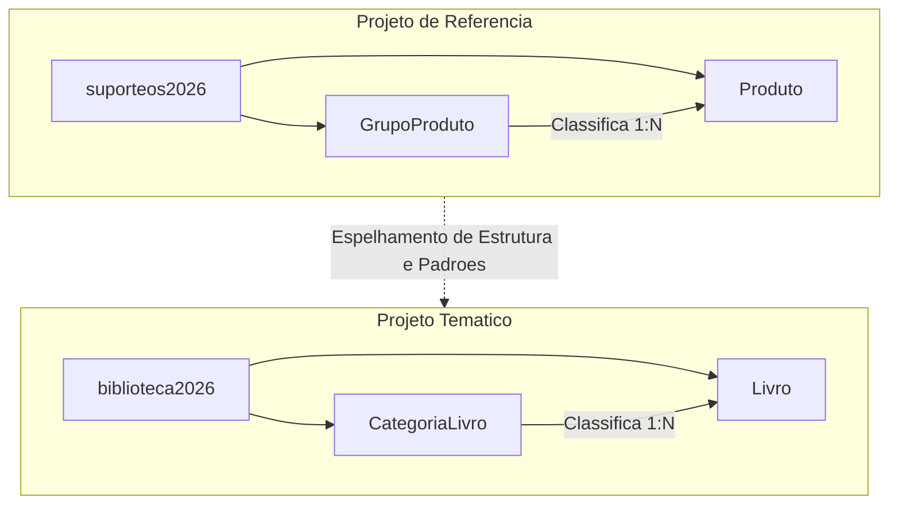

### O projeto de referência suporteos2026

O projeto oficial mantido pelo docente intitula-se `suporteos2026`, acessível publicamente em `https://github.com/jeffersonarpasserini/suporteos2026`. Ele serve exclusivamente como:

- Guia canônico para a organização de pacotes e camadas da aplicação.
- Ponto de comparação para soluções arquiteturais, validações e configurações.
- Registro histórico evolutivo do código por meio de tags Git vinculadas ao encerramento de cada aula.

### O projeto temático do estudante

O estudante não deve submeter código ao repositório do professor, nem clonar o projeto `suporteos2026` para renomear classes na última semana de aulas. Cada discente deve conceber, documentar e evoluir um sistema próprio com tema de negócio único (ex.: controle de biblioteca, locadora de equipamentos, oficina mecânica, gestão de eventos).

Essa individualização assegura a internalização dos conceitos, forçando o estudante a transpor as abstrações ensinadas no projeto de referência para o vocabulário e para as regras específicas do seu próprio domínio de problema.

### Contrato de compatibilidade de domínio

Para que o projeto temático do estudante possa acompanhar todas as implementações subsequentes do semestre (como DTOs, validações Bean Validation, relacionamentos JPA Many-to-One, migrações com Liquibase e testes de integração), o tema deve atender estritamente ao contrato de duas entidades com multiplicidade 1:N:

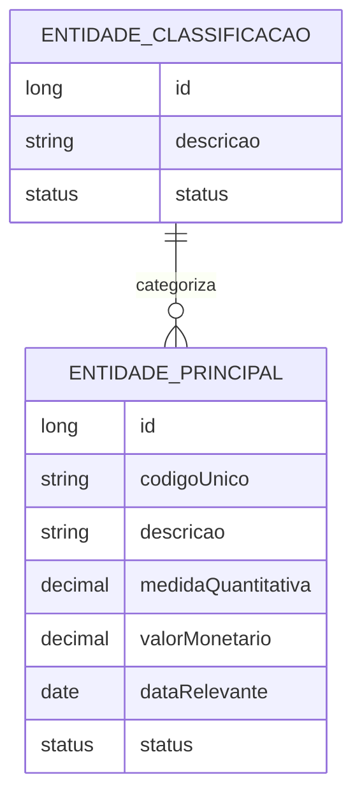

#### Requisitos obrigatórios das entidades

1. **Entidade de Classificação (Tipo/Categoria):**
   - Identificador numérico (`id`).
   - Nome ou descrição textual da categoria.
   - Status de ativação (ativo/inativo).
2. **Entidade Principal:**
   - Identificador numérico (`id`).
   - Identificador negocial ou código único de busca (ex.: ISBN, SKU, chassi, código de barras).
   - Nome ou descrição principal.
   - Medida quantitativa (ex.: quantidade em estoque, número de exemplares, capacidade de vagas, horas previstas).
   - Valor monetário (ex.: preço de venda, custo unitário, valor de reposição, diária). Exige o uso do tipo de ponto flutuante exato (`BigDecimal`) em aulas futuras.
   - Data de relevância de negócio (ex.: data de aquisição, data de publicação, data de cadastro).
   - Status (ativo/inativo).
   - Associação de dependência: toda entidade principal aponta obrigatoriamente para uma e apenas uma entidade de classificação.

| Aspecto | Projeto de Referência (`suporteos2026`) | Exemplo Estudante (`biblioteca2026`) | Exemplo Estudante (`oficina2026`) |
|---|---|---|---|
| **Classificação** | `GrupoProduto` | `CategoriaLivro` | `CategoriaServico` |
| **Entidade Principal** | `Produto` | `Livro` | `Servico` |
| **Código Único** | Código de Barras (`codigoBarra`) | ISBN (`isbn`) | Código de Catálogo (`codigoServico`) |
| **Medida** | Saldo em Estoque (inteiro/decimal) | Exemplares Disponíveis (inteiro) | Tempo Estimado em Horas (decimal) |
| **Valor** | Preço Unitário (`valorUnitario`) | Valor de Reposição (`valorReposicao`) | Preço Base da Mão de Obra (`precoBase`) |

---

## Fundamentos de APIs Web e Arquitetura Cliente-Servidor

### Conceito de aplicação e sistemas distribuídos

No contexto da engenharia de software contemporânea, uma **aplicação** consiste em um conjunto estruturado de programas, rotinas e regras de negócio projetado para resolver um problema operacional ou gerencial.

- **Aplicação local (monolítica de processo único):** Todas as etapas — apresentação, computação de negócio e armazenamento em memória — ocorrem no mesmo espaço de endereçamento da máquina local (exemplo: uma calculadora de console).
- **Aplicação distribuída:** Os subsistemas são desacoplados fisicamente ou logicamente através de uma rede de dados. A camada de persistência reside em um servidor de banco de dados, o processamento de regras reside em uma aplicação servidora e as interfaces de usuário operam em navegadores, dispositivos móveis ou outros clientes remotos.

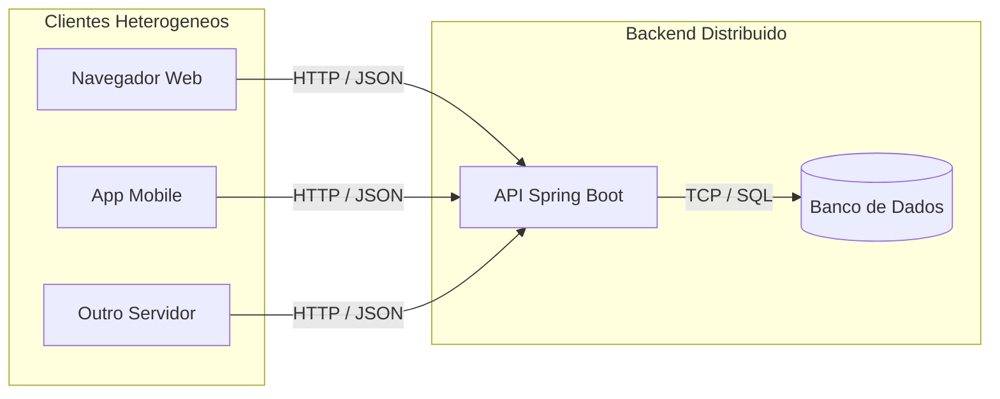

### Definição de API e fronteira de abstração

A sigla **API** (*Application Programming Interface*) define o contrato formal por meio do qual dois módulos de software interagem. Ela encapsula a complexidade interna do fornecedor do serviço e restringe o acesso aos métodos ou canais previamente estabelecidos.

- **API de biblioteca nativa:** A classe `java.util.List` expõe operações como `.add()` ou `.size()`. O programador consome o serviço sem necessitar conhecer se a implementação subjacente usa arrays dimensionais contíguos (`ArrayList`) ou nós encadeados em ponteiros (`LinkedList`).
- **API Web:** A fronteira de comunicação transpõe o limite da memória do computador e opera através de protocolos de rede da família TCP/IP (comumente HTTP/HTTPS). A API Web publica rotas que recebem dados estruturados, invocam a lógica interna do servidor e retornam uma representação serializada.

### Diferenças entre aplicações com renderização em servidor e APIs Web

No paradigma clássico de aplicações Web com renderização no servidor (Server-Side Rendering — SSR), como em sistemas Java legados com JSP, JSF ou Spring MVC tradicional com Thymeleaf, o servidor processa a solicitação do banco de dados, compõe a marcação visual HTML com CSS embutido e despacha uma página gráfica pronta para ser exibida pelo motor do navegador.

Em contrapartida, uma **API Web** atua estritamente como provedora de dados e regras de negócio. O servidor não assume a responsabilidade de layout, estilo visual ou interação em tempo de renderização de telas. A resposta trafega na forma de representações agnósticas (predominantemente JSON), conferindo total autonomia para que o cliente decida como tais dados serão consumidos, processados ou projetados em telas.

| Propriedade | Renderização no Servidor (HTML/SSR) | API Web Baseada em Dados (REST/JSON) |
|---|---|---|
| **Carga de processamento** | Servidor renderiza layout, HTML e tags visuais | Servidor computa apenas dados; cliente monta a UI |
| **Payload de rede** | Alto (HTML completo, classes CSS, scripts) | Reduzido (apenas atributos de dados em JSON) |
| **Acoplamento cliente** | Restrito a clientes com motor navegador Web | Suporta web, mobile, CLI, smart TVs, parceiros B2B |
| **Escalabilidade do backend** | Menor, devido ao custo de montagem de templates | Maior, pela serialização leve de estruturas de dados |

### O modelo arquitetural cliente-servidor

O modelo cliente-servidor baseia-se na assimetria de responsabilidades:

1. **Cliente:** Atua ativamente como agente emissor. Inicia a conversa despachando uma **requisição HTTP** (*request*) pela rede para um destino especificado.
2. **Servidor:** Permanece passivamente aguardando conexões em uma porta de rede pré-determinada (por padrão, porta `8080` no Spring Boot com Tomcat embutido). Ao receber o sinal, o servidor decodifica a mensagem, processa os algoritmos de domínio e devolve uma **resposta HTTP** (*response*), encerrando ou liberando o canal para novos ciclos.

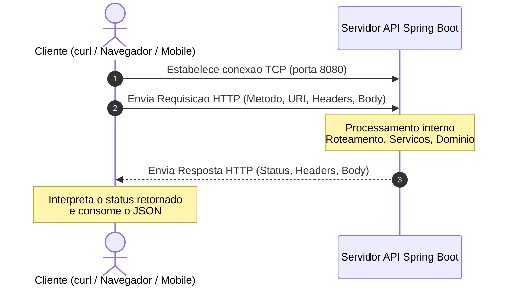

---

## Anatomia de Requisicoes e Respostas HTTP

O protocolo **HTTP** (*Hypertext Transfer Protocol*), padronizado em sua semântica pela RFC 9110, rege o intercâmbio de dados na Web. O protocolo é baseado em texto simples transmitido sobre uma camada de transporte confiável (TCP).

### Estrutura formal de uma requisição HTTP

Uma requisição HTTP divide-se em três seções obrigatórias: **Linha de Comando (Request Line)**, **Cabeçalhos (Headers)** e **Corpo (Message Body)**.

```http
POST /api/produtos HTTP/1.1
Host: localhost:8080
Content-Type: application/json
Accept: application/json
User-Agent: curl/8.7.1

{
  "codigoBarra": "7891000300012",
  "descricao": "Teclado Mecanico USB",
  "saldoEstoque": 45,
  "valorUnitario": 289.90,
  "grupoProdutoId": 2,
  "status": 1
}
```

Dissecação dos componentes:
- **Método HTTP (`POST`):** Define a intenção semântica da requisição perante o servidor.
- **Identificador de Destino / URI (`/api/produtos`):** Identifica a coleção de recursos visada.
- **Versão do Protocolo (`HTTP/1.1`):** Estabelece o padrão de empacotamento da mensagem.
- **Cabeçalhos da Requisição:** Metadados estruturados no padrão chave-valor informando ao servidor detalhes sobre a requisição (ex.: formato do dado enviado, formato aceito pelo cliente, identificação do software emissor).
- **Linha em Branco:** Um separador de quebra de linha (`\r\n`) que delimita com precisão o encerramento dos metadados e o início dos dados.
- **Corpo da Requisição:** Os dados brutos serializados enviados para processamento. Presente rotineiramente em métodos de criação e atualização (`POST`, `PUT`), mas ausente em requisições de consulta simples (`GET`).

### Estrutura formal de uma resposta HTTP

A resposta gerada pelo servidor devolve o resultado da operação, organizada em: **Linha de Status (Status Line)**, **Cabeçalhos de Resposta** e **Corpo**.

```http
HTTP/1.1 201 Created
Location: /api/produtos/84
Content-Type: application/json
Content-Length: 135
Date: Thu, 13 Aug 2026 14:30:00 GMT

{
  "id": 84,
  "codigoBarra": "7891000300012",
  "descricao": "Teclado Mecanico USB",
  "saldoEstoque": 45,
  "valorUnitario": 289.90,
  "status": 1
}
```

Dissecação dos componentes:
- **Versão do Protocolo (`HTTP/1.1`):** Confirmação da versão suportada.
- **Código de Status (`201`):** Dígito numérico padronizado indicando o desfecho da requisição.
- **Frase de Justificativa / Reason Phrase (`Created`):** Mensagem legível descritiva do código numérico.
- **Cabeçalhos de Resposta:** Metadados técnicos fornecidos pelo servidor (ex.: `Location` indicando o caminho direto para acessar o item recém-gerado; `Content-Type` indicando como o cliente deve decodificar os bytes da carga útil).
- **Corpo da Resposta:** A representação do recurso após o processamento bem-sucedido.

### Cabeçalhos fundamentais na comunicação HTTP

| Cabeçalho | Categoria | Finalidade | Exemplo de Aplicação |
|---|---|---|---|
| `Content-Type` | Entidade | Notifica o formato de mídia (*MIME type*) contido no corpo da mensagem | `Content-Type: application/json` |
| `Accept` | Negociação | Comunica ao servidor quais tipos de representação o cliente suporta receber | `Accept: application/json` |
| `Location` | Resposta | Indica a URI do recurso recém-criado ou para onde o cliente deve ser redirecionado | `Location: /api/produtos/84` |
| `Authorization` | Segurança | Transporta credenciais, certificados ou tokens de autenticação (ex.: Bearer JWT) | `Authorization: Bearer eyJhbGci...` |

> [!CAUTION]
> Cabeçalhos contendo segredos ou chaves como `Authorization` **jamais** devem ser expostos em commits de código, mensagens de log, capturas de tela ou documentações didáticas.

---

## Conceitos de Recursos, URIs e Endpoints

### Identificação de recursos e modelagem de URIs

No contexto de APIs Web desenhadas sob conceitos REST, um **Recurso** é qualquer conceito abstrato ou tangível pertencente ao domínio de negócio da aplicação que possa ser nomeado, manipulado ou armazenado.

Para identificar tais recursos na rede, utiliza-se a **URI** (*Uniform Resource Identifier*). O padrão de design arquitetural recomenda fortemente o uso de **substantivos no plural**, organizados hierarquicamente para denotar relações de pertencimento e granularidade:

- `/api/produtos`: Representa a coleção integral de produtos gerenciados pela aplicação.
- `/api/produtos/10`: Representa a instância individual do produto cujo identificador único é 10.
- `/api/grupos-produtos/3/produtos`: Representa o subconjunto de produtos pertencentes ao grupo de código 3.

### Diferenciação precisa entre URI e Endpoint

É comum encontrar confusão conceitual entre os termos *Recurso*, *URI* e *Endpoint*. No entanto, cada um representa uma granularidade distinta:

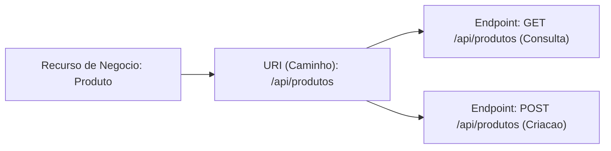

- **Recurso:** A entidade do domínio de negócio (ex.: "Livro", "Produto", "Ordem de Serviço").
- **URI:** O endereço textual que localiza e aponta para o recurso na aplicação (ex.: `/api/produtos`).
- **Endpoint:** A operação de rede concreta, definida pela intersecção entre o **Método HTTP** (a intenção) e a **URI** (o alvo).

Portanto:
- `GET /api/produtos` é o endpoint responsável pela listagem de produtos.
- `POST /api/produtos` é o endpoint responsável pelo cadastramento de um novo produto.

A URI é estritamente idêntica, mas os endpoints são completamente diferentes porque as intenções de execução são distintas.

### Padronização de rotas orientadas a recursos

Um erro frequente de desenvolvedores iniciantes é transportar a mentalidade procedural ou RPC (*Remote Procedure Call*) para as URIs da Web, criando nomes que incluem verbos ou comandos imperativos na rota.

| Padrão Orientado a RPC (Anti-padrão em REST) | Padrão Orientado a Recursos (Correto em REST) | Método HTTP |
|---|---|---|
| `/api/obterProdutos` | `/api/produtos` | `GET` |
| `/api/criarProduto` | `/api/produtos` | `POST` |
| `/api/atualizarProduto?id=10` | `/api/produtos/10` | `PUT` |
| `/api/excluirProdutoPorId/10` | `/api/produtos/10` | `DELETE` |

No modelo REST, a ação ou verbo é fornecida universalmente pelo método do protocolo HTTP. A URI permanece limpa, estável e puramente declarativa de substantivos.

---

## Metodos HTTP, Idempotencia e Codigos de Status

### Semântica dos métodos principais no padrão REST

O protocolo HTTP disponibiliza verbos padronizados que estabelecem um mapeamento natural para as operações fundamentais de manipulação de dados (CRUD - *Create, Read, Update, Delete*):

- **`GET`:** Requisita a recuperação de uma representação de um recurso específico ou de uma coleção. Não transporta dados no corpo da mensagem.
- **`POST`:** Submete uma entidade subordinada para ser processada pela coleção indicada na URI. É utilizado fundamentalmente para a criação de novos registros no servidor.
- **`PUT`:** Requisita que o estado do recurso localizado na URI seja integralmente substituído pelo payload fornecido no corpo da mensagem.
- **`DELETE`:** Requisita a remoção lógica ou física do recurso associado à URI indicada.

### Segurança e idempotência na especificação RFC 9110

A especificação oficial do protocolo HTTP estabelece garantias formais para a execução dos métodos de requisição:

1. **Método Seguro (*Safe Method*):** Um método é categorizado como seguro quando sua semântica é estritamente de **leitura**. Sua invocação pelo cliente não causa alterações de estado no sistema nem produz efeitos colaterais nos recursos gerenciados (excluindo-se operações operacionais secundárias do servidor, como escrita de logs de acesso ou atualização de métricas). `GET` e `HEAD` são seguros.
2. **Método Idempotente (*Idempotent Method*):** Um método é caracterizado como idempotente quando a realização de múltiplas requisições idênticas consecutivas produz exatamente o **mesmo efeito no estado final do servidor** que a execução de uma única requisição.

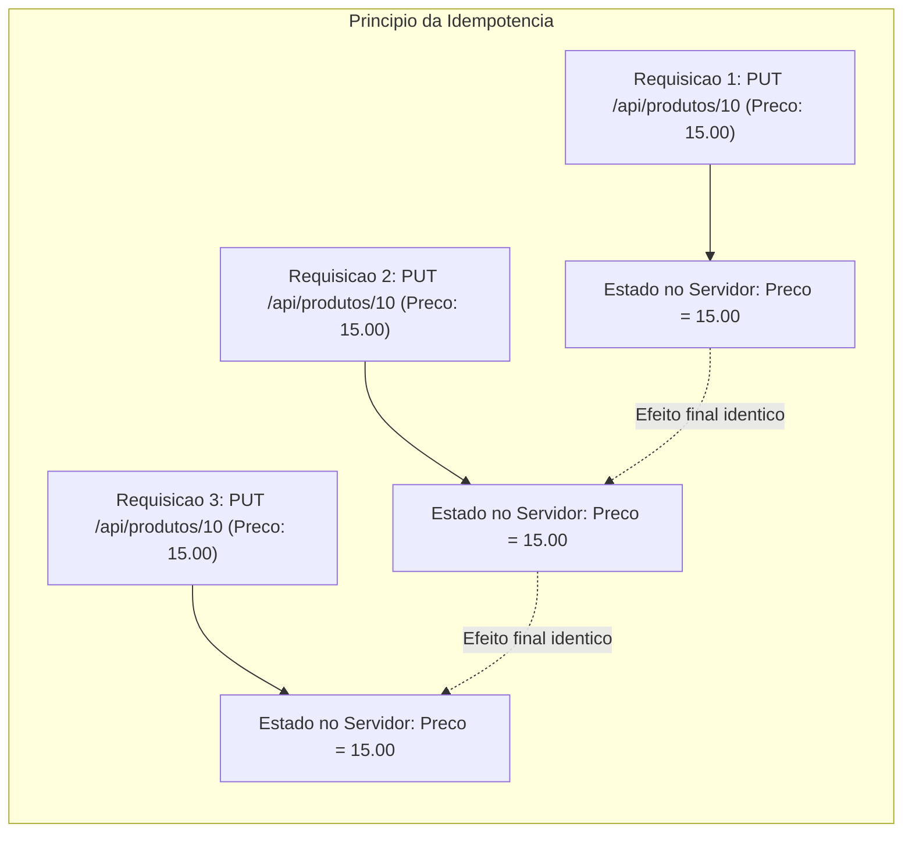

> [!NOTE]
> Idempotência refere-se ao **efeito colateral no recurso no servidor**, e não ao código de resposta HTTP devolvido ao cliente. Se uma requisição inicial `DELETE /api/produtos/10` remove o item e responde `204 No Content`, uma segunda tentativa idêntica pode responder `404 Not Found`. Ainda assim, a operação é idempotente porque o estado final do sistema permaneceu inalterado: o produto 10 não existe no banco de dados.

#### Matriz de propriedades dos métodos HTTP

| Método HTTP | Operação de Domínio (CRUD) | Seguro? | Idempotente? | Códigos de Retorno Esperados |
|---|---|---|---|---|
| `GET` | Leitura (*Read*) | **Sim** | **Sim** | `200 OK`, `404 Not Found` |
| `POST` | Criação (*Create*) | Não | Não | `201 Created`, `400 Bad Request` |
| `PUT` | Atualização Integral (*Update*) | Não | **Sim** | `200 OK`, `204 No Content`, `404 Not Found` |
| `DELETE` | Exclusão (*Delete*) | Não | **Sim** | `204 No Content`, `404 Not Found` |

### Famílias e significados dos códigos de status HTTP

Os códigos de status são inteiros de três dígitos divididos em cinco classes semânticas:

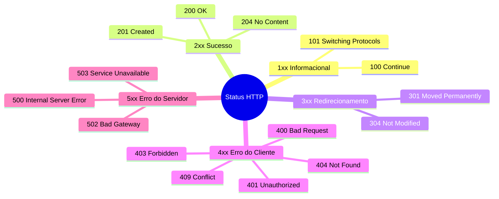

#### Tabela de códigos essenciais para o curso

| Código | Descrição Padronizada | Cenário de Aplicação na API |
|---|---|---|
| **200** | `OK` | Requisição processada com êxito e payload de retorno disponível (ex.: consultas `GET` e atualizações `PUT`). |
| **201** | `Created` | Novo registro persistido com sucesso (respostas a `POST`). Deve vir acompanhado do cabeçalho `Location`. |
| **204** | `No Content` | Execução bem-sucedida, mas a resposta deliberadamente não carrega nenhum corpo (típico de `DELETE`). |
| **400** | `Bad Request` | O cliente enviou dados malformados, JSON com sintaxe incorreta ou falhas em validações de negócio. |
| **404** | `Not Found` | A URI apontada não corresponde a nenhum recurso existente na base do servidor. |
| **409** | `Conflict` | Violação de integridade ou estado de dados concorrente (ex.: tentativa de cadastrar um código único duplicado). |
| **500** | `Internal Server Error` | Erro não capturado ou falha de infraestrutura interna do servidor (bug no código, banco inacessível). |

> [!WARNING]
> Constitui um grave anti-padrão de engenharia responder requisições que falharam com o código `200 OK`, inserindo uma mensagem de falha no corpo do JSON (ex.: `{"sucesso": false, "erro": "Produto não encontrado"}`). Isso quebra as camadas de monitoramento, pipelines de proxy, balanceadores de carga e tratamentos declarativos em clientes HTTP.

---

## Introducao ao Formato JSON e Principios REST

### O formato JSON como representação intermediária

O **JSON** (*JavaScript Object Notation*) é um formato textual leve de intercâmbio de dados independente de linguagem de programação. Seus tipos de dados primitivos são:

- **String:** Sequência de caracteres UTF-8 delimitada por aspas duplas (`"texto"`).
- **Number:** Valores numéricos inteiros ou de ponto flutuante (`42`, `189.90`).
- **Boolean:** Literais booleanos estritos (`true` ou `false`).
- **Null:** Representação explícita de ausência de valor (`null`).
- **Object:** Coleção desordenada de pares chave/valor delimitada por chaves (`{ "chave": valor }`).
- **Array:** Lista indexada e ordenada de valores delimitada por colchetes (`[ 1, 2, 3 ]`).

### Diferença entre modelo de domínio, persistência e representação

Um erro conceitual comum é supor que a tabela do banco de dados relacional, a classe de entidade Java e a estrutura JSON trafegada pela rede são a mesma entidade. Na realidade, tratam-se de representações distintas do mesmo conceito de negócio em camadas diferentes:

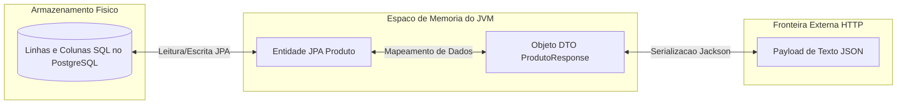

- **Tabela Relacional:** Organizada para integridade referencial, normalização e armazenamento em disco.
- **Entidade JPA Java:** Objeto rico em memória que possui ciclo de vida gerido pelo Hibernate e gerencia associações em memória.
- **DTO (*Data Transfer Object*):** Estrutura plana desenhada exclusivamente para transferir dados necessários para a tela ou receber comandos seguros, ocultando dados sensíveis ou detalhes internos do banco.
- **JSON:** A serialização dos dados do DTO em formato textual para trafegar pela rede via protocolo HTTP.

### Restrições arquiteturais do estilo REST

**REST** (*Representational State Transfer*) não é uma especificação técnica, ferramenta, biblioteca ou anotação do Spring. É um **estilo arquitetural** formulado por Roy Fielding em sua tese de doutorado (2000), concebido para guiar o design de sistemas hipermidiáticos e distribuídos.

Principais restrições arquiteturais do REST:

1. **Cliente-Servidor:** Separação estrita entre a interface de usuário/consumidor e a camada de armazenamento/regras de negócio.
2. **Stateless (Comunicação sem Estado de Sessão):** Cada requisição do cliente para o servidor deve conter absolutamente todas as informações contextuais necessárias para que o servidor possa interpretá-la e executá-la. O servidor não mantém variáveis de sessão atreladas à conexão do cliente na memória.
3. **Cacheabilidade (*Cacheable*):** As respostas devem explicitar formalmente por meio de cabeçalhos HTTP se podem ou não ser armazenadas em cache por clientes e intermediários.
4. **Interface Uniforme:** A interação deve seguir padrões universais: identificação declarativa de recursos através de URIs, manipulação de recursos através de representações, mensagens auto-descritivas e hipermídia como motor do estado da aplicação (HATEOAS).
5. **Sistema em Camadas (*Layered System*):** O cliente não é capaz de discernir se está conectado diretamente ao servidor final ou a intermediários (como proxies reversos, balanceadores de carga ou firewalls de aplicação).

---

## Camadas da Aplicacao e Fluxo de Requisicao no Spring Boot

### Divisão em camadas de responsabilidade

O Spring Boot adota e fomenta uma arquitetura corporativa dividida em camadas, assegurando o princípio da responsabilidade única (*Single Responsibility Principle*):

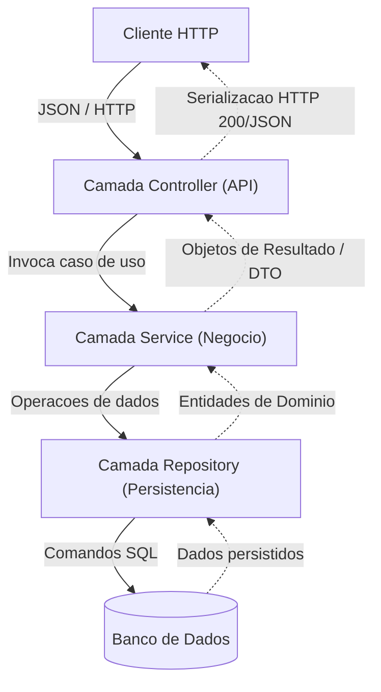

| Camada | Classe Típica | Responsabilidades | O que NÃO deve conter |
|---|---|---|---|
| **Controller** | `ProdutoController` | Recebe requisições HTTP, valida sintaxe básica, orquestra DTOs e devolve respostas com status HTTP adequado. | Consultas SQL, lógicas complexas de validação de regras de negócio, acesso direto a conexões JDBC. |
| **Service** | `ProdutoService` | Implementa regras de negócio, coordena transações bancárias e orquestra fluxos operacionais. | Imports de classes web (`HttpServletRequest`, anotações HTTP), formatação de JSON. |
| **Repository** | `ProdutoRepository` | Abstrai as interações com o banco de dados (consultas, inserções, atualizações). | Regras de validação de domínio, lógicas de apresentação. |
| **Domain** | `Produto` | Modela as entidades centrais do negócio, encapsula comportamentos puros do domínio. | Anotações de controle HTTP ou lógicas de infraestrutura de rede. |

### Ciclo de vida de uma requisição HTTP no Spring MVC

Quando um cliente executa uma chamada como `GET /api/health`, ocorre uma cadeia de orquestração interna no ecossistema Spring:

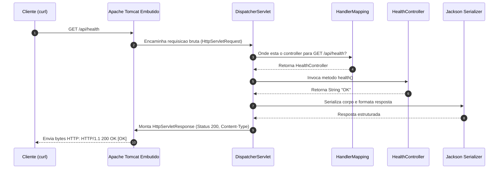

1. **Tomcat Embutido:** O conector de rede escuta o socket TCP na porta `8080`, interpreta os bytes e cria instâncias de `HttpServletRequest` e `HttpServletResponse`.
2. **DispatcherServlet:** Atua como *Front Controller* central do Spring MVC, interceptando todas as requisições de entrada.
3. **HandlerMapping:** O `DispatcherServlet` consulta a tabela interna de rotas compilada na inicialização do framework para descobrir qual método de qual classe `@RestController` atende à rota `/api/health`.
4. **Invocação do Controller:** O método correspondente na classe anotada é acionado via reflexão computacional.
5. **Serialização e Resposta:** O retorno do método é interceptado pelo framework. Caso seja um objeto complexo, o motor Jackson o serializa em JSON; caso seja texto puro, formata-se a resposta textual, adicionando o cabeçalho `Content-Type: text/plain` ou `application/json` e emitindo o status `200 OK`.

### Servidor Web embutido

Em arquiteturas legadas de Java corporativo (Java EE/J2EE), o desenvolvedor compilava a aplicação em um arquivo `.war` e realizava a implantação manual em um servidor web externo previamente provisionado e configurado (como um Apache Tomcat standalone, GlassFish ou WildFly).

O Spring Boot inverteu esse modelo: a aplicação é empacotada como um arquivo executável autossuficiente (`.jar`), contendo o servidor web **embutido** dentro de suas próprias dependências de compilação.
Ao invocar:
```bash
./mvnw spring-boot:run
```
ou:
```bash
java -jar target/biblioteca2026-0.0.1-SNAPSHOT.jar
```
A JVM inicializa o processo Java, o Spring cria seu contexto de aplicação e sobe programaticamente uma instância do Apache Tomcat em menos de dois segundos, ouvindo requisições de imediato.

---

## Inversao de Controle, Injecao de Dependencia e Beans

### O princípio de Inversão de Controle

No desenvolvimento tradicional sem frameworks, o programador controla diretamente o fluxo de execução e a instanciação de todas as dependências do código:

```java
// Acoplamento forte: a classe controla explicitamente a criacao da sua dependencia
public class ProdutoController {
    private ProdutoService service;

    public ProdutoController() {
        this.service = new ProdutoService(); // Instanciacao manual direta
    }
}
```

O princípio da **Inversão de Controle** (*Inversion of Control* - IoC) transfere a responsabilidade de instanciar, configurar e orquestrar os componentes de software para um agente externo, conhecido como **Container IoC**. O controle é invertido: o componente não busca suas dependências; o container as fornece sob demanda.

### Injeção de Dependência e ciclo de vida de Beans

A **Injeção de Dependência** (*Dependency Injection* - DI) é o padrão de projeto por meio do qual o Container IoC implementa a Inversão de Controle. Qualquer classe gerenciada pelo ciclo de vida do container do Spring é denominada de **Spring Bean**.

Para registrar um Bean no Spring, utilizam-se anotações estereotípicas que registram a intenção do componente:
- `@Component`: Identificador genérico de um componente gerenciado.
- `@Service`: Especialização de componente para a camada de serviços de negócio.
- `@Repository`: Especialização para classes de persistência, habilitando tratamento automático de exceções de banco.
- `@RestController`: Especialização de componente web que combina `@Controller` e `@ResponseBody`, indicando que o retorno de seus métodos deve ser gravado diretamente no corpo da resposta HTTP.

### Injeção por construtor vs Injeção por campo

Existem diferentes formas de se injetar dependências no Spring. A boa prática moderna de engenharia estipula o uso compulsório da **Injeção por Construtor**:

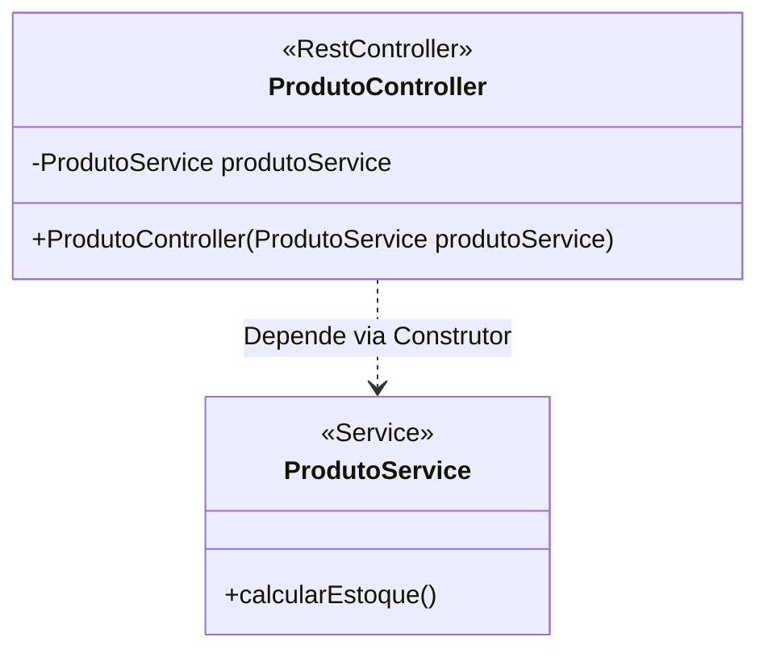

```java
// Abordagem recomendada: Injecao por Construtor (imutabilidade e facilidade de testes unitarios)
@RestController
public class ProdutoController {

    private final ProdutoService produtoService;

    // O Spring detecta automaticamente o construtor unico e injeta o bean gerenciado
    public ProdutoController(ProdutoService produtoService) {
        this.produtoService = produtoService;
    }
}
```

```java
// Anti-padrao: Injecao direta no campo via @Autowired (evitar)
@RestController
public class ProdutoController {

    @Autowired // Torna a classe refem do container Spring; impossibilita instanciacao em testes unitarios puros
    private ProdutoService produtoService;
}
```

Vantagens da injeção por construtor:
- **Imutabilidade:** Permite declarar campos como `final`.
- **Prevenção de `NullPointerException`:** Garante que a classe nunca seja instanciada sem suas dependências necessárias.
- **Testabilidade:** Facilita testes de unidade isolados, pois o desenvolvedor pode passar mocks manualmente pelo construtor sem inicializar o contexto do Spring.

---

## Configuracao do Projeto com Spring Initializr e pom.xml

### O papel do Spring Initializr

O **Spring Initializr** (hospedado em `start.spring.io`) é o serviço web oficial provido pela equipe do Spring para gerar a estrutura base de novos projetos. Ele resolve a complexidade de compor arquivos de configuração Maven ou Gradle, declarando versões compatíveis entre os diversos módulos do ecossistema.

O serviço pode ser consumido de duas formas equivalentes:
1. **Via Navegador:** Configuração dos metadados no formulário web, gerando um pacote comprimido `.zip`.
2. **Via IDE Integrada:** No IntelliJ IDEA Ultimate, através do menu `New Project -> Spring Boot`, que consome a API do próprio `start.spring.io` sob o capô.

### Coordenadas Maven e dependências no pom.xml

O **Maven** é a ferramenta de gerenciamento de dependências e automação de build adotada no curso. A anatomia do arquivo `pom.xml` (*Project Object Model*) define a identidade da aplicação através das chamadas **Coordenadas Maven**:

```xml
<groupId>com.curso</groupId>
<artifactId>biblioteca2026</artifactId>
<version>0.0.1-SNAPSHOT</version>
<name>biblioteca2026</name>
```

- **`groupId`:** Representa a organização, empresa ou pacote raiz do projeto no ecossistema (convenção: domínio invertido, ex.: `com.curso`).
- **`artifactId`:** O nome do módulo ou do artefato final compilado (letras minúsculas, hífens ou números, sem caracteres especiais).
- **`version`:** Versão atual do ciclo de desenvolvimento do software (o sufixo `SNAPSHOT` indica uma versão instável de trabalho).
- **`parent`:** Declaração de herança do `spring-boot-starter-parent`, que provê defaults sensatos de compilação Java e gerencia todas as versões das dependências oficiais (BOM - *Bill of Materials*).

### O ecossistema de Starters do Spring Boot

Um **Starter** do Spring Boot consiste em um descritor de dependências Maven agregado que reúne todas as bibliotecas transitivas comumente necessárias para um determinado propósito arquitetural.

Ao declarar:
```xml
<dependency>
    <groupId>org.springframework.boot</groupId>
    <artifactId>spring-boot-starter-webmvc</artifactId>
</dependency>
```

O Maven realiza o download automático e a configuração de:
- Spring Framework (módulos Core, Beans, Context, Expression, AOP).
- Spring Web e Spring MVC.
- Servidor web Apache Tomcat embutido.
- Biblioteca de serialização e desserialização Jackson JSON.

#### Dependências introduzidas na Aula 02

- `spring-boot-starter-webmvc`: Suporte à criação de APIs RESTful e servidor embutido.
- `spring-boot-starter-validation`: Provê a especificação Jakarta Bean Validation e motor Hibernate Validator.
- `spring-boot-devtools` (escopo runtime/opcional): Habilita reinicialização rápida da aplicação durante o ciclo de desenvolvimento.

> [!IMPORTANT]
> Dependências como `spring-boot-starter-data-jpa` e drivers de banco de dados (`postgresql`) foram estritamente descartadas na geração desta aula. Incluir starters de banco sem prover uma URL de conexão válida (`DataSource`) faz com que a autoconfiguração do Spring Boot aborte a inicialização do sistema com um erro crítico `Failed to configure a DataSource`.

---

## Uso do Maven Wrapper e Criacao do Endpoint /api/health

### Padronização de ambiente com Maven Wrapper

O **Maven Wrapper** é uma ferramenta indispensável para engenharia de software colaborativa. Ele consiste em pequenos scripts executáveis (`mvnw` para Unix/macOS e `mvnw.cmd` para Windows) acompanhados de uma pasta de configuração `.mvn/wrapper/`.

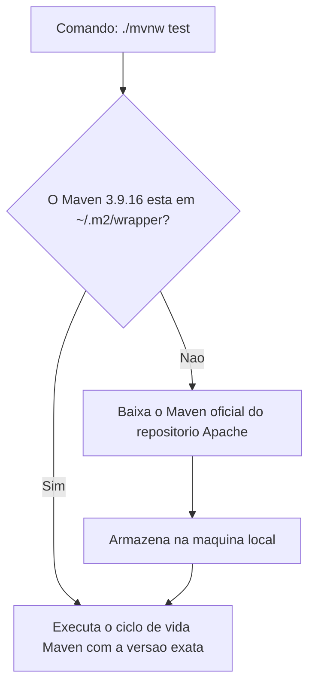

Sua finalidade é garantir que:
1. Todos os membros do time e os servidores de integração contínua (CI/CD) usem rigorosamente a mesma versão do Maven (no nosso material, `3.9.16`).
2. O desenvolvedor não precise instalar o Maven previamente no sistema operacional. Na primeira execução, o script baixa a distribuição compatível de forma transparente.

### Implementação técnica do HealthController

Para testar a infraestrutura básica do projeto, cria-se o pacote `.api` logo abaixo do pacote raiz da aplicação (`com.curso.suporteos.api` ou `com.curso.biblioteca.api`) e adiciona-se o primeiro controller HTTP:

```java
package com.curso.biblioteca.api;

import org.springframework.web.bind.annotation.GetMapping;
import org.springframework.web.bind.annotation.RestController;

/**
 * Endpoint de infraestrutura para diagnostico inicial de prontidao da aplicacao.
 */
@RestController
public class HealthController {

    @GetMapping("/api/health")
    public String health() {
        return "OK";
    }
}
```

- `@RestController`: Informa ao Spring que a classe responde por requisições web e que a string `"OK"` retornada deve ser gravada diretamente no corpo da resposta HTTP (com código padrão `200 OK`), dispensando a renderização de telas HTML.
- `@GetMapping("/api/health")`: Registra no `HandlerMapping` que requisições HTTP utilizando o método `GET` na URI `/api/health` devem acionar este método.

### Significado e limites do endpoint de verificação inicial

O teste bem-sucedido de `GET /api/health` provê evidências técnicas claras:

| O que o `/api/health` desta aula CONFIRMA | O que o `/api/health` NÃO confirma |
|---|---|
| A JVM Java 21 inicializou corretamente | Que o banco de dados relacional está conectado |
| O contexto de aplicação do Spring foi criado | Que as migrações de schema (Liquibase) rodaram |
| O Tomcat embutido iniciou e escuta na porta 8080 | Que as regras de negócio do domínio funcionam |
| O `DispatcherServlet` mapeou o `HealthController` | Que o sistema possui autenticação segura |
| O tráfego de requisição e resposta HTTP funcionou | Que integrações externas de rede estão disponíveis |

Trata-se de um teste de fumaça (*smoke test*) pedagógico de prontidão da infraestrutura de software mínima.

---

## Código da aula

O código introduzido nesta aula fundamenta a arquitetura de base do projeto. Abaixo são detalhados os arquivos centrais presentes no diretório [`./codigo`](./codigo).

### Arquivo pom.xml

O descritor de dependências define o parent e as bibliotecas estritamente necessárias para a execução da API didática com Tomcat embutido.

```xml
<?xml version="1.0" encoding="UTF-8"?>
<project xmlns="http://maven.apache.org/POM/4.0.0" 
         xmlns:xsi="http://www.w3.org/2001/XMLSchema-instance"
         xsi:schemaLocation="http://maven.apache.org/POM/4.0.0 
         https://maven.apache.org/xsd/maven-4.0.0.xsd">
    <modelVersion>4.0.0</modelVersion>
    
    <!-- 1. Heranca de padroes e gestao de versoes do ecossistema Spring Boot -->
    <parent>
        <groupId>org.springframework.boot</groupId>
        <artifactId>spring-boot-starter-parent</artifactId>
        <version>4.0.7</version>
        <relativePath/>
    </parent>
    
    <!-- 2. Coordenadas do artefato local -->
    <groupId>com.curso</groupId>
    <artifactId>suporteos2026</artifactId>
    <version>0.0.1-SNAPSHOT</version>
    <name>suporteos2026</name>
    <description>API didatica do curso de Spring Boot 2026</description>
    
    <!-- 3. Propriedades de compilacao -->
    <properties>
        <java.version>21</java.version>
    </properties>
    
    <!-- 4. Declaracao modular de dependencias -->
    <dependencies>
        <!-- Suporte a validacao declarativa (Jakarta Bean Validation) -->
        <dependency>
            <groupId>org.springframework.boot</groupId>
            <artifactId>spring-boot-starter-validation</artifactId>
        </dependency>
        
        <!-- Motor Spring MVC com servidor Apache Tomcat embutido -->
        <dependency>
            <groupId>org.springframework.boot</groupId>
            <artifactId>spring-boot-starter-webmvc</artifactId>
        </dependency>

        <!-- Reinicializacao dinamica em desenvolvimento -->
        <dependency>
            <groupId>org.springframework.boot</groupId>
            <artifactId>spring-boot-devtools</artifactId>
            <scope>runtime</scope>
            <optional>true</optional>
        </dependency>
        
        <!-- Modulos de teste unitario e integracao do Spring Test -->
        <dependency>
            <groupId>org.springframework.boot</groupId>
            <artifactId>spring-boot-starter-validation-test</artifactId>
            <scope>test</scope>
        </dependency>
        <dependency>
            <groupId>org.springframework.boot</groupId>
            <artifactId>spring-boot-starter-webmvc-test</artifactId>
            <scope>test</scope>
        </dependency>
    </dependencies>

    <!-- 5. Plugins de construcao -->
    <build>
        <plugins>
            <!-- Permite gerar o JAR executavel auto-contido -->
            <plugin>
                <groupId>org.springframework.boot</groupId>
                <artifactId>spring-boot-maven-plugin</artifactId>
            </plugin>
        </plugins>
    </build>
</project>
```

### Arquivo SuporteOsApplication.java (Referência do Professor)

Arquivo correspondente em [`./codigo/SuporteOsApplication.java`](./codigo/SuporteOsApplication.java), integrando a classe principal de boot e o controller mínimo de saúde:

```java
package com.curso.suporteos;

import org.springframework.boot.SpringApplication;
import org.springframework.boot.autoconfigure.SpringBootApplication;
import org.springframework.web.bind.annotation.GetMapping;
import org.springframework.web.bind.annotation.RestController;

/**
 * Ponto de entrada oficial da aplicacao suporteos2026.
 * 
 * A anotacao @SpringBootApplication agrega:
 * - @Configuration: Define a classe como fonte de definicoes de beans.
 * - @EnableAutoConfiguration: Habilita os mecanismos inteligentes de autoconfiguracao do Spring.
 * - @ComponentScan: Escaneia recursivamente todos os subpacotes procurando componentes gerenciados.
 */
@SpringBootApplication
public class Suporteos2026Application {

    public static void main(String[] args) {
        // Dispara a inicializacao da JVM, o Spring Context e o Apache Tomcat embutido
        SpringApplication.run(Suporteos2026Application.class, args);
    }
}

/**
 * Controller de infraestrutura do projeto de referencia.
 */
@RestController
class HealthController {

    /**
     * Mapeamento de verificacao de saude HTTP.
     * @return "OK" com codigo HTTP 200 padrao.
     */
    @GetMapping("/api/health")
    public String health() {
        return "OK";
    }
}
```

### Arquivo BibliotecaApplication.java (Projeto Temático Didático)

Arquivo representativo da resolução de aluno em [`./codigo/BibliotecaApplication.java`](./codigo/BibliotecaApplication.java):

```java
package com.curso.biblioteca;

import org.springframework.boot.SpringApplication;
import org.springframework.boot.autoconfigure.SpringBootApplication;
import org.springframework.web.bind.annotation.GetMapping;
import org.springframework.web.bind.annotation.RestController;

/**
 * Ponto de entrada da aplicacao tematica biblioteca2026.
 */
@SpringBootApplication
public class Biblioteca2026Application {

    public static void main(String[] args) {
        SpringApplication.run(Biblioteca2026Application.class, args);
    }
}

/**
 * Controller de integridade do projeto tematico.
 */
@RestController
class HealthController {

    @GetMapping("/api/health")
    public String health() {
        return "OK";
    }
}
```

### Arquivo application.properties

Localizado em `src/main/resources/application.properties`, estabelece a identidade da aplicação:

```properties
# Nome logico da aplicacao nos registros de log e monitoramento
spring.application.name=biblioteca2026
```

### Arquivo de Teste de Contexto (ApplicationTests.java)

Localizado em `src/test/java/com/curso/biblioteca/Biblioteca2026ApplicationTests.java`:

```java
package com.curso.biblioteca;

import org.junit.jupiter.api.Test;
import org.springframework.boot.test.context.SpringBootTest;

/**
 * Teste de fumaça que valida a integridade do carregamento do ApplicationContext.
 */
@SpringBootTest
class Biblioteca2026ApplicationTests {

    @Test
    void contextLoads() {
        // O teste tera sucesso se o Spring Context subir sem lancamento de excecoes criticas
    }
}
```

---

## Exercícios

### Exercício 1: Definição e Validação do Tema Temático

#### Enunciado
Defina a ficha do projeto individual contendo uma entidade de classificação e uma entidade principal correlacionada em multiplicidade 1:N. A entidade principal deve ter obrigatoriamente: identificador numérico, código único de busca negocial, descrição, medida quantitativa, valor monetário, data relevante e status. Apresente três registros de exemplo ilustrativos e documente a ficha no formato Markdown.

#### Raciocínio
A restrição de domínio garante que o estudante modele um sistema compatível com todas as práticas do semestre. A presença da medida quantitativa exigirá o manuseio de números inteiros/decimais com validações como `@PositiveOrZero`; o valor monetário exigirá o uso do tipo de precisão exata `BigDecimal`; o código único exigirá restrições de integridade no banco e validações de conflito HTTP 409; a entidade de classificação exigirá o mapeamento de chaves estrangeiras JPA (`@ManyToOne`).

#### Resolução Completa
Arquivo: `docs/tema-do-projeto.md`

```markdown
# Tema do Projeto: biblioteca2026

## Identificação
- Nome do projeto: biblioteca2026
- Tema: Gestão de acervo de biblioteca didática universitária
- Objetivo em uma frase: Gerenciar o catálogo de livros didáticos e organizá-los hierarquicamente por categorias de conhecimento.

## Entidade de Classificação
- Nome no singular: CategoriaLivro
- Nome no plural: CategoriasLivro
- Atributos:
  - id (Long, identificador do sistema)
  - descricao (String, nome da categoria)
  - status (Integer, 1 para ativo, 0 para inativo)
- Exemplo 1: Literatura Brasileira
- Exemplo 2: Engenharia de Software

## Entidade Principal
- Nome no singular: Livro
- Nome no plural: Livros
- Atributos obrigatórios:
  - id (Long, identificador do sistema)
  - isbn (String, código único internacional de 13 dígitos)
  - titulo (String, descrição/nome do livro)
  - exemplaresDisponiveis (Integer, medida quantitativa de estoque físico)
  - valorReposicao (BigDecimal, valor monetário de reposição em caso de perda)
  - dataCadastro (LocalDate, data de entrada no acervo)
  - status (Integer, 1 para ativo, 0 para inativo)
  - categoriaLivroId (Long, referência para a chave estrangeira da classificação)

## Relacionamento
- Uma CategoriaLivro pode classificar vários Livros (1:N).
- Cada Livro pertence obrigatoriamente a uma CategoriaLivro (N:1).

## Três Exemplos de Registros de Livros

1. **Registro 1:**
   - ISBN: 9788575225639
   - Título: Engenharia de Software Moderna
   - Exemplares Disponíveis: 12
   - Valor de Reposição: R$ 89,00
   - Data de Cadastro: 2026-08-13
   - Categoria: Engenharia de Software
   - Status: Ativo

2. **Registro 2:**
   - ISBN: 9788576082675
   - Título: Código Limpo
   - Exemplares Disponíveis: 5
   - Valor de Reposição: R$ 115,50
   - Data de Cadastro: 2026-08-13
   - Categoria: Engenharia de Software
   - Status: Ativo

3. **Registro 3:**
   - ISBN: 9788535914849
   - Título: Dom Casmurro
   - Exemplares Disponíveis: 20
   - Valor de Reposição: R$ 45,00
   - Data de Cadastro: 2026-08-13
   - Categoria: Literatura Brasileira
   - Status: Ativo
```

---

### Exercício 2: Criação e Execução da Aplicação Spring Boot

#### Enunciado
Gere a estrutura da aplicação no Spring Initializr usando Maven, Java 21 e Spring Boot 4.0.7, incorporando os starters `spring-boot-starter-webmvc` e `spring-boot-starter-validation`. Configure a propriedade `spring.application.name` e assegure que o teste automatizado de contexto inicial seja aprovado com sucesso via Maven Wrapper.

#### Raciocínio
Ao selecionar as opções no Initializr, o Maven gerará a estrutura canônica de pastas (`src/main/java`, `src/main/resources`, `src/test/java`). O teste de contexto (`contextLoads`) instancia a infraestrutura do Spring Boot. Como não declaramos drivers de banco de dados, o Spring inicializa de forma limpa em memória sem dependências externas. O Maven Wrapper garante que o teste seja executado com a versão exata do Maven do projeto.

#### Resolução Completa
1. Parâmetros preenchidos no Spring Initializr (`start.spring.io`):
   - **Project:** Maven
   - **Language:** Java
   - **Spring Boot:** 4.0.7
   - **Group:** `com.curso`
   - **Artifact:** `biblioteca2026`
   - **Name:** `biblioteca2026`
   - **Package name:** `com.curso.biblioteca`
   - **Packaging:** Jar
   - **Java:** 21
   - **Dependencies:** Spring Web, Validation, Spring Boot DevTools.

2. Configuração em `src/main/resources/application.properties`:
   ```properties
   spring.application.name=biblioteca2026
   ```

3. Execução do teste de fumaça via terminal na raiz do projeto:
   - Em Linux ou macOS:
     ```bash
     ./mvnw clean test
     ```
   - Em Windows (PowerShell):
     ```powershell
     .\mvnw.cmd clean test
     ```

4. Saída esperada no terminal evidenciando o sucesso:
   ```text
   [INFO] Tests run: 1, Failures: 0, Errors: 0, Skipped: 0
   [INFO] ------------------------------------------------------------------------
   [INFO] BUILD SUCCESS
   [INFO] ------------------------------------------------------------------------
   ```

---

### Exercício 3: Implementação do Endpoint de Health Check

#### Enunciado
Implemente no pacote `.api` da aplicação a classe `HealthController` contendo um endpoint acessível via método HTTP `GET` no caminho `/api/health`. O método deve retornar a cadeia de caracteres `"OK"` e o código de status HTTP deve ser 200. Teste o endpoint com ferramentas de terminal e inspecione os cabeçalhos de resposta.

#### Raciocínio
A criação de um controller anotado com `@RestController` instrui o Spring MVC a registrar a rota no `HandlerMapping`. O retorno de um tipo primitivo `String` faz com que o Spring componha uma resposta HTTP com `Content-Type: text/plain;charset=UTF-8` e corpo contendo `"OK"`, emitindo o status `200 OK` por padrão.

#### Resolução Completa
Arquivo de código: [`./codigo/BibliotecaApplication.java`](./codigo/BibliotecaApplication.java)

1. Criação do arquivo `src/main/java/com/curso/biblioteca/api/HealthController.java`:
   ```java
   package com.curso.biblioteca.api;

   import org.springframework.web.bind.annotation.GetMapping;
   import org.springframework.web.bind.annotation.RestController;

   @RestController
   public class HealthController {

       @GetMapping("/api/health")
       public String health() {
           return "OK";
       }
   }
   ```

2. Inicialização da aplicação pelo terminal:
   ```bash
   ./mvnw spring-boot:run
   ```

3. Verificação com utilitário `curl` detalhando os cabeçalhos (`-i`):
   ```bash
   curl -i http://localhost:8080/api/health
   ```

4. Resposta e cabeçalhos capturados:
   ```http
   HTTP/1.1 200 OK
   Content-Type: text/plain;charset=UTF-8
   Content-Length: 2
   Date: Thu, 13 Aug 2026 14:35:00 GMT

   OK
   ```

---

### Exercício 4: Documentação e Publicação no Repositório GitHub

#### Enunciado
Configure o arquivo `.gitignore` para bloquear artefatos de compilação locais e metadados de IDEs. Inicialize o repositório Git local, associe-o a um repositório remoto criado na sua conta do GitHub com o nome do artefato temático (ex.: `biblioteca2026`), faça o primeiro commit e publique na branch `main`.

#### Raciocínio
Repositórios de código devem conter exclusivamente arquivos-fonte e instruções de automação de build necessárias para compilar o projeto em qualquer ambiente limpo. Binários gerados pela compilação (pasta `target/`) e arquivos de preferência pessoal ou índices locais da IDE (`.idea/`, arquivos `.iml`) geram conflitos de merge e poluem o histórico de commits.

#### Resolução Completa
1. Criação ou validação do arquivo `.gitignore` na raiz do projeto:
   ```gitignore
   target/
   !.mvn/wrapper/maven-wrapper.jar
   !**/src/main/**/target/
   !**/src/test/**/target/

   ### IntelliJ IDEA ###
   .idea/
   *.iws
   *.iml
   *.ipr
   out/

   ### Sistema Operacional e Variaveis ###
   .DS_Store
   Thumbs.db
   .env
   .env.*
   !.env.example
   ```

2. Execução dos comandos operacionais no terminal:
   ```bash
   # 1. Inicializa o repositorio definindo a branch principal como main
   git init -b main

   # 2. Adiciona os arquivos controlados ao estagio de preparacao
   git add .gitignore .mvn mvnw mvnw.cmd pom.xml README.md docs src

   # 3. Confere se nenhum arquivo indevido (ex.: target ou .idea) foi adicionado
   git status

   # 4. Registra o commit semantico
   git commit -m "Aula 02: cria o projeto Spring Boot e documenta tema"

   # 5. Adiciona o apontador remoto apontando para o seu GitHub pessoal
   git remote add origin git@github.com:SEU-USUARIO/biblioteca2026.git

   # 6. Publica os arquivos e amarra o rastreamento da branch remota
   git push -u origin main
   ```

---

## Erros comuns e boas práticas

### 1. Pacote do Controller fora da hierarquia do `@SpringBootApplication`
- **Erro:** O estudante cria o pacote `com.curso.api` enquanto a classe principal está em `com.curso.biblioteca`. O controller não é localizado e a chamada `GET /api/health` retorna `404 Not Found`.
- **Causa:** Por padrão, a anotação `@SpringBootApplication` aciona um `@ComponentScan` que busca componentes apenas a partir do pacote em que se encontra e nos seus subpacotes descendentes.
- **Solução:** Posicione a classe principal na raiz do domínio (`com.curso.biblioteca`) e todos os controllers em subpacotes diretos (`com.curso.biblioteca.api`).

### 2. Adição precipitada de starters de banco de dados
- **Erro:** O estudante inclui `spring-boot-starter-data-jpa` e `postgresql` no Initializr e a aplicação encerra no boot com a mensagem `Failed to configure a DataSource: 'url' attribute is not specified`.
- **Causa:** O Spring Boot detecta o starter JPA no classpath e tenta instanciar automaticamente um pool de conexões JDBC. Como o banco de dados e as propriedades de conexão não foram configuradas, a inicialização aborta.
- **Solução:** Não antecipe dependências. Remova o starter JPA e o driver de banco nesta aula, mantendo apenas `spring-boot-starter-webmvc` e `spring-boot-starter-validation`.

### 3. Abertura do diretório incorreto na IDE
- **Erro:** O estudante descompacta o arquivo `biblioteca2026.zip` e abre no IntelliJ a pasta externa `Projetos/` ou uma pasta aninhada contendo outra pasta `biblioteca2026`. A IDE não reconhece o projeto como Maven.
- **Causa:** O Maven exige que o arquivo `pom.xml` resida diretamente na raiz do projeto aberto na IDE.
- **Solução:** No IntelliJ, selecione **File → Open** e aponte para o diretório que contém diretamente o arquivo `pom.xml`.

### 4. Conflito de ocupação da porta TCP 8080
- **Erro:** Ao iniciar a aplicação, o log exibe `Web server failed to start. Port 8080 was already in use`.
- **Causa:** Uma instância anterior da aplicação continuou em execução em segundo plano ou outro serviço local (como Oracle XE, Jenkins ou Docker) está escutando na porta `8080`.
- **Solução:** Encerre o processo zumbi no terminal identificando seu PID (`lsof -i :8080` no Linux/macOS ou `netstat -ano | findstr 8080` no Windows seguido de `kill -9 <PID>`). Não altere a porta em `application.properties` para `8081` apenas para maquiar o problema sem investigar a causa.

### 5. Configuração do SDK com JRE em vez de JDK no IntelliJ
- **Erro:** Falhas de compilação ou mensagens indicando incapacidade de compilar anotações de código Java.
- **Causa:** Configuração da IDE apontando para uma Java Runtime Environment (JRE) pura em vez de um Java Development Kit (JDK 21) completo.
- **Solução:** Acesse **File → Project Structure → Project**, selecione **SDK** e garanta que o JDK 21 esteja selecionado.

### 6. Versionamento acidental de arquivos locais da IDE e binários
- **Erro:** O repositório no GitHub exibe pastas `.idea/` e arquivos binários da pasta `target/`.
- **Causa:** Execução precipitada de `git add .` sem validar previamente o arquivo `.gitignore`.
- **Solução:** Execute `git rm -r --cached .idea target` no terminal, certifique-se de que as entradas constam no `.gitignore` e registre um novo commit de limpeza.

### 7. Envio de push para o repositório do professor
- **Erro:** Ao tentar executar `git push origin main`, o Git recusa com erro de permissão negada (*Permission to jeffersonarpasserini/suporteos2026.git denied*).
- **Causa:** O estudante copiou o endereço de clone do repositório de referência do docente em vez de criar e associar seu próprio repositório no GitHub.
- **Solução:** Inspecione os remotos com `git remote -v`. Altere a URL com `git remote set-url origin git@github.com:SEU-USUARIO/SEU-PROJETO.git`.

---

## Links e materiais complementares

- [RFC 9110 — HTTP Semantics (IETF):](https://www.rfc-editor.org/rfc/rfc9110.html) Especificação oficial internacional que padroniza os métodos HTTP, códigos de status, semântica de idempotência e cabeçalhos.
- [Architectural Styles and the Design of Network-based Software Architectures (Roy Fielding, 2000):](https://ics.uci.edu/~fielding/pubs/dissertation/rest_arch_style.htm) Tese acadêmica fundacional que introduziu e conceituou formalmente o estilo arquitetural REST.
- [Spring Initializr:](https://start.spring.io/) Ferramenta web canônica e API para criação e estruturação de novos projetos baseados no ecossistema Spring Boot.
- [Spring Web MVC Documentation (Spring Framework):](https://docs.spring.io/spring-framework/reference/web/webmvc.html) Guia de referência técnica cobrindo a arquitetura do `DispatcherServlet`, mapeamento de controllers anotados e negociação de conteúdo.
- [Apache Maven Project:](https://maven.apache.org/) Documentação oficial sobre o ciclo de vida de build, escopos de dependências e funcionamento do arquivo `pom.xml`.
- [Repositório Oficial do Professor (suporteos2026):](https://github.com/jeffersonarpasserini/suporteos2026) Código-fonte de referência da disciplina utilizado para comparação de implementações.

---

## Mapa da aula

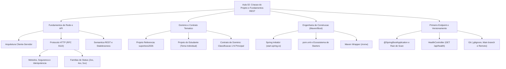

---

## Glossário

| Termo | Definição Técnica |
|---|---|
| **API** | *Application Programming Interface*. Conjunto de contratos, rotinas e ferramentas que estabelece como componentes de software devem interagir entre si sem expor suas implementações internas. |
| **API Web** | API disponibilizada através de uma rede de computadores utilizando padrões e protocolos da Web, fundamentalmente HTTP/HTTPS e formatos como JSON. |
| **HTTP** | *Hypertext Transfer Protocol*. Protocolo de nível de aplicação que rege o modelo de requisições e respostas textuais na arquitetura cliente-servidor da Web. |
| **URI** | *Uniform Resource Identifier*. Identificador compacto utilizado para endereçar e individualizar um recurso abstrato ou físico na rede. |
| **Endpoint** | Ponto de contato funcional específico exposto por uma API, caracterizado pela composição de um método HTTP com uma URI de destino. |
| **Idempotência** | Propriedade de uma operação cujo efeito observável no estado final do servidor permanece idêntico caso a operação seja executada uma única vez ou múltiplas vezes consecutivas. |
| **Método Seguro** | Método HTTP cuja intenção de execução é exclusivamente de consulta (leitura), sem produzir alterações de estado de dados no servidor. |
| **JSON** | *JavaScript Object Notation*. Formato textual aberto, leve e padronizado baseado em pares chave/valor e listas, utilizado para troca de representações de dados em APIs. |
| **REST** | *Representational State Transfer*. Estilo arquitetural para sistemas hipermidiáticos distribuídos que prescreve restrições como modelo cliente-servidor, comunicação stateless e interface uniforme. |
| **Stateless** | Característica arquitetural na qual o servidor não armazena estado de sessão conversacional entre requisições; cada requisição deve conter todo o contexto necessário para seu processamento. |
| **Inversão de Controle (IoC)** | Padrão arquitetural em que a gestão de fluxo e o ciclo de vida dos componentes de software são delegados a um container ou framework. |
| **Injeção de Dependência (DI)** | Mecanismo pelo qual o Container IoC injeta instâncias de dependências necessárias em uma classe, evitando que a própria classe as instancie com o operador `new`. |
| **Spring Bean** | Objeto Java cuja instanciação, configuração, injeção e ciclo de vida completo são administrados pelo Container Spring (`ApplicationContext`). |
| **Spring Starter** | Agregador de dependências Maven pré-configurado pelo ecossistema Spring Boot que provê todas as bibliotecas transitivas e versões necessárias para um determinado recurso. |
| **Maven Wrapper** | Conjunto de scripts e arquivos embutidos no projeto que permite compilar e executar o Maven sem necessidade de instalação local prévia no sistema operacional. |
| **Tomcat Embutido** | Instância do servidor de aplicação web Apache Tomcat incorporada diretamente dentro do executável `.jar` da aplicação Spring Boot. |
| **DispatcherServlet** | Servidor servlet central do Spring MVC que intercepta as requisições HTTP de entrada e as encaminha aos controllers correspondentes mapeados. |
| **Jackson** | Biblioteca Java de alto desempenho integrada ao Spring Boot responsável pela serialização de objetos Java em JSON e desserialização de JSON em objetos Java. |

---

## Pontos-chave para a prova

1. **Idempotência vs Segurança dos Métodos HTTP:**
   - Todo método seguro é obrigatoriamente idempotente (ex.: `GET` apenas lê, ler 1 ou 10 vezes mantém o estado inalterado).
   - Nem todo método idempotente é seguro (ex.: `PUT` e `DELETE` alteram o estado do banco, mas se você repetir a mesma requisição múltiplas vezes, o estado final consolidado no servidor é o mesmo).
   - O `POST` não é seguro e normalmente **não** é idempotente (repetir um `POST` cria múltiplos registros duplicados).
2. **Semântica e Famílias de Códigos de Status HTTP:**
   - Sucesso com recurso criado exige `201 Created` e cabeçalho `Location`.
   - Consulta bem-sucedida retorna `200 OK`.
   - Exclusão bem-sucedida sem retorno de payload deve retornar `204 No Content`.
   - Dados inválidos do cliente retornam `400 Bad Request`.
   - Conflitos de negócio ou duplicidade de chave retornam `409 Conflict`.
   - Nunca retornar `200 OK` informando erro no corpo da mensagem.
3. **Arquitetura de Componentes e Scan do Spring:**
   - A classe principal com `@SpringBootApplication` deve ficar no pacote raiz (`com.curso.suporteos` ou `com.curso.biblioteca`).
   - Se um `@RestController` estiver localizado em um pacote lateral ou superior (ex.: `com.outro.pacote`), o Spring não o detectará durante o component scan e retornará status `404 Not Found`.
4. **Diferença entre JSON, HTTP e REST:**
   - HTTP é o protocolo de transporte de mensagens da camada de aplicação.
   - JSON é o formato textual da representação dos dados contida no corpo da mensagem.
   - REST é o estilo arquitetural que dita como desenhar sistemas distribuídos fracamente acoplados. O uso de JSON sobre HTTP não torna uma aplicação automaticamente RESTful se as restrições arquiteturais forem violadas.
5. **Comunicação Stateless:**
   - O servidor nunca deve depender de `HttpSession` em memória para interpretar a requisição seguinte. Cada requisição deve ser auto-contida e carregar suas próprias informações e credenciais.
6. **Vantagens da Injeção por Construtor:**
   - Torna o objeto imutável permitindo atributos declarados como `final`.
   - Evita falhas de inicialização em tempo de execução (`NullPointerException`).
   - Permite testar classes de negócio em testes unitários puros instanciando dependências mockadas diretamente, sem carregar o framework Spring.
7. **Papel do Maven Wrapper (`mvnw`):**
   - Elimina problemas de discrepância de versão de ferramentas entre desenvolvedores da equipe. O versionamento do `mvnw` e de `.mvn/wrapper/` assegura compilação idêntica em qualquer sistema operacional.
8. **Isolamento de Starters:**
   - O Spring Boot utiliza o princípio de autoconfiguração baseado nas bibliotecas do classpath. Não adicione starters de persistência (`data-jpa`) antes de possuir uma infraestrutura de banco de dados ativa e parametrizada.

---

## Perguntas e respostas (JSONL)

```jsonl
{"pergunta": "O que e uma API e qual a diferenca basica entre uma API de biblioteca e uma API Web?", "resposta": "Uma API e um contrato formal de comunicacao que define como componentes de software interagem sem expor implementacoes internas. A API de biblioteca opera localmente na memoria da JVM via chamadas de metodos de classes, enquanto uma API Web opera remotamente sobre a rede atraves de protocolos como HTTP utilizando dados serializados como JSON.", "dificuldade": "facil"}
{"pergunta": "Quais sao os componentes estruturais essenciais de uma requisicao HTTP completa?", "resposta": "Uma requisicao HTTP compoe-se da Linha de Comando (contendo o Metodo HTTP, o alvo ou URI e a versao do protocolo), dos Cabecalhos (headers que transportam metadados no padrao chave-valor), de uma linha em branco delimitadora e, opcionalmente, do Corpo da mensagem (payload com dados estruturados).", "dificuldade": "facil"}
{"pergunta": "Qual a diferenca fundamental entre URI e Endpoint no padrao REST?", "resposta": "A URI identifica exclusivamente o recurso ou colecao na rede atraves de substantivos (ex.: /api/produtos), enquanto o Endpoint e a operacao concreta resultante da combinacao da URI com um Metodo HTTP especifico que expressa uma intencao (ex.: GET /api/produtos e POST /api/produtos sao endpoints diferentes para a mesma URI).", "dificuldade": "facil"}
{"pergunta": "O que caracteriza formalmente um metodo HTTP como seguro segundo a RFC 9110?", "resposta": "Um metodo e considerado seguro quando sua execucao destina-se exclusivamente a recuperacao de informacoes (leitura), nao produzindo qualquer efeito colateral de alteracao no estado dos recursos persistidos no servidor (exemplo: GET).", "dificuldade": "medio"}
{"pergunta": "O que significa dizer que um metodo HTTP e idempotente?", "resposta": "Significa que executar a mesma requisicao uma ou multiplas vezes consecutivas produz exatamente o mesmo efeito colateral no estado final do servidor. PUT e DELETE sao idempotentes, enquanto POST nao e idempotente.", "dificuldade": "medio"}
{"pergunta": "Por que o metodo POST nao e classificado como idempotente?", "resposta": "Porque cada requisicao POST enviada instrui o servidor a processar uma nova entidade subordinada. Se a requisicao for repetida multiplas vezes, o servidor criara multiplos registros independentes com novos identificadores, alterando cumulativamente o estado final do sistema.", "dificuldade": "medio"}
{"pergunta": "Por que responder '200 OK' contendo uma mensagem de erro no corpo JSON e considerado um anti-padrao grave?", "resposta": "Porque corrompe a semantica do protocolo HTTP. Componentes de infraestrutura como proxies, gateways, sistemas de monitoramento e clientes HTTP declarativos confiam no codigo de status para inferir o sucesso da chamada, mascarando falhas e quebrando tratamentos padronizados de excecoes.", "dificuldade": "medio"}
{"pergunta": "Quais sao as diferencas semanticas entre os codigos de status HTTP 400, 404 e 409?", "resposta": "O status 400 Bad Request indica que a requisicao possui sintaxe invalida ou dados incompativeis com as validacoes da API; o 404 Not Found indica que a URI solicitada nao existe no sistema; e o 409 Conflict indica conflito com o estado atual dos dados, como a tentativa de inserir um codigo negocial duplicado.", "dificuldade": "medio"}
{"pergunta": "Explique o principio arquitetural Stateless do estilo REST.", "resposta": "O principio Stateless determina que o servidor nao deve armazenar nenhum estado conversacional de sessao do cliente em memoria entre chamadas. Cada requisicao precisa conter absolutamente todas as informacoes e credenciais necessarias para ser compreendida e processada isoladamente.", "dificuldade": "medio"}
{"pergunta": "Qual a diferenca entre o modelo de dados de um Banco de Dados, uma Entidade JPA e um DTO em uma aplicacao Spring?", "resposta": "O modelo de banco e estruturado para armazenamento e integridade fisica relacional em tabelas; a entidade JPA e um objeto Java que gerencia o estado e ciclo de vida no Hibernate; e o DTO e uma estrutura pura projetada exclusivamente para receber ou transferir os dados filtrados necessarios na fronteira HTTP.", "dificuldade": "dificil"}
{"pergunta": "Descreva o fluxo de uma requisicao HTTP desde a chegada na porta 8080 ate a execucao de um metodo em um Controller Spring.", "resposta": "O Apache Tomcat embutido intercepta os bytes na porta 8080 e instancia um HttpServletRequest; o DispatcherServlet recebe o objeto e consulta o HandlerMapping para localizar o Controller correspondente a rota e metodo; o Spring MVC invoca o metodo do Controller; o retorno e convertido pelo Jackson e o DispatcherServlet entrega a resposta final ao Tomcat.", "dificuldade": "dificil"}
{"pergunta": "O que e Inversao de Controle (IoC) e como ela se relaciona com Injecao de Dependencia (DI)?", "resposta": "Inversao de Controle e um principio de design arquitetural em que a responsabilidade de coordenar e instanciar classes e transferida do codigo do desenvolvedor para um container. A Injecao de Dependencia e o mecanismo tecnico concreto utilizado pelo container do Spring para fornecer as referencias de componentes necessarias.", "dificuldade": "medio"}
{"pergunta": "Por que a comunidade Spring recomenda a injecao de dependencias por construtor em detrimento da anotacao @Autowired em atributos de classe?", "resposta": "A injecao por construtor permite declarar os atributos das dependencias como imutaveis (final), impede que a classe seja instanciada com dependencias nulas (prevenindo NullPointerException) e possibilita a realizacao de testes de unidade sem acoplamento ao container do Spring.", "dificuldade": "dificil"}
{"pergunta": "Qual e a responsabilidade da anotacao @SpringBootApplication na classe principal?", "resposta": "Ela agrega tres anotacoes fundamentais do ecossistema: @Configuration (declara a classe como definidora de beans), @EnableAutoConfiguration (ativa a configuracao automatica com base nas bibliotecas presentes no classpath) e @ComponentScan (ativa a busca recursiva de beans a partir do pacote atual).", "dificuldade": "facil"}
{"pergunta": "O que e um Starter no Spring Boot e qual problema arquitetural ele resolve?", "resposta": "E um descritor de dependencias Maven pre-estruturado que agrega dezenas de bibliotecas transitivas necessarias para uma funcionalidade especifica, garantindo total compatibilidade de versoes entre elas e eliminando o gerenciamento manual complexo de dependencias de build.", "dificuldade": "facil"}
{"pergunta": "Por que nao e necessario instalar um servidor Apache Tomcat externo para executar uma API criada com o starter web do Spring Boot?", "resposta": "Porque a dependencia spring-boot-starter-webmvc embute automaticamente as bibliotecas do servidor Apache Tomcat dentro da propria aplicacao, permitindo empacotar o projeto como um unico arquivo executavel JAR auto-contido que sobe o servidor via codigo.", "dificuldade": "facil"}
{"pergunta": "Qual e a finalidade tecnica do utilitario Maven Wrapper (mvnw e mvnw.cmd)?", "resposta": "Garantir a execucao uniforme do projeto com uma versao exata do Apache Maven em qualquer maquina ou sistema operacional sem exigir a instalacao previa da ferramenta no ambiente do desenvolvedor, realizando o download automatico da versao correta se necessario.", "dificuldade": "facil"}
{"pergunta": "Por que o arquivo pom.xml da Aula 02 nao deve conter dependencias como spring-boot-starter-data-jpa e postgresql?", "resposta": "Porque o Spring Boot possui um mecanismo de autoconfiguracao que, ao identificar starters JPA no classpath, tenta estabelecer conexao imediata com uma fonte de dados (DataSource). Sem o banco de dados provisionado e configurado, a aplicacao falha criticamente na inicializacao.", "dificuldade": "medio"}
{"pergunta": "Quais verificacoes fundamentais sao comprovadas quando o endpoint GET /api/health retorna 'OK' com status 200?", "resposta": "Comprova que a JVM inicializou, o contexto de aplicacao do Spring carregou seus beans, o servidor Tomcat embutido escuta na porta correta, o DispatcherServlet mapeou as rotas e o ciclo basico de rede entre cliente e servidor HTTP esta funcional.", "dificuldade": "facil"}
{"pergunta": "Quais elementos de ambiente jamais devem ser versionados em um repositorio Git e como preveni-los?", "resposta": "Arquivos de configuracao local e indices da IDE (.idea/, *.iml), artefatos binarios compilados (target/), arquivos temporarios de sistemas operacionais (.DS_Store) e chaves com dados sensiveis (.env). A prevencao e feita declarando explicitamente seus padroes no arquivo .gitignore.", "dificuldade": "facil"}
```

---

## Checklist de revisão

### Validação do Domínio e Tema

- [ ] A ficha de definição do tema (`docs/tema-do-projeto.md`) foi elaborada e validada.
- [ ] A entidade de classificação contém identificador (`id`), descrição e status.
- [ ] A entidade principal contém identificador (`id`), código único negocial, descrição, medida quantitativa, valor monetário, data relevante e status.
- [ ] O relacionamento de negócio 1:N entre classificação e entidade principal foi formalmente definido.
- [ ] Foram especificados três exemplos práticos completos de registros nas tabelas do tema.
- [ ] O arquivo `README.md` foi atualizado contendo a descrição sucinta do tema individual.

### Configuração e Build Maven

- [ ] O projeto foi configurado com Java versão 21 (LTS) e Spring Boot 4.0.7.
- [ ] Os metadados de pacote (`com.curso.<tema>`) e artefato foram declarados em letras minúsculas sem caracteres especiais.
- [ ] O arquivo `pom.xml` inclui estritamente os starters `spring-boot-starter-webmvc`, `spring-boot-starter-validation` e ferramentas de teste.
- [ ] As dependências de banco de dados (`data-jpa`, `postgresql`) foram omitidas nesta fase.
- [ ] Os scripts do Maven Wrapper (`mvnw`, `mvnw.cmd`) e o diretório `.mvn/wrapper/` estão presentes e operacionais.
- [ ] O comando `./mvnw clean test` (ou `.\mvnw.cmd clean test`) executa com sucesso (`BUILD SUCCESS`).

### Código-Fonte e Execução

- [ ] A classe principal `@SpringBootApplication` reside no pacote raiz (`com.curso.<tema>`).
- [ ] O controller `HealthController` foi criado dentro do subpacote `.api` (`com.curso.<tema>.api`).
- [ ] A classe utiliza as anotações `@RestController` e `@GetMapping("/api/health")`.
- [ ] O método retorna a string literal `"OK"`.
- [ ] A aplicação sobe pelo comando `./mvnw spring-boot:run` ou pela IDE na porta `8080`.
- [ ] A chamada `GET /api/health` foi executada via navegador ou `curl`, retornando status `200 OK` e corpo `"OK"`.
- [ ] A propriedade `spring.application.name` foi configurada em `src/main/resources/application.properties`.

### Versionamento e Entrega Git

- [ ] O arquivo `.gitignore` bloqueia as pastas `target/`, `.idea/` e arquivos `.DS_Store` e `.env`.
- [ ] O repositório Git foi inicializado na raiz do projeto com branch padrão `main`.
- [ ] O endereço remoto `origin` aponta estritamente para o repositório temático do aluno no GitHub.
- [ ] O comando `git status` antes do commit comprova a ausência de arquivos compilados ou diretórios da IDE.
- [ ] O commit inicial foi registrado com mensagem descritiva padronizada.
- [ ] O comando `git push -u origin main` publicou os arquivos no repositório pessoal remoto com sucesso.
