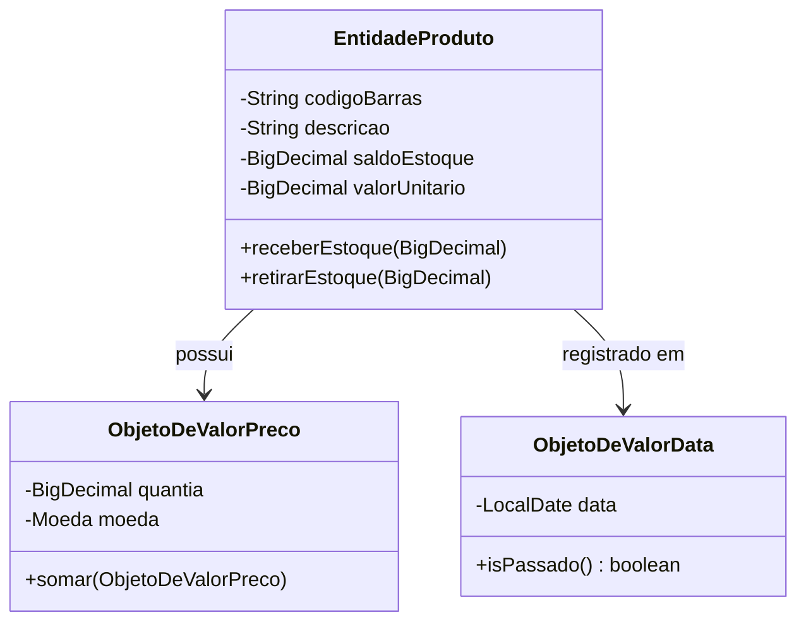
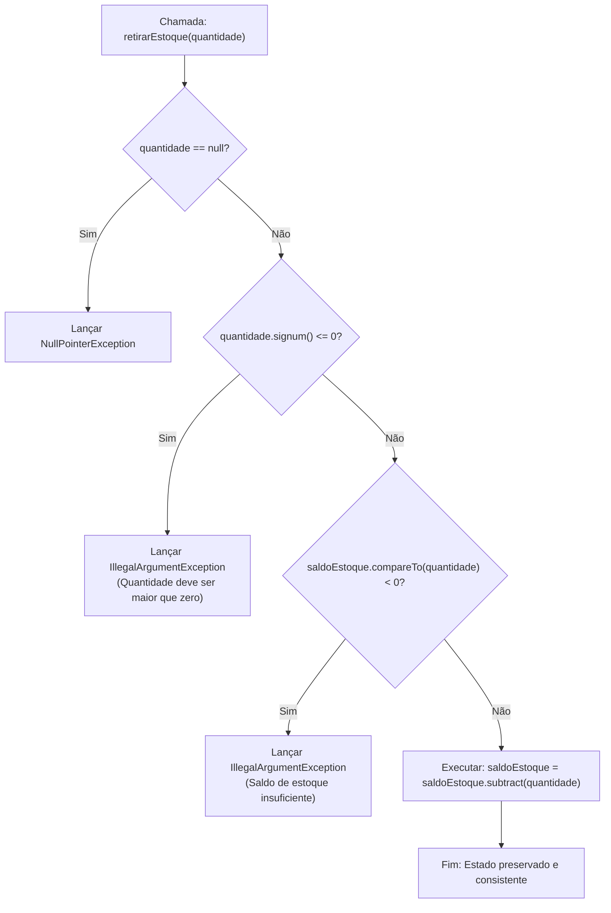
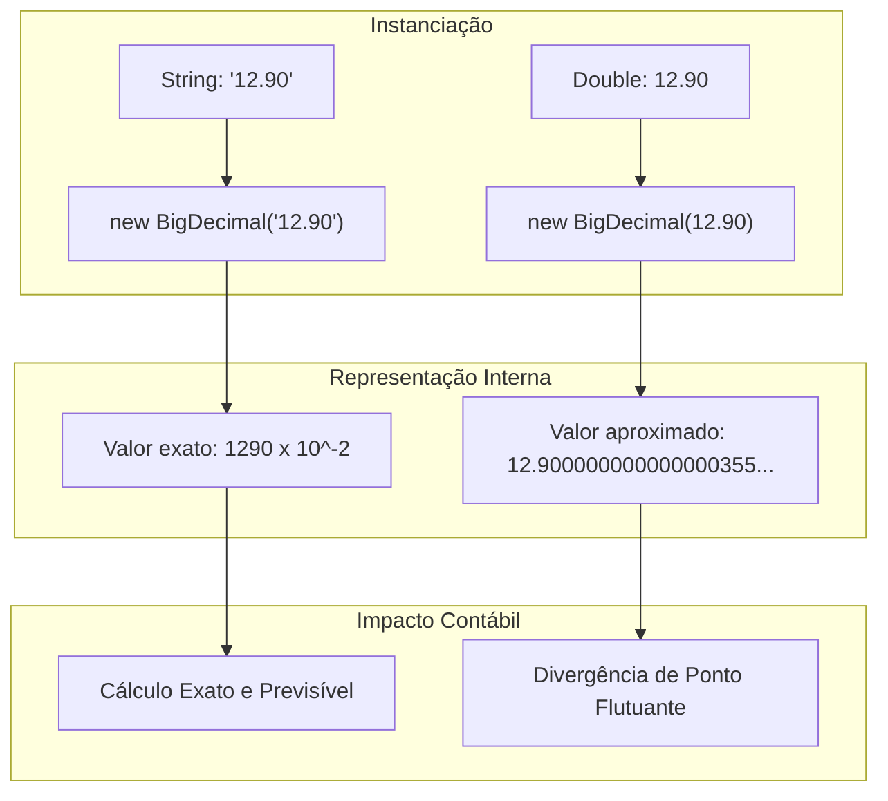
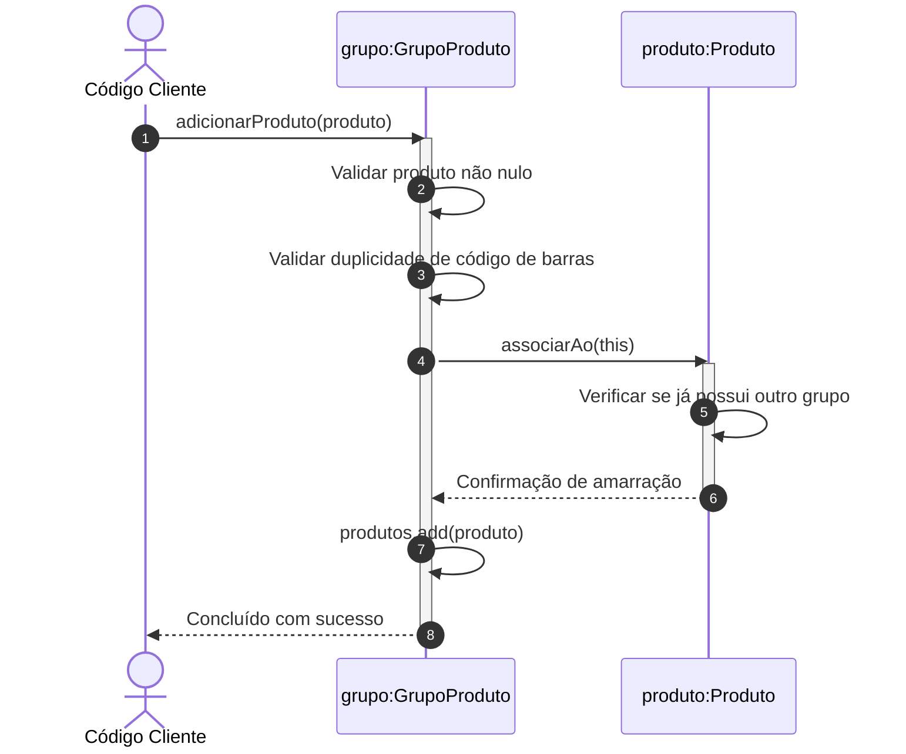
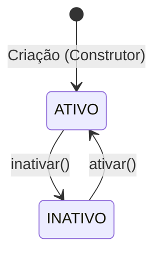
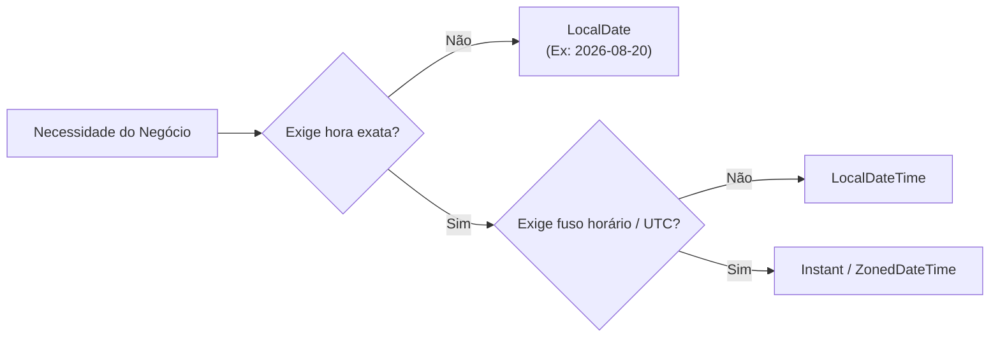
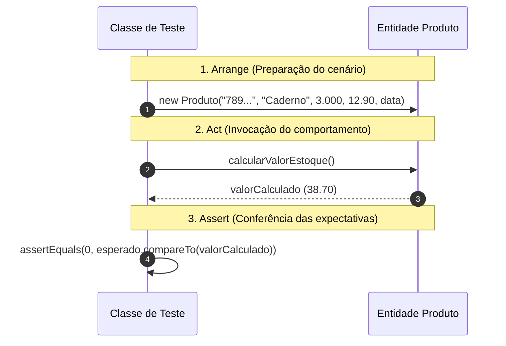
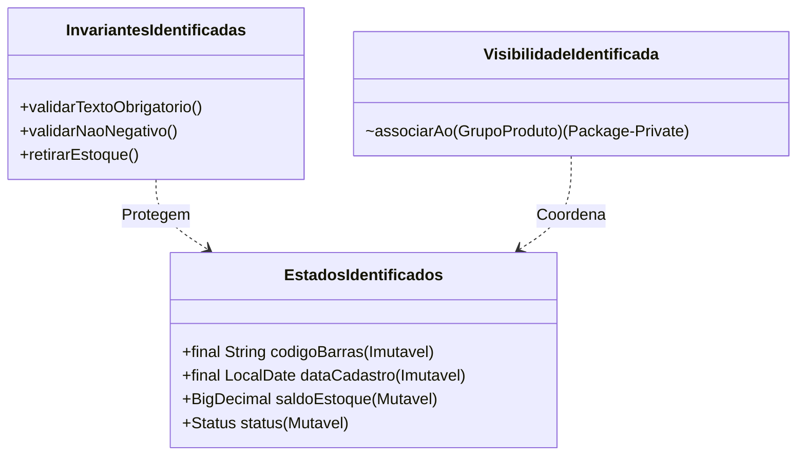
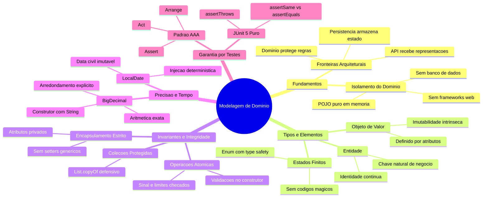

# Aula 03 — Modelagem de Domínio com Java Puro

> **Professor:** Jefferson Passerini  
> **Disciplina:** Laboratório de Programação IV (4º Semestre)  
> **Tema:** Modelagem orientada a domínio em Java puro, isolamento de regras de negócio, encapsulamento de invariantes e validação por testes unitários com JUnit 5.

---

## Sumário

- [Objetivo da aula](#objetivo-da-aula)
- [Contexto e pré-requisitos](#contexto-e-pré-requisitos)
- [Conceito de Domínio e Modelo de Domínio](#conceito-de-domínio-e-modelo-de-domínio)
- [Entidades, Objetos de Valor e Identidade de Negócio](#entidades-objetos-de-valor-e-identidade-de-negócio)
- [Encapsulamento e Invariantes de Negócio](#encapsulamento-e-invariantes-de-negócio)
- [Uso de BigDecimal e precisão monetária/quantitativa](#uso-de-bigdecimal-e-precisão-monetáriaquantitativa)
- [Mapeamento e controle de associação 1:N bidirecional](#mapeamento-e-controle-de-associação-1n-bidirecional)
- [Representação de estados finitos com enum](#representação-de-estados-finitos-com-enum)
- [Manipulação determinística de datas com LocalDate](#manipulação-determinística-de-datas-com-localdate)
- [Testes unitários no padrão Arrange-Act-Assert com JUnit 5](#testes-unitários-no-padrão-arrange-act-assert-com-junit-5)
- [Código da aula](#código-da-aula)
- [Exercícios](#exercícios)
- [Erros comuns e boas práticas](#erros-comuns-e-boas-práticas)
- [Links e materiais complementares](#links-e-materiais-complementares)
- [Mapa da aula](#mapa-da-aula)
- [Glossário](#glossário)
- [Pontos-chave para a prova](#pontos-chave-para-a-prova)
- [Perguntas e respostas (JSONL)](#perguntas-e-respostas-jsonl)
- [Checklist de revisão](#checklist-de-revisão)

---

## Objetivo da aula

Esta aula estabelece a base arquitetural do software com foco no **núcleo do negócio (Core Domain)**, isolando-o de preocupações de infraestrutura técnica, frameworks web e bancos de dados relacionais.

Ao término desta aula e do estudo deste documento, o estudante deverá ser capaz de:

1. Definir o conceito de modelo de domínio em Engenharia de Software e justificar a importância de seu isolamento contra acoplamentos prematuros de frameworks.
2. Diferenciar formalmente classe, objeto, estado, comportamento, entidade e objeto de valor.
3. Identificar, formular e aplicar invariantes de negócio por meio de construtores canônicos com validação e métodos de mutação atômica.
4. Aplicar o encapsulamento estrito para blindar o estado dos objetos, impedindo violações por acesso direto ou exposição indevida de referências a coleções mutáveis.
5. Modelar estados finitos previsíveis utilizando enumerações nativas (`enum`) do Java, garantindo segurança de tipos em tempo de compilação.
6. Justificar matematicamente a inadequação dos tipos primitivos de ponto flutuante binário (`float` e `double`) para representação monetária e quantitativa, aplicando `java.math.BigDecimal` com controle explícito de escala e arredondamento.
7. Implementar e coordenar associações bidirecionais de cardinalidade 1:N (um para muitos) com garantia de consistência mútua entre os lados participantes e regras de unicidade interna.
8. Projetar testes unitários focados em regras de negócio no padrão Arrange-Act-Assert (AAA) utilizando JUnit 5 puro, sem boot de infraestrutura de frameworks.
9. Transferir os conceitos aplicados no projeto de referência (Suporte OS - Estoque) para o domínio específico do tema individual aprovado.

---

## Contexto e pré-requisitos

Na Aula 02, o projeto Spring Boot foi estruturado e configurado minimamente, comprovando a operabilidade da infraestrutura por meio do endpoint de saúde `/api/health`. Essa verificação atestou que o servidor HTTP embutido sobe, a JVM executa adequadamente e os testes de contexto básico são satisfeitos.

Contudo, uma aplicação não existe em virtude de seus mecanismos de transporte ou frameworks; ela existe para solucionar problemas concretos de um domínio de negócio. A criação precoce de tabelas de banco de dados, anotações de persistência ou endpoints REST antes da correta compreensão das regras de negócio costuma produzir o antipadrão conhecido como **Modelo Anêmico (Anemic Domain Model)** — em que as classes de domínio são meras estruturas de dados passivas (`getters` e `setters`), enquanto a lógica de negócio fica dispersa e desprotegida em serviços procedurais.

### Pré-requisitos técnicos

- Repositório local sincronizado e posicionado na tag `aula-02-projeto-spring-boot`;
- Java Development Kit (JDK) versão 21 LTS instalada e configurada;
- Maven Wrapper (`mvnw` ou `mvnw.cmd`) funcional e operacional;
- Tema individual de projeto devidamente aprovado e documentado;
- Domínio prático dos fundamentos de Orientação a Objetos em Java: visibilidade de membros, construtores, tipos por referência versus primitivos e polimorfismo.

### Verificação do estado inicial

Antes de iniciar as implementações, verifique o estado do repositório:

#### No Windows (PowerShell)

```powershell
git status
git describe --tags --exact-match
.\mvnw.cmd test
```

#### No macOS ou Linux (Bash)

```bash
git status
git describe --tags --exact-match
./mvnw test
```

A execução do Maven deve retornar `BUILD SUCCESS` sem arquivos modificados pendentes no Git.

---

## Conceito de Domínio e Modelo de Domínio

### O que é Domínio

Na Engenharia de Software, o **domínio** corresponde à esfera de conhecimento, influência, regras e atividades do mundo real para a qual o sistema computacional está sendo concebido. Em um sistema para uma oficina mecânica, o domínio engloba peças, ordens de serviço, mão de obra e controle de garantias; em um hospital, engloba pacientes, triagens, prontuários, prescrições e leitos.

O domínio é independente de tecnologia. As regras de estoque de uma empresa (como impedir que um saldo fique negativo ou calcular o valor contábil retido em prateleira) continuam válidas quer o sistema seja implementado como uma aplicação web moderna em Java, um script em terminal ou um livro-caixa de papel manuscrito.


### O que é um Modelo de Domínio

A realidade do mundo físico é infinitamente complexa e repleta de variáveis irrelevantes para o software. Um **modelo de domínio** é uma abstração simplificada e intencionalmente seletiva dessa realidade. 

Ao projetar uma classe `Produto` para um controle de estoque simplificado, atributos como a cor exata da embalagem, o material do rótulo ou o peso molecular dos componentes químicos são descartados, a menos que o problema específico exija tais informações. Modelar é o ato deliberado de selecionar características essenciais e encapsular comportamentos que respondem a necessidades concretas de negócio.

| Aspecto do Mundo Real | Relevância no Modelo de Estoque Didático | Representação no Código |
|---|---|---|
| Código de barras EAN-13 | Essencial para identificação e separação | `String codigoBarras` |
| Nome ou descrição comercial | Essencial para identificação humana | `String descricao` |
| Dimensões físicas da caixa | Irrelevante nesta fase do sistema | Descartado |
| Quantidade física disponível | Essencial para atendimento de pedidos | `BigDecimal saldoEstoque` |
| Preço de venda unitário | Essencial para apuração patrimonial | `BigDecimal valorUnitario` |
| Fornecedor principal | Dependência externa planejada para evolução | `Fornecedor fornecedor` |
| Estado de comercialização | Essencial para impedir vendas indevidas | `Status status` |

### Armadilhas e contraexemplos conceituais

A principal armadilha nesta fase é a **modelagem orientada a banco de dados (Database-Driven Design)**, na qual o desenvolvedor desenha primeiro as tabelas com chaves estrangeiras, colunas e tipos SQL, gerando em seguida classes com anotações e métodos assessores genéricos. O modelo perde a capacidade de expressar a linguagem do negócio e passa a ser apenas um reflexo do armazenamento relacional.

---

## Entidades, Objetos de Valor e Identidade de Negócio

### Entidades

Uma **Entidade** é um objeto do domínio definido não por seus atributos transitórios, mas por uma trajetória contínua de identidade ao longo do tempo. Dois produtos com a mesma descrição e o mesmo preço de venda não são o mesmo produto se possuírem códigos identificadores distintos. Inversamente, se um produto tem seu preço ou sua descrição alterados, ele permanece sendo o mesmo produto.

No escopo desta aula, o código de barras atua como a **chave natural de negócio**, garantindo a unicidade e a identidade do produto dentro de seu grupo classificador. 

### Objetos de Valor (Value Objects)

Um **Objeto de Valor (Value Object)** é um elemento conceitual que descreve uma característica ou medida, sendo definido exclusivamente pelo conjunto de seus valores. Objetos de valor são intrinsecamente imutáveis: se algum componente de seu valor for alterado, obtém-se uma nova instância, e não a alteração do objeto original.

Objetos de valor não possuem identidade persistente própria. Dois objetos de valor com atributos idênticos são considerados absolutamente iguais.



> **Simplificação declarada no material:** Para manter a complexidade cognitiva acessível no início da disciplina, o modelo adota tipos da biblioteca padrão do Java (`BigDecimal`, `LocalDate`, `String`) no lugar de criar classes próprias de Objetos de Valor (como `Dinheiro`, `CodigoBarras` ou `Quantidade`). Quando o conjunto de regras associadas a esses valores se tornar mais complexo, a criação de classes dedicadas de valor é recomendada.

### Comparativo: Entidade versus Objeto de Valor

| Critério de Comparação | Entidade (`Entity`) | Objeto de Valor (`Value Object`) |
|---|---|---|
| **Identidade** | Possui identidade explícita e contínua ao longo do tempo. | Não possui identidade; definido pela totalidade de seus atributos. |
| **Igualdade** | Baseada na identidade (ex: `codigoBarras` ou chave primária). | Estrutural: dois objetos com os mesmos valores são intercambiáveis. |
| **Mutabilidade** | Seu estado interno pode sofrer mutações através de métodos de negócio. | Rigorosamente imutável; operações produzem novas instâncias. |
| **Exemplo no Projeto** | `Produto`, `GrupoProduto`. | `BigDecimal`, `LocalDate`, `Status` (enum). |
| **Exemplo em Modelos Ricos** | Pedido, Cliente, Ordem de Serviço. | Endereço, CPF, Dinheiro, IntervaloDeDatas. |

---

## Encapsulamento e Invariantes de Negócio

### Definição de Invariante de Negócio

Uma **invariante de negócio** é uma regra, asserção ou predicado lógico que deve ser estritamente verdadeiro durante todo o ciclo de vida de um objeto válido. Se um objeto entrar em um estado que contradiga uma de suas invariantes, o sistema atinge um estado de corrupção de dados e comportamento imprevisível.

As invariantes centrais estabelecidas nesta aula são:

1. O código de barras de um produto não pode ser nulo, vazio ou composto unicamente por espaços em branco;
2. A descrição do produto não pode ser nula ou em branco;
3. O saldo em estoque e o valor unitário não podem assumir valores negativos em nenhum momento;
4. A data de cadastro é obrigatória e deve ser imutável após a instanciação;
5. Movimentações de entrada e saída de estoque devem operar sobre quantidades estritamente positivas (> 0);
6. Uma operação de retirada não pode solicitar uma quantidade superior ao saldo atual disponível;
7. Um produto só pode estar associado a, no máximo, um grupo de produtos por vez;
8. Um grupo de produtos não aceita o cadastro de dois produtos distintos que compartilhem o mesmo código de barras;
9. Código de barras, nome do grupo e data de cadastro são imutáveis após a construção.

### Encapsulamento como Mecanismo de Defesa

O **encapsulamento** não se resume a tornar atributos privados e criar métodos `get` e `set`. Declarar um campo privado e fornecer um `setSaldoEstoque(BigDecimal saldo)` público anula o encapsulamento, pois permite que agentes externos imponham qualquer valor arbitrário ao estado interno (incluindo valores negativos ou nulos), ignorando as regras de transição.

O encapsulamento efetivo exige:
- Atributos estritamente `private`;
- Proteção contra modificações diretas de campos imutáveis usando a palavra-chave `final`;
- Criação obrigatória de instâncias válidas por construtores que barram dados inválidos imediatamente;
- Métodos que representam operações reais do negócio (`receberEstoque`, `retirarEstoque`, `inativar`), que validam parâmetros e garantem a integridade das invariantes antes de atualizar o estado.



### Comparativo: Modelo Anêmico versus Modelo Rico

| Característica | Modelo Anêmico (Incorreto / Procedural) | Modelo Rico (Correto / Orientado a Objetos) |
|---|---|---|
| **Controle de Estado** | Atributos com métodos setters públicos genéricos. | Atributos privados e métodos de negócio expressivos. |
| **Validação de Invariantes** | Feita de forma dispersa em classes de serviço ou controllers. | Feita diretamente dentro da própria entidade. |
| **Criação do Objeto** | Construtor vazio padrão; objeto fica temporariamente incompleto. | Construtor canônico exige todos os dados obrigatórios no ato da criação. |
| **Consistência** | Permite que o objeto exista em memória com dados inválidos. | Impossível instanciar ou transicionar o objeto para um estado corrompido. |
| **Exemplo de Código** | `prod.setSaldo(prod.getSaldo().subtract(qtd))` | `prod.retirarEstoque(qtd)` |

---

## Uso de BigDecimal e precisão monetária/quantitativa

### O Problema do Ponto Flutuante Binário (IEEE 754)

Os tipos primitivos `float` (32 bits) e `double` (64 bits) do Java implementam o padrão aritmético binário IEEE 754. Esses tipos foram projetados para computação científica e computação gráfica, onde a velocidade de processamento é prioritária e pequenas imprecisões decimais são toleráveis.

Em sistemas comerciais, financeiros e de controle de estoque, o uso de `double` ou `float` é inaceitável. Na base binária, frações decimais simples como `0.1` ou `0.2` resultam em dízimas periódicas infinitas, gerando erros de arredondamento cumulativos.

```java
// Demonstração da falha com double
double valor1 = 0.1;
double valor2 = 0.2;
double soma = valor1 + valor2;

System.out.println(soma); 
// Imprime: 0.30000000000000004
```

Se essa imprecisão for propagada em um cálculo de estoque com milhares de itens, haverá divergência contábil e fiscal.

### A Classe `java.math.BigDecimal`

`BigDecimal` provê representação decimal exata com precisão arbitrária e controle programático da escala (número de dígitos após a vírgula) e da política de arredondamento.

Um `BigDecimal` é composto fundamentalmente por:
- Um inteiro de precisão arbitrária (`BigInteger` não escalonado);
- Um inteiro de 32 bits que representa a escala (`scale`), indicando o deslocamento decimal.



### Regras Mandatórias de Uso

1. **Construção via `String`:** Nunca instancie `BigDecimal` a partir de literais numéricos de ponto flutuante. Use `new BigDecimal("12.90")` ou `BigDecimal.valueOf(12.90)`. O construtor `new BigDecimal(double)` transfere a imprecisão binária preexistente para o objeto.
2. **Definição de Escala e Arredondamento:** Multiplicações e divisões podem gerar casas decimais adicionais. É mandatório invocar `.setScale(casas, RoundingMode)` para determinar a política de corte. No projeto, adotamos `RoundingMode.HALF_UP` (arredondamento bancário clássico/didático, onde frações >= 0.5 sobem para o próximo dígito).

```java
public BigDecimal calcularValorEstoque() {
    return this.saldoEstoque
        .multiply(this.valorUnitario)
        .setScale(2, RoundingMode.HALF_UP);
}
```

### Distinção Crítica: `equals()` versus `compareTo()`

A classe `BigDecimal` implementa `Comparable<BigDecimal>`. A semântica de igualdade contém uma armadilha frequente:

```java
BigDecimal a = new BigDecimal("38.7");
BigDecimal b = new BigDecimal("38.70");

boolean resultadoEquals = a.equals(b);       // Retorna false!
int resultadoCompareTo = a.compareTo(b);     // Retorna 0!
```

- `equals()` avalia o valor numérico **e** a escala. Como `38.7` tem escala 1 e `38.70` tem escala 2, o método considera os objetos distintos.
- `compareTo()` avalia exclusivamente o **valor numérico**, desconsiderando variações de representação de escala. 

> **Regra de Engenharia:** Em testes unitários e validações de regras de negócio, utilize sempre `compareTo(outro) == 0` para aferir igualdade matemática entre valores.

---

## Mapeamento e controle de associação 1:N bidirecional

### O Desafio da Bidirecionalidade em Memória

No mundo relacional, um relacionamento de 1 para N entre `grupo_produto` e `produto` é resolvido de forma unidirecional: a tabela dependente (`produto`) armazena a chave estrangeira `grupo_produto_id`.

No paradigma orientado a objetos em memória, relacionamentos bidirecionais exigem que ambos os objetos conheçam seus pares:
- O `GrupoProduto` mantém uma coleção de referências (`List<Produto> produtos`);
- Cada `Produto` mantém uma referência ao seu agrupador (`GrupoProduto grupo`).

Se o desenvolvedor manipular esses dois ponteiros de forma independente, o sistema poderá atingir estados inconsistentes (ex: o produto `A` aponta para o grupo `G1`, mas a lista interna de `G1` não contém `A`, ou pior, a lista de `G2` contém `A`).



### A Solução: Ponto Único de Entrada e Visibilidade de Pacote

Para eliminar a possibilidade de inconsistência mútua:
1. O método `adicionarProduto(Produto produto)` em `GrupoProduto` é o **único ponto de entrada público** para a associação.
2. O método `associarAo(GrupoProduto grupo)` em `Produto` recebe **visibilidade de pacote** (`package-private`, ou seja, sem modificador `public`, `private` ou `protected`). Isso impede que classes fora do pacote `domain` executem associações arbitrárias, forçando o tráfego pela raiz da associação.
3. Se o produto já pertencer a outro grupo distinto, uma exceção de estado ilegal (`IllegalStateException`) é disparada, impedindo transferências acidentais sem desassociação explícita.

### Proteção Contra Vazamento de Encapsulamento em Coleções

Ao expor uma lista interna através de um método `getProdutos()`, retornar a referência direta da variável de instância `this.produtos` cria uma falha de segurança estrutural. Qualquer código cliente poderia executar:

```java
// Quebra gravíssima de encapsulamento
grupo.getProdutos().clear(); 
// ou
grupo.getProdutos().add(produtoInvalido);
```

Para neutralizar esse risco, o método getter deve retornar uma cópia não modificável da coleção através de `List.copyOf()`:

```java
public List<Produto> getProdutos() {
    return List.copyOf(this.produtos);
}
```

Qualquer tentativa externa de invocar `.add()`, `.remove()` ou `.clear()` sobre a lista retornada resultará em `UnsupportedOperationException`.

---

## Representação de estados finitos com enum

### Limitações de Strings e Inteiros para Estados

A modelagem de estados de ciclo de vida (como ativo, inativo, cancelado ou pendente) por meio de tipos primitivos ou literais de texto introduz problemas graves de qualidade:
- **Ausência de verificação em tempo de compilação:** Erros ortográficos como `"Atvio"` ou `"INATIVO "` só seriam detectados tardiamente em tempo de execução;
- **Falta de expressividade de inteiros mágicos:** O uso de códigos como `0` para inativo e `1` para ativo dispersa o significado semântico do domínio.



### Uso do `enum` no Java Moderno

O construto `enum` no Java define um tipo de referência com um conjunto fixo e fechado de constantes imutáveis. O compilador garante que nenhuma instância além das explicitamente declaradas possa existir.

```java
package com.curso.suporteos.domain;

public enum Status {
    ATIVO,
    INATIVO
}
```

### Justificativa para a Ausência de Códigos Numéricos

Nesta etapa do projeto, o enum `Status` não recebe atributos internos como `private int codigo;`. Tais códigos geralmente refletem convenções de esquemas de banco legados. Como o modelo atual é em Java puro, vincular códigos artificiais sem uma necessidade concreta do negócio configuraria complexidade desnecessária.

---

## Manipulação determinística de datas com LocalDate

### A API `java.time` (JSR-310)

Historicamente, o Java utilizava as classes `java.util.Date` e `java.util.Calendar`. Ambas apresentavam graves deficiências arquiteturais: eram mutáveis (permitindo alteração de data após criação), combinavam data e horário arbitrariamente e apresentavam inconsistências de formatação e fuso horário.

Desde o Java 8, a API `java.time` resolveu essas deficiências, introduzindo classes imutáveis e especializadas:
- `LocalDate`: Representa uma data civil pura (ano, mês e dia), sem componente de horário e sem referência a fuso horário (ex: data de nascimento, data de cadastro do produto);
- `LocalDateTime`: Representa data e horário, mas ainda sem identificação de fuso horário;
- `Instant`: Representa um ponto exato e absoluto na linha do tempo contínua, referenciado em UTC (essencial para trilhas de auditoria globais).



### Determinismo em Testes Automatizados

Uma das piores práticas de desenvolvimento em entidades de domínio é invocar geradores de relógio do sistema operacional diretamente no construtor:

```java
// Prática problemática para testes unitários
public Produto(...) {
    // ...
    this.dataCadastro = LocalDate.now(); // Perda de determinismo
}
```

Ao utilizar `LocalDate.now()` no construtor, os testes passam a depender do relógio da máquina que executa o build. Testes que comparam propriedades de datas tornam-se frágeis e suscetíveis a quebras conforme o horário ou o fuso da máquina de execução.

Exigir a passagem explícita de `LocalDate` no construtor assegura o **determinismo**: o cenário de teste define explicitamente a data de referência, garantindo que o resultado seja exatamente o mesmo, em qualquer máquina, em qualquer época do ano.

---

## Testes unitários no padrão Arrange-Act-Assert com JUnit 5

### O Padrão Arrange-Act-Assert (AAA)

Os testes automatizados de domínio funcionam como uma **especificação executável** das regras do software. O padrão estrutural Arrange-Act-Assert organiza o teste em três etapas claras e visualmente delineadas:

1. **Arrange (Preparação):** Instanciação das entidades, criação de valores e configuração prévia do cenário de teste;
2. **Act (Ação / Execução):** Invocação direta do método de domínio ou operação comportamental sob teste;
3. **Assert (Verificação / Asserção):** Inspeção dos resultados observáveis, comparando o novo estado interno do objeto ou os retornos gerados com os valores esperados pela especificação.



### Testando Exceções com `assertThrows`

Invariantes de domínio manifestam-se rejeitando comandos ilegais por meio de exceções em tempo de execução (`IllegalArgumentException`, `IllegalStateException`, `NullPointerException`). Para comprovar que a blindagem está operante, os testes devem verificar tanto o lançamento da exceção correta quanto a clareza da mensagem explicativa retornada.

```java
@Test
void naoDeveRetirarQuantidadeMaiorQueOSaldo() {
    // Arrange
    Produto produto = novoProduto("3.000", "12.90");

    // Act & Assert
    IllegalArgumentException excecao = assertThrows(
        IllegalArgumentException.class,
        () -> produto.retirarEstoque(new BigDecimal("3.001"))
    );

    assertEquals("Saldo de estoque insuficiente", excecao.getMessage());
}
```

### Asserções Fundamentais do JUnit 5

| Método de Asserção | Objetivo da Verificação | Aplicação Típica |
|---|---|---|
| `assertEquals(esperado, obtido)` | Verifica igualdade de estado ou valor via método `equals()`. | Conferir strings, enums e inteiros. |
| `assertSame(esperado, obtido)` | Verifica igualdade de referência de ponteiro de memória (`==`). | Confirmar que dois lados de uma associação apontam para o mesmo objeto. |
| `assertThrows(classeExcecao, executavel)` | Verifica se uma determinada exceção é disparada durante a execução de um bloco lambda. | Validar que invariantes rejeitam dados ou transições ilegais. |
| `assertTrue(condicao)` / `assertFalse(condicao)` | Avalia expressões booleanas puras. | Validar predicados específicos do domínio. |

---

## Código da aula

Nesta seção, dissecamos as classes centrais implementadas no pacote `com.curso.suporteos.domain`.

> **Nota técnica de transição:** No material do repositório correspondente aos commits da aula, o código introduzido já apresenta anotações do Jakarta Persistence (`@Entity`, `@Table`, `@Id`, etc.) que preparam o modelo para a Aula 04 (Persistência com Spring Data JPA). No entanto, o comportamento operacional estudado na Aula 03 concentra-se exclusivamente na lógica dos construtores, métodos de negócio e invariantes em Java puro. O código opera sem intervenção de banco de dados ou injeção de dependência do Spring.

### 1. `Status.java`

Localização: [`src/main/java/com/curso/suporteos/domain/Status.java`](src/main/java/com/curso/suporteos/domain/Status.java)

```java
package com.curso.suporteos.domain;

public enum Status {
    ATIVO,
    INATIVO
}
```

- Declaração enxuta de tipos constantes;
- Não possui construtores complexos, setters ou campos mutáveis;
- Centraliza os estados lógicos admissíveis tanto para grupos quanto para produtos.

---

### 2. `GrupoProduto.java`

Localização: [`src/main/java/com/curso/suporteos/domain/GrupoProduto.java`](src/main/java/com/curso/suporteos/domain/GrupoProduto.java)

```java
package com.curso.suporteos.domain;

import jakarta.persistence.Column;
import jakarta.persistence.Entity;
import jakarta.persistence.EnumType;
import jakarta.persistence.Enumerated;
import jakarta.persistence.FetchType;
import jakarta.persistence.GeneratedValue;
import jakarta.persistence.GenerationType;
import jakarta.persistence.Id;
import jakarta.persistence.OneToMany;
import jakarta.persistence.Table;

import java.util.ArrayList;
import java.util.List;
import java.util.Objects;

@Entity
@Table(name = "grupo_produto")
public class GrupoProduto {

    @Id
    @GeneratedValue(strategy = GenerationType.IDENTITY)
    private Long id; // Identificador surrogate para persistência futura

    @Column(nullable = false, length = 120)
    private String nome;

    @Enumerated(EnumType.STRING)
    @Column(nullable = false, length = 20)
    private Status status;

    @OneToMany(mappedBy = "grupo", fetch = FetchType.LAZY)
    private final List<Produto> produtos = new ArrayList<>();

    // Construtor sem argumentos exigido pela especificação JPA (visibilidade protegida)
    protected GrupoProduto() {
    }

    // Construtor de domínio canônico: exige dados obrigatórios e garante estado inicial válido
    public GrupoProduto(String nome) {
        this.nome = validarTextoObrigatorio(nome, "Nome do grupo é obrigatório");
        this.status = Status.ATIVO;
    }

    // Método coordenador da associação 1:N
    public void adicionarProduto(Produto produto) {
        Objects.requireNonNull(produto, "Produto é obrigatório");

        // Proteção de unicidade de negócio: impede duplicidade de código de barras no grupo
        boolean codigoJaUtilizado = produtos.stream()
            .anyMatch(item -> item != produto
                && item.getCodigoBarras().equals(produto.getCodigoBarras()));

        if (codigoJaUtilizado) {
            throw new IllegalArgumentException("Código de barras já utilizado no grupo");
        }

        // Amarra o produto a este grupo invocando o método com visibilidade de pacote
        produto.associarAo(this);

        // Adiciona à lista interna apenas se a referência ainda não constar
        if (!produtos.contains(produto)) {
            produtos.add(produto);
        }
    }

    public void ativar() {
        this.status = Status.ATIVO;
    }

    public void inativar() {
        this.status = Status.INATIVO;
    }

    public String getNome() {
        return nome;
    }

    public Long getId() {
        return id;
    }

    public Status getStatus() {
        return status;
    }

    // Blindagem de encapsulamento: devolve cópia imutável da coleção
    public List<Produto> getProdutos() {
        return List.copyOf(produtos);
    }

    private static String validarTextoObrigatorio(String texto, String mensagem) {
        if (texto == null || texto.isBlank()) {
            throw new IllegalArgumentException(mensagem);
        }
        return texto.trim();
    }
}
```

---

### 3. `Produto.java`

Localização: [`src/main/java/com/curso/suporteos/domain/Produto.java`](src/main/java/com/curso/suporteos/domain/Produto.java)

```java
package com.curso.suporteos.domain;

import jakarta.persistence.Column;
import jakarta.persistence.Entity;
import jakarta.persistence.EnumType;
import jakarta.persistence.Enumerated;
import jakarta.persistence.FetchType;
import jakarta.persistence.ForeignKey;
import jakarta.persistence.GeneratedValue;
import jakarta.persistence.GenerationType;
import jakarta.persistence.Id;
import jakarta.persistence.JoinColumn;
import jakarta.persistence.ManyToOne;
import jakarta.persistence.Table;
import jakarta.persistence.UniqueConstraint;

import java.math.BigDecimal;
import java.math.RoundingMode;
import java.time.LocalDate;
import java.util.Objects;

@Entity
@Table(
    name = "produto",
    uniqueConstraints = @UniqueConstraint(
        name = "uk_produto_codigo_barras",
        columnNames = "codigo_barras"))
public class Produto {

    @Id
    @GeneratedValue(strategy = GenerationType.IDENTITY)
    private Long id;

    @Column(name = "codigo_barras", nullable = false, length = 50)
    private String codigoBarras;

    @Column(nullable = false, length = 150)
    private String descricao;

    @Column(name = "saldo_estoque", nullable = false, precision = 18, scale = 3)
    private BigDecimal saldoEstoque;

    @Column(name = "valor_unitario", nullable = false, precision = 18, scale = 2)
    private BigDecimal valorUnitario;

    @Column(name = "estoque_minimo", nullable = false, precision = 18, scale = 3)
    private BigDecimal estoqueMinimo;

    @Column(name = "data_cadastro", nullable = false)
    private LocalDate dataCadastro;

    @Enumerated(EnumType.STRING)
    @Column(nullable = false, length = 20)
    private Status status;

    @ManyToOne(fetch = FetchType.LAZY, optional = false)
    @JoinColumn(
        name = "grupo_produto_id",
        nullable = false,
        foreignKey = @ForeignKey(name = "fk_produto_grupo_produto"))
    private GrupoProduto grupo;

    @ManyToOne(fetch = FetchType.LAZY)
    @JoinColumn(
        name = "fornecedor_id",
        foreignKey = @ForeignKey(name = "fk_produto_fornecedor"))
    private Fornecedor fornecedor;

    // Construtor JPA protegido
    protected Produto() {
    }

    // Sobrecarga de construtor canônico com estoque mínimo padrão zero
    public Produto(
        String codigoBarras,
        String descricao,
        BigDecimal saldoEstoque,
        BigDecimal valorUnitario,
        LocalDate dataCadastro) {
        this(
            codigoBarras,
            descricao,
            saldoEstoque,
            valorUnitario,
            BigDecimal.ZERO,
            dataCadastro);
    }

    // Construtor canônico completo que valida e assegura todas as invariantes no ato da instanciação
    public Produto(
        String codigoBarras,
        String descricao,
        BigDecimal saldoEstoque,
        BigDecimal valorUnitario,
        BigDecimal estoqueMinimo,
        LocalDate dataCadastro) {
        this.codigoBarras = validarTextoObrigatorio(codigoBarras, "Código de barras é obrigatório");
        this.descricao = validarTextoObrigatorio(descricao, "Descrição é obrigatória");
        this.saldoEstoque = validarNaoNegativo(saldoEstoque, "Saldo de estoque não pode ser negativo");
        this.valorUnitario = validarNaoNegativo(valorUnitario, "Valor unitário não pode ser negativo");
        this.estoqueMinimo = validarNaoNegativo(estoqueMinimo, "Estoque mínimo não pode ser negativo");
        this.dataCadastro = Objects.requireNonNull(dataCadastro, "Data de cadastro é obrigatória");
        this.status = Status.ATIVO;
    }

    // Regra de negócio: cálculo patrimonial do estoque com política explícita de arredondamento
    public BigDecimal calcularValorEstoque() {
        return saldoEstoque
            .multiply(valorUnitario)
            .setScale(2, RoundingMode.HALF_UP);
    }

    // Operação comportamental atômica: entrada de estoque
    public void receberEstoque(BigDecimal quantidade) {
        validarPositivo(quantidade, "Quantidade recebida deve ser maior que zero");
        this.saldoEstoque = saldoEstoque.add(quantidade);
    }

    // Operação comportamental atômica: saída de estoque protegida
    public void retirarEstoque(BigDecimal quantidade) {
        validarPositivo(quantidade, "Quantidade retirada deve ser maior que zero");

        if (saldoEstoque.compareTo(quantidade) < 0) {
            throw new IllegalArgumentException("Saldo de estoque insuficiente");
        }

        this.saldoEstoque = saldoEstoque.subtract(quantidade);
    }

    public void alterarDescricao(String novaDescricao) {
        this.descricao = validarTextoObrigatorio(novaDescricao, "Descrição é obrigatória");
    }

    public void alterarValorUnitario(BigDecimal novoValor) {
        this.valorUnitario = validarNaoNegativo(novoValor, "Valor unitário não pode ser negativo");
    }

    public void ativar() {
        this.status = Status.ATIVO;
    }

    public void inativar() {
        this.status = Status.INATIVO;
    }

    // Visibilidade de pacote (package-private): somente classes em com.curso.suporteos.domain podem chamar
    void associarAo(GrupoProduto grupo) {
        Objects.requireNonNull(grupo, "Grupo de produto é obrigatório");

        if (this.grupo != null && this.grupo != grupo) {
            throw new IllegalStateException("Produto já pertence a outro grupo");
        }

        this.grupo = grupo;
    }

    public void associarFornecedor(Fornecedor fornecedor) {
        this.fornecedor = Objects.requireNonNull(fornecedor, "Fornecedor é obrigatório");
    }

    public String getCodigoBarras() { return codigoBarras; }
    public Long getId() { return id; }
    public String getDescricao() { return descricao; }
    public BigDecimal getSaldoEstoque() { return saldoEstoque; }
    public BigDecimal getValorUnitario() { return valorUnitario; }
    public BigDecimal getEstoqueMinimo() { return estoqueMinimo; }
    public LocalDate getDataCadastro() { return dataCadastro; }
    public Status getStatus() { return status; }
    public GrupoProduto getGrupo() { return grupo; }
    public Fornecedor getFornecedor() { return fornecedor; }

    private static String validarTextoObrigatorio(String texto, String mensagem) {
        if (texto == null || texto.isBlank()) {
            throw new IllegalArgumentException(mensagem);
        }
        return texto.trim();
    }

    private static BigDecimal validarNaoNegativo(BigDecimal valor, String mensagem) {
        Objects.requireNonNull(valor, mensagem);
        if (valor.signum() < 0) {
            throw new IllegalArgumentException(mensagem);
        }
        return valor;
    }

    private static void validarPositivo(BigDecimal valor, String mensagem) {
        Objects.requireNonNull(valor, mensagem);
        if (valor.signum() <= 0) {
            throw new IllegalArgumentException(mensagem);
        }
    }
}
```

---

## Exercícios

Esta seção reúne e resolve integralmente todos os exercícios e atividades orientadas propostos pelo professor na Aula 03. 

Arquivos de suporte gerados para execução local:
- [`./codigo/ModeloDominioExemplo.java`](./codigo/ModeloDominioExemplo.java): Contém as classes do domínio em estrutura autocontida para demonstração e estudo;
- [`./codigo/ExerciciosDominioTest.java`](./codigo/ExerciciosDominioTest.java): Reúne a suíte completa de testes unitários contendo a resolução das Partes A, B e C.

---

### Exercício 1: Perguntas de Revisão Conceitual

#### 1. O que é domínio em Engenharia de Software?
**Resposta:** É a área de conhecimento, contexto prático e conjunto de atividades e regras do mundo real para o qual o software está sendo construído. É o problema que o software visa resolver, existindo de maneira prévia e independente de qualquer tecnologia ou infraestrutura computacional.

#### 2. Por que um modelo não precisa representar todos os detalhes do mundo real?
**Resposta:** Porque um modelo é, por definição, uma abstração seletiva da realidade. Seu propósito é resolver um conjunto delimitado de problemas computacionais. Incluir aspectos irrelevantes (como o peso do rótulo ou a composição da tinta da embalagem) gera sobrecarga cognitiva, acoplamento inútil e desperdício de esforço de desenvolvimento.

#### 3. Qual é a diferença entre classe e objeto?
**Resposta:** A classe é o molde, a definição estrutural e comportamental que especifica atributos e métodos disponíveis para um determinado tipo. O objeto é a instância física concreta alocada na memória da JVM durante o tempo de execução a partir dessa classe.

#### 4. Qual é a diferença entre estado e comportamento?
**Resposta:** O estado corresponde ao conjunto instantâneo de valores contidos nos atributos de um objeto em um dado momento no tempo. O comportamento corresponde ao conjunto de operações e métodos de negócio que o objeto disponibiliza para transformar seu estado de forma controlada ou produzir cálculos.

#### 5. Por que `Produto` pode ser tratado como entidade?
**Resposta:** Porque ele possui uma identidade individual e contínua ao longo do tempo (definida no negócio por seu código de barras único). Mesmo que sua descrição, preço ou saldo se modifiquem drasticamente, ele permanece sendo exatamente a mesma entidade no sistema.

#### 6. O que é uma invariante?
**Resposta:** É uma condição, regra de negócio ou predicado lógico que deve ser rigorosamente verdadeiro e consistente em todos os estados válidos de um objeto durante toda a sua existência na memória.

#### 7. Como o encapsulamento protege invariantes?
**Resposta:** Tornando os campos privados, eliminando setters genéricos, validando todos os dados no construtor e restringindo as alterações de estado a métodos de negócio específicos que conferem e asseguram a validade dos dados antes de registrar a mutação no estado.

#### 8. Por que não fornecemos um setter genérico para o saldo?
**Resposta:** Porque um método `setSaldoEstoque(BigDecimal)` expõe o estado a qualquer valor externo arbitrário, contornando regras cruciais de movimentação, como impedir saldos negativos, exigir quantidades estritamente positivas e registrar entradas e saídas como eventos atômicos.

#### 9. Qual é a vantagem de `receberEstoque` em relação a `setSaldoEstoque`?
**Resposta:** `receberEstoque` expressa a intenção e a linguagem ubíqua do negócio (Domain-Driven Design), garante que a quantidade adicionada seja estritamente positiva (> 0) e executa a operação atômica de acréscimo sem exigir que o código externo calcule o novo saldo e o sobrescreva.

#### 10. Por que `Status` é um `enum` e não uma `String`?
**Resposta:** O `enum` impõe segurança de tipos em tempo de compilação (type safety). Ele restringe os valores admissíveis exclusivamente a `ATIVO` e `INATIVO`, eliminando erros de digitação em tempo de execução, strings vazias ou valores desconhecidos.

#### 11. Por que o enum ainda não possui código numérico?
**Resposta:** Porque códigos numéricos (como 0 ou 1) costumam representar convenções artificiais de armazenamento em bancos de dados relacionais legados. No domínio puro em memória, os identificadores textuais do enum são suficientes e semanticamente mais ricos.

#### 12. Qual é a cardinalidade entre grupo e produto?
**Resposta:** É de 1 para N (um para muitos): um `GrupoProduto` pode classificar zero ou múltiplos objetos `Produto`, enquanto um `Produto` pertence a exatamente um `GrupoProduto` (com permissão didática temporária de ser nulo apenas durante o processo de montagem em memória antes do vínculo).

#### 13. Por que a associação precisa atualizar os dois lados?
**Resposta:** Para preservar a consistência relacional na memória da JVM. Se apenas um lado for atualizado, o sistema atinge um estado inconsistente e contraditório, onde o grupo contém o produto em sua lista, mas a navegação inversa a partir do produto não reconhece o grupo (ou vice-versa).

#### 14. O que aconteceria se o getter devolvesse diretamente a lista interna?
**Resposta:** Haveria vazamento de encapsulamento. Qualquer código externo consumidor poderia invocar métodos mutáveis como `.clear()` ou `.add()` diretamente sobre a coleção interna do grupo, inserindo produtos sem validação de duplicidade ou desvinculando produtos indevidamente.

#### 15. Por que `BigDecimal` é preferido para valor monetário?
**Resposta:** Porque os tipos primitivos `float` e `double` utilizam ponto flutuante binário (IEEE 754), que gera dízimas e imprecisões decimais cumulativas. `BigDecimal` provê aritmética decimal exata, com precisão arbitrária e políticas de escala e arredondamento estritamente controladas.

#### 16. Por que construímos `BigDecimal` a partir de `String`?
**Resposta:** Porque ao passar um literal `double` para o construtor `new BigDecimal(double)`, a imprecisão de representação binária do ponto flutuante já ocorreu antes da invocação. O construtor com `String` faz o parse caractere por caractere, garantindo a representação decimal exata do valor informado.

#### 17. Qual é a diferença entre `equals` e `compareTo` em `BigDecimal`?
**Resposta:** `equals()` avalia tanto o valor numérico quanto a escala (`38.7` não é igual a `38.70`). O método `compareTo()` ignora a escala e avalia estritamente a magnitude matemática dos valores (retornando `0` para valores equivalentes como `38.7` e `38.70`).

#### 18. Por que a política de arredondamento precisa ser explícita?
**Resposta:** Porque operações de divisão ou escalonamento de decimais podem produzir frações infinitas ou com dízimas. Sem uma política explícita (como `RoundingMode.HALF_UP`), a JVM lança uma `ArithmeticException`, paralisando o sistema. Além disso, regras financeiras e contábeis exigem conformidade legal em cálculos de arredondamento.

#### 19. Por que usamos `LocalDate` em vez de `LocalDateTime`?
**Resposta:** Porque o requisito de negócio atual exige apenas o registro do dia civil da ocorrência do cadastro. Armazenar componentes de hora, minuto e segundo seria complexidade desnecessária para o escopo e violaria o princípio de manter o modelo enxuto e aderente às necessidades reais.

#### 20. Por que uma data explícita torna o teste mais determinístico?
**Resposta:** Porque testes que utilizam datas fixas e explícitas produzem sempre as mesmas entradas e saídas em qualquer execução. Se usássemos `LocalDate.now()` no construtor, os testes dependeriam do relógio do sistema operacional e de mudanças de fuso horário, podendo quebrar esporadicamente em builds noturnos ou viradas de mês.

#### 21. O que `assertThrows` especifica?
**Resposta:** Especifica e comprova que a execução de um bloco de código lambda deve obrigatoriamente disparar uma determinada classe de exceção, falhando o teste caso o código seja executado normalmente sem lançar a exceção ou caso lance uma exceção diferente.

#### 22. Qual é a diferença entre `assertSame` e `assertEquals`?
**Resposta:** `assertEquals` avalia igualdade de valor e estado por meio do método `.equals()`. `assertSame` avalia identidade física de referência de memória, garantindo que dois ponteiros apontem rigorosamente para a mesma instância (`ponteiro1 == ponteiro2`).

#### 23. O que significa Arrange–Act–Assert?
**Resposta:** É um padrão de estruturação de testes unitários que divide cada caso de teste em três etapas sequenciais e bem definidas: Arrange (preparar dados e cenário), Act (executar a operação de domínio) e Assert (verificar os resultados observáveis e o novo estado).

#### 24. Por que testes unitários não provam ausência total de defeitos?
**Resposta:** Como formalizado por Edsger W. Dijkstra, testes de software comprovam com eficácia a presença de defeitos para os cenários testados, mas não têm capacidade matemática de provar a ausência absoluta de falhas para todas as combinações infinitas possíveis de entradas e estados de execução.

#### 25. Por que o domínio não possui anotações Spring nesta aula?
**Resposta:** Para assegurar que o núcleo do sistema permaneça como código Java puro (Plain Old Java Objects - POJO), totalmente desacoplado de frameworks web, contêineres de injeção de dependência ou mecanismos de banco de dados. Isso viabiliza testes rápidos, portabilidade e manutenibilidade a longo prazo.

#### 26. Que adaptação o JPA provavelmente exigirá no construtor?
**Resposta:** A especificação do JPA exige a presença de um construtor sem argumentos (`no-arg constructor`), de preferência com visibilidade protegida (`protected`), para viabilizar a criação de instâncias via reflexão durante a hidratação dos dados vindos das tabelas.

#### 27. Por que não implementamos `equals` com saldo, descrição e preço?
**Resposta:** Porque saldo, descrição e preço são atributos mutáveis. Utilizar atributos mutáveis no cálculo de `equals` e `hashCode` viola o contrato das coleções baseadas em hash (como `HashSet` e `HashMap`): se um objeto sofrer mutação após ser inserido em um conjunto, ele não poderá mais ser localizado, gerando anomalias graves de memória.

#### 28. A validação em memória elimina a necessidade de restrição no banco? Justifique.
**Resposta:** Não. A validação em memória protege a lógica do objeto em um único thread de execução. Contudo, em ambientes concorrentes com múltiplas instâncias ou requisições simultâneas, dois usuários podem cadastrar o mesmo código de barras ao mesmo tempo. Apenas uma restrição única no banco de dados (`UNIQUE CONSTRAINT`) assegura consistência absoluta e atômica sob concorrência.

#### 29. Como uma exceção preserva o estado do produto quando o saldo é insuficiente?
**Resposta:** Como a validação ocorre antes de efetuar a operação matemática de subtração sobre a variável de instância, a interrupção prematura pela emissão de `IllegalArgumentException` impede que qualquer linha subsequente seja executada. Com isso, o campo `saldoEstoque` permanece inalterado com seu valor original intacto.

#### 30. Cite uma invariante específica do seu projeto temático.
*(Exemplo didático considerando o tema de Biblioteca/Acervo):*
**Resposta:** "Um exemplar de livro não pode ser emprestado caso seu status seja `DANIFICADO` ou caso a quantidade de exemplares disponíveis na estante seja igual a zero."

---

### Exercício 2: Parte A — Leitura do Modelo

Identificação detalhada dos elementos arquiteturais solicitados a partir do código das classes de domínio:



| Categoria Solicitada | Elemento / Código Localizado | Arquivo de Origem | Método / Ponto de Aplicação | Justificativa Técnica |
|---|---|---|---|---|
| **1. Invariante 1** | `saldoEstoque.compareTo(quantidade) < 0` | `Produto.java` | `retirarEstoque(BigDecimal)` | Impede que o saldo do estoque assuma valores negativos decorrentes de retiradas maiores que o disponível. |
| **1. Invariante 2** | `valor.signum() <= 0` | `Produto.java` | `validarPositivo(BigDecimal, String)` | Garante que movimentações de entrada e saída no estoque envolvam valores estritamente positivos (> 0). |
| **1. Invariante 3** | `produtos.stream().anyMatch(...)` | `GrupoProduto.java` | `adicionarProduto(Produto)` | Impede que dois produtos distintos compartilhem o mesmo código de barras dentro do mesmo grupo classificador. |
| **2. Estado Mutável 1** | `private BigDecimal saldoEstoque;` | `Produto.java` | `receberEstoque()` e `retirarEstoque()` | O saldo varia continuamente conforme mercadorias dão entrada ou saem do estoque físico. |
| **2. Estado Mutável 2** | `private Status status;` | `Produto.java` e `GrupoProduto.java` | `ativar()` e `inativar()` | O estado operacional pode alternar livremente entre `ATIVO` e `INATIVO` durante o ciclo de vida do item. |
| **3. Estado Imutável 1**| `private final String codigoBarras;` | `Produto.java` | Construtor Canônico | É a chave natural de identificação do produto; não pode ser alterado após a rotulagem e cadastro. |
| **3. Estado Imutável 2**| `private final LocalDate dataCadastro;` | `Produto.java` | Construtor Canônico | Registra o fato histórico temporal da entrada do produto no catálogo do sistema. |
| **4. Decisão de Visibilidade** | `void associarAo(GrupoProduto grupo)` | `Produto.java` | `associarAo(GrupoProduto)` | Visibilidade de pacote (`package-private`); impede que código externo monte a relação sem passar pelo método coordenador do grupo. |
| **5. Regra Testada** | `naoDeveRetirarQuantidadeMaiorQueOSaldo` | `ProdutoTest.java` | `@Test void naoDeveRetirar...` | Comprova por asserção automatizada que tentar sacar quantidade acima do saldo lança `IllegalArgumentException`. |

---

### Exercício 3: Parte B — Experimento Controlado de Validação

Implementação de quatro testes de validação controlada que forçam violações intencionais de invariantes, registrando as respectivas exceções capturadas.

Código disponível no arquivo de suporte: [`./codigo/ExerciciosDominioTest.java`](./codigo/ExerciciosDominioTest.java)

#### Código dos Testes Experimentais

```java
package com.curso.suporteos.domain;

import org.junit.jupiter.api.DisplayName;
import org.junit.jupiter.api.Test;

import java.math.BigDecimal;
import java.time.LocalDate;

import static org.junit.jupiter.api.Assertions.assertEquals;
import static org.junit.jupiter.api.Assertions.assertThrows;

public class ExerciciosDominioTest {

    private Produto criarProdutoBase() {
        return new Produto(
            "7890000000001",
            "Caderno Universitario",
            new BigDecimal("10.000"),
            new BigDecimal("15.50"),
            LocalDate.of(2026, 8, 20)
        );
    }

    @Test
    @DisplayName("Experimento 1: Deve rejeitar retirada com quantidade zero")
    void experimento1_retirarQuantidadeZero() {
        Produto produto = criarProdutoBase();

        IllegalArgumentException excecao = assertThrows(
            IllegalArgumentException.class,
            () -> produto.retirarEstoque(BigDecimal.ZERO)
        );

        assertEquals("Quantidade retirada deve ser maior que zero", excecao.getMessage());
    }

    @Test
    @DisplayName("Experimento 2: Deve rejeitar retirada com quantidade negativa")
    void experimento2_retirarQuantidadeNegativa() {
        Produto produto = criarProdutoBase();

        IllegalArgumentException excecao = assertThrows(
            IllegalArgumentException.class,
            () -> produto.retirarEstoque(new BigDecimal("-1.000"))
        );

        assertEquals("Quantidade retirada deve ser maior que zero", excecao.getMessage());
    }

    @Test
    @DisplayName("Experimento 3: Deve impedir mutação direta na lista exposta pelo getter")
    void experimento3_alterarColecaoExposta() {
        GrupoProduto grupo = new GrupoProduto("Papelaria e Escritorio");
        grupo.adicionarProduto(criarProdutoBase());

        Produto produtoIntruso = new Produto(
            "7890000000002",
            "Caneta Esferografica Azul",
            new BigDecimal("50.000"),
            new BigDecimal("2.50"),
            LocalDate.of(2026, 8, 20)
        );

        assertThrows(
            UnsupportedOperationException.class,
            () -> grupo.getProdutos().add(produtoIntruso)
        );
    }

    @Test
    @DisplayName("Experimento 4: Deve impedir que um produto seja associado a dois grupos simultâneos")
    void experimento4_associarMesmoProdutoADoisGrupos() {
        GrupoProduto grupoPapelaria = new GrupoProduto("Papelaria");
        GrupoProduto grupoInformatica = new GrupoProduto("Informatica");
        Produto produto = criarProdutoBase();

        grupoPapelaria.adicionarProduto(produto);

        IllegalStateException excecao = assertThrows(
            IllegalStateException.class,
            () -> grupoInformatica.adicionarProduto(produto)
        );

        assertEquals("Produto já pertence a outro grupo", excecao.getMessage());
    }
}
```

#### Tabela de Resultados dos Experimentos

| Experimento | Operação Executada | Exceção Observada | Invariante Protegida |
|---|---|---|---|
| **1. Retirar zero** | `produto.retirarEstoque(BigDecimal.ZERO)` | `IllegalArgumentException` | Toda movimentação de saída de estoque deve movimentar um volume positivo (> 0). |
| **2. Retirar negativo** | `produto.retirarEstoque(new BigDecimal("-1.000"))` | `IllegalArgumentException` | Uma retirada negativa funcionaria conceitualmente como entrada disfarçada, violando o sinal da operação. |
| **3. Mutação via getter** | `grupo.getProdutos().add(produtoIntruso)` | `UnsupportedOperationException` | Encapsulamento da lista; produtos só podem ser adicionados passando pelas checagens de `adicionarProduto`. |
| **4. Associação dúbia** | `grupoB.adicionarProduto(produtoJaVinculadoEmA)` | `IllegalStateException` | Cardinalidade estrita: um produto só pode pertencer a um único grupo por vez no domínio. |

---

### Exercício 4: Parte C — Implementação Temática Individual

A título de transferência de conhecimento para um tema individualizado, modelamos abaixo o domínio de **Gestão de Acervo e Biblioteca**.

#### Mapeamento de Correspondência Conceitual

| Suporte OS (Estoque) | Domínio Biblioteca / Acervo | Semântica e Regra de Domínio |
|---|---|---|
| `GrupoProduto` | `CategoriaLivro` | Classifica os livros tematicamente (ex: Exatas, Literatura). |
| `Produto` | `Livro` | Entidade central de negócio representando o título cadastrado. |
| `codigoBarras` | `isbn` | International Standard Book Number: chave natural de unicidade. |
| `descricao` | `titulo` | Nome comercial do livro para apresentação pública. |
| `saldoEstoque` | `quantidadeExemplares` | Medida quantitativa de exemplares físicos disponíveis. |
| `valorUnitario` | `valorReposicao` | Valor monetário de reposição do exemplar em caso de extravio. |
| `dataCadastro` | `dataAquisicao` | Data civil em que o título foi incorporado ao catálogo. |
| `calcularValorEstoque()` | `calcularValorTotalAcervo()` | Valor contábil retido: `quantidadeExemplares * valorReposicao`. |
| `retirarEstoque()` | `emprestarExemplar()` | Diminui o saldo de exemplares disponíveis se houver estoque. |
| `receberEstoque()` | `devolverExemplar()` | Aumenta o saldo de exemplares disponíveis por devolução. |

#### Implementação de `CategoriaLivro.java`

```java
package com.curso.biblioteca.domain;

import java.util.ArrayList;
import java.util.List;
import java.util.Objects;

public class CategoriaLivro {

    private final String nome;
    private Status status;
    private final List<Livro> livros = new ArrayList<>();

    public CategoriaLivro(String nome) {
        if (nome == null || nome.isBlank()) {
            throw new IllegalArgumentException("Nome da categoria é obrigatório");
        }
        this.nome = nome.trim();
        this.status = Status.ATIVO;
    }

    public void adicionarLivro(Livro livro) {
        Objects.requireNonNull(livro, "Livro é obrigatório");

        boolean isbnDuplicado = livros.stream()
            .anyMatch(item -> item != livro && item.getIsbn().equals(livro.getIsbn()));

        if (isbnDuplicado) {
            throw new IllegalArgumentException("ISBN já cadastrado nesta categoria");
        }

        livro.associarCategoria(this);

        if (!livros.contains(livro)) {
            livros.add(livro);
        }
    }

    public void inativar() { this.status = Status.INATIVO; }
    public void ativar() { this.status = Status.ATIVO; }
    public String getNome() { return nome; }
    public Status getStatus() { return status; }
    public List<Livro> getLivros() { return List.copyOf(livros); }
}
```

#### Implementação de `Livro.java`

```java
package com.curso.biblioteca.domain;

import java.math.BigDecimal;
import java.math.RoundingMode;
import java.time.LocalDate;
import java.util.Objects;

public class Livro {

    private final String isbn;
    private String titulo;
    private BigDecimal quantidadeExemplares;
    private BigDecimal valorReposicao;
    private final LocalDate dataAquisicao;
    private Status status;
    private CategoriaLivro categoria;

    public Livro(
        String isbn,
        String titulo,
        BigDecimal quantidadeExemplares,
        BigDecimal valorReposicao,
        LocalDate dataAquisicao) {
        
        this.isbn = validarTexto(isbn, "ISBN é obrigatório");
        this.titulo = validarTexto(titulo, "Título é obrigatório");
        this.quantidadeExemplares = validarNaoNegativo(quantidadeExemplares, "Quantidade não pode ser negativa");
        this.valorReposicao = validarNaoNegativo(valorReposicao, "Valor de reposição não pode ser negativo");
        this.dataAquisicao = Objects.requireNonNull(dataAquisicao, "Data de aquisição é obrigatória");
        this.status = Status.ATIVO;
    }

    public BigDecimal calcularValorTotalAcervo() {
        return this.quantidadeExemplares
            .multiply(this.valorReposicao)
            .setScale(2, RoundingMode.HALF_UP);
    }

    public void emprestarExemplar() {
        if (this.status != Status.ATIVO) {
            throw new IllegalStateException("Livro inativo não pode ser emprestado");
        }
        if (this.quantidadeExemplares.compareTo(BigDecimal.ONE) < 0) {
            throw new IllegalArgumentException("Não há exemplares disponíveis para empréstimo");
        }
        this.quantidadeExemplares = this.quantidadeExemplares.subtract(BigDecimal.ONE);
    }

    public void devolverExemplar() {
        this.quantidadeExemplares = this.quantidadeExemplares.add(BigDecimal.ONE);
    }

    void associarCategoria(CategoriaLivro categoria) {
        Objects.requireNonNull(categoria, "Categoria é obrigatória");
        if (this.categoria != null && this.categoria != categoria) {
            throw new IllegalStateException("Livro já associado a outra categoria");
        }
        this.categoria = categoria;
    }

    public String getIsbn() { return isbn; }
    public String getTitulo() { return titulo; }
    public BigDecimal getQuantidadeExemplares() { return quantidadeExemplares; }
    public BigDecimal getValorReposicao() { return valorReposicao; }
    public LocalDate getDataAquisicao() { return dataAquisicao; }
    public Status getStatus() { return status; }
    public CategoriaLivro getCategoria() { return categoria; }

    private static String validarTexto(String t, String msg) {
        if (t == null || t.isBlank()) throw new IllegalArgumentException(msg);
        return t.trim();
    }

    private static BigDecimal validarNaoNegativo(BigDecimal v, String msg) {
        Objects.requireNonNull(v, msg);
        if (v.signum() < 0) throw new IllegalArgumentException(msg);
        return v;
    }
}
```

#### Testes Unitários de `LivroTest.java`

Abaixo estão especificados 8 testes unitários que cobrem integralmente o tema individual:

```java
package com.curso.biblioteca.domain;

import org.junit.jupiter.api.Test;

import java.math.BigDecimal;
import java.time.LocalDate;

import static org.junit.jupiter.api.Assertions.assertEquals;
import static org.junit.jupiter.api.Assertions.assertSame;
import static org.junit.jupiter.api.Assertions.assertThrows;

class LivroTest {

    private Livro novoLivro(String exemplares, String valor) {
        return new Livro(
            "978-85-359-0277-8",
            "Dom Casmurro",
            new BigDecimal(exemplares),
            new BigDecimal(valor),
            LocalDate.of(2026, 8, 20)
        );
    }

    @Test
    void teste1_deveCriarLivroComDadosValidos() {
        Livro livro = novoLivro("5.000", "45.00");
        assertEquals("978-85-359-0277-8", livro.getIsbn());
        assertEquals("Dom Casmurro", livro.getTitulo());
        assertEquals(Status.ATIVO, livro.getStatus());
    }

    @Test
    void teste2_deveCalcularValorTotalDoAcervo() {
        Livro livro = novoLivro("4.000", "50.25");
        BigDecimal total = livro.calcularValorTotalAcervo();
        assertEquals(0, new BigDecimal("201.00").compareTo(total));
    }

    @Test
    void teste3_deveEmprestarExemplarReduzindoQuantidade() {
        Livro livro = novoLivro("3.000", "40.00");
        livro.emprestarExemplar();
        assertEquals(0, new BigDecimal("2.000").compareTo(livro.getQuantidadeExemplares()));
    }

    @Test
    void teste4_naoDeveEmprestarSemExemplaresDisponiveis() {
        Livro livro = novoLivro("0.000", "40.00");
        IllegalArgumentException ex = assertThrows(
            IllegalArgumentException.class,
            livro::emprestarExemplar
        );
        assertEquals("Não há exemplares disponíveis para empréstimo", ex.getMessage());
    }

    @Test
    void teste5_naoDeveEmprestarLivroInativo() {
        Livro livro = novoLivro("5.000", "40.00");
        livro.inativar();
        IllegalStateException ex = assertThrows(
            IllegalStateException.class,
            livro::emprestarExemplar
        );
        assertEquals("Livro inativo não pode ser emprestado", ex.getMessage());
    }

    @Test
    void teste6_deveDevolverExemplarIncrementandoQuantidade() {
        Livro livro = novoLivro("1.000", "40.00");
        livro.devolverExemplar();
        assertEquals(0, new BigDecimal("2.000").compareTo(livro.getQuantidadeExemplares()));
    }

    @Test
    void teste7_deveAdicionarLivroACategoriaCoordenandoAmbosLados() {
        CategoriaLivro categoria = new CategoriaLivro("Literatura Brasileira");
        Livro livro = novoLivro("10.000", "30.00");

        categoria.adicionarLivro(livro);

        assertEquals(1, categoria.getLivros().size());
        assertSame(livro, categoria.getLivros().getFirst());
        assertSame(categoria, livro.getCategoria());
    }

    @Test
    void teste8_naoDeveCriarLivroComIsbnEmBranco() {
        assertThrows(
            IllegalArgumentException.class,
            () -> new Livro(
                "   ",
                "Titulo Valido",
                BigDecimal.ONE,
                BigDecimal.TEN,
                LocalDate.of(2026, 8, 20)
            )
        );
    }
}
```

---

## Erros comuns e boas práticas

### 1. Iniciar o Spring Boot desnecessariamente em testes de domínio
- **Erro:** Anotar classes de teste como `ProdutoTest` com `@SpringBootTest`.
- **Consequência:** A execução dos testes passa a subir todo o contêiner de injeção de dependência e servidores web embutidos, elevando o tempo de execução de milissegundos para vários segundos por teste.
- **Boa Prática:** Testes de domínio são testes unitários em Java puro. Utilize apenas anotações nativas do JUnit 5 (`@Test`, `@BeforeEach`, etc.), mantendo a suíte ultrarrápida.

### 2. Uso indevido de ponto flutuante para dinheiro
- **Erro:** Declarar `double saldo` ou `new BigDecimal(12.90)`.
- **Consequência:** Surgimento de imprecisões binárias infinitesimais (`0.30000000000000004`) que corrompem dados contábeis e quebram asserções de igualdade.
- **Boa Prática:** Utilize sempre `BigDecimal` construído via `String` (`new BigDecimal("12.90")`) com controle rigoroso de escala via `.setScale()`.

### 3. Falha de igualdade com `BigDecimal.equals()`
- **Erro:** Executar `assertEquals(new BigDecimal("38.70"), produto.getSaldo())` em um saldo cujo valor armazenado é `38.7`.
- **Consequência:** O teste quebra porque `equals()` considera a escala.
- **Boa Prática:** Utilize `assertEquals(0, new BigDecimal("38.70").compareTo(produto.getSaldo()))`.

### 4. Modelo de Domínio Anêmico (Getters/Setters generalizados)
- **Erro:** Deixar campos abertos à escrita via métodos `set...()`.
- **Consequência:** A lógica de negócio foge da entidade e espalha-se por camadas externas, tornando o código difícil de auditar e propenso a estados inválidos.
- **Boa Prática:** Remova setters. Exponha apenas comportamentos de negócio expressivos (`receberEstoque`, `inativar`).

### 5. Exposição de coleções internas mutáveis
- **Erro:** Devolver `return this.produtos;` no getter de um relacionamento 1:N.
- **Consequência:** Qualquer agente externo pode invocar `.clear()` ou `.add()` e quebrar a sincronia relacional sem passar pelas validações.
- **Boa Prática:** Utilize sempre `List.copyOf(this.produtos)` ou `Collections.unmodifiableList(this.produtos)`.

### 6. Perda de determinismo temporal
- **Erro:** Invocar `LocalDate.now()` no corpo do construtor da entidade.
- **Consequência:** O teste torna-se imprevisível e acoplado ao instante exato em que a máquina executa o processo de build.
- **Boa Prática:** Injete a data explicitamente como parâmetro no construtor.

---

## Links e materiais complementares

- [Documentação Oficial do Java 21 — java.math.BigDecimal](https://docs.oracle.com/en/java/javase/21/docs/api/java.base/java/math/BigDecimal.html): Detalhamento matemático de precisão, arredondamento e métodos de escala.
- [Documentação Oficial do Java 21 — java.time.LocalDate](https://docs.oracle.com/en/java/javase/21/docs/api/java.base/java/time/LocalDate.html): Especificação da API moderna de datas civis imutáveis sem horário.
- [Documentação Oficial do Java 21 — java.util.List.copyOf](https://docs.oracle.com/en/java/javase/21/docs/api/java.base/java/util/List.html#copyOf(java.util.Collection)): Funcionamento das coleções estáticas imutáveis.
- [Guia Oficial do JUnit 5 (Jupiter Engine)](https://junit.org/junit5/docs/current/user-guide/): Estrutura de asserções, ciclo de vida de testes e verificação de exceções com `assertThrows`.
- [Domain-Driven Design: Atacando as Complexidades no Coração do Software (Eric Evans)](https://www.oreilly.com/library/view/domain-driven-design-tackling/0321125215/): Obra fundacional que introduz e detalha os conceitos de Entidades, Objetos de Valor e Modelos Ricos.
- [Java Efetivo (Joshua Bloch, 3ª Edição)](https://www.pearson.com/en-us/subject-catalog/p/effective-java/P200000000150): Leituras complementares essenciais sobre imutabilidade (Item 17), criação defensiva de cópias (Item 50) e uso correto de BigDecimal contra float/double (Item 60).

---

## Mapa da aula



---

## Glossário

| Termo | Definição Técnica no Contexto da Engenharia de Software |
|---|---|
| **Domínio (Domain)** | A esfera de conhecimento, regras de negócio e processos do mundo real para a qual o software é construído. |
| **Modelo de Domínio** | Abstração intencionalmente seletiva da realidade que expressa entidades, relacionamentos e regras essenciais no código. |
| **Invariante** | Predicado ou condição lógica que deve permanecer inviolável e verdadeiro em todos os estados válidos de um objeto. |
| **Entidade (Entity)** | Objeto do domínio caracterizado por possuir uma identidade persistente e contínua ao longo de todo o seu ciclo de vida. |
| **Objeto de Valor (Value Object)** | Objeto imutável definido unicamente pelo conjunto de seus atributos, sem possuir identidade própria individual. |
| **Encapsulamento** | Princípio da POO que restringe o acesso direto ao estado interno de um objeto, condicionando alterações a métodos de negócio. |
| **Modelo Anêmico** | Antipadrão arquitetural em que classes de domínio contêm apenas dados e getters/setters, sem comportamentos ou regras. |
| **Arrange-Act-Assert (AAA)** | Padrão semântico de organização de testes unitários dividido em Preparação (Arrange), Execução (Act) e Verificação (Assert). |
| **BigDecimal** | Classe da biblioteca Java para aritmética decimal exata de precisão arbitrária e arredondamento programático. |
| **Package-Private** | Nível de acesso padrão do Java (sem modificador explícito), que restringe a visibilidade de membros ao mesmo pacote. |
| **Determinismo em Testes** | Propriedade de um teste de produzir rigorosamente os mesmos resultados previsíveis em qualquer instante ou ambiente de execução. |
| **List.copyOf()** | Método de fábrica do Java que retorna uma cópia não modificável e totalmente desacoplada de uma coleção de dados. |

---

## Pontos-chave para a prova

1. **Isolamento Arquitetural:** O modelo de domínio em Java puro não deve importar pacotes do Spring Framework ou bibliotecas de infraestrutura. Regras de negócio devem ser passíveis de teste e execução sem a inicialização de contêineres web ou bancos de dados.
2. **Entidades versus Objetos de Valor:** Entidades são distinguidas por identidade contínua (ex: `codigoBarras`); objetos de valor são distinguidos por seus dados intrínsecos e devem ser imutáveis (ex: `BigDecimal`, `LocalDate`).
3. **Invariantes e Construtores:** Objetos de domínio não devem possuir construtores públicos sem argumentos que permitam estados incompletos. O construtor canônico deve exigir todos os dados mandatórios e lançar exceções (`IllegalArgumentException`, `NullPointerException`) perante dados inválidos.
4. **Armadilha do Ponto Flutuante:** `float` e `double` não podem ser utilizados para grandezas monetárias. A representação decimal exata exige `BigDecimal`, instanciado via `String` e com escala e modo de arredondamento (`RoundingMode.HALF_UP`) explicitamente configurados.
5. **Comparação de `BigDecimal`:** O método `.equals()` compara valor e escala (`38.7` != `38.70`). Para comparar valores numéricos em testes e regras de negócio, deve-se usar `.compareTo(outro) == 0`.
6. **Encapsulamento de Coleções:** Métodos getters que expõem relacionamentos 1:N nunca devem retornar a referência direta da lista interna. Deve-se retornar `List.copyOf(lista)` para impedir manipulação externa arbitrária (`UnsupportedOperationException`).
7. **Consistência Bidirecional:** A vinculação entre entidades relacionadas deve ser coordenada por um único método mestre (ex: `adicionarProduto`), e o método subordinado deve possuir visibilidade de pacote (`package-private`) para impedir que a relação seja amarrada incorretamente por código externo.
8. **Determinismo Temporal:** O uso de `LocalDate.now()` no construtor quebra o determinismo dos testes automatizados. A data deve ser exigida como argumento explícito.

---

## Perguntas e respostas (JSONL)

```jsonl
{"pergunta": "O que caracteriza o conceito de domínio em Engenharia de Software?", "resposta": "É a esfera de conhecimento, regras, atividades e processos práticos do mundo real para a qual o sistema de software é projetado, existindo independentemente de tecnologias de computação.", "dificuldade": "fácil"}
{"pergunta": "Por que um modelo de domínio é descrito como uma representação seletiva da realidade?", "resposta": "Porque ele abstrai e seleciona apenas as propriedades e comportamentos estritamente necessários para solucionar os problemas de negócio do sistema, descartando detalhes irrelevantes do mundo físico.", "dificuldade": "fácil"}
{"pergunta": "Qual é a principal distinção conceitual entre uma Entidade e um Objeto de Valor?", "resposta": "A Entidade é definida por uma trajetória contínua de identidade que perdura através do tempo, enquanto o Objeto de Valor é definido exclusivamente pela totalidade de seus atributos e não possui identidade individual.", "dificuldade": "média"}
{"pergunta": "O que é uma invariante de negócio no projeto de classes orientadas a objetos?", "resposta": "É uma condição de consistência ou regra de negócio que deve obrigatoriamente permanecer válida e verdadeira durante todo o ciclo de vida operacional de um objeto.", "dificuldade": "fácil"}
{"pergunta": "Como a ausência de métodos setters genéricos favorece o encapsulamento do domínio?", "resposta": "Impede que o estado interno do objeto seja manipulado arbitrariamente de fora, condicionando as mutações a métodos de negócio que validam os parâmetros antes de alterar o estado.", "dificuldade": "média"}
{"pergunta": "Por que os tipos float e double não devem ser utilizados para cálculos contábeis ou monetários?", "resposta": "Porque implementam o padrão binário IEEE 754, que não representa frações decimais simples de forma exata, introduzindo imprecisões e dízimas cumulativas.", "dificuldade": "fácil"}
{"pergunta": "Qual é o problema de instanciar BigDecimal utilizando literais numéricos de ponto flutuante como new BigDecimal(12.90)?", "resposta": "O literal double já sofre a imprecisão binária no momento de sua avaliação pela JVM, repassando o valor impreciso para dentro do BigDecimal.", "dificuldade": "média"}
{"pergunta": "Por que o teste new BigDecimal(\"38.7\").equals(new BigDecimal(\"38.70\")) retorna false?", "resposta": "Porque o método equals avalia tanto a magnitude numérica quanto a escala de casas decimais (1 contra 2 casas).", "dificuldade": "difícil"}
{"pergunta": "Qual método deve ser utilizado para comparar a equivalência estritamente numérica de dois objetos BigDecimal?", "resposta": "O método compareTo(), verificando se o retorno é igual a zero (a.compareTo(b) == 0).", "dificuldade": "fácil"}
{"pergunta": "O que ocorre se um código cliente tentar invocar .add() na lista retornada por List.copyOf()?", "resposta": "A JVM lança uma UnsupportedOperationException, pois a lista devolvida é rigorosamente imutável.", "dificuldade": "média"}
{"pergunta": "Por que o método associarAo(GrupoProduto) em Produto possui visibilidade de pacote (package-private)?", "resposta": "Para impedir que classes fora do pacote de domínio alterem a associação diretamente, forçando a vinculação a passar pelo método adicionarProduto do grupo.", "dificuldade": "difícil"}
{"pergunta": "Por que o enum Status desta aula não contém códigos numéricos inteiros (como 0 e 1)?", "resposta": "Porque tais códigos refletem preocupações artificiais de esquemas de banco de dados, sendo desnecessários para a lógica semântica do domínio puro em memória.", "dificuldade": "média"}
{"pergunta": "Por que a invocação de LocalDate.now() dentro do construtor de uma entidade é desencorajada?", "resposta": "Porque remove o determinismo dos testes unitários, fazendo com que o comportamento e as validações dependam do relógio e do instante de execução da máquina.", "dificuldade": "média"}
{"pergunta": "Qual é o objetivo da estrutura Arrange-Act-Assert (AAA) em testes unitários?", "resposta": "Organizar o código de teste em três fases sequenciais e claras: preparação do cenário (Arrange), execução da regra (Act) e conferência dos resultados (Assert).", "dificuldade": "fácil"}
{"pergunta": "Qual é a diferença entre as asserções assertSame e assertEquals do JUnit 5?", "resposta": "assertEquals valida a igualdade de estado através do método .equals(), enquanto assertSame valida se dois ponteiros referenciam rigorosamente a mesma instância na memória.", "dificuldade": "fácil"}
{"pergunta": "Por que a validação de invariantes em memória não elimina a necessidade de chaves únicas (UNIQUE) no banco de dados?", "resposta": "Porque a validação em memória opera sobre o thread atual; acessos concorrentes simultâneos podem tentar persistir registros duplicados ao mesmo tempo.", "dificuldade": "difícil"}
{"pergunta": "Por que não é recomendado implementar equals e hashCode utilizando atributos mutáveis como saldo ou status?", "resposta": "Porque se um objeto tiver seu estado modificado após ser armazenado em estruturas de dados baseadas em hash (como HashSet), ele se tornará inlocalizável, violando o contrato da coleção.", "dificuldade": "difícil"}
{"pergunta": "O que o método BigDecimal.signum() retorna?", "resposta": "Retorna -1 se o valor for negativo, 0 se for igual a zero e 1 se for estritamente positivo.", "dificuldade": "fácil"}
{"pergunta": "Como a emissão de exceções em métodos de negócio preserva a consistência dos objetos?", "resposta": "Ao disparar uma exceção perante dados ilegais, a execução é abortada antes de atribuir os novos valores, mantendo o estado original inalterado.", "dificuldade": "média"}
{"pergunta": "Por que testes unitários de classes de domínio puras não devem usar a anotação @SpringBootTest?", "resposta": "Porque a anotação sobe todo o contexto do Spring Boot desnecessariamente, atrasando a execução de testes que deveriam rodar em poucos milissegundos com JUnit puro.", "dificuldade": "fácil"}
```

---

## Checklist de revisão

### Fundamentos de Domínio e Arquitetura
- [ ] Sei conceituar o que é domínio e explicar por que o modelo de domínio seleciona apenas dados relevantes ao problema.
- [ ] Consigo diferenciar conceitualmente uma Entidade (identidade perene) de um Objeto de Valor (imutabilidade e igualdade estrutural).
- [ ] Compreendo por que o pacote `domain` deve ser mantido como POJO puro nesta aula, sem acoplamento a Spring ou bancos relacionais.

### Encapsulamento e Invariantes
- [ ] Todos os campos das minhas classes de domínio estão declarados como `private` (e `final` onde o dado for imutável).
- [ ] Eliminei todos os métodos setters genéricos das minhas entidades.
- [ ] O construtor canônico exige todos os dados obrigatórios e valida nulidade, espaços em branco e sinais numéricos.
- [ ] Métodos de negócio executam validações completas antes de aplicar qualquer alteração de estado.
- [ ] As coleções internas expostas por getters são encapsuladas por meio de `List.copyOf()` para impedir modificações externas.

### Tipos e Precisão Aritmética
- [ ] Valores monetários e medidas quantitativas são tipados obrigatoriamente como `BigDecimal`.
- [ ] Todo `BigDecimal` é construído estritamente via `String` (ou constantes nativas como `BigDecimal.ZERO`).
- [ ] O cálculo de valor patrimonial de estoque estabelece a escala explicitamente via `.setScale(2, RoundingMode.HALF_UP)`.
- [ ] Os testes utilizam `.compareTo() == 0` para comparação de valores numéricos em vez de `.equals()`.
- [ ] Estados finitos previsíveis são mapeados através de `enum` nativo sem campos artificiais de banco.
- [ ] Datas civis são representadas por `LocalDate`, exigidas explicitamente como argumentos nos construtores para manter o determinismo.

### Relacionamentos e Testes
- [ ] O relacionamento 1:N bidirecional possui um único método público de coordenação na raiz da associação.
- [ ] O método subordinado de associação possui visibilidade de pacote (`package-private`).
- [ ] Meus testes unitários seguem rigorosamente a convenção Arrange-Act-Assert (AAA).
- [ ] Meus testes cobrem caminhos felizes e rejeições de invariantes utilizando `assertThrows()`.
- [ ] Meus testes de domínio utilizam exclusivamente JUnit 5 sem carregar o contêiner do Spring.
- [ ] A suíte completa roda pelo Maven Wrapper (`./mvnw test`) e finaliza com `BUILD SUCCESS`.
