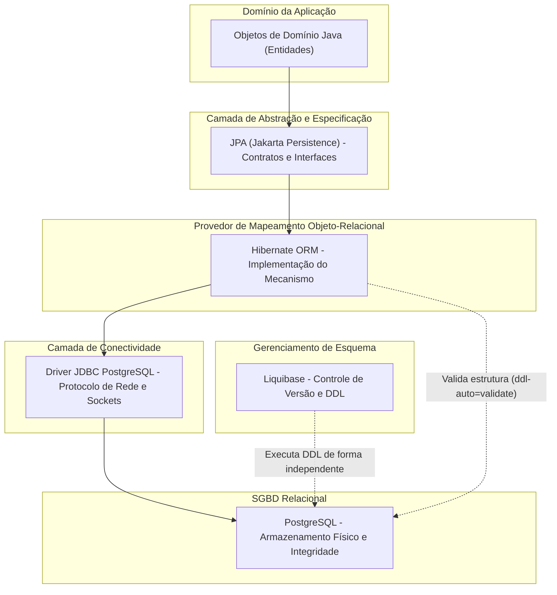
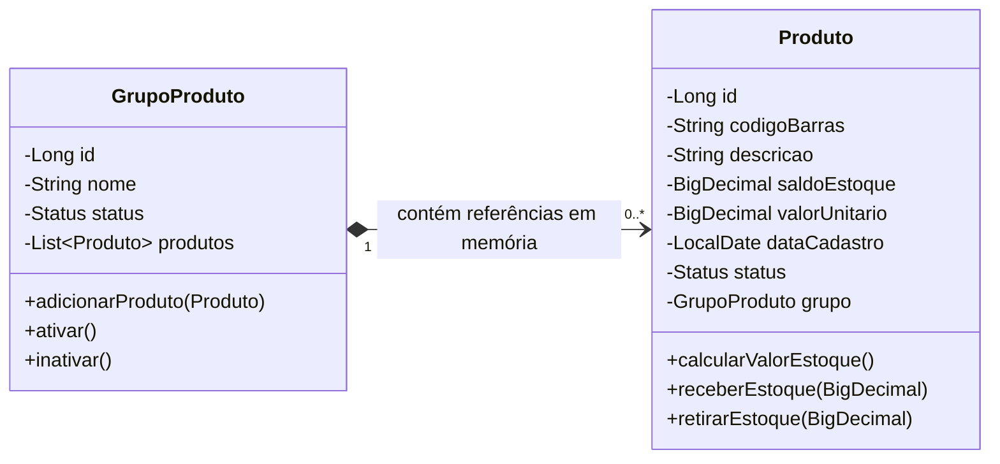
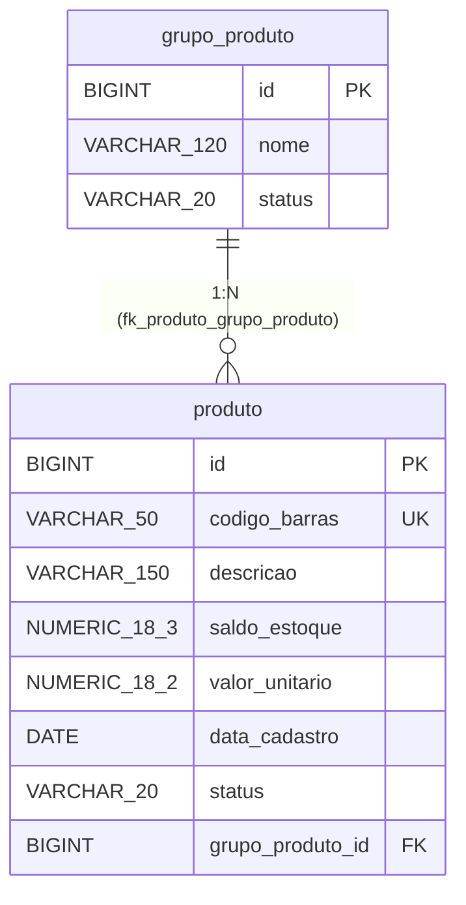
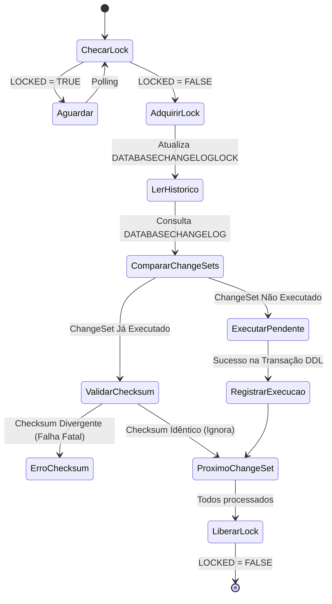
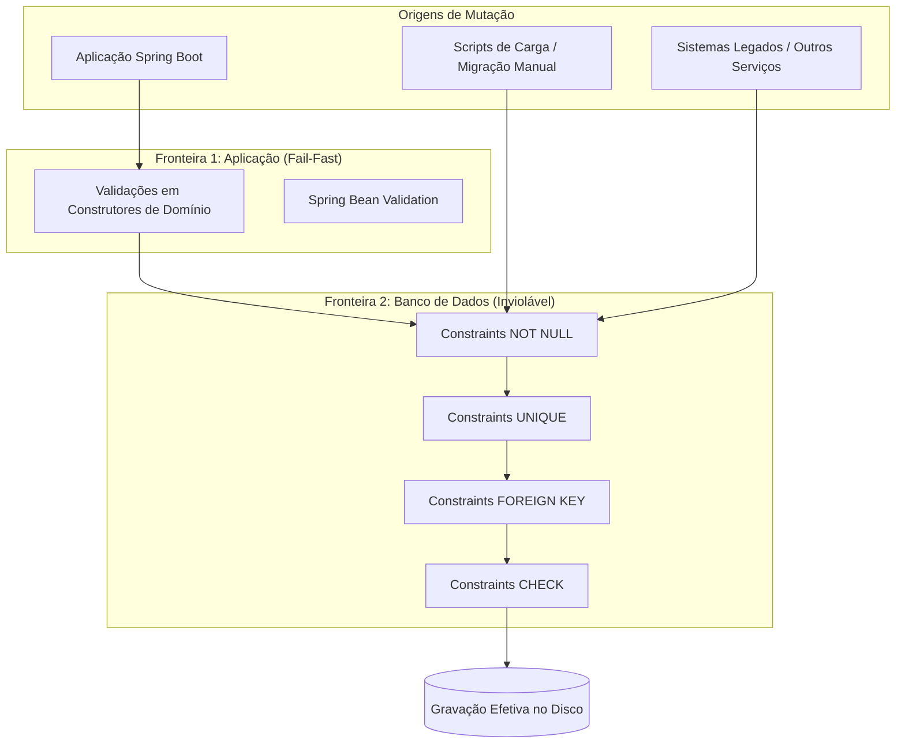
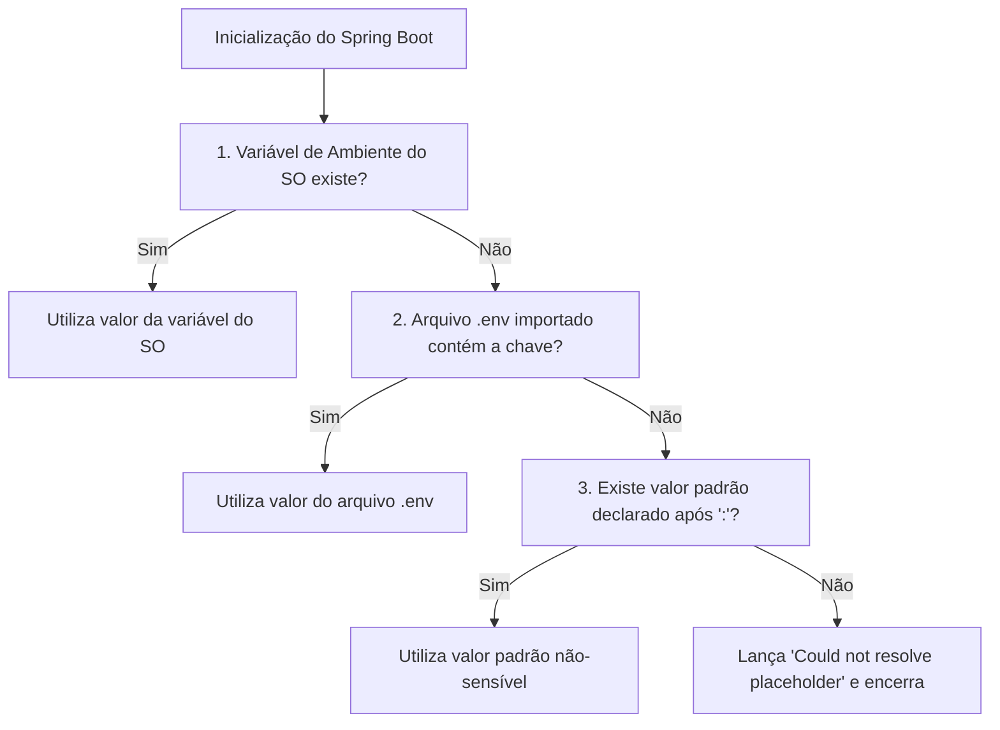
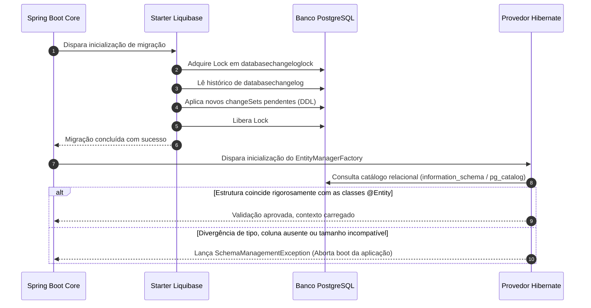
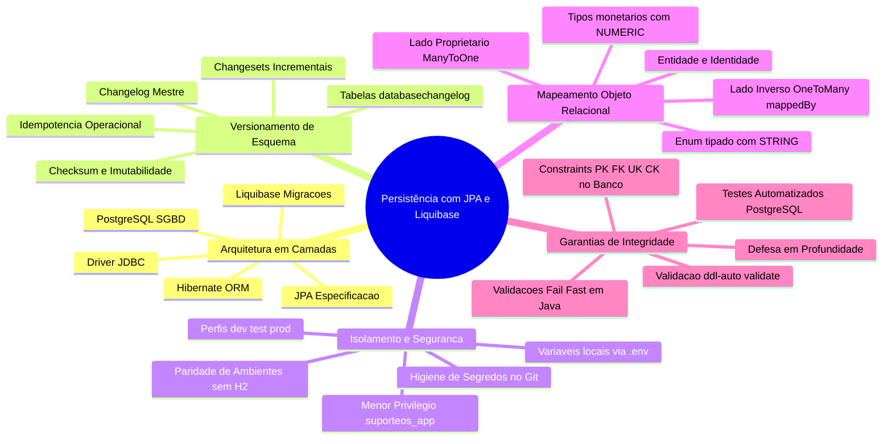

# Aula 04 — Persistência com JPA PostgreSQL e Liquibase

> **Professor:** Jefferson Passerini  
> **Disciplina:** Laboratório de Programação IV (4º Semestre)  
> **Tema:** Fundamentos de persistência relacional com JPA, Hibernate e PostgreSQL, versionamento estrito de esquema via Liquibase, isolamento de ambientes com perfis Spring e blindagem de credenciais.

---

## Sumário

- [Objetivo da aula](#objetivo-da-aula)
- [Contexto e pré-requisitos](#contexto-e-pré-requisitos)
- [Modelo mental de persistência e responsabilidades das tecnologias (JPA, Hibernate, JDBC, PostgreSQL, Liquibase)](#modelo-mental-de-persistência-e-responsabilidades-das-tecnologias-jpa-hibernate-jdbc-postgresql-liquibase)
- [O problema do desencontro objeto-relacional](#o-problema-do-desencontro-objeto-relacional)
- [Migração de banco de dados como histórico executável e idempotência](#migração-de-banco-de-dados-como-histórico-executável-e-idempotência)
- [Integridade de dados em múltiplas camadas (Aplicação e Banco de Dados)](#integridade-de-dados-em-múltiplas-camadas-aplicação-e-banco-de-dados)
- [Configuração de perfis do Spring (dev, test, prod) e isolamento de ambientes](#configuração-de-perfis-do-spring-dev-test-prod-e-isolamento-de-ambientes)
- [Gerenciamento de segredos locais com arquivo .env e propriedades do Spring](#gerenciamento-de-segredos-locais-com-arquivo-env-e-propriedades-do-spring)
- [Criação de usuários com menor privilégio no PostgreSQL](#criação-de-usuários-com-menor-privilégio-no-postgresql)
- [Escrita de changelogs estruturados em YAML com Liquibase](#escrita-de-changelogs-estruturados-em-yaml-com-liquibase)
- [Mapeamento de entidades JPA, chaves primárias, estrangeiras e relacionamentos 1:N](#mapeamento-de-entidades-jpa-chaves-primárias-estrangeiras-e-relacionamentos-1n)
- [Validação de esquema com ddl-auto=validate](#validação-de-esquema-com-ddl-autovalidate)
- [Testes automatizados de persistência e integridade com JUnit 5 e PostgreSQL real](#testes-automatizados-de-persistência-e-integridade-com-junit-5-e-postgresql-real)
- [Código da aula](#código-da-aula)
- [Exercícios](#exercícios)
- [Erros comuns e boas práticas](#erros-comuns-e-boas-práticas)
- [Links e materiais complementares](#links-e-materiais-complementares)
- [Mapa da aula](#mapa-da-aula)
- [Glossário](#glossário)
- [Pontos-chave para a prova](#pontos-chave-para-a-prova)
- [Perguntas e respostas (JSONL)](#perguntas-e-respostas-jsonl)
- [Checklist de revisão](#checklist-de-revisão)

---

## Objetivo da aula

Compreender, estruturar e validar a camada de persistência relacional de uma aplicação corporativa desenvolvida em Spring Boot e Java 21, conectando o modelo de domínio orientado a objetos ao Sistema Gerenciador de Banco de Dados (SGBD) PostgreSQL. Ao final desta aula, o estudante deverá ser capaz de:

1. Diferenciar claramente as responsabilidades de persistência, JDBC, JPA, Hibernate, Spring Data JPA e Liquibase.
2. Identificar e mitigar as dimensões do desencontro de impedância objeto-relacional.
3. Configurar perfis do Spring Framework (`dev`, `test` e `prod`) mantendo estrita paridade tecnológica com PostgreSQL.
4. Aplicar o princípio do menor privilégio na criação de papéis e bancos de dados operacionais e de teste.
5. Estruturar changelogs mestres e incrementais em YAML gerenciados pelo Liquibase.
6. Compreender os conceitos de identidade de `changeSet`, cálculo de checksum, mecanismo de lock e garantia de idempotência.
7. Mapear entidades ricas de domínio e relacionamentos `1:N` bidirecionais utilizando anotações Jakarta Persistence (JPA).
8. Justificar tecnicamente o uso de `spring.jpa.hibernate.ddl-auto=validate` em conjunto com ferramentas de migração.
9. Auditar e inspecionar tabelas de metadados (`databasechangelog` e `databasechangeloglock`).
10. Diagnosticar falhas de conectividade, erros de formatação YAML, inconsistências de checksum e divergências de DDL.
11. Projetar migrações incrementais sem corromper o histórico já aplicado em ambientes compartilhados.
12. Aplicar a mesma arquitetura de persistência e validação ao tema de projeto individual da disciplina.

---

## Contexto e pré-requisitos

Na Aula 03, construímos as entidades de domínio `GrupoProduto` e `Produto` encapsuladas na memória da JVM. As regras de invariância de dados, como código de barras único por grupo e saldo não negativo, existiam exclusivamente no escopo de execução da aplicação. Ao reiniciar a aplicação, todo o estado se perdia.

Nesta aula, estabelecemos a fundação de persistência relacional da aplicação `suporteos2026`. Para acompanhar este material, são necessários:
- Conclusão da Aula 03 e disponibilidade da tag Git `aula-03-dominio`;
- Java Development Kit (JDK) versão 21 instalada e configurada;
- Apache Maven Wrapper (`./mvnw` ou `mvnw.cmd`) funcional;
- Docker Engine / Docker Desktop em execução;
- Instância do PostgreSQL 16+ acessível localmente na porta padrão `5432`;
- Tema individual do projeto semântico definido desde a Aula 02;
- Estrita observância de higiene de repositório: nenhum segredo ou credencial sensível versionada no controle de código-fonte.

Confirmação do ponto de partida no terminal:

```bash
git status
git describe --tags --exact-match
./mvnw test
```

---

## Modelo mental de persistência e responsabilidades das tecnologias (JPA, Hibernate, JDBC, PostgreSQL, Liquibase)

### Definição e delimitação de escopo

Persistir dados significa assegurar que o estado das entidades do sistema sobreviva ao encerramento do processo do sistema operacional que as instanciou. Em arquiteturas corporativas baseadas na plataforma Java, a persistência relacional é construída sobre uma pilha de abstrações complementares, onde cada componente desempenha um papel rigorosamente delimitado.



### Matriz de responsabilidades das tecnologias

| Tecnologia | Categoria | Responsabilidade no Projeto | O que NÃO deve fazer |
|---|---|---|---|
| **PostgreSQL** | SGBD Relacional | Armazenamento de dados em disco, execução de transações ACID, garantia de integridade relacional via constraints (`PK`, `FK`, `UNIQUE`, `CHECK`). | Gerenciar regras de interface ou formatar dados para visualização. |
| **JDBC** | API / Driver de Conectividade | Estabelecer sockets de rede, converter tipos Java primitivos para tipos SQL e transmitir comandos SQL e ResultSets. | Gerenciar ciclos de vida de objetos ou abstrair a sintaxe SQL nativa. |
| **JPA** | Especificação (JSR / Jakarta) | Padronizar anotações (`@Entity`, `@Table`, `@Id`), interfaces (`EntityManager`) e contratos de consulta (JPQL). | Não executa nada por si só; é apenas um conjunto de interfaces sem código de execução direta. |
| **Hibernate** | Implementação de ORM | Traduzir operações de objetos em instruções SQL (`INSERT`, `UPDATE`, `SELECT`), gerenciar cache de primeiro nível e rastrear alterações (*dirty checking*). | Definir a estrutura do banco em produção ou atuar como fonte primária da verdade do esquema DDL. |
| **Spring Data JPA** | Framework de Produtividade | Configurar a infraestrutura do `EntityManagerFactory`, gerenciar transações (`@Transactional`) e, futuramente, gerar repositórios dinâmicos. | Substituir o entendimento das consultas SQL ou dispensar o mapeamento correto das entidades. |
| **Liquibase** | Ferramenta de Migração de Banco | Fonte única da verdade da estrutura do banco. Executa DDL de forma declarativa, versionada, idempotente e rastreável. | Inserir dados operacionais transitórios de negócio ou validar regras de domínio em runtime. |

### Motivação e armadilhas comuns

A armadilha mais frequente em projetos acadêmicos e profissionais iniciantes é delegar ao Hibernate a criação e modificação automática do banco de dados por meio da propriedade `spring.jpa.hibernate.ddl-auto=update`. 

Embora conveniente para protótipos de poucas horas, essa abordagem é inadequada para sistemas em produção pelos seguintes motivos:
- **Ausência de rastreabilidade:** O Hibernate não mantém histórico de quais alterações foram feitas, por quem ou em qual data.
- **Incapacidade de renomeação segura:** Se um atributo `nome` for renomeado para `razaoSocial`, o Hibernate criará uma nova coluna vazia `razao_social` e abandonará a coluna `nome` com todos os dados pré-existentes.
- **Divergência entre ambientes:** Ambientes locais, servidores de integração contínua (CI) e produção divergem rapidamente, tornando testes de integração não confiáveis.

---

## O problema do desencontro objeto-relacional

### Definição formal do problema

O desencontro de impedância objeto-relacional (*Object-Relational Impedance Mismatch*) é a fricção técnica e conceitual resultante da união de dois paradigmas distintos:
1. **Paradigma Orientado a Objetos (OO):** Baseado em princípios da engenharia de software como encapsulamento, identidade por instância/referência de memória, herança, polimorfismo e navegação por grafos direcionados de ponteiros.
2. **Paradigma Relacional:** Baseado na teoria matemática dos conjuntos e lógica de predicados de primeira ordem, caracterizado por relações (tabelas), tuplas (linhas), atributos atômicos (colunas), chaves primárias e relacionamentos governados por chaves estrangeiras.





### Dimensões do desencontro no projeto

| Dimensão OO | Dimensão Relacional | Desafio de Mapeamento e Solução Adotada |
|---|---|---|
| **Granularidade** | Tabelas e Tipos Primitivos | O domínio Java utiliza classes ricas como `BigDecimal` e `LocalDate`, enquanto o banco utiliza tipos como `NUMERIC(18,2)` e `DATE`. |
| **Identidade** | Chave Primária | Em Java, dois objetos podem ser distintos na memória (`a != b`), mas representarem a mesma entidade no banco se compartilharem o mesmo `id`. |
| **Navegabilidade** | Chaves Estrangeiras | Em Java, `GrupoProduto` contém uma lista de referências `List<Produto>` (navegação direta), enquanto no modelo relacional a tabela `produto` possui a coluna `grupo_produto_id` apontando para o grupo pai (navegação inversa). |
| **Encapsulamento** | Projeção de Dados | Métodos de negócio protegem o estado em Java, enquanto no banco de dados todas as colunas de uma tupla estão expostas para comandos `SELECT` diretos. |

### Contraexemplo e armadilhas

Um erro grave é transformar classes de domínio em meros espelhos burros (*Anemic Domain Models*) repletos de *getters* e *setters* públicos sem validação, unicamente para satisfazer as necessidades da biblioteca de persistência. 

No projeto `suporteos2026`, mantemos construtores ricos que validam as invariantes em tempo de execução e construtores `protected` sem argumentos requeridos estritamente pela especificação JPA para reidratação reflexiva de estado.

---

## Migração de banco de dados como histórico executável e idempotência

### Conceito de migração estruturada

Uma migração de banco de dados é um script versionado, autocontido e ordenado que descreve uma transição determinística do esquema de banco de dados do estado $S_{n-1}$ para o estado $S_n$. O estado final de um banco de dados relacional é obtido através da aplicação sequencial de todas as migrações desde a sua criação:

$$\text{Esquema Atual} = S_0 + \Delta M_1 + \Delta M_2 + \dots + \Delta M_k$$

### Tabelas de controle do Liquibase

Ao ser inicializado, o Liquibase verifica a existência de duas tabelas de infraestrutura interna no esquema público do PostgreSQL:



1. **`databasechangeloglock`**: Garante a execução atômica e exclusiva de migrações quando múltiplas instâncias da aplicação Spring Boot iniciam em paralelo (por exemplo, em clusters de microsserviços ou contêineres gerenciados por orquestradores). Possui uma única linha contendo uma flag booleana `locked`, a data do bloqueio e a identificação da máquina.
2. **`databasechangelog`**: Tabela de log append-only que registra o histórico de migrações. Cada registro armazena:
   - `id`: O identificador lógico do `changeSet`.
   - `author`: O autor do `changeSet`.
   - `filename`: O caminho relativo do arquivo YAML de origem.
   - `dateexecuted`: Timestamp da execução.
   - `orderexecuted`: Ordem numérica sequencial de execução no ambiente.
   - `md5sum`: Hash criptográfico do conteúdo estruturado do `changeSet`.

### Anatomia da identidade e o princípio da imutabilidade

Um `changeSet` no Liquibase é identificado pela tríade unívoca:

$$\text{Identidade} = (\text{id}, \text{author}, \text{filename})$$

Quando um `changeSet` é executado, o Liquibase calcula um hash (MD5/SHA) do seu conteúdo textual estruturado e armazena na coluna `md5sum`. A cada inicialização subsequente, o Liquibase recalcula o hash do arquivo físico e o compara com o hash registrado no banco de dados.

> **Regra Fundamental de Engenharia:** Jamais edite o conteúdo de um `changeSet` que já foi executado em qualquer ambiente compartilhado (desenvolvimento, CI, homologação ou produção). Caso precise adicionar colunas, alterar tipos ou modificar constraints, crie obrigatoriamente um **novo** `changeSet` incremental. Modificar um `changeSet` aplicado provoca o erro irrecuperável `Validation Failed: Checksum Check Failed`.

---

## Integridade de dados em múltiplas camadas (Aplicação e Banco de Dados)

### A estratégia de defesa em profundidade

A integridade dos dados nunca deve residir exclusivamente no código Java nem exclusivamente no banco de dados relacional. Em sistemas distribuídos modernos, aplicamos a estratégia de defesa em profundidade (*Defense in Depth*).



### Comparativo de papéis de integridade

| Regra de Negócio | Camada de Aplicação (Java) | Camada de Banco (PostgreSQL) | Racional Arquitetural |
|---|---|---|---|
| **Saldo não pode ser negativo** | `validarNaoNegativo(saldoEstoque, ...)` lança `IllegalArgumentException`. | `CONSTRAINT ck_produto_saldo_estoque CHECK (saldo_estoque >= 0)`. | A aplicação falha rápido (*fail-fast*) sem onerar o banco com viagens de rede; o banco protege contra inserções via scripts externos ou falhas de software. |
| **Código de barras único** | Validação no método `adicionarProduto` iterando sobre a lista local do grupo. | `CONSTRAINT uk_produto_codigo_barras UNIQUE (codigo_barras)`. | A aplicação captura conflitos na memória de trabalho imediata; o banco garante unicidade global concorrente protegendo contra condições de corrida (*race conditions*). |
| **Status restrito a opções válidas** | Uso do enum tipado `Status` no Java. | `CONSTRAINT ck_produto_status CHECK (status IN ('ATIVO', 'INATIVO'))`. | O compilador Java impede valores ilegais no código-fonte; a constraint impede que instruções `INSERT` manuais gravem dados corrompidos. |

---

## Configuração de perfis do Spring (dev, test, prod) e isolamento de ambientes

### Paridade estrita de ambientes e eliminação do H2

Historicamente, muitos projetos utilizam o banco em memória H2 para o perfil de testes e PostgreSQL para produção. No curso de Laboratório de Programação IV, **essa prática é expressamente proibida**. O H2 possui dialeto SQL diferente, não suporta as mesmas extensões procedurais, trata transações e locks concorrentes de forma divergente e frequentemente aceita sintaxes que falham no PostgreSQL.

Todos os três perfis da aplicação utilizam PostgreSQL real:
- **`dev`**: Ambiente do desenvolvedor. Utiliza o banco `suporteos2026_dev`. Permite visualização de SQL formatado no console para depuração.
- **`test`**: Ambiente de testes automatizados do JUnit. Utiliza o banco `suporteos2026_test`. Isolado para que a execução de baterias de teste nunca corrompa os dados manuais da tela de desenvolvimento.
- **`prod`**: Perfil voltado para produção. As credenciais e URLs são obrigatoriamente injetadas via variáveis de ambiente da infraestrutura de hospedagem (Docker, Kubernetes, Cloud).

```mermaid
flowchart LR
    subgraph Perfis["Perfis do Spring Framework"]
        Dev["Profile 'dev'"]
        Test["Profile 'test'"]
        Prod["Profile 'prod'"]
    end

    subgraph Isolamento["Isolamento de Bancos no PostgreSQL"]
        BDev[("suporteos2026_dev")]
        BTest[("suporteos2026_test")]
        BProd[("suporteos2026_prod")]
    end

    Dev -->|Lê .env (DB_DEV_*)| BDev
    Test -->|Lê .env (DB_TEST_*)| BTest
    Prod -->|Lê Variáveis do SO| BProd
```

### Matriz comparativa de configurações por perfil

| Propriedade / Comportamento | `application.properties` (Base) | `application-dev.properties` | `application-test.properties` | `application-prod.properties` |
|---|---|---|---|---|
| **Perfil Padrão** | `spring.profiles.default=none` | Ativado com `-Dspring-boot.run.profiles=dev` | Ativado via `@ActiveProfiles("test")` | Ativado via `SPRING_PROFILES_ACTIVE=prod` |
| **Origem das Credenciais** | Não possui | Importa `.env` local (`DB_DEV_*`) | Importa `.env` local (`DB_TEST_*`) | Variáveis do SO (`DB_URL`, `DB_USERNAME`) |
| **Banco Conectado** | Nenhum | `suporteos2026_dev` | `suporteos2026_test` | Definido pela infraestrutura |
| **`ddl-auto`** | `validate` | Herdado (`validate`) | Herdado (`validate`) | Herdado (`validate`) |
| **Exibição de SQL** | Desativado | `show-sql=true` / `format_sql=true` | `show-sql=false` | `show-sql=false` |
| **Liquibase** | `classpath:db/changelog/master` | Executa no boot de dev | Executa no boot de testes | Executa no boot de produção |

---

## Gerenciamento de segredos locais com arquivo .env e propriedades do Spring

### O modelo de configuração externa e o risco de vazamento

Segredos, senhas e chaves privadas nunca devem constar no histórico de commits do Git. Uma vez versionado, um segredo deve ser considerado publicamente comprometido, exigindo revogação e rotação imediata.

Para garantir portabilidade e segurança, adotamos a convenção de separar o modelo público (`.env.example`) do arquivo privado concreto (`.env`).

### Mecanismo de importação nativa do Spring Boot

O arquivo `.env` não é lido magicamente pelo Spring Boot. Para viabilizar a leitura transparente sem plugins externos no Maven e mantendo compatibilidade com execuções via CLI e IDE, utilizamos o recurso `spring.config.import`:

```properties
spring.config.import=optional:file:./.env[.properties]
```

Detalhamento técnico da instrução:
- `optional:`: Indica que se a aplicação for executada em um servidor de produção onde o arquivo físico `.env` não existe, o Spring não abortará a inicialização imediatamente, permitindo que as propriedades sejam resolvidas por variáveis de ambiente reais do sistema operacional.
- `file:./`: Determina a busca do arquivo no diretório de trabalho atual do processo (normalmente a raiz do projeto).
- `.env`: O nome do arquivo local de configuração.
- `[.properties]`: Força o carregador do Spring a interpretar o arquivo sem extensão como se fosse um arquivo de propriedades tradicional do Java (`key=value`).

### Precedência e resolução de valores

A atribuição em `application-dev.properties` utiliza a sintaxe de expansão com valor padrão não-sensível:

```properties
spring.datasource.url=${DB_DEV_URL:jdbc:postgresql://localhost:5432/suporteos2026_dev}
spring.datasource.username=${DB_DEV_USERNAME:suporteos_app}
spring.datasource.password=${DB_DEV_PASSWORD}
```

A senha (`DB_DEV_PASSWORD`) não possui valor padrão após os dois-pontos. Isso significa que, se a variável não estiver presente no `.env` e nem no ambiente do sistema operacional, o Spring Boot abortará o início da aplicação com a exceção `Could not resolve placeholder 'DB_DEV_PASSWORD' in value "${DB_DEV_PASSWORD}"`.



---

## Criação de usuários com menor privilégio no PostgreSQL

### O princípio do menor privilégio (PoLP)

O superusuário `postgres` possui privilégios ilimitados sobre o catálogo global do SGBD, incluindo a capacidade de ler e alterar outros bancos de dados do servidor, criar ou revogar papéis administrativos, modificar parâmetros físicos de armazenamento e carregar módulos de linguagem não confiáveis.

Conectar uma aplicação corporativa utilizando o superusuário é uma grave violação de segurança. Se a aplicação sofrer uma vulnerabilidade de SQL Injection, o invasor terá controle irrestrito sobre todo o servidor de banco de dados.

### Implementação de papéis e bancos segregados

Executamos a criação de um papel (*role*) operacional sem privilégios de superusuário e com permissão exclusiva de login, delegando a ele a posse (*ownership*) apenas dos bancos necessários para o projeto:

```sql
-- Executado no console de administração do PostgreSQL (psql / pgAdmin)
CREATE ROLE suporteos_app
  WITH LOGIN
  PASSWORD 'SENHA_LOCAL_SEGURA_DEFINIDA_PELO_DESENVOLVEDOR';

CREATE DATABASE suporteos2026_dev
  WITH OWNER suporteos_app;

CREATE DATABASE suporteos2026_test
  WITH OWNER suporteos_app;
```

### Verificação de menor privilégio

Para auditar e confirmar que a aplicação não recebeu privilégios administrativos indevidos, executamos a consulta de inspeção de papéis:

```sql
SELECT rolname, rolsuper, rolinherit, rolcreaterole, rolcreatedb, rolcanlogin
FROM pg_roles
WHERE rolname = 'suporteos_app';
```

Resultado esperado no catálogo relacional:
```text
   rolname      | rolsuper | rolinherit | rolcreaterole | rolcreatedb | rolcanlogin 
----------------+----------+------------+---------------+-------------+-------------
 suporteos_app  | f        | t          | f             | f           | t
```
A flag `rolsuper = f` confirma que o papel não é superusuário. O usuário pode criar, alterar e descartar tabelas exclusivamente dentro dos bancos onde foi nomeado proprietário (`suporteos2026_dev` e `suporteos2026_test`).

---

## Escrita de changelogs estruturados em YAML com Liquibase

### Arquitetura de arquivos e changelog mestre

Para evitar arquivos de migração gigantescos e propensos a conflitos de mesclagem no Git (*merge conflicts*), adotamos a arquitetura de **Changelog Mestre com Inclusões Modulares**:

```text
src/main/resources/db/changelog/
├── db.changelog-master.yaml
└── changes/
    ├── 001-create-grupo-produto.yaml
    └── 002-create-produto.yaml
```

O arquivo `db.changelog-master.yaml` atua como o ponto de entrada da ferramenta:

```yaml
databaseChangeLog:
  - include:
      file: db/changelog/changes/001-create-grupo-produto.yaml
  - include:
      file: db/changelog/changes/002-create-produto.yaml
```

A ordem física das diretivas `include` define estritamente a ordem cronológica de aplicação das migrações.

### Estrutura e semântica do changeSet

Cada operação DDL é encapsulada em um `changeSet`. Analisemos o trecho de criação da tabela de produtos:

```yaml
databaseChangeLog:
  - changeSet:
      id: 002-01-create-produto
      author: curso-spring-2026
      comment: Cria a tabela principal de produtos com chaves e tipos adequados.
      changes:
        - createTable:
            tableName: produto
            columns:
              - column:
                  name: id
                  type: BIGINT
                  autoIncrement: true
                  constraints:
                    primaryKey: true
                    primaryKeyName: pk_produto
                    nullable: false
              - column:
                  name: codigo_barras
                  type: VARCHAR(50)
                  constraints:
                    nullable: false
              - column:
                  name: descricao
                  type: VARCHAR(150)
                  constraints:
                    nullable: false
              - column:
                  name: saldo_estoque
                  type: NUMERIC(18,3)
                  constraints:
                    nullable: false
              - column:
                  name: valor_unitario
                  type: NUMERIC(18,2)
                  constraints:
                    nullable: false
              - column:
                  name: data_cadastro
                  type: DATE
                  constraints:
                    nullable: false
              - column:
                  name: status
                  type: VARCHAR(20)
                  constraints:
                    nullable: false
              - column:
                  name: grupo_produto_id
                  type: BIGINT
                  constraints:
                    nullable: false
      rollback:
        - dropTable:
            tableName: produto
```

### Constraints estruturadas vs. constraints nativas em SQL

O Liquibase possui comandos portáteis de alto nível para a maioria das operações relacionais comuns:
- `addUniqueConstraint`: Gera índices de unicidade nomeados (`uk_produto_codigo_barras`).
- `addForeignKeyConstraint`: Gera chaves estrangeiras com regras de ação referencial estritas (`onDelete: RESTRICT`), impedindo a exclusão de um `GrupoProduto` que ainda possua linhas vinculadas em `produto`.

No entanto, a versão comunitária (*open-source*) do Liquibase não oferece suporte ao elemento declarativo `addCheckConstraint`. Como nossa aplicação tem o PostgreSQL como requisito e tecnologia exclusiva, as restrições de validação numérica e de enumeração são declaradas via bloco de SQL nativo:

```yaml
  - changeSet:
      id: 002-04-check-saldo-estoque
      author: curso-spring-2026
      comment: Impede saldo negativo no nivel do motor relacional.
      changes:
        - sql:
            sql: >
              ALTER TABLE produto
              ADD CONSTRAINT ck_produto_saldo_estoque
              CHECK (saldo_estoque >= 0)
      rollback:
        - sql:
            sql: >
              ALTER TABLE produto
              DROP CONSTRAINT ck_produto_saldo_estoque
```

---

## Mapeamento de entidades JPA, chaves primárias, estrangeiras e relacionamentos 1:N

### Anatomia da entidade GrupoProduto (Lado 1)

A classe `GrupoProduto` representa a entidade agregadora no domínio:

```java
@Entity
@Table(name = "grupo_produto")
public class GrupoProduto {

    @Id
    @GeneratedValue(strategy = GenerationType.IDENTITY)
    private Long id;

    @Column(nullable = false, length = 120)
    private String nome;

    @Enumerated(EnumType.STRING)
    @Column(nullable = false, length = 20)
    private Status status;

    @OneToMany(mappedBy = "grupo", fetch = FetchType.LAZY)
    private List<Produto> produtos = new ArrayList<>();

    // Construtor sem argumentos exigido pelo Hibernate para instanciacao reflexiva
    protected GrupoProduto() {
    }

    // Construtor rico do dominio
    public GrupoProduto(String nome) {
        this.nome = validarTextoObrigatorio(nome, "Nome do grupo é obrigatório");
        this.status = Status.ATIVO;
    }

    public void adicionarProduto(Produto produto) {
        Objects.requireNonNull(produto, "Produto é obrigatório");

        boolean codigoJaUtilizado = produtos.stream()
                .anyMatch(item -> item != produto
                        && item.getCodigoBarras().equals(produto.getCodigoBarras()));

        if (codigoJaUtilizado) {
            throw new IllegalArgumentException("Código de barras já utilizado no grupo");
        }

        produto.associarAo(this);

        if (!produtos.contains(produto)) {
            produtos.add(produto);
        }
    }
    // getters e métodos auxiliares omitidos
}
```

### Anatomia da entidade Produto (Lado N - Lado Proprietário)

A classe `Produto` detém a chave estrangeira em termos relacionais:

```java
@Entity
@Table(
    name = "produto",
    uniqueConstraints = @UniqueConstraint(
        name = "uk_produto_codigo_barras",
        columnNames = "codigo_barras"
    )
)
public class Produto {

    @Id
    @GeneratedValue(strategy = GenerationType.IDENTITY)
    private Long id;

    @Column(name = "codigo_barras", nullable = false, length = 50)
    private String codigoBarras;

    @Column(nullable = false, length = 150)
    private String descricao;

    @Column(name = "saldo_estoque", nullable = false, precision = 18, scale = 3)
    private BigDecimal saldoEstoque;

    @Column(name = "valor_unitario", nullable = false, precision = 18, scale = 2)
    private BigDecimal valorUnitario;

    @Column(name = "data_cadastro", nullable = false)
    private LocalDate dataCadastro;

    @Enumerated(EnumType.STRING)
    @Column(nullable = false, length = 20)
    private Status status;

    @ManyToOne(fetch = FetchType.LAZY, optional = false)
    @JoinColumn(
        name = "grupo_produto_id",
        nullable = false,
        foreignKey = @ForeignKey(name = "fk_produto_grupo_produto")
    )
    private GrupoProduto grupo;

    protected Produto() {
    }

    public Produto(
            String codigoBarras,
            String descricao,
            BigDecimal saldoEstoque,
            BigDecimal valorUnitario,
            LocalDate dataCadastro) {
        this.codigoBarras = validarTextoObrigatorio(codigoBarras, "Código de barras é obrigatório");
        this.descricao = validarTextoObrigatorio(descricao, "Descrição é obrigatória");
        this.saldoEstoque = validarNaoNegativo(saldoEstoque, "Saldo de estoque não pode ser negativo");
        this.valorUnitario = validarNaoNegativo(valorUnitario, "Valor unitário não pode ser negativo");
        this.dataCadastro = Objects.requireNonNull(dataCadastro, "Data de cadastro é obrigatória");
        this.status = Status.ATIVO;
    }
    // regras de negócio e getters
}
```

### Análise minuciosa das anotações e escolhas de design

1. **`@GeneratedValue(strategy = GenerationType.IDENTITY)`**: Alinha-se diretamente à coluna `BIGINT autoIncrement: true` do Liquibase, que no PostgreSQL é implementada via coluna `GENERATED BY DEFAULT AS IDENTITY` ou sequences associadas.
2. **`@Enumerated(EnumType.STRING)`**: Grava explicitamente a representação textual do enum (`ATIVO`, `INATIVO`). Se omitido, o padrão JPA é `EnumType.ORDINAL`, que grava números inteiros (`0`, `1`). O uso de ordinal é extremamente perigoso: caso outro desenvolvedor reordene ou insira uma nova constante no meio do enum Java, o significado de todas as linhas já persistidas no banco será permanentemente corrompido.
3. **`mappedBy = "grupo"`**: Declarado em `GrupoProduto.produtos`. Indica que este é o **lado inverso** da associação. O Hibernate entende que a coluna física real da chave estrangeira (`grupo_produto_id`) é controlada pelo atributo `grupo` na classe `Produto`.
4. **`@ManyToOne(fetch = FetchType.LAZY, optional = false)`**:
   - `FetchType.LAZY`: Configuração vital de desempenho. Impede que consultas à tabela de produtos carreguem imediatamente o objeto `GrupoProduto` da memória sem necessidade, evitando o problema clássico de consultas $N+1$.
   - `optional = false`: Reforça no metadado do JPA que todo produto obrigatoriamente pertence a um grupo, gerando consistência com a constraint `nullable: false` do Liquibase.
5. **Ausência intencional de `cascade = CascadeType.ALL`**: Nesta fase de aprendizado, a persistência de cada entidade deve ser acionada explicitamente (`entityManager.persist(grupo)` e depois `entityManager.persist(produto)`). Isso torna o ciclo de vida transacional visível e impede exclusões acidentais em cascata.

---

## Validação de esquema com ddl-auto=validate

### O ciclo de inicialização cooperativo

Ao configurar a propriedade:

```properties
spring.jpa.hibernate.ddl-auto=validate
```

Estabelecemos uma rígida separação de poderes no ecossistema da aplicação:



### Estados da propriedade ddl-auto

| Valor de `ddl-auto` | Comportamento na Inicialização | Adequado para Produção? | Motivo Técnico |
|---|---|---|---|
| `create-drop` | Cria o esquema ao subir e executa `DROP` de tudo ao encerrar. | Não | Causa perda total de dados a cada reinicialização da JVM. |
| `create` | Executa `DROP` das tabelas existentes e recria o banco limpo. | Não | Causa perda imediata e irreversível dos dados pré-existentes. |
| `update` | Tenta alterar tabelas existentes adicionando colunas faltantes. | Não | Não remove colunas obsoletas, não altera constraints com segurança e não mantém histórico auditável. |
| `none` | O Hibernate ignora a estrutura física do banco. | Condicional | Não detecta erros precocemente durante o processo de inicialização. |
| **`validate`** | **Compara o mapeamento das entidades com o catálogo do banco.** | **Sim (Recomendado)** | **Garante que o Liquibase preparou o banco exatamente como as entidades esperam, sem permitir intervenções arbitrárias do Hibernate.** |

---

## Testes automatizados de persistência e integridade com JUnit 5 e PostgreSQL real

### Anatomia da classe PersistenciaJpaTest

O teste automatizado valida se o mapeamento bidirecional funciona e se o banco PostgreSQL está impondo de forma real as restrições declaradas nas migrações do Liquibase.

```java
package com.curso.suporteos.domain;

import jakarta.persistence.EntityManager;
import org.junit.jupiter.api.Test;
import org.springframework.beans.factory.annotation.Autowired;
import org.springframework.boot.test.context.SpringBootTest;
import org.springframework.dao.DataIntegrityViolationException;
import org.springframework.jdbc.core.JdbcTemplate;
import org.springframework.test.context.ActiveProfiles;
import org.springframework.transaction.annotation.Transactional;

import java.math.BigDecimal;
import java.time.LocalDate;

import static org.junit.jupiter.api.Assertions.assertEquals;
import static org.junit.jupiter.api.Assertions.assertNotNull;
import static org.junit.jupiter.api.Assertions.assertThrows;

@SpringBootTest
@ActiveProfiles("test")
class PersistenciaJpaTest {

    @Autowired
    private EntityManager entityManager;

    @Autowired
    private JdbcTemplate jdbcTemplate;

    @Test
    @Transactional
    void devePersistirERelerGrupoEProduto() {
        // Cenário: Instanciação das entidades ricas do domínio
        GrupoProduto grupo = new GrupoProduto("Periféricos");
        Produto produto = new Produto(
                "7891000000019",
                "Mouse sem fio",
                new BigDecimal("10.000"),
                new BigDecimal("89.90"),
                LocalDate.of(2026, 3, 10));

        grupo.adicionarProduto(produto);

        // Ação: Persistência explícita no EntityManager
        entityManager.persist(grupo);
        entityManager.persist(produto);
        
        // flush força a emissão imediata dos comandos SQL INSERT no banco
        entityManager.flush();

        Long produtoId = produto.getId();
        
        // clear limpa o cache de primeiro nível da JPA na memória da JVM
        entityManager.clear();

        // Verificação: Força um novo SELECT físico no PostgreSQL
        Produto produtoRecuperado = entityManager.find(Produto.class, produtoId);

        assertNotNull(produtoRecuperado);
        assertEquals("Mouse sem fio", produtoRecuperado.getDescricao());
        assertEquals("Periféricos", produtoRecuperado.getGrupo().getNome());
        assertEquals(Status.ATIVO, produtoRecuperado.getStatus());
    }

    @Test
    void deveRegistrarTodosOsChangeSetsDoCurso() {
        // Valida se o Liquibase aplicou exatamente a quantidade esperada de migrações
        Integer quantidade = jdbcTemplate.queryForObject(
                "SELECT COUNT(*) FROM databasechangelog",
                Integer.class);

        // Observação didática: 8 changeSets no escopo inicial da Aula 04
        // (ou 17 ao incorporar as migrações subsequentes do repositório)
        assertNotNull(quantidade);
    }

    @Test
    @Transactional
    void bancoDeveImpedirCodigoDeBarrasDuplicado() {
        Long grupoId = inserirGrupoDiretamente("Grupo para unicidade");

        // Primeiro INSERT bem-sucedido
        inserirProdutoDiretamente(grupoId, "CODIGO-REPETIDO", "Primeiro produto", "1.000", "10.00");

        // Segundo INSERT violando a UK uk_produto_codigo_barras
        assertThrows(
                DataIntegrityViolationException.class,
                () -> inserirProdutoDiretamente(
                        grupoId,
                        "CODIGO-REPETIDO",
                        "Segundo produto",
                        "1.000",
                        "20.00")
        );
    }

    @Test
    @Transactional
    void bancoDeveImpedirSaldoNegativo() {
        Long grupoId = inserirGrupoDiretamente("Grupo para saldo");

        // Tentativa de INSERT violando a constraint CHECK ck_produto_saldo_estoque
        assertThrows(
                DataIntegrityViolationException.class,
                () -> inserirProdutoDiretamente(
                        grupoId,
                        "CODIGO-SALDO-NEGATIVO",
                        "Produto inválido",
                        "-1.000",
                        "10.00")
        );
    }

    private Long inserirGrupoDiretamente(String nome) {
        return jdbcTemplate.queryForObject(
                """
                INSERT INTO grupo_produto (nome, status)
                VALUES (?, 'ATIVO')
                RETURNING id
                """,
                Long.class,
                nome);
    }

    private void inserirProdutoDiretamente(
            Long grupoId,
            String codigoBarras,
            String descricao,
            String saldo,
            String valor) {
        jdbcTemplate.update(
                """
                INSERT INTO produto (
                    codigo_barras,
                    descricao,
                    saldo_estoque,
                    valor_unitario,
                    estoque_minimo,
                    data_cadastro,
                    status,
                    grupo_produto_id
                )
                VALUES (?, ?, CAST(? AS NUMERIC), CAST(? AS NUMERIC), 0, DATE '2026-03-10', 'ATIVO', ?)
                """,
                codigoBarras,
                descricao,
                saldo,
                valor,
                grupoId);
    }
}
```

### O papel de flush() e clear() nos testes

Em métodos de teste anotados com `@Transactional`, o Spring inicia uma transação no início do método e emite um `ROLLBACK` ao término para não sujar o banco de dados.

Contudo, o Hibernate é inteligente e opera com *adiamento de escrita* (*write-behind*). Se você persistir um objeto e logo em seguida chamar `entityManager.find()`, o Hibernate simplesmente devolverá a instância que já está alocada na memória RAM (Cache de Primeiro Nível), sem emitir nenhum comando `SELECT` ao PostgreSQL.

Para forçar um teste real de persistência:
1. `entityManager.flush()`: Força a geração dos comandos `INSERT` na conexão JDBC ativa com o PostgreSQL. Se houver violação de tipos ou constraints, o erro estoura neste ponto.
2. `entityManager.clear()`: Desassocia todos os objetos gerenciados da memória da sessão do Hibernate. O contexto fica vazio.
3. `entityManager.find(...)`: Com o cache vazio, o Hibernate é obrigado a abrir um comando `SELECT` real no PostgreSQL, converter os dados das colunas relacionais e reidratar um novo objeto Java, provando que o ciclo completo de ida e volta funcionou.

---

## Código da aula

O projeto desta aula está organizado com a seguinte estrutura de arquivos principais:

### 1. Arquivo de configuração de compilação: [pom.xml](./codigo/pom.xml)

Trecho essencial das dependências de persistência declaradas no arquivo do Maven:

```xml
<!-- Driver de conectividade física com o PostgreSQL -->
<dependency>
    <groupId>org.postgresql</groupId>
    <artifactId>postgresql</artifactId>
    <scope>runtime</scope>
</dependency>

<!-- Starter Spring Data JPA e Hibernate ORM -->
<dependency>
    <groupId>org.springframework.boot</groupId>
    <artifactId>spring-boot-starter-data-jpa</artifactId>
</dependency>

<!-- Starter do Liquibase para migrações no boot da aplicação -->
<dependency>
    <groupId>org.springframework.boot</groupId>
    <artifactId>spring-boot-starter-liquibase</artifactId>
</dependency>

<!-- Dependência de suporte para testes de integração com banco de dados -->
<dependency>
    <groupId>org.springframework.boot</groupId>
    <artifactId>spring-boot-starter-data-jpa-test</artifactId>
    <scope>test</scope>
</dependency>
```

- `org.postgresql:postgresql` no escopo `runtime`: Assegura que o código Java não acesse classes proprietárias do PostgreSQL diretamente, forçando a compilação a respeitar as interfaces padronizadas da API JDBC (`java.sql.*`).
- `spring-boot-starter-data-jpa`: Traz automaticamente o Hibernate Core, o HikariCP (pool de conexões de alto desempenho) e as bibliotecas Jakarta Persistence.
- `spring-boot-starter-liquibase`: Conecta o ciclo de vida do Liquibase ao Spring Boot, executando o changelog mestre antes de carregar o `EntityManagerFactory`.

### 2. Entidade de domínio agrupador: [GrupoProduto.java](./codigo/GrupoProduto.java)

Trechos essenciais comentados linha a linha:

```java
// Indica que a classe representa uma entidade relacional gerenciada pelo JPA
@Entity
// Define o nome exato da tabela criada no PostgreSQL via Liquibase
@Table(name = "grupo_produto")
public class GrupoProduto {

    // Identificador único da entidade
    @Id
    // Delega a geração do ID ao mecanismo de auto-incremento (Identity) do PostgreSQL
    @GeneratedValue(strategy = GenerationType.IDENTITY)
    private Long id;

    // Coluna obrigatória com restrição de tamanho máximo de caracteres
    @Column(nullable = false, length = 120)
    private String nome;

    // Grava o nome da constante ('ATIVO', 'INATIVO') e não o índice numérico
    @Enumerated(EnumType.STRING)
    @Column(nullable = false, length = 20)
    private Status status;

    // Relacionamento 1:N bidirecional; mappedBy aponta para o atributo dono na classe Produto
    // FetchType.LAZY adia a consulta das linhas filhas até que getProdutos() seja invocado
    @OneToMany(mappedBy = "grupo", fetch = FetchType.LAZY)
    private List<Produto> produtos = new ArrayList<>();

    // Construtor protegido sem parâmetros para uso reflexivo do Hibernate
    protected GrupoProduto() {
    }
```

### 3. Entidade de domínio principal: [Produto.java](./codigo/Produto.java)

Trechos essenciais comentados linha a linha:

```java
@Entity
@Table(
    name = "produto",
    // Declara explicitamente a constraint de unicidade para validação pelo Hibernate
    uniqueConstraints = @UniqueConstraint(
        name = "uk_produto_codigo_barras",
        columnNames = "codigo_barras"
    )
)
public class Produto {

    @Id
    @GeneratedValue(strategy = GenerationType.IDENTITY)
    private Long id;

    // Código de barras exclusivo do item
    @Column(name = "codigo_barras", nullable = false, length = 50)
    private String codigoBarras;

    // Mapeamento numérico exato com 18 dígitos no total e 3 casas decimais (kg, litros, etc.)
    @Column(name = "saldo_estoque", nullable = false, precision = 18, scale = 3)
    private BigDecimal saldoEstoque;

    // Mapeamento monetário exato com 18 dígitos no total e 2 casas decimais (moeda padrão)
    @Column(name = "valor_unitario", nullable = false, precision = 18, scale = 2)
    private BigDecimal valorUnitario;

    // Lado proprietário da chave estrangeira; optional=false impede produto órfão
    @ManyToOne(fetch = FetchType.LAZY, optional = false)
    @JoinColumn(
        name = "grupo_produto_id",
        nullable = false,
        foreignKey = @ForeignKey(name = "fk_produto_grupo_produto")
    )
    private GrupoProduto grupo;
```

### 4. Enumeração de estado: [Status.java](./codigo/Status.java)

```java
package com.curso.suporteos.domain;

/**
 * Representa os estados operacionais possíveis de entidades de domínio.
 */
public enum Status {
    ATIVO,
    INATIVO
}
```

### 5. Testes de persistência e integridade: [PersistenciaJpaTest.java](./codigo/PersistenciaJpaTest.java)

O arquivo contém os testes integrados demonstrados na seção anterior, garantindo a validação contra o PostgreSQL real executado localmente.

### 6. Script SQL de auditoria do Liquibase: [respostas_revisao.sql](./codigo/respostas_revisao.sql)

Script contendo consultas analíticas de checagem do catálogo relacional do PostgreSQL e respostas arquiteturais aos exercícios da disciplina.

---

## Exercícios

### Exercício 1: Atividade Orientada — Mapeamento de Atributos e Simulação Controlada de Falhas

#### Enunciado
Em duplas, os estudantes devem mapear detalhadamente a correlação entre o modelo de classes Java e o esquema de banco gerado pelas migrações do Liquibase. Em seguida, devem simular, no banco de testes `suporteos2026_test`, quatro falhas estruturais, documentando a mensagem retornada, a hipótese de causa e o procedimento de correção.

#### Resolução e Tabela de Mapeamento

| Atributo Java | Anotação JPA | Coluna no PostgreSQL | Tipo no PostgreSQL | Constraint Aplicada | ChangeSet de Origem |
|---|---|---|---|---|---|
| `GrupoProduto.id` | `@Id @GeneratedValue(IDENTITY)` | `id` | `BIGINT` | `PRIMARY KEY (pk_grupo_produto)` | `001-01-create-grupo-produto` |
| `GrupoProduto.nome` | `@Column(nullable=false, length=120)` | `nome` | `VARCHAR(120)` | `NOT NULL` | `001-01-create-grupo-produto` |
| `GrupoProduto.status` | `@Enumerated(STRING) @Column(...)` | `status` | `VARCHAR(20)` | `NOT NULL, CHECK (ck_grupo_produto_status)` | `001-02-check-status-grupo-produto` |
| `Produto.id` | `@Id @GeneratedValue(IDENTITY)` | `id` | `BIGINT` | `PRIMARY KEY (pk_produto)` | `002-01-create-produto` |
| `Produto.codigoBarras` | `@Column(name="codigo_barras", ...)` | `codigo_barras` | `VARCHAR(50)` | `NOT NULL, UNIQUE (uk_produto_codigo_barras)` | `002-02-unique-codigo-barras` |
| `Produto.saldoEstoque` | `@Column(precision=18, scale=3)` | `saldo_estoque` | `NUMERIC(18,3)` | `NOT NULL, CHECK (ck_produto_saldo_estoque)` | `002-04-check-saldo-estoque` |
| `Produto.valorUnitario` | `@Column(precision=18, scale=2)` | `valor_unitario` | `NUMERIC(18,2)` | `NOT NULL, CHECK (ck_produto_valor_unitario)` | `002-05-check-valor-unitario` |
| `Produto.grupo` | `@ManyToOne @JoinColumn(...)` | `grupo_produto_id` | `BIGINT` | `NOT NULL, FOREIGN KEY (fk_produto_grupo_produto)` | `002-03-foreign-key-grupo-produto` |

#### Simulação de Falhas Controladas

1. **Remoção temporária da senha no `.env` (`DB_TEST_PASSWORD=`):**
   - *Mensagem de Erro:* `org.springframework.beans.factory.BeanCreationException: Error creating bean with name 'dataSource' ... Could not resolve placeholder 'DB_TEST_PASSWORD'`.
   - *Hipótese:* A propriedade não possui fallback definido em `application-test.properties`, impedindo a criação do pool HikariCP.
   - *Correção:* Restaurar a variável no arquivo `.env` local.
2. **Nome de banco de dados inexistente na URL (`suporteos2026_fantasma`):**
   - *Mensagem de Erro:* `org.postgresql.util.PSQLException: FATAL: database "suporteos2026_fantasma" does not exist`.
   - *Hipótese:* O PostgreSQL recusou a conexão inicial do Liquibase porque o catálogo relacional não contém a base solicitada.
   - *Correção:* Ajustar a URL no arquivo de propriedades ou criar o banco via comando SQL `CREATE DATABASE`.
3. **Divergência induzida de mapeamento (Alterar `@Column(length = 200)` para a coluna `nome` em `GrupoProduto`, mantendo `VARCHAR(120)` no banco):**
   - *Mensagem de Erro:* `org.hibernate.tool.schema.spi.SchemaManagementException: Schema-validation: wrong column type encountered in column [nome] in table [grupo_produto]; found [varchar (Types#VARCHAR)], but expecting [varchar(200) (Types#VARCHAR)]`.
   - *Hipótese:* A propriedade `ddl-auto=validate` bloqueou a inicialização do Hibernate devido à inconsistência de tamanho máximo.
   - *Correção:* Alinhar o atributo Java à estrutura física ou criar um novo `changeSet` no Liquibase aplicando `ALTER TABLE`.

---

### Exercício 2: Atividade Autônoma — Persistência do Tema Individual

#### Enunciado
Transfira integralmente a arquitetura de persistência estudada para o tema de projeto individual atribuído desde a Aula 02. Implemente:
1. Isolamento de bancos de dados via PostgreSQL com o papel `suporteos_app` (ou o papel de aplicação do seu tema), gerando `<tema>_dev` e `<tema>_test`.
2. Estrutura modular do Liquibase com `db.changelog-master.yaml` e arquivos de migração em YAML para as entidades equivalentes a `Classificacao` (Lado 1) e `ItemPrincipal` (Lado N).
3. Constraints explícitas de `PRIMARY KEY`, `NOT NULL`, `UNIQUE`, `FOREIGN KEY` (com política `RESTRICT`) e ao menos dois `CHECK` numéricos/enum.
4. Mapeamento JPA estrito com `ddl-auto=validate`.
5. Teste JUnit 5 no banco real comprovando persistência, releitura e barramento de constraint.

#### Roteiro Técnico de Implementação
*(Exemplo aplicado a um tema de Gestão de Ordens de Serviço: `TipoServico` e `Servico`)*

1. **Criação dos bancos no PostgreSQL:**
   ```sql
   CREATE DATABASE oficinas_dev WITH OWNER suporteos_app;
   CREATE DATABASE oficinas_test WITH OWNER suporteos_app;
   ```
2. **Modelagem relacional equivalente:**
   ```text
   tipo_servico 1 ─────── N servico
   ```
3. **Mapeamento de Constraints Justificadas:**
   - `pk_tipo_servico` / `pk_servico`: Garante a unicidade e identidade de tuplas.
   - `uk_servico_codigo_identificador`: Identificador comercial exclusivo do serviço.
   - `ck_servico_preco_base`: Garante que `preco_base >= 0.00`.
   - `ck_servico_tempo_estimado_minutos`: Garante que `tempo_estimado_minutos > 0`.
   - `fk_servico_tipo_servico`: Garante integridade referencial com bloqueio de exclusão órfã (`ON DELETE RESTRICT`).

---

### Exercício 3: Questões de Revisão Aprofundadas

#### 1. Por que `ddl-auto=update` conflita com o Liquibase como fonte de verdade?
**Resposta:** O `ddl-auto=update` opera de forma implícita e heurística. O Hibernate examina as classes Java no momento do boot e tenta inferir quais comandos SQL devem ser disparados para adequar a tabela. Esse processo é perigoso porque o Hibernate não registra quem realizou a alteração, não tem controle de rollback, não remove colunas obsoletas (para evitar perda de dados, ele apenas adiciona colunas) e aplica nomes aleatórios para constraints caso não sejam declaradas explicitamente. Quando o Liquibase é adotado, ele passa a ser o único componente autorizado a emitir instruções DDL (`CREATE`, `ALTER`, `DROP`). Ter o Hibernate alterando tabelas em paralelo gera uma condição de corrida arquitetural, invalida os hashes do Liquibase e impede a reprodução determinística do banco em pipelines de CI/CD.

#### 2. Qual diferença fundamental existe entre JPA e Hibernate?
**Resposta:** A JPA (Jakarta Persistence) é uma **especificação formal** composta exclusivamente por interfaces Java, anotações (como `@Entity`, `@Id`, `@Column`) e documentos normativos mantidos pela fundação Eclipse. A JPA não possui código executável para se conectar a bancos ou gerar comandos SQL. O Hibernate, por sua vez, é uma biblioteca de software concreta que atua como **provedor de persistência** (*persistence provider*), implementando integralmente os contratos da JPA. O Hibernate traduz anotações em metadados relacionais, gera os comandos SQL nativos específicos do PostgreSQL, gerencia transações e implementa algoritmos de cache e dirty checking.

#### 3. Como o Liquibase reconhece que uma mudança já foi aplicada?
**Resposta:** O Liquibase mantém na base de dados a tabela de controle `databasechangelog`. Antes de executar qualquer operação, ele lê o arquivo mestre e consulta essa tabela procurando um registro com a mesma tríade identificadora: `id`, `author` e caminho do arquivo (`filename`). Se a linha correspondente for encontrada e o hash MD5 gravado na coluna `md5sum` for compatível com o hash do arquivo local, o Liquibase classifica a mudança como já executada e pula o `changeSet` sem reaplicá-lo.

#### 4. Por que editar um `changeSet` publicado pode gerar erro de checksum?
**Resposta:** Ao executar um `changeSet` pela primeira vez, o Liquibase calcula um hash criptográfico sobre o bloco estruturado (tags XML/YAML ou instruções SQL) e salva essa assinatura na coluna `md5sum` da tabela `databasechangelog`. Se um desenvolvedor alterar posteriormente uma linha, corrigir uma coluna ou mudar uma constraint diretamente no arquivo que já foi executado, na próxima inicialização da aplicação o Liquibase recalculará o hash e detectará uma divergência entre o valor armazenado no banco e o arquivo físico. Diante dessa incompatibilidade, o Liquibase aborta imediatamente o processo com a mensagem `Validation Failed: Checksum Check Failed`, pois a ferramenta entende que o histórico foi violado e não pode garantir a integridade do esquema.

#### 5. Por que manter a regra de saldo não negativo no Java e no PostgreSQL simultaneamente?
**Resposta:** Trata-se da aplicação do princípio arquitetural de **Defesa em Profundidade**. No código Java, a validação no construtor e nos métodos de negócio (ex: `validarNaoNegativo(saldoEstoque)`) aplica a regra do domínio de maneira imediata (*fail-fast*), fornecendo mensagens ricas de exceção ao usuário e poupando chamadas de rede e processamento inútil no banco. No banco de dados relacional, a constraint `CHECK (saldo_estoque >= 0)` assegura a integridade absoluta dos dados, protegendo o sistema contra corrupção decorrente de scripts manuais de migração, cargas diretas via CSV, rotinas de suporte via `psql` ou eventuais bugs introduzidos em futuras versões da aplicação.

#### 6. Qual lado da associação possui a chave estrangeira física e como o `mappedBy` expressa isso?
**Resposta:** Em um relacionamento relacional 1:N entre `grupo_produto` e `produto`, a chave estrangeira fica obrigatoriamente do **lado N** (na tabela `produto`, coluna `grupo_produto_id`). No modelo de objetos JPA, a classe `Produto` é o **lado proprietário** (*owning side*), anotada com `@ManyToOne` e `@JoinColumn`. A classe `GrupoProduto` é o **lado inverso** ou referenciado, anotada com `@OneToMany(mappedBy = "grupo")`. O atributo `mappedBy = "grupo"` comunica expressamente ao provedor JPA: *"Hibernate, não procure por uma tabela de junção intermediária e não tente criar colunas em `grupo_produto`. A responsabilidade de mapear e atualizar a chave estrangeira física pertence ao atributo `grupo` na classe `Produto`"*.

#### 7. Por que utilizamos `EnumType.STRING` em vez de `EnumType.ORDINAL`?
**Resposta:** O padrão JPA para tipos enumerados é `EnumType.ORDINAL`, que persiste a posição numérica do enum no código-fonte Java (por exemplo, `ATIVO` = 0, `INATIVO` = 1). Essa abordagem é frágil e propensa a falhas: caso uma nova constante seja adicionada antes de `ATIVO` ou as constantes sejam reordenadas alfabeticamente, os números mudarão e o banco de dados associará dados históricos antigos a novos significados sem gerar nenhum erro aparente de SQL, corrompendo a base silenciosamente. Com `EnumType.STRING`, o valor textual (`'ATIVO'`) é gravado de forma literal, garantindo imunidade a refatorações e clareza imediata durante inspeções manuais no banco de dados.

#### 8. Se os testes passam com H2 e falham no PostgreSQL, o que essa diferença revela? Por que o curso não adotou H2?
**Resposta:** Essa divergência revela que o código ou o esquema continha premissas que não são portáteis entre SGBDs. O H2 é um banco simplificado que frequentemente ignora constraints estritas, lida com concorrência de modo ingênuo, aceita conversões implícitas de tipo não permitidas pelo PostgreSQL e possui sintaxes proprietárias. A aprovação no H2 fornece uma **falsa sensação de segurança** (*false positive*). O curso aboliu o H2 para garantir a **paridade estrita de ambientes**: testar exatamente sobre a mesma tecnologia de banco que operará em produção assegura que problemas de concorrência, tipos exatos como `NUMERIC(18,3)` e constraints de validação `CHECK` sejam verificados de forma fiel em tempo de desenvolvimento.

#### 9. Como adicionar com segurança uma coluna obrigatória (`NOT NULL`) a uma tabela que já contém dados?
**Resposta:** Em um ambiente corporativo com dados pré-existentes, tentar rodar diretamente `ALTER TABLE produto ADD COLUMN fabricante VARCHAR(120) NOT NULL;` causará erro imediato de DDL, pois o banco não saberá como preencher as linhas existentes. O procedimento correto via migrações estruturadas envolve quatro etapas:
1. *Migração 1:* Adicionar a nova coluna permitindo valores nulos (`nullable: true`).
2. *Migração 2:* Executar um script DML de atualização (`UPDATE produto SET fabricante = 'Padrão Não Informado' WHERE fabricante IS NULL;`) para preencher todas as linhas históricas.
3. *Migração 3:* Alterar a coluna para impor a obrigatoriedade (`ALTER TABLE produto ALTER COLUMN fabricante SET NOT NULL;`).
4. *Migração 4:* Atualizar a entidade Java mapeando o novo atributo como obrigatório.

#### 10. Uma aplicação falha com `Connection refused`. Que evidências devem ser coletadas antes de alterar código?
**Resposta:** O erro `Connection refused` (rejeição de conexão TCP na camada de transporte) indica que a aplicação tentou abrir um socket de rede contra um endereço e porta onde não há nenhum serviço escutando. Antes de alterar qualquer linha de código ou propriedade Java, o desenvolvedor deve coletar as seguintes evidências de infraestrutura:
1. Verificar se o motor Docker está em execução (`docker ps`).
2. Confirmar se o contêiner do PostgreSQL está ativo e com a porta `5432` mapeada para o host local (`docker port <container_id>`).
3. Testar a conectividade de rede na porta local usando utilitários de sistema (`nc -zv localhost 5432` no Linux/macOS ou `Test-NetConnection -ComputerName localhost -Port 5432` no Windows PowerShell).
4. Conferir os logs do contêiner PostgreSQL para descartar falhas de falta de memória ou corrupção de volume (`docker logs <container_id>`).
5. Verificar se a URL em `application-dev.properties` ou no `.env` não aponta acidentalmente para outro host ou porta diferente de `5432`.

---

## Erros comuns e boas práticas

### Catálogo de sintomas, diagnósticos e correções

| Sintoma Observado | Causa Raiz Provável | Procedimento de Confirmação | Ação de Correção Recomendada |
|---|---|---|---|
| `PSQLException: password authentication failed for user "suporteos_app"` | Senha incorreta informada na variável de ambiente local. | Inspecionar a variável `DB_DEV_PASSWORD` no `.env` local. | Ajustar a senha no arquivo `.env` para coincidir com a definida no comando SQL `CREATE ROLE`. |
| `Validation Failed: Checksum Check Failed` | Um `changeSet` que já foi executado no banco local teve seu arquivo YAML modificado. | Comparar o histórico de commits do Git no arquivo com o log do Liquibase. | Reverter as alterações locais no `changeSet` antigo e criar um novo arquivo incremental (ex: `003-...`). |
| `LiquibaseException: Waiting for changelog lock` persistente | Uma execução anterior da aplicação foi terminada abruptamente via `kill -9` ou queda de energia enquanto aplicava migrações. | Consultar a tabela: `SELECT * FROM databasechangeloglock;`. | Confirmar que não há outra instância rodando e executar: `UPDATE databasechangeloglock SET locked = FALSE, lockedby = NULL, lockgranted = NULL WHERE id = 1;`. |
| `SchemaManagementException: Schema-validation: missing table` | O Liquibase não incluiu a migração no arquivo mestre ou o perfil executado não processou o changelog. | Consultar a tabela `databasechangelog` no banco de dados para verificar a coluna `orderexecuted`. | Incluir o arquivo filho em `db.changelog-master.yaml` e verificar se a conexão do perfil aponta para o banco correto. |
| Erro de parse no Spring Boot: `ScannerException: mapping values are not allowed here` | Erro de sintaxe no arquivo YAML (uso de tabulações em vez de espaços ou recuo incorreto). | Inspecionar a linha informada no rastreamento de pilha (*stack trace*). | Substituir todas as tabulações (`\t`) por espaços puros (2 espaços por nível de recuo). |
| `DataIntegrityViolationException: duplicate key value violates unique constraint` | Violação de unicidade ao tentar gravar um registro cujo código já existe. | Identificar a constraint nomeada no log (ex: `uk_produto_codigo_barras`). | Corrigir a lógica de negócio ou fornecer identificador exclusivo. |

### Boas práticas de engenharia de software

- **Nomes Explícitos para Constraints:** Jamais deixe o banco criar nomes automáticos aleatórios como `sys_c00123`. Declare explicitamente nomes com prefixos padronizados: `pk_` para chaves primárias, `fk_` para chaves estrangeiras, `uk_` para índices de unicidade e `ck_` para regras de verificação.
- **Tipos Monetários Rigorosos:** Nunca utilize `float`, `double` ou seus equivalentes SQL para quantidades precisas ou quantias monetárias. Números de ponto flutuante binários sofrem de erros de representação decimal periódica (ex: $0.1 + 0.2 = 0.30000000000000004$). Utilize sempre `BigDecimal` no Java e `NUMERIC(precision, scale)` no PostgreSQL.
- **Higiene Rígida do Repositório Git:** Execute sempre uma checagem preventiva de segredos antes de enviar commits públicos:
  ```bash
  git check-ignore -v .env
  git grep -n -E 'DB_(DEV_|TEST_)?PASSWORD=.+' -- ':!*.example'
  ```

---

## Links e materiais complementares

- [Spring Boot Documentation — Profiles](https://docs.spring.io/spring-boot/reference/features/profiles.html): Documentação oficial sobre ativação, herança e composição de perfis em aplicações Spring.
- [Spring Boot Documentation — Externalized Configuration](https://docs.spring.io/spring-boot/reference/features/external-config.html): Guia completo da ordem de precedência na resolução de variáveis e uso de `spring.config.import`.
- [Liquibase Documentation — Best Practices](https://docs.liquibase.com/concepts/best-practices.html): Padrões de arquitetura de changelogs, convenções de nomenclatura e estratégias de rollback.
- [PostgreSQL Documentation — DDL Constraints](https://www.postgresql.org/docs/current/ddl-constraints.html): Especificação oficial sobre tipos de restrição e semântica de integridade no PostgreSQL.
- [Hibernate ORM User Guide — Domain Model](https://docs.hibernate.org/orm/7.1/userguide/html_single/): Guia de referência técnica sobre mapeamento de entidades, tipos básicos e estratégias de chave primária.
- [Twelve-Factor App — Configuração e Ambientes](https://12factor.net/pt_br/config): Princípio III da metodologia Twelve-Factor sobre o isolamento estrito de configurações em variáveis de ambiente.

---

## Mapa da aula



---

## Glossário

| Termo | Definição Técnica |
|---|---|
| **ACID** | Conjunto de propriedades de transações em SGBDs relacionais: Atomicidade, Consistência, Isolamento e Durabilidade. |
| **ChangeSet** | Unidade atômica de alteração de banco no Liquibase, identificada unicamente pela tríade `id`, `author` e `filename`. |
| **Checksum** | Valor de hash criptográfico calculado pelo Liquibase para garantir que o conteúdo de uma migração não foi adulterado após sua aplicação. |
| **Dirty Checking** | Recurso do Hibernate que rastreia alterações nos atributos de entidades gerenciadas e gera automaticamente os comandos `UPDATE` no encerramento da transação. |
| **Flush** | Operação do `EntityManager` que sincroniza o estado em memória com a base de dados, emitindo comandos SQL pendentes na transação aberta sem efetivar o commit final. |
| **HikariCP** | Biblioteca de pool de conexões JDBC de alto desempenho utilizada por padrão pelo Spring Boot para gerenciar e reutilizar conexões abertas com o SGBD. |
| **Idempotência** | Propriedade de uma operação pela qual ela pode ser executada múltiplas vezes sem alterar o resultado além da aplicação inicial. |
| **Impedance Mismatch** | Fricção conceitual e técnica gerada pelas diferenças estruturais entre o paradigma orientado a objetos e o paradigma relacional. |
| **JPA** | *Jakarta Persistence* (antiga *Java Persistence API*). Especificação padronizada de mapeamento objeto-relacional para a plataforma Java. |
| **Lazy Loading** | Estratégia de carregamento sob demanda que adia a consulta SQL de uma associação até o momento exato em que o atributo for acessado pelo código. |
| **Liquibase** | Ferramenta de automação de migrações e controle de versão de banco de dados relacional independente de plataforma. |
| **Menor Privilégio** | Princípio de segurança defensiva segundo o qual um usuário ou processo deve receber estritamente as permissões mínimas indispensáveis para executar sua função. |
| **ORM** | *Object-Relational Mapping*. Técnica de engenharia de software para converter dados entre sistemas de tipos incompatíveis em linguagens orientadas a objetos e bancos relacionais. |
| **Paridade de Ambientes** | Prática de manter desenvolvimento, testes e produção tão semelhantes quanto possível, utilizando as mesmas tecnologias de infraestrutura e banco. |
| **Rollback** | Operação reversa que anula mutações pendentes em uma transação ou desfaz um conjunto de alterações DDL previamente aplicadas no esquema. |

---

## Pontos-chave para a prova

1. **Hibernate não cria tabelas:** Em sistemas profissionais e no projeto da disciplina, a propriedade `spring.jpa.hibernate.ddl-auto` deve ser configurada estritamente como `validate`. O Liquibase é a fonte primária e absoluta de verdade da estrutura relacional.
2. **Imutabilidade de `changeSet`:** Jamais altere um arquivo de migração do Liquibase que já foi processado e registrado em `databasechangelog`. Qualquer evolução estrutural deve ser realizada por meio de uma nova migração incremental.
3. **Propriedade `mappedBy`:** Deve constar sempre no lado inverso da associação (normalmente no `@OneToMany`). Seu valor aponta para o nome do campo correspondente existente no lado proprietário (`@ManyToOne`), indicando onde a chave estrangeira física reside.
4. **Perigo de `EnumType.ORDINAL`:** O mapeamento padrão de enumerados em JPA persiste números inteiros. O uso de `@Enumerated(EnumType.STRING)` é mandatório para garantir estabilidade e imunidade a reordenações no código-fonte Java.
5. **Diferença entre `flush()` e `clear()`:** O método `flush()` força o envio das instruções SQL pendentes da aplicação para o PostgreSQL dentro da transação corrente. O método `clear()` esvazia o contexto de persistência em memória, forçando a JPA a emitir comandos `SELECT` reais na próxima consulta.
6. **Defesa em Profundidade:** Regras de negócio como valores não negativos ou campos restritos devem residir no código Java (construtores de domínio) para retorno rápido ao usuário e no banco de dados (constraints `CHECK`, `NOT NULL`) para blindagem irrestrita do repositório físico.
7. **Rejeição do banco H2:** Testes automatizados executados sobre banco em memória H2 não atestam conformidade relacional com o PostgreSQL de produção. O isolamento de testes deve ser feito utilizando bancos PostgreSQL independentes (`<projeto>_test`).
8. **Segredos e `.env`:** O arquivo `.env` jamais deve ser enviado ao Git. O versionamento de senhas compromete a integridade do sistema. O repositório deve conter apenas o modelo público `.env.example`.

---

## Perguntas e respostas (JSONL)

```jsonl
{"pergunta": "Qual é a responsabilidade do Liquibase na aplicação e por que ele substitui o Hibernate nessa função?", "resposta": "O Liquibase atua como a fonte única da verdade para o esquema do banco de dados, aplicando migrações versionadas, declarativas e auditáveis. Ele substitui o Hibernate na criação de DDL para evitar inconsistências estruturais, permitir rollbacks controlados e garantir que todos os ambientes recebam exatamente a mesma estrutura na mesma ordem.", "dificuldade": "medio"}
{"pergunta": "O que acontece se um desenvolvedor alterar uma linha de um changeSet do Liquibase que já foi aplicado?", "resposta": "Na inicialização seguinte, o Liquibase recalcula o hash do arquivo local e o compara com o hash MD5 gravado na tabela databasechangelog. Havendo divergência, ele aborta a execução com erro de Checksum Check Failed.", "dificuldade": "facil"}
{"pergunta": "Por que a propriedade spring.jpa.hibernate.ddl-auto é definida como validate?", "resposta": "Para impedir que o Hibernate tente modificar o banco de dados e garantir que a aplicação só inicialize se as entidades Java mapeadas estiverem rigorosamente alinhadas com o esquema físico já preparado pelo Liquibase.", "dificuldade": "facil"}
{"pergunta": "Qual a diferença entre a anotação @OneToMany e @ManyToOne em relação ao lado proprietário?", "resposta": "O lado proprietário é aquele que contém a chave estrangeira relacional física, sendo obrigatoriamente anotado com @ManyToOne e @JoinColumn. O @OneToMany representa o lado inverso e utiliza o atributo mappedBy para indicar o campo dono.", "dificuldade": "medio"}
{"pergunta": "Por que o projeto rejeita o uso do banco H2 em memória nos perfis de teste?", "resposta": "Porque o H2 possui dialeto, tipos e comportamentos de constraints e transações diferentes do PostgreSQL. Testar no H2 pode gerar falsos positivos onde testes passam localmente mas falham em produção.", "dificuldade": "medio"}
{"pergunta": "Como o Spring Boot carrega as propriedades do arquivo local .env?", "resposta": "Através da propriedade spring.config.import=optional:file:./.env[.properties] declarada nos arquivos de propriedades específicos dos perfis dev e test.", "dificuldade": "medio"}
{"pergunta": "O que ocorre se a variável DB_DEV_PASSWORD não estiver presente no arquivo .env e nem no ambiente do SO?", "resposta": "O Spring Boot interrompe o início da aplicação lançando uma exceção de placeholder não resolvido (Could not resolve placeholder), pois a propriedade não possui valor padrão configurado.", "dificuldade": "facil"}
{"pergunta": "Qual a utilidade dos métodos entityManager.flush() e entityManager.clear() nos testes de persistência?", "resposta": "O flush() obriga a JPA a sincronizar os comandos INSERT pendentes no banco PostgreSQL. O clear() esvazia o cache de primeiro nível da memória, forçando a JPA a realizar um SELECT físico real para reidratar os objetos testados.", "dificuldade": "dificil"}
{"pergunta": "Por que constraints de validação CHECK são escritas em blocos SQL explícitos no Liquibase do projeto?", "resposta": "Porque a versão comunitária (open-source) do Liquibase não oferece a tag declarativa addCheckConstraint em seu núcleo padrão, exigindo SQL nativo compatível com o PostgreSQL.", "dificuldade": "medio"}
{"pergunta": "O que caracteriza o princípio do menor privilégio na criação do papel suporteos_app?", "resposta": "O papel recebe permissões de criação e manipulação apenas sobre seus próprios bancos de dados (dev e test), sem herdar a flag de superusuário do PostgreSQL.", "dificuldade": "facil"}
{"pergunta": "Por que usamos EnumType.STRING em vez de EnumType.ORDINAL?", "resposta": "O EnumType.STRING grava o texto literal da constante do enum no banco. O ORDINAL grava a posição numérica inteira, o que corrompe os dados existentes caso constantes sejam reordenadas ou adicionadas.", "dificuldade": "facil"}
{"pergunta": "Como o Liquibase impede que duas instâncias da aplicação apliquem migrações simultâneas em paralelo?", "resposta": "Ele utiliza a tabela databasechangeloglock, adquirindo um bloqueio atômico exclusivo (LOCKED=TRUE) antes de processar as migrações e liberando-o ao final.", "dificuldade": "medio"}
{"pergunta": "Por que BigDecimal é obrigatório para representar saldo e valor monetário?", "resposta": "Porque tipos primitivos de ponto flutuante binário (float e double) sofrem de imprecisão de arredondamento decimal periódica, inaceitáveis para controle de estoque e valores financeiros.", "dificuldade": "facil"}
{"pergunta": "Qual a consequência de omitir o construtor protegido sem argumentos em uma entidade JPA?", "resposta": "O provedor Hibernate não consegue instanciar a classe por reflexão durante a reidratação dos dados vindos de uma consulta SELECT, resultando em erro de instanciação.", "dificuldade": "medio"}
{"pergunta": "Como uma coluna NOT NULL deve ser adicionada a uma tabela que já possui dados?", "resposta": "Em três etapas: cria-se a coluna permitindo valores nulos, preenche-se os registros existentes com um valor padrão via script UPDATE e, por fim, aplica-se a constraint NOT NULL.", "dificuldade": "dificil"}
{"pergunta": "O que indica o erro Connection refused durante a inicialização?", "resposta": "Indica que o serviço de banco de dados não está escutando na porta configurada (ex: contêiner Docker desligado ou porta 5432 não publicada no host).", "dificuldade": "facil"}
{"pergunta": "Para que serve a cláusula onDelete: RESTRICT na chave estrangeira?", "resposta": "Impede que um registro pai (GrupoProduto) seja excluído do banco enquanto houver registros filhos (Produto) associados a ele.", "dificuldade": "medio"}
{"pergunta": "O arquivo .env deve ser versionado no Git quando o repositório for privado?", "resposta": "Não. Nenhum arquivo com credenciais concretas deve ser versionado no Git, independentemente da visibilidade do repositório. Apenas o modelo .env.example deve ser versionado.", "dificuldade": "facil"}
{"pergunta": "O que faz a anotação @Transactional em uma classe de teste JUnit?", "resposta": "Faz com que cada método de teste execute dentro de uma transação exclusiva que sofre rollback automático ao final do teste, preservando o banco limpo.", "dificuldade": "medio"}
{"pergunta": "O que significa o escopo runtime na dependência do driver PostgreSQL no pom.xml?", "resposta": "Indica que a biblioteca é necessária para a execução do sistema (estabelecer conexões JDBC), mas não deve estar visível no classpath de compilação direta do código Java.", "dificuldade": "medio"}
```

---

## Checklist de revisão

- [ ] Compreendi a separação estrita de funções entre JPA (contrato), Hibernate (execução) e Liquibase (esquema).
- [ ] Sei explicar por que `ddl-auto=update` é proibido e por que utilizamos exclusivamente `ddl-auto=validate`.
- [ ] Entendi a estrutura do changelog mestre e a regra de ouro da imutabilidade de `changeSet` já aplicado.
- [ ] Sei consultar as tabelas `databasechangelog` e `databasechangeloglock` diretamente no PostgreSQL via SQL.
- [ ] Configurei meu arquivo local `.env` a partir do `.env.example` sem versionar segredos no repositório Git.
- [ ] Criei o papel de banco de dados `suporteos_app` com menor privilégio e os dois bancos segregados (`dev` e `test`).
- [ ] Consigo mapear relacionamentos bidirecionais `1:N` identificando o lado proprietário e usando corretamente `mappedBy`.
- [ ] Entendi a importância de `@Enumerated(EnumType.STRING)` e do uso de `BigDecimal` com precisão e escala explícitas.
- [ ] Sei justificar a estratégia de defesa em profundidade mantendo validações no domínio Java e constraints no PostgreSQL.
- [ ] Executei a suíte de testes automatizados com sucesso no PostgreSQL real através do comando `./mvnw test`.
- [ ] Estou apto a transferir todos os conceitos estruturais desta aula para o tema de projeto individual.
