# Aula 05 — Spring Data JPA Repositórios Serviços Transações

> **Professor:** Jefferson Passerini  
> **Disciplina:** Laboratório de Programação IV (4º Semestre)  
> **Tema:** Organização de arquitetura em camadas com Spring Data JPA, proxies dinâmicos, repositórios, serviços de aplicação e fronteiras transacionais

---

## Sumário

- [Objetivo da aula](#objetivo-da-aula)
- [Contexto e pré-requisitos](#contexto-e-pré-requisitos)
- [Separação de responsabilidades: Repository, Serviço e Domínio](#separação-de-responsabilidades-repository-serviço-e-domínio)
- [Spring Data JPA, proxies dinâmicos e registro de beans](#spring-data-jpa-proxies-dinâmicos-e-registro-de-beans)
- [Consultas derivadas por convenção de nomenclatura de métodos](#consultas-derivadas-por-convenção-de-nomenclatura-de-métodos)
- [Fronteira transacional com @Transactional e modo readOnly](#fronteira-transacional-com-transactional-e-modo-readonly)
- [Ciclo de vida das entidades JPA: transient, managed, detached e removed](#ciclo-de-vida-das-entidades-jpa-transient-managed-detached-e-removed)
- [Mecanismo de dirty checking e sincronização com o banco](#mecanismo-de-dirty-checking-e-sincronização-com-o-banco)
- [Criação de repositories: GrupoProdutoRepository, ProdutoRepository e FornecedorRepository](#criação-de-repositories-grupoprodutorepository-produtorepository-e-fornecedorrepository)
- [Exceções de negócio na camada de aplicação (RecursoNaoEncontradoException e RecursoDuplicadoException)](#exceções-de-negócio-na-camada-de-aplicação-recursonaoencontradoexception-e-recursoduplicadoexception)
- [Implementação de serviços de aplicação: GrupoProdutoService e ProdutoService](#implementação-de-serviços-de-aplicação-grupoprodutoservice-e-produtoservice)
- [Estratégias de testes transacionais com rollback e profile de teste no PostgreSQL](#estratégias-de-testes-transacionais-com-rollback-e-profile-de-teste-no-postgresql)
- [Tratamento de erros comuns: mapeamento, LazyInitializationException e controle de integridade](#tratamento-de-erros-comuns-mapeamento-lazyinitializationexception-e-controle-de-integridade)
- [Atividade prática de transferência no projeto individual](#atividade-prática-de-transferência-no-projeto-individual)
- [Questões teóricas e práticas de revisão arquitetural](#questões-teóricas-e-práticas-de-revisão-arquitetural)
- [Código da aula](#código-da-aula)
- [Exercícios](#exercícios)
- [Erros comuns e boas práticas](#erros-comuns-e-boas-práticas)
- [Links e materiais complementares](#links-e-materiais-complementares)
- [Mapa da aula](#mapa-da-aula)
- [Glossário](#glossário)
- [Pontos-chave para a prova](#pontos-chave-para-a-prova)
- [Perguntas e respostas (JSONL)](#perguntas-e-respostas-jsonl)
- [Checklist de revisão](#checklist-de-revisão)

---

## Objetivo da aula

Esta aula estabelece a espinha dorsal da arquitetura em camadas de aplicações empresariais desenvolvidas sobre o ecossistema Spring Boot e Spring Data JPA. Ao término das atividades, o estudante deverá ser plenamente capaz de:

1. Explicar o padrão de projeto *Repository* e estabelecer sua separação categórica em relação a entidades de domínio e serviços de aplicação.
2. Compreender como o Spring Data JPA analisa interfaces Java em tempo de inicialização (*bootstrap*) e instancia proxies dinâmicos gerenciados como *beans* pelo contêiner de Inversão de Controle (IoC).
3. Declarar e empregar consultas derivadas por meio de convenções padronizadas de nomenclatura de métodos (*derived query methods*), incluindo travessias de relacionamentos entre agregados.
4. Aplicar o padrão de Injeção de Dependências estritamente via construtores, garantindo a imutabilidade, o encapsulamento e a testabilidade das classes sem recorrer a injeções opacas via campo (`@Autowired`).
5. Delimitar fronteiras transacionais declarativas na camada de aplicação utilizando a anotação `@Transactional`.
6. Diferenciar transações de leitura e de escrita (`readOnly = true`), compreendendo os ganhos de desempenho na engine do Hibernate e no driver JDBC subjacente.
7. Analisar e esquematizar os quatro estados fundamentais do ciclo de vida de uma entidade JPA dentro e fora do Contexto de Persistência (*transient*, *managed*, *detached* e *removed*).
8. Demonstrar na prática o funcionamento do *dirty checking* (detecção automática de alterações) do Hibernate e validar o comportamento de *rollback* em cenários de falhas de negócio ou integridade.
9. Modelar e propagar exceções de aplicação dedicadas para cenários alternativos previsíveis, evitando o acoplamento precoce da lógica de negócio com códigos de resposta do protocolo HTTP.
10. Elaborar testes de integração automatizados integrados com o PostgreSQL, utilizando `@SpringBootTest`, `@ActiveProfiles("test")` e reversão transacional controlada.

---

## Contexto e pré-requisitos

Na Aula 04, consolidamos a infraestrutura básica de mapeamento objeto-relacional (ORM): o Hibernate tornou-se apto a persistir entidades através da interface básica `EntityManager`, e as migrações estruturais do banco de dados relacional PostgreSQL foram assumidas pelo Liquibase através de arquivos de changelog declarativos em YAML.

Contudo, até a conclusão da referida aula, a aplicação carecia de uma estrutura formalizada capaz de processar casos de uso de negócio — tais como associar um produto ao seu grupo categórico, validar chaves de unicidade antes da gravação ou garantir que operações de movimentação de estoque operem de maneira estritamente atômica. O acesso direto e indiscriminado ao `EntityManager` em controladores ou classes utilitárias dispersa responsabilidades e anula os benefícios da arquitetura orientada a domínio.

### Pré-requisitos técnicos obrigatórios

- Repositório local sincronizado na tag `aula-04-jpa-postgresql-liquibase`.
- Instância do PostgreSQL em execução contendo os bancos de dados isolados `dev` (`suporteos2026`) e `test` (`suporteos2026_test`).
- Arquivo local de variáveis de ambiente `.env` devidamente carregado com credenciais válidas.
- Conjunto de 17 testes de integração da Aula 04 aprovados sem ressalvas.

Comandos para verificação de pré-requisitos:

```bash
git status
git describe --tags --exact-match
./mvnw test
```

---

## Separação de responsabilidades: Repository, Serviço e Domínio

### Definição e Papéis na Arquitetura em Camadas

A arquitetura de software recomendada para aplicações empresariais em Java separa claramente o fluxo de controle em camadas de granularidade funcional bem delimitada:

1. **Camada de Domínio (`domain`):** Contém as entidades de negócio, objetos de valor (*Value Objects*), enums e regras invariantes. A entidade gerencia a integridade interna de seus atributos e expõe métodos de negócio expressivos (ex.: `receberEstoque`, `inativar`). Jamais contém dependências de infraestrutura, chamadas de rede ou instruções SQL.
2. **Camada de Repositório (`repository`):** Constitui uma abstração orientada a coleções em memória, seguindo o padrão *Repository* cunhado por Eric Evans (Domain-Driven Design). Sua responsabilidade primordial é encapsular as rotinas de persistência, recuperação e exclusão de agregados e entidades junto ao banco de dados relacional.
3. **Camada de Aplicação / Serviço (`application`):** Orquestra a execução dos casos de uso do sistema. Um serviço de aplicação coordena a interação entre repositórios, componentes externos e entidades de domínio; além disso, demarca a **fronteira transacional** de cada operação. Não substitui os métodos da entidade; em vez disso, orquestra suas invocações.

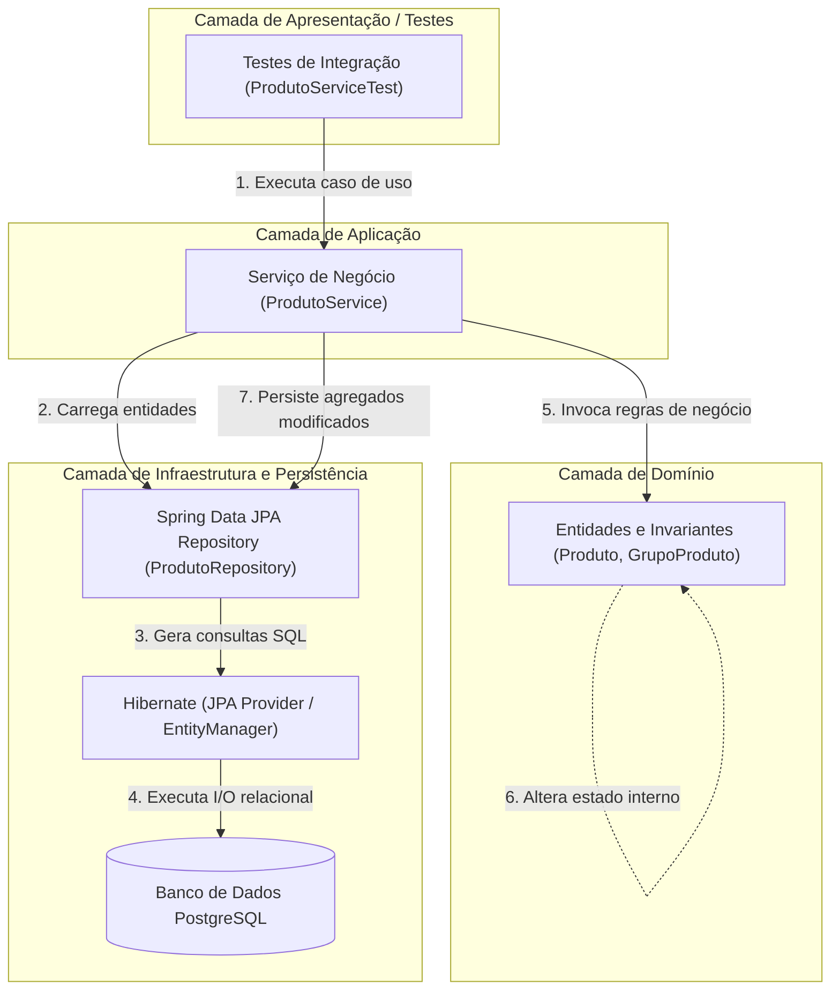

### O Modelo Rico versus Modelo Anêmico

O anti-padrão denominado **Modelo de Domínio Anêmico** (*Anemic Domain Model*) ocorre quando as entidades de domínio são reduzidas a meras bolsas de dados contendo apenas campos privados acompanhados de *getters* e *setters* públicos desprovidos de validação. Nesse cenário nocivo, toda a lógica de validação de regras de negócio é deslocada para a camada de serviços, gerando duplicação de regras, perda de encapsulamento e estados inconsistentes.

Em contrapartida, adotamos o **Modelo Rico**: a entidade `Produto` valida obrigatoriedade de campos em seus construtores e expõe operações com significado semântico:

```java
// Exemplo de comportamento encapsulado na entidade de domínio
public void retirarEstoque(BigDecimal quantidade) {
    validarPositivo(quantidade, "Quantidade retirada deve ser maior que zero");

    if (saldoEstoque.compareTo(quantidade) < 0) {
        throw new IllegalArgumentException("Saldo de estoque insuficiente");
    }

    this.saldoEstoque = saldoEstoque.subtract(quantidade);
}
```

### Tabela Comparativa de Responsabilidades

| Camada | O que DEVE fazer | O que NUNCA deve fazer |
|---|---|---|
| **Entidade (`domain`)** | Garantir invariantes de estado, validar argumentos internos, calcular valores derivados da própria estrutura. | Montar instruções SQL, injetar repositórios, disparar transações de banco, conhecer HTTP. |
| **Repositório (`repository`)** | Declarar contratos de recuperação de dados, abstrair acesso relacional, encapsular queries complexas. | Tomar decisões de fluxo de negócio, validar saldos monetários, alterar entidades diretamente. |
| **Serviço (`application`)** | Coordenar múltiplos repositórios, carregar entidades, invocar métodos ricos do domínio, delimitar transações. | Conter lógica matemática de regras da entidade, gerar queries SQL brutas, manipular requisições HTTP. |
| **Banco de Dados (PostgreSQL)** | Assegurar integridade relacional, unicidade (*unique constraints*), tipos e chaves estrangeiras. | Substituir a validação das regras de negócio ricas do modelo de domínio da aplicação. |

---

## Spring Data JPA, proxies dinâmicos e registro de beans

### Funcionamento de Proxies Dinâmicos no Bootstrap

No desenvolvimento clássico com JDBC ou JPA tradicional, o programador era obrigado a escrever uma classe concreta para cada repositório (ex.: `ProdutoRepositoryImpl`), injetar manualmente a instância do `EntityManager`, abrir a transação, tratar exceções e realizar o fechamento dos recursos.

Com o **Spring Data JPA**, o desenvolvedor declara unicamente uma interface pública estendendo `JpaRepository<T, ID>`:

```java
public interface ProdutoRepository extends JpaRepository<Produto, Long> {
    Optional<Produto> findByCodigoBarras(String codigoBarras);
}
```

Durante a fase de inicialização do contêiner Spring Boot (*bootstrap*), o framework realiza os seguintes passos de infraestrutura:

1. Realiza uma varredura de classes (*component scanning*) a partir do pacote raiz anotado com `@SpringBootApplication` em busca de interfaces filhas de `Repository`.
2. Para cada interface localizada, o mecanismo interno do Spring Data invoca a reflexão em tempo de execução via Java Dynamic Proxies (ou CGLIB) e acopla a classe base `SimpleJpaRepository<T, ID>`.
3. Intercepta todas as invocações aos métodos herdados (`save`, `findById`, `findAll`, `deleteById`) e redireciona-as para operações delegadas diretamente a uma instância gerenciada de `EntityManager`.
4. Analisa os métodos customizados declarados na interface e compila árvores de sintaxe de consulta (*query method parsing*).
5. Registra o objeto proxy gerado como um *Spring Bean* gerenciado no `ApplicationContext`.

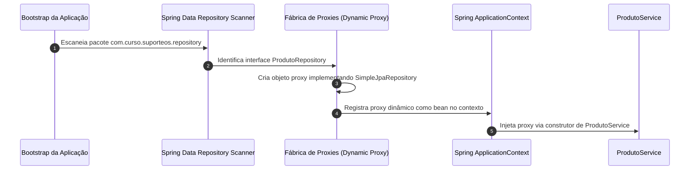

### Injeção de Dependências por Construtor

A injeção de dependências no ecossistema Spring pode ser conduzida por três vias: injeção por campo (`@Autowired` diretamente sobre atributos privados), injeção por método modificador (*setter*) ou injeção obrigatória por construtor.

Adotamos a **injeção estrita por construtor**:

```java
@Service
public class GrupoProdutoService {

    private final GrupoProdutoRepository repository;

    // Construtor explícito: dispensa a necessidade da anotação @Autowired
    public GrupoProdutoService(GrupoProdutoRepository repository) {
        this.repository = repository;
    }
}
```

**Motivação técnica e arquitetural:**
- **Imutabilidade Real:** Permite a utilização do modificador `final` no atributo, garantindo que a referência nunca seja alterada após a instanciação do componente.
- **Detecção Imediata de Dependências Cíclicas:** Ciclos de injeção são identificados imediatamente durante a inicialização da JVM, falhando rápido (*fail-fast*).
- **Testabilidade Desacoplada de Frameworks:** Facilita a escrita de testes unitários puros sem necessidade de inicializar o contêiner do Spring ou usar bibliotecas de reflexão intrusivas; basta instanciar a classe passando um repositório simulado (*mock*) diretamente no construtor.
- **Prevenção de Objetos Nulos Parciais:** Impede a instanciação acidental de serviços incompletos em tempo de execução.

---

## Consultas derivadas por convenção de nomenclatura de métodos

### Mecânica e Parsing de Nomes de Métodos

O Spring Data JPA provê o mecanismo de **Derived Query Methods** (consultas derivadas), capaz de traduzir a assinatura e o nome de um método em uma consulta JPQL (*Java Persistence Query Language*) canônica, a qual é subsequentemente convertida no SQL nativo do banco de dados relacional configurado.

O parser sintático do framework decompõe o nome do método em duas seções semânticas principais delimitadas pela partícula reservada `By`:

```text
[Operação Principal / Sujeito] + "By" + [Predicado / Critérios de Restrição]
          findTop10By            By             StatusAndValorUnitarioGreaterThan
```

1. **Prefixo da Operação:** Termos como `find...By`, `read...By`, `query...By`, `count...By`, e `exists...By` estabelecem a ação desejada. É possível introduzir qualificadores limitadores entre o verbo e o delimitador `By`, tais como `findDistinctBy` ou `findFirst3By`.
2. **Propriedades e Operadores Condicionais:** O framework avalia as propriedades da entidade de domínio e reconhece palavras-chave encadeadas por conectivos lógicos `And` e `Or`.

```java
// Exemplos extraídos do domínio da aplicação
Optional<Produto> findByCodigoBarras(String codigoBarras);
boolean existsByCodigoBarras(String codigoBarras);
List<Produto> findByGrupoId(Long grupoId);
List<Produto> findByStatus(Status status);
boolean existsByNomeIgnoreCase(String nome);
```

### Travessia de Relacionamentos (Property Traversal)

Um dos recursos mais relevantes das consultas derivadas reside na navegação por associações entre agregados. No método:

```java
List<Produto> findByGrupoId(Long grupoId);
```

O analisador do Spring Data decompõe a expressão avaliando a entidade `Produto`. Ele identifica a presença do atributo `grupo` (uma associação `@ManyToOne` com `GrupoProduto`) e navega até a propriedade interna `id` dessa entidade relacionada. 

> *Nota de Arquitetura:* Caso houvesse ambiguidade (por exemplo, se a entidade possuísse simultaneamente um atributo primitivo `grupoId` e uma relação `grupo` contendo um `id`), a convenção do Spring Data orienta a utilização explícita de sublinhado (*underscore*) para isolar o ponto de travessia estrutural: `findByGrupo_Id(Long grupoId)`.

### Tabela de Palavras-chave do Mecanismo Derivado

| Expressão Derivada | Fragmento JPQL Equivalente Gerado | Propósito Prático |
|---|---|---|
| `findByCodigoBarras(String c)` | `where p.codigoBarras = :c` | Busca exata com mapeamento de chave única |
| `existsByCnpj(String cnpj)` | `select count(f) > 0 from Fornecedor f where f.cnpj = :cnpj` | Verificação rápida sem carregar a entidade |
| `findByNomeIgnoreCase(String n)` | `where upper(g.nome) = upper(:n)` | Busca insensível a maiúsculas/minúsculas |
| `findBySaldoEstoqueGreaterThan(BigDecimal s)` | `where p.saldoEstoque > :s` | Filtro por corte numérico estrito |
| `findByStatusOrderByDescricaoAsc(Status s)` | `where p.status = :s order by p.descricao asc` | Seleção com ordenação determinística |
| `countByGrupoId(Long id)` | `select count(p) from Produto p where p.grupo.id = :id` | Totalização de dependentes para relatórios |

### Limites Arquiteturais das Consultas Derivadas

Embora altamente convenientes, nomes de métodos derivados excessivamente extensos constituem um forte indicador de degradação arquitetural (*code smell*):

- **Legibilidade Prejudicada:** Assinaturas como `findByStatusAndSaldoEstoqueGreaterThanEqualAndGrupoIdInOrderByDescricaoAsc` tornam-se ilegíveis e propensas a erros de digitação.
- **Dificuldade de Otimização:** O parser automático pode não gerar as junções mais otimizadas (como `LEFT JOIN FETCH`), induzindo problemas clássicos de desempenho (*N+1 Selects*).
- **Diretriz de Decisão:** Sempre que a consulta exigir mais de dois critérios combinados, envolver junções complexas com projeções ou necessitar de planos de execução controlados, deve-se transicionar formalmente para a anotação `@Query` explícita com JPQL/SQL ou utilizar a *Specifications API* do JPA.

---

## Fronteira transacional com @Transactional e modo readOnly

### Propriedades ACID e o Gerenciador de Transações

Uma transação lógica de banco de dados constitui uma unidade indivisível de trabalho orientada pelos princípios ACID:
- **Atomicidade (Atomicity):** Todas as mutações contidas na operação completam-se com sucesso ou nenhuma delas é aplicada.
- **Consistência (Consistency):** A transação conduz o banco de um estado válido a outro estado igualmente íntegro, obedecendo às restrições relacionais.
- **Isolamento (Isolation):** A execução concorrente de múltiplas transações opera como se fossem estritamente sequenciais.
- **Durabilidade (Durability):** Os resultados confirmados (*committed*) persistem mesmo em falhas catastróficas de hardware ou energia.

Na aplicação, o Spring Framework atua gerenciando a fronteira transacional via Programação Orientada a Aspectos (AOP). Quando um método de serviço é interceptado pela anotação `@Transactional`, um proxy em torno do serviço coordena a abertura do canal junto à fonte de dados (`DataSourceTransactionManager`), vincula a sessão do Hibernate à *thread* corrente e supervisiona o desfecho:

```text
[Chamada ao Método do Serviço]
        ↓
Proxy Interceptador AOP: Executa "BEGIN" no Banco
        ↓
Execução da lógica de negócio e queries JPA
        ↓
(Sucesso?) ── Sim ──> Proxy executa "COMMIT" e sincroniza dados
        │
       Não (Ocorreu RuntimeException?)
        ↓
Proxy intercepta exceção e executa "ROLLBACK" integral
```

### Otimizações do Parâmetro readOnly = true

Ao anotar métodos estritamente voltados a consultas com `@Transactional(readOnly = true)`, sinalizamos à camada de persistência e ao driver relacional que não haverá modificações nas entidades envolvidas:

```java
@Transactional(readOnly = true)
public Produto buscarPorId(Long id) {
    return produtoRepository.buscarPorIdComRelacionamentos(id)
            .orElseThrow(() -> new RecursoNaoEncontradoException("Produto não encontrado"));
}
```

**Benefícios técnicos comprovados:**
1. **Desativação de Snapshots do Hibernate:** O contexto de persistência desativa o snapshot de comparação das entidades carregadas, reduzindo drasticamente o consumo de memória heap na JVM.
2. **Ignorância no Ciclo de Flush:** A engine do Hibernate não despende ciclos de CPU processando verificações de *dirty checking* no encerramento da transação.
3. **Roteamento de Réplicas no Banco:** Em topologias de bancos de dados distribuídos (PostgreSQL com réplicas de leitura), o driver relacional pode encaminhar o tráfego da transação diretamente para nós secundários (*read-only replicas*), poupando o nó primário de gravação (*writer*).

> *Atenção:* O parâmetro `readOnly = true` é uma diretriz de otimização operacional de persistência; ele não se comporta como um mecanismo de controle de acesso ou autorização de segurança de usuário.

---

## Ciclo de vida das entidades JPA: transient, managed, detached e removed

### Os Quatro Estados do Ciclo de Vida JPA

Uma instância de uma classe anotada com `@Entity` transita por quatro estados bem delineados perante o `EntityManager` e o Contexto de Persistência (*Persistence Context*):

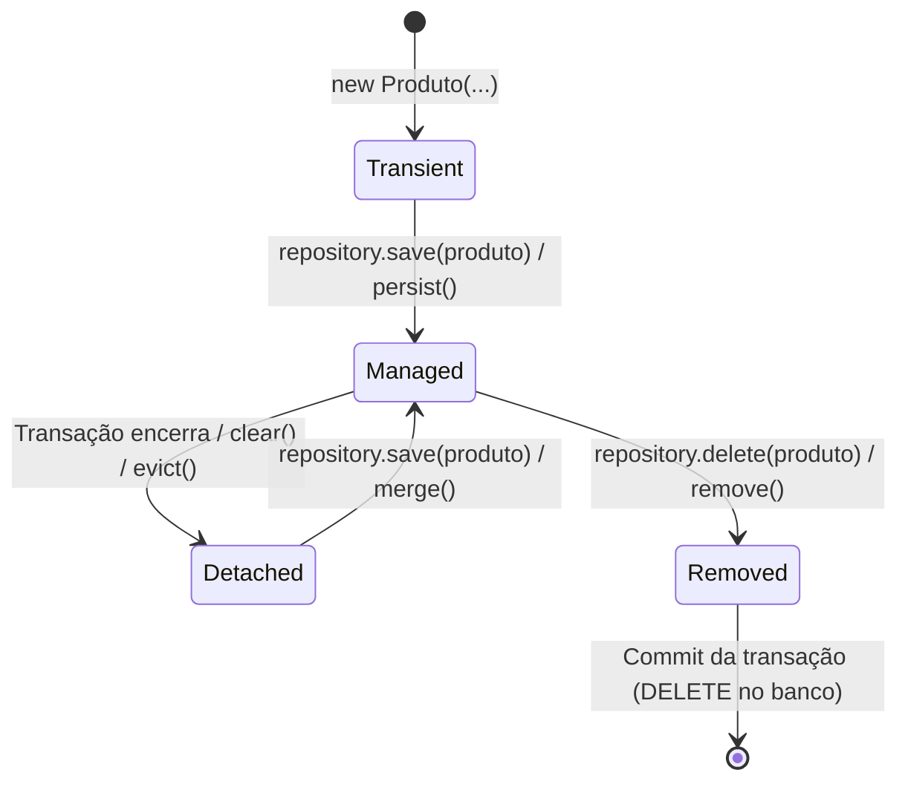

1. **Transient (Novo / Transiente):** O objeto foi instanciado diretamente via código Java (ex.: `new Produto(...)`). Ele reside unicamente na memória heap da JVM, não possui identificador relacional atribuído (`id == null`) e não possui qualquer correlação ou monitoramento ativo pelo Contexto de Persistência.
2. **Managed (Gerenciado):** O objeto possui representação relacional no banco de dados (ou chave primária gerada) e é monitorado ativamente pelo Contexto de Persistência de 1º nível do Hibernate. Quaisquer invocações aos seus métodos modificadores de estado serão registradas e sincronizadas automaticamente no momento do encerramento da transação.
3. **Detached (Desanexado):** A entidade possui um identificador relacional persistente, mas o Contexto de Persistência que a gerenciava foi encerrado (por exemplo, após o retorno de um método anotado com `@Transactional`). O Hibernate não supervisiona mais suas alterações de atributos em memória.
4. **Removed (Removido):** A entidade teve sua exclusão solicitada explicitamente dentro do contexto ativo. Ela permanece agendada para deleção física no banco de dados relacional quando ocorrer o próximo *flush* ou confirmação transacional.

### Comparativo dos Estados de Entidades JPA

| Estado | Possui ID Relacional? | Monitorado pelo Contexto de Persistência? | Refletido na Tabela do Banco? | Efeito de Alterar Atributo |
|---|---|---|---|---|
| **Transient** | Não | Não | Não | Nulo perante o banco de dados |
| **Managed** | Sim | Sim | Sim (ou pendente de inserção) | Dispara `UPDATE` automático (*dirty checking*) |
| **Detached** | Sim | Não | Sim | Ignorado até que ocorra um `merge()` explícito |
| **Removed** | Sim | Sim | Marcado para exclusão | Induz `DELETE` relacional no *flush* |

---

## Mecanismo de dirty checking e sincronização com o banco

### Detecção Automática de Alterações (Snapshot Comparison)

O *dirty checking* (inspeção de estado modificado) é um dos pilares de produtividade e consistência do JPA. Quando uma entidade entra no estado **managed** (por exemplo, recuperada por `findById`), o Hibernate armazena internamente uma cópia fiel do seu estado em uma matriz de valores denominada **snapshot**.

Durante o encerramento do escopo do `@Transactional`, a engine do Hibernate aciona o ciclo de sincronização (*flush*). Ela compara campo a campo o estado atual da entidade em memória com o seu respectivo snapshot original. Havendo qualquer divergência de dados detectada, o framework constrói e enfileira uma instrução SQL `UPDATE` contendo exclusivamente as colunas alteradas.

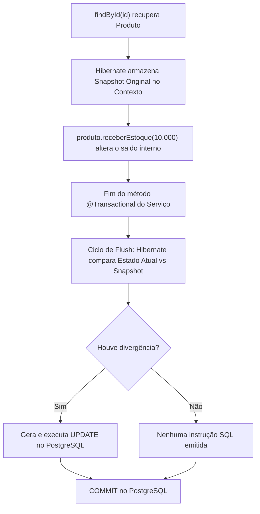

### O Exemplo Prático de Movimentação de Estoque

Observe o método `receberEstoque` da classe `ProdutoService`:

```java
@Transactional
public Produto receberEstoque(Long id, BigDecimal quantidade) {
    Produto produto = produtoRepository.findById(id)
            .orElseThrow(() -> new RecursoNaoEncontradoException("Produto não encontrado"));
    
    // Invocação de método semântico do domínio rico
    produto.receberEstoque(quantidade);
    
    // O retorno da entidade dispensa chamadas redundantes a produtoRepository.save(produto)
    return produto;
}
```

### Contraexemplo e Armadilhas: O Vício do save() Redundante

É extremamente comum programadores iniciantes escreverem a linha `produtoRepository.save(produto)` ao final de métodos de atualização em entidades que já se encontram no estado managed:

```java
// CONTRAEXEMPLO: Prática redundante e anti-idiomática em JPA
@Transactional
public Produto receberEstoqueAntiPadrao(Long id, BigDecimal quantidade) {
    Produto produto = produtoRepository.findById(id).orElseThrow();
    produto.receberEstoque(quantidade);
    return produtoRepository.save(produto); // REDUNDANTE! O dirty checking já executará o UPDATE
}
```

**Por que evitar o `save()` desnecessário?**
- A chamada a `save()` em uma entidade managed é uma operação redundante que não adiciona semântica e gera sobrecarga de processamento ao reavaliar o ciclo de vida da instância.
- Cria uma ilusão conceitual equivocada de que o JPA opera de forma estritamente imperativa como no paradigma de gravação manual em arquivos.

> *Ressalva Arquitetural:* O *dirty checking* jamais deve ser tratado como um pretexto para tornar atributos públicos ou criar *setters* indiscriminados. A mutação do estado de uma entidade gerenciada deve ocorrer invariavelmente por meio de métodos de negócio que protejam suas invariantes.

---

## Criação de repositories: GrupoProdutoRepository, ProdutoRepository e FornecedorRepository

Na estruturação dos repositórios, consolidamos as interfaces que servirão de base para as operações do sistema `suporteos2026`.

### Diagrama de Classes das Interfaces de Persistência

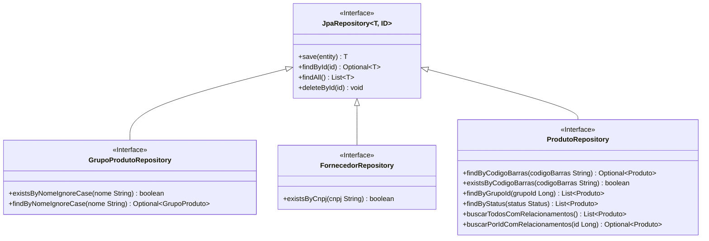

### Código e Análise Técnica dos Repositórios

#### GrupoProdutoRepository

```java
package com.curso.suporteos.repository;

import com.curso.suporteos.domain.GrupoProduto;
import org.springframework.data.jpa.repository.JpaRepository;

import java.util.Optional;

public interface GrupoProdutoRepository extends JpaRepository<GrupoProduto, Long> {

    // Utilizado na validação prévia de duplicidade antes do cadastro
    boolean existsByNomeIgnoreCase(String nome);

    // Permite recuperação precisa desconsiderando maiúsculas e minúsculas
    Optional<GrupoProduto> findByNomeIgnoreCase(String nome);
}
```

#### FornecedorRepository

```java
package com.curso.suporteos.repository;

import com.curso.suporteos.domain.Fornecedor;
import org.springframework.data.jpa.repository.JpaRepository;

public interface FornecedorRepository extends JpaRepository<Fornecedor, Long> {

    // Consulta de alta performance para validação da chave natural (CNPJ)
    boolean existsByCnpj(String cnpj);
}
```

#### ProdutoRepository

```java
package com.curso.suporteos.repository;

import com.curso.suporteos.domain.Produto;
import com.curso.suporteos.domain.Status;
import org.springframework.data.jpa.repository.EntityGraph;
import org.springframework.data.jpa.repository.JpaRepository;
import org.springframework.data.jpa.repository.Query;
import org.springframework.data.repository.query.Param;

import java.util.List;
import java.util.Optional;

public interface ProdutoRepository extends JpaRepository<Produto, Long> {

    Optional<Produto> findByCodigoBarras(String codigoBarras);

    boolean existsByCodigoBarras(String codigoBarras);

    List<Produto> findByGrupoId(Long grupoId);

    List<Produto> findByStatus(Status status);

    // Otimização contra o problema N+1: carrega grupo e fornecedor em uma única instrução SQL
    @EntityGraph(attributePaths = {"grupo", "fornecedor"})
    @Query("select p from Produto p order by p.id")
    List<Produto> buscarTodosComRelacionamentos();

    @EntityGraph(attributePaths = {"grupo", "fornecedor"})
    @Query("select p from Produto p where p.id = :id")
    Optional<Produto> buscarPorIdComRelacionamentos(@Param("id") Long id);
}
```

---

## Exceções de negócio na camada de aplicação (RecursoNaoEncontradoException e RecursoDuplicadoException)

### Modelagem de Falhas Previsíveis de Negócio

No projeto de software corporativo, exceções não devem ser tratadas de forma genérica com tipos padrão da plataforma Java como `RuntimeException` ou `Exception`. Da mesma forma, **não devem carregar acoplamento precoce com protocolos de transporte de rede**, como HTTP.

Nesta aula, modelamos exceções semânticas que expressam com exatidão a natureza da quebra de regra de caso de uso:

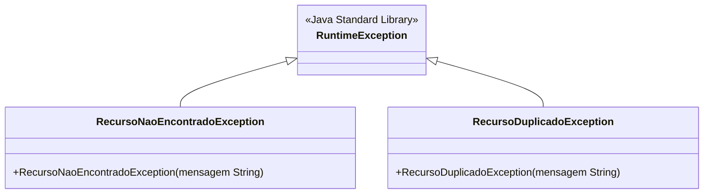

### Implementação das Classes de Exceção

```java
package com.curso.suporteos.application;

// Lançada quando a operação referencia um identificador ou registro inexistente
public class RecursoNaoEncontradoException extends RuntimeException {

    public RecursoNaoEncontradoException(String mensagem) {
        super(mensagem);
    }
}
```

```java
package com.curso.suporteos.application;

// Lançada quando uma chave natural ou de negócio invariante é violada
public class RecursoDuplicadoException extends RuntimeException {

    public RecursoDuplicadoException(String mensagem) {
        super(mensagem);
    }
}
```

### Por Que Não Usar @ResponseStatus Nestas Exceções?

É frequente encontrar implementações onde anotações como `@ResponseStatus(HttpStatus.NOT_FOUND)` são anexadas diretamente sobre a classe da exceção. Nesta fase do projeto, essa abordagem foi expressamente rejeitada por motivos arquiteturais categóricos:

1. **Violação da Independência de Camadas:** A camada de aplicação deve permanecer estritamente agnóstica quanto ao mecanismo de entrada e saída. A aplicação pode ser invocada por testes unitários, rotinas agendadas em lote (*batch processing*), consumidores de mensageria (RabbitMQ, Kafka) ou consoles CLI. Nesses cenários, conceitos como `404 Not Found` inexistem.
2. **Separação de Preocupações:** O mapeamento de falhas para o protocolo HTTP pertence exclusivamente à camada de apresentação e API REST (controladores e `@RestControllerAdvice`), tema abordado na Aula 07.

---

## Implementação de serviços de aplicação: GrupoProdutoService e ProdutoService

### Orquestração dos Casos de Uso

Os serviços de aplicação funcionam como os maestros do sistema. Eles recebem dados simples ou entidades prontas, verificam pré-condições que exigem consulta a outros agregados, coordenam a chamada aos repositórios e garantem que tudo ocorra sob a égide de uma transação íntegra.

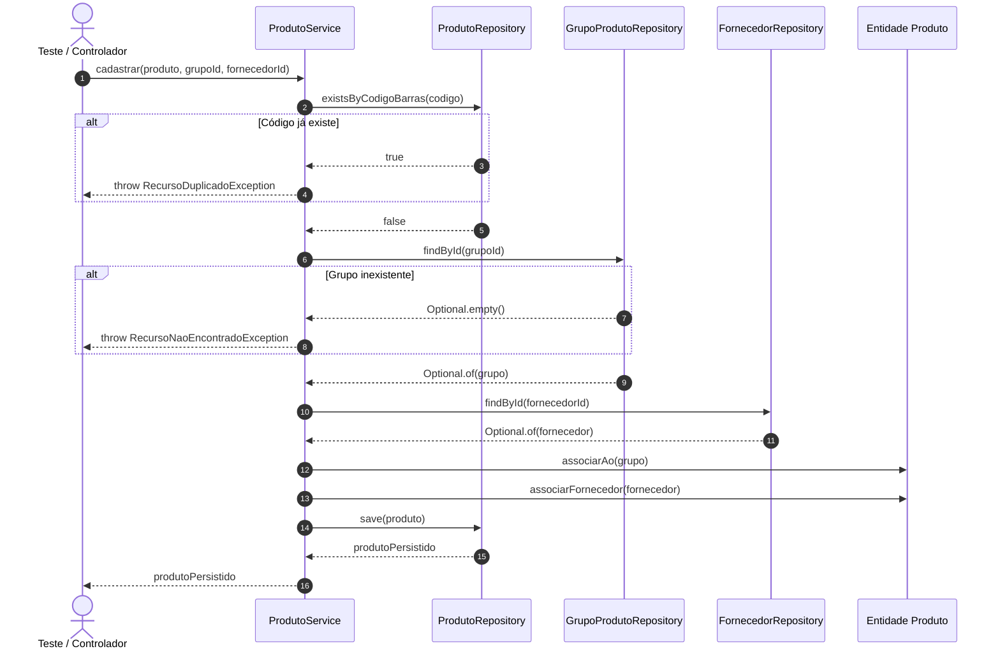

### Código Comentado do GrupoProdutoService

```java
package com.curso.suporteos.application;

import com.curso.suporteos.domain.GrupoProduto;
import com.curso.suporteos.repository.GrupoProdutoRepository;
import org.springframework.stereotype.Service;
import org.springframework.transaction.annotation.Transactional;

import java.util.List;

@Service
public class GrupoProdutoService {

    private final GrupoProdutoRepository repository;

    // Injeção de dependência explícita por construtor
    public GrupoProdutoService(GrupoProdutoRepository repository) {
        this.repository = repository;
    }

    @Transactional
    public GrupoProduto cadastrar(String nome) {
        // Validação de unicidade lógica antes da inserção
        if (repository.existsByNomeIgnoreCase(nome)) {
            throw new RecursoDuplicadoException("Nome do grupo já cadastrado");
        }
        return repository.save(new GrupoProduto(nome));
    }

    @Transactional(readOnly = true)
    public GrupoProduto buscarPorId(Long id) {
        return repository.findById(id)
                .orElseThrow(() -> new RecursoNaoEncontradoException("Grupo de produto não encontrado"));
    }

    @Transactional(readOnly = true)
    public List<GrupoProduto> listar() {
        return repository.findAll();
    }
}
```

### Código Comentado do ProdutoService

```java
package com.curso.suporteos.application;

import com.curso.suporteos.domain.Fornecedor;
import com.curso.suporteos.domain.GrupoProduto;
import com.curso.suporteos.domain.Produto;
import com.curso.suporteos.repository.FornecedorRepository;
import com.curso.suporteos.repository.GrupoProdutoRepository;
import com.curso.suporteos.repository.ProdutoRepository;
import org.springframework.stereotype.Service;
import org.springframework.transaction.annotation.Transactional;

import java.math.BigDecimal;
import java.util.List;

@Service
public class ProdutoService {

    private final ProdutoRepository produtoRepository;
    private final GrupoProdutoRepository grupoRepository;
    private final FornecedorRepository fornecedorRepository;

    public ProdutoService(
            ProdutoRepository produtoRepository,
            GrupoProdutoRepository grupoRepository,
            FornecedorRepository fornecedorRepository) {
        this.produtoRepository = produtoRepository;
        this.grupoRepository = grupoRepository;
        this.fornecedorRepository = fornecedorRepository;
    }

    @Transactional
    public Produto cadastrar(Produto produto, Long grupoId, Long fornecedorId) {
        // 1. Verificação de chave natural
        if (produtoRepository.existsByCodigoBarras(produto.getCodigoBarras())) {
            throw new RecursoDuplicadoException("Código de barras já cadastrado");
        }

        // 2. Garantia da existência do relacionamento obrigatório
        GrupoProduto grupo = grupoRepository.findById(grupoId)
                .orElseThrow(() -> new RecursoNaoEncontradoException("Grupo de produto não encontrado"));
        
        // Associação orientada a objeto executada pela entidade
        grupo.adicionarProduto(produto);

        // 3. Associação condicional de relacionamento opcional
        if (fornecedorId != null) {
            Fornecedor fornecedor = fornecedorRepository.findById(fornecedorId)
                    .orElseThrow(() -> new RecursoNaoEncontradoException("Fornecedor não encontrado"));
            produto.associarFornecedor(fornecedor);
        }

        // 4. Persistência efetiva do agregado
        return produtoRepository.save(produto);
    }

    @Transactional(readOnly = true)
    public Produto buscarPorId(Long id) {
        return produtoRepository.buscarPorIdComRelacionamentos(id)
                .orElseThrow(() -> new RecursoNaoEncontradoException("Produto não encontrado"));
    }

    @Transactional(readOnly = true)
    public List<Produto> listar() {
        return produtoRepository.buscarTodosComRelacionamentos();
    }

    @Transactional
    public Produto receberEstoque(Long id, BigDecimal quantidade) {
        Produto produto = produtoRepository.findById(id)
                .orElseThrow(() -> new RecursoNaoEncontradoException("Produto não encontrado"));
        
        // Alteração monitorada pelo dirty checking
        produto.receberEstoque(quantidade);
        return produto;
    }
}
```

---

## Estratégias de testes transacionais com rollback e profile de teste no PostgreSQL

### Isolamento de Testes e Estratégia de Rollback Automático

Testes de integração em sistemas corporativos precisam comprovar que a integração com o banco relacional de produção (neste caso, PostgreSQL) opera perfeitamente. Bancos em memória (como H2) mascaram diferenças críticas de dialeto SQL, restrições e funções nativas.

Para viabilizar execuções repetíveis de testes sem a necessidade de truncar tabelas manualmente ao fim de cada método, aplica-se a anotação `@Transactional` diretamente sobre a classe de teste do JUnit 5:

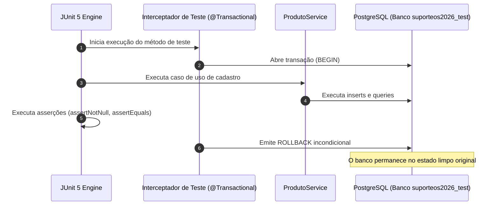

### Diferença de Semântica do @Transactional

| Contexto de Aplicação | Comportamento Padrão ao Concluir sem Erros | Finalidade Primordial |
|---|---|---|
| **No Serviço (`ProdutoService`)** | Executa **COMMIT** das operações no banco de dados. | Garantir a atomicidade do caso de uso de negócio. |
| **No Teste (`ProdutoServiceTest`)** | Executa **ROLLBACK** de todas as operações realizadas. | Garantir o isolamento e a repetibilidade dos testes sem poluir o banco de dados. |

### Exemplo de Teste de Integração e Experimento de Rollback

Abaixo, estruturamos o teste que exercita o fluxo completo de sucesso e o experimento de validação de *rollback* ante falha provocada:

```java
package com.curso.suporteos.application;

import com.curso.suporteos.domain.GrupoProduto;
import com.curso.suporteos.domain.Produto;
import com.curso.suporteos.repository.GrupoProdutoRepository;
import com.curso.suporteos.repository.ProdutoRepository;
import org.junit.jupiter.api.DisplayName;
import org.junit.jupiter.api.Test;
import org.springframework.beans.factory.annotation.Autowired;
import org.springframework.boot.test.context.SpringBootTest;
import org.springframework.test.context.ActiveProfiles;
import org.springframework.transaction.annotation.Transactional;

import java.math.BigDecimal;
import java.time.LocalDate;

import static org.junit.jupiter.api.Assertions.*;

@SpringBootTest
@ActiveProfiles("test")
@Transactional
class ProdutoServiceTest {

    @Autowired
    private ProdutoService produtoService;

    @Autowired
    private ProdutoRepository produtoRepository;

    @Autowired
    private GrupoProdutoRepository grupoRepository;

    private Produto novoProduto(String codigo) {
        return new Produto(
                codigo,
                "Produto de Teste Automatizado",
                new BigDecimal("10.000"),
                new BigDecimal("49.90"),
                new BigDecimal("2.000"),
                LocalDate.now()
        );
    }

    @Test
    @DisplayName("Deve cadastrar produto com sucesso associado a um grupo existente")
    void deveCadastrarProdutoComGrupo() {
        // Cenário
        GrupoProduto grupo = grupoRepository.save(new GrupoProduto("Periféricos"));
        Produto produto = novoProduto("TESTE-001");

        // Ação
        Produto cadastrado = produtoService.cadastrar(produto, grupo.getId(), null);

        // Verificação
        assertNotNull(cadastrado.getId());
        assertEquals(grupo.getId(), cadastrado.getGrupo().getId());
        assertTrue(produtoRepository.existsByCodigoBarras("TESTE-001"));
    }

    @Test
    @DisplayName("Experimento de Rollback: Deve falhar ao cadastrar com grupo inexistente e não salvar o produto")
    void deveGarantirRollbackQuandoGrupoInexistente() {
        // Cenário
        Produto produto = novoProduto("TESTE-ROLLBACK");
        Long idGrupoInexistente = Long.MAX_VALUE;

        // Ação e Validação da Exceção
        assertThrows(
                RecursoNaoEncontradoException.class,
                () -> produtoService.cadastrar(produto, idGrupoInexistente, null)
        );

        // Prova cabal de Rollback: a entidade produto não deve constar gravada no banco
        assertFalse(produtoRepository.existsByCodigoBarras("TESTE-ROLLBACK"));
    }
}
```

---

## Tratamento de erros comuns: mapeamento, LazyInitializationException e controle de integridade

Durante a integração entre entidades, repositórios e serviços, o desenvolvedor depara-se com armadilhas frequentes decorrentes do comportamento de proxies e do contexto JPA.

### Diagnóstico e Resolução de Falhas Arquiteturais

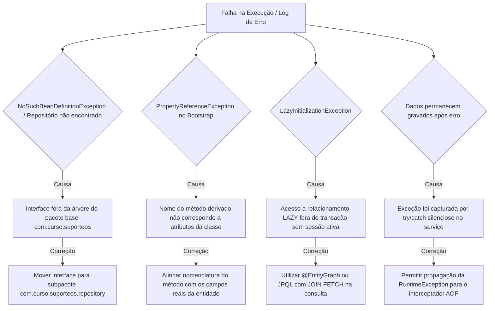

### Análise Aprofundada da LazyInitializationException

A temida `LazyInitializationException` ocorre quando um relacionamento configurado como `FetchType.LAZY` (ex.: `@ManyToOne` entre `Produto` e `GrupoProduto`) tem seus dados internos solicitados (ex.: `produto.getGrupo().getNome()`) após a transação original ter sido encerrada e a sessão do Hibernate fechada.

**Anti-padrão a evitar:** Jamais habilite a propriedade `spring.jpa.open-in-view=true` (OSIV). Embora ela mantenha a sessão aberta durante a renderização da resposta, ela introduz gargalos severos de esgotamento de conexões no *pool* HikariCP e dispersa queries não planejadas no meio da camada web.

**A Solução Correta adotada na aula:** Planejar a recuperação dos dados diretamente na camada de persistência utilizando `@EntityGraph`:

```java
@EntityGraph(attributePaths = {"grupo", "fornecedor"})
@Query("select p from Produto p where p.id = :id")
Optional<Produto> buscarPorIdComRelacionamentos(@Param("id") Long id);
```

---

## Atividade prática de transferência no projeto individual

No escopo do projeto individual voltado à gestão de ordens de serviço e chamados técnicos de TI, os estudantes devem transpor o conhecimento estruturado nesta aula para um novo subdomínio, correlacionando `CategoriaChamado` (classificação) e `Chamado` (entidade principal).

### Diagrama de Relacionamento de Entidades (Transferência)

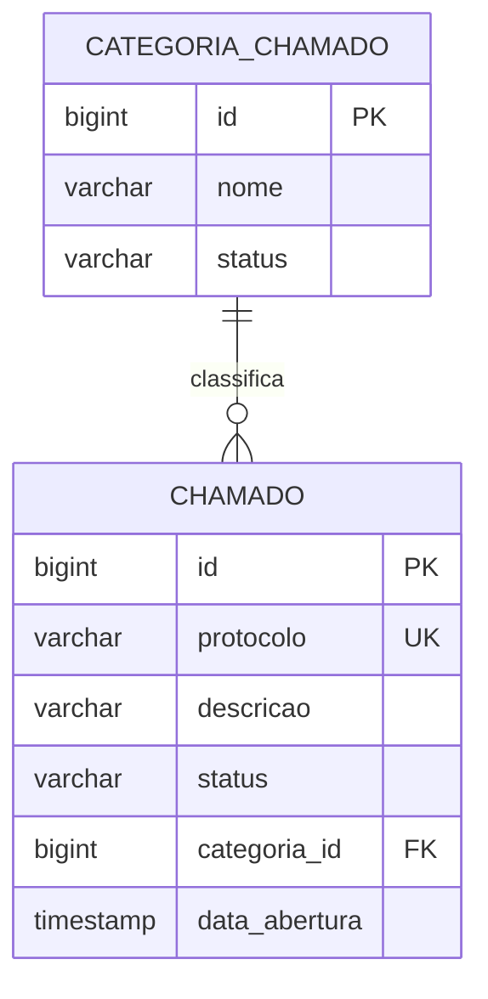

### Passo a Passo da Implementação no Projeto Individual

1. **Repositórios Especializados:** Criação das interfaces `CategoriaChamadoRepository` e `ChamadoRepository`.
2. **Consultas Derivadas Requeridas:**
   - Consulta por chave natural de negócio: `Optional<Chamado> findByProtocolo(String protocolo)`.
   - Consulta por relacionamento navegável: `List<Chamado> findByCategoriaId(Long categoriaId)`.
3. **Serviço Transacional:** Implementação de `ChamadoService` orquestrando o cadastro atômico e impedindo duplicidade de protocolo.
4. **Comprovação de Rollback:** Elaboração de teste de integração que force uma falha e confirme a ausência do registro persistido.

### Justificativa de Alocação de Regras

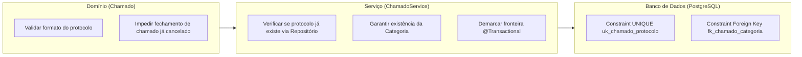

---

## Questões teóricas e práticas de revisão arquitetural

Abaixo constam as seis questões de revisão da Aula 05 resolvidas com o rigor técnico exigido:

### 1. Quem implementa uma interface JpaRepository?

**Resposta Técnica:**  
Nenhum desenvolvedor escreve classes concretas para implementar a interface. Quem a implementa é o próprio **Spring Data JPA em tempo de inicialização (*bootstrap*) da aplicação**, gerando dinamicamente um objeto **Proxy** via reflexão do Java (`java.lang.reflect.Proxy` ou CGLIB). 

Esse proxy intercepta as invocações de métodos e as repassa para a classe padrão de infraestrutura do framework, `org.springframework.data.jpa.repository.support.SimpleJpaRepository<T, ID>`, a qual opera como uma fachada (*facade*) diretamente sobre o `EntityManager` do Hibernate.

---

### 2. Por que o serviço define a fronteira transacional?

**Resposta Técnica:**  
Porque o **serviço de aplicação corporifica o Caso de Uso**. Um caso de uso frequentemente abrange múltiplas operações que precisam ser executadas como uma unidade de trabalho atômica (ex.: debitar saldo de uma conta e creditar em outra; ou verificar unicidade, vincular agregados e inserir o produto).

Se a transação fosse colocada no repositório, cada chamada a método (`findById`, `save`) ocorreria em uma transação isolada e autocontida. Diante de uma falha intermediária, as operações precedentes já estariam confirmadas no banco, resultando em dados inconsistentes e corrupção da integridade do sistema. A fronteira transacional no serviço garante o princípio do "tudo ou nada" (Atomicidade).

---

### 3. Qual diferença existe entre entidade managed e detached?

**Resposta Técnica:**  
A diferença fundamental reside na **presença ou ausência de monitoramento ativo pelo Contexto de Persistência** de 1º nível:

- **Entidade Managed (Gerenciada):** Possui identificador único no banco de dados e está vinculada à sessão ativa do Hibernate (`EntityManager`). Quaisquer alterações feitas em seus atributos em memória são acompanhadas por *dirty checking* e gravadas automaticamente no banco ao término da transação.
- **Entidade Detached (Desanexada):** Possui identificador persistente, mas não está mais associada a uma sessão ou contexto de persistência aberto (geralmente porque a transação em que foi carregada foi encerrada e enviada a outra camada). Mutações em suas propriedades não geram comandos SQL automáticos e são ignoradas pelo banco até que a entidade seja expressamente reconectada via `EntityManager.merge()` ou `repository.save()`.

---

### 4. Por que dirty checking não elimina métodos de negócio?

**Resposta Técnica:**  
Porque o *dirty checking* é unicamente um **mecanismo técnico de sincronização de infraestrutura**, enquanto métodos de negócio pertencem à **semântica e ao encapsulamento do domínio**.

Eliminar métodos de negócio e contar exclusivamente com a modificação arbitrária de atributos em entidades gerenciadas degenera a aplicação no anti-padrão de *Modelo Anêmico*. A entidade deve proteger suas invariantes: por exemplo, ao alterar o estoque, o método `receberEstoque(quantidade)` valida se a quantidade é positiva e executa a operação aritmética com segurança. O *dirty checking* apenas detecta o resultado dessa operação legítima e o propaga para o PostgreSQL.

---

### 5. Quando um nome de consulta derivada deixa de ser adequado?

**Resposta Técnica:**  
Um nome de consulta derivada deixa de ser adequado quando:

1. **Complexidade Excessiva de Critérios:** A assinatura do método cresce desproporcionalmente (ex.: mais de dois ou três critérios lógicos combinando `And`, `Or`, `Between`), prejudicando gravemente a legibilidade do código.
2. **Necessidade de Otimização de Junções:** Quando há associações preguiçosas (*lazy*) que demandam `JOIN FETCH` explícito para anular o problema de desempenho do *N+1 Selects*.
3. **Consultas Dinâmicas ou Projeções Customizadas:** Consultas que exigem agregação de dados (*Group By*, *Having*), subconsultas ou montagem de DTOs parciais em tempo de leitura. Nesses casos, deve-se adotar `@Query` (com JPQL ou SQL nativo) ou *Specifications*.

---

### 6. Por que uma exceção de aplicação não deve conhecer status HTTP nesta aula?

**Resposta Técnica:**  
Porque classes situadas no pacote `application` pertencem ao núcleo da lógica de negócio e devem ser **estritamente agnósticas quanto ao mecanismo de entrega e transporte**.

Atrelar anotações web (como `@ResponseStatus(HttpStatus.NOT_FOUND)`) às classes `RecursoNaoEncontradoException` ou `RecursoDuplicadoException` quebra o Princípio da Responsabilidade Única (SRP) e impede o reuso seguro do serviço em contextos não-web (tais como processos agendados via `@Scheduled`, rotinas de mensageria assíncrona, microsserviços gRPC ou rotinas executadas via linha de comando). O mapeamento de falhas de negócio para códigos de status HTTP pertence exclusivamente à camada de controle da API Web.

---

## Código da aula

O código consolidado da Aula 05 estrutura-se sob os seguintes arquivos no repositório:

- [pom.xml](../../pom.xml): Declaração das dependências fundamentais, trazendo `spring-boot-starter-data-jpa`, driver `postgresql`, `liquibase-core` e os starters dedicados de teste.
- [Fornecedor.java](../../src/main/java/com/curso/suporteos/domain/Fornecedor.java): Entidade de domínio rica representando o parceiro comercial, contendo validação de tamanho de texto, formato regex de CNPJ e métodos para transição de status (`ativar`, `inativar`).
- [GrupoProduto.java](../../src/main/java/com/curso/suporteos/domain/GrupoProduto.java): Entidade raiz de agregação de agrupamento, contendo a lista de produtos associados e o método `adicionarProduto`.
- [Produto.java](../../src/main/java/com/curso/suporteos/domain/Produto.java): Entidade central do estoque com cálculos monetários de precisão usando `BigDecimal`, controle de estoque mínimo e associações mapeadas com `FetchType.LAZY`.
- [GrupoProdutoRepository.java](../../src/main/java/com/curso/suporteos/repository/GrupoProdutoRepository.java): Interface com consultas derivadas para checagem de duplicidade por nome ignorando caixa.
- [ProdutoRepository.java](../../src/main/java/com/curso/suporteos/repository/ProdutoRepository.java): Interface com consultas derivadas de chave e agrupamento, além de consultas JPQL otimizadas com `@EntityGraph`.
- [RecursoNaoEncontradoException.java](../../src/main/java/com/curso/suporteos/application/RecursoNaoEncontradoException.java): Exceção desacoplada de HTTP para falhas de consulta.
- [RecursoDuplicadoException.java](../../src/main/java/com/curso/suporteos/application/RecursoDuplicadoException.java): Exceção desacoplada de HTTP para violação de chaves únicas.
- [GrupoProdutoService.java](../../src/main/java/com/curso/suporteos/application/GrupoProdutoService.java): Serviço com fronteira transacional para gestão categórica.
- [ProdutoService.java](../../src/main/java/com/curso/suporteos/application/ProdutoService.java): Serviço de aplicação orquestrando criação de produtos, associações e dirty checking em estoque.

### Trechos Essenciais Comentados

Na classe `Produto.java`, o cálculo do valor total imobilizado em estoque assegura a precisão financeira sem perdas de arredondamento:

```java
public BigDecimal calcularValorEstoque() {
    // Multiplica o saldo pelo valor unitário e define escala de 2 casas com arredondamento comercial
    return saldoEstoque
            .multiply(valorUnitario)
            .setScale(2, RoundingMode.HALF_UP);
}
```

No repositório `ProdutoRepository.java`, a consulta que elimina o problema de *N+1*:

```java
// O EntityGraph instrui o Hibernate a realizar um LEFT OUTER JOIN com as tabelas de grupo e fornecedor
@EntityGraph(attributePaths = {"grupo", "fornecedor"})
@Query("select p from Produto p where p.id = :id")
Optional<Produto> buscarPorIdComRelacionamentos(@Param("id") Long id);
```

---

## Exercícios

Todos os exercícios práticos e de consolidação arquitetural encontram-se implementados e validados no arquivo executável [`./codigo/Exercicios.java`](./codigo/Exercicios.java).

---

### Exercício 1: Atividade de Transferência — Projeto Individual

#### Enunciado
No projeto individual de suporte a ordens de serviço, modele o subdomínio de chamados técnicos:
1. Crie repositórios para `CategoriaChamado` e `Chamado`.
2. Declare uma consulta derivada para recuperação por chave de negócio (`protocolo`).
3. Declare uma consulta derivada pelo relacionamento de classificação (`categoriaId`).
4. Implemente o caso de uso de cadastro transacional em `ChamadoService`, garantindo unicidade do protocolo e existência da categoria.
5. Crie um teste que provoque falha ao utilizar categoria inexistente e demonstre o *rollback*.
6. Documente a alocação de responsabilidade de cada validação.

#### Raciocínio
A integridade de um chamado técnico exige que o protocolo seja exclusivo em todo o sistema. A entidade `Chamado` deve garantir que o texto descritivo e o protocolo não sejam nulos ou em branco. O serviço de aplicação deve verificar a existência prévia do protocolo via repositório e garantir que a categoria informada exista antes de instanciar ou salvar a nova entidade. Caso a categoria não exista, uma exceção deve ser lançada antes ou durante a transação, forçando a reversão de quaisquer operações precedentes.

#### Resolução Completa Comentada

```java
// Entidade Categoria
package com.curso.suporteos.exercicios.domain;

import jakarta.persistence.*;

@Entity
@Table(name = "categoria_chamado")
public class CategoriaChamado {
    @Id
    @GeneratedValue(strategy = GenerationType.IDENTITY)
    private Long id;

    @Column(nullable = false, length = 100)
    private String nome;

    protected CategoriaChamado() {}

    public CategoriaChamado(String nome) {
        if (nome == null || nome.isBlank()) {
            throw new IllegalArgumentException("Nome da categoria é obrigatório");
        }
        this.nome = nome.trim();
    }

    public Long getId() { return id; }
    public String getNome() { return nome; }
}

// Entidade Chamado
package com.curso.suporteos.exercicios.domain;

import jakarta.persistence.*;
import java.time.LocalDateTime;

@Entity
@Table(name = "chamado", uniqueConstraints = @UniqueConstraint(name = "uk_chamado_protocolo", columnNames = "protocolo"))
public class Chamado {
    @Id
    @GeneratedValue(strategy = GenerationType.IDENTITY)
    private Long id;

    @Column(nullable = false, length = 30)
    private String protocolo;

    @Column(nullable = false, length = 255)
    private String descricao;

    @Column(name = "data_abertura", nullable = false)
    private LocalDateTime dataAbertura;

    @ManyToOne(fetch = FetchType.LAZY, optional = false)
    @JoinColumn(name = "categoria_id", nullable = false)
    private CategoriaChamado categoria;

    protected Chamado() {}

    public Chamado(String protocolo, String descricao, CategoriaChamado categoria) {
        if (protocolo == null || protocolo.isBlank()) throw new IllegalArgumentException("Protocolo é obrigatório");
        if (descricao == null || descricao.isBlank()) throw new IllegalArgumentException("Descrição é obrigatória");
        if (categoria == null) throw new IllegalArgumentException("Categoria é obrigatória");

        this.protocolo = protocolo.trim();
        this.descricao = descricao.trim();
        this.categoria = categoria;
        this.dataAbertura = LocalDateTime.now();
    }

    public Long getId() { return id; }
    public String getProtocolo() { return protocolo; }
    public CategoriaChamado getCategoria() { return categoria; }
}

// Repositórios
package com.curso.suporteos.exercicios.repository;

import com.curso.suporteos.exercicios.domain.CategoriaChamado;
import com.curso.suporteos.exercicios.domain.Chamado;
import org.springframework.data.jpa.repository.JpaRepository;
import java.util.List;
import java.util.Optional;

public interface CategoriaChamadoRepository extends JpaRepository<CategoriaChamado, Long> {}

public interface ChamadoRepository extends JpaRepository<Chamado, Long> {
    Optional<Chamado> findByProtocolo(String protocolo);
    boolean existsByProtocolo(String protocolo);
    List<Chamado> findByCategoriaId(Long categoriaId);
}

// Serviço de Aplicação
package com.curso.suporteos.exercicios.application;

import com.curso.suporteos.application.RecursoDuplicadoException;
import com.curso.suporteos.application.RecursoNaoEncontradoException;
import com.curso.suporteos.exercicios.domain.CategoriaChamado;
import com.curso.suporteos.exercicios.domain.Chamado;
import com.curso.suporteos.exercicios.repository.CategoriaChamadoRepository;
import com.curso.suporteos.exercicios.repository.ChamadoRepository;
import org.springframework.stereotype.Service;
import org.springframework.transaction.annotation.Transactional;

@Service
public class ChamadoService {

    private final ChamadoRepository chamadoRepository;
    private final CategoriaChamadoRepository categoriaRepository;

    public ChamadoService(ChamadoRepository chamadoRepository, CategoriaChamadoRepository categoriaRepository) {
        this.chamadoRepository = chamadoRepository;
        this.categoriaRepository = categoriaRepository;
    }

    @Transactional
    public Chamado abrirChamado(String protocolo, String descricao, Long categoriaId) {
        if (chamadoRepository.existsByProtocolo(protocolo)) {
            throw new RecursoDuplicadoException("Protocolo de chamado já cadastrado");
        }

        CategoriaChamado categoria = categoriaRepository.findById(categoriaId)
                .orElseThrow(() -> new RecursoNaoEncontradoException("Categoria de chamado não encontrada"));

        Chamado chamado = new Chamado(protocolo, descricao, categoria);
        return chamadoRepository.save(chamado);
    }
}
```

---

### Exercício 2: Questão de Revisão 1 — Implementação de JpaRepository

#### Enunciado
Quem implementa uma interface `JpaRepository`?

#### Raciocínio
Em tempo de desenvolvimento, interfaces não possuem métodos implementados. O framework Spring Data precisa interceptar a inicialização e fornecer um mecanismo baseado em reflexão que crie o código de implementação em bytecode na JVM.

#### Resolução
A interface é implementada dinamicamente pelo **Spring Data JPA** em tempo de *bootstrap*, gerando um **Proxy dinâmico** que delega chamadas concretas para a classe base `SimpleJpaRepository`, vinculada ao `EntityManager` do Hibernate.

---

### Exercício 3: Questão de Revisão 2 — Fronteira Transacional no Serviço

#### Enunciado
Por que o serviço define a fronteira transacional?

#### Raciocínio
A transação deve cobrir a unidade de trabalho completa do caso de uso. O repositório lida apenas com operações individuais de agregação. Se o repositório controlasse a transação, operações compostas ficariam desprotegidas contra falhas intermediárias.

#### Resolução
O serviço delimita a fronteira transacional (`@Transactional`) porque ele coordena o **Caso de Uso**. Dessa forma, garante a **Atomicidade (princípio ACID)** sobre múltiplas operações relativas a repositórios e entidades, assegurando que, caso ocorra qualquer falha, todo o conjunto de modificações sofra *rollback*.

---

### Exercício 4: Questão de Revisão 3 — Entidades Managed e Detached

#### Enunciado
Qual diferença existe entre entidade managed e detached?

#### Raciocínio
Avalia-se a vinculação da instância Java perante a sessão ativa do Hibernate (`Persistence Context`).

#### Resolução
A entidade **managed** é ativamente monitorada pelo Contexto de Persistência; alterações em suas variáveis são detectadas por *dirty checking* e geram comandos de atualização automáticos no banco relacional. A entidade **detached** possui um identificador relacional, mas perdeu a conexão com o contexto de persistência (por exemplo, após o fechamento da transação), de modo que mutações em seus atributos não são propagadas ao banco a menos que ocorra uma reintegração explícita.

---

### Exercício 5: Questão de Revisão 4 — Dirty Checking e Métodos de Negócio

#### Enunciado
Por que dirty checking não elimina métodos de negócio?

#### Raciocínio
O dirty checking é apenas uma tecnologia de persistência para evitar `UPDATE` manual. Métodos de negócio pertencem ao domínio e garantem a integridade das regras da empresa.

#### Resolução
Porque o *dirty checking* atua exclusivamente como uma conveniência de sincronização técnica de infraestrutura. Os **métodos de negócio mantêm o encapsulamento e as regras invariantes** da entidade (impedindo dados inconsistentes, transições de estado inválidas e valores negativos). Confiar em mutações arbitrárias sem métodos semânticos corrompe o modelo, transformando-o em um Modelo Anêmico.

---

### Exercício 6: Questão de Revisão 5 — Limites de Consultas Derivadas

#### Enunciado
Quando um nome de consulta derivada deixa de ser adequado?

#### Raciocínio
A convenção de nomes visa produtividade para consultas simples. Quando a expressividade da linguagem Java é prejudicada pelo tamanho do identificador ou quando o plano de execução relacional requer otimizações explícitas, o mecanismo torna-se inadequado.

#### Resolução
Torna-se inadequado quando o nome do método atinge complexidade excessiva (múltiplas conjunções `And`/`Or`), quando a legibilidade do código se perde ou quando a consulta requer otimizações avançadas de junção relacional (como `JOIN FETCH` para sanar problemas de *N+1*), ordenações condicionais complexas ou agregações. Nesses cenários, deve-se adotar `@Query` explícita ou *Specifications*.

---

### Exercício 7: Questão de Revisão 6 — Exceções de Aplicação e Protocolo HTTP

#### Enunciado
Por que uma exceção de aplicação não deve conhecer status HTTP nesta aula?

#### Raciocínio
A arquitetura em camadas prega o desacoplamento de responsabilidades. O protocolo de transporte (HTTP) não deve contaminar o núcleo da aplicação.

#### Resolução
Porque a camada de aplicação deve permanecer **independente do meio de transporte e comunicação**. Uma exceção que anota `@ResponseStatus` acopla-se de forma irreversível ao protocolo HTTP, inviabilizando o reúso das regras de serviço em ambientes assíncronos, processos em segundo plano, ferramentas de linha de comando ou mensageria. O mapeamento para códigos de erro HTTP pertence com exclusividade à camada de controle da API REST.

---

## Erros comuns e boas práticas

### Tabela Diagnóstica de Erros

| Erro / Exceção | Causa Raiz Típica | Solução Recomendada |
|---|---|---|
| `NoSuchBeanDefinitionException` | O pacote da interface de repositório não é filho do pacote principal anotado com `@SpringBootApplication`. | Certifique-se de que repositórios residam em `com.curso.suporteos.repository` (abaixo do pacote raiz da aplicação). |
| `PropertyReferenceException` | O nome da propriedade declarado após `By` na consulta derivada contém erro tipográfico ou não existe na entidade. | Verifique rigorosamente a grafia do atributo na entidade Java, respeitando o padrão CamelCase. |
| `LazyInitializationException` | Tentativa de ler um atributo lazy (como `produto.getGrupo().getNome()`) fora do escopo de um método `@Transactional`. | Utilize consultas planejadas com `@EntityGraph` ou JPQL contendo `JOIN FETCH`. Jamais ative o OSIV (`open-in-view=true`). |
| Registro persistido mesmo após falha | O bloco de código da regra capturou a exceção com `try/catch` genérico e não a relançou, silenciando o erro perante o proxy AOP. | Permita que a `RuntimeException` propague até a borda do serviço para que o interceptador acione o *rollback*. |
| Atualização silenciosa ignorada | Modificação efetuada em um método de serviço desprovido da anotação `@Transactional`. | Declare formalmente `@Transactional` sobre qualquer método de serviço que realize mutação de dados. |

### Boas Práticas Arquiteturais

1. **Injeção de Dependências:** Adote exclusivamente a injeção via construtor com atributos `private final`. Evite terminantemente `@Autowired` sobre campos.
2. **Consultas de Leitura:** Empregue consistentemente `@Transactional(readOnly = true)` para sinalizar ao Hibernate a desativação de snapshots de comparação, economizando ciclos de processamento e memória heap.
3. **Encapsulamento de Entidades:** Elimine *setters* indiscriminados das entidades. Toda alteração de estado deve ocorrer por meio de métodos de negócio claros (ex.: `inativar()`, `receberEstoque()`).
4. **Isolamento de Testes:** Execute testes de integração contra instâncias reais do PostgreSQL utilizando a anotação `@Transactional` no método de teste para garantir a limpeza do banco via *rollback* automático.

---

## Links e materiais complementares

- [Documentação Oficial do Spring Data JPA — Query Methods](https://docs.spring.io/spring-data/jpa/reference/jpa/query-methods.html): Referência normativa completa sobre a sintaxe de criação de consultas derivadas, palavras-chave suportadas e ordenação.
- [Documentação Oficial do Spring Framework — Transaction Management](https://docs.spring.io/spring-data/jpa/reference/jpa/transactions.html): Guia arquitetural aprofundado detalhando a semântica do `@Transactional`, modos de propagação, isolamento e interceptadores AOP.
- [Hibernate ORM User Guide — Entity Lifecycle States](https://docs.jboss.org/hibernate/orm/current/userguide/html_single/Hibernate_User_Guide.html): Documentação técnica oficial detalhando a transição entre os estados transient, managed, detached e removed e a mecânica de snapshots de dirty checking.
- [Código-Fonte da Aula 05 no Repositório do Curso](https://github.com/jeffersonpasserini/suporteos2026): Acesso aos commits históricos da tag `aula-05-repositories-servicos-transacoes`.

---

## Mapa da aula

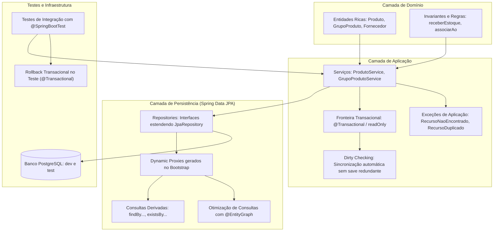

---

## Glossário

| Termo | Definição Técnica |
|---|---|
| **Spring Data JPA** | Subprojeto do ecossistema Spring que reduz drasticamente o código boilerplate de acesso a dados por meio da geração automática de implementações de repositórios em tempo de execução. |
| **Dynamic Proxy** | Padrão estrutural implementado pelo Java Reflection ou CGLIB que permite criar classes concretas em tempo de execução para implementar interfaces sem necessidade de código-fonte explícito. |
| **Derived Query Method** | Recurso do Spring Data que interpreta semanticamente nomes de métodos em interfaces de repositório e os converte dinamicamente em instruções JPQL/SQL. |
| **Persistence Context** | Contexto de 1º nível mantido pela sessão do JPA/Hibernate onde instâncias de entidades são gerenciadas, rastreadas para alterações e cacheadas durante uma transação. |
| **Dirty Checking** | Mecanismo interno do Hibernate que compara o estado atual de uma entidade gerenciada com seu snapshot original e emite comandos `UPDATE` automaticamente no banco de dados durante o *flush*. |
| **Transient** | Estado de uma entidade Java recém-instanciada via operador `new`, ainda não associada a um contexto de persistência e sem representação no banco de dados. |
| **Managed** | Estado de uma entidade que possui identidade relacional e está ativamente monitorada por um contexto de persistência aberto. |
| **Detached** | Estado de uma entidade que possui identidade relacional, mas cuja sessão de persistência associada já foi encerrada. |
| **Fronteira Transacional** | Ponto de demarcação (geralmente métodos da camada de serviço com `@Transactional`) onde se inicia e finaliza formalmente uma transação lógica com o banco de dados. |
| **Rollback** | Operação de reversão que cancela e desfaz todas as modificações pendentes de uma transação no banco de dados relacional após uma falha ou exceção. |
| **EntityGraph** | Recurso do JPA que permite instruir o provedor ORM a carregar associações mapeadas como preguicosas (*lazy*) em uma única instrução SQL por meio de junções explícitas (*joins*). |
| **Modelo Anêmico** | Anti-padrão arquitetural em que classes de domínio não contêm lógica de negócio, comportando-se apenas como estruturas passivas de dados manipuladas integralmente por serviços externos. |

---

## Pontos-chave para a prova

1. **A geração de instâncias de Repositório é dinâmica:** O programador nunca instancia interfaces com `new`. O Spring Boot instancia proxies dinâmicos em tempo de *bootstrap* e os registra como *beans*.
2. **Consultas derivadas usam convenções rigorosas:** A partícula `By` separa a intenção (`find`, `exists`, `count`) dos predicados de filtro (`CodigoBarras`, `GrupoId`).
3. **Travessia de propriedades:** O Spring Data consegue navegar por entidades associadas (ex.: `findByGrupoId` navega pelo atributo `grupo` e filtra pela propriedade interna `id`).
4. **Fronteira transacional pertence ao Serviço:** Colocar `@Transactional` apenas no repositório quebra a atomicidade de casos de uso compostos por múltiplos passos de negócio.
5. **Vantagens de readOnly = true:** Desativa snapshots de comparação no Hibernate, reduz o consumo de memória e otimiza o ciclo de *flush*, mas não substitui autorizações de segurança.
6. **Mecânica do Dirty Checking:** Não é necessário chamar `repository.save()` para persistir modificações efetuadas sobre entidades que já se encontram no estado **managed** dentro de um método transacional.
7. **Diferença de @Transactional em testes:** Quando anotado na classe de teste, o Spring força um *rollback* automático ao final de cada método, garantindo que o banco de dados de teste permaneça sempre limpo.
8. **Desacoplamento de Exceções:** Exceções de aplicação (como `RecursoNaoEncontradoException`) devem herdar de `RuntimeException` e não devem carregar anotações do protocolo HTTP nesta camada.
9. **Resolução de LazyInitializationException:** Deve ser tratada por meio de consultas planejadas (`@EntityGraph` ou JPQL com `JOIN FETCH`), rejeitando terminantemente o anti-padrão `open-in-view=true`.

---

## Perguntas e respostas (JSONL)

```jsonl
{"pergunta": "Qual componente do Spring Data JPA é responsável por implementar as interfaces de repositório?", "resposta": "O Spring Data gera Proxies Dinâmicos em tempo de execução via reflexão, delegando chamadas para a classe SimpleJpaRepository integrada ao EntityManager.", "dificuldade": "medio"}
{"pergunta": "Qual o significado da palavra reservada 'By' em um derived query method?", "resposta": "O 'By' atua como delimitador sintático que separa a instrução de consulta principal (find, exists, count) dos critérios e predicados de filtragem da cláusula WHERE.", "dificuldade": "facil"}
{"pergunta": "O que ocorre se chamarmos um método modificador em uma entidade no estado 'managed' dentro de uma transação ativa?", "resposta": "O Hibernate detecta a alteração via dirty checking e gera automaticamente um comando SQL UPDATE no momento do flush/commit, sem necessidade de chamar save().", "dificuldade": "medio"}
{"pergunta": "Por que a injeção de dependências por construtor é considerada superior à injeção por campo (@Autowired)?", "resposta": "Garante imutabilidade com campos 'final', evita instanciações com dependências nulas, detecta ciclos de dependência no bootstrap e facilita a criação de testes unitários.", "dificuldade": "facil"}
{"pergunta": "Qual o comportamento padrão da anotação @Transactional quando aplicada em um método de teste JUnit?", "resposta": "Executa a lógica dentro de uma transação e força um ROLLBACK automático incondicional ao final do teste para manter o banco limpo.", "dificuldade": "medio"}
{"pergunta": "Quais são os quatro estados fundamentais do ciclo de vida de uma entidade no JPA?", "resposta": "Transient (novo sem vínculo), Managed (gerenciado pelo contexto), Detached (com ID mas desanexado da sessão) e Removed (agendado para exclusão).", "dificuldade": "facil"}
{"pergunta": "Por que não devemos adicionar @ResponseStatus diretamente nas exceções da camada de aplicação?", "resposta": "Porque a camada de aplicação deve ser agnóstica ao meio de transporte. Vincular status HTTP quebra a arquitetura e impede o reúso do serviço em contextos CLI, batch ou mensageria.", "dificuldade": "dificil"}
{"pergunta": "Qual ganho de performance é obtido ao utilizar @Transactional(readOnly = true)?", "resposta": "O Hibernate desativa o snapshot de dirty checking em memória, reduz o consumo de memória heap e pula verificações de alteração durante o flush.", "dificuldade": "medio"}
{"pergunta": "O que caracteriza o anti-padrão Modelo de Domínio Anêmico?", "resposta": "Entidades que possuem apenas atributos privados acompanhados de getters e setters indiscriminados sem regras ou validações, deslocando toda a regra para os serviços.", "dificuldade": "medio"}
{"pergunta": "Como o Spring Data JPA interpreta o método findByGrupoId na entidade Produto?", "resposta": "Ele identifica o atributo 'grupo' na entidade Produto, navega pela associação @ManyToOne até a entidade GrupoProduto e filtra pela propriedade 'id' correspondente.", "dificuldade": "medio"}
{"pergunta": "Em qual camada da aplicação deve residir a anotação @Transactional que delimita o caso de uso?", "resposta": "Na camada de serviço (application service), pois ela é responsável por orquestrar os passos do caso de uso e assegurar a atomicidade das operações.", "dificuldade": "facil"}
{"pergunta": "Qual a causa primária da ocorrência de LazyInitializationException?", "resposta": "Acesso a um relacionamento mapeado como FetchType.LAZY após o fechamento da sessão ou da transação original do EntityManager.", "dificuldade": "dificil"}
{"pergunta": "Como a anotação @EntityGraph soluciona o problema de N+1 consultas?", "resposta": "Ela instrui o provedor JPA a carregar os relacionamentos informados em attributePaths utilizando junções (LEFT JOIN) em uma única instrução SQL.", "dificuldade": "dificil"}
{"pergunta": "O que acontece com as alterações feitas em uma entidade no estado 'detached'?", "resposta": "As alterações são ignoradas pelo banco de dados até que a entidade seja formalmente reanexada ao contexto de persistência através de merge() ou save().", "dificuldade": "medio"}
{"pergunta": "Por que o arquivo application-schema-reference.properties possui a diretiva spring.jpa.hibernate.ddl-auto=create?", "resposta": "Para permitir a recriação isolada de um esquema de referência descartável usado na comparação diferencial de changelogs do Liquibase.", "dificuldade": "dificil"}
{"pergunta": "Qual a diferença entre lançar uma RuntimeException e uma checked Exception em relação ao rollback padrão do Spring?", "resposta": "Por padrão, o Spring executa rollback automático para RuntimeException (não verificadas) e erros, mas confirma a transação em caso de checked Exceptions a menos que configurado rollbackFor.", "dificuldade": "dificil"}
```

---

## Checklist de revisão

- [ ] Consigo explicar a diferença categórica entre o papel de uma Entidade, de um Repositório e de um Serviço.
- [ ] Compreendo como o Spring Boot utiliza proxies dinâmicos para prover implementações de interfaces `JpaRepository`.
- [ ] Sei escrever consultas derivadas utilizando prefixos, operadores e travessia de propriedades (ex.: `findByGrupoId`).
- [ ] Sei implementar injeção de dependências estrita via construtor com atributos declarados como `private final`.
- [ ] Compreendo a importância de definir o `@Transactional` na camada de serviços para resguardar a atomicidade do caso de uso.
- [ ] Entendo as vantagens práticas de declarar `@Transactional(readOnly = true)` em métodos de consulta.
- [ ] Sei identificar e esquematizar os 4 estados do ciclo de vida JPA: *transient*, *managed*, *detached* e *removed*.
- [ ] Compreendo o funcionamento do *dirty checking* e sei justificar por que o uso de `save()` em entidades gerenciadas é redundante.
- [ ] Sei criar exceções semânticas na camada de aplicação herdando de `RuntimeException` sem acoplamento a status HTTP.
- [ ] Sei escrever testes de integração no PostgreSQL anotados com `@SpringBootTest` e `@Transactional` para rollback automático.
- [ ] Sei diagnosticar e corrigir a `LazyInitializationException` utilizando `@EntityGraph` sem apelar para `open-in-view=true`.
- [ ] Concluí a implementação das classes e resoluções no arquivo executável [`./codigo/Exercicios.java`](./codigo/Exercicios.java).
