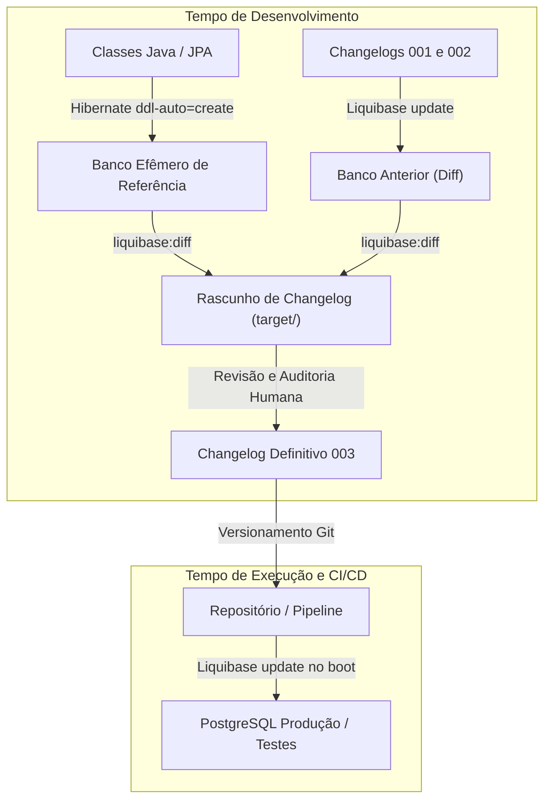
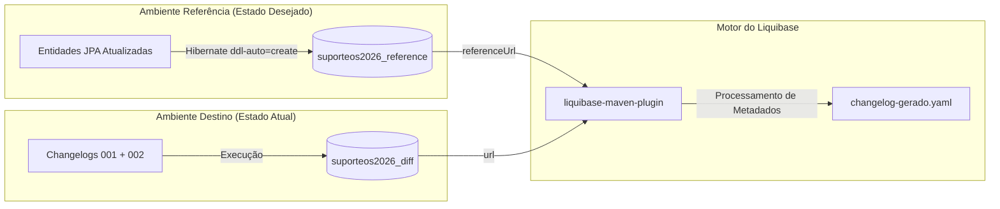
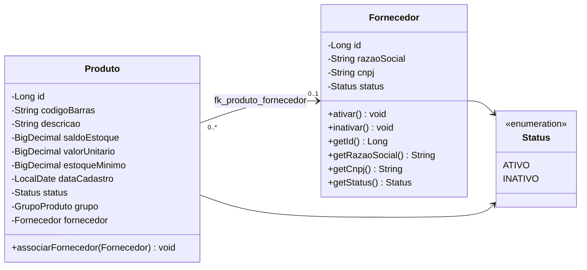
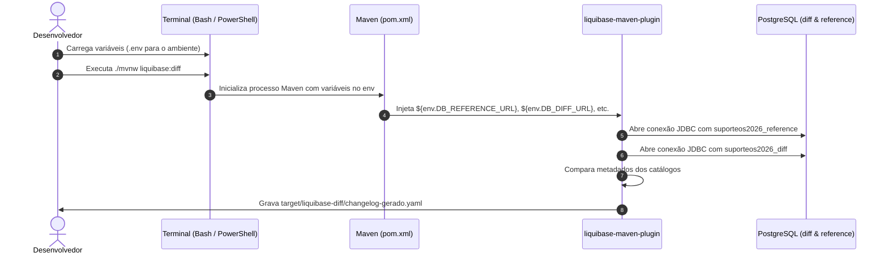
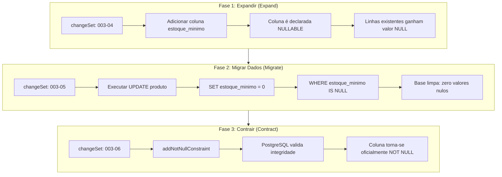
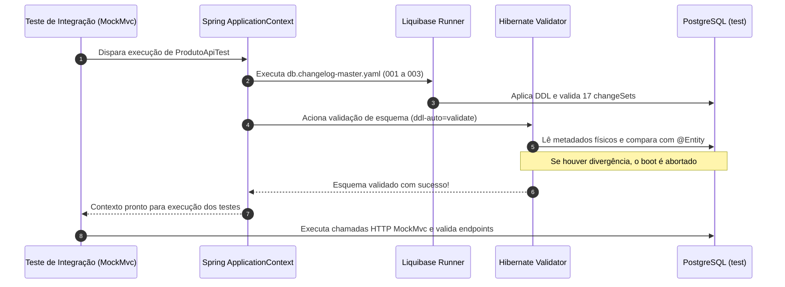
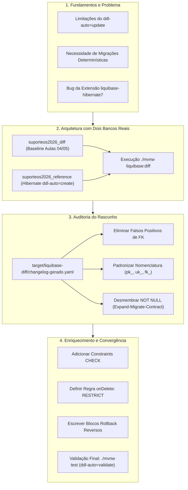

# Aula 06 — Evolução do Modelo e Changelogs Assistidos

> **Professor:** Jefferson Passerini  
> **Disciplina:** Laboratório de Programação IV (4º Semestre)  
> **Tema:** Evolução incremental de entidades JPA, geração assistida de changelogs com liquibase:diff e migrações seguras com padrão expand-migrate-contract

---

## Sumário

- [Objetivo da aula](#objetivo-da-aula)
- [Contexto e pré-requisitos](#contexto-e-pré-requisitos)
- [Diferenças conceituais entre geração de esquema, diff e migração versionada](#diferenças-conceituais-entre-geração-de-esquema-diff-e-migração-versionada)
- [Arquitetura de comparação: schema de referência versus schema de destino](#arquitetura-de-comparação-schema-de-referência-versus-schema-de-destino)
- [Limitações da extensão liquibase-hibernate7 e uso de dois bancos PostgreSQL reais descartáveis](#limitações-da-extensão-liquibase-hibernate7-e-uso-de-dois-bancos-postgresql-reais-descartáveis)
- [Evolução do domínio: mapeamento da entidade Fornecedor e associação opcional em Produto](#evolução-do-domínio-mapeamento-da-entidade-fornecedor-e-associação-opcional-em-produto)
- [Evolução de campos: adição de coluna obrigatória estoqueMinimo mantendo construtor legado](#evolução-de-campos-adição-de-coluna-obrigatória-estoqueminimo-mantendo-construtor-legado)
- [Configuração do liquibase-maven-plugin e injeção de variáveis de ambiente do .env no processo de build](#configuração-do-liquibase-maven-plugin-e-injeção-de-variáveis-de-ambiente-do-env-no-processo-de-build)
- [Execução do liquibase:diff e análise do changelog provisório em target/liquibase-diff](#execução-do-liquibasediff-e-análise-do-changelog-provisório-em-targetliquibase-diff)
- [Auditoria e filtragem do diff automático: remoção de falsos positivos e padronização de nomenclatura](#auditoria-e-filtragem-do-diff-automático-remoção-de-falsos-positivos-e-padronização-de-nomenclatura)
- [Estratégia expand-migrate-contract para inclusão segura de colunas NOT NULL com dados pré-existentes](#estratégia-expand-migrate-contract-para-inclusão-segura-de-colunas-not-null-com-dados-pré-existentes)
- [Enriquecimento manual da migração: constraints CHECK, regras de deleção RESTRICT e rollbacks reversos](#enriquecimento-manual-da-migração-constraints-check-regras-de-deleção-restrict-e-rollbacks-reversos)
- [Testes de integração e validação de convergência entre mapeamento JPA e histórico Liquibase](#testes-de-integração-e-validação-de-convergência-entre-mapeamento-jpa-e-histórico-liquibase)
- [Código da aula](#código-da-aula)
- [Exercícios](#exercícios)
- [Erros comuns e boas práticas](#erros-comuns-e-boas-práticas)
- [Links e materiais complementares](#links-e-materiais-complementares)
- [Mapa da aula](#mapa-da-aula)
- [Glossário](#glossário)
- [Pontos-chave para a prova](#pontos-chave-para-a-prova)
- [Perguntas e respostas (JSONL)](#perguntas-e-respostas-jsonl)
- [Checklist de revisão](#checklist-de-revisão)

---

## Objetivo da aula

Esta aula estabelece a disciplina de engenharia necessária para evoluir modelos relacionais em sistemas corporativos sem interrupção de serviço e sem perda de integridade. Ao final desta unidade, o estudante será capaz de:

1. Diferenciar tecnicamente geração transitória de esquema, cálculo diferencial de esquemas (*schema diff*) e migração declarativa versionada.
2. Projetar uma topologia de comparação com desacoplamento entre banco de referência (*reference schema*) e banco alvo (*target/diff schema*).
3. Implementar entidades JPA com integridade rica em Java e mapeamento declarativo compatível com bancos relacionais.
4. Identificar as limitações de introspecção estática de plugins Hibernate e adotar ambientes efêmeros reais via contêineres Docker/PostgreSQL.
5. Operacionalizar o `liquibase-maven-plugin` integrando variáveis de ambiente locais do arquivo `.env` ao ciclo de vida do Apache Maven.
6. Auditar criticamente arquivos diferenciais gerados por ferramentas automatizadas, identificando falsos positivos e ruídos de catálogo.
7. Aplicar o padrão de migração *expand-migrate-contract* para inserção de colunas com restrição `NOT NULL` sobre tabelas populadas.
8. Escrever regras de integridade física no banco (`CHECK`, `RESTRICT`) e instruções estritas de reversão (*rollback*) que ferramentas de diff omitem.
9. Provar a convergência formal entre as definições de metadados das entidades JPA e a estrutura física final do banco de dados relacional.

---

## Contexto e pré-requisitos

Até a Aula 05, a aplicação `suporteos2026` consolidou o domínio inicial composto pelas entidades `GrupoProduto` e `Produto`, operando sobre migrações manuais (`001` e `002`), repositórios Spring Data JPA e serviços transacionais.

Para o pleno aproveitamento desta aula, são necessários os seguintes pré-requisitos:
- Repositório sincronizado na tag `aula-05-repositories-servicos-transacoes`.
- Arquivo `.env` configurado localmente com credenciais do PostgreSQL.
- Ambiente Docker operacional executando o contêiner do PostgreSQL 16+.
- Domínio dos conceitos de mapeamento objeto-relacional (anotações Jakarta Persistence), isolamento de transações com `@Transactional` e funcionamento do motor de migração do Liquibase (`DATABASECHANGELOG` e `DATABASECHANGELOGLOCK`).

---

## Diferenças conceituais entre geração de esquema, diff e migração versionada

### Fundamentação e Definições

No ecossistema corporativo Java com Spring Boot, três estratégias costumam ser confundidas por desenvolvedores em início de carreira:

1. **Geração Transitória de Esquema (`ddl-auto`):** Mecanismo interno do provedor JPA (geralmente o Hibernate) que inspeciona classes anotadas e executa comandos DDL (`CREATE`, `ALTER`, `DROP`) diretamente no banco de dados durante a inicialização da aplicação (`ApplicationContext`).
2. **Cálculo Diferencial de Esquemas (*Diff*):** Processo analítico e pontual executado por ferramentas de migração (como o Liquibase) que compara dois catálogos de metadados relacionais e produz um relatório estrutural ou rascunho de comandos contendo as divergências encontradas.
3. **Migração Declarativa Versionada:** Conjunto ordenado, imutável e idempotente de arquivos de script (YAML, XML, JSON ou SQL puro) que documenta cada alteração de esquema e de dados ao longo do ciclo de vida do software. Cada bloco de alteração (*changeSet*) possui identificador único, autor, controle de soma de verificação (*checksum*) e instrução de reversão (*rollback*).



### Motivação técnica contra o uso de ddl-auto em ambientes persistentes

A propriedade `spring.jpa.hibernate.ddl-auto=update` parece conveniente para prototipação rápida, mas é terminantemente proibida em ambientes com dados persistentes pelos seguintes fatores:
- **Ausência de Controle Transacional DDL Seguro:** O Hibernate tenta inferir alterações de tipos ou inclusões de colunas, mas não consegue planejar a transição de dados legados.
- **Risco de Perda Silenciosa de Dados:** Ao renomear um atributo na classe Java de `valor` para `preco`, o Hibernate em modo `update` não detecta a intenção de renomeação; ele gera um comando `ALTER TABLE ... ADD COLUMN preco` e abandona a coluna `valor` com dados órfãos, ou, em modos mais agressivos, remove a coluna antiga.
- **Incompatibilidade com Replicação e Cluster:** Em arquiteturas distribuídas, múltiplas instâncias da aplicação subindo simultaneamente executando DDL dinâmico provocam contenção de bloqueios (*table locks* e *metadata locks*) e *deadlocks* no catálogo do PostgreSQL.

### Tabela comparativa de abordagens de evolução

| Característica | Geração via Hibernate (`ddl-auto`) | Liquibase Diff Automático | Migração Versionada Auditada |
|---|---|---|---|
| **Determinismo** | Baixo (depende do estado atual do banco) | Médio (reproduz diferenças sintáticas) | Absoluto (reproduzível em qualquer ambiente) |
| **Preservação de Dados** | Nula (ignora dados existentes em constraints) | Baixa (não gera comandos de backfill) | Total (planeja transição de dados com SQL/YAML) |
| **Auditabilidade e Git** | Inexistente (executado em runtime) | Apenas rascunho temporário | Alta (arquivos imutáveis submetidos a code review) |
| **Capacidade de Rollback** | Inexistente | Parcial ou ausente | Total (rollback explicitamente declarado) |
| **Ambiente Indicado** | Testes unitários rápidos em memória / descartáveis | Apoio de desenvolvimento (*scaffolding*) | Desenvolvimento, Homologação e Produção |

### Exemplos, contraexemplos e armadilhas

- **Exemplo Adequado:** Utilizar `spring.jpa.hibernate.ddl-auto=create` em um banco de dados temporário e isolado (`suporteos2026_reference`), unicamente para que o motor relacional materialize a representação física das entidades anotadas para posterior comparação.
- **Contraexemplo Desastroso:** Configurar `spring.jpa.hibernate.ddl-auto=update` no arquivo `application.properties` principal compartilhado entre a equipe ou em produção, confiando que o Hibernate adicionará constraints sem corromper a base.
- **Armadilha:** Acreditar que a execução de um plugin de migração substitui a responsabilidade do engenheiro de software. O diff é um gerador de rascunhos (*draft generator*); a decisão de negócio, integridade e nomenclatura é estritamente humana.

---

## Arquitetura de comparação: schema de referência versus schema de destino

### Definição dos papéis arquiteturais

A geração assistida de changelogs opera sobre o conceito de comparação diferencial de dois esquemas ativos:

- **Schema de Destino (*Target / Diff Database*):** Representa o estado atual conhecido e estável da base de dados. É o banco que recebeu rigorosamente todas as migrações oficiais aplicadas até a última versão lançada (na disciplina, as migrações `001-create-grupo-produto.yaml` e `002-create-produto.yaml`). Ele simula o banco de produção existente.
- **Schema de Referência (*Reference Database*):** Representa o estado desejado futuro da base de dados. É materializado pelo Hibernate a partir da compilação mais recente do código-fonte Java contendo as novas entidades, novos campos e alterações de relacionamento.



### Isolamento de privilégios e ciclo de vida dos bancos

Ambos os bancos operam na mesma instância PostgreSQL, porém em bancos de dados lógicos estritamente isolados (`CREATE DATABASE suporteos2026_diff` e `CREATE DATABASE suporteos2026_reference`), de posse do usuário de desenvolvimento (`suporteos_app`).

```sql
-- Criação dos bancos efêmeros para o fluxo de diff
CREATE DATABASE suporteos2026_diff OWNER suporteos_app;
CREATE DATABASE suporteos2026_reference OWNER suporteos_app;
```

### Riscos de contaminação de ambientes

Se a URL de referência for apontada inadvertidamente para a base de desenvolvimento local (`suporteos2026_dev`), o profile de referência executará `ddl-auto=create`, destruindo instantaneamente todos os dados previamente inseridos para testes manuais.

---

## Limitações da extensão liquibase-hibernate7 e uso de dois bancos PostgreSQL reais descartáveis

### Motivação técnica da decisão de engenharia

O Liquibase disponibiliza oficialmente a extensão `liquibase-hibernate` (na versão para Hibernate 7), cujo objetivo teórico é ler diretamente os metadados das classes Java em memória sem exigir uma instância secundária do PostgreSQL. No entanto, em sistemas reais e no ecossistema Spring Boot 3.x/4.x com Java 21, essa extensão apresenta instabilidades severas de introspecção.

Durante a homologação deste material didático, a execução direta do snapshot via Hibernate gerou a seguinte falha crítica:

```text
[ERROR] Failed to execute goal org.liquibase:liquibase-maven-plugin:5.0.3:diff (default-cli) on project suporteos2026: 
[ERROR] Error setting up or running Liquibase: java.lang.NullPointerException: 
[ERROR] Cannot invoke "java.sql.ResultSet.next()" because "schemas" is null
```

Essa exceção ocorre devido ao descasamento de abstrações entre o catálogo virtual fornecido pelo provedor em memória do plugin Hibernate e os drivers JDBC nativos do PostgreSQL para tipos avançados e esquemas complexos.

### Tabela comparativa de abordagens de extração

| Dimensão | Extensão Direta `liquibase-hibernate7` | Topologia de Dois Bancos PostgreSQL Reais |
|---|---|---|
| **Confiabilidade da Execução** | Baixa (sujeita a bugs abertos no driver e introspecção de metadados) | Alta (utiliza o próprio dialeto e catálogo do PostgreSQL) |
| **Fidelidade de Tipos de Dados** | Parcial (mapeamentos genéricos de tipos Java) | Exata (interpretação real dos tipos físicos nativos como `NUMERIC(18,3)`) |
| **Detecção de Constraints e Índices** | Incompleta para índices específicos e regras de dialeto | Precisa em relação ao DDL real emitido pelo PostgreSQL |
| **Complexidade de Setup** | Baixa (apenas dependência Maven) | Média (exige criação prévia dos dois bancos via SQL) |
| **Aderência ao Padrão de Produção** | Distante do comportamento do banco real | Idêntica ao comportamento de produção |

Ao adotar dois bancos de dados reais gerenciados pelo PostgreSQL em contêineres Docker, eliminamos camadas frágeis de emulação e operamos diretamente sobre a implementação física definitiva do banco relacional.

---

## Evolução do domínio: mapeamento da entidade Fornecedor e associação opcional em Produto

### O Domínio Fornecedor

A evolução do sistema de suporte e controle de ordens de serviço exige a identificação do fornecedor responsável pelo abastecimento dos produtos em estoque. Um fornecedor possui como identificador natural único o seu CNPJ, além de razão social e controle de status de ativação no sistema.



### Modelagem da Entidade Fornecedor

A classe `domain/Fornecedor.java` é projetada seguindo os princípios de modelo rico:
- Encapsulamento estrito dos atributos privados.
- Construtor protegido sem argumentos exigido pela especificação JPA.
- Construtor de negócio validando invariantes obrigatórias (não nulo, não vazio e formato com 14 dígitos numéricos para o CNPJ).
- Validação simplificada de CNPJ (comprimento e caracteres numéricos), deixando a validação algorítmica completa de dígitos verificadores para serviços especializados.

```java
package com.curso.suporteos.domain;

import jakarta.persistence.Column;
import jakarta.persistence.Entity;
import jakarta.persistence.EnumType;
import jakarta.persistence.Enumerated;
import jakarta.persistence.GeneratedValue;
import jakarta.persistence.GenerationType;
import jakarta.persistence.Id;
import jakarta.persistence.Table;
import jakarta.persistence.UniqueConstraint;

@Entity
@Table(
    name = "fornecedor",
    uniqueConstraints = @UniqueConstraint(
        name = "uk_fornecedor_cnpj",
        columnNames = "cnpj"
    )
)
public class Fornecedor {

    @Id
    @GeneratedValue(strategy = GenerationType.IDENTITY)
    private Long id;

    @Column(name = "razao_social", nullable = false, length = 150)
    private String razaoSocial;

    @Column(nullable = false, length = 14)
    private String cnpj;

    @Enumerated(EnumType.STRING)
    @Column(nullable = false, length = 20)
    private Status status;

    protected Fornecedor() {
    }

    public Fornecedor(String razaoSocial, String cnpj) {
        this.razaoSocial = validarTextoObrigatorio(razaoSocial, "Razão social é obrigatória");
        this.cnpj = validarCnpj(cnpj);
        this.status = Status.ATIVO;
    }

    public void ativar() {
        this.status = Status.ATIVO;
    }

    public void inativar() {
        this.status = Status.INATIVO;
    }

    public Long getId() { return id; }
    public String getRazaoSocial() { return razaoSocial; }
    public String getCnpj() { return cnpj; }
    public Status getStatus() { return status; }

    private static String validarTextoObrigatorio(String texto, String mensagem) {
        if (texto == null || texto.isBlank()) {
            throw new IllegalArgumentException(mensagem);
        }
        return texto.trim();
    }

    private static String validarCnpj(String cnpj) {
        String valor = validarTextoObrigatorio(cnpj, "CNPJ é obrigatório");
        if (!valor.matches("\\d{14}")) {
            throw new IllegalArgumentException("CNPJ deve possuir 14 dígitos");
        }
        return valor;
    }
}
```

### Associação em Produto: Por que a chave estrangeira é opcional?

Em `domain/Produto.java`, a associação é mapeada via `@ManyToOne(fetch = FetchType.LAZY)`. O atributo `optional` não é definido como `false`, permitindo que o campo `fornecedor_id` na tabela `produto` seja nulo.

```java
@ManyToOne(fetch = FetchType.LAZY)
@JoinColumn(
    name = "fornecedor_id",
    foreignKey = @ForeignKey(name = "fk_produto_fornecedor")
)
private Fornecedor fornecedor;
```

**Motivação Arquitetural:** Em sistemas já em produção com milhares de registros de produtos cadastrados sob as regras das aulas anteriores, impor obrigatoriedade imediata na associação com fornecedor causaria a quebra catastrófica dos dados legados, pois não há garantia de que todo produto antigo possua um fornecedor conhecido para vinculação imediata. A relação nasce opcional para garantir compatibilidade retroativa e transição não disruptiva.

---

## Evolução de campos: adição de coluna obrigatória estoqueMinimo mantendo construtor legado

### Modelagem do estoque mínimo

A gestão de estoques exige que cada produto possua um patamar mínimo para disparo de alertas de compra. O campo é definido como `BigDecimal` com precisão de 18 dígitos e escala de 3 casas decimais (compatível com unidades fracionárias como quilogramas ou metros).

```java
@Column(name = "estoque_minimo", nullable = false, precision = 18, scale = 3)
private BigDecimal estoqueMinimo;
```

### O Desafio da Retrocompatibilidade de Código Java

Ao tornar o campo obrigatório no domínio (`nullable = false`), o construtor principal de `Produto` passa a exigir o parâmetro `estoqueMinimo`. Se alterássemos unicamente a assinatura existente, quebraríamos todos os testes unitários, classes controladoras, mappers e chamadas de serviços construídos nas Aulas 04 e 05.

Para resolver isso de forma profissional, aplica-se a sobrecarga com delegação de construtores:

```java
// Construtor legado preservado: delega zero para o novo campo obrigatório
public Produto(
    String codigoBarras,
    String descricao,
    BigDecimal saldoEstoque,
    BigDecimal valorUnitario,
    LocalDate dataCadastro) {
    this(
        codigoBarras,
        descricao,
        saldoEstoque,
        valorUnitario,
        BigDecimal.ZERO,
        dataCadastro
    );
}

// Construtor completo da Aula 06
public Produto(
    String codigoBarras,
    String descricao,
    BigDecimal saldoEstoque,
    BigDecimal valorUnitario,
    BigDecimal estoqueMinimo,
    LocalDate dataCadastro) {
    this.codigoBarras = validarTextoObrigatorio(codigoBarras, "Código de barras é obrigatório");
    this.descricao = validarTextoObrigatorio(descricao, "Descrição é obrigatória");
    this.saldoEstoque = validarNaoNegativo(saldoEstoque, "Saldo de estoque não pode ser negativo");
    this.valorUnitario = validarNaoNegativo(valorUnitario, "Valor unitário não pode ser negativo");
    this.estoqueMinimo = validarNaoNegativo(estoqueMinimo, "Estoque mínimo não pode ser negativo");
    this.dataCadastro = Objects.requireNonNull(dataCadastro, "Data de cadastro é obrigatória");
    this.status = Status.ATIVO;
}
```

Essa técnica preserva a integridade do código existente e estabelece o valor default de domínio `BigDecimal.ZERO` para os fluxos que ainda não foram adaptados à nova regra.

---

## Configuração do liquibase-maven-plugin e injeção de variáveis de ambiente do .env no processo de build

### Arquitetura de compilação do Maven

O `liquibase-maven-plugin` executa diretamente dentro da Máquina Virtual Java (JVM) do processo do Apache Maven. Isso gera um desafio crítico que costuma desorientar desenvolvedores: **as propriedades do Spring Boot não estão carregadas durante as fases do ciclo de vida do Maven.**

O mecanismo do Spring Boot que lê arquivos `.env` ou `application.properties` só é inicializado quando a classe `SuporteosApplication.main()` é iniciada. Portanto, quando digitamos `./mvnw liquibase:diff`, o Maven precisa ler as credenciais de conexão do ambiente do sistema operacional (`System.getenv()`), referenciadas no `pom.xml` como `${env.NOME_VARIAVEL}`.



### Configuração do plugin no pom.xml

No arquivo `pom.xml`, o plugin é configurado com a versão `5.0.3` do Liquibase e o driver JDBC do PostgreSQL como dependência interna do plugin:

```xml
<plugin>
    <groupId>org.liquibase</groupId>
    <artifactId>liquibase-maven-plugin</artifactId>
    <version>${liquibase.version}</version>
    <configuration>
        <changeLogFile>${liquibase.changelog.file}</changeLogFile>
        <referenceUrl>${env.DB_REFERENCE_URL}</referenceUrl>
        <referenceUsername>${env.DB_REFERENCE_USERNAME}</referenceUsername>
        <referencePassword>${env.DB_REFERENCE_PASSWORD}</referencePassword>
        <url>${env.DB_DIFF_URL}</url>
        <username>${env.DB_DIFF_USERNAME}</username>
        <password>${env.DB_DIFF_PASSWORD}</password>
        <diffChangeLogFile>
            ${project.build.directory}/liquibase-diff/changelog-gerado.yaml
        </diffChangeLogFile>
    </configuration>
    <dependencies>
        <dependency>
            <groupId>org.postgresql</groupId>
            <artifactId>postgresql</artifactId>
            <version>${postgresql.version}</version>
        </dependency>
    </dependencies>
</plugin>
```

### Exportação das variáveis do arquivo .env

O arquivo `.env` local deve conter a definição explícita das duas conexões:

```dotenv
DB_DIFF_URL=jdbc:postgresql://localhost:5432/suporteos2026_diff
DB_DIFF_USERNAME=suporteos_app
DB_DIFF_PASSWORD=sua_senha_local

DB_REFERENCE_URL=jdbc:postgresql://localhost:5432/suporteos2026_reference
DB_REFERENCE_USERNAME=suporteos_app
DB_REFERENCE_PASSWORD=sua_senha_local
```

Para injetar essas variáveis no processo shell antes de chamar o Maven Wrapper:

- **Em ambientes macOS e Linux (Bash/Zsh):**
  ```bash
  set -a
  source .env
  set +a
  ```
- **Em ambientes Windows (PowerShell):**
  ```powershell
  Get-Content .env |
    Where-Object { $_ -and -not $_.StartsWith("#") } |
    ForEach-Object {
      $nome, $valor = $_ -split "=", 2
      Set-Item -Path "Env:$nome" -Value $valor
    }
  ```

---

## Execução do liquibase:diff e análise do changelog provisório em target/liquibase-diff

### Passo a passo da geração assistida

O fluxo ordenado de comandos para obter o rascunho de migração compreende quatro etapas rigorosas:

1. **Garantir que a base `diff` contenha a linha de base histórica (Aulas 01 a 05):**
   ```bash
   ./mvnw \
     -Dliquibase.changelog.file=src/test/resources/db/changelog/db.changelog-aula-04.yaml \
     -Dliquibase.url="${DB_DIFF_URL}" \
     -Dliquibase.username="${DB_DIFF_USERNAME}" \
     -Dliquibase.password="${DB_DIFF_PASSWORD}" \
     liquibase:update
   ```
2. **Materializar o esquema das novas classes na base descartável `reference`:**
   Utiliza-se o profile dedicado `schema-reference`, que define `spring.jpa.hibernate.ddl-auto=create` e desliga a interface web e o Liquibase:
   ```bash
   ./mvnw spring-boot:run -Dspring-boot.run.profiles=schema-reference
   ```
3. **Disparar o cálculo diferencial do Liquibase:**
   ```bash
   ./mvnw liquibase:diff
   ```
4. **Verificar a saída gerada:**
   O arquivo é gravado no diretório `target/liquibase-diff/changelog-gerado.yaml`. Como o diretório `target/` faz parte do `.gitignore`, esse arquivo não corre o risco de ser versionado acidentalmente sem revisão.

### Anatomia do changelog provisório bruto gerado

Ao inspecionar o rascunho gerado pela ferramenta, encontramos blocos com o seguinte formato:

```yaml
databaseChangeLog:
  - changeSet:
      id: 1724773829102-1
      author: murilodev (generated)
      changes:
        - createTable:
            tableName: fornecedor
            columns:
              - column:
                  autoIncrement: true
                  name: id
                  type: BIGINT
                  constraints:
                    primaryKey: true
                    primaryKeyName: fornecedor_pkey
              - column:
                  name: cnpj
                  type: VARCHAR(14)
                  constraints:
                    nullable: false
              - column:
                  name: razao_social
                  type: VARCHAR(150)
                  constraints:
                    nullable: false
              - column:
                  name: status
                  type: VARCHAR(20)
                  constraints:
                    nullable: false

  - changeSet:
      id: 1724773829102-2
      author: murilodev (generated)
      changes:
        - dropForeignKeyConstraint:
            baseTableName: produto
            constraintName: fk_produto_grupo_produto

  - changeSet:
      id: 1724773829102-3
      author: murilodev (generated)
      changes:
        - addColumn:
            tableName: produto
            columns:
              - column:
                  name: estoque_minimo
                  type: numeric(18, 3)
                  constraints:
                    nullable: false
```

---

## Auditoria e filtragem do diff automático: remoção de falsos positivos e padronização de nomenclatura

### Identificação Crítica de Falhas no Rascunho

A análise detida do rascunho gerado pelo Liquibase revela que ele **não está apto para ir para a branch principal de código**. O engenheiro deve auditar e corrigir os seguintes defeitos:

1. **IDs e Autoria Inadequados:**
   - *Gerado:* `id: 1724773829102-1`, `author: murilodev (generated)`.
   - *Decisão:* Substituir por IDs semânticos e ordenados (`003-01-create-fornecedor`, `003-02-unique-cnpj-fornecedor`) e autor institucional padronizado (`curso-spring-2026`).
2. **Nomenclatura Padrão de Chave Primária:**
   - *Gerado:* Chave primária gerada com o nome padrão do PostgreSQL: `fornecedor_pkey`.
   - *Decisão:* Ajustar para o padrão de nomenclatura adotado na arquitetura do projeto: `pk_fornecedor`.
3. **Falso Positivo Perigoso de Chave Estrangeira:**
   - *Gerado:* `dropForeignKeyConstraint: fk_produto_grupo_produto`.
   - *Causa:* O Hibernate gerou a FK no banco de referência sem explicitar a ação de exclusão, resultando em `NO ACTION`, enquanto a migração `002` original gravou a constraint no banco destino explicitamente como `RESTRICT`. O Liquibase interpreta essa diferença sutil de metadados como motivo para derrubar a chave estrangeira existente e recriá-la.
   - *Decisão:* **Remover sumariamente esse bloco do rascunho.** Aplicar esse comando causaria desestabilização desnecessária da constraint no banco de produção.
4. **Inserção Inviável de Restrição `NOT NULL`:**
   - *Gerado:* Adiciona a coluna `estoque_minimo` diretamente com `nullable: false`.
   - *Decisão:* Em um banco que já possua produtos cadastrados, essa instrução causará aborto imediato da transação (`ERROR: column "estoque_minimo" of relation "produto" contains null values`). É obrigatório aplicar o padrão *expand-migrate-contract*.

### Tabela de Auditoria e Decisões de Revisão

| Item Detectado no Rascunho | Causa Raiz Técnica | Risco em Produção | Ação de Engenharia |
|---|---|---|---|
| ID baseado em timestamp | Liquibase usa millis do sistema | Perda de rastreabilidade de changelog | Renomear para prefixo do release: `003-XX` |
| `author: usuario (generated)` | Identidade da estação de trabalho | Auditoria de commit fragmentada | Padronizar: `curso-spring-2026` |
| PK `fornecedor_pkey` | Padrão implícito do PostgreSQL | Fuga à convenção `pk_<tabela>` | Renomear para `pk_fornecedor` |
| Remoção de `fk_produto_grupo_produto` | Falso positivo: `RESTRICT` vs `NO ACTION` | Bloqueio de tabela e risco de orfandade | Excluir do changelog definitivo |
| Coluna com `nullable: false` direto | Hibernate mapeou `@Column(nullable=false)` | Erro de migração em tabelas com linhas | Desmembrar em 3 etapas (*expand-migrate-contract*) |
| Ausência de blocos `rollback` | O diff gera apenas comandos progressivos | Impossibilidade de reversão automatizada | Escrever bloco `rollback` para cada changeSet |
| Ausência de constraints `CHECK` | O JPA básico não infere validações numéricas no DDL | Inconsistência de dados aceitando valores negativos | Adicionar changeSets com comandos `ALTER TABLE ... ADD CHECK` |

---

## Estratégia expand-migrate-contract para inclusão segura de colunas NOT NULL com dados pré-existentes

### Fundamentação Teórica

O padrão arquitetural *expand-migrate-contract* (também conhecido como *Parallel Change*) é a técnica fundamental da engenharia de banco de dados para realizar alterações destrutivas ou de alta restrição em ambientes com zero tempo de parada (*zero downtime*).

Quando precisamos tornar uma coluna obrigatória em uma tabela que já armazena registros, não podemos simplesmente alterar sua definição para `NOT NULL`. A transição deve ser decomposta em três fases transacionais distintas:



### Implementação Declarativa no Liquibase

A decomposição da adição do campo `estoque_minimo` em `Produto` é implementada nos changeSets `003-04`, `003-05` e `003-06` do arquivo `003-fornecedor-e-estoque-minimo.yaml`:

```yaml
  # 1. EXPANDIR: Adiciona a coluna permitindo valores nulos
  - changeSet:
      id: 003-04-add-estoque-minimo-produto
      author: curso-spring-2026
      comment: Adiciona primeiro como nullable para preservar as linhas existentes.
      changes:
        - addColumn:
            tableName: produto
            columns:
              - column:
                  name: estoque_minimo
                  type: NUMERIC(18,3)
      rollback:
        - dropColumn:
            tableName: produto
            columnName: estoque_minimo

  # 2. MIGRAR: Atualiza os registros legados com o valor default de negócio
  - changeSet:
      id: 003-05-fill-estoque-minimo-produto
      author: curso-spring-2026
      comment: Preenche as linhas antigas antes de tornar a coluna obrigatória.
      changes:
        - update:
            tableName: produto
            columns:
              - column:
                  name: estoque_minimo
                  valueNumeric: 0
            where: estoque_minimo IS NULL
      rollback:
        - update:
            tableName: produto
            columns:
              - column:
                  name: estoque_minimo
                  value: null

  # 3. CONTRAIR: Aplica a restrição de obrigatoriedade física
  - changeSet:
      id: 003-06-not-null-estoque-minimo-produto
      author: curso-spring-2026
      changes:
        - addNotNullConstraint:
            tableName: produto
            columnName: estoque_minimo
            columnDataType: NUMERIC(18,3)
      rollback:
        - dropNotNullConstraint:
            tableName: produto
            columnName: estoque_minimo
            columnDataType: NUMERIC(18,3)
```

Essa disciplina garante que, mesmo que a base de produção possua milhões de produtos cadastrados antes do deploy, a migração será executada de forma suave, sem violação de constraints e sem abortos transacionais.

---

## Enriquecimento manual da migração: constraints CHECK, regras de deleção RESTRICT e rollbacks reversos

### Camadas de Proteção Além do Modelo JPA

As anotações JPA em classes Java não conseguem expressar nativamente todas as garantias de consistência relacional que o PostgreSQL suporta. Enquanto anotações como `@PositiveOrZero` da especificação Bean Validation operam apenas na memória da aplicação quando um Bean é explicitamente validado, o banco de dados deve agir como o guardião de última instância da consistência dos dados contra inserções diretas via scripts, relatórios ou outras aplicações conectadas.

Para preencher essa lacuna, enriquecemos a migração com restrições `CHECK` explícitas:

#### 1. Restrição de Status para Fornecedor
Garante que nenhum status desconhecido seja inserido na coluna de texto `status`:

```yaml
  - changeSet:
      id: 003-03-check-status-fornecedor
      author: curso-spring-2026
      changes:
        - sql:
            sql: >
              ALTER TABLE fornecedor
              ADD CONSTRAINT ck_fornecedor_status
              CHECK (status IN ('ATIVO', 'INATIVO'))
      rollback:
        - sql:
            sql: >
              ALTER TABLE fornecedor
              DROP CONSTRAINT ck_fornecedor_status
```

#### 2. Restrição de Estoque Mínimo Não Negativo
Garante que a quantidade de estoque mínimo nunca assuma valor negativo:

```yaml
  - changeSet:
      id: 003-07-check-estoque-minimo-produto
      author: curso-spring-2026
      changes:
        - sql:
            sql: >
              ALTER TABLE produto
              ADD CONSTRAINT ck_produto_estoque_minimo
              CHECK (estoque_minimo >= 0)
      rollback:
        - sql:
            sql: >
              ALTER TABLE produto
              DROP CONSTRAINT ck_produto_estoque_minimo
```

#### 3. Regra de Integridade Referencial RESTRICT
Na criação da chave estrangeira que conecta `produto` a `fornecedor`, definimos `onDelete: RESTRICT`. Isso impede que um fornecedor que possua produtos atrelados no sistema seja sumariamente excluído do banco, prevenindo orfandade relacional:

```yaml
  - changeSet:
      id: 003-09-foreign-key-produto-fornecedor
      author: curso-spring-2026
      changes:
        - addForeignKeyConstraint:
            baseTableName: produto
            baseColumnNames: fornecedor_id
            referencedTableName: fornecedor
            referencedColumnNames: id
            constraintName: fk_produto_fornecedor
            onDelete: RESTRICT
      rollback:
        - dropForeignKeyConstraint:
            baseTableName: produto
            constraintName: fk_produto_fornecedor
```

### O Mandato da Reversibilidade (Rollback)

Todo `changeSet` corporativo de alta confiabilidade deve possuir sua instrução de reversão equivalente declarada no bloco `rollback`. Isso garante que operações de implantação com falha possam ser revertidas via `./mvnw liquibase:rollback` sem intervenção manual de emergência e sem inconsistência de catálogo.

---

## Testes de integração e validação de convergência entre mapeamento JPA e histórico Liquibase

### O Teste de Convergência Definitivo

A validação final de uma evolução de modelo ocorre em dois níveis:

1. **Validação em Tempo de Boot (Hibernate `validate`):**
   Ao executar a suite de testes automatizados (`./mvnw test`), o Spring Boot aplica todo o histórico de migrações (`001`, `002` e `003`) na base de dados de teste e ativa a validação estrita do Hibernate:
   ```properties
   spring.jpa.hibernate.ddl-auto=validate
   ```
   Se qualquer tipo de dado, precisão de coluna, obrigatoriedade ou chave estrangeira divergir entre as anotações das classes Java e o banco criado pelo Liquibase, o `ApplicationContext` do Spring falhará no momento da inicialização com erro de esquema (`SchemaManagementException`).

2. **Detecção de Drift com Diff Reverso:**
   Após a aplicação oficial do changelog `003` em uma base de testes, podemos rodar novamente o `liquibase:diff` comparando o banco migrado com um novo banco de referência gerado pelo Hibernate. **O resultado esperado de um projeto convergente é um diff completamente vazio**, comprovando que as classes Java e o histórico Liquibase expressam exatamente a mesma realidade estrutural.



---

## Código da aula

Nesta seção, inspecionamos os artefatos implementados na Aula 06, detalhando as responsabilidades arquiteturais e linhas críticas de cada componente.

### 1. Configuração do Projeto e Dependências

- [pom.xml](file:///Users/murilodev/.gemini/antigravity-cli/scratch/pom.xml): Declara o plugin `liquibase-maven-plugin` na versão `5.0.3` com o driver PostgreSQL embutido nas dependências de compilação, permitindo que os objetivos `liquibase:diff` e `liquibase:update` operem desacoplados do runtime da aplicação Spring.
- [application-schema-reference.properties](file:///Users/murilodev/.gemini/antigravity-cli/scratch/src/main/resources/application-schema-reference.properties): Define o profile efêmero `schema-reference`, desabilitando o Liquibase (`spring.liquibase.enabled=false`), desligando o servidor web (`spring.main.web-application-type=none`) e ativando `spring.jpa.hibernate.ddl-auto=create` para materializar as entidades JPA no banco de dados temporário `suporteos2026_reference`.

### 2. Camada de Domínio

- [Fornecedor.java](file:///Users/murilodev/.gemini/antigravity-cli/scratch/src/main/java/com/curso/suporteos/domain/Fornecedor.java): Entidade que encapsula a razão social, o CNPJ com validação de 14 dígitos e o status do fornecedor, aplicando restrição única declarativa para a coluna `cnpj`.
- [Produto.java](file:///Users/murilodev/.gemini/antigravity-cli/scratch/src/main/java/com/curso/suporteos/domain/Produto.java): Atualizado para incorporar a coluna obrigatória `estoqueMinimo` (`NUMERIC(18,3)`) e o relacionamento opcional `@ManyToOne` com `Fornecedor`. Mantém o construtor sobrecarregado retrocompatível que delega `BigDecimal.ZERO` ao estoque mínimo.

Trecho essencial de `Produto.java` detalhando o relacionamento e a integridade de domínio:

```java
// Linha 58: Mapeamento de chave estrangeira opcional para manter compatibilidade
@ManyToOne(fetch = FetchType.LAZY)
@JoinColumn(
    name = "fornecedor_id",
    foreignKey = @ForeignKey(name = "fk_produto_fornecedor")
)
private Fornecedor fornecedor;

// Linha 67: Construtor sobrecarregado retrocompatível (Aula 04/05)
public Produto(
    String codigoBarras,
    String descricao,
    BigDecimal saldoEstoque,
    BigDecimal valorUnitario,
    LocalDate dataCadastro) {
    this(codigoBarras, descricao, saldoEstoque, valorUnitario, BigDecimal.ZERO, dataCadastro);
}
```

### 3. Camada de Repositório

- [FornecedorRepository.java](file:///Users/murilodev/.gemini/antigravity-cli/scratch/src/main/java/com/curso/suporteos/repository/FornecedorRepository.java): Interface Spring Data JPA estendendo `JpaRepository` com o método derivado `existsByCnpj(String cnpj)`.
- [ProdutoRepository.java](file:///Users/murilodev/.gemini/antigravity-cli/scratch/src/main/java/com/curso/suporteos/repository/ProdutoRepository.java): Contém consultas otimizadas utilizando `@EntityGraph(attributePaths = {"grupo", "fornecedor"})` para prevenir o problema de desempenho do N+1 ao carregar os relacionamentos associados.

### 4. Camada de Aplicação e Serviços

- [FornecedorService.java](file:///Users/murilodev/.gemini/antigravity-cli/scratch/src/main/java/com/curso/suporteos/application/FornecedorService.java): Encapsula o cadastro com verificação de duplicidade de CNPJ (`RecursoDuplicadoException`) e consultas transacionais com `readOnly = true`.
- [ProdutoService.java](file:///Users/murilodev/.gemini/antigravity-cli/scratch/src/main/java/com/curso/suporteos/application/ProdutoService.java): Orquestra o cadastro de produtos vinculando obrigatoriamente o `GrupoProduto` e condicionalmente o `Fornecedor` caso o identificador deste último seja fornecido na requisição.
- [RecursoDuplicadoException.java](file:///Users/murilodev/.gemini/antigravity-cli/scratch/src/main/java/com/curso/suporteos/application/RecursoDuplicadoException.java) e [RecursoNaoEncontradoException.java](file:///Users/murilodev/.gemini/antigravity-cli/scratch/src/main/java/com/curso/suporteos/application/RecursoNaoEncontradoException.java): Exceções de domínio mapeadas para tratamento HTTP uniforme.

### 5. Camada de Apresentação e Mapeamento DTO

- [FornecedorRequest.java](file:///Users/murilodev/.gemini/antigravity-cli/scratch/src/main/java/com/curso/suporteos/api/dto/FornecedorRequest.java) e [FornecedorResponse.java](file:///Users/murilodev/.gemini/antigravity-cli/scratch/src/main/java/com/curso/suporteos/api/dto/FornecedorResponse.java): Records que isolam os contratos de entrada e saída da API de fornecedores com validações `@NotBlank`, `@Size` e `@Pattern(regexp = "\\d{14}")`.
- [ProdutoRequest.java](file:///Users/murilodev/.gemini/antigravity-cli/scratch/src/main/java/com/curso/suporteos/api/dto/ProdutoRequest.java) e [ProdutoResponse.java](file:///Users/murilodev/.gemini/antigravity-cli/scratch/src/main/java/com/curso/suporteos/api/dto/ProdutoResponse.java): Contratos de produto expandidos com `estoqueMinimo` obrigatório e `fornecedorId` opcional.
- [FornecedorController.java](file:///Users/murilodev/.gemini/antigravity-cli/scratch/src/main/java/com/curso/suporteos/api/controller/FornecedorController.java) e [ProdutoController.java](file:///Users/murilodev/.gemini/antigravity-cli/scratch/src/main/java/com/curso/suporteos/api/controller/ProdutoController.java): Endpoints REST expondo cadastro e consulta com retorno semântico (`201 Created` com header `Location`).
- [ApiExceptionHandler.java](file:///Users/murilodev/.gemini/antigravity-cli/scratch/src/main/java/com/curso/suporteos/api/exception/ApiExceptionHandler.java): Tratamento centralizado de erros traduzindo exceções de integridade e validação em payloads padronizados [ApiError.java](file:///Users/murilodev/.gemini/antigravity-cli/scratch/src/main/java/com/curso/suporteos/api/exception/ApiError.java).

### 6. Migrações Liquibase

- [003-fornecedor-e-estoque-minimo.yaml](file:///Users/murilodev/.gemini/antigravity-cli/scratch/src/main/resources/db/changelog/changes/003-fornecedor-e-estoque-minimo.yaml): Changelog revisado contendo 9 changeSets atômicos (`003-01` a `003-09`), implementando a criação de `fornecedor`, o padrão *expand-migrate-contract* para `estoque_minimo`, constraints `CHECK`, e a chave estrangeira com regra `RESTRICT`.
- [db.changelog-master.yaml](file:///Users/murilodev/.gemini/antigravity-cli/scratch/src/main/resources/db/changelog/db.changelog-master.yaml): Arquivo mestre que inclui sequencialmente os arquivos `001`, `002` e `003`.

### 7. Testes Automatizados

- [ProdutoApiTest.java](file:///Users/murilodev/.gemini/antigravity-cli/scratch/src/test/java/com/curso/suporteos/api/ProdutoApiTest.java): Teste de integração ponta a ponta com `MockMvc` validando a criação de produtos vinculados a grupo e fornecedor, verificação de payloads de erro e respostas `404 Not Found`.
- Arquivo auxiliar da disciplina: [ExemplosAula.java](file:///Users/murilodev/.gemini/antigravity-cli/scratch/codigo/ExemplosAula.java) reúne demonstrações executáveis dos construtores retrocompatíveis, testes de invariantes e simulação dos passos do expand-migrate-contract.

---

## Exercícios

Nesta seção, apresentamos a resolução técnica completa dos exercícios propostos pelo professor, demonstrados e testados no arquivo executável [Exercicios.java](file:///Users/murilodev/.gemini/antigravity-cli/scratch/codigo/Exercicios.java).

### Exercício 1: Atividade de Transferência — Evolução de Modelo e Migração Assistida

**Enunciado:** Cada estudante deverá adicionar uma entidade ou campo no tema próprio, gerar o rascunho, registrar pelo menos três problemas encontrados e entregar a migração revisada com teste de preservação de dados.

#### Raciocínio de Engenharia
Adicionamos ao sistema de suporte a entidade `Tecnico` (representando o profissional que atende ordens de serviço) e evoluímos a tabela `produto` com o campo obrigatório `garantia_meses` (com valor padrão de 3 meses para produtos existentes). Realizamos a simulação da execução do diff e registramos as divergências de catálogo para construir uma migração atômica com reversão.

#### Três Problemas Detectados no Rascunho Bruto do Diff
1. **Quebra por Adição Imediata de NOT NULL:** A ferramenta tentou adicionar a coluna `garantia_meses` diretamente com a restrição `nullable: false`, o que falharia na presença de linhas antigas.
2. **Nomenclatura Aleatória e PK Genérica:** O Liquibase gerou a chave primária de técnico como `tecnico_pkey` e IDs baseados em milissegundos da máquina do desenvolvedor.
3. **Falta de Constraint de Domínio:** A regra de negócio exige que o prazo de garantia não seja negativo (`CHECK (garantia_meses >= 0)`), validação ignorada pelo gerador de rascunhos.

#### Resolução Completa da Migração (YAML)

```yaml
databaseChangeLog:
  - changeSet:
      id: 004-01-create-tecnico
      author: exercicio-aluno
      changes:
        - createTable:
            tableName: tecnico
            columns:
              - column:
                  name: id
                  type: BIGINT
                  autoIncrement: true
                  constraints:
                    primaryKey: true
                    primaryKeyName: pk_tecnico
                    nullable: false
              - column:
                  name: nome
                  type: VARCHAR(100)
                  constraints:
                    nullable: false
      rollback:
        - dropTable:
            tableName: tecnico

  - changeSet:
      id: 004-02-add-garantia-meses-produto
      author: exercicio-aluno
      comment: Fase Expand do Expand-Migrate-Contract
      changes:
        - addColumn:
            tableName: produto
            columns:
              - column:
                  name: garantia_meses
                  type: INTEGER
      rollback:
        - dropColumn:
            tableName: produto
            columnName: garantia_meses

  - changeSet:
      id: 004-03-fill-garantia-meses-produto
      author: exercicio-aluno
      comment: Fase Migrate do Expand-Migrate-Contract
      changes:
        - update:
            tableName: produto
            columns:
              - column:
                  name: garantia_meses
                  valueNumeric: 3
            where: garantia_meses IS NULL
      rollback:
        - update:
            tableName: produto
            columns:
              - column:
                  name: garantia_meses
                  value: null

  - changeSet:
      id: 004-04-not-null-garantia-meses-produto
      author: exercicio-aluno
      comment: Fase Contract do Expand-Migrate-Contract
      changes:
        - addNotNullConstraint:
            tableName: produto
            columnName: garantia_meses
            columnDataType: INTEGER
      rollback:
        - dropNotNullConstraint:
            tableName: produto
            columnName: garantia_meses
            columnDataType: INTEGER

  - changeSet:
      id: 004-05-check-garantia-meses-produto
      author: exercicio-aluno
      changes:
        - sql:
            sql: ALTER TABLE produto ADD CONSTRAINT ck_produto_garantia_meses CHECK (garantia_meses >= 0)
      rollback:
        - sql:
            sql: ALTER TABLE produto DROP CONSTRAINT ck_produto_garantia_meses
```

Demonstração prática de preservação de dados implementada no método `demonstrarAtividadeTransferencia()` do arquivo [Exercicios.java](file:///Users/murilodev/.gemini/antigravity-cli/scratch/codigo/Exercicios.java).

---

### Exercício 2: Questão 1 — Restrição de Uso do ddl-auto=create

**Enunciado:** Por que `ddl-auto=create` só pode apontar para o banco descartável?

#### Raciocínio de Engenharia
A instrução `ddl-auto=create` tem como comportamento operacional emitir comandos DDL explícitos de `DROP TABLE IF EXISTS ... CASCADE` seguidos de `CREATE TABLE` para cada entidade mapeada no projeto no exato instante em que o `SessionFactory` do Hibernate é inicializado.

#### Resolução Técnica
Se essa propriedade for apontada para um banco de dados persistente (seja de desenvolvimento, testes compartilhados ou produção), **todos os dados previamente cadastrados e todo o histórico da tabela de controle do Liquibase (`DATABASECHANGELOG`) serão irrevogavelmente destruídos**. Ela só é tolerável no banco `suporteos2026_reference` porque a única finalidade desse banco é fornecer um reflexo temporário e físico dos metadados das classes para que o comando `liquibase:diff` possa inspecioná-lo. Após a extração do diff, esse banco pode ser apagado sem prejuízo ao projeto.

---

### Exercício 3: Questão 2 — Alcance e Limitações do Liquibase Diff

**Enunciado:** O que o diff sabe e o que ele não sabe?

#### Raciocínio de Engenharia
O comando `liquibase:diff` funciona por meio de introspecção dos catálogos de metadados JDBC dos dois bancos conectados. É imperativo compreender a fronteira entre inspeção de catálogo e compreensão de regras de negócio.

#### Resolução Técnica

| O que o Diff Sabe (Detecta) | O que o Diff Não Sabe (Ignora) |
|---|---|
| Tabelas ausentes em um dos bancos | Dados existentes armazenados nas linhas das tabelas |
| Colunas ausentes, alteradas ou com tipos discrepantes | A intenção semântica da alteração (renomeação vs criação de novo campo) |
| Chaves primárias ausentes ou com colunas diferentes | A estratégia de preenchimento de campos obrigatórios (*backfill*) |
| Índices e restrições de unicidade (`UNIQUE`) ausentes | A política institucional de nomenclatura de constraints da empresa |
| Chaves estrangeiras ausentes no banco alvo | Instruções de reversão (*rollback*) apropriadas |
| Nulabilidade básica declarada nas colunas | Validações condicionais de domínio (`CHECK constraints`) |

---

### Exercício 4: Questão 3 — Adição Segura de Colunas NOT NULL

**Enunciado:** Por que adicionar `NOT NULL` exige considerar dados existentes?

#### Raciocínio de Engenharia
Os Sistemas Gerenciadores de Banco de Dados Relacionais (SGBDs), em conformidade com o padrão SQL ANSI e a implementação do PostgreSQL, avaliam a restrição de nulabilidade imediatamente durante a execução da instrução DDL de alteração de tabela.

#### Resolução Técnica
Ao executar `ALTER TABLE produto ADD COLUMN estoque_minimo NUMERIC(18,3) NOT NULL`, o banco tenta criar a coluna física em cada tupla existente. Se não houver cláusula de valor padrão estático no DDL e a tabela já contiver registros, o banco atribuirá valor `NULL` a essas linhas e, imediatamente a seguir, a restrição `NOT NULL` interceptará a instrução, abortando a transação com erro de violação de integridade. Portanto, adicionar colunas obrigatórias exige a estratégia em três tempos (*expand-migrate-contract*):
1. **Adicionar como nula** (não quebra as tuplas legadas).
2. **Atualizar via `UPDATE`** todas as linhas existentes com um valor consistente com as regras do negócio.
3. **Aplicar a restrição de obrigatoriedade**, momento em que o SGBD confirmará que nenhuma linha possui valor nulo e aprovará a restrição.

---

### Exercício 5: Questão 4 — Interpretação de Diffs Aparentemente Vazios

**Enunciado:** Por que um diff aparentemente vazio ainda precisa ser interpretado?

#### Raciocínio de Engenharia
Um relatório de diff retornado pelo Liquibase que indica ausência de alterações estruturais pode passar uma falsa sensação de convergência total, ocultando divergências graves de dados ou de dialeto.

#### Resolução Técnica
Um diff aparentemente vazio precisa ser interpretado porque:
- **O diff compara apenas esquemas, não o estado dos dados:** Podem existir registros legados no banco que violam regras de domínio recentemente introduzidas no código Java que ainda não foram convertidas em restrições físicas (`CHECK`).
- **Filtros e limitações do driver JDBC:** Certos tipos de índices avançados, triggers, procedures armazenadas ou convenções de caixa alta/baixa em identificadores podem ser ignorados pelo comparador padrão do Liquibase dependendo da versão do driver e dos tipos de objetos inspecionados.
- **Divergência de catálogo de schemas:** Se as credenciais apontarem para schemas padrão diferentes (ex: `public` em um e schema personalizado em outro), o comparador pode reportar vazio simplesmente por não encontrar o catálogo correspondente configurado para varredura.

---

### Exercício 6: Questão 5 — Schema de Referência versus Changelog Oficial

**Enunciado:** Qual diferença existe entre schema de referência e changelog oficial?

#### Raciocínio de Engenharia
Esta questão avalia a maturidade do desenvolvedor quanto à separação de artefatos efêmeros de desenvolvimento e artefatos de entrega contínua.

#### Resolução Técnica
- **Schema de Referência:** É um estado temporário, estático e derivado unicamente do código das entidades Java compiladas neste instante. Ele não possui história, não registra quem realizou as alterações, não documenta quando as transições ocorreram e não armazena comandos de transição de dados. É um produto descartável do processo de build.
- **Changelog Oficial:** É a linha temporal auditável, incremental e versionada do sistema de banco de dados. Ele documenta a sequência exata de eventos de engenharia pelos quais a base passou desde o seu primeiro commit, preservando a rastreabilidade, permitindo execuções idempotentes em diferentes ambientes (desenvolvimento, homologação, produção) e oferecendo scripts de reversão cirúrgicos para qualquer versão histórica do produto.

---

## Erros comuns e boas práticas

### Erros Comuns

1. **Versionar a pasta target/liquibase-diff:** Cometer o erro de adicionar o changelog gerado automaticamente direto ao repositório Git sem antes auditar, renomear constraints e separar os passos de migração.
2. **Confundir a URL do banco de referência com o banco de desenvolvimento:** Apontar o profile `schema-reference` para a base `suporteos2026_dev`, disparando `ddl-auto=create` e destruindo os dados de teste locais.
3. **Ignorar falsos positivos de chaves estrangeiras:** Aceitar cegamente comandos `dropForeignKeyConstraint` gerados por divergências superficiais entre `RESTRICT` e `NO ACTION`.
4. **Tentar aplicar `ddl-auto=update` em produção:** Confiar que o Hibernate resolverá a inclusão de novas colunas obrigatórias sem causar locks prolongados ou erros de violação de nulo.
5. **Esquecer o carregamento do arquivo `.env` antes do Maven:** Executar comandos `./mvnw liquibase:diff` com propriedades vazias de conexão porque as variáveis não estavam expostas no processo do shell pai.

### Boas Práticas

1. **Regra de Ouro da Nomenclatura:** Toda constraint física deve receber um nome explícito e padronizado: `pk_<tabela>` para chaves primárias, `uk_<tabela>_<coluna>` para restrições únicas, `fk_<origem>_<destino>` para chaves estrangeiras e `ck_<tabela>_<regra>` para verificações.
2. **Isolamento de Transações no Changelog:** Mantenha cada `changeSet` com uma única responsabilidade atômica. Nunca misture a criação de uma tabela com o preenchimento de dados de outra tabela no mesmo bloco.
3. **Rollback Obrigatório:** Nunca commite um arquivo de migração sem testar se o rollback executa de forma limpa e restaura o banco de dados exatamente ao estado anterior.
4. **Validação Estrita no Boot (`ddl-auto=validate`):** Mantenha o Hibernate em modo `validate` em todos os ambientes de teste e produção para garantir que a aplicação se recuse a subir caso o banco esteja desalinhado com as classes.

---

## Links e materiais complementares

- [Documentação Oficial do Liquibase 5.0.3 — Database Inspection Commands](https://docs.liquibase.com/community/reference-guide-5-0-3/database-inspection-change-tracking-and-utility-commands/what-are-database-inspection-commands): Detalhes dos comandos `diff`, `diff-changelog` e `generate-changelog`.
- [Repositório Oficial do Liquibase Hibernate Integration](https://github.com/liquibase/liquibase-hibernate): Código-fonte e documentação das limitações e bugs abertos da extensão direta de introspecção.
- [Código-fonte do LiquibaseDatabaseDiff no Maven Plugin](https://github.com/liquibase/liquibase/blob/main/liquibase-maven-plugin/src/main/java/org/liquibase/maven/plugins/LiquibaseDatabaseDiff.java): Implementação interna da tarefa Maven que executa a comparação de metadados.
- [Martin Fowler — Evolutionary Database Design and Parallel Change](https://martinfowler.com/articles/evodb.html): Artigo clássico sobre a arquitetura de migração contínua e o padrão expand-migrate-contract.
- [PostgreSQL Documentation — Constraints](https://www.postgresql.org/docs/current/ddl-constraints.html): Especificação oficial das restrições de integridade `CHECK`, `NOT NULL`, `UNIQUE` e `FOREIGN KEY`.

---

## Mapa da aula



---

## Glossário

| Termo | Definição Técnica |
|---|---|
| **Schema Diff** | Processo computacional de comparar dois esquemas de banco de dados e identificar as diferenças de catálogo estruturais entre eles. |
| **Schema de Referência** | Banco de dados transitório utilizado para materializar as estruturas mais recentes definidas nas classes Java. |
| **Schema de Destino** | Banco de dados que contém o estado atual consolidado das migrações anteriores da aplicação. |
| **Expand-Migrate-Contract** | Padrão arquitetural de três fases que permite alterar esquemas de banco de dados sem indisponibilidade e preservando dados legados. |
| **Backfill** | Processo de atualização ou população de dados históricos em uma coluna recém-criada antes da aplicação de restrições de nulabilidade. |
| **Idempotência** | Propriedade de uma operação pela qual ela pode ser aplicada múltiplas vezes sem alterar o resultado além da aplicação inicial. |
| **Drift de Banco** | Desalinhamento silencioso ocorrido quando a estrutura real do banco de dados diverge da definição versionada no código. |
| **Falso Positivo de Diff** | Divergência irrelevante ou inexistente reportada pela ferramenta de comparação devido a sutilezas de implementação do driver JDBC. |
| **Metadata Lock** | Bloqueio de catálogo imposto pelo banco de dados relacional durante comandos DDL que impede transações simultâneas de lerem ou alterarem tabelas. |
| **Hibernate validate** | Modo de execução do Hibernate que inspeciona o banco no boot e impede a aplicação de subir caso o esquema físico não coincida com as entidades. |

---

## Pontos-chave para a prova

1. **A diferença primária entre ddl-auto e ferramentas de migração:** O `ddl-auto` não conhece o histórico da base, não preserva dados em alterações estruturais complexas e não produz artefatos auditáveis de versão. O Liquibase produz histórico imutável, determinístico e auditável.
2. **A razão do isolamento em dois bancos PostgreSQL reais:** O `suporteos2026_reference` recebe `ddl-auto=create` para materializar as classes em DDL real sem colocar em risco os dados do projeto, contornando limitações de introspecção em memória do plugin Hibernate.
3. **O mecanismo do expand-migrate-contract:** Para adicionar coluna `NOT NULL` sobre tabela com dados, divide-se a migração em:
   - *Expand:* Adiciona coluna `NULLABLE`.
   - *Migrate:* Executa `UPDATE` preenchendo as tuplas que possuem valor `NULL`.
   - *Contract:* Aplica a restrição `NOT NULL` e constraints de validação física (`CHECK`).
4. **Identificação e descarte de falsos positivos:** O Liquibase pode sugerir `dropForeignKeyConstraint` por interpretar equivocadamente a diferença entre `RESTRICT` e `NO ACTION`. O engenheiro deve descartar essa instrução do rascunho para não quebrar a integridade existente.
5. **O papel mandatório dos blocos de rollback:** Todo `changeSet` em ambiente corporativo deve possuir seu bloco `rollback` correspondente, assegurando a capacidade de desfazer a migração de forma totalmente automatizada.

---

## Perguntas e respostas (JSONL)

```jsonl
{"pergunta": "Por que o uso de ddl-auto=update e proibido em ambientes de producao?", "resposta": "Porque ele nao e transacional para DDL complexo, nao executa transicao ou backfill de dados legados, pode abandonar colunas com dados orfaos ao renomear atributos e causa locks concorrentes no boot.", "dificuldade": "facil"}
{"pergunta": "Qual e a funcao do banco suporteos2026_reference na arquitetura de geracao assistida?", "resposta": "Servir como receptor descartavel do schema gerado pelo Hibernate via ddl-auto=create a partir das classes mais recentes, permitindo que o Liquibase compare sua estrutura contra o banco anterior.", "dificuldade": "facil"}
{"pergunta": "O que motivou a utilizacao de dois bancos reais em vez da extensao liquibase-hibernate7?", "resposta": "Um bug aberto na extensao direta que provocava NullPointerException (ResultSet.next() nulo) ao inspecionar schemas do Hibernate 7 sem banco real conectado.", "dificuldade": "media"}
{"pergunta": "Por que a chave estrangeira fornecedor_id em Produto foi modelada como opcional no banco?", "resposta": "Para preservar a compatibilidade com os registros de produtos ja existentes criados em aulas anteriores, que nao possuiam fornecedores vinculados.", "dificuldade": "facil"}
{"pergunta": "Como a classe Produto tratou a introducao de estoqueMinimo mantendo a retrocompatibilidade do codigo?", "resposta": "Implementou sobrecarga de construtores, mantendo a assinatura antiga delegando BigDecimal.ZERO para o novo construtor completo.", "dificuldade": "media"}
{"pergunta": "Por que as variaveis do arquivo .env precisam ser exportadas para o terminal antes de rodar o Maven?", "resposta": "Porque o plugin do Liquibase roda dentro do processo da JVM do Maven e nao passa pela inicializacao do Spring Boot, necessitando ler variaveis do ambiente do SO.", "dificuldade": "media"}
{"pergunta": "Por que o arquivo gerado pelo liquibase:diff e gravado no diretorio target/?", "resposta": "Para garantir que um rascunho automatico nao revisado nunca seja commitado acidentalmente no controle de versao Git.", "dificuldade": "facil"}
{"pergunta": "Cite dois exemplos de falsos positivos comumente gerados pelo liquibase:diff.", "resposta": "Deteccao indevida de remocao de chaves estrangeiras por divergencia entre RESTRICT e NO ACTION, e geracao de nomes genericos de PK como tabela_pkey.", "dificuldade": "media"}
{"pergunta": "Qual e a sequencia exata de operacoes do padrao expand-migrate-contract para colunas obrigatorias?", "resposta": "1) Adicionar coluna como nula; 2) Executar update preenchendo as linhas nulas com valor default; 3) Adicionar a constraint NOT NULL na coluna.", "dificuldade": "facil"}
{"pergunta": "O que acontece se executarmos um ALTER TABLE com NOT NULL direto em uma tabela com registros?", "resposta": "O banco de dados aborta imediatamente a transacao reportando violacao de integridade, pois as linhas antigas recebem NULL.", "dificuldade": "facil"}
{"pergunta": "Por que adicionamos constraints CHECK manuais se ja temos Bean Validation nas entidades?", "resposta": "Porque o Bean Validation so roda em memoria na aplicacao, enquanto a constraint CHECK no banco impede dados invalidos inseridos por scripts externos ou relatorios.", "dificuldade": "media"}
{"pergunta": "Qual a diferenca semantica entre a exclusao em cascata (CASCADE) e a exclusao restrita (RESTRICT) na FK?", "resposta": "CASCADE apaga automaticamente todos os filhos vinculados ao excluir o pai, enquanto RESTRICT aborta a exclusao do pai se houver filhos atrelados a ele.", "dificuldade": "facil"}
{"pergunta": "Qual a finalidade de se manter spring.jpa.hibernate.ddl-auto=validate nos testes?", "resposta": "Garantir que a aplicacao falhe no boot caso o mapeamento das entidades JPA divirja da estrutura fisica criada pelos changelogs do Liquibase.", "dificuldade": "media"}
{"pergunta": "O que caracteriza a situacao conhecida como drift de banco de dados?", "resposta": "O desalinhamento entre o esquema fisico do banco de dados e as definicoes formais de migracao declaradas no repositorio de codigo.", "dificuldade": "media"}
{"pergunta": "Como se valida que um changelog gerado convergiu perfeitamente com as classes?", "resposta": "Rodando os testes automatizados com ddl-auto=validate e executando um diff reverso entre o banco migrado e o banco de referencia gerado pelas classes, esperando diff vazio.", "dificuldade": "dificil"}
{"pergunta": "Por que o changeSet de preenchimento (fill) do estoque_minimo usa valueNumeric e nao value?", "resposta": "Para garantir que o Liquibase formate o valor literal de acordo com o tipo numerico do dialeto do banco sem trata-lo como string entre aspas.", "dificuldade": "facil"}
{"pergunta": "Qual e a responsabilidade da tabela DATABASECHANGELOG do Liquibase?", "resposta": "Armazenar o registro historico de cada changeSet executado, seu autor, data de execucao, checksum do conteudo e arquivo de origem.", "dificuldade": "facil"}
{"pergunta": "Por que cada changeSet deve possuir sua instrucao de rollback correspondente?", "resposta": "Para permitir a reversao automatizada e cirurgica de uma alteracao de esquema com falha sem exigir operacoes manuais de recuperacao de desastre.", "dificuldade": "facil"}
{"pergunta": "O que o Hibernate faz quando configurado com ddl-auto=create?", "resposta": "Executa DROP em todas as tabelas mapeadas existentes no banco e executa CREATE para recria-las do zero com base nas anotacoes das entidades.", "dificuldade": "facil"}
{"pergunta": "Como o Liquibase identifica se um changeSet ja foi aplicado em um banco?", "resposta": "Consultando a tabela DATABASECHANGELOG atraves da combinacao unica dos campos id, author e filepath.", "dificuldade": "facil"}
```

---

## Checklist de revisão

- [ ] Compreendi a diferença conceitual e prática entre `ddl-auto`, `liquibase:diff` e migrações versionadas.
- [ ] Entendi por que `suporteos2026_reference` é descartável e usa `ddl-auto=create`, enquanto `suporteos2026_diff` usa migrações oficiais.
- [ ] Sei exportar o arquivo `.env` para a sessão do shell para que o Maven enxergue as credenciais JDBC.
- [ ] Mapeei a nova entidade `Fornecedor` com validações de domínio e restrição única para CNPJ.
- [ ] Implementei a relação `@ManyToOne` opcional em `Produto` preservando compatibilidade com dados existentes.
- [ ] Realizei a sobrecarga do construtor de `Produto` delegando `BigDecimal.ZERO` para o campo `estoqueMinimo`.
- [ ] Executei `./mvnw spring-boot:run -Dspring-boot.run.profiles=schema-reference` para gerar o banco de referência.
- [ ] Executei `./mvnw liquibase:diff` e localizei a saída em `target/liquibase-diff/changelog-gerado.yaml`.
- [ ] Auditei o rascunho gerado, removendo o falso positivo de remoção da FK `fk_produto_grupo_produto`.
- [ ] Desmembrei a criação da coluna obrigatória `estoque_minimo` nas três etapas do padrão *expand-migrate-contract*.
- [ ] Adicionei constraints `CHECK` e regras de integridade `RESTRICT` com seus respectivos blocos `rollback`.
- [ ] Incluí o changelog `003` no arquivo `db.changelog-master.yaml` preservando a imutabilidade dos anteriores.
- [ ] Executei `./mvnw test` e comprovei a convergência total com `spring.jpa.hibernate.ddl-auto=validate`.
