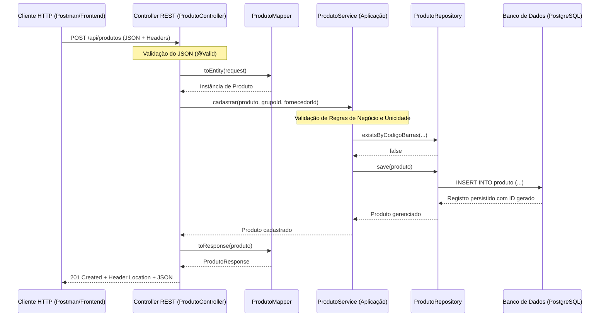
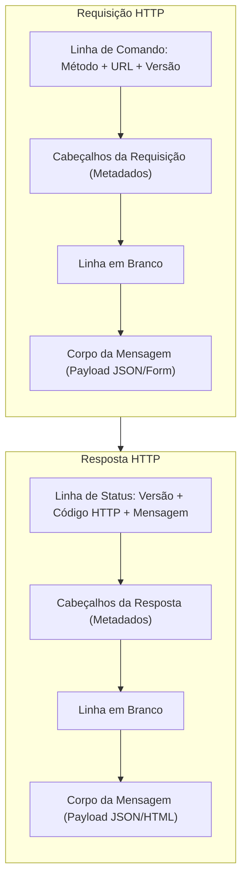
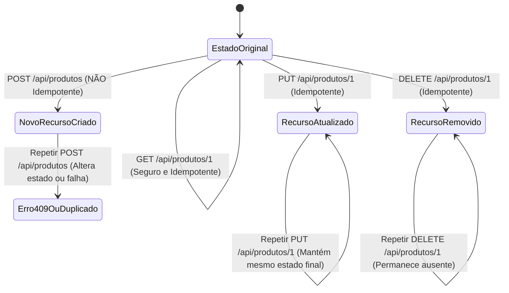
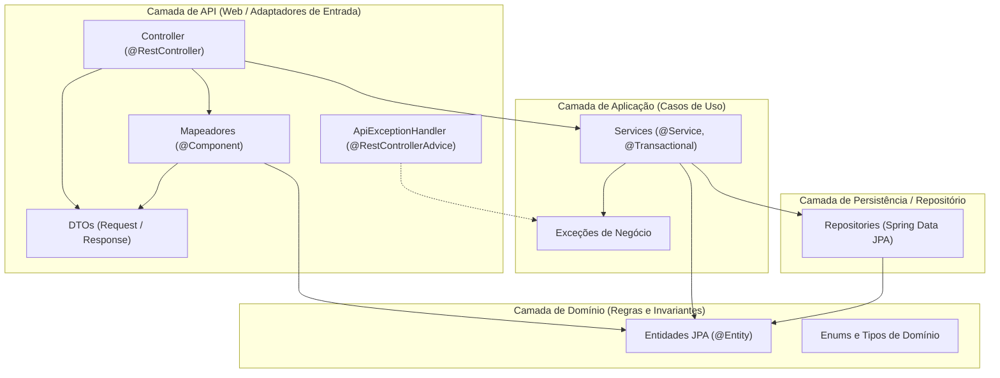
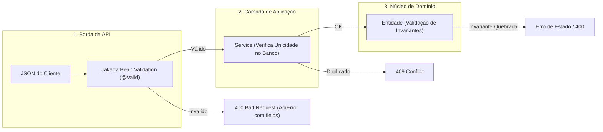
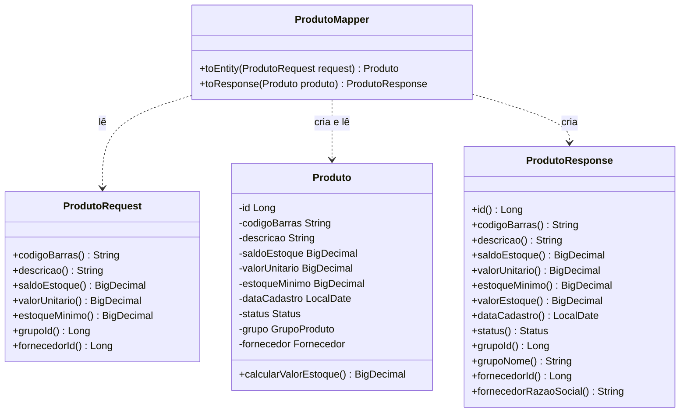
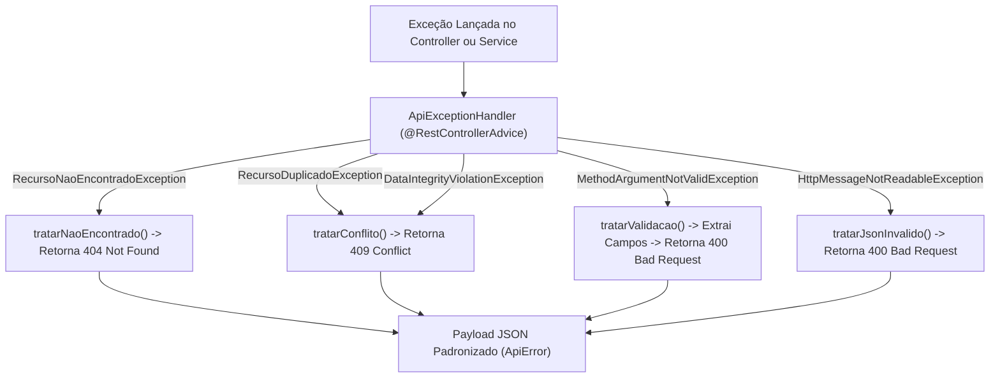
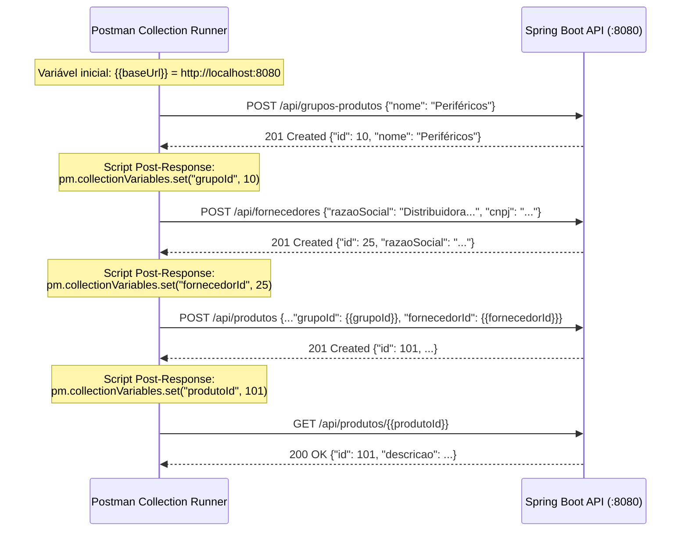
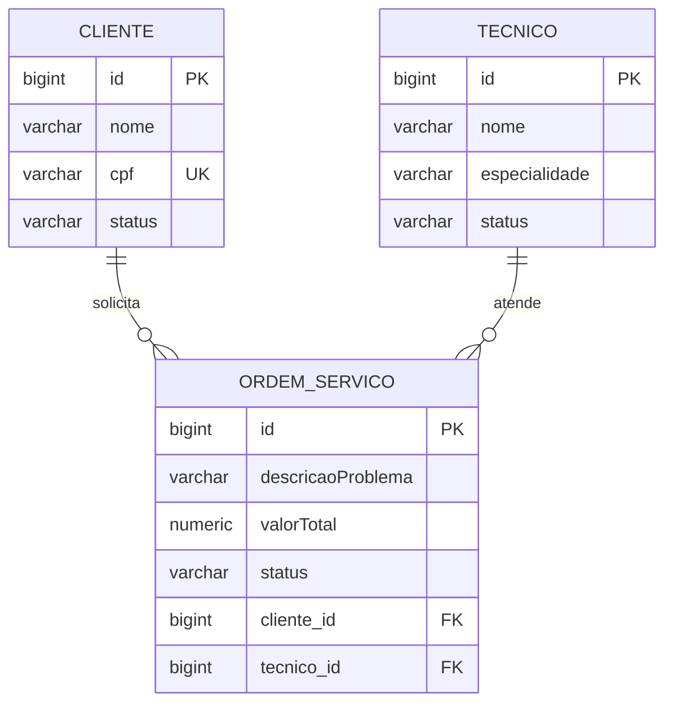

# Aula 07 — API REST DTOs Mapeadores e Postman

> **Professor:** Jefferson Passerini  
> **Disciplina:** Laboratório de Programação IV (4º Semestre)  
> **Tema:** Construção de APIs REST com Spring Boot, DTOs imutáveis, validação declarativa, mapeadores manuais, tratamento global de exceções e automação de testes com MockMvc e Postman.

---

## Sumário

- [Objetivo da aula](#objetivo-da-aula)
- [Contexto e pré-requisitos](#contexto-e-pré-requisitos)
- [Conceito de API Web e Arquitetura REST](#conceito-de-api-web-e-arquitetura-rest)
- [Estrutura do Protocolo HTTP: Métodos, URLs, Cabeçalhos e Códigos de Status](#estrutura-do-protocolo-http-métodos-urls-cabeçalhos-e-códigos-de-status)
- [Modelagem de Recursos e Idempotência](#modelagem-de-recursos-e-idempotência)
- [Separação de Responsabilidades em Camadas (Domain, Repository, Application, API)](#separação-de-responsabilidades-em-camadas-domain-repository-application-api)
- [DTOs (Data Transfer Objects) e Imutabilidade com Java Records](#dtos-data-transfer-objects-e-imutabilidade-com-java-records)
- [Validação de Entrada com Jakarta Bean Validation](#validação-de-entrada-com-jakarta-bean-validation)
- [Mapeamento Manual entre DTOs e Entidades de Domínio](#mapeamento-manual-entre-dtos-e-entidades-de-domínio)
- [Controllers REST e Códigos de Resposta HTTP (200, 201, 400, 404, 409, 500)](#controllers-rest-e-códigos-de-resposta-http-200-201-400-404-409-500)
- [Tratamento Global e Padronizado de Exceções com @RestControllerAdvice e ApiError](#tratamento-global-e-padronizado-de-exceções-com-restcontrolleradvice-e-apierror)
- [Testes de Integração da Camada Web com SpringBootTest e MockMvc](#testes-de-integração-da-camada-web-com-springboottest-e-mockmvc)
- [Automação e Validação de Contratos HTTP com Postman e Scripts Post-Response](#automação-e-validação-de-contratos-http-com-postman-e-scripts-post-response)
- [Código da aula](#código-da-aula)
- [Exercícios](#exercícios)
- [Erros comuns e boas práticas](#erros-comuns-e-boas-práticas)
- [Links e materiais complementares](#links-e-materiais-complementares)
- [Mapa da aula](#mapa-da-aula)
- [Glossário](#glossário)
- [Pontos-chave para a prova](#pontos-chave-para-a-prova)
- [Perguntas e respostas (JSONL)](#perguntas-e-respostas-jsonl)
- [Checklist de revisão](#checklist-de-revisão)

---

## Objetivo da aula

Esta aula estabelece a transição entre o núcleo de persistência/domínio e o mundo externo por meio da criação de uma interface de comunicação orientada a serviços HTTP. Ao concluir os estudos deste módulo, o estudante será capaz de:

1. Diferenciar o papel das entidades de domínio, dos serviços de aplicação e dos adaptadores da camada web.
2. Analisar e estruturar os quatro componentes elementares de mensagens HTTP (método, URL, cabeçalhos e corpo).
3. Projetar endpoints orientados a recursos utilizando substantivos no plural, evitando acoplamento a operações RPC.
4. Construir DTOs imutáveis de entrada e saída com Java Records para blindar as entidades JPA.
5. Aplicar regras declarativas de validação na borda da aplicação com o Jakarta Bean Validation.
6. Implementar mapeadores manuais puros, isolando transformações de dados sem dependências com o banco.
7. Construir Controllers REST no Spring Boot que emitam códigos de status e cabeçalhos semânticos (ex.: `201 Created` e `Location`).
8. Padronizar respostas de erro através de um tratador centralizado (`@RestControllerAdvice`) com a estrutura `ApiError`.
9. Escrever testes de integração automatizados com `@SpringBootTest` e `MockMvc` sem necessidade de levantar servidores de rede reais.
10. Montar suítes de testes no Postman com extração dinâmica de variáveis de ambiente e asserções automatizadas via scripts pós-resposta.

---

## Contexto e pré-requisitos

O projeto de referência **Suporte OS 2026** evolui de forma incremental. Até a Aula 06, o sistema contava com:
- O banco relacional PostgreSQL (`suporteos2026_dev`) em execução e versionado via Liquibase;
- Entidades JPA (`Produto`, `GrupoProduto`, `Fornecedor`) protegidas por invariantes ricas de domínio;
- Repositórios Spring Data JPA com consultas otimizadas via `@EntityGraph`;
- Serviços de aplicação gerenciando transações com `@Transactional`.

Para acompanhar esta aula, são obrigatórios:
- Java Development Kit (JDK) 21 instalado;
- PostgreSQL ativo com credenciais definidas no arquivo `.env`;
- Execução prévia dos *changesets* do Liquibase até o `003-fornecedor-e-estoque-minimo.yaml`;
- Postman (versão Desktop ou Web com Postman Desktop Agent).

---

## Conceito de API Web e Arquitetura REST

### Definição e Motivação
Uma API (*Application Programming Interface*) é uma fronteira formalmente definida que permite a interoperabilidade entre dois softwares. No ecossistema web moderno, uma **API REST** (*Representational State Transfer*) estabelece um conjunto de restrições arquiteturais formuladas por Roy Fielding (2000), fundamentadas na semântica nativa do protocolo HTTP:

- **Arquitetura Cliente-Servidor:** Desacoplamento entre a interface de apresentação/consumo (SPA, App Mobile, Postman) e a camada de persistência e negócio.
- **Stateless (Sem Estado):** Cada requisição do cliente deve conter todas as informações necessárias para que o servidor possa compreendê-la e processá-la. A sessão do usuário não é retida em memória no servidor entre requisições.
- **Interface Uniforme:** Recursos são identificados unicamente por URIs padronizadas e manipulados por meio de representações (geralmente JSON ou XML) utilizando verbos universais do protocolo.
- **Sistema em Camadas:** O cliente não é capaz de distinguir se está conectado diretamente ao servidor final, a um balanceador de carga ou a um gateway intermediário.

### Ciclo de Vida da Requisição REST
A seguir, o fluxo percorrido desde a emissão da requisição pelo cliente até a persistência no PostgreSQL:



### Exemplo vs. Contraexemplo

*Exemplo Correto (RESTful):*
- Enviar `POST /api/produtos` com payload JSON contendo os dados do novo item. A URL representa o recurso substantivo; a ação é determinada pelo verbo HTTP.

*Contraexemplo (Estilo RPC / Anti-padrão):*
- Enviar `POST /api/cadastrarProduto` ou `GET /api/produtos/remover?id=10`. Em REST, a URI não deve conter verbos de ação do sistema, pois o próprio protocolo HTTP define as operações semânticas.

### Comparativo: RPC vs REST

| Critério | Estilo RPC (Remote Procedure Call) | Estilo Arquitetural REST |
|---|---|---|
| **Foco principal** | Ações e operações (`/salvarProduto`, `/obterLista`) | Recursos modelados no plural (`/produtos`, `/fornecedores`) |
| **Uso de Verbos HTTP** | Frequentemente utiliza apenas `POST` ou `GET` para tudo | Uso semântico e estrito de `GET`, `POST`, `PUT`, `PATCH`, `DELETE` |
| **Acoplamento** | Elevado: o cliente precisa conhecer as assinaturas dos métodos remotos | Baixo: contratos públicos padronizados baseados em representações |
| **Tratamento de Estado** | Pode depender de sessão no servidor | Estritamente *stateless* |

---

## Estrutura do Protocolo HTTP: Métodos, URLs, Cabeçalhos e Códigos de Status

### Anatomia da Mensagem HTTP
O protocolo HTTP opera no modelo requisição-resposta. Ambos os lados trocam mensagens de texto estruturadas em seções bem delimitadas:



### Componentes de uma Requisição
1. **Método (Verbo):** Expressa a intenção do cliente em relação ao recurso:
   - `GET`: Recupera uma representação do recurso sem causar efeitos colaterais no servidor.
   - `POST`: Submete dados para criar um novo recurso subordinado ou processar um comando complexo.
   - `PUT`: Substitui integralmente um recurso existente pelo payload enviado.
   - `PATCH`: Aplica modificações parciais a um recurso existente.
   - `DELETE`: Remove o recurso identificado pela URI.
2. **URL (Uniform Resource Locator):** O caminho global que localiza o recurso (ex.: `/api/produtos/15`).
3. **Cabeçalhos (Headers):** Pares chave-valor com metadados da transação:
   - `Content-Type`: Informa o formato do corpo transmitido (`application/json`).
   - `Accept`: Informa o formato aceito pelo cliente na resposta (`application/json`).
   - `Authorization`: Credenciais de autenticação (como tokens JWT).
4. **Corpo (Body):** Conteúdo transportado na mensagem (comum em `POST`, `PUT` e `PATCH`).

### Componentes de uma Resposta
1. **Status Code:** Número de 3 dígitos divididos em classes:
   - `2xx` (Sucesso): `200 OK`, `201 Created`, `204 No Content`.
   - `4xx` (Erro do Cliente): `400 Bad Request`, `401 Unauthorized`, `403 Forbidden`, `404 Not Found`, `409 Conflict`.
   - `5xx` (Erro do Servidor): `500 Internal Server Error`, `503 Service Unavailable`.
2. **Cabeçalhos de Resposta:** Metadados sobre a resposta ou servidor:
   - `Location`: URI do recurso recém-criado (obrigatório em respostas `201 Created`).
   - `Content-Type`: Formato dos dados no corpo retornado.
3. **Corpo:** Carga de dados (JSON da entidade, lista de objetos ou detalhes do erro).

---

## Modelagem de Recursos e Idempotência

### Modelagem Centrada em Recursos
Em REST, a menor unidade manipulável é o **recurso**. Recursos devem ser substantivos no plural, independentes da tecnologia de banco de dados ou da estrutura física de tabelas.

*Regras Fundamentais:*
- Use substantivos no plural: `/api/produtos`, `/api/fornecedores`.
- Utilize aninhamento apenas para relações hierárquicas estritas: `/api/grupos-produtos/{id}/produtos` (caso fizesse sentido listar produtos subordinados a um grupo).
- O identificador único compõe o caminho (Path Variable): `/api/produtos/42`.

### Segurança e Idempotência
A especificação do HTTP (RFC 9110) define duas propriedades fundamentais para os métodos:

- **Método Seguro (Safe):** Uma operação é segura quando sua execução não altera o estado do servidor. Ela apenas lê dados (operações de consulta). Métodos seguros são inerentemente idempotentes.
- **Método Idempotente:** Uma operação é idempotente quando executá-la repetidas vezes de forma consecutiva com os mesmos parâmetros produz o mesmo efeito observável no estado do servidor que executá-la uma única vez ($f(f(x)) = f(x)$).



### Tabela de Métodos HTTP: Segurança vs. Idempotência

| Método HTTP | Finalidade Semântica | É Seguro? | É Idempotente? | Resposta Típica de Sucesso |
|---|---|---|---|---|
| `GET` | Consulta recursos | Sim | Sim | `200 OK` |
| `POST` | Cria novos recursos / Processa comandos | Não | Não | `201 Created` |
| `PUT` | Substituição completa de recurso | Não | Sim | `200 OK` ou `204 No Content` |
| `PATCH` | Atualização parcial de recurso | Não | Não (salvo se especificado) | `200 OK` |
| `DELETE` | Exclui recurso identificado | Não | Sim | `204 No Content` ou `200 OK` |

---

## Separação de Responsabilidades em Camadas (Domain, Repository, Application, API)

### Princípio da Arquitetura em Camadas
Para manter a sustentabilidade do código e permitir evolução independente, o sistema é particionado em camadas lógicas bem definidas. Essa arquitetura garante o **Princípio da Responsabilidade Única (SRP)** e desacopla os contratos externos (JSON) do núcleo de negócios (Entidades).



### Detalhamento das Responsabilidades

1. **`api/controller`:**
   - Atua como adaptador de entrada HTTP.
   - Converte JSON em objetos Java e vice-versa.
   - Dispara a validação sintática da borda (`@Valid`).
   - Define status codes (`200`, `201`) e cabeçalhos de resposta (`Location`).
   - **Não contém:** regras de negócio, cálculos financeiros ou chamadas diretas ao banco.

2. **`api/dto`:**
   - Define o contrato público da API.
   - Protege dados confidenciais ou de controle interno do servidor.
   - Isola o cliente das alterações do modelo relacional.

3. **`api/mapper`:**
   - Converte DTOs em Entidades e Entidades em DTOs.
   - Opera puramente em memória, sem efeitos colaterais.

4. **`application`:**
   - Orquestra os casos de uso do sistema.
   - Gerencia demarcação de transações (`@Transactional`).
   - Consulta repositories para obter dados e relacionamentos.
   - Aplica validações de regras de negócio (ex.: verificação de duplicidade de CNPJ).

5. **`domain`:**
   - Modela os conceitos e regras do negócio com integridade absoluta (entidades ricas).
   - Impede estados inválidos por meio de validação de invariantes nos construtores e métodos de mutação.

6. **`repository`:**
   - Fornece operações CRUD e consultas especializadas (`@Query`, `@EntityGraph`) abstraindo a tecnologia SQL.

---

## DTOs (Data Transfer Objects) e Imutabilidade com Java Records

### Por Que Não Expor Entidades JPA Diretamente?
Expor instâncias de classes anotadas com `@Entity` diretamente nos métodos do `@RestController` constitui uma grave falha de arquitetura:

1. **Vazamento de Dados Internos:** Campos privados, atributos técnicos (como `version` de lock otimista) ou senhas podem ser acidentalmente serializados no JSON.
2. **Acoplamento Extremo:** Qualquer refatoração de coluna no banco ou atributo na entidade quebrará imediatamente os contratos de todos os clientes da API.
3. **Falhas de Lazy Loading (`LazyInitializationException`):** O serializador JSON (Jackson) tenta acessar relacionamentos `FetchType.LAZY` fora da sessão transacional aberta, disparando exceções em tempo de execução.
4. **Loops de Serialização Bidirecional:** Se `GrupoProduto` contém uma lista de `Produto` e `Produto` aponta para `GrupoProduto`, a tentativa de serialização direta gerará um estouro de pilha (`StackOverflowError`) por recursão infinita.
5. **Ataques de Atribuição em Massa (Mass Assignment):** Um cliente malicioso pode enviar no payload campos que deveriam ser restritos ao servidor (ex.: `status: "ATIVO"`, `saldoEstoque: 999999`), e o framework pode vinculá-los diretamente se a entidade for usada como parâmetro de entrada.

### Java Records como DTOs
Introduzidos de forma definitiva no Java 16, os `record` são construções sintáticas ideais para DTOs:
- **Imutabilidade Intrínseca:** Todos os campos são `private final`. Não há métodos *setters*, impedindo efeitos colaterais acidentais após a desserialização.
- **Sintaxe Concisa:** Construtor canônico, métodos de acesso (`nome()`, `preco()`), `equals()`, `hashCode()` e `toString()` são gerados automaticamente pelo compilador.

### Comparativo: Entidade JPA vs Record DTO

| Aspecto | Entidade JPA (`@Entity`) | Record DTO (`record`) |
|---|---|---|
| **Ciclo de Vida** | Gerenciado pelo EntityManager / Hibernate | Efêmero, existe apenas durante o transporte na requisição |
| **Mutabilidade** | Mutável (requer estado mutável para dirty checking) | Estritamente imutável |
| **Construtores** | Exige construtor padrão protegido/público sem argumentos | Possui construtor canônico compacto |
| **Identidade** | Baseada em Chave Primária (`id`) ou regra de negócio | Baseada no valor de todos os atributos (*Value Object*) |
| **Responsabilidade** | Concretizar regras e invariantes de negócio | Representar contratos de dados na fronteira da API |

---

## Validação de Entrada com Jakarta Bean Validation

### A Defesa em Camadas (Defense in Depth)
A validação de dados em uma aplicação corporativa é estruturada em dois níveis distintos:

1. **Validação da Camada de API (Bean Validation):** Focada na sintaxe e formato da entrada (campos nulos, strings em branco, limites de caracteres, valores negativos, formato de strings como CNPJ). Ocorre antes mesmo de acionar a camada de aplicação.
2. **Validação da Camada de Domínio (Invariantes de Entidade):** Focada na semântica e regras invioláveis do negócio (saldo suficiente, transições de estado permitidas). Garante que a entidade permaneça consistente, independentemente de quem a instanciou (API, migração em lote, testes unitários).



### Anotações Principais e Uso no Projeto
O Jakarta Bean Validation (módulo `spring-boot-starter-validation`) oferece anotações padronizadas aplicáveis diretamente aos atributos dos DTOs:

- `@NotBlank`: O campo não pode ser nulo e deve conter pelo menos um caractere não-espaço (específico para `CharSequence`).
- `@NotNull`: O campo não pode ser nulo (adequado para números, datas e identificadores).
- `@Size(min, max)`: Delimita o comprimento mínimo e máximo de strings ou coleções.
- `@Positive`: O valor numérico deve ser estritamente maior que zero ($x > 0$).
- `@PositiveOrZero`: O valor numérico deve ser maior ou igual a zero ($x \ge 0$).
- `@Pattern(regexp = ...)`: Garante conformidade contra uma expressão regular.

```java
public record FornecedorRequest(
    @NotBlank(message = "Razão social é obrigatória")
    @Size(max = 150, message = "Razão social deve possuir no máximo 150 caracteres")
    String razaoSocial,

    @NotBlank(message = "CNPJ é obrigatório")
    @Pattern(regexp = "\\d{14}", message = "CNPJ deve possuir 14 dígitos")
    String cnpj
) {}
```

---

## Mapeamento Manual entre DTOs e Entidades de Domínio

### A Decisão por Mapeadores Manuais
Embora existam bibliotecas de mapeamento automático (como MapStruct ou ModelMapper), a adoção do **mapeamento manual** em projetos corporativos e no ambiente didático apresenta justificativas sólidas:

1. **Rastreabilidade Absoluta:** O fluxo de dados de cada atributo fica 100% explícito no código Java, facilitando o uso de ferramentas de debug e navegação do IDE (Find Usages).
2. **Zero Mágica / Sem Reflexão:** Evita comportamentos inesperados causados por correspondência automática de nomes ou falhas silenciosas de conversão de tipos.
3. **Isolamento de Infraestrutura:** Mapeadores manuais operam apenas como componentes de tradução sem dependência de Repositories.

### Regra de Ouro do Mapeador
> **Um Mapper NUNCA deve injetar Repositories nem consultar o Banco de Dados.**

Um mapeador não deve tentar resolver chaves estrangeiras consultando o banco. A responsabilidade de carregar relacionamentos por ID pertence aos **Serviços de Aplicação**, pois envolver o banco dentro do mapeador introduz regras de orquestração de casos de uso em uma classe que deveria ser puramente utilitária e livre de efeitos colaterais.



---

## Controllers REST e Códigos de Resposta HTTP (200, 201, 400, 404, 409, 500)

### O Papel do Controller REST
No Spring Boot, um Controller é um componente anotado com `@RestController` (combinação de `@Controller` com `@ResponseBody`), que faz com que todos os retornos de seus métodos sejam automaticamente serializados no corpo da resposta HTTP (formato JSON por padrão via Jackson).

### O Padrão de Cadastro (`POST`) e Cabeçalho `Location`
Ao cadastrar um novo recurso, a boa prática REST exige:
1. Retornar o código de status **`201 Created`** (e não simplesmente `200 OK`).
2. Retornar no corpo a representação completa do recurso criado (incluindo seu ID gerado).
3. Incluir o cabeçalho HTTP standard **`Location`** informando a URI de consulta direta daquele novo recurso.

```java
@PostMapping
public ResponseEntity<ProdutoResponse> cadastrar(
        @Valid @RequestBody ProdutoRequest request) {

    // 1. Converte DTO em Entidade
    Produto produto = mapper.toEntity(request);
    
    // 2. Executa o caso de uso na camada de aplicação
    Produto cadastrado = service.cadastrar(
            produto,
            request.grupoId(),
            request.fornecedorId()
    );
    
    // 3. Monta a URI do novo recurso: /api/produtos/{id}
    URI location = URI.create("/api/produtos/" + cadastrado.getId());
    
    // 4. Retorna 201 Created com cabeçalho Location e o DTO de saída no corpo
    return ResponseEntity.created(location).body(mapper.toResponse(cadastrado));
}
```

### Resumo dos Códigos de Status HTTP do Projeto

| Código | Nome Oficial | Cenário de Uso no Projeto Suporte OS |
|---|---|---|
| **`200`** | `OK` | Requisição de consulta ou listagem bem-sucedida (`GET`). |
| **`201`** | `Created` | Criação bem-sucedida de grupo, fornecedor ou produto (`POST`). Requer cabeçalho `Location`. |
| **`400`** | `Bad Request` | Falha de validação Bean Validation (campos nulos/inválidos) ou JSON malformado (sintaxe quebrada). |
| **`404`** | `Not Found` | Recurso solicitado por ID não existe (ou entidade relacionada não encontrada no cadastro). |
| **`409`** | `Conflict` | Violação de integridade por tentativa de duplicidade (CNPJ, código de barras ou nome único). |
| **`500`** | `Internal Server Error` | Erros inesperados no servidor (bugs de código, falhas de infraestrutura não tratadas). |

---

## Tratamento Global e Padronizado de Exceções com @RestControllerAdvice e ApiError

### O Desafio da Uniformidade de Falhas
Sem um mecanismo centralizado, cada tipo de falha produz uma resposta em formato divergente: o framework pode emitir um HTML de erro padrão (Whitelabel Error Page), o Jackson pode emitir mensagens ilegíveis de reflexão, e falhas de banco podem vazar trechos de SQL com credenciais ou tabelas internas.

### A Estrutura do `ApiError`
Para conferir previsibilidade aos clientes da API, adota-se um DTO imutável dedicado para empacotar os detalhes de qualquer anomalia ocorrida:

```java
public record ApiError(
    Instant timestamp,
    int status,
    String error,
    String message,
    String path,
    Map<String, String> fields
) {}
```

### O Tratador Centralizado (`@RestControllerAdvice`)
A anotação `@RestControllerAdvice` transforma a classe em um interceptador global de exceções lançadas por qualquer Controller da aplicação:



*Exemplo de JSON retornado ao violar o Bean Validation (`400 Bad Request`):*
```json
{
  "timestamp": "2026-08-27T14:00:00Z",
  "status": 400,
  "error": "Bad Request",
  "message": "Um ou mais campos são inválidos",
  "path": "/api/produtos",
  "fields": {
    "descricao": "Descrição é obrigatória",
    "valorUnitario": "Valor unitário não pode ser negativo"
  }
}
```

> **Aviso de Segurança (Leakage de Infraestrutura):** Stack traces de exceções, strings de conexão JDBC, nomes internos de tabelas do PostgreSQL ou fragmentos de código-fonte NUNCA devem ser serializados no objeto `ApiError`. Essas informações facilitam ataques de injeção e engenharia reversa.

---

## Testes de Integração da Camada Web com SpringBootTest e MockMvc

### MockMvc: Testando a Camada Web Sem Overhead de Rede
O `MockMvc` é o mecanismo central do Spring Test para validar Controllers. Ele simula chamadas HTTP executando toda a pilha de filtros, interceptadores, serializadores Jackson, conversores e tratadores de exceção do Spring MVC, mas **sem abrir uma porta TCP real** de rede, tornando a execução dos testes extremamente veloz.

### A Estrutura de Configuração do Teste
```java
@SpringBootTest
@AutoConfigureMockMvc
@ActiveProfiles("test")
@Transactional
class ProdutoApiTest {
    @Autowired
    private MockMvc mockMvc;
    // ...
}
```

- `@SpringBootTest`: Inicializa o contexto completo do Spring Boot (carrega serviços, mappers, repositórios e executa o Liquibase).
- `@AutoConfigureMockMvc`: Cria e injeta a instância do `MockMvc` configurada com todos os controllers e filtros.
- `@ActiveProfiles("test")`: Ativa o arquivo `application-test.properties`, direcionando para o banco de dados dedicado aos testes.
- `@Transactional`: Garante que cada método de teste execute dentro de uma transação isolada que sofre **rollback automático** ao término da asserção, mantendo o banco de dados limpo e os testes independentes.

### Anatomia de uma Asserção MockMvc
O teste emprega a fluência da API `perform`, validando cabeçalhos e inspecionando o JSON resultante através de expressões **JsonPath**:

```java
mockMvc.perform(post("/api/produtos")
        .contentType(MediaType.APPLICATION_JSON)
        .content(json))
        .andExpect(status().isCreated())
        .andExpect(header().exists("Location"))
        .andExpect(jsonPath("$.id").isNumber())
        .andExpect(jsonPath("$.codigoBarras").value("API-001"))
        .andExpect(jsonPath("$.grupoNome").value("Grupo API"));
```

---

## Automação e Validação de Contratos HTTP com Postman e Scripts Post-Response

### O Papel do Postman
Enquanto o `MockMvc` atua no ciclo de Integração Contínua (CI/CD) dentro da JVM, o **Postman** valida a aplicação em tempo de execução real como um cliente HTTP externo legítimo.

### Encadeamento de Requisições via Variáveis de Coleção
Em um fluxo realista de teste, cadastramos uma categoria de produto e precisamos utilizar o ID gerado automaticamente pelo banco para cadastrar o produto subsequente. Fazer isso manualmente (copiando e colando IDs) é lento e propenso a erros.

A solução consiste em utilizar a aba **Scripts > Post-response** do Postman para capturar o payload de resposta e salvar o identificador em variáveis da coleção:



### Exemplos de Scripts de Asserção Postman

*1. Validação de Status e Captura de Variável (`01 - Cadastrar grupo`):*
```javascript
pm.test("Status de criação deve ser 201", function () {
    pm.response.to.have.status(201);
});

pm.test("Resposta deve possuir id numérico gerado", function () {
    const body = pm.response.json();
    pm.expect(body.id).to.be.a("number");
});

const body = pm.response.json();
pm.collectionVariables.set("grupoId", body.id);
```

*2. Validação de Relações e Integridade (`03 - Cadastrar produto`):*
```javascript
pm.test("Produto cadastrado com sucesso", function () {
    pm.response.to.have.status(201);
});

pm.test("Produto deve referenciar o grupo e o fornecedor corretos", function () {
    const body = pm.response.json();
    pm.expect(body.grupoId).to.eql(Number(pm.collectionVariables.get("grupoId")));
    pm.expect(body.fornecedorId).to.eql(Number(pm.collectionVariables.get("fornecedorId")));
});

const body = pm.response.json();
pm.collectionVariables.set("produtoId", body.id);
```

*3. Validação de Erro de Validação (`Produto Inválido - 400 Bad Request`):*
```javascript
pm.test("Entrada inválida deve produzir status 400", function () {
    pm.response.to.have.status(400);
});

pm.test("Deve detalhar violações no mapa de fields", function () {
    const body = pm.response.json();
    pm.expect(body.fields).to.be.an("object");
    pm.expect(body.fields).to.have.property("descricao");
    pm.expect(body.fields).to.have.property("codigoBarras");
});
```

---

## Código da aula

O código introduzido na Aula 07 estabelece a camada completa de adaptadores Web e DTOs, complementando as entidades de domínio e os repositórios construídos nas aulas anteriores. A implementação de referência encontra-se organizada na estrutura apresentada a seguir:

```text
src/main/java/com/curso/suporteos/
├── api/
│   ├── controller/
│   │   ├── FornecedorController.java
│   │   ├── GrupoProdutoController.java
│   │   └── ProdutoController.java
│   ├── dto/
│   │   ├── FornecedorRequest.java
│   │   ├── FornecedorResponse.java
│   │   ├── GrupoProdutoRequest.java
│   │   ├── GrupoProdutoResponse.java
│   │   ├── ProdutoRequest.java
│   │   └── ProdutoResponse.java
│   ├── exception/
│   │   ├── ApiError.java
│   │   └── ApiExceptionHandler.java
│   └── mapper/
│       ├── FornecedorMapper.java
│       ├── GrupoProdutoMapper.java
│       └── ProdutoMapper.java
├── application/
│   ├── FornecedorService.java
│   ├── GrupoProdutoService.java
│   ├── ProdutoService.java
│   ├── RecursoDuplicadoException.java
│   └── RecursoNaoEncontradoException.java
├── domain/
│   ├── Fornecedor.java
│   ├── GrupoProduto.java
│   ├── Produto.java
│   └── Status.java
└── repository/
    ├── FornecedorRepository.java
    ├── GrupoProdutoRepository.java
    └── ProdutoRepository.java
```

Para fins de estudo e reprodução consolidada em um único arquivo-fonte executável, consulte o arquivo de demonstração:
- [`./codigo/ExemplosAula.java`](./codigo/ExemplosAula.java)

Abaixo, detalhamos os trechos essenciais implementados no projeto:

### 1. DTOs de Entrada e Saída: `ProdutoRequest` e `ProdutoResponse`
Contratos declarativos utilizando Java Records e anotações do Jakarta Bean Validation:

```java
// src/main/java/com/curso/suporteos/api/dto/ProdutoRequest.java
public record ProdutoRequest(
    @NotBlank(message = "Código de barras é obrigatório")
    @Size(max = 50, message = "Código de barras deve possuir no máximo 50 caracteres")
    String codigoBarras,

    @NotBlank(message = "Descrição é obrigatória")
    @Size(max = 150, message = "Descrição deve possuir no máximo 150 caracteres")
    String descricao,

    @NotNull(message = "Saldo de estoque é obrigatório")
    @PositiveOrZero(message = "Saldo de estoque não pode ser negativo")
    BigDecimal saldoEstoque,

    @NotNull(message = "Valor unitário é obrigatório")
    @PositiveOrZero(message = "Valor unitário não pode ser negativo")
    BigDecimal valorUnitario,

    @NotNull(message = "Estoque mínimo é obrigatório")
    @PositiveOrZero(message = "Estoque mínimo não pode ser negativo")
    BigDecimal estoqueMinimo,

    @NotNull(message = "Grupo é obrigatório")
    @Positive(message = "Identificador do grupo deve ser positivo")
    Long grupoId,

    @Positive(message = "Identificador do fornecedor deve ser positivo")
    Long fornecedorId
) {}
```
*Análise técnica:* Os campos numéricos usam `@PositiveOrZero` para garantir que o saldo e valores monetários não sejam corrompidos logo na borda HTTP. O campo `fornecedorId` é opcional (sem `@NotNull`), refletindo a regra de negócio modelada no banco onde a chave estrangeira aceita valores nulos.

```java
// src/main/java/com/curso/suporteos/api/dto/ProdutoResponse.java
public record ProdutoResponse(
    Long id,
    String codigoBarras,
    String descricao,
    BigDecimal saldoEstoque,
    BigDecimal valorUnitario,
    BigDecimal estoqueMinimo,
    BigDecimal valorEstoque,
    LocalDate dataCadastro,
    Status status,
    Long grupoId,
    String grupoNome,
    Long fornecedorId,
    String fornecedorRazaoSocial
) {}
```
*Análise técnica:* O DTO achata a hierarquia de objetos (`grupo.getId()` vira `grupoId` e `grupo.getNome()` vira `grupoNome`), evitando serializar o objeto `GrupoProduto` completo com sua lista interna de produtos.

### 2. Mapeador Puro: `ProdutoMapper`
Isolamento da lógica de conversão em um componente Spring sem dependências de infraestrutura:

```java
// src/main/java/com/curso/suporteos/api/mapper/ProdutoMapper.java
@Component
public class ProdutoMapper {

    public Produto toEntity(ProdutoRequest request) {
        return new Produto(
            request.codigoBarras(),
            request.descricao(),
            request.saldoEstoque(),
            request.valorUnitario(),
            request.estoqueMinimo(),
            LocalDate.now()
        );
    }

    public ProdutoResponse toResponse(Produto produto) {
        Fornecedor fornecedor = produto.getFornecedor();

        return new ProdutoResponse(
            produto.getId(),
            produto.getCodigoBarras(),
            produto.getDescricao(),
            produto.getSaldoEstoque(),
            produto.getValorUnitario(),
            produto.getEstoqueMinimo(),
            produto.calcularValorEstoque(), // Chamada de método de negócio do domínio
            produto.getDataCadastro(),
            produto.getStatus(),
            produto.getGrupo().getId(),
            produto.getGrupo().getNome(),
            fornecedor == null ? null : fornecedor.getId(),
            fornecedor == null ? null : fornecedor.getRazaoSocial()
        );
    }
}
```

### 3. Controller REST: `ProdutoController`
Exposição dos endpoints de cadastro, busca unitária e listagem:

```java
// src/main/java/com/curso/suporteos/api/controller/ProdutoController.java
@RestController
@RequestMapping("/api/produtos")
public class ProdutoController {

    private final ProdutoService service;
    private final ProdutoMapper mapper;

    public ProdutoController(ProdutoService service, ProdutoMapper mapper) {
        this.service = service;
        this.mapper = mapper;
    }

    @PostMapping
    public ResponseEntity<ProdutoResponse> cadastrar(@Valid @RequestBody ProdutoRequest request) {
        Produto produto = mapper.toEntity(request);
        Produto cadastrado = service.cadastrar(produto, request.grupoId(), request.fornecedorId());
        URI location = URI.create("/api/produtos/" + cadastrado.getId());
        return ResponseEntity.created(location).body(mapper.toResponse(cadastrado));
    }

    @GetMapping("/{id}")
    public ProdutoResponse buscarPorId(@PathVariable Long id) {
        return mapper.toResponse(service.buscarPorId(id));
    }

    @GetMapping
    public List<ProdutoResponse> listar() {
        return service.listar().stream()
                .map(mapper::toResponse)
                .toList();
    }
}
```

### 4. Tratador Global de Exceções: `ApiExceptionHandler`
Interceptação uniforme de falhas com mapeamento para status HTTP correspondentes:

```java
// src/main/java/com/curso/suporteos/api/exception/ApiExceptionHandler.java
@RestControllerAdvice
public class ApiExceptionHandler {

    @ExceptionHandler(RecursoNaoEncontradoException.class)
    public ResponseEntity<ApiError> tratarNaoEncontrado(
            RecursoNaoEncontradoException exception, HttpServletRequest request) {
        return resposta(HttpStatus.NOT_FOUND, exception.getMessage(), request, Map.of());
    }

    @ExceptionHandler({RecursoDuplicadoException.class, DataIntegrityViolationException.class})
    public ResponseEntity<ApiError> tratarConflito(
            RuntimeException exception, HttpServletRequest request) {
        String mensagem = exception instanceof RecursoDuplicadoException
                ? exception.getMessage()
                : "A operação viola uma regra de integridade";
        return resposta(HttpStatus.CONFLICT, mensagem, request, Map.of());
    }

    @ExceptionHandler(MethodArgumentNotValidException.class)
    public ResponseEntity<ApiError> tratarValidacao(
            MethodArgumentNotValidException exception, HttpServletRequest request) {
        Map<String, String> campos = new LinkedHashMap<>();
        exception.getBindingResult().getFieldErrors().forEach(error ->
                campos.putIfAbsent(error.getField(), error.getDefaultMessage()));

        return resposta(HttpStatus.BAD_REQUEST, "Um ou mais campos são inválidos", request, campos);
    }

    @ExceptionHandler(HttpMessageNotReadableException.class)
    public ResponseEntity<ApiError> tratarJsonInvalido(
            HttpMessageNotReadableException exception, HttpServletRequest request) {
        return resposta(HttpStatus.BAD_REQUEST, "JSON ausente ou inválido", request, Map.of());
    }

    private ResponseEntity<ApiError> resposta(
            HttpStatus status, String mensagem, HttpServletRequest request, Map<String, String> campos) {
        ApiError erro = new ApiError(
                Instant.now(),
                status.value(),
                status.getReasonPhrase(),
                mensagem,
                request.getRequestURI(),
                campos
        );
        return ResponseEntity.status(status).body(erro);
    }
}
```

---

## Exercícios

A resolução completa, estruturada e compilável de todos os exercícios teóricos e práticos encontra-se no arquivo:
- [`./codigo/Exercicios.java`](./codigo/Exercicios.java)

Abaixo constam os enunciados, o raciocínio arquitetural e o gabarito detalhado de cada questão.

### Atividade Prática: Implementação Completa da API REST no Tema Próprio

**Enunciado:**  
No tema escolhido na Aula 02 do projeto semestral:
1. Crie DTOs de entrada e saída para três recursos do seu domínio.
2. Aplique validações coerentes com o domínio utilizando Jakarta Bean Validation.
3. Crie mapeadores manuais desacoplados do banco de dados.
4. Implemente controllers de cadastro (com retorno `201 Created` e cabeçalho `Location`), consulta por ID e listagem.
5. Padronize erros `400`, `404` e `409` via `@RestControllerAdvice`.
6. Escreva ao menos cinco testes automatizados com `MockMvc`.
7. Crie uma coleção Postman com caminho feliz encadeado por variáveis e três cenários de erro.
8. Documente por que cada status HTTP foi escolhido.

**Raciocínio e Resolução:**  
Para exemplificar a atividade com fidelidade técnica ao domínio de suporte e manutenção, selecionamos os três recursos fundamentais do sistema de Ordens de Serviço:
- **`Cliente`** (quem solicita a manutenção);
- **`Tecnico`** (quem executa o serviço);
- **`OrdemServico`** (a ordem vinculando cliente, técnico e valor do serviço).



*1. DTOs de Entrada e Saída:*
```java
// DTOs de Ordem de Serviço
public record OrdemServicoRequest(
    @NotBlank(message = "Descrição do problema é obrigatória")
    @Size(max = 500, message = "Descrição deve possuir no máximo 500 caracteres")
    String descricaoProblema,

    @NotNull(message = "Valor total é obrigatório")
    @PositiveOrZero(message = "Valor total não pode ser negativo")
    BigDecimal valorTotal,

    @NotNull(message = "Cliente é obrigatório")
    @Positive(message = "Identificador do cliente deve ser positivo")
    Long clienteId,

    @Positive(message = "Identificador do técnico deve ser positivo")
    Long tecnicoId
) {}

public record OrdemServicoResponse(
    Long id,
    String descricaoProblema,
    BigDecimal valorTotal,
    String status,
    Long clienteId,
    String clienteNome,
    Long tecnicoId,
    String tecnicoNome
) {}
```

*2. Mapeador Manual Desacoplado:*
```java
@Component
public class OrdemServicoMapper {
    public OrdemServico toEntity(OrdemServicoRequest request) {
        return new OrdemServico(request.descricaoProblema(), request.valorTotal());
    }

    public OrdemServicoResponse toResponse(OrdemServico os) {
        return new OrdemServicoResponse(
            os.getId(),
            os.getDescricaoProblema(),
            os.getValorTotal(),
            os.getStatus().name(),
            os.getCliente().getId(),
            os.getCliente().getNome(),
            os.getTecnico() == null ? null : os.getTecnico().getId(),
            os.getTecnico() == null ? null : os.getTecnico().getNome()
        );
    }
}
```

*3. Controller com Retorno 201 e Cabeçalho Location:*
```java
@RestController
@RequestMapping("/api/ordens-servico")
public class OrdemServicoController {
    private final OrdemServicoService service;
    private final OrdemServicoMapper mapper;

    public OrdemServicoController(OrdemServicoService service, OrdemServicoMapper mapper) {
        this.service = service;
        this.mapper = mapper;
    }

    @PostMapping
    public ResponseEntity<OrdemServicoResponse> cadastrar(@Valid @RequestBody OrdemServicoRequest request) {
        OrdemServico os = mapper.toEntity(request);
        OrdemServico criada = service.criar(os, request.clienteId(), request.tecnicoId());
        URI location = URI.create("/api/ordens-servico/" + criada.getId());
        return ResponseEntity.created(location).body(mapper.toResponse(criada));
    }
}
```

*4. Justificativa Técnica da Escolha dos Códigos HTTP:*
- `POST -> 201 Created`: Informa ao cliente que a ordem de serviço foi materializada com sucesso e expõe seu identificador no cabeçalho `Location`.
- `GET -> 200 OK`: Consulta e listagem são leituras seguras que devolvem a representação atual do recurso.
- `GET/{id} inexistente -> 404 Not Found`: Comunica explicitamente que o identificador requisitado não existe na base.
- `POST com dados violados -> 400 Bad Request`: Rejeita payloads sintaticamente defeituosos ou com campos obrigatórios ausentes.
- `POST com conflito -> 409 Conflict`: Comunica violação de unicidade (ex.: tentativa de cadastrar dois clientes com o mesmo CPF).

---

### Questão para Discussão 1: DTOs versus Regras da Entidade
**Pergunta:** Por que um DTO não deve substituir as regras da entidade?  
**Resposta e Fundamentação:**  
O DTO pertence à camada de adaptação da API e sua responsabilidade é estritamente de **transporte e validação de borda** (formato de tipos, restrições estruturais de campos e desserialização de JSON). A entidade de domínio, por sua vez, é a guardiã das **regras de negócio e invariantes de estado**. Se as regras forem concentradas apenas nos DTOs:
1. Qualquer outro ponto de entrada na aplicação (rotinas agendadas `@Scheduled`, migrações de dados, consumidores de filas Kafka/RabbitMQ ou testes de unidade diretos) poderá criar instâncias de entidades em estado inconsistente ou inválido.
2. A entidade deixaria de ser um objeto rico e se tornaria um *Anemic Domain Model* (Modelo de Domínio Anêmico), violando o encapsulamento da Programação Orientada a Objetos.

---

### Questão para Discussão 2: Serialização de Associações JPA Bidirecionais
**Pergunta:** Qual problema pode surgir ao serializar diretamente uma associação JPA bidirecional?  
**Resposta e Fundamentação:**  
Associações bidirecionais (como `@OneToMany` em `GrupoProduto` apontando para `Produto`, e `@ManyToOne` em `Produto` apontando para `GrupoProduto`) causam um **ciclo de referências infinitas** durante o processo de reflexão da biblioteca de serialização (Jackson). O serializador lê o grupo, entra na lista de produtos, dentro de cada produto lê novamente o grupo pai, e assim sucessivamente até esgotar a memória da JVM e disparar uma exceção de `java.lang.StackOverflowError`. Além disso, se o relacionamento estiver configurado como carregamento tardio (`FetchType.LAZY`), a serialização fora de um contexto transacional disparará `org.hibernate.LazyInitializationException`. O uso de DTOs elimina ambos os problemas, pois seleciona apenas dados planos e primitivos a serem enviados ao cliente.

---

### Questão para Discussão 3: Semântica do Status HTTP 201 Created
**Pergunta:** Por que `POST /api/produtos` retorna `201 Created`, e não apenas `200 OK`?  
**Resposta e Fundamentação:**  
Segundo a especificação RFC 9110 do protocolo HTTP, o status `200 OK` indica sucesso genérico em uma operação em que uma nova entidade não necessariamente foi persistida no servidor. Por outro lado, o código **`201 Created`** é a resposta semântica formal obrigatória para indicar que um ou mais recursos novos foram de fato criados e armazenados no servidor. Conforme o padrão REST, a resposta `201` deve ser acompanhada pelo cabeçalho `Location`, fornecendo ao cliente a URL exata onde o novo recurso pode ser imediatamente consultado (`/api/produtos/{id}`).

---

### Questão para Discussão 4: Erro 409 Conflict versus 500 Internal Server Error
**Pergunta:** Em que situação um erro de negócio deve ser `409 Conflict` em vez de `500 Internal Server Error`?  
**Resposta e Fundamentação:**  
O código **`500 Internal Server Error`** deve ser reservado exclusivamente para falhas inesperadas de software ou infraestrutura que o servidor não previu ou não foi capaz de tratar (como queda do banco de dados, falha de conexão de rede ou NullPointerException não capturado). Quando o cliente tenta realizar uma operação que é sintaticamente correta, mas colide com o estado atual do banco de dados (como duplicidade de chave natural — CPF, CNPJ ou código de barras), trata-se de um erro do cliente ao violar uma restrição de integridade. A semântica correta do protocolo HTTP para esta condição é o código **`409 Conflict`**, permitindo que o cliente compreenda que o recurso já existe e decida se deve atualizar o dado ou corrigir a informação submetida.

---

### Questão para Discussão 5: MockMvc versus Requisições no Postman
**Pergunta:** Qual é a diferença entre um teste MockMvc e uma requisição manual do Postman?  
**Resposta e Fundamentação:**  
- **MockMvc:** Executa dentro do processo da máquina virtual Java (JVM) gerenciado pelo JUnit. Ele instancia os filtros e servlets do Spring MVC, mas **não inicializa um servidor web de rede real** (como o Tomcat embarcado) e não abre portas TCP. É projetado para automação contínua, feedback instantâneo durante o desenvolvimento e execução em pipelines de CI/CD, permitindo controle transacional com rollback automático via `@Transactional`.
- **Postman:** É um cliente HTTP externo autônomo que realiza conexões de rede reais por socket TCP contra a porta onde o servidor está operando (ex.: `localhost:8080`). Ele avalia a aplicação em condições reais de implantação de rede, validando servidores web, proxy reverso, latência de rede e serialização em trânsito.

---

### Questão para Discussão 6: Uso de Variáveis no Postman
**Pergunta:** Por que IDs produzidos por uma requisição devem ser armazenados em variáveis na coleção do Postman?  
**Resposta e Fundamentação:**  
No desenvolvimento de software, os identificadores de chaves primárias são tipicamente autonumeráveis e gerados dinamicamente pelo banco de dados (`GenerationType.IDENTITY` ou sequências). Ao fixar valores manuais (*hardcoded*) nas URLs das requisições subsequentes (ex.: `/api/produtos/1`), a coleção se torna frágil e quebra assim que o banco for limpo ou caso os IDs avancem para outros valores. Armazenar dinamicamente os identificadores em variáveis de coleção (`pm.collectionVariables.set(...)`) a partir da resposta JSON do cadastro garante que o roteiro execute de ponta a ponta de forma resiliente, determinística e sem intervenção manual.

---

### Questão para Discussão 7: Independência de Cenários no Collection Runner
**Pergunta:** O que seria necessário para tornar os cenários do Postman Collection Runner independentes?  
**Resposta e Fundamentação:**  
Para que as requisições de uma suíte de testes sejam verdadeiramente independentes e possam ser executadas em qualquer ordem ou em paralelo:
1. **Mecanismo de Pre-request Setup:** Cada requisição deveria criar seus próprios recursos pré-requisito (ex.: a consulta de produto deveria, em um script pré-execução, cadastrar o grupo e o produto necessários).
2. **Mecanismo de Teardown:** Cada teste deveria se encarregar de deletar ou expurgar os registros criados ao final do teste (ou utilizar uma base de testes transacional em memória resetada a cada ciclo).
3. **Geração de Dados Aleatórios Únicos:** Utilização de geradores dinâmicos do Postman (como `{{$guid}}` ou `{{$randomInt}}`) no nome, CNPJ ou código de barras para evitar que a execução de um teste colida com o estado remanescente de execuções passadas.

---

## Erros comuns e boas práticas

### 1. Injeção de Repositórios dentro de Mapeadores
- **Erro comum:** Declarar `private final GrupoProdutoRepository grupoRepository;` dentro de `ProdutoMapper` para buscar a entidade por ID ao converter o DTO.
- **Consequência:** Violação da separação de responsabilidades. Mapeadores deixam de ser funções puras de conversão e passam a gerenciar regras de orquestração de banco e transações.
- **Boa prática:** O mapper deve criar o produto com seus campos simples. O `ProdutoService` é quem recebe os IDs do request, faz a busca nos repositórios correspondentes, valida a existência e realiza as associações de agregação.

### 2. Uso de Entidades JPA como Parâmetros de Métodos no Controller
- **Erro comum:** Declarar `@PostMapping public ResponseEntity<?> salvar(@RequestBody Produto produto)`.
- **Consequência:** Permite que clientes externos manipulem atributos restritos do servidor (vulnerabilidade de *Mass Assignment*), quebra na serialização e acoplamento direto entre as tabelas do PostgreSQL e a API pública.
- **Boa prática:** Receba sempre um DTO imutável de entrada (`ProdutoRequest`) protegido com `@Valid`.

### 3. Exposição de Erros Críticos de Sistema (Vazamento de Stack Trace)
- **Erro comum:** Permitir que o Spring Boot devolva o stack trace completo ou a mensagem crua de `org.postgresql.util.PSQLException` no corpo da resposta HTTP.
- **Consequência:** Falha grave de segurança (*Information Disclosure*), expondo detalhes de versões de bibliotecas, estrutura de esquemas e consultas SQL a atacantes.
- **Boa prática:** Interceptar exceções de infraestrutura via `@RestControllerAdvice` e convertê-las em mensagens corporativas higienizadas através do DTO `ApiError`.

### 4. Ignorar o Cabeçalho `Location` em Respostas `201 Created`
- **Erro comum:** Responder `201 Created` apenas com o corpo JSON, omitindo o cabeçalho `Location`.
- **Consequência:** Violação dos padrões da especificação REST e do protocolo HTTP (RFC 9110), obrigando o cliente a montar manualmente a URL de consulta do recurso.
- **Boa prática:** Construir a URI utilizando `URI.create("/api/recursos/" + id)` e utilizar o método `ResponseEntity.created(location).body(...)`.

### 5. Utilizar `@NotBlank` em Tipos Numéricos ou Objetos
- **Erro comum:** Anotar `BigDecimal` ou `Long` com `@NotBlank`.
- **Consequência:** `ConstraintDeclarationException` em tempo de execução, pois `@NotBlank` aceita apenas implementações de `CharSequence` (como `String`).
- **Boa prática:** Utilizar `@NotNull` combinado com `@Positive` ou `@PositiveOrZero` para campos numéricos e identificadores.

---

## Links e materiais complementares

- **Documentação Oficial do Spring Web MVC:**
  Guia detalhado sobre anotações de controllers, ciclo de vida da requisição e tratamento de respostas.  
  <https://docs.spring.io/spring-framework/reference/web/webmvc/mvc-controller.html>
- **Especificação Jakarta Bean Validation:**
  Catálogo oficial de restrições embutidas, mensagens de erro e validações personalizadas.  
  <https://docs.spring.io/spring-framework/reference/core/validation/beanvalidation.html>
- **RFC 9110 — HTTP Semantics:**
  A especificação internacional que define métodos HTTP, propriedades de idempotência e códigos de status.  
  <https://developer.mozilla.org/pt-BR/docs/Web/HTTP/Overview>
- **Documentação do Postman — Scripts e Variáveis:**
  Manual de criação de coleções de testes, asserções em JavaScript com a biblioteca Chai e manipulação de variáveis.  
  <https://learning.postman.com/docs/tests-and-scripts/running-collections/intro-to-collection-runs/>

---

## Mapa da aula

O diagrama a seguir sintetiza as conexões arquiteturais, os padrões e o fluxo de dados desenvolvidos ao longo da aula:

```mermaid
flowchart TD
    ClienteHTTP["Cliente HTTP (Postman / App Web)"]
    
    subgraph AdaptadorEntrada ["Camada de Borda (API Web)"]
        Controller["ProdutoController (@RestController)"]
        Validador["Bean Validation (@Valid)"]
        DTOIn["ProdutoRequest (Record Imutável)"]
        DTOOut["ProdutoResponse (Record Imutável)"]
        Mapper["ProdutoMapper (@Component)"]
        Adv["ApiExceptionHandler (@RestControllerAdvice)"]
        Err["ApiError (Contrato Padronizado)"]
    end

    subgraph Aplicacao ["Camada de Negócio e Casos de Uso"]
        Service["ProdutoService (@Service, @Transactional)"]
        ExcNegocio["RecursoNaoEncontradoException / RecursoDuplicadoException"]
    end

    subgraph DominioEPersistencia ["Camada de Domínio e Dados"]
        Entidade["Produto / GrupoProduto / Fornecedor (@Entity)"]
        Repo["ProdutoRepository (Spring Data JPA)"]
        BD[("PostgreSQL")]
    end

    ClienteHTTP -->|1. Envia JSON| Controller
    Controller --> Validador
    Validador -->|Se inválido (400)| Adv
    Validador -->|Se válido| DTOIn
    Controller -->|2. Converte campos simples| Mapper
    Mapper -->|Instancia| Entidade
    Controller -->|3. Executa caso de uso| Service
    Service -->|4. Valida unicidade e busca FKs| Repo
    Service -->|Se violar regra| ExcNegocio
    ExcNegocio -.->|Interceptado (404/409)| Adv
    Adv -->|Emite JSON| Err
    Err --> ClienteHTTP
    Repo -->|SQL| BD
    BD -->|Dados| Repo
    Repo --> Entidade
    Service -->|5. Retorna entidade gerenciada| Controller
    Controller -->|6. Converte para DTO de saída| Mapper
    Mapper --> DTOOut
    Controller -->|7. 201 Created + Location| ClienteHTTP
```

---

## Glossário

| Termo | Definição Técnica |
|---|---|
| **API** | *Application Programming Interface*. Conjunto de convenções, regras e contratos que viabilizam a comunicação entre sistemas de software. |
| **REST** | *Representational State Transfer*. Estilo arquitetural para sistemas hipermídia distribuídos baseado em métodos padronizados e recursos identificados por URIs. |
| **DTO** | *Data Transfer Object*. Objeto projetado exclusivamente para encapsular e transportar dados entre camadas ou pela rede, sem conter lógica de negócio. |
| **Record** | Recurso sintático do Java que define uma classe portadora de dados com campos imutáveis, construtor canônico e métodos de acesso gerados automaticamente. |
| **Idempotência** | Propriedade de uma operação pela qual múltiplas requisições idênticas consecutivas produzem exatamente o mesmo efeito final sobre o estado do sistema. |
| **Método Seguro** | Operação HTTP que possui finalidade exclusiva de leitura e não altera o estado observável do servidor (ex.: `GET`, `HEAD`). |
| **Bean Validation** | Padrão Java (JSR 380 / Jakarta) que permite expressar restrições de validação de dados em modelos por meio de anotações declarativas. |
| **Mapper** | Componente encarregado da transformação e cópia de propriedades entre representações distintas de um objeto (ex.: entre DTO e Entidade). |
| **MockMvc** | Utilitário do ecossistema de testes do Spring que viabiliza a execução de testes de integração na camada web sem inicializar uma porta de rede TCP. |
| **`Location` Header** | Cabeçalho HTTP de resposta enviado junto ao status `201 Created` que especifica a URI do novo recurso recém-criado. |
| **ControllerAdvice** | Especialização do Spring que permite consolidar tratamento de exceções de múltiplos controllers em um único componente centralizador. |
| **JsonPath** | Linguagem de consulta para extrair e validar nós e valores específicos no interior de um documento JSON. |

---

## Pontos-chave para a prova

1. **Separação de Camadas:** Entidades de domínio contêm as invariantes de negócio; DTOs contêm validações de formato da borda; Controllers interpretam HTTP; Mapeadores realizam traduções sem acessar repositórios.
2. **Semântica do Cadastro REST:** Operações de criação de recursos com sucesso devem utilizar o verbo `POST`, responder com o status `201 Created` e incluir o cabeçalho `Location` com a rota de busca do recurso.
3. **Idempotência dos Verbos:** `GET`, `PUT` e `DELETE` são idempotentes por especificação; `POST` não é idempotente.
4. **Vulnerabilidade de Expor Entidades:** Serializar entidades JPA diretamente acarreta vazamento de dados confidenciais, ciclos infinitos de serialização em relacionamentos bidirecionais e falhas de `LazyInitializationException`.
5. **Comportamento do MockMvc:** Realiza testes integrados simulando todo o fluxo de filtros e conversões do Spring MVC na JVM sem incorrer no custo de abrir portas TCP reais de rede.
6. **Mapeamento de Falhas HTTP:**
   - Violações sintáticas e falhas de Bean Validation mapeiam para `400 Bad Request`.
   - Recursos inexistentes mapeiam para `404 Not Found`.
   - Violações de unicidade de dados e chaves mapeiam para `409 Conflict`.
   - Erros internos inesperados mapeiam para `500 Internal Server Error`.
7. **Isolamento de Testes com `@Transactional`:** Em classes de teste anotadas com `@SpringBootTest`, a presença de `@Transactional` assegura o *rollback* automático de qualquer registro inserido, mantendo a base de testes isolada.

---

## Perguntas e respostas (JSONL)

```jsonl
{"pergunta": "Qual a principal justificativa arquitetural para nunca expor entidades JPA diretamente em controllers REST?", "resposta": "Evitar o vazamento de dados internos, prevenir ataques de Mass Assignment, evitar exceções de LazyInitializationException e impedir ciclos infinitos de serialização bidirecional provocados pelo Jackson.", "dificuldade": "medio"}
{"pergunta": "Por que o método POST do protocolo HTTP não é considerado idempotente?", "resposta": "Porque a repetição de uma mesma requisição POST produz novos recursos ou efeitos colaterais repetidos no servidor, alterando seu estado a cada nova execução.", "dificuldade": "facil"}
{"pergunta": "O que caracteriza os métodos HTTP considerados 'seguros' (safe)?", "resposta": "São métodos cuja finalidade é estritamente a recuperação de representações de recursos, sem provocar nenhuma modificação de estado no servidor, como o GET e o HEAD.", "dificuldade": "facil"}
{"pergunta": "Qual cabeçalho HTTP de resposta é obrigatório retornar ao emitir o status 201 Created?", "resposta": "O cabeçalho Location, contendo a URI absoluta ou relativa através da qual o recurso recém-criado pode ser consultado.", "dificuldade": "facil"}
{"pergunta": "Por que a anotação @NotBlank não pode ser aplicada sobre campos do tipo BigDecimal?", "resposta": "Porque @NotBlank foi concebida exclusivamente para implementações de CharSequence (Strings); para tipos numéricos deve-se usar @NotNull combinado com @Positive ou @PositiveOrZero.", "dificuldade": "medio"}
{"pergunta": "Qual a função do componente anotado com @RestControllerAdvice?", "resposta": "Interceptar globalmente exceções disparadas pelos controllers da aplicação, centralizando o tratamento e padronizando as respostas HTTP de erro através de métodos @ExceptionHandler.", "dificuldade": "facil"}
{"pergunta": "Por que um Mapper manual não deve injetar nem consultar instâncias de JpaRepository?", "resposta": "Porque a resolução de chaves estrangeiras e relacionamentos depende do caso de uso e pertence aos Serviços de Aplicação; o mapper deve ser uma classe pura de conversão em memória.", "dificuldade": "dificil"}
{"pergunta": "Qual status HTTP deve ser emitido quando uma tentativa de cadastro viola uma restrição de chave única no banco de dados?", "resposta": "Status 409 Conflict.", "dificuldade": "facil"}
{"pergunta": "Qual a vantagem técnica de utilizar MockMvc em relação a testes de rede reais?", "resposta": "O MockMvc executa dentro da JVM simulando a pilha de servlets sem inicializar um servidor HTTP real e sem abrir portas TCP, resultando em testes muito mais rápidos e leves.", "dificuldade": "medio"}
{"pergunta": "Para que serve a anotação @Transactional colocada sobre uma classe de teste de integração do Spring?", "resposta": "Faz com que cada método de teste execute dentro de uma transação isolada que sofre rollback automático ao final da execução, preservando o banco limpo.", "dificuldade": "medio"}
{"pergunta": "Como o Postman permite encadear requisições onde a segunda depende do ID gerado na primeira?", "resposta": "Através de scripts pós-resposta (Post-response) que capturam o ID do JSON retornado e o salvam em variáveis de coleção com pm.collectionVariables.set().", "dificuldade": "medio"}
{"pergunta": "Qual a diferença entre a validação executada pelo Bean Validation e as invariantes da entidade de domínio?", "resposta": "O Bean Validation atua na borda da API validando formatos e presenças sintáticas de campos no DTO; as invariantes de domínio validam a semântica e a consistência das regras de negócio na entidade.", "dificuldade": "dificil"}
{"pergunta": "Por que Java Records são a estrutura recomendada para a criação de DTOs?", "resposta": "Porque records são classes puramente portadoras de dados, imutáveis por padrão, livres de boilerplate e com métodos de acesso, construtores e equals/hashCode gerados pelo compilador.", "dificuldade": "facil"}
{"pergunta": "Qual problema ocorre ao tentar serializar uma entidade JPA com relacionamento @OneToMany bidirecional sem DTO?", "resposta": "Ocorre uma recursão infinita entre pai e filho durante a inspeção do Jackson, culminando em uma falha de StackOverflowError na JVM.", "dificuldade": "medio"}
{"pergunta": "O que deve conter a estrutura de erro padronizada ApiError além do status e mensagem?", "resposta": "Deve conter o timestamp da ocorrência, o nome do erro HTTP, o path da requisição e um mapa com o detalhamento dos campos específicos que violaram validações.", "dificuldade": "medio"}
{"pergunta": "Por que nomes de recursos em rotas REST devem ser substantivos no plural em vez de verbos?", "resposta": "Porque a filosofia do REST baseia-se na manipulação de recursos universais, sendo a ação operacional expressa exclusivamente pelo verbo do protocolo HTTP.", "dificuldade": "facil"}
```

---

## Checklist de revisão

- [ ] Compreendo a diferença arquitetural entre Entidade de Domínio, Serviço de Aplicação e Controller REST.
- [ ] Sei estruturar rotas REST no plural sem incluir verbos de ação na URI (ex.: `/api/produtos` em vez de `/api/salvarProduto`).
- [ ] Sei justificar a escolha entre os códigos de status `200`, `201`, `400`, `404`, `409` e `500`.
- [ ] Entendo por que o método `POST` não é idempotente, enquanto `GET`, `PUT` e `DELETE` são.
- [ ] Sei implementar DTOs de entrada e saída imutáveis utilizando a sintaxe de Java Records.
- [ ] Aplico as anotações do Jakarta Bean Validation (`@NotBlank`, `@NotNull`, `@Size`, `@PositiveOrZero`, `@Pattern`) de forma compatível com os tipos de dados.
- [ ] Sei por que um Mapper manual deve converter dados em memória sem injetar repositórios para buscar entidades.
- [ ] Implemento métodos de cadastro em Controllers retornando `201 Created` e o cabeçalho `Location` configurado com a URI de consulta.
- [ ] Sei configurar uma classe `@RestControllerAdvice` para capturar exceções de negócio e Bean Validation, serializando-as no formato `ApiError`.
- [ ] Compreendo como o `@SpringBootTest` e o `MockMvc` executam testes de integração web velozes sem abrir portas de rede reais.
- [ ] Sei como encadear testes no Postman utilizando `pm.collectionVariables.set` para propagar identificadores entre requisições.
- [ ] Entendo o funcionamento da anotação `@Transactional` em classes de teste para garantir *rollback* automático e isolamento da base de dados.
