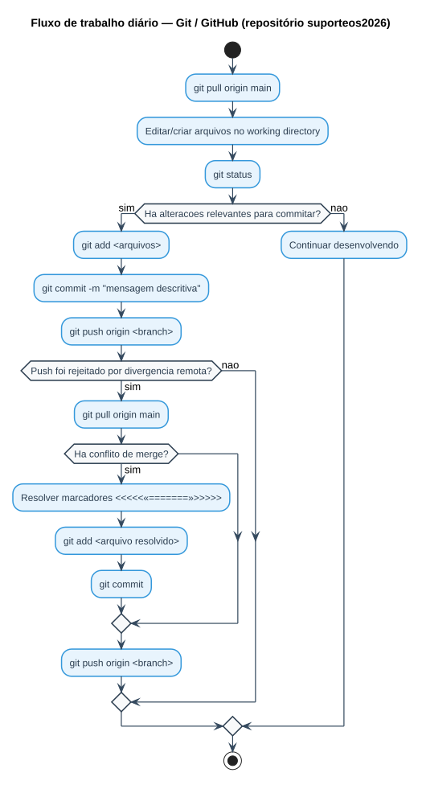
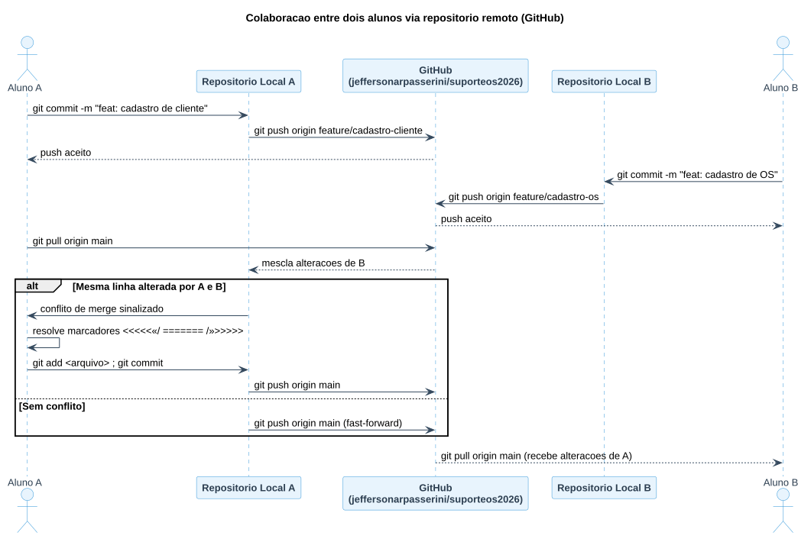

# Aula — Controle de Versão com Git e GitHub (Repositório Oficial `suporteos2026`)

> **Professor:** Jefferson Passerini
> **Disciplina:** Laboratório de Programação IV (4º Semestre)
> **Tema:** Fundamentos de controle de versão distribuído com Git e colaboração via GitHub, a partir do repositório oficial de apoio da disciplina
> **Data de postagem do material original:** 13/08/2026

## Nota sobre a fonte deste material

O material postado pelo professor para esta aula consiste no anúncio do **repositório oficial de apoio da disciplina**, publicado em 13/08/2026: [`jeffersonarpasserini/suporteos2026`](https://github.com/jeffersonarpasserini/suporteos2026) (arquivos originais preservados nesta pasta: [`2026-08-13 - Repositorio GitHub suporteos2026.md`](./2026-08-13%20-%20Repositorio%20GitHub%20suporteos2026.md) e [`links-recursos.md`](./links-recursos.md)). Não há, até o momento, slides, roteiros de aula ou apostilas locais além desse link — o conteúdo técnico completo (padrões de código, exercícios, arquitetura do sistema de Ordens de Serviço) vive no próprio repositório remoto `suporteos2026`, fora deste acervo local.

Este `detalhes.md` desenvolve a teoria de **Git e GitHub** — o pré-requisito técnico explícito e imediato indicado pelo professor para acompanhar a disciplina — com base em conhecimento consolidado e verificável sobre a ferramenta, não em conteúdo específico do repositório (que não foi clonado/inspecionado neste acervo). Sempre que a disciplina avançar com novos materiais publicados localmente (slides, roteiros, exercícios), este documento deve ser expandido.

## Objetivo da aula

Compreender o funcionamento do Git como sistema de controle de versão distribuído e operar o fluxo básico de colaboração via GitHub — clonar, registrar alterações, sincronizar com o repositório remoto e resolver conflitos — usando como base prática o repositório oficial da disciplina, `jeffersonarpasserini/suporteos2026`.

## Por que controle de versão?

Em qualquer projeto de software com mais de um colaborador (ou mais de uma sessão de trabalho), surgem três problemas que um sistema de controle de versão resolve:

- **Histórico** — recuperar qualquer versão anterior de qualquer arquivo, saber quem alterou o quê e quando.
- **Colaboração** — permitir que várias pessoas modifiquem o mesmo projeto sem sobrescrever o trabalho umas das outras.
- **Segurança** — manter uma cópia remota (backup) do código, independente da máquina local.

O **Git** é o sistema de controle de versão distribuído mais usado da indústria; o **GitHub** é uma plataforma de hospedagem que armazena repositórios Git na nuvem e adiciona recursos de colaboração (Issues, Pull Requests, revisão de código).

## Os três estados de um arquivo no Git

Todo arquivo dentro de um repositório Git local transita entre três áreas:

| Área | O que significa | Comando que move o arquivo para cá |
| :--- | :--- | :--- |
| **Working Directory** (diretório de trabalho) | Arquivos como estão fisicamente no disco, editados livremente. | Editar o arquivo normalmente. |
| **Staging Area** / Índice | Zona de preparação: alterações marcadas para entrar no próximo commit. | `git add <arquivo>` |
| **Repository** (repositório local) | Histórico permanente de commits, gravado em `.git/`. | `git commit -m "mensagem"` |

Só depois de um `git push`, o conteúdo do repositório local é sincronizado com o **repositório remoto** (no caso da disciplina, o GitHub, em `jeffersonarpasserini/suporteos2026`).

## Comandos essenciais

```bash
# Clonar o repositório oficial da disciplina para a máquina local
git clone https://github.com/jeffersonarpasserini/suporteos2026.git

# Ver o estado atual: arquivos modificados, staged e não rastreados
git status

# Mover alterações para a staging area
git add nome-do-arquivo.ts
git add .                      # todos os arquivos modificados/novos

# Registrar um commit com mensagem descritiva
git commit -m "feat: implementa cadastro de Ordem de Servico"

# Enviar os commits locais para o repositório remoto (origin)
git push origin main

# Baixar e mesclar as atualizações mais recentes do remoto
git pull origin main

# Criar e mudar para uma nova branch de funcionalidade
git checkout -b feature/nome-sobrenome

# Ver o histórico de commits
git log --oneline --graph

# Comparar duas versões / dois commits
git diff <hash_anterior> <hash_atual>
```

### Fluxo de trabalho típico (dia a dia de laboratório)

O diagrama abaixo resume o ciclo completo que um estudante repete a cada sessão prática, desde a sincronização inicial até o envio do trabalho:



1. **Sincronizar** — `git pull` antes de começar a programar, para trabalhar sobre a versão mais recente.
2. **Desenvolver** — editar/criar arquivos no *working directory*.
3. **Inspecionar** — `git status` para ver o que mudou.
4. **Preparar** — `git add` das alterações relevantes.
5. **Registrar** — `git commit -m "mensagem clara"`.
6. **Publicar** — `git push` para enviar ao GitHub.

### Colaboração entre dois desenvolvedores via repositório remoto

Quando duas pessoas trabalham no mesmo repositório (`suporteos2026` ou um fork dele), a sincronização acontece sempre através do remoto — nunca diretamente entre as máquinas locais:



Se os dois alunos alterarem a **mesma linha** de um arquivo antes de sincronizar, o segundo `git pull`/`git push` resulta em **conflito de merge** — o Git não consegue decidir sozinho qual versão manter.

## Resolvendo um conflito de merge

Quando o Git não consegue mesclar automaticamente, ele marca o trecho conflitante diretamente no arquivo:

```text
<<<<<<< HEAD
const status = "ABERTA";
=======
const status = "PENDENTE";
>>>>>>> origin/main
```

Passos para resolver:

1. Abrir o arquivo e localizar os marcadores `<<<<<<<`, `=======`, `>>>>>>>`.
2. Decidir manualmente qual trecho (ou combinação dos dois) deve permanecer.
3. Apagar os marcadores de conflito.
4. `git add <arquivo>` para marcar o conflito como resolvido.
5. `git commit -m "resolve conflito de merge em <contexto>"`.

## Branches: trabalhando em paralelo sem quebrar o `main`

Uma **branch** é uma linha independente de desenvolvimento. A prática recomendada em laboratório é nunca editar diretamente a branch principal (`main`):

```bash
git checkout -b feature/cadastro-cliente   # cria e muda para a nova branch
# ... edições e commits na branch ...
git push origin feature/cadastro-cliente   # publica a branch no remoto
git checkout main
git merge feature/cadastro-cliente         # incorpora as mudanças ao main
```

## O papel do `.gitignore`

Arquivos temporários, binários compilados, dependências (`node_modules/`, `bin/`, `obj/`) e configurações locais não devem ser versionados — eles inflam o repositório e geram conflitos desnecessários. O arquivo `.gitignore`, na raiz do projeto, lista padrões de arquivos/pastas que o Git deve ignorar em `git status` e `git add`:

```text
node_modules/
bin/
obj/
*.log
.env
```

## Exercícios de fixação

**1.** Você acabou de clonar o repositório `jeffersonarpasserini/suporteos2026`. Qual comando usa?

> **Gabarito:** `git clone https://github.com/jeffersonarpasserini/suporteos2026.git`

**2.** Depois de editar dois arquivos, você quer ver exatamente quais foram modificados antes de decidir o que preparar para o commit. Qual comando?

> **Gabarito:** `git status` — lista arquivos modificados, staged e não rastreados, sem alterar nada.

**3.** Explique a diferença entre `git add` e `git commit`.

> **Gabarito:** `git add` move as alterações do *working directory* para a *staging area* (apenas seleciona o que entrará no próximo commit, sem gravar histórico). `git commit` grava permanentemente no histórico local o conteúdo que está na *staging area*, junto de uma mensagem descritiva.

**4.** Dois colegas alteraram a mesma linha do mesmo arquivo em branches diferentes. Ao tentar `git merge`, o Git aponta um conflito. Descreva o procedimento de resolução.

> **Gabarito:** Abrir o arquivo, localizar os marcadores `<<<<<<<`/`=======`/`>>>>>>>`, decidir manualmente qual conteúdo manter, remover os marcadores, `git add <arquivo>` e `git commit` para finalizar o merge.

**5.** Por que não se deve versionar a pasta `node_modules/` em um projeto Node.js/TypeScript como os usados na disciplina?

> **Gabarito:** É uma pasta de dependências reconstruível a partir do `package.json`/`package-lock.json` via `npm install`; versioná-la infla o repositório com milhares de arquivos de terceiros e gera conflitos desnecessários entre máquinas. A solução é listá-la no `.gitignore`.

**6.** Qual comando cria uma nova branch chamada `feature/relatorio-os` e já muda o *working directory* para ela?

> **Gabarito:** `git checkout -b feature/relatorio-os` (equivalente moderno: `git switch -c feature/relatorio-os`).

**7.** Depois de um `git commit` local, o que falta para que as alterações apareçam no GitHub para os colegas?

> **Gabarito:** `git push origin <nome-da-branch>` — o commit só existe localmente até ser enviado ao repositório remoto.
