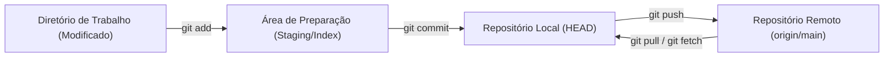
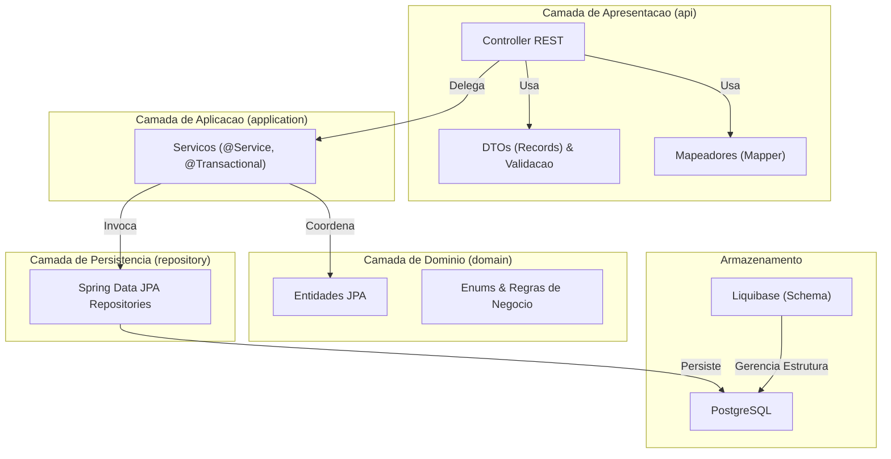
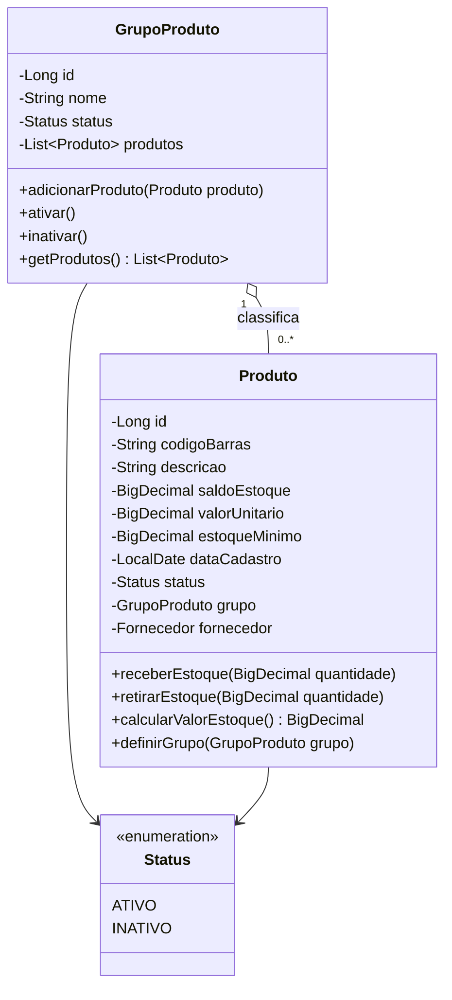
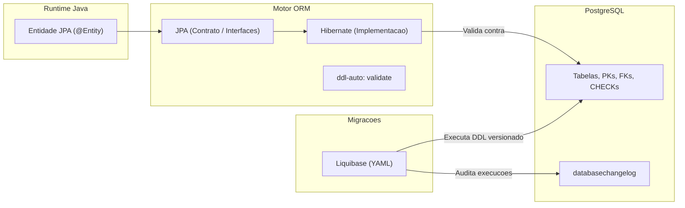
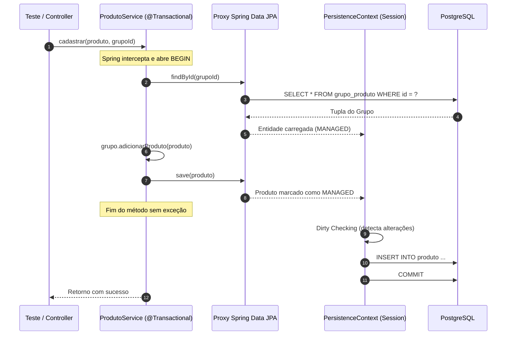
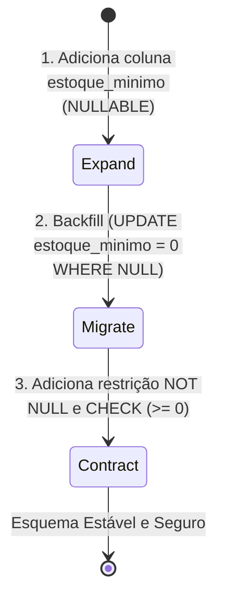
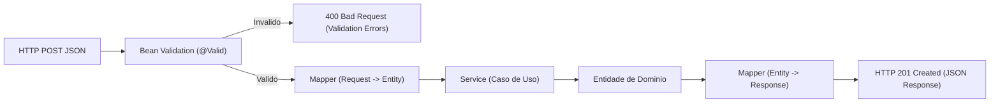
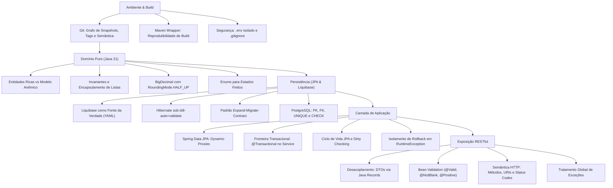

# Trabalho — 20260917 - Avaliação 1

> **Professor:** Jefferson Passerini
> **Disciplina:** Laboratório de Programação IV (4º Semestre)
> **Prazo de Entrega:** 17/09/2026 às 23:59
> **Pontuação Máxima:** 100 pontos
> **Conteúdo cobrado:** [Aula 00 - GitHub e Início do Projeto Spring Boot](../../Aulas/Aula%2000%20-%20GitHub%20e%20In%C3%ADcio%20do%20Projeto%20Spring%20Boot/detalhes.md), [Aula 01 - Configuração de Ambiente Java Spring Boot](../../Aulas/Aula%2001%20-%20Configura%C3%A7%C3%A3o%20de%20Ambiente%20Java%20Spring%20Boot/detalhes.md), [Aula 02 - Spring Boot Criacao do Projeto e Fundamentos REST](../../Aulas/Aula%2002%20-%20Spring%20Boot%20Criacao%20do%20Projeto%20e%20Fundamentos%20REST/detalhes.md), [Aula 03 - Modelagem de Domínio com Java Puro](../../Aulas/Aula%2003%20-%20Modelagem%20de%20Dom%C3%ADnio%20com%20Java%20Puro/detalhes.md), [Aula 04 - Persistência com JPA PostgreSQL e Liquibase](../../Aulas/Aula%2004%20-%20Persist%C3%AAncia%20com%20JPA%20PostgreSQL%20e%20Liquibase/detalhes.md), [Aula 05 - Spring Data JPA Repositórios Serviços Transações](../../Aulas/Aula%2005%20-%20Spring%20Data%20JPA%20Reposit%C3%B3rios%20Servi%C3%A7os%20Transa%C3%A7%C3%B5es/detalhes.md), [Aula 06 - Evolução do Modelo e Changelogs Assistidos](../../Aulas/Aula%2006%20-%20Evolu%C3%A7%C3%A3o%20do%20Modelo%20e%20Changelogs%20Assistidos/detalhes.md), [Aula 07 - API REST DTOs Mapeadores e Postman](../../Aulas/Aula%2007%20-%20API%20REST%20DTOs%20Mapeadores%20e%20Postman/detalhes.md)

---

## Sumário

- [Enunciado original (Google Classroom)](#enunciado-original-google-classroom)
- [Análise do que é pedido](#análise-do-que-é-pedido)
- [Fundamentação teórica](#fundamentação-teórica)
  - [1. Controle de versão e reprodutibilidade](#1-controle-de-versão-e-reprodutibilidade)
  - [2. Arquitetura em camadas e separação de responsabilidades](#2-arquitetura-em-camadas-e-separação-de-responsabilidades)
  - [3. Modelagem de domínio rico em Java puro](#3-modelagem-de-domínio-rico-em-java-puro)
  - [4. Persistência relacional, ORM e migrações versionadas](#4-persistência-relacional-orm-e-migrações-versionadas)
  - [5. Gerenciamento transacional e Spring Data JPA](#5-gerenciamento-transacional-e-spring-data-jpa)
  - [6. Evolução segura de banco com Liquibase](#6-evolução-segura-de-banco-com-liquibase)
  - [7. Camada Web RESTful, DTOs e validação declarativa](#7-camada-web-restful-dtos-e-validação-declarativa)
- [Resolução proposta](#resolução-proposta)
  - [Parte 1: Resolução das questões teóricas oficiais da Aula 05](#parte-1-resolução-das-questões-teóricas-oficiais-da-aula-05)
  - [Parte 2: Atividade de transferência da Aula 05 - Repositórios, serviços e rollback](#parte-2-atividade-de-transferência-da-aula-05---repositórios-serviços-e-rollback)
  - [Parte 3: Atividade de transferência da Aula 06 - Migração segura com Liquibase](#parte-3-atividade-de-transferência-da-aula-06---migração-segura-com-liquibase)
  - [Parte 4: Simulado prático completo A1](#parte-4-simulado-prático-completo-a1)
- [Como testar e validar](#como-testar-e-validar)
- [Critérios de qualidade](#critérios-de-qualidade)
- [Arquivos de apoio](#arquivos-de-apoio)
- [Mapa da atividade](#mapa-da-atividade)
- [Glossário](#glossário)
- [Pontos-chave para a prova](#pontos-chave-para-a-prova)
- [Perguntas e respostas (JSONL)](#perguntas-e-respostas-jsonl)
- [Checklist de revisão](#checklist-de-revisão)

---

## Enunciado original (Google Classroom)

> **Aviso Importante de Transparência:**
> O item da atividade "20260917 - Avaliação 1" registrado no Google Classroom não possui descrição ou enunciado textual publicado pelo docente. A data de 17/09/2026 marca a realização da primeira avaliação formal (A1) da disciplina.
>
> Por conseguinte, este documento **não inventa um enunciado oficial**, mas atua como um **Guia Completo de Preparação e Simulado Técnico Resolvido**, cobrindo com exaustão metodológica todo o conteúdo ministrado nas Aulas 00 a 07 da disciplina e praticado no repositório de referência `suporteos2026`.

---

## Análise do que é pedido

### Requisitos fundamentais avaliados
Com base na progressão curricular desenvolvida pelo Prof. Jefferson Passerini entre as Aulas 00 e 07, o estudante do 4º semestre de Sistemas de Informação deve dominar a cadeia completa de desenvolvimento backend com Spring Boot 3 e Java 21:

1. **Gestão de Configuração e Build:** Operação de Git (commits lógicos, tags semânticas, `.gitignore` seguro) e automação com Maven Wrapper (`mvnw`), garantindo portabilidade entre SOs sem versionamento de binários ou variáveis sensíveis (`.env`).
2. **Design de Software e Domínio Rico:** Modelagem de entidades orientadas a objetos puras (POJOs), rejeitando o modelo anêmico. Proteção rígida de invariantes, encapsulamento de coleções, uso de tipos imutáveis para grandezas monetárias (`BigDecimal`) e enums para estados finitos.
3. **Persistência Relacional Segura:** Mapeamento Objeto-Relacional (JPA/Hibernate) desacoplado do ciclo de criação estrutural do banco. O Liquibase atua como única fonte de verdade estrutural do PostgreSQL, enquanto o Hibernate opera sob `ddl-auto=validate`.
4. **Camada de Aplicação e Transações:** Implementação do padrão Repository via proxies do Spring Data JPA, serviços com injeção de dependência via construtor e delimitação transacional explícita (`@Transactional`), garantindo dirty checking e rollback atômico sob falhas.
5. **Evolução de Esquema sem Perda de Dados:** Aplicação do padrão Expand-Migrate-Contract para adições de colunas obrigatórias (`NOT NULL`) com dados pré-existentes via scripts Liquibase incrementais auditados.
6. **Exposição de API RESTful:** Projeto de endpoints HTTP semânticos (recursos no plural, métodos apropriados, códigos de status precisos), uso de Java Records para DTOs imutáveis, Bean Validation (`jakarta.validation.*`), mappers dedicados e tratamento global de exceções.

### Entregáveis esperados no projeto temático
- Código-fonte completo do projeto individual organizado em arquitetura de camadas (`domain`, `repository`, `application`, `api`).
- Scripts de migração versionados em YAML (`db.changelog-master.yaml` e changelogs atômicos).
- Arquivo `.env.example` documentando os parâmetros de conexão exigidos pelos profiles `dev` e `test`.
- Bateria de testes unitários e de integração validando casos felizes e cenários de exceção com rollback.

---

## Fundamentação teórica

### 1. Controle de versão e reprodutibilidade

O desenvolvimento corporativo exige rastreabilidade estrita. O Git opera sobre um grafo acíclico dirigido (DAG) de snapshots criptograficamente indexados por hashes SHA.



- **Definição:** O versionamento registra mudanças atômicas associadas a metadados (autor, timestamp, mensagem, nós pais). Tags representam marcos imutáveis no grafo (ex: `aula-05-repositories-servicos-transacoes`).
- **Motivação:** Isolar a introdução de regressões, permitir reversões pontuais e garantir que qualquer membro da equipe ou pipeline de CI/CD reproduza o estado do artefato.
- **Exemplo:** Uso do Maven Wrapper (`./mvnw clean test`), que baixa a versão exata do Maven definida no projeto (`.mvn/wrapper/maven-wrapper.properties`), evitando discrepâncias entre versões globais da máquina do desenvolvedor.
- **Contraexemplo:** Executar comandos diretamente com o Maven global (`mvn test`) sem uniformização de versão, ou versionar pastas de build (`target/`) e arquivos específicos de IDE (`.idea/`, `.vscode/`).
- **Armadilhas:** Versionar segredos de banco de dados ou arquivos `.env`. O arquivo `.gitignore` deve conter `.env`, enquanto `.env.example` deve ser mantido como gabarito público sem credenciais reais.

### 2. Arquitetura em camadas e separação de responsabilidades

A separação lógica impede o acoplamento cruzado entre protocolos de transporte, lógica negocial e mecanismos de persistência.



- **Definição:** Cada camada possui escopo fechado. A camada de API manipula JSON e HTTP; a de aplicação orquestra os fluxos e transações; o domínio contém regras puras; e os repositórios intermediam o banco de dados.
- **Motivação:** Manutenibilidade e testabilidade. Se o banco migrar ou a API mudar de REST para gRPC, a lógica de negócio do domínio permanece inalterada.
- **Exemplo:** O Controller recebe `ProdutoRequest`, valida via Bean Validation, usa `ProdutoMapper` para gerar a entidade `Produto`, chama `ProdutoService.cadastrar(produto, grupoId)` e retorna `ProdutoResponse`.
- **Contraexemplo:** O Controller injetar diretamente o `ProdutoRepository`, executar `repository.save()` ou abrir transações com regras negociais em métodos web.
- **Armadilhas:** Fazer a camada de aplicação ou domínio importar anotações de API, como `@ResponseStatus` ou classes de `jakarta.servlet.*`.

### 3. Modelagem de domínio rico em Java puro

No modelo de domínio rico (Rich Domain Model), a entidade reúne estado e comportamento, assegurando que o objeto nunca entre em estado inválido.



- **Definição:** Entidades possuem identidade própria persistente ao longo do tempo. Invariantes são condições lógicas que devem ser obrigatoriamente verdadeiras para o objeto existir (ex: saldo não negativo, descrição não nula).
- **Motivação:** Centralizar regras no objeto. Setters públicos indiscriminados transformam a entidade em um saco anêmico de dados (Anemic Domain Model), espalhando verificações `if` por toda a base de código.
- **Exemplo:** Para operações monetárias ou contagem fracionária de estoque, utilizar `BigDecimal` inicializado com `String` e políticas de arredondamento explícitas:
  ```java
  public BigDecimal calcularValorEstoque() {
      return this.saldoEstoque.multiply(this.valorUnitario).setScale(2, RoundingMode.HALF_UP);
  }
  ```
- **Contraexemplo:** Utilizar tipos primitivos de ponto flutuante `double` ou `float` para cálculos financeiros, acarretando imprecisões binárias de representação (ex: `0.1 + 0.2 = 0.30000000000000004`).
- **Armadilhas:** Expor referências mutáveis de coleções internas. Ao disponibilizar `getProdutos()`, retornar `Collections.unmodifiableList(this.produtos)` para impedir adições externas sem passar por `adicionarProduto()`.

### 4. Persistência relacional, ORM e migrações versionadas

O mapeamento objeto-relacional reconcilia a discrepância conceitual entre o paradigma orientado a objetos (grafos, herança, referências bidirecionais) e o modelo relacional (tabelas, tuplas, chaves primárias e estrangeiras).



- **Definição:** JPA é a especificação padrão do Java para persistência; Hibernate é a implementação de referência; Liquibase é o motor de controle de versão de esquema independente de código.
- **Motivação:** Permitir que bancos de teste, desenvolvimento e produção evoluam deterministicamente sem alterações manuais por DBA ou desenvolvedor.
- **Exemplo:** Configurar `spring.jpa.hibernate.ddl-auto=validate`. O Liquibase cria as tabelas e constraints; o Hibernate apenas valida na inicialização se o código Java bate perfeitamente com o banco.
- **Contraexemplo:** Usar `ddl-auto=update` ou `ddl-auto=create-drop` em ambientes compartilhados. O Hibernate pode alterar colunas de forma destrutiva ou falhar silenciosamente ao criar constraints avançadas.
- **Armadilhas:** Alterar o conteúdo de um `changeSet` do Liquibase que já foi executado em outro computador. O Liquibase armazena o checksum SHA-256 em `databasechangelog` e abortará a inicialização caso o arquivo seja modificado retroativamente.

### 5. Gerenciamento transacional e Spring Data JPA

No Spring, interfaces que herdam de `JpaRepository<T, ID>` são instanciadas dinamicamente via Java Dynamic Proxies durante o bootstrap do Spring Context.



- **Definição:** Uma transação delimita uma unidade atômica de trabalho (propriedades ACID). Estados da entidade:
  - `transient`: Objeto instanciado via `new`, sem identificador e sem vínculo com o `EntityManager`.
  - `managed`: Acompanhado ativamente pelo contexto de persistência. Alterações em seus atributos são sincronizadas automaticamente no banco (Dirty Checking) sem necessidade de chamar `save()`.
  - `detached`: Possui chave primária, mas a transação que o gerenciava encerrou.
  - `removed`: Marcado para deleção relacional no encerramento da transação.
- **Motivação:** A fronteira transacional (`@Transactional`) deve residir na **camada de serviço**, pois um caso de uso frequentemente abrange múltiplos passos lógicos (ex: verificar duplicidade, buscar grupo, debitar estoque, gravar auditoria). Se o repository delimitasse a transação, cada método abriria e fecharia transações isoladas, impossibilitando rollback conjunto em caso de falha no segundo passo.
- **Exemplo:** Lançar uma subclasse de `RuntimeException` (ex: `RecursoNaoEncontradoException`) dentro de um método `@Transactional` força o Spring a emitir `ROLLBACK` para o banco de dados.
- **Contraexemplo:** Capturar a exceção com bloco `try/catch` genérico dentro do Service e abafar o erro sem relançá-lo ou sem marcar `TransactionAspectSupport.currentTransactionStatus().setRollbackOnly()`. O Spring considerará a execução normal e executará `COMMIT`.
- **Armadilhas:** Chamar um método anotado com `@Transactional` a partir de outro método da **mesma classe** (`this.metodoB()`). Por padrão, os proxies do Spring interceptam apenas chamadas que cruzam a fronteira externa do bean; chamadas internas ignoram o proxy e não iniciam transação.

### 6. Evolução segura de banco com Liquibase

Modificar esquemas em produção com dados vivos exige técnicas de evolução contínua sem interrupção de serviço.



- **Definição:** O padrão **Expand-Migrate-Contract** consiste em quebrar uma alteração de esquema estruturalmente arriscada em fases não bloqueantes.
- **Motivação:** Tentar adicionar uma coluna `NOT NULL` sem valor padrão em uma tabela que já possui milhões de registros causa falha imediata de integridade no SGBD (`column contains null values`).
- **Exemplo:** Dividir a evolução em três `changeSets` atômicos no arquivo YAML:
  1. `addColumn`: Cria a coluna permitindo valores nulos.
  2. `update`: Executa o backfill de dados preenchendo as tuplas existentes com o valor padrão de negócio.
  3. `addNotNullConstraint`: Torna a coluna formalmente obrigatória e adiciona `addCheckConstraint` validando regras relacionais.
- **Contraexemplo:** Utilizar ferramentas de diff automatizado e aplicar cegamente o arquivo produzido no banco principal sem inspeção manual. Diffs automáticos frequentemente descartam constraints com nomes customizados ou geram `dropForeignKeyConstraint` indevidamente.
- **Armadilhas:** Apontar o perfil de geração de schema de referência (`application-schema-reference.properties` com `ddl-auto=create`) para o banco de desenvolvimento ou produção, causando a exclusão de todos os dados do projeto.

### 7. Camada Web RESTful, DTOs e validação declarativa

A camada de apresentação atua como barreira de segurança e desacoplamento para a aplicação.



- **Definição:** DTOs (*Data Transfer Objects*) são contratos públicos de dados. No Java moderno, são modelados como `record`, garantindo imutabilidade, construtor canônico e métodos de acesso limpos.
- **Motivação:** A entidade JPA reflete as tabelas do banco e o modelo de domínio. Expô-la diretamente na API acarreta vazamento de dados sensíveis, risco de *mass assignment* (cliente alterando campos que não deveria) e estouro de memória por referências cíclicas infinitas durante a serialização JSON de relacionamentos bidirecionais.
- **Exemplo:**
  ```java
  public record ProdutoRequest(
      @NotBlank(message = "Código de barras é obrigatório")
      @Size(max = 50, message = "Máximo de 50 caracteres")
      String codigoBarras,

      @NotBlank(message = "Descrição é obrigatória")
      String descricao,

      @NotNull(message = "Saldo é obrigatório")
      @PositiveOrZero(message = "Saldo não pode ser negativo")
      BigDecimal saldoEstoque,

      @NotNull(message = "Valor unitário é obrigatório")
      @Positive(message = "Valor unitário deve ser estritamente positivo")
      BigDecimal valorUnitario,

      @NotNull(message = "Grupo é obrigatório")
      Long grupoId
  ) {}
  ```
- **Contraexemplo:** Retornar a classe `@Entity Produto` diretamente no método do Controller ou retornar código de status `200 OK` para criação de novos recursos, em desacordo com a RFC do HTTP.
- **Armadilhas:** Esquecer a anotação `@Valid` antes do argumento `@RequestBody ProdutoRequest request` no Controller. Sem ela, o Spring desserializa o JSON sem executar nenhuma das anotações do Bean Validation, permitindo a entrada de dados inconsistentes na aplicação.

---

## Resolução proposta

Esta seção apresenta as resoluções completas, estruturadas e funcionais para todas as questões teóricas e práticas exigidas na disciplina até o momento da avaliação.

### Parte 1: Resolução das questões teóricas oficiais da Aula 05

Arquivo correspondente: [RevisaoConceitosA1.java](./codigo/RevisaoConceitosA1.java)

#### 1. Quem implementa uma interface JpaRepository em tempo de execução e como esse mecanismo funciona?
**Resposta Técnica:**
Em tempo de execução, quem implementa a interface é o **Spring Data JPA** por meio de **Java Dynamic Proxies** (ou CGLIB). Durante o bootstrap do contexto da aplicação, o framework faz o escaneamento dos pacotes à procura de interfaces derivadas de `Repository`. Para cada interface localizada, o Spring instancia uma classe proxy intermediária que intercepta todas as invocações de método e delega as operações genéricas de persistência (como `save`, `findById`, `deleteById`) para uma implementação concreta padrão, historicamente a classe `SimpleJpaRepository<T, ID>`. Esta classe, por sua vez, injeta e utiliza o `EntityManager` do JPA para emitir os comandos JPQL/SQL adequados ao driver do banco.

#### 2. Por que o serviço (Service) deve definir a fronteira transacional (@Transactional) e não o Repository ou o Controller?
**Resposta Técnica:**
A fronteira transacional deve residir na **camada de serviço** porque uma transação lógica deve englobar a execução de um **caso de uso completo**, o qual frequentemente orquestra múltiplas interações com diferentes repositórios e entidades de domínio. 
Se colocássemos `@Transactional` no Repository, cada operação atômica de consulta ou salvamento abriria e fecharia sua própria transação independente. Em caso de falha em uma operação subsequente, seria impossível efetuar o rollback das operações anteriores já commitadas.
Por outro lado, colocar `@Transactional` no Controller é um antipadrão arquitetural severo: acopla regras de persistência ao ciclo de vida da requisição web, estende o tempo de retenção de conexões do pool do banco de dados enquanto recursos de rede e renderização de payloads são processados, e viola o princípio de responsabilidade única.

#### 3. Qual a diferença conceitual e prática entre uma entidade nos estados 'managed' e 'detached' no contexto de persistência JPA?
**Resposta Técnica:**
- **Managed (Gerenciada):** A entidade possui uma chave primária (ID) associada e está vinculada ativamente à sessão corrente do `EntityManager` (Persistence Context). Quaisquer modificações realizadas em seus atributos de estado via métodos de negócio são monitoradas pelo provedor ORM e sincronizadas automaticamente no banco de dados via comandos SQL `UPDATE` no momento do flush da transação.
- **Detached (Desanexada):** A entidade possui um identificador de chave primária persistente no banco de dados, porém a sessão/transação que a carregou foi encerrada (ou a entidade foi explicitamente desanexada via `entityManager.detach()` ou `clear()`). Qualquer alteração realizada em um objeto desanexado não é monitorada pelo JPA e não reflete no banco de dados a menos que seja explicitamente reanexada através do método `entityManager.merge(entidade)`.

#### 4. Por que o mecanismo de Dirty Checking não elimina a necessidade de métodos de negócio expressivos no domínio?
**Resposta Técnica:**
O Dirty Checking é estritamente um **mecanismo de infraestrutura e persistência** responsável por detectar alterações de estado em memória e sincronizá-las via SQL. Ele é agnóstico em relação às regras de negócio da aplicação.
Se o domínio não possuir métodos expressivos (como `receberEstoque(quantidade)` ou `inativar()`) e depender de setters genéricos, o código chamador pode atribuir valores ilegais (como saldo negativo ou quantidades zeradas) diretamente aos atributos. O Dirty Checking persistiria fielmente esse estado corrompido sem qualquer juízo de valor. Logo, métodos de negócio ricos no domínio continuam sendo mandatórios para **validar invariantes, garantir coerência conceitual e expressar a linguagem ubíqua**.

#### 5. Quando uma convenção de consulta derivada por nome de método (derived query) deixa de ser adequada?
**Resposta Técnica:**
As consultas derivadas (`derived queries`) são ideais para filtros simples envolvendo um a três atributos com operadores básicos (como `findByCodigoBarras`, `existsByNomeIgnoreCase`, `findByGrupoIdAndStatus`). 
Elas deixam de ser adequadas quando:
1. A complexidade do predicado gera nomes ilegíveis e propensos a erro de digitação (ex: `findByGrupoNomeIgnoreCaseAndStatusAndDataCadastroAfterOrderByDescricaoAsc`).
2. Há necessidade de junções complexas com projeções parciais (DTO projections) ou queries com agregações pesadas (`GROUP BY`, `HAVING`, subselects).
3. Exigem otimização fina de performance com planos de execução específicos, hints de banco, ou resolução do problema N+1 através de `JOIN FETCH`.
Nesses cenários, deve-se adotar anotações `@Query` com JPQL/HQL explícito, queries nativas SQL ou a Criteria API / Specifications do Spring Data.

#### 6. Por que uma exceção lançada na camada de aplicação/serviço não deve carregar códigos de status HTTP?
**Resposta Técnica:**
A camada de aplicação deve ser **tecnologicamente desacoplada do protocolo de entrega**. Uma classe de serviço representa lógica e casos de uso de negócio que podem ser invocados por múltiplos clientes simultâneos: uma API REST HTTP, um consumidor de filas RabbitMQ/Kafka, uma tarefa agendada em background (`@Scheduled`) ou uma interface de linha de comando (CLI).
Se uma exceção de serviço carregar conceitos HTTP como `404 Not Found` ou `409 Conflict`, ela introduz uma dependência direta e indesejada de infraestrutura web no núcleo do sistema. O correto é lançar exceções semânticas puras de negócio (ex: `RecursoNaoEncontradoException`, `SaldoInsuficienteException`) e deixar a cargo de um interceptador da camada web (como `@RestControllerAdvice`) a responsabilidade de traduzir essas exceções para os respectivos códigos HTTP.

---

### Parte 2: Atividade de transferência da Aula 05 - Repositórios, serviços e rollback

Arquivo correspondente: [SimuladoTransacaoService.java](./codigo/SimuladoTransacaoService.java)

Abaixo, a implementação arquitetural do caso de uso de cadastro de produto coordenado de forma transacional, contendo as proteções de duplicidade e a garantia de rollback atômico:

```java
package com.curso.suporteos.application;

import com.curso.suporteos.domain.GrupoProduto;
import com.curso.suporteos.domain.Produto;
import com.curso.suporteos.repository.GrupoProdutoRepository;
import com.curso.suporteos.repository.ProdutoRepository;
import org.springframework.stereotype.Service;
import org.springframework.transaction.annotation.Transactional;

import java.math.BigDecimal;
import java.util.List;

@Service
public class ProdutoService {

    private final ProdutoRepository produtoRepository;
    private final GrupoProdutoRepository grupoRepository;

    // Injeção de dependência estrita por construtor
    public ProdutoService(ProdutoRepository produtoRepository, GrupoProdutoRepository grupoRepository) {
        this.produtoRepository = produtoRepository;
        this.grupoRepository = grupoRepository;
    }

    @Transactional
    public Produto cadastrar(Produto produto, Long grupoId) {
        // Validação de regra de unicidade de negócio
        if (produtoRepository.existsByCodigoBarras(produto.getCodigoBarras())) {
            throw new RecursoDuplicadoException("Código de barras já cadastrado: " + produto.getCodigoBarras());
        }

        // Validação da existência do agregado pai
        GrupoProduto grupo = grupoRepository.findById(grupoId)
                .orElseThrow(() -> new RecursoNaoEncontradoException("Grupo de produto não localizado com ID: " + grupoId));

        // Estabelece a ligação bidirecional preservando consistência de domínio
        grupo.adicionarProduto(produto);

        // Persiste a entidade no contexto transacional
        return produtoRepository.save(produto);
    }

    @Transactional
    public void movimentarEstoqueEntrada(Long produtoId, BigDecimal quantidade) {
        Produto produto = produtoRepository.findById(produtoId)
                .orElseThrow(() -> new RecursoNaoEncontradoException("Produto não localizado para ID: " + produtoId));

        // Invoca o método do domínio rico. O Hibernate detecta a alteração via Dirty Checking.
        produto.receberEstoque(quantidade);
    }

    @Transactional
    public void cadastrarLoteComFalha(List<Produto> produtos, Long grupoId) {
        for (int i = 0; i < produtos.size(); i++) {
            Produto p = produtos.get(i);
            cadastrar(p, grupoId);
            // Simulação de falha catastrófica após o primeiro item para teste de rollback
            if (i == 1) {
                throw new IllegalStateException("Falha simulada no processamento do lote. Transação deve abortar.");
            }
        }
    }
}
```

---

### Parte 3: Atividade de transferência da Aula 06 - Migração segura com Liquibase

Arquivo correspondente: [exemplos_migracao.sql](./codigo/exemplos_migracao.sql)

O arquivo YAML abaixo exemplifica a aplicação rigorosa do padrão **Expand-Migrate-Contract** para a adição de nova coluna obrigatória (`estoque_minimo`) em tabela que já contém registros:

```yaml
databaseChangeLog:
  - changeSet:
      id: 003-01-add-estoque-minimo-produto-expand
      author: curso-spring-2026
      comment: "Fase 1: Expand - Adiciona a coluna estoque_minimo permitindo NULL"
      changes:
        - addColumn:
            tableName: produto
            columns:
              - column:
                  name: estoque_minimo
                  type: NUMERIC(18, 3)

  - changeSet:
      id: 003-02-fill-estoque-minimo-produto-migrate
      author: curso-spring-2026
      comment: "Fase 2: Migrate - Executa backfill dos dados antigos para valor seguro de negocio (zero)"
      changes:
        - update:
            tableName: produto
            columns:
              - column:
                  name: estoque_minimo
                  valueNumeric: 0
            where: estoque_minimo IS NULL

  - changeSet:
      id: 003-03-not-null-estoque-minimo-produto-contract
      author: curso-spring-2026
      comment: "Fase 3: Contract - Torna a coluna obrigatoria e adiciona CHECK de consistencia relacional"
      changes:
        - addNotNullConstraint:
            tableName: produto
            columnName: estoque_minimo
            columnDataType: NUMERIC(18, 3)
        - addCheckConstraint:
            tableName: produto
            constraintName: chk_produto_estoque_minimo_positivo
            checkCondition: "estoque_minimo >= 0"
```

---

### Parte 4: Simulado prático completo A1

#### Questão 1: Modelagem de domínio rico com invariantes e BigDecimal
Arquivo correspondente: [SimuladoDominioInvariantes.java](./codigo/SimuladoDominioInvariantes.java)

A classe `Produto` abaixo encapsula todas as regras negociais requeridas:

```java
package com.curso.suporteos.domain;

import java.math.BigDecimal;
import java.math.RoundingMode;
import java.time.LocalDate;
import java.util.Objects;

public class Produto {

    private Long id;
    private final String codigoBarras;
    private String descricao;
    private BigDecimal saldoEstoque;
    private BigDecimal valorUnitario;
    private BigDecimal estoqueMinimo;
    private final LocalDate dataCadastro;
    private Status status;
    private GrupoProduto grupo;

    public Produto(String codigoBarras, String descricao, BigDecimal saldoEstoque,
                   BigDecimal valorUnitario, BigDecimal estoqueMinimo, LocalDate dataCadastro) {
        
        if (codigoBarras == null || codigoBarras.trim().isEmpty()) {
            throw new IllegalArgumentException("Código de barras não pode ser nulo ou vazio");
        }
        if (descricao == null || descricao.trim().isEmpty()) {
            throw new IllegalArgumentException("Descrição não pode ser nula ou vazia");
        }
        if (saldoEstoque == null || saldoEstoque.compareTo(BigDecimal.ZERO) < 0) {
            throw new IllegalArgumentException("Saldo de estoque não pode ser nulo ou negativo");
        }
        if (valorUnitario == null || valorUnitario.compareTo(BigDecimal.ZERO) < 0) {
            throw new IllegalArgumentException("Valor unitário não pode ser nulo ou negativo");
        }
        if (estoqueMinimo == null || estoqueMinimo.compareTo(BigDecimal.ZERO) < 0) {
            throw new IllegalArgumentException("Estoque mínimo não pode ser nulo ou negativo");
        }
        if (dataCadastro == null) {
            throw new IllegalArgumentException("Data de cadastro é obrigatória");
        }

        this.codigoBarras = codigoBarras.trim();
        this.descricao = descricao.trim();
        this.saldoEstoque = saldoEstoque;
        this.valorUnitario = valorUnitario;
        this.estoqueMinimo = estoqueMinimo;
        this.dataCadastro = dataCadastro;
        this.status = Status.ATIVO;
    }

    public void receberEstoque(BigDecimal quantidade) {
        if (quantidade == null || quantidade.compareTo(BigDecimal.ZERO) <= 0) {
            throw new IllegalArgumentException("Quantidade a receber deve ser estritamente maior que zero");
        }
        this.saldoEstoque = this.saldoEstoque.add(quantidade);
    }

    public void retirarEstoque(BigDecimal quantidade) {
        if (quantidade == null || quantidade.compareTo(BigDecimal.ZERO) <= 0) {
            throw new IllegalArgumentException("Quantidade a retirar deve ser estritamente maior que zero");
        }
        if (this.saldoEstoque.compareTo(quantidade) < 0) {
            throw new IllegalStateException("Saldo insuficiente para retirada. Disponível: " 
                    + this.saldoEstoque + ", Solicitado: " + quantidade);
        }
        this.saldoEstoque = this.saldoEstoque.subtract(quantidade);
    }

    public BigDecimal calcularValorEstoque() {
        return this.saldoEstoque.multiply(this.valorUnitario).setScale(2, RoundingMode.HALF_UP);
    }

    public void vincularGrupo(GrupoProduto grupo) {
        this.grupo = Objects.requireNonNull(grupo, "Grupo de produto não pode ser nulo");
    }

    // Getters omitidos por brevidade mantendo imutabilidade e integridade
    public String getCodigoBarras() { return codigoBarras; }
    public String getDescricao() { return descricao; }
    public BigDecimal getSaldoEstoque() { return saldoEstoque; }
    public BigDecimal getValorUnitario() { return valorUnitario; }
    public Status getStatus() { return status; }
    public GrupoProduto getGrupo() { return grupo; }
}
```

#### Questão 2: Camada REST, DTOs com Records e Bean Validation
Arquivo correspondente: [SimuladoRestDtoValidacao.java](./codigo/SimuladoRestDtoValidacao.java)

Abaixo, a exposição dos endpoints no Controller, validação automática de entrada e padronização dos códigos de status HTTP:

```java
package com.curso.suporteos.api;

import com.curso.suporteos.application.ProdutoService;
import com.curso.suporteos.domain.Produto;
import jakarta.validation.Valid;
import jakarta.validation.constraints.NotBlank;
import jakarta.validation.constraints.NotNull;
import jakarta.validation.constraints.Positive;
import jakarta.validation.constraints.PositiveOrZero;
import jakarta.validation.constraints.Size;
import org.springframework.http.ResponseEntity;
import org.springframework.web.bind.annotation.*;
import org.springframework.web.util.UriComponentsBuilder;

import java.math.BigDecimal;
import java.net.URI;
import java.time.LocalDate;
import java.util.List;

@RestController
@RequestMapping("/api/produtos")
public class ProdutoController {

    private final ProdutoService produtoService;

    public ProdutoController(ProdutoService produtoService) {
        this.produtoService = produtoService;
    }

    @PostMapping
    public ResponseEntity<ProdutoResponse> cadastrar(@Valid @RequestBody ProdutoRequest request,
                                                     UriComponentsBuilder uriBuilder) {
        
        Produto entidade = new Produto(
                request.codigoBarras(),
                request.descricao(),
                request.saldoEstoque(),
                request.valorUnitario(),
                request.estoqueMinimo(),
                LocalDate.now()
        );

        Produto cadastrado = produtoService.cadastrar(entidade, request.grupoId());
        
        URI uri = uriBuilder.path("/api/produtos/{id}").buildAndExpand(cadastrado.getId()).toUri();
        
        ProdutoResponse response = ProdutoResponse.fromDomain(cadastrado);
        return ResponseEntity.created(uri).body(response);
    }

    @GetMapping("/{id}")
    public ResponseEntity<ProdutoResponse> buscarPorId(@PathVariable Long id) {
        Produto produto = produtoService.buscarPorId(id);
        return ResponseEntity.ok(ProdutoResponse.fromDomain(produto));
    }
}

// DTO de Entrada (Request)
record ProdutoRequest(
        @NotBlank(message = "Código de barras é obrigatório")
        @Size(max = 50, message = "Código de barras deve possuir até 50 caracteres")
        String codigoBarras,

        @NotBlank(message = "Descrição é obrigatória")
        @Size(max = 150, message = "Descrição deve possuir até 150 caracteres")
        String descricao,

        @NotNull(message = "Saldo de estoque é obrigatório")
        @PositiveOrZero(message = "Saldo não pode ser negativo")
        BigDecimal saldoEstoque,

        @NotNull(message = "Valor unitário é obrigatório")
        @Positive(message = "Valor unitário deve ser estritamente positivo")
        BigDecimal valorUnitario,

        @NotNull(message = "Estoque mínimo é obrigatório")
        @PositiveOrZero(message = "Estoque mínimo não pode ser negativo")
        BigDecimal estoqueMinimo,

        @NotNull(message = "Identificador do grupo é obrigatório")
        Long grupoId
) {}

// DTO de Saída (Response)
record ProdutoResponse(
        Long id,
        String codigoBarras,
        String descricao,
        BigDecimal saldoEstoque,
        BigDecimal valorUnitario,
        BigDecimal valorTotalEstoque,
        String status,
        Long grupoId,
        String grupoNome
) {
    public static ProdutoResponse fromDomain(Produto p) {
        return new ProdutoResponse(
                p.getId(),
                p.getCodigoBarras(),
                p.getDescricao(),
                p.getSaldoEstoque(),
                p.getValorUnitario(),
                p.calcularValorEstoque(),
                p.getStatus().name(),
                p.getGrupo().getId(),
                p.getGrupo().getNome()
        );
    }
}
```

---

## Como testar e validar

Para atestar a conformidade técnica integral de cada componente do sistema sem depender de intervenções manuais, utilize os passos abaixo:

### 1. Testes de unidade e integração automatizados
Execute a suíte de testes via Maven Wrapper garantindo que o PostgreSQL de testes esteja em execução:

```bash
# Executa a limpeza e compilação de todas as classes
./mvnw clean compile

# Executa todos os testes unitários de domínio e testes de integração transacionais
./mvnw test
```

### 2. Validação do schema no PostgreSQL via CLI
Conecte-se ao contêiner de banco de dados e confirme a execução dos `changeSets` do Liquibase e as restrições relacionais:

```sql
-- Verificar histórico de migrações aplicadas
SELECT id, author, dateexecuted, orderexecuted, exectype FROM databasechangelog ORDER BY orderexecuted;

-- Inspecionar restrições e integridade de chaves
SELECT conname, contype, conrelid::regclass, pg_get_constraintdef(c.oid)
FROM pg_constraint c
WHERE conrelid = 'produto'::regclass;
```

### 3. Validação dos endpoints REST via Curl

```bash
# 1. Cadastrar um grupo de produtos (Esperado: 201 Created com Header Location)
curl -i -X POST http://localhost:8080/api/grupos-produtos \
  -H "Content-Type: application/json" \
  -d '{"nome": "Hardware e Componentes"}'

# 2. Cadastrar um produto válido (Esperado: 201 Created)
curl -i -X POST http://localhost:8080/api/produtos \
  -H "Content-Type: application/json" \
  -d '{
    "codigoBarras": "7891112223334",
    "descricao": "SSD NVMe 1TB",
    "saldoEstoque": 50,
    "valorUnitario": 450.00,
    "estoqueMinimo": 10,
    "grupoId": 1
  }'

# 3. Teste de Validação de Regra: Tentar cadastrar com saldo negativo (Esperado: 400 Bad Request)
curl -i -X POST http://localhost:8080/api/produtos \
  -H "Content-Type: application/json" \
  -d '{
    "codigoBarras": "7891112223335",
    "descricao": "Memória RAM 16GB",
    "saldoEstoque": -5,
    "valorUnitario": 280.00,
    "estoqueMinimo": 5,
    "grupoId": 1
  }'

# 4. Teste de Validação de Unicidade: Tentar cadastrar mesmo código de barras (Esperado: 409 Conflict)
curl -i -X POST http://localhost:8080/api/produtos \
  -H "Content-Type: application/json" \
  -d '{
    "codigoBarras": "7891112223334",
    "descricao": "SSD NVMe Duplicado",
    "saldoEstoque": 10,
    "valorUnitario": 450.00,
    "estoqueMinimo": 2,
    "grupoId": 1
  }'
```

---

## Critérios de qualidade

Para atingir a pontuação máxima (100 pontos) estabelecida pelo docente, o projeto deve satisfazer aos seguintes critérios objetivos:

| Critério | Peso | Descrição do Padrão Esperado |
|---|---|---|
| **Pureza do Domínio** | 20% | Entidades com métodos ricos de negócio, ausência de setters vazados, invariantes checadas em construtores e uso estrito de `BigDecimal` para cálculos financeiros com arredondamento explícito. |
| **Integridade Relacional** | 20% | Esquema do PostgreSQL governado 100% por migrações Liquibase (`ddl-auto=validate`). Tabelas com PK, FK explícita, índices em chaves naturais e constraints `CHECK` espelhando o domínio. |
| **Fronteira Transacional** | 20% | Anotação `@Transactional` concentrada exclusivamente nos métodos da camada de serviço (`@Service`), garantia de rollback sob exceções de negócio e injeção de dependências por construtor. |
| **API RESTful e DTOs** | 20% | Endpoints semânticos, desacoplamento total de entidades através de DTOs (`record`), uso correto de `@Valid`, retorno de `201 Created` com header `Location` e tradução correta de erros (400, 404, 409). |
| **Governança de Código** | 20% | Commits atômicos no Git, tags das aulas associadas, ausência de segredos ou arquivos `.env` no repositório, e testes automatizados executando com sucesso via Maven Wrapper. |

---

## Arquivos de apoio

Os seguintes arquivos de implementação completa foram produzidos como materiais complementares de estudo:

- [SimuladoDominioInvariantes.java](./codigo/SimuladoDominioInvariantes.java): Implementação integral do domínio rico em Java puro, encapsulamento e cálculos monetários seguros.
- [SimuladoTransacaoService.java](./codigo/SimuladoTransacaoService.java): Implementação da camada de serviço, injeção de repositórios, controle transacional e simulação de rollback.
- [SimuladoRestDtoValidacao.java](./codigo/SimuladoRestDtoValidacao.java): Endpoints REST, Records, Bean Validation e mapeamento bidirecional.
- [RevisaoConceitosA1.java](./codigo/RevisaoConceitosA1.java): Resolução fundamentada de todas as questões conceituais teóricas da Aula 05.
- [exemplos_migracao.sql](./codigo/exemplos_migracao.sql): Scripts SQL puros e YAML do Liquibase demonstrando DDL, DML e o padrão Expand-Migrate-Contract.

---

## Mapa da atividade

O mapa conceitual abaixo sintetiza a cadeia estrutural dominada até a Avaliação A1:



---

## Glossário

| Termo | Definição Técnica |
|---|---|
| **ACID** | Propriedades essenciais de transações de banco de dados: Atomicidade, Consistência, Isolamento e Durabilidade. |
| **Bean Validation** | Especificação padronizada do Java (Jakarta Validation) para aplicar regras declarativas de validação por anotações em classes e atributos. |
| **ChangeSet** | Unidade atômica e versionada de alteração de banco de dados no Liquibase, identificada unicamente pelo trio `id`, `author` e `filePath`. |
| **Checksum** | Hash criptográfico calculado sobre o conteúdo de um `changeSet` pelo Liquibase para garantir que a migração não foi alterada após sua execução. |
| **Derived Query** | Recurso do Spring Data JPA que gera consultas JPQL/SQL automaticamente a partir da convenção semântica do nome do método na interface do repositório. |
| **Dirty Checking** | Mecanismo do Hibernate que compara o estado atual de entidades gerenciadas com o snapshot carregado inicialmente, gerando `UPDATE` automático no commit. |
| **DTO** | *Data Transfer Object*: Padrão arquitetural que transporta dados entre processos ou camadas, desacoplando o contrato de rede da entidade do banco. |
| **Dynamic Proxy** | Objeto gerado em tempo de execução pela JVM que intercepta invocações de métodos em interfaces, viabilizando injeção de dependência e transações no Spring. |
| **Expand-Migrate-Contract**| Metodologia de evolução de banco de dados em etapas (adicionar permissivo -> migrar dados -> adicionar restrições) para evitar indisponibilidade. |
| **Idempotência** | Propriedade de uma operação pela qual múltiplas execuções idênticas produzem exatamente o mesmo efeito de estado pretendido no servidor. |
| **Invariante de Negócio** | Condição ou predicado que deve obrigatoriamente permanecer verdadeiro durante todo o ciclo de vida de um objeto de domínio consistente. |
| **Maven Wrapper** | Conjunto de scripts (`mvnw`, `mvnw.cmd`) que providencia e executa a versão homologada do Maven para o projeto sem exigir instalação global. |
| **Persistence Context** | Cache de primeiro nível gerenciado pelo `EntityManager` do JPA onde instâncias de entidades são monitoradas durante uma transação. |
| **Record** | Recurso introduzido nas versões modernas do Java que declara uma classe imutável concisa para transporte puro de dados estruturados. |

---

## Pontos-chave para a prova

1. **Java Puro no Domínio:** Não use JPA, repositórios ou classes do Spring dentro das classes de domínio puro. As regras de domínio devem poder ser testadas via JUnit sem inicializar o contexto do Spring ou banco de dados.
2. **Uso de BigDecimal:** Sempre construa instâncias de `BigDecimal` com `String` (ex: `new BigDecimal("15.50")`). Nunca utilize o construtor `new BigDecimal(15.50)` ou cálculos com primitivos `double` para valores monetários.
3. **Escopo de @Transactional:** `@Transactional` pertence à **camada de serviço** (`@Service`), nunca ao Controller nem ao Repository. Lembre-se de que métodos anotados com `readOnly = true` sinalizam ao Hibernate otimizações no gerenciamento de memória (não cria snapshots de dirty checking).
4. **Liquibase vs Hibernate:** O Liquibase é a autoridade sobre o esquema do PostgreSQL. A propriedade `spring.jpa.hibernate.ddl-auto` deve ser fixada em `validate` para ambientes reais de teste e desenvolvimento.
5. **DTOs com Record:** Nunca exponha entidades `@Entity` no retorno dos métodos do Controller. Utilize Records para entrada (`ProdutoRequest`) e saída (`ProdutoResponse`), garantindo imutabilidade e proteção contra vazamento de atributos internos.
6. **Bean Validation Obrigatório:** Anotar um DTO com `@NotBlank` ou `@Positive` não surte efeito se o parâmetro no Controller não estiver precedido pela anotação `@Valid`.

---

## Perguntas e respostas (JSONL)

```jsonl
{"pergunta": "Qual a principal diferença entre Git e GitHub?", "resposta": "O Git é um sistema distribuído de controle de versão que opera localmente gravando o histórico em um grafo acíclico, enquanto o GitHub é uma plataforma web que hospeda repositórios remotos e provê ferramentas de colaboração.", "dificuldade": "facil"}
{"pergunta": "Para que serve o Maven Wrapper (mvnw) em um projeto Spring Boot?", "resposta": "O Maven Wrapper garante a reprodutibilidade do build baixando e executando a versão exata do Maven especificada pelo projeto, eliminando divergências entre ambientes locais e de CI/CD.", "dificuldade": "facil"}
{"pergunta": "Por que o cálculo de valores financeiros deve usar BigDecimal e não double?", "resposta": "O tipo double utiliza aritmética de ponto flutuante binário com base na norma IEEE 754, gerando erros de arredondamento e representação inexata em decimais simples, enquanto o BigDecimal provê representação decimal exata com precisão arbitrária.", "dificuldade": "facil"}
{"pergunta": "O que caracteriza uma invariante de negócio em uma entidade de domínio?", "resposta": "Uma invariante é uma condição ou regra de consistência lógica que deve permanecer estritamente verdadeira em qualquer estado válido do objeto, sendo garantida em construtores e métodos de negócio.", "dificuldade": "media"}
{"pergunta": "Qual o perigo arquitetural de utilizar o modelo anêmico (Anemic Domain Model)?", "resposta": "O modelo anêmico transforma entidades em meras estruturas de dados com getters e setters públicos indiscriminados, espalhando regras de validação por serviços e controladores e facilitando a corrupção de estado.", "dificuldade": "media"}
{"pergunta": "Por que devemos configurar ddl-auto=validate ao utilizar o Liquibase como ferramenta de migração?", "resposta": "Porque o Liquibase assume a responsabilidade única pelo versionamento estrutural do banco de dados; o validate assegura que o Hibernate apenas cheque a compatibilidade sem alterar ou destruir tabelas.", "dificuldade": "media"}
{"pergunta": "O que ocorre se um desenvolvedor alterar o conteúdo de um changeSet do Liquibase já executado anteriormente?", "resposta": "O Liquibase detectará uma divergência entre o novo checksum calculado e o checksum registrado na tabela databasechangelog, abortando a inicialização da aplicação com ValidationFailedException.", "dificuldade": "media"}
{"pergunta": "O que é o mecanismo de Dirty Checking no Hibernate/JPA?", "resposta": "É o recurso pelo qual o Hibernate monitora alterações feitas nos atributos de entidades gerenciadas (managed) durante uma transação ativa, emitindo comandos SQL UPDATE automaticamente no encerramento da transação.", "dificuldade": "media"}
{"pergunta": "Por que a anotação @Transactional deve ser posicionada na camada de serviço?", "resposta": "Porque o serviço representa a fronteira do caso de uso, permitindo que múltiplas operações de repositório e regras de negócio sejam coordenadas dentro de uma única unidade atômica com garantia de rollback conjunto.", "dificuldade": "media"}
{"pergunta": "Qual a diferença entre uma entidade JPA no estado transient e no estado managed?", "resposta": "Uma entidade transient foi apenas instanciada em memória e não possui identificador nem monitoramento, enquanto uma managed possui ID associado e é ativamente monitorada pelo contexto de persistência.", "dificuldade": "media"}
{"pergunta": "Em qual situação o método HTTP GET é considerado seguro e idempotente?", "resposta": "Ele é seguro porque sua semântica é estritamente de leitura sem alterar o estado do recurso, e é idempotente porque múltiplas invocações consecutivas produzem o mesmo efeito pretendido no servidor.", "dificuldade": "facil"}
{"pergunta": "Por que o método HTTP POST não é considerado idempotente?", "resposta": "Porque submeter repetidamente a mesma requisição POST de criação pode resultar na geração de múltiplos recursos idênticos no servidor, alterando seu estado a cada chamada.", "dificuldade": "facil"}
{"pergunta": "Por que devemos utilizar Java Records para implementar DTOs na camada de API?", "resposta": "Porque Records fornecem estruturas imutáveis e concisas com construtor canônico, equals, hashCode e getters automáticos, ideais para o transporte seguro de dados que não devem ser modificados.", "dificuldade": "media"}
{"pergunta": "O que ocorre se esquecermos de adicionar a anotação @Valid antes de um DTO anotado no Controller?", "resposta": "O Spring processa o payload JSON e preenche o DTO, porém nenhuma das anotações de validação declarativa (como @NotBlank ou @NotNull) será executada, permitindo dados corrompidos.", "dificuldade": "facil"}
{"pergunta": "O que prescreve o padrão Expand-Migrate-Contract na evolução de esquemas de banco?", "resposta": "Prescreve que uma mudança estrutural com dados existentes ocorra em três etapas: adicionar a nova coluna permitindo nulos, executar o backfill dos dados antigos e finalmente aplicar a constraint NOT NULL.", "dificuldade": "dificil"}
{"pergunta": "Como o Spring Data JPA consegue disponibilizar métodos de repositório sem que escrevamos classes concretas?", "resposta": "O Spring Data gera em tempo de execução implementações dinâmicas via Java Dynamic Proxies, interceptando as chamadas e delegando para classes base de suporte como SimpleJpaRepository.", "dificuldade": "dificil"}
{"pergunta": "Por que exceções de negócio lançadas no serviço não devem carregar status HTTP?", "resposta": "Para preservar o desacoplamento arquitetural da camada de aplicação em relação ao protocolo web, permitindo que a mesma lógica seja consumida por filas, agendadores ou CLIs.", "dificuldade": "dificil"}
{"pergunta": "Qual o código de status HTTP correto para um recurso recém-criado com sucesso via POST?", "resposta": "O código HTTP 201 Created, preferencialmente acompanhado pelo cabeçalho de resposta Location apontando para a URI do novo recurso.", "dificuldade": "facil"}
```

---

## Checklist de revisão

### Gestão de ambiente e Git
- [ ] O arquivo `.gitignore` contém referências explícitas a `.env`, `target/`, `.idea/`, `*.class` e `*.log`.
- [ ] O repositório contém o arquivo `.env.example` com o modelo das variáveis sem expor credenciais reais.
- [ ] O projeto compila e executa com sucesso através do comando `./mvnw clean compile`.
- [ ] As tags de versionamento das aulas (`aula-00` até `aula-07`) estão devidamente fixadas.

### Domínio e regras de negócio
- [ ] As entidades de domínio (`Produto`, `GrupoProduto`, `Fornecedor`) residem no pacote `domain` sem dependências do Spring ou da camada de API.
- [ ] Os construtores validam todos os parâmetros obrigatórios e lançam `IllegalArgumentException` caso estejam inválidos.
- [ ] Todos os valores monetários e saldos de estoque utilizam `BigDecimal` inicializado com representação em texto (`String`).
- [ ] Métodos de cálculo de valor de estoque especificam `RoundingMode.HALF_UP` e fixam a escala em duas casas decimais.
- [ ] Relacionamentos de agregação protegem listas internas retornando `Collections.unmodifiableList()`.

### Banco de dados e Liquibase
- [ ] Os contêineres Docker do PostgreSQL para os ambientes `dev` (porta 5432) e `test` estão ativos e acessíveis.
- [ ] Todas as alterações estruturais são declaradas em changelogs atômicos do Liquibase no diretório `src/main/resources/db/changelog/`.
- [ ] O arquivo `db.changelog-master.yaml` organiza a execução sequencial sem saltos ou edições em changeSets passados.
- [ ] A propriedade `spring.jpa.hibernate.ddl-auto` está configurada como `validate` em todos os perfis de execução.
- [ ] Novas colunas obrigatórias com dados existentes foram implementadas sob o padrão Expand-Migrate-Contract.

### Camada de serviço e persistência
- [ ] As interfaces de repositório estendem `JpaRepository<Entidade, Long>` e usam derived queries apenas para consultas simples.
- [ ] A anotação `@Transactional` está presente exclusivamente nos métodos públicos da camada de serviço (`@Service`).
- [ ] Métodos que realizam apenas consultas utilizam `@Transactional(readOnly = true)`.
- [ ] Exceções semânticas de negócio (subclasses de `RuntimeException`) são lançadas quando entidades não são encontradas ou violam unicidade.
- [ ] Alterações de atributos em entidades gerenciadas contam com o Dirty Checking do Hibernate, sem invocações desnecessárias a `repository.save()`.

### Camada Web e REST
- [ ] Nenhuma classe do pacote `@Entity` é exposta diretamente como parâmetro ou retorno no `@RestController`.
- [ ] DTOs de entrada e saída são implementados como Java `record` no pacote `api.dto`.
- [ ] O DTO de entrada utiliza anotações de validação (`@NotBlank`, `@PositiveOrZero`, `@NotNull`).
- [ ] Os métodos do Controller utilizam `@Valid` antes do parâmetro `@RequestBody`.
- [ ] O endpoint de cadastro responde com status `201 Created` e cabeçalho `Location`.
- [ ] Exceções de aplicação são interceptadas e mapeadas para códigos de status HTTP semânticos (400, 404, 409).
