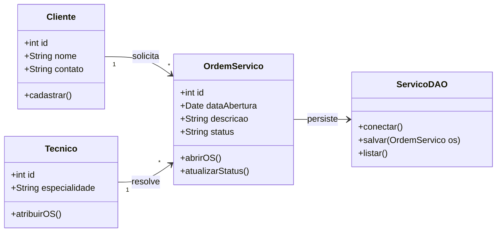

# 🎓 [Prof. Jefferson Passerini] Laboratório de Programação IV
> **Semestre:** 4º Semestre  
> **Curso:** Bacharelado em Sistemas de Informação (UniFEF)  
> **Repositório Oficial de Suporte:** [`jeffersonarpasserini/suporteos2026`](https://github.com/jeffersonarpasserini/suporteos2026)

---

## 🎯 Objetivos de Aprendizagem e Ementa

A disciplina **Laboratório de Programação IV** foi estruturada para consolidar o desenvolvimento de software orientado a objetos avançado, arquitetura de sistemas e implementação de soluções práticas alinhadas às demandas do mercado. No 4º semestre do curso de Sistemas de Informação da UniFEF, o foco transita da lógica básica para a construção de sistemas robustos, escaláveis e focados em resolução de problemas reais, como o gerenciamento de Ordens de Serviço (OS).

Ao longo do semestre, sob a tutela do **Prof. Jefferson Passerini**, os estudantes exercitam a criação de aplicações completas, aplicando padrões de projeto (*Design Patterns*), persistência de dados e boas práticas de versionamento de código com Git e GitHub, tendo como base o repositório oficial de apoio [`jeffersonarpasserini/suporteos2026`](https://github.com/jeffersonarpasserini/suporteos2026).

---

## 🏗️ Arquitetura e Modelagem do Conhecimento

Diagrama estrutural que representa a arquitetura típica dos projetos desenvolvidos na disciplina, tendo como referência o ecossistema de suporte a sistemas de Ordem de Serviço (`suporteos2026`) — detalhamento completo com diagrama de sequência e diagrama do repositório em [`Resumos-IA/README.md`](./Resumos-IA/README.md#️-diagramas-e-modelagem):



---

## 📂 Estrutura das Pastas e Organização

```text
.
├── Aulas/                                     # Notas de aula e recursos postados pelo professor
│   ├── 2026-08-13 - Repositorio GitHub suporteos2026.md
│   └── links-recursos.md
├── Trabalhos/                                 # Atividades avaliativas (ainda sem entregas registradas)
├── Provas/                                    # Avaliações semestrais (ainda sem materiais aplicados)
└── Resumos-IA/                                # Material de apoio gerado por IA — tudo em um único README
    ├── README.md                              # Resumo, exercícios, simulado, cheatsheet e diagramas
    ├── Slides-Revisao-[...] Laboratório de Programação IV.pptx   # Apresentação de revisão (dark mode, 5 slides)
    ├── flashcards-anki.tsv                    # Baralho para importar no Anki
    └── dataset-estudo-qa.jsonl                # Dataset de perguntas e respostas
```

O conteúdo prático principal da disciplina vive fora deste repositório, no projeto oficial de suporte mantido pelo professor: [`jeffersonarpasserini/suporteos2026`](https://github.com/jeffersonarpasserini/suporteos2026). `Trabalhos/` e `Provas/` estão vazias por enquanto — serão preenchidas conforme o professor for postando novas atividades ao longo do semestre.

---

## 🚀 Como Estudar com Este Material

1. **Explore o Repositório Oficial:** [`jeffersonarpasserini/suporteos2026`](https://github.com/jeffersonarpasserini/suporteos2026) é a fonte primária de exercícios e código da disciplina — clone-o e explore sua estrutura.
2. **Consulte o Resumos-IA:** [`Resumos-IA/README.md`](./Resumos-IA/README.md) reúne resumo executivo, exercícios comentados, simulado com gabarito, cheat sheet e diagramas — tudo em um único documento.
3. **Estude com Flashcards:** importe [`Resumos-IA/flashcards-anki.tsv`](./Resumos-IA/flashcards-anki.tsv) no [Anki](https://apps.ankiweb.net/) para fixação por repetição espaçada.
4. **Acompanhe as Aulas:** revise os posts em `Aulas/` para links e recursos oficiais compartilhados pelo Prof. Jefferson Passerini.

---
> *"A prática constante transforma a lógica em inovação."* — Laboratório de Programação IV | UniFEF 2026
