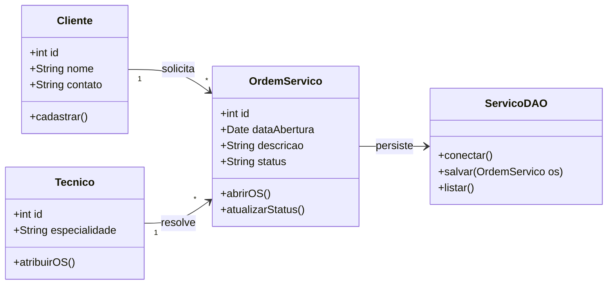

# 🎓 [Prof. Jefferson Passerini] Laboratório de Programação IV
> **Semestre:** 4º Semestre  
> **Curso:** Bacharelado em Sistemas de Informação (UniFEF)  
> **Repositório Oficial de Suporte:** [`jeffersonarpasserini/suporteos2026`](https://github.com/jeffersonarpasserini/suporteos2026)

---

## 🎯 Objetivos de Aprendizagem e Ementa

A disciplina **Laboratório de Programação IV** foi estruturada para consolidar o desenvolvimento de software orientado a objetos avançado, arquitetura de sistemas e implementação de soluções práticas alinhadas às demandas do mercado. No 4º semestre do curso de Sistemas de Informação da UniFEF, o foco transita da lógica básica para a construção de sistemas robustos, escaláveis e focados em resolução de problemas reais, como o gerenciamento de Ordens de Serviço (OS).

Ao longo do semestre, sob a tutela do **Prof. Jefferson Passerini**, os estudantes exercitam a criação de aplicações completas, aplicando padrões de projeto (*Design Patterns*), persistência de dados em banco de dados relacional e não-relacional, além de boas práticas de versionamento de código com Git e GitHub. O laboratório funciona como um ambiente de simulação profissional, preparando o futuro analista e desenvolvedor para cenários corporativos exigentes.

---

## 🏗️ Arquitetura e Modelagem do Conhecimento

Abaixo está o diagrama estrutural que representa a arquitetura típica dos projetos desenvolvidos na disciplina, tendo como referência o ecossistema de suporte a sistemas de Ordem de Serviço (`suporteos2026`):

---

## 📂 Estrutura das Pastas e Organização

O repositório está organizado de forma modular para facilitar a navegação e o aprendizado contínuo:

- **`Aulas/`**: Contém materiais didáticos, slides apresentados em laboratório, roteiros práticos e comunicados oficiais da disciplina.
- **`Trabalhos/`**: Atividades avaliativas propostas ao longo do semestre, acompanhadas de suas respectivas resoluções em código documentado.
- **`Provas/`**: Avaliações semestrais anteriores, gabaritos e critérios de correção adotados pelo docente.
- **`Resumos-IA/`**: Pasta inteligente contendo resumos executivos, simulados comentados, trechos de códigos otimizados, flashcards para o Anki (`.tsv`), *CheatSheets* de consulta rápida e apresentações estruturadas (`PPTX`).
- **`suporteos2026/`**: Espaço dedicado ao acompanhamento do projeto prático oficial da disciplina (`https://github.com/jeffersonarpasserini/suporteos2026`).

---

## 🚀 Como Estudar com Este Material

1. **Prática Ativa no Laboratório:** Não apenas leia os códigos da pasta `Trabalhos/` ou do repositório oficial `suporteos2026`. Clone os projetos, execute-os localmente na sua IDE de preferência e teste modificar regras de negócio para ver o comportamento do sistema.
2. **Utilize os Flashcards (`.tsv`):** Revise os conceitos teóricos de arquitetura de software e programação utilizando a pasta `Resumos-IA/` integrada ao Anki para fixação de longo prazo.
3. **Simule Provas Anteriores:** Antes das avaliações formais, utilize a pasta `Provas/` cronometrando o tempo de resolução para testar seus conhecimentos sob pressão realista.
4. **Acompanhe o Repositório Oficial:** Mantenha-se atualizado acessando periodicamente o [GitHub - suporteos2026](https://github.com/jeffersonarpasserini/suporteos2026) disponibilizado pelo Prof. Jefferson Passerini para acompanhar atualizações de código, branchs de aula e novas *issues*.

---
> *“A prática constante transforma a lógica em inovação.”* — Laboratório de Programação IV | UniFEF 2026