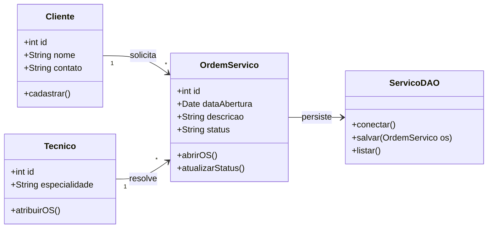
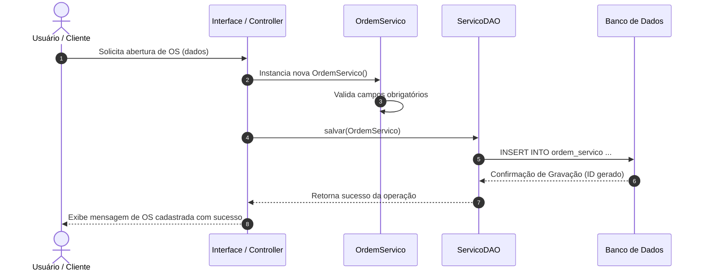
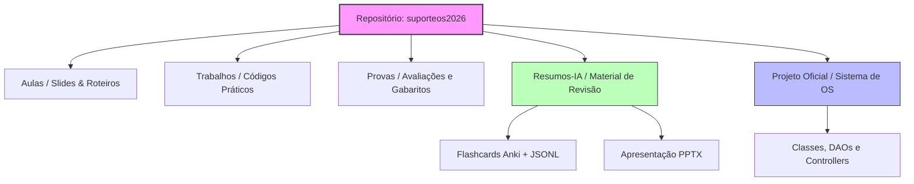

# [Prof. Jefferson Passerini] Laboratório de Programação IV

> **Semestre:** 4º Semestre
> **Curso:** Bacharelado em Sistemas de Informação (UniFEF)
> **Professor:** Jefferson Passerini
> **Repositório Oficial de Suporte:** [`jeffersonarpasserini/suporteos2026`](https://github.com/jeffersonarpasserini/suporteos2026)

---

## Sumário

1. [Objetivos de Aprendizagem e Ementa](#objetivos-de-aprendizagem-e-ementa)
2. [Aulas](#aulas)
3. [Avaliações](#avaliações)
4. [Como Estudar com Este Material](#como-estudar-com-este-material)
5. [Estrutura do Repositório](#estrutura-do-repositório)
6. [Arquitetura e Modelagem do Conhecimento](#arquitetura-e-modelagem-do-conhecimento)
7. [Resumo Executivo](#resumo-executivo)
8. [Exercícios Práticos Implementados](#exercícios-práticos-implementados)
9. [Simulado Comentado](#simulado-comentado)
10. [CheatSheet de Revisão Rápida](#cheatsheet-de-revisão-rápida)
11. [Diagramas e Modelagem](#diagramas-e-modelagem)
12. [Material Complementar (Slides, Flashcards, Dataset)](#material-complementar)

---

## Objetivos de Aprendizagem e Ementa

A disciplina **Laboratório de Programação IV** foi estruturada para consolidar o desenvolvimento de software orientado a objetos avançado, arquitetura de sistemas e implementação de soluções práticas alinhadas às demandas do mercado. No 4º semestre do curso de Sistemas de Informação da UniFEF, o foco transita da lógica básica para a construção de sistemas robustos, escaláveis e focados em resolução de problemas reais, como o gerenciamento de Ordens de Serviço (OS).

Ao longo do semestre, sob a tutela do **Prof. Jefferson Passerini**, os estudantes exercitam a criação de aplicações completas, aplicando padrões de projeto (*Design Patterns*), persistência de dados e boas práticas de versionamento de código com Git e GitHub, tendo como base o repositório oficial de apoio [`jeffersonarpasserini/suporteos2026`](https://github.com/jeffersonarpasserini/suporteos2026).

### Ementa e tópicos principais

1. **Controle de versão com Git e GitHub** — clonagem, staging, commits, branches, merge, resolução de conflitos, colaboração via repositório remoto.
2. **Desenvolvimento orientado a objetos avançado** — aplicação de padrões de projeto (*Design Patterns*) e princípios como SOLID na construção de sistemas.
3. **Arquitetura de sistemas e persistência de dados** — separação de camadas (domínio, serviço, persistência) e modelagem de banco de dados relacional.
4. **Projeto prático** — construção incremental de uma solução real de gerenciamento de Ordens de Serviço (OS), a partir do repositório oficial `suporteos2026`.

> O conteúdo prático e os exercícios específicos de cada módulo vivem no repositório oficial do professor (`suporteos2026`), fora deste acervo local. Este README documenta o material efetivamente publicado localmente até o momento — em especial o pré-requisito de Git/GitHub — e será expandido conforme o professor postar novos materiais.

---

## Aulas

| Aula | Tema | Material |
| :--- | :--- | :--- |
| 1 | Controle de Versão com Git e GitHub (repositório oficial `suporteos2026`) | [Conteúdo completo](Aulas/Controle%20de%20Versao%20com%20Git%20e%20GitHub/detalhes.md) · [Post original](Aulas/Controle%20de%20Versao%20com%20Git%20e%20GitHub/2026-08-13%20-%20Repositorio%20GitHub%20suporteos2026.md) · [Diagrama de atividades — fluxo de trabalho](Aulas/Controle%20de%20Versao%20com%20Git%20e%20GitHub/diagramas/fluxo-trabalho-git.svg) · [Diagrama de sequência — colaboração via GitHub](Aulas/Controle%20de%20Versao%20com%20Git%20e%20GitHub/diagramas/sequencia-colaboracao-github.svg) |

> Até o momento, o professor publicou localmente apenas o anúncio do repositório oficial de apoio. Não há slides, roteiros ou apostilas locais adicionais — o conteúdo técnico de cada módulo de programação (POO avançada, padrões de projeto, persistência) está no repositório remoto `suporteos2026`.

---

## Avaliações

**Não há, até o momento, trabalhos ou provas publicados** nas pastas `Trabalhos/` e `Provas/` — ambas estão vazias. Esta seção será preenchida com uma tabela "Avaliação | Tema | Material" assim que o professor postar a primeira atividade avaliativa, seguindo o mesmo padrão de `detalhes.md` com enunciado real extraído do arquivo original.

---

## Como Estudar com Este Material

1. **Explore o Repositório Oficial:** [`jeffersonarpasserini/suporteos2026`](https://github.com/jeffersonarpasserini/suporteos2026) é a fonte primária de exercícios e código da disciplina — clone-o e explore sua estrutura.
2. **Domine Git e GitHub primeiro:** comece por [`Aulas/Controle de Versao com Git e GitHub/detalhes.md`](Aulas/Controle%20de%20Versao%20com%20Git%20e%20GitHub/detalhes.md) — é o pré-requisito técnico explícito indicado pelo professor para acompanhar as atividades práticas.
3. **Consulte o resumo executivo, simulado e cheatsheet** reunidos mais abaixo neste mesmo documento.
4. **Estude com Flashcards:** importe [`Resumos-IA/flashcards-anki.tsv`](./Resumos-IA/flashcards-anki.tsv) no [Anki](https://apps.ankiweb.net/) para fixação por repetição espaçada.
5. **Acompanhe as Aulas:** revise a pasta `Aulas/` para links e recursos oficiais compartilhados pelo Prof. Jefferson Passerini, conforme novos materiais forem postados.

---

## Estrutura do Repositório

```text
.
├── Aulas/
│   └── Controle de Versao com Git e GitHub/
│       ├── detalhes.md                                   # Conteúdo completo: teoria + comandos + exercícios
│       ├── diagramas/                                     # PlantUML (.puml) + SVG renderizado
│       ├── 2026-08-13 - Repositorio GitHub suporteos2026.md  # Post original do professor
│       └── links-recursos.md                              # Post original do professor
├── Trabalhos/                                             # Atividades avaliativas (ainda sem entregas registradas)
├── Provas/                                                # Avaliações semestrais (ainda sem materiais aplicados)
└── Resumos-IA/                                            # Material de apoio gerado por IA
    ├── Slides-Revisao-[...] Laboratório de Programação IV.pptx   # Apresentação de revisão (dark mode, 5 slides)
    ├── flashcards-anki.tsv                                 # Baralho para importar no Anki
    └── dataset-estudo-qa.jsonl                             # Dataset de perguntas e respostas
```

`Trabalhos/` e `Provas/` estão vazias por enquanto — serão preenchidas conforme o professor for postando novas atividades ao longo do semestre. O conteúdo prático principal da disciplina vive fora deste repositório, no projeto oficial de suporte mantido pelo professor: [`jeffersonarpasserini/suporteos2026`](https://github.com/jeffersonarpasserini/suporteos2026).

---

## Arquitetura e Modelagem do Conhecimento

Diagrama estrutural que representa a arquitetura típica dos projetos desenvolvidos na disciplina, tendo como referência o ecossistema de suporte a sistemas de Ordem de Serviço (`suporteos2026`) — detalhamento adicional com diagrama de sequência e diagrama do repositório na seção [Diagramas e Modelagem](#diagramas-e-modelagem):



> Este modelo de domínio (Cliente / OrdemServico / Tecnico / ServicoDAO) é uma inferência lógica sobre a natureza do projeto prático da disciplina (gerenciamento de Ordens de Serviço), não uma extração literal do código do repositório `suporteos2026` — que não foi clonado/inspecionado neste acervo local. Deve ser validado contra a estrutura real do repositório assim que possível.

---

## Resumo Executivo

> O material oficial disponibilizado pelo professor para esta disciplina é conciso e consiste primariamente em referências ao repositório oficial no GitHub. O resumo abaixo combina as informações explícitas com inferências lógicas sobre a natureza de um "Laboratório de Programação IV" — para um entendimento completo, a exploração direta do repositório `suporteos2026` é indispensável.

### 1. Visão Geral e Objetivos da Matéria

A disciplina de **Laboratório de Programação IV**, ministrada pelo Prof. Jefferson Passerini no 4º semestre do curso de Sistemas de Informação, posiciona-se como uma etapa avançada e eminentemente prática no desenvolvimento das habilidades de programação dos estudantes. A ênfase está na aplicação prática e na resolução de problemas complexos, com forte apoio em ferramentas profissionais de versionamento de código.

**Objetivos inferidos:**
- **Aprofundar Conhecimentos Práticos:** consolidar e expandir as habilidades de codificação e resolução de problemas adquiridas em laboratórios anteriores.
- **Explorar Tópicos Avançados:** aplicar conceitos de programação mais sofisticados — padrões de projeto, arquiteturas de software, desenvolvimento de sistemas.
- **Dominar Ferramentas de Desenvolvimento Modernas:** capacitar os alunos no uso de sistemas de controle de versão (Git/GitHub) para gestão de projetos e colaboração.
- **Desenvolver Habilidades Colaborativas:** promover a prática de desenvolvimento em equipe, simulando ambientes de trabalho reais.

### 2. Conceitos-Chave e Terminologia Fundamental

O conceito mais fundamental e explícito da disciplina é o uso de **GitHub** e **Controle de Versão** — desenvolvido em profundidade em [`Aulas/Controle de Versao com Git e GitHub/detalhes.md`](Aulas/Controle%20de%20Versao%20com%20Git%20e%20GitHub/detalhes.md):

- **GitHub:** plataforma de hospedagem de código-fonte com controle de versão via Git, usada como hub central de materiais, exercícios e submissão de trabalhos. Repositório da disciplina: `jeffersonarpasserini/suporteos2026`.
- **Repositório (Repository):** diretório principal de um projeto, contendo todos os arquivos, o histórico completo de revisões e as ferramentas de colaboração.
- **Controle de Versão:** sistema que registra mudanças em arquivos ao longo do tempo, permitindo recuperar versões específicas. **Git** é o sistema distribuído subjacente ao GitHub.
- **Clonar (Clone):** baixar uma cópia completa de um repositório remoto para a máquina local.
- **Commit:** um "instantâneo" das alterações de código em um determinado momento, com mensagem descritiva.
- **Push / Pull:** enviar commits locais para o repositório remoto / baixar as últimas alterações do remoto.
- **Branch (Ramificação):** linha independente de desenvolvimento, permitindo trabalhar em funcionalidades sem afetar a linha principal.

### 3. Principais Módulos / Tópicos Abordados

**Módulo 1: Fundamentos e Operações com GitHub/Git**
- Configuração do ambiente Git e associação à conta GitHub.
- Clonagem do repositório oficial da disciplina (`jeffersonarpasserini/suporteos2026`).
- Ciclo de vida do desenvolvimento: modificação de arquivos, *staging* (`git add`), `git commit` com mensagens significativas, e sincronização (`git push`/`git pull`).
- Gerenciamento de branches e `git merge`.
- Resolução de conflitos quando múltiplas pessoas modificam a mesma parte do código.
- Uso inferido de *Issues* e *Pull Requests* para rastrear tarefas e propor alterações de código.

**Módulos de Programação Específicos (conteúdo no repositório):** os tópicos avançados que caracterizam o "Laboratório de Programação IV" (POO avançada, estruturas de dados complexas, APIs, testes automatizados etc.) estão detalhados dentro do repositório `suporteos2026`, acompanhados de exemplos de código e exercícios práticos.

### 4. Relações com o Mercado e Prática Profissional

- **Padrão da Indústria:** Git e GitHub são ferramentas onipresentes na indústria de tecnologia — proficiência é requisito básico para desenvolvedores, analistas e engenheiros de software.
- **Colaboração e Trabalho em Equipe:** a disciplina prepara os alunos para integrar equipes de desenvolvimento de forma organizada.
- **Gestão de Projetos e Metodologias Ágeis:** *issues* e *pull requests* se alinham com metodologias ágeis (Scrum, Kanban) amplamente adotadas no mercado.
- **Portfólio Profissional:** os projetos desenvolvidos no repositório servem como portfólio tangível de habilidades — um perfil GitHub ativo é diferencial em processos seletivos.
- **Desenvolvimento Open Source:** familiaridade com GitHub abre portas para participação em projetos de código aberto.

### 5. Dicas de Ouro para Estudo e Provas

1. **Explore o Repositório GitHub Imediatamente:** [`jeffersonarpasserini/suporteos2026`](https://github.com/jeffersonarpasserini/suporteos2026) é a principal fonte de informação — clone-o, explore a estrutura e leia os `README.md`s.
2. **Domine o Git e GitHub:** entenda os comandos básicos (`clone`, `add`, `commit`, `push`, `pull`, `branch`, `merge`) e o fluxo de trabalho no GitHub. Pratique diariamente.
3. **Prática Constante é Fundamental:** sendo um "laboratório", a disciplina exige que você pratique os comandos de Git no dia a dia e explore ativamente o repositório `suporteos2026`, em vez de apenas ler a teoria — a fixação vem da repetição do fluxo `status → add → commit → push`.

---

## Exercícios Práticos Implementados

**Módulo Base:** Configuração de Ambiente, Versionamento e Arquitetura de Projetos Base (`suporteos2026`)

Esta apostila prática foi desenvolvida com base nas diretrizes da disciplina. O foco do laboratório é a consolidação de boas práticas de engenharia de software, controle de versão avançado com Git/GitHub, modelagem de sistemas robustos e implementação de código limpo, utilizando tecnologias padrão da indústria (Java, TypeScript, C, SQL, dependendo do escopo do projeto base).

### Módulo 1 — Configuração do Repositório Oficial e Boas Práticas Git

Ponto de partida para todas as implementações: **[github.com/jeffersonarpasserini/suporteos2026](https://github.com/jeffersonarpasserini/suporteos2026)**. O passo a passo de comandos e o fluxo completo estão em [`Aulas/Controle de Versao com Git e GitHub/detalhes.md`](Aulas/Controle%20de%20Versao%20com%20Git%20e%20GitHub/detalhes.md).

**Diagrama de Fluxo de Trabalho (Git Workflow):**
```text
[Repositório Remoto: suporteos2026]
       ▲                         │
       │ (push)                  │ (clone / pull)
       │                         ▼
[Branch: feature/xxx] ──(merge)──► [Branch: main / local]
```

### Módulo 2 — Implementação Prática e Padrões de Projeto

> Exemplo especulativo, ilustrando o tipo de arquitetura orientada a serviços esperado na disciplina — não é código extraído do repositório `suporteos2026`. Aplicando **Princípios SOLID**, **Separação de Responsabilidades** e comentários linha a linha. Cenário: controle de Ordens de Serviço (OS), alinhado ao contexto do repositório `suporteos2026`.

**Exemplo em TypeScript / Node.js (Arquitetura Orientada a Serviços):**

```typescript
// ==========================================
// ARQUIVO: OrdemServicoService.ts
// Descrição: Serviço responsável pelas regras 
// de negócio de Ordem de Serviço.
// ==========================================

// Importação de interfaces para tipagem estática rigorosa
import { IOrdemServico } from './IOrdemServico';
import { IRepository } from './IRepository';

export class OrdemServicoService {
    
    // Injeção de dependência do repositório de dados para desacoplamento
    constructor(private readonly osRepository: IRepository<IOrdemServico>) {}

    /**
     * Método responsável por abrir uma nova Ordem de Serviço
     * @param dados Objeto contendo os dados iniciais da OS
     * @returns A Ordem de Serviço criada e persistida
     */
    public async criarOrdemServico(dados: Omit<IOrdemServico, 'id' | 'dataCriacao'>): Promise<IOrdemServico> {
        
        // Validação básica de regra de negócio: Descrição obrigatória
        if (!dados.descricao || dados.descricao.trim() === '') {
            throw new Error('A descrição da Ordem de Serviço não pode ser vazia.');
        }

        // Montagem do objeto completo aplicando valores padrão (Data atual e Status Inicial)
        const novaOS: IOrdemServico = {
            id: this.gerarIdUnico(),
            descricao: dados.descricao.trim(),
            status: 'ABERTA',
            dataCriacao: new Date()
        };

        // Persistência dos dados utilizando o repositório injetado
        const osSalva = await this.osRepository.salvar(novaOS);

        // Retorno da entidade persistida
        return osSalva;
    }

    /**
     * Método auxiliar privado para geração de identificador único (Simulação UUID)
     */
    private gerarIdUnico(): string {
        return Math.random().toString(36).substring(2, 9);
    }
}
```

### Módulo 3 — Scripts de Banco de Dados Relacional (SQL)

Estruturação do banco de dados relacional para o backend do sistema de Ordem de Serviço, com integridade referencial e indexação adequada.

```sql
-- =====================================================
-- SCRIPT SQL: Estruturação Inicial do Banco de Dados
-- Disciplina: Laboratório de Programação IV
-- =====================================================

-- Criação da tabela de Clientes
CREATE TABLE clientes (
    id SERIAL PRIMARY KEY,
    nome VARCHAR(150) NOT NULL,
    email VARCHAR(100) UNIQUE NOT NULL,
    telefone VARCHAR(20),
    criado_em TIMESTAMP DEFAULT CURRENT_TIMESTAMP
);

-- Criação da tabela de Ordens de Serviço vinculada a Clientes
CREATE TABLE ordens_servico (
    id SERIAL PRIMARY KEY,
    cliente_id INT NOT NULL,
    descricao TEXT NOT NULL,
    status VARCHAR(30) DEFAULT 'ABERTA', -- ABERTA, EM_ANDAMENTO, CONCLUIDA, CANCELADA
    valor_total NUMERIC(10, 2) DEFAULT 0.00,
    data_abertura TIMESTAMP DEFAULT CURRENT_TIMESTAMP,
    
    -- Definição de Chave Estrangeira com integridade referencial
    CONSTRAINT fk_cliente
        FOREIGN KEY (cliente_id) 
        REFERENCES clientes(id)
        ON DELETE RESTRICT
        ON UPDATE CASCADE
);

-- Criação de índice para otimização de buscas por status e cliente
CREATE INDEX idx_os_status ON ordens_servico(status);
CREATE INDEX idx_os_cliente ON ordens_servico(cliente_id);
```

### Lista de Exercícios Práticos Recomendados

1. **Clonagem e Configuração:** clone o repositório oficial (`https://github.com/jeffersonarpasserini/suporteos2026`) em sua máquina local.
2. **Versionamento:** crie uma branch própria no padrão `feature/nome-sobrenome` para as implementações semanais.
3. **Refatoração:** aplique o princípio da Responsabilidade Única (SRP) nas classes de conexão com o banco de dados fornecidas no esqueleto do repositório.
4. **Testes Unitários:** escreva testes cobrindo o método `criarOrdemServico` demonstrado acima, usando Jest ou framework equivalente da linguagem escolhida em aula.

---

## Simulado Comentado

**Instruções:** este simulado engloba conceitos fundamentais de controle de versão, colaboração via Git/GitHub e gestão de repositórios, tendo como base o repositório oficial da disciplina (`suporteos2026`).

### Parte 1: Questões de Múltipla Escolha

**Questão 1.** No contexto de controle de versão moderno utilizado na disciplina, qual é a principal finalidade de utilizar uma plataforma como o GitHub em comparação ao armazenamento local de código?
- A) Apenas realizar a mineração de dados do código fonte gerado pelos alunos.
- B) Permitir o versionamento remoto, colaboração em equipe, backup em nuvem e rastreabilidade de alterações.
- C) Substituir a necessidade de utilizar compiladores ou interpretadores na máquina local.
- D) Executar o código automaticamente em servidores de produção sem a necessidade de testes.

> **Alternativa Correta: B.** O GitHub atua como repositório remoto baseado em nuvem para o Git, viabilizando trabalho colaborativo simultâneo, backup e histórico detalhado de commits.

**Questão 2.** Ao clonar o repositório oficial da disciplina em sua máquina local, qual comando do Git deve ser utilizado?
- A) `git init`  B) `git push origin main`  C) `git clone https://github.com/jeffersonarpasserini/suporteos2026.git`  D) `git commit -m "Clone repository"`

> **Alternativa Correta: C.** `git clone` baixa uma cópia completa de um repositório remoto (com todo o histórico) para o ambiente local.

**Questão 3.** Após `git add <arquivo>`, em qual área o Git armazena temporariamente as alterações?
- A) Repositório Remoto  B) Diretório de Trabalho  C) Área de Preparação / Índice (*Staging Area*)  D) Lixeira do Sistema Operacional

> **Alternativa Correta: C.** O fluxo do Git tem três estados: *Working Directory*, *Staging Area* (via `git add`) e *Repository* (via `git commit`).

**Questão 4.** Para enviar as alterações locais já comitadas ao repositório remoto no GitHub, qual comando deve ser executado?
- A) `git fetch`  B) `git pull`  C) `git push`  D) `git status`

> **Alternativa Correta: C.** `git push` envia os commits locais para o remoto (`origin`).

**Questão 5.** Para verificar quais arquivos foram modificados, quais estão em *staging* e quais não são rastreados, qual comando deve ser usado?
- A) `git log`  B) `git status`  C) `git diff`  D) `git branch`

> **Alternativa Correta: B.** `git status` mostra o panorama do diretório de trabalho e da área de preparação.

**Questão 6.** O que representa a estrutura `jeffersonarpasserini/suporteos2026`?
- A) Comando de instalação de dependências.  B) Caminho de diretório do Windows.  C) Identificador `usuario/repositorio` no GitHub.  D) Chave de criptografia SSH.

> **Alternativa Correta: C.** A notação `usuario/repositorio` identifica unicamente um projeto no GitHub.

**Questão 7.** Qual é a principal utilidade de um arquivo `.gitignore`?
- A) Ocultar arquivos confidenciais/binários (temporários, logs, dependências) para que não sejam versionados.  B) Ignorar erros de sintaxe na compilação.  C) Bloquear acesso de outros alunos.  D) Configurar cores do terminal.

> **Alternativa Correta: A.** `.gitignore` instrui o Git sobre quais arquivos/pastas ignorar, mantendo o repositório limpo.

**Questão 8.** Para atualizar seu repositório local com as modificações mais recentes enviadas por colegas, qual comando deve ser executado?
- A) `git pull`  B) `git commit`  C) `git push`  D) `git rm`

> **Alternativa Correta: A.** `git pull` busca (*fetch*) e mescla (*merge*) as alterações do remoto com a branch local.

**Questão 9.** O que significa criar um *Commit* com uma mensagem descritiva?
- A) Excluir permanentemente o histórico anterior.  B) Salvar um ponto de restauração documentado do estado atual da *staging area*.  C) Enviar automaticamente o código para produção.  D) Criar uma nova branch.

> **Alternativa Correta: B.** O commit cria um snapshot permanente do projeto, documentado pela mensagem descritiva.

**Questão 10.** Qual alternativa descreve corretamente a relação entre Git e GitHub?
- A) Git é a linguagem usada para criar o GitHub.  B) GitHub é o VCS local; Git é a plataforma em nuvem.  C) Git é o sistema de controle de versão distribuído; GitHub é a plataforma web que hospeda repositórios Git.  D) São softwares concorrentes e incompatíveis.

> **Alternativa Correta: C.** Git roda localmente; GitHub é o serviço de hospedagem web com funcionalidades de colaboração.

### Parte 2: Questões Discursivas e Estudos de Caso

**Estudo de Caso 1 — Inicialização e Primeiro Envio ao Repositório**
*Contexto:* estruturar um novo projeto localmente para integrá-lo ao ecossistema da disciplina no GitHub, do zero até o primeiro `push`.

> **Resposta Modelo:**
> 1. **Inicialização:** `git init` na pasta raiz do projeto (cria a estrutura oculta `.git`).
> 2. **Staging:** `git add .` para preparar todos os arquivos.
> 3. **Primeiro Commit:** `git commit -m "Commit inicial: estrutura base do projeto"`.
> 4. **Vinculação com o remoto:** `git remote add origin <URL_DO_REPOSITORIO>`.
> 5. **Push:** `git push -u origin main` (ou `master`), definindo a branch principal de rastreio.

**Estudo de Caso 2 — Resolução de Conflitos em Equipe**
*Contexto:* dois colegas editaram a mesma linha de um arquivo; `git pull` aponta um **conflito de merge**.

> **Resposta Modelo:**
> - **Causa:** modificações concorrentes na mesma linha (ou trechos muito próximos) entre a versão local e a remota, impedindo o *auto-merge*.
> - **Resolução:** (1) abrir o arquivo com os marcadores `<<<<<<<`, `=======`, `>>>>>>>`; (2) decidir manualmente qual trecho manter; (3) remover os marcadores; (4) `git add <arquivo>`; (5) `git commit -m "Resolvendo conflito de merge na funcionalidade X"`.

**Estudo de Caso 3 — Boas Práticas com o Arquivo `.gitignore`**
*Contexto:* arquivos temporários de compilação, cache do SO e pastas de dependências (`node_modules`, `bin/obj`) aparecem como *untracked* no `git status`.

> **Resposta Modelo:**
> - **Impacto negativo:** inchaço do repositório, conflitos desnecessários entre máquinas diferentes, e risco de vazamento de dados sensíveis.
> - **Solução:** o `.gitignore` lista padrões de arquivos/diretórios a ignorar — `git status` passa a ocultá-los e eles nunca são incluídos em `git add`/`git push`.

**Estudo de Caso 4 — O Fluxo de Trabalho (Workflow) Diário no Git**
*Contexto:* rotina diária ideal de um desenvolvedor, do início do expediente até garantir o repositório remoto atualizado.

> **Resposta Modelo:**
> 1. **Sincronização inicial:** `git pull` antes de começar a codificar.
> 2. **Desenvolvimento:** escrever/testar/modificar código no *Working Directory*.
> 3. **Verificação:** `git status` para inspecionar alterações.
> 4. **Staging:** `git add .` ou `git add <arquivo>`.
> 5. **Commit:** `git commit -m "feat: implementa a funcionalidade Y"`.
> 6. **Publicação:** `git push origin main`.

**Estudo de Caso 5 — Recuperação e Auditoria com `git log`**
*Contexto:* um erro crítico foi introduzido em um commit recente e quebrou uma funcionalidade.

> **Resposta Modelo:**
> 1. **Histórico:** `git log` (ou `git log --oneline --graph`) para listar commits, hashes, autores e mensagens.
> 2. **Identificar:** localizar o hash do commit suspeito.
> 3. **Diff:** `git diff <hash_anterior> <hash_suspeito>` (ou `git show <hash>`) para ver exatamente as adições/remoções e isolar a causa raiz do bug.

---

## CheatSheet de Revisão Rápida

**Repositório Oficial:** [`github.com/jeffersonarpasserini/suporteos2026`](https://github.com/jeffersonarpasserini/suporteos2026)

### Comandos Git Essenciais

| Ação | Comando | Descrição Rápida |
| :--- | :--- | :--- |
| **Clonar** | `git clone <url>` | Baixa o repositório para a máquina local |
| **Status** | `git status` | Mostra arquivos modificados/não rastreados |
| **Adicionar** | `git add .` | Prepara todas as alterações para o commit |
| **Commit** | `git commit -m "msg"` | Salva as alterações localmente com mensagem |
| **Enviar** | `git push` | Envia os commits locais para o GitHub |
| **Atualizar** | `git pull` | Baixa e mescla atualizações do GitHub |
| **Branch nova** | `git checkout -b <nome>` | Cria e muda para uma nova branch |
| **Mesclar** | `git merge <branch>` | Incorpora as mudanças de uma branch na atual |

> **Dica de prova:** mantenha o repositório sincronizado e atente-se aos padrões de código exigidos em laboratório.

---

## Diagramas e Modelagem

### Diagramas por aula (PlantUML)

Os diagramas específicos de cada aula ficam junto do respectivo `detalhes.md`, em `diagramas/` (fonte `.puml` + `.svg` renderizado):

- [Fluxo de trabalho Git/GitHub](Aulas/Controle%20de%20Versao%20com%20Git%20e%20GitHub/diagramas/fluxo-trabalho-git.svg) (diagrama de atividades)
- [Colaboração entre dois alunos via GitHub](Aulas/Controle%20de%20Versao%20com%20Git%20e%20GitHub/diagramas/sequencia-colaboracao-github.svg) (diagrama de sequência)

### Diagrama de sequência (Fluxo Técnico do Sistema de OS)


> Ciclo de vida especulativo de uma requisição de cadastro (inferência sobre o domínio do projeto de OS, não extraída do código real do repositório): interface → validação na entidade de domínio → persistência via DAO → feedback ao usuário.

### Diagrama Arquitetural do Repositório


> Distribuição modular do ambiente de estudo: materiais teóricos (`Aulas`, `Provas`), recursos de estudo autônomo (`Resumos-IA`), códigos práticos e o projeto principal de suporte a ordens de serviço.

---

## Material Complementar

### Apresentação de revisão em slides

[`Resumos-IA/Slides-Revisao-[Prof. Jefferson Passerini] Laboratório de Programação IV.pptx`](./Resumos-IA/Slides-Revisao-%5BProf.%20Jefferson%20Passerini%5D%20Laborat%C3%B3rio%20de%20Programa%C3%A7%C3%A3o%20IV.pptx) — deck em formato widescreen 16:9, com design dark mode premium (paleta Slate/Navy/Teal/Indigo), cobrindo Capa, Visão Geral, Conceitos Fundamentais, Exercícios & Prática e Dicas de Prova.

### Flashcards para Anki

[`Resumos-IA/flashcards-anki.tsv`](./Resumos-IA/flashcards-anki.tsv) — conjunto de pares pergunta/resposta em formato `.tsv` cobrindo professor, repositório oficial, comandos Git essenciais e terminologia. **Como importar:** abra o [Anki](https://apps.ankiweb.net/) → *File → Import* → selecione `flashcards-anki.tsv` → mapeie as colunas para *Front* (pergunta) e *Back* (resposta).

### Dataset de Perguntas e Respostas (JSONL)

[`Resumos-IA/dataset-estudo-qa.jsonl`](./Resumos-IA/dataset-estudo-qa.jsonl) — dataset estruturado com 15 pares de pergunta/resposta rotulados por tópico e dificuldade, pensado para consumo por ferramentas (fine-tuning, RAG, geração de quizzes). Amostra:

```json
{"id": 1, "topico": "Informações Gerais da Disciplina", "pergunta": "Qual é o professor responsável pela disciplina de Laboratório de Programação IV e em qual semestre ela é lecionada?", "resposta": "A disciplina é lecionada pelo Prof. Jefferson Passerini e ocorre no 4º semestre do curso.", "dificuldade": "facil"}
{"id": 2, "topico": "Curso e Instituição", "pergunta": "A qual curso de graduação e instituição pertence a disciplina de Laboratório de Programação IV?", "resposta": "Pertence ao curso de Bacharelado em Sistemas de Informação da UniFEF.", "dificuldade": "facil"}
{"id": 3, "topico": "Repositório Oficial", "pergunta": "Qual é o link e o nome do repositório oficial de suporte da disciplina para o ano de 2026?", "resposta": "O repositório oficial é o jeffersonarpasserini/suporteos2026, acessível em https://github.com/jeffersonarpasserini/suporteos2026.", "dificuldade": "facil"}
```

---
> *"A prática constante transforma a lógica em inovação."* — Laboratório de Programação IV | UniFEF 2026
