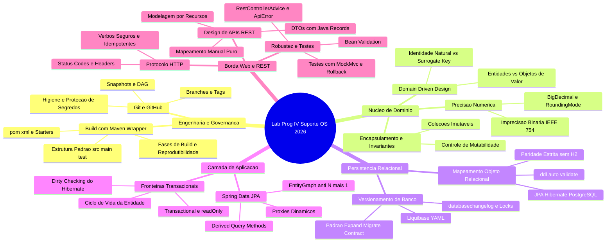
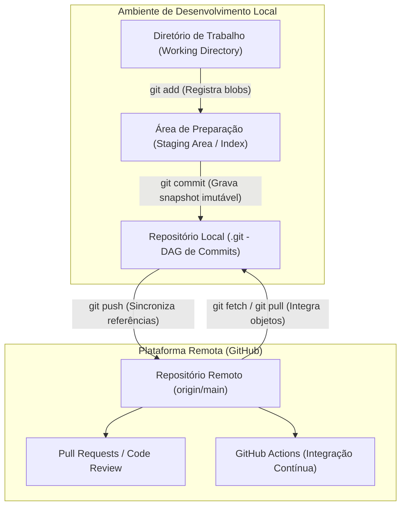
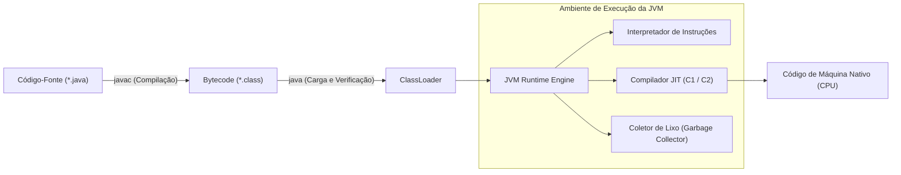
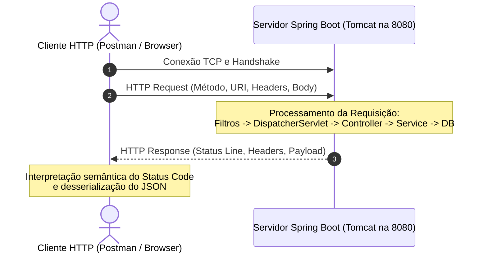
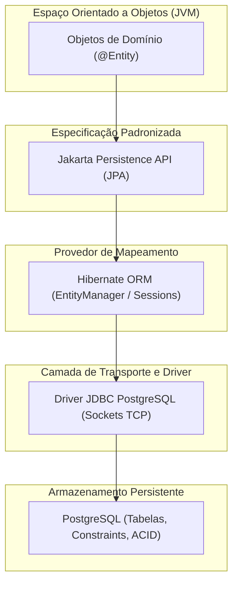
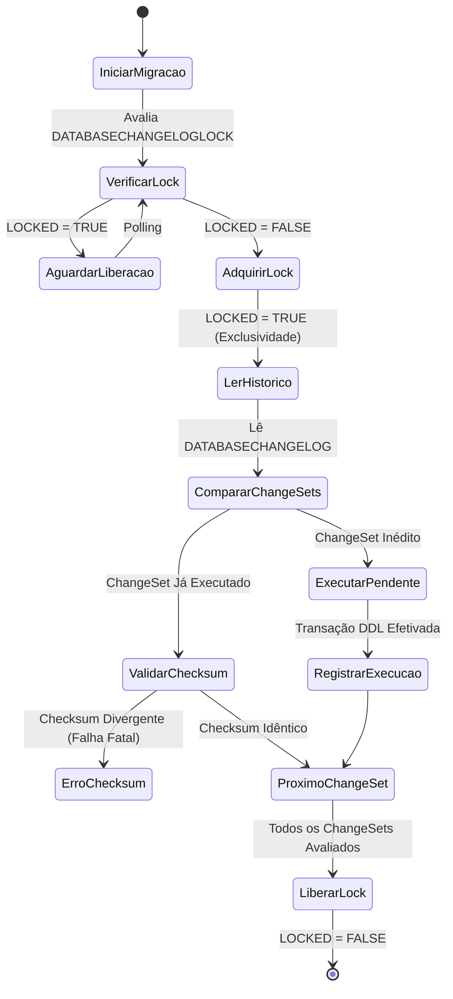
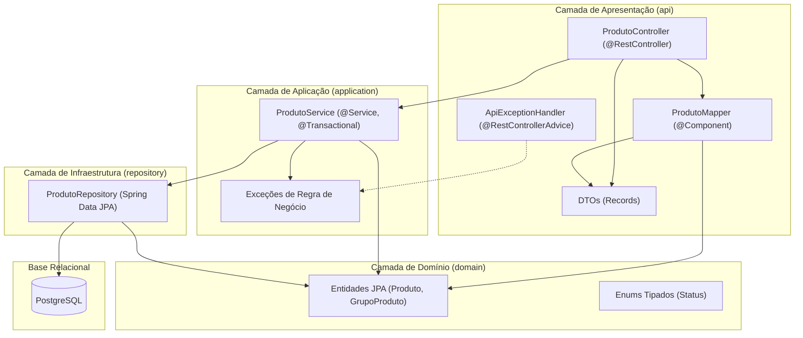
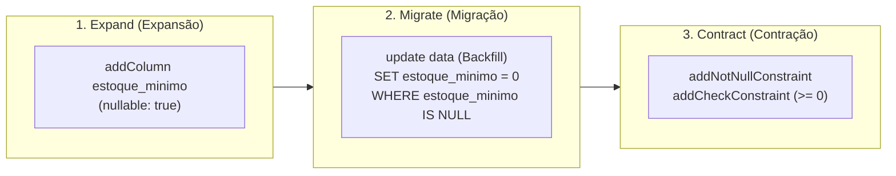
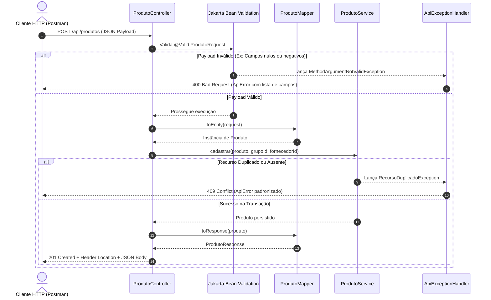
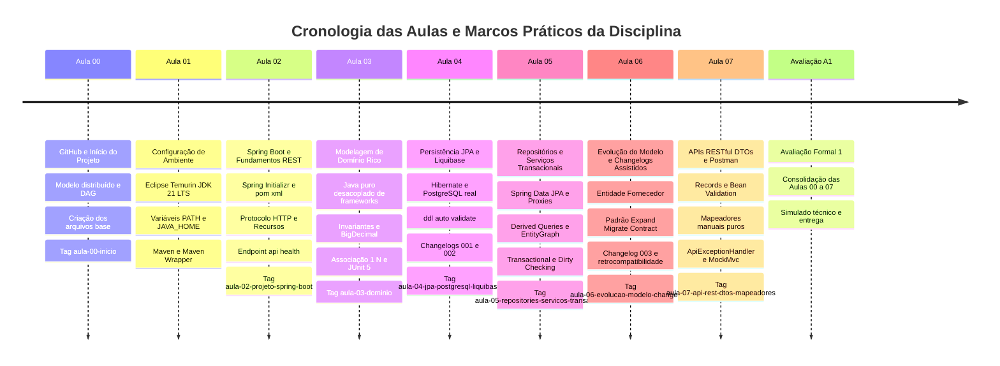

# Caderno Consolidado - Laboratório de Programação IV

## Sumário

- [Resumo Executivo](#resumo-executivo)
- [Mapa de Conteúdo](#mapa-de-conteúdo)
- [Fundamentos e Arquitetura](#fundamentos-e-arquitetura)
  - [Controle de Versão Distribuído e Governança com Git e GitHub](#controle-de-versão-distribuído-e-governança-com-git-e-github)
  - [Plataforma Java 21, Arquitetura da JVM e Ferramentas de Build com Maven Wrapper](#plataforma-java-21-arquitetura-da-jvm-e-ferramentas-de-build-com-maven-wrapper)
  - [Arquitetura Cliente-Servidor e Fundamentos do Protocolo HTTP](#arquitetura-cliente-servidor-e-fundamentos-do-protocolo-http)
  - [Modelagem de Domínio Rico em Java Puro e Isolamento de Invariantes](#modelagem-de-domínio-rico-em-java-puro-e-isolamento-de-invariantes)
  - [Persistência Relacional com JPA, Hibernate e PostgreSQL](#persistência-relacional-com-jpa-hibernate-e-postgresql)
  - [Versionamento de Esquema Declarativo com Liquibase](#versionamento-de-esquema-declarativo-com-liquibase)
  - [Arquitetura em Camadas com Spring Data JPA, Repositórios e Serviços Transacionais](#arquitetura-em-camadas-com-spring-data-jpa-repositórios-e-serviços-transacionais)
  - [Evolução Controlada de Esquema e Padrão Expand-Migrate-Contract](#evolução-controlada-de-esquema-e-padrão-expand-migrate-contract)
  - [Exposição de APIs RESTful, DTOs Imutáveis e Validação Declarativa](#exposição-de-apis-restful-dtos-imutáveis-e-validação-declarativa)
- [Sintaxe e Exemplos Práticos](#sintaxe-e-exemplos-práticos)
  - [Configurações do Ecossistema e Perfis de Execução](#configurações-do-ecossistema-e-perfis-de-execução)
  - [Entidades de Domínio Rico e Encapsulamento de Invariantes](#entidades-de-domínio-rico-e-encapsulamento-de-invariantes)
  - [Estrutura Declarativa de Migrações com Liquibase](#estrutura-declarativa-de-migrações-com-liquibase)
  - [Repositórios Spring Data JPA e Consultas Especializadas](#repositórios-spring-data-jpa-e-consultas-especializadas)
  - [Serviços Transacionais e Gerenciamento de Exceções de Domínio](#serviços-transacionais-e-gerenciamento-de-exceções-de-domínio)
  - [DTOs Imutáveis com Java Records e Mapeamento Manual](#dtos-imutáveis-com-java-records-e-mapeamento-manual)
  - [Controladores REST, Semântica HTTP e Tratamento Global de Erros](#controladores-rest-semântica-http-e-tratamento-global-de-erros)
  - [Automação de Testes Unitários e de Integração com JUnit 5 e MockMvc](#automação-de-testes-unitários-e-de-integração-com-junit-5-e-mockmvc)
- [Boas Práticas e Armadilhas Comuns](#boas-práticas-e-armadilhas-comuns)
- [Tabelas Comparativas](#tabelas-comparativas)
- [Linha do Tempo da Disciplina](#linha-do-tempo-da-disciplina)
- [Glossário](#glossário)
- [Checklist de Revisão para Prova](#checklist-de-revisão-para-prova)

---

## Resumo Executivo

O presente material consolida os fundamentos teóricos, metodológicos e aplicados ministrados na disciplina de Laboratório de Programação IV do curso de Sistemas de Informação da UniFEF, sob regência do Prof. Jefferson Passerini. A disciplina orienta-se pela construção profissional de uma aplicação corporativa completa para controle de ordens de serviço e estoque denominada **Suporte OS 2026**, fundamentada na linguagem Java 21 LTS e no ecossistema Spring Boot. O processo pedagógico adota o modelo de espelhamento arquitetural: a partir do projeto canônico mantido pelo professor, cada discente concebe e implementa um sistema temático próprio e unívoco, transferindo os padrões de projeto, regras de encapsulamento, persistência e exposição de serviços web para um domínio específico sob estrito contrato de compatibilidade.

A cadeia de engenharia de software desenvolvida cobre a totalidade do ciclo de vida de desenvolvimento backend moderno: governança e rastreabilidade com Git e GitHub; isolamento e reprodutibilidade de compilação com Apache Maven Wrapper; anatomia detalhada do protocolo HTTP e arquiteturas distribuídas cliente-servidor; modelagem orientada a domínio rico (Rich Domain Model) em Java puro com blindagem de invariantes e cálculos monetários de alta precisão via `BigDecimal`; persistência relacional com JPA e Hibernate orientada pelo PostgreSQL; versionamento estrito e imutável de esquemas de banco de dados via Liquibase; orquestração de casos de uso com serviços transacionais e repositórios Spring Data JPA; evolução não destrutiva de tabelas com dados pré-existentes via padrão Expand-Migrate-Contract; e exposição de contratos públicos via APIs RESTful seguras, utilizando DTOs imutáveis com Java Records, validação declarativa com Jakarta Bean Validation e tratamento unificado de falhas.

---

## Mapa de Conteúdo



---

## Fundamentos e Arquitetura

### Controle de Versão Distribuído e Governança com Git e GitHub

O controle de versão distribuído fundamenta-se na representação do histórico do projeto como um Grafo Acíclico Dirigido (DAG - *Directed Acyclic Graph*). Diferente de arquiteturas centralizadas legadas que registravam alterações baseadas em deltas incrementais por arquivo, o Git modela o estado global do projeto como uma sucessão temporal de fotografias integrais (*snapshots*). Cada commit constitui um nó imutável no grafo, indexado unicamente por um identificador criptográfico SHA (originalmente SHA-1 com 160 bits e 40 dígitos hexadecimais, evoluindo para SHA-256).



Um commit contém ponteiros para a árvore raiz de diretórios (*tree object*), metadados de autoria e comissionamento (nome, e-mail, timestamp), a mensagem explicativa da alteração e as referências aos nós pais (*parent commits*). Branches não são diretórios físicos clonados no sistema de arquivos, mas meros ponteiros móveis de 41 bytes armazenados em `.git/refs/heads/<nome-da-branch>`, que avançam de forma automática à medida que novos commits são adicionados à linha de desenvolvimento. Tags anotadas, por sua vez, são referências fixas ancoradas a commits específicos, empregadas formalmente na disciplina para marcar pontos de quebra pedagógicos e entregas avaliativas.

A governança do repositório exige higiene estrita: artefatos de compilação (`target/`), arquivos de configuração do sistema operacional (`.DS_Store`, `Thumbs.db`), metadados específicos de ambientes integrados de desenvolvimento (`.idea/`, `.vscode/`, `*.iml`) e arquivos de segredos locais (`.env`) devem ser expressamente blindados no arquivo `.gitignore`. O repositório armazena apenas arquivos de texto plano versionáveis, descritores de build e o gabarito público `.env.example`.

### Plataforma Java 21, Arquitetura da JVM e Ferramentas de Build com Maven Wrapper

A plataforma Java fundamenta-se no paradigma de compilação híbrida para garantir independência de arquitetura de hardware: o código-fonte humano contido em arquivos `.java` é convertido pelo compilador `javac` em um formato intermediário estruturado denominado *bytecode* (arquivos `.class`). A execução do bytecode é realizada pela Máquina Virtual Java (JVM), que atua como um computador abstrato baseado em pilha (*stack-based architecture*), interpretando instruções e utilizando compiladores *Just-In-Time* (JIT) para compilar trechos quentes de código diretamente em instruções nativas do processador subjacente (x86_64, AArch64).



A hierarquia da plataforma estrutura-se em:
1. **JVM (Java Virtual Machine):** Motor de execução, gerenciamento de memória dinâmica (*Heap* e *Metaspace*), despacho de threads e coleta de lixo.
2. **JRE (Java Runtime Environment):** Superconjunto formado pela JVM integrada às bibliotecas de classes padrão da API Java (`java.base`, `java.sql`, `java.net`).
3. **JDK (Java Development Kit):** Superconjunto voltado à engenharia de software, englobando a JRE e o ferramental de compilação, depuração e diagnóstico (`javac`, `jar`, `javap`, `jcmd`, `jstack`).

A gestão do ciclo de vida de compilação utiliza o **Apache Maven**, que implementa o princípio de Convenção sobre Configuração (*Convention over Configuration*) orientado pelo descritor declarativo XML `pom.xml`. Para mitigar o clássico problema de desalinhamento de ferramentas entre membros de equipe e servidores de CI, utiliza-se obrigatoriamente o **Maven Wrapper** (`mvnw` para ambientes Unix e `mvnw.cmd` para Windows). O wrapper delega a execução a scripts portáteis que consultam `.mvn/wrapper/maven-wrapper.properties`, realizam o download sob demanda da versão exata do Maven especificada para o projeto e executam os alvos sem depender de variáveis de ambiente globais da máquina hospedeira.

### Arquitetura Cliente-Servidor e Fundamentos do Protocolo HTTP

A comunicação entre subsistemas em sistemas distribuídos contemporâneos apoia-se no modelo arquitetural cliente-servidor mediado pelo protocolo HTTP (padronizado formalmente pela RFC 9110). Sob esta topologia assimétrica, o cliente assume o papel ativo de iniciar conexões TCP/IP e despachar mensagens de requisição, enquanto o servidor aguarda passivamente em portas pré-estabelecidas (porta `8080` no Spring Boot com Tomcat incorporado), processa as regras de negócio e devolve uma mensagem de resposta.



Uma mensagem HTTP divide-se em seções rigorosamente delimitadas:
- **Requisição:** Linha de comando (*Request Line*, composta por método HTTP, URI e versão do protocolo), cabeçalhos de requisição (metadados estruturados como `Content-Type`, `Accept`, `Authorization`), linha em branco separadora e corpo opcional de dados (*payload*).
- **Resposta:** Linha de status (*Status Line*, contendo a versão do protocolo, código numérico de status e frase descritiva), cabeçalhos de resposta (metadados como `Location`, `Content-Type`, `Date`), linha em branco e corpo com a representação solicitada.

Os métodos HTTP possuem propriedades semânticas formais que condicionam o comportamento de caches, proxies reversos e mecanismos de repetição:
- **Segurança (*Safety*):** O método é considerado seguro quando sua invocação tem caráter estritamente de leitura, não causando efeitos colaterais observáveis no estado do servidor. O método `GET` é categoricamente seguro.
- **Idempotência (*Idempotence*):** Um método é idempotente quando os efeitos colaterais de sua execução repetida de forma consecutiva com parâmetros idênticos produzem o mesmo estado final no servidor que uma única execução ($f(f(x)) = f(x)$). Os métodos `GET`, `PUT` e `DELETE` são idempotentes; o método `POST` não é idempotente, pois cada submissão desencadeia uma nova criação de recurso.

### Modelagem de Domínio Rico em Java Puro e Isolamento de Invariantes

O núcleo de uma aplicação orientada a objetos corporativa reside no Modelo de Domínio (*Domain Model*). Em conformidade com os postulados do *Domain-Driven Design* (DDD), rejeita-se terminantemente o anti-padrão denominado **Modelo Anêmico** (*Anemic Domain Model*), no qual classes de entidade são reduzidas a estruturas de dados passivas compostas por campos privados acompanhados de getters e setters públicos irrestritos. Modelos anêmicos violam o encapsulamento, promovem a dispersão de regras de negócio em serviços procedurais e permitem que objetos atinjam estados corrompidos e inconsistentes em memória.

Adota-se o **Modelo Rico** (*Rich Domain Model*), no qual entidades agregam estado e comportamento. O encapsulamento atua como barreira defensiva: atributos são declarados com visibilidade estritamente privada, campos imutáveis pós-construção recebem o modificador `final`, e construtores canônicos de negócio realizam validação rigorosa de **invariantes** — condições lógicas que devem permanecer verdadeiras durante todo o ciclo de vida do objeto. Modificações de estado ocorrem exclusivamente por meio de métodos de negócio que expressam a linguagem ubíqua do domínio (ex.: `receberEstoque`, `retirarEstoque`, `inativar`).

```mermaid
classDiagram
    direction LR
    class GrupoProduto {
        -Long id
        -String nome
        -Status status
        -List~Produto~ produtos
        +adicionarProduto(Produto produto)
        +ativar()
        +inativar()
        +getProdutos() List~Produto~
    }
    class Produto {
        -Long id
        -String codigoBarras
        -String descricao
        -BigDecimal saldoEstoque
        -BigDecimal valorUnitario
        -BigDecimal estoqueMinimo
        -LocalDate dataCadastro
        -Status status
        -GrupoProduto grupo
        -Fornecedor fornecedor
        +receberEstoque(BigDecimal quantidade)
        +retirarEstoque(BigDecimal quantidade)
        +calcularValorEstoque() BigDecimal
        +associarAoGrupo(GrupoProduto grupo)
        +associarFornecedor(Fornecedor fornecedor)
    }
    class Fornecedor {
        -Long id
        -String razaoSocial
        -String cnpj
        -Status status
        +ativar()
        +inativar()
    }
    class Status {
        <<enumeration>>
        ATIVO
        INATIVO
    }
    GrupoProduto "1" o-- "0..*" Produto : classifica 1:N
    Produto "0..*" --> "0..1" Fornecedor : abastecido por
    GrupoProduto --> Status
    Produto --> Status
    Fornecedor --> Status
```

A modelagem de grandezas monetárias e quantitativas proíbe o uso dos tipos primitivos de ponto flutuante binário (`float` e `double`). O padrão aritmético IEEE 754 não consegue representar frações decimais exatas na base 2 (como 0.1 ou 0.2), acumulando dízimas e imprecisões inaceitáveis no fechamento contábil. Utiliza-se a classe `java.math.BigDecimal`, garantindo representação exata com base em um inteiro de precisão arbitrária e uma escala de 32 bits, com aplicação explícita do modo de arredondamento bancário `RoundingMode.HALF_UP`.

A coordenação de relacionamentos bidirecionais de cardinalidade 1:N em memória (como `GrupoProduto` e `Produto`) exige um **ponto único de entrada** para a amarração mútua das referências, evitando que um objeto aponte para um grupo enquanto o grupo mantém referências divergentes. Além disso, coleções internas expostas por métodos de leitura devem ser blindadas com `Collections.unmodifiableList()`, impedindo manipulações externas que ignorem as regras de unicidade.

### Persistência Relacional com JPA, Hibernate e PostgreSQL

A camada de persistência corporativa resolve o **desencontro de impedância objeto-relacional** (*Object-Relational Impedance Mismatch*), decorrente da fricção conceitual entre o paradigma orientado a objetos (grafos de navegação, herança, encapsulamento, identidade baseada em instâncias) e o modelo relacional fundamentado na teoria de conjuntos e lógica de predicados (tabelas, tuplas, chaves primárias, restrições e chaves estrangeiras).



A arquitetura organiza-se nas seguintes responsabilidades:
- **PostgreSQL:** SGBD relacional responsável pelo armazenamento físico, durabilidade transacional (ACID) e imposição inviolável de integridade relacional (`PRIMARY KEY`, `FOREIGN KEY`, `UNIQUE`, `CHECK`, `NOT NULL`).
- **JDBC Driver:** Driver de comunicação de baixo nível que gerencia pools de conexões e sockets de rede, convertendo chamadas procedurais Java em pacotes binários do protocolo PostgreSQL.
- **JPA (Jakarta Persistence):** Especificação formal composta por anotações declarativas (`@Entity`, `@Table`, `@Id`, `@Column`, `@ManyToOne`, `@OneToMany`) e interfaces de abstração (`EntityManager`).
- **Hibernate ORM:** Implementação da especificação JPA. Atua no rastreamento de alterações de estado (*dirty checking*), gerenciamento do cache de primeiro nível e geração otimizada de instruções SQL.

A integridade do sistema apoia-se no princípio de **Defesa em Profundidade** (*Defense in Depth*): a validação é executada na camada de domínio Java em tempo de compilação e execução rápida (*fail-fast*), enquanto o banco de dados impõe constraints físicas intransponíveis contra inserções concorrentes corrompidas ou scripts manuais descontrolados. Proíbe-se expressamente o uso de bancos em memória desprovidos de paridade (como H2); o ambiente opera com estrita paridade tecnológica utilizando instâncias reais do PostgreSQL isoladas por perfil (`dev` e `test`). A propriedade `spring.jpa.hibernate.ddl-auto` deve ser configurada estritamente como `validate`, impedindo que o Hibernate altere a estrutura do banco sem governança.

### Versionamento de Esquema Declarativo com Liquibase

Para assegurar reprodutibilidade, auditabilidade e determinismo na evolução estrutural do banco de dados, utiliza-se o **Liquibase** como única fonte da verdade da infraestrutura relacional. A estrutura do banco de dados é tratada como código-fonte (*Database Migration as Code*), descrita em arquivos declarativos imutáveis formatados em YAML.



O mecanismo do Liquibase baseia-se em duas tabelas de metadados:
1. **`databasechangeloglock`:** Semáforo distribuído de concorrência que impede que múltiplas instâncias da aplicação Spring Boot executem migrações simultâneas em ambientes clusterizados.
2. **`databasechangelog`:** Histórico cumulativo de execuções. A identidade de um `changeSet` é determinada pela tríade:

$$\text{Identidade} = (\text{id}, \text{author}, \text{filename})$$

No primeiro disparo de um `changeSet`, o Liquibase calcula um hash criptográfico (MD5/SHA) do seu conteúdo e registra-o na coluna `md5sum`. A cada inicialização subsequente, o arquivo físico é recalculado e comparado com o valor registrado. Se o arquivo tiver sofrido qualquer modificação posterior, a aplicação aborta a inicialização com falha irrecuperável de integridade (*Validation Failed: Checksum Check Failed*). ChangeSets aplicados são rigorosamente imutáveis; correções ou novas colunas exigem a criação de novos arquivos de migração incrementais.

### Arquitetura em Camadas com Spring Data JPA, Repositórios e Serviços Transacionais

A organização estrutural da aplicação distribui as responsabilidades em quatro camadas ortogonais e desacopladas:



A **Inversão de Controle (IoC)** e a **Injeção de Dependências (DI)** são operadas pelo contêiner do Spring. Adota-se a injeção estrita via construtor, eliminando o uso de `@Autowired` em campos privados. A injeção por construtor assegura a imutabilidade dos atributos via modificador `final`, detecta dependências circulares na inicialização da JVM (*fail-fast*) e simplifica a instanciação de testes unitários desacoplados do framework.

O **Spring Data JPA** utiliza *Java Dynamic Proxies* para materializar instâncias de interfaces que estendem `JpaRepository<T, ID>`. O framework processa **Derived Query Methods** (consultas derivadas a partir de convenções sintáticas de nomenclatura como `findByCodigoBarras` ou `existsByCnpj`) e compila árvores abstratas de sintaxe em consultas JPQL nativas. Para mitigar o problema de desempenho conhecido como **N+1 Selects** ao carregar relacionamentos preguiçosos (*Lazy Loading*), aplicam-se grafos de busca declarativos via anotação `@EntityGraph(attributePaths = {"grupo", "fornecedor"})`, forçando o Hibernate a emitir instruções `LEFT JOIN` unificadas em uma única viagem de rede ao banco de dados.

A delimitação da **fronteira transacional** reside exclusivamente na camada de serviço via anotação `@Transactional`. A transação gerencia a unidade atômica de trabalho sob os princípios ACID:
- Métodos de consulta utilizam `@Transactional(readOnly = true)`. O parâmetro `readOnly` otimiza o processamento desativando o snapshot de *dirty checking* no contexto de persistência do Hibernate e permitindo otimizações de bloqueio no PostgreSQL.
- O ciclo de vida de uma entidade transita entre quatro estados formais:
  1. *Transient:* Objeto recém-instanciado via operador `new`, sem identificador relacional e sem vínculo com a sessão.
  2. *Managed:* Entidade associada ativamente ao contexto de persistência. Qualquer mutação realizada em seus atributos via métodos de domínio é automaticamente detectada pelo mecanismo de *dirty checking* e sincronizada com o banco ao término da transação.
  3. *Detached:* Entidade que possui chave primária, mas cuja transação originária foi encerrada. O acesso a associações lazy nesse estado dispara `LazyInitializationException`.
  4. *Removed:* Entidade sinalizada para exclusão física via comando `DELETE` ao final da transação.
- Exceções do tipo `RuntimeException` disparadas dentro do método transacional provocam o rollback atômico e irrestrito da transação pelo interceptador AOP do Spring.

### Evolução Controlada de Esquema e Padrão Expand-Migrate-Contract

A evolução de modelos de dados em sistemas em produção com milhões de tuplas exige técnicas que impeçam a indisponibilidade de serviço ou falhas de integridade relacional. Tentar adicionar uma coluna definida com a restrição `NOT NULL` sem valor padrão em uma tabela preenchida acarreta falha catastrófica imediata no PostgreSQL:

```text
ERROR: column "estoque_minimo" of relation "produto" contains null values
```

Para sanar este problema sem depender de ferramentas visuais ou comandos manuais destrutivos, aplica-se o padrão **Expand-Migrate-Contract** estruturado em etapas sequenciais via changelogs atômicos do Liquibase:



1. **Fase Expand (Expansão):** A nova coluna é introduzida na tabela permitindo valores nulos (`nullable: true`), garantindo que a aplicação legada em execução continue realizando inserções sem quebrar por ausência do campo.
2. **Fase Migrate (Migração / Backfill):** Executa-se um comando de atualização em massa (`UPDATE produto SET estoque_minimo = 0 WHERE estoque_minimo IS NULL`), preenchendo todos os registros históricos pré-existentes com um valor default de negócio compatível.
3. **Fase Contract (Contração):** Aplica-se formalmente a restrição `NOT NULL` sobre a coluna já saneada e anexam-se as regras de integridade física definitiva (`CHECK (estoque_minimo >= 0)`).

No código Java, a compatibilidade retroativa é mantida fornecendo construtores sobrecarregados na entidade: um construtor canônico completo que exige o novo campo e construtores legados marcados que delegam para o construtor principal fornecendo valores padrão consistentes, impedindo a quebra de testes e de integrações preexistentes.

### Exposição de APIs RESTful, DTOs Imutáveis e Validação Declarativa

A camada de borda da aplicação é estruturada como uma API RESTful (*Representational State Transfer*), operando de forma *stateless* e com interface uniforme centrada em **recursos** descritos no plural (`/api/produtos`, `/api/grupos-produtos`). Proíbe-se o anti-padrão de modelagem RPC (*Remote Procedure Call*), no qual operações e verbos são codificados na URI (como `/api/cadastrarProduto` ou `/api/excluirProduto`). A ação semântica é governada estritamente pelo verbo HTTP empregado (`GET`, `POST`, `PUT`, `DELETE`).



A integridade arquitetural veda a exposição direta de entidades JPA nos métodos dos controladores. Expor classes anotadas com `@Entity` acarreta sérios riscos:
- **Vazamento de Dados Sensíveis:** Atributos de infraestrutura interna ou campos restritos são serializados no corpo da resposta.
- **Acoplamento Indesejado:** Qualquer alteração no esquema do banco quebra imediatamente os contratos de clientes externos.
- **Falha de Carregamento Tardio (*LazyInitializationException*):** O serializador JSON (Jackson) tenta inspecionar associações proxies não inicializadas fora da transação.
- **Recursão Infinita por Ciclos de Serialização:** Associações bidirecionais (1:N) provocam loops infinitos e travamento da JVM por estouro de pilha (*StackOverflowError*).
- **Ataques de Atribuição em Massa (*Mass Assignment*):** Usuários maliciosos podem injetar parâmetros que alteram status ou atributos protegidos da entidade caso esta seja vinculada diretamente como argumento de entrada.

Para isolar a camada de transporte, adotam-se DTOs (*Data Transfer Objects*) implementados exclusivamente como **Java Records**. Records fornecem imutabilidade nativa (todos os campos são `private final`), construtor canônico automático e eliminação de código boilerplate. O mapeamento entre DTOs e Entidades é conduzido por **Mapeadores Manuais Puros** decorados como componentes gerenciados (`@Component`), garantindo transformações previsíveis, imunes a falhas de reflexão e fáceis de testar isoladamente.

A validação de entrada utiliza a especificação **Jakarta Bean Validation** (`jakarta.validation.constraints.*`) diretamente nos componentes do record (`@NotBlank`, `@NotNull`, `@Size`, `@Positive`, `@PositiveOrZero`). Falhas de validação de payload são interceptadas globalmente por uma classe centralizadora anotada com `@RestControllerAdvice`, que traduz exceções técnicas em respostas HTTP com código `400 Bad Request` encapsuladas em uma estrutura canônica de erro denominada `ApiError`.

---

## Sintaxe e Exemplos Práticos

### Configurações do Ecossistema e Perfis de Execução

O gerenciamento de dependências e a parametrização dos ambientes exigem a definição correta do `pom.xml`, das propriedades de configuração e do arquivo de exclusões do Git.

#### Arquivo `pom.xml` (Trecho canônico de dependências)

```xml
<?xml version="1.0" encoding="UTF-8"?>
<project xmlns="http://maven.apache.org/POM/4.0.0"
         xmlns:xsi="http://www.w3.org/2001/XMLSchema-instance"
         xsi:schemaLocation="http://maven.apache.org/POM/4.0.0 
         https://maven.apache.org/xsd/maven-4.0.0.xsd">
    <modelVersion>4.0.0</modelVersion>
    <parent>
        <groupId>org.springframework.boot</groupId>
        <artifactId>spring-boot-starter-parent</artifactId>
        <version>3.3.2</version>
        <relativePath/>
    </parent>
    <groupId>com.curso</groupId>
    <artifactId>suporteos2026</artifactId>
    <version>0.0.1-SNAPSHOT</version>
    <name>suporteos2026</name>
    <description>Projeto corporativo de controle de ordens de servico e estoque</description>
    <properties>
        <java.version>21</java.version>
    </properties>
    <dependencies>
        <!-- Suporte Web RESTful e Tomcat Embutido -->
        <dependency>
            <groupId>org.springframework.boot</groupId>
            <artifactId>spring-boot-starter-web</artifactId>
        </dependency>
        <!-- Persistência JPA e Hibernate ORM -->
        <dependency>
            <groupId>org.springframework.boot</groupId>
            <artifactId>spring-boot-starter-data-jpa</artifactId>
        </dependency>
        <!-- Validação Declarativa com Jakarta Bean Validation -->
        <dependency>
            <groupId>org.springframework.boot</groupId>
            <artifactId>spring-boot-starter-validation</artifactId>
        </dependency>
        <!-- Controle de Versão de Banco de Dados -->
        <dependency>
            <groupId>org.liquibase</groupId>
            <artifactId>liquibase-core</artifactId>
        </dependency>
        <!-- Driver JDBC Nativo para PostgreSQL -->
        <dependency>
            <groupId>org.postgresql</groupId>
            <artifactId>postgresql</artifactId>
            <scope>runtime</scope>
        </dependency>
        <!-- Suporte para Testes Automatizados com JUnit 5 e MockMvc -->
        <dependency>
            <groupId>org.springframework.boot</groupId>
            <artifactId>spring-boot-starter-test</artifactId>
            <scope>test</scope>
        </dependency>
    </dependencies>
    <build>
        <plugins>
            <plugin>
                <groupId>org.springframework.boot</groupId>
                <artifactId>spring-boot-maven-plugin</artifactId>
            </plugin>
        </plugins>
    </build>
</project>
```

#### Arquivo `.gitignore`

```text
# Diretórios de compilação do Maven
target/
pom.xml.tag
pom.xml.releaseBackup
pom.xml.versionsBackup

# Metadados de ambientes de desenvolvimento integrados (IDEs)
.idea/
*.iml
*.iws
.classpath
.project
.settings/
.vscode/

# Arquivos de log e variáveis de ambiente confidenciais
*.log
.env
.env.local

# Arquivos do sistema operacional
.DS_Store
Thumbs.db
```

#### Propriedades de Configuração: `application.properties` (Raiz / Base Comum)

```properties
# Nome identificador da aplicação
spring.application.name=suporteos2026

# Perfil ativo padrão caso não seja especificado na inicialização
spring.profiles.active=dev

# Rota para o changelog mestre do Liquibase
spring.liquibase.change-log=classpath:db/changelog/db.changelog-master.yaml
spring.liquibase.enabled=true

# Política estrita de validação do Hibernate contra o banco real
spring.jpa.hibernate.ddl-auto=validate
spring.jpa.open-in-view=false
```

#### Perfil de Desenvolvimento: `application-dev.properties`

```properties
# Parâmetros de conexão parametrizados para leitura do ambiente local
spring.datasource.url=jdbc:postgresql://${DB_HOST:localhost}:${DB_PORT:5432}/${DB_NAME:suporteos2026_dev}
spring.datasource.username=${DB_USER:suporteos_app}
spring.datasource.password=${DB_PASSWORD:desenvolvimento123}
spring.datasource.driver-class-name=org.postgresql.Driver

# Formatação e visualização de queries SQL para depuração
spring.jpa.show-sql=true
spring.jpa.properties.hibernate.format_sql=true
```

#### Perfil de Testes de Integração: `application-test.properties`

```properties
# Isolamento estrito no banco dedicado de testes PostgreSQL (paridade absoluta)
spring.datasource.url=jdbc:postgresql://${DB_TEST_HOST:localhost}:${DB_TEST_PORT:5432}/${DB_TEST_NAME:suporteos2026_test}
spring.datasource.username=${DB_TEST_USER:suporteos_test_app}
spring.datasource.password=${DB_TEST_PASSWORD:teste123}
spring.datasource.driver-class-name=org.postgresql.Driver

spring.jpa.show-sql=false
spring.jpa.hibernate.ddl-auto=validate
```

---

### Entidades de Domínio Rico e Encapsulamento de Invariantes

Implementação das classes nucleares de domínio, demonstrando encapsulamento estrito, construtores de negócio defensivos e validação de invariantes.

#### Enum de Controle de Estado: `domain/Status.java`

```java
package com.curso.suporteos.domain;

public enum Status {
    ATIVO,
    INATIVO
}
```

#### Entidade Classificatória: `domain/GrupoProduto.java`

```java
package com.curso.suporteos.domain;

import jakarta.persistence.CascadeType;
import jakarta.persistence.Column;
import jakarta.persistence.Entity;
import jakarta.persistence.EnumType;
import jakarta.persistence.Enumerated;
import jakarta.persistence.GeneratedValue;
import jakarta.persistence.GenerationType;
import jakarta.persistence.Id;
import jakarta.persistence.OneToMany;
import jakarta.persistence.Table;
import jakarta.persistence.UniqueConstraint;
import java.util.ArrayList;
import java.util.Collections;
import java.util.List;
import java.util.Objects;

@Entity
@Table(
    name = "grupo_produto",
    uniqueConstraints = @UniqueConstraint(name = "uk_grupo_produto_nome", columnNames = "nome")
)
public class GrupoProduto {

    @Id
    @GeneratedValue(strategy = GenerationType.IDENTITY)
    private Long id;

    @Column(nullable = false, length = 120)
    private String nome;

    @Enumerated(EnumType.STRING)
    @Column(nullable = false, length = 20)
    private Status status;

    @OneToMany(mappedBy = "grupo", cascade = CascadeType.ALL, orphanRemoval = false)
    private List<Produto> produtos = new ArrayList<>();

    // Construtor protegido sem argumentos exigido pela especificação JPA
    protected GrupoProduto() {
    }

    // Construtor de negócio canônico com validação defensiva
    public GrupoProduto(String nome) {
        this.nome = validarNome(nome);
        this.status = Status.ATIVO;
    }

    public void adicionarProduto(Produto produto) {
        Objects.requireNonNull(produto, "Produto não pode ser nulo para vinculação");

        // Validação da invariante de unicidade de código de barras na coleção interna
        boolean duplicado = this.produtos.stream()
                .anyMatch(p -> p.getCodigoBarras().equalsIgnoreCase(produto.getCodigoBarras()));

        if (duplicado) {
            throw new IllegalArgumentException("Produto com este código de barras já existe neste grupo");
        }

        // Ponto único de entrada: amarra ambos os lados da associação bidirecional
        produto.associarAoGrupo(this);
        this.produtos.add(produto);
    }

    public void ativar() {
        this.status = Status.ATIVO;
    }

    public void inativar() {
        this.status = Status.INATIVO;
    }

    private static String validarNome(String nome) {
        if (nome == null || nome.isBlank()) {
            throw new IllegalArgumentException("Nome do grupo de produtos é obrigatório");
        }
        return nome.trim();
    }

    // Getters defensivos
    public Long getId() { return id; }
    public String getNome() { return nome; }
    public Status getStatus() { return status; }
    
    // Retorna cópia não modificável para impedir inserção direta sem validação
    public List<Produto> getProdutos() {
        return Collections.unmodifiableList(produtos);
    }
}
```

#### Entidade Associada: `domain/Fornecedor.java`

```java
package com.curso.suporteos.domain;

import jakarta.persistence.Column;
import jakarta.persistence.Entity;
import jakarta.persistence.EnumType;
import jakarta.persistence.Enumerated;
import jakarta.persistence.GeneratedValue;
import jakarta.persistence.GenerationType;
import jakarta.persistence.Id;
import jakarta.persistence.Table;
import jakarta.persistence.UniqueConstraint;

@Entity
@Table(
    name = "fornecedor",
    uniqueConstraints = @UniqueConstraint(name = "uk_fornecedor_cnpj", columnNames = "cnpj")
)
public class Fornecedor {

    @Id
    @GeneratedValue(strategy = GenerationType.IDENTITY)
    private Long id;

    @Column(name = "razao_social", nullable = false, length = 150)
    private String razaoSocial;

    @Column(nullable = false, length = 14)
    private String cnpj;

    @Enumerated(EnumType.STRING)
    @Column(nullable = false, length = 20)
    private Status status;

    protected Fornecedor() {
    }

    public Fornecedor(String razaoSocial, String cnpj) {
        this.razaoSocial = validarTextoObrigatorio(razaoSocial, "Razão social é obrigatória");
        this.cnpj = validarCnpj(cnpj);
        this.status = Status.ATIVO;
    }

    public void ativar() { this.status = Status.ATIVO; }
    public void inativar() { this.status = Status.INATIVO; }

    public Long getId() { return id; }
    public String getRazaoSocial() { return razaoSocial; }
    public String getCnpj() { return cnpj; }
    public Status getStatus() { return status; }

    private static String validarTextoObrigatorio(String texto, String mensagem) {
        if (texto == null || texto.isBlank()) {
            throw new IllegalArgumentException(mensagem);
        }
        return texto.trim();
    }

    private static String validarCnpj(String cnpj) {
        String limpo = validarTextoObrigatorio(cnpj, "CNPJ é obrigatório");
        if (!limpo.matches("\\d{14}")) {
            throw new IllegalArgumentException("CNPJ deve conter exatamente 14 dígitos numéricos");
        }
        return limpo;
    }
}
```

#### Entidade Principal de Domínio: `domain/Produto.java`

```java
package com.curso.suporteos.domain;

import jakarta.persistence.Column;
import jakarta.persistence.Entity;
import jakarta.persistence.EnumType;
import jakarta.persistence.Enumerated;
import jakarta.persistence.FetchType;
import jakarta.persistence.ForeignKey;
import jakarta.persistence.GeneratedValue;
import jakarta.persistence.GenerationType;
import jakarta.persistence.Id;
import jakarta.persistence.JoinColumn;
import jakarta.persistence.ManyToOne;
import jakarta.persistence.Table;
import jakarta.persistence.UniqueConstraint;
import java.math.BigDecimal;
import java.math.RoundingMode;
import java.time.LocalDate;
import java.util.Objects;

@Entity
@Table(
    name = "produto",
    uniqueConstraints = @UniqueConstraint(name = "uk_produto_codigo_barras", columnNames = "codigo_barras")
)
public class Produto {

    @Id
    @GeneratedValue(strategy = GenerationType.IDENTITY)
    private Long id;

    @Column(name = "codigo_barras", nullable = false, length = 50)
    private String codigoBarras;

    @Column(nullable = false, length = 150)
    private String descricao;

    @Column(name = "saldo_estoque", nullable = false, precision = 18, scale = 3)
    private BigDecimal saldoEstoque;

    @Column(name = "valor_unitario", nullable = false, precision = 18, scale = 2)
    private BigDecimal valorUnitario;

    @Column(name = "estoque_minimo", nullable = false, precision = 18, scale = 3)
    private BigDecimal estoqueMinimo;

    @Column(name = "data_cadastro", nullable = false, updatable = false)
    private LocalDate dataCadastro;

    @Enumerated(EnumType.STRING)
    @Column(nullable = false, length = 20)
    private Status status;

    @ManyToOne(fetch = FetchType.LAZY)
    @JoinColumn(
        name = "grupo_produto_id",
        nullable = false,
        foreignKey = @ForeignKey(name = "fk_produto_grupo_produto")
    )
    private GrupoProduto grupo;

    @ManyToOne(fetch = FetchType.LAZY)
    @JoinColumn(
        name = "fornecedor_id",
        nullable = true,
        foreignKey = @ForeignKey(name = "fk_produto_fornecedor")
    )
    private Fornecedor fornecedor;

    protected Produto() {
    }

    // Construtor canônico completo (Aula 06)
    public Produto(String codigoBarras, String descricao, BigDecimal saldoEstoque,
                   BigDecimal valorUnitario, BigDecimal estoqueMinimo, LocalDate dataCadastro) {
        this.codigoBarras = validarTexto(codigoBarras, "Código de barras é obrigatório");
        this.descricao = validarTexto(descricao, "Descrição é obrigatória");
        this.saldoEstoque = validarNaoNegativo(saldoEstoque, "Saldo de estoque não pode ser negativo");
        this.valorUnitario = validarNaoNegativo(valorUnitario, "Valor unitário não pode ser negativo");
        this.estoqueMinimo = validarNaoNegativo(estoqueMinimo, "Estoque mínimo não pode ser negativo");
        this.dataCadastro = Objects.requireNonNull(dataCadastro, "Data de cadastro é obrigatória");
        this.status = Status.ATIVO;
    }

    // Construtor legado com deleção encadeada (Garante retrocompatibilidade com Aulas 03 a 05)
    public Produto(String codigoBarras, String descricao, BigDecimal saldoEstoque,
                   BigDecimal valorUnitario, LocalDate dataCadastro) {
        this(codigoBarras, descricao, saldoEstoque, valorUnitario, BigDecimal.ZERO, dataCadastro);
    }

    // Operações ricas de negócio
    public void receberEstoque(BigDecimal quantidade) {
        validarPositivo(quantidade, "Quantidade a receber deve ser estritamente maior que zero");
        this.saldoEstoque = this.saldoEstoque.add(quantidade);
    }

    public void retirarEstoque(BigDecimal quantidade) {
        validarPositivo(quantidade, "Quantidade a retirar deve ser estritamente maior que zero");
        if (this.saldoEstoque.compareTo(quantidade) < 0) {
            throw new IllegalArgumentException("Saldo insuficiente em estoque para a retirada solicitada");
        }
        this.saldoEstoque = this.saldoEstoque.subtract(quantidade);
    }

    public BigDecimal calcularValorEstoque() {
        return this.saldoEstoque
                .multiply(this.valorUnitario)
                .setScale(2, RoundingMode.HALF_UP);
    }

    public void associarAoGrupo(GrupoProduto grupo) {
        this.grupo = Objects.requireNonNull(grupo, "Grupo de produto não pode ser nulo");
    }

    public void associarFornecedor(Fornecedor fornecedor) {
        this.fornecedor = fornecedor; // Associação opcional
    }

    public void ativar() { this.status = Status.ATIVO; }
    public void inativar() { this.status = Status.INATIVO; }

    // Validações internas de invariantes
    private static String validarTexto(String texto, String msg) {
        if (texto == null || texto.isBlank()) {
            throw new IllegalArgumentException(msg);
        }
        return texto.trim();
    }

    private static BigDecimal validarNaoNegativo(BigDecimal valor, String msg) {
        Objects.requireNonNull(valor, msg);
        if (valor.signum() < 0) {
            throw new IllegalArgumentException(msg);
        }
        return valor;
    }

    private static void validarPositivo(BigDecimal valor, String msg) {
        Objects.requireNonNull(valor, msg);
        if (valor.signum() <= 0) {
            throw new IllegalArgumentException(msg);
        }
    }

    // Getters
    public Long getId() { return id; }
    public String getCodigoBarras() { return codigoBarras; }
    public String getDescricao() { return descricao; }
    public BigDecimal getSaldoEstoque() { return saldoEstoque; }
    public BigDecimal getValorUnitario() { return valorUnitario; }
    public BigDecimal getEstoqueMinimo() { return estoqueMinimo; }
    public LocalDate getDataCadastro() { return dataCadastro; }
    public Status getStatus() { return status; }
    public GrupoProduto getGrupo() { return grupo; }
    public Fornecedor getFornecedor() { return fornecedor; }
}
```

---

### Estrutura Declarativa de Migrações com Liquibase

Estruturação modular dos changelogs do Liquibase com isolamento de responsabilidades e aplicação do padrão Expand-Migrate-Contract.

#### Changelog Mestre: `src/main/resources/db/changelog/db.changelog-master.yaml`

```yaml
databaseChangeLog:
  - include:
      file: db/changelog/changes/001-create-grupo-produto.yaml
  - include:
      file: db/changelog/changes/002-create-produto.yaml
  - include:
      file: db/changelog/changes/003-fornecedor-e-estoque-minimo.yaml
```

#### Migração 001: `db/changelog/changes/001-create-grupo-produto.yaml`

```yaml
databaseChangeLog:
  - changeSet:
      id: 001-create-grupo-produto
      author: jefferson-passerini
      changes:
        - createTable:
            tableName: grupo_produto
            columns:
              - column:
                  name: id
                  type: BIGINT
                  autoIncrement: true
                  constraints:
                    primaryKey: true
                    primaryKeyName: pk_grupo_produto
              - column:
                  name: nome
                  type: VARCHAR(120)
                  constraints:
                    nullable: false
                    unique: true
                    uniqueConstraintName: uk_grupo_produto_nome
              - column:
                  name: status
                  type: VARCHAR(20)
                  constraints:
                    nullable: false
        - addCheckConstraint:
            tableName: grupo_produto
            constraintName: ck_grupo_produto_status
            checkCondition: "status IN ('ATIVO', 'INATIVO')"
      rollback:
        - dropTable:
            tableName: grupo_produto
```

#### Migração 002: `db/changelog/changes/002-create-produto.yaml`

```yaml
databaseChangeLog:
  - changeSet:
      id: 002-create-produto
      author: jefferson-passerini
      changes:
        - createTable:
            tableName: produto
            columns:
              - column:
                  name: id
                  type: BIGINT
                  autoIncrement: true
                  constraints:
                    primaryKey: true
                    primaryKeyName: pk_produto
              - column:
                  name: codigo_barras
                  type: VARCHAR(50)
                  constraints:
                    nullable: false
                    unique: true
                    uniqueConstraintName: uk_produto_codigo_barras
              - column:
                  name: descricao
                  type: VARCHAR(150)
                  constraints:
                    nullable: false
              - column:
                  name: saldo_estoque
                  type: NUMERIC(18,3)
                  constraints:
                    nullable: false
              - column:
                  name: valor_unitario
                  type: NUMERIC(18,2)
                  constraints:
                    nullable: false
              - column:
                  name: data_cadastro
                  type: DATE
                  constraints:
                    nullable: false
              - column:
                  name: status
                  type: VARCHAR(20)
                  constraints:
                    nullable: false
              - column:
                  name: grupo_produto_id
                  type: BIGINT
                  constraints:
                    nullable: false
                    foreignKeyName: fk_produto_grupo_produto
                    references: grupo_produto(id)
        - addCheckConstraint:
            tableName: produto
            constraintName: ck_produto_saldo_estoque
            checkCondition: "saldo_estoque >= 0"
        - addCheckConstraint:
            tableName: produto
            constraintName: ck_produto_valor_unitario
            checkCondition: "valor_unitario >= 0"
        - addCheckConstraint:
            tableName: produto
            constraintName: ck_produto_status
            checkCondition: "status IN ('ATIVO', 'INATIVO')"
      rollback:
        - dropTable:
            tableName: produto
```

#### Migração 003: `db/changelog/changes/003-fornecedor-e-estoque-minimo.yaml` (Padrão Expand-Migrate-Contract)

```yaml
databaseChangeLog:
  # 1. Criação da tabela Fornecedor
  - changeSet:
      id: 003-1-create-fornecedor
      author: jefferson-passerini
      changes:
        - createTable:
            tableName: fornecedor
            columns:
              - column:
                  name: id
                  type: BIGINT
                  autoIncrement: true
                  constraints:
                    primaryKey: true
                    primaryKeyName: pk_fornecedor
              - column:
                  name: razao_social
                  type: VARCHAR(150)
                  constraints:
                    nullable: false
              - column:
                  name: cnpj
                  type: VARCHAR(14)
                  constraints:
                    nullable: false
                    unique: true
                    uniqueConstraintName: uk_fornecedor_cnpj
              - column:
                  name: status
                  type: VARCHAR(20)
                  constraints:
                    nullable: false
        - addCheckConstraint:
            tableName: fornecedor
            constraintName: ck_fornecedor_status
            checkCondition: "status IN ('ATIVO', 'INATIVO')"
      rollback:
        - dropTable:
            tableName: fornecedor

  # 2. Vínculo opcional de Fornecedor em Produto
  - changeSet:
      id: 003-2-add-fornecedor-fk-in-produto
      author: jefferson-passerini
      changes:
        - addColumn:
            tableName: produto
            columns:
              - column:
                  name: fornecedor_id
                  type: BIGINT
                  constraints:
                    nullable: true
                    foreignKeyName: fk_produto_fornecedor
                    references: fornecedor(id)
      rollback:
        - dropForeignKeyConstraint:
            baseTableName: produto
            constraintName: fk_produto_fornecedor
        - dropColumn:
            tableName: produto
            columnName: fornecedor_id

  # 3. EXPAND: Adiciona coluna de estoque mínimo como NULLABLE
  - changeSet:
      id: 003-3-expand-produto-estoque-minimo
      author: jefferson-passerini
      changes:
        - addColumn:
            tableName: produto
            columns:
              - column:
                  name: estoque_minimo
                  type: NUMERIC(18,3)
                  constraints:
                    nullable: true
      rollback:
        - dropColumn:
            tableName: produto
            columnName: estoque_minimo

  # 4. MIGRATE: Backfill de dados existentes para garantir valor de negócio seguro
  - changeSet:
      id: 003-4-migrate-produto-estoque-minimo-backfill
      author: jefferson-passerini
      changes:
        - update:
            tableName: produto
            columns:
              - column:
                  name: estoque_minimo
                  valueNumeric: 0
            where: "estoque_minimo IS NULL"

  # 5. CONTRACT: Aplica restrição NOT NULL e validação física CHECK
  - changeSet:
      id: 003-5-contract-produto-estoque-minimo-constraints
      author: jefferson-passerini
      changes:
        - addNotNullConstraint:
            tableName: produto
            columnName: estoque_minimo
            columnDataType: NUMERIC(18,3)
        - addCheckConstraint:
            tableName: produto
            constraintName: ck_produto_estoque_minimo
            checkCondition: "estoque_minimo >= 0"
      rollback:
        - dropCheckConstraint:
            tableName: produto
            constraintName: ck_produto_estoque_minimo
        - dropNotNullConstraint:
            tableName: produto
            columnName: estoque_minimo
            columnDataType: NUMERIC(18,3)
```

---

### Repositórios Spring Data JPA e Consultas Especializadas

#### Repositório: `repository/GrupoProdutoRepository.java`

```java
package com.curso.suporteos.repository;

import com.curso.suporteos.domain.GrupoProduto;
import com.curso.suporteos.domain.Status;
import org.springframework.data.jpa.repository.JpaRepository;
import java.util.List;
import java.util.Optional;

public interface GrupoProdutoRepository extends JpaRepository<GrupoProduto, Long> {
    
    // Consulta derivada com verificação case-insensitive
    Optional<GrupoProduto> findByNomeIgnoreCase(String nome);
    
    boolean existsByNomeIgnoreCase(String nome);
    
    List<GrupoProduto> findByStatusOrderByNomeAsc(Status status);
}
```

#### Repositório: `repository/ProdutoRepository.java`

```java
package com.curso.suporteos.repository;

import com.curso.suporteos.domain.Produto;
import com.curso.suporteos.domain.Status;
import org.springframework.data.jpa.repository.EntityGraph;
import org.springframework.data.jpa.repository.JpaRepository;
import java.util.List;
import java.util.Optional;

public interface ProdutoRepository extends JpaRepository<Produto, Long> {

    // Derived Query simples
    Optional<Produto> findByCodigoBarras(String codigoBarras);

    boolean existsByCodigoBarras(String codigoBarras);

    // Consulta derivada com travessia de relacionamento (Property Traversal)
    List<Produto> findByGrupoId(Long grupoId);

    // Otimização estrita: EntityGraph força LEFT JOIN, eliminando o problema do N+1
    @Override
    @EntityGraph(attributePaths = {"grupo", "fornecedor"})
    Optional<Produto> findById(Long id);

    @Override
    @EntityGraph(attributePaths = {"grupo", "fornecedor"})
    List<Produto> findAll();

    @EntityGraph(attributePaths = {"grupo", "fornecedor"})
    List<Produto> findByStatusOrderByDescricaoAsc(Status status);
}
```

---

### Serviços Transacionais e Gerenciamento de Exceções de Domínio

#### Exceções de Negócio: `application/RecursoNaoEncontradoException.java` e `RecursoDuplicadoException.java`

```java
package com.curso.suporteos.application;

public class RecursoNaoEncontradoException extends RuntimeException {
    public RecursoNaoEncontradoException(String mensagem) {
        super(mensagem);
    }
}
```

```java
package com.curso.suporteos.application;

public class RecursoDuplicadoException extends RuntimeException {
    public RecursoDuplicadoException(String mensagem) {
        super(mensagem);
    }
}
```

#### Serviço de Aplicação: `application/ProdutoService.java`

```java
package com.curso.suporteos.application;

import com.curso.suporteos.domain.Fornecedor;
import com.curso.suporteos.domain.GrupoProduto;
import com.curso.suporteos.domain.Produto;
import com.curso.suporteos.domain.Status;
import com.curso.suporteos.repository.FornecedorRepository;
import com.curso.suporteos.repository.GrupoProdutoRepository;
import com.curso.suporteos.repository.ProdutoRepository;
import org.springframework.stereotype.Service;
import org.springframework.transaction.annotation.Transactional;
import java.math.BigDecimal;
import java.util.List;

@Service
public class ProdutoService {

    private final ProdutoRepository produtoRepository;
    private final GrupoProdutoRepository grupoProdutoRepository;
    private final FornecedorRepository fornecedorRepository;

    // Injeção de dependências estrita por construtor (sem @Autowired em campos)
    public ProdutoService(ProdutoRepository produtoRepository,
                          GrupoProdutoRepository grupoProdutoRepository,
                          FornecedorRepository fornecedorRepository) {
        this.produtoRepository = produtoRepository;
        this.grupoProdutoRepository = grupoProdutoRepository;
        this.fornecedorRepository = fornecedorRepository;
    }

    @Transactional
    public Produto cadastrar(Produto produto, Long grupoId, Long fornecedorId) {
        if (produtoRepository.existsByCodigoBarras(produto.getCodigoBarras())) {
            throw new RecursoDuplicadoException("Código de barras já cadastrado: " + produto.getCodigoBarras());
        }

        GrupoProduto grupo = grupoProdutoRepository.findById(grupoId)
                .orElseThrow(() -> new RecursoNaoEncontradoException("Grupo de produto não localizado ID: " + grupoId));

        if (grupo.getStatus() == Status.INATIVO) {
            throw new IllegalArgumentException("Não é permitido vincular produtos a um grupo inativo");
        }

        // Ponto de entrada coordenado: adiciona produto ao grupo
        grupo.adicionarProduto(produto);

        if (fornecedorId != null) {
            Fornecedor fornecedor = fornecedorRepository.findById(fornecedorId)
                    .orElseThrow(() -> new RecursoNaoEncontradoException("Fornecedor não localizado ID: " + fornecedorId));
            produto.associarFornecedor(fornecedor);
        }

        return produtoRepository.save(produto);
    }

    @Transactional(readOnly = true)
    public Produto buscarPorId(Long id) {
        return produtoRepository.findById(id)
                .orElseThrow(() -> new RecursoNaoEncontradoException("Produto não encontrado com ID: " + id));
    }

    @Transactional(readOnly = true)
    public List<Produto> listarTodos() {
        return produtoRepository.findAll();
    }

    @Transactional
    public void registrarEntradaEstoque(Long produtoId, BigDecimal quantidade) {
        Produto produto = buscarPorId(produtoId);
        // O método do domínio altera o estado interno; o dirty checking sincroniza automaticamente
        produto.receberEstoque(quantidade);
    }

    @Transactional
    public void registrarSaidaEstoque(Long produtoId, BigDecimal quantidade) {
        Produto produto = buscarPorId(produtoId);
        produto.retirarEstoque(quantidade);
    }
}
```

---

### DTOs Imutáveis com Java Records e Mapeamento Manual

#### DTO de Entrada: `api/dto/ProdutoRequest.java`

```java
package com.curso.suporteos.api.dto;

import jakarta.validation.constraints.NotBlank;
import jakarta.validation.constraints.NotNull;
import jakarta.validation.constraints.Positive;
import jakarta.validation.constraints.PositiveOrZero;
import jakarta.validation.constraints.Size;
import java.math.BigDecimal;
import java.time.LocalDate;

public record ProdutoRequest(
    @NotBlank(message = "Código de barras é obrigatório")
    @Size(max = 50, message = "Código de barras deve possuir no máximo 50 caracteres")
    String codigoBarras,

    @NotBlank(message = "Descrição é obrigatória")
    @Size(max = 150, message = "Descrição deve possuir no máximo 150 caracteres")
    String descricao,

    @NotNull(message = "Saldo de estoque é obrigatório")
    @PositiveOrZero(message = "Saldo de estoque não pode ser negativo")
    BigDecimal saldoEstoque,

    @NotNull(message = "Valor unitário é obrigatório")
    @Positive(message = "Valor unitário deve ser estritamente maior que zero")
    BigDecimal valorUnitario,

    @NotNull(message = "Estoque mínimo é obrigatório")
    @PositiveOrZero(message = "Estoque mínimo não pode ser negativo")
    BigDecimal estoqueMinimo,

    @NotNull(message = "Data de cadastro é obrigatória")
    LocalDate dataCadastro,

    @NotNull(message = "Identificador do grupo de produtos é obrigatório")
    Long grupoId,

    Long fornecedorId
) {}
```

#### DTO de Saída: `api/dto/ProdutoResponse.java`

```java
package com.curso.suporteos.api.dto;

import com.curso.suporteos.domain.Status;
import java.math.BigDecimal;
import java.time.LocalDate;

public record ProdutoResponse(
    Long id,
    String codigoBarras,
    String descricao,
    BigDecimal saldoEstoque,
    BigDecimal valorUnitario,
    BigDecimal estoqueMinimo,
    BigDecimal valorTotalEstoque,
    LocalDate dataCadastro,
    Status status,
    Long grupoId,
    String grupoNome,
    Long fornecedorId,
    String fornecedorRazaoSocial
) {}
```

#### Mapeador Manual Puro: `api/mapper/ProdutoMapper.java`

```java
package com.curso.suporteos.api.mapper;

import com.curso.suporteos.api.dto.ProdutoRequest;
import com.curso.suporteos.api.dto.ProdutoResponse;
import com.curso.suporteos.domain.Produto;
import org.springframework.stereotype.Component;

@Component
public class ProdutoMapper {

    public Produto toEntity(ProdutoRequest request) {
        if (request == null) {
            return null;
        }
        return new Produto(
            request.codigoBarras(),
            request.descricao(),
            request.saldoEstoque(),
            request.valorUnitario(),
            request.estoqueMinimo(),
            request.dataCadastro()
        );
    }

    public ProdutoResponse toResponse(Produto entity) {
        if (entity == null) {
            return null;
        }
        return new ProdutoResponse(
            entity.getId(),
            entity.getCodigoBarras(),
            entity.getDescricao(),
            entity.getSaldoEstoque(),
            entity.getValorUnitario(),
            entity.getEstoqueMinimo(),
            entity.calcularValorEstoque(), // Campo derivado computado no domínio
            entity.getDataCadastro(),
            entity.getStatus(),
            entity.getGrupo() != null ? entity.getGrupo().getId() : null,
            entity.getGrupo() != null ? entity.getGrupo().getNome() : null,
            entity.getFornecedor() != null ? entity.getFornecedor().getId() : null,
            entity.getFornecedor() != null ? entity.getFornecedor().getRazaoSocial() : null
        );
    }
}
```

---

### Controladores REST, Semântica HTTP e Tratamento Global de Erros

#### Controlador REST: `api/controller/ProdutoController.java`

```java
package com.curso.suporteos.api.controller;

import com.curso.suporteos.api.dto.ProdutoRequest;
import com.curso.suporteos.api.dto.ProdutoResponse;
import com.curso.suporteos.api.mapper.ProdutoMapper;
import com.curso.suporteos.domain.Produto;
import com.curso.suporteos.application.ProdutoService;
import jakarta.validation.Valid;
import org.springframework.http.ResponseEntity;
import org.springframework.web.bind.annotation.GetMapping;
import org.springframework.web.bind.annotation.PathVariable;
import org.springframework.web.bind.annotation.PostMapping;
import org.springframework.web.bind.annotation.RequestBody;
import org.springframework.web.bind.annotation.RequestMapping;
import org.springframework.web.bind.annotation.RestController;
import org.springframework.web.servlet.support.ServletUriComponentsBuilder;
import java.net.URI;
import java.util.List;

@RestController
@RequestMapping("/api/produtos")
public class ProdutoController {

    private final ProdutoService produtoService;
    private final ProdutoMapper produtoMapper;

    public ProdutoController(ProdutoService produtoService, ProdutoMapper produtoMapper) {
        this.produtoService = produtoService;
        this.produtoMapper = produtoMapper;
    }

    @PostMapping
    public ResponseEntity<ProdutoResponse> cadastrar(@Valid @RequestBody ProdutoRequest request) {
        Produto produto = produtoMapper.toEntity(request);
        Produto persistido = produtoService.cadastrar(produto, request.grupoId(), request.fornecedorId());
        
        // Emissão correta do Header Location apontando para o recurso recém-criado
        URI location = ServletUriComponentsBuilder.fromCurrentRequest()
                .path("/{id}")
                .buildAndExpand(persistido.getId())
                .toUri();

        return ResponseEntity.created(location).body(produtoMapper.toResponse(persistido));
    }

    @GetMapping("/{id}")
    public ResponseEntity<ProdutoResponse> buscarPorId(@PathVariable Long id) {
        Produto produto = produtoService.buscarPorId(id);
        return ResponseEntity.ok(produtoMapper.toResponse(produto));
    }

    @GetMapping
    public ResponseEntity<List<ProdutoResponse>> listarTodos() {
        List<ProdutoResponse> lista = produtoService.listarTodos().stream()
                .map(produtoMapper::toResponse)
                .toList();
        return ResponseEntity.ok(lista);
    }
}
```

#### Estrutura Padronizada de Erro: `api/dto/ApiError.java`

```java
package com.curso.suporteos.api.dto;

import java.time.Instant;
import java.util.List;

public record ApiError(
    Instant timestamp,
    int status,
    String error,
    String message,
    String path,
    List<CampoInvalido> campos
) {
    public record CampoInvalido(String campo, String mensagem) {}

    // Construtor auxiliar sem lista de campos
    public ApiError(int status, String error, String message, String path) {
        this(Instant.now(), status, error, message, path, List.of());
    }

    public ApiError(int status, String error, String message, String path, List<CampoInvalido> campos) {
        this(Instant.now(), status, error, message, path, campos);
    }
}
```

#### Tratador Global de Exceções: `api/controller/ApiExceptionHandler.java`

```java
package com.curso.suporteos.api.controller;

import com.curso.suporteos.api.dto.ApiError;
import com.curso.suporteos.application.RecursoDuplicadoException;
import com.curso.suporteos.application.RecursoNaoEncontradoException;
import jakarta.servlet.http.HttpServletRequest;
import org.springframework.http.HttpStatus;
import org.springframework.http.ResponseEntity;
import org.springframework.web.bind.MethodArgumentNotValidException;
import org.springframework.web.bind.annotation.ExceptionHandler;
import org.springframework.web.bind.annotation.RestControllerAdvice;
import java.util.List;

@RestControllerAdvice
public class ApiExceptionHandler {

    @ExceptionHandler(RecursoNaoEncontradoException.class)
    public ResponseEntity<ApiError> tratarRecursoNaoEncontrado(RecursoNaoEncontradoException ex, HttpServletRequest req) {
        ApiError erro = new ApiError(
            HttpStatus.NOT_FOUND.value(),
            HttpStatus.NOT_FOUND.getReasonPhrase(),
            ex.getMessage(),
            req.getRequestURI()
        );
        return ResponseEntity.status(HttpStatus.NOT_FOUND).body(erro);
    }

    @ExceptionHandler(RecursoDuplicadoException.class)
    public ResponseEntity<ApiError> tratarRecursoDuplicado(RecursoDuplicadoException ex, HttpServletRequest req) {
        ApiError erro = new ApiError(
            HttpStatus.CONFLICT.value(),
            HttpStatus.CONFLICT.getReasonPhrase(),
            ex.getMessage(),
            req.getRequestURI()
        );
        return ResponseEntity.status(HttpStatus.CONFLICT).body(erro);
    }

    @ExceptionHandler(IllegalArgumentException.class)
    public ResponseEntity<ApiError> tratarArgumentoInvalido(IllegalArgumentException ex, HttpServletRequest req) {
        ApiError erro = new ApiError(
            HttpStatus.BAD_REQUEST.value(),
            HttpStatus.BAD_REQUEST.getReasonPhrase(),
            ex.getMessage(),
            req.getRequestURI()
        );
        return ResponseEntity.status(HttpStatus.BAD_REQUEST).body(erro);
    }

    @ExceptionHandler(MethodArgumentNotValidException.class)
    public ResponseEntity<ApiError> tratarValidacaoCampos(MethodArgumentNotValidException ex, HttpServletRequest req) {
        List<ApiError.CampoInvalido> campos = ex.getBindingResult().getFieldErrors().stream()
                .map(f -> new ApiError.CampoInvalido(f.getField(), f.getDefaultMessage()))
                .toList();

        ApiError erro = new ApiError(
            HttpStatus.BAD_REQUEST.value(),
            "Validation Failed",
            "Erro de validação nos campos da requisição",
            req.getRequestURI(),
            campos
        );
        return ResponseEntity.status(HttpStatus.BAD_REQUEST).body(erro);
    }
}
```

---

### Automação de Testes Unitários e de Integração com JUnit 5 e MockMvc

#### Teste de Integração de Serviço com Rollback: `ProdutoServiceTest.java`

```java
package com.curso.suporteos.service;

import com.curso.suporteos.application.ProdutoService;
import com.curso.suporteos.application.RecursoDuplicadoException;
import com.curso.suporteos.domain.GrupoProduto;
import com.curso.suporteos.domain.Produto;
import com.curso.suporteos.repository.GrupoProdutoRepository;
import com.curso.suporteos.repository.ProdutoRepository;
import org.junit.jupiter.api.DisplayName;
import org.junit.jupiter.api.Test;
import org.springframework.beans.factory.annotation.Autowired;
import org.springframework.boot.test.context.SpringBootTest;
import org.springframework.test.context.ActiveProfiles;
import org.springframework.transaction.annotation.Transactional;
import java.math.BigDecimal;
import java.time.LocalDate;

import static org.junit.jupiter.api.Assertions.assertEquals;
import static org.junit.jupiter.api.Assertions.assertNotNull;
import static org.junit.jupiter.api.Assertions.assertThrows;

@SpringBootTest
@ActiveProfiles("test")
@Transactional // Assegura reversão automática (rollback) ao término de cada teste
class ProdutoServiceTest {

    @Autowired
    private ProdutoService produtoService;

    @Autowired
    private GrupoProdutoRepository grupoProdutoRepository;

    @Autowired
    private ProdutoRepository produtoRepository;

    @Test
    @DisplayName("Deve cadastrar produto com sucesso vinculado ao grupo")
    void deveCadastrarProdutoComSucesso() {
        // Arrange
        GrupoProduto grupo = grupoProdutoRepository.save(new GrupoProduto("Informática"));
        Produto produto = new Produto("7891112223334", "Mouse Sem Fio", new BigDecimal("10.000"),
                new BigDecimal("89.90"), new BigDecimal("2.000"), LocalDate.now());

        // Act
        Produto cadastrado = produtoService.cadastrar(produto, grupo.getId(), null);

        // Assert
        assertNotNull(cadastrado.getId());
        assertEquals("7891112223334", cadastrado.getCodigoBarras());
        assertEquals(grupo.getId(), cadastrado.getGrupo().getId());
    }

    @Test
    @DisplayName("Deve lançar RecursoDuplicadoException ao tentar cadastrar código de barras repetido")
    void deveLancarExcecaoQuandoCodigoBarrasDuplicado() {
        // Arrange
        GrupoProduto grupo = grupoProdutoRepository.save(new GrupoProduto("Eletrônicos"));
        Produto prod1 = new Produto("7899999999999", "Teclado USB", BigDecimal.TEN,
                new BigDecimal("150.00"), BigDecimal.ONE, LocalDate.now());
        produtoService.cadastrar(prod1, grupo.getId(), null);

        Produto prod2 = new Produto("7899999999999", "Teclado Mecânico RGB", BigDecimal.ONE,
                new BigDecimal("350.00"), BigDecimal.ONE, LocalDate.now());

        // Act & Assert
        assertThrows(RecursoDuplicadoException.class, () -> {
            produtoService.cadastrar(prod2, grupo.getId(), null);
        });
    }
}
```

#### Teste da Camada Web com MockMvc: `ProdutoControllerTest.java`

```java
package com.curso.suporteos.api;

import com.curso.suporteos.domain.GrupoProduto;
import com.curso.suporteos.repository.GrupoProdutoRepository;
import org.junit.jupiter.api.DisplayName;
import org.junit.jupiter.api.Test;
import org.springframework.beans.factory.annotation.Autowired;
import org.springframework.boot.test.autoconfigure.web.servlet.AutoConfigureMockMvc;
import org.springframework.boot.test.context.SpringBootTest;
import org.springframework.http.MediaType;
import org.springframework.test.context.ActiveProfiles;
import org.springframework.test.web.servlet.MockMvc;
import org.springframework.transaction.annotation.Transactional;

import static org.springframework.test.web.servlet.request.MockMvcRequestBuilders.post;
import static org.springframework.test.web.servlet.result.MockMvcResultMatchers.header;
import static org.springframework.test.web.servlet.result.MockMvcResultMatchers.jsonPath;
import static org.springframework.test.web.servlet.result.MockMvcResultMatchers.status;

@SpringBootTest
@AutoConfigureMockMvc
@ActiveProfiles("test")
@Transactional
class ProdutoControllerTest {

    @Autowired
    private MockMvc mockMvc;

    @Autowired
    private GrupoProdutoRepository grupoProdutoRepository;

    @Test
    @DisplayName("POST /api/produtos deve retornar 201 Created e Location Header")
    void deveCriarProdutoComSucesso() throws Exception {
        GrupoProduto grupo = grupoProdutoRepository.save(new GrupoProduto("Hardware"));

        String payload = """
            {
                "codigoBarras": "7891234567890",
                "descricao": "Processador Octa Core",
                "saldoEstoque": 5.000,
                "valorUnitario": 1200.50,
                "estoqueMinimo": 1.000,
                "dataCadastro": "2026-08-15",
                "grupoId": %d
            }
            """.formatted(grupo.getId());

        mockMvc.perform(post("/api/produtos")
                .contentType(MediaType.APPLICATION_JSON)
                .content(payload))
                .andExpect(status().isCreated())
                .andExpect(header().exists("Location"))
                .andExpect(jsonPath("$.id").isNotEmpty())
                .andExpect(jsonPath("$.codigoBarras").value("7891234567890"))
                .andExpect(jsonPath("$.grupoNome").value("Hardware"));
    }

    @Test
    @DisplayName("POST /api/produtos com payload inválido deve retornar 400 Bad Request")
    void deveRetornar400QuandoPayloadInvalido() throws Exception {
        String payloadInvalido = """
            {
                "codigoBarras": "",
                "descricao": "",
                "saldoEstoque": -10,
                "valorUnitario": 0
            }
            """;

        mockMvc.perform(post("/api/produtos")
                .contentType(MediaType.APPLICATION_JSON)
                .content(payloadInvalido))
                .andExpect(status().isBadRequest())
                .andExpect(jsonPath("$.status").value(400))
                .andExpect(jsonPath("$.campos").isArray());
    }
}
```

---

## Boas Práticas e Armadilhas Comuns

### 1. Injeção de Dependências Oculta via `@Autowired` em Campos
- **Prática Inadequada:** Injetar dependências diretamente sobre campos privados com `@Autowired`. Dificulta testes unitários puros fora do Spring, oculta dependências excessivas (ferindo o SRP) e impede o uso do modificador `final`.
- **Solução Padronizada:** Declarar atributos privados como `final` e implementar construtores explícitos. O Spring gerencia a injeção automaticamente e garante objetos 100% íntegros no ato da criação.

### 2. Imprecisão de Ponto Flutuante em Grandezas Críticas
- **Prática Inadequada:** Utilizar `double` ou `float` para armazenar estoque fracionário ou preços de venda. A aritmética IEEE 754 gera discrepâncias decimais cumulativas.
- **Solução Padronizada:** Adotar estritamente `java.math.BigDecimal`, inicializado via `String` ou `BigDecimal.valueOf()`, com controle estrito de escala e `RoundingMode.HALF_UP`. Em comparações lógicas, utilizar exclusivamente `compareTo(outro) == 0`, nunca `equals()`.

### 3. Exposição de Entidades JPA na Camada Web
- **Prática Inadequada:** Retornar ou receber instâncias de `@Entity` nos métodos dos controladores REST. Expõe dados internos, quebra o encapsulamento, arrisca ataques de *mass assignment* e gera exceções `LazyInitializationException` ou estouro de memória por serialização circular.
- **Solução Padronizada:** Isolar totalmente a borda web com DTOs imutáveis implementados com Java Records e mapeadores manuais puros.

### 4. Geração Automática Destrutiva de Esquema com `ddl-auto=update`
- **Prática Inadequada:** Confiar na propriedade `spring.jpa.hibernate.ddl-auto=update` para evolução de banco de dados em produção ou homologação. O Hibernate não preserva dados em renomeações, não gera backfills e causa locks concorrentes severos.
- **Solução Padronizada:** Configurar `ddl-auto=validate` e centralizar todas as mutações relacionais em changelogs declarativos do Liquibase, aplicando o padrão Expand-Migrate-Contract para colunas obrigatórias com dados existentes.

### 5. Edição Retroativa de ChangeSets no Liquibase
- **Prática Inadequada:** Modificar arquivos YAML de migrações que já foram executados em ambientes compartilhados. O Liquibase recalcula o checksum SHA-256 e interrompe o boot da aplicação com falha de validação.
- **Solução Padronizada:** ChangeSets aplicados são imutáveis. Qualquer ajuste, correção de constraint ou nova coluna deve ser introduzido por meio de um novo `changeSet` incremental.

### 6. Armadilha da Auto-Invocação em Métodos `@Transactional`
- **Prática Inadequada:** Chamar um método anotado com `@Transactional` a partir de outro método interno da mesma classe (`this.outroMetodo()`).
- **Solução Padronizada:** O Spring AOP intercepta transações exclusivamente através de chamadas externas que cruzam a fronteira do proxy dinâmico. Invocados internamente via `this`, o interceptador é ignorado e nenhuma transação é iniciada. Mova a lógica para outro componente injetado se uma nova transação for requerida.

### 7. Paridade Tecnológica Rígida e Proibição de Bancos em Memória
- **Prática Inadequada:** Executar testes automatizados no H2 em memória e produção no PostgreSQL. O H2 possui dialeto diferente, aceita sintaxes que falham no PostgreSQL e não reproduz locks e constraints avançadas.
- **Solução Padronizada:** Utilizar contêineres Docker executando instâncias reais do PostgreSQL isoladas por perfil (`dev` e `test`), garantindo 100% de paridade tecnológica.

---

## Tabelas Comparativas

### Tabela 1: Abordagens de Controle de Versão e Ecossistema (Git vs GitHub)

| Critério de Avaliação | Git | GitHub |
|---|---|---|
| **Natureza Primária** | Motor CLI de controle de versão distribuído (VCS) | Plataforma corporativa em nuvem para hospedagem e DevOps |
| **Instalação e Execução** | Localmente no sistema operacional (diretório `.git`) | Servidores gerenciados e infraestrutura em nuvem |
| **Dependência de Conectividade** | 100% funcional offline para commits, branches e logs | Requer internet para navegação, sincronização e PRs |
| **Estrutura de Armazenamento** | Grafo Acíclico Dirigido (DAG) de snapshots imutáveis | Réplica de repositórios Git integrada a bancos de dados relacionais |
| **Autenticação Padrão** | Chaves criptográficas locais (SSH) ou credenciais | Tokens de acesso pessoal (PAT), OAuth2, chaves SSH públicas |
| **Papel na Disciplina** | Versionamento atômico, checkpoints e higiene do código | Hospedagem canônica do professor e repositório individual |

### Tabela 2: Camadas de Execução da Plataforma Java (JVM vs JRE vs JDK)

| Componente | Público / Alvo | Contém Compilador (`javac`)? | Contém Bibliotecas Padrão? | Papel no Ciclo de Vida |
|---|---|---|---|---|
| **JVM** | Runtime interno da máquina | Não | Não (apenas runtime nativo) | Interpretação de bytecode, compilação JIT e Coleta de Lixo |
| **JRE** | Usuário final / Ambientes de produção | Não | Sim (`java.base`, `java.sql`) | Fornece infraestrutura consolidada para rodar pacotes `.jar` |
| **JDK** | Engenheiros de software | Sim (`javac`) | Sim (engloba a JRE integral) | Compilação, depuração, profiling e empacotamento do sistema |

### Tabela 3: Paradigmas de Domínio (Modelo Anêmico vs Modelo Rico)

| Característica | Modelo Anêmico (Anti-padrão) | Modelo Rico (Padrão Adotado) |
|---|---|---|
| **Localização da Lógica de Negócio** | Dispersa em classes de serviço procedurais | Centralizada e encapsulada na própria entidade de domínio |
| **Controle de Invariantes** | Ausente; setters públicos aceitam dados nulos ou negativos | Construtores e métodos de negócio barram estados inválidos |
| **Mutabilidade do Estado** | Exposta e irrestrita; suscetível a corrupção de dados | Altamente controlada através de métodos semânticos expressivos |
| **Expressividade do Código** | Fraca (`prod.setSaldo(prod.getSaldo().add(x))`) | Elevada (`prod.receberEstoque(x)`) |
| **Encapsulamento de Coleções** | Expõe coleções mutáveis (`getProdutos().add(p)`) | Retorna visões imutáveis (`Collections.unmodifiableList`) |

### Tabela 4: Estratégias de Evolução Estrutural de Bancos de Dados

| Critério | Hibernate `ddl-auto=update` | Liquibase Diff Automático | Migração Declarativa Versionada (YAML) |
|---|---|---|---|
| **Determinismo em Produção** | Nulo (depende do estado atual da base) | Baixo (apenas rascunho sintático de diferenças) | Absoluto (reproduz exatamente o mesmo estado) |
| **Segurança para Dados Pré-existentes** | Perigosa (pode criar colunas vazias órfãs) | Frágil (omite dados de backfill) | Total (permite Expand-Migrate-Contract) |
| **Auditabilidade e Code Review** | Nenhuma (executado dinamicamente em runtime)| Temporária (arquivos descartáveis em `target/`) | Total (arquivos com autor, id e versionados no Git) |
| **Suporte a Rollback Declarativo** | Inexistente | Parcial ou ausente | Total (instruções `rollback` explícitas) |

### Tabela 5: Estilos Arquiteturais de Comunicação Web (RPC vs REST)

| Dimensão | Remote Procedure Call (RPC) | Representational State Transfer (REST) |
|---|---|---|
| **Foco Estrutural** | Ações procedurais e métodos remotos (`/obterSaldo`) | Recursos substantivos identificáveis (`/api/produtos/1`) |
| **Uso de Verbos HTTP** | Arbitrário (geralmente usa `POST` ou `GET` para tudo) | Estrito e semântico (`GET`, `POST`, `PUT`, `DELETE`) |
| **Acoplamento** | Elevado entre cliente e assinaturas do servidor | Baixo, mediado por contratos agnósticos e representações JSON |
| **Tratamento de Estado** | Frequentemente *stateful* (sessão retida em servidor) | Estritamente *stateless* (cada requisição é autocontida) |
| **Idempotência Formal** | Não garantida pelo protocolo | Garantida e padronizada pela especificação HTTP |

---

## Linha do Tempo da Disciplina



---

## Glossário

- **ACID (Atomicidade, Consistência, Isolamento, Durabilidade):** Conjunto canônico de propriedades que garantem que transações em banco de dados relacional sejam processadas de maneira confiável.
- **Anemic Domain Model (Modelo Anêmico):** Anti-padrão de design no qual as classes de entidade contêm apenas estado e métodos assessores (getters/setters), enquanto a lógica de negócio é isolada em serviços procedurais externos.
- **API (Application Programming Interface):** Conjunto padronizado de rotinas, protocolos e ferramentas que estabelece um contrato formal de comunicação entre sistemas de software distintos.
- **Backfill:** Procedimento de migração de dados que atualiza registros legados em uma base de dados para preencher novos campos obrigatórios recém-criados.
- **Bean Validation:** Especificação formal do Java (Jakarta Validation) que viabiliza a declaração de regras de validação diretamente nos atributos de dados através de anotações.
- **BigDecimal:** Classe da biblioteca padrão Java que provê operações aritméticas em ponto flutuante decimal exato com precisão arbitrária e políticas rigorosas de arredondamento.
- **Blob Object:** Objeto de armazenamento interno do Git que contém o conteúdo binário compactado de um arquivo sem seus metadados de permissão ou caminho.
- **Bytecode:** Conjunto de instruções binárias intermediárias e portáteis geradas pelo compilador Java (`javac`) para serem executadas pela JVM.
- **ChangeSet:** Unidade elementar e atômica de alteração de banco de dados gerenciada pelo Liquibase, identificada unicamente pela tríade id, autor e arquivo de origem.
- **Dirty Checking:** Mecanismo automático do Hibernate que compara o estado atual de entidades gerenciadas com o snapshot registrado na abertura da sessão, disparando comandos `UPDATE` automaticamente ao final da transação.
- **DTO (Data Transfer Object):** Objeto arquitetural concebido para transportar dados entre subsistemas ou camadas de software sem acoplar regras de negócio ou mapeamentos relacionais.
- **EntityGraph:** Recurso da especificação JPA que permite configurar planos de busca explícitos para consultas, forçando o carregamento eager de associações lazy via `LEFT JOIN` e suprimindo consultas repetitivas (problema do N+1).
- **Expand-Migrate-Contract:** Padrão arquitetural de evolução segura de banco de dados que quebra a adição de restrições rígidas em três fases não destrutivas: expansão transitória, migração de dados e contração com constraints finais.
- **Idempotência:** Propriedade de uma operação matemática ou método HTTP segundo a qual sua repetição consecutiva sob os mesmos parâmetros resulta no mesmo efeito observável no estado do servidor.
- **Invariante de Negócio:** Predicado lógico ou asserção que deve obrigatoriamente manter-se verdadeiro durante a existência de uma instância de objeto válida.
- **JPA (Jakarta Persistence API):** Especificação oficial padronizada para mapeamento objeto-relacional na plataforma Java.
- **Liquibase:** Mecanismo independente de gerenciamento e versionamento contínuo de esquemas e migrações de banco de dados relacional.
- **Maven Wrapper (`mvnw`):** Script embutido em projetos Java gerenciados pelo Maven que assegura a execução de uma versão pré-definida e padronizada da ferramenta de build sem exigir instalação global.
- **MockMvc:** Biblioteca de suporte a testes do Spring que viabiliza o envio de requisições HTTP e a validação de respostas contra controladores REST sem inicializar um servidor de rede físico.
- **Record:** Construção sintática introduzida de forma definitiva no Java 16 que declara classes transparentes, concisas e intrinsecamente imutáveis.
- **Rich Domain Model (Modelo Rico):** Padrão de design no qual entidades de negócio encapsulam tanto seus atributos quanto os comportamentos, validações e invariantes operacionais do domínio.
- **Rollback:** Operação de reversão atômica que restaura o banco de dados ou o contexto transacional ao seu estado íntegro anterior à ocorrência de uma falha de processamento.
- **Stateless:** Característica de protocolos ou serviços nos quais o servidor não retém o contexto ou a sessão do cliente entre chamadas consecutivas; cada requisição é autocontida.

---

## Checklist de Revisão para Prova

### 1. Governança, Versionamento e Compilação
- [ ] Sei diferenciar com precisão conceitual e operacional o motor local Git da plataforma remota GitHub.
- [ ] Compreendo a modelagem de commits como um Grafo Acíclico Dirigido (DAG) de snapshots imutáveis.
- [ ] Sei justificar a relevância de criar tags anotadas estáticas como marcos pedagógicos de entrega.
- [ ] Configurei e auditei as regras do arquivo `.gitignore`, garantindo que `.env`, `target/` e pastas de IDEs jamais sejam comitados.
- [ ] Consigo explicar a função do Maven Wrapper (`mvnw`) para a reprodutibilidade de compilação em esteiras de integração contínua.
- [ ] Sei auditar inconsistências causadas por caminhos divergentes entre as variáveis de ambiente `PATH` e `JAVA_HOME`.

### 2. Domínio Rico e Encapsulamento em Java Puro
- [ ] Compreendo por que modelos de domínio anêmicos constituem um anti-padrão prejudicial em sistemas corporativos.
- [ ] Consigo implementar entidades com construtores defensivos que barram invariantes inválidas no ato da instanciação (*fail-fast*).
- [ ] Sei justificar matematicamente a inadequação dos tipos primitivos `float` e `double` para valores monetários com base na norma IEEE 754.
- [ ] Domino a utilização da classe `BigDecimal`, aplicando construtores com `String`, escala controlada e `RoundingMode.HALF_UP`.
- [ ] Compreendo a diferença semântica entre `equals()` e `compareTo() == 0` em instâncias de `BigDecimal`.
- [ ] Sei implementar relacionamentos bidirecionais 1:N com ponto único de entrada e encapsulamento de coleções via `Collections.unmodifiableList()`.

### 3. Persistência Relacional, ORM e Liquibase
- [ ] Sei diferenciar com clareza as atribuições de JDBC, JPA, Hibernate, Spring Data JPA e Liquibase.
- [ ] Sei justificar tecnicamente o uso da propriedade `spring.jpa.hibernate.ddl-auto=validate` em ambientes corporativos.
- [ ] Compreendo por que a paridade tecnológica estrita veda o uso de bancos em memória como H2 em favor de PostgreSQL real.
- [ ] Consigo redigir e auditar changelogs do Liquibase em YAML com identificação unívoca e blocos de rollback explícitos.
- [ ] Sei explicar o funcionamento das tabelas de infraestrutura `databasechangelog` e `databasechangeloglock`.
- [ ] Compreendo o cálculo de checksum do Liquibase e por que arquivos de migração aplicados jamais podem ser editados.
- [ ] Sei planejar e redigir a evolução de uma tabela com o padrão Expand-Migrate-Contract para colunas `NOT NULL`.

### 4. Camada de Aplicação, Repositórios e Transações
- [ ] Sei explicar como o Spring Data JPA analisa interfaces e cria proxies dinâmicos gerenciados como beans.
- [ ] Sei estruturar consultas derivadas padronizadas (*Derived Query Methods*) e realizar travessias de associações.
- [ ] Reconheço os quatro estados do ciclo de vida das entidades JPA (*transient*, *managed*, *detached*, *removed*).
- [ ] Compreendo o funcionamento do *dirty checking* e sei por que métodos modificadores eliminam a necessidade de chamar `repository.save()`.
- [ ] Sei delimitar transações com `@Transactional`, diferenciando os benefícios de desempenho de `readOnly = true`.
- [ ] Sei mitigar o problema de desempenho do N+1 Selects através de planos de busca com `@EntityGraph`.
- [ ] Compreendo por que exceções não tratadas derivadas de `RuntimeException` provocam rollback transacional automático.

### 5. Borda Web, RESTful APIs e Validação
- [ ] Sei projetar endpoints RESTful semânticos utilizando recursos no plural e verbos HTTP correspondentes.
- [ ] Diferencio métodos seguros (leitura) de métodos idempotentes segundo a RFC 9110.
- [ ] Compreendo os riscos severos de segurança e performance resultantes da exposição de entidades JPA na API.
- [ ] Sei implementar contratos de transporte imutáveis utilizando Java Records decorados com Bean Validation.
- [ ] Consigo implementar mapeadores manuais puros decorados com `@Component` para desacoplar DTOs e Entidades.
- [ ] Sei emitir respostas REST ricas com códigos semânticos (`201 Created`) e cabeçalho `Location` via `ServletUriComponentsBuilder`.
- [ ] Sei estruturar uma classe centralizadora `@RestControllerAdvice` para capturar exceções e devolver a estrutura `ApiError`.
- [ ] Consigo escrever testes de integração automatizados da camada web utilizando `@SpringBootTest` e `MockMvc`.

---

## Fontes e Metadados

- Turma no Classroom: 2026 2S Lab 4
- Itens processados: 0 materiais, 1 tarefas, 1 avisos
- Gerado em: 25/09/2026, 00:13:54 (BRT) via classroom-sync
