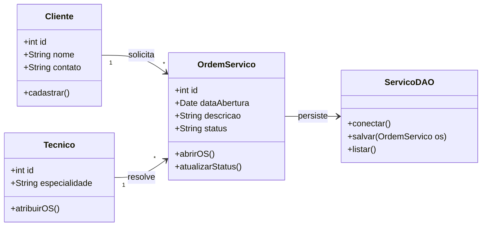
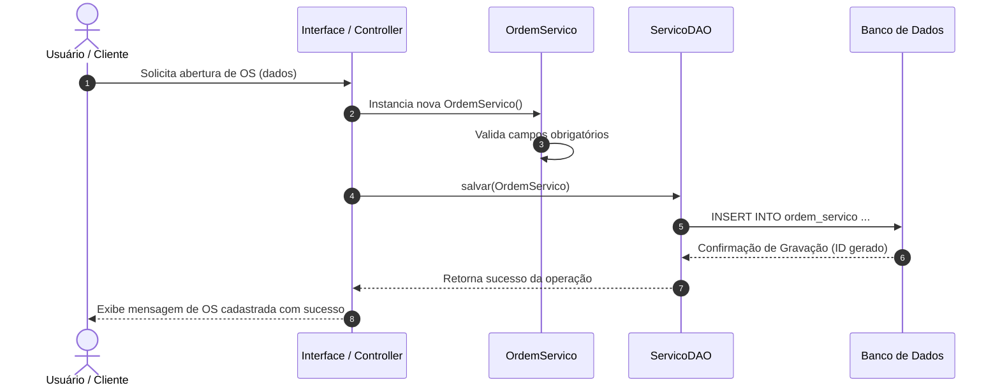
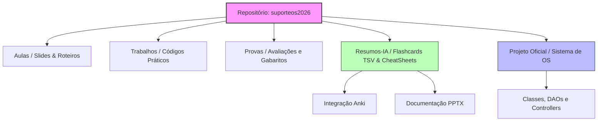

# 🎓 [Prof. Jefferson Passerini] Laboratório de Programação IV — Modelos Dinâmicos e Arquiteturais

Abaixo estão detalhados os três diagramas em **Mermaid** essenciais para a compreensão do ecossistema da disciplina de **Laboratório de Programação IV** (4º Semestre de Sistemas de Informação - UniFEF), tendo como base o projeto prático *suporteos2026*.

---

### 1. Diagrama de Classes UML (Domínio da Matéria)
Representa as principais entidades e regras orientadas a objetos mapeadas no sistema de Ordem de Serviço da disciplina.

* **Explicação Objetiva:** O diagrama evidencia a relação de cardinalidade onde um `Cliente` pode solicitar múltiplas `OrdemServico`, que por sua vez são atribuídas e resolvidas por um `Tecnico`. A camada de persistência é isolada através da classe `ServicoDAO`, aplicando o princípio de separação de responsabilidades (camada de dados vs. camada de domínio).

---

### 2. Diagrama de Sequência (Fluxo Técnico)
Descreve a interação dinâmica entre os componentes durante o processo de abertura e salvamento de uma nova Ordem de Serviço (`suporteos2026`).

* **Explicação Objetiva:** Este fluxo detalha o ciclo de vida de uma requisição de cadastro: parte da interface de usuário, passa pela validação das regras de negócio na entidade de domínio (`OrdemServico`), utiliza o DAO para realizar a persistência transacional no banco de dados relacional e retorna o feedback visual para o usuário final.

---

### 3. Diagrama Arquitetural do Repositório (Componentes/Pastas)
Mapeia a organização macro estrutural adotada no repositório de suporte oficial da disciplina (`suporteos2026`).

* **Explicação Objetiva:** O diagrama arquitetural ilustra a distribuição modular do ambiente de estudo do Prof. Jefferson Passerini. Ele divide o repositório entre materiais teóricos (`Aulas`, `Provas`), recursos de estudo autônomo otimizados por IA (`Resumos-IA`), códigos práticos desenvolvidos em laboratório e o projeto principal de suporte a ordens de serviço.