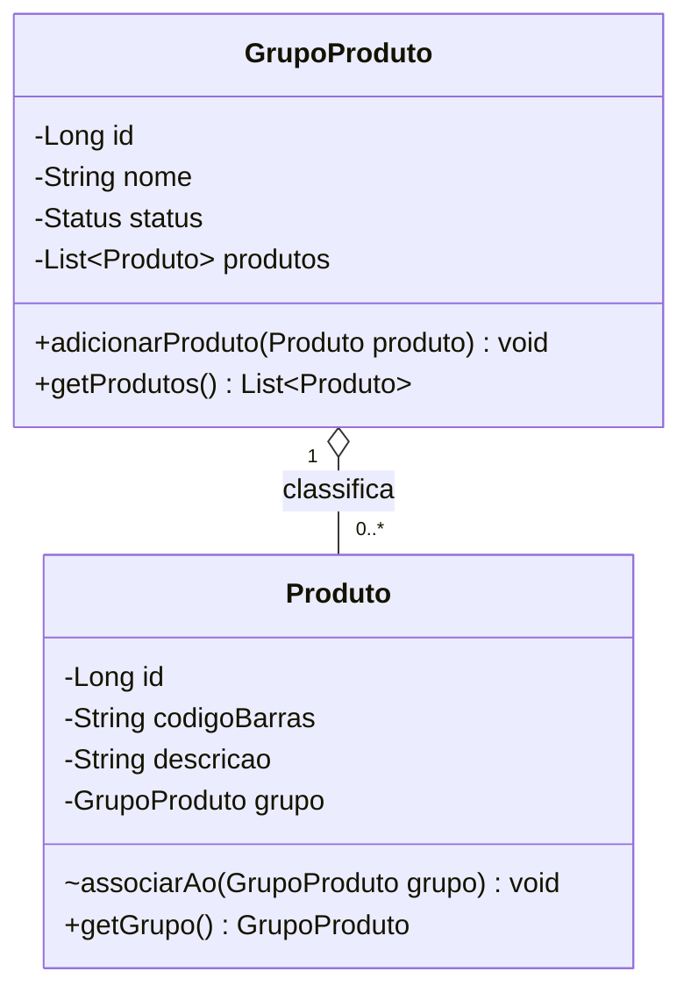
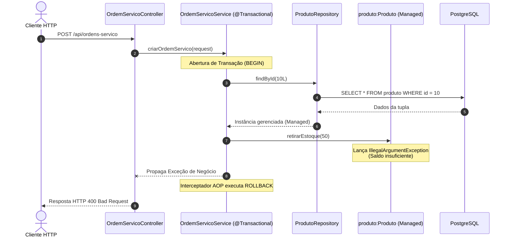
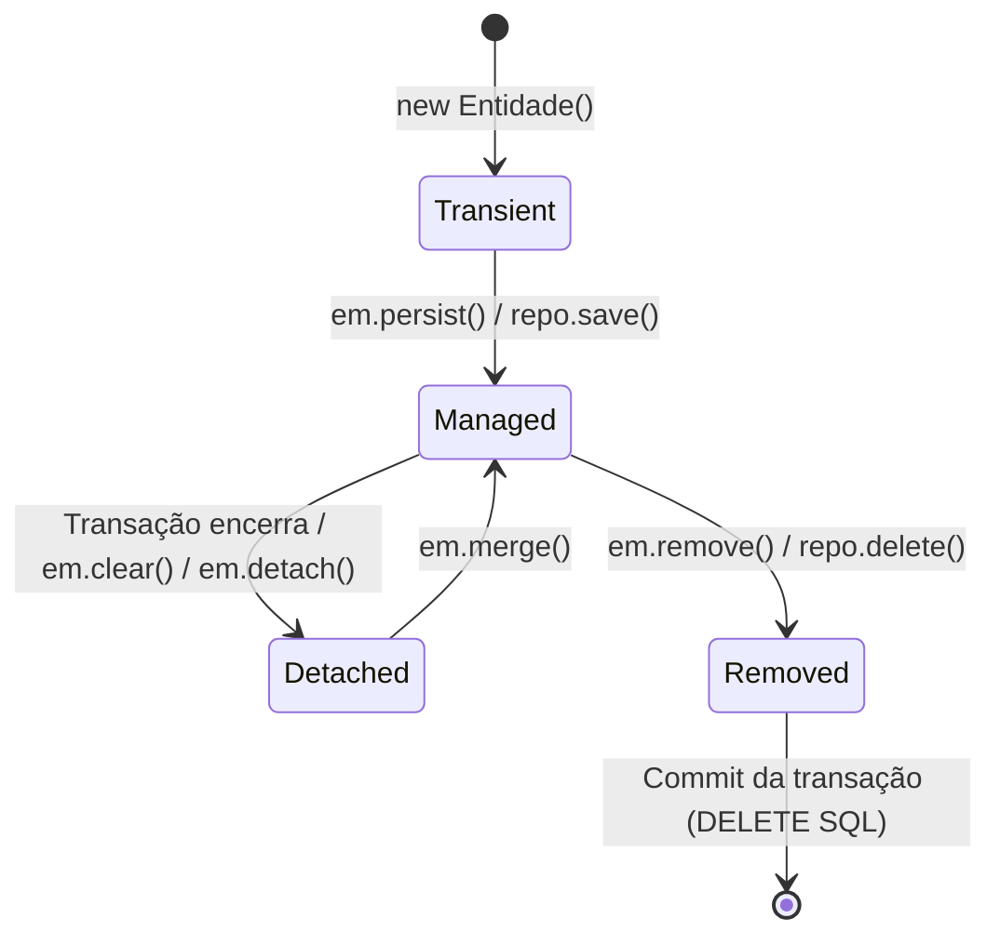

# Simulados Comentados - Laboratório de Programação IV

> **Instituição:** Centro Universitário de Votuporanga (UniFEF)  
> **Curso:** Bacharelado em Sistemas de Informação (4º Semestre)  
> **Disciplina:** Laboratório de Programação IV  
> **Docente:** Prof. Jefferson Passerini  
> **Tema Central:** Engenharia de Software Backend com Java 21, Spring Boot 3, JPA/Hibernate, PostgreSQL, Liquibase, Arquitetura REST e Governança com Git/Maven  
> **Projeto de Referência:** Suporte OS 2026 (`suporteos2026`)

---

## Sumário

- [Apresentação e Orientações Pedagógicas](#apresentação-e-orientações-pedagógicas)
- [Simulado 1 - Questões Objetivas](#simulado-1---questões-objetivas)
  - [Questão 01 - Modelo de Dados e Grafo Acíclico Dirigido no Git](#questão-01---modelo-de-dados-e-grafo-acíclico-dirigido-no-git)
  - [Questão 02 - Arquitetura da JVM e Resolução de Comandos no Sistema Operacional](#questão-02---arquitetura-da-jvm-e-resolução-de-comandos-no-sistema-operacional)
  - [Questão 03 - Reprodutibilidade de Build com Maven Wrapper e Ciclo de Vida](#questão-03---reprodutibilidade-de-build-com-maven-wrapper-e-ciclo-de-vida)
  - [Questão 04 - Semântica HTTP, Métodos Seguros e Idempotência na RFC 9110](#questão-04---semântica-http-métodos-seguros-e-idempotência-na-rfc-9110)
  - [Questão 05 - Aritmética de Ponto Flutuante e Encapsulamento com BigDecimal](#questão-05---aritmética-de-ponto-flutuante-e-encapsulamento-com-bigdecimal)
  - [Questão 06 - Integridade de Associações 1:N Bidirecionais em Memória](#questão-06---integridade-de-associações-1n-bidirecionais-em-memória)
  - [Questão 07 - Camada de Persistência e Estratégia ddl-auto](#questão-07---camada-de-persistência-e-estratégia-ddl-auto)
  - [Questão 08 - Governança de Esquema Relacional com Liquibase e Checksums](#questão-08---governança-de-esquema-relacional-com-liquibase-e-checksums)
  - [Questão 09 - Proxies Dinâmicos e Consultas Derivadas no Spring Data JPA](#questão-09---proxies-dinâmicos-e-consultas-derivadas-no-spring-data-jpa)
  - [Questão 10 - Gerenciamento Transacional Declarativo e Dirty Checking](#questão-10---gerenciamento-transacional-declarativo-e-dirty-checking)
  - [Questão 11 - Evolução de Esquema com o Padrão Expand-Migrate-Contract](#questão-11---evolução-de-esquema-com-o-padrão-expand-migrate-contract)
  - [Questão 12 - Blindagem da Borda da Aplicação com Records, DTOs e Bean Validation](#questão-12---blindagem-da-borda-da-aplicação-com-records-dtos-e-bean-validation)
- [Simulado 2 - Questões Discursivas](#simulado-2---questões-discursivas)
  - [Questão Discursiva 01 - Refatoração de Domínio Anêmico para Domínio Rico](#questão-discursiva-01---refatoração-de-domínio-anêmico-para-domínio-rico)
  - [Questão Discursiva 02 - Fronteiras Transacionais, Estados de Entidades e Rollback no Spring Data JPA](#questão-discursiva-02---fronteiras-transacionais-estados-de-entidades-e-rollback-no-spring-data-jpa)
  - [Questão Discursiva 03 - Evolução de Esquema com Liquibase sob Carga sem Interrupção de Serviço](#questão-discursiva-03---evolução-de-esquema-com-liquibase-sob-carga-sem-interrupção-de-serviço)
  - [Questão Discursiva 04 - Arquitetura em Camadas, Mapeamento Puro e Tratamento Global de Erros](#questão-discursiva-04---arquitetura-em-camadas-mapeamento-puro-e-tratamento-global-de-erros)
  - [Questão Discursiva 05 - Paridade de Ambientes, Governança de Segredos e Reprodutibilidade de Build](#questão-discursiva-05---paridade-de-ambientes-governança-de-segredos-e-reprodutibilidade-de-build)
- [Gabarito Comentado - Simulado 1 (Objetivas)](#gabarito-comentado---simulado-1-objetivas)
- [Gabarito Comentado - Simulado 2 (Discursivas)](#gabarito-comentado---simulado-2-discursivas)

---

## Apresentação e Orientações Pedagógicas

Este material de estudo reúne simulados técnicos para a disciplina de **Laboratório de Programação IV**, correspondente ao 4º semestre do curso de Sistemas de Informação da UniFEF, ministrada pelo Prof. Jefferson Passerini. O conteúdo integra as Aulas 00 a 07 da disciplina e a preparação para a Avaliação 1 (A1).

O instrumento divide-se em:
1. **Simulado 1 (Objetivas):** 12 questões de múltipla escolha elaboradas no formato padrão ENADE / Concursos Públicos de Tecnologia da Informação, contendo contextualização de problemas práticos de engenharia, código-fonte e avaliação conceitual de causa e efeito.
2. **Simulado 2 (Discursivas):** 5 questões discursivas de projeto, refatoração de código e justificativa arquitetural, contendo as respectivas rubricas de avaliação analítica por pontos.
3. **Gabarito Comentado:** Resolução detalhada de cada questão objetiva (justificando a opção correta e refutando cada uma das quatro distratoras) e respostas modelo completas para as questões discursivas, acompanhadas de diagramas em sintaxe nativa Mermaid e implementações em Java 21 / Spring Boot 3.

---

## Simulado 1 - Questões Objetivas

### Questão 01 - Modelo de Dados e Grafo Acíclico Dirigido no Git

Um engenheiro de software júnior integrando a equipe de desenvolvimento do projeto `suporteos2026` questionou o motivo pelo qual operações de criação de ramificações (`git branch feature/estoque`) e alternância de ponteiros (`git switch feature/estoque`) são executadas em milissegundos, independentemente do volume total de arquivos contidos no repositório. Paralelamente, ao inspecionar o diretório `.git`, observou que commits anteriores permaneciam inalterados, mesmo após comandos de mesclagem e reescrita de mensagens.

Considerando a estrutura matemática e a modelagem interna do Git, assinale a opção que descreve corretamente a razão técnica para esse comportamento:

A) O Git opera como um sistema de arquivos delta-baseado, calculando diferenças textuais em tempo real por meio de consultas recursivas ao servidor central hospedado no GitHub, mantendo cópias apenas dos arquivos modificados.  
B) O Git modela o histórico como um Grafo Acíclico Dirigido (DAG) de snapshots imutáveis indexados por funções hash criptográficas, em que uma branch é unicamente um arquivo de texto de 41 bytes contendo um ponteiro móvel para o hash de um commit.  
C) As branches no Git representam cópias físicas completas da árvore de diretórios armazenadas em diretórios temporários compactados dentro da pasta `.git/refs/heads`, o que isola o disco rígido principal contra acessos concorrentes.  
D) A imutabilidade dos commits decorre da camada de proteção do protocolo SSH (porta 22), que bloqueia modificações estruturais no repositório local caso a chave privada `id_ed25519` não possua privilégios administrativos no sistema operacional.  
E) O ponteiro especial `HEAD` mantém uma trava física exclusiva de leitura e gravação no banco de dados SQLite interno do Git, impedindo que múltiplos vértices do grafo apontem para o mesmo nó ancestral.

---

### Questão 02 - Arquitetura da JVM e Resolução de Comandos no Sistema Operacional

Durante a configuração do ambiente de desenvolvimento corporativo para a disciplina de Laboratório de Programação IV, um estudante instalou o pacote Eclipse Temurin JDK 21 em sua estação de trabalho Windows 11. No entanto, ao abrir o terminal PowerShell e executar a sequência de diagnósticos:

```powershell
java -version
javac -version
```

Obteve o seguinte resultado:

```text
openjdk version "17.0.10" 2024-01-16
javac : O termo 'javac' não é reconhecido como nome de cmdlet, função, arquivo de script ou programa operável.
```

Após análise com o comando `where.exe java`, o estudante descobriu a existência de uma entrada legada apontando para `C:\Program Files (x86)\Common Files\Oracle\Java\javapath\java.exe` posicionada no início da variável `PATH`.

Com base na arquitetura da plataforma Java (JVM, JRE, JDK) e no mecanismo de resolução de processos dos sistemas operacionais, assinale a alternativa correta:

A) A presença do comando `java` funcional atesta que o JDK 21 está instalado e operacional, bastando criar um alias no PowerShell apontando `javac` para o mesmo binário, uma vez que a JVM unificou o compilador na JRE a partir do Java 9.  
B) O sistema operacional resolveu uma JRE legada presente no início da variável `PATH`, que contém apenas a JVM e as bibliotecas padrão de tempo de execução, carecendo das ferramentas de desenvolvimento presentes exclusivamente no JDK, como o compilador `javac`.  
C) O erro de execução do `javac` ocorre porque variáveis de ambiente do usuário possuem precedência estrita sobre variáveis de ambiente de sistema, exigindo a desinstalação imediata do PowerShell para que o Git Bash assuma a execução.  
D) A variável `JAVA_HOME` é a única responsável pela resolução de executáveis disparados no terminal interativo, tornando irrelevante a ordem e os diretórios configurados na variável de ambiente `PATH`.  
E) A discrepância de versões reportada decorre do descompasso entre o carregador de classes da JVM e a compilação *Just-In-Time* (JIT), que compila o código-fonte diretamente para binários x86_64 sem necessidade física do utilitário `javac`.

---

### Questão 03 - Reprodutibilidade de Build com Maven Wrapper e Ciclo de Vida

Analise o seguinte fragmento extraído do arquivo `pom.xml` de um projeto Spring Boot corporativo:

```xml
<project xmlns="http://maven.apache.org/POM/4.0.0"
         xmlns:xsi="http://www.w3.org/2001/XMLSchema-instance"
         xsi:schemaLocation="http://maven.apache.org/POM/4.0.0 
         https://maven.apache.org/xsd/maven-4.0.0.xsd">
    <modelVersion>4.0.0</modelVersion>
    <parent>
        <groupId>org.springframework.boot</groupId>
        <artifactId>spring-boot-starter-parent</artifactId>
        <version>3.4.3</version>
        <relativePath/>
    </parent>
    <groupId>com.curso</groupId>
    <artifactId>suporteos</artifactId>
    <version>0.0.1-SNAPSHOT</version>
    <name>suporteos</name>
    <properties>
        <java.version>21</java.version>
    </properties>
    <!-- Dependências omitidas -->
</project>
```

Em uma esteira de Integração Contínua (CI), um pipeline de compilação disparou a instrução:

```bash
./mvnw clean package
```

Considerando o funcionamento do Apache Maven e do utilitário Maven Wrapper, avalie as assertivas a seguir:

I. O script `mvnw` intercepta a chamada, consulta o arquivo `.mvn/wrapper/maven-wrapper.properties` e faz o download automático da distribuição exata do Maven especificada no projeto caso ela não esteja presente no cache local do usuário, garantindo a neutralidade de ambiente.  
II. O comando `package` executa de forma cumulativa e ordenada as fases precedentes do ciclo de vida padrão do Maven, tais como `validate`, `compile`, `test-compile` e `test`, abortando a compilação caso algum teste unitário falhe.  
III. A herança de `spring-boot-starter-parent` define o gerenciamento centralizado de versões de dependências através da seção `<dependencyManagement>`, eliminando a necessidade de declarar tags `<version>` para dependências homologadas pelo ecossistema Spring.  
IV. O Maven Wrapper dispensa a instalação prévia de um Java Development Kit (JDK 21) na máquina de execução, pois o próprio script `./mvnw` embute uma JVM portátil em tempo de compilação.

Estão corretas apenas as afirmativas:

A) I e IV.  
B) II e III.  
C) I, II e III.  
D) II, III e IV.  
E) I, II, III e IV.

---

### Questão 04 - Semântica HTTP, Métodos Seguros e Idempotência na RFC 9110

Considere que uma API RESTful de controle de suporte técnico exponha as seguintes operações para gerenciamento do recurso `OrdemServico`:

- Operação 1: `GET /api/ordens-servico/15`
- Operação 2: `POST /api/ordens-servico`
- Operação 3: `PUT /api/ordens-servico/15`
- Operação 4: `DELETE /api/ordens-servico/15`

De acordo com a especificação formal do protocolo HTTP (RFC 9110), os métodos HTTP são categorizados segundo suas propriedades de segurança (*safety*) e idempotência (*idempotence*).

A esse respeito, assinale a afirmativa correta:

A) A Operação 2 (`POST`) é considerada idempotente, pois submeter o mesmo corpo JSON múltiplas vezes em sucessão resultará no mesmo recurso armazenado no banco de dados com a mesma chave primária gerada.  
B) As Operações 1 (`GET`), 3 (`PUT`) e 4 (`DELETE`) são idempotentes, pois execuções sucessivas de qualquer uma dessas requisições com os mesmos parâmetros produzem o mesmo efeito de estado final no servidor que uma única execução.  
C) A Operação 4 (`DELETE`) é considerada um método seguro, pois caso o recurso já tenha sido excluído na primeira chamada, as invocações subsequentes não alterarão o banco de dados e retornarão `404 Not Found`.  
D) A Operação 3 (`PUT`) só é considerada idempotente caso seja implementada com atualização parcial de campos, comportando-se de forma equivalente ao método `PATCH`.  
E) A segurança de um método HTTP impede que o servidor emita cabeçalhos de resposta que instruam o cliente ou proxies a realizarem cache da representação enviada.

---

### Questão 05 - Aritmética de Ponto Flutuante e Encapsulamento com BigDecimal

Considere o seguinte cenário de teste unitário implementado para avaliar o cálculo financeiro do valor total retido em estoque de uma determinada mercadoria:

```java
@Test
void deveDemonstrarCalculoDeEstoque() {
    double precoDouble = 0.1;
    double quantidadeDouble = 0.2;
    double totalDouble = precoDouble * quantidadeDouble;

    BigDecimal precoBD = new BigDecimal("0.10");
    BigDecimal quantidadeBD = new BigDecimal("0.200");
    BigDecimal totalBD = precoBD.multiply(quantidadeBD).setScale(2, RoundingMode.HALF_UP);

    BigDecimal valorComparacao = new BigDecimal("0.02");

    // Avaliação das variáveis
}
```

Com base na representação de tipos de dados numéricos em Java e nas regras de modelagem de domínio corporativo, avalie as afirmações:

I. O valor da variável `totalDouble` não é rigorosamente `0.02`, mas sim uma aproximação periódica binária resultante da especificação IEEE 754 adotada pelos tipos primitivos `double` e `float`, gerando imprecisões inaceitáveis para cálculos contábeis.  
II. A instanciação de `BigDecimal` através do construtor recebendo literal numérico de ponto flutuante (ex.: `new BigDecimal(0.1)`) neutraliza as imprecisões do IEEE 754, sendo matematicamente equivalente à instanciação por `String`.  
III. A invocação `totalBD.equals(valorComparacao)` retorna `true`, visto que ambos os objetos representam a quantia decimal numérica de dois centésimos.  
IV. A invocação `totalBD.compareTo(valorComparacao) == 0` avalia com precisão a igualdade de grandeza matemática entre os valores, ignorando eventuais divergências na escala declarada dos objetos.

Estão corretas apenas as afirmativas:

A) I e II.  
B) I e IV.  
C) II e III.  
D) I, III e IV.  
E) II, III e IV.

---

### Questão 06 - Integridade de Associações 1:N Bidirecionais em Memória

Analise o diagrama de classes que modela a associação bidirecional entre `GrupoProduto` e `Produto` no projeto de referência:



Para garantir que o grafo de objetos em memória permaneça consistente sem depender da intervenção do banco de dados, o arquiteto do projeto estabeleceu que o método `adicionarProduto` em `GrupoProduto` deve ser o único ponto de entrada para vincular um item ao seu respectivo grupo.

Assinale a opção que apresenta a justificativa técnica e o padrão de encapsulamento corretos para essa decisão de design:

A) A exposição pública de um método `setGrupo(GrupoProduto g)` em `Produto` é mandatória pelo padrão JavaBeans, permitindo que serviços externos gerenciem a lista interna do grupo via reflexão direta.  
B) A atribuição da visibilidade de pacote (*package-private*) ao método `associarAo(GrupoProduto g)` em `Produto` assegura que apenas a classe coordenadora `GrupoProduto` execute a amarração reversa, enquanto `getProdutos()` deve retornar `Collections.unmodifiableList(this.produtos)` para barrar adições diretas à lista que burlariam validações de unicidade.  
C) A lista interna `produtos` deve ser exposta como `public ArrayList<Produto>` para permitir que a biblioteca de persistência do Hibernate realize inserções em lote (*batch inserts*) sem disparar exceções de acesso concorrente.  
D) Relacionamentos bidirecionais em memória exigem o uso da anotação `@JsonBackReference` nas classes de domínio para impedir estouros de pilha (*StackOverflowError*) provocados pelo coletor de lixo da JVM durante a coleta de objetos órfãos.  
E) Caso um produto seja transferido de um grupo A para um grupo B, a referência reversa deve ser anulada manualmente através do comando de terminal `git rm --cached`, prevenindo vazamento de memória no contêiner IoC.

---

### Questão 07 - Camada de Persistência e Estratégia ddl-auto

Em um projeto empresarial baseado em Spring Boot 3 e PostgreSQL, a equipe de desenvolvimento deparou-se com a seguinte linha inserida no arquivo `application.properties`:

```properties
spring.jpa.hibernate.ddl-auto=update
```

Sob o ponto de vista das boas práticas de engenharia de software e da integridade de bancos de dados relacionais em produção, a utilização dessa diretiva é fortemente desaconselhada porque:

A) O Hibernate falha em converter anotações JPA em dialeto SQL quando conectado ao PostgreSQL, exigindo que o driver JDBC opere exclusivamente sob o modo `create-drop`.  
B) A propriedade `ddl-auto=update` não gerencia histórico versionado, não suporta renomeação segura de colunas (gerando colunas novas e mantendo as antigas órfãs com dados), ignora a integridade referencial preexistente em tabelas populadas e pode provocar bloqueios de tabela (*locks*) destrutivos em ambiente compartilhado.  
C) O Spring Data JPA rejeita a inicialização do contêiner de Inversão de Controle caso identifique que as entidades de domínio possuem atributos mapeados com a anotação `@Column(nullable = false)`.  
D) Essa estratégia força o recálculo imediato de todos os índices B-Tree do PostgreSQL a cada requisição HTTP recebida, degradando a performance das consultas para complexidade algorítmica $O(2^n)$.  
E) A propriedade impede que o framework realize o mapeamento de tipos modernos do Java, tais como `java.time.LocalDate` e `java.math.BigDecimal`, revertendo-os silenciosamente para tipos `VARCHAR(255)`.

---

### Questão 08 - Governança de Esquema Relacional com Liquibase e Checksums

O Liquibase controla a execução determinística de alterações de banco de dados através das tabelas de metadados `DATABASECHANGELOG` e `DATABASECHANGELOGLOCK`.

Considere que o seguinte `changeSet` foi aplicado com sucesso em ambiente de homologação:

```yaml
databaseChangeLog:
  - changeSet:
      id: 001-create-grupo-produto
      author: jefferson
      changes:
        - createTable:
            tableName: grupo_produto
            columns:
              - column:
                  name: id
                  type: BIGINT
                  autoIncrement: true
                  constraints:
                    primaryKey: true
                    primaryKeyName: pk_grupo_produto
              - column:
                  name: nome
                  type: VARCHAR(120)
                  constraints:
                    nullable: false
```

Posteriormente, um desenvolvedor editou diretamente o arquivo original, alterando o tamanho da coluna `nome` de `VARCHAR(120)` para `VARCHAR(150)` e disparou a aplicação novamente.

Ao inicializar, a aplicação abortou com a mensagem de erro:

```text
liquibase.exception.ValidationFailedException: Validation Failed:
    1 change sets check sum
          db/changelog/001-create-grupo-produto.yaml::001-create-grupo-produto::jefferson was: 9:a1b2c3... but is now: 9:f4e5d6...
```

Assinale a opção que explica corretamente o mecanismo violado e a ação corretiva adequada:

A) O Liquibase identificou que o banco de dados sofreu um *deadlock* na tabela `DATABASECHANGELOGLOCK`, sendo necessário alterar manualmente a flag `locked` para `1` via comando `UPDATE`.  
B) A tríade identificadora `(id, author, filename)` está vinculada a uma soma de verificação (*checksum*) criptográfica imutável calculada na execução; a alteração retroativa do arquivo corrompe a garantia de rastreabilidade, sendo mandatório reverter o arquivo modificado e criar um **novo** `changeSet` incremental (ex.: `002-alter-grupo-produto-tamanho-nome.yaml`).  
C) O erro ocorre porque o Liquibase exige que colunas do tipo `VARCHAR` tenham seus tamanhos especificados exclusivamente em múltiplos de 32 bytes no dialeto PostgreSQL.  
D) Para resolver o erro sem alterar o histórico, deve-se trocar o banco de dados para H2 em memória, pois o H2 ignora a coluna `md5sum` gravada no catálogo relacional.  
E) O desenvolvedor deve apagar o registro correspondente diretamente na tabela `DATABASECHANGELOG` em produção através de uma consulta SQL ad-hoc, permitindo que o Liquibase recrie a tabela do zero.

---

### Questão 09 - Proxies Dinâmicos e Consultas Derivadas no Spring Data JPA

Considere a seguinte interface de repositório declarada em uma aplicação corporativa:

```java
public interface ProdutoRepository extends JpaRepository<Produto, Long> {
    
    Optional<Produto> findByCodigoBarras(String codigoBarras);
    
    List<Produto> findByGrupo_IdAndStatusOrderByDescricaoAsc(Long grupoId, Status status);
    
    boolean existsByCodigoBarras(String codigoBarras);
}
```

Sobre o funcionamento interno do Spring Data JPA na gestão dessa interface, analise as afirmativas:

I. Durante o bootstrap da aplicação, o Spring Data inspeciona o classpath, detecta a interface filha de `Repository` e cria em tempo de execução uma instância de proxy dinâmico acoplada à implementação base `SimpleJpaRepository`, registrando-a como um Spring Bean gerenciado.  
II. O método `findByCodigoBarras` é traduzido em uma consulta JPQL pelo analisador de métodos derivados do framework, que decompõe o nome a partir da palavra reservada `By` e gera uma restrição de igualdade sobre o atributo correspondente da entidade `Produto`.  
III. A partícula `Grupo_Id` utiliza a convenção de travessia explícita (*property traversal*) com sublinhado, instruindo o framework a navegar pela associação `grupo` até a chave primária `id` do grupo vinculado, evitando ambiguidades conceituais.  
IV. Métodos de repositório que retornam tipos `Optional<T>` disparam obrigatoriamente uma `EntityNotFoundException` caso a consulta retorne vazio, dispensando o tratamento na camada de serviço.

Estão corretas apenas as afirmativas:

A) I e IV.  
B) II e III.  
C) I, II e III.  
D) II, III e IV.  
E) I, II, III e IV.

---

### Questão 10 - Gerenciamento Transacional Declarativo e Dirty Checking

Em um serviço de aplicação da classe `ProdutoService`, foi implementado o seguinte método de negócio:

```java
@Service
public class ProdutoService {

    private final ProdutoRepository produtoRepository;

    public ProdutoService(ProdutoRepository produtoRepository) {
        this.produtoRepository = produtoRepository;
    }

    @Transactional
    public void aplicarReajustePreco(Long produtoId, BigDecimal percentual) {
        Produto produto = produtoRepository.findById(produtoId)
                .orElseThrow(() -> new RecursoNaoEncontradoException("Produto não localizado"));
        
        produto.reajustarPreco(percentual);
        // Observação: produtoRepository.save(produto) NÃO foi invocado explicitamente.
    }
}
```

Ao executar o método sob uma transação ativa, o desenvolvedor notou que o novo preço reajustado foi persistido com sucesso no banco de dados relacional PostgreSQL após o encerramento do método.

Assinale a alternativa que elucida o mecanismo da JPA/Hibernate responsável por esse comportamento:

A) O repositório detecta chamadas de métodos mutadores através de bibliotecas de instrumentação de bytecode e emite imediatamente um comando SQL `UPDATE` no momento exato em que `produto.reajustarPreco(percentual)` é finalizado.  
B) A anotação `@Transactional` força o recarregamento total do banco de dados na saída do método, persistindo todas as variáveis locais presentes na pilha de execução (*stack*) da thread.  
C) Ao ser recuperada dentro de uma transação aberta, a entidade `Produto` passa a ocupar o estado **managed** no Contexto de Persistência; durante a fase de *flush* pré-commit, o Hibernate executa o mecanismo de **dirty checking**, comparando o estado atual do objeto com um snapshot original e emitindo o `UPDATE` automaticamente.  
D) O método `save` foi invocado implicitamente através do coletor de lixo da JVM, que intercepta objetos marcados com `@Entity` antes de desalocá-los da memória Heap.  
E) Caso o método fosse configurado como `@Transactional(readOnly = true)`, o Hibernate ignoraria o reajuste em memória, mas o driver JDBC executaria a gravação diretamente por meio de um canal de autocommit secundário.

---

### Questão 11 - Evolução de Esquema com o Padrão Expand-Migrate-Contract

Deseja-se adicionar uma coluna obrigatória (`NOT NULL`) denominada `estoque_minimo` na tabela `produto`, a qual já possui mais de 500.000 registros ativos gravados no PostgreSQL de produção.

A aplicação direta de um comando SQL:

```sql
ALTER TABLE produto ADD COLUMN estoque_minimo NUMERIC(18, 3) NOT NULL;
```

Resultará em falha catastrófica no banco de dados:

```text
ERROR: column "estoque_minimo" of relation "produto" contains null values
```

Para mitigar esse problema aplicando o padrão arquitetural **Expand-Migrate-Contract** com Liquibase, qual sequência ordenada de operações deve ser estruturada em `changeSets` atômicos?

A) Adicionar a coluna com restrição `NOT NULL` e valor padrão `DEFAULT 0` diretamente no mesmo comando DDL, forçando o PostgreSQL a bloquear a tabela para leitura e escrita durante a reindexação completa.  
B) 1. Expandir: Criar a coluna `estoque_minimo` permitindo valores nulos (`nullable: true`).  
   2. Migrar: Executar instrução de atualização de dados (*backfill*) populando as linhas existentes que estejam com valor nulo (`UPDATE produto SET estoque_minimo = 0 WHERE estoque_minimo IS NULL`).  
   3. Contrair: Aplicar a restrição de obrigatoriedade (`addNotNullConstraint`) e adicionar a regra de validação física (`addCheckConstraint` validando valor $\ge 0$).  
C) Dropar a tabela `produto`, recriá-la com o novo esquema contendo a coluna obrigatória e importar os dados históricos a partir de um arquivo de dump CSV desprovido de integridade referencial.  
D) Mudar o tipo da coluna no Java para `Optional<BigDecimal>` e manter o banco de dados sem a coluna física, deixando o controle de valor padrão inteiramente a cargo do construtor protegido do JPA.  
E) Executar a ferramenta `liquibase:diff` apontando para o banco de produção ativo com a flag `--force-drop-columns=true`, para que o plugin normalize a tabela automaticamente.

---

### Questão 12 - Blindagem da Borda da Aplicação com Records, DTOs e Bean Validation

Analise o seguinte controlador REST desenvolvido em Spring Boot 3:

```java
@RestController
@RequestMapping("/api/grupos-produtos")
public class GrupoProdutoController {

    private final GrupoProdutoService service;
    private final GrupoProdutoMapper mapper;

    public GrupoProdutoController(GrupoProdutoService service, GrupoProdutoMapper mapper) {
        this.service = service;
        this.mapper = mapper;
    }

    @PostMapping
    public ResponseEntity<GrupoProdutoResponse> cadastrar(@RequestBody @Valid GrupoProdutoRequest request) {
        GrupoProduto grupo = mapper.toEntity(request);
        GrupoProduto salvo = service.cadastrar(grupo);
        GrupoProdutoResponse response = mapper.toResponse(salvo);
        
        URI uri = ServletUriComponentsBuilder.fromCurrentRequest()
                .path("/{id}")
                .buildAndExpand(response.id())
                .toUri();
                
        return ResponseEntity.created(uri).body(response);
    }
}
```

O payload de entrada é governado pelo seguinte DTO estruturado como Java Record:

```java
public record GrupoProdutoRequest(
    @NotBlank(message = "O nome do grupo é obrigatório")
    @Size(min = 2, max = 120, message = "O nome deve conter entre 2 e 120 caracteres")
    String nome
) {}
```

Com relação ao design dessa arquitetura de borda, avalie as assertivas:

I. O uso de Java Records como DTOs confere imutabilidade estrita aos dados trafegados na camada web, eliminando métodos *setters* que poderiam introduzir efeitos colaterais pós-desserialização.  
II. A ausência da anotação `@Valid` antes de `@RequestBody` faria com que o Spring Boot ignorasse silenciosamente as anotações do Bean Validation (`@NotBlank`, `@Size`), permitindo que strings em branco chegassem à camada de aplicação.  
III. Retornar diretamente a entidade JPA `@Entity GrupoProduto` no método do controlador melhoraria a performance da API, pois evitaria o overhead de instanciação de objetos DTO e permitiria que o Jackson serializasse relacionamentos bidirecionais sem risco de loops infinitos.  
IV. A emissão do status HTTP `201 Created` acompanhado pelo cabeçalho `Location` contendo a URI canônica do novo recurso cumpre estritamente o protocolo RESTful especificado na RFC 9110.

Estão corretas apenas as afirmativas:

A) I e III.  
B) II e IV.  
C) I, II e IV.  
D) II, III e IV.  
E) I, II, III e IV.

---

## Simulado 2 - Questões Discursivas

### Questão Discursiva 01 - Refatoração de Domínio Anêmico para Domínio Rico

Em uma revisão de código (*code review*) no âmbito do projeto `suporteos2026`, o líder técnico deparou-se com a seguinte implementação da classe de domínio `Produto`:

```java
// Implementação submetida (Modelo Anêmico)
public class Produto {
    public Long id;
    public String codigoBarras;
    public String descricao;
    public double saldoEstoque;
    public double valorUnitario;
    public LocalDate dataCadastro;
    public String status;
    public GrupoProduto grupo;

    public Produto() {}

    // Getters e Setters públicos triviais para todos os campos, sem validações
    public double getSaldoEstoque() { return saldoEstoque; }
    public void setSaldoEstoque(double saldoEstoque) { this.saldoEstoque = saldoEstoque; }
    public void setValorUnitario(double valorUnitario) { this.valorUnitario = valorUnitario; }
}
```

O serviço de aplicação que consome essa classe executava rotinas do tipo:

```java
produto.setSaldoEstoque(produto.getSaldoEstoque() - quantidadeSolicitada);
```

**Com base nos conceitos de Domain-Driven Design (DDD) e Engenharia de Software Orientada a Objetos, realize as seguintes tarefas:**

1. Explique conceitualmente por que essa implementação caracteriza o antipadrão **Modelo de Domínio Anêmico (Anemic Domain Model)** e aponte os riscos de integridade que ela impõe ao ciclo de vida da aplicação.
2. Apresente o código Java refatorado da classe `Produto` aplicando o **Modelo Rico**, contemplando:
   - Encapsulamento rigoroso de atributos privados;
   - Construtor canônico rico com validação de invariantes (código de barras obrigatório, descrição obrigatória, saldo e valor não negativos);
   - Construtor protegido sem argumentos exigido pela especificação JPA;
   - Substituição de tipos primitivos `double` pelo tipo exato `java.math.BigDecimal`;
   - Métodos de negócio expressivos para `receberEstoque(BigDecimal quantidade)` e `retirarEstoque(BigDecimal quantidade)` contendo proteção contra saldos negativos;
   - Método de cálculo `calcularValorEstoque()` com controle explícito de escala e arredondamento `HALF_UP`.

---

### Questão Discursiva 02 - Fronteiras Transacionais, Estados de Entidades e Rollback no Spring Data JPA

Considere o seguinte fluxo de negócio onde a criação de uma `OrdemServico` exige a baixa imediata de peças no estoque através do método `retirarEstoque` das entidades `Produto` envolvidas. Caso o estoque de qualquer um dos itens seja insuficiente, nenhuma alteração pode ser persistida no banco de dados.

Analise o diagrama de sequência representativo:



**Com base nos fundamentos de persistência e gerenciamento transacional do Spring Boot:**

1. Descreva o ciclo de vida de uma entidade JPA, conceituando e diferenciando os quatro estados fundamentais: **transient**, **managed**, **detached** e **removed**. Em qual desses estados a entidade `Produto` se encontra no momento em que seu método `retirarEstoque` é invocado no diagrama?
2. Explique o que é o mecanismo de **dirty checking** do Hibernate e justifique por que não foi necessário invocar `produtoRepository.save(produto)` para persistir as alterações caso o método tivesse sido concluído com êxito.
3. Explique a regra padrão de rollback da anotação `@Transactional` do Spring Framework em relação a exceções checadas (*checked exceptions*) e não-checadas (*unchecked / RuntimeException*). O que teria ocorrido com os dados no banco se o método tivesse capturado a `IllegalArgumentException` internamente em um bloco `try/catch` genérico sem relançá-la?

---

### Questão Discursiva 03 - Evolução de Esquema com Liquibase sob Carga sem Interrupção de Serviço

Uma grande organização de tecnologia opera a aplicação `suporteos2026` com PostgreSQL 16 em produção, suportando centenas de transações simultâneas por segundo. Surgiu a necessidade de negócio de adicionar o campo obrigatório `cnpj` (VARCHAR de 14 dígitos, único e não-nulo) e a chave estrangeira `fornecedor_id` (opcional) na tabela `produto`, que conta atualmente com 2 milhões de tuplas ativas.

**Com base na governança estrita de banco de dados via Liquibase:**

1. Justifique tecnicamente por que a execução de um script SQL imperativo manual executado diretamente no console de produção (*pgAdmin* ou *psql*) sem versionamento é proibida pela engenharia de software corporativa.
2. Explique por que a chave estrangeira `fornecedor_id` deve nascer com cardinalidade relacional **opcional** (`nullable = true`) em sistemas legados em produção, correlacionando essa decisão com a compatibilidade retroativa.
3. Escreva um arquivo de migração declarativo do Liquibase em formato **YAML** estruturado em múltiplos `changeSets` atômicos aplicando o padrão **Expand-Migrate-Contract** para a introdução da coluna de auditoria `codigo_rastreio` como obrigatória (`NOT NULL`) na tabela `produto`, incluindo o comando de *backfill* e regras de reversão (*rollback*).

---

### Questão Discursiva 04 - Arquitetura em Camadas, Mapeamento Puro e Tratamento Global de Erros

Um desenvolvedor iniciante propôs o seguinte método dentro de uma classe anotada com `@RestController`:

```java
// Código submetido para avaliação
@PostMapping("/api/cadastrarProduto")
public Produto salvarDireto(@RequestBody Produto produto) {
    if (produto.getDescricao() == null || produto.getDescricao().isBlank()) {
        throw new RuntimeException("Descrição inválida!");
    }
    return produtoRepository.save(produto);
}
```

Aponte as violações arquiteturais presentes nesse trecho de código e reestruture a solução de ponta a ponta:

1. Identifique e justifique ao menos **três violações graves** de design de software no código apresentado (considere REST, acoplamento de camadas, segurança e tratamento de erros).
2. Apresente a implementação completa da classe manipuladora global de exceções anotada com `@RestControllerAdvice`, especializada em capturar:
   - Exceções de validação de argumentos da API (`MethodArgumentNotValidException`);
   - Exceções de regras de negócio personalizadas (`RecursoNaoEncontradoException` e `RegraNegocioException`).
3. Modele e apresente o Java Record `ApiError` que padronizará o corpo das respostas de erro (RFC 7807 / padrão corporativo), contendo timestamp, código HTTP, mensagem descritiva, rota acessada e lista de campos violados.

---

### Questão Discursiva 05 - Paridade de Ambientes, Governança de Segredos e Reprodutibilidade de Build

No início do semestre letivo, um grupo de estudantes sugeriu simplificar a configuração de desenvolvimento do projeto temático adotando o banco de dados em memória **H2** para o perfil de testes e desenvolvimento local, mantendo o **PostgreSQL** unicamente no servidor de produção. Adicionalmente, sugeriram versionar as senhas do banco de dados diretamente no arquivo `application.properties` principal dentro do Git para evitar "perda de tempo configurando variáveis de ambiente".

**Com base nos princípios de governança de software (The Twelve-Factor App) e segurança da informação:**

1. Refute a proposta de adoção do H2, demonstrando formalmente as razões pelas quais a disciplina de Laboratório de Programação IV exige a **paridade estrita de ambientes** utilizando instâncias reais do PostgreSQL isoladas para os perfis `dev` e `test`.
2. Explique a vulnerabilidade de segurança e os riscos de auditoria associados ao commit de senhas e segredos no controle de versão Git (mesmo em repositórios privados). Descreva como o arquivo `.env`, o arquivo `.env.example` e a propriedade `.gitignore` devem ser orquestrados para blindar a aplicação.
3. Demonstre a estrutura de propriedades do Spring Boot (`application.properties`, `application-dev.properties` e `application-test.properties`), detalhando como o mecanismo de interpolação de variáveis de ambiente (`${DB_PASSWORD}`) opera para injetar as credenciais em tempo de execução sem exposição no código.

---

## Gabarito Comentado - Simulado 1 (Objetivas)

### Questão 01 - Modelo de Dados e Grafo Acíclico Dirigido no Git
- **Gabarito:** **B**
- **Justificativa Técnica:** O Git modela o histórico de um repositório como um Grafo Acíclico Dirigido (*Directed Acyclic Graph* - DAG), composto por nós imutáveis que representam snapshots integrais do projeto (objetos do tipo `commit`), identificados unicamente por hashes criptográficos (SHA-1 ou SHA-256). Uma branch não duplica pastas nem armazena deltas em árvores separadas; ela é estritamente uma referência leve (um arquivo de 41 bytes, contendo 40 caracteres hexadecimais mais uma quebra de linha) alocada em `.git/refs/heads/<nome-da-branch>`, que aponta diretamente para o hash do commit mais recente daquela linha de desenvolvimento. Mover ou criar branches resume-se a ler e gravar 41 bytes no disco, o que confere velocidade instantânea à operação independentemente do tamanho do código-fonte.
- **Análise dos Distratores:**
  - *A está incorreta* porque o Git **não** é delta-baseado (como eram o SCCS ou o CVS) e **não** depende de conexões recursivas com o GitHub para operações locais; o Git é um sistema de controle de versão distribuído que armazena snapshots completos offline no diretório local `.git`.
  - *C está incorreta* porque as branches não criam cópias físicas completas de diretórios; essa premissa descreve ferramentas arcaicas baseadas em cópias manuais de pastas (ex.: `projeto_copia_final`). No Git, o diretório de trabalho é compartilhado e gerenciado pelo ponteiro `HEAD`.
  - *D está incorreta* porque o protocolo SSH atua unicamente na camada de transporte de rede durante operações remotas (`push`/`pull`). A imutabilidade dos commits é uma propriedade matemática do DAG: alterar qualquer arquivo ou metadado altera o hash do commit, gerando um novo nó e quebrando a integridade de todos os nós filhos subsequentes.
  - *E está incorreta* porque o Git não utiliza o banco de dados relacional SQLite para controlar seus ponteiros ou árvores; ele utiliza um armazenamento de objetos endereçado por conteúdo (*content-addressable key-value store*) puramente baseado em arquivos planos organizados no diretório `.git/objects`.

---

### Questão 02 - Arquitetura da JVM e Resolução de Comandos no Sistema Operacional
- **Gabarito:** **B**
- **Justificativa Técnica:** A plataforma Java divide-se estruturalmente em JVM (motor de execução de bytecode), JRE (JVM + bibliotecas de tempo de execução como `java.base`) e JDK (JRE + ferramentas de compilação e diagnóstico como `javac`, `javap`, `jcmd`). O utilitário `javac` é o compilador Java-para-bytecode e existe exclusivamente no JDK. Quando o sistema operacional recebe um comando interativo no terminal, ele varre sequencialmente os diretórios cadastrados na variável de ambiente `PATH`. O resultado `where.exe java` revelou que um diretório contendo uma JRE 17 legada (`Oracle\Java\javapath`) estava posicionado à frente do diretório do JDK 21. Assim, o terminal encontrou e disparou o binário `java.exe` da JRE 17 e, ao buscar `javac`, abortou com erro por ser incapaz de localizar o compilador, que não existe em uma JRE.
- **Análise dos Distratores:**
  - *A está incorreta* porque criar um alias apontando `javac` para `java.exe` provocará falha estrutural; `java` é o lançador da máquina virtual que executa classes compiladas, enquanto `javac` é um binário completamente distinto com parâmetros próprios que realiza análise léxica, sintática e emissão de bytecode.
  - *C está incorreta* porque a ordem entre variáveis de usuário e de sistema no Windows é padronizada (o sistema concatena as duas listas), e a troca de terminais (PowerShell por Git Bash) não resolve o problema subjacente de ausência do caminho do compilador no `PATH`.
  - *D está incorreta* porque o terminal interativo não executa comandos consultando primariamente `JAVA_HOME`. A variável `JAVA_HOME` é uma convenção corporativa consumida por ferramentas externas (como Maven, Gradle e Tomcat); o interpretador de comandos do sistema operacional consulta exclusivamente a variável `PATH`.
  - *E está incorreta* porque a compilação JIT (*Just-In-Time*) ocorre em tempo de execução dentro da JVM a partir de bytecode previamente gerado, não tendo relação com a compilação estática do código-fonte `.java` para `.class`, que exige obrigatoriamente o `javac`.

---

### Questão 03 - Reprodutibilidade de Build com Maven Wrapper e Ciclo de Vida
- **Gabarito:** **C**
- **Justificativa Técnica:** As afirmativas I, II e III são rigorosamente verdadeiras. O Maven Wrapper garante que o projeto declare e execute uma versão canônica do Apache Maven sem depender da existência de um Maven global previamente configurado na máquina (I). O ciclo de vida de build padrão (*default lifecycle*) do Maven é ordenado e estritamente cumulativo: executar a fase `package` dispara automaticamente as fases `validate`, `compile`, `test` etc., interrompendo o fluxo imediatamente caso um teste falhe (II). O artefato `spring-boot-starter-parent` provê uma seção centralizada de gerenciamento de dependências e plugins, permitindo que dependências oficiais do Spring e de terceiros (como Jackson, Hibernate e PostgreSQL Driver) omitam versões no `pom.xml` filho (III).
- **Análise dos Distratores:**
  - *A afirmativa IV é falsa* porque o Maven Wrapper é apenas um script disparador escrito em shell script/batch acoplado a um pequeno arquivo JAR de download (`maven-wrapper.jar`). Ele **não** embute uma JVM nem faz o download do JDK; o wrapper exige expressamente que a máquina hospedeira já possua um Java Runtime/JDK compatível configurado no `PATH` ou no `JAVA_HOME`. Assim, qualquer opção que contenha o item IV (A, D, E) está errada.
  - A alternativa **C** contempla unicamente as assertivas verdadeiras (I, II e III).

---

### Questão 04 - Semântica HTTP, Métodos Seguros e Idempotência na RFC 9110
- **Gabarito:** **B**
- **Justificativa Técnica:** Na especificação HTTP (RFC 9110), um método é **idempotente** se o efeito colateral no estado do servidor decorrente de múltiplas requisições idênticas consecutivas for exatamente o mesmo que o de uma única requisição. O método `GET` é seguro e inerentemente idempotente (apenas lê representações). O método `PUT` substitui integralmente a representação do recurso identificado; submeter o mesmo corpo JSON repetidamente deixará o recurso no mesmo estado final. O método `DELETE` remove o recurso do sistema; na primeira chamada o item é deletado, e nas chamadas subsequentes o recurso permanecerá deletado (o fato do status code mudar de `204 No Content` para `404 Not Found` não viola a idempotência, pois esta diz respeito ao **estado do servidor**, e não ao código de resposta).
- **Análise dos Distratores:**
  - *A está incorreta* porque o método `POST` não é idempotente; submeter um `POST` três vezes consecutivas instrui o servidor a instanciar e gravar três recursos distintos com identidades e chaves primárias diferentes.
  - *C está incorreta* porque `DELETE` **não** é um método seguro. Um método seguro (*safe*) não pode provocar alterações no estado do servidor; `DELETE` altera o estado destruindo dados.
  - *D está incorreta* porque atualizações parciais são semântica nativa do método `PATCH`, que não é formalmente garantido como idempotente pela RFC 9110. O `PUT` é a substituição integral de recurso e é idempotente por definição.
  - *E está incorreta* porque a segurança de um método (como no `GET`) é precisamente a precondição primária que autoriza navegadores e proxies intermediários a cachearem respostas para economizar tráfego de rede.

---

### Questão 05 - Aritmética de Ponto Flutuante e Encapsulamento com BigDecimal
- **Gabarito:** **B**
- **Justificativa Técnica:** A afirmativa I é verdadeira: na representação binária IEEE 754 de 32 e 64 bits (`float` e `double`), frações decimais simples como 0.1 e 0.2 tornam-se dízimas periódicas binárias infinitas, culminando em resíduos de arredondamento como `totalDouble = 0.020000000000000004`. A afirmativa IV é verdadeira: o método `compareTo` de `BigDecimal` avalia exclusivamente a grandeza matemática do número, retornando `0` para valores equivalentes (`0.02` vs `0.020`).
- **Análise dos Distratores:**
  - *A afirmativa II é falsa* porque instanciar `new BigDecimal(0.1)` transfere a imprecisão binária preexistente do literal de ponto flutuante para a representação do objeto, resultando internamente no valor `0.1000000000000000055511151231257827021181583404541015625`. A única forma segura é instanciar via `new BigDecimal("0.1")` ou `BigDecimal.valueOf(0.1)`.
  - *A afirmativa III é falsa* porque o método `equals` de `BigDecimal` avalia o valor numérico **e** a escala (`scale`). Como `totalBD` possui escala 2 (`0.02`) e uma variável com escala 3 (`0.020`) possui quantidade diferente de zeros à direita, `equals` retorna `false`. Para comparações contábeis e testes unitários, o uso de `compareTo() == 0` é mandatório.
  - Portanto, apenas as assertivas I e IV são corretas (Alternativa **B**).

---

### Questão 06 - Integridade de Associações 1:N Bidirecionais em Memória
- **Gabarito:** **B**
- **Justificativa Técnica:** Em programação orientada a objetos pura, as associações bidirecionais exigem que os dois ponteiros de memória estejam sincronizados. Permitir que classes de fora do agregado manipulem a lista ou o ponteiro reverso de forma desregulada causa corrupção de estado (um produto aponta para o grupo G1, mas a lista de G1 não contém o produto). Ao conferir visibilidade de pacote (*package-private*) ao método `associarAo` em `Produto`, garante-se que apenas as classes do mesmo pacote (como `GrupoProduto`) possam manusear o vínculo reverso. Paralelamente, `GrupoProduto.getProdutos()` deve retornar `Collections.unmodifiableList(this.produtos)` para impedir que código cliente execute `grupo.getProdutos().add(p)`, o que burlaria validações de duplicidade de código de barras.
- **Análise dos Distratores:**
  - *A está incorreta* porque expor setters públicos anula o encapsulamento, produz o antipadrão Modelo Anêmico e impede que a entidade garanta suas invariantes de consistência.
  - *C está incorreta* porque expor campos como `public` viola o princípio básico de encapsulamento da POO, além de acoplar o domínio à implementação concreta `ArrayList`.
  - *D está incorreta* porque `@JsonBackReference` é uma anotação de serialização JSON da biblioteca Jackson (camada de apresentação/API), que jamais deve ser introduzida em regras fundamentais de domínio em memória pura para gerenciar o coletor de lixo da JVM.
  - *E está incorreta* porque o comando `git rm --cached` é uma instrução de linha de comando do Git para remover arquivos do índice de versionamento, não tendo qualquer relação com gerenciamento de memória em tempo de execução na JVM.

---

### Questão 07 - Camada de Persistência e Estratégia ddl-auto
- **Gabarito:** **B**
- **Justificativa Técnica:** Em ambientes empresariais, a integridade do banco de dados relacional é governada exclusivamente por ferramentas de migração declarativas versionadas (como o Liquibase). O uso de `ddl-auto=update` do Hibernate é desastroso em produção pelos seguintes fatores: (1) ausência de rastreabilidade e versionamento do histórico de alterações; (2) incapacidade de efetuar renomeações de colunas com preservação de dados (ele cria a nova coluna vazia e mantém a antiga órfã); (3) incapacidade de planejar o ciclo de transição de dados para colunas `NOT NULL`; e (4) risco de contenção de travas de metadados (*table/catalog locks*) em servidores que iniciam múltiplas instâncias em cluster concorrente. O padrão corporativo estrito exige `spring.jpa.hibernate.ddl-auto=validate`.
- **Análise dos Distratores:**
  - *A está incorreta* porque o Hibernate possui dialeto nativo robusto para PostgreSQL (`PostgreSQLDialect`), e o modo `create-drop` destrói o banco a cada reinicialização, sendo inviável para produção.
  - *C está incorreta* porque o Spring Data JPA gerencia entidades com restrições `@Column(nullable = false)` normalmente; é justamente o suporte a essas constraints que caracteriza o mapeamento relacional.
  - *D está incorreta* porque a regeneração de índices B-Tree é governada pelo motor do PostgreSQL durante inserções e comandos DDL, não tendo complexidade $O(2^n)$ e não sendo disparada a cada requisição HTTP de consulta.
  - *E está incorreta* porque desde o Java 8 e JPA 2.2, o Hibernate mapeia nativamente `LocalDate` para o tipo SQL `DATE` e `BigDecimal` para `NUMERIC`, sem revertê-los para `VARCHAR`.

---

### Questão 08 - Governança de Esquema Relacional com Liquibase e Checksums
- **Gabarito:** **B**
- **Justificativa Técnica:** O Liquibase garante a imutabilidade e a auditabilidade de cada transição de esquema calculando uma soma de verificação criptográfica (*checksum* MD5/SHA) sobre o conteúdo de cada `changeSet` no momento de sua primeira aplicação, gravando esse hash na coluna `md5sum` da tabela `DATABASECHANGELOG`. A cada inicialização subsequente, o Liquibase recalcula o checksum dos arquivos físicos e compara com o banco. Se um arquivo for alterado retroativamente, o framework detecta a divergência e aborta a execução para evitar que ambientes fiquem com esquemas divergentes. A única conduta tecnicamente correta é reverter o arquivo original e expressar a alteração como uma nova migração incremental.
- **Análise dos Distratores:**
  - *A está incorreta* porque o erro reportado é explicitamente `ValidationFailedException: check sum was X but is now Y`, não tendo relação com travamento de concorrência na tabela `DATABASECHANGELOGLOCK`.
  - *C está incorreta* porque o tipo `VARCHAR(n)` no PostgreSQL e no Liquibase aceita qualquer tamanho inteiro positivo válido, não havendo restrição de múltiplos de 32 bytes.
  - *D está incorreta* porque migrar para H2 em memória destrói a paridade de ambientes e oculta o problema real de governança de código de banco de dados.
  - *E está incorreta* porque editar manualmente tabelas de metadados do Liquibase em produção é uma intervenção destrutiva sem auditoria, que pode corromper irremediavelmente a esteira de CI/CD.

---

### Questão 09 - Proxies Dinâmicos e Consultas Derivadas no Spring Data JPA
- **Gabarito:** **C**
- **Justificativa Técnica:** As assertivas I, II e III são corretas. O Spring Data JPA utiliza o mecanismo de Dynamic Proxies da JVM para materializar implementações em tempo de execução baseadas na classe `SimpleJpaRepository`, vinculando-as ao contexto de Injeção de Dependências (I). As assinaturas dos métodos são decompostas pelo analisador sintático a partir do prefixo delimitador `By` para geração do código JPQL e SQL nativo correspondente (II). O uso de sublinhado (`_`) é o padrão oficial do Spring Data para desambiguar a navegação estrutural entre propriedades aninhadas, forçando o framework a buscar a propriedade `id` dentro do objeto associado `grupo` (III).
- **Análise dos Distratores:**
  - *A assertiva IV é falsa* porque o tipo de retorno `Optional<T>` do Java foi concebido exatamente para representar a **ausência opcional** de um valor sem lançar exceções automaticamente. O método retorna `Optional.empty()`; cabe à camada de serviço inspecionar o retorno e invocar `.orElseThrow(() -> new RecursoNaoEncontradoException(...))` caso deseje transformar o resultado vazio em uma exceção de negócio. Portanto, opções que contêm o item IV estão incorretas.

---

### Questão 10 - Gerenciamento Transacional Declarativo e Dirty Checking
- **Gabarito:** **C**
- **Justificativa Técnica:** Uma entidade recuperada através de um repositório dentro de um método delimitado por `@Transactional` entra automaticamente no estado **managed** (gerenciado) do Contexto de Persistência (*Persistence Context* associado à `Session` do Hibernate). O Hibernate armazena uma cópia profunda (*snapshot*) dos atributos no momento da leitura. Ao final do método transacional, durante a fase de sincronização (*flush*) que antecede o `COMMIT`, o motor de persistência executa o mecanismo de **dirty checking** (verificação de sujeira), comparando o estado atual de cada entidade gerenciada com o seu snapshot original. Se houver discrepância em qualquer campo, o Hibernate agenda e executa as instruções SQL `UPDATE` necessárias de forma transparente, sem qualquer necessidade de invocar explicitamente `repository.save()`.
- **Análise dos Distratores:**
  - *A está incorreta* porque o Hibernate não emite instruções SQL no exato momento da invocação do método na memória; as alterações são acumuladas no contexto e sincronizadas em lote no momento do *flush*.
  - *B está incorreta* porque o contexto de persistência não inspeciona variáveis da pilha da thread (`stack`), mas sim o grafo de entidades gerenciadas alocadas na memória Heap.
  - *D está incorreta* porque o Garbage Collector da JVM atua puramente na reciclagem de memória desreferenciada no Heap do sistema operacional, não possuindo conhecimento sobre semântica de frameworks de banco de dados.
  - *E está incorreta* porque o modo `@Transactional(readOnly = true)` desativa a geração de snapshots de dirty checking para economizar CPU e memória; as alterações feitas em memória são sumariamente ignoradas no flush e não são gravadas no banco de dados.

---

### Questão 11 - Evolução de Esquema com o Padrão Expand-Migrate-Contract
- **Gabarito:** **B**
- **Justificativa Técnica:** Quando uma tabela relacional em produção já possui dados, a imposição direta de uma restrição `NOT NULL` sem tratamento prévio falha, pois as linhas pré-existentes não possuem valores para preencher a nova coluna física. O padrão **Expand-Migrate-Contract** resolve o impasse de forma não-disruptiva em três fases:
  1. *Expandir (Expand):* A coluna é adicionada ao banco permitindo valores nulos (`nullable: true`), garantindo que a aplicação antiga em execução continue operando sem falhas de inserção.
  2. *Migrar (Migrate):* Uma instrução DML de *backfill* é executada (`UPDATE`), preenchendo todos os registros históricos nulos com um valor padrão condizente com as regras de negócio.
  3. *Contrair (Contract):* Com a garantia de que não existem mais linhas nulas na tabela, adiciona-se com segurança a restrição de obrigatoriedade física (`addNotNullConstraint`) e as constraints de integridade (`addCheckConstraint`).
- **Análise dos Distratores:**
  - *A está incorreta* porque adicionar valores padrão e constraints pesadas em comandos únicos em tabelas gigantescas provoca travamento exclusivo de tabela (*access exclusive lock*), paralisando o sistema para os clientes.
  - *C está incorreta* porque deletar a tabela de produção acarreta perda catastrófica de dados corporativos e interrupção completa da continuidade do negócio.
  - *D está incorreta* porque manter o banco desprovido de integridade física e confiar apenas em código de aplicação viola o princípio de defesa em profundidade, permitindo inserções corrompidas por scripts manuais ou integrações externas.
  - *E está incorreta* porque `liquibase:diff` não executa transformações destrutivas com flags arbitrárias em produção; o diff é uma ferramenta auxiliar de desenvolvimento para gerar rascunhos comparativos.

---

### Questão 12 - Blindagem da Borda da Aplicação com Records, DTOs e Bean Validation
- **Gabarito:** **C**
- **Justificativa Técnica:** As assertivas I, II e IV são rigorosamente verdadeiras. Java Records são imutáveis por especificação de linguagem, tornando-os ideais para contratos DTO de entrada e saída (I). A anotação `@Valid` (ou `@Validated`) no parâmetro do controlador é o gatilho obrigatório que aciona o mecanismo de validação do Hibernate Validator / Jakarta Bean Validation antes da execução do corpo do método; sua omissão faz com que o Spring receba dados inválidos sem disparar erros (II). Retornar o código de resposta HTTP `201 Created` associado ao cabeçalho padrão `Location` contendo a URI direta de acesso ao recurso recém-criado obedece à especificação clássica de APIs RESTful padronizada na RFC 9110 (IV).
- **Análise dos Distratores:**
  - *A assertiva III é categoricamente falsa.* Retornar entidades JPA diretamente na camada Web é um gravíssimo antipadrão arquitetural que: (1) vaza a estrutura interna e colunas do banco de dados; (2) expõe o sistema a ataques de atribuição em massa (*Mass Assignment*); (3) provoca falhas de `LazyInitializationException` ao serializar propriedades tardias fora da sessão transacional; e (4) provoca estouro de pilha (`StackOverflowError`) devido a recursão infinita na serialização de relacionamentos bidirecionais entre entidades. Portanto, qualquer alternativa contendo o item III (A, D, E) está incorreta.

---

## Gabarito Comentado - Simulado 2 (Discursivas)

### Questão Discursiva 01 - Refatoração de Domínio Anêmico para Domínio Rico

#### 1. Análise Crítica do Modelo Anêmico
A classe apresentada no enunciado caracteriza o antipadrão **Modelo de Domínio Anêmico (Anemic Domain Model)** porque suas propriedades de estado estão completamente desprotegidas e separadas dos seus comportamentos de negócio. Ao fornecer campos públicos ou métodos *getters* e *setters* triviais desprovidos de validações, a classe abre mão da sua responsabilidade primária na Programação Orientada a Objetos: **manter suas invariantes de integridade válidas durante todo o ciclo de vida**.

Os principais riscos de engenharia identificados são:
1. **Corrupção Silenciosa de Estado:** Qualquer serviço ou teste pode instanciar um `Produto` incompleto (ex.: sem código de barras ou sem grupo) ou atribuir saldos negativos (`setSaldoEstoque(-10)`), deixando o objeto em estado inválido na memória.
2. **Dispersão e Duplicação de Regras:** A lógica de validação de saldo suficiente fica espalhada em múltiplos controladores e serviços procedurais. Caso uma nova rotina esqueça de verificar o saldo antes de debitar, uma falha de negócio grave ocorrerá.
3. **Inadequação Numérica com Ponto Flutuante:** O uso de tipos primitivos `double` para grandezas financeiras e de estoque introduz imprecisões binárias acumulativas regidas pelo padrão IEEE 754, divergindo balanços contábeis e fiscais.

#### 2. Código Java Refatorado (Modelo Rico)

```java
package com.curso.suporteos.domain;

import jakarta.persistence.Column;
import jakarta.persistence.Entity;
import jakarta.persistence.EnumType;
import jakarta.persistence.Enumerated;
import jakarta.persistence.FetchType;
import jakarta.persistence.ForeignKey;
import jakarta.persistence.GeneratedValue;
import jakarta.persistence.GenerationType;
import jakarta.persistence.Id;
import jakarta.persistence.JoinColumn;
import jakarta.persistence.ManyToOne;
import jakarta.persistence.Table;
import jakarta.persistence.UniqueConstraint;
import java.math.BigDecimal;
import java.math.RoundingMode;
import java.time.LocalDate;
import java.util.Objects;

@Entity
@Table(
    name = "produto",
    uniqueConstraints = @UniqueConstraint(
        name = "uk_produto_codigo_barras",
        columnNames = "codigo_barras"
    )
)
public class Produto {

    @Id
    @GeneratedValue(strategy = GenerationType.IDENTITY)
    private Long id;

    @Column(name = "codigo_barras", nullable = false, length = 50)
    private String codigoBarras;

    @Column(nullable = false, length = 150)
    private String descricao;

    @Column(name = "saldo_estoque", nullable = false, precision = 18, scale = 3)
    private BigDecimal saldoEstoque;

    @Column(name = "valor_unitario", nullable = false, precision = 18, scale = 2)
    private BigDecimal valorUnitario;

    @Column(name = "estoque_minimo", nullable = false, precision = 18, scale = 3)
    private BigDecimal estoqueMinimo;

    @Column(name = "data_cadastro", nullable = false, updatable = false)
    private LocalDate dataCadastro;

    @Enumerated(EnumType.STRING)
    @Column(nullable = false, length = 20)
    private Status status;

    @ManyToOne(fetch = FetchType.LAZY)
    @JoinColumn(
        name = "grupo_produto_id",
        nullable = false,
        foreignKey = @ForeignKey(name = "fk_produto_grupo_produto")
    )
    private GrupoProduto grupo;

    /**
     * Construtor protegido sem argumentos exigido pela especificação JPA
     * para reidratação reflexiva de estado pelo Hibernate.
     */
    protected Produto() {
    }

    /**
     * Construtor de domínio rico com validação mandatória de invariantes.
     */
    public Produto(String codigoBarras, String descricao, BigDecimal valorUnitario, BigDecimal estoqueMinimo) {
        this.codigoBarras = validarTextoObrigatorio(codigoBarras, "Código de barras é obrigatório");
        this.descricao = validarTextoObrigatorio(descricao, "Descrição é obrigatória");
        this.valorUnitario = validarNaoNegativo(valorUnitario, "Valor unitário não pode ser negativo");
        this.estoqueMinimo = validarNaoNegativo(estoqueMinimo, "Estoque mínimo não pode ser negativo");
        this.saldoEstoque = BigDecimal.ZERO.setScale(3, RoundingMode.HALF_UP);
        this.dataCadastro = LocalDate.now();
        this.status = Status.ATIVO;
    }

    // Métodos de Negócio Expressivos
    public void receberEstoque(BigDecimal quantidade) {
        validarPositivo(quantidade, "A quantidade de entrada deve ser estritamente positiva");
        this.saldoEstoque = this.saldoEstoque.add(quantidade).setScale(3, RoundingMode.HALF_UP);
    }

    public void retirarEstoque(BigDecimal quantidade) {
        validarPositivo(quantidade, "A quantidade de retirada deve ser estritamente positiva");
        if (this.saldoEstoque.compareTo(quantidade) < 0) {
            throw new IllegalArgumentException("Saldo insuficiente em estoque para efetuar a retirada");
        }
        this.saldoEstoque = this.saldoEstoque.subtract(quantidade).setScale(3, RoundingMode.HALF_UP);
    }

    public BigDecimal calcularValorEstoque() {
        return this.saldoEstoque.multiply(this.valorUnitario).setScale(2, RoundingMode.HALF_UP);
    }

    public void inativar() {
        this.status = Status.INATIVO;
    }

    public void ativar() {
        this.status = Status.ATIVO;
    }

    void associarAo(GrupoProduto grupo) {
        this.grupo = Objects.requireNonNull(grupo, "Grupo de produtos não pode ser nulo");
    }

    // Getters de Leitura
    public Long getId() { return id; }
    public String getCodigoBarras() { return codigoBarras; }
    public String getDescricao() { return descricao; }
    public BigDecimal getSaldoEstoque() { return saldoEstoque; }
    public BigDecimal getValorUnitario() { return valorUnitario; }
    public BigDecimal getEstoqueMinimo() { return estoqueMinimo; }
    public LocalDate getDataCadastro() { return dataCadastro; }
    public Status getStatus() { return status; }
    public GrupoProduto getGrupo() { return grupo; }

    // Validadores Privados de Invariantes
    private static String validarTextoObrigatorio(String texto, String mensagem) {
        if (texto == null || texto.isBlank()) {
            throw new IllegalArgumentException(mensagem);
        }
        return texto.trim();
    }

    private static BigDecimal validarNaoNegativo(BigDecimal valor, String mensagem) {
        if (valor == null || valor.compareTo(BigDecimal.ZERO) < 0) {
            throw new IllegalArgumentException(mensagem);
        }
        return valor;
    }

    private static void validarPositivo(BigDecimal valor, String mensagem) {
        if (valor == null || valor.compareTo(BigDecimal.ZERO) <= 0) {
            throw new IllegalArgumentException(mensagem);
        }
    }
}
```

#### Rubrica de Avaliação da Questão Discursiva 01

| Critério Avaliado | Pontuação Máxima | Evidências Necessárias para Nota Máxima |
|---|---|---|
| **Conceituação do Modelo Anêmico** | 20 pontos | Explicação teórica clara sobre a separação nociva entre dados e comportamentos, identificação da quebra de encapsulamento e riscos de inconsistência concorrente. |
| **Encapsulamento e Invariantes** | 25 pontos | Atributos declarados como estritamente `private`, eliminação de `setters` públicos permissivos e criação de construtor rico que barra dados nulos/inválidos no ato da criação. |
| **Precisão Numérica com BigDecimal** | 20 pontos | Eliminação de `double`/`float`, emprego de `BigDecimal` com manipulação matemática via métodos próprios (`add`, `subtract`, `multiply`) e escalas explícitas com `RoundingMode.HALF_UP`. |
| **Métodos de Negócio Expressivos** | 20 pontos | Implementação de `receberEstoque`, `retirarEstoque` com barreira para saldo insuficiente e cálculo contábil em `calcularValorEstoque`. |
| **Conformidade JPA e Compilação** | 15 pontos | Presença do construtor protegido sem argumentos exigido pela JPA, visibilidade de pacote em `associarAo` e código sintaticamente correto em Java 21. |

---

### Questão Discursiva 02 - Fronteiras Transacionais, Estados de Entidades e Rollback no Spring Data JPA

#### 1. Ciclo de Vida de Entidades JPA e Estado no Cenário
As entidades gerenciadas pelo provedor de persistência (Hibernate) transitam por quatro estados bem delineados:



- **Transient (Novo/Transitório):** O objeto foi instanciado em memória comum via operador `new`. Não possui identificador persistente (`id == null`) e não está associado a nenhuma sessão do `EntityManager`. Se a aplicação for reiniciada, o objeto desaparece.
- **Managed (Gerenciado):** O objeto está associado a um Contexto de Persistência ativo e possui representação unívoca no banco de dados. Qualquer alteração em seus atributos de estado é monitorada e sincronizada automaticamente (*dirty checking*).
- **Detached (Desanexado):** O objeto possui uma identidade de chave primária no banco, mas a transação ou sessão que o gerenciava encerrou. Mutações em suas propriedades não surtem efeito na base de dados a menos que o objeto seja reanexado via `merge`.
- **Removed (Removido):** O objeto está agendado para exclusão física no banco de dados relacional ao término da transação.

**No momento em que `retirarEstoque` é invocado no diagrama:** A entidade `Produto` encontra-se categoricamente no estado **MANAGED**, pois foi carregada da base de dados através do método `produtoRepository.findById(10L)` sob a vigência da transação aberta pela anotação `@Transactional` de `OrdemServicoService`.

#### 2. Mecanismo de Dirty Checking
O **Dirty Checking** (verificação de modificações) é a capacidade intrínseca do Hibernate de detectar automaticamente mudanças de estado nas entidades gerenciadas sem a necessidade de comandos manuais de salvamento. 

Quando a entidade foi carregada do banco na etapa 4, o Hibernate registrou uma cópia idêntica de seus atributos em um registro interno de memória (*snapshot*). Ao final da execução de um método `@Transactional` bem-sucedido, o Spring intercepta o encerramento e invoca o método `flush()` do `EntityManager`. Nesse instante, o motor compara o estado atual da entidade com o snapshot inicial. Havendo diferenças, ele constrói e executa as instruções SQL `UPDATE` correspondentes diretamente no PostgreSQL. Por isso, a chamada explícita `produtoRepository.save(produto)` é redundante e desnecessária para entidades que já se encontram no estado managed.

#### 3. Regras de Rollback e Tratamento Incorreto de Exceções
Por padrão de arquitetura do Spring Framework, as transações declarativas `@Transactional` operam com a seguinte política de reversão:
- **Rollback Automático:** Disparado exclusivamente para exceções **não-checadas** (subclasses de `java.lang.RuntimeException` e `java.lang.Error`).
- **Commit Padrão:** Não ocorre rollback diante de exceções **checadas** (subclasses de `java.lang.Exception` que não herdam de `RuntimeException`), a menos que expressamente configurado via `@Transactional(rollbackFor = Exception.class)`.

A classe `IllegalArgumentException` é uma subclasse de `RuntimeException`. Logo, ao ser lançada por `retirarEstoque`, o interceptador transacional do Spring (AOP) captura o erro em trânsito e emite a instrução SQL `ROLLBACK` para o PostgreSQL, cancelando todas as alterações pendentes.

**Cenário de Falha (Abafamento com try/catch):**
Se o desenvolvedor capturasse a `IllegalArgumentException` dentro do método de serviço com um bloco `try/catch` genérico e não relançasse a exceção (nem assinalasse manualmente `TransactionAspectSupport.currentTransactionStatus().setRollbackOnly()`), o interceptador AOP do Spring assumiria que a execução terminou com sucesso normal. Como consequência, o Spring emitiria a instrução `COMMIT`, gravando parcialmente a `OrdemServico` ou deixando dados inconsistentes no banco de dados, configurando uma severa quebra de atomicidade (propriedades ACID).

#### Rubrica de Avaliação da Questão Discursiva 02

| Critério Avaliado | Pontuação Máxima | Evidências Necessárias para Nota Máxima |
|---|---|---|
| **Ciclo de Vida JPA** | 30 pontos | Conceituação formal dos 4 estados (`transient`, `managed`, `detached`, `removed`) e identificação precisa do estado `managed` no cenário proposto. |
| **Mecanismo de Dirty Checking** | 25 pontos | Explicação técnica do mecanismo de snapshot, comparação no flush pré-commit e justificativa da redundância do método `save()`. |
| **Políticas de Rollback no Spring** | 25 pontos | Diferenciação estrita entre exceções checadas e não-checadas (`RuntimeException`) perante o `@Transactional`. |
| **Análise de Abafamento de Exceções** | 20 pontos | Demonstração clara das consequências desastrosas de silenciar exceções com `try/catch` (ocorrência de commit indevido e violação de integridade ACID). |

---

### Questão Discursiva 03 - Evolução de Esquema com Liquibase sob Carga sem Interrupção de Serviço

#### 1. Justificativa contra Scripts SQL Ad-hoc em Produção
A execução de scripts manuais em ferramentas como pgAdmin viola preceitos elementares de governança de software pelos seguintes motivos:
- **Ausência de Reprodutibilidade:** Não é possível garantir que o mesmo script executado em produção tenha sido testado de forma idêntica em desenvolvimento e homologação.
- **Quebra da Cadeia de CI/CD:** A esteira de automação torna-se cega em relação ao estado real do banco de dados, provocando divergências entre o código da aplicação e o esquema.
- **Ausência de Rastreabilidade e Auditoria:** Não há registro imutável no controle de versão Git de quem autorizou, quem executou, qual o hash do arquivo e qual a data exata da migração.
- **Risco de Erro Humano Operacional:** Um comando executado sem cláusula `WHERE` ou sem transação aberta pode derrubar a base de dados de produção sem capacidade de recuperação rápida.

#### 2. Racional da Opcionalidade na Chave Estrangeira `fornecedor_id`
Ao evoluir um sistema que já possui milhões de registros de produtos gravados, impor a obrigatoriedade imediata (`nullable = false`) na chave estrangeira `fornecedor_id` paralisaria o sistema. Produtos legados cadastrados antes da existência da entidade `Fornecedor` não possuem essa informação. Para que a coluna pudesse nascer obrigatória, o time seria forçado a vincular arbitrariamente um fornecedor "fictício" a todos os produtos legados (gerando corrupção de dados) ou bloquear o sistema para recadastramento manual. Ao defini-la como opcional (`nullable = true`), o sistema preserva **compatibilidade retroativa** (*backward compatibility*), permitindo que produtos antigos continuem existindo enquanto novos produtos passam a ter a amarração de forma progressiva.

#### 3. Changelog YAML com Padrão Expand-Migrate-Contract

```yaml
databaseChangeLog:
  # FASE 1: EXPAND (Adiciona a coluna permitindo nulos)
  - changeSet:
      id: 004-expand-produto-codigo-rastreio
      author: jefferson
      changes:
        - addColumn:
            tableName: produto
            columns:
              - column:
                  name: codigo_rastreio
                  type: VARCHAR(36)
                  constraints:
                    nullable: true
      rollback:
        - dropColumn:
            tableName: produto
            columnName: codigo_rastreio

  # FASE 2: MIGRATE (Backfill dos dados históricos legados)
  - changeSet:
      id: 005-migrate-produto-codigo-rastreio-backfill
      author: jefferson
      changes:
        - sql:
            sql: >
              UPDATE produto 
              SET codigo_rastreio = 'LEGADO-' || id 
              WHERE codigo_rastreio IS NULL;
      rollback:
        - sql:
            sql: >
              UPDATE produto 
              SET codigo_rastreio = NULL 
              WHERE codigo_rastreio LIKE 'LEGADO-%';

  # FASE 3: CONTRACT (Aplica restrição NOT NULL e constraints de integridade)
  - changeSet:
      id: 006-contract-produto-codigo-rastreio-constraints
      author: jefferson
      changes:
        - addNotNullConstraint:
            tableName: produto
            columnName: codigo_rastreio
            columnDataType: VARCHAR(36)
        - addUniqueConstraint:
            tableName: produto
            columnNames: codigo_rastreio
            constraintName: uk_produto_codigo_rastreio
        - addCheckConstraint:
            tableName: produto
            constraintName: ck_produto_codigo_rastreio_nao_vazio
            checkCondition: "LENGTH(TRIM(codigo_rastreio)) >= 5"
      rollback:
        - dropUniqueConstraint:
            tableName: produto
            constraintName: uk_produto_codigo_rastreio
        - dropCheckConstraint:
            tableName: produto
            constraintName: ck_produto_codigo_rastreio_nao_vazio
        - dropNotNullConstraint:
            tableName: produto
            columnName: codigo_rastreio
            columnDataType: VARCHAR(36)
```

#### Rubrica de Avaliação da Questão Discursiva 03

| Critério Avaliado | Pontuação Máxima | Evidências Necessárias para Nota Máxima |
|---|---|---|
| **Governança de Banco vs Scripts Manuais** | 20 pontos | Articulação consistente sobre rastreabilidade, CI/CD, reprodutibilidade e prevenção de falhas humanas em ambientes corporativos. |
| **Compatibilidade Retroativa de FK** | 20 pontos | Explicação lúcida sobre por que relacionamentos novos sobre dados legados devem nascer opcionais para não corromper histórico. |
| **Faseamento Expand-Migrate-Contract** | 35 pontos | Divisão estrita em 3 `changeSets` atômicos no YAML: criação anulável, backfill relacional (`UPDATE`) e aplicação final de `NOT NULL`/`UNIQUE`/`CHECK`. |
| **Estrutura de Rollback Reversível** | 15 pontos | Presença de instruções de rollback correspondentes e simétricas para todas as alterações declaradas no YAML. |
| **Sintaxe e Validação Liquibase** | 10 pontos | YAML estruturado rigorosamente nos padrões do Liquibase, sem tabulações ilegais e com tipos SQL adequados. |

---

### Questão Discursiva 04 - Arquitetura em Camadas, Mapeamento Puro e Tratamento Global de Erros

#### 1. Violações Arquiteturais do Código Submetido
1. **Acoplamento Indevido de Camadas e Exposição de Entidades:** O controlador expõe diretamente a entidade de banco de dados `@Entity Produto` como parâmetro de entrada e de saída. Isso permite ataques de atribuição em massa (*Mass Assignment*), quebra de encapsulamento, riscos de loops infinitos na serialização JSON e falhas de `LazyInitializationException`.
2. **Inversão de Dependências e Violação de Separação de Responsabilidades:** O controlador injeta e aciona diretamente o `produtoRepository`. A orquestração de persistência, validações de negócio e controle transacional competem exclusivamente à camada de serviço (`ProdutoService`).
3. **Tratamento de Exceções Inadequado e Falta de Semântica REST:** A validação é feita de forma procedural no meio do controller lançando uma `RuntimeException` genérica, que resultará em erro `500 Internal Server Error` na saída, mascarando um erro causado pelo próprio cliente que deveria retornar `400 Bad Request`. A rota `/api/cadastrarProduto` também viola a convenção REST ao utilizar um verbo em vez de substantivo no plural (`/api/produtos`).

#### 2. Implementação do Tratador Global (@RestControllerAdvice)

```java
package com.curso.suporteos.api.handler;

import com.curso.suporteos.api.dto.ApiError;
import com.curso.suporteos.api.dto.FieldViolation;
import com.curso.suporteos.domain.exception.RecursoNaoEncontradoException;
import com.curso.suporteos.domain.exception.RegraNegocioException;
import jakarta.servlet.http.HttpServletRequest;
import org.springframework.http.HttpStatus;
import org.springframework.http.ResponseEntity;
import org.springframework.validation.FieldError;
import org.springframework.web.bind.MethodArgumentNotValidException;
import org.springframework.web.bind.annotation.ExceptionHandler;
import org.springframework.web.bind.annotation.RestControllerAdvice;

import java.time.Instant;
import java.util.List;

@RestControllerAdvice
public class ApiExceptionHandler {

    @ExceptionHandler(MethodArgumentNotValidException.class)
    public ResponseEntity<ApiError> handleValidationErrors(
            MethodArgumentNotValidException ex, 
            HttpServletRequest request) {
        
        List<FieldViolation> errosCampos = ex.getBindingResult().getFieldErrors().stream()
                .map(erro -> new FieldViolation(erro.getField(), erro.getDefaultMessage()))
                .toList();

        ApiError erro = new ApiError(
                Instant.now(),
                HttpStatus.BAD_REQUEST.value(),
                "Requisição Inválida",
                "Erro de validação nos campos informados",
                request.getRequestURI(),
                errosCampos
        );

        return ResponseEntity.status(HttpStatus.BAD_REQUEST).body(erro);
    }

    @ExceptionHandler(RecursoNaoEncontradoException.class)
    public ResponseEntity<ApiError> handleRecursoNaoEncontrado(
            RecursoNaoEncontradoException ex, 
            HttpServletRequest request) {

        ApiError erro = new ApiError(
                Instant.now(),
                HttpStatus.NOT_FOUND.value(),
                "Recurso Não Encontrado",
                ex.getMessage(),
                request.getRequestURI(),
                List.of()
        );

        return ResponseEntity.status(HttpStatus.NOT_FOUND).body(erro);
    }

    @ExceptionHandler(RegraNegocioException.class)
    public ResponseEntity<ApiError> handleRegraNegocio(
            RegraNegocioException ex, 
            HttpServletRequest request) {

        ApiError erro = new ApiError(
                Instant.now(),
                HttpStatus.CONFLICT.value(),
                "Conflito de Regra de Negócio",
                ex.getMessage(),
                request.getRequestURI(),
                List.of()
        );

        return ResponseEntity.status(HttpStatus.CONFLICT).body(erro);
    }

    @ExceptionHandler(Exception.class)
    public ResponseEntity<ApiError> handleErroInesperado(
            Exception ex, 
            HttpServletRequest request) {

        ApiError erro = new ApiError(
                Instant.now(),
                HttpStatus.INTERNAL_SERVER_ERROR.value(),
                "Erro Interno",
                "Ocorreu um erro interno inesperado no servidor.",
                request.getRequestURI(),
                List.of()
        );

        return ResponseEntity.status(HttpStatus.INTERNAL_SERVER_ERROR).body(erro);
    }
}
```

#### 3. Modelagem dos DTOs de Erro (Java Records)

```java
package com.curso.suporteos.api.dto;

import java.time.Instant;
import java.util.List;

public record ApiError(
    Instant timestamp,
    Integer status,
    String error,
    String message,
    String path,
    List<FieldViolation> fieldErrors
) {}
```

```java
package com.curso.suporteos.api.dto;

public record FieldViolation(
    String field,
    String message
) {}
```

#### Rubrica de Avaliação da Questão Discursiva 04

| Critério Avaliado | Pontuação Máxima | Evidências Necessárias para Nota Máxima |
|---|---|---|
| **Diagnóstico de Violações Arquiteturais** | 25 pontos | Identificação precisa de: exposição direta de entidade JPA, pulo de camada de serviço (acoplamento com repositório) e violação de convenções REST. |
| **Tratamento de Validação de Borda** | 25 pontos | Captura especializada de `MethodArgumentNotValidException` mapeando `FieldError` para estruturas aninhadas sem quebra de contrato. |
| **Tratamento de Negócio e HTTP Status** | 20 pontos | Mapeamento adequado de `RecursoNaoEncontradoException` para `404` e `RegraNegocioException` para `409/400`. |
| **Modelagem de DTOs com Java Records** | 20 pontos | Criação dos records `ApiError` e `FieldViolation` aderentes aos padrões de transparência de erros (RFC 7807). |
| **Qualidade e Estilo do Código** | 10 pontos | Código limpo, utilização correta da API Stream do Java 21 e semântica estrita de injeção de dependências. |

---

### Questão Discursiva 05 - Paridade de Ambientes, Governança de Segredos e Reprodutibilidade de Build

#### 1. Refutação do H2 e Paridade Estrita de Ambientes
A proposta de utilizar H2 em memória em desenvolvimento/testes e PostgreSQL em produção fere gravemente o princípio de **Paridade de Ambientes** preconizado pela metodologia *The Twelve-Factor App* (Fator X - Dev/Prod Parity). 

As razões técnicas mandatórias para rejeitar o H2 são:
1. **Divergência de Dialetos e Recursos de SQL:** O PostgreSQL suporta tipos avançados (como `NUMERIC(18,3)` com precisão arbitrária, enums nativos, tipos de data/hora ISO-8601 estritos e operadores JSONB) que o H2 apenas emula de forma imperfeita. Sintaxes válidas no H2 frequentemente quebram no PostgreSQL e vice-versa.
2. **Diferenças em Mecanismos de Transação e Lock:** O PostgreSQL adota MVCC (*Multi-Version Concurrency Control*) rigoroso. Testes de concorrência ou rollback que passam no H2 podem mascarar deadlocks e anomalias de isolamento transacional que ocorrerão em produção.
3. **Incompatibilidade com o Liquibase:** O Liquibase gera comandos DDL otimizados para o dialeto do PostgreSQL. Rodar changelogs complexos no H2 costuma gerar falhas sintáticas que obrigam os desenvolvedores a criar gambiarras condicionais de banco.
4. **Isolamento de Bases Reais:** A solução profissional consiste em manter instâncias locais do PostgreSQL via Docker, separando bancos lógicos: `suporteos2026_dev` para testes manuais e `suporteos2026_test` para a execução limpa de suítes de testes do JUnit 5.

#### 2. Governança de Segredos com `.env`, `.env.example` e `.gitignore`
Versionar credenciais e senhas no Git é uma vulnerabilidade crítica de segurança. Mesmo em repositórios privados, o histórico criptográfico de commits é permanente: qualquer colaborador com acesso ao código ou invasor com acesso a chaves clonará todas as senhas que já foram comitadas na história do projeto.

A blindagem opera sob o seguinte tripé:
- **`.env` (Privado e Local):** Arquivo contendo as variáveis reais com credenciais de banco e chaves de API da máquina local do desenvolvedor. **Nunca é enviado ao Git**.
- **`.gitignore` (Sentinela de Governança):** Contém a regra explícita `.env`, instruindo o motor do Git a ignorar sumariamente o arquivo, impedindo commits acidentais.
- **`.env.example` (Gabarito Público Versionado):** Contém a lista de todas as variáveis exigidas pela aplicação com valores fictícios de exemplo (ex.: `DB_PASSWORD=sua_senha_aqui`), servindo de documentação executável para novos desenvolvedores que clonarem o repositório.

#### 3. Orquestração e Interpolação de Propriedades no Spring Boot

```mermaid
flowchart TD
    subgraph Host ["Ambiente do Sistema Operacional"]
        ENV[".env / Variáveis de Ambiente do SO"]
    end

    subgraph Spring ["Spring Environment & Property Sources"]
        P1["application.properties (Base Geral)"]
        P2["application-dev.properties (Profile Dev)"]
        P3["application-test.properties (Profile Test)"]
    end

    ENV -->|Interpolação ${VAR}| P1
    P1 --> P2
    P1 --> P3
```

##### Arquivo `application.properties` (Base Geral)
```properties
# Nome da Aplicação e Configurações Gerais
spring.application.name=suporteos
spring.jpa.open-in-view=false

# Validação Estrita de Esquema pelo Hibernate
spring.jpa.hibernate.ddl-auto=validate
spring.jpa.properties.hibernate.format_sql=true

# Ativação do Perfil Padrão de Desenvolvimento caso nenhum seja informado
spring.profiles.default=dev

# Habilitação do Liquibase
spring.liquibase.enabled=true
spring.liquibase.change-log=classpath:db/changelog/db.changelog-master.yaml
```

##### Arquivo `application-dev.properties` (Perfil de Desenvolvimento)
```properties
# Interpolação das variáveis carregadas do .env para o banco dev
spring.datasource.url=${DB_DEV_URL:jdbc:postgresql://localhost:5432/suporteos2026_dev}
spring.datasource.username=${DB_DEV_USERNAME:suporteos_app}
spring.datasource.password=${DB_DEV_PASSWORD}
spring.datasource.driver-class-name=org.postgresql.Driver

# Logs detalhados de SQL para depuração em tempo de design
spring.jpa.show-sql=true
```

##### Arquivo `application-test.properties` (Perfil de Testes Automatizados)
```properties
# Conexão direcionada ao banco isolado de testes
spring.datasource.url=${DB_TEST_URL:jdbc:postgresql://localhost:5432/suporteos2026_test}
spring.datasource.username=${DB_TEST_USERNAME:suporteos_app}
spring.datasource.password=${DB_TEST_PASSWORD}
spring.datasource.driver-class-name=org.postgresql.Driver

# Em testes, desativa-se logs excessivos no console para otimizar velocidade
spring.jpa.show-sql=false
```

Quando a aplicação inicializa, o Spring Boot resolve a sintaxe `${VAR_NAME:default_value}`. Se a variável `DB_DEV_PASSWORD` existir no ambiente (injetada a partir do `.env` ou do contêiner), seu valor é aplicado; se uma variável obrigatória sem valor padrão não for encontrada, o framework aborta a inicialização (*fail-fast*), impedindo a subida de instâncias inseguras.

#### Rubrica de Avaliação da Questão Discursiva 05

| Critério Avaliado | Pontuação Máxima | Evidências Necessárias para Nota Máxima |
|---|---|---|
| **Refutação do H2 e Paridade de Ambientes** | 30 pontos | Demonstração clara das divergências de dialeto SQL, motores de concorrência/lock e incompatibilidades do Liquibase entre H2 e PostgreSQL. |
| **Segurança e Higiene de Repositório** | 25 pontos | Articulação precisa sobre a orquestração segura entre `.env` (ignorado), `.gitignore` e `.env.example` (documentação pública). |
| **Arquitetura de Perfis do Spring** | 25 pontos | Estruturação de `application.properties`, `application-dev.properties` e `application-test.properties` com isolamento de responsabilidades. |
| **Mecanismo de Interpolação de Variáveis** | 20 pontos | Demonstração do funcionamento da sintaxe `${NOME_VARIAVEL}` e justificativa do comportamento fail-fast em runtime. |

---

## Fontes e Metadados

- Turma no Classroom: 2026 2S Lab 4
- Itens processados: 0 materiais, 1 tarefas, 1 avisos
- Gerado em: 25/09/2026, 00:13:54 (BRT) via classroom-sync
